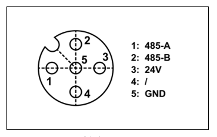
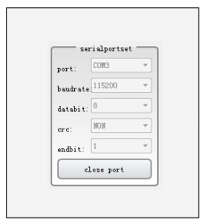

Dodatek
========

.. toctree:: 
  :maxdepth: 5

Dodatek 1: Błędy kontrolera ruchu i sposoby ich rozwiązywania
-------------------------------------------------------------------

.. csv-table:: 
   :header: "Główny kod błędu", "Podrzędny kod błędu", "Opis"
   :widths: 20, 10, 70

   "0-Brak błędu", "0", "Brak błędu"
   "1-Błąd punktu docelowego", "1", "Błąd punktu docelowego stawu, możliwy do zresetowania"
   "1-Błąd punktu docelowego", "2", "Błąd punktu docelowego linii (w tym niezgodność narzędzia), możliwy do zresetowania"
   "1-Błąd punktu docelowego", "3", "Błąd punktu pośredniego łuku (w tym niezgodność narzędzia), możliwy do zresetowania"
   "1-Błąd punktu docelowego", "4", "Błąd punktu docelowego łuku (w tym niezgodność narzędzia), możliwy do zresetowania"
   "1-Błąd punktu docelowego", "5", "Odstęp między punktami łuku jest zbyt mały, możliwy do zresetowania"
   "1-Błąd punktu docelowego", "6", "Błąd punktu pośredniego 1 okręgu/linii śrubowej (w tym niezgodność narzędzia), możliwy do zresetowania"
   "1-Błąd punktu docelowego", "7", "Błąd punktu pośredniego 2 okręgu/linii śrubowej (w tym niezgodność narzędzia), możliwy do zresetowania"
   "1-Błąd punktu docelowego", "8", "Błąd punktu pośredniego 3 okręgu/linii śrubowej (w tym niezgodność narzędzia), możliwy do zresetowania"
   "1-Błąd punktu docelowego", "9", "Odstęp między punktami okręgu/linii śrubowej jest zbyt mały, możliwy do zresetowania"
   "1-Błąd punktu docelowego", "10", "Błąd punktu docelowego TPD, możliwy do zresetowania"
   "1-Błąd punktu docelowego", "11", "Narzędzie w instrukcji TPD jest niezgodne z bieżącym narzędziem, możliwy do zresetowania"
   "1-Błąd punktu docelowego", "12", "Odchylenie między bieżącą instrukcją TPD a punktem początkowym następnej instrukcji jest zbyt duże, możliwy do zresetowania"
   "1-Błąd punktu docelowego", "13", "Błąd przełączania narzędzia wewnętrznego/zewnętrznego, możliwy do zresetowania"
   "1-Błąd punktu docelowego", "14", "Błąd punktu początkowego nowej linii śrubowej, możliwy do zresetowania"
   "1-Błąd punktu docelowego", "15", "Błąd punktu docelowego nowej krzywej średniej, możliwy do zresetowania"
   "1-Błąd punktu docelowego", "17", "Przekroczenie limitu instrukcji stawu PTP, możliwy do zresetowania"
   "1-Błąd punktu docelowego", "18", "Przekroczenie limitu instrukcji stawu TPD, możliwy do zresetowania"
   "1-Błąd punktu docelowego", "19", "Przekroczenie limitu instrukcji stawu LIN/ARC, możliwy do zresetowania"
   "1-Błąd punktu docelowego", "20", "Przekroczenie prędkości w przestrzeni kartezjańskiej, niemożliwy do zresetowania"
   "1-Błąd punktu docelowego", "21", "Przekroczenie limitu momentu obrotowego w przestrzeni stawów, możliwy do zresetowania"
   "1-Błąd punktu docelowego", "22", "Przekroczenie limitu instrukcji stawu JOG, możliwy do zresetowania"
   "1-Błąd punktu docelowego", "23", "Przekroczenie limitu prędkości instrukcji w przestrzeni stawu dla osi 1, możliwy do zresetowania"
   "1-Błąd punktu docelowego", "24", "Przekroczenie limitu prędkości instrukcji w przestrzeni stawu dla osi 2, możliwy do zresetowania"
   "1-Błąd punktu docelowego", "25", "Przekroczenie limitu prędkości instrukcji w przestrzeni stawu dla osi 3, możliwy do zresetowania"
   "1-Błąd punktu docelowego", "26", "Przekroczenie limitu prędkości instrukcji w przestrzeni stawu dla osi 4, możliwy do zresetowania"
   "1-Błąd punktu docelowego", "27", "Przekroczenie limitu prędkości instrukcji w przestrzeni stawu dla osi 5, możliwy do zresetowania"
   "1-Błąd punktu docelowego", "28", "Przekroczenie limitu prędkości instrukcji w przestrzeni stawu dla osi 6, możliwy do zresetowania"
   "1-Błąd punktu docelowego", "29", "Przekroczenie limitu prędkości sprzężenia zwrotnego stawu, niemożliwy do zresetowania"
   "1-Błąd punktu docelowego", "30", "Zbyt duże odchylenie między instrukcją a sprzężeniem zwrotnym stawu, niemożliwy do zresetowania, wymagany restart"
   "1-Błąd punktu docelowego", "31", "Błąd punktu docelowego DMP (w tym niezgodność narzędzia), możliwy do zresetowania"
   "1-Błąd punktu docelowego", "33", "Zmiana konfiguracji stawu w następnej instrukcji (następna instrukcja ma osobliwą pozycję, użyj instrukcji PTP lub zmień następny punkt docelowy), możliwy do zresetowania"
   "1-Błąd punktu docelowego", "34", "Zmiana konfiguracji stawu w bieżącej instrukcji (następna instrukcja ma osobliwą pozycję, użyj instrukcji PTP lub zmień następny punkt docelowy), możliwy do zresetowania"
   "1-Błąd punktu docelowego", "35", "Przekroczenie limitu prędkości stawu w instrukcji LIN, możliwy do zresetowania"
   "1-Błąd punktu docelowego", "36", "Przekroczenie progu prędkości adaptacyjnej w instrukcji LIN, możliwy do zresetowania"
   "1-Błąd punktu docelowego", "37", "Nieosiągalny punkt w trajektorii, możliwy do zresetowania"
   "1-Błąd punktu docelowego", "38", "Nieosiągalny punkt w trajektorii - osobliwa pozycja, możliwy do zresetowania"
   "1-Błąd punktu docelowego", "49", "Błąd instrukcji, pomiędzy ARCSTART i ARCEND dozwolone są tylko instrukcje LIN i ARC, możliwy do zresetowania"
   "1-Błąd punktu docelowego", "50", "Błąd instrukcji, pomiędzy WEAVESTART i WEAVEEND dozwolone są tylko instrukcje LIN i ARC, możliwy do zresetowania"
   "1-Błąd punktu docelowego", "51", "Błąd parametrów spawania z oscylacją, możliwy do zresetowania"
   "1-Błąd punktu docelowego", "52", "Odstęp między punktami spawania z oscylacją jest zbyt mały, możliwy do zresetowania"
   "1-Błąd punktu docelowego", "53", "Nieosiągalny punkt w trajektorii oscylacji - osobliwa pozycja, możliwy do zresetowania"
   "1-Błąd punktu docelowego", "54", "Nieosiągalny punkt w trajektorii oscylacji - przekroczenie limitu instrukcji stawu, możliwy do zresetowania"
   "1-Błąd punktu docelowego", "55", "Nieosiągalny punkt w trajektorii oscylacji - błąd planowania (zgodność kierunku Z narzędzia z kierunkiem X ruchu do przodu), możliwy do zresetowania"
   "1-Błąd punktu docelowego", "56", "Nieosiągalny punkt w trajektorii oscylacji - błąd punktu pośredniego łuku, możliwy do zresetowania"
   "1-Błąd punktu docelowego", "65", "Zbyt duże odchylenie instrukcji czujnika laserowego, możliwy do zresetowania"
   "1-Błąd punktu docelowego", "66", "Przerwanie instrukcji czujnika laserowego, przedwczesne zakończenie śledzenia spoiny, możliwy do zresetowania"
   "1-Błąd punktu docelowego", "81", "Przekroczenie limitu prędkości instrukcji zewnętrznej osi, możliwy do zresetowania"
   "1-Błąd punktu docelowego", "82", "Zbyt duże odchylenie między instrukcją a sprzężeniem zwrotnym zewnętrznej osi, niemożliwy do zresetowania, wymagany powrót do zera lub restart"
   "1-Błąd punktu docelowego", "83", "Nieprawidłowa komunikacja z rozszerzonym urządzeniem peryferyjnym (zewnętrzna oś/IO), możliwy do zresetowania"
   "1-Błąd punktu docelowego", "84", "Nieprawidłowa utrata pakietów w komunikacji z rozszerzonym urządzeniem peryferyjnym (zewnętrzna oś/IO), możliwy do zresetowania"
   "1-Błąd punktu docelowego", "97", "Śledzenie taśmociągu - zbyt duża zmiana orientacji między punktem początkowym a punktem odniesienia, możliwy do zresetowania"
   "1-Błąd punktu docelowego", "113", "Sterowanie stałą siłą - przekroczenie maksymalnej odległości regulacji w kierunku X, możliwy do zresetowania"
   "1-Błąd punktu docelowego", "114", "Sterowanie stałą siłą - przekroczenie maksymalnej odległości regulacji w kierunku Y, możliwy do zresetowania"
   "1-Błąd punktu docelowego", "115", "Sterowanie stałą siłą - przekroczenie maksymalnej odległości regulacji w kierunku Z, możliwy do zresetowania"
   "1-Błąd punktu docelowego", "116", "Sterowanie stałą siłą - przekroczenie maksymalnego kąta regulacji w kierunku RX, możliwy do zresetowania"
   "1-Błąd punktu docelowego", "117", "Sterowanie stałą siłą - przekroczenie maksymalnego kąta regulacji w kierunku RY, możliwy do zresetowania"
   "1-Błąd punktu docelowego", "118", "Sterowanie stałą siłą - przekroczenie maksymalnego kąta regulacji w kierunku RZ, możliwy do zresetowania"
   "1-Błąd punktu docelowego", "119", "Błąd danych zewnętrznego czujnika, możliwy do zresetowania"
   "1-Błąd punktu docelowego", "120", "Nieudana próba ruchu eksploracyjnego po linii śrubowej, możliwy do zresetowania"
   "1-Błąd punktu docelowego", "121", "Nieudany ruch obrotowy z wsuwaniem, możliwy do zresetowania"
   "1-Błąd punktu docelowego", "122", "Nieudany ruch liniowy z wsuwaniem, możliwy do zresetowania"
   "1-Błąd punktu docelowego", "123", "Nieudany ruch lokalizacji powierzchni, możliwy do zresetowania"
   "1-Błąd punktu docelowego", "129", "Przekroczenie maksymalnej liczby punktów rejestracji momentu obrotowego, możliwy do zresetowania"
   "1-Błąd punktu docelowego", "130", "Błąd przełączania prędkości, możliwy do zresetowania"
   "1-Błąd punktu docelowego", "147", "Błąd śledzenia ogniska, możliwy do zresetowania"
   "1-Błąd punktu docelowego", "148", "Przekroczenie limitu prędkości orientacji, możliwy do zresetowania"
   "1-Błąd punktu docelowego", "149", "Nieprawidłowe sprzężenie zwrotne słowa stanu stawu, możliwy do zresetowania"
   "2-Awaria napędu", "1", "Awaria napędu osi 1, niemożliwy do zresetowania"
   "2-Awaria napędu", "2", "Awaria napędu osi 2, niemożliwy do zresetowania"
   "2-Awaria napędu", "3", "Awaria napędu osi 3, niemożliwy do zresetowania"
   "2-Awaria napędu", "4", "Awaria napędu osi 4, niemożliwy do zresetowania"
   "2-Awaria napędu", "5", "Awaria napędu osi 5, niemożliwy do zresetowania"
   "2-Awaria napędu", "6", "Awaria napędu osi 6, niemożliwy do zresetowania"
   "3-Błąd przekroczenia miękkiego limitu", "1", "Błąd przekroczenia miękkiego limitu osi 1, możliwy do zresetowania"
   "3-Błąd przekroczenia miękkiego limitu", "2", "Błąd przekroczenia miękkiego limitu osi 2, możliwy do zresetowania"
   "3-Błąd przekroczenia miękkiego limitu", "3", "Błąd przekroczenia miękkiego limitu osi 3, możliwy do zresetowania"
   "3-Błąd przekroczenia miękkiego limitu", "4", "Błąd przekroczenia miękkiego limitu osi 4, możliwy do zresetowania"
   "3-Błąd przekroczenia miękkiego limitu", "5", "Błąd przekroczenia miękkiego limitu osi 5, możliwy do zresetowania"
   "3-Błąd przekroczenia miękkiego limitu", "6", "Błąd przekroczenia miękkiego limitu osi 6, możliwy do zresetowania"
   "4-Błąd kolizji", "1", "Błąd kolizji osi 1, możliwy do zresetowania"
   "4-Błąd kolizji", "2", "Błąd kolizji osi 2, możliwy do zresetowania"
   "4-Błąd kolizji", "3", "Błąd kolizji osi 3, możliwy do zresetowania"
   "4-Błąd kolizji", "4", "Błąd kolizji osi 4, możliwy do zresetowania"
   "4-Błąd kolizji", "5", "Błąd kolizji osi 5, możliwy do zresetowania"
   "4-Błąd kolizji", "6", "Błąd kolizji osi 6, możliwy do zresetowania"
   "4-Błąd kolizji", "7", "Błąd kolizji końcówki, możliwy do zresetowania"
   "5-Błąd liczby aktywnych stacji podrzędnych", "1", "Błąd liczby aktywnych stacji podrzędnych, niemożliwy do zresetowania"
   "6-Błąd stacji podrzędnej", "1", "Utrata połączenia ze stacją podrzędną, niemożliwy do zresetowania"
   "6-Błąd stacji podrzędnej", "2", "Stan stacji podrzędnej niezgodny z ustawioną wartością, niemożliwy do zresetowania"
   "6-Błąd stacji podrzędnej", "3", "Stacja podrzędna nie skonfigurowana, niemożliwy do zresetowania"
   "6-Błąd stacji podrzędnej", "4", "Błąd konfiguracji stacji podrzędnej, niemożliwy do zresetowania"
   "6-Błąd stacji podrzędnej", "5", "Błąd inicjalizacji stacji podrzędnej, niemożliwy do zresetowania"
   "6-Błąd stacji podrzędnej", "6", "Błąd inicjalizacji komunikacji e-mail stacji podrzędnej, niemożliwy do zresetowania"
   "7-Błąd IO", "1", "Błąd kanału, możliwy do zresetowania"
   "7-Błąd IO", "2", "Błąd wartości, możliwy do zresetowania"
   "7-Błąd IO", "3", "Przekroczenie czasu oczekiwania WaitDI, możliwy do zresetowania"
   "7-Błąd IO", "4", "Przekroczenie czasu oczekiwania WaitAI, możliwy do zresetowania"
   "7-Błąd IO", "5", "Przekroczenie czasu oczekiwania WaitAxleDI, możliwy do zresetowania"
   "7-Błąd IO", "6", "Przekroczenie czasu oczekiwania WaitAxleAI, możliwy do zresetowania"
   "7-Błąd IO", "7", "Błąd funkcji skonfigurowanej dla kanału, możliwy do zresetowania"
   "7-Błąd IO", "8", "Przekroczenie czasu łuku początkowego, możliwy do zresetowania"
   "7-Błąd IO", "9", "Przekroczenie czasu łuku końcowego, możliwy do zresetowania"
   "7-Błąd IO", "10", "Przekroczenie czasu poszukiwania pozycji, możliwy do zresetowania"
   "7-Błąd IO", "11", "Przekroczenie czasu wykrywania IO taśmociągu, możliwy do zresetowania"
   "7-Błąd IO", "12", "Przekroczenie czasu oczekiwania WaitAuxDI, możliwy do zresetowania"
   "7-Błąd IO", "13", "Przekroczenie czasu oczekiwania WaitAuxAI, możliwy do zresetowania"
   "7-Błąd IO", "14", "Przekroczenie czasu poszukiwania pozycji drutu spawalniczego, możliwy do zresetowania"
   "8-Błąd chwytaka", "1", "Błąd przekroczenia czasu ruchu chwytaka, możliwy do zresetowania"
   "9-Błąd pliku", "1", "Błąd wersji pliku konfiguracyjnego zbt, błąd inicjalizacji - niemożliwy do zresetowania"
   "9-Błąd pliku", "2", "Nieudane ładowanie pliku konfiguracyjnego zbt, błąd inicjalizacji - niemożliwy do zresetowania"
   "9-Błąd pliku", "3", "Błąd wersji pliku konfiguracyjnego user, błąd inicjalizacji - niemożliwy do zresetowania"
   "9-Błąd pliku", "4", "Nieudane ładowanie pliku konfiguracyjnego user, błąd inicjalizacji - niemożliwy do zresetowania"
   "9-Błąd pliku", "5", "Błąd wersji pliku konfiguracyjnego exaxis, błąd inicjalizacji - niemożliwy do zresetowania"
   "9-Błąd pliku", "6", "Nieudane ładowanie pliku konfiguracyjnego exaxis, błąd inicjalizacji - niemożliwy do zresetowania"
   "9-Błąd pliku", "7", "Niezgodność modelu robota, wymagane ponowne ustawienie - niemożliwy do zresetowania"
   "9-Błąd pliku", "8", "Błąd wersji pliku konfiguracyjnego dhpara, błąd inicjalizacji - niemożliwy do zresetowania"
   "9-Błąd pliku", "9", "Nieudane ładowanie pliku konfiguracyjnego dhpara, błąd inicjalizacji - niemożliwy do zresetowania"
   "9-Błąd pliku", "10", "Model robota nie ustawiony - niemożliwy do zresetowania"
   "9-Błąd pliku", "11", "Błąd wersji pliku konfiguracyjnego load, błąd inicjalizacji - niemożliwy do zresetowania"
   "9-Błąd pliku", "12", "Nieudane ładowanie pliku konfiguracyjnego load, błąd inicjalizacji - niemożliwy do zresetowania"
   "9-Błąd pliku", "13", "Błąd wersji pliku konfiguracyjnego speed, błąd inicjalizacji - niemożliwy do zresetowania"
   "9-Błąd pliku", "14", "Nieudane ładowanie pliku konfiguracyjnego speed, błąd inicjalizacji - niemożliwy do zresetowania"
   "10-Osobliwa pozycja", "1", "Osobliwa pozycja"
   "11-Błąd komunikacji z napędem", "1", "Błąd komunikacji z napędem osi 1, niemożliwy do zresetowania"
   "11-Błąd komunikacji z napędem", "2", "Błąd komunikacji z napędem osi 2, niemożliwy do zresetowania"
   "11-Błąd komunikacji z napędem", "3", "Błąd komunikacji z napędem osi 3, niemożliwy do zresetowania"
   "11-Błąd komunikacji z napędem", "4", "Błąd komunikacji z napędem osi 4, niemożliwy do zresetowania"
   "11-Błąd komunikacji z napędem", "5", "Błąd komunikacji z napędem osi 5, niemożliwy do zresetowania"
   "11-Błąd komunikacji z napędem", "6", "Błąd komunikacji z napędem osi 6, niemożliwy do zresetowania"
   "12-Miękki limit zewnętrznej osi", "1", "Przekroczenie miękkiego limitu osi 1, możliwy do zresetowania"
   "12-Miękki limit zewnętrznej osi", "2", "Przekroczenie miękkiego limitu osi 2, możliwy do zresetowania"
   "12-Miękki limit zewnętrznej osi", "3", "Przekroczenie miękkiego limitu osi 3, możliwy do zresetowania"
   "12-Miękki limit zewnętrznej osi", "4", "Przekroczenie miękkiego limitu osi 4, możliwy do zresetowania"
   "13-Błąd parametrów ustawienia", "1", "Przekroczenie limitu numeru narzędzia, możliwy do zresetowania"
   "13-Błąd parametrów ustawienia", "2", "Błąd progu ukończenia pozycjonowania, możliwy do zresetowania"
   "13-Błąd parametrów ustawienia", "3", "Błąd poziomu kolizji, możliwy do zresetowania"
   "13-Błąd parametrów ustawienia", "4", "Błąd masy ładunku, możliwy do zresetowania"
   "13-Błąd parametrów ustawienia", "5", "Błąd X środka ciężkości ładunku, możliwy do zresetowania"
   "13-Błąd parametrów ustawienia", "6", "Błąd Y środka ciężkości ładunku, możliwy do zresetowania"
   "13-Błąd parametrów ustawienia", "7", "Błąd Z środka ciężkości ładunku, możliwy do zresetowania"
   "13-Błąd parametrów ustawienia", "8", "Błąd czasu filtrowania DI, możliwy do zresetowania"
   "13-Błąd parametrów ustawienia", "9", "Błąd czasu filtrowania AxleDI, możliwy do zresetowania"
   "13-Błąd parametrów ustawienia", "10", "Błąd czasu filtrowania AI, możliwy do zresetowania"
   "13-Błąd parametrów ustawienia", "11", "Błąd czasu filtrowania AxleAI, możliwy do zresetowania"
   "13-Błąd parametrów ustawienia", "12", "Błąd zakresu wysokiego/niskiego poziomu DI, możliwy do zresetowania"
   "13-Błąd parametrów ustawienia", "13", "Błąd zakresu wysokiego/niskiego poziomu DO, możliwy do zresetowania"
   "13-Błąd parametrów ustawienia", "14", "Przekroczenie limitu numeru przedmiotu, możliwy do zresetowania"
   "13-Błąd parametrów ustawienia", "15", "Przekroczenie limitu numeru zewnętrznej osi, możliwy do zresetowania"
   "13-Błąd parametrów ustawienia", "16", "Błąd kanału enkodera taśmociągu, możliwy do zresetowania"
   "13-Błąd parametrów ustawienia", "17", "Błąd numeru osi przedmiotu taśmociągu, możliwy do zresetowania"

Załącznik 2: Tabela Usterek Szafy Sterowniczej Szerokiego Napięcia
---------------------------------------------------------------------------------

.. list-table::
   :widths: 20 40 80
   :header-rows: 0
   :align: center

   * - **Kod Usterki**
     - **Nazwa Usterki**
     - **Metoda Postępowania**

   * - 3
     - MCU pomocniczy offline
     - | 1. Ponownie wgrać oprogramowanie MCU pomocniczego
       | 2. Naprawić MCU pomocniczy lub wymienić szafę sterowniczą  

   * - 4
     - Niezgodność wejścia awaryjnego MCU głównego i pomocniczego
     - | 1. Sprawdzić wiązkę przycisku awaryjnego skrzynki przycisków lub wymienić zespół skrzynki przycisków
       | 2. Sprawdzić dwie wiązki zwarciowe przycisku awaryjnego na zaciskach szafy sterowniczej  
       | 3. Jeśli usterka nadal występuje, naprawić lub wymienić szafę sterowniczą 

   * - 5
     - Niezgodność wejścia bezpieczeństwa MCU głównego i pomocniczego
     - | 1. Sprawdzić dwie wiązki zwarciowe bezpieczeństwa na zaciskach szafy sterowniczej
       | 2. Jeśli usterka nadal występuje, naprawić lub wymienić szafę sterowniczą

   * - 6
     - Niezgodność wejścia awaryjnego i przycisku zezwalającego 3-pozycyjnego MCU głównego i pomocniczego
     - | 1. Sprawdzić przełącznik zezwalający 3-pozycyjny na panelu operatorskim i wiązkę panelu operatorskiego
       | 2. Wymienić zespół panelu operatorskiego
       | 3. Sprawdzić, czy Web jest w trybie panelu operatorskiego i czy panel operatorski jest podłączony
       | 4. Jeśli usterka nadal występuje, naprawić lub wymienić szafę sterowniczą

   * - 7
     - Niezgodność wejścia/wyjścia STO głównego
     - | 1. Sprawdzić, czy wtyk przewodu ciężkiego szafy sterowniczej i wiązka STO są pewnie podłączone
       | 2. Sprawdzić, czy napęd obsługuje funkcję STO
       | 3. Dla konfiguracji certyfikowana szafa sterownicza szerokiego napięcia + robot niecertyfikowany, sprawdzić czy włączono tryb bezpieczeństwa funkcjonalnego
       | 4. Certyfikowana szafa sterownicza szerokiego napięcia w trybie certyfikacji włącza funkcję wykrywania usterek STO; robot niecertyfikowany nie obsługuje trybu bezpieczeństwa funkcjonalnego
       | 5. Jeśli usterka nadal występuje, naprawić lub wymienić szafę sterowniczą

   * - 8
     - Niezgodność wejścia/wyjścia STO pomocniczego
     - | 1. Sprawdzić, czy wtyk przewodu ciężkiego szafy sterowniczej i wiązka STO są pewnie podłączone
       | 2. Sprawdzić, czy napęd obsługuje funkcję STO
       | 3. Dla konfiguracji certyfikowana szafa sterownicza szerokiego napięcia + robot niecertyfikowany, sprawdzić czy włączono tryb bezpieczeństwa funkcjonalnego
       | 4. Certyfikowana szafa sterownicza szerokiego napięcia w trybie certyfikacji włącza funkcję wykrywania usterek STO; robot niecertyfikowany nie obsługuje trybu bezpieczeństwa funkcjonalnego
       | 5. Jeśli usterka nadal występuje, naprawić lub wymienić szafę sterowniczą

   * - 9
     - MCU główny wykrywa niezgodność wejścia/wyjścia przekaźnika 48V
     - | 1. Sprawdzić wejście i sprzężenie zwrotne przekaźnika wymuszonego w szafie sterowniczej
       | 2. Sprawdzić, czy przekaźnik 48V w szafie sterowniczej nie jest zablokowany
       | 3. Sprawdzić, czy obwód sprzężenia zwrotnego przekaźnika 48V w szafie sterowniczej działa prawidłowo
       | 4. Jeśli usterka nadal występuje, naprawić lub wymienić szafę sterowniczą

   * - 10
     - MCU pomocniczy wykrywa niezgodność wejścia/wyjścia przekaźnika 48V
     - | 1. Sprawdzić wejście i sprzężenie zwrotne przekaźnika wymuszonego w szafie sterowniczej
       | 2. Sprawdzić, czy przekaźnik 48V w szafie sterowniczej nie jest zablokowany
       | 3. Sprawdzić, czy obwód sprzężenia zwrotnego przekaźnika 48V w szafie sterowniczej działa prawidłowo
       | 4. Jeśli usterka nadal występuje, naprawić lub wymienić szafę sterowniczą

   * - \
     - Szafa sterownicza wyłączona, brak napięcia 48V
     - | 1. Sprawdzić obwód układu zabezpieczenia przed zwarciem 24V i sprawdzić, czy nie ma zwarć na 24V
       | 2. Sprawdzić wiązki zwarciowe zacisków wejścia awaryjnego i wejścia bezpieczeństwa
       | 3. Sprawdzić, czy płytka pomocnicza zasilania 24V w szafie sterowniczej dostarcza napięcie 24V
       | 4. Jeśli usterka nadal występuje, naprawić lub wymienić szafę sterowniczą

Dodatek 3: Tabela kodów awarii serwonapędu
------------------------------------------------

.. list-table::
   :widths: 20 40 80
   :header-rows: 0
   :align: center

   * - **Kod awarii**
     - **Nazwa awarii**
     - **Sposób rozwiązania**

   * - 1
     - Awaria przetężenia programowego
     - | 1. Sprawdź, czy obciążenie lub opór stawu nie wzrosły lub nie są nieprawidłowe
       | 2. Jeśli awaria nie zostanie usunięta, napraw lub wymień płytę sterującą napędu

   * - 2
     - Awaria przepięcia
     - Zmniejsz prędkość lub przyspieszenie robota

   * - 3
     - Awaria napięcia
     - | 1. Sprawdź, czy napięcie wyjściowe zasilacza 48V w skrzynce sterowniczej jest nieprawidłowe
       | 2. Sprawdź, czy płyta sterująca napędu i obudowa stawu nie są zwarte
       | 3. Jeśli awaria nie zostanie usunięta, napraw lub wymień płytę sterującą napędu

   * - 4
     - Awaria przegrzania
     - Zmniejsz obciążenie robota lub zmniejsz prędkość robota

   * - 5
     - Awaria przeciążenia
     - Zmniejsz obciążenie robota lub zmniejsz prędkość robota

   * - 6
     - Awaria nadmiernej prędkości
     - | 1. Sprawdź, czy śruba ustalająca między zespołem enkodera magnetycznego a wałem silnika nie jest poluzowana
       | 2. Wykonaj ponownie zerowanie enkodera
       | 3. Jeśli awaria nie zostanie usunięta, napraw lub wymień zespół enkodera magnetycznego

   * - 7
     - Awaria nieprawidłowego parametru
     - Napraw lub wymień płytę sterującą napędu

   * - 8
     - Awaria "lotu" (niekontrolowany ruch)
     - | 1. Sprawdź, czy śruba ustalająca między zespołem enkodera magnetycznego a wałem silnika nie jest poluzowana
       | 2. Wykonaj ponownie zerowanie enkodera
       | 3. Jeśli awaria nie zostanie usunięta, napraw lub wymień zespół enkodera magnetycznego

   * - 9
     - Awaria błędu pozycji
     - | 1. Sprawdź, czy obciążenie lub opór stawu nie wzrosły lub nie są nieprawidłowe
       | 2. Jeśli awaria nie zostanie usunięta, napraw lub wymień płytę sterującą napędu

   * - 10
     - Awaria przepełnienia pozycji
     - | 1. Sprawdź, czy twardy ogranicznik nie jest poluzowany
       | 2. Wykonaj ponownie zerowanie robota

   * - 11
     - Awaria przetężenia sprzętowego
     - Napraw lub wymień płytę sterującą napędu

   * - 12
     - Awaria blokady napędu
     - Nieaktywowane

   * - 13
     - Awaria blokowania silnika
     - | 1. Sprawdź, czy elektromagnes hamulca jest zaciągnięty
       | 2. Sprawdź, czy nie uderzono w twardy ogranicznik
       | 3. Jeśli awaria nie zostanie usunięta, napraw lub wymień płytę sterującą napędu

   * - 14
     - Awaria zasilania mocy
     - Nieaktywowane

   * - 15
     - Awaria STO
     - Nieaktywowane

   * - 16
     - Awaria zerowania AD prądu fazowego
     - Napraw lub wymień płytę sterującą napędu

   * - 17
     - Awaria EEPROM
     - Napraw lub wymień płytę sterującą napędu

   * - 18
     - Awaria Halla
     - | 1. Sprawdź, czy wiązka Halla jest dobrze podłączona, czy nie ma zwarcia lub przerwy
       | 2. Jeśli awaria nie zostanie usunięta, napraw lub wymień staw

   * - 19
     - Awaria enkodera
     - Napraw lub wymień zespół enkodera magnetycznego

   * - 20
     - Awaria zerowania enkodera
     - | 1. Wykonaj ponownie zerowanie enkodera
       | 2. Jeśli awaria nie zostanie usunięta, napraw lub wymień zespół enkodera magnetycznego
   
   * - 21
     - Awaria utraty sygnału Z enkodera
     - Nieaktywowane

   * - 22
     - Awaria zliczania enkodera
     - Nieaktywowane

   * - 23
     - Awaria przepełnienia danych wieloobrotowych enkodera
     - Nieaktywowane

   * - 24
     - Awaria zegara zewnętrznego
     - Napraw lub wymień płytę sterującą napędu

   * - 25
     - Awaria sekwencji faz UVW
     - Nieaktywowane

   * - 26
     - Awaria FPGA
     - Nieaktywowane

   * - 27
     - Awaria powrotu do zera
     - Nieaktywowane

   * - 28
     - Awaria enkodera magnetycznego
     - | 1. Sprawdź, czy śruba ustalająca między zespołem enkodera magnetycznego a wałem silnika nie jest poluzowana
       | 2. Jeśli awaria nie zostanie usunięta, napraw lub wymień zespół enkodera magnetycznego

   * - 29
     - Awaria przerwy w przewodzie zasilania silnika
     - | 1. Sprawdź, czy przewód zasilania silnika jest dobrze podłączony, czy nie ma zwarcia lub przerwy
       | 2. Jeśli awaria nie zostanie usunięta, napraw lub wymień płytę sterującą napędu

   * - 30
     - Awaria EtherCAT
     - | 1. Sprawdź, czy kabel sieciowy jest dobrze podłączony, czy nie ma zwarcia lub przerwy
       | 2. Jeśli awaria nie zostanie usunięta, napraw lub wymień płytę sterującą napędu

   * - 31
     - Awaria EtherCAT_SM_DOG
     - | 1. Sprawdź, czy kabel sieciowy jest dobrze podłączony, czy nie ma zwarcia lub przerwy
       | 2. Jeśli awaria nie zostanie usunięta, napraw lub wymień płytę sterującą napędu

   * - 32
     - Awaria EtherCAT_FATALSYNC
     - | 1. Sprawdź, czy kabel sieciowy jest dobrze podłączony, czy nie ma zwarcia lub przerwy
       | 2. Jeśli awaria nie zostanie usunięta, napraw lub wymień płytę sterującą napędu

   * - 33
     - Awaria EtherCAT_SYNC
     - | 1. Sprawdź, czy kabel sieciowy jest dobrze podłączony, czy nie ma zwarcia lub przerwy
       | 2. Jeśli awaria nie zostanie usunięta, napraw lub wymień płytę sterującą napędu

   * - 34
     - Awaria EtherCAT_RFT
     - | 1. Sprawdź, czy kabel sieciowy jest dobrze podłączony, czy nie ma zwarcia lub przerwy
       | 2. Jeśli awaria nie zostanie usunięta, napraw lub wymień płytę sterującą napędu

   * - 35
     - Awaria adresu osi napędu
     - | 1. Wykonaj ponownie konfigurację adresu osi napędu
       | 2. Jeśli awaria nie zostanie usunięta, napraw lub wymień płytę sterującą napędu

   * - 36
     - Awaria zerowania robota
     - | 1. Wykonaj ponownie zerowanie robota
       | 2. Najpierw użyj JLINK, aby wymazać FLASH, a następnie pobierz ponownie program i wykonaj zerowanie
       | 3. Jeśli awaria nie zostanie usunięta, napraw lub wymień płytę sterującą napędu

   * - 37
     - Awaria komunikacji enkodera
     - | 1. Sprawdź, czy wiązka enkodera jest dobrze podłączona, czy nie ma zwarcia lub przerwy
       | 2. Jeśli awaria nie zostanie usunięta, napraw lub wymień zespół enkodera magnetycznego

   * - 40
     - Awaria modułu enkodera magnetycznego - błąd zerowania
     - | 1. Wykonaj ponownie zerowanie zespołu enkodera magnetycznego
       | 2. Jeśli awaria nie zostanie usunięta, napraw lub wymień zespół enkodera magnetycznego

   * - 41
     - Awaria modułu enkodera magnetycznego - błąd wieloobrotowy
     - | 1. Sprawdź, czy śruba ustalająca między zespołem enkodera magnetycznego a wałem silnika nie jest poluzowana
       | 2. Jeśli awaria nie zostanie usunięta, napraw lub wymień zespół enkodera magnetycznego

   * - 42
     - Awaria modułu enkodera magnetycznego - awaria małego enkodera wieloobrotowego
     - | 1. Sprawdź, czy układ małego enkodera wieloobrotowego nie jest nieprawidłowy
       | 2. Jeśli awaria nie zostanie usunięta, napraw lub wymień zespół enkodera magnetycznego

   * - 43
     - Awaria modułu enkodera magnetycznego - awaria dużego enkodera wieloobrotowego
     - | 1. Sprawdź, czy układ dużego enkodera wieloobrotowego nie jest nieprawidłowy
       | 2. Jeśli awaria nie zostanie usunięta, napraw lub wymień zespół enkodera magnetycznego

   * - 44
     - Awaria modułu enkodera magnetycznego - awaria enkodera pojedynczego obrotu
     - | 1. Sprawdź, czy układ enkodera pojedynczego obrotu nie jest nieprawidłowy
       | 2. Jeśli awaria nie zostanie usunięta, napraw lub wymień zespół enkodera magnetycznego

   * - 45
     - Awaria modułu enkodera magnetycznego - awaria enkodera optycznego
     - | 1. Sprawdź, czy tarcza enkodera optycznego nie jest zabrudzona lub źle przyklejona
       | 2. Jeśli awaria nie zostanie usunięta, napraw lub wymień zespół enkodera magnetycznego

   * - 46
     - Błąd konfiguracji typu robota
     - | 1. Bez wyłączania zasilania sprawdzić numer wersji oprogramowania napędu z usterką
       | 2. Ponownie skonfigurować typ robota
       | 3. Jeśli usterka nadal występuje, wymienić lub naprawić płytkę napędu

   * - 47
     - Błąd wykrywania napięcia hamulca
     - | 1. Sprawdzić, czy okablowanie hamulca jest nieprawidłowe
       | 2. Sprawdzić, czy obwód hamulca jest nieprawidłowy

   * - 50
     - Błąd polecenia pozycji
     - | 1. Sprawdzić, czy polecenie pozycji wysłane przez komputer nadrzędny (kontroler) jest nieprawidłowe (lub mutacja polecenia pozycji)

   * - 51
     - Błąd modułu enkodera magnetycznego - błąd enkodera optycznego
     - | 1. Sprawdzić, czy okablowanie czujnika momentu obrotowego jest nieprawidłowe
       | 2. Jeśli usterka nadal występuje, naprawić lub wymienić czujnik momentu obrotowego

Dodatek 4: Aktualizacja 485 płyty końcowej
------------------------------------------------

Podczas użytkowania w terenie może zaistnieć konieczność aktualizacji oprogramowania sprzętowego w celu spełnienia nowych wymagań. Dostarczony zostanie nowy plik aktualizacji (XX_XX_MAIN.bin). Aktualizacja płyty końcowej odbywa się przez interfejs 485 (wymagany jest moduł USB na 485). Kroki aktualizacji są następujące:

**Krok 1: Podłączenie 485**, Na końcu robota znajduje się 5-stykowe złącze komunikacyjne typu lotniczego. Rozmieszczenie pinów złącza lotniczego oraz opis pinów przedstawiono na Wykresie 1. Podłącz 485-A i 485-B na końcu robota odpowiednio do A i B narzędzia USB-485 za pomocą skrętki.

.. centered:: Wykres 18.3-1 Rozmieszczenie pinów złącza lotniczego

**Krok 2: Połączenie sprzętowe**, Podłącz końcówkę USB narzędzia USB-485 do komputera PC. W Menedżerze urządzeń komputera PC, jeśli narzędzie USB-485 zostanie rozpoznane, pojawi się następujący interfejs.

.. figure:: appendix/002.png
   :align: center
   :width: 6in

.. centered:: Wykres 18.3-2 Opis rozpoznawania portu USB-485

**Krok 3: Narzędzie do aktualizacji**, Po zakończeniu podłączania otwórz "Asystenta portu szeregowego FAIRINO", kliknij przycisk "Płyta końcowa", w funkcji "Ustawienia parametrów portu szeregowego" wybierz rozpoznany powyżej port szeregowy, prędkość 115200, 8 bitów danych, brak bitu parzystości, 1 bit stopu, a następnie otwórz port szeregowy. Po pomyślnym wykonaniu pojawi się komunikat "Port szeregowy otwarty pomyślnie".

.. centered:: Wykres 18.3-3 Ustawienia parametrów portu szeregowego

**Krok 4: Aktualizacja oprogramowania sprzętowego**, Wybierz "Płyta końcowa", kliknij "Aktualizacja oprogramowania sprzętowego", jak pokazano na wykresie:

.. figure:: appendix/004.png
   :align: center
   :width: 6in

.. centered:: Wykres 18.3-4 Aktualizacja oprogramowania sprzętowego płyty końcowej

-  Najpierw kliknij "Flash擦除" (Kasowanie Flash). Po pomyślnym skasowaniu, w obszarze odbierania danych pojawi się komunikat o pomyślnym skasowaniu.

-  Otwórz plik (plik do aktualizacji), wybierz ścieżkę przechowywania, jak poniżej. Po wybraniu nazwa pliku do aktualizacji pojawi się w polu wyświetlania nazwy pliku.

.. figure:: appendix/005.png
   :align: center
   :width: 6in

.. centered:: Wykres 18.3-5 Wybór pliku aktualizacji

-  Kliknij "发送文件" (Wyślij plik). Gdy pasek postępu wskaże 100%, oznacza to, że wysyłanie pliku aktualizacji zostało zakończone.

**Krok 5: Weryfikacja aktualizacji**, Uruchom ponownie system. W zakładce "Informacje konserwacyjne" wybierz "Zapytaj o wersję oprogramowania sprzętowego płyty końcowej". W "Obszarze odbierania danych" wyświetli się informacja o wersji oprogramowania sprzętowego. Jeśli jest zgodna z wersją pliku aktualizacji, aktualizacja powiodła się. W przeciwnym razie aktualizacja nie powiodła się.

.. figure:: appendix/006.png
   :align: center
   :width: 6in

.. centered:: Wykres 18.3-6 Zapytanie o wersję oprogramowania sprzętowego

Dodatek 5: Aktualizacja 485 skrzynki sterowniczej
-------------------------------------------------------

W skrzynce sterowniczej robota znajduje się interfejs "Zasilanie i komunikacja". Podłącz odpowiednio A i B narzędzia USB-485 do "485-A" i "485-B" tego interfejsu.

Proces aktualizacji jest taki sam jak w przypadku płyty końcowej, należy odpowiednio wybrać oprogramowanie. Nie będzie to tutaj powtarzane.

.. figure:: appendix/007.png
   :align: center
   :width: 4in

.. centered:: Wykres 18.4-1 Interfejs zasilania i komunikacji

Dodatek 6: Lista części zamiennych i części zużywających się
-----------------------------------------------------------------

.. list-table::
   :widths: 40 40 20
   :header-rows: 0
   :align: center

   * - **Część**
     - **Numer**
     - **Ilość**

   * - Śruba M8*30
     - 4.0.08.2006185
     - 4

   * - Sworzeń cylindryczny typ A 8*20
     - 4.5.00.2013076
     - 2

   * - Bezpiecznik 5x20 6A
     - 
     - 1