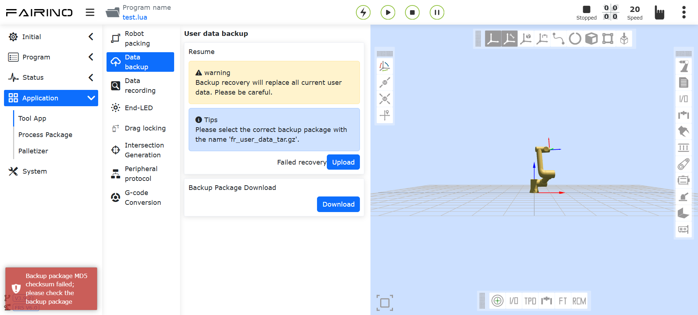
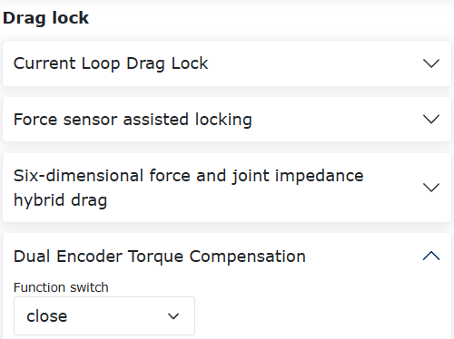
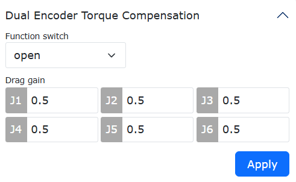
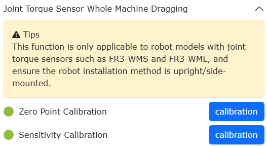
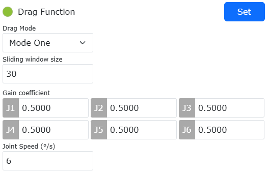
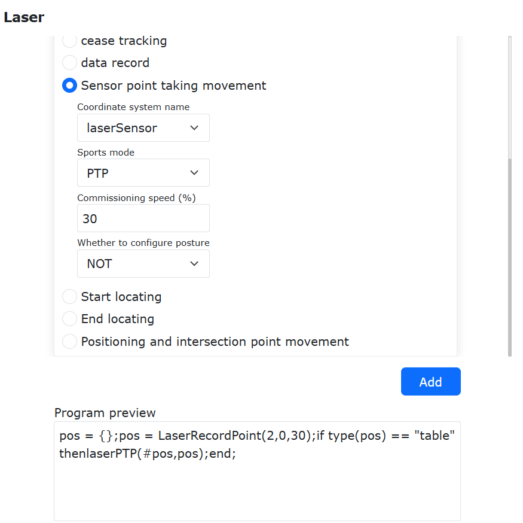

Narzędzia aplikacyjne
=======================

.. toctree:: 
   :maxdepth: 6

Pakowanie robota
-------------------

W menu "Aplikacje pomocnicze" -> "Narzędzia aplikacyjne" kliknij przycisk "Pakowanie robota", aby przejść do interfejsu pakowania robota jednym kliknięciem.

.. important:: 
   Przed wykonaniem operacji pakowania należy upewnić się, że środowisko i stan wokół robota są bezpieczne, aby zapobiec kolizji.
   
   Jeśli robot jest nowy, przed wysyłką z fabryki należy najpierw przejść do Ustawienia systemu - Ustawienia ogólne i wykonać przywrócenie ustawień fabrycznych.

**Krok 1**: Przed przeniesieniem do punktu pakowania najpierw przenieś robota do punktu zerowego.

**Krok 2**: Kliknij przycisk "Przenieś do punktu zerowego", aby potwierdzić, że mechaniczny punkt zerowy robota jest prawidłowy, a szczeliny każdego stawu są wyrównane jak w pomarańczowych kółkach na rysunku.

**Krok 3**: Kliknij przycisk "Przenieś do punktu pakowania". Robot zgodnie z kątami każdej osi według procesu pakowania przemieszcza się do punktu pakowania.

.. image:: application/001.png
   :width: 4in
   :align: center

.. centered:: Wykres 14.1‑1 Pakowanie robota jednym kliknięciem

Kopia zapasowa danych
------------------------

1. W menu "Aplikacje pomocnicze" -> "Narzędzia aplikacyjne" kliknij "Kopia zapasowa danych", aby przejść do interfejsu kopii zapasowej danych, jak pokazano na poniższym rysunku.

.. image:: application/002.png
   :width: 4in
   :align: center

.. centered:: Wykres 14.2‑1 Interfejs kopii zapasowej danych

2. Dane w pakiecie kopii zapasowej zawierają dane układu narzędzia, pliki konfiguracyjne systemu, dane punktów nauczania, programy użytkownika, programy szablonowe i pliki konfiguracyjne użytkownika. Gdy użytkownik chce przenieść dane związane z tym robotem do innego robota, może to szybko osiągnąć za pomocą tej funkcji.

Funkcja weryfikacji integralności pakietu kopii zapasowej
~~~~~~~~~~~~~~~~~~~~~~~~~~~~~~~~~~~~~~~~~~~~~~~~~~~~~~~~~~

Aby uniknąć potencjalnych zagrożeń bezpieczeństwa spowodowanych niezgodnościami konfiguracji, takimi jak sposób instalacji podczas importowania pakietu kopii zapasowej, dodano funkcję weryfikacji sumy kontrolnej MD5 pakietu kopii zapasowej oraz kluczowych parametrów podczas importowania.

Funkcja weryfikacji sumy kontrolnej MD5 pakietu kopii zapasowej
+++++++++++++++++++++++++++++++++++++++++++++++++++++++++++++++

Aby zapewnić integralność importowanego pakietu kopii zapasowej, po przesłaniu zostanie przeprowadzona weryfikacja sumy kontrolnej MD5 pakietu. Jeśli pakiet kopii zapasowej jest uszkodzony lub został nieprawidłowo zmodyfikowany, weryfikacja MD5 zakończy się niepowodzeniem, z następującym komunikatem:

.. centered:: Wykres 14.2‑2 Nieudana weryfikacja MD5

Funkcja weryfikacji kluczowych parametrów pakietu kopii zapasowej
+++++++++++++++++++++++++++++++++++++++++++++++++++++++++++++++++

Podczas importowania pakietu kopii zapasowej dodano funkcję weryfikacji. Pakiet kopii zapasowej musi zostać porównany z kluczowymi parametrami docelowego robota. Konkretne parametry przedstawiono w poniższej tabeli. Nieprawidłowe ustawienie tych parametrów może stwarzać pewne zagrożenia bezpieczeństwa. Tylko gdy są one całkowicie zgodne, pakiet kopii zapasowej może zostać prawidłowo zaimportowany.

Tabela 5 kluczowych parametrów do porównania:

.. list-table::
   :widths: 15 40 100
   :header-rows: 0
   :class: sheet-center

   * - **Numer**
     - **Kluczowy parametr**
     - **Znaczenie szczegółowe**

   * - 1
     - ROBOT_TYPE
     - Model robota

   * - 2
     - INSTALL_POS
     - Sposób montażu

   * - 3
     - INSTALL_YANGLE
     - Kąt nachylenia podstawy

   * - 4
     - INSTALL_ZANGLE
     - Kąt obrotu podstawy

   * - 5
     - NEW_TEACH_ENABLE
     - Konfiguracja dynamiki

W przypadku niezgodności wyświetlony zostanie błąd. Należy wtedy sprawdzić, czy kluczowe parametry w imporcie robota są zgodne z pakietem kopii zapasowej.

.. image:: application/003.png
   :width: 6in
   :align: center

.. centered:: Wykres 14.2‑3 Gdy kluczowe parametry są niezgodne, interfejs wyświetli błąd

Funkcja przywracania awarii/odcięcia zasilania
+++++++++++++++++++++++++++++++++++++++++++++++++++++++++++++++++++++++

W przypadku wystąpienia nieprawidłowości podczas importowania pakietu kopii zapasowej lub nieprawidłowego odcięcia zasilania podczas przywracania danych, które uniemożliwia prawidłowe zakończenie przywracania danych, w celu zapewnienia normalnego działania urządzenia, po ponownym włączeniu zasilania system automatycznie przywróci stan sprzed operacji.

Po ponownym włączeniu zasilania interfejs wyświetli komunikat: "Poprzednie przywracanie danych nie zostało ukończone. Zostało automatycznie przywrócone. Uruchom ponownie skrzynkę sterowniczą i wykonaj operację ponownie."

.. image:: application/049.png
   :width: 4in
   :align: center

.. centered:: Wykres 14.2‑4 Komunikat ostrzegawczy o przywróceniu po odcięciu zasilania i restarcie

Zgodność wersji pakietu kopii zapasowej
~~~~~~~~~~~~~~~~~~~~~~~~~~~~~~~~~~~~~~~~~~

Obecnie importowanie i przywracanie danych z pakietu kopii zapasowej obsługuje pakiety utworzone przez wersję oprogramowania ≥ v3.8.3. Pakiety kopii zapasowych dla sterowników serii QX i LA są uniwersalne.

Rejestracja danych 10s
------------------------

W menu "Aplikacje pomocnicze" -> "Narzędzia aplikacyjne" kliknij "Rejestracja danych 10s", aby przejść do interfejsu funkcji rejestracji danych 10s.

Najpierw wybierz typ rejestracji: rejestracja parametrów domyślnych i rejestracja parametrów samodzielnie wybranych. Rejestracja parametrów domyślnych to dane automatycznie ustawiane przez system. W przypadku rejestracji parametrów samodzielnie wybranych użytkownik może samodzielnie wybrać parametry do rejestracji. Maksymalna liczba parametrów to 15. Po wybraniu listy parametrów wybierz parametry do rejestracji i kliknij przycisk "Przesuń w prawo", aby skonfigurować parametry na liście parametrów. Kliknij "Rozpocznij rejestrację", aby robot rozpoczął rejestrację danych, kliknij "Zatrzymaj rejestrację", aby robot zatrzymał rejestrację danych, kliknij "Pobierz dane", aby pobrać dane z ostatnich 10 sekund.

.. image:: application/004.png
   :width: 4in
   :align: center

.. centered:: Wykres 14.3‑1 Rejestracja danych 10s

Końcowy LED
--------------

W menu "Aplikacje pomocnicze" -> "Narzędzia aplikacyjne" kliknij "Końcowy LED", aby przejść do interfejsu konfiguracji kolorów końcowego LED.

Można skonfigurować kolory LED na zielony, niebieski i błękitny. Użytkownik może skonfigurować kolory LED dla trybu automatycznego, ręcznego i przeciągania zgodnie z potrzebami. Różne tryby nie mogą być skonfigurowane z tym samym kolorem.

.. image:: application/005.png
   :width: 4in
   :align: center

.. centered:: Wykres 14.4‑1 Konfiguracja końcowego LED

Blokada przeciągania
----------------------

W menu "Aplikacje pomocnicze" -> "Narzędzia aplikacyjne" kliknij "Blokada przeciągania", aby przejść do interfejsu konfiguracji blokady nauczania przeciągania.

Dodano funkcję blokowania stopni swobody dla nauczania przeciągania. Gdy przełącznik funkcji nauczania przeciągania jest ustawiony na włączony, parametry stopni swobody są aktywne, gdy użytkownik przeciąga robota. Na przykład, gdy parametry są ustawione na X:10, Y:0, Z:10, RX:10, RY:10, RZ:10, podczas przeciągania robota w trybie przeciągania można ograniczyć ruch robota tylko do kierunku Y. Jeśli potrzebujesz utrzymać niezmienioną postawę robota podczas przeciągania, przesuwając tylko w kierunkach X, Y, Z, możesz ustawić X, Y, Z na 0, a RX, RY, RZ na 10.

.. image:: application/006.png
   :width: 4in
   :align: center

.. centered:: Wykres 14.5‑1 Konfiguracja blokady nauczania przeciągania

Normalne wyzwalanie ochrony przed kolizją przy przeciąganiu wspomaganym przez czujnik siły
~~~~~~~~~~~~~~~~~~~~~~~~~~~~~~~~~~~~~~~~~~~~~~~~~~~~~~~~~~~~~~~~~~~~~~~~~~~~~~~~~~~~~~~~~~~~~

Omówienie
++++++++++++++++++++++

Obecnie roboty FR nie mogą wyzwolić ochrony przed kolizją podczas przeciągania wspomaganego przez czujnik siły. Dodano możliwość wyzwalania ochrony przed kolizją podczas przeciągania wspomaganego przez czujnik siły, zwiększając bezpieczeństwo robota i zmniejszając ryzyko operacyjne.

Ochrona przed kolizją
++++++++++++++++++++++

**Krok 1**: Kliknij "Aplikacje pomocnicze" -> "Narzędzia aplikacyjne" -> "Blokada przeciągania", aby przejść do interfejsu konfiguracji blokady wspomaganej przez czujnik siły. Ustaw "Przełącznik stanu" i "Wykrywanie kolizji" na włączone, jak pokazano na poniższym rysunku.

.. image:: application/007.png
   :width: 4in
   :align: center

.. image:: application/008.png
   :width: 4in
   :align: center

.. centered:: Wykres 14.5‑2 Konfiguracja blokady wspomaganej przez czujnik siły

**Krok 2**: Przeciągnij robota. Podczas ruchu robota przyłóż zewnętrzną siłę do stawu, aby wyzwolić ochronę przed kolizją. Interfejs sieciowy zgłosi błąd "Błąd kolizji przeciągania wspomaganego przez czujnik siły" i umożliwi szybkie przywrócenie/wyłączenie przeciągania wspomaganego przez czujnik siły za pośrednictwem interfejsu sieciowego, jak pokazano na rysunku. Kliknij "Przywróć", aby wyczyścić błąd i przywrócić włączenie przeciągania wspomaganego przez czujnik siły; kliknij "Zamknij", aby wyczyścić błąd i pozostawić wyłączone przeciąganie wspomagane przez czujnik siły.

.. image:: application/009.png
   :width: 3in
   :align: center

.. centered:: Wykres 14.5‑3 Wyzwolenie kolizji podczas przeciągania wspomaganego przez czujnik siły

.. note:: 
   Podczas przeciągania wspomaganego przez czujnik siły robot sam w sobie jest w stanie zatrzymania. Podczas przeciągania istnieje różnica między instrukcją momentu obrotowego stawu a sprzężeniem zwrotnym. Zaleca się ustawienie poziomu kolizji na 7 lub wyższy. Zbyt niskie ustawienie poziomu kolizji może spowodować fałszywe alarmy kolizji podczas przeciągania.

Kalibracja parametrów czujnika momentu obrotowego stawu w całym urządzeniu
++++++++++++++++++++++++++++++++++++++++++++++++++++++++++++++++++++++++++++++

Omówienie
************************

Czułość czujnika momentu obrotowego stawu odnosi się do zdolności czujnika do reagowania na zmiany momentu obrotowego i opisuje proporcjonalną zależność między napięciem wyjściowym czujnika a rzeczywistym momentem obrotowym stawu, który mierzy. Liniowość mierzy stopień dopasowania modelu regresji do obserwowanych danych. Błąd histerezy to maksymalna różnica między pomiarami podczas pomiarów w kierunku do przodu (od małego do dużego) i do tyłu (od dużego do małego) danych surowych czujnika momentu obrotowego stawu w tych samych warunkach testowych. Powtarzalność to stosunek bieżącego wyniku testu do poprzedniego wyniku testu, używany do oceny powtarzalnej dokładności czujnika momentu obrotowego stawu.
Metoda kalibracji parametrów polega na uruchomieniu robota po ustalonej trajektorii i obliczeniu czułości, liniowości, błędu histerezy i powtarzalności czujnika momentu obrotowego stawu poprzez uzyskanie momentu grawitacyjnego stawu w różnych postawach i danych surowych czujnika momentu obrotowego stawu.

Kalibracja parametrów
********************************

**Krok 1**: Ustaw układ narzędzia na "Tool0". Kliknij "Aplikacje pomocnicze" -> "Narzędzia aplikacyjne" -> "Blokada przeciągania". W module przeciągania całego urządzenia z czujnikiem momentu obrotowego stawu kliknij Włącz funkcję.

.. image:: application/037.png
   :width: 4in
   :align: center

.. centered:: Wykres 14.5‑4 Włączenie funkcji

**Krok 2**: Po kliknięciu "Włącz funkcję" przeprowadź kalibrację czułości. Kliknij "Generuj program", aby wysłać wewnętrzny skrypt Lua do sterownika. Przełącz robota w tryb automatyczny i ustaw prędkość roboczą na "10". Kliknij "Uruchom" i poczekaj, aż robot się poruszy.

.. image:: application/038.png
   :width: 4in
   :align: center

.. centered:: Wykres 14.5‑5 Kalibracja czułości

.. note:: Jeśli kalibracja czułości czujnika momentu obrotowego stawu została już zakończona, możesz bezpośrednio przystąpić do ustawiania parametrów funkcji przeciągania.

**Krok 3**: Po zakończeniu ruchu robota po ustalonej trajektorii wyniki kalibracji czułości, liniowości, błędu histerezy i powtarzalności zostaną automatycznie wyświetlone w interfejsie sieciowym. Kliknij "Ustaw", aby zastosować.

.. image:: application/039.png
   :width: 4in
   :align: center

.. centered:: Wykres 14.5‑6 Wyniki kalibracji parametrów

Szacowanie siły zewnętrznej i kompensacja momentu obrotowego oparte na obserwatorze pędu
++++++++++++++++++++++++++++++++++++++++++++++++++++++++++++++++++++++++++++++++++++++++++++++++++++

Omówienie
*****************************************

Po włączeniu funkcji kompensacji momentu obrotowego, podczas przeciągania robota w pętli prądowej zmniejsza się moment przeciągania, poprawiając komfort przeciągania.

Procedura operacyjna
*****************************************

**Krok 1**: Ustaw konfigurację dynamiki na "Dynamika 2.0". Kliknij "Aplikacje pomocnicze" -> "Narzędzia aplikacyjne" -> "Blokada przeciągania". W module kompensacji momentu obrotowego z podwójnym enkoderem kliknij Włącz przełącznik funkcji.

.. centered:: Wykres 14.5‑7 Włączenie funkcji

**Krok 2**: Ustaw "Przełącznik funkcji" na "Włączony" i ustaw wzmocnienie przeciągania dla każdej osi na 0,5. Kliknij "Ustaw", aby zastosować, jak pokazano na rysunku.

.. centered:: Wykres 14.5‑8 Ustawienie wzmocnienia

.. note:: Zakres ustawienia wzmocnienia przeciągania: 0-1. Im większe wzmocnienie, tym większy moment kompensacji i łatwiejsze przeciąganie w pętli prądowej.

Funkcja optymalizacji przeciągania wspomaganego oparta na czujniku momentu obrotowego stawu
++++++++++++++++++++++++++++++++++++++++++++++++++++++++++++++++++++++++++++++++++++++++++++++++++

Omówienie
*********************************

Niniejsza instrukcja użytkownika opisuje sposób korzystania z funkcji optymalizacji przeciągania wspomaganego opartej na czujniku momentu obrotowego stawu. Obejmuje ona 3 tryby przeciągania, które w porównaniu z tradycyjnymi metodami nauczania przeciągania mogą poprawić płynność przeciągania i zmniejszyć siłę potrzebną do przeciągania każdego stawu.

Funkcja optymalizacji przeciągania wspomaganego oparta na czujniku momentu obrotowego stawu
**********************************************************************************************

Kalibracja punktu zerowego i kalibracja czułości
""""""""""""""""""""""""""""""""""""""""""""""""""""""""""""""""""""""""

**Krok 1**: Jeśli kalibracja punktu zerowego i kalibracja czułości zostały już zakończone (lampka kontrolna przed kalibracją jest zielona), nie ma potrzeby ich powtarzania. Ponowną kalibrację punktu zerowego można przeprowadzić tylko wtedy, gdy podczas przeciągania wyczuwalne jest niepożądane "pływanie". Procedurę kalibracji opisano poniżej.

.. centered:: Wykres 14.5‑9 Stan lampki kontrolnej po zakończeniu kalibracji punktu zerowego i czułości czujnika momentu obrotowego stawu

**Krok 2**: Kalibracja punktu zerowego. Kliknij "Aplikacje pomocnicze" → "Narzędzia aplikacyjne" → "Blokada przeciągania", aby przejść do modułu "Przeciąganie całego urządzenia z czujnikiem momentu obrotowego stawu". Kliknij przycisk "Kalibruj" w sekcji kalibracji punktu zerowego, aby przeprowadzić kalibrację danych punktu zerowego czujnika momentu obrotowego stawu, jak pokazano na poniższym rysunku. Po zakończeniu kalibracji pojawi się znacznik "√", a wyniki kalibracji punktu zerowego zostaną zaktualizowane.

.. image:: application/043.png
   :width: 4in
   :align: center

.. centered:: Wykres 14.5‑10 Kalibracja punktu zerowego czujnika momentu obrotowego stawu

**Krok 3**: Kalibracja czułości (uwaga: podczas kalibracji zaleca się, aby robot był bez żadnego obciążenia). Zmień tryb ruchu robota na "Tryb automatyczny" i ustaw prędkość roboczą na "10%". Kliknij przycisk "Kalibruj" w sekcji kalibracji czułości i poczekaj, aż robot zakończy ruch. Po zakończeniu ruchu robota po ustalonej trajektorii wyniki kalibracji współczynnika czułości, liniowości, błędu histerezy i powtarzalności zostaną automatycznie wyświetlone w interfejsie sieciowym.

.. image:: application/044.png
   :width: 4in
   :align: center

.. centered:: Wykres 14.5‑11 Kalibracja czułości czujnika momentu obrotowego stawu

**Krok 4**: Ustaw funkcję przeciągania wspomaganego. Istnieją 3 tryby przeciągania. Ustawienia można dokonać pod warunkiem ukończenia "kalibracji punktu zerowego" i "kalibracji czułości". Jeśli nie ustawiono, domyślnie wybierany jest "Tryb trzeci", co oznacza, że po kalibracji można bezpośrednio prowadzić nauczanie przeciągania w trybie przeciągania.

Funkcja przeciągania wspomaganego - Tryb pierwszy
***************************************************************
**Krok 1**: Wybierz tryb przeciągania jako "Tryb pierwszy". Gdy tryb ruchu robota to "Tryb ręczny", ustaw rozmiar okna przesuwnego, współczynnik wzmocnienia i prędkość stawu, a następnie kliknij "Ustaw", aby zastosować. W tym momencie, trzymając wciśnięty przycisk "Przycisk przeciągania" na końcówce lub w trybie przeciągania, można realizować nauczanie przeciągania.

.. centered:: Wykres 14.5‑12 Tryb pierwszy: Ustawienia parametrów

.. note:: 
   (1) Zalecana wartość rozmiaru okna przesuwnego to 30, maksymalna wartość to 100.
   (2) Współczynnik wzmocnienia wpływa na odczucie podczas przeciągania. Im większy współczynnik, tym bardziej czułe przeciąganie, ale łatwiej o niestabilność. Zalecana wartość dla J1-J6 to 0,5.
   (3) Zalecana prędkość stawu to 6°/s, co może złagodzić zjawisko przeregulowania podczas punktowania.

Funkcja przeciągania wspomaganego - Tryb drugi
***************************************************************

**Krok 1**: Wybierz tryb przeciągania jako "Tryb drugi". Gdy tryb ruchu robota to "Tryb ręczny", ustaw współczynnik masy, współczynnik tłumienia, współczynnik sztywności i próg sterowania siłą, a następnie kliknij "Ustaw", aby zastosować. W tym momencie, w trybie pozycyjnym, można prowadzić nauczanie przeciągania.

.. image:: application/046.png
   :width: 4in
   :align: center

.. centered:: Wykres 14.5‑13 Tryb drugi: Ustawienia parametrów

.. note:: 
   (1) Współczynnik masy wpływa na siłę bezwładności stawu podczas przeciągania. Zalecana wartość dla J1-J3 to 1,0, dla J4-J5 to 0,5, dla J6 to 0,1.
   (2) Współczynnik tłumienia wpływa na odczucie podczas przeciągania. Im większe tłumienie, tym cięższe odczucie. Zalecana wartość dla J1-J3 to 10,0, dla J4-J5 to 5,0, dla J6 to 1,0.
   (3) Współczynniki sztywności należy ustawić na 0.
   (4) Próg sterowania siłą to moment rozruchowy podczas przeciągania. Zalecana wartość dla J1-J3 to 0,3, dla J4-J5 to 0,2, dla J6 to 0,1.

Funkcja przeciągania wspomaganego - Tryb trzeci
***************************************************************

**Krok 1**: Wybierz tryb przeciągania jako "Tryb trzeci". Gdy tryb ruchu robota to "Tryb ręczny", ustaw współczynniki wzmocnienia dla każdego stawu i kliknij "Ustaw", aby zastosować. W tym momencie, trzymając wciśnięty przycisk "Przycisk przeciągania" na końcówce lub w trybie przeciągania, można realizować nauczanie przeciągania.

.. image:: application/047.png
   :width: 4in
   :align: center

.. centered:: Wykres 14.5‑14 Tryb trzeci: Ustawienia parametrów

.. note:: 
   (1) Współczynnik wzmocnienia wpływa na siłę przeciągania stawu podczas przeciągania z małą prędkością. Gdy współczynnik wynosi od 0,1 do 1,0, wraz ze wzrostem współczynnika opór podczas przeciągania z małą prędkością wzrasta. Gdy wymagane jest precyzyjne pozycjonowanie, zaleca się ustawienie współczynnika wzmocnienia dla J1-J6 na 1,0; gdy priorytetem jest łatwość i płynność przeciągania całego urządzenia, zaleca się ustawienie współczynnika wzmocnienia dla J1-J6 na 0,3.

Generowanie punktu przecięcia (ruch pobierania punktów laserem)
---------------------------------------------------------------

Podczas spawania ruch pobierania punktów laserem może skonfigurować postawę, aby robot osiągnął oczekiwaną postawę po dotarciu do punktu pozycji. Łatwo można sobie poradzić ze specjalnymi scenami, takimi jak spawanie pachwinowe i spawanie rowków.

Procedura operacyjna funkcji ruchu pobierania punktów laserem
~~~~~~~~~~~~~~~~~~~~~~~~~~~~~~~~~~~~~~~~~~~~~~~~~~~~~~~~~~~~~~~~~

**Krok 1**: Przed użyciem czujnika laserowego zastosuj układ narzędzia "Palnika spawalniczego" jako bieżący układ narzędzia. Otwórz stronę nauczania, kolejno kliknij "Ustawienia początkowe", "Podstawowe", "Współrzędne narzędzia", wybierz nazwę układu współrzędnych "Palnik spawalniczy" i zastosuj. W pasku stanu systemu wyświetli się układ narzędzia Tool1.

.. figure:: application/010.png
   :align: center
   :width: 4in

.. centered:: Wykres 14.6‑1 Zastosowanie układu współrzędnych palnika spawalniczego

**Krok 2**: Napisz program lua dla ruchu pobierania punktów laserem. Kolejno kliknij "Program nauczania" -> "Programowanie" -> "Przycisk Nowy", aby utworzyć nowy program użytkownika "testPointRecord.lua".

.. figure:: application/011.png
   :align: center
   :width: 4in

.. centered:: Wykres 14.6‑2 Utworzenie nowego programu ruchu pobierania punktów laserem

**Krok 3**: Skonfiguruj punkt nauczania postawy odniesienia (opcjonalne). W trybie ręcznym przeciągnij robota do żądanej postawy spawalniczej. Na stronie nauczania kolejno kliknij "Zapis punktu nauczania", "Nazwany zapis punktu", aby zapisać punkt nauczania postawy "referencePoint".

.. figure:: application/012.png
   :align: center
   :width: 4in

.. centered:: Wykres 14.6‑3 Zapisanie punktu nauczania postawy odniesienia

**Krok 4**: Wygeneruj program ruchu pobierania punktów laserem. Kolejno kliknij "Program nauczania" -> "Programowanie" -> "Instrukcje spawalnicze", "Śledzenie laserowe", przewiń w dół do sekcji "Ruch pobierania punktów czujnikiem", wybierz żądany "Sposób ruchu", "Prędkość调试" oraz punkt odniesienia postawy, aby wygenerować odpowiedni program LUA pobierania punktów laserem.

Jeśli nie wybierzesz punktu odniesienia postawy, domyślnie ruch będzie odbywał się z postawą zachowaną podczas pobierania punktu. Jeśli wybierzesz punkt odniesienia postawy, robot przejdzie do pobranego punktu laserowego z postawą odniesienia.

.. centered:: Wykres 14.6‑4 Wybór punktu nauczania postawy odniesienia

Wykonaj ruch pobierania punktów laserem. Przeciągnij robota, aby wiązka lasera czujnika laserowego skierowała się na punkt spoiny, który chcesz nauczać. Czujnik laserowy uzyska pozycję spoiny i pobierze punkt. Po wykonaniu ruchu pobierania punktów laserem palnik spawalniczy przejdzie z postawą odniesienia do punktu wskazanego przez skanowanie czujnika laserowego.

.. figure:: application/014.png
   :align: center
   :width: 4in

.. centered:: Wykres 14.6‑5 Laser uzyskuje pozycję spoiny

.. figure:: application/015.png
   :align: center
   :width: 4in

.. centered:: Wykres 14.6‑6 Palnik spawalniczy wskazuje na pozycję spoiny z postawą odniesienia

Obliczanie współrzędnych punktu przecięcia z trzech i czterech punktów do pozycjonowania
~~~~~~~~~~~~~~~~~~~~~~~~~~~~~~~~~~~~~~~~~~~~~~~~~~~~~~~~~~~~~~~~~~~~~~~~~~~~~~~~~~~~~~~~~

Gdy pozycja spoiny pachwinowej nie jest wygodna do bezpośredniego nauczania, robot współpracujący może obliczyć punkt przecięcia z punktów zebranych na dwóch płaszczyznach poprzez nauczanie ręczne lub pozycjonowanie położenia płaszczyzn materiału po obu stronach spoiny pachwinowej, aby wygenerować pozycję spoiny pachwinowej.

Dla spoin prostokątnych można zastosować metodę trzech punktów do obliczenia współrzędnych punktu przecięcia; dla spoin nieprostokątnych stosuje się metodę czterech punktów do obliczenia współrzędnych punktu przecięcia.

Dostępne są dwa sposoby uzyskania współrzędnych punktu przecięcia: za pomocą instrukcji i skryptu Lua, aby przeprowadzić ruch pozycjonowania, jednocześnie można skonfigurować postawę odniesienia. Robot z zamocowanym palnikiem spawalniczym może dotrzeć do punktu przecięcia z postawą punktu nauczania odniesienia.

Obliczanie punktu przecięcia za pomocą instrukcji
+++++++++++++++++++++++++++++++++++++++++++++++++++

Obliczanie współrzędnych punktu przecięcia z trzech punktów
**************************************************************

**Krok 1**: Zbierz trzy punkty styku płaszczyzn i zapisz je jako punkty nauczania. Skonfiguruj punkt nauczania odniesienia.

.. figure:: application/016.png
   :align: center
   :width: 4in

.. centered:: Wykres 14.6‑7 Wybór trzech punktów pozycjonujących

Zebrane punkty styku obejmują trzy punkty, z których dwa leżą na tej samej płaszczyźnie, a trzeci na płaszczyźnie prostopadłej.

.. note:: Jeśli nie wybierzesz punktu odniesienia postawy, domyślnie postawa wygenerowanego punktu przecięcia będzie zgodna z punktem P3. Jeśli wybierzesz punkt odniesienia postawy, będzie zgodna z postawą punktu nauczania odniesienia.

**Krok 2**: Na stronie nauczania kolejno kliknij "Aplikacje pomocnicze", "Narzędzia aplikacyjne", "Generowanie punktu przecięcia", aby znaleźć moduł funkcji obliczania współrzędnych punktu przecięcia z trzech i czterech punktów.

.. figure:: application/017.png
   :align: center
   :width: 4in

.. centered:: Wykres 14.6‑8 Wybór punktów pozycjonowania do obliczenia współrzędnych punktu przecięcia

**Krok 3**: Wybierz z rozwijanej listy pozycjonowanie trzypunktowe. Wybierz kolejno trzy zebrane punkty styku. Kliknij "Oblicz". Sprawdź, czy wyświetlanie wygenerowanego punktu przecięcia w modelu 3D jest prawidłowe. Nazwij punkt przecięcia i zapisz go.

.. figure:: application/018.png
   :align: center
   :width: 4in

.. centered:: Wykres 14.6‑9 Obliczenie współrzędnych punktu przecięcia i zapisanie

**Krok 4**: Zapisz punkt nauczania. Można wykonać ruch nauczania.

.. figure:: application/019.png
   :align: center
   :width: 6in

.. centered:: Wykres 14.6‑10 Zapisanie współrzędnych punktu przecięcia jako punktu nauczania

Obliczanie współrzędnych punktu przecięcia z czterech punktów
***************************************************************

**Krok 1**: Zbierz cztery punkty styku płaszczyzn i zapisz je jako punkty nauczania. Skonfiguruj punkt nauczania odniesienia.

.. figure:: application/020.png
   :align: center
   :width: 4in

.. centered:: Wykres 14.6‑11 Wybór czterech punktów pozycjonujących

Zebrane punkty styku obejmują cztery punkty, z których pierwsze dwa leżą na tej samej płaszczyźnie, a dwa ostatnie na płaszczyźnie prostopadłej.

.. note:: Jeśli nie wybierzesz punktu odniesienia postawy, domyślnie postawa wygenerowanego punktu przecięcia będzie zgodna z punktem P4. Jeśli wybierzesz punkt odniesienia postawy, będzie zgodna z postawą punktu nauczania odniesienia.

**Krok 2**: Na stronie nauczania kolejno kliknij "Ustawienia początkowe", "Urządzenia peryferyjne", "Śledzenie", "Czujnik", aby znaleźć moduł funkcji obliczania współrzędnych punktu przecięcia z trzech i czterech punktów.

.. figure:: application/021.png
   :align: center
   :width: 4in

.. centered:: Wykres 14.6‑12 Wybór punktów pozycjonowania i punktu odniesienia do obliczenia współrzędnych punktu przecięcia

**Krok 3**: Wybierz z rozwijanej listy pozycjonowanie czteropunktowe. Wybierz kolejno cztery zebrane punkty styku. Kliknij "Oblicz". Sprawdź, czy wyświetlanie wygenerowanego punktu przecięcia w modelu 3D jest prawidłowe. Nazwij punkt przecięcia i zapisz go.

.. figure:: application/022.png
   :align: center
   :width: 4in

.. centered:: Wykres 14.6‑13 Obliczenie współrzędnych punktu przecięcia i zapisanie

**Krok 4**: Zapisz punkt nauczania. Można wykonać ruch nauczania.

.. figure:: application/023.png
   :align: center
   :width: 6in

.. centered:: Wykres 14.6‑14 Zapisanie współrzędnych punktu przecięcia jako punktu nauczania

Ruch pozycjonowania z obliczaniem punktu przecięcia za pomocą skryptu Lua
++++++++++++++++++++++++++++++++++++++++++++++++++++++++++++++++++++++++++

Obliczanie współrzędnych punktu przecięcia z trzech punktów
**************************************************************

**Krok 1**: Zbierz trzy punkty styku płaszczyzn i zapisz je jako punkty nauczania. Skonfiguruj punkt nauczania odniesienia.

.. figure:: application/016.png
   :align: center
   :width: 4in

.. centered:: Wykres 14.6‑15 Wybór trzech punktów pozycjonujących

Zebrane punkty styku obejmują trzy punkty, z których dwa leżą na tej samej płaszczyźnie, a trzeci na płaszczyźnie prostopadłej.

.. note:: Jeśli nie wybierzesz punktu odniesienia postawy, domyślnie postawa wygenerowanego punktu przecięcia będzie zgodna z punktem P3. Jeśli wybierzesz punkt odniesienia postawy, będzie zgodna z postawą punktu nauczania odniesienia.

**Krok 2**: Napisz program Lua dla ruchu pozycjonowania z obliczaniem punktu przecięcia z trzech punktów. Kolejno kliknij "Program nauczania" -> "Programowanie" -> "Przycisk Nowy", aby utworzyć nowy program użytkownika "test3point.lua".

.. figure:: application/024.png
   :align: center
   :width: 4in

.. centered:: Wykres 14.6‑16 Utworzenie nowego programu ruchu pozycjonowania z obliczaniem punktu przecięcia z trzech punktów

**Krok 3**: Wygeneruj program ruchu pozycjonowania z obliczaniem punktu przecięcia z trzech punktów. Kolejno kliknij "Program nauczania" -> "Programowanie" -> "Instrukcje spawalnicze" -> "Śledzenie laserowe", przewiń w dół do sekcji "Ruch pozycjonowania z obliczaniem punktu przecięcia", wybierz sposób "Pozycjonowanie trzypunktowe", z rozwijanej listy wybierz kolejno zebrane punkty styku "Punkt 1", "Punkt 2", "Punkt 3" oraz punkt odniesienia postawy, wybierz żądany "Sposób ruchu" i "Prędkość调试", kliknij przyciski "Dodaj" i "Zastosuj", aby wygenerować odpowiedni program ruchu pozycjonowania z obliczaniem punktu przecięcia z trzech punktów.

.. figure:: application/025.png
   :align: center
   :width: 4in

.. centered:: Wykres 14.6‑17 Ruch pozycjonowania z obliczaniem punktu przecięcia z trzech punktów

**Krok 4**: W trybie automatycznym kliknij przycisk uruchomienia, aby automatycznie przeprowadzić obliczenia punktu przecięcia z trzech punktów. Robot przeciąga palnik spawalniczy z postawą odniesienia do pozycji punktu przecięcia.

Obliczanie współrzędnych punktu przecięcia z czterech punktów
***************************************************************

**Krok 1**: Zbierz cztery punkty styku płaszczyzn i zapisz je jako punkty nauczania. Skonfiguruj punkt nauczania odniesienia.

.. figure:: application/020.png
   :align: center
   :width: 4in

.. centered:: Wykres 14.6‑18 Wybór czterech punktów pozycjonujących

Zebrane punkty styku obejmują cztery punkty, z których dwa leżą na tej samej płaszczyźnie, a dwa ostatnie na innej płaszczyźnie.

.. note:: Jeśli nie wybierzesz punktu odniesienia postawy, domyślnie postawa wygenerowanego punktu przecięcia będzie zgodna z punktem P4. Jeśli wybierzesz punkt odniesienia postawy, będzie zgodna z postawą punktu nauczania odniesienia.

**Krok 2**: Napisz program Lua dla ruchu pozycjonowania z obliczaniem punktu przecięcia z czterech punktów. Kolejno kliknij "Program nauczania" -> "Programowanie" -> "Przycisk Nowy", aby utworzyć nowy program użytkownika "test4point.lua".

.. figure:: application/026.png
   :align: center
   :width: 4in

.. centered:: Wykres 14.6‑19 Utworzenie nowego programu ruchu pozycjonowania z obliczaniem punktu przecięcia z czterech punktów

**Krok 3**: Wygeneruj program ruchu pozycjonowania z obliczaniem punktu przecięcia z czterech punktów. Kolejno kliknij "Program nauczania" -> "Programowanie" -> "Instrukcje spawalnicze" -> "Śledzenie laserowe", przewiń w dół do sekcji "Ruch pozycjonowania z obliczaniem punktu przecięcia", wybierz sposób "Pozycjonowanie czteropunktowe", z rozwijanej listy wybierz kolejno zebrane punkty styku "Punkt 1", "Punkt 2", "Punkt 3", "Punkt 4" oraz punkt odniesienia postawy, wybierz żądany "Sposób ruchu" i "Prędkość调试", kliknij przyciski "Dodaj" i "Zastosuj", aby wygenerować odpowiedni program ruchu pozycjonowania z obliczaniem punktu przecięcia z czterech punktów.

.. figure:: application/027.png
   :align: center
   :width: 4in

.. centered:: Wykres 14.6‑20 Ruch pozycjonowania z obliczaniem punktu przecięcia z czterech punktów

**Krok 4**: W trybie automatycznym kliknij przycisk uruchomienia, aby automatycznie przeprowadzić obliczenia punktu przecięcia z czterech punktów. Robot przeciąga palnik spawalniczy z postawą odniesienia do pozycji punktu przecięcia.

Protokół urządzenia peryferyjnego
-----------------------------------

W menu "Aplikacje pomocnicze" -> "Narzędzia aplikacyjne" kliknij "Protokół urządzenia peryferyjnego", aby przejść do interfejsu konfiguracji protokołu urządzenia peryferyjnego.

Ta strona służy do konfiguracji protokołu urządzenia peryferyjnego. Użytkownik może skonfigurować protokół zgodnie z aktualnie używanym urządzeniem peryferyjnym.

.. image:: application/028.png
   :width: 4in
   :align: center

.. centered:: Wykres 14.7‑1 Konfiguracja protokołu urządzenia peryferyjnego

W programie nauczania dodano interfejs Lua do odczytu i zapisu rejestrów komunikacji Modbus-rtu. Adres rejestru wejściowego 0x1000, liczba rejestrów 50, łącznie 100 bajtów danych. Adres rejestru przechowującego 0x2000, liczba rejestrów 50, łącznie 100 bajtów danych.

::

   ModbusRegRead (fun_code, reg_add, reg_num): Czyta rejestry;

   fun_code: Kod funkcji, 0x03 - rejestr przechowujący, 0x04 - rejestr wejściowy

   reg_add: Adres rejestru

   reg_num: Liczba rejestrów

::

   ModbusRegWrite (fun_code, reg_add, reg_num, reg_value): Zapisuje rejestry;

   fun_code: Kod funkcji, 0x06 - pojedynczy rejestr, 0x10 - wiele rejestrów

   reg_add: Adres rejestru

   reg_num: Liczba rejestrów

   reg_value: Tablica bajtów

::

   ModbusRegGetData (reg_num): Pobiera dane rejestru;

   reg_num: Liczba rejestrów

   Opis wartości zwracanej:

   reg_value: Zmienna tablicowa

Zrzut ekranu przykładu programu:

.. image:: application/029.png
   :width: 4in
   :align: center

.. centered:: Wykres 14.7‑2 Przykład programu Lua komunikacji Modbus-rtu

Funkcja konwersji kodu G na planowanie trajektorii robota
-----------------------------------------------------------------------------------

Omówienie funkcji
~~~~~~~~~~~~~~~~~~~~~~~~~~~~~~

Funkcja konwersji kodu G wygenerowanego przez oprogramowanie CAD na planowanie trajektorii robota polega na użyciu oprogramowania CAD do konwersji ścieżek linii prostych, łuków, pełnych okręgów i krzywych na pliki kodu G z rozszerzeniem ".gcode", gdzie kod G dla ścieżki krzywej składa się z kilku małych kodów linii prostych. Zaimportowany plik kodu G na stronie internetowej zostanie przekonwertowany na plik LUA.

Opis funkcji konwersji kodu G na planowanie trajektorii robota:

(1) Strona internetowa może importować tylko pliki kodu G z rozszerzeniem ".gcode". Po pomyślnej konwersji zostanie wygenerowany plik LUA o tej samej nazwie co plik kodu G. Jeśli przed konwersją istnieje już plik LUA o tej samej nazwie, konwersja zakończy się niepowodzeniem.

(2) Obecnie można konwertować instrukcje kodu G: szybkie przesunięcie G0, interpolacja liniowa G1, interpolacja łuku zgodnie z ruchem wskazówek zegara G2, interpolacja łuku przeciwnie do ruchu wskazówek zegara G3, gdzie G0 odpowiada instrukcji MoveJ, G1 odpowiada instrukcji MoveL, G2/G3 dla łuków odpowiadają instrukcji MoveC, a G2/G3 dla pełnych okręgów odpowiadają instrukcji Circle.

(3) Obecnie można konwertować tylko kody G dla łuków i ścieżek okręgów w płaszczyźnie XY.

(4) S w instrukcji kodu G ustawiające prędkość wrzeciona odpowiada prędkości w instrukcji MoveJ, jednostką prędkości wrzeciona są obroty na minutę, co odpowiada milimetrom na minutę prędkości ruchu. Prędkość posuwu F odpowiada prędkości w MoveL, MoveC, Circle. Jednostką prędkości posuwu są milimetry na minutę, co jest zgodne z jednostką prędkości ruchu. Ustawienie prędkości w kodzie G nie może przekraczać maksymalnej prędkości ruchu robota.

(5) Podczas wykonywania wygenerowanego pliku LUA robot musi mieć ustawiony procent prędkości w prawym górnym rogu interfejsu sieciowego na 100.

Procedura operacyjna
~~~~~~~~~~~~~~~~~~~~~~~~~~~~~~

Obliczanie postawy robota na ścieżce roboczej pokazano na poniższym rysunku.

.. image:: application/030.png
   :width: 6in
   :align: center

.. centered:: Wykres 14.8-1 Schemat obliczania postawy robota

Gdzie P-xyz to zapisana postawa punktu nauczania postawy odniesienia, a O-xy to układ współrzędnych rysunku CAD. Postawa robota w punkcie początkowym A jest postawą odniesienia. Na podstawie kąta między osią Z postawy odniesienia a płaszczyzną rysunku CAD oraz kąta między rzutem osi Z na płaszczyznę rysunku CAD a styczną w punkcie początkowym ścieżki, obliczana jest postawa robota w punkcie pośrednim B i punkcie końcowym C.

Procedura operacyjna funkcji jest następująca:

**Krok 1**: Użyj oprogramowania CAD z funkcją CAM, aby przekonwertować ścieżkę obróbki na plik kodu G i użyj symulatora kodu G, takiego jak NC Viewer, aby zweryfikować poprawność ścieżki narzędzia.

**Krok 2**: Przed konwersją kodu G na planowanie trajektorii robota należy najpierw skalibrować układ narzędzia i układ przedmiotu. Należy pamiętać, że układ przedmiotu musi pokrywać się z układem maszyny w oprogramowaniu CAD.

.. image:: application/031.png
   :width: 4in
   :align: center

.. image:: application/032.png
   :width: 4in
   :align: center

.. centered:: Wykres 14.8-2 Interfejs kalibracji układu narzędzia i układu przedmiotu

**Krok 3**: W skalibrowanym układzie narzędzia i układzie przedmiotu zapisz punkt nauczania postawy odniesienia. Postawa robota na ścieżce roboczej zostanie obliczona przy użyciu postawy punktu postawy odniesienia.

**Krok 4**: Kolejno kliknij przyciski "Aplikacje pomocnicze", "Narzędzia aplikacyjne", "Konwersja kodu G", aby przejść do interfejsu konwersji pliku kodu G na plik LUA ruchu robota.

.. image:: application/033.png
   :width: 6in
   :align: center

.. centered:: Wykres 14.8-3 Interfejs konwersji kodu G

**Krok 5**: Kliknij przycisk "Wybierz plik", aby znaleźć plik kodu G do konwersji. Należy pamiętać, że rozszerzenie pliku kodu G musi być ".gcode". Wybierz punkt postawy odniesienia jako punkt nauczania postawy odniesienia zapisany w Kroku 2. Po pomyślnym wybraniu poniżej zostanie wyświetlony układ narzędzia i układ przedmiotu aktualnie wybranego punktu nauczania. Na koniec kliknij przycisk "Konwertuj". Po pomyślnej konwersji pojawi się komunikat o pomyślnej konwersji kodu G. Ponadto, jeśli istnieje już plik LUA o tej samej nazwie co plik kodu G, kliknięcie przycisku "Konwertuj" spowoduje wyświetlenie komunikatu, że nazwa pliku już istnieje.

.. image:: application/034.png
   :width: 6in
   :align: center

.. centered:: Wykres 14.8-4 Interfejs pomyślnej konwersji kodu G

.. image:: application/035.png
   :width: 6in
   :align: center

.. centered:: Wykres 14.8-5 Interfejs nieudanej konwersji kodu G

**Krok 6**: Kliknij przycisk "Programowanie nauczania" -> "Programowanie", aby otworzyć plik LUA wygenerowany po konwersji kodu G. Przełącz robota w tryb automatyczny, kliknij przycisk start, a robot odtworzy ścieżkę z pliku kodu G.

.. image:: application/036.png
   :width: 6in
   :align: center

.. centered:: Wykres 14.8-6 Otwarcie wygenerowanego pliku LUA po konwersji