Podstawy
===============

.. toctree:: 
   :maxdepth: 6

Instalacja
--------------

Ustawienie i wyświetlanie sposobu instalacji robota
~~~~~~~~~~~~~~~~~~~~~~~~~~~~~~~~~~~~~~~~~~~~~~~~~~~~~~~

Na stronie nauczania w interfejsie sieciowym, kliknij "Ustawienia początkowe" → "Podstawowe" → "Instalacja". Układ strony jest pokazany poniżej. Szczegółowy opis znajduje się poniżej:

1. Szybka instalacja służy do typowych ustawień instalacji ramienia mechanicznego. Od lewej do prawej odpowiadają odpowiednio: instalacja normalna, instalacja boczna i instalacja odwrócona. Po kliknięciu odpowiedniego przycisku interfejs automatycznie wyśle i zmieni kąt nachylenia i obrotu podstawy.
2. Jeśli wymagany sposób instalacji nie jest zgodny z szybką instalacją, można go skonfigurować poprzez samodzielne ustawienie kąta nachylenia i obrotu podstawy.
3. Niezależnie od tego, czy jest to szybka instalacja, czy samodzielne ustawienie kąta nachylenia i obrotu podstawy, należy kliknąć "Zastosuj", aby ustawienia zaczęły obowiązywać.
   
.. note:: Przed wykonaniem operacji przeciągania należy upewnić się, że ustawiony sposób instalacji jest zgodny z rzeczywistym ramieniem mechanicznym. W przeciwnym razie istnieje zagrożenie bezpieczeństwa.

.. image:: teaching_pendant_software/026.png
   :width: 6in
   :align: center
   
.. centered:: Wykres 6.1‑1 Instalacja pod dowolnym kątem 360 stopni

.. important:: 
   Po zakończeniu instalacji robota należy prawidłowo ustawić sposób instalacji robota. W przeciwnym razie wpłynie to na funkcję przeciągania robota oraz funkcję wykrywania kolizji.

Układy współrzędnych
----------------------------

Współrzędne narzędzia
~~~~~~~~~~~~~~~~~~~~~~~~~~

W menu "Ustawienia początkowe" -> "Podstawowe" kliknij "Współrzędne narzędzia", aby przejść do strony współrzędnych narzędzia.

Współrzędne narzędzia umożliwiają modyfikację, czyszczenie, zmianę nazwy i zastosowanie współrzędnych narzędzia. Na liście rozwijanej układów współrzędnych narzędzia, po wybraniu odpowiedniego układu współrzędnych, poniżej wyświetlone zostaną odpowiadające mu wartości współrzędnych (nazwa układu współrzędnych może być dostosowana przez użytkownika), typ narzędzia oraz pozycja instalacji (wyświetlana tylko dla narzędzi typu czujnikowego). Po wybraniu układu współrzędnych kliknij przycisk "Zastosuj", a aktualnie używany układ współrzędnych narzędzia zmieni się na wybrany układ współrzędnych, jak pokazano poniżej.

.. image:: base/001.png
   :width: 4in
   :align: center
   
.. centered:: Wykres 6.2‑1-1 Ustawianie współrzędnych narzędzia

Kliknij przycisk "Zmień nazwę", aby zmienić nazwę układu współrzędnych. Kliknij ponownie lub naciśnij "Zastosuj", aby zakończyć modyfikację, jak pokazano na poniższym rysunku.

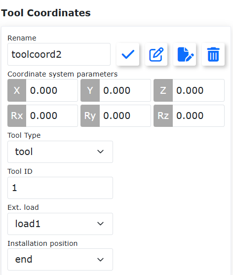

.. centered:: Wykres 6.2‑1-2 Zmiana nazwy układu współrzędnych

Kliknij "Modyfikuj", aby ponownie ustawić układ współrzędnych narzędzia o danym numerze zgodnie z instrukcjami. Metody kalibracji narzędzia dzielą się na metodę czteropunktową i metodę sześciopunktową. Metoda czteropunktowa kalibruje tylko TCP narzędzia, czyli pozycję środka punktu narzędzia, a jego orientacja jest domyślnie zgodna z orientacją końcówki. Metoda sześciopunktowa dodaje dwa punkty do metody czteropunktowej w celu kalibracji orientacji narzędzia. Tutaj omówimy metodę sześciopunktową jako przykład.

.. image:: base/002.png
   :width: 4in
   :align: center

.. centered:: Wykres 6.2‑2 Ustawianie współrzędnych narzędzia

Wybierz stały punkt w przestrzeni robota. Przesuń narzędzie do stałego punktu w trzech różnych orientacjach, ustawiając kolejno punkty 1-3, jak pokazano w lewym górnym rogu poniższego rysunku. Przesuń narzędzie pionowo do stałego punktu, aby ustawić punkt 4, jak pokazano w prawym górnym rogu poniższego rysunku. Utrzymując tę orientację, użyj ruchu wzdłuż podstawowych współrzędnych, aby przesunąć się w kierunku poziomym o pewną odległość i ustaw punkt 5. Ten kierunek jest dodatnim kierunkiem osi X ustawianego układu współrzędnych narzędzia. Wróć do stałego punktu, przesuń się pionowo w górę o pewną odległość i ustaw punkt 6. Ten kierunek jest dodatnim kierunkiem osi Z układu współrzędnych narzędzia. Dodatni kierunek osi Y układu współrzędnych narzędzia jest określany za pomocą reguły prawej dłoni. Kliknij przycisk "Oblicz", aby obliczyć pozycję i orientację narzędzia. Jeśli potrzebujesz ponownie ustawić, kliknij przycisk "Anuluj", a następnie "Modyfikuj", aby ponownie przejść przez kroki tworzenia nowego układu współrzędnych narzędzia.

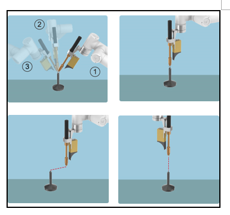

.. centered:: Wykres 6.2‑3 Schemat metody sześciopunktowej

Po wykonaniu ostatnich kroków kliknij "Zakończ", aby wrócić do interfejsu współrzędnych narzędzia. Kliknij "Zapisz", aby zapisać właśnie utworzony układ współrzędnych narzędzia.

.. important:: 
   1. Po zamontowaniu narzędzia na końcówce konieczna jest kalibracja i zastosowanie układu współrzędnych narzędzia. W przeciwnym razie pozycja i orientacja środka punktu narzędzia podczas wykonywania przez robota instrukcji ruchu nie będą zgodne z oczekiwanymi wartościami.
   2. Układ współrzędnych narzędzia jest zwykle używany jako toolcoord1~toolcoord19. Zastosowanie toolcoord0 oznacza, że środek TCP narzędzia znajduje się w środku kołnierza końcówki. Podczas kalibracji układu współrzędnych narzędzia należy najpierw zastosować układ współrzędnych narzędzia do toolcoord0, a następnie wybrać inny układ współrzędnych narzędzia do kalibracji i zastosowania.

Zewnętrzne współrzędne narzędzia
~~~~~~~~~~~~~~~~~~~~~~~~~~~~~~~~~~~~~~~

W menu "Ustawienia początkowe" -> "Podstawowe" kliknij "Zewnętrzne współrzędne narzędzia", aby przejść do interfejsu zewnętrznych współrzędnych narzędzia.

Interfejs ustawień zewnętrznych współrzędnych narzędzia umożliwia modyfikację, czyszczenie i zastosowanie zewnętrznych współrzędnych narzędzia.

Lista rozwijana zewnętrznych współrzędnych narzędzia zawiera łącznie 15 numerów, od etoolcoord0 do etoolcoord14. Po wybraniu odpowiedniego układu współrzędnych poniżej wyświetlone zostaną odpowiadające mu wartości współrzędnych. Po wybraniu układu współrzędnych kliknij przycisk "Zastosuj", a aktualnie używany układ współrzędnych narzędzia zmieni się na wybrany układ współrzędnych, jak pokazano na poniższym rysunku.

.. image:: base/004.png
   :width: 4in
   :align: center

.. centered:: Wykres 6.2‑4 Zewnętrzne współrzędne narzędzia

Kliknij "Modyfikuj", aby ponownie ustawić układ współrzędnych narzędzia o danym numerze zgodnie z instrukcjami, jak pokazano na poniższym rysunku.

.. image:: base/005.png
   :width: 4in
   :align: center

.. centered:: Wykres 6.2‑5 Schemat metody sześciopunktowej

**1. Określenie zewnętrznego TCP za pomocą metody trzech punktów**

- **Ustaw punkt 1**: Przesuń zmierzone TCP narzędzia do zewnętrznego TCP, kliknij przycisk ustaw punkt 1;
- **Ustaw punkt 2**: Przesuń się z punktu 1 wzdłuż osi X zewnętrznego układu współrzędnych TCF o pewną odległość, kliknij przycisk ustaw punkt 2;
- **Ustaw punkt 3**: Wróć do punktu 1, przesuń się z punktu 1 wzdłuż osi Z zewnętrznego układu współrzędnych TCF o pewną odległość, kliknij przycisk ustaw punkt 3;
- **Oblicz**: Kliknij przycisk "Oblicz", aby uzyskać zewnętrzny TCF;

**2. Określenie TCF narzędzia za pomocą metody sześciu punktów**

- **Ustaw punkty 1-4**: Wybierz stały punkt w przestrzeni robota, przesuń narzędzie do wybranego punktu z czterech różnych kątów, ustawiając kolejno punkty 1-4;
- **Ustaw punkt 5**: Wróć do stałego punktu, przesuń się wzdłuż osi X TCF narzędzia o pewną odległość, kliknij przycisk ustaw punkt 5;
- **Ustaw punkt 6**: Wróć do stałego punktu, przesuń się wzdłuż osi Y TCF narzędzia o pewną odległość, kliknij przycisk ustaw punkt 6;
- **Oblicz**: Kliknij przycisk "Oblicz", aby uzyskać TCF narzędzia;

Jeśli potrzebujesz ponownie ustawić, kliknij przycisk "Anuluj", aby ponownie przejść przez kroki tworzenia nowego układu współrzędnych narzędzia.

Po wykonaniu ostatnich kroków kliknij "Zakończ", aby wrócić do interfejsu współrzędnych narzędzia. Kliknij "Zapisz", aby zapisać właśnie utworzony układ współrzędnych narzędzia.

.. important:: 
   1. Korzystanie z zewnętrznego narzędzia wymaga kalibracji i zastosowania zewnętrznego układu współrzędnych narzędzia. W przeciwnym razie pozycja i orientacja środka punktu narzędzia podczas wykonywania przez robota instrukcji ruchu nie będą zgodne z oczekiwanymi wartościami.
   2. Zewnętrzny układ współrzędnych narzędzia jest zwykle używany jako etoolcoord1~etoolcoord14. Zastosowanie etoolcoord0 oznacza, że środek TCP zewnętrznego narzędzia znajduje się w środku kołnierza końcówki. Podczas kalibracji układu współrzędnych narzędzia należy najpierw zastosować układ współrzędnych narzędzia do etoolcoord0, a następnie wybrać inny układ współrzędnych narzędzia do kalibracji.

Współrzędne przedmiotu
~~~~~~~~~~~~~~~~~~~~~~~~~~

W menu "Ustawienia początkowe" -> "Podstawowe" kliknij "Współrzędne przedmiotu", aby przejść do interfejsu współrzędnych przedmiotu. Współrzędne przedmiotu umożliwiają modyfikację, czyszczenie i zastosowanie współrzędnych przedmiotu. Lista rozwijana układów współrzędnych przedmiotu zawiera łącznie 15 numerów. Po wybraniu odpowiedniego układu współrzędnych (wobjcoord0 ~ wobjcoord14), poniżej w sekcji "Współrzędne układu współrzędnych" wyświetlone zostaną odpowiadające mu wartości współrzędnych. Po wybraniu układu współrzędnych kliknij przycisk "Zastosuj", a aktualnie używany układ współrzędnych przedmiotu zmieni się na wybrany układ współrzędnych, jak pokazano na poniższym rysunku.

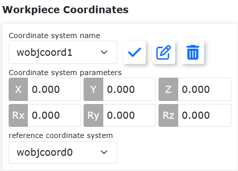

.. centered:: Wykres 6.2‑6 Ustawianie współrzędnych przedmiotu

Układ współrzędnych przedmiotu jest zwykle kalibrowany w oparciu o narzędzie. Należy go utworzyć na podstawie już utworzonego układu współrzędnych narzędzia. Kliknij "Modyfikuj", aby ponownie ustawić układ współrzędnych przedmiotu o danym numerze zgodnie z instrukcjami. Zamocuj przedmiot, wybierz metodę kalibracji "Początek układu - Oś X - Oś Z" lub "Początek układu - Oś X - Płaszczyzna XY+". Wybór pierwszych dwóch punktów jest taki sam dla obu metod kalibracji, trzeci punkt różni się. Wybór pierwszej metody kalibruje kierunek Z układu współrzędnych przedmiotu, wybór drugiej metody kalibruje punkt na płaszczyźnie XY+. Kalibruj zgodnie z ilustracją. Kliknij przycisk "Oblicz", aby obliczyć pozycję i orientację przedmiotu. Jeśli potrzebujesz ponownie ustawić, kliknij przycisk "Anuluj", a następnie "Modyfikuj", aby ponownie przejść przez kroki tworzenia nowego układu współrzędnych przedmiotu.

.. image:: base/007.png
   :width: 3in
   :align: center

.. centered:: Wykres 6.2‑7 Schemat metody trzech punktów

Po wykonaniu ostatnich kroków kliknij "Zakończ", aby wrócić do interfejsu współrzędnych przedmiotu. Kliknij "Zapisz", aby zapisać właśnie utworzony układ współrzędnych przedmiotu.

.. important:: 
   1. Układ współrzędnych przedmiotu jest kalibrowany w oparciu o narzędzie. Należy go utworzyć na podstawie już utworzonego układu współrzędnych narzędzia.
   2. Układ współrzędnych przedmiotu jest zwykle używany jako wobjcoord1~wobjcoord14. Zastosowanie wobjcoord0 oznacza, że początek układu współrzędnych przedmiotu znajduje się w początku podstawowych współrzędnych. Podczas kalibracji układu współrzędnych przedmiotu należy najpierw zastosować układ współrzędnych przedmiotu do wobjcoord0, a następnie wybrać inny układ współrzędnych przedmiotu do kalibracji i zastosowania.

Obciążenie
--------------

Końcówka
~~~~~~~~~~~~~

W menu "Ustawienia początkowe" -> "Podstawowe" -> "Obciążenie" kliknij "Identyfikacja trajektorii", aby przejść do interfejsu identyfikacji trajektorii.

Podczas konfigurowania obciążenia końcówki należy wprowadzić masę używanego narzędzia końcowego oraz odpowiadające mu współrzędne środka ciężkości odpowiednio w polach "Masa obciążenia" i "Współrzędne środka ciężkości obciążenia X, Y i Z", a następnie kliknąć "Zastosuj".

.. important:: 
    Masa obciążenia nie może przekraczać maksymalnego zakresu obciążenia robota. Zakres obciążenia dla konkretnego modelu robota można znaleźć w sekcji 2.1. Podstawowe parametry. Zakres ustawiania współrzędnych środka ciężkości wynosi 0-1000 mm.

.. image:: base/016.png
   :width: 4in
   :align: center

.. centered:: Wykres 6.3‑1 Schemat ustawiania obciążenia

.. important:: 
   Po zamontowaniu obciążenia na końcówce robota należy prawidłowo ustawić masę obciążenia końcówki oraz współrzędne środka ciężkości. W przeciwnym razie wpłynie to na funkcję przeciągania robota oraz funkcję wykrywania kolizji.

Jeśli użytkownik nie jest pewien masy narzędzia lub środka ciężkości, może kliknąć "Automatyczna identyfikacja", aby przejść do funkcji identyfikacji obciążenia w celu pomiaru danych narzędzia.

Przed przystąpieniem do pomiaru upewnij się, że obciążenie jest zamontowane, a następnie wybierz wersję. Kliknij przycisk "Pomiar danych narzędzia", aby przejść do interfejsu testu ruchu obciążenia.

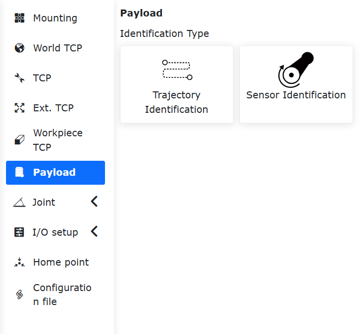

.. centered:: Wykres 6.3‑2 Ustawienia stawów do identyfikacji obciążenia

Kliknij "Uruchom identyfikację obciążenia", aby przeprowadzić test. W razie sytuacji awaryjnej niezwłocznie zatrzymaj ruch.

.. image:: base/018.png
   :width: 4in
   :align: center

.. centered:: Wykres 6.3‑3 Uruchomienie identyfikacji obciążenia

Po zakończeniu ruchu kliknij przycisk "Pobierz wyniki identyfikacji", aby uzyskać obliczone dane narzędzia, które zostaną wyświetlone na stronie. Jeśli chcesz zastosować je w danych obciążenia, kliknij "Zastosuj".

.. image:: base/019.png
   :width: 4in
   :align: center

.. centered:: Wykres 6.3‑4 Wyniki identyfikacji obciążenia

Stawy
--------------

Miękki limit
~~~~~~~~~~~~~

W menu "Ustawienia początkowe" -> "Podstawowe" -> "Stawy" kliknij "Miękki limit", aby przejść do interfejsu miękkiego limitu.

W zakresie ruchu robota mogą znajdować się inne urządzenia. Kąt limitu może ustawić miękki limit dla robota, zapobiegając przekroczeniu przez robota pewnych wartości współrzędnych i zapobiegając kolizjom. Zatrzymanie robota po przekroczeniu miękkiego limitu jest automatycznie wyzwalane przez robota i nie ma odległości zatrzymania.

Administrator może używać wartości domyślnych lub wprowadzić wartości kątów. Po wprowadzeniu wartości kątów można ograniczyć dodatnie i ujemne kąty stawów robota. Jeśli wprowadzona wartość przekracza wartości kątów miękkiego limitu stawów robota wymienione w tabeli podstawowych parametrów robota w sekcji 2.1, kąt limitu zostanie dostosowany do maksymalnej możliwej do ustawienia wartości. Gdy robot zgłosi przekroczenie limitu instrukcji, należy przejść do trybu przeciągania i przeciągnąć staw robota z powrotem do zakresu kąta limitu. Interfejs jest pokazany na poniższym rysunku:

.. image:: base/020.png
   :width: 4in
   :align: center

.. centered:: Wykres 6.4‑1-1 Schemat ograniczenia robota

Ochrona miękkim limitem stawu
+++++++++++++++++++++++++++++++++++

Omówienie
************************

Funkcja ochrony miękkim limitem stawu to aktywny mechanizm ochrony, który dynamicznie ogranicza zakres miękkiego limitu ustawionego przez operatora podczas procesu nauczania przeciągania poprzez monitorowanie w czasie rzeczywistym stanu ruchu stawów ramienia mechanicznego. Funkcja ta sprawia, że miękki limit ma również znaczenie podczas nauczania przeciągania, zwiększając w ten sposób bezpieczeństwo współpracy człowiek-robot.

Ochrona miękkim limitem stawu
***********************************

Funkcja ochrony miękkim limitem stawu wymaga zgodności wersji pakietu oprogramowania i oprogramowania sprzętowego, aby uzyskać optymalne doświadczenie.

Ustawienie miękkiego limitu oraz uruchamianie i zatrzymywanie funkcji
""""""""""""""""""""""""""""""""""""""""""""""""""""""""""""""""""""""""""

**Krok 1**: Zaloguj się do interfejsu sieciowego, kolejno kliknij "Ustawienia początkowe" -> "Podstawowe" -> "Stawy" -> "Miękki limit", aby przejść do modułu ustawiania miękkiego limitu robota.

.. image:: base/056.png
   :width: 4in
   :align: center

.. centered:: Wykres 6.4‑1-2 Moduł ustawiania miękkiego limitu robota

**Krok 2**: W oparciu o rzeczywisty zakres roboczy robota, odpowiednio ustaw miękki limit dla każdego stawu. W tym momencie należy sprawdzić, czy aktualne pozycje kątowe każdego stawu robota mieszczą się w zakresie ustawionego miękkiego limitu. Jeśli tak, kliknij "Zastosuj", aby wysłać ustawiony miękki limit. Jeśli nie, należy przesunąć każdy staw do zakresu ustawionego limitu, w przeciwnym razie po kliknięciu "Zastosuj" pojawi się komunikat o przekroczeniu limitu, jak pokazano na poniższym rysunku. W takim przypadku można pojedynczo punktowo lub przeciągnąć staw, który przekroczył limit, w kierunku wejścia w zakres miękkiego limitu, aby wyczyścić błąd.

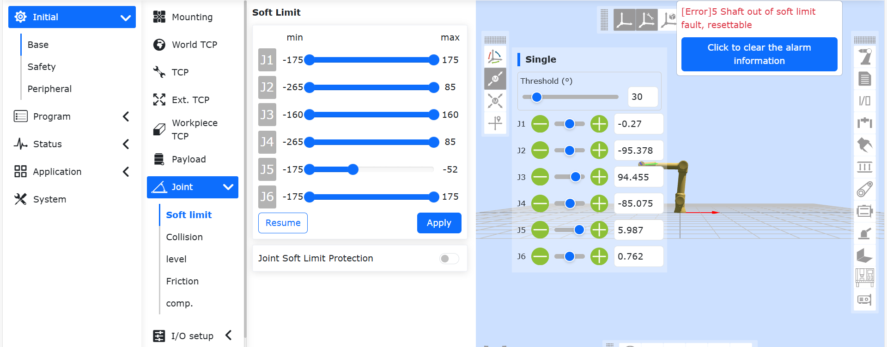

.. centered:: Wykres 6.4‑1-3 Błąd, gdy rzeczywista pozycja kątowa każdego stawu robota przekracza ustawiony zakres miękkiego limitu

**Krok 3**: Po pomyślnym ustawieniu zakresu miękkiego limitu kliknij suwak "Ochrona miękkim limitem stawu", aby włączyć tę funkcję, jak pokazano na poniższym rysunku. W trybie przeciągania ustawiony miękki limit będzie działał ograniczająco, a podczas przeciągania w pobliże miękkiego limitu wyczuwalny będzie opór.

.. image:: base/058.png
   :width: 4in
   :align: center

.. centered:: Wykres 6.4‑1-4 Włączenie funkcji ochrony miękkim limitem stawu

**Krok 4**: Jeśli chcesz wyłączyć funkcję ochrony miękkim limitem stawu, kliknij suwak "Ochrona miękkim limitem stawu".

Poziom kolizji
~~~~~~~~~~~~~~~~~~~~~~~~~~

W menu "Ustawienia początkowe" -> "Podstawowe" -> "Stawy" kliknij "Poziom kolizji", aby przejść do interfejsu poziomu kolizji.

Poziom kolizji dzieli się na poziomy od pierwszego do dziesiątego. Poziomy od pierwszego do trzeciego są bardziej czułe. Robot musi działać z zalecaną prędkością. Jednocześnie można wybrać ustawienie niestandardowego procentu, gdzie 100% odpowiada poziomowi dziesiątemu. Strategia kolizji może ustawić sposób postępowania robota po kolizji, dzieląc się na zatrzymanie z błędem i kontynuację ruchu. Użytkownik może ustawić odpowiednią opcję w zależności od konkretnych potrzeb użytkowania. Jak pokazano na poniższym rysunku:

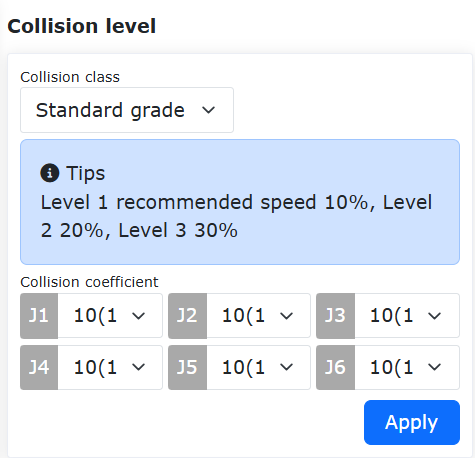

.. centered:: Wykres 6.4‑2 Schemat poziomu kolizji

Strategia reakcji po kolizji
++++++++++++++++++++++++++++++

Na podstawie istniejącej strategii kolizji podczas ruchu dodano "tryb momentu grawitacyjnego" i "tryb odpowiedzi oscylacyjnej", aby zapewnić bezpieczeństwo współpracy człowiek-robot.

Po wyzwoleniu obu strategii, robot przełączy się z trybu automatycznego lub ręcznego do trybu przeciągania. Tryb momentu grawitacyjnego oddali się od punktu kolizji zgodnie z wielkością i kierunkiem siły kolizji, podczas gdy tryb odpowiedzi oscylacyjnej powróci do pozycji kolizji po oddaleniu się od niej. Jednocześnie dodano wykrywanie kolizji w stanie spoczynku.

Strategia kolizji
++++++++++++++++++++++++++++++

Instrukcja FT_Guard służy do implementacji wykrywania kolizji opartego na czujniku siły. Dotychczasowe strategie kolizji to "zatrzymanie kolizji", "wstrzymanie kolizji" i "kontynuacja ruchu". Aby uniknąć siły ściskającej między robotem a obiektem po kolizji, dodano strategie "tryb momentu grawitacyjnego", "tryb odpowiedzi oscylacyjnej" i "tryb odbicia kolizyjnego".

Po wyzwoleniu wszystkich trzech strategii, robot przełączy się z trybu automatycznego lub ręcznego do trybu przeciągania, a następnie z powrotem do trybu ręcznego. Tryb momentu grawitacyjnego oddala się od punktu kolizji zgodnie z wielkością i kierunkiem siły kolizji; tryb odpowiedzi oscylacyjnej powraca do pozycji kolizji po oddaleniu się od niej; tryb odbicia kolizyjnego przyspiesza oddalanie się od punktu kolizji zgodnie z ustawionymi parametrami.

Tryb momentu grawitacyjnego
*******************************

Kroki ustawiania trybu momentu grawitacyjnego w strategii kolizji są następujące.

**Krok 1**: W menu "Ustawienia początkowe" -> "Podstawowe" -> "Stawy" kliknij "Poziom kolizji", aby przejść do odpowiedniego interfejsu.

**Krok 2**: W sekcji "Strategia kolizji" kliknij listę rozwijaną i wybierz "Tryb momentu grawitacyjnego". Interfejs jest pokazany na poniższym rysunku. Następnie kliknij przycisk "Zastosuj", aby włączyć funkcję.

.. note:: Podczas pracy robota, jeśli masa obciążenia znacznie się zmienia, nie zaleca się stosowania tej strategii. Jeśli prędkość robocza jest zbyt wysoka, nie zaleca się stosowania tej strategii.

.. image:: base/022.png
   :width: 4in
   :align: center

.. centered:: Wykres 6.4-3 Strategia kolizji - tryb momentu grawitacyjnego

Tryb odpowiedzi oscylacyjnej
*******************************

Kroki ustawiania trybu odpowiedzi oscylacyjnej w strategii kolizji są następujące.

**Krok 1**: W menu "Ustawienia początkowe" -> "Podstawowe" -> "Stawy" kliknij "Poziom kolizji", aby przejść do odpowiedniego interfejsu.

**Krok 2**: W sekcji "Strategia kolizji" kliknij listę rozwijaną i wybierz "Tryb odpowiedzi oscylacyjnej". Interfejs jest pokazany na poniższym rysunku. Następnie kliknij przycisk "Zastosuj", aby włączyć funkcję.

.. note:: Podczas pracy robota, jeśli prędkość robocza jest zbyt wysoka, nie zaleca się stosowania tej strategii.

.. image:: base/023.png
   :width: 4in
   :align: center

.. centered:: Wykres 6.4-4 Strategia kolizji - tryb odpowiedzi oscylacyjnej

Tryb odbicia kolizyjnego
*******************************

Kroki ustawiania trybu odbicia kolizyjnego w strategii kolizji są następujące.

**Krok 1**: W menu "Ustawienia początkowe" -> "Ustawienia robota" kliknij "Poziom kolizji", aby przejść do odpowiedniego interfejsu.

**Krok 2**: W sekcji "Strategia kolizji" kliknij listę rozwijaną i wybierz "Tryb odbicia kolizyjnego". Kolejno ustaw czas bezpieczeństwa 1000 ms, odległość bezpieczeństwa 150 mm, prędkość bezpieczeństwa 150 mm/s, współczynnik bezpieczeństwa dla każdego stawu 5. Konkretny interfejs jest pokazany na poniższym rysunku.

.. image:: base/049.png
   :width: 4in
   :align: center

.. centered:: Wykres 6.4-5 Strategia kolizji - tryb odbicia kolizyjnego

Znaczenie poszczególnych parametrów:
  - Czas bezpieczeństwa: oznacza czas trwania w trybie przeciągania po przełączeniu z trybu automatycznego do trybu przeciągania. Zakres wynosi [1000-2000] ms;
  - Odległość bezpieczeństwa: oznacza pozycję, w jakiej robot oddala się od punktu kolizji po kolizji. Zakres wynosi [150-200] mm;
  - Prędkość bezpieczeństwa: oznacza maksymalną prędkość TCP robota podczas oddalania się od punktu kolizji po kolizji. Po przekroczeniu limitu prędkości, siła odbicia będzie ograniczana. Zakres wynosi [50-250] mm/s;
  - Współczynnik bezpieczeństwa: oznacza szybkość tłumienia siły odbicia. Im mniejszy współczynnik, tym szybsze tłumienie i szybsza prędkość odbicia, i odwrotnie. Zakres wynosi [1-10], bezwymiarowy.

Instrukcja FT_Guard
**********************

Instrukcja FT_Guard służy do implementacji wykrywania kolizji za pomocą czujnika siły. Najpierw wybierz kierunek wykrywania, możesz też ustawić wszystkie kierunki. Następnie pobierz bieżące dane czujnika siły jako wartość początkową, a następnie ustaw maksymalny i minimalny próg, aby określić górną i dolną granicę wyzwolenia siły kolizji. W ten sposób zakończysz ustawianie funkcji wykrywania kolizji. Na przykładzie konfiguracji kierunku Z, szczegółowe ustawienia pokazano na poniższym rysunku.

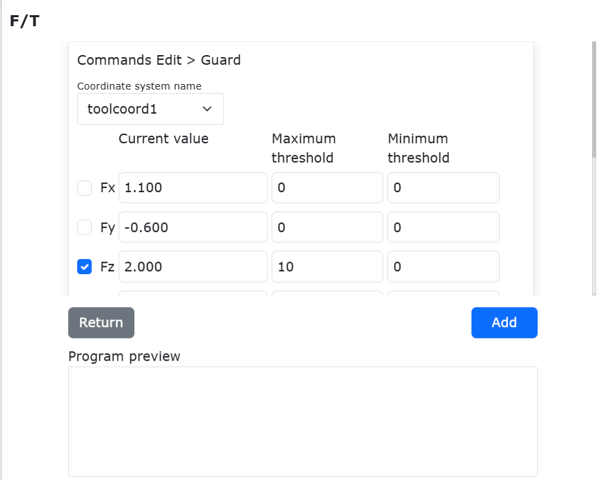

.. centered:: Wykres 6.4-6 Konfiguracja parametrów instrukcji FT_Guard

Instrukcja FT_Guard jest zwykle używana razem z instrukcjami ruchu, takimi jak PTP lub Lin. Prosty przykład pokazano na rysunku.

.. image:: base/051.png
   :width: 5in
   :align: center

.. centered:: Wykres 6.3-7 Przykład połączenia instrukcji FT_Guard z instrukcjami ruchu

Pierwszy wiersz to włączenie wykrywania kolizji czujnika siły, ostatni wiersz to wyłączenie funkcji wykrywania kolizji czujnika siły.

Wykrywanie kolizji w stanie spoczynku
++++++++++++++++++++++++++++++++++++++++++++++++

Kroki ustawiania wykrywania kolizji w stanie spoczynku są następujące.

**Krok 1**: W menu "Ustawienia początkowe" -> "Podstawowe" -> "Stawy" kliknij "Poziom kolizji", aby przejść do odpowiedniego interfejsu.

**Krok 2**: Włącz przełącznik wykrywania kolizji w stanie spoczynku, jak pokazano na poniższym rysunku. Gdy różnica między instrukcją momentu obrotowego stawu a sprzężeniem zwrotnym momentu obrotowego jest zbyt duża, robot przejdzie do trybu przeciągania, aby uniknąć generowania ciągłej siły ściskającej.

.. image:: base/024.png
   :width: 4in
   :align: center

.. centered:: Wykres 6.4-8 Wykrywanie kolizji w stanie spoczynku

Funkcja wykrywania momentu obrotowego przed przeciąganiem
++++++++++++++++++++++++++++++++++++++++++++++++++++++++++++

Omówienie
***********************
Przed wejściem robota w tryb przeciągania konieczne jest wykrycie momentu obrotowego. Funkcja ta ma na celu zapobieganie nieprawidłowym zjawiskom, takim jak unoszenie się lub opadanie robota po wejściu w tryb przeciągania, spowodowanym przez operatora ustawieniem nieprawidłowych parametrów obciążenia lub wyborem niewłaściwego sposobu instalacji. Jeśli wykryty moment obrotowy stawu przekracza dozwolony zakres, kontroler natychmiast zgłosi błąd i zablokuje wejście robota w tryb przeciągania.

Wykrywanie momentu obrotowego przed przeciąganiem
********************************************************

**Krok 1**: Kliknij "Ustawienia początkowe" -> "Podstawowe" -> "Stawy" -> "Poziom kolizji", aby przejść do interfejsu ustawiania poziomu kolizji. Włącz funkcję wykrywania momentu obrotowego przed przeciąganiem, jak pokazano na rysunku.

.. image:: base/069.png
   :width: 4in
   :align: center

.. centered:: Wykres 6.4-9 Włączenie funkcji wykrywania momentu obrotowego przed przeciąganiem

**Krok 2**: Przełącz tryb przeciągania. Interfejs sieciowy umożliwia wejście w tryb przeciągania poprzez kliknięcie w obszar stanu robota - stan przeciągania robota, długie naciśnięcie przycisku "Tryb nauczania" na panelu przycisków lub długie naciśnięcie przycisku przeciągania na końcówce robota. Jeśli kontroler zgłosi błąd, a robot nie przełączy się w tryb przeciągania, jak pokazano na rysunku 2-2, sprawdź, czy konfiguracja obciążenia robota i sposób instalacji są prawidłowe.

.. image:: base/070.png
   :width: 4in
   :align: center

.. centered:: Wykres 6.4-10 Przekroczenie momentu obrotowego, kontroler zgłasza błąd

**Krok 3**: Sprawdź konfigurację obciążenia i sposób instalacji. Kliknij "Ustawienia początkowe" -> "Podstawowe" -> "Obciążenie" -> "Końcówka", aby sprawdzić, czy konfiguracja obciążenia końcówki w interfejsie sieciowym jest zgodna z rzeczywiście zamontowanym obciążeniem. Kliknij "Ustawienia początkowe" -> "Podstawowe" -> "Instalacja" -> "Instalacja swobodna", aby sprawdzić, czy sposób instalacji w interfejsie sieciowym jest zgodny z rzeczywistym sposobem instalacji.

Funkcja wykrywania fałszywych alarmów
++++++++++++++++++++++++++++++++++++++

Omówienie
***********************

Optymalizacja funkcji kolizji polega na dodaniu przełącznika fałszywych alarmów na podstawie wykrywania kolizji, co pozwala uniknąć ryzyka fałszywych alarmów kolizji.

Ustawienie poziomu kolizji
*****************************************

**Krok 1**: Zaloguj się do interfejsu sieciowego, kolejno kliknij "Ustawienia początkowe" → "Podstawowe" → "Stawy" → "Poziom kolizji", aby przejść do modułu ustawiania poziomu kolizji.

Im wyższy poziom kolizji, tym większy moment obrotowy jest wymagany do wystąpienia kolizji i tym mniej czuła jest reakcja na kolizję. Obecnie wartości momentu obrotowego odpowiadające poziomom kolizji, na przykład 38,4 NM dla poziomu 10, to teoretyczny moment obrotowy wymagany do wyzwolenia kolizji dla osi 1.

.. image:: base/093.png
   :width: 4in
   :align: center

.. centered:: Wykres 6.4-11 Moduł ustawiania poziomu kolizji

**Krok 2**: Przełącznik wykrywania fałszywych alarmów jest domyślnie włączony i aktywny. Jeśli nie jest używany, można go "wyłączyć", jak pokazano na poniższym rysunku.

.. centered:: Wykres 6.4-12 Przełącznik wykrywania fałszywych alarmów

Kompensacja tarcia
~~~~~~~~~~~~~~~~~~~~~~~~~~

W menu "Ustawienia początkowe" -> "Podstawowe" -> "Stawy" kliknij "Kompensacja tarcia", aby przejść do interfejsu ustawiania kompensacji tarcia.

**Współczynnik kompensacji tarcia**: Scenariusz użycia kompensacji tarcia dotyczy tylko trybu przeciągania. Zakres ustawiania współczynnika kompensacji tarcia wynosi 0~1. Im wyższa wartość, tym większa siła kompensacji podczas przeciągania. Współczynnik kompensacji tarcia wymaga oddzielnego ustawienia współczynnika kompensacji dla każdej osi w zależności od sposobu instalacji.

**Przełącznik kompensacji tarcia**: Użytkownik może włączyć lub wyłączyć kompensację tarcia w zależności od rzeczywistego robota i nawyków użytkowania.

.. image:: base/025.png
   :width: 4in
   :align: center

.. centered:: Wykres 6.4-13 Ustawianie kompensacji tarcia

.. important:: 
   Funkcja kompensacji tarcia robota wymaga ostrożnego używania. Ustaw rozsądny współczynnik kompensacji w zależności od rzeczywistych warunków. Ogólnie zalecana wartość środkowa to około 0,5.

Funkcja regulacji współczynnika kompensacji tarcia
~~~~~~~~~~~~~~~~~~~~~~~~~~~~~~~~~~~~~~~~~~~~~~~~~~~~~~

Omówienie
++++++++++++++++++++++++
Funkcja regulacji współczynnika kompensacji tarcia służy głównie do regulacji wartości współczynnika kompensacji tarcia wewnątrz kontrolera.

W trybie przeciągania regulacja współczynnika kompensacji tarcia może ułatwić przeciąganie robota. W trybie automatycznym regulacja współczynnika kompensacji tarcia może poprawić dopasowanie krzywej instrukcji momentu obrotowego i sprzężenia zwrotnego momentu obrotowego.

Regulacja współczynnika kompensacji tarcia
++++++++++++++++++++++++++++++++++++++++++++++++

Współczynnik kompensacji tarcia w ustawieniach fabrycznych wynosi domyślnie 0,5 i jest parametrem ogólnym. Użytkownik może dostosować wzmocnienie tarcia w zależności od rzeczywistej sytuacji, aby uzyskać lepsze wrażenia.

Konfiguracja współczynnika kompensacji tarcia
******************************************************************

**Krok 1**: Zaloguj się do interfejsu sieciowego, kolejno kliknij "Ustawienia początkowe" → "Podstawowe" → "Stawy" → "Kompensacja tarcia", aby przejść do modułu ustawiania kompensacji tarcia.

.. image:: base/092.png
   :width: 4in
   :align: center

.. centered:: Wykres 6.4-14 Moduł ustawiania kompensacji tarcia

**Krok 2**: Domyślny współczynnik kompensacji tarcia wynosi 0,5. Stan włączonego przełącznika kompensacji tarcia pokazano na rysunku. Po włączeniu funkcji odczucie przeciągania jest gładsze w porównaniu do stanu przed włączeniem. Jeśli funkcja nie jest włączona, odczucie przeciągania jest cięższe.

**Krok 3**: Regulacja parametrów. Zakres współczynnika kompensacji tarcia wynosi [0-1]. Jeśli odczucie przeciągania jest nieco ciężkie, możesz zwiększyć parametry dla poszczególnych osi w zależności od rzeczywistej sytuacji. Jeśli podczas przeciągania występuje zjawisko braku możliwości zatrzymania lub wibracje stawów, należy zmniejszyć parametry dla odpowiednich osi.

**Krok 4**: Jeśli chcesz wyłączyć funkcję kompensacji tarcia, możesz to zrobić, wybierając "Wyłącz" na przełączniku kompensacji.

Kompensacja siły przeciągania
~~~~~~~~~~~~~~~~~~~~~~~~~~~~~~~~~~~~~~~~~~~~~~

Omówienie
+++++++++++++++++++++++++++++

Optymalizacja siły przeciągania polega na kompensowaniu pewnego momentu obrotowego na podstawie trendu ruchu robota, przy użyciu obecnego przeciągania w pętli prądowej, w celu pokonania błędów momentu wprowadzonych przez niedokładne modelowanie, dzięki czemu przeciąganie robota jest płynne.

Optymalizacja siły przeciągania robota
++++++++++++++++++++++++++++++++++++++++++++++++++++++++++

Funkcja optymalizacji siły przeciągania wymaga zgodności wersji oprogramowania i oprogramowania sprzętowego, aby uzyskać lepsze wrażenia.

Konfiguracja funkcji optymalizacji siły przeciągania
*****************************************************************
**Krok 1**: Zaloguj się do interfejsu sieciowego, kolejno kliknij "Ustawienia początkowe" -> "Podstawowe" -> "Stawy" -> "Kompensacja tarcia", aby przejść do modułu ustawiania kompensacji siły przeciągania, jak pokazano na rysunku.

.. image:: base/068.png
   :width: 4in
   :align: center

.. centered:: Wykres 6.4-15 Moduł ustawiania kompensacji siły przeciągania

**Krok 2**: Wybierz "Włącz" na przełączniku kompensacji i "Wyłącz" na przełączniku adaptacyjnym. Skonfiguruj parametry jak pokazano na rysunku i kliknij "Zastosuj". Funkcja zostanie pomyślnie włączona. Naciśnij przycisk przeciągania, aby przeciągnąć robota. Odczucie przeciągania jest gładsze w porównaniu do stanu przed włączeniem funkcji.

**Krok 3**: Regulacja parametrów. Zakres współczynnika kompensacji wynosi [0-1]. Jeśli odczucie przeciągania jest nieco ciężkie, możesz zwiększyć parametry dla odpowiednich osi. Jeśli podczas przeciągania występuje zjawisko braku możliwości zatrzymania lub wibracje stawów, należy zmniejszyć parametry dla odpowiednich osi. Jednocześnie podczas przeciągania pojawi się odczucie tłumienia, które służy do zmniejszania prędkości i zatrzymania robota.

**Krok 4**: Jeśli chcesz wyłączyć funkcję kompensacji siły przeciągania, możesz to zrobić, wybierając "Wyłącz" na przełączniku kompensacji.

Ustawienia I/O
----------------------

Wstrzymywanie programu Lua
~~~~~~~~~~~~~~~~~~~~~~~~~~~~~~~~~~~~~~~~~~~~~

Podczas wykonywania programu Lua robota kliknij przycisk "Wstrzymaj/Wznów", aby wstrzymać wykonanie programu Lua. Stan robota zmieni się na "Pause" (Wstrzymany). Kliknij przycisk ponownie, a program będzie kontynuował wykonywanie od miejsca wstrzymania, a stan robota zmieni się z powrotem na "Running" (Działający).

Wszystkie uruchomione programy działające w tle zostaną również synchronicznie wstrzymane i wznowione podczas powyższego procesu. Różne typy instrukcji Lua różnią się w swoim zachowaniu podczas wstrzymania:

**① Instrukcje ruchu**: Robot natychmiast zatrzymuje ruch podczas wstrzymania, a po wznowieniu robot wznawia ruch i dociera do pozycji docelowej tej instrukcji.

**② Instrukcje logiczne, takie jak SetDO, GetDI, GetInverseKinRef itp.**: Jeśli program zostanie wstrzymany podczas wykonywania instrukcji, to po zakończeniu wykonywania tej instrukcji program będzie czekał na wyjście programu Lua ze stanu wstrzymania przed wykonaniem następnej instrukcji.

**③ Instrukcje oczekiwania, takie jak WaitDI, ModbusMasterWaitDI**: Jeśli program zostanie wstrzymany podczas oczekiwania, czas wstrzymania nie wlicza się do czasu oczekiwania na przekroczenie limitu czasu.

**④ Instrukcje uśpienia, takie jak sleep_ms, WaitMs**: Jeśli program zostanie wstrzymany podczas uśpienia, czas wstrzymania nie wlicza się do ustawionego czasu snu.

.. image:: base/066.png
   :width: 4in
   :align: center

.. centered:: Wykres 6.5‑1 Stan wstrzymania programu Lua

.. image:: base/067.png
   :width: 4in
   :align: center

.. centered:: Wykres 6.5‑2 Stan działania programu Lua

Konfiguracja I/O
~~~~~~~~~~~~~~~~~~

Kliknij menu "Ustawienia początkowe" -> "Podstawowe" -> "Ustawienia I/O", kliknij podmenu "DI" i "DO", aby przejść do interfejsów konfiguracji DI i DO. W skrzynce sterowniczej można skonfigurować CI0-CI7 i CO0-CO7, a na końcówce można skonfigurować DI0 i DI1.

Konfiguracja DI
++++++++++++++++

W produkcji, gdy robot współpracujący musi podłączyć urządzenia peryferyjne lub zatrzymuje się nagle z powodu awarii lub innych czynników, konieczne jest wyjście sygnału DO, aby zrealizować alarm dźwiękowo-świetlny. Funkcje konfigurowalne dla wejść przedstawiono w poniższej tabeli:

.. centered:: Tabela 6.5‑1 Funkcje konfigurowalne dla wejść skrzynki sterowniczej

.. list-table:: 
   :widths: 15 30 100
   :header-rows: 1
   :align: center

   * - Numer funkcji
     - Nazwa funkcji
     - Opis funkcji
   * - 0
     - Brak
     - Brak
   * - 1
     - Sygnał pomyślnego zajarzenia łuku
     - Zajarzenie łuku przez spawarkę zakończone sukcesem, robot wysyła sygnał zajarzenia łuku do spawarki
   * - 2
     - Sygnał gotowości do spawania
     - Sygnał pomyślnego przygotowania spawarki robota
   * - 3
     - Wykrywanie taśmociągu
     - Sygnał konfiguracji DI przełącznika wykrywania taśmociągu
   * - 4
     - Wstrzymaj
     - Sygnał wstrzymania ruchu podczas spawania robota
   * - 5
     - Wznów
     - Gdy łuk zostanie nieoczekiwanie przerwany podczas spawania robota lub operator aktywnie wstrzyma spawanie, zostanie wyzwolone przerwanie spawania. Po przerwaniu spawania, gdy zewnętrzny sygnał wejściowy do robota zmieni się z nieaktywnego na aktywny, robot automatycznie wznowi spawanie od miejsca, w którym zostało przerwane
   * - 6
     - Uruchom 
     - W konfigurowalnych wejściach DI wybierz CIO jako "Uruchom" i kliknij "Zastosuj". Wybierz stan aktywny wejścia konfigurowalnego jako "Aktywny wysoki poziom", to gdy poziom CI0 zmieni się z niskiego na wysoki, wyzwolona zostanie funkcja "Uruchom", uruchamiając program otwarty na bieżącym interfejsie programu nauczania. Jeśli interfejs nie jest otwarty, zostanie uruchomiony ostatnio zapisany program. Wybierz stan aktywny wejścia konfigurowalnego jako "Aktywny niski poziom", to gdy poziom CI0 zmieni się z wysokiego na niski, wyzwolona zostanie funkcja "Uruchom", uruchamiając program otwarty na bieżącym interfejsie programu nauczania. Jeśli interfejs nie jest otwarty, zostanie uruchomiony ostatnio zapisany program
   * - 7
     - Zatrzymaj  
     - Sygnał zatrzymania ruchu podczas spawania robota
   * - 8
     - Wstrzymaj/Wznów
     - Po ruchu robota, cyklicznie wyzwalany sygnał wstrzymania/wznowienia ruchu
   * - 9
     - Uruchom/Zatrzymaj
     - Po ruchu robota, cyklicznie wyzwalany sygnał uruchomienia/zatrzymania ruchu
   * - 10
     - Przełącznik przeciągania nożnego
     - Sygnał ruchu przełącznika przeciągania nożnego robota
   * - 11
     - Przejdź do punktu początkowego zadania
     - Użyj bieżącej pozycji robota jako punktu początkowego zadania, sygnał ruchu robota do punktu początkowego zadania
   * - 12
     - Przełączanie ręczny/automatyczny (sygnał impulsowy)
     - W konfigurowalnych wejściach DI wybierz CIO jako "Przełączanie ręczny/automatyczny (sygnał impulsowy)" i kliknij "Zastosuj". Wybierz stan aktywny wejścia konfigurowalnego jako "Aktywny wysoki poziom", to gdy poziom CI0 zmieni się z niskiego na wysoki, wyzwolona zostanie funkcja "Przełączanie ręczny/automatyczny (sygnał impulsowy)", powodując jednokrotne przełączenie stanu pracy robota. Wybierz stan aktywny wejścia konfigurowalnego jako "Aktywny niski poziom", to gdy poziom CI0 zmieni się z wysokiego na niski, wyzwolona zostanie funkcja "Przełączanie ręczny/automatyczny (sygnał impulsowy)", powodując jednokrotne przełączenie stanu pracy robota
   * - 13
     - Pozycjonowanie drutu spawalniczego zakończone sukcesem
     - Sygnał pomyślnego pozycjonowania drutu spawalniczego robota
   * - 14
     - Przerwanie ruchu
     - Sygnał przerwania programu ruchu robota
   * - 15
     - Uruchom program główny
     - Sygnał uruchomienia programu głównego robota
   * - 16
     - Uruchom przewijanie wstecz
     - Po uruchomieniu programu robota, sygnał uruchomienia przewijania wstecz programu
   * - 17
     - Potwierdzenie uruchomienia
     - Sygnał potwierdzenia uruchomienia programu robota
   * - 18
     - Sygnał wykrywania lasera X
     - Sygnał wykrywania lasera X czujnika laserowego robota
   * - 19
     - Sygnał wykrywania lasera Y
     - Sygnał wykrywania lasera Y czujnika laserowego robota
   * - 20
     - Sygnał wejściowy awaryjnego zatrzymania zewnętrznego 1
     - Sygnał wejściowy awaryjnego zatrzymania zewnętrznego robota 1. ① Wyświetlany tylko w QX. ② W LA odpowiednia konfiguracja dostępna w interfejsie "Ustawienia początkowe" -> "Bezpieczeństwo" -> "Bezpieczeństwo I/O" -> "Konfiguracja funkcji bezpieczeństwa DIO"
   * - 21
     - Sygnał wejściowy awaryjnego zatrzymania zewnętrznego 2
     - Sygnał wejściowy awaryjnego zatrzymania zewnętrznego robota 2. ① Wyświetlany tylko w QX. ② W LA odpowiednia konfiguracja dostępna w interfejsie "Ustawienia początkowe" -> "Bezpieczeństwo" -> "Bezpieczeństwo I/O" -> "Konfiguracja funkcji bezpieczeństwa DIO"
   * - 22
     - Tryb redukcji pierwszego poziomu
     - Tryb redukcji pierwszego poziomu robota. ① Wyświetlany tylko w QX. ② W LA odpowiednia konfiguracja dostępna w interfejsie "Ustawienia początkowe" -> "Bezpieczeństwo" -> "Bezpieczeństwo I/O" -> "Konfiguracja funkcji bezpieczeństwa DIO"
   * - 23
     - Tryb redukcji drugiego poziomu
     - Tryb redukcji drugiego poziomu robota. ① Wyświetlany tylko w QX. ② W LA odpowiednia konfiguracja dostępna w interfejsie "Ustawienia początkowe" -> "Bezpieczeństwo" -> "Bezpieczeństwo I/O" -> "Konfiguracja funkcji bezpieczeństwa DIO"
   * - 24
     - Tryb redukcji trzeciego poziomu (zatrzymanie)
     - Tryb redukcji trzeciego poziomu robota (zatrzymanie). ① Wyświetlany tylko w QX. ② W LA odpowiednia konfiguracja dostępna w interfejsie "Ustawienia początkowe" -> "Bezpieczeństwo" -> "Bezpieczeństwo I/O" -> "Konfiguracja funkcji bezpieczeństwa DIO"
   * - 25
     - Wznów spawanie
     - Sygnał operacji wznowienia spawania po przerwaniu spawania przez robota
   * - 26
     - Zakończ spawanie
     - Sygnał operacji zakończenia spawania podczas procesu spawania robota
   * - 27
     - Włącz pomocnicze przeciąganie
     - Sygnał włączenia funkcji przeciągania z czujnikiem siły w konfiguracji funkcji DI skrzynki sterowniczej
   * - 28
     - Wyłącz pomocnicze przeciąganie
     - Sygnał wyłączenia funkcji przeciągania z czujnikiem siły w konfiguracji funkcji DI skrzynki sterowniczej
   * - 29
     - Włącz/Wyłącz pomocnicze przeciąganie
     - Funkcja przeciągania z czujnikiem siły w konfiguracji funkcji DI skrzynki sterowniczej, sygnał cyklicznego włączania/wyłączania
   * - 30
     - Wyczyść wszystkie błędy
     - Sygnał wyczyszczenia wszystkich błędów wyzwolonych przez robota
   * - 31
     - Przełączanie ręczny/automatyczny (poziom wysoki/niski)
     - W konfigurowalnych wejściach DI wybierz CIO jako "Przełączanie ręczny/automatyczny (poziom wysoki/niski)" i kliknij "Zastosuj". Wybierz stan aktywny wejścia konfigurowalnego jako "Aktywny wysoki poziom", to gdy CI0 przełączy się na wysoki poziom, wyzwolona zostanie funkcja "Przełączanie ręczny/automatyczny (poziom wysoki/niski)", a stan robota przełączy się na automatyczny. Wybierz stan aktywny wejścia konfigurowalnego jako "Aktywny niski poziom", to gdy CI0 przełączy się na niski poziom, wyzwolona zostanie funkcja "Przełączanie ręczny/automatyczny (poziom wysoki/niski)", a stan robota przełączy się na automatyczny
   * - 32
     - Załącz
     - Sterowanie załączeniem robota
   * - 33
     - Odłącz
     - Sterowanie odłączeniem robota
   * - 34
     - Załącz/Odłącz (zbocze narastające/opadające)
     - Zbocze narastające i opadające aktywnego stanu wejścia sygnału odpowiednio wyzwalają załączenie i odłączenie robota

Dodanie funkcji konfigurowalnych dla końcowego CI
**********************************************************

Omówienie
""""""""""""""""""""""""""""""""""""""""

Synchronizacja wszystkich funkcji CI skrzynki sterowniczej robota do końcowego CI. Jej sednem jest zbudowanie systemu sterowania, w którym funkcje logiczne są równoważne, a pozycje fizyczne się uzupełniają. Oba interfejsy są całkowicie równoważne pod względem funkcji logicznych i mogą być używane równolegle lub selektywnie, umożliwiając systemowi sterowania robotem inteligentne przydzielanie ścieżek sygnałów w zależności od scenariusza zadania, fizycznego układu urządzeń i wymagań dotyczących niezawodności.

Procedura operacyjna
""""""""""""""""""""""""""""""""""""""""""""""""""""""""""""""""""""""""""""

**Krok 1**: Kolejno kliknij przyciski menu "Ustawienia początkowe" - "Podstawowe" - "Ustawienia I/O" - "DI", aby przejść do interfejsu konfiguracji DI. Wybierz End DI0 i End DI1, aby skonfigurować funkcje wejścia końcowego robota.

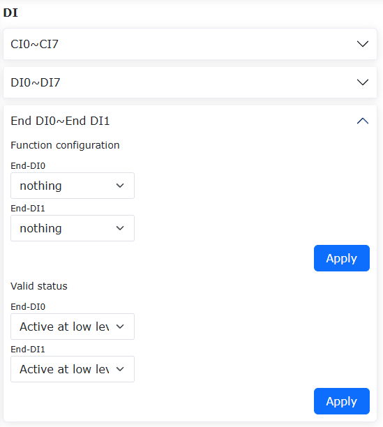

.. centered:: Wykres 6.5‑3 Konfiguracja parametrów końcowego DI

**Krok 2**: Sygnały DI obsługiwane przez końcówkę robota przedstawiono w poniższej tabeli. Użytkownik może skonfigurować odpowiednie sygnały zgodnie z rzeczywistymi potrzebami użytkowania.

.. centered:: Tabela 6.5‑2 Funkcje konfigurowalne dla wejść końcowych

.. list-table:: 
   :widths: 15 30 100 
   :header-rows: 1
   :align: center

   * - Numer funkcji
     - Nazwa funkcji
     - Opis funkcji
   * - 0
     - Brak
     - Brak
   * - 1
     - Tryb przeciągania
     - Sygnał włączenia trybu przeciągania na końcówce robota
   * - 2
     - Zapis punktu nauczania
     - Sygnał włączenia zapisu punktu nauczania na końcówce robota, zapisuje bieżące dane punktu robota
   * - 3
     - Przełączanie ręczny/automatyczny
     - Sygnał wyzwalający przełączanie ręczny/automatyczny robota
   * - 4
     - Uruchom/zatrzymaj rejestrację trajektorii TPD
     - Po rozpoczęciu ruchu TPD przez robota, sygnał uruchomienia/zatrzymania rejestracji trajektorii
   * - 5
     - Wstrzymaj
     - Sygnał wstrzymania ruchu robota
   * - 6
     - Wznów
     - Sygnał wznowienia ruchu robota
   * - 7
     - Uruchom
     - Sygnał uruchomienia programu robota
   * - 8
     - Zatrzymaj
     - Sygnał zatrzymania programu robota
   * - 9
     - Wstrzymaj/Wznów
     - Po ruchu robota, cyklicznie wyzwalany sygnał wstrzymania/wznowienia ruchu
   * - 10
     - Uruchom/Zatrzymaj
     - Po ruchu robota, cyklicznie wyzwalany sygnał uruchomienia/zatrzymania ruchu
   * - 11
     - Włącz pomocnicze przeciąganie
     - Sygnał włączenia funkcji przeciągania z czujnikiem siły w konfiguracji funkcji DI skrzynki sterowniczej
   * - 12
     - Wyłącz pomocnicze przeciąganie
     - Sygnał wyłączenia funkcji przeciągania z czujnikiem siły w konfiguracji funkcji DI skrzynki sterowniczej
   * - 13
     - Włącz/Wyłącz pomocnicze przeciąganie
     - Funkcja przeciągania z czujnikiem siły w konfiguracji funkcji DI skrzynki sterowniczej, sygnał cyklicznego włączania/wyłączania
   * - 14
     - Sygnał wykrywania lasera X
     - Sygnał wykrywania lasera X czujnika laserowego robota
   * - 15
     - Sygnał wykrywania lasera Y
     - Sygnał wykrywania lasera Y czujnika laserowego robota
   * - 16
     - Przejdź do punktu początkowego zadania
     - Sygnał ruchu robota do punktu początkowego zadania
   * - 17
     - Przerwanie ruchu
     - Sygnał przerwania programu ruchu robota
   * - 18
     - Uruchom program główny
     - Sygnał uruchomienia programu głównego robota
   * - 19
     - Uruchom przewijanie wstecz
     - Po uruchomieniu programu robota, sygnał uruchomienia przewijania wstecz programu
   * - 20
     - Potwierdzenie uruchomienia
     - Sygnał potwierdzenia uruchomienia programu robota
   * - 21
     - Wznów spawanie
     - Sygnał operacji wznowienia spawania po przerwaniu spawania przez robota
   * - 22
     - Zakończ spawanie
     - Sygnał operacji zakończenia spawania podczas procesu spawania robota
   * - 23
     - Wyczyść informacje o błędach
     - Sygnał wyczyszczenia wszystkich błędów wyzwolonych przez robota
   * - 24
     - Przełączanie ręczny/automatyczny (poziom wysoki/niski)
     - Gdy konfigurowalne wejście wybierze "Aktywny wysoki poziom", a sygnał wejściowy jest wysokiego poziomu, robot przełącza się na automatyczny; gdy konfigurowalne wejście wybierze "Aktywny niski poziom", a sygnał wejściowy jest niskiego poziomu, robot przełącza się na automatyczny
   * - 25
     - Załącz
     - Sterowanie załączeniem robota
   * - 26
     - Odłącz
     - Sterowanie odłączeniem robota
   * - 27
     - Załącz/Odłącz (zbocze narastające/opadające)
     - Zbocze narastające i opadające aktywnego stanu wejścia sygnału odpowiednio wyzwalają załączenie i odłączenie robota
   * - 28
     - Sygnał uruchamiania/zatrzymywania śledzenia serwomechanizmu laserowego
     - Gdy robot rejestruje i śledzi jednocześnie za pomocą lasera, a funkcja uruchamiania/zatrzymywania przez I/O jest włączona, wyzwolenie odpowiedniego końcowego CI rozpoczyna śledzenie laserowe; zwolnienie odpowiedniego końcowego CI kończy śledzenie

Domyślna konfiguracja skrzynki sterowniczej: CO0 to 1 - błąd robota, CO1 to 2 - robot w ruchu.

.. image:: base/026.png
   :width: 6in
   :align: center

.. centered:: Wykres 6.5‑3 Konfiguracja DI i DO skrzynki sterowniczej

**Domyślna konfiguracja końcowego DI**: DI0 przeciąganie nauczania, DI1 zapis punktu nauczania.

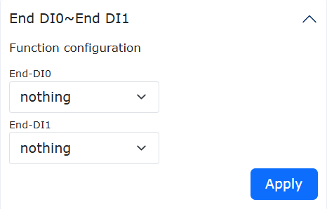

.. centered:: Wykres 6.5‑4 Konfiguracja końcowego DI

Po zakończeniu konfiguracji w odpowiednim stanie można sprawdzić odpowiadające im stany wyjściowe DO na stronie I/O skrzynki sterowniczej.

.. important:: 
   Zabrania się używania skonfigurowanych DI i DO w programowaniu.

**Konfiguracja trybów redukcji (pierwszego, drugiego, trzeciego poziomu)**: Dla trybów redukcji pierwszego i drugiego poziomu można skonfigurować prędkość stawów i prędkość TCP końcówki. Tryb redukcji trzeciego poziomu to zatrzymanie i nie wymaga konfiguracji prędkości.

.. image:: base/032.png
   :width: 4in
   :align: center

.. image:: base/033.png
   :width: 4in
   :align: center

.. centered:: Wykres 6.5‑5 Konfiguracja trybów redukcji

Konfiguracja DO
++++++++++++++++

Funkcje konfigurowalne dla wyjść przedstawiono w poniższej tabeli:

.. centered:: Tabela 6.5‑3 Funkcje konfigurowalne dla wyjść skrzynki sterowniczej

.. list-table:: 
   :widths: 15 30 100
   :header-rows: 1
   :align: center

   * - Numer funkcji
     - Nazwa funkcji
     - Opis funkcji
   * - 0
     - Brak
     - Brak
   * - 1
     - Błąd
     - Sygnał błędu wyjścia DO
   * - 2
     - Ruch
     - Sygnał ruchu robota
   * - 3
     - Uruchom/zatrzymaj natryskiwanie
     - Sygnał operacji uruchomienia/zatrzymania natryskiwania robota
   * - 4
     - Czyszczenie pistoletu natryskowego
     - Sygnał operacji czyszczenia pistoletu natryskowego robota
   * - 5
     - Zajarzenie łuku
     - Port wyjściowy DO robota sterujący zajarzeniem łuku spawarki. Gdy program robota wykona instrukcję zajarzenia łuku, odpowiadający port wyjściowy DO zajarzenia łuku automatycznie wygeneruje sygnał aktywny
   * - 6
     - Podawanie gazu
     - Port wyjściowy DO robota sterujący podawaniem gazu spawarki. Gdy robot wykonuje instrukcję podawania gazu spawalniczego, odpowiadający port wyjściowy DO podawania gazu automatycznie wygeneruje sygnał aktywny
   * - 7
     - Podawanie drutu do przodu
     - Port wyjściowy DO robota sterujący podawaniem drutu do przodu w spawarce. Gdy robot wykonuje instrukcję podawania drutu do przodu, odpowiadający port wyjściowy DO podawania drutu do przodu automatycznie wygeneruje sygnał aktywny
   * - 8
     - Podawanie drutu do tyłu
     - Port wyjściowy DO robota sterujący podawaniem drutu do tyłu w spawarce. Gdy robot wykonuje instrukcję podawania drutu do tyłu, odpowiadający port wyjściowy DO podawania drutu do tyłu automatycznie wygeneruje sygnał aktywny
   * - 9
     - Wejście JOB 1
     - Sygnał portu wejściowego JOB 1
   * - 10
     - Wejście JOB 2
     - Sygnał portu wejściowego JOB 2
   * - 11
     - Wejście JOB 3
     - Sygnał portu wejściowego JOB 3
   * - 12
     - Uruchom/zatrzymaj taśmociąg
     - Sygnał operacji uruchomienia/zatrzymania ruchu taśmociągu
   * - 13
     - Wstrzymaj
     - Sygnał wstrzymania ruchu robota
   * - 14
     - Osiągnięto punkt początkowy zadania
     - Sygnał dotarcia robota do punktu początkowego zadania
   * - 15
     - Wejście w strefę interferencji
     - Sygnał wejścia robota w strefę interferencji
   * - 16
     - Sterowanie uruchomieniem/zatrzymaniem pozycjonowania drutu spawalniczego
     - Sygnał operacji sterowania uruchomieniem/zatrzymaniem pozycjonowania drutu spawalniczego robota
   * - 17
     - Robot zakończył uruchamianie
     - Sygnał zakończenia uruchamiania robota
   * - 18
     - Uruchomienie/zatrzymanie programu
     - Sygnał uruchomienia/zatrzymania programu ruchu robota
   * - 19
     - Tryb automatyczny/ręczny
     - Sygnał przełączania trybu ręczny/automatyczny robota
   * - 20
     - Sygnał wyjściowy awaryjnego zatrzymania 1
     - Sygnał wyjściowy awaryjnego zatrzymania robota 1. ① Wyświetlany tylko w QX. ② W LA odpowiednia konfiguracja dostępna w interfejsie "Ustawienia początkowe" -> "Bezpieczeństwo" -> "Bezpieczeństwo I/O" -> "Konfiguracja funkcji bezpieczeństwa DIO"
   * - 21
     - Sygnał wyjściowy awaryjnego zatrzymania 2
     - Sygnał wyjściowy awaryjnego zatrzymania robota 2. ① Wyświetlany tylko w QX. ② W LA odpowiednia konfiguracja dostępna w interfejsie "Ustawienia początkowe" -> "Bezpieczeństwo" -> "Bezpieczeństwo I/O" -> "Konfiguracja funkcji bezpieczeństwa DIO"
   * - 22
     - Działanie/zatrzymanie programu skryptowego Lua
     - Sygnał działania/zatrzymania programu skryptowego Lua ruchu robota
   * - 23
     - Wyjście stanu bezpieczeństwa
     - Sygnał wyjściowy stanu bezpieczeństwa robota. ① Wyświetlany tylko w QX. ② W LA odpowiednia konfiguracja dostępna w interfejsie "Ustawienia początkowe" -> "Bezpieczeństwo" -> "Bezpieczeństwo I/O" -> "Konfiguracja funkcji bezpieczeństwa DIO"
   * - 24
     - Wyjście stanu ochronnego zatrzymania
     - Sygnał wyjściowy stanu ochronnego zatrzymania robota. ① Wyświetlany tylko w QX. ② W LA odpowiednia konfiguracja dostępna w interfejsie "Ustawienia początkowe" -> "Bezpieczeństwo" -> "Bezpieczeństwo I/O" -> "Konfiguracja funkcji bezpieczeństwa DIO"
   * - 25
     - Robot w ruchu
     - Sygnał stanu robota w ruchu. ① Wyświetlany tylko w QX. ② W LA odpowiednia konfiguracja dostępna w interfejsie "Ustawienia początkowe" -> "Bezpieczeństwo" -> "Bezpieczeństwo I/O" -> "Konfiguracja funkcji bezpieczeństwa DIO"
   * - 26
     - Tryb redukcji robota
     - Sygnał trybu redukcji robota. ① Wyświetlany tylko w QX. ② W LA odpowiednia konfiguracja dostępna w interfejsie "Ustawienia początkowe" -> "Bezpieczeństwo" -> "Bezpieczeństwo I/O" -> "Konfiguracja funkcji bezpieczeństwa DIO"
   * - 27
     - Tryb nieredukcji robota
     - Sygnał trybu nieredukcji robota. ① Wyświetlany tylko w QX. ② W LA odpowiednia konfiguracja dostępna w interfejsie "Ustawienia początkowe" -> "Bezpieczeństwo" -> "Bezpieczeństwo I/O" -> "Konfiguracja funkcji bezpieczeństwa DIO"
   * - 28
     - Zarezerwowane
     - Zarezerwowane
   * - 29
     - Błąd punktu instrukcji
     - Sygnał błędu punktu instrukcji stawu
   * - 30
     - Błąd napędu
     - Sygnał błędu napędu
   * - 31
     - Błąd przekroczenia miękkiego limitu
     - Sygnał błędu przekroczenia miękkiego limitu przez robota, wymagana regulacja miękkiego limitu odpowiedniego stawu
   * - 32
     - Błąd kolizji
     - Sygnał błędu kolizji robota
   * - 33
     - Błąd liczby aktywnych stacji podrzędnych
     - Sygnał nieprawidłowości błędu liczby aktywnych stacji podrzędnych
   * - 34
     - Błąd stacji podrzędnej
     - Sygnał nieprawidłowości błędu stacji podrzędnej
   * - 35
     - Błąd I/O
     - Sygnał błędu I/O
   * - 36
     - Błąd chwytaka
     - Sygnał nieprawidłowości konfiguracji związanej z chwytakiem
   * - 37
     - Błąd pliku
     - Sygnał błędu ładowania pliku konfiguracyjnego
   * - 38
     - Błąd osobliwej pozycji
     - Sygnał błędu osiągnięcia osobliwej pozycji podczas ruchu robota
   * - 39
     - Błąd komunikacji z napędem
     - Sygnał błędu nieprawidłowej komunikacji z napędem robota
   * - 40
     - Błąd parametru
     - Błąd zakresu wysokiego/niskiego poziomu DO
   * - 41
     - Błąd przekroczenia miękkiego limitu zewnętrznej osi
     - Sygnał błędu przekroczenia miękkiego limitu dla zewnętrznych osi 1-4
   * - 42
     - Ostrzeżenie planowania i przekroczenia czasu
     - Stan ostrzeżenia planowania i przekroczenia czasu robota
   * - 43
     - Ostrzeżenie drzwi bezpieczeństwa
     - Stan wyzwolenia drzwi bezpieczeństwa
   * - 44
     - Ostrzeżenie ruchu
     - Stan ostrzeżenia ruchu
   * - 45
     - Ostrzeżenie strefy interferencji
     - Stan ostrzeżenia wejścia robota w strefę interferencji
   * - 46
     - Ostrzeżenie ściany bezpieczeństwa
     - Stan ostrzeżenia wejścia robota w ścianę bezpieczeństwa
   * - 47
     - Załączenie robota
     - Stan załączenia robota

Funkcja konfigurowalna wysokiego/niskiego stanu aktywnego DO skrzynki sterowniczej
~~~~~~~~~~~~~~~~~~~~~~~~~~~~~~~~~~~~~~~~~~~~~~~~~~~~~~~~~~~~~~~~~~~~~~~~~~~~~~~~~~~~~

Omówienie
++++++++++++

Podczas całego procesu od włączenia zasilania skrzynki sterowniczej do załączenia robota, DO mogą być skonfigurowane do wymaganego stanu wyjściowego w zależności od konkretnego scenariusza użycia, co zapewnia większą elastyczność i wygodę użytkowania.

Kroki operacyjne
++++++++++++++++++++++++

Przejdź do Ustawienia początkowe -> Podstawowe -> Ustawienia I/O -> interfejs DO. Skonfiguruj wyjście DO skrzynki sterowniczej podczas zasilania jako wymagany wysoki/niski poziom.

.. image:: base/055.png
   :width: 4in
   :align: center

.. centered:: Wykres 6.5‑6 Konfiguracja wyjścia DO skrzynki sterowniczej podczas zasilania

Konfiguracja aliasów I/O
~~~~~~~~~~~~~~~~~~~~~~~~~~~~~~~~~

Kliknij menu "Ustawienia początkowe" -> "Podstawowe" -> "Ustawienia I/O", kliknij podmenu "Aliasy", aby przejść do interfejsu konfiguracji. W zależności od rzeczywistego scenariusza użycia skonfiguruj nadane nazwy znaczeń dla sygnałów I/O skrzynki sterowniczej i końcówki. Po pomyślnej konfiguracji moduły dotyczące treści sygnałów I/O wyświetlą odpowiednie aliasy, jak pokazano poniżej:

.. image:: base/028.png
   :width: 4in
   :align: center

.. centered:: Wykres 6.5‑7 Konfiguracja aliasów I/O

Filtrowanie I/O
~~~~~~~~~~~~~~~~~~~~~~~

Kliknij menu "Ustawienia początkowe" -> "Podstawowe" -> "Ustawienia I/O", kliknij podmenu "Filtrowanie", aby przejść do interfejsu ustawiania czasu filtrowania I/O. Interfejs ustawiania czasu filtrowania obejmuje:

- Czas filtrowania DI skrzynki sterowniczej
- Czas filtrowania DI płyty końcowej
- Czas filtrowania AI0 skrzynki sterowniczej
- Czas filtrowania AI1 skrzynki sterowniczej
- Czas filtrowania AI0 płyty końcowej
- Czas filtrowania DI panelu przycisków
- Czas filtrowania rozszerzonego DI
- Czas filtrowania rozszerzonego AI0
- Czas filtrowania rozszerzonego AI1
- Czas filtrowania rozszerzonego AI2
- Czas filtrowania rozszerzonego AI3
- Czas filtrowania Smart DI

Użytkownik może wyświetlić tabelę wszystkich wartości parametrów filtrowania i ustawić odpowiednie parametry zgodnie z własnymi potrzebami, wybierając odpowiedni parametr i wprowadzając wartość parametru. Jak pokazano na poniższym rysunku:

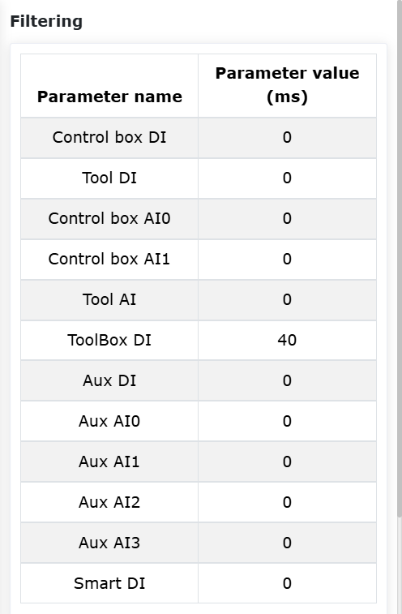

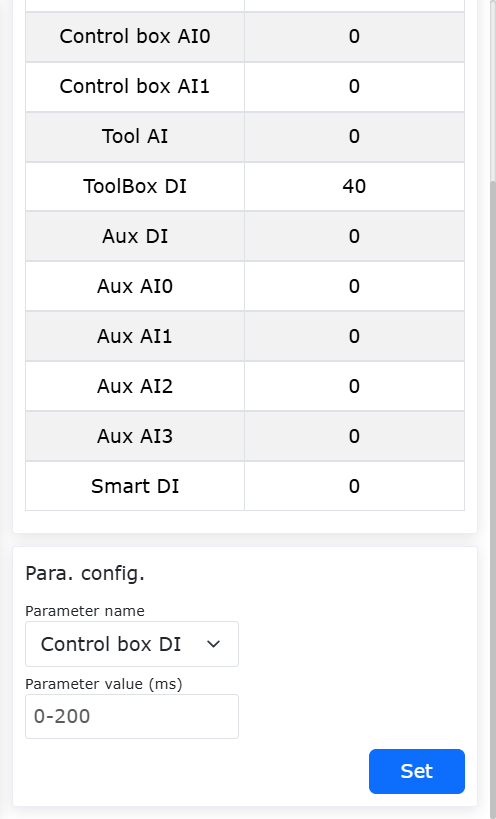

.. centered:: Wykres 6.5‑8 Interfejs filtrowania

.. important:: 
   Zakres czasu filtrowania I/O wynosi [0~200] ms.

Konfiguracja resetowania wyjść
~~~~~~~~~~~~~~~~~~~~~~~~~~~~~~~~~~~~~~~

Kliknij menu "Ustawienia początkowe" -> "Podstawowe" -> "Ustawienia I/O", kliknij podmenu "Resetowanie wyjść", aby przejść do interfejsu konfiguracji. W zależności od potrzeb dotyczących resetowania w rzeczywistym procesie użytkowania, skonfiguruj, czy różne wyjścia mają być resetowane po zatrzymaniu/wstrzymaniu. Obecnie wyjścia obejmują:

- DO skrzynki sterowniczej
- AO skrzynki sterowniczej
- DO płyty końcowej
- AO płyty końcowej
- Rozszerzone DO
- Rozszerzone AO
- SmartTool DO

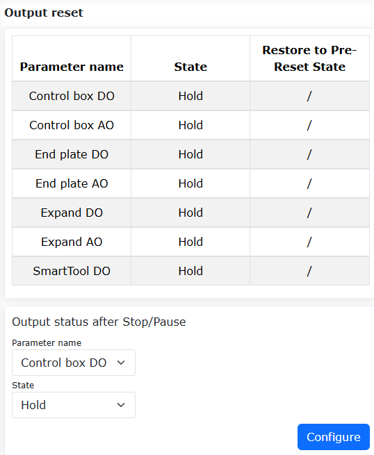

.. centered:: Wykres 6.5‑9 Konfiguracja resetowania wyjść

Funkcja konfigurowalnego stanu resetowania DO po wstrzymaniu/wznowieniu
~~~~~~~~~~~~~~~~~~~~~~~~~~~~~~~~~~~~~~~~~~~~~~~~~~~~~~~~~~~~~~~~~~~~~~~~~~~~~~~~~~~~~

Omówienie
++++++++++++++++++++++++
Funkcja ta optymalizuje istniejącą funkcję resetowania wyjść, dodając konfigurowalną opcję w ustawieniach I/O. Można ustawić jeden z dwóch typów: "Zachowaj" lub "Resetuj", gdzie resetowanie dzieli się dalej na "Przywróć stan sprzed resetu" i "Nie przywracaj stanu sprzed resetu". Użytkownik może ustawić różne opcje konfiguracji w zależności od rzeczywistych potrzeb.

Procedura operacyjna
+++++++++++++++++++++++++++++++
**Krok 1**: Kolejno kliknij "Ustawienia początkowe" - "Ustawienia I/O" - "Resetowanie wyjść". W zależności od rzeczywistych potrzeb użytkowania ustaw stan wyjścia DO lub AO po zatrzymaniu/wstrzymaniu. Stan może być ustawiony na "Zachowaj" lub "Resetuj". Tylko gdy ustawione jest "Resetuj", można dalej ustawić "Przywróć stan sprzed resetu".

**Krok 2**: Ustaw stan na "Zachowaj". Podczas działania programu Lua kliknij wstrzymaj, a następnie wznowij. Stan wyjścia DO/AO pozostaje niezmieniony przez cały czas, w stanie wyzwolonym. Podczas działania programu Lua kliknij zatrzymaj, stan wyjścia DO/AO się nie zmienia. Ustawienia parametrów pokazano na poniższym rysunku.

.. centered:: Wykres 6.5‑10 Ustawienie stanu na "Zachowaj"
 
**Krok 3**: Ustaw stan na "Resetuj", a "Przywróć stan sprzed resetu" ustaw na "Nie". Podczas działania programu Lua kliknij wstrzymaj, stan wyjścia DO/AO zostanie zresetowany. Po kliknięciu wznowij, stan wyjścia DO/AO nadal pozostanie zresetowany. Podczas działania programu Lua kliknij zatrzymaj, stan wyjścia DO/AO zostanie zresetowany. Ustawienia parametrów pokazano na poniższym rysunku.

.. image:: base/096.png
   :width: 4in
   :align: center

.. centered:: Wykres 6.5‑11 Ustawienie stanu na "Resetuj" + "Nie"

**Krok 4**: Ustaw stan na "Resetuj", a "Przywróć stan sprzed resetu" ustaw na "Tak". Podczas działania programu Lua kliknij wstrzymaj, stan wyjścia DO/AO zostanie zresetowany. Po kliknięciu wznowij, stan wyjścia DO/AO zostanie przeładowany. Podczas działania programu Lua kliknij zatrzymaj, stan wyjścia DO/AO zostanie zresetowany. Ustawienia parametrów pokazano na poniższym rysunku.

.. image:: base/097.png
   :width: 4in
   :align: center

.. centered:: Wykres 6.5‑12 Ustawienie stanu na "Resetuj" + "Tak"

Punkt początkowy zadania
-------------------------------------

W menu "Ustawienia początkowe" -> "Podstawowe" kliknij "Punkt początkowy zadania", aby przejść do interfejsu konfiguracji funkcji punktu początkowego zadania.

Ta strona wyświetla nazwę punktu początkowego zadania i informacje o pozycji stawów. Punkt początkowy zadania ma ustaloną nazwę pHome. Kliknij "Ustaw", aby ustawić bieżącą pozycję robota jako punkt początkowy zadania. Kliknij "Przejdź do tego punktu", a robot przemiesci się do punktu początkowego zadania. Ponadto w konfiguracji DI dodano konfigurowalną opcję przejścia do punktu początkowego zadania, a w konfiguracji DO dodano konfigurowalną opcję osiągnięcia punktu początkowego zadania.

.. image:: base/077.png
   :width: 4in
   :align: center

.. centered:: Wykres 6.6‑1 Punkt początkowy zadania

Funkcja automatycznej kalibracji TCP za pomocą czujnika fotoelektrycznego
--------------------------------------------------------------------------------

Omówienie
~~~~~~~~~~~~~~~~~~~~~~~~~~~~~~

Gdy pozycja TCP narzędzia robota ulegnie przesunięciu z powodu kolizji z narzędziem, można włączyć funkcję automatycznej kalibracji TCP opartej na czujniku fotoelektrycznym. Funkcja ta szybko ponownie kalibruje układ współrzędnych narzędzia poprzez automatyczne obliczanie i kompensację odchylenia pozycji, znacznie skracając przestoje i poprawiając wydajność sprzętu oraz stabilność produkcji.

Procedura operacyjna
~~~~~~~~~~~~~~~~~~~~~~~~~~~~~~

**Krok 1**: Umieść czujnik fotoelektryczny w przestrzeni roboczej robota. Podłącz dwie grupy brązowych, niebieskich i czarnych przewodów sygnałowych czujnika fotoelektrycznego odpowiednio do dwóch grup 24V, 0V i CI0, CI1 w skrzynce sterowniczej robota (dowolne dostępne konfigurowalne porty wejściowego sygnału cyfrowego) lub do dwóch grup 24V, 0V i End-DI0, End-DI1 na końcówce robota.

**Krok 2**: Kalibracja układu współrzędnych czujnika fotoelektrycznego. Układ współrzędnych czujnika fotoelektrycznego jest w istocie układem współrzędnych przedmiotu. Jego dokładność ma istotny wpływ na późniejszą kalibrację TCP narzędzia. Można go określić na kilka sposobów:

- (1) Stosując metodę kalibracji układu współrzędnych przedmiotu, początek układu to punkt przecięcia dwóch wiązek laserowych, dwie wiązki laserowe to odpowiednio oś X i oś Y, a oś Z jest skierowana prostopadle na zewnątrz czujnika fotoelektrycznego;
- (2) Poprzez zewnętrzne urządzenie pomiarowe (np. kamerę);
- (3) Używając konfiguracji urządzenia fotoelektrycznego w funkcji automatycznej kalibracji fotoelektrycznej. W tej opcji należy użyć narzędzia o znanych precyzyjnych wymiarach i w przybliżeniu dokładnego układu współrzędnych przedmiotu, a następnie zastosować: najpierw kliknij "Ustawienia początkowe" - "Współrzędne narzędzia", zastosuj układ współrzędnych narzędzia 0, następnie kliknij przycisk "Kalibracja układu współrzędnych" dla narzędzia o precyzyjnych wymiarach (na przykład układ współrzędnych 1), następnie kliknij "Zastosuj", a następnie wybierz "Automatyczna kalibracja fotoelektryczna".

.. image:: base/034.png
   :width: 4in
   :align: center

.. centered:: Wykres 6.7-1 Wybór automatycznej kalibracji fotoelektrycznej
 
Przejdź do treści "Skonfigurowano urządzenie fotoelektryczne", wykonaj konfigurację sygnału wyzwalającego I/O, ustaw punkt środkowy nauczania, ustaw parametry przesunięcia, a następnie kliknij "Uruchom", aby skalibrować układ współrzędnych czujnika. Następnie ręcznie zastosuj wyniki kalibracji do układu współrzędnych przedmiotu.

.. image:: base/035.png
   :width: 4in
   :align: center

.. centered:: Wykres 6.7-2 Kalibracja układu współrzędnych czujnika

**Krok 3**: Kalibracja układu współrzędnych narzędzia. Dzięki Krokowi 2 uzyskano dokładny układ współrzędnych przedmiotu i został on zastosowany, a także znany jest układ współrzędnych narzędzia przed kolizją i został on zastosowany. Najpierw kliknij "Ustawienia początkowe" - "Współrzędne narzędzia", zastosuj układ współrzędnych narzędzia 0, następnie kliknij przycisk "Kalibracja układu współrzędnych" dla układu współrzędnych narzędzia sprzed kolizji (na przykład układ współrzędnych 1), następnie kliknij "Zastosuj", a następnie wybierz "Automatyczna kalibracja fotoelektryczna". W "Skonfigurowano parametry kalibracji fotoelektrycznej" ustaw parametry kalibracji.

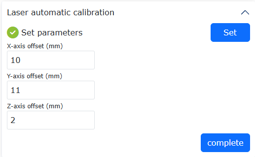

.. centered:: Wykres 6.7-3 Ustawianie parametrów kalibracji automatycznej kalibracji fotoelektrycznej
 
Po zakończeniu ustawiania kliknij przycisk "Zakończ", aby wrócić do poprzedniego menu, a następnie kliknij przycisk "Kalibruj", aby przeprowadzić kalibrację TCP. Po zakończeniu kalibracji kliknij przycisk "Zapisz", aby zapisać wyniki kalibracji.

.. image:: base/037.png
   :width: 4in
   :align: center

.. centered:: Wykres 6.7-4 Kalibracja i zapisywanie automatycznej kalibracji fotoelektrycznej

Kalibracja TCP za pomocą narzędzia płytkowego
------------------------------------------------

Omówienie
~~~~~~~~~

Podczas kalibracji TCP narzędzia za pomocą metody "czteropunktowej" konieczne jest ręczne sterowanie ruchem robota i precyzyjne pokrywanie punktów gołym okiem. Zarówno wydajność, jak i dokładność kalibracji zależą od doświadczenia operatora.

Zasada kalibracji TCP za pomocą narzędzia płytkowego jest następująca: wykorzystuje się wielokrotne dotknięcia narzędzia robota w dowolne miejsce płytki, a następnie buduje model kalibracji w celu wyznaczenia TCP narzędzia. Cały proces kalibracji odbywa się automatycznie, co zwiększa wydajność kalibracji i zmniejsza zależność od pracy człowieka.

Procedura operacyjna funkcji kalibracji TCP za pomocą narzędzia płytkowego
~~~~~~~~~~~~~~~~~~~~~~~~~~~~~~~~~~~~~~~~~~~~~~~~~~~~~~~~~~~~~~~~~~~~~~~~~~~

Zamocuj płytkę kalibracyjną w przestrzeni roboczej robota. Płytka nie może się trząść, a jej przewodność musi być dobra. Umieść końcówkę narzędzia mniej więcej prostopadle do płytki kalibracyjnej, około 50 mm nad płytką.

.. image:: base/043.png
   :width: 4in
   :align: center

.. centered:: Wykres 6.8‑1 Schemat rozmieszczenia kalibracji

Kolejno kliknij przyciski "Program nauczania" - "Programowanie", wybierz plik kalibracyjny "FR_CalibrateTheToolTcpPlane.lua" i otwórz go.

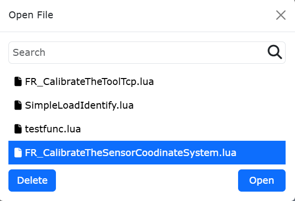

.. centered:: Wykres 6.8‑2 Otwieranie pliku kalibracyjnego

Kolejno kliknij "Ustawienia początkowe" -> "Podstawowe" -> "Układy współrzędnych" - przycisk "Narzędzie", aby przejść do interfejsu "Bieżący układ współrzędnych". W "Nazwa układu współrzędnych" wybierz układ współrzędnych do kalibracji (na przykład układ współrzędnych toolcord1), kliknij przycisk "Modyfikuj", aby przejść do interfejsu wyboru metody kalibracji TCP.

.. image:: base/001.png
   :width: 4in
   :align: center

.. centered:: Wykres 6.8‑3 Ustawianie układu współrzędnych narzędzia

W "Kreatorze modyfikacji" wybierz "Kalibracja narzędziem płytkowym", aby przejść do interfejsu kalibracji narzędziem płytkowym.

.. image:: base/045.png
   :width: 4in
   :align: center

.. centered:: Wykres 6.8‑4 Wybór metody kalibracji

W interfejsie "Kalibracja narzędziem płytkowym" kliknij przycisk "Wejdź", aby skonfigurować narzędzie płytkowe. Kliknij przycisk "Zapisz", aby zapisać punkt odniesienia kalibracji. Po zakończeniu konfiguracji kliknij przycisk "Zakończ", aby wrócić do interfejsu "Kalibracja narzędziem płytkowym".

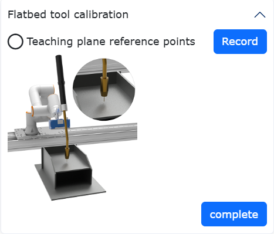

.. centered:: Wykres 6.8‑5 Konfiguracja narzędzia płytkowego

W interfejsie "Kalibracja narzędziem płytkowym" kliknij przycisk "Uruchom", a robot automatycznie przeprowadzi kalibrację TCP narzędzia. Po zakończeniu kalibracji wyświetlone zostaną współrzędne TCP narzędzia. Kliknij przycisk "Zapisz", a wyniki kalibracji zostaną zwrócone do interfejsu "Bieżący układ współrzędnych narzędzia".

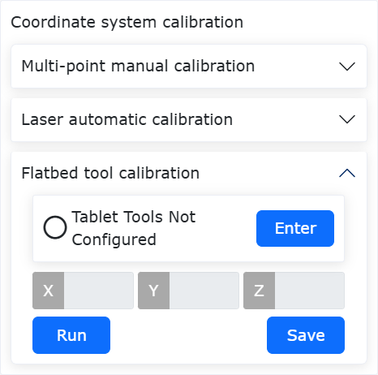

.. centered:: Wykres 6.8‑6 Wyniki kalibracji

W interfejsie "Bieżący układ współrzędnych narzędzia" kliknij przycisk "Zastosuj", aby zapisać i zastosować wyniki kalibracji TCP narzędzia.

.. image:: base/048.png
   :width: 4in
   :align: center

.. centered:: Wykres 6.8‑7 Zastosowanie wyników kalibracji

Funkcja śledzenia łuku z analogowym sprzężeniem zwrotnym skrzynki sterowniczej
-----------------------------------------------------------------------------------------------------

Omówienie
~~~~~~~~~~~~~~~~

Funkcja śledzenia łuku z analogowym sprzężeniem zwrotnym skrzynki sterowniczej zbiera analogowe sygnały napięcia i prądu spawarki w celu realizacji kompensacji śledzenia łuku. Funkcja ta jest realizowana przez konfigurację kanałów AI i AO odpowiadających analogowym sygnałom skrzynki sterowniczej.

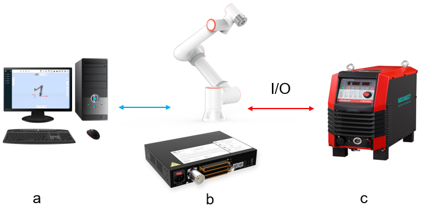

.. centered:: Wykres 6.9‑1 Schemat topologii funkcji śledzenia łuku opartej na komunikacji analogowej
.. centered:: a oznacza komputer; b oznacza robota i skrzynkę sterowniczą; c oznacza spawarkę

Procedura konfiguracji analogowego AI skrzynki sterowniczej
~~~~~~~~~~~~~~~~~~~~~~~~~~~~~~~~~~~~~~~~~~~~~~~~~~~~~~~~~~~~

W interfejsie sterowania sieciowego robota, kolejno kliknij "Ustawienia początkowe" -> "Podstawowe" -> "Ustawienia I/O" -> "AI", aby przejść do interfejsu "Konfiguracja AI".

W sekcji "Kanał śledzenia łuku" interfejsu "Konfiguracja AI", w listach rozwijanych "AI sterowania prądem spawania" i "AI sterowania napięciem spawania", wybierz odpowiednio "Ctrl-AI0" i "Ctrl-AI1" jako kanały analogowe dla prądu i napięcia. Kliknij odpowiednio "Konfiguruj", aby zakończyć konfigurację analogowego AI skrzynki sterowniczej.

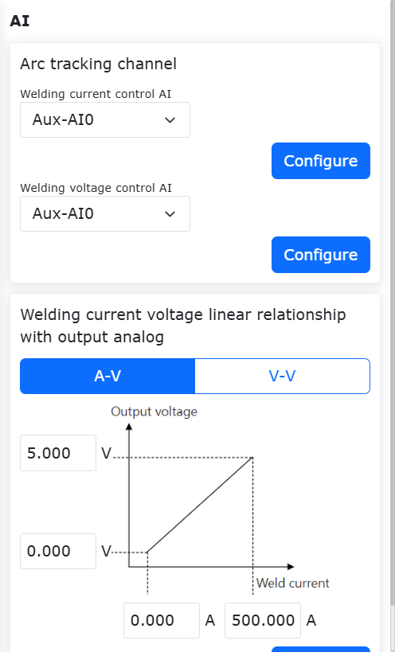

.. centered:: Wykres 6.9‑2 Konfiguracja kanałów AI

W sekcji "Wykres zależności analogowego prądu i napięcia" w konfiguracji kanałów AI pokazanej na powyższym rysunku, konfiguracja parametrów na interfejsach "A-V" i "V-V" wymaga odniesienia do tabeli/wykresu odbioru i wyjścia analogowego używanej spawarki.

Na przykład, skonfiguruj dolną i górną granicę prądu spawania dla analogowego AI prądu skrzynki sterowniczej odpowiednio jako 0 A i 500 A; skonfiguruj dolną i górną granicę napięcia wyjściowego dla analogowego AI prądu skrzynki sterowniczej odpowiednio jako 0 V i 5 V, jako parametry konfiguracyjne na interfejsie "A-V" w sekcji "Wykres zależności analogowego prądu i napięcia". Kliknij "Konfiguruj", aby zakończyć konfigurację analogowego kanału AI prądu skrzynki sterowniczej.

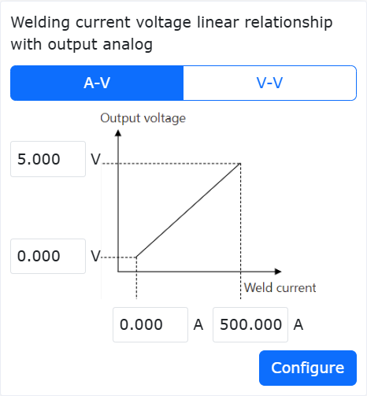

.. centered:: Wykres 6.9‑3 Konfiguracja analogowego AI prądu skrzynki sterowniczej

Na przykład, skonfiguruj dolną i górną granicę napięcia spawania dla analogowego AI napięcia skrzynki sterowniczej odpowiednio jako 0 V i 50 V; skonfiguruj dolną i górną granicę napięcia wyjściowego dla analogowego AI napięcia skrzynki sterowniczej odpowiednio jako 1,018 V i 10 V, jako parametry konfiguracyjne na interfejsie "V-V" w sekcji "Wykres zależności analogowego prądu i napięcia". Kliknij "Konfiguruj", aby zakończyć konfigurację analogowego kanału AI napięcia skrzynki sterowniczej.

.. image:: base/062.png
   :width: 3in
   :align: center

.. centered:: Wykres 6.9‑4 Konfiguracja analogowego AI napięcia skrzynki sterowniczej

Procedura konfiguracji analogowego AO skrzynki sterowniczej
~~~~~~~~~~~~~~~~~~~~~~~~~~~~~~~~~~~~~~~~~~~~~~~~~~~~~~~~~~~~~

W interfejsie sterowania sieciowego robota, kolejno kliknij "Ustawienia początkowe" -> "Urządzenia peryferyjne" -> "Spawarka", aby przejść do interfejsu "Konfiguracja spawarki".

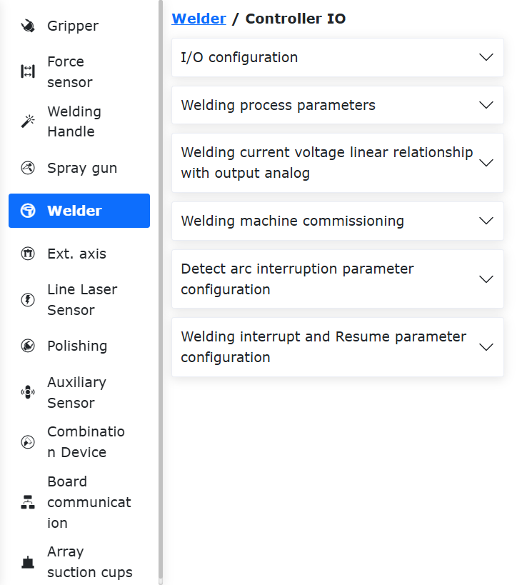

.. centered:: Wykres 6.9‑5 Konfiguracja spawarki

W sekcji "Konfiguracja I/O funkcji spawania" interfejsu "Konfiguracja spawarki", parametry na interfejsach "DI" i "DO" można konfigurować samodzielnie dla kanałów CI, CO skrzynki sterowniczej. W liście rozwijanej "Typ sterowania" wybierz "I/O kontrolera", aby przejść do procedury konfiguracji analogowego AO kontrolera.

W sekcji "Wykres zależności analogowego prądu i napięcia" interfejsu "Konfiguracja spawarki", konfiguracja parametrów na interfejsach "A-V" i "V-V" wymaga odniesienia do tabeli/wykresu odbioru i wyjścia analogowego używanej spawarki.

Na przykład, skonfiguruj dolną i górną granicę prądu spawania dla analogowego AO prądu skrzynki sterowniczej odpowiednio jako 0 A i 495 A; skonfiguruj dolną i górną granicę napięcia wyjściowego dla analogowego AO prądu skrzynki sterowniczej odpowiednio jako 1 V i 10 V, jako parametry konfiguracyjne dla analogowego prądu w konfiguracji kanału AO skrzynki sterowniczej.
Następnie w liście rozwijanej "AO sterowania prądem spawarki" wybierz "Ctrl-AO0" i kliknij "Konfiguruj", aby zakończyć konfigurację analogowego kanału AO prądu skrzynki sterowniczej.

.. image:: base/064.png
   :width: 3in
   :align: center

.. centered:: Wykres 6.9‑6 Konfiguracja analogowego AO prądu skrzynki sterowniczej

Na przykład, skonfiguruj dolną i górną granicę napięcia spawania dla analogowego AO napięcia skrzynki sterowniczej odpowiednio jako 10 V i 45 V; skonfiguruj dolną i górną granicę napięcia wyjściowego dla analogowego AO napięcia skrzynki sterowniczej odpowiednio jako 1 V i 10 V, jako parametry konfiguracyjne dla analogowego napięcia w konfiguracji kanału AO skrzynki sterowniczej.

Następnie w liście rozwijanej "AO sterowania napięciem spawarki" wybierz "Ctrl-AO1" i kliknij "Konfiguruj", aby zakończyć konfigurację analogowego kanału AO napięcia skrzynki sterowniczej.

.. image:: base/065.png
   :width: 3in
   :align: center

.. centered:: Wykres 6.9‑7 Konfiguracja analogowego AO napięcia skrzynki sterowniczej

Wykrywanie kolizji dla prostej szyny zębatej
----------------------------------------------------------------------

Omówienie
~~~~~~~~~~~~~~~~

Funkcja wykrywania kolizji dla prostej szyny zębatej służy do alarmowania i awaryjnego zatrzymania, gdy szyna lub robot zderzy się z obiektem środowiskowym podczas pracy asynchronicznej lub synchronicznej. Poprzez monitorowanie zmian sprzężenia zwrotnego momentu obrotowego szyny i na podstawie ustawionego progu określa się, czy nastąpiła kolizja. Jeśli tak, szyna natychmiast zatrzymuje ruch, zapobiegając w ten sposób wywieraniu ciągłej siły przez szynę i robota na uderzony obiekt, co może dodatkowo poprawić bezpieczeństwo współpracy człowiek-robot.

Funkcja wykrywania kolizji dla prostej szyny zębatej
~~~~~~~~~~~~~~~~~~~~~~~~~~~~~~~~~~~~~~~~~~~~~~~~~~~~

Funkcja wykrywania kolizji dla prostej szyny zębatej wymaga wykonania programu "Rail_Adaptation_Program.lua" po aktywacji szyny, aby zapewnić, że funkcja może dostosować się do różnych szyn i warunków obciążenia, uzyskując w ten sposób optymalną wydajność wykrywania kolizji. Jeśli adaptacja nie zostanie przeprowadzona, wydajność wykrywania kolizji znacznie się pogorszy, a siła zewnętrzna wyzwalająca kolizję będzie większa.

Ustawianie parametrów i załączanie prostej szyny zębatej
+++++++++++++++++++++++++++++++++++++++++++++++++++++++++++++

**Krok 1**: Zaloguj się do interfejsu sieciowego, kolejno kliknij "Ustawienia początkowe" → "Urządzenia peryferyjne" → "Oś rozszerzona", aby przejść do modułu ustawiania układu współrzędnych osi rozszerzonej, jak pokazano na rysunku.

.. image:: base/078.png
   :width: 4in
   :align: center

.. centered:: Wykres 6.10‑1 Moduł ustawiania układu współrzędnych osi rozszerzonej

**Krok 2**: W oparciu o rzeczywiste warunki pracy osi rozszerzonej i robota, ustaw parametry i wykonaj kalibrację w razie potrzeby. Na rysunku kliknij "Edytuj", ustaw nazwę układu współrzędnych osi rozszerzonej na "exaxis1", wybierz opcję "0 - prostoliniowa szyna przesuwna o jednym stopniu swobody" w sekcji "Wybór rozwiązania", wybierz numer osi rozszerzonej jako "1". Jeśli szyna i robot działają tylko asynchronicznie, kalibracja nie jest wymagana. Jeśli wymagana jest praca synchroniczna, kalibracja jest konieczna. Procedurę kalibracji można znaleźć w odpowiedniej instrukcji użytkownika lub skonsultować się z personelem technicznym. Po ustawieniu parametrów kliknij "Zapisz" i zastosuj odpowiedni układ współrzędnych, jak pokazano szczegółowo na rysunku 2-2.

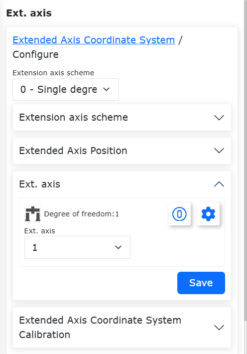

.. centered:: Wykres 6.10‑2 Ustawianie parametrów układu współrzędnych osi rozszerzonej

**Krok 3**: Ustanów komunikację UDP między osią rozszerzoną a robotem i upewnij się, że program PLC osi rozszerzonej może przesłać dane sprzężenia zwrotnego momentu obrotowego z silnika napędowego osi rozszerzonej po przejściu przez reduktor z powrotem do kontrolera robota. Kolejno kliknij "Ustawienia początkowe" → "Urządzenia peryferyjne" → "Oś rozszerzona", aby przejść do strony konfiguracji komunikacji UDP. Wybierz układ współrzędnych ustawiony w Kroku 2 i zastosuj go. Kliknij ikonę "Edytuj" w sekcji konfiguracji komunikacji UDP, aby przeprowadzić konfigurację komunikacji i załadować ją. Adresy IP PLC i laptopa muszą być zgodne z segmentem sieciowym kontrolera, co pokazano szczegółowo na rysunku 2-3. Należy pamiętać, że konieczne jest upewnienie się, że program PLC osi rozszerzonej może przesłać dane sprzężenia zwrotnego momentu obrotowego z silnika napędowego osi rozszerzonej po przejściu przez reduktor z powrotem do kontrolera robota, a okres próbkowania powinien wynosić 1 ms, jeśli to możliwe, i nie może przekraczać 4 ms. W przeciwnym razie funkcja wykrywania kolizji nie będzie działać.

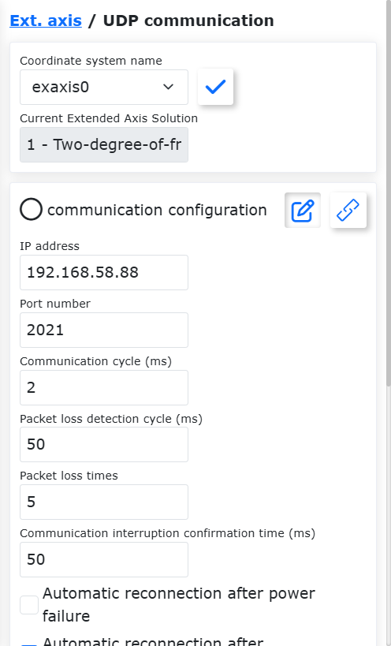

.. centered:: Wykres 6.10‑3 Strona konfiguracji komunikacji UDP

**Krok 4**: Ustaw parametry osi rozszerzonej UDP. Strona ustawiania parametrów osi rozszerzonej UDP pokazana jest na rysunku 2-4. Wybierz typ osi jako "Prostoliniowa szyna przesuwna", kierunek osi jako "Dodatni", a pozostałe parametry należy skonfigurować zgodnie z rzeczywistą sytuacją. Skok i rozdzielczość enkodera są stałe i zależą od szyny. Górne granice prędkości roboczej i przyspieszenia zależą od wydajności silnika. Górne granice użyte w teście tej funkcji są pokazane na rysunku 2-4. W przypadku konfiguracji różnych górnych granic należy skonsultować się z personelem technicznym.

.. image:: base/081.png
   :width: 4in
   :align: center

.. centered:: Wykres 6.10‑4 Ustawianie parametrów osi rozszerzonej UDP

**Krok 5**: Załącz prostą szynę zębatą i przesuń szynę do punktu początkowego. Załącz szynę zębatą za pomocą przycisku "Usuń załączenie" na rysunku 2-4 lub przycisku "Załącz serwo" na rysunku 2-5. Jeśli suwak na szynie znajduje się daleko od punktu początkowego, możesz przesunąć suwak do punktu początkowego za pomocą "Obrót w kierunku przeciwnym" lub "Obrót w kierunku zgodnym" (należy pamiętać, że prędkość robocza musi być znacznie niższa niż 15%). Po przesunięciu do punktu początkowego kliknij "Ustaw punkt zerowy" i wykonaj powrót do zera w trybie "Powrót do zera z bieżącej pozycji".

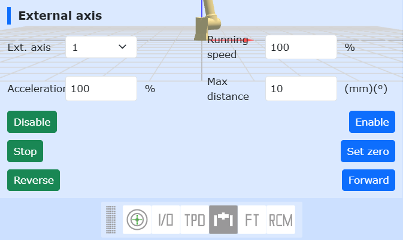

.. centered:: Wykres 6.10‑4 Załączanie prostej szyny zębatej i przemieszczanie
 
Włączanie funkcji wykrywania kolizji dla prostej szyny zębatej
++++++++++++++++++++++++++++++++++++++++++++++++++++++++++++++++++++++

**Krok 1**: Upewnij się, że zarówno szyna, jak i robot są zainstalowane w sposób normalny. Przed włączeniem funkcji wykrywania kolizji dla prostej szyny zębatej należy sprawdzić, czy sposób instalacji jest normalny. W szczególności najpierw upewnij się, że sposób instalacji szyny i robota jest normalny, następnie kolejno kliknij "Ustawienia początkowe" → "Podstawowe" → "Instalacja", aby przejść do strony instalacji swobodnej. Jeśli "Obrót podstawy" i "Nachylenie podstawy" wynoszą 0, oprogramowanie jest ustawione na instalację normalną. W przeciwnym razie należy je zmienić na 0. Jeśli nie są równe 0, interfejs wyświetli błąd, jak pokazano na rysunku 2-6.

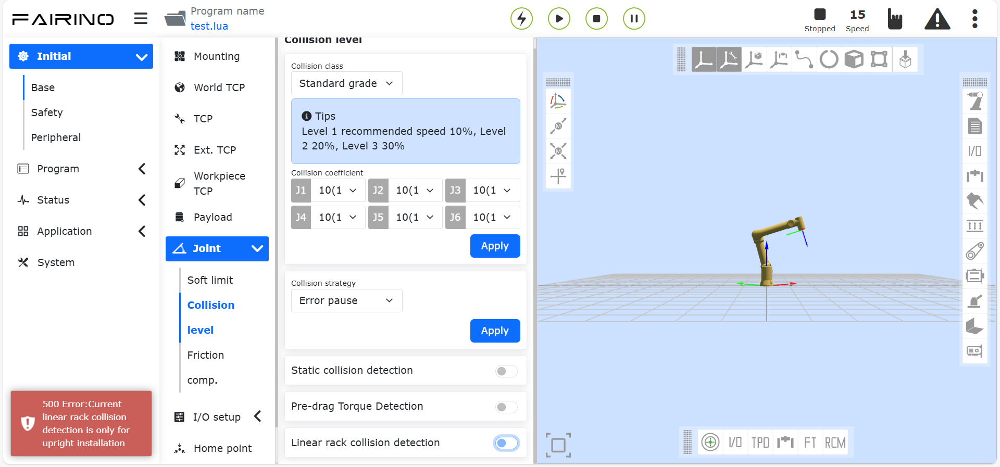

.. centered:: Wykres 6.10‑6 Jeśli sposób instalacji nie jest normalny, wyświetlony zostanie błąd

**Krok 2**: Włącz funkcję wykrywania kolizji dla prostej szyny zębatej i ustaw parametry. Kolejno kliknij "Ustawienia początkowe" → "Podstawowe" → "Stawy" → "Poziom kolizji", aby przejść do strony ustawiania poziomu kolizji. Po kliknięciu suwaka funkcji "Wykrywanie kolizji dla prostej szyny zębatej" ustaw promień koła zębatego i masę suwaka. Promień koła zębatego można obliczyć na podstawie skoku i przełożenia przekładni. Masa suwaka nie obejmuje robota i zamontowanego na końcówce obciążenia. Poziom szyny ma 11 opcji, z których Level1 najłatwiej wyzwala kolizję, a Level10 najtrudniej. Bezpośrednio po włączeniu zasilania kontrolera, przed wykonaniem programu adaptacyjnego, ustaw poziom kolizji na "Wyłączony".

.. image:: base/084.png
   :width: 4in
   :align: center

.. centered:: Wykres 6.10‑7 Funkcja wykrywania kolizji dla prostej szyny zębatej

**Krok 3**: Wykonaj program "Rail_Adaptation_Program.lua", aby dostosować bieżącą szynę. Po każdym ponownym uruchomieniu kontrolera należy wykonać program "Rail_Adaptation_Program.lua" (w celu zapobieżenia wpływowi zmian, takich jak typ robota, na charakterystykę dynamiczną szyny). Przed wykonaniem programu upewnij się, że poziom kolizji szyny jest ustawiony na "Wyłączony". W trybie automatycznym, przy prędkości interfejsu 100%, uruchom program lua. Po wykonaniu przez program jednego cyklu adaptacja jest zakończona i można zatrzymać działanie.

.. image:: base/085.png
   :width: 5in
   :align: center

.. centered:: Wykres 6.10‑8 Wykonanie programu "Rail_Adaptation_Program.lua" w celu dostosowania bieżącej szyny

**Krok 4**: Ustaw odpowiedni poziom kolizji szyny i wykonaj zadanie. Użytkownik może ustawić odpowiedni poziom kolizji szyny w zależności od wydajności sterownika silnika i prędkości roboczej zadania. Jeśli szyna i robot działają asynchronicznie, kolizja z robotem lub szyną może wyzwolić "Błąd kolizji osi 8, możliwy do zresetowania". W takim przypadku szyna zatrzymuje się, jak pokazano szczegółowo na rysunku 2-9. Jeśli szyna i robot działają synchronicznie, kolizja z robotem może wyzwolić alarm i spowodować zatrzymanie szyny, a robot zareaguje zgodnie z ustawioną strategią kolizji.

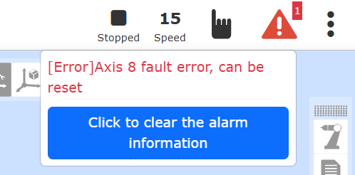

.. centered:: Wykres 6.10‑9 Szyna wyzwala błąd kolizji

Zerowanie z obciążeniem czujnika siły i parametry admitancji dla otwartej zgodności orientacji
-------------------------------------------------------------------------------------------------

Omówienie
~~~~~~~~~~~~~~~~

Funkcja zerowania z obciążeniem czujnika siły służy do szybkiego usunięcia danych dryftu zera czujnika podczas wymiany obciążenia, gdy robot przenosi szybkozmienną głowicę, bez konieczności demontażu szybkozmiennej głowicy. Parametry admitancji dla otwartej zgodności orientacji są udostępniane klientowi w celu regulacji orientacji w oparciu o rzeczywistą wielkość momentu w sterowaniu stałą siłą.

Zerowanie z obciążeniem czujnika siły
~~~~~~~~~~~~~~~~~~~~~~~~~~~~~~~~~~~~~~~~

**Krok 1**: Zainstaluj i aktywuj czujnik siły. W menu "Ustawienia początkowe" -> "Urządzenia peryferyjne" -> "Czujnik siły" kliknij "Zainstalowane urządzenia", aby przejść do interfejsu konfiguracji. Po zakończeniu konfiguracji czujnika siły wybierz numer skonfigurowanego czujnika siły, kliknij przycisk "Resetuj". Po wyświetleniu na stronie komunikatu o pomyślnym wysłaniu polecenia kliknij przycisk "Aktywuj", aby sprawdzić stan aktywacji w tabeli informacji o czujniku siły, co pozwoli określić, czy aktywacja się powiodła. Ponadto czujnik siły będzie miał wartość początkową. Użytkownik może wybrać "Korekta punktu zerowego" i "Usuń punkt zerowy" w zależności od potrzeb użytkowania, jak pokazano na rysunku. Korekta punktu zerowego czujnika siły wymaga upewnienia się, że czujnik siły jest skierowany pionowo w dół i że pod czujnikiem nie ma zamontowanego obciążenia.

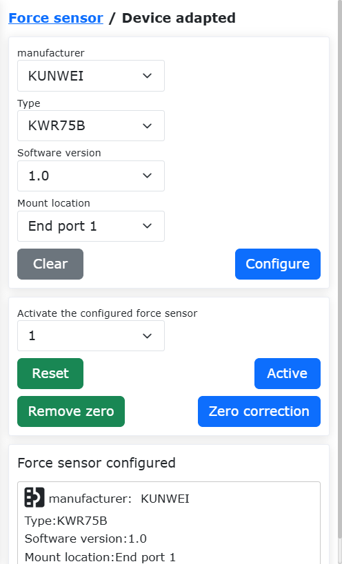

.. centered:: Wykres 6.11‑1 Informacje o konfiguracji czujnika siły

**Krok 2**: Identyfikacja obciążenia czujnika siły. W menu "Ustawienia początkowe" -> "Podstawowe" -> "Obciążenie" kliknij "Automatyczna identyfikacja", aby przejść do interfejsu obciążenia czujnika siły/momentu obrotowego. Wykonaj automatyczne zerowanie czujnika. Po zapisaniu pozycji początkowej przełącz robota w tryb automatyczny i kliknij "Automatyczne zerowanie", jak pokazano na rysunku 2-2.

.. image:: base/088.png
   :width: 4in
   :align: center

.. centered:: Wykres 6.11‑2 Identyfikacja obciążenia czujnika siły

**Krok 3**: Jeśli rzeczywiste obciążenie końcówki czujnika siły zostanie wymienione, w module konfiguracji obciążenia wprowadź masę obciążenia i współrzędne środka ciężkości, kliknij "Zastosuj", aby zaktualizować konfigurację obciążenia i zakończyć zerowanie z obciążeniem czujnika siły.

Parametry admitancji dla otwartej zgodności orientacji
~~~~~~~~~~~~~~~~~~~~~~~~~~~~~~~~~~~~~~~~~~~~~~~~~~~~~~~~~~~~~~~~

**Krok 1**: Kliknij "Ustawienia początkowe" -> "Podstawowe" -> "Współrzędne narzędzia", aby przejść do interfejsu ustawiania układu współrzędnych narzędzia. Wybierz "Nazwa układu współrzędnych" i ustaw parametry układu współrzędnych odpowiadające narzędziu końcowemu, jak pokazano na rysunku 3-1.

.. image:: base/089.png
   :width: 4in
   :align: center

.. centered:: Wykres 6.11‑3 Ustawianie układu współrzędnych narzędzia

**Krok 2**: Kliknij "Program nauczania" -> "Programowanie", napisz skrypt lua do sterowania stałą siłą, wybierz "Zestaw sterowania siłą" -> "Control", dodaj instrukcję ruchu ze sterowaniem siłą, ustaw "Zgodność orientacji" na "Włączony", ustaw współczynnik bezwładności i współczynnik tłumienia, ustaw maksymalny kąt regulacji jako próg kąta zgodności orientacji, jak pokazano na rysunku 3-2.

.. image:: base/090.png
   :width: 4in
   :align: center

.. centered:: Wykres 6.11‑4 Parametry admitancji dla otwartej zgodności orientacji

**Krok 3**: W interfejsie sieciowym kliknij "FT", ustaw odniesienie układu współrzędnych czujnika siły, wybierz odniesienie jako "Niestandardowy układ współrzędnych" i ustaw odpowiadające mu parametry układu współrzędnych na "0", jak pokazano na rysunku 3-3.

.. image:: base/091.png
   :width: 4in
   :align: center

.. centered:: Wykres 6.11‑4 Ustawianie odniesienia układu współrzędnych czujnika siły

**Krok 4**: Uruchom skrypt, sprawdź efekt zgodności orientacji. Regulacja parametru bezwładności wpływa na reakcję przyspieszenia i zdolność odporności na zakłócenia. Im większa bezwładność, tym bardziej wyraźne opóźnienie robota. Współczynnik tłumienia wpływa na gładkość podczas zgodności orientacji. Im większe tłumienie, tym trudniejsza jest zgodność orientacji.