Programowanie
=============

.. toctree:: 
   :maxdepth: 6

Wprowadzenie
~~~~~~~~~~~~

Kliknięcie polecenia po lewej stronie spowoduje dodanie węzła programu do drzewa programu. Podczas wykonywania programu, aktualnie wykonywany węzeł programu jest podświetlony na zielono.

W trybie ręcznym, kliknięcie pierwszej ikony po prawej stronie węzła pozwala robotowi samodzielnie wykonać tę instrukcję, druga ikona umożliwia edycję treści węzła.

.. image:: coding/001.png
   :width: 6in
   :align: center

.. centered:: Schemat 9.1-1 Interfejs drzewa programu

Kliknięcie „⇄” umożliwia przełączenie trybu i zmianę tekstu programu nauczania w stan edycji.

.. image:: coding/002.png
   :width: 6in
   :align: center

.. centered:: Schemat 9.1-2 Stan edycji programu nauczania

Opis ikon po prawej stronie nazwy programu jest następujący:

.. note:: 
   .. image:: coding/003.png
      :height: 0.75in
      :align: left

   Nazwa: **Rozwiń/Zwiń**

   Działanie: Rozwija/zawija interfejs drzewa programu

.. note:: 
   .. image:: coding/004.png
      :height: 0.75in
      :align: left

   Nazwa: **Dodaj punkt nauczania**

   Działanie: Dodaje lokalny punkt nauczania dla bieżącego programu

.. note:: 
   .. image:: coding/005.png
      :height: 0.75in
      :align: left

   Nazwa: **Zmień nazwę**

   Działanie: Zmienia nazwę bieżącego programu

Pasek narzędzi
~~~~~~~~~~~~~~

Użyj paska narzędzi u góry drzewa programu, aby je modyfikować.

.. note:: 
   .. image:: coding/006.png
      :height: 0.75in
      :align: left

   Nazwa: **Otwórz**

   Działanie: Otwiera plik programu użytkownika

.. note:: 
   .. image:: coding/007.png
      :height: 0.75in
      :align: left

   Nazwa: **Nowy**

   Działanie: Tworzy nowy plik programu na podstawie szablonu
   
.. note:: 
   .. image:: coding/008.png
      :height: 0.75in
      :align: left

   Nazwa: **Importuj**

   Działanie: Importuje plik do folderu programów użytkownika

.. note:: 
   .. image:: coding/009.png
      :height: 0.75in
      :align: left

   Nazwa: **Eksportuj**

   Działanie: Eksportuje plik programu użytkownika na komputer lokalny.

.. note:: 
   .. image:: coding/010.png
      :height: 0.75in
      :align: left

   Nazwa: **Zapisz**

   Działanie: Zapisuje edytowaną treść pliku

.. note:: 
   .. image:: coding/011.png
      :height: 0.75in
      :align: left

   Nazwa: **Zapisz jako**

   Działanie: Zmienia nazwę pliku i zapisuje go w folderze programów użytkownika lub szablonów.

.. note:: 
   .. image:: coding/012.png
      :height: 0.75in
      :align: left

   Nazwa: **Kopiuj**

   Działanie: Kopiuje węzeł i umożliwia użycie go w innej operacji (np. wklejenie w inne miejsce drzewa programu).

.. note:: 
   .. image:: coding/013.png
      :height: 0.75in
      :align: left

   Nazwa: **Wklej**

   Działanie: Umożliwia wklejenie wcześniej wyciętego lub skopiowanego węzła.

.. note:: 
   .. image:: coding/014.png
      :height: 0.75in
      :align: left

   Nazwa: **Wytnij**

   Działanie: Wycina węzeł i umożliwia użycie go w innej operacji (np. wklejenie w inne miejsce drzewa programu).

.. note:: 
   .. image:: coding/015.png
      :height: 0.75in
      :align: left

   Nazwa: **Usuń**

   Działanie: Usuwa węzeł z drzewa programu.

.. note:: 
   .. image:: coding/016.png
      :height: 0.75in
      :align: left

   Nazwa: **Przesuń w górę**

   Działanie: Przesuwa węzeł w górę.

.. note:: 
   .. image:: coding/017.png
      :height: 0.75in
      :align: left

   Nazwa: **Przesuń w dół**

   Działanie: Przesuwa węzeł w dół.

.. note:: 
   .. image:: coding/018.png
      :height: 0.75in
      :align: left

   Nazwa: **Przełącz tryb edycji**

   Działanie: Przełącza między trybem drzewa programu a trybem edycji lua.

Opis ikon w prawym górnym rogu:

.. note:: 
   .. image:: coding/240.png
      :height: 0.75in
      :align: left

   Nazwa: **Dodawanie/edycja programowania**

   Działanie: Dodaje/edytuje treść bieżącego polecenia programu

.. note:: 
   .. image:: coding/241.png
      :height: 0.75in
      :align: left

   Nazwa: **Model robota**

   Działanie: Powrót do interfejsu modelu 3D robota

.. note:: 
   .. image:: coding/242.png
      :height: 0.75in
      :align: left

   Nazwa: **Interfejs podprogramu NewDofile**

   Działanie: Gdy w bieżącym poleceniu programu znajduje się instrukcja NewDofile, kliknij, aby wybrać nazwę podprogramu i wyświetlić jego treść.

.. note:: 
   .. image:: coding/243.png
      :height: 0.75in
      :align: left

   Nazwa: **Ustawienia Modbus TCP**

   Działanie: Konfiguruje parametry komunikacji Modbus TCP

.. note:: 
   .. image:: coding/244.png
      :height: 0.75in
      :align: left

   Nazwa: **Kopia zapasowa bieżącego programu nauczania**

   Działanie: Rejestruje zmiany wprowadzone w bieżącym programie

.. note:: 
   .. image:: coding/245.png
      :height: 0.75in
      :align: left

   Nazwa: **Lokalny punkt nauczania**

   Działanie: Punkt nauczania stosowany tylko w bieżącym programie

Polecenia programu
~~~~~~~~~~~~~~~~~~

Po lewej stronie znajduje się głównie dodawanie poleceń programu. Kliknięcie ikony nad każdym słowem kluczowym otwiera szczegółowy interfejs dodawania poleceń programu po prawej stronie. Operacje dodawania poleceń programu do pliku dzielą się głównie na dwa typy:

- 1. Otwórz odpowiednią instrukcję i kliknij przycisk Zastosuj, aby dodać tę instrukcję do programu;
- 2. Najpierw kliknij przycisk „Dodaj”, polecenie nie zostanie jeszcze zapisane w pliku programu, należy ponownie kliknąć „Zastosuj”, aby zapisać polecenie w pliku.

Drugi sposób pojawia się głównie w przypadku jednoczesnego wysyłania wielu instrukcji tego samego typu. Dla tego typu poleceń dodajemy funkcję przycisku dodawania i wyświetlania już dodanej treści instrukcji. Kliknięcie przycisku dodawania dodaje jedną instrukcję, a wyświetlone już dodane instrukcje pokazują wszystkie dodane instrukcje. Kliknięcie „Zastosuj” zapisuje dodane instrukcje w aktualnie otwartym pliku po prawej stronie.

Interfejs instrukcji logicznych
~~~~~~~~~~~~~~~~~~~~~~~~~~~~~~~

.. image:: coding/019.png
   :width: 6in
   :align: center

.. centered:: Schemat 9.4 Interfejs instrukcji logicznych

Polecenie pętli
+++++++++++++++

Kliknij ikonę „Pętla”, aby otworzyć interfejs edycji polecenia While.

Wybierz scenariusz pętli dla polecenia While, scenariusze są następujące:

- Zawsze pętla
- Pętla o ograniczonej liczbie powtórzeń: wprowadź liczbę powtórzeń i nazwę zmiennej
- Pętla, gdy wyrażenie jest prawdziwe: kliknij pole wejściowe, aby otworzyć edytor wyrażeń, wybierz odpowiednie wyrażenie w zależności od przypadku użycia

.. image:: coding/020.png
   :width: 6in
   :align: center

.. centered:: Schemat 9.4-1-1 Interfejs instrukcji While

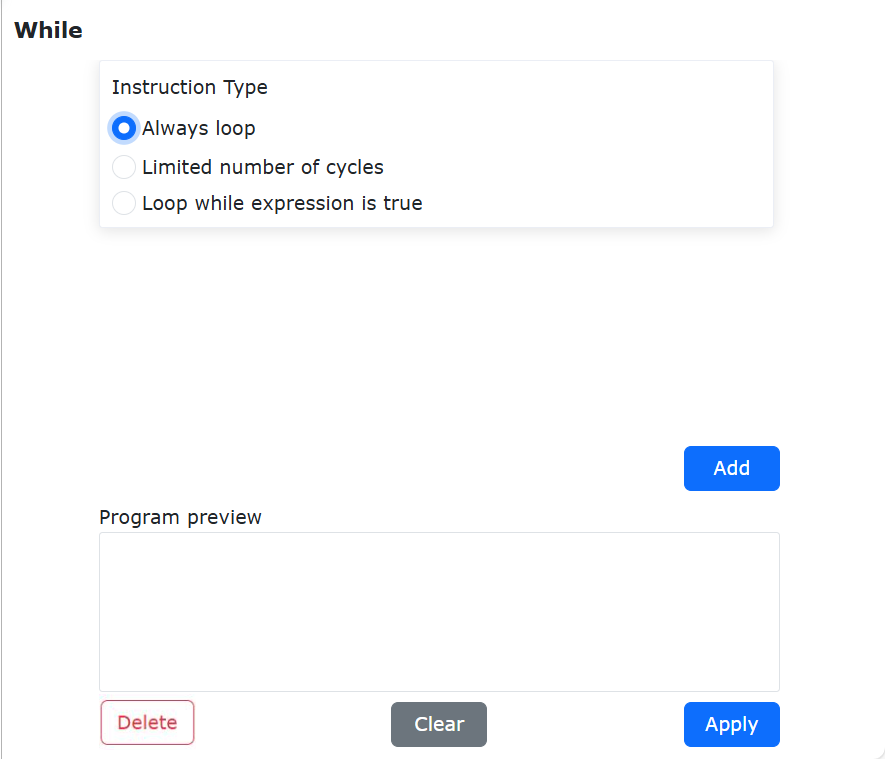

.. centered:: Schemat 9.4-1-2 Instrukcja While — zawsze pętla

.. image:: coding/237.png
   :width: 6in
   :align: center

.. centered:: Schemat 9.4-1-3 Instrukcja While — pętla o ograniczonej liczbie powtórzeń

.. image:: coding/238.png
   :width: 6in
   :align: center

.. centered:: Schemat 9.4-1-4 Instrukcja While — Edytor wyrażeń

.. image:: coding/239.png
   :width: 6in
   :align: center

.. centered:: Schemat 9.4-1-5 Instrukcja While — pętla, gdy wyrażenie jest prawdziwe

Dla wygody możesz dowolnie wprowadzić treść do, a w programie edytować inne instrukcje, aby je wstawić i zastąpić.

Polecenie warunkowe
+++++++++++++++++++

Kliknij przycisk „Warunek”, aby otworzyć interfejs edycji polecenia if…else.

To polecenie zawiera następujące przyciski:

- Dodaj else if: gdy nie istnieje wyrażenie „else”, kliknij ten przycisk, aby dodać wyrażenie „else if”
- Usuń else if: gdy istnieje wyrażenie „else if”, kliknij ten przycisk, aby usunąć wyrażenie „else if”
- Dodaj else: kliknij ten przycisk, aby dodać wyrażenie „else”
- Usuń else: kliknij ten przycisk, aby usunąć wyrażenie „else”

Po dodaniu za pomocą odpowiedniego przycisku kliknij pole wejściowe, aby otworzyć edytor wyrażeń i wybierz odpowiednie wyrażenie w zależności od przypadku użycia. Po zakończeniu dodawania kliknij „Dodaj”, „Zastosuj”.

Ta instrukcja wymaga pewnych podstaw programowania. W razie potrzeby skontaktuj się z nami.

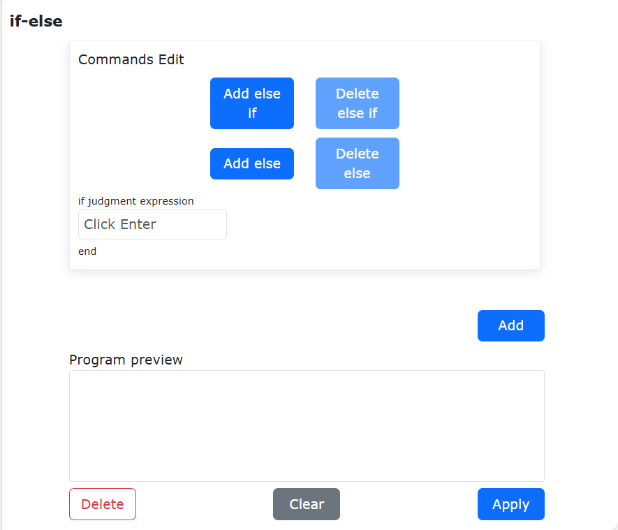

.. centered:: Schemat 9.4-2 Interfejs instrukcji if…else

Polecenie skoku
+++++++++++++++

Kliknij przycisk „Skok”, aby otworzyć interfejs edycji polecenia Goto.

Instrukcja Goto jest instrukcją skoku. Wprowadź instrukcję w polu wejściowym po prawej stronie. Po zakończeniu edycji kliknij „Dodaj”, „Zastosuj”. (Ta instrukcja wymaga pewnych podstaw programowania. W razie potrzeby skontaktuj się z nami)

.. image:: coding/022.png
   :width: 6in
   :align: center

.. centered:: Schemat 9.4-3 Interfejs instrukcji Goto

Polecenie oczekiwania
+++++++++++++++++++++

Kliknij ikonę „Oczekiwanie”, aby otworzyć interfejs edycji polecenia Wait.

Ta instrukcja jest instrukcją opóźnienia i składa się z trzech części: „WaitMs”, „WaitDI” i „WaitAI”.

Instrukcja „WaitTime” — jednostką czasu oczekiwania opóźnienia jest milisekunda. Wprowadź liczbę milisekund oczekiwania, kliknij „Dodaj”, „Zastosuj”.

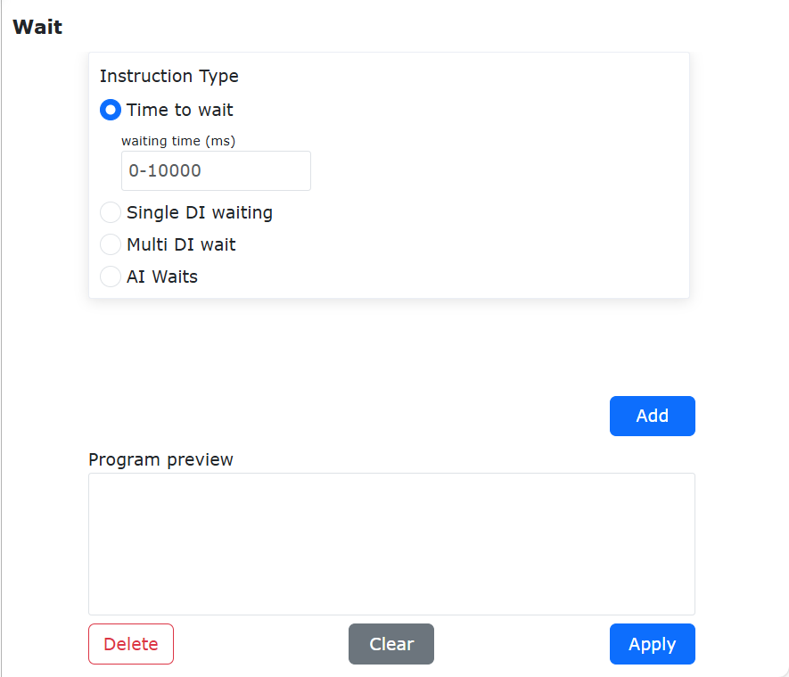

.. centered:: Schemat 9.4-4 Interfejs instrukcji WaitTime

Instrukcja „WaitDI”, czyli oczekiwanie na pojedynczy DI. Wybierz numer portu IO, na który chcesz czekać, stan oczekiwania, maksymalny czas oczekiwania i sposób obsługi przekroczenia czasu oczekiwania. Kliknij „Dodaj”, „Zastosuj”.

.. image:: coding/024.png
   :width: 6in
   :align: center

.. centered:: Schemat 9.4-5 Interfejs instrukcji WaitDI

Instrukcja „WaitMultiDI”, czyli oczekiwanie na wiele DI. Najpierw wybierz warunek spełnienia wielu DI, następnie zaznacz porty DI i stany, na które chcesz czekać, a na końcu ustaw maksymalny czas oczekiwania i sposób obsługi przekroczenia czasu oczekiwania. Kliknij „Dodaj”, „Zastosuj”.

.. image:: coding/025.png
   :width: 6in
   :align: center

.. centered:: Schemat 9.4-6 Interfejs instrukcji WaitMultiDI

Instrukcja „WaitAI”. Wybierz wartość analogową, na którą chcesz czekać, wartość, maksymalny czas oczekiwania oraz sposób obsługi przekroczenia czasu oczekiwania. Kliknij „Dodaj”, „Zastosuj”.

.. image:: coding/026.png
   :width: 6in
   :align: center

.. centered:: Schemat 9.4-7 Interfejs instrukcji WaitAI

Polecenie pauzy
+++++++++++++++

Kliknij ikonę „Pauza”, aby otworzyć interfejs edycji polecenia Pause.

Ta instrukcja jest instrukcją pauzy. Wstaw tę instrukcję do programu. Gdy program osiągnie tę instrukcję, robot zostanie wstrzymany. Aby kontynuować działanie, kliknij przycisk „Pauza/Wznów” w obszarze sterowania.

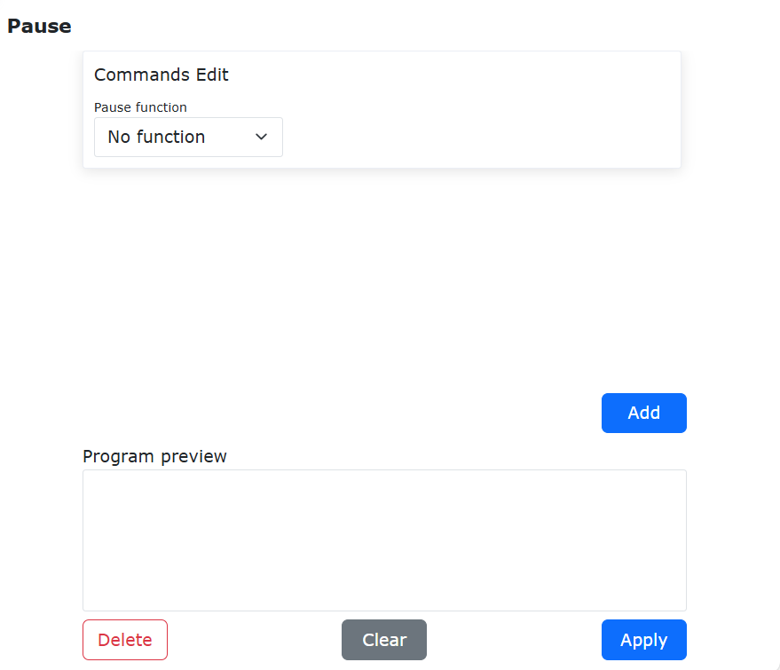

.. centered:: Schemat 9.4-8 Interfejs instrukcji Pause

Polecenie podprogramu
+++++++++++++++++++++

Kliknij ikonę „Podprogram”, aby otworzyć interfejs edycji polecenia Dofile.

Instrukcja Dofile wywołuje wewnętrzny program sterownika. Aby użyć instrukcji Dofile, należy zapisać wywoływany podprogram. Jeśli program główny nie uległ zmianie, nie trzeba go ponownie zapisywać. Instrukcja Dofile obsługuje wywołania drugiego poziomu. Należy zwrócić uwagę na dwa parametry: po pierwsze, na którym poziomie znajduje się to wywołanie, a po drugie, numer ID tego wywołania. W zasadzie ten sam program nie może mieć tego samego ID.

.. image:: coding/028.png
   :width: 6in
   :align: center

.. centered:: Schemat 9.4-9 Interfejs instrukcji Dofile

Polecenie zmiennej
++++++++++++++++++

Kliknij ikonę „Zmienna”, aby otworzyć interfejs edycji polecenia Var.

Ta instrukcja jest instrukcją systemu zmiennych. Dzieli się na definicję zmiennej Lua, zapytanie o zmienną oraz zmianę nazwy zmiennej Sys, pobranie wartości, ustawienie wartości. Definicja zmiennej Lua umożliwia zadeklarowanie zmiennej i nadanie jej wartości początkowej, używana w połączeniu z instrukcjami while, if-else itp. Instrukcja zapytania o zmienną Lua umożliwia bieżące odpytywanie wartości wprowadzonej nazwy zmiennej i wyświetlanie jej na pasku stanu. Liczba zmiennych Sys jest stała. Można je zmienić, pobrać wartość zmiennej oraz ustawić wartość zmiennej. Wartość zapisana w tej zmiennej nie jest zerowana po wyłączeniu systemu.

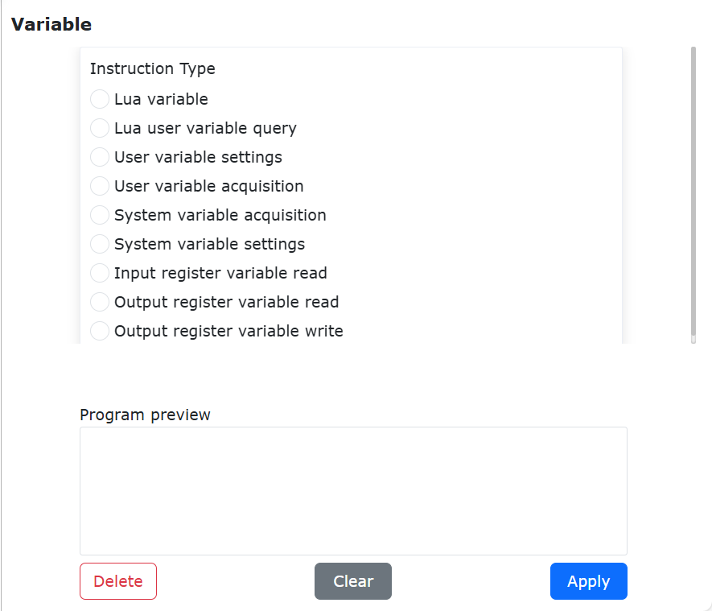

.. centered:: Schemat 9.4-10 Interfejs instrukcji Var

.. important:: Nazwa zmiennej musi zaczynać się od litery lub podkreślnika, nie może zaczynać się od cyfry ani innego znaku specjalnego.

Interfejs instrukcji ruchu
~~~~~~~~~~~~~~~~~~~~~~~~~~

.. image:: coding/030.png
   :width: 6in
   :align: center

.. centered:: Schemat 9.5 Interfejs instrukcji ruchu

Polecenie punkt-punkt
+++++++++++++++++++++

Kliknij ikonę „Punkt-punkt”, aby otworzyć interfejs edycji polecenia PTP.

Możesz wybrać punkt, do którego chcesz dotrzeć. Ustawienie czasu płynnego przejścia umożliwia ciągły ruch od tego punktu do następnego. Ustawienie przesunięcia — możesz wybrać przesunięcie względem układu bazowego lub przesunięcie względem układu narzędzia, a następnie wprowadzić wartości przesunięcia x, y, z, rx, ry, rz. Konkretna ścieżka PTP to optymalna ścieżka automatycznie zaplanowana przez sterownik ruchu. Kliknij „Dodaj”, „Zastosuj”, aby zapisać tę instrukcję.

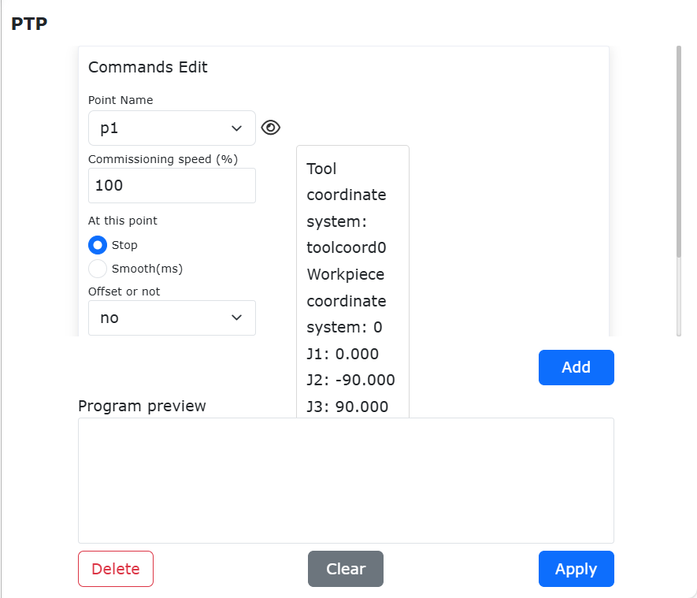

.. centered:: Schemat 9.5-1 Interfejs instrukcji PTP

Ruch względny punkt-punkt
**************************

Robot porusza się względnie o określoną odległość z bieżącej pozycji. Na stronie dodawania instrukcji PTP wybierz nazwę punktu jako „CurrentPos”, w zależności od sytuacji wybierz układ przesunięcia jako układ bazowy, układ narzędzia lub układ obiektu i wprowadź wartość przesunięcia. Oznacza to, że robot na podstawie bieżącej pozycji wykonuje określone przesunięcie wzdłuż zadanego układu współrzędnych. („CurrentPos” to punkt systemowy, nie wymaga nauczania)

.. image:: coding/515.png
   :width: 6in
   :align: center

.. centered:: Schemat 9.5-1-1 Instrukcja ruchu względnego PTP

Kliknij przycisk „Dodaj”, „Zastosuj”, aby dodać instrukcję ruchu względnego PTP robota do programu lua. Przełącz robota w tryb automatyczny, kliknij przycisk startu. W przykładowym programie robot przesunie się z bieżącej pozycji o 100 mm w kierunku X+ układu bazowego.

.. image:: coding/516.png
   :width: 6in
   :align: center

.. centered:: Schemat 9.5-1-2 Dodawanie instrukcji ruchu względnego PTP

Polecenie linii
+++++++++++++++

Kliknij ikonę „Linia”, aby otworzyć interfejs edycji polecenia Lin.

Funkcja tej instrukcji jest podobna do instrukcji „PTP”, ale ścieżka do punktu docelowego w tej instrukcji jest linią prostą.

.. image:: coding/032.png
   :width: 6in
   :align: center

.. centered:: Schemat 9.5-2 Interfejs instrukcji Lin

Ruch względny po linii prostej
******************************

Robot porusza się po linii prostej względnie o określoną odległość z bieżącej pozycji. Na stronie dodawania instrukcji LIN wybierz nazwę punktu jako „CurrentPos”, w zależności od sytuacji wybierz układ przesunięcia jako układ bazowy, układ narzędzia lub układ obiektu i wprowadź wartość przesunięcia. Oznacza to, że robot na podstawie bieżącej pozycji wykonuje określone przesunięcie wzdłuż zadanego układu współrzędnych. („CurrentPos” to punkt systemowy, nie wymaga nauczania)

.. image:: coding/517.png
   :width: 6in
   :align: center

.. centered:: Schemat 9.5-2-1 Instrukcja ruchu względnego LIN

Kliknij przycisk „Dodaj”, „Zastosuj”, aby dodać instrukcję ruchu względnego po linii prostej robota do programu lua. Przełącz robota w tryb automatyczny, kliknij przycisk startu. W przykładowym programie robot przesunie się z bieżącej pozycji o 100 mm w kierunku X+ układu bazowego.

.. image:: coding/518.png
   :width: 6in
   :align: center

.. centered:: Schemat 9.5-2-2 Dodawanie instrukcji ruchu względnego LIN

Ruch względny robota po linii prostej obsługuje funkcje takie jak wygładzanie, prędkość fizyczna, pozycjonowanie z poszukiwaniem drutu itp.

.. important:: Gdy wybrana nazwa punktu to „seamPos”, polecenie linii jest używane w scenariuszu spawania z czujnikiem laserowym. Ze względu na skumulowany błąd podczas użytkowania spawarki, dodano opcje „Czy przesunięcie” i „Wartość przesunięcia”.

   **Czy przesunięcie**: Nie, przesunięcie względem układu bazowego, przesunięcie względem układu narzędzia, przesunięcie względem surowych danych lasera;

   **Wartość przesunięcia**: ∆x, ∆y, ∆z, ∆rx, ∆ry, ∆rz, zakres: -300~300;

   .. image:: coding/033.png
      :width: 6in
      :align: center

   .. centered:: Schemat 9.5-2-3 Interfejs instrukcji Lin (scenariusz spawania)

Instrukcja LIN umożliwia wybór trybu prędkości ruchu jako „Procent” lub „Prędkość fizyczna”:

- Procent: Wprowadź procent prędkości testowej. Robot porusza się z procentem maksymalnej prędkości. Rzeczywista prędkość ruchu robota jest przeliczana jako: V = maksymalna prędkość robota × globalny procent prędkości × procent prędkości testowej. Najedź myszą na małe oko po prawej stronie pola wejściowego „Prędkość testowa”, aby wyświetlić rzeczywistą prędkość fizyczną (jednostka: mm/s) robota w trybie ręcznym i automatycznym przy aktualnie ustawionej prędkości testowej.

.. image:: coding/458.png
   :width: 5in
   :align: center

.. centered:: Schemat 9.5-2-4 Wprowadzenie procentu wyświetla rzeczywistą wartość prędkości fizycznej

- Prędkość fizyczna: Wprowadzona prędkość to rzeczywista prędkość robota, jednostka mm/s; wprowadzone przyspieszenie jest zwykle ustawiane jako 2-krotność prędkości. (Maksymalna prędkość fizyczna instrukcji LIN jest ograniczona przez globalny procent prędkości. Jeśli maksymalna prędkość robota wynosi 1000 mm/s, a prędkość globalna 50%, to maksymalna prędkość fizyczna instrukcji LIN wynosi 1000 × 50% = 500 mm/s).

.. image:: coding/459.png
   :width: 5in
   :align: center

.. centered:: Schemat 9.5-2-5 Wprowadzenie rzeczywistej prędkości fizycznej

Funkcja obsługi przekroczenia prędkości stawów w instrukcji LIN
***************************************************************

W przypadku korzystania z instrukcji ruchu liniowego w przestrzeni kartezjańskiej LIN, ograniczonym warunkiem planowania jest prędkość liniowa, ale podczas rzeczywistego działania, pod wpływem przestrzeni roboczej, prędkość kątowa stawów może już przekroczyć ograniczenia przy spełnieniu wymagań dotyczących prędkości liniowej. Ta funkcja implementuje opcjonalną strategię obsługi radzenia sobie z przekroczeniem prędkości stawów podczas ruchu LIN.

**Krok 1**: Kliknij przycisk instrukcji ruchu liniowego;

.. image:: coding/034.png
   :width: 6in
   :align: center

.. centered:: Schemat 9.5-3-1 Kliknięcie przycisku instrukcji ruchu liniowego

**Krok 2**: Wybierz punkt pośredni docelowy instrukcji ruchu liniowego;

.. image:: coding/035.png
   :width: 6in
   :align: center

.. centered:: Schemat 9.5-3-2 Wybór punktu pośredniego docelowego ruchu liniowego

**Krok 3**: Włącz przełącznik ochrony przed przekroczeniem prędkości stawów;

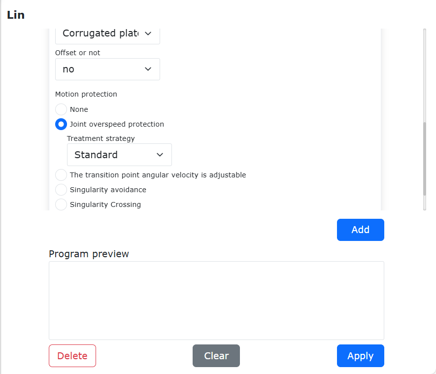

.. centered:: Schemat 9.5-3-3 Włączenie przycisku przełącznika ochrony przed przekroczeniem prędkości stawów

**Krok 4**: Wybierz strategię obsługi przekroczenia prędkości stawów (wybierz błąd przekroczenia prędkości lub automatyczne zmniejszenie prędkości, pozostałe to strategie domyślne bez ochrony);

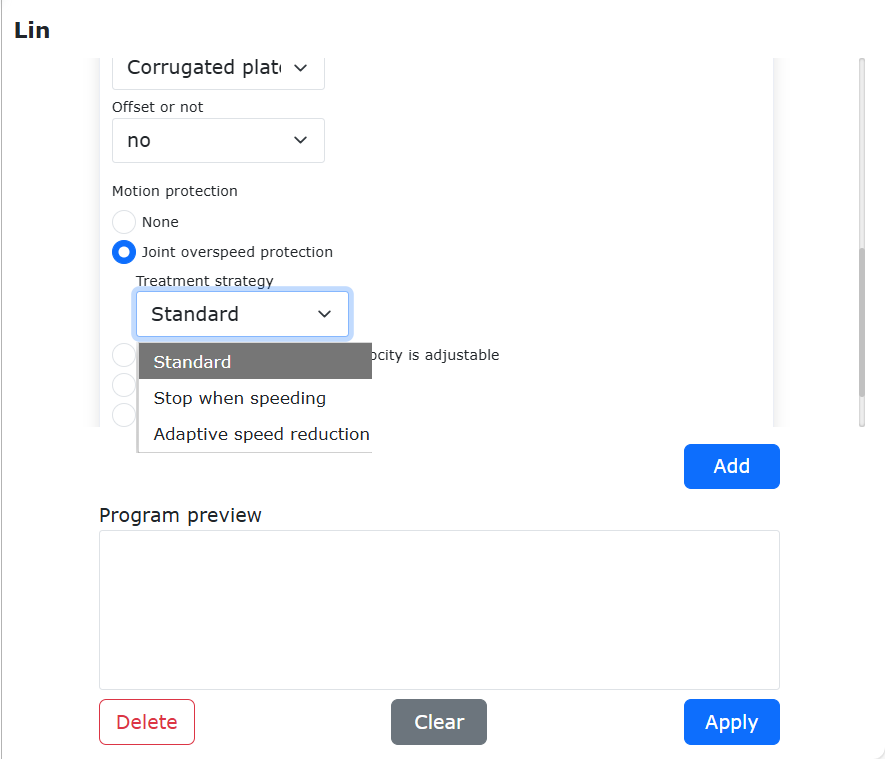

.. centered:: Schemat 9.5-3-4 Strategia obsługi przekroczenia prędkości stawów

**Krok 5**:
   Ustaw strategię obsługi i parametry strategii obsługi, kliknij przycisk dodawania, aby dodać instrukcję lua;

   W strategii automatycznego zmniejszania prędkości, próg zmniejszenia prędkości to procent zmniejszenia wartości prędkości liniowej w stosunku do ustawionej prędkości liniowej. Gdy wartość zmniejszenia prędkości przekroczy ustawiony próg, robot zgłosi błąd i zatrzyma się.

.. image:: coding/038.png
   :width: 6in
   :align: center

.. centered:: Schemat 9.5-3-5 Wybór i ustawienie strategii obsługi przekroczenia prędkości stawów

**Krok 6**: Dodana instrukcja lua ma postać jak na rysunku;

.. image:: coding/039.png
   :width: 6in
   :align: center

.. centered:: Schemat 9.5-3-6 Instrukcja lua

**Rozpoczęcie ochrony przed przekroczeniem prędkości**: JointOverSpeedProtectStart(a, b);
   a: numer strategii (zgodnie z kolejnością w rozwijanej liście)

   b: próg procentowy (0~100, działa tylko przy automatycznym zmniejszaniu prędkości)

**Zakończenie ochrony przed przekroczeniem prędkości**: JointOverSpeedProtectEnd();

.. note:: Ochrona ruchu przed „punktem osobliwym” — patrz opis funkcji przejścia przez punkt osobliwy w trybie automatycznym.

Funkcja regulacji prędkości kątowej przejścia postawy przy owijaniu
*******************************************************************

Gdy podczas procesu spawania wymagane jest spawanie owijające przedmiotu lub podczas planowania określonej linii prostej (duża zmiana postawy przy małej zmianie pozycji, ale wymagane szybkie przejście bez możliwości zwiększenia prędkości liniowej), można użyć tej funkcji.

**Krok 1**: Ustaw układ współrzędnych narzędzia, skalibruj wymiary i postawę palnika spawalniczego.

.. note:: Wartości na interfejsie są tylko przykładami. Należy dostosować do rzeczywistego stanu narzędzia.

.. image:: coding/246.png
   :width: 4in
   :align: center

.. centered:: Schemat 9.5-3-7 Ustawienie układu współrzędnych narzędzia

**Krok 2**: Kliknij „Program nauczania”, wybierz „Programowanie”, w kategorii „Instrukcje ruchu” wybierz „Linia”.

.. image:: coding/032.png
   :width: 6in
   :align: center

.. centered:: Schemat 9.5-3-8 Interfejs ustawień instrukcji linii

**Krok 3**: Ustaw punkt początkowy każdego odcinka linii spawania owijającego jako punkt przejściowy. Włącz przycisk „Regulacja prędkości kątowej punktu przejściowego”, ustaw maksymalny procent przyspieszenia (domyślnie maksymalna prędkość kątowa 100% to 360°/s).

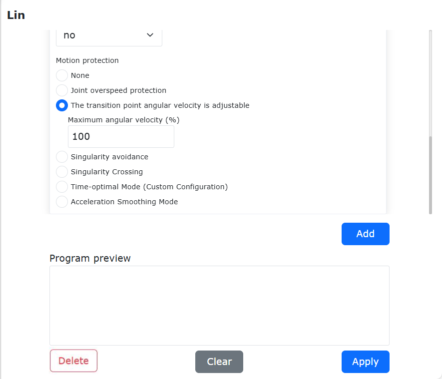

.. centered:: Schemat 9.5-3-9 Interfejs konfiguracji parametrów regulacji prędkości kątowej punktu przejściowego

**Krok 4**: Kliknij przycisk „Dodaj”, aby wygenerować instrukcję linii zawierającą regulację prędkości kątowej postawy przejściowej.

.. image:: coding/249.png
   :width: 6in
   :align: center

.. centered:: Schemat 9.5-3-10 Dodanie instrukcji ruchu liniowego z punktem przejściowym

**Krok 5**: Robot kończy przejście postawy w punkcie początkowym, normalnie wykonuje instrukcję ruchu liniowego do końca tego odcinka, wyłącz przycisk „Regulacja prędkości kątowej punktu przejściowego” i dodaj punkt końcowy.

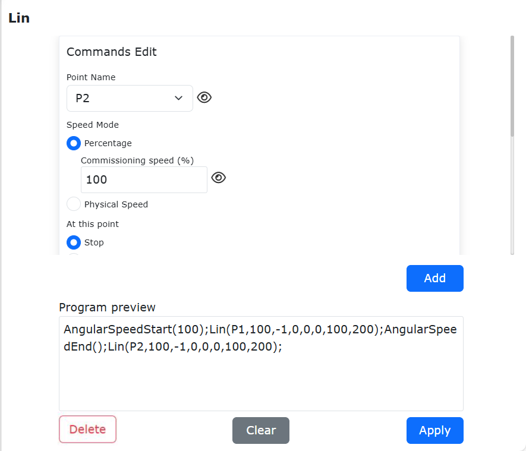

.. centered:: Schemat 9.5-3-11 Wstawienie końca linii prostej

**Krok 6**: Kliknij przycisk „Zastosuj”, aby wygenerować odpowiednią instrukcję LUA.

.. image:: coding/251.png
   :width: 6in
   :align: center

.. centered:: Schemat 9.5-3-12 Wygenerowanie instrukcji LUA linii prostej zawierającej punkt przejściowy

Kompletne spawanie owijające zwykle ma wiele punktów przejściowych. W przypadku owijania pokazanego na rysunku 7, w procesie spawania występują dwa punkty przejściowe postawy, w których pozycja zmienia się niewiele, a postawa zmienia się znacząco.

Punkt 1 jest początkiem pierwszego odcinka spawania, punkt 2 jest końcem pierwszego odcinka spawania;

Punkt 3 jest początkiem drugiego odcinka spawania, punkt 4 jest końcem drugiego odcinka spawania;

Punkt 5 jest początkiem trzeciego odcinka spawania, punkt 6 jest końcem trzeciego odcinka spawania.

Przejście postawy następuje od końca poprzedniego odcinka spawania do początku następnego odcinka spawania, dlatego konieczne jest dodanie instrukcji regulacji prędkości kątowej postawy na początku następnego odcinka spawania. Dzięki temu maksymalna prędkość liniowa pozostaje niezmieniona podczas przejścia postawy owijającej, a maksymalna prędkość kątowa wzrasta, co pozwala na płynne działanie procesu spawania owijającego.

.. image:: coding/252.png
   :width: 4in
   :align: center

.. centered:: Schemat 9.5-3-13 Przykład procesu spawania owijającego

Polecenie łuku
++++++++++++++

Kliknij ikonę „Łuk”, aby otworzyć interfejs edycji polecenia Arc.

Instrukcja „Arc” to ruch łukowy, zawiera trzy punkty: pierwszy punkt to punkt początkowy łuku, drugi to pośredni punkt przejściowy łuku, trzeci to punkt końcowy.

Zarówno dla punktu przejściowego, jak i punktu końcowego można ustawić, czy mają być przesunięte. Można wybrać przesunięcie względem układu bazowego, przesunięcie względem układu narzędzia lub przesunięcie względem układu obiektu. Wyświetlone zostaną ustawienia wartości przesunięcia x, y, z, rx, ry, rz. Dla punktu końcowego można ustawić promień płynnego przejścia, aby uzyskać efekt ciągłości ruchu.

.. important::
   Ruch łukowy wymaga najpierw dodania instrukcji PTP lub Lin, aby przemieścić się do punktu początkowego.

.. image:: coding/040.png
   :width: 6in
   :align: center

.. centered:: Schemat 9.5-4 Interfejs instrukcji Arc

Instrukcja ARC umożliwia wybór trybu prędkości ruchu jako „Procent” lub „Prędkość fizyczna”:

- Procent: Wprowadź procent prędkości testowej. Robot porusza się z procentem maksymalnej prędkości. Rzeczywista prędkość ruchu robota jest przeliczana jako: V = maksymalna prędkość robota × globalny procent prędkości × procent prędkości testowej. Najedź myszą na małe oko po prawej stronie pola wejściowego „Prędkość testowa”, aby wyświetlić rzeczywistą prędkość fizyczną (jednostka: mm/s) robota w trybie ręcznym i automatycznym przy aktualnie ustawionej prędkości testowej.

.. image:: coding/461.png
   :width: 5in
   :align: center

.. centered:: Schemat 9.5-4-1 Wprowadzenie procentu wyświetla rzeczywistą wartość prędkości fizycznej

- Prędkość fizyczna: Wprowadzona prędkość to rzeczywista prędkość robota, jednostka mm/s; wprowadzone przyspieszenie jest zwykle ustawiane jako 2-krotność prędkości. (Maksymalna prędkość fizyczna instrukcji LIN jest ograniczona przez globalny procent prędkości. Jeśli maksymalna prędkość robota wynosi 1000 mm/s, a prędkość globalna 50%, to maksymalna prędkość fizyczna instrukcji LIN wynosi 1000 × 50% = 500 mm/s).

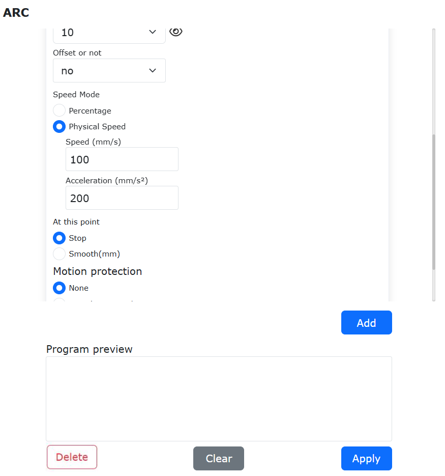

.. centered:: Schemat 9.5-4-2 Wprowadzenie rzeczywistej prędkości fizycznej

Polecenie pełnego okręgu
++++++++++++++++++++++++

Kliknij ikonę „Pełny okrąg”, aby otworzyć interfejs edycji polecenia Circle.

Robot współpracujący może wykonywać ruch trajektorią pełnego okręgu poprzez dodanie instrukcji pełnego okręgu. Przed dodaniem instrukcji pełnego okręgu należy nauczyć 3 punkty ścieżki na trajektorii pełnego okręgu. Zakładając, że trzy punkty ścieżki na trajektorii pełnego okręgu to odpowiednio „P1”, „P2”, „P3”, gdzie „P1” jest punktem początkowym trajektorii pełnego okręgu, „P2” i „P3” są odpowiednio punktem pośrednim 1 i punktem pośrednim 2 trajektorii pełnego okręgu. Przesuń robota do wyżej wymienionych trzech punktów i dodaj nazwy punktów nauczania odpowiednio jako „P1”, „P2”, „P3”.

.. important::
   Ruch trajektorią pełnego okręgu wymaga najpierw dodania instrukcji PTP lub Lin, aby przemieścić się do punktu początkowego.

.. image:: coding/042.png
   :width: 3in
   :align: center

.. centered:: Schemat 9.5-5 Trajektoria pełnego okręgu

.. image:: coding/043.png
   :width: 3in
   :align: center

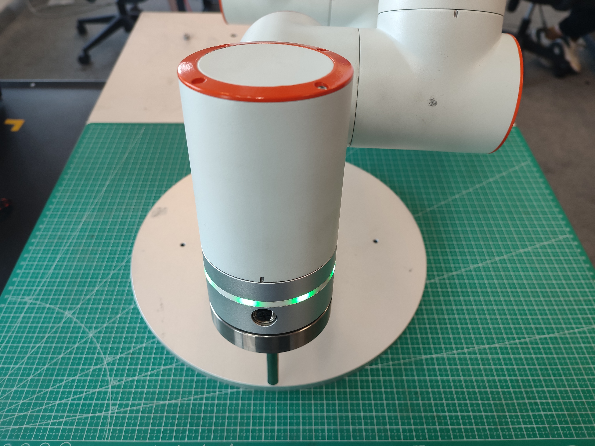

.. image:: coding/045.png
   :width: 3in
   :align: center

.. centered:: Schemat 9.5-6 Nauczanie punktów „P1”, „P2”, „P3”

Dodawanie instrukcji pełnego okręgu
***********************************

**Krok 1**: Utwórz nowy program użytkownika „testCircle.lua”, kliknij przycisk „Pełny okrąg”, aby otworzyć stronę dodawania instrukcji pełnego okręgu.

.. image:: coding/046.png
   :width: 6in
   :align: center

.. centered:: Schemat 9.5-7 Przycisk dodawania instrukcji pełnego okręgu

**Krok 2**: Na stronie dodawania instrukcji pełnego okręgu wybierz sposób ruchu punktu początkowego i punkt początkowy jako „P1”.

.. image:: coding/050.png
   :width: 6in
   :align: center

.. centered:: Schemat 9.5-8 Sposób ruchu punktu początkowego i punkt początkowy „P1”

**Krok 3**: Na stronie dodawania instrukcji pełnego okręgu wybierz „Punkt pośredni 1 pełnego okręgu” jako punkt „P2”, a „Punkt pośredni 2 pełnego okręgu” jako punkt „P3”.

.. image:: coding/465.png
   :width: 6in
   :align: center

.. centered:: Schemat 9.33-9 Wybór punktu pośredniego łuku i punktu końcowego

**Krok 4**: Wybierz tryb prędkości i wprowadź wartość prędkości.

Instrukcja Circle umożliwia wybór trybu prędkości ruchu jako „Procent” lub „Prędkość fizyczna”:

- Procent: Wprowadź procent prędkości testowej. Robot porusza się z procentem maksymalnej prędkości. Rzeczywista prędkość ruchu robota jest przeliczana jako: V = maksymalna prędkość robota × globalny procent prędkości × procent prędkości testowej. Najedź myszą na małe oko po prawej stronie pola wejściowego „Prędkość testowa”, aby wyświetlić rzeczywistą prędkość fizyczną (jednostka: mm/s) robota w trybie ręcznym i automatycznym przy aktualnie ustawionej prędkości testowej.

.. image:: coding/466.png
   :width: 5in
   :align: center

.. centered:: Schemat 9.33-10 Wprowadzenie procentu wyświetla rzeczywistą wartość prędkości fizycznej

- Prędkość fizyczna: Wprowadzona prędkość to rzeczywista prędkość robota, jednostka mm/s; wprowadzone przyspieszenie jest zwykle ustawiane jako 2-krotność prędkości. (Maksymalna prędkość fizyczna instrukcji LIN jest ograniczona przez globalny procent prędkości. Jeśli maksymalna prędkość robota wynosi 1000 mm/s, a prędkość globalna 50%, to maksymalna prędkość fizyczna instrukcji LIN wynosi 1000 × 50% = 500 mm/s).

.. image:: coding/467.png
   :width: 5in
   :align: center

.. centered:: Schemat 9.33-11 Wprowadzenie rzeczywistej prędkości fizycznej

**Krok 5**: Kolejno kliknij przycisk „Dodaj” i przycisk „Zastosuj”. W tym momencie „testCircle.lua” ma już dodaną instrukcję ruchu pełnego okręgu.

.. image:: coding/468.png
   :width: 6in
   :align: center

.. centered:: Schemat 9.33-12 Dodawanie instrukcji ruchu pełnego okręgu

**Krok 5**: W tym momencie „testCircle.lua” ma już dodaną instrukcję ruchu pełnego okręgu.

Przełącz robota w tryb automatyczny i uruchom program, upewniając się, że jest bezpieczny. Robot będzie poruszał się po trajektorii pełnego okręgu.

Przesunięcie trajektorii pełnego okręgu
****************************************

Ruch pełnego okręgu robota współpracującego obsługuje przesunięcie pozycji punktu pośredniego 1 i punktu pośredniego 2 trajektorii pełnego okręgu. Typy przesunięcia obejmują następujące dwa typy:

**Takie samo przesunięcie dla dwóch punktów pośrednich trajektorii pełnego okręgu**: Punkt pośredni 1 trajektorii pełnego okręgu (punkt „P2”) i punkt pośredni 2 trajektorii pełnego okręgu (punkt „P3”) są przesunięte o to samo przesunięcie ∆(dx, dy, dz, drx, dry, drz).

**Różne przesunięcie dla dwóch punktów pośrednich trajektorii pełnego okręgu**: Punkt pośredni 1 trajektorii pełnego okręgu (punkt „P2”) i punkt pośredni 2 trajektorii pełnego okręgu (punkt „P3”) są przesunięte odpowiednio o dwa różne przesunięcia ∆1(dx1, dy1, dz1, drx1, dry1, drz1) i ∆2(dx2, dy2, dz2, drx2, dry2, drz2).

Poniżej przedstawiono odpowiednio użycie „takiego samego przesunięcia” i „różnego przesunięcia”.

1. Takie samo przesunięcie

Jak pokazano, otwórz stronę dodawania instrukcji pełnego okręgu, wybierz „Typ przesunięcia” jako „Takie samo przesunięcie”, wybierz również sposób ruchu punktu początkowego i punkt początkowy jako „P1”, a punkt pośredni 1 pełnego okręgu jako „P2”.

.. image:: coding/051.png
   :width: 6in
   :align: center

.. centered:: Schemat 9.5-12 Takie samo przesunięcie dla pełnego okręgu

Wybierz punkt pośredni 2 pełnego okręgu jako „P3”, a „Czy przesunięcie” wybierz „Przesunięcie względem układu bazowego”.

.. note:: Możesz wybrać „Przesunięcie względem układu narzędzia” lub „Przesunięcie względem układu obiektu” w zależności od rzeczywistej sytuacji pracy.

Wprowadź wartość przesunięcia dx = 10 mm, kolejno kliknij przycisk „Dodaj” i „Zastosuj” na dole strony.

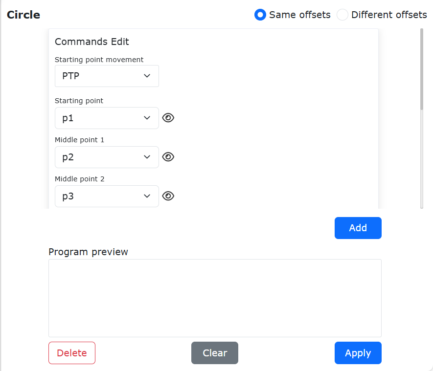

.. centered:: Schemat 9.5-13 Ustawienie wartości przesunięcia

W tym momencie do programu „testCircle.lua” została dodana instrukcja pełnego okręgu, w której punktem początkowym jest „P1”, a oba punkty pośrednie „P2” i „P3” są przesunięte o 10 mm wzdłuż osi X układu bazowego.

.. image:: coding/053.png
   :width: 6in
   :align: center

.. centered:: Schemat 9.5-14 Program z takim samym przesunięciem dla pełnego okręgu

Przełącz robota w tryb automatyczny i uruchom program, upewniając się, że jest bezpieczny. Rzeczywista trajektoria ruchu robota przechodzi przez okrąg wyznaczony przez punkty „P1”, „P2” i „P3”, gdzie „P2” to oryginalny punkt „P2” przesunięty o 10 mm w kierunku X, a „P3” to oryginalny punkt „P3” przesunięty o 10 mm w kierunku X.

.. image:: coding/054.png
   :width: 3in
   :align: center

.. centered:: Schemat 9.5-15 Trajektoria przy takim samym przesunięciu X10 mm

2. Różne przesunięcie

Otwórz stronę dodawania instrukcji pełnego okręgu, wybierz „Typ przesunięcia” jako „Różne przesunięcie”, wybierz również sposób ruchu punktu początkowego i punkt początkowy jako „P1”, a punkt pośredni 1 pełnego okręgu jako „P2”, „Czy przesunięcie” wybierz jako „Przesunięcie względem układu bazowego”.

.. note:: Możesz wybrać „Przesunięcie względem układu narzędzia” lub „Przesunięcie względem układu obiektu” w zależności od rzeczywistej sytuacji pracy.

Wprowadź wartość przesunięcia dy = 10 mm.

.. image:: coding/055.png
   :width: 6in
   :align: center

.. centered:: Schemat 9.5-16 Różne przesunięcie

Wybierz punkt pośredni pełnego okręgu jako „P3”, „Czy przesunięcie” wybierz jako „Przesunięcie względem układu bazowego”.

.. note:: Możesz wybrać „Przesunięcie względem układu narzędzia” lub „Przesunięcie względem układu obiektu” w zależności od rzeczywistej sytuacji pracy.

Wprowadź wartość przesunięcia dx = 10 mm, kolejno kliknij przycisk „Dodaj” i „Zastosuj” na dole strony.

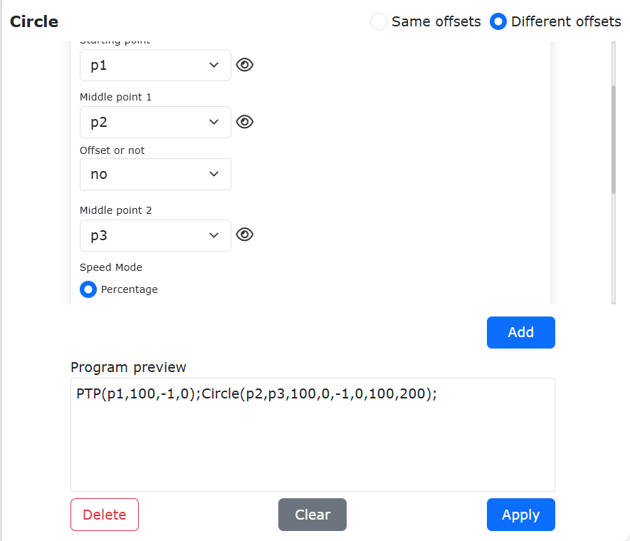

.. centered:: Schemat 9.5-17 Ustawienie przesunięcia dla punktu pośredniego 2 przy różnych przesunięciach

W tym momencie do programu „testCircle.lua” została dodana instrukcja pełnego okręgu, w której punktem początkowym jest „P1”, punkt pośredni „P2” jest przesunięty o 10 mm w kierunku Y układu bazowego, a punkt „P3” jest przesunięty o 10 mm w kierunku X układu bazowego.

.. image:: coding/057.png
   :width: 6in
   :align: center

.. centered:: Schemat 9.5-18 Program z różnymi przesunięciami dla dwóch punktów pełnego okręgu

Przełącz robota w tryb automatyczny i uruchom program, upewniając się, że jest bezpieczny. Rzeczywista trajektoria ruchu robota przechodzi przez okrąg wyznaczony przez punkty „P1”, „P2’” i „P3’”, gdzie „P2’” to oryginalny punkt „P2” przesunięty o 10 mm w kierunku Y, a „P3’” to oryginalny punkt „P3” przesunięty o 10 mm w kierunku X.

.. image:: coding/058.png
   :width: 3in
   :align: center

.. centered:: Schemat 9.5-19 Przesunięcie odpowiednio dwóch punktów trajektorii pełnego okręgu

Polecenie spirali
+++++++++++++++++

Kliknij ikonę „Spirala”, aby otworzyć interfejs edycji polecenia Spiral.

Instrukcja „Spiral” to ruch spiralny, zawiera trzy punkty. Te trzy punkty tworzą okrąg. Na stronie ustawień trzeciego punktu znajdują się parametry, takie jak liczba zwojów spirali, kąt korekty postawy, przyrost promienia i przyrost kierunku osi obrotu. Liczba zwojów spirali to liczba zwojów ruchu spiralnego. Kąt korekty postawy koryguje postawę na końcu spirali względem postawy pierwszego punktu spirali. Przyrost promienia to przyrost promienia każdego zwoju. Przyrost kierunku osi obrotu to przyrost w kierunku osi spirali.

Ustaw, czy ma być przesunięcie. Możesz wybrać „Przesunięcie względem układu bazowego”, „Przesunięcie względem układu narzędzia” lub „Przesunięcie względem układu obiektu”. To przesunięcie obowiązuje dla całej trajektorii spirali.

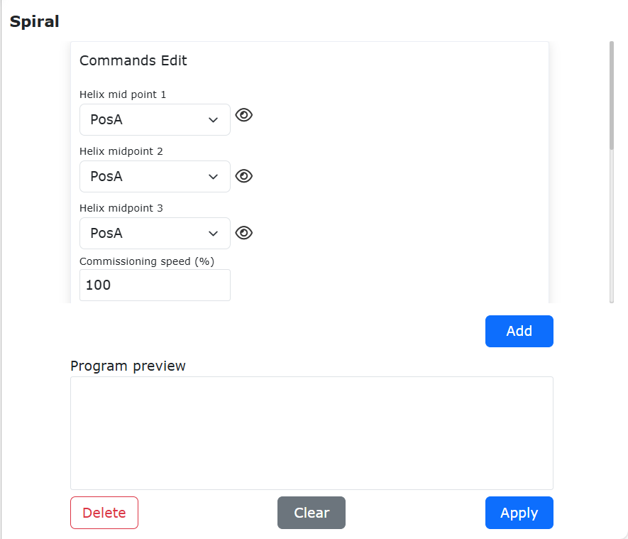

.. centered:: Schemat 9.5-20 Interfejs instrukcji Spiral

Polecenie nowej spirali
+++++++++++++++++++++++

Kliknij ikonę „Nowa spirala”, aby otworzyć interfejs edycji polecenia N-Spiral.

Instrukcja „N-Spiral” to zoptymalizowana wersja ruchu spiralnego. Ta instrukcja wymaga tylko jednego punktu i konfiguracji różnych parametrów, aby zrealizować ruch spiralny. Robot używa bieżącej pozycji jako punktu początkowego. Użytkownik ustawia prędkość testową, czy przesunięcie, liczbę zwojów spirali, kąt nachylenia spirali, promień początkowy, przyrost promienia, przyrost kierunku osi obrotu i kierunek obrotu. Liczba zwojów spirali to liczba zwojów ruchu spiralnego. Kąt nachylenia spirali to kąt między osią Z narzędzia a kierunkiem poziomym. Kąt korekty postawy koryguje postawę na końcu spirali względem postawy pierwszego punktu spirali. Promień początkowy to wielkość promienia pierwszego zwoju. Przyrost promienia to przyrost promienia każdego zwoju. Przyrost kierunku osi obrotu to przyrost w kierunku osi spirali. Kierunek obrotu to zgodny z ruchem wskazówek zegara lub przeciwny.

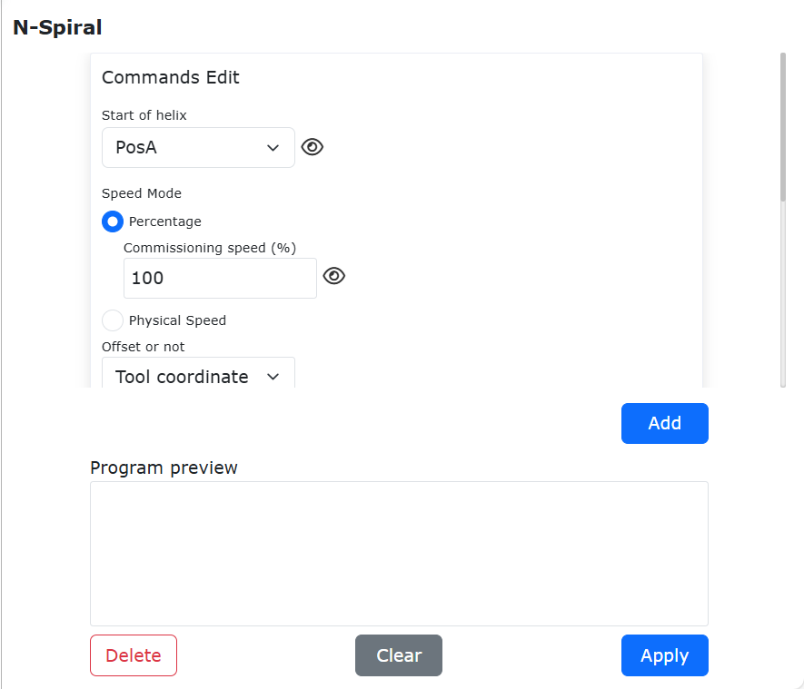

.. centered:: Schemat 9.5-21 Interfejs instrukcji N-Spiral

Funkcja ustawiania stałej prędkości każdego zwoju spirali
**********************************************************

Przegląd
""""""""

Podczas korzystania z instrukcji ruchu spiralnego można ustawić prędkość ruchu spiralnego, tak aby prędkość każdego zwoju była utrzymywana na zadanym poziomie.

Procedura operacyjna
""""""""""""""""""""

**Krok 1**: Wybierz punkt nauczania do wykonania ruchu spiralnego. W niniejszym podręczniku jako nazwę punktu nauczania użyto „P0”.

**Krok 2**: Kliknij przyciski „Program nauczania” -> „Programowanie”, wybierz instrukcję „Nowa spirala”, w „Trybie prędkości” wybierz „Prędkość fizyczna” i ustaw wartość prędkości oraz przyspieszenia. Ta wartość prędkości jest rzeczywistą prędkością robota podczas ruchu spiralnego. W razie potrzeby ustaw parametry takie jak „Liczba zwojów spirali”, „Kąt nachylenia spirali”, „Promień początkowy”, „Przyrost promienia”, „Przyrost kierunku osi obrotu” i „Kierunek obrotu”, jak pokazano na rysunku 2-1.

.. image:: coding/492.png
   :width: 6in
   :align: center

.. centered:: Schemat 9.5-21-1 Ustawienia parametrów nowej spirali

**Krok 3**: Dodaj instrukcję ruchu, wygeneruj program Lua i uruchom go, aby zrealizować funkcję spirali działającą z ustawioną prędkością, jak pokazano na rysunku 2-2.

.. image:: coding/493.png
   :width: 6in
   :align: center

.. centered:: Schemat 9.5-21-2 Typowy programu do działania spirali z ustawioną prędkością

Polecenie spirali poziomej
++++++++++++++++++++++++++

Kliknij ikonę „Spirala pozioma”, aby otworzyć interfejs edycji polecenia H-Spiral.

Instrukcja „H-Spiral” to ruch spiralny w przestrzeni poziomej. Ta instrukcja jest umieszczana po instrukcji ruchu pojedynczego odcinka (linii prostej).

   - Promień spirali: 0~100 mm
   - Prędkość kątowa spirali: 0~2 obr/s
   - Kierunek obrotu: spirala zgodnie/przeciwnie do ruchu wskazówek zegara
   - Kąt nachylenia spirali: 0~40°

.. image:: coding/061.png
   :width: 6in
   :align: center

.. centered:: Schemat 9.5-22 Interfejs instrukcji H-Spiral

Polecenie funkcji sklejanej
+++++++++++++++++++++++++++

Kliknij ikonę „Funkcja sklejana”, aby otworzyć interfejs edycji polecenia Spline.

Ta instrukcja dzieli się na trzy części: początek grupy funkcji sklejanych, odcinek funkcji sklejanych i koniec grupy funkcji sklejanych. Początek grupy funkcji sklejanych jest znacznikiem początkowym ruchu funkcji sklejanych. Odcinek funkcji sklejanych zawiera odcinki SPL, SLIN i SCIRC. Kliknij odpowiednią ikonę, aby przejść do interfejsu dodawania instrukcji. Koniec grupy funkcji sklejanych jest znacznikiem końcowym ruchu funkcji sklejanych.

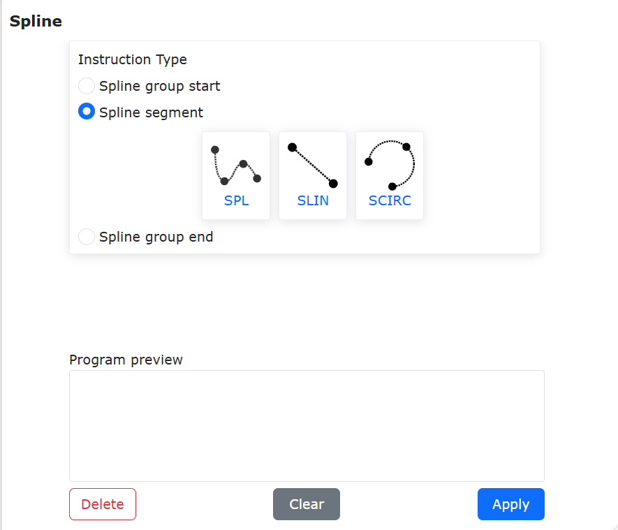

.. centered:: Schemat 9.5-23 Interfejs instrukcji Spline

Polecenie nowej funkcji sklejanej
+++++++++++++++++++++++++++++++++

Kliknij ikonę „Nowa funkcja sklejana”, aby otworzyć interfejs edycji polecenia N-Spline.

Ta instrukcja jest instrukcją optymalizacji algorytmu instrukcji Spline i w przyszłości zastąpi istniejącą instrukcję Spline.

Ta instrukcja dzieli się na trzy części: początek trajektorii wielopunktowej, odcinek trajektorii wielopunktowej i koniec trajektorii wielopunktowej. Początek trajektorii wielopunktowej jest znacznikiem początkowym ruchu trajektorii wielopunktowej. Odcinek trajektorii wielopunktowej to ustawianie poszczególnych punktów trajektorii.

Kliknij ikonę, aby przejść do interfejsu dodawania punktów. Koniec trajektorii wielopunktowej jest znacznikiem końcowym ruchu trajektorii wielopunktowej. Tutaj można ustawić tryb sterowania i prędkość testową.

- Tryb sterowania: punkt przejściowy łuku / dany punkt ścieżki
- Globalny średni czas połączenia: typ całkowity, większy niż 10, wartość domyślna to 2000

.. image:: coding/063.png
   :width: 6in
   :align: center

.. centered:: Schemat 9.5-24 Interfejs instrukcji N-Spline

Polecenie ruchu wahadłowego
+++++++++++++++++++++++++++

Kliknij ikonę „Ruch wahadłowy”, aby otworzyć interfejs edycji polecenia Weave. Instrukcja „Weave” zawiera dwie części:

- Wybierz numer wahadła spawalniczego z skonfigurowanymi parametrami, kliknij „Rozpocznij spawanie wahadłowe” i „Zatrzymaj spawanie wahadłowe”, a następnie kliknij Zastosuj, aby dodać odpowiednie instrukcje do programu.

.. image:: coding/064.png
   :width: 6in
   :align: center

.. centered:: Schemat 9.5-25 Interfejs instrukcji Weave

- Kliknij „Konfiguruj i testuj”, aby wybrać typ wahadła w zależności od scenariusza użycia i skonfigurować parametry spawania wahadłowego. Po zakończeniu konfiguracji możesz przetestować trajektorię spawania wahadłowego za pomocą przycisków Rozpocznij test spawania wahadłowego i Zatrzymaj test spawania wahadłowego. Obecnie dostępne typy wahadła to:

   - Wahadło trójkątne (LIN/ARC)
   - Wahadło trójkątne w kształcie litery L (LIN/ARC)
   - Wahadło okrągłe - zgodnie z ruchem wskazówek zegara (LIN)
   - Wahadło okrągłe - przeciwnie do ruchu wskazówek zegara (LIN)
   - Wahadło sinusoidalne (LIN/ARC)
   - Wahadło sinusoidalne w kształcie litery L (LIN/ARC)
   - Wahadło trójkątne do spawania pionowego

.. image:: coding/065.png
   :width: 6in
   :align: center

.. centered:: Schemat 9.5-26 Interfejs instrukcji konfiguracji i testu Weave

Funkcja ukośnego wahadła piłokształtnego
****************************************

Użycie funkcji ukośnego wahadła piłokształtnego umożliwia utworzenie nachylonej, piłokształtnej trajektorii wahadłowej w przestrzeni kartezjańskiej na końcu narzędzia robota. Ukośne wahadło jest nakładane na planowanie linii prostej. Wielkość nachylenia jest kontrolowana przez parametr azymutu, nachylenie azymutu na określonej płaszczyźnie spawania wahadłowego (jednostka deg);

Gdy wartość jest dodatnia, lewy punkt końcowy jest nachylony w kierunku ruchu do przodu; gdy ujemna, prawy punkt końcowy jest nachylony w kierunku ruchu do przodu; jeśli wynosi 90 deg lub -90 deg, wahadło może odbywać się wzdłuż kierunku ruchu do przodu.

.. image:: coding/066.png
   :width: 4in
   :align: center

.. centered:: Schemat 9.5-26-1 Wpływ azymutu wahadła

**Krok 1**: Edytuj i ustaw podstawowy ruch liniowy.

.. centered:: Schemat 9.5-26-2 Przykład programu lua podstawowego ruchu liniowego

**Krok 2**: Kliknij, aby dodać instrukcję wahadła.

.. image:: coding/068.png
   :width: 5in
   :align: center

.. centered:: Schemat 9.5-26-3 Kliknięcie dodania instrukcji wahadła

**Krok 3**: Na stronie konfiguracji parametrów instrukcji wahadła kliknij przycisk „Konfiguruj”, z rozwijanej listy „Typ wahadła” wybierz „Wahadło trójkątne” lub „Wahadło sinusoidalne”, wprowadź odpowiedni „Azymut kierunku wahadła”, kliknij „Zastosuj”.

.. image:: coding/069.png
   :width: 6in
   :align: center

.. centered:: Schemat 9.5-26-4 Konfiguracja parametrów wahadła

**Krok 4**: Kliknij przycisk „Rozpocznij wahadło”, aby dodać instrukcję wahadła nad ruchem liniowym; kliknij przycisk „Zakończ wahadło”, aby dodać instrukcję wahadła pod ruchem liniowym.

.. image:: coding/070.png
   :width: 4in
   :align: center

.. centered:: Schemat 9.5-26-5 Program lua po dodaniu instrukcji wahadła

**Krok 5**: Kliknij „Rozpocznij działanie”, trajektoria końcówki robota jest pokazana na rysunku.

.. image:: coding/071.png
   :width: 3in
   :align: center

.. image:: coding/072.png
   :width: 3in
   :align: center

.. centered:: Schemat 9.5-26-6 Wahadło piłokształtne (lewy) Ukośne wahadło piłokształtne (prawy)

Polecenie odtwarzania trajektorii
+++++++++++++++++++++++++++++++++

Kliknij przycisk „Odtwarzanie trajektorii”, aby otworzyć interfejs edycji polecenia TPD.

W tej instrukcji użytkownik musi najpierw mieć nagraną trajektorię.

Informacje o nagrywaniu trajektorii: Przed rozpoczęciem nagrywania trajektorii zapisz punkt początkowy trajektorii. Gdy robot jest w trybie przeciągania, wprowadź nazwę pliku, wybierz okres (zakładając, że wartość to x, oznacza to, że punkt jest rejestrowany co x milisekund, zalecane 4 milisekundy na punkt), kliknij Rozpocznij nagrywanie. Użytkownik może przeciągnąć robota, aby wykonać określony ruch zgodnie z potrzebami. Po zakończeniu nagrywania kliknij Zatrzymaj nagrywanie, aby zapisać wcześniejszą trajektorię ruchu robota. Gdy jednego ruchu nie można w pełni nagrać, pojawi się komunikat o przekroczeniu limitu punktów nagrywania. Użytkownik musi podzielić ruch na kilka części i nagrać je osobno.

Podczas programowania, najpierw użyj instrukcji PTP, aby dotrzeć do odpowiedniego punktu początkowego trajektorii, a następnie w instrukcji odtwarzania trajektorii TPD wybierz trajektorię, wybierz, czy wygładzać, ustaw prędkość testową, kolejno kliknij „Dodaj”, „Zastosuj”, aby wstawić program. Instrukcja ładowania trajektorii jest używana głównie do wcześniejszego odczytania pliku trajektorii i wyodrębnienia go jako instrukcji trajektorii, co lepiej sprawdza się w scenariuszach śledzenia przenośnika taśmowego.

.. note:: 
   Szczegółowe działanie TPD można znaleźć w module opisu funkcji programowania nauczania (TPD).

.. image:: coding/073.png
   :width: 6in
   :align: center

.. centered:: Schemat 9.5-27 Interfejs instrukcji TPD

Funkcja TPD nauczania i odtwarzania trajektorii robota
*******************************************************

Przegląd
""""""""

Funkcja TPD nauczania i odtwarzania trajektorii robota pozwala robotowi dokładnie zapamiętać i powtarzać złożone trajektorie nauczania, osiągając w ten sposób wysoką jakość i wydajną automatyczną produkcję w produkcji przemysłowej oraz zastępując ludzi w wykonywaniu zadań wysokiego ryzyka w środowiskach niebezpiecznych.

Procedura operacyjna
""""""""""""""""""""

**Krok 1**: Ustawienia parametrów nagrywania TPD. Kliknij „TPD” na pasku stanu na dole interfejsu, przejdź do pozycji funkcji TPD, aby skonfigurować parametry nagrywania trajektorii, ustawić nazwę pliku trajektorii, typ pozy i orientacji oraz okres próbkowania, skonfigurować DI i DO. Podczas nagrywania trajektorii TPD, poprzez wyzwolenie DI, podczas odtwarzania TPD zostanie wyprowadzone odpowiednie DO.

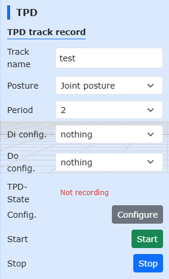

.. centered:: Schemat 9.5-27-1 Ustawienia parametrów TPD

**Krok 2**: Przełącz w tryb przeciągania. W trybie ręcznym można przełączyć się w tryb nauczania przez przeciąganie na dwa sposoby: jeden to długie naciśnięcie przycisku na końcówce, drugi to przycisk przełączania trybu przeciągania na interfejsie. W funkcji nagrywania TPD zaleca się przełączanie robota w tryb nauczania przez przeciąganie z poziomu interfejsu.

.. image:: coding/550.png
   :width: 3in
   :align: center

.. centered:: Schemat 9.5-27-2 Ustawienia trybu przeciągania robota

**Krok 3**: Rozpocznij nagrywanie. Kliknij przycisk „Rozpocznij nagrywanie”, aby rozpocząć nagrywanie trajektorii, przeciągnij robota, aby nauczyć go ruchu. Ponadto, w konfiguracji DI na końcówce znajduje się pozycja konfiguracyjna funkcji „Uruchom/Zatrzymaj nagrywanie TPD”. Po skonfigurowaniu tej funkcji użytkownik może wyzwolić funkcję „Rozpocznij nagrywanie” trajektorii za pomocą sygnału zewnętrznego. Należy pamiętać, że aby rozpocząć nagrywanie trajektorii za pomocą sygnału zewnętrznego, najpierw należy skonfigurować informacje o trajektorii TPD na stronie.

**Krok 4**: Zakończ nagrywanie. Po zakończeniu nauczania ruchu kliknij przycisk „Zatrzymaj nagrywanie”, aby zatrzymać nagrywanie trajektorii, a następnie naciśnij przycisk przełączania nauczania przez przeciąganie, aby robot wyszedł z trybu nauczania przez przeciąganie. Podobnie jak w kroku 3, po skonfigurowaniu funkcji „Uruchom/Zatrzymaj nagrywanie TPD” można wyzwolić zatrzymanie nagrywania za pomocą sygnału zewnętrznego.

**Krok 5**: Edycja trajektorii TPD. Kliknij „TPD” na pasku stanu na dole interfejsu, przejdź do funkcji edycji trajektorii TPD. Najpierw wybierz trajektorię do edycji, kliknij przycisk „Pobierz”, Start-index i End-index wyświetlą numer sekwencji początkowej i końcowej trajektorii. Można je dostosować, przeciągając suwak lub ręcznie wprowadzając wartości. Następnie kliknij przycisk „Odtwórz”, robot będzie symulować ruch na interfejsie (rzeczywisty robot nie porusza się). Na koniec kliknij przycisk „Zakończ”, aby zakończyć edycję trajektorii TPD.

.. image:: coding/551.png
   :width: 3in
   :align: center

.. centered:: Schemat 9.5-27-3 Edycja trajektorii TPD

**Krok 6**: Napisz program TPD do nauczania i odtwarzania trajektorii. Kliknij „Program nauczania” - „Odtwarzanie trajektorii” - „Ładowanie trajektorii”, wybierz trajektorię do odtworzenia, a następnie kliknij przycisk „Dodaj”. Kliknij „Odtwarzanie trajektorii”, wybierz tę samą trajektorię i ustaw odpowiednie parametry zgodnie z instrukcjami na interfejsie, a następnie kliknij przycisk „Dodaj”.

.. image:: coding/552.png
   :width: 6in
   :align: center

.. centered:: Schemat 9.5-27-4 Ustawienia ładowania trajektorii TPD

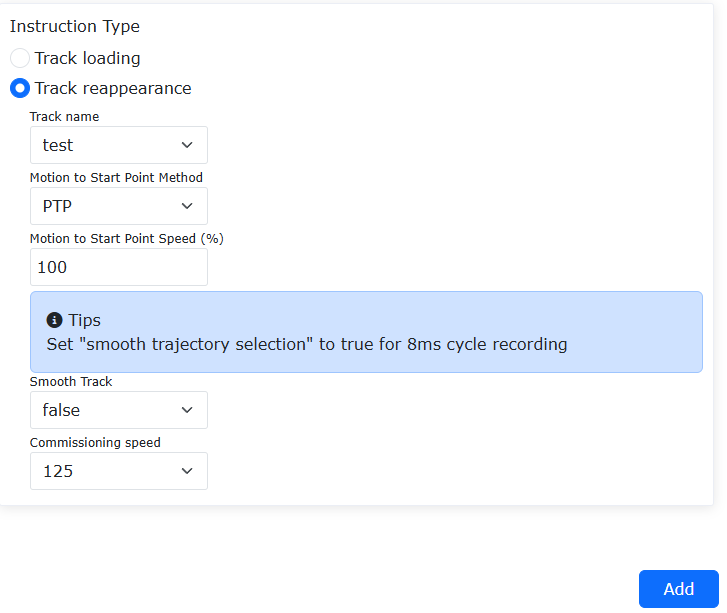

.. centered:: Schemat 9.5-27-5 Ustawienia odtwarzania trajektorii TPD

**Krok 7**: Wygeneruj program lua i uruchom go. Na podstawie typowego programu lua wygenerowanego w kroku 6, uruchom go, aby odtworzyć nauczoną trajektorię.

.. image:: coding/554.png
   :width: 4in
   :align: center

.. centered:: Schemat 9.5-27-6 Typowy program odtwarzania trajektorii TPD

Polecenie przesunięcia punktu
+++++++++++++++++++++++++++++

Kliknij ikonę „Przesunięcie punktu”, aby otworzyć interfejs edycji polecenia Offset.

Ta instrukcja jest instrukcją ogólnego przesunięcia. Wprowadź poszczególne wartości przesunięcia, dodaj instrukcję rozpoczęcia i zakończenia do programu. Instrukcje ruchu pomiędzy rozpoczęciem a zakończeniem zostaną przesunięte względem układu bazowego (lub układu obiektu).

.. image:: coding/074.png
   :width: 6in
   :align: center

.. centered:: Schemat 9.5-28 Interfejs instrukcji Offset

Polecenie serwo
+++++++++++++++

Kliknij ikonę „Serwo”, aby otworzyć interfejs edycji polecenia servoMotion. Ruch serwo obejmuje ruch serwo w przestrzeni kartezjańskiej i ruch serwo w przestrzeni stawów.

.. image:: coding/075.png
   :width: 6in
   :align: center

.. centered:: Schemat 9.5-29-1 Interfejs instrukcji ruchu serwo

Ruch serwo w przestrzeni kartezjańskiej
****************************************

Instrukcja ServoCart (ruch w przestrzeni kartezjańskiej) – ta instrukcja umożliwia sterowanie ruchem robota za pomocą sterowania absolutną pozy i orientacją lub przesunięcia względem bieżącej pozy i orientacji.

.. image:: coding/076.png
   :width: 6in
   :align: center

.. centered:: Schemat 9.5-29-2 Interfejs instrukcji ServoCart

Przykład programu sterowania absolutną pozy i orientacją:

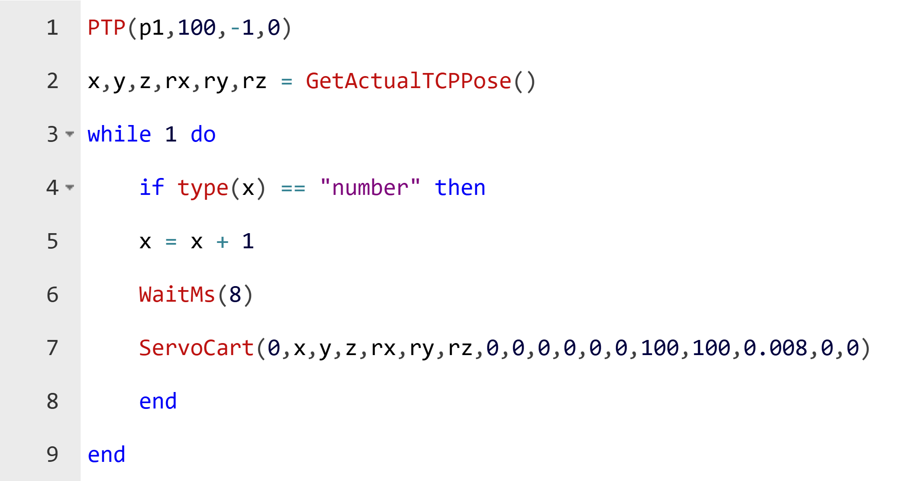

.. centered:: Schemat 9.5-29-3 Ruch absolutny ServoCart

W tym przykładzie x, y, z, rx, ry, rz (pozycja kartezjańska) to pobrana bieżąca pozycja robota. Ponadto użytkownik może sterować ruchem robota poprzez odczytywanie danych z pliku trajektorii, wysyłanie danych trajektorii przez komunikację socket itp.

Przykład programu sterowania przesunięciem względem bieżącej pozy i orientacji (przesunięcie względem układu bazowego):

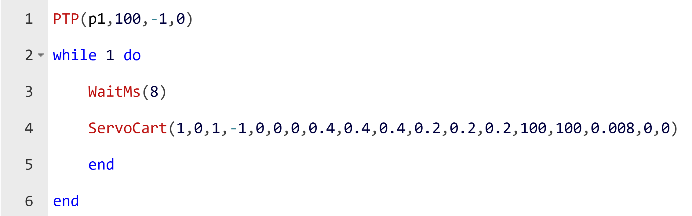

.. centered:: Schemat 9.5-29-4 Ruch względny ServoCart

Ruch serwo w przestrzeni stawów
*******************************

Instrukcja ServoJ (ruch w przestrzeni stawów) – ta instrukcja umożliwia sterowanie ruchem robota za pomocą absolutnej pozycji stawów robota.

Kolejno kliknij „Program nauczania”, „Programowanie”, „Ruch serwo”, na stronie instrukcji servoMotion wybierz „Ruch w przestrzeni stawów”.

.. image:: coding/520.png
   :width: 6in
   :align: center

.. centered:: Schemat 9.5-29-5 Edycja instrukcji ServoJ

Wyjaśnienie parametrów w instrukcji:

- **Pozycja stawów**: Docelowa pozycja stawów dla ruchu ServoJ. Ruch od bieżącej pozycji do pozycji docelowej musi zostać zakończony w ustawionym cyklu instrukcji. Jeśli różnica między pozycją docelową a bieżącą pozycją instrukcji jest zbyt duża, robot może zgłosić błędy, takie jak przekroczenie prędkości stawów.
- **Pozycja osi rozszerzonej**: Docelowa pozycja osi rozszerzonej dla ruchu ServoJ.
- **Przyspieszenie**: Procent przyspieszenia ruchu ServoJ (tymczasowo niedostępne).
- **Prędkość**: Procent prędkości ruchu ServoJ (tymczasowo niedostępne; obecnie rzeczywista prędkość robota zależy od różnicy pozycji między dwiema instrukcjami ServoJ i cyklu instrukcji).
- **Cykl instrukcji**: Czas wykonania między dwiema instrukcjami ServoJ.

Wprowadź odpowiednią pozycję docelową, prędkość, przyspieszenie i cykl instrukcji, kliknij przycisk „Dodaj”, „Zastosuj”, aby dodać instrukcję ServoJ do programu LUA.

.. image:: coding/521.png
   :width: 6in
   :align: center

.. centered:: Schemat 9.5-29-6 Dodawanie instrukcji ServoJ do programu lua

W praktyce często konieczne jest ciągłe wysyłanie wielu instrukcji ServoJ zgodnie z ustawionym cyklem instrukcji. Docelowe pozycje stawów tych instrukcji ServoJ tworzą ciągłą krzywą ruchu robota, umożliwiając elastyczne sterowanie ruchem robota. Cykl wysyłania instrukcji musi być zgodny z ustawionym cyklem instrukcji.

Sterowanie ruchem ServoJ można zrealizować w programie LUA za pomocą pętli lub ciągłego dodawania wielu instrukcji.

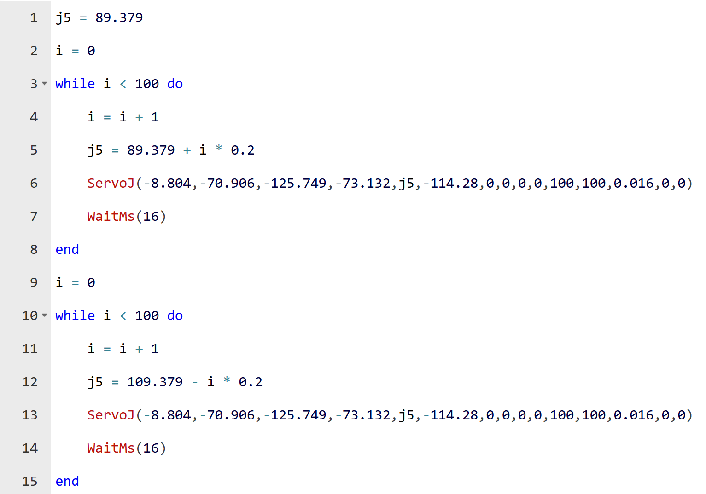

.. centered:: Schemat 9.5-29-7 Przykład ciągłego ruchu ServoJ

.. image:: coding/523.png
   :width: 6in
   :align: center

.. centered:: Schemat 9.5-29-8 Przykład ciągłego ruchu ServoJ 1

Instrukcje debugowania osi rozszerzonej
****************************************

Przegląd
""""""""

Interfejs odwrotnej kinematyki GetInverseKinExaxis dla docelowej pozycji osi rozszerzonej oraz interfejs instrukcji ServoCart z pozycją osi rozszerzonej obsługują różne scenariusze jednoczesnego użycia osi rozszerzonej i robota.

Procedura operacyjna
""""""""""""""""""""

**Krok 1**: Parametry i wartości zwracane interfejsu instrukcji odwrotnej kinematyki GetInverseKinExaxis są pokazane w poniższej tabeli.

.. centered:: Tabela 9.5-1 Parametry GetInverseKinExaxis

.. list-table::
   :widths: 10 20 30 40
   :header-rows: 0
   :align: center

   * - **Nr kolejny**
     - **Typ danych**
     - **Nazwa zmiennej**
     - **Szczegółowy opis**

   * - 1
     - uint8_t
     - posMode
     - 0: pozycja absolutna, 1: pozycja względna - układ bazowy, 2: pozycja względna - układ narzędzia

   * - 2
     - float
     - desePos[6]
     - Pozycja kartezjańska robota

   * - 3
     - float
     - exaxis[4]
     - Pozycja osi rozszerzonej

   * - 4
     - int
     - toolNum
     - Numer narzędzia [0-14]

   * - 5
     - int
     - workPieceNum
     - Numer obiektu [0-14]

.. centered:: Tabela 9.5-2 Wartość zwracana GetInverseKinExaxis

.. list-table::
   :widths: 10 20 30 40
   :header-rows: 0
   :align: center

   * - **Nr kolejny**
     - **Typ danych**
     - **Nazwa zmiennej**
     - **Szczegółowy opis**

   * - 1
     - float
     - jointPos[6]
     - Pozycja stawów

**Krok 2**: Format wywołania instrukcji odwrotnej kinematyki GetInverseKinExaxis w programie lua jest pokazany na rysunku. Wystarczy wprowadzić parametry wymienione w tabeli, aby uzyskać odpowiednie wartości stawów. Wywołanie w SDK wymaga odniesienia do odpowiedniej dokumentacji SDK.

.. centered:: Schemat 9.5-29-9 Wywołanie GetInverseKinExaxis w lua

**Krok 3**: Interfejs instrukcji ServoCart z pozycją osi rozszerzonej jest pokazany poniżej, bez wartości zwracanej.

.. centered:: Tabela 9.5-3 Parametry ServoCart

.. list-table::
   :widths: 10 20 30 40
   :header-rows: 0
   :align: center

   * - **Nr kolejny**
     - **Typ danych**
     - **Nazwa zmiennej**
     - **Szczegółowy opis**

   * - 1
     - uint8_t
     - posMode
     - 0: pozycja absolutna, 1: pozycja względna - układ bazowy, 2: pozycja względna - układ narzędzia

   * - 2
     - float
     - desePos[6]
     - Pozycja kartezjańska robota

   * - 3
     - float
     - gain[6]
     - Współczynnik proporcjonalności pozy i orientacji, używany w przypadku pozycji względnej

   * - 4
     - float
     - exaxis[4]
     - Pozycja osi rozszerzonej

   * - 5
     - float
     - acc
     - Proporcja przyspieszenia, 0~100, domyślnie 0

   * - 6
     - float
     - vel
     - Proporcja prędkości, 0~100, domyślnie 0

   * - 7
     - float
     - interval
     - Cykl instrukcji [s]

   * - 8
     - float
     - filterTime
     - Czas filtracji [s], tymczasowo niedostępny

   * - 9
     - float
     - posGain
     - Wzmacniacz proporcjonalności pozycji docelowej, tymczasowo niedostępny

**Krok 4**: Format wywołania instrukcji ServoCart z pozycją osi rozszerzonej w programie lua jest pokazany na poniższym rysunku. Wystarczy wprowadzić parametry wymienione w tabeli, aby robot wykonał ruch ServoCart z pozycją osi rozszerzonej. Wywołanie w SDK wymaga odniesienia do odpowiedniej dokumentacji SDK.

.. image:: coding/544.png
   :width: 6in
   :align: center

.. centered:: Schemat 9.5-29-10 Wywołanie ServoCart w lua

Polecenie trajektorii
+++++++++++++++++++++

Kliknij ikonę „Trajektoria”, aby otworzyć interfejs edycji polecenia Trajctory.

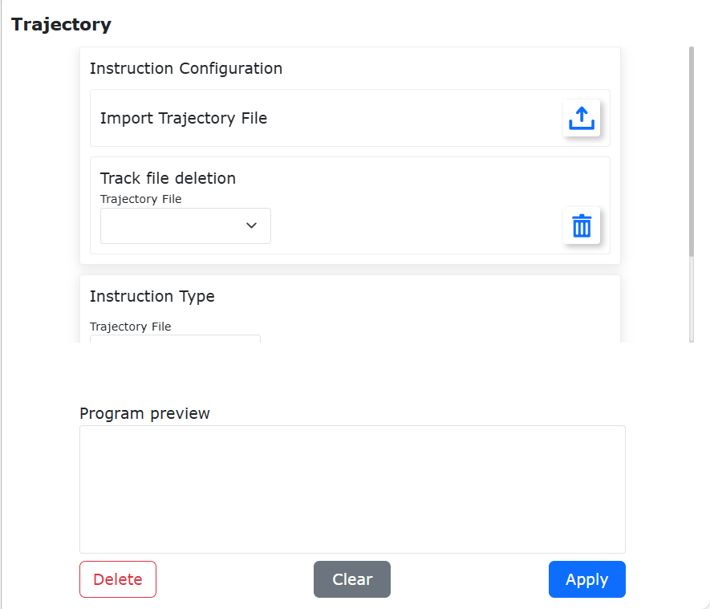

.. centered:: Schemat 9.5-30 Interfejs instrukcji Trajctory

Polecenie trajektorii J
+++++++++++++++++++++++

Kliknij ikonę „Trajektoria J”, aby otworzyć interfejs edycji polecenia TrajctoryJ.

Instrukcje Trajctory i TrajctoryJ są interfejsami ogólnymi, odpowiednimi do bezpośredniego podawania trajektorii przez kamerę. Gdy dostępny jest plik dyskretnych punktów trajektorii w ustalonym formacie, można go zaimportować do systemu, aby robot poruszał się zgodnie z trajektorią z zaimportowanego pliku.

1. Funkcja importu pliku trajektorii: Wybierz plik z komputera lokalnego i zaimportuj go do systemu sterowania robota.

2. Wstępne ładowanie trajektorii: Wybierz zaimportowany plik trajektorii i załaduj go za pomocą instrukcji.

3. Ruch trajektorii: Połącz wstępnie załadowany plik trajektorii i wybraną prędkość testową, aby wydać robotowi polecenie ruchu.

4. Drukuj numery punktów trajektorii: Podczas działania robota na trajektorii drukowane są numery punktów trajektorii, aby śledzić postęp ruchu.

.. image:: coding/079.png
   :width: 6in
   :align: center

.. centered:: Schemat 9.5-31 Interfejs instrukcji TrajctoryJ

Polecenie DMP
+++++++++++++

Kliknij ikonę „DMP”, aby otworzyć interfejs edycji polecenia DMP.

DMP to metoda uczenia się przez naśladowanie trajektorii, która wymaga wcześniejszego zaplanowania trajektorii referencyjnej. W interfejsie edycji polecenia wybierz punkt nauczania jako nowy punkt początkowy, kliknij „Dodaj”, „Zastosuj”, aby zapisać tę instrukcję. Konkretna ścieżka DMP to nowa trajektoria naśladująca trajektorię referencyjną, zaczynająca się od nowego punktu początkowego.

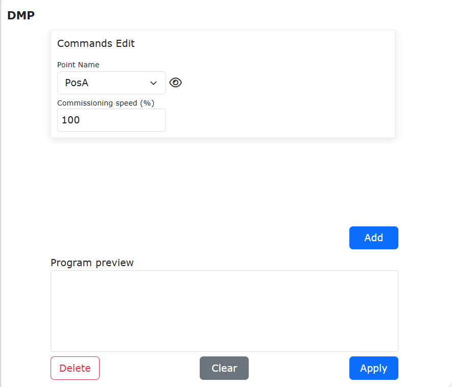

.. centered:: Schemat 9.5-32 Interfejs instrukcji DMP

Polecenie transformacji obiektu
+++++++++++++++++++++++++++++++

Kliknij ikonę „Transformacja obiektu”, aby otworzyć interfejs edycji polecenia WPTrsf.

Wybierz układ współrzędnych obiektu, który ma zostać automatycznie przekształcony, kliknij „Dodaj”, „Zastosuj”, aby zapisać tę instrukcję. Ta instrukcja realizuje automatyczne przekształcanie punktów w układzie współrzędnych obiektu podczas wykonywania wewnętrznych instrukcji PTP i LIN. Obszar przykładów użycia pokazuje i podpowiada prawidłową kombinację użycia instrukcji. Konkretne instrukcje można dostosować po dodaniu, w zależności od rzeczywistego scenariusza.

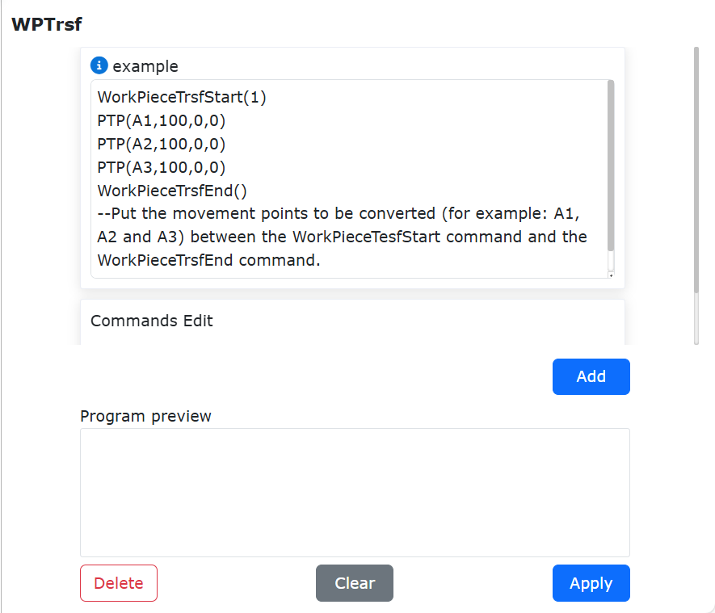

.. centered:: Schemat 9.5-33 Interfejs instrukcji WPTrsf

Polecenie transformacji narzędzia
+++++++++++++++++++++++++++++++++

Kliknij ikonę „Transformacja narzędzia”, aby otworzyć interfejs edycji polecenia ToolTrsf.

Po dodaniu instrukcji PTP, Lin, wybierz układ współrzędnych narzędzia, który ma zostać automatycznie przekształcony, kliknij „Dodaj”, „Zastosuj”, aby zapisać tę instrukcję. Współrzędne kartezjańskie punktów w instrukcji są automatycznie przekształcane zgodnie z aktualnie ustawionym układem współrzędnych obiektu.

.. note:: Obszar przykładów użycia pokazuje i podpowiada prawidłową kombinację użycia instrukcji. Konkretne instrukcje można dostosować po dodaniu, w zależności od rzeczywistego scenariusza.

.. image:: coding/276.png
   :width: 6in
   :align: center

.. centered:: Schemat 9.5-34 Interfejs instrukcji ToolTrsf

Interfejs instrukcji sterowania
~~~~~~~~~~~~~~~~~~~~~~~~~~~~~~~

.. image:: coding/082.png
   :width: 6in
   :align: center

.. centered:: Schemat 9.6 Interfejs instrukcji sterowania

Polecenie cyfrowego wejścia/wyjścia
+++++++++++++++++++++++++++++++++++

Kliknij ikonę „Cyfrowe IO”, aby otworzyć interfejs edycji polecenia IO.

Instrukcja „IO” dzieli się na trzy części: ustawianie IO (SetDO/SPLCSetDO), pobieranie IO (GetDI/SPLCGetDI) i pobieranie DO (GetDO).

Instrukcja „SetDO/SPLCSetDO” umożliwia ustawienie określonego stanu wyjścia DO, w tym 16 kanałów cyfrowych wyjść szafy sterowniczej i 2 kanałów cyfrowych wyjść narzędzia. Opcja stanu „False” oznacza zamknięcie, „True” oznacza otwarcie. Wybór opcji blokowania „Blokuj” oznacza ustawienie stanu DO po zatrzymaniu ruchu, wybór „Nie blokuj” oznacza ustawienie stanu DO podczas poprzedniego ruchu. Opcja trajektorii wygładzania „Break” oznacza ustawienie stanu DO po zakończeniu promienia płynnego przejścia, wybór „Serious” oznacza ustawienie stanu DO podczas ruchu promienia płynnego przejścia. Gdy ta instrukcja jest dodawana w wątku pomocniczym, opcja „Czy zastosować wątek” musi być wybrana jako Tak, w innych miejscach użycia tej instrukcji wybierz Nie. Kliknij „Dodaj”, „Zastosuj”.

.. image:: coding/083.png
   :width: 6in
   :align: center

.. centered:: Schemat 9.6-1 Interfejs instrukcji SetDO

W instrukcji „GetDI/SPLCGetDI” wybierz wartość numeru portu, który chcesz pobrać. Wybór opcji blokowania „Blokuj” oznacza pobranie stanu DI po zatrzymaniu ruchu, wybór „Nie blokuj” oznacza pobranie stanu DI podczas poprzedniego ruchu. Gdy ta instrukcja jest dodawana w wątku pomocniczym, opcja „Czy zastosować wątek” musi być wybrana jako Tak, w innych miejscach użycia tej instrukcji wybierz Nie. Po dokonaniu wyboru kliknij przycisk „Dodaj”, „Zastosuj”.

.. image:: coding/084.png
   :width: 6in
   :align: center

.. centered:: Schemat 9.6-2 Interfejs instrukcji GetDI

W instrukcji „GetDO” wybierz wartość numeru portu, który chcesz pobrać. Wybór opcji blokowania „Blokuj” oznacza pobranie stanu DO po zatrzymaniu ruchu, wybór „Nie blokuj” oznacza pobranie stanu DO podczas poprzedniego ruchu. Po dokonaniu wyboru kliknij przycisk „Dodaj”, „Zastosuj”.

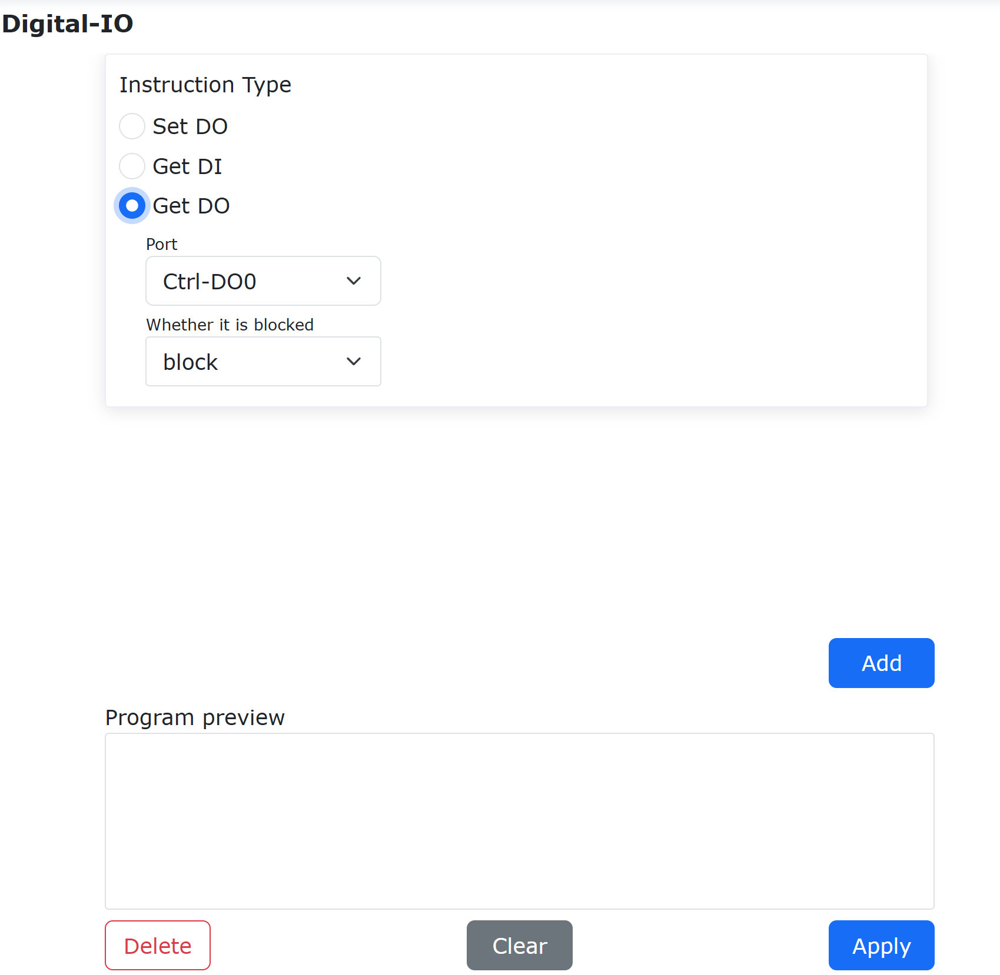

.. centered:: Schemat 9.6-2-2 Interfejs instrukcji GetDO

Polecenie analogowego wejścia/wyjścia
+++++++++++++++++++++++++++++++++++++

Kliknij ikonę „Analogowe AI”, aby otworzyć interfejs edycji polecenia AI.

Ta instrukcja dzieli się na trzy części funkcji: ustawianie wyjścia analogowego (SetAO/SPLCSetAO), pobieranie wejścia analogowego (GetAI/SPLCGetAI) i pobieranie wyjścia analogowego (GetAO).

„SetAO/SPLCSetAO” — wybierz wyjście analogowe, które chcesz ustawić, wprowadź wartość do ustawienia, zakres 0-10. Wybór opcji blokowania „Blokuj” oznacza ustawienie stanu AO po zatrzymaniu ruchu, wybór „Nie blokuj” oznacza ustawienie stanu AO podczas poprzedniego ruchu. Gdy ta instrukcja jest dodawana w wątku pomocniczym, opcja „Czy zastosować wątek” musi być wybrana jako Tak, w innych miejscach użycia tej instrukcji wybierz Nie. Kliknij „Dodaj”, „Zastosuj”.

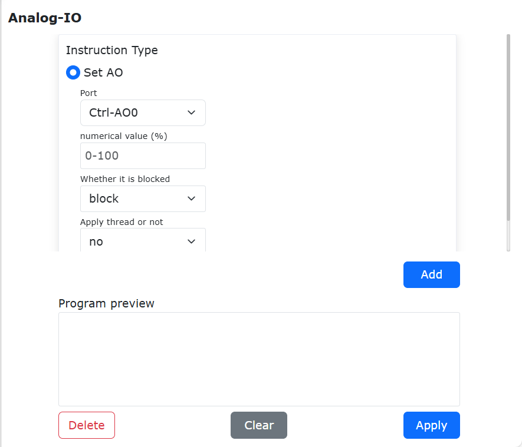

.. centered:: Schemat 9.6-3 Interfejs instrukcji SetAO

„GetAI/SPLCGetAI” — wybierz wejście analogowe, które chcesz pobrać. Wybór opcji blokowania „Blokuj” oznacza pobranie stanu AI po zatrzymaniu ruchu, wybór „Nie blokuj” oznacza pobranie stanu AI podczas poprzedniego ruchu. Gdy ta instrukcja jest dodawana w wątku pomocniczym, opcja „Czy zastosować wątek” musi być wybrana jako Tak, w innych miejscach użycia tej instrukcji wybierz Nie. Kliknij „Dodaj”, „Zastosuj”.

.. image:: coding/086.png
   :width: 6in
   :align: center

.. centered:: Schemat 9.6-4 Interfejs instrukcji GetAI

„GetAO” — wybierz wejście analogowe, które chcesz pobrać. Wybór opcji blokowania „Blokuj” oznacza pobranie stanu AI po zatrzymaniu ruchu, wybór „Nie blokuj” oznacza pobranie stanu AI podczas poprzedniego ruchu. Kliknij „Dodaj”, „Zastosuj”.

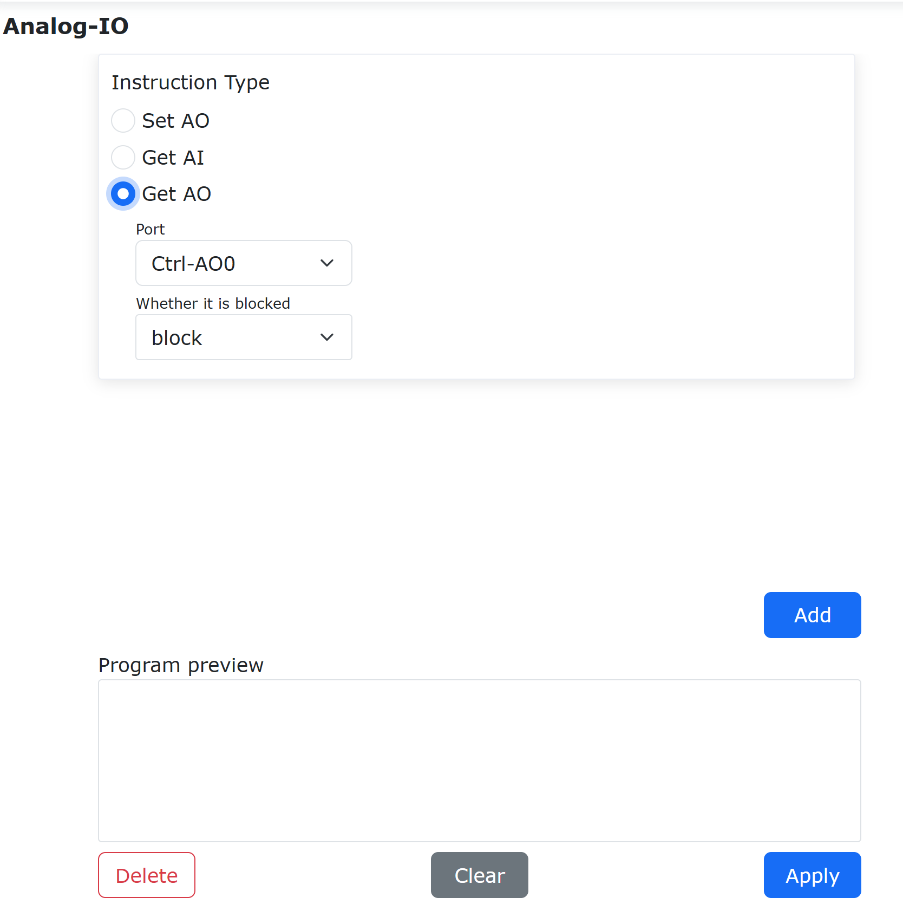

.. centered:: Schemat 9.6-4-2 Interfejs instrukcji GetAO

Polecenie wirtualnego wejścia/wyjścia
+++++++++++++++++++++++++++++++++++++

Kliknij ikonę „Wirtualne IO”, aby otworzyć interfejs edycji polecenia Vir-IO.

Ta instrukcja to wirtualna instrukcja sterowania IO, która umożliwia ustawianie symulowanych stanów zewnętrznych DI i AI oraz pobieranie symulowanych stanów DI i AI.

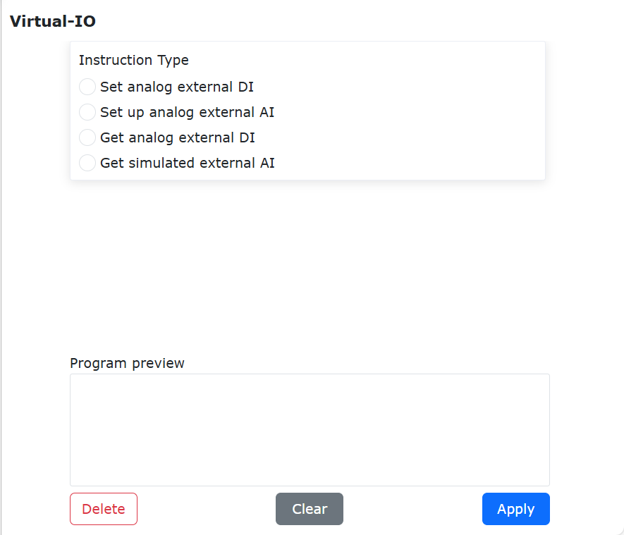

.. centered:: Schemat 9.6-5 Interfejs instrukcji Vir-IO

Polecenie rozszerzonego wejścia/wyjścia
+++++++++++++++++++++++++++++++++++++++

Kliknij ikonę „Rozszerzone IO”, aby otworzyć interfejs edycji polecenia Aux-IO.

Aux-IO to funkcja instrukcji do komunikacji robota z PLC w celu sterowania zewnętrznymi rozszerzonymi IO. Wymaga ustanowienia komunikacji UDP między robotem a PLC. W oparciu o oryginalne 16 kanałów wejścia/wyjścia można rozszerzyć o 128 kanałów wejścia/wyjścia. Użycie tej instrukcji jest podobne do użycia ogólnego IO opisanego wcześniej. Użycie tej funkcji wiąże się z pewnym stopniem trudności technicznej. W razie potrzeby skontaktuj się z nami.

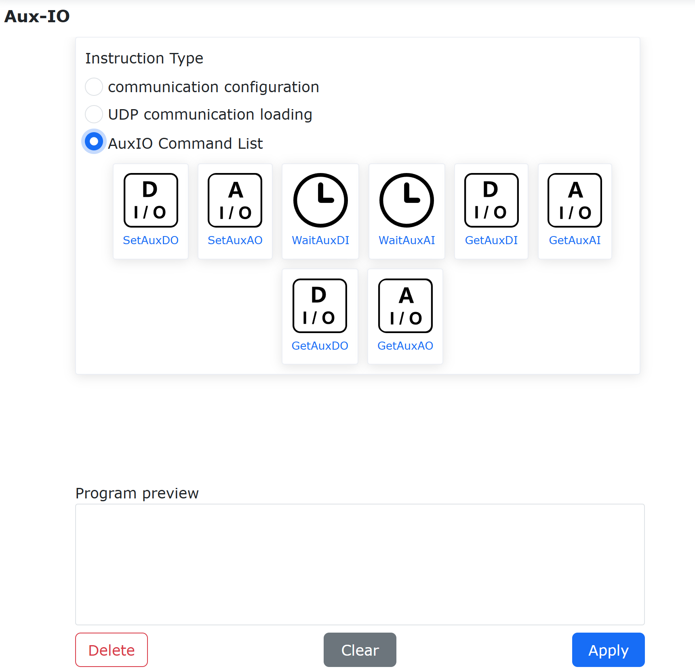

.. centered:: Schemat 9.6-6 Interfejs instrukcji Aux-IO

Polecenie ruchomego wyjścia cyfrowego
+++++++++++++++++++++++++++++++++++++

Kliknij ikonę „Ruchome DO”, aby otworzyć interfejs edycji polecenia MoveDO.

Ta instrukcja dzieli się na tryb wyjścia ciągłego i tryb wyjścia jednorazowego.

- Tryb wyjścia ciągłego: realizuje funkcję ciągłego wysyłania sygnału DO w zadanym odstępie podczas ruchu liniowego.

.. image:: coding/089.png
   :width: 6in
   :align: center

.. centered:: Schemat 9.6-7 Interfejs wyjścia ciągłego instrukcji MoveDO

- Tryb wyjścia jednorazowego: umożliwia wybór między wyjściem w odcinku jednostajnym a swobodną konfiguracją. Po rozpoczęciu ruchu ustawiany jest czas ustawienia wyjścia, przed zakończeniem ruchu ustawiany jest czas resetu wyjścia, zakres [0, 1000].

.. image:: coding/090.png
   :width: 6in
   :align: center

.. centered:: Schemat 9.6-8 Interfejs wyjścia jednorazowego instrukcji MoveDO

Polecenie ruchomego wyjścia analogowego
+++++++++++++++++++++++++++++++++++++++

Kliknij ikonę „Ruchome AO”, aby otworzyć interfejs edycji polecenia MoveAO.

1. Przegląd

Ta instrukcja, używana w połączeniu z instrukcjami ruchu, umożliwia proporcjonalne wyjście sygnału AO w czasie rzeczywistym do prędkości TCP podczas ruchu.

2. Opis instrukcji ruchomego AO

Instrukcja ruchomego AO znajduje się w obszarze edycji instrukcji programu nauczania - program nauczania, ikona to instrukcje sterowania - ruchome AO.

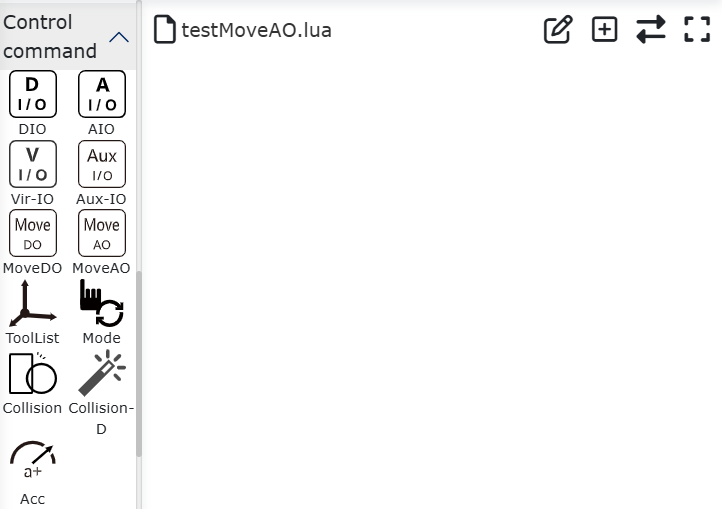

.. centered:: Schemat 9.6-9 Instrukcja ruchomego AO

.. image:: coding/092.png
   :width: 6in
   :align: center

.. centered:: Schemat 9.6-10 Szczegóły instrukcji ruchomego AO

- Numer AO: wybór z listy rozwijanej, Ctrl-AO0 odpowiada AO0 szafy sterowniczej, Ctrl-AO1 odpowiada AO1 szafy sterowniczej, End-AO0 odpowiada AO0 końcówki.
  
- Maksymalna prędkość TCP: maksymalna wartość prędkości TCP robota; działanie: tworzy proporcję z bieżącą prędkością TCP.
  
- Procent AO dla maksymalnej prędkości TCP: procent AO odpowiadający maksymalnej prędkości TCP robota; działanie: ustawia górną granicę wyjścia AO.
  
- Procent AO dla kompensacji martwego pola: gdy zawór proporcjonalny ma martwe pole, można ustawić ten parametr, aby zapewnić wyjście AO; działanie: ustawia dolną granicę wyjścia AO.

.. important:: 
   Wzór obliczeniowy: Procent wyjściowego AO = bieżąca prędkość TCP / ustawiona maksymalna prędkość TCP * ustawiony procent AO dla maksymalnej prędkości TCP.

   Instrukcje ruchu towarzyszące tej instrukcji to: PTP/LIN/ARC/CIRCLE/SPLINE/NSPLINE/SERVOJ.

Polecenie układu współrzędnych
++++++++++++++++++++++++++++++

Kliknij ikonę „Układ współrzędnych”, aby otworzyć interfejs edycji polecenia ToolList.

Wybierz nazwę układu współrzędnych narzędzia, kliknij „Zastosuj”, aby dodać tę instrukcję do programu. Gdy program wykona tę instrukcję, ustawi układ współrzędnych narzędzia robota.

.. image:: coding/093.png
   :width: 6in
   :align: center

.. centered:: Schemat 9.6-11 Interfejs instrukcji ToolList

Polecenie przełączania trybu
++++++++++++++++++++++++++++

Kliknij ikonę „Przełączanie trybu”, aby otworzyć interfejs edycji polecenia Mode.

Ta instrukcja umożliwia przełączenie robota w tryb ręczny. Zwykle dodaje się ją na końcu programu, aby po zakończeniu działania programu robot automatycznie przełączył się w tryb ręczny, umożliwiając przeciąganie robota.

.. image:: coding/094.png
   :width: 6in
   :align: center

.. centered:: Schemat 9.6-12 Interfejs instrukcji Mode

Polecenie poziomu kolizji
+++++++++++++++++++++++++

Kliknij ikonę „Poziom kolizji”, aby otworzyć interfejs edycji polecenia Collision.

To ustawienie poziomu kolizji. Za pomocą tej instrukcji można regulować poziomy kolizji poszczególnych osi w czasie rzeczywistym podczas działania programu, co pozwala na bardziej elastyczne wdrażanie w scenariuszach aplikacji.

.. image:: coding/095.png
   :width: 6in
   :align: center

.. centered:: Schemat 9.6-13 Interfejs instrukcji Collision

Polecenie przyspieszenia
++++++++++++++++++++++++

Kliknij ikonę „Przyspieszenie”, aby otworzyć interfejs edycji polecenia Acc.

Instrukcja Acc umożliwia oddzielne ustawienie przyspieszenia robota. Poprzez regulację współczynnika skalowania przyspieszenia instrukcji ruchu można zwiększyć lub zmniejszyć czas przyspieszania i zwalniania, umożliwiając regulację czasu cyklu ruchu robota.

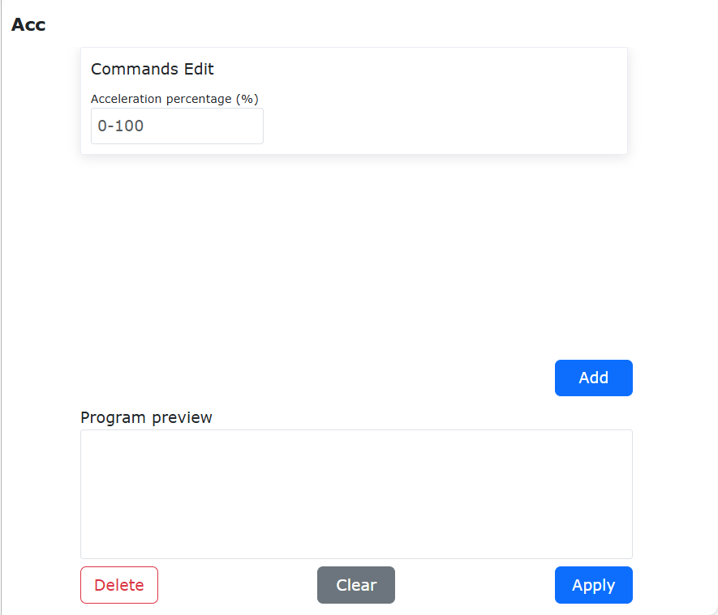

.. centered:: Schemat 9.6-14 Interfejs instrukcji Acc

Interfejs instrukcji urządzeń peryferyjnych
~~~~~~~~~~~~~~~~~~~~~~~~~~~~~~~~~~~~~~~~~~~

.. image:: coding/097.png
   :width: 6in
   :align: center

.. centered:: Schemat 9.7 Interfejs instrukcji urządzeń peryferyjnych

Polecenie chwytaka
++++++++++++++++++

Kliknij ikonę „Chwytak”, aby otworzyć interfejs edycji polecenia Gripper.

W tej instrukcji wyróżniamy instrukcje sterowania ruchem chwytaka oraz instrukcje aktywacji/resetu chwytaka. W instrukcjach sterowania chwytakiem wyświetlany jest numer chwytaka, który został skonfigurowany i aktywowany. Użytkownik może edytować za pomocą pola edycji lub przesuwać suwak do żądanej wartości, aby ustawić otwieranie/zamykanie chwytaka, prędkość otwierania/zamykania i moment otwierania/zamykania. Wartość jest podawana w procentach. Opcja funkcji blokowania — wybranie blokowania oznacza, że ruch chwytaka będzie czekał na zakończenie poprzedniej instrukcji ruchu, zanim zostanie wykonany; wybranie nieblokowania oznacza, że ruch chwytaka będzie przebiegał równolegle z poprzednią instrukcją ruchu. Kliknij przyciski „Dodaj”, „Zastosuj”, aby zapisać ustawione wartości w pliku nauczania. Instrukcje resetu/aktywacji chwytaka — wyświetlają skonfigurowany numer chwytaka, można dodać instrukcję resetu/aktywacji do programu.

.. image:: coding/098.png
   :width: 6in
   :align: center

.. centered:: Schemat 9.7-1 Interfejs instrukcji Gripper

Polecenie pistoletu natryskowego
++++++++++++++++++++++++++++++++

Kliknij ikonę „Pistolet natryskowy”, aby otworzyć interfejs edycji polecenia Spray.

Ta instrukcja jest związana z natryskiwaniem. Steruje pistoletem natryskowym: „Rozpocznij natryskiwanie”, „Zatrzymaj natryskiwanie”, „Rozpocznij czyszczenie pistoletu” i „Zatrzymaj czyszczenie pistoletu”. Podczas edycji tego polecenia programu należy upewnić się, że urządzenie peryferyjne pistoletu natryskowego zostało poprawnie skonfigurowane. Więcej informacji znajduje się w rozdziale dotyczącym urządzeń peryferyjnych robota.

.. image:: coding/099.png
   :width: 6in
   :align: center

.. centered:: Schemat 9.7-2 Interfejs instrukcji Spray

Polecenie osi zewnętrznej
+++++++++++++++++++++++++

Kliknij ikonę „Oś zewnętrzna”, aby otworzyć interfejs edycji polecenia EAxis. Wybierz tryb kombinacji:

- Sterownik + serwonapęd (485)
- Sterownik + PLC (UDP)

Wybierz Sterownik + PLC (UDP). Ta instrukcja jest przeznaczona dla scenariuszy z użyciem osi zewnętrznej. W połączeniu z instrukcją PTP może rozłożyć ruch punktu w przestrzeni w kierunku X na ruch osi zewnętrznej. Wybierz numer osi zewnętrznej, wybierz tryb ruchu jako synchroniczny, wybierz punkt docelowy, kliknij „Dodaj”, „Zastosuj”, aby zapisać tę instrukcję.

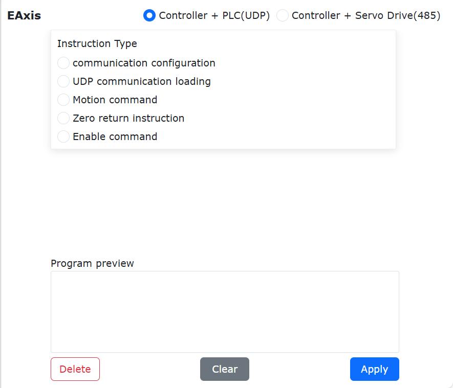

.. centered:: Schemat 9.7-3 Interfejs instrukcji EAxis

Wybierz Sterownik + serwonapęd (485). Ta instrukcja umożliwia konfigurację parametrów osi rozszerzonej. Ustaw różne parametry w zależności od trybu sterowania. Dla już skonfigurowanej osi rozszerzonej można ustawić jej punkt zerowy.

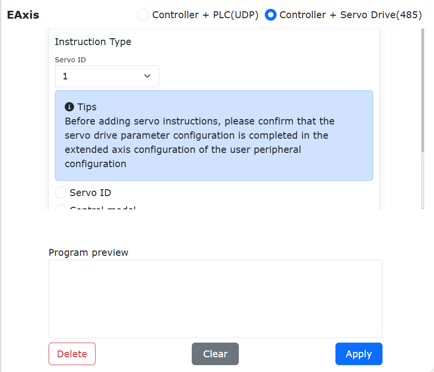

.. centered:: Schemat 9.7-4 Interfejs instrukcji osi rozszerzonej

Polecenie przenośnika taśmowego
+++++++++++++++++++++++++++++++

Kliknij ikonę „Przenośnik taśmowy”, aby otworzyć interfejs edycji polecenia Convey.

Ta instrukcja zawiera cztery polecenia: wykrywanie pozycji w czasie rzeczywistym, wykrywanie IO w czasie rzeczywistym, włączenie śledzenia i wyłączenie śledzenia. Więcej informacji znajduje się w rozdziale dotyczącym urządzeń peryferyjnych robota.

.. image:: coding/102.png
   :width: 6in
   :align: center

.. centered:: Schemat 9.7-5 Interfejs instrukcji Conveyor

Polecenie urządzenia do szlifowania
+++++++++++++++++++++++++++++++++++

Kliknij ikonę „Urządzenie do szlifowania”, aby otworzyć interfejs edycji polecenia Polish.

Ta instrukcja umożliwia ustawienie prędkości obrotowej urządzenia do szlifowania, siły nacisku, wysunięcia oraz trybu sterowania.

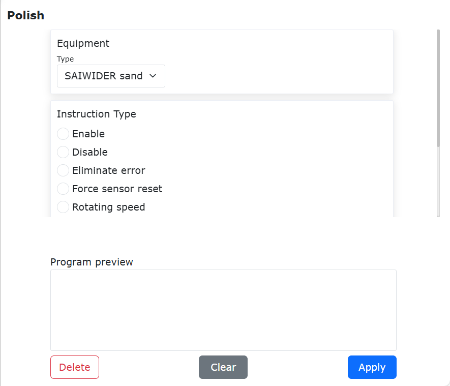

.. centered:: Schemat 9.7-6 Interfejs polecenia Polish

Interfejs instrukcji spawania
~~~~~~~~~~~~~~~~~~~~~~~~~~~~~

.. image:: coding/104.png
   :width: 6in
   :align: center

.. centered:: Schemat 9.8 Interfejs instrukcji spawania

Polecenie spawania
++++++++++++++++++

Kliknij ikonę „Spawanie”, aby otworzyć interfejs edycji polecenia Weld.

Ta instrukcja jest przeznaczona głównie dla urządzeń peryferyjnych spawarki. Przed dodaniem tej instrukcji upewnij się, że konfiguracja spawarki w urządzeniach peryferyjnych użytkownika została zakończona. Więcej informacji znajduje się w rozdziale dotyczącym urządzeń peryferyjnych robota.

- Zakres napięcia spawania: 0~700 V
- Zakres prądu spawania: 0~1000 A

.. important:: Konfigurując wyjście AO, prąd spawania i napięcie spawania, należy wybrać typ I/O. Jeśli wybierzesz I/O sterownika, musisz wybrać odpowiednie wyjście AO.

.. image:: coding/105.png
   :width: 6in
   :align: center

.. centered:: Schemat 9.8-1 Interfejs instrukcji Weld

Polecenie spawania odcinkowego
++++++++++++++++++++++++++++++

Kliknij ikonę „Spawanie odcinkowe”, aby otworzyć interfejs edycji polecenia Segment.

Robot współpracujący może wykonywać spawanie odcinkowe poprzez dodanie instrukcji spawania odcinkowego. Przed dodaniem instrukcji spawania odcinkowego należy najpierw wybrać tryb spawania odcinkowego i nauczyć punkt początkowy i końcowy. Tryby spawania odcinkowego dzielą się na niezmieniające postawy i zmieniające postawę. W zależności od wybranego trybu spawania odcinkowego robot decyduje, czy zmieniać postawę podczas procesu spawania.

Naucz punkt początkowy „segment01” i punkt końcowy „segment02”, potwierdź pozycję początkową i końcową trajektorii spawania, jak na poniższym rysunku.

.. image:: coding/106.png
   :width: 3in
   :align: center

.. centered:: Schemat 9.8-2-1 Punkt początkowy „segment01”

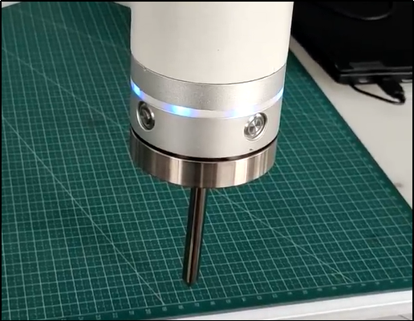

.. centered:: Schemat 9.8-2-2 Punkt końcowy „segment02”

Dodawanie instrukcji spawania odcinkowego
*****************************************

**Krok 1**: Utwórz nowy program użytkownika „testSegment1.lua”, kliknij przycisk „Spawanie odcinkowe”, aby otworzyć stronę dodawania instrukcji spawania odcinkowego.

.. image:: coding/108.png
   :width: 6in
   :align: center

.. centered:: Schemat 9.8-2-3 Przycisk dodawania instrukcji spawania odcinkowego

**Krok 2**: Na stronie dodawania instrukcji spawania odcinkowego wybierz „Punkt początkowy” jako „segment01”, a „Punkt końcowy” jako „segment02”.

.. image:: coding/109.png
   :width: 6in
   :align: center

.. centered:: Schemat 9.8-2-4 Punkt początkowy i końcowy spawania odcinkowego

**Krok 3**: Skonfiguruj prędkość testową, długość wykonania, długość niewykonania, tryb funkcji, wybór wahadła i zasadę zaokrąglania, kolejno kliknij przycisk „Dodaj” i przycisk „Zastosuj”.

**Krok 4**: W tym momencie „testSegment1.lua” ma już dodaną instrukcję ruchu spawania odcinkowego.

.. image:: coding/110.png
   :width: 6in
   :align: center

.. centered:: Schemat 9.8-2-5 Dodawanie instrukcji ruchu spawania odcinkowego

Zmiana postawy trajektorii ruchu spawania odcinkowego
******************************************************

Ruch spawania odcinkowego robota współpracującego umożliwia wybór trybu spawania odcinkowego. Typy trybów obejmują następujące dwa typy:

**Niezmienianie postawy**: Robot始终保持姿态 początkowej trajektorii spawania podczas procesu spawania.

**Zmienianie postawy**: Robot oblicza pozycję kartezjańską i pozycję stawów dla każdego odcinka trajektorii podczas procesu spawania, zmieniając postawę podczas wykonywania spawania odcinkowego.

Poniżej przedstawiono odpowiednio użycie „niezmieniania postawy” i „zmieniania postawy”.

1. Niezmienianie postawy

Otwórz stronę dodawania instrukcji spawania odcinkowego, wybierz „Tryb spawania odcinkowego” jako „Niezmienianie postawy”, wybierz również punkt początkowy jako „segment01”, punkt końcowy jako „segment02”, ustaw długość wykonania na 100, długość niewykonania na 50, wybierz inne powiązane konfiguracje i zapisz program.

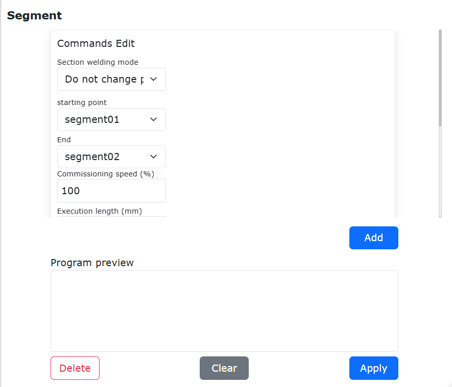

.. centered:: Schemat 9.8-2-6 Tryb spawania odcinkowego z niezmienianiem postawy

2. Zmienianie postawy

Otwórz stronę dodawania instrukcji spawania odcinkowego, wybierz „Tryb spawania odcinkowego” jako „Zmienianie postawy”, wybierz również punkt początkowy jako „segment01”, punkt końcowy jako „segment02”, ustaw długość wykonania na 100, długość niewykonania na 50, wybierz inne powiązane konfiguracje i zapisz program.

.. image:: coding/112.png
   :width: 6in
   :align: center

.. centered:: Schemat 9.8-2-7 Tryb spawania odcinkowego ze zmienianiem postawy

3. Typy wykonywania spawania odcinkowego

Po uruchomieniu programu, robot wykonuje spawanie odcinkowe w następujących sytuacjach:

1) Jeśli tryb funkcji wybierze „Wykonaj funkcję w pierwszym odcinku”, wybór wahadła wybierze „Wykonaj wahadło odcinka”, a zasada zaokrąglania wybierze „Bez zaokrąglania”, to robot wykonuje ruch wahadłowy na 100 mm i ruch liniowy na 50 mm naprzemiennie, zatrzymując się po osiągnięciu punktu końcowego;

.. image:: coding/113.png
   :width: 6in
   :align: center

.. centered:: Schemat 9.8-2-8 Pierwszy odcinek wykonuje funkcję wahadła bez zaokrąglania

2) Jeśli tryb funkcji wybierze „Nie wykonuj funkcji w pierwszym odcinku”, wybór wahadła wybierze „Nie wykonuj wahadła odcinka”, a zasada zaokrąglania wybierze „Bez zaokrąglania”, to robot wykonuje ruch wahadłowy na 50 mm i ruch liniowy na 100 mm naprzemiennie, zatrzymując się po osiągnięciu punktu końcowego;

.. image:: coding/114.png
   :width: 6in
   :align: center

.. centered:: Schemat 9.8-2-9 Pierwszy odcinek nie wykonuje funkcji wahadła bez zaokrąglania

3) Jeśli tryb funkcji wybierze „Wykonaj funkcję w pierwszym odcinku”, wybór wahadła wybierze „Wykonaj wahadło odcinka”, a zasada zaokrąglania wybierze „Zaokrąglaj”, to robot wykonuje ruch wahadłowy na 100 mm i ruch liniowy na 50 mm naprzemiennie. Po zakończeniu cyklu ostatniego odcinka, jeśli pozostała odległość jest mniejsza niż 150 mm, wahadło zatrzymuje się;

.. centered:: Schemat 9.8-2-10 Pierwszy odcinek wykonuje funkcję wahadła z zaokrąglaniem cyklu

4) Jeśli tryb funkcji wybierze „Wykonaj funkcję w pierwszym odcinku”, wybór wahadła wybierze „Nie wykonuj wahadła odcinka”, a zasada zaokrąglania wybierze „Zaokrąglaj”, to robot wykonuje ruch wahadłowy na 50 mm i ruch liniowy na 100 mm naprzemiennie. Po zakończeniu cyklu ostatniego odcinka, jeśli pozostała odległość jest mniejsza niż 150 mm, wahadło zatrzymuje się;

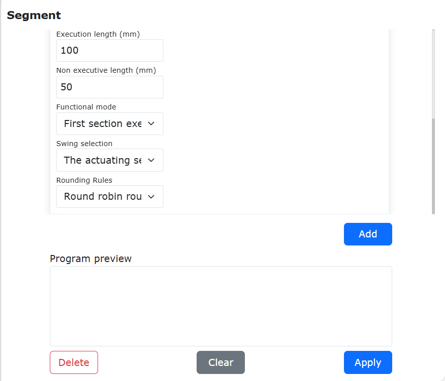

.. centered:: Schemat 9.8-2-11 Pierwszy odcinek nie wykonuje funkcji wahadła z zaokrąglaniem cyklu

5) Jeśli tryb funkcji wybierze „Wykonaj funkcję w pierwszym odcinku”, wybór wahadła wybierze „Wykonaj wahadło odcinka”, a zasada zaokrąglania wybierze „Zaokrąglanie pojedynczego odcinka”, to robot wykonuje ruch wahadłowy na 100 mm i ruch liniowy na 50 mm naprzemiennie. Po zakończeniu cyklu ostatniego odcinka, jeśli następnym odcinkiem jest planowanie ruchu wahadłowego na 100 mm, a pozostała odległość jest mniejsza niż 100 mm, wahadło zatrzymuje się; jeśli następnym odcinkiem jest planowanie ruchu liniowego na 50 mm, a pozostała odległość jest mniejsza niż 50 mm, ruch zatrzymuje się;

.. image:: coding/117.png
   :width: 6in
   :align: center

.. centered:: Schemat 9.8-2-12 Pierwszy odcinek wykonuje funkcję wahadła z zaokrąglaniem pojedynczego odcinka

6) Jeśli tryb funkcji wybierze „Wykonaj funkcję w pierwszym odcinku”, wybór wahadła wybierze „Nie wykonuj wahadła odcinka”, a zasada zaokrąglania wybierze „Zaokrąglanie pojedynczego odcinka”, to robot wykonuje ruch wahadłowy na 50 mm i ruch liniowy na 100 mm naprzemiennie. Po zakończeniu cyklu ostatniego odcinka, jeśli następnym odcinkiem jest planowanie ruchu wahadłowego na 50 mm, a pozostała odległość jest mniejsza niż 50 mm, wahadło zatrzymuje się; jeśli następnym odcinkiem jest planowanie ruchu liniowego na 100 mm, a pozostała odległość jest mniejsza niż 100 mm, ruch zatrzymuje się.

.. image:: coding/118.png
   :width: 6in
   :align: center

.. centered:: Schemat 9.8-2-13 Pierwszy odcinek nie wykonuje funkcji wahadła z zaokrąglaniem pojedynczego odcinka

4. Porównanie postaw

Przy konfiguracji różnych trybów spawania odcinkowego, postawa robota podczas wykonywania trajektorii spawania będzie również inna. Porównanie postaw podczas wykonywania jest następujące:

.. image:: coding/119.png
   :width: 3in
   :align: center

.. centered:: Schemat 9.8-2-14 Początkowa postawa trajektorii spawania

.. image:: coding/120.png
   :width: 3in
   :align: center

.. centered:: Schemat 9.8-2-15 Niezmieniana postawa podczas wykonywania

.. image:: coding/121.png
   :width: 3in
   :align: center

.. centered:: Schemat 9.8-2-16 Zmieniana postawa podczas wykonywania

Rzeczywisty scenariusz spawania odcinkowego
********************************************

W rzeczywistym środowisku testowym robot musi być wyposażony w palnik spawalniczy itp. Na podstawie utworzonej instrukcji spawania odcinkowego, operacja spawania jest wykonywana na płycie spawalniczej. Rzeczywisty scenariusz jest pokazany poniżej:

.. image:: coding/122.png
   :width: 3in
   :align: center

.. centered:: Schemat 9.8-2-17 Rzeczywisty scenariusz spawania odcinkowego

Polecenie śledzenia laserowego
++++++++++++++++++++++++++++++

Kliknij ikonę „Śledzenie laserowe”, aby otworzyć interfejs edycji polecenia Laser.

Ta instrukcja zawiera trzy części: polecenie lasera, polecenie śledzenia i polecenie lokalizacji. Przed dodaniem tej instrukcji upewnij się, że czujnik śledzenia laserowego w urządzeniach peryferyjnych użytkownika został pomyślnie skonfigurowany. Więcej informacji znajduje się w rozdziale dotyczącym urządzeń peryferyjnych robota.

W module ładowania czujnika, po wybraniu odpowiedniego interfejsu „Polecenie czujnika” w zależności od funkcji, skonfiguruj polecenie czujnika:

**Rui niu / Chuang xiang**: Wprowadź typ spoiny, zakres: 0~49 liczba całkowita

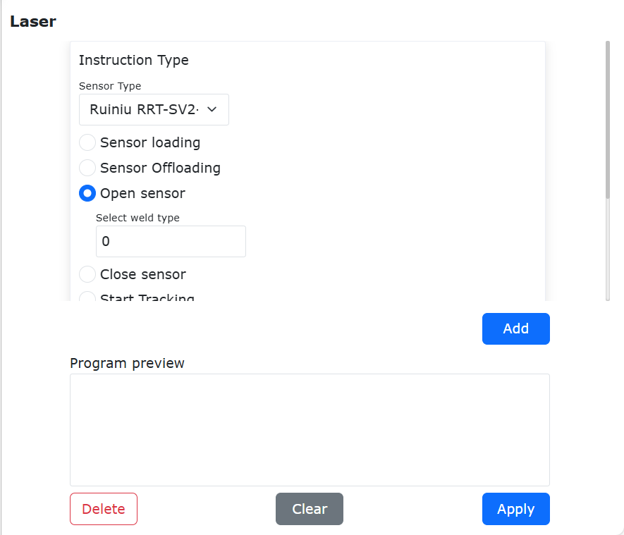

.. centered:: Schemat 9.8-3-1 Interfejs instrukcji Laser (typ spoiny)

**Quan shi**: Wprowadź numer zadania, zakres: 0~255 liczba całkowita

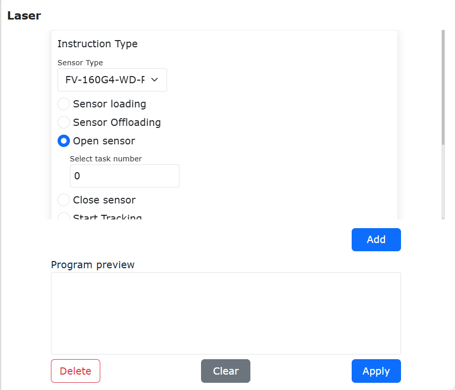

.. centered:: Schemat 9.8-3-2 Interfejs instrukcji Laser (numer zadania)

Funkcja śledzenia punktowego czujnika laserowego
************************************************

Przegląd
""""""""

Obecnie śledzenie punktowe laserem jest realizowane w oparciu o metodę osi rozszerzonej. Dodano nowe metody śledzenia: śledzenie zdefiniowanego czasu lub śledzenie wyzwalane IO, aby dostosować się do różnych scenariuszy aplikacji. Przy wyborze metody śledzenia zdefiniowanego czasu należy ustawić czas śledzenia. Po rozpoczęciu działania programu rozpoczyna się śledzenie laserowe, a po osiągnięciu ustawionego czasu śledzenie kończy się. Przy wyborze metody śledzenia wyzwalanego IO, podczas działania programu lua lub SDK, śledzenie jest aktywowane po wyzwoleniu IO, a kończone po zaniku IO.

Procedura operacyjna dla śledzenia zdefiniowanego czasu
""""""""""""""""""""""""""""""""""""""""""""""""""""""""

**Krok 1**: Kliknij „Ustawienia początkowe” - „Urządzenia peryferyjne” - „Czujnik lasera liniowego” w „Urządzenia dostosowane”, aby przejść do strony konfiguracji. Strona konfiguracji zawiera „Konfigurację czujnika”, „Konfigurację i ładowanie komunikacji”, „Obliczanie odniesienia” itp. Kliknij „Konfiguracja czujnika”, aby ustawić parametry filtracji wejściowej czujnika. Maksymalna różnica jest ustawiana zgodnie z rzeczywistą sytuacją. Przetwarzanie danych wybierz jako „Dane surowe (bez transformacji)”. Współczynnik czułości w kierunku X ustaw na 0, w kierunkach Y i Z ustaw zgodnie z rzeczywistą sytuacją, zalecana wartość 1. Kliknij „Konfiguracja i ładowanie komunikacji”, aby wprowadzić odpowiednie parametry komunikacji i połączyć się z czujnikiem laserowym. Szczegółowa konfiguracja znajduje się w odpowiedniej części instrukcji użytkownika.

.. image:: coding/524.png
   :width: 6in
   :align: center

.. centered:: Schemat 9.8-3-3 Konfiguracja czujnika lasera liniowego

**Krok 2**: Kalibracja układu współrzędnych narzędzia i układu współrzędnych czujnika laserowego. Układ współrzędnych narzędzia jest kalibrowany za pomocą „metody sześciu punktów”, a układ współrzędnych czujnika laserowego za pomocą „metody pięciu punktów”. Treść kalibracji układu współrzędnych narzędzia i układu współrzędnych czujnika laserowego nie jest głównym punktem tej funkcji. Szczegółowe metody kalibracji znajdują się w odpowiedniej części instrukcji użytkownika.

**Krok 3**: Dostosuj położenie przedmiotu obrabianego i wiązki lasera, jak pokazano na rysunku, gdzie czarny prostokąt to przedmiot obrabiany, a czerwony odcinek to wiązka lasera. Wiązka lasera musi być prostopadła do krawędzi śledzonego przedmiotu obrabianego, kierunek ruchu przedmiotu obrabianego jest równoległy do wiązki lasera. Przedmiot obrabiany porusza się ze stałą prędkością, zalecana prędkość to 15 mm/s. Zbyt duża prędkość spowoduje pogorszenie efektu śledzenia.

.. image:: coding/525.png
   :width: 2in
   :align: center

.. centered:: Schemat 9.8-3-4 Schemat względnej pozycji przedmiotu obrabianego i wiązki lasera

**Krok 4**: Kliknij „Program nauczania” - „Śledzenie laserowe” - „Rejestracja danych”, ustaw wybór funkcji jako „Rejestruj i odtwarzaj jednocześnie”, typ ruchu śledzenia punktowego jako „Ruch robota”, tryb wyzwalania śledzenia punktowego jako „Czas”, czas śledzenia ustaw zgodnie z rzeczywistymi potrzebami, w podręczniku jako przykład przyjęto 21 s. Ustawienia pozostałych parametrów są takie same, jak w przypadku śledzenia laserowego z osią rozszerzoną. Kliknij przycisk „Dodaj” na dole.

.. image:: coding/526.png
   :width: 6in
   :align: center

.. centered:: Schemat 9.8-3-5 Ustawienia parametrów śledzenia o zdefiniowanym czasie

**Krok 5**: Kliknij „Program nauczania” - „Śledzenie laserowe” - „Rejestracja danych”, ustaw wybór funkcji jako „Zatrzymaj rejestrację”, kliknij przycisk dodawania, aby wygenerować program lua. Po uruchomieniu tego programu robot będzie śledził przez 21 s, a następnie zakończy śledzenie.

.. image:: coding/527.png
   :width: 6in
   :align: center

.. centered:: Schemat 9.8-3-6 Typowy program lua dla śledzenia o zdefiniowanym czasie

Procedura operacyjna dla śledzenia wyzwalanego IO
""""""""""""""""""""""""""""""""""""""""""""""""""

**Krok 1**: Kliknij „Ustawienia początkowe” - „Urządzenia peryferyjne” - „Czujnik lasera liniowego” w „Urządzenia dostosowane”, aby przejść do strony konfiguracji. Strona konfiguracji zawiera „Konfigurację czujnika”, „Konfigurację i ładowanie komunikacji”, „Obliczanie odniesienia” itp.

Kliknij „Konfiguracja czujnika”, aby ustawić parametry filtracji wejściowej czujnika. Maksymalna różnica jest ustawiana zgodnie z rzeczywistą sytuacją. Przetwarzanie danych wybierz jako „Dane surowe (bez transformacji)”. Współczynnik czułości w kierunku X ustaw na 0, w kierunkach Y i Z ustaw zgodnie z rzeczywistą sytuacją, zalecana wartość 1. Kliknij „Konfiguracja i ładowanie komunikacji”, aby wprowadzić odpowiednie parametry komunikacji i połączyć się z czujnikiem laserowym. Szczegółowa konfiguracja znajduje się w odpowiedniej części instrukcji użytkownika.

.. image:: coding/528.png
   :width: 6in
   :align: center

.. centered:: Schemat 9.8-3-7 Konfiguracja czujnika lasera liniowego

**Krok 2**: Kalibracja układu współrzędnych narzędzia i układu współrzędnych czujnika laserowego. Układ współrzędnych narzędzia jest kalibrowany za pomocą „metody sześciu punktów”, a układ współrzędnych czujnika laserowego za pomocą „metody pięciu punktów”. Treść kalibracji układu współrzędnych narzędzia i układu współrzędnych czujnika laserowego nie jest głównym punktem tej funkcji. Szczegółowe metody kalibracji znajdują się w odpowiedniej części instrukcji użytkownika.

**Krok 3**: Dostosuj położenie przedmiotu obrabianego i wiązki lasera, jak pokazano na rysunku, gdzie czarny prostokąt to przedmiot obrabiany, a czerwony odcinek to wiązka lasera. Wiązka lasera musi być prostopadła do krawędzi śledzonego przedmiotu obrabianego, kierunek ruchu przedmiotu obrabianego jest równoległy do wiązki lasera. Przedmiot obrabiany porusza się ze stałą prędkością, zalecana prędkość to 15 mm/s. Zbyt duża prędkość spowoduje pogorszenie efektu śledzenia.

.. image:: coding/525.png
   :width: 2in
   :align: center

.. centered:: Schemat 9.8-3-8 Schemat względnej pozycji przedmiotu obrabianego i wiązki lasera

**Krok 4**: Kliknij „Program nauczania” - „Śledzenie laserowe” - „Rejestracja danych”, ustaw wybór funkcji jako „Rejestruj i odtwarzaj jednocześnie”, typ ruchu śledzenia punktowego jako „Ruch robota”, tryb wyzwalania śledzenia punktowego jako „IO”. Po wyzwoleniu IO rozpoczyna się śledzenie, a po zaniku IO śledzenie zostaje zatrzymane. Ustawienia pozostałych parametrów są takie same, jak w przypadku śledzenia laserowego z osią rozszerzoną. Kliknij przycisk „Dodaj” na dole.

.. image:: coding/529.png
   :width: 6in
   :align: center

.. centered:: Schemat 9.8-3-9 Ustawienia parametrów śledzenia IO

**Krok 5**: Kliknij „Program nauczania” - „Śledzenie laserowe” - „Rejestracja danych”, ustaw wybór funkcji jako „Zatrzymaj rejestrację”, kliknij przycisk dodawania, aby wygenerować program lua. Po uruchomieniu tego programu śledzenie rozpoczyna się po wyzwoleniu IO, a kończy po zaniku IO.

.. image:: coding/530.png
   :width: 6in
   :align: center

.. centered:: Schemat 9.8-3-10 Typowy program lua dla śledzenia IO

Polecenie rejestracji laserowej
+++++++++++++++++++++++++++++++

Kliknij ikonę „Rejestracja laserowa”, aby otworzyć interfejs edycji polecenia LT-Rec.

Ta instrukcja realizuje funkcję wyodrębniania punktu początkowego i końcowego rejestracji śledzenia laserowego, umożliwiając robotowi automatyczne przejście do pozycji punktu początkowego. Nadaje się do sytuacji, gdy ruch rozpoczyna się od zewnątrz przedmiotu obrabianego i wykonywana jest rejestracja śledzenia laserowego. Jednocześnie urządzenie nadrzędne może pobrać informacje o punkcie początkowym i końcowym z danych rejestracji do późniejszego ruchu.

Realizuje funkcję regulacji prędkości odtwarzania śledzenia laserowego, umożliwiając robotowi rejestrowanie z dużą prędkością, a następnie odtwarzanie z normalną prędkością spawania, co może zwiększyć wydajność pracy.

.. image:: coding/125.png
   :width: 6in
   :align: center

.. centered:: Schemat 9.8-4 Interfejs instrukcji LT-Rec

Polecenie lokalizacji drutu spawalniczego
+++++++++++++++++++++++++++++++++++++++++

Kliknij ikonę „Lokalizacja drutu spawalniczego”, aby otworzyć interfejs edycji polecenia W-Search.

Ta instrukcja jest instrukcją lokalizacji drutu spawalniczego. Zawiera trzy instrukcje: rozpoczęcie lokalizacji, zakończenie lokalizacji i obliczenie przesunięcia. Instrukcja ta jest zwykle stosowana w scenariuszach spawania, wymagając połączenia spawarki z robotem za pomocą instrukcji IO i ruchu.

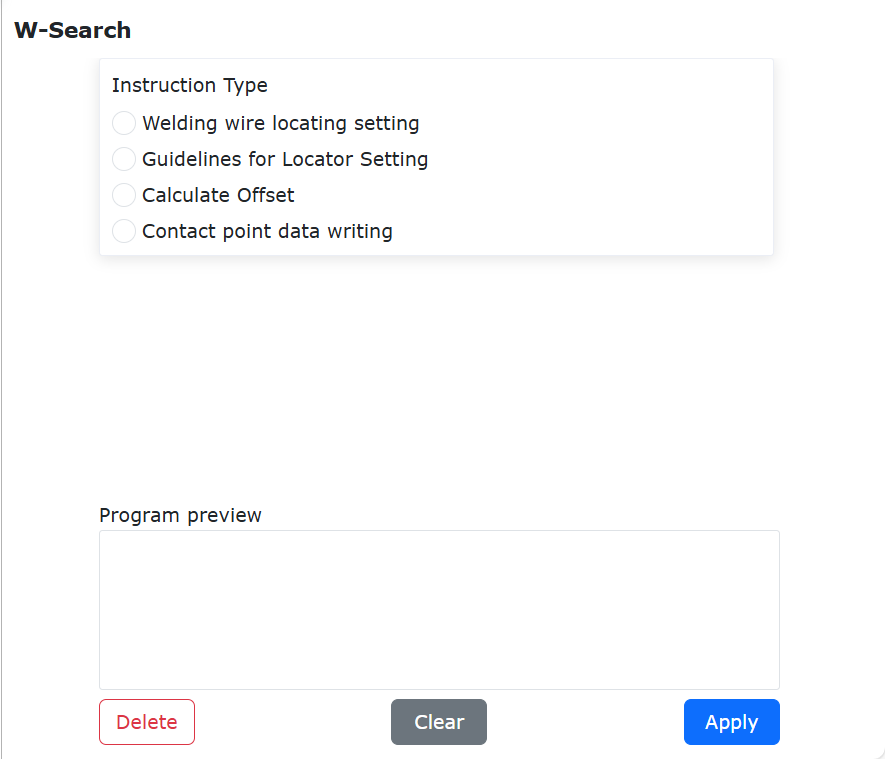

.. centered:: Schemat 9.8-5 Interfejs instrukcji W-Search

Podczas pisania programu zwykle najpierw ustawia się instrukcję rozpoczęcia lokalizacji, następnie dodaje się dwie instrukcje LIN, aby określić kierunek lokalizacji. Po pomyślnej lokalizacji pobiera się obliczoną wartość przesunięcia i stosuje to przesunięcie za pomocą instrukcji ogólnego przesunięcia do rzeczywistej instrukcji ruchu spawania. Przykład programu poniżej.

.. image:: coding/127.png
   :width: 4in
   :align: center

.. centered:: Schemat 9.8-5-1 Przykład W-Search (1D)

Polecenie śledzenia łuku spawalniczego
++++++++++++++++++++++++++++++++++++++

Kliknij ikonę „Śledzenie łuku spawalniczego”, aby otworzyć interfejs edycji polecenia Weld-Trc.

Ta instrukcja realizuje śledzenie spawiny przez robota, wykorzystując wykrywanie odchylenia spawiny do kompensacji trajektorii. Można użyć czujnika łuku spawalniczego do wykrywania odchylenia spawiny.

**Krok 1**: Sposób ustawienia prądu odniesienia dla kompensacji góra/dół: Sprzężenie zwrotne, ustaw rozpoczęcie zliczania prądu odniesienia góra/dół i zliczanie prądu odniesienia góra/dół

.. image:: coding/128.png
   :width: 6in
   :align: center

.. centered:: Schemat 9.8-6-1 Interfejs instrukcji Weld-Trc - sprzężenie zwrotne

**Krok 2**: Sposób ustawienia prądu odniesienia dla kompensacji góra/dół: Stała, ustaw prąd odniesienia góra/dół

.. image:: coding/129.png
   :width: 6in
   :align: center

.. centered:: Schemat 9.8-6-2 Interfejs instrukcji Weld-Trc - stała

**Krok 3**: Interfejs interakcji parametrów kompensacji lewo/prawo

.. image:: coding/130.png
   :width: 6in
   :align: center

.. centered:: Schemat 9.8-6-3 Interfejs instrukcji Weld-Trc - parametry kompensacji lewo/prawo

Struktura systemu śledzenia łuku spawalniczego robota
+++++++++++++++++++++++++++++++++++++++++++++++++++++

Podczas procesu spawania z śledzeniem łuku spawalniczego robota współpracującego, spawarka przekazuje sygnały prądu i napięcia spawania w czasie rzeczywistym z powrotem do robota; robot na podstawie wartości prądu i napięcia spawania otrzymanych w czasie rzeczywistym dokonuje kompensacji pozycji trajektorii spawania, realizując efekt śledzenia łuku spawalniczego. Powyższe sprzężenie zwrotne sygnałów prądu i napięcia między spawarką a robotem odbywa się na cztery sposoby, z których pierwsze dwa wymagają dodatkowego PLC jako pośrednika danych, a dwa kolejne to bezpośrednie połączenie spawarki z szafą sterowniczą robota:

① Komunikacja CANopen lub inną magistralą: Jeśli Twoja spawarka obsługuje protokoły komunikacyjne magistrali, takie jak CANopen, EtherCAT, ModbusTCP (np. Aotai NBC-500RP, Megmeet A2 Series itp.), PLC i spawarka mogą bezpośrednio komunikować się za pomocą odpowiednich protokołów komunikacyjnych. Odpowiednie sygnały prądu spawania mogą być bezpośrednio przesyłane do PLC przez komunikację, a następnie PLC przekazuje je z powrotem do robota przez komunikację UDP.

.. image:: coding/277.png
   :width: 6in
   :align: center

.. centered:: Schemat 9.8-6-4 Topologia struktury systemu śledzenia łuku spawalniczego robota (komunikacja magistralowa PLC ze spawarką)
.. centered:: a-komputer; b-robot i szafa sterownicza; c-PLC i moduł komunikacji magistralowej; d-spawarka

② PLC + IO analogowe: PLC może również bezpośrednio zbierać sygnały analogowe, a następnie przeliczać je na wartości prądu zgodnie z pewną zależnością i przekazywać do robota. Jeśli Twoja spawarka ma analogowe wyjście prądu spawania w czasie rzeczywistym, możesz podłączyć ten kanał bezpośrednio do modułu wejścia analogowego PLC. Jeśli Twoja spawarka nie ma analogowego wyjścia prądu spawania w czasie rzeczywistym, możesz podłączyć zewnętrzny czujnik Halla, który zbiera sygnał prądu spawania w czasie rzeczywistym i przetwarza go na sygnał analogowy, który jest następnie wysyłany do modułu wejścia analogowego PLC.

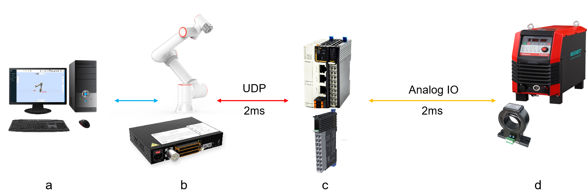

.. centered:: Schemat 9.8-6-5 Topologia struktury systemu śledzenia łuku spawalniczego robota (PLC zbiera sygnały analogowe)
.. centered:: a-komputer; b-robot i szafa sterownicza; c-PLC i moduł wejścia analogowego; d-spawarka i czujnik Halla

③ AI szafy sterowniczej: Porty IO szafy sterowniczej robota mają dwa wejścia analogowe (0 ~ 10 V). Jeśli Twoja spawarka ma analogowe wyjście prądu spawania w czasie rzeczywistym, możesz podłączyć ten kanał bezpośrednio do wejścia analogowego szafy sterowniczej. Jeśli Twoja spawarka nie ma analogowego wyjścia prądu spawania w czasie rzeczywistym, możesz podłączyć zewnętrzny czujnik Halla, który zbiera sygnał prądu spawania w czasie rzeczywistym i przetwarza go na sygnał analogowy, który jest następnie wysyłany do wejścia analogowego szafy sterowniczej. Zależność między wartością wejścia analogowego a rzeczywistą wartością prądu spawania jest często liniowa. Szczegółowe ustawienia parametrów znajdują się w dalszej części „Konfiguracja kanałów śledzenia łuku spawalniczego”.

.. image:: coding/534.png
   :width: 5in
   :align: center

.. centered:: Schemat 9.8-6-6 Topologia struktury systemu śledzenia łuku spawalniczego robota (AI szafy sterowniczej zbiera sygnały analogowe)
.. centered:: a-komputer; b-robot i szafa sterownicza; c-spawarka i czujnik Halla

④ Komunikacja Ethernet: Jeśli Twoja spawarka obsługuje komunikację ModbusTCP, robot może bezpośrednio sterować spawarką i odczytywać wartości prądu i napięcia w czasie rzeczywistym przez ModbusTCP. Komunikacja ModbusTCP między robotem a spawarką korzysta z otwartego protokołu urządzeń peryferyjnych szafy sterowniczej. Zobacz „8.6.6. Protokół komunikacji cyfrowej (Modbus TCP)”

.. image:: coding/535.png
   :width: 5in
   :align: center

.. centered:: Schemat 9.8-6-7 Topologia struktury systemu śledzenia łuku spawalniczego robota (komunikacja ModbusTCP)
.. centered:: a-komputer; b-robot i szafa sterownicza; c-spawarka

Modele spawarek i ustawienia
****************************

.. centered:: Tabela 9.8-1 Modele spawarek i ustawienia

.. list-table::
   :widths: 70
   :header-rows: 0
   :align: center

   * - **Aktualnie przetestowane i kompatybilne modele spawarek**

   * - Megmeet ArtsenII CM350

.. centered:: Tabela 9.8-2 Ustawienia funkcji spawarki

.. list-table::
   :widths: 100 100
   :header-rows: 0
   :align: center

   * - **Numer funkcji**
     - **Ustawiany parametr**

   * - F18
     - 20

   * - F19
     - 56

Modele PLC i ustawienia
***********************

.. centered:: Tabela 9.8-3 Modele PLC i ustawienia

.. list-table::
   :widths: 70
   :header-rows: 0
   :align: center

   * - **Aktualnie przetestowane i kompatybilne modele PLC**

   * - Huichuan Easy521

.. centered:: Tabela 9.8-4 Kluczowe ustawienia PLC

.. list-table::
   :widths: 70 70
   :header-rows: 0
   :align: center

   * - **Pozycja ustawienia**
     - **Treść ustawienia**

   * - Protokół komunikacji
     - CANOPEN

   * - Źródło próbkowania prądu zwrotnego
     - Dane zwrotne CANOPEN spawarki

   * - Cykl synchronizacji
     - 2 ms

:download:`Załącznik: Program PLC <../_static/_doc/MEGMEET PLC PROGRAME.zip>`

Funkcja śledzenia łuku spawalniczego
************************************

**1) Wprowadzenie do parametrów interfejsu funkcji**

.. image:: coding/279.png
   :width: 4in
   :align: center

.. centered:: Schemat 9.8-7-1 Typowy scenariusz śledzenia łuku spawalniczego

Typowy scenariusz funkcji śledzenia łuku spawalniczego obejmuje: a. przedmiot spawany (spoina czołowa pod kątem prostym lub ostrym), b. palnik spawalniczy, e. linia środkowa rowka spawalniczego.

Funkcja śledzenia łuku spawalniczego umożliwia, poprzez zbieranie informacji o prądzie spawania i ustawionych parametrach wahadła robota, śledzenie rowka spawalniczego w kierunku: c. góra/dół (głębokość) i d. lewo/prawo (środek).

**2) Konfiguracja komunikacji**

① Komunikacja CANopen lub inną magistralą:

Otwórz WebApp, kolejno kliknij „Ustawienia początkowe” -> „Konfiguracja urządzeń peryferyjnych użytkownika” -> „Konfiguracja spawarki”.

.. image:: coding/280.png
   :width: 4in
   :align: center

.. centered:: Schemat 9.8-7-2 Otwarcie konfiguracji spawarki

Wybierz typ sterowania jako „Protokół komunikacji cyfrowej”, skonfiguruj parametry komunikacji UDP. Znaczenie poszczególnych parametrów jest następujące:

**Adres IP**: Adres IP strony PLC komunikacji UDP;

**Numer portu**: Numer portu komunikacji UDP strony PLC;

**Okres komunikacji**: Okres komunikacji UDP między robotem a PLC, domyślnie 2 ms;

**Okres wykrywania utraty pakietów, liczba utraconych pakietów**: Gdy liczba utraconych pakietów w okresie wykrywania utraty pakietów przekroczy ustawioną wartość, robot zgłasza błąd „Utrata pakietów komunikacji UDP”, a komunikacja jest automatycznie przerywana.

**Czas potwierdzenia przerwania komunikacji**: Jeśli robot nie otrzyma pełnego pakietu danych zwrotnych PLC w tym czasie, zgłasza błąd „Przerwanie komunikacji UDP” i przerywa komunikację UDP.

**Automatyczne ponowne łączenie po przerwaniu komunikacji**: Czy robot ma automatycznie ponownie łączyć się po wykryciu przerwania komunikacji UDP;

**Okres ponownego łączenia, liczba ponownych łączeń**: Po włączeniu automatycznego ponownego łączenia po przerwaniu komunikacji UDP i wykryciu przerwania, robot próbuje ponownie połączyć się w ustawionych odstępach czasu. Gdy liczba prób ponownego łączenia osiągnie maksymalną ustawioną wartość, a połączenie nadal nie zostanie nawiązane, robot zgłasza błąd „Przerwanie komunikacji UDP” i przerywa komunikację UDP.

Po skonfigurowaniu powyższych parametrów kolejno kliknij przyciski „Konfiguruj” i „Załaduj”.

.. image:: coding/281.png
   :width: 4in
   :align: center

.. centered:: Schemat 9.8-7-3 Wybór typu sterowania

② PLC + IO analogowe:

Podobnie jak w przypadku „① Komunikacja CANopen lub inną magistralą”, program PLC konwertuje wejściowe dane analogowe na dane prądu i napięcia w protokole komunikacji UDP i wysyła je do robota.

③ AI szafy sterowniczej:

Konfiguracja komunikacji nie jest wymagana, wystarczy prawidłowo podłączyć przewody IO między szafą sterowniczą a spawarką. Linie analogowego sprzężenia zwrotnego prądu i napięcia spawania w czasie rzeczywistym spawarki są podłączone odpowiednio do AI0 i AI1 szafy sterowniczej robota.

④ Komunikacja Ethernet:

Prawidłowo podłącz kabel sieciowy między robotem a spawarką. W WebApp kolejno kliknij „Ustawienia początkowe”, „Urządzenia peryferyjne”, „Szafa sterownicza”, „Otwarty protokół urządzeń peryferyjnych”. Prześlij protokół komunikacji spawarki do robota i kolejno kliknij przyciski „Konfiguruj” i „Załaduj”. Robot nawiąże połączenie komunikacyjne ModbusTCP ze spawarką.

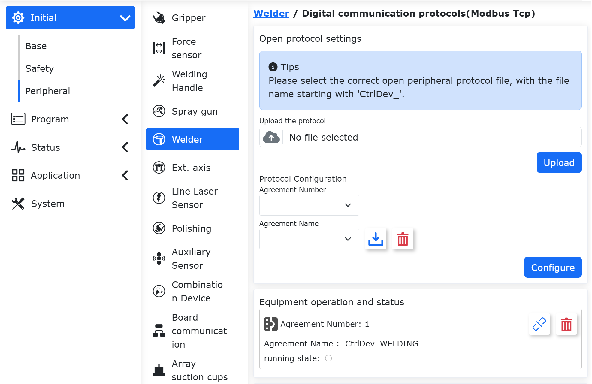

.. centered:: Schemat 9.8-7-4 Nawiązywanie komunikacji Ethernet do śledzenia łuku spawalniczego

.. note:: Efekt śledzenia łuku spawalniczego zależy od szybkiego sprzężenia zwrotnego danych prądu i napięcia spawania w czasie rzeczywistym. Wolniejsze sprzężenie zwrotne może prowadzić do niepowodzenia śledzenia spawiny. Dlatego podczas korzystania z ModbusTCP do komunikacji ze spawarką należy ustawić odpowiedni okres komunikacji w protokole. Zalecany okres komunikacji to mniej niż 10 ms.

**3) Konfiguracja kanałów**

① Komunikacja CANopen lub inną magistralą:

Kolejno kliknij „Ustawienia początkowe” -> „Urządzenia peryferyjne” -> „Spawarka” -> „Protokół komunikacji cyfrowej (UDP)”.

.. image:: coding/282.png
   :width: 4in
   :align: center

.. centered:: Schemat 9.8-7-5 Wybór typu sterowania spawarką jako „Protokół komunikacji cyfrowej (UDP)”

Na dole strony znajdź „Kanały śledzenia łuku spawalniczego”. Wybierz odpowiedni rozszerzony kanał AI zgodnie z rzeczywistą konfiguracją. Domyślnym kanałem AI prądu spawania jest „Aux-AI0”, a kanałem AI napięcia spawania jest Aux-AI1. Kliknij przycisk „Konfiguruj”.

.. note:: 
   Protokół komunikacji UDP między robotem a PLC — patrz „Załącznik 1: Protokół komunikacji UDP robota”. W protokole dane zwrotne z PLC do robota zawierają kanały wejściowe sprzężenia zwrotnego rzeczywistego prądu i napięcia spawania o numerach 74~77;

   Podczas spawania PLC zbiera sygnały prądu spawania w czasie rzeczywistym przez magistralę, taką jak CANOpen, i przekazuje je z powrotem do robota za pomocą bajtów 74~77 rzeczywistych wartości prądu i napięcia spawania w celu śledzenia łuku spawalniczego.

.. image:: coding/536.png
   :width: 4in
   :align: center

.. centered:: Schemat 9.8-7-6 Konfiguracja kanałów śledzenia łuku spawalniczego dla komunikacji magistralowej

② PLC + IO analogowe:

Konfiguracja podobna do „① Komunikacja CANopen lub inną magistralą”. Użytkownik w programie PLC konwertuje odczytane wejścia analogowe na rzeczywiste wartości prądu i napięcia spawania i przypisuje je do kanałów wejściowych sprzężenia zwrotnego rzeczywistego prądu i napięcia spawania o numerach 74~77 w pakiecie danych zwrotnych z PLC do robota w protokole komunikacji UDP między robotem a PLC.

③ AI szafy sterowniczej:

Kolejno kliknij „Ustawienia początkowe” -> „Urządzenia peryferyjne” -> „Spawarka”, „I/O sterownika”.

.. image:: coding/537.png
   :width: 4in
   :align: center

.. centered:: Schemat 9.8-7-7 Wybór typu sterowania spawarką jako „I/O sterownika”

Na dole strony znajdź „Kanały śledzenia łuku spawalniczego”. Wybierz AI prądu spawania jako „Ctrl-AI0”, a AI napięcia spawania jako „Ctrl-AI1”. Kliknij przycisk „Konfiguruj”. Wartość 0~10 V wejścia analogowego szafy sterowniczej a rzeczywista wartość prądu i napięcia spawania często ma zależność liniową, dlatego należy skonfigurować rzeczywiste wartości prądu i napięcia spawania odpowiadające różnym wejściom analogowym.

W sekcji „Wykres zależności prądu i napięcia analogowego” w konfiguracji kanału AI, parametry na interfejsach „A-V” i „V-V” należy skonfigurować w oparciu o tabelę/rysunek odbioru i wyjścia analogowego używanej spawarki.

Na przykład, skonfiguruj dolną i górną granicę prądu spawania dla AI prądu analogowego szafy sterowniczej odpowiednio jako 0 A i 500 A; skonfiguruj dolną i górną granicę napięcia wyjściowego dla AI prądu analogowego szafy sterowniczej odpowiednio jako 0 V i 5 V. Są to parametry konfiguracyjne w sekcji „Wykres zależności prądu i napięcia analogowego” na interfejsie „A-V”. Kliknij „Konfiguruj”, aby zakończyć konfigurację kanału AI prądu analogowego szafy sterowniczej.

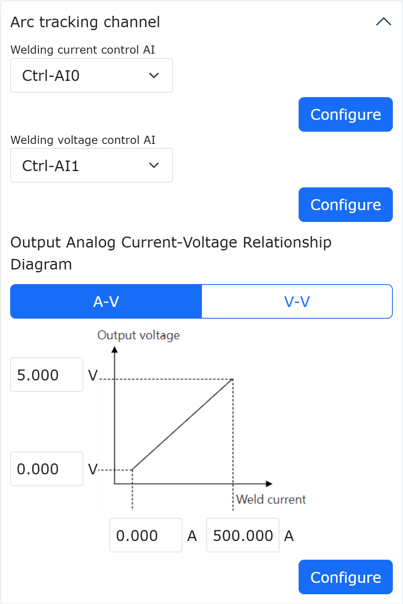

.. centered:: Schemat 9.8-7-8 Konfiguracja AI prądu analogowego szafy sterowniczej

Na przykład, skonfiguruj dolną i górną granicę napięcia spawania dla AI napięcia analogowego szafy sterowniczej odpowiednio jako 0 V i 50 V; skonfiguruj dolną i górną granicę napięcia wyjściowego dla AI napięcia analogowego szafy sterowniczej odpowiednio jako 1,018 V i 10 V. Są to parametry konfiguracyjne w sekcji „Wykres zależności prądu i napięcia analogowego” na interfejsie „V-V”. Kliknij „Konfiguruj”, aby zakończyć konfigurację kanału AI napięcia analogowego szafy sterowniczej.

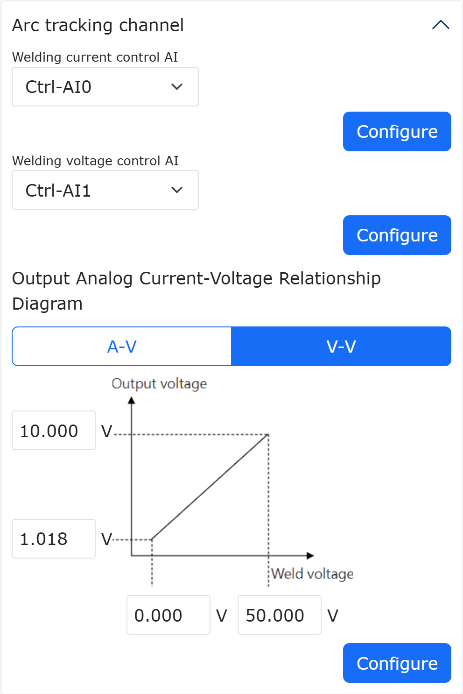

.. centered:: Schemat 9.8-7-9 Konfiguracja AI napięcia analogowego szafy sterowniczej

④ Komunikacja Ethernet:

Kolejno kliknij „Ustawienia początkowe”, „Urządzenia peryferyjne”, „Spawarka”, „Protokół komunikacji cyfrowej (Modbus TCP)”.

.. image:: coding/540.png
   :width: 4in
   :align: center

.. centered:: Schemat 9.8-7-10 Wybór typu sterowania spawarką jako „Protokół komunikacji cyfrowej (Modbus TCP)”

Na dole strony znajdź „Kanały śledzenia łuku spawalniczego”. Wybierz AI prądu spawania jako „Ethernet” i AI napięcia spawania jako „Ethernet”. Kliknij przycisk „Konfiguruj”.

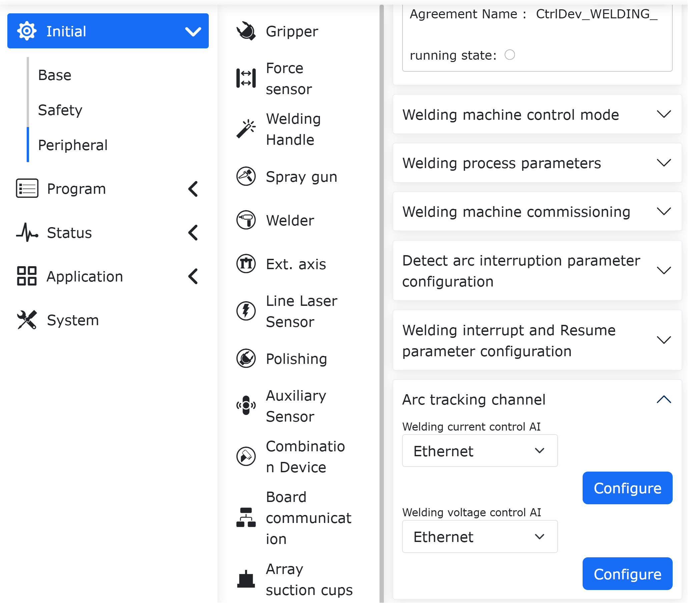

.. centered:: Schemat 9.8-7-11 Konfiguracja kanałów śledzenia łuku spawalniczego dla komunikacji Ethernet

**4) Wprowadzenie do użycia instrukcji funkcji**

Funkcja śledzenia łuku spawalniczego może być dostosowana do ruchu spawania wahadłowego. Po rozpoczęciu łuku w spawaniu wahadłowym wstaw instrukcję rozpoczęcia śledzenia łuku spawalniczego, a przed zgaśnięciem łuku w spawaniu wahadłowym wstaw instrukcję zakończenia śledzenia łuku spawalniczego.

.. image:: coding/283.png
   :width: 6in
   :align: center

.. centered:: Schemat 9.8-7-12 Typowy przykładowy program śledzenia łuku spawalniczego

**5) Wprowadzenie do parametrów interfejsu funkcji**

.. centered:: Tabela 9.8-5 Moduł kompensacji góra/dół śledzenia łuku spawalniczego

.. list-table::
   :widths: 70 70 70
   :header-rows: 0
   :align: center

   * - **Nazwa parametru**
     - **Znaczenie**
     - **Uwagi**

   * - Czas opóźnienia śledzenia łuku spawalniczego
     - Czas opóźnienia prądu zwrotnego
     - Domyślnie 0 ms, nie modyfikować

   * - Kompensacja odchylenia góra/dół
     - Przełącznik kompensacji góra/dół
     - Można wybrać „Włącz” lub „Wyłącz”

   * - Współczynnik regulacji góra/dół
     - Współczynnik zależności między prądem a odległością kompensacji (czułość regulacji)
     - Gdy spawanie zbliża się do stanu zwarcia przejściowego, stosunek sygnału do szumu prądu maleje, zaleca się zmniejszenie czułości

   * - Czas rozpoczęcia kompensacji góra/dół
     - Najwcześniejszy cykl rozpoczęcia kompensacji góra/dół
     - Związane z częstotliwością wahadła. Dobrze jest rozpocząć, gdy prąd ustabilizuje się 3-4 s po rozpoczęciu łuku. Jeśli częstotliwość wahadła wynosi 1 Hz, parametr może wynosić 4; jeśli częstotliwość wynosi 2 Hz, parametr może wynosić 8, itd.

   * - Maksymalna wielkość kompensacji na cykl góra/dół
     - Maksymalna wielkość kompensacji w każdym cyklu kompensacji góra/dół
     - Ustawić zgodnie ze scenariuszem spawania. Im szybsza częstotliwość wahadła, tym mniejsza wielkość kompensacji

   * - Maksymalna całkowita wielkość kompensacji góra/dół
     - Maksymalna skumulowana wielkość kompensacji w pojedynczym procesie spawania
     - Ustawić zgodnie ze scenariuszem spawania. Im większe odchylenie spawiny, tym większa odpowiednia wielkość

   * - Wybór układu współrzędnych góra/dół
     - Układ współrzędnych, w którym kompensowana jest wartość
     - Jeśli istnieje wahadło spawalnicze, można wybrać „Wahadło”, w przeciwnym razie wybrać „Narzędzie” lub „Podstawa”

   * - Sposób ustawienia prądu odniesienia góra/dół
     - Wybór sposobu uzyskania prądu odniesienia
     - Można wybrać „Sprzężenie zwrotne” poprzez odczyt prądu zwrotnego lub „Stała” poprzez bezpośrednie wpisanie wartości prądu

   * - Rozpoczęcie zliczania próbkowania prądu odniesienia góra/dół
     - Liczba cykli opóźnienia przed rozpoczęciem zbierania prądu odniesienia
     - Związane z częstotliwością wahadła. Dobrze jest rozpocząć, gdy prąd ustabilizuje się 3-4 s po rozpoczęciu łuku. Jeśli częstotliwość wahadła wynosi 1 Hz, parametr może wynosić 4; jeśli częstotliwość wynosi 2 Hz, parametr może wynosić 8, itd.

   * - Liczba próbkowań prądu odniesienia góra/dół
     - W trybie sprzężenia zwrotnego prądu odniesienia, okres statystyczny zbierania prądu odniesienia
     - Domyślnie 1 cykl

   * - Prąd odniesienia góra/dół
     - W trybie stałej prądu odniesienia, wartość prądu odniesienia
     - Można ręcznie wprowadzić, aby osiągnąć oczekiwaną wysokość kompensacji

.. centered:: Tabela 9.8-6 Moduł kompensacji lewo/prawo śledzenia łuku spawalniczego

.. list-table::
   :widths: 70 70 70
   :header-rows: 0
   :align: center

   * - **Nazwa parametru**
     - **Znaczenie**
     - **Opis parametru**

   * - Czas opóźnienia śledzenia łuku spawalniczego
     - Czas opóźnienia prądu zwrotnego
     - Domyślnie 0 ms, nie modyfikować

   * - Kompensacja odchylenia lewo/prawo
     - Przełącznik kompensacji lewo/prawo
     - Można wybrać „Włącz” lub „Wyłącz”

   * - Współczynnik regulacji lewo/prawo
     - Współczynnik zależności między prądem a odległością kompensacji (czułość regulacji)
     - Gdy spawanie zbliża się do stanu zwarcia przejściowego, stosunek sygnału do szumu prądu maleje, zaleca się zmniejszenie czułości

   * - Czas rozpoczęcia kompensacji lewo/prawo
     - Najwcześniejszy cykl rozpoczęcia kompensacji lewo/prawo
     - Związane z częstotliwością wahadła. Dobrze jest rozpocząć, gdy prąd ustabilizuje się 3-4 s po rozpoczęciu łuku. Jeśli częstotliwość wahadła wynosi 1 Hz, parametr może wynosić 4; jeśli częstotliwość wynosi 2 Hz, parametr może wynosić 8, itd.

   * - Maksymalna wielkość kompensacji na cykl lewo/prawo
     - Maksymalna wielkość kompensacji w każdym cyklu kompensacji lewo/prawo
     - Ustawić zgodnie ze scenariuszem spawania. Im szybsza częstotliwość wahadła, tym mniejsza wielkość kompensacji

   * - Maksymalna całkowita wielkość kompensacji lewo/prawo
     - Maksymalna skumulowana wielkość kompensacji w pojedynczym procesie spawania
     - Ustawić zgodnie ze scenariuszem spawania. Im większe odchylenie spawiny, tym większa odpowiednia wielkość

**6) Zakres stosowania**

.. centered:: Tabela 9.8-7 Kompensacja góra/dół włączona, kompensacja lewo/prawo wyłączona

.. list-table::
   :widths: 70 70
   :header-rows: 0
   :align: center

   * - **Kluczowe parametry**
     - **Zakres parametru**

   * - Częstotliwość wahadła Hz
     - 0 (bez wahadła spawalniczego), 0,5 do 2 (z wahadłem spawalniczym)

   * - Amplituda wahadła mm
     - 0 (bez wahadła spawalniczego), 3 do 7 (z wahadłem spawalniczym)

   * - Ustawione napięcie V
     - >17

   * - Ustawiony prąd A
     - >160

.. centered:: Tabela 9.8-8 Kompensacja góra/dół wyłączona, kompensacja lewo/prawo włączona

.. list-table::
   :widths: 70 70
   :header-rows: 0
   :align: center

   * - **Kluczowe parametry**
     - **Zakres parametru**

   * - Częstotliwość wahadła Hz
     - 0,5 do 2

   * - Amplituda wahadła mm
     - 3 do 7

   * - Ustawione napięcie V
     - >17

   * - Ustawiony prąd A
     - >160

.. centered:: Tabela 9.8-9 Kompensacja góra/dół i lewo/prawo włączone

.. list-table::
   :widths: 70 70
   :header-rows: 0
   :align: center

   * - **Kluczowe parametry**
     - **Zakres parametru**

   * - Częstotliwość wahadła Hz
     - 0,5 do 2

   * - Amplituda wahadła mm
     - 3 do 7

   * - Ustawione napięcie V
     - >19

   * - Ustawiony prąd A
     - >210

**7) Środki ostrożności**

1) Funkcja śledzenia łuku spawalniczego z kompensacją lewo/prawo może być dostosowana tylko do trajektorii prostych z symetrycznym wahadłem trójkątnym lub sinusoidalnym.
2) Podczas korzystania z funkcji kompensacji, pozycja początkowa spawania musi znajdować się dokładnie nad spoiną (oś palnika spawalniczego w środku spoiny pachwinowej). Palnik nie może znajdować się zbyt blisko spoiny, aby uniknąć ryzyka uderzenia palnika.
3) Materiały po obu stronach rowka spawalniczego muszą być takie same.
4) Wymiary i orientacja układu współrzędnych obiektu muszą być dokładnie skalibrowane za pomocą metody 6 punktów.
5) Im większe odchylenie między ustawioną trajektorią a spoiną, tym większa powinna być maksymalna wielkość kompensacji na cykl i maksymalna całkowita wielkość kompensacji.
6) Odchylenie między ustawioną trajektorią a punktem końcowym spawiny nie powinno przekraczać 100 mm/m. Zbyt duże odchylenie może spowodować uderzenie drutu spawalniczego, a nawet palnika w przedmiot obrabiany, powodując odchylenie pozycji spawania od ustawionej trajektorii (niedostateczne wahadło), co uniemożliwi prawidłowe działanie funkcji śledzenia łuku spawalniczego.
7) Jeśli do spawania wybrano mniejszy ustawiony prąd i napięcie, współczynniki regulacji góra/dół i lewo/prawo śledzenia łuku spawalniczego powinny zostać odpowiednio zmniejszone, aby zmniejszyć niestabilną kompensację spowodowaną zniekształceniami prądu zwrotnego.
8) Podczas wyboru różnych układów współrzędnych do śledzenia łuku spawalniczego, znak współczynników kompensacji góra/dół i lewo/prawo może wymagać dostosowania. Można to ocenić nie tylko na podstawie kierunku odpowiedniego układu współrzędnych, ale także poprzez próbne spawanie. Jeśli po nauczeniu trajektorii spawania wahadłowego na pochyłej płycie (lewy rysunek) i włączeniu śledzenia łuku spawalniczego, trajektoria spawania (prawy rysunek) porusza się w dół nachylenia płaszczyzny wahadła, a wysokość palnika na końcu jest zbliżona do wysokości na początku, to znak współczynnika regulacji jest prawidłowy.

.. image:: coding/284.png
   :width: 6in
   :align: center

.. centered:: Schemat 9.8-7-13 Ustawienie nachylonej trajektorii wahadłowej (lewy), gdy znak jest prawidłowy, trajektoria spawiny (prawy)

Polecenie regulacji postawy
+++++++++++++++++++++++++++

Kliknij ikonę „Regulacja postawy”, aby otworzyć interfejs edycji polecenia Adjust.

Ta instrukcja jest przeznaczona do scenariuszy, w których śledzenie spawania samodzielnie dostosowuje postawę palnika spawalniczego. Po zapisaniu trzech odpowiednich punktów postawy, w zależności od rzeczywistego kierunku ruchu robota, dodaje się instrukcję samodzielnej regulacji postawy. Więcej informacji znajduje się w rozdziale dotyczącym urządzeń peryferyjnych robota.

.. centered:: Schemat 9.8-8 Interfejs instrukcji Adjust

Interfejs instrukcji sterowania siłą
~~~~~~~~~~~~~~~~~~~~~~~~~~~~~~~~~~~~

.. image:: coding/135.png
   :width: 6in
   :align: center

.. centered:: Schemat 9.9 Interfejs instrukcji sterowania siłą

Polecenie zestawu sterowania siłą
+++++++++++++++++++++++++++++++++

Kliknij ikonę „Zestaw sterowania siłą”, aby otworzyć interfejs edycji polecenia F/T.

Ta instrukcja zawiera osiem instrukcji: FT_Guard (wykrywanie kolizji), FT_Control (sterowanie stałą siłą), FT_Compliance (sterowanie podatne), FT_Spiral (wstawianie spirali), FT_Rot (wstawianie obrotu), FT_Lin (wstawianie linii), FT_FindSurface (lokalizacja powierzchni), FT_CalCenter (lokalizacja środka). Więcej informacji znajduje się w rozdziale dotyczącym urządzeń peryferyjnych robota.

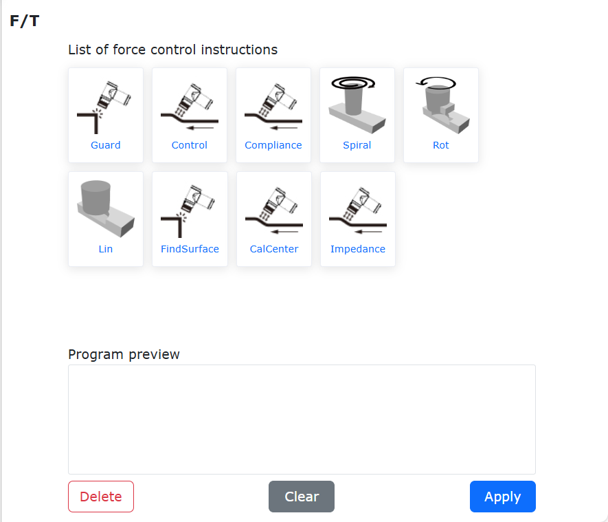

.. centered:: Schemat 9.9-1 Interfejs instrukcji F/T

Funkcja optymalizacji wstawiania obrotowego ze sterowaniem siłą
***************************************************************

Przegląd
""""""""

Funkcja wstawiania obrotowego ze sterowaniem siłą jest zwykle używana do wykonywania czynności wstawiania obrotowego. Przed wykonaniem czynności konieczne jest przesunięcie końcówki robota do całkowicie wyrównanego, nauczonego otworu. Zgodnie ze scenariuszem aplikacji należy ustawić odpowiednie parametry ruchu i strategię obsługi w przypadku niewykrycia siły zewnętrznej. Gdy wykryta siła zewnętrzna po zakończeniu nie osiągnie ustawionego progu, użytkownik może zdecydować o zatrzymaniu całego programu (funkcja skonfigurowana jako „Błąd”, wyświetlany czerwony błąd na interfejsie) lub kontynuowaniu ruchu (funkcja skonfigurowana jako „Ostrzeżenie”, wyświetlane żółte ostrzeżenie na interfejsie).

Procedura operacyjna
""""""""""""""""""""

**Krok 1**: Kolejno kliknij „Program nauczania” -> „Programowanie” -> „Zestaw sterowania siłą” - instrukcja „Rot”, ustaw odpowiednie parametry ruchu zgodnie z rzeczywistym scenariuszem aplikacji. Strategia obsługi w przypadku niewykrycia siły zewnętrznej może być ustawiona jako „Błąd” lub „Ostrzeżenie”. Gdy skonfigurowane jako „Błąd”, jeśli robot zawsze wykrywa siłę zewnętrzną mniejszą od ustawionego progu i osiągnął już ustawiony kąt obrotu, zgłasza błąd na interfejsie i zatrzymuje wykonywanie dalszego programu. Gdy skonfigurowane jako „Ostrzeżenie”, jeśli robot zawsze wykrywa siłę zewnętrzną mniejszą od ustawionego progu i osiągnął już ustawiony kąt obrotu, wyświetla ostrzeżenie na interfejsie i kontynuuje wykonywanie dalszego programu.

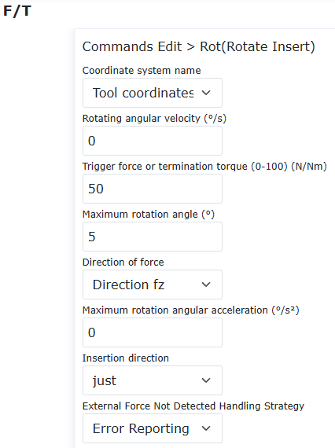

.. centered:: Schemat 9.9-2 Konfiguracja parametrów wstawiania obrotowego ze sterowaniem siłą

**Krok 2**: Funkcja wstawiania obrotowego ze sterowaniem siłą musi być używana w połączeniu z funkcją „FT_Control” do ruchu. Typowe programy lua z ustawioną strategią obsługi w przypadku niewykrycia siły zewnętrznej jako „Błąd” lub „Ostrzeżenie” i tymi samymi parametrami ruchu są pokazane odpowiednio na rysunkach.

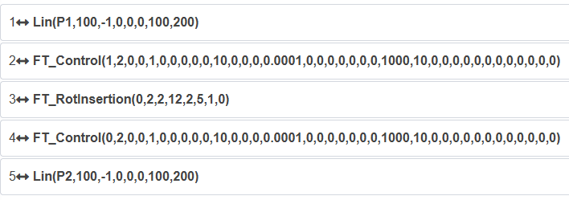

.. centered:: Schemat 9.9-3 Typowy program lua z konfiguracją „Błąd”

.. image:: coding/533.png
   :width: 6in
   :align: center

.. centered:: Schemat 9.9-4 Typowy program lua z konfiguracją „Ostrzeżenie”

Polecenie rejestracji momentu obrotowego
++++++++++++++++++++++++++++++++++++++++

Kliknij ikonę „Rejestracja momentu obrotowego”, aby otworzyć interfejs edycji polecenia Torque.

Ta instrukcja jest instrukcją rejestracji momentu obrotowego, realizującą funkcję wykrywania kolizji poprzez rejestrację momentu obrotowego w czasie rzeczywistym. Kliknij przycisk „Rozpocznij rejestrację momentu obrotowego”, aby rejestrować kolizje podczas wykonywania instrukcji ruchu. Zarejestrowany moment obrotowy w czasie rzeczywistym służy jako teoretyczna wartość do oceny wykrywania kolizji, aby zmniejszyć prawdopodobieństwo fałszywych błędów. Gdy wartość przekroczy ustawiony zakres progowy, rejestrowany jest czas trwania wykrytej kolizji. Kliknij przycisk „Zatrzymaj rejestrację momentu obrotowego”, aby zatrzymać rejestrację. Kliknij „Reset rejestracji momentu obrotowego”, aby przywrócić stan domyślny.

.. image:: coding/137.png
   :width: 6in
   :align: center

.. centered:: Schemat 9.9-5 Interfejs instrukcji Torque

Interfejs instrukcji wizyjnych
~~~~~~~~~~~~~~~~~~~~~~~~~~~~~~

.. image:: coding/138.png
   :width: 6in
   :align: center

.. centered:: Schemat 9.10 Interfejs instrukcji wizyjnych

Polecenie wizji 3D
++++++++++++++++++

Kliknij ikonę „Wizja 3D”, aby otworzyć interfejs edycji polecenia 3D.

Ta instrukcja jest instrukcją generowania instancji programu wizji 3D. Użytkownik może odnieść się do wygenerowanego programu i współpracować z innymi urządzeniami wizyjnymi. Zawiera dwa przykłady przypadków: kalibracja kamery i chwytanie kamerą.

.. image:: coding/139.png
   :width: 6in
   :align: center

.. centered:: Schemat 9.10-1 Interfejs instrukcji 3D

Interfejs instrukcji paletyzacji
~~~~~~~~~~~~~~~~~~~~~~~~~~~~~~~~

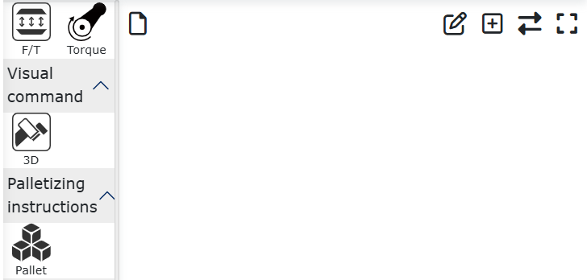

.. centered:: Schemat 9.11 Interfejs instrukcji paletyzacji

Polecenie przemieszczenia macierzy
++++++++++++++++++++++++++++++++++

Kliknij ikonę „Przemieszczenie macierzy”, aby otworzyć interfejs edycji polecenia Pallet.

Ta instrukcja jest instrukcją generowania programu paletyzacji.

.. image:: coding/141.png
   :width: 6in
   :align: center

.. centered:: Schemat 9.11-1 Interfejs instrukcji Pallet

Funkcja ta steruje regularnym przemieszczaniem ramienia robota poprzez ustawienie współrzędnych trzech punktów, liczby wierszy i kolumn, warstw i wysokości warstw. Nadaje się do typowych zastosowań paletyzacji. Pierwszym krokiem jest wybór sposobu ruchu robota, „PTP” lub „Linia”. Drugim krokiem jest ustawienie ścieżki ruchu robota, „Od początku do końca” lub „W zygzak”. Trzecim krokiem jest ustawienie sposobu układania, „Układanie” lub „Rozładunek”.

.. image:: coding/142.png
   :width: 6in
   :align: center

.. centered:: Schemat 9.11-2 Przesunięcie macierzy

Czwartym krokiem jest nauczenie trzech punktów zgodnie ze ścieżką. Pierwszy punkt to początek pierwszego rzędu. Postawa ramienia podczas całego ruchu jest określana przez ten punkt. Drugi punkt to koniec pierwszego rzędu. Trzeci punkt to koniec ostatniego rzędu. Piątym krokiem jest ustawienie liczby wierszy i kolumn. Szóstym krokiem jest ustawienie liczby warstw i wysokości każdej warstwy.

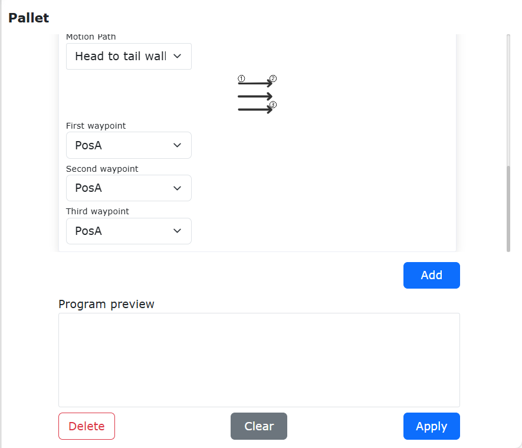

.. centered:: Schemat 9.11-3 Przesunięcie macierzy

Interfejs instrukcji komunikacyjnych
~~~~~~~~~~~~~~~~~~~~~~~~~~~~~~~~~~~~

.. image:: coding/144.png
   :width: 6in
   :align: center

.. centered:: Schemat 9.12 Interfejs instrukcji komunikacyjnych

Polecenie Modbus
++++++++++++++++

Kliknij ikonę „Modbus”, aby otworzyć interfejs edycji polecenia Modbus.

Funkcją tej instrukcji jest funkcja magistrali oparta na protokole Modbus TCP. Użytkownik może sterować komunikacją robota z klientem lub serwerem Modbus TCP (komunikacja master-slave) za pomocą odpowiednich instrukcji, wykonując operacje odczytu i zapisu na cewkach, dyskretnych wejściach i rejestrach.

.. image:: coding/145.png
   :width: 6in
   :align: center

.. centered:: Schemat 9.12-1 Interfejs instrukcji modbus master

.. image:: coding/146.png
   :width: 6in
   :align: center

.. centered:: Schemat 9.12-2 Interfejs instrukcji modbus slave

Więcej funkcji operacyjnych Modbus TCP można uzyskać kontaktując się z nami.

Polecenie Xmlrpc
++++++++++++++++

Kliknij ikonę „Xmlrpc”, aby otworzyć interfejs edycji polecenia Xmlrpc.

XML-RPC to metoda wywoływania procedur zdalnych, która wykorzystuje XML do przesyłania danych między programami za pomocą gniazd. Dzięki tej metodzie sterownik robota może wywoływać funkcje (z parametrami) w zdalnym programie/usłudze i uzyskiwać zwracane dane strukturalne. Sterownik robota obsługuje wszystkie szczegóły tworzenia komunikatów klienta XML-RPC oraz konwersji między typami danych a XML.

.. image:: coding/147.png
   :width: 6in
   :align: center

.. centered:: Schemat 9.12-3 Interfejs instrukcji Xmlrpc

.. important:: 
  1) Sterownik jako klient łączy się ze zdalnym, niestandardowym portem;

  2) Sterownik jako klient wywołuje zdalne funkcje;

  3) Obsługuje wywoływanie różnych zdalnych funkcji;

  4) Obsługuje przekazywanie parametrów w postaci tablicy stringów i zwracanie wyników w postaci tablicy stringów, liczba elementów tablicy może być zdefiniowana przez użytkownika;

  Obsługuje przekazywanie parametrów w postaci tablicy double i zwracanie wyników w postaci tablicy double, liczba elementów tablicy może być zdefiniowana przez użytkownika;

::

   XmlrpcClientCall(serverUrl, methodName, tableType, param)

   serverUrl URL serwera, np.: "http://192.168.58.29:50000/RPC2"

   methodName Nazwa wywoływanej funkcji, np. "example.add"

   tableType 1 - tablica typu double, 2 - tablica typu string

   param Parametry wywoływanej funkcji

::

   XmlrpcClientCall(error, result)

   error 0 - brak błędu, 1 - błąd

   result Jeśli parametry wejściowe są tablicą double, result jest tablicą double.

   Jeśli parametry wejściowe są tablicą string, result jest tablicą string.

Interfejs instrukcji pomocniczych
~~~~~~~~~~~~~~~~~~~~~~~~~~~~~~~~~

.. image:: coding/148.png
   :width: 6in
   :align: center

.. centered:: Schemat 9.13 Interfejs instrukcji pomocniczych

Polecenie wątku pomocniczego
++++++++++++++++++++++++++++

Kliknij ikonę „Wątek pomocniczy”, aby otworzyć interfejs edycji polecenia Thread.

Polecenie Thread to funkcja wątku pomocniczego. Użytkownik może zdefiniować wątek pomocniczy działający równolegle z wątkiem głównym. Wątek pomocniczy służy głównie do wymiany danych z urządzeniami zewnętrznymi. Obsługuje komunikację socket, pobieranie stanu DI robota, ustawianie stanu DO robota, pobieranie informacji o stanie robota oraz wymianę danych z wątkiem głównym. Wątek główny wykorzystuje dane uzyskane przez wątek pomocniczy do podejmowania decyzji logicznych sterujących ruchem robota. Przykładowy zrzut ekranu programu użytkownika:

.. image:: coding/149.png
   :width: 6in
   :align: center

.. centered:: Schemat 9.13-1 Przykład programu Thread

Polecenie wywołania funkcji
+++++++++++++++++++++++++++

Kliknij ikonę „Wywołanie funkcji”, aby otworzyć interfejs edycji polecenia Function.

Ta instrukcja to interfejs funkcji wywołania. Udostępnia funkcje interfejsu robota do wyboru dla klienta i podpowiada parametry wymagane przez tę funkcję, ułatwiając klientowi pisanie skryptów. Więcej funkcji będzie stopniowo dodawanych.

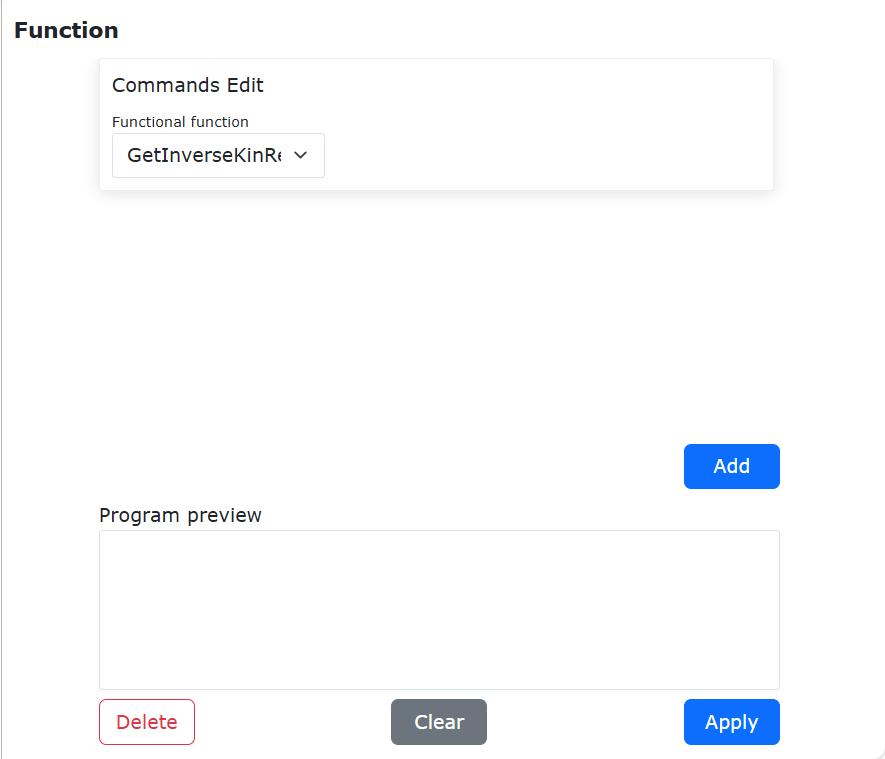

.. centered:: Schemat 9.13-2 Interfejs instrukcji Function

Polecenie tabeli punktów
++++++++++++++++++++++++

Kliknij ikonę „Tabela punktów”, aby otworzyć interfejs edycji polecenia PT-Mode.

Ta instrukcja jest używana głównie do przełączania trybów między trybem systemowym a trybem tabeli punktów. Poprzez przełączanie tabeli punktów stosowane są punkty nauczania w różnych tabelach punktów. Szczegóły w rozdziale 11 – Punkty nauczania.

.. image:: coding/151.png
   :width: 6in
   :align: center

.. centered:: Schemat 9.13-3 Interfejs instrukcji tabeli punktów

Weryfikacja niezapisania programu nauczania
~~~~~~~~~~~~~~~~~~~~~~~~~~~~~~~~~~~~~~~~~~~

Na stronie programowania nauczania, po otwarciu/utworzeniu nowego programu, jeśli program nauczania został zmodyfikowany, ale nie zapisany.

Jeśli klikniesz „Otwórz”, „Nowy”, „Eksportuj”, „Zmień nazwę” lub inne operacje na plikach, pojawi się okno dialogowe „Czy zapisać ten program” z komunikatem „Bieżący program uległ zmianie. Czy zapisać zmiany w tym programie?”, jak poniżej.

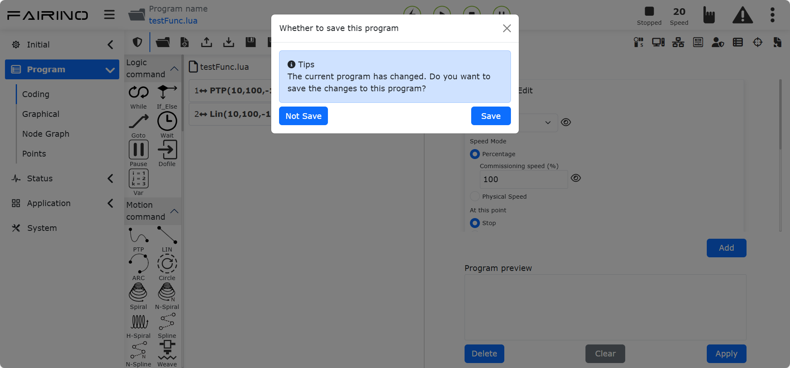

.. centered:: Schemat 9.14-1 Weryfikacja niezapisania programu na bieżącej stronie

**Krok 1**: Kliknij przycisk „Nie zapisuj”, program zostanie przywrócony do stanu sprzed modyfikacji i kontynuuje wykonywanie wcześniejszej operacji na pliku.

**Krok 2**: Kliknij przycisk „Zapisz”, niezapisany program lua zostanie pomyślnie zapisany i kontynuuje wykonywanie wcześniejszej operacji na pliku.

Jeśli opuścisz stronę programowania nauczania i przełączysz się na inną stronę, również pojawi się monit „Czy zapisać ten program” i nadal pozostaniesz na bieżącej stronie programu nauczania, jak poniżej.

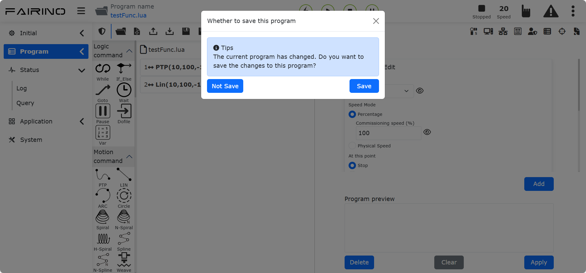

.. centered:: Schemat 9.14-2 Weryfikacja niezapisania programu przy przełączaniu strony

**Krok 1**: Kliknij „Nie zapisuj”, aby przejść do wcześniej wybranej strony.

**Krok 2**: Kliknij „Zapisz”, niezapisany program lua zostanie pomyślnie zapisany i przejdzie do wcześniej wybranej strony.

Szyfrowanie programu nauczania
~~~~~~~~~~~~~~~~~~~~~~~~~~~~~~

Programy nauczania mogą być zaszyfrowane lub nie. Poziomy szyfrowania dzielą się na szyfrowanie pierwszego poziomu i szyfrowanie drugiego poziomu, przy czym szyfrowanie pierwszego poziomu zapewnia najwyższy stopień ochrony, a drugiego poziomu jest nieco niższy.

Wszystkie programy nauczania są wyświetlane i konfigurowane w formie tabeli w „Ustawienia systemowe – Informacje niestandardowe”. Po prawej stronie tabeli znajduje się opis poziomów szyfrowania.

.. image:: coding/154.png
   :width: 6in
   :align: center

.. centered:: Schemat 9.15-1 Szyfrowanie programu nauczania

Gdy program jest w stanie szyfrowania pierwszego poziomu, po jego otwarciu:
Odpowiednie ikony przycisków w pasku operacji, takie jak „Eksportuj”, „Zapisz”, „Zapisz jako”, „Kopiuj”, „Wytnij”, „Wklej”, „Usuń”, „Przesuń w górę”, „Przesuń w dół” i „Przełącz tryb edycji” stają się wygaszone. Kliknięcie ikony jest nieskuteczne i pojawi się komunikat, że bieżący program jest zaszyfrowany.
Ikona „Zmień nazwę” programu zostanie ukryta.
Pasek dodawania instrukcji i obszar edycji programu staną się niewidoczne z komunikatem, że są zablokowane z powodu szyfrowania pierwszego poziomu.

.. image:: coding/155.png
   :width: 6in
   :align: center

.. centered:: Schemat 9.15-2 Interfejs programu z szyfrowaniem pierwszego poziomu

Gdy program ma szyfrowanie drugiego poziomu, po jego otwarciu na stronie „Programowanie nauczania”:
Odpowiednie ikony przycisków w pasku operacji, takie jak „Zapisz”, „Kopiuj”, „Wytnij”, „Wklej”, „Usuń”, „Przesuń w górę” i „Przesuń w dół” stają się wygaszone. Kliknięcie ikony jest nieskuteczne i pojawi się komunikat, że bieżący program jest zaszyfrowany.
Ikona „Zmień nazwę” programu zostanie ukryta.
Pasek dodawania instrukcji staje się niewidoczny z komunikatem, że jest zablokowany z powodu szyfrowania drugiego poziomu.
Obszar edycji programu umożliwia normalne przeglądanie i czytanie programu.

.. image:: coding/156.png
   :width: 6in
   :align: center

.. centered:: Schemat 9.15-3 Interfejs programu z szyfrowaniem drugiego poziomu

Zarówno szyfrowanie pierwszego, jak i drugiego poziomu umożliwia użycie funkcji „Eksportuj”. Podczas importu przeprowadzana jest weryfikacja. Jeśli istnieje program o tej samej nazwie, który jest zaszyfrowany, operacja importu zostanie przerwana i pojawi się komunikat, że nie można zastąpić zaszyfrowanego programu.

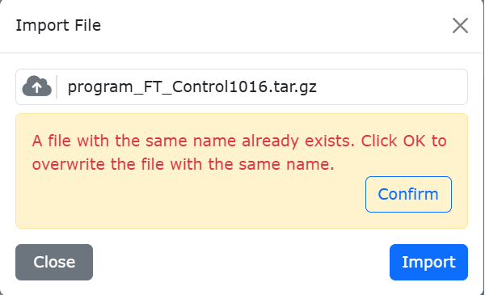

.. centered:: Schemat 9.15-4 Import programu

Lokalne punkty nauczania
~~~~~~~~~~~~~~~~~~~~~~~~~

Lokalne punkty nauczania są powiązane z bieżącym programem nauczania. Podczas dodawania poleceń programu mogą być one używane tylko w bieżącym programie nauczania, nie mogą być używane w innych programach nauczania.

**Nowy**: Kliknij ikonę „Dodaj lokalny punkt nauczania” po prawej stronie nazwy pliku programu, aby dodać lokalny punkt nauczania. (Szczegóły lokalnych punktów nauczania można znaleźć w sekcji Rejestracja punktów nauczania w operacjach robota)

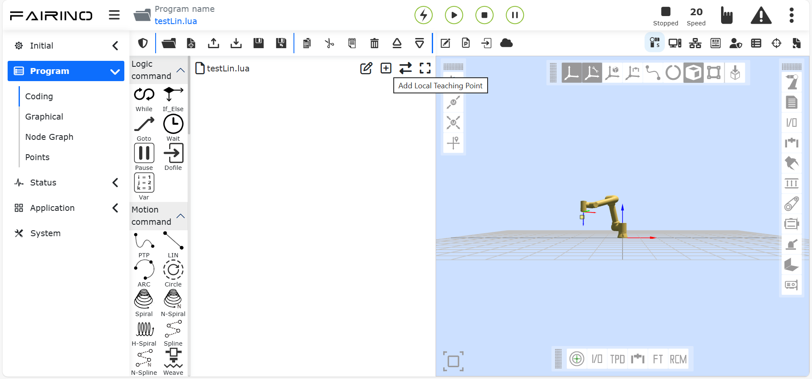

.. centered:: Schemat 9.16-1 Dodawanie lokalnego punktu nauczania

**Usuń**: Kliknij w polu numeru sekwencji tabeli, aby wybrać lokalny punkt nauczania do usunięcia, a następnie kliknij ikonę „Usuń” w prawym górnym rogu tytułu lokalnego punktu nauczania, aby go usunąć.

.. image:: coding/159.png
   :width: 6in
   :align: center

.. centered:: Schemat 9.16-2 Usuwanie lokalnego punktu nauczania

**Uruchom**: Kliknij ikonę „Rozpocznij działanie” w kolumnie operacji na danych w tabeli lokalnego punktu nauczania, aby uruchomić pojedynczy punkt nauczania i przesunąć robota do pozycji tego punktu.

.. image:: coding/160.png
   :width: 6in
   :align: center

.. centered:: Schemat 9.16-3 Uruchamianie lokalnego punktu nauczania

**Szczegóły**: Kliknij ikonę „Szczegóły” w kolumnie operacji na danych w tabeli lokalnego punktu nauczania, aby wyświetlić szczegóły lokalnego punktu nauczania.

.. image:: coding/161.png
   :width: 3in
   :align: center

.. centered:: Schemat 9.16-4 Szczegóły lokalnego punktu nauczania

Kopia zapasowa bieżącego programu
~~~~~~~~~~~~~~~~~~~~~~~~~~~~~~~~~

Gdy użytkownik zmodyfikuje program nauczania i kliknie Zapisz, uruchamiana jest funkcja „Kopia zapasowa” bieżącego programu (czas przechowywania kopii zapasowej wynosi 1 rok). Początkowa treść bieżącego programu jest zapisywana i wyświetlana po prawej stronie, ułatwiając użytkownikowi porównanie wprowadzonych zmian.
Użytkownik może wybrać datę, aby wyświetlić odpowiednią treść kopii zapasowej programu. Kliknięcie ikony „Usuń” w prawym górnym rogu spowoduje usunięcie treści kopii zapasowej bieżącego programu. Treść kopii zapasowej bieżącego programu jest dostępna tylko do odczytu, nie można jej modyfikować.

.. image:: coding/162.png
   :width: 6in
   :align: center

.. centered:: Schemat 9.17 Kopia zapasowa bieżącego programu

Komunikacja Modbus TCP
~~~~~~~~~~~~~~~~~~~~~~

Modbus TCP to powszechnie używany protokół komunikacyjny w produkcji przemysłowej. Roboty współpracujące FANUC oferują dwa sposoby komunikacji z urządzeniami: jako master Modbus TCP i jako slave Modbus TCP.

Robot współpracujący może obsługiwać jednocześnie do 8 masterów Modbus TCP do komunikacji z urządzeniami zewnętrznymi, każdy master obsługuje do 128 rejestrów. Slave Modbus TCP robota współpracującego ma 128 cewek, 128 dyskretnych wejść, 64 rejestry holdingowe i 64 rejestry wejściowe (typy danych rejestrów holdingowych i wejściowych obejmują trzy typy: bez znaku, ze znakiem i zmiennoprzecinkowy). Jednocześnie część adresów rejestrów wejściowych slave'a Modbus TCP robota współpracującego jest przeznaczona do zwracania informacji o bieżącej pozycji stawów robota, prędkości ruchu itp., a część adresów rejestrów cewek jest przeznaczona do sterowania robotem, takimi jak uruchamianie programu, zatrzymywanie programu, ustawianie DO szafy sterowniczej itp.

Slave Modbus TCP robota obsługuje połączenie tylko z jednym masterem. Robot może jednocześnie działać jako master i slave, komunikując się z różnymi urządzeniami. Poniżej znajdują się szczegółowe instrukcje użycia.

Master Modbus TCP
+++++++++++++++++

Przed użyciem robota współpracującego jako mastera Modbus TCP do komunikacji z urządzeniami, najpierw sprawdź połączenie sieciowe między urządzeniami a robotem i upewnij się, że interfejsy sieciowe znajdują się w tej samej podsieci.

Korzystanie z mastera Modbus TCP robota obejmuje następujące kroki:

- Dodanie mastera;
- Dodanie rejestrów;
- Testowanie komunikacji;
- Napisanie programu użytkownika;
- Wykonanie programu użytkownika.

Dodanie mastera Modbus TCP
**************************

Otwórz WebApp, kolejno kliknij „Symulacja nauczania”, „Programowanie nauczania”, utwórz nowy program użytkownika „testModbusMaster.lua”.

.. image:: coding/163.png
   :width: 6in
   :align: center

.. centered:: Schemat 9.18-1 Tworzenie programu użytkownika mastera Modbus TCP

Kliknij przycisk „Ustawienia Modbus TCP”, aby otworzyć stronę konfiguracji funkcji Modbus TCP.

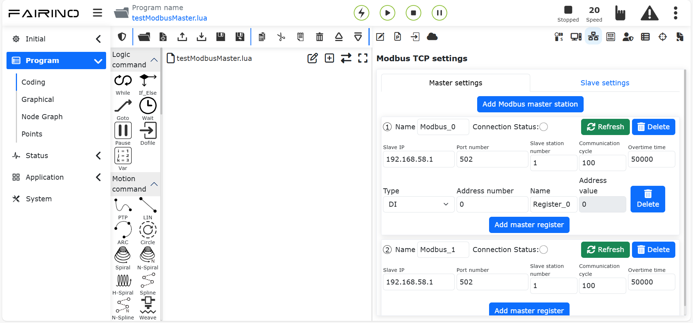

.. centered:: Schemat 9.18-2 Otwarcie ustawień Modbus TCP

Kolejno kliknij „Ustawienia mastera”, „Dodaj mastera Modbus”, aby dodać mastera Modbus TCP.

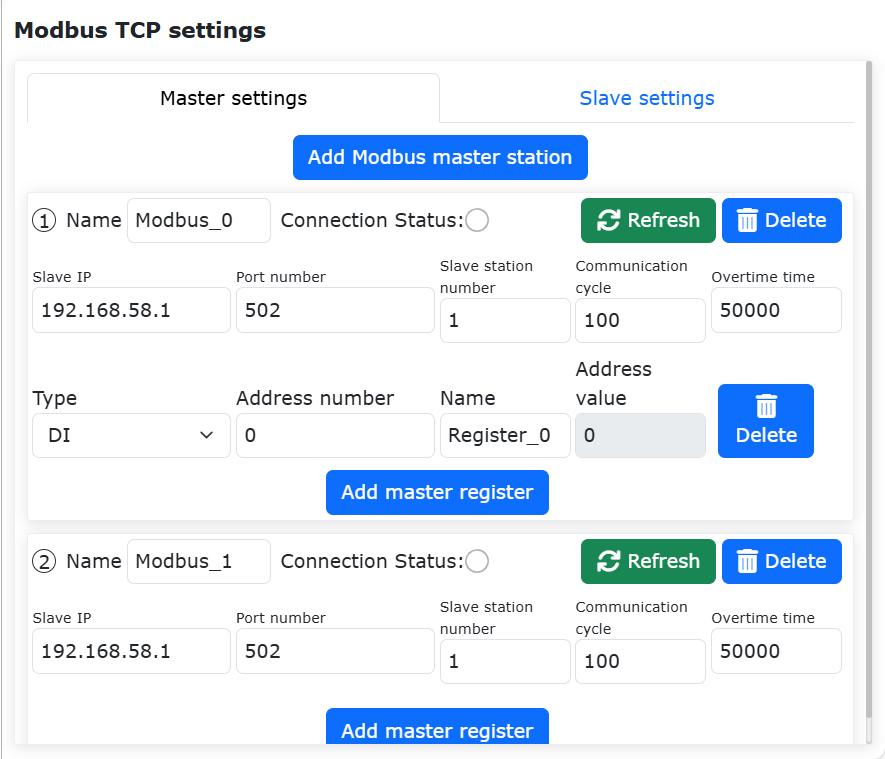

.. centered:: Schemat 9.18-3 Dodanie „mastera Modbus TCP”

Zgodnie z sytuacją urządzenia kolejno wprowadź „Nazwę”, „IP slave'a”, „Numer portu”, „Numer slave'a”, „Okres komunikacji” i „Czas timeoutu”. Znaczenie powyższych parametrów jest następujące:

**Nazwa**: Nazwa mastera Modbus TCP robota. Robot obsługuje tworzenie maksymalnie 8 masterów do nawiązywania połączeń z odpowiednimi slave'ami. Różni masterzy mogą mieć unikalne nazwy w celu ich odróżnienia, np. „PLC”, „Kamera”, „Karta akwizycji danych”, „FRRobot1” itp.;

**IP slave'a**: Adres IP slave'a, z którym master Modbus TCP robota ma się połączyć;

.. note:: Najpierw podłącz kabel sieciowy między robotem a urządzeniem slave i upewnij się, że adresy IP robota i urządzenia slave znajdują się w tej samej podsieci.

**Numer portu**: Numer portu slave'a Modbus TCP, z którym ma się połączyć;

**Numer slave'a**: Numer slave'a Modbus TCP, z którym ma się połączyć;

**Okres komunikacji**: Okres, z jakim master Modbus TCP robota odczytuje stan slave'a (ms). Okres ten wpływa tylko na szybkość aktualizacji danych rejestru slave'a na stronie „Ustawienia Modbus TCP”, a nie na szybkość odczytu lub zapisu wartości rejestrów slave'a Modbus TCP w programie lua użytkownika.

**Czas timeoutu**: Podczas wywoływania interfejsów odczytu/zapisu Modbus TCP, jeśli system nie połączy się pomyślnie po przekroczeniu czasu timeoutu, zgłosi błąd braku połączenia Modbus. Jednostka ms, prawidłowy zakres 100-60000.

.. image:: coding/166.png
   :width: 6in
   :align: center

.. centered:: Schemat 9.18-4 Ustawienie parametrów mastera Modbus TCP

Po prawidłowym wprowadzeniu powyższych parametrów master Modbus TCP robota automatycznie nawiązuje połączenie ze skonfigurowanym slave'em. Po pomyślnym połączeniu wskaźnik „Stan połączenia” na stronie zaświeci się.

.. note:: 
   Jeśli potwierdziłeś, że parametry mastera Modbus TCP zostały poprawnie skonfigurowane, ale robot nie połączył się pomyślnie z urządzeniem, sprawdź następujące konfiguracje:

   ① Fizyczne połączenie sieciowe między robotem a urządzeniem slave;

   ② Adresy IP dwóch portów sieciowych (panel nauczania i szafa sterownicza) robota są różne. Upewnij się, czy połączyłeś się z prawidłowym portem sieciowym;

   ③ Upewnij się, czy port sieciowy robota i port sieciowy urządzenia slave znajdują się w tej samej podsieci. Na przykład, jeśli adres IP robota to 192.168.58.2, adres IP urządzenia slave musi wynosić od 192.168.58.0 do 192.168.58.255 i nie może być taki sam jak adres IP robota;

   ④ Sprawdź, czy numer portu urządzenia slave jest taki sam jak ustawiony numer portu. Jeśli wskaźnik stanu połączenia miga, oznacza to, że adres rejestru w tym masterze jest nieprawidłowy. Sprawdź, czy typ i adres rejestru są poprawne.

.. image:: coding/167.png
   :width: 6in
   :align: center

.. centered:: Schemat 9.18-5 Stan połączenia mastera Modbus TCP

W ten sposób zakończyliśmy tworzenie mastera Modbus TCP robota. Jeśli ponownie klikniesz „Dodaj mastera Modbus”, możesz utworzyć kolejnego nowego mastera Modbus TCP. Robot obsługuje jednoczesną komunikację maksymalnie 8 masterów z urządzeniami zewnętrznymi. Kliknij dwukrotnie przycisk „Usuń” w prawym górnym rogu mastera Modbus, aby go usunąć.

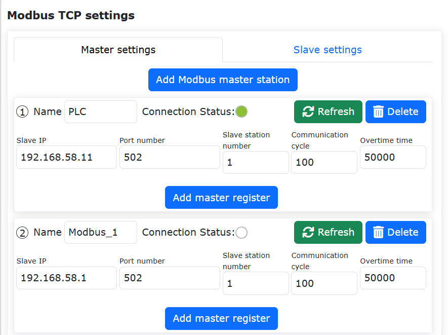

.. centered:: Schemat 9.18-6 Ponowne dodanie mastera Modbus TCP

Dodawanie rejestrów mastera Modbus TCP
**************************************

Kliknij przycisk „Dodaj rejestr mastera”, aby dodać rejestr dla tego mastera.

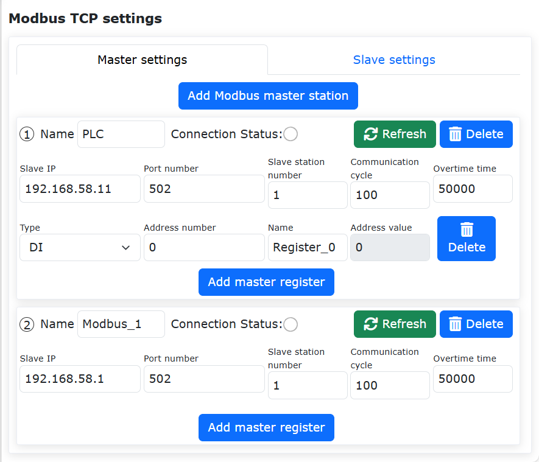

.. centered:: Schemat 9.18-7 Dodawanie rejestru mastera Modbus TCP

Kolejno wybierz typ rejestru mastera, wprowadź numer adresu i nazwę. Znaczenie poszczególnych parametrów jest następujące:

**Typ**: Typ rejestru, DI - wejście dyskretne; DO - cewka; AI bez znaku - rejestr wejściowy bez znaku (0-65535); AI ze znakiem - rejestr wejściowy ze znakiem (-32768-32767); AI zmiennoprzecinkowy - rejestr wejściowy zmiennoprzecinkowy (długość danych rejestru zmiennoprzecinkowego 32 bity, zajmuje dwa rejestry ze znakiem lub bez znaku); AO bez znaku - rejestr holdingowy bez znaku (0-65535); AO ze znakiem - rejestr holdingowy ze znakiem (-32768-32767); AO zmiennoprzecinkowy - rejestr holdingowy zmiennoprzecinkowy (długość danych rejestru zmiennoprzecinkowego 32 bity, zajmuje dwa rejestry ze znakiem lub bez znaku), gdzie rejestry zmiennoprzecinkowe w AI i AO są wyświetlane w formacie big-endian;

**Numer adresu**: Adres rejestru slave'a Modbus TCP do odczytu lub zapisu;

**Nazwa**: Alias rejestru. Master Modbus TCP robota może ustawić maksymalnie 128 różnych rejestrów. Każdy rejestr może mieć inną nazwę zgodnie z rzeczywistym znaczeniem, np. „Start”, „Serwo gotowe”, „Poziom cieczy” itp.

.. image:: coding/170.png
   :width: 6in
   :align: center

.. centered:: Schemat 9.18-8 Ustawienie parametrów rejestru mastera Modbus TCP

Ponownie kliknij przycisk „Dodaj rejestr mastera”, aby dodać kolejny rejestr mastera. Kliknij dwukrotnie przycisk „Usuń” po prawej stronie rejestru, aby go usunąć. Poniższy rysunek przedstawia dodanie rejestru dla każdego typu.

.. note:: Jeśli po dodaniu rejestru mastera wskaźnik stanu połączenia mastera miga, oznacza to, że adres rejestru mastera nie może zostać odczytany. Sprawdź, czy typ i adres rejestru są poprawne.

.. image:: coding/171.png
   :width: 6in
   :align: center

.. centered:: Schemat 9.18-9 Dodawanie wielu rejestrów mastera

Testowanie komunikacji mastera Modbus TCP
*****************************************

Przed testowaniem komunikacji najpierw sprawdź, czy wskaźnik „Stan połączenia” mastera Modbus TCP świeci się światłem ciągłym. Jeśli wskaźnik świeci się światłem ciągłym, oznacza to, że połączenie zostało pomyślnie nawiązane.

Rejestry mastera Modbus robota mają pole wartości „Wartość adresu” do wyświetlania bieżącej wartości rejestru. Rejestry typu DI (wejście dyskretne) i AI (rejestr wejściowy) są typu tylko do odczytu, a odpowiadające im pola wartości adresu są szare i nieedytowalne.

Gdy wartość odpowiedniego adresu slave'a się zmieni, wartość adresu rejestru mastera robota odpowiednio zsynchronizuje się i wyświetli bieżącą wartość. Rejestry DO (cewka) i AO (rejestr holdingowy) są rejestrami do odczytu i zapisu, dlatego ich adresy są białymi, edytowalnymi polami. Można zarówno odczytać wartość odpowiedniego rejestru slave'a Modbus TCP, jak i zmodyfikować wartość tego rejestru na stronie ustawień mastera Modbus robota.

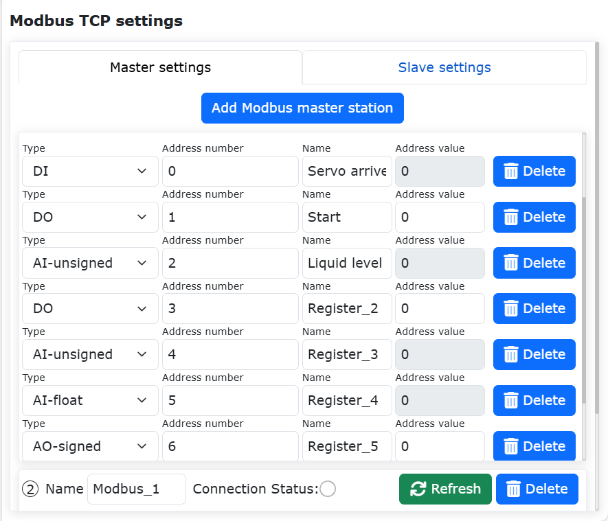

.. centered:: Schemat 9.18-10 Wartości adresów mastera Modbus

1. Monitorowanie wartości rejestrów typu DI i AI mastera

Na zewnętrznym urządzeniu slave Modbus TCP ustaw wartość adresu 255 rejestru DI (wejście dyskretne) na 1, ustaw wartość adresu 257 rejestru AI (rejestr wejściowy) na 123, wartość adresu 258 rejestru na -123, a wartość adresu 259 rejestru na 123,3. W tym momencie wartości adresów odpowiednich rejestrów na stronie ustawień mastera Modbus robota wyświetlą się odpowiednio.

.. note:: 
   Ponieważ ustawiono rejestr pod adresem 259 jako rejestr zmiennoprzecinkowy, faktycznie zajmuje on dwa 16-bitowe rejestry 259 i 260 do przechowywania jednej liczby zmiennoprzecinkowej. Dlatego nie można osobno ustawić rejestru do obsługi rejestru AI 260, ponieważ spowodowałoby to błąd wartości.

.. image:: coding/173.png
   :width: 6in
   :align: center

.. centered:: Schemat 9.18-11 Wyświetlanie wartości rejestrów DI i AI przez mastera Modbus

2. Zapis wartości rejestrów typu DO i AO mastera

Na stronie ustawień mastera Modbus robota, w polu wprowadzania wartości adresu rejestru DO (cewka) o nazwie „Start” pod adresem 255, wprowadź 1. W polach wprowadzania wartości adresu rejestrów AO (rejestr holdingowy) o nazwach „Pozycja docelowa A”, „Pozycja docelowa B” i „Pozycja docelowa C” pod adresami odpowiednio 260, 261 i 262, wprowadź odpowiednio 65535, -32768 i 128,78. W tym momencie odpowiednie adresy rejestrów slave'a Modbus zostały zapisane z odpowiednimi wartościami.

.. image:: coding/174.png
   :width: 6in
   :align: center

.. centered:: Schemat 9.18-12 Zapis rejestrów DO i AO przez mastera Modbus

3. Monitorowanie wartości rejestrów typu DO i AO mastera

Gdy zmienisz wartość DO (cewka) lub AO (rejestr holdingowy) w slave'u Modbus TCP, wartość adresu rejestru na stronie ustawień mastera Modbus TCP nie zaktualizuje się natychmiast. Należy kliknąć przycisk „Odśwież” w prawym górnym rogu konfiguracji mastera, aby zaktualizować wartości adresów rejestrów DO i AO na stronie.

.. image:: coding/175.png
   :width: 6in
   :align: center

.. centered:: Schemat 9.18-13 Odświeżenie wartości adresów DO i AO mastera Modbus TCP

Pisanie programu mastera Modbus TCP
+++++++++++++++++++++++++++++++++++

Kolejno kliknij „Instrukcje komunikacyjne”, aby otworzyć stronę dodawania instrukcji komunikacyjnych.

.. image:: coding/176.png
   :width: 6in
   :align: center

.. centered:: Schemat 9.18-14 Otwarcie strony dodawania instrukcji komunikacyjnych

Kliknij „Modbus”.

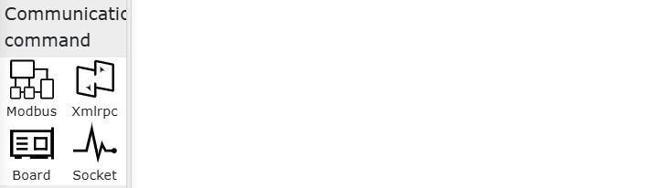

.. centered:: Schemat 9.18-15 Wybór Modbus

Kliknij „Modbus_TCP”.

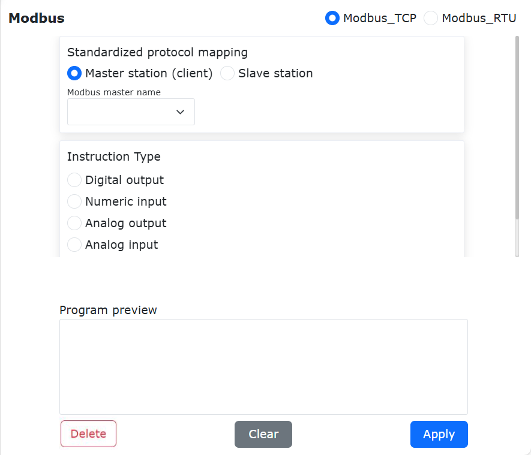

.. centered:: Schemat 9.18-16 Wybór Modbus_TCP

Wybierz „Master (klient)”, aby otworzyć stronę dodawania instrukcji mastera Modbus TCP.

.. image:: coding/179.png
   :width: 6in
   :align: center

.. centered:: Schemat 9.18-17 Dodawanie instrukcji mastera Modbus TCP

1. Zapis pojedynczego wyjścia cyfrowego DO (cewka)

Wybierz „Nazwę mastera Modbus” jako mastera „PLC” dodanego wcześniej na stronie ustawień mastera Modbus, nazwę DO jako „Start”, liczbę rejestrów jako 1, wartość rejestru jako 1, kliknij przycisk „Zapis wyjścia cyfrowego”. Następnie przewiń na sam dół strony i kliknij przycisk „Zastosuj”.

.. image:: coding/180.png
   :width: 6in
   :align: center

.. centered:: Schemat 9.18-18 Dodanie zapisu pojedynczego wyjścia cyfrowego

W tym momencie do programu „testModbusMaster.lua” robota została dodana instrukcja zapisu pojedynczego wyjścia cyfrowego mastera Modbus robota. Przełącz robota w tryb automatyczny, kliknij przycisk startu. Robot ustawi wartość adresu rejestru cewki „Start” odpowiadającego masterowi „PLC” na 1.

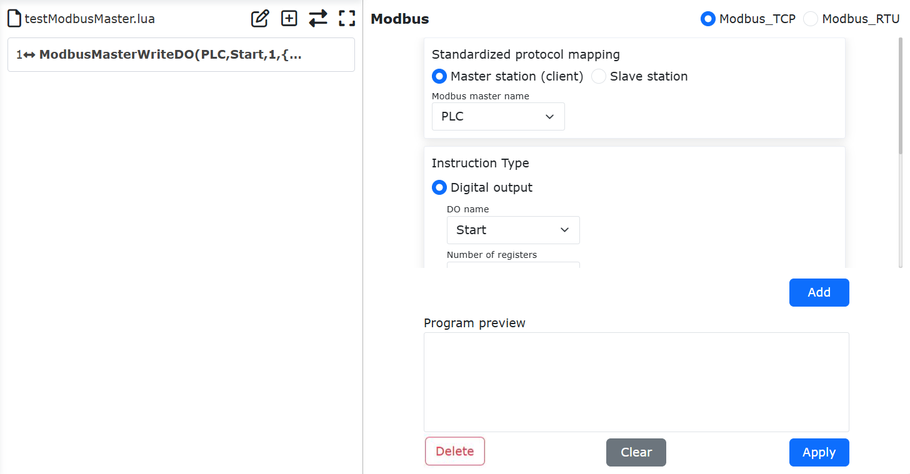

.. centered:: Schemat 9.18-19 Program LUA zapisu pojedynczej cewki

2. Zapis wielu wyjść cyfrowych DO (cewki)

Otwórz stronę dodawania instrukcji mastera Modbus TCP, wybierz „Nazwę mastera Modbus” jako mastera „PLC” dodanego wcześniej na stronie ustawień mastera Modbus, nazwę DO jako „Start”, liczbę rejestrów jako 5, wartość rejestru jako 1,0,1,0,1 (liczba wartości rejestru musi odpowiadać ustawionej liczbie rejestrów, a wiele wartości rejestru oddzielamy przecinkami w języku angielskim). Kliknij „Zapis wyjścia cyfrowego”. Następnie przewiń na sam dół strony i kliknij „Zastosuj”.

.. image:: coding/182.png
   :width: 6in
   :align: center

.. centered:: Schemat 9.18-20 Konfiguracja zapisu wielu wyjść cyfrowych

W tym momencie do programu „testModbusMaster.lua” robota została dodana instrukcja zapisu wielu wyjść cyfrowych mastera Modbus robota. Przełącz robota w tryb automatyczny, kliknij przycisk startu. Robot ustawi wartość rejestru cewki „Start” odpowiadającego masterowi „PLC” oraz wartości kolejnych 4 cewek odpowiednio na 1, 0, 1, 0, 1.

.. image:: coding/183.png
   :width: 6in
   :align: center

.. centered:: Schemat 9.18-21 Program LUA zapisu wielu cewek

3. Odczyt pojedynczego wyjścia cyfrowego DO (cewka)

Otwórz stronę dodawania instrukcji mastera Modbus TCP, wybierz „Nazwę mastera Modbus” jako mastera „PLC” dodanego wcześniej na stronie ustawień mastera Modbus, nazwę DO jako „Start”, liczbę rejestrów jako 1 (wartość rejestru nie jest wymagana). Kliknij „Odczyt wyjścia cyfrowego”. Następnie przewiń na sam dół strony i kliknij „Zastosuj”.

.. image:: coding/184.png
   :width: 6in
   :align: center

.. centered:: Schemat 9.18-22 Konfiguracja odczytu pojedynczego wyjścia cyfrowego

W tym momencie do programu „testModbusMaster.lua” robota została dodana instrukcja odczytu pojedynczego wyjścia cyfrowego mastera Modbus robota.

.. image:: coding/185.png
   :width: 6in
   :align: center

.. centered:: Schemat 9.18-23 Program odczytu pojedynczej cewki

Zazwyczaj po odczytaniu rejestru Modbus odczytaną wartość przechowuje się w zmiennej. Dlatego należy zdefiniować zmienną do przechowywania odczytanej wartości. Kliknij przycisk „Przełącz tryb”, aby przełączyć program lua robota w stan edytowalny. Przed instrukcją „ModbusMasterReadDO” dodaj zmienną zwracaną „startValue”. Po wykonaniu programu odczytana wartość będzie przechowywana w zmiennej „startValue”.

.. image:: coding/186.png
   :width: 6in
   :align: center

.. centered:: Schemat 9.18-24 Odczyt pojedynczego wyjścia cyfrowego do zmiennej

Wartości rejestrów typu cewka to tylko 0 i 1. W programie robota można wykonywać różne operacje w zależności od odczytanej wartości rejestru. Kliknij przycisk „Przełącz tryb”, aby przełączyć program nauczania robota w tryb nieedytowalny. Dodaj dwie instrukcje ruchu stawowego, aby przemieścić się odpowiednio do dwóch różnych punktów „P1” i „P2”.

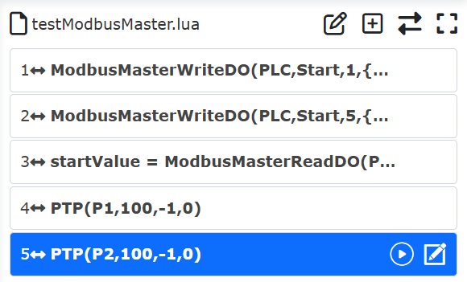

.. centered:: Schemat 9.18-25 Dodanie instrukcji ruchu do różnych punktów

Ponownie przełącz program w tryb edytowalny i napisz warunek sprawdzający wartość cewki „startValue”. Gdy wartość „startValue” wynosi 1, robot przemieszcza się do punktu „P1”, w przeciwnym razie robot przemieszcza się do punktu „P2”.

.. image:: coding/188.png
   :width: 6in
   :align: center

.. centered:: Schemat 9.18-26 Przemieszczanie się do różnych punktów w zależności od wartości cewki

Na koniec ponownie przełącz program robota w tryb nieedytowalny, przełącz robota w tryb automatyczny i uruchom program, upewniając się, że jest bezpieczny. Ponieważ pierwsze dwie linie tego programu ustawiają wartość DO cewki o nazwie „Start” na 1, po wykonaniu programu robot przemieszcza się do punktu „P1”.

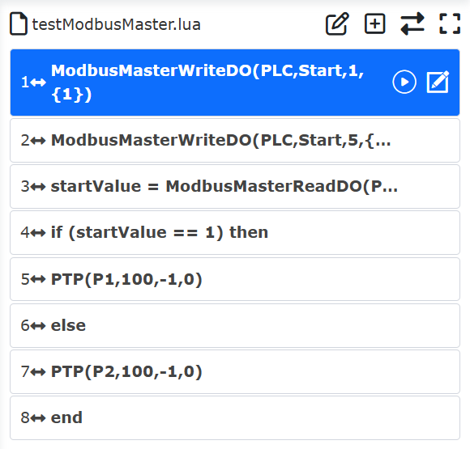

.. centered:: Schemat 9.18-27 Odczyt wartości pojedynczego rejestru cewki i ruch

4. Odczyt wielu wyjść cyfrowych DO (cewek)

Otwórz stronę dodawania instrukcji mastera Modbus TCP, wybierz „Nazwę mastera Modbus” jako mastera „PLC” dodanego wcześniej na stronie ustawień mastera Modbus, nazwę DO jako „Start”, liczbę rejestrów jako 6 (wartość rejestru nie jest wymagana). Kliknij „Odczyt wyjścia cyfrowego”. Następnie przewiń na sam dół strony i kliknij „Zastosuj”.

.. image:: coding/190.png
   :width: 6in
   :align: center

.. centered:: Schemat 9.18-28 Konfiguracja odczytu wielu wyjść cyfrowych

W tym momencie do programu „testModbusMaster.lua” robota została dodana instrukcja odczytu wielu wyjść cyfrowych mastera Modbus robota.

.. image:: coding/191.png
   :width: 6in
   :align: center

.. centered:: Schemat 9.18-29 Program odczytu wielu wyjść cyfrowych

Kliknij przycisk „Przełącz tryb”, aby przełączyć program lua robota w stan edytowalny. Ponieważ odczytywanych jest 6 rejestrów, przed instrukcją „ModbusMasterReadDO” dodaj 6 zmiennych zwracanych „value1, value2, value3, value4, value5, value6”. Po wykonaniu programu odczytane wartości 6 rejestrów będą przechowywane odpowiednio w tych 6 zmiennych. Podobnie możesz sprawdzać wartości „value1” do „value6”, aby robot wykonywał różne czynności.

.. image:: coding/192.png
   :width: 6in
   :align: center

.. centered:: Schemat 9.18-30 Odczyt wielu wyjść cyfrowych do zmiennych

5. Odczyt wejścia cyfrowego DI (wejście dyskretne)

Otwórz stronę dodawania instrukcji mastera Modbus TCP, wybierz „Nazwę mastera Modbus” jako mastera „PLC” dodanego wcześniej na stronie ustawień mastera Modbus, nazwę DI jako „Serwo gotowe”, liczbę rejestrów jako 2. Kliknij „Odczyt wejścia cyfrowego”. Następnie przewiń na sam dół strony i kliknij „Zastosuj”.

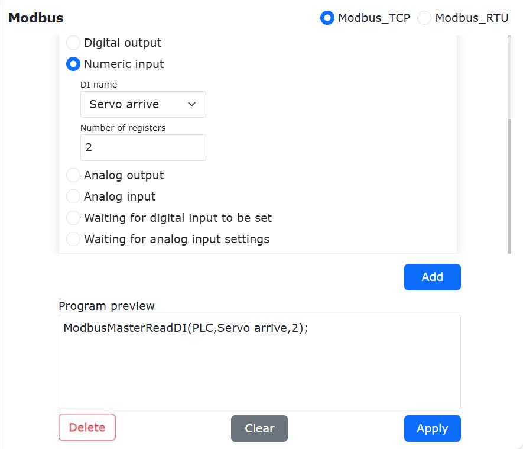

.. centered:: Schemat 9.18-31 Konfiguracja odczytu wejścia cyfrowego

W tym momencie do programu „testModbusMaster.lua” robota została dodana instrukcja odczytu wejścia cyfrowego mastera Modbus robota.

.. image:: coding/194.png
   :width: 6in
   :align: center

.. centered:: Schemat 9.18-32 Instrukcja programu odczytu wejścia cyfrowego

Kliknij przycisk „Przełącz tryb”, aby przełączyć program lua robota w stan edytowalny. Przed instrukcją „ModbusMasterReadDO” dodaj zmienne zwracane „state1, state2”. Po wykonaniu programu odczytane wartości dwóch wejść cyfrowych będą przechowywane odpowiednio w zmiennych „state1” i „state2”. Możesz sterować robotem, sprawdzając wartości tych zmiennych.

.. image:: coding/195.png
   :width: 6in
   :align: center

.. centered:: Schemat 9.18-33 Odczyt wejścia cyfrowego do zmiennych

6. Operacje odczytu i zapisu na wejściu analogowym AI (rejestr wejściowy) i wyjściu analogowym AO (rejestr holdingowy)

Operacje odczytu i zapisu na wejściu analogowym AI i wyjściu analogowym AO są w zasadzie takie same jak na wejściu cyfrowym DI i wyjściu cyfrowym DO, z tą różnicą, że zakres danych tego ostatniego ogranicza się do 0 lub 1, podczas gdy zakres danych tego pierwszego jest szerszy. Dlatego szczegółowe operacje można znaleźć w opisie pisania programów dla wejścia cyfrowego i wyjścia cyfrowego. Tutaj przedstawiono tylko przykłady programu dla operacji odczytu na AI i operacji odczytu/zapisu na AO.

.. image:: coding/196.png
   :width: 6in
   :align: center

.. centered:: Schemat 9.18-34 Odczyt wejścia analogowego AI

.. image:: coding/197.png
   :width: 6in
   :align: center

.. centered:: Schemat 9.18-35 Odczyt i zapis wyjścia analogowego AO

7. Oczekiwanie na wejście cyfrowe

Otwórz stronę dodawania instrukcji mastera Modbus TCP, znajdź „Ustawienia oczekiwania na wejście cyfrowe” (czyli ustawienia oczekiwania na DI - wejście dyskretne). Wybierz nazwę DI jako skonfigurowany rejestr „Serwo gotowe”, stan oczekiwania jako „True”, czas timeoutu jako 5000 ms. Kliknij przycisk „Dodaj”, a na koniec kliknij przycisk „Zastosuj”.

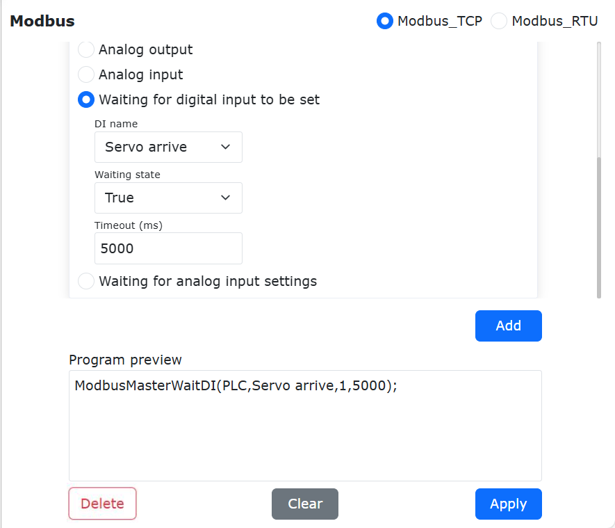

.. centered:: Schemat 9.18-36 Dodanie instrukcji oczekiwania na wejście DI

W tym momencie do programu „testModbusMaster.lua” robota została dodana instrukcja oczekiwania na wejście cyfrowe DI mastera Modbus robota. Po uruchomieniu programu robot będzie czekał, aż wartość rejestru „Serwo gotowe” mastera „PLC” stanie się true, czyli wartością 1. Ponieważ ustawiony czas timeoutu wynosi 5 s, jeśli po 5 s oczekiwania sygnał „Serwo gotowe” nadal wynosi 0, program robota zgłosi błąd timeoutu i automatycznie zatrzyma działanie.

.. centered:: Schemat 9.18-37 Program oczekiwania na wejście cyfrowe DI

8. Oczekiwanie na wejście analogowe

Otwórz stronę dodawania instrukcji mastera Modbus TCP, znajdź „Ustawienia oczekiwania na wejście analogowe” (czyli ustawienia oczekiwania na AI - rejestr wejściowy). Wybierz nazwę AI jako skonfigurowany rejestr „Poziom cieczy”, stan oczekiwania jako „>”, wartość rejestru jako 255, czas timeoutu jako 5000 ms. Kliknij przycisk „Dodaj”, a na koniec kliknij przycisk „Zastosuj”.

.. image:: coding/200.png
   :width: 6in
   :align: center

.. centered:: Schemat 9.18-38 Dodanie instrukcji oczekiwania na wejście analogowe

W tym momencie do programu „testModbusMaster.lua” robota została dodana instrukcja oczekiwania na wartość rejestru wejściowego AI mastera Modbus robota. Po uruchomieniu programu robot będzie czekał, aż wartość rejestru „Poziom cieczy” mastera „PLC” stanie się większa niż 255. Ponieważ ustawiony czas timeoutu wynosi 5 s, jeśli po 5 s oczekiwania sygnał „Poziom cieczy” nadal nie jest większy niż 255, program robota zgłosi błąd timeoutu i automatycznie zatrzyma działanie.

.. image:: coding/201.png
   :width: 6in
   :align: center

.. centered:: Schemat 9.18-39-1 Program oczekiwania na rejestr wejściowy AI

Otwórz stronę dodawania instrukcji mastera Modbus TCP, znajdź „Ustawienia oczekiwania na wejście analogowe” (czyli ustawienia oczekiwania na AI - rejestr wejściowy). Wybierz nazwę AI jako skonfigurowany rejestr „Poziom cieczy”, stan oczekiwania jako „=”, wartość rejestru jako 255, czas timeoutu jako 5000 ms. Kliknij przycisk „Dodaj”, a na koniec kliknij przycisk „Zastosuj”.

.. image:: coding/494.png
   :width: 6in
   :align: center

.. centered:: Schemat 9.18-39-2 Dodanie instrukcji oczekiwania na wejście analogowe

W tym momencie do programu „test.lua” robota została dodana instrukcja oczekiwania na wartość rejestru wejściowego AI mastera Modbus robota. Po uruchomieniu programu robot będzie czekał, aż wartość rejestru „Poziom cieczy” mastera „PLC” stanie się równa 255. Ponieważ ustawiony czas timeoutu wynosi 5 s, jeśli po 5 s oczekiwania sygnał „Poziom cieczy” nadal nie jest równy 255, program robota zgłosi błąd timeoutu i automatycznie zatrzyma działanie.

Slave Modbus TCP
++++++++++++++++

Slave Modbus TCP robota oferuje cztery typy rejestrów: ogólne wejście cyfrowe (cewki), ogólne wyjście cyfrowe (wejścia dyskretne), ogólne wejście analogowe (rejestry holdingowe) i ogólne wyjście analogowe (rejestry wejściowe). Ogólne wejście cyfrowe i analogowe są używane głównie przez robota do odczytywania danych z zewnętrznego mastera Modbus TCP w celu sterowania robotem, podczas gdy ogólne wyjście cyfrowe i analogowe są używane głównie przez robota do wysyłania sygnałów danych do zewnętrznego urządzenia mastera Modbus TCP, które odczytuje wartości odpowiednich rejestrów, aby sterować swoim działaniem. Oprócz powyższych ogólnych wejść/wyjść, robot udostępnia również niektóre „funkcyjne wejścia cyfrowe (cewki)” dla zewnętrznego urządzenia mastera do sterowania robotem, takimi jak uruchamianie programu, zatrzymywanie programu itp., oraz niektóre rejestry wejściowe do wyświetlania bieżących informacji o stanie robota, w tym bieżącej pozycji kartezjańskiej robota, bieżącego stanu pracy robota itp. (szczegółowa definicja znajduje się w Załączniku 1: Mapa adresów slave'a Modbus TCP). Proces używania slave'a Modbus TCP robota obejmuje głównie: ① konfigurację parametrów; ② testowanie komunikacji; ③ pisanie programu.

Konfiguracja parametrów komunikacji slave'a Modbus TCP
*******************************************************

Otwórz WebApp, kolejno kliknij „Symulacja nauczania”, „Programowanie nauczania”, utwórz nowy program użytkownika „testModbusSlave.lua”.

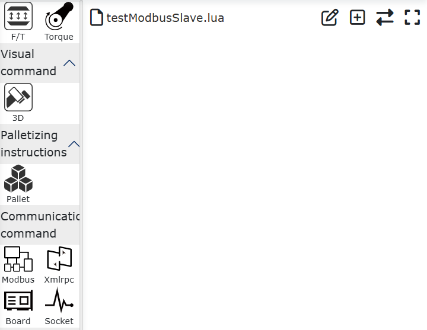

.. centered:: Schemat 9.18-40 Tworzenie programu użytkownika slave'a Modbus TCP

Kliknij przycisk „Ustawienia Modbus TCP”, aby otworzyć stronę konfiguracji funkcji Modbus TCP.

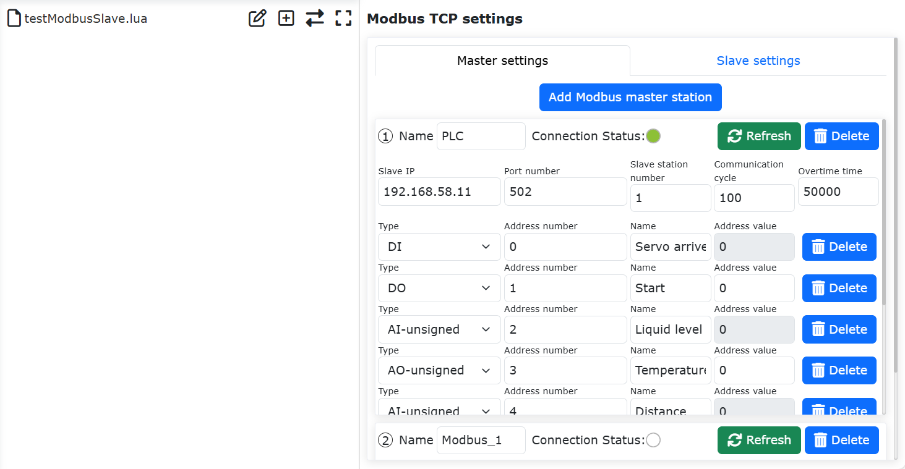

.. centered:: Schemat 9.18-41 Otwarcie ustawień Modbus TCP

Kolejno kliknij „Ustawienia slave'a”, wprowadź IP slave'a robota, numer portu i numer slave'a. „IP” to adres IP slave'a robota. Robot współpracujący FANUC ma dwa porty sieciowe (panel nauczania i szafa sterownicza) o różnych adresach IP. Wprowadź prawidłowy adres IP w zależności od portu sieciowego, do którego podłączone jest zewnętrzne urządzenie z slave'em robota (zaleca się używanie portu sieciowego na szafie sterowniczej). Zmiana adresu IP slave'a Modbus TCP robota, numeru portu lub numeru slave'a wymaga ponownego uruchomienia robota, aby zaczęły obowiązywać.

.. image:: coding/204.png
   :width: 6in
   :align: center

.. centered:: Schemat 9.18-42 Ustawienia slave'a Modbus TCP

Po zakończeniu konfiguracji parametrów slave'a Modbus TCP i ponownym uruchomieniu robota, zewnętrzne urządzenie master może nawiązać połączenie z slave'em robota przy użyciu ustawionych parametrów. Po pomyślnym połączeniu wskaźnik „Stan połączenia” na stronie ustawień slave'a robota zaświeci się.

.. image:: coding/205.png
   :width: 6in
   :align: center

.. centered:: Schemat 9.18-43 Wskaźnik stanu połączenia slave'a

Testowanie komunikacji slave'a Modbus TCP
*****************************************

1. Ogólne wejście cyfrowe (cewki)

Slave Modbus TCP robota udostępnia 128 rejestrów cewek o adresach 100~127.

.. note:: Szczegółowa definicja znajduje się w Załączniku 1: Mapa adresów slave'a Modbus TCP.

Ogólne rejestry slave'a Modbus TCP robota mogą mieć aliasy. Zmień nazwę rejestru cewki DI0 slave'a robota na „A gotowe”, a DI1 na „B gotowe”. Zgodnie z mapą adresów, adresy Modbus cewek dla „A gotowe” i „B gotowe” to odpowiednio 100 i 101. Na zewnętrznym urządzeniu master Modbus TCP ustaw wartości adresów cewek slave'a robota 100 i 101 na 1. W tym momencie wskaźniki tych dwóch rejestrów na stronie monitorowania slave'a Modbus TCP robota zaświecą się.

.. image:: coding/206.png
   :width: 6in
   :align: center

.. centered:: Schemat 9.18-44 Monitorowanie stanu cewek slave'a Modbus TCP

2. Ogólne wyjście cyfrowe (wejścia dyskretne)

Slave Modbus TCP robota udostępnia 128 rejestrów wejść dyskretnych o adresach 100~127.

.. note:: Szczegółowa definicja znajduje się w Załączniku 1: Mapa adresów slave'a Modbus TCP.

Rejestry wejść dyskretnych slave'a Modbus TCP robota również mogą mieć aliasy. Kliknij „Ogólne wyjście cyfrowe (wejście dyskretne)”, aby zmienić nazwę rejestru wejścia dyskretnego DO0 slave'a robota na „A start”, a DO1 na „B start”. Zgodnie z mapą adresów, adresy Modbus wejść dyskretnych dla „A start” i „B start” to odpowiednio 100 i 101. Kliknij wskaźnik wejścia dyskretnego odpowiadający „A start”. Wskaźnik zaświeci się, a wartość odpowiedniego adresu rejestru 100 zmieni się na 1. Na zewnętrznym urządzeniu master Modbus TCP można odczytać wartość tego rejestru.

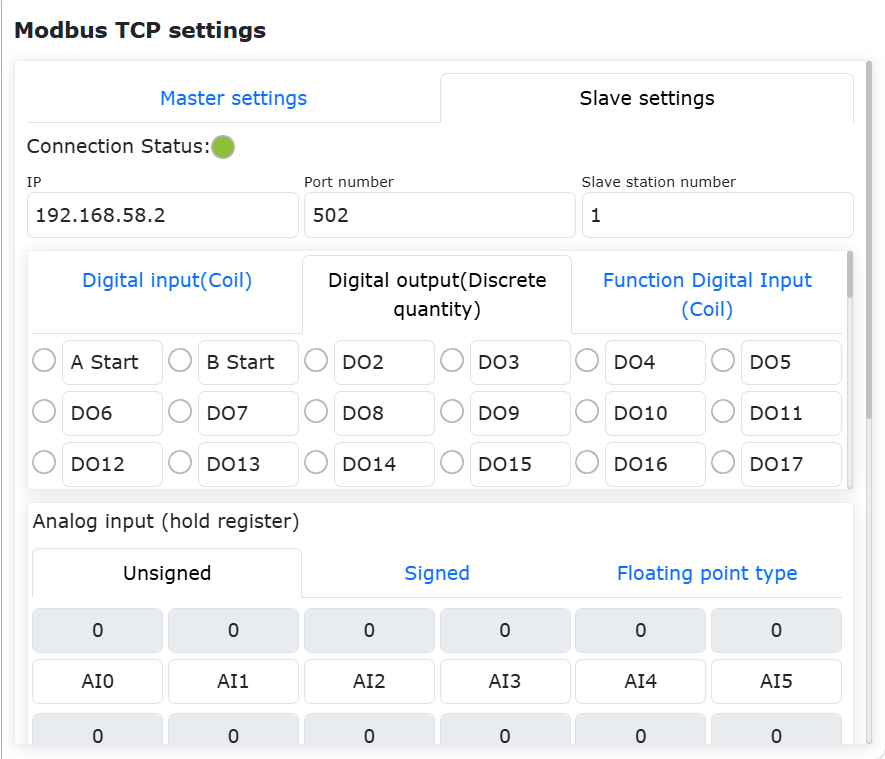

.. centered:: Schemat 9.18-45 Sterowanie wejściem dyskretnym slave'a Modbus TCP

1. Wejście analogowe (rejestry holdingowe)

Robot udostępnia łącznie 64 rejestry holdingowe trzech typów: bez znaku, ze znakiem i zmiennoprzecinkowy, AI0~AI63 o adresach 100~195.

.. note:: text
   Szczegółowa definicja znajduje się w Załączniku 1: Mapa adresów slave'a Modbus TCP. Zakres danych rejestru bez znaku to 0~65535, rejestru ze znakiem -32768~32767, rejestr zmiennoprzecinkowy jest wyświetlany w formacie big-endian.

   Zmień nazwy AI0 i AI1 odpowiednio na „Napięcie” i „Prąd”. Z mapy adresów slave'a Modbus TCP wynika, że adresy tych dwóch rejestrów to odpowiednio 100 i 101. Gdy podłączone urządzenie master zmodyfikuje wartości adresów rejestrów holdingowych 100 i 101, wartości adresów rejestrów „Napięcie” i „Prąd” na stronie monitorowania slave'a Modbus TCP robota odpowiednio się zaktualizują. Wejście analogowe robota jest używane głównie do odczytywania wartości sygnałów z zewnętrznego urządzenia master.

.. image:: coding/208.png
   :width: 6in
   :align: center

.. centered:: Schemat 9.18-46 Monitorowanie wejścia analogowego slave'a Modbus TCP

4. Wyjście analogowe (rejestry wejściowe)

Robot udostępnia łącznie 64 rejestry wejściowe trzech typów: bez znaku, ze znakiem i zmiennoprzecinkowy, AO0~AO63 o adresach 100~195.

.. note:: text
   Szczegółowa definicja znajduje się w Załączniku 1: Mapa adresów slave'a Modbus TCP. Zakres danych rejestru bez znaku to 0~65535, rejestru ze znakiem -32768~32767, rejestr zmiennoprzecinkowy jest wyświetlany w formacie big-endian.

   Zmień nazwy AO0 i AO1 odpowiednio na „Pozycja docelowa A” i „Pozycja docelowa B”. Wprowadź wartości rejestru wejściowego odpowiednio jako 2000 i 1500. Z mapy adresów slave'a Modbus TCP wynika, że adresy tych dwóch rejestrów to odpowiednio 100 i 101. Gdy podłączone urządzenie master odczyta wartości adresów rejestrów wejściowych 100 i 101, otrzyma ustawione wartości. Wyjście analogowe slave'a robota jest używane głównie do przekazywania wartości sygnałów do zewnętrznego urządzenia master.

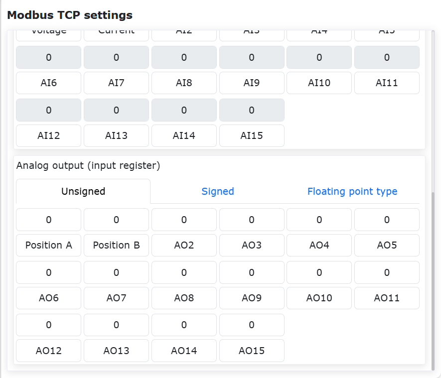

.. centered:: Schemat 9.18-47 Modyfikacja wejścia analogowego slave'a Modbus

Pisanie programu slave'a Modbus TCP
***********************************

Kolejno kliknij „Wszystkie”, „Instrukcje komunikacyjne”, aby otworzyć stronę dodawania instrukcji komunikacyjnych.

.. image:: coding/210.png
   :width: 6in
   :align: center

.. centered:: Schemat 9.18-48 Otwarcie strony dodawania instrukcji komunikacyjnych

Kliknij „Modbus”.

.. image:: coding/211.png
   :width: 6in
   :align: center

.. centered:: Schemat 9.18-49 Wybór Modbus

Kliknij „Modbus_TCP”.

.. centered:: Schemat 9.18-50 Wybór Modbus_TCP

Wybierz „Slave”, aby otworzyć stronę dodawania instrukcji slave'a Modbus TCP.

.. image:: coding/212.png
   :width: 6in
   :align: center

.. centered:: Schemat 9.18-51 Dodawanie instrukcji slave'a Modbus TCP

1. Zapis pojedynczego wyjścia cyfrowego DO (wejście dyskretne)

Wybierz nazwę DO jako „A start”, liczbę rejestrów jako 1, wartość rejestru jako 0. Kliknij „Zapis pojedynczego wyjścia cyfrowego”. Następnie przewiń na sam dół strony i kliknij „Zastosuj”.

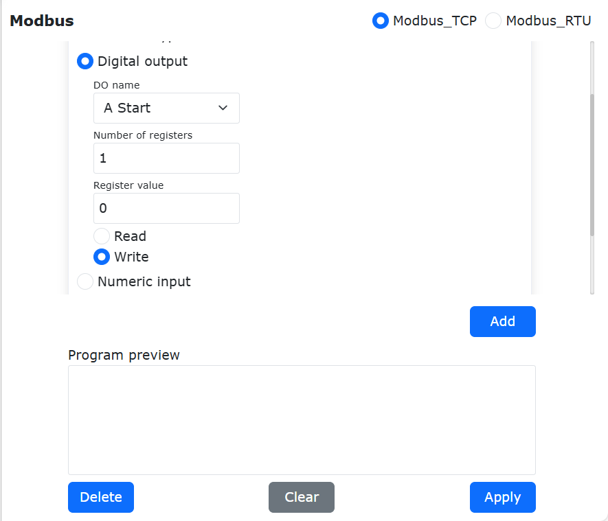

.. centered:: Schemat 9.18-52 Dodanie instrukcji zapisu pojedynczego wyjścia cyfrowego

W tym momencie do programu „testModbusSlave.lua” robota została dodana instrukcja zapisu pojedynczego wyjścia cyfrowego slave'a Modbus robota. Przełącz robota w tryb automatyczny, kliknij przycisk startu. Robot ustawi wartość adresu wyjścia cyfrowego o nazwie „A start” na 0.

.. image:: coding/214.png
   :width: 6in
   :align: center

.. centered:: Schemat 9.18-53 Program LUA zapisu pojedynczego wyjścia cyfrowego

2. Zapis wielu wyjść cyfrowych DO (wejścia dyskretne)

Otwórz stronę dodawania instrukcji slave'a Modbus TCP, znajdź „Ustawienia wyjścia cyfrowego”. Wybierz nazwę DO jako „A start”, liczbę rejestrów jako 5, wartość rejestru jako 1,0,1,0,1 (liczba wartości rejestru musi odpowiadać ustawionej liczbie rejestrów, a wiele wartości rejestru oddzielamy przecinkami w języku angielskim). Kliknij „Zapis wyjścia cyfrowego”. Następnie przewiń na sam dół strony i kliknij „Zastosuj”.

.. image:: coding/215.png
   :width: 6in
   :align: center

.. centered:: Schemat 9.18-54 Konfiguracja zapisu wielu wyjść cyfrowych

W tym momencie do programu „testModbusSlave.lua” robota została dodana instrukcja zapisu wielu wyjść cyfrowych slave'a Modbus robota. Przełącz robota w tryb automatyczny, kliknij przycisk startu. Robot ustawi wartości rejestrów wejść dyskretnych slave'a, począwszy od „A start” i kolejnych 4, odpowiednio na 1, 0, 1, 0, 1.

.. image:: coding/216.png
   :width: 6in
   :align: center

.. centered:: Schemat 9.18-55 Program LUA zapisu wielu wyjść cyfrowych

3. Odczyt pojedynczego wyjścia cyfrowego DO (wejście dyskretne)

Otwórz stronę dodawania instrukcji mastera Modbus TCP, znajdź „Ustawienia wyjścia cyfrowego”. Nazwę DO jako „A start”, liczbę rejestrów jako 1 (wartość rejestru nie jest wymagana). Kliknij „Odczyt wyjścia cyfrowego”. Następnie przewiń na sam dół strony i kliknij „Zastosuj”.

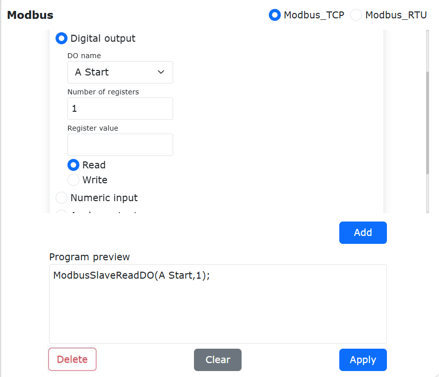

.. centered:: Schemat 9.18-56 Konfiguracja odczytu pojedynczego wyjścia cyfrowego

W tym momencie do programu „testModbusSlave.lua” robota została dodana instrukcja odczytu pojedynczego wyjścia cyfrowego slave'a Modbus robota.

.. image:: coding/218.png
   :width: 6in
   :align: center

.. centered:: Schemat 9.18-57 Program odczytu pojedynczego wyjścia cyfrowego

Zazwyczaj po odczytaniu rejestru Modbus odczytaną wartość przechowuje się w zmiennej. Dlatego należy zdefiniować zmienną do przechowywania odczytanej wartości. Kliknij przycisk „Przełącz tryb”, aby przełączyć program lua robota w stan edytowalny. Przed instrukcją „ModbusSlaveReadDO” dodaj zmienną zwracaną „AStartValue”. Po wykonaniu programu odczytana wartość będzie przechowywana w zmiennej „AStartValue”.

.. image:: coding/219.png
   :width: 6in
   :align: center

.. centered:: Schemat 9.18-58 Odczyt pojedynczego wyjścia cyfrowego do zmiennej

Wartości rejestrów typu cewka to tylko 0 i 1. W programie robota można wykonywać różne operacje w zależności od odczytanej wartości rejestru. Kliknij przycisk „Przełącz tryb”, aby przełączyć program nauczania robota w tryb nieedytowalny. Dodaj dwie instrukcje ruchu stawowego, aby przemieścić się odpowiednio do dwóch różnych punktów „P1” i „P2”.

.. image:: coding/220.png
   :width: 6in
   :align: center

.. centered:: Schemat 9.18-59 Dodanie instrukcji ruchu do różnych punktów

Ponownie przełącz program w tryb edytowalny i napisz warunek sprawdzający wartość wyjścia cyfrowego „AStartValue”. Gdy wartość „AStartValue” wynosi 1, robot przemieszcza się do punktu „P1”, w przeciwnym razie robot przemieszcza się do punktu „P2”.

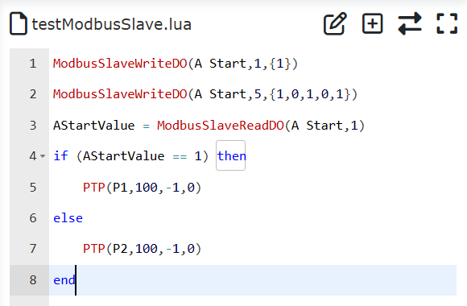

.. centered:: Schemat 9.18-60 Przemieszczanie się do różnych punktów w zależności od wartości wyjścia cyfrowego

Na koniec ponownie przełącz program robota w tryb nieedytowalny, przełącz robota w tryb automatyczny i uruchom program, upewniając się, że jest bezpieczny. Ponieważ druga linia tego programu ustawia wartość wyjścia cyfrowego DO o nazwie „A start” na 1, po wykonaniu programu robot przemieszcza się do punktu „P1”.

.. image:: coding/222.png
   :width: 6in
   :align: center

.. centered:: Schemat 9.18-61 Odczyt wartości pojedynczego rejestru cewki i ruch

4. Odczyt wielu wyjść cyfrowych DO (wejścia dyskretne)

Otwórz stronę dodawania instrukcji mastera Modbus TCP, znajdź „Ustawienia wyjścia cyfrowego”. Wybierz nazwę DO jako „A start”, liczbę rejestrów jako 2 (wartość rejestru nie jest wymagana). Kliknij „Odczyt wyjścia cyfrowego”. Następnie przewiń na sam dół strony i kliknij „Zastosuj”.

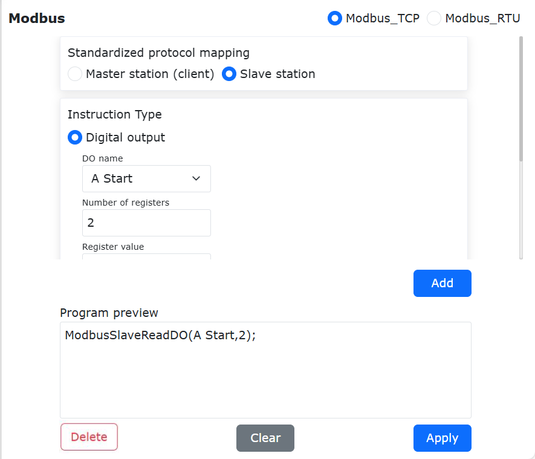

.. centered:: Schemat 9.18-62 Konfiguracja odczytu wielu wyjść cyfrowych

W tym momencie do programu „testModbusSlave.lua” robota została dodana instrukcja odczytu wielu wyjść cyfrowych slave'a Modbus robota.

.. image:: coding/224.png
   :width: 6in
   :align: center

.. centered:: Schemat 9.18-63 Program odczytu wielu wyjść cyfrowych

Kliknij przycisk „Przełącz tryb”, aby przełączyć program lua robota w stan edytowalny. Ponieważ odczytywane są 2 rejestry, przed instrukcją „ModbusSlaveReadDO” dodaj 2 zmienne zwracane „value1, value2”. Po wykonaniu programu odczytane wartości 2 rejestrów wyjścia cyfrowego będą przechowywane odpowiednio w tych 2 zmiennych. Podobnie możesz sprawdzać wartości „value1”, „value2”, aby robot wykonywał różne czynności.

.. image:: coding/225.png
   :width: 6in
   :align: center

.. centered:: Schemat 9.18-64 Odczyt wielu wyjść cyfrowych do zmiennych

5. Odczyt wejścia cyfrowego DI (cewki)

Otwórz stronę dodawania instrukcji slave'a Modbus TCP, znajdź „Ustawienia wejścia cyfrowego”. Wybierz nazwę DI jako „A gotowe”, liczbę rejestrów jako 2. Kliknij „Odczyt wejścia cyfrowego”. Następnie przewiń na sam dół strony i kliknij „Zastosuj”.

.. image:: coding/226.png
   :width: 6in
   :align: center

.. centered:: Schemat 9.18-65 Konfiguracja odczytu wejścia cyfrowego

W tym momencie do programu „testModbusSlave.lua” robota została dodana instrukcja odczytu wejścia cyfrowego slave'a Modbus robota.

.. image:: coding/227.png
   :width: 6in
   :align: center

.. centered:: Schemat 9.18-66 Instrukcja programu odczytu wejścia cyfrowego

Kliknij przycisk „Przełącz tryb”, aby przełączyć program lua robota w stan edytowalny. Przed instrukcją „ModbusSlaveReadDI” dodaj zmienne zwracane „AState, BState”. Po wykonaniu programu odczytane wartości dwóch wejść cyfrowych będą przechowywane odpowiednio w zmiennych „AState” i „BState”. Możesz sterować robotem, sprawdzając wartości tych zmiennych.

.. image:: coding/228.png
   :width: 6in
   :align: center

.. centered:: Schemat 9.18-67 Program odczytu wejścia cyfrowego

6. Operacje odczytu i zapisu na wyjściu analogowym AO (rejestr wejściowy) i wejściu analogowym AI (rejestr holdingowy)

Operacje odczytu i zapisu na wyjściu analogowym (rejestr wejściowy) i wejściu analogowym (rejestr holdingowy) są w zasadzie takie same jak na wyjściu cyfrowym (wejście dyskretne) i wejściu cyfrowym (cewka), z tą różnicą, że zakres danych tego ostatniego ogranicza się do 0 lub 1, podczas gdy zakres danych tego pierwszego jest szerszy. Dlatego szczegółowe operacje można znaleźć w opisie pisania programów dla wyjścia cyfrowego i wejścia cyfrowego. Tutaj przedstawiono tylko przykłady programu dla operacji odczytu na AI i operacji odczytu/zapisu na AO.

.. image:: coding/229.png
   :width: 6in
   :align: center

.. centered:: Schemat 9.18-68 Odczyt wejścia analogowego

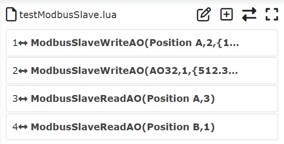

.. centered:: Schemat 9.18-69 Odczyt i zapis wyjścia analogowego

7. Oczekiwanie na wejście cyfrowe

Otwórz stronę dodawania instrukcji slave'a Modbus TCP, znajdź „Ustawienia oczekiwania na wejście cyfrowe”. Wybierz nazwę DI jako skonfigurowany rejestr „A gotowe”, stan oczekiwania jako „True”, czas timeoutu jako 5000 ms. Kliknij przycisk „Dodaj”, a na koniec kliknij „Zastosuj”.

.. image:: coding/231.png
   :width: 6in
   :align: center

.. centered:: Schemat 9.18-70 Dodanie instrukcji oczekiwania na wejście cyfrowe

W tym momencie do programu „testModbusSlave.lua” robota została dodana instrukcja oczekiwania na wejście cyfrowe slave'a Modbus robota. Po uruchomieniu programu robot będzie czekał, aż wartość rejestru cewki „A gotowe” slave'a stanie się true, czyli wartością 1. Ponieważ ustawiony czas timeoutu wynosi 5 s, jeśli po 5 s oczekiwania sygnał „A gotowe” nadal wynosi 0, program robota zgłosi błąd timeoutu i automatycznie zatrzyma działanie.

.. image:: coding/232.png
   :width: 6in
   :align: center

.. centered:: Schemat 9.18-71 Program oczekiwania na wejście cyfrowe

8. Oczekiwanie na wejście analogowe

Otwórz stronę dodawania instrukcji slave'a Modbus TCP, znajdź „Ustawienia oczekiwania na wejście analogowe”. Wybierz nazwę AI jako skonfigurowany rejestr „Napięcie”, stan oczekiwania jako „>”, wartość rejestru jako 255, czas timeoutu jako 5000 ms. Kliknij przycisk „Dodaj”, a na koniec kliknij „Zastosuj”.

.. image:: coding/233.png
   :width: 6in
   :align: center

.. centered:: Schemat 9.18-72 Dodanie instrukcji oczekiwania na wejście analogowe

W tym momencie do programu „testModbusSlave.lua” robota została dodana instrukcja oczekiwania na wartość wejścia analogowego slave'a Modbus robota. Po uruchomieniu programu robot będzie czekał, aż wartość rejestru „Napięcie” slave'a stanie się większa niż 255. Ponieważ ustawiony czas timeoutu wynosi 5 s, jeśli po 5 s oczekiwania sygnał „Napięcie” nadal nie jest większy niż 255, program robota zgłosi błąd timeoutu i automatycznie zatrzyma działanie.

.. image:: coding/234.png
   :width: 6in
   :align: center

.. centered:: Schemat 9.18-73 Program oczekiwania na rejestr wejścia analogowego

Otwórz stronę dodawania instrukcji slave'a Modbus TCP, znajdź „Ustawienia oczekiwania na wejście analogowe” (czyli ustawienia oczekiwania na AI - rejestr wejściowy). Wybierz nazwę AI jako skonfigurowany rejestr „Poziom cieczy”, stan oczekiwania jako „=”, wartość rejestru jako 255, czas timeoutu jako 5000 ms. Kliknij przycisk „Dodaj”, a na koniec kliknij „Zastosuj”.

.. image:: coding/495.png
   :width: 6in
   :align: center

.. centered:: Schemat 9.18-73-2 Dodanie instrukcji oczekiwania na wejście analogowe

W tym momencie do programu „test.lua” robota została dodana instrukcja oczekiwania na wartość rejestru wejściowego AI slave'a Modbus robota. Po uruchomieniu programu robot będzie czekał, aż wartość rejestru „Poziom cieczy” stanie się równa 255. Ponieważ ustawiony czas timeoutu wynosi 5 s, jeśli po 5 s oczekiwania sygnał „Poziom cieczy” nadal nie jest równy 255, program robota zgłosi błąd timeoutu i automatycznie zatrzyma działanie.

Sprzężenie zwrotne stanu robota i sterowanie slave'em Modbus TCP
****************************************************************

Adresy rejestrów wejściowych slave'a Modbus TCP robota współpracującego 310~473 służą do zwracania informacji o stanie robota w czasie rzeczywistym (szczegółowa definicja adresów znajduje się w Załączniku 1: Mapa adresów slave'a Modbus TCP). Wystarczy odczytać wartości odpowiednich rejestrów za pomocą urządzenia master, aby uzyskać odpowiadające im dane o stanie robota w czasie rzeczywistym.

Adresy rejestrów cewek slave'a Modbus TCP robota współpracującego 300~599 służą urządzeniu master do sterowania robotem (szczegółowa definicja adresów znajduje się w Załączniku 1: Mapa adresów slave'a Modbus TCP). Na przykład adres cewki 502 oznacza funkcję „Uruchom program”. Gdy robot jest w trybie automatycznym, a urządzenie master ustawi wartość adresu 502 z 0 na 1, robot automatycznie rozpocznie działanie aktualnie skonfigurowanego programu. Inny przykład: adres cewki 300 służy do sterowania wyjściem DO0 szafy sterowniczej robota. Gdy zewnętrzny master ustawi adres cewki 300 z 0 na 1, wyjście DO0 szafy sterowniczej zostanie automatycznie aktywowane. Podobnie, gdy zewnętrzny master ustawi adres cewki 300 z 1 na 0, wyjście DO0 szafy sterowniczej zostanie dezaktywowane. Kliknij „Funkcyjne wejście cyfrowe (cewki)” na stronie ustawień slave'a Modbus TCP, aby monitorować wszystkie bieżące funkcjonalne wejścia cyfrowe.

.. image:: coding/235.png
   :width: 6in
   :align: center

.. centered:: Schemat 9.18-74 Funkcyjne wejścia cyfrowe slave'a robota

.. image:: coding/434.png
   :width: 6in
   :align: center

.. centered:: Schemat 9.18-74 Mapa adresów slave'a Modbus

Załącznik 1: :download:`Mapa adresów slave'a Modbus TCP <../_static/_doc/ModbusTCP Slave station address mapping table.xlsx>`

Programy działające w tle robota
~~~~~~~~~~~~~~~~~~~~~~~~~~~~~~~~~

Funkcja programu działającego w tle robota
+++++++++++++++++++++++++++++++++++++++++++

Program działający w tle robota to program sterujący, który może działać jednocześnie z programem ruchu na pierwszym planie, służący do obsługi logicznych zależności sygnałów. Oba programy są od siebie niezależne pod względem wykonywania.

Program w tle może monitorować stan działania programu na pierwszym planie, a także wysyłać do niego sygnały sterujące. Program w tle może również łączyć się z urządzeniami zewnętrznymi przez komunikację I/O, aby monitorować i sterować urządzeniami peryferyjnymi robota. Instrukcje, które mogą być wykonywane przez program logiczny w tle, różnią się od instrukcji programu nauczania na pierwszym planie — nie może on sterować żadnymi osiami ruchu. Dlatego podczas programowania nie może zawierać żadnych instrukcji ruchu osi robota. Zachowuje tylko funkcje logicznego sterowania i komunikacji I/O.

Podczas korzystania z programu w tle, program jest wykonywany w pętli od początku do końca. Cykl działania programu w tle w systemie wynosi 1 milisekundę. W programie w tle można dodać funkcję opóźnienia, aby kontrolować cykl działania. Wykonywanie programu w tle nie podlega wpływom awaryjnego zatrzymania, pauzy ani alarmów.

.. note:: Maksymalnie 8 programów w tle może działać jednocześnie.

Po odcięciu zasilania, podczas następnego włączenia zasilania, programy logiczne działające w tle zostaną automatycznie załadowane i będą działać zgodnie z ustawionym stanem.

Zapisywanie programu działającego w tle robota
***********************************************

Programy w tle można tworzyć, edytować i zapisywać tylko w interfejsie programu w tle.

**Krok 1**: Otwórz interfejs programu w tle robota. Otwórz stronę nauczania, kolejno kliknij „Program nauczania”, „Programowanie”. Wybierz instrukcję programu w tle w lewym górnym rogu, aby przejść do interfejsu programu w tle.

.. note:: Program w tle zawiera tylko instrukcje logiczne, instrukcje przypisania, instrukcje sterowania na pierwszym planie, instrukcje interfejsu I/O oraz instrukcje komunikacji Modbus.

.. image:: coding/253.png
   :width: 6in
   :align: center

.. centered:: Schemat 9.19-1 Interfejs programu w tle

**Krok 2**: W trybie ręcznym otwórz plik programu nauczania w tle. Kliknij „Nowy”, aby utworzyć nowy plik programu nauczania, edytuj program, a następnie kliknij „Zapisz”, aby zapisać plik.

.. note:: Cykl działania programu w tle wynosi 1 milisekundę. W programie można użyć dostarczonej funkcji opóźnienia, jak w 4. linii programu na poniższym rysunku, dodając opóźnienie 1 sekundy, aby kontrolować cykl działania.

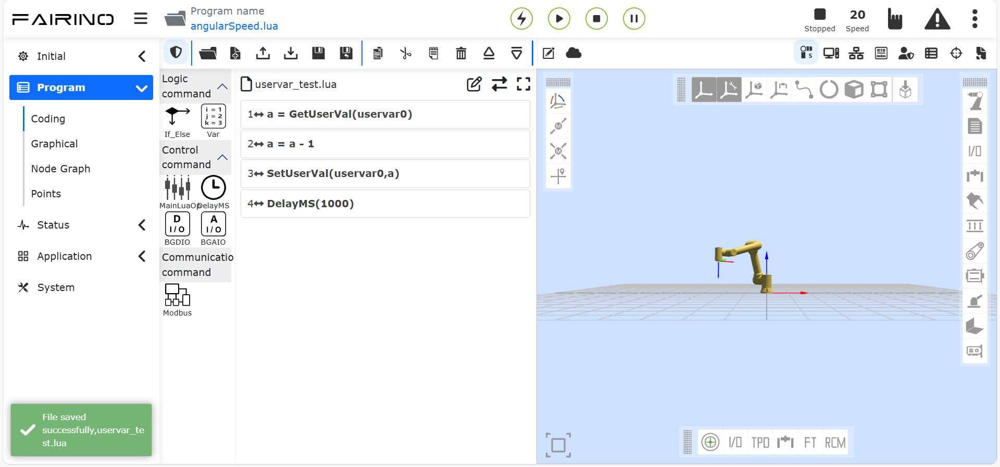

.. centered:: Schemat 9.19-2 Tworzenie i zapisywanie pliku programu w tle

Zarządzanie programem działającym w tle robota
***********************************************

Pomyślnie zapisane programy w tle można tworzyć, wstrzymywać, wznawiać i usuwać w interfejsie zarządzania programami w tle. Interfejs zarządzania programami w tle umożliwia wizualny podgląd stanu działania wszystkich utworzonych programów w tle. Zielony oznacza, że program działa, czerwony oznacza stan wstrzymania.

**Krok 1**: Utwórz program w tle. Kliknij przycisk zarządzania programem w tle, wybierz z listy rozwijanej już zapisany program w tle, a następnie kliknij „Rozpocznij działanie”, aby uruchomić odpowiedni program w tle.

.. image:: coding/255.png
   :width: 6in
   :align: center

.. centered:: Schemat 9.19-3 Tworzenie programu w tle

**Krok 2**: Wznów, wstrzymaj program w tle. W interfejsie zarządzania programami w tle kliknij przyciski „Wznów” i „Wstrzymaj” dla monitorowanego programu, aby odpowiednio wznowić lub wstrzymać działanie programu w tle. Kliknij przycisk „Usuń”, aby usunąć odpowiedni program w tle.

.. image:: coding/256.png
   :width: 6in
   :align: center

.. centered:: Schemat 9.19-4 Wstrzymywanie, wznawianie, usuwanie programu w tle

Używanie zmiennych użytkownika robota
+++++++++++++++++++++++++++++++++++++

.. note:: Robot współpracujący ma nową funkcję zmiennych użytkownika, odpowiednią do wymiany danych między programem w tle a programem na pierwszym planie lub między różnymi programami w tle.

Zarządzanie zmiennymi użytkownika robota
****************************************

Przed użyciem zmiennych użytkownika możesz je wstępnie zmienić według własnych preferencji. Otwórz stronę nauczania, kolejno kliknij „Program nauczania”, „Programowanie”, „Zarządzanie zmiennymi użytkownika”. Ta strona jest dostępna zarówno w programie na pierwszym planie, jak i w programie w tle. Kliknij nazwę zmiennej, aby bezpośrednio zmienić jej nazwę.

.. image:: coding/257.png
   :width: 6in
   :align: center

.. centered:: Schemat 9.19-5 Zarządzanie zmiennymi użytkownika

Używanie zmiennych użytkownika robota
*************************************

Podczas używania zmiennych użytkownika w programach na pierwszym planie i w tle można je obsługiwać tylko za pomocą interfejsów odczytu i zapisu zmiennych użytkownika.

**Krok 1**: W trybie ręcznym otwórz plik programu nauczania. Otwórz stronę nauczania, kolejno kliknij „Program nauczania”, „Programowanie”, kliknij „Nowy”, aby utworzyć nowy plik programu nauczania.

.. image:: coding/258.png
   :width: 6in
   :align: center

.. centered:: Schemat 9.19-6 Tworzenie nowego pliku programu nauczania

**Krok 2**: Użyj interfejsu odczytu zmiennej użytkownika. Kliknij instrukcję „Zmienna”, wybierz „Zmienna użytkownika”, kliknij listę rozwijaną „Pobierz wartość zmiennej”, wybierz zmienną użytkownika do odczytania, kliknij „Dodaj”, „Zastosuj”, aby napisać program korzystający z interfejsu odczytu zmiennej użytkownika.

.. image:: coding/259.png
   :width: 6in
   :align: center

.. centered:: Schemat 9.19-7 Użycie interfejsu odczytu zmiennej użytkownika

**Krok 3**: Użyj interfejsu zapisu zmiennej użytkownika. Kliknij instrukcję „Zmienna”, wybierz „Zmienna użytkownika”, kliknij listę rozwijaną „Ustaw wartość zmiennej”, wybierz zmienną użytkownika do ustawienia, wprowadź odpowiednią wartość (może to być stała lub wartość zmiennej). Kliknij „Dodaj”, „Zastosuj”, aby napisać program korzystający z interfejsu zapisu zmiennej użytkownika.

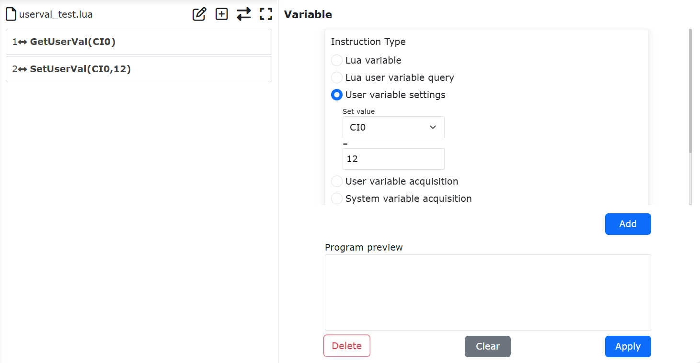

.. centered:: Schemat 9.19-8 Użycie interfejsu zapisu zmiennej użytkownika

Funkcja stałosiłowego szlifowania poprzecznego w kierunkach X i Y
~~~~~~~~~~~~~~~~~~~~~~~~~~~~~~~~~~~~~~~~~~~~~~~~~~~~~~~~~~~~~~~~~

Przegląd
++++++++

Zasada stałosiłowego szlifowania poprzecznego w kierunkach X i Y jest następująca: Stałosiłowe szlifowanie poprzeczne polega na przykładaniu stałej siły do narzędzia szlifującego (takiego jak tarcza szlifierska, głowica szlifierska itp.) na określonej powierzchni przedmiotu obrabianego i sterowaniu ruchem narzędzia w kierunkach X i Y, tak aby siła szlifowania w punkcie styku była zawsze stała.

Procedura operacyjna funkcji stałosiłowego szlifowania poprzecznego w kierunkach X i Y
++++++++++++++++++++++++++++++++++++++++++++++++++++++++++++++++++++++++++++++++++++++

Aby użyć czujnika siły do stałosiłowego szlifowania, należy zamontować narzędzie szlifujące pod czujnikiem siły i skonfigurować układ współrzędnych narzędzia. Kolejno kliknij „Ustawienia początkowe” -> „Podstawowe” -> „Układy współrzędnych” -> przycisk „Narzędzie”, aby przejść do interfejsu „Ustawienia układu współrzędnych narzędzia”. W polu „Nazwa układu współrzędnych” wybierz układ współrzędnych do ustawienia (na przykład toolcoord0), a następnie ustaw go zgodnie z wymiarami narzędzia końcowego.

.. image:: coding/246.png
   :width: 4in
   :align: center

.. centered:: Schemat 9.20-1 Ustawienie układu współrzędnych narzędzia

Ustawienie układu odniesienia dla sterowania siłą. W interfejsie webowym kolejno kliknij „FT” -> „Układ odniesienia”, wybierz „Niestandardowy układ współrzędnych” i ustaw wszystkie parametry na „0”. Gdy czujnik siły pracuje, różne układy odniesienia wpływają na wielkość siły zewnętrznej mierzonej przez czujnik.

.. image:: coding/261.png
   :width: 6in
   :align: center

.. centered:: Schemat 9.20-2 Ustawienie układu odniesienia

Zamocuj płytę do szlifowania w przestrzeni roboczej robota, płyta nie może się trząść. Ustaw narzędzie końcowe mniej więcej prostopadle do płyty szlifierskiej i naucz punkty początkowe i końcowe.

.. image:: coding/262.png
   :width: 2in
   :align: center

.. centered:: Schemat 9.20-3 Schemat rozmieszczenia szlifowania

Kolejno kliknij przyciski „Program nauczania” -> „Programowanie” -> „Zestaw sterowania siłą”, aby dodać instrukcję „FT_Control”. Instrukcja „FT_Control” to instrukcja ruchu ze sterowaniem siłą, umożliwiająca robotowi poruszanie się w pobliżu zadanej siły.

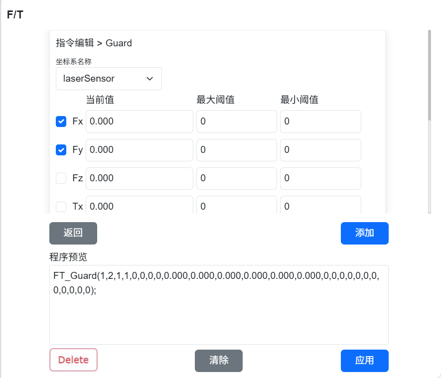

.. centered:: Schemat 9.20-4 Dodanie instrukcji sterowania siłą

.. image:: coding/264.png
   :width: 6in
   :align: center

.. centered:: Schemat 9.20-5 Przykład instrukcji szlifowania ze sterowaniem siłą

Szczegółowe działanie parametrów:

**Nazwa układu współrzędnych**: Nazwa odpowiadająca ustawionemu układowi współrzędnych czujnika;

**Zaznaczenie kierunku wykrywania siły**: Ustawienie progu wykrywania: wybór kierunku sterowania siłą. W szlifowaniu poprzecznym zaznacz Fx, Fy i ustaw odpowiednią oczekiwaną stałą siłę;

**Parametry PID**: Ustawienie współczynników proporcjonalności PID dla siły i momentu. Zazwyczaj ustawia się F_P_gain na 0,001;

**Maksymalna odległość regulacji**: Maksymalna odległość przesunięcia odpowiednio w kierunkach X, Y, Z;

**Maksymalny kąt regulacji**: Maksymalny kąt obrotu odpowiednio w kierunkach RX, RY, RZ;

**Promień tarczy szlifierskiej**: Określany na podstawie rzeczywistego promienia narzędzia szlifującego zamontowanego na końcówce.

Funkcja automatycznego omijania punktów osobliwych trajektorii
~~~~~~~~~~~~~~~~~~~~~~~~~~~~~~~~~~~~~~~~~~~~~~~~~~~~~~~~~~~~~~

Przegląd
++++++++

Gdy robot napotka podczas wykonywania trajektorii w instrukcjach LIN, ARC zakres osobliwy, przez który nie może przejść, zgłasza błąd, informując, że następna pozy i orientacja jest osobliwa lub wyświetla ostrzeżenie o osobliwości. Jeśli chcesz dotrzeć do następnego punktu ścieżki, który przechodzi przez zakres osobliwy, możesz użyć tej funkcji, aby ominąć punkt osobliwy w przestrzeni stawów lub przestrzeni kartezjańskiej i osiągnąć następną docelową pozy i orientację.

.. image:: coding/265.png
   :width: 4in
   :align: center

.. centered:: Schemat 9.21-1 Uproszczony schemat punktu osobliwego robota

Powyższy rysunek przedstawia schemat punktów osobliwych robota. Osoliwości robota obejmują trzy rodzaje: ramienia, łokcia i nadgarstka. Na rysunku A to środek 5. stawu WCP (Wrist Center Point), używany do określania osobliwości ramienia; B to zakres osobliwości ramienia, przypominający cylinder, którego promień jest równy długości parametru DH robota d4. Gdy WCP wejdzie w cylinder B, robot wchodzi w stan osobliwy; C to granica osobliwości łokcia robota. Gdy J3=0 lub 180°, robot znajduje się w stanie osobliwym łokcia; D to wewnętrzna przestrzeń robota. W dowolnym miejscu wewnętrznej przestrzeni, gdy J5=0 lub 180°, robot znajduje się w stanie osobliwym nadgarstka.

.. note:: Osobliwość jest cechą ruchu wynikającą z fizycznej struktury robota. Należy jej unikać podczas rzeczywistego działania. Ominięcie jej za pomocą algorytmu może prowadzić do zmiany pozy i orientacji końcówki, prędkości, a nawet konfiguracji stawów. Należy rozważyć, czy skutki uboczne ominięcia są akceptowalne przed podjęciem decyzji.

Procedura operacyjna funkcji automatycznego omijania punktów osobliwych trajektorii
++++++++++++++++++++++++++++++++++++++++++++++++++++++++++++++++++++++++++++++++++++

W nowo utworzonym programie kliknij, aby dodać instrukcję ruchu typu LIN/ARC.

.. image:: coding/266.png
   :width: 6in
   :align: center

.. centered:: Schemat 9.21-2 Dodanie instrukcji ruchu LIN/ARC

Kliknij instrukcję „Linia”, wybierz punkt pośredni przechodzący przez punkt osobliwy robota. W podopcji „Ochrona ruchu” w interfejsie konfiguracji parametrów instrukcji kliknij przycisk „Ominięcie punktu osobliwego”.

.. image:: coding/267.png
   :width: 6in
   :align: center

.. centered:: Schemat 9.21-3 Włączenie funkcji omijania punktu osobliwego

Parametry „Ominięcia punktu osobliwego” obejmują „Tryb ochrony”, „Regulację osobliwości ramienia”, „Regulację osobliwości łokcia” oraz parametry związane z „Regulacją osobliwości nadgarstka”. „Tryb ochrony” dzieli się na „Tryb stawowy” i „Tryb kartezjański”, co oznacza, że robot może ominąć osobliwość w przestrzeni stawów lub okrążyć ją w przestrzeni kartezjańskiej. Parametr „Regulacja osobliwości” określa zakres wykrywania osobliwości i maksymalne odchylenie dla omijania osobliwości. Dla osobliwości ramienia i łokcia jednostką jest mm, dla osobliwości nadgarstka jednostką jest °.

.. note:: W przestrzeni stawów wybierana jest najbliższa trajektoria między stawami, więc nie wystąpi ograniczenie zakresu ruchu. Przy omijaniu w przestrzeni kartezjańskiej może wystąpić ograniczenie zakresu ruchu stawów. Należy zwrócić na to uwagę i dostosować podczas nauczania.

Po wybraniu i ustawieniu parametrów omijania punktu osobliwego kliknij przycisk „Dodaj”, aby dodać instrukcję, a następnie kliknij „Zastosuj”, aby dodać instrukcję lua do programu.

.. image:: coding/268.png
   :width: 6in
   :align: center

.. centered:: Schemat 9.21-4 Konfiguracja parametrów omijania punktu osobliwego, dodanie instrukcji lua

Przykładowy typowy program lua dla ruchu LIN z omijaniem osobliwości po zakończeniu nauczania jest następujący:

.. image:: coding/269.png
   :width: 6in
   :align: center

.. centered:: Schemat 9.21-5 Program lua zawierający instrukcję omijania punktu osobliwego

Efekt omijania jest następujący, czerwona linia to trajektoria końcówki robota:

.. image:: coding/270.png
   :width: 4in
   :align: center

.. image:: coding/271.png
   :width: 4in
   :align: center

.. centered:: Schemat 9.21-6 Przykład trajektorii omijania osobliwości stawu ramiennego (góra: przestrzeń kartezjańska, dół: przestrzeń stawów)

.. image:: coding/272.png
   :width: 4in
   :align: center

.. image:: coding/273.png
   :width: 4in
   :align: center

.. centered:: Schemat 9.21-7 Przykład trajektorii omijania osobliwości stawu łokciowego (góra: przestrzeń kartezjańska, dół: przestrzeń stawów)

.. image:: coding/274.png
   :width: 4in
   :align: center

.. centered:: Schemat 9.21-8 Przykład trajektorii omijania osobliwości stawu nadgarstkowego (przestrzeń stawów)

Obecnie funkcja ta obsługuje omijanie sytuacji, w których ruch LIN/ARC przechodzi przez pojedynczy typ punktu osobliwego. Jeśli punkt początkowy i końcowy ruchu znajdują się w ustawionym zakresie osobliwości, lub ruch przechodzi przez więcej niż jeden typ osobliwości, a nawet przez dwa lub więcej typów jednocześnie, na interfejsie pojawi się okno dialogowe z ostrzeżeniem „[Ostrzeżenie] Osobliwa pozy i orientacja”, informujące, że obecnej sytuacji osobliwej nie można ominąć.

.. image:: coding/275.png
   :width: 3in
   :align: center

.. centered:: Schemat 9.21-9 Ostrzeżenie o niemożliwości ominięcia obecnej sytuacji osobliwej

Funkcja przejścia przez punkt osobliwy w trybie automatycznym
~~~~~~~~~~~~~~~~~~~~~~~~~~~~~~~~~~~~~~~~~~~~~~~~~~~~~~~~~~~~~

Przegląd
++++++++

Gdy robot wykonuje instrukcję LIN lub ARC i przechodzi przez punkt osobliwy, prędkość robota ulega gwałtownej zmianie, co prowadzi do niestabilności sterowania ruchem, a nawet uszkodzenia urządzenia. Dzięki funkcji przejścia przez punkt osobliwy robot może płynnie pokonać punkt osobliwy. Niniejszy podręcznik na przykładzie instrukcji LIN przechodzącej przez osobliwość nadgarstka wyjaśnia, jak używać funkcji przejścia przez punkt osobliwy w trybie automatycznym.

Procedura operacyjna
++++++++++++++++++++

1. Naucz robota dwóch punktów sterowania ruchem dla instrukcji LIN (w podręczniku nazwanych odpowiednio wristlin1 i wristlin2).

2. Kolejno kliknij przyciski „Program nauczania” -> „Programowanie”, wybierz instrukcję „Punkt-punkt” z „Instrukcji ruchu”, aby dodać pierwszy punkt ruchu.

.. image:: coding/285.png
   :width: 6in
   :align: center

.. centered:: Schemat 9.22-1 Dodanie pierwszego punktu ruchu

3. Wybierz instrukcję „Linia” z „Instrukcji ruchu”, aby dodać drugi punkt ruchu. W opcji „Ochrona ruchu” wybierz „Przejście przez punkt osobliwy” i ustaw odpowiednio zakresy regulacji dla osobliwości ramienia, łokcia i nadgarstka.

.. image:: coding/286.png
   :width: 6in
   :align: center

.. centered:: Schemat 9.22-2 Ustawienie parametrów przejścia przez punkt osobliwy

4. Wygeneruj program lua i uruchom go. Typowy program instrukcji LIN z przejściem przez punkt osobliwy w trybie automatycznym.

.. image:: coding/287.png
   :width: 6in
   :align: center

.. centered:: Schemat 9.22-3 Typowa instrukcja LIN z przejściem przez punkt osobliwy

5. Obserwuj wyniki ruchu robota. Poprzez regulację prędkości ruchu robota i ustawionego zakresu osobliwości można uzyskać różną dokładność ruchu i uderzenia.

Tabela porównawcza dokładności i uderzeń
+++++++++++++++++++++++++++++++++++++++++

1. Osobliwość nadgarstka jest najłatwiejszym do wywołania typem osobliwości robota. Opracowano tabele porównawcze dokładności i uderzeń dla instrukcji LIN i ARC w przypadku osobliwości nadgarstka. Tabele dla instrukcji LIN/ARC są następujące (〇 oznacza wyzwolenie ostrzeżenia o kolizji).

.. centered:: Tabela 9.22-3-1 Błąd instrukcji LIN dla osobliwości nadgarstka (jednostka: mm)

.. list-table::
   :widths: 35 20 20 20 20 20 20
   :header-rows: 0
   :class: sheet-center

   * - **Zakres osobliwości / Prędkość interfejsu**
     - **2**
     - **20**
     - **40**
     - **60**
     - **80**
     - **100**

   * - 2 mm
     - 0,19					
     - 0,20
     - 0,20 
     - 0,21 
     - 〇  
     - 〇  

   * - 4 mm
     - 0,14					
     - 0,14
     - 0,14
     - 0,14
     - 0,14  
     - 0,14  

   * - 6 mm
     - 0,40				
     - 0,40
     - 0,41
     - 0,41
     - 0,42  
     - 0,42  

   * - 8 mm
     - 0,82				
     - 0,83
     - 0,83
     - 0,84
     - 0,83  
     - 0,84  

   * - 10 mm
     - 1,38				
     - 1,38
     - 1,39
     - 1,39
     - 1,39
     - 1,41  

.. centered:: Tabela 9.22-3-2 Liniowe zryw przyspieszenia instrukcji LIN dla osobliwości nadgarstka (jednostka: m/s\ :sup:`3`)

.. list-table::
   :widths: 35 20 20 20 20 20 20
   :header-rows: 0
   :class: sheet-center

   * - **Zakres osobliwości / Prędkość interfejsu**
     - **2**
     - **20**
     - **40**
     - **60**
     - **80**
     - **100**

   * - 2 mm
     - 0,605						
     - 12,040
     - 11,370
     - 2743,000		
     - 〇  
     - 〇  

   * - 4 mm
     - 0,916								
     - 34,620
     - 110,900	
     - 241,300	
     - 303,900  
     - 400,700  

   * - 6 mm
     - 0,906									
     - 59,700
     - 139,600
     - 343,700
     - 445,600  
     - 582,900  

   * - 8 mm
     - 1,073									
     - 67,480
     - 199,600
     - 438,300
     - 553,400 
     - 623,900  

   * - 10 mm
     - 1,013								
     - 69,490
     - 195,800	
     - 556,600
     - 649,300
     - 953,300  

.. centered:: Tabela 9.22-3-3 Kątowe zryw przyspieszenia instrukcji LIN dla osobliwości nadgarstka (jednostka: °/s\ :sup:`3`)

.. list-table::
   :widths: 35 20 20 20 20 20 20
   :header-rows: 0
   :class: sheet-center

   * - **Zakres osobliwości / Prędkość interfejsu**
     - **2**
     - **20**
     - **40**
     - **60**
     - **80**
     - **100**

   * - 2 mm
     - 1122									
     - 25140
     - 24780
     - 54890		
     - 〇  
     - 〇  

   * - 4 mm
     - 305													
     - 9035
     - 26030
     - 39330
     - 60510
     - 80330

   * - 6 mm
     - 219														
     - 8161
     - 19450
     - 84700
     - 109300
     - 143400 

   * - 8 mm
     - 478													
     - 6651
     - 19780
     - 121600
     - 150500
     - 162100 

   * - 10 mm
     - 281												
     - 5296
     - 14470
     - 161600
     - 177300
     - 256000

.. centered:: Tabela 9.22-3-4 Błąd instrukcji ARC dla osobliwości nadgarstka (jednostka: mm)

.. list-table::
   :widths: 35 20 20 20 20 20 20
   :header-rows: 0
   :class: sheet-center

   * - **Zakres osobliwości / Prędkość interfejsu**
     - **2**
     - **20**
     - **40**
     - **60**
     - **80**
     - **100**

   * - 2 mm
     - 1,06									
     - 1,06
     - 1,05
     - 1,05		
     - 〇  
     - 〇  

   * - 4 mm
     - 1,58														
     - 1,59
     - 1,60
     - 1,62
     - 〇  
     - 〇 

   * - 6 mm
     - 3,31																			
     - 3,34
     - 3,35
     - 3,32
     - 3,39
     - 3,33 

   * - 8 mm
     - 5,81																		
     - 5,83
     - 5,87
     - 5,87
     - 5,87
     - 5,96 

   * - 10 mm
     - 9,06																	
     - 9,09
     - 9,12
     - 9,17
     - 9,17
     - 9,22

.. centered:: Tabela 9.22-3-5 Liniowe zryw przyspieszenia instrukcji ARC dla osobliwości nadgarstka (jednostka: m/s\ :sup:`3`)

.. list-table::
   :widths: 35 20 20 20 20 20 20
   :header-rows: 0
   :class: sheet-center

   * - **Zakres osobliwości / Prędkość interfejsu**
     - **2**
     - **20**
     - **40**
     - **60**
     - **80**
     - **100**

   * - 2 mm
     - 13,970										
     - 643,000	
     - 2230,000	
     - 3408,000	
     - 〇  
     - 〇  

   * - 4 mm
     - 0,635																	
     - 24,850
     - 42,480
     - 76,990
     - 〇  
     - 〇 

   * - 6 mm
     - 3,000																						
     - 19,960
     - 45,350
     - 57,120
     - 77,050
     - 59,800	 

   * - 8 mm
     - 1,494																						
     - 27,830
     - 90,290
     - 124,200
     - 148,400
     - 168,000

   * - 10 mm
     - 0,460																					
     - 31,870
     - 112,600
     - 211,000
     - 229,300
     - 117,500

.. centered:: Tabela 9.22-3-6 Kątowe zryw przyspieszenia instrukcji ARC dla osobliwości nadgarstka (jednostka: °/s\ :sup:`3`)

.. list-table::
   :widths: 35 20 20 20 20 20 20
   :header-rows: 0
   :class: sheet-center

   * - **Zakres osobliwości / Prędkość interfejsu**
     - **2**
     - **20**
     - **40**
     - **60**
     - **80**
     - **100**

   * - 2 mm
     - 3378													
     - 85380
     - 228600	
     - 351900
     - 〇  
     - 〇  

   * - 4 mm
     - 1098																				
     - 31360
     - 71460
     - 104800
     - 〇  
     - 〇 

   * - 6 mm
     - 390																											
     - 15770
     - 43650
     - 79330
     - 93930
     - 124200 

   * - 8 mm
     - 315																											
     - 10270
     - 28770
     - 57000
     - 75840
     - 94050

   * - 10 mm
     - 504																										
     - 6108
     - 21470
     - 34920
     - 47280
     - 97160

2. Ponieważ osobliwość ramienia i łokcia odpowiadają odpowiednio minimalnej i maksymalnej granicy roboczej robota, nie można używać dokładności jako wskaźnika. Dlatego opracowano tabele porównawcze uderzeń dla osobliwości ramienia i osobliwości łokcia, jak poniżej (〇 oznacza wyzwolenie ostrzeżenia o kolizji).

.. centered:: Tabela 9.22-3-7 Liniowe zryw przyspieszenia dla osobliwości ramienia (jednostka: m/s\ :sup:`3`)

.. list-table::
   :widths: 35 20 20 20 20 20 20
   :header-rows: 0
   :class: sheet-center

   * - **Zakres osobliwości / Prędkość interfejsu**
     - **2**
     - **20**
     - **40**
     - **60**
     - **80**
     - **100**

   * - 40 mm
     - 1,166																
     - 99,730
     - 253,200	
     - 273,500
     - 〇  
     - 〇  

   * - 70 mm
     - 1,047																								
     - 92,440
     - 328,900
     - 634,500
     - 878,400  
     - 1499,000	 

   * - 100 mm
     - 1,060																															
     - 90,250
     - 273,900
     - 506,600
     - 926,300
     - 1555,000	 

.. centered:: Tabela 9.22-3-8 Kątowe zryw przyspieszenia dla osobliwości ramienia (jednostka: °/s\ :sup:`3`)

.. list-table::
   :widths: 35 20 20 20 20 20 20
   :header-rows: 0
   :class: sheet-center

   * - **Zakres osobliwości / Prędkość interfejsu**
     - **2**
     - **20**
     - **40**
     - **60**
     - **80**
     - **100**

   * - 40 mm
     - 396																		
     - 89,83
     - 824
     - 348
     - 〇  
     - 〇  

   * - 70 mm
     - 428																													
     - 121
     - 681
     - 167
     - 1783 
     - 35690 

   * - 100 mm
     - 440																																				
     - 151
     - 473
     - 246
     - 1495
     - 39280

.. centered:: Tabela 9.22-3-9 Liniowe zryw przyspieszenia dla osobliwości łokcia (jednostka: m/s\ :sup:`3`)

.. list-table::
   :widths: 35 20 20 20 20 20 20
   :header-rows: 0
   :class: sheet-center

   * - **Zakres osobliwości / Prędkość interfejsu**
     - **2**
     - **20**
     - **40**
     - **60**
     - **80**
     - **100**

   * - 40 mm
     - 0,905																						
     - 14,430
     - 52,080
     - 87,380
     - 129,400  
     - 657,000  

   * - 70 mm
     - 1,144																																		
     - 24,320
     - 79,580
     - 270,300
     - 793,300 
     - 1478,000 

   * - 100 mm
     - 1,852																																									
     - 27,930
     - 112,700
     - 328,100
     - 583,000
     - 758,600

.. centered:: Tabela 9.22-3-10 Kątowe zryw przyspieszenia dla osobliwości łokcia (jednostka: °/s\ :sup:`3`)

.. list-table::
   :widths: 35 20 20 20 20 20 20
   :header-rows: 0
   :class: sheet-center

   * - **Zakres osobliwości / Prędkość interfejsu**
     - **2**
     - **20**
     - **40**
     - **60**
     - **80**
     - **100**

   * - 40 mm
     - 347																										
     - 128
     - 148
     - 142
     - 63
     - 38050 

   * - 70 mm
     - 424																																						
     - 132
     - 141
     - 21780
     - 56190
     - 95610 

   * - 100 mm
     - 46																																														
     - 1443
     - 6194
     - 19940
     - 35170
     - 46770

Funkcja planowania trajektorii z wyprzedzeniem w czasie rzeczywistym
~~~~~~~~~~~~~~~~~~~~~~~~~~~~~~~~~~~~~~~~~~~~~~~~~~~~~~~~~~~~~~~~~~~~

Przegląd
++++++++

Planowanie trajektorii z wyprzedzeniem w czasie rzeczywistym polega na dynamicznym dostosowywaniu parametrów ruchu, takich jak prędkość i przyspieszenie robota, w oparciu o bieżące i przyszłe informacje o ścieżce, aby zapewnić płynność, ciągłość i precyzję ruchu. Przewidując przyszłą pozycję i orientację robota, sterowanie z wyprzedzeniem może zareagować przed kluczowymi punktami ścieżki, unikając w ten sposób niestabilności ruchu lub błędów trajektorii spowodowanych gwałtownymi zmianami prędkości i przyspieszenia.

Procedura operacyjna
++++++++++++++++++++

**Krok 1**: Przygotuj plik punktów trajektorii w formacie „txt”, w którym każdy punkt trajektorii jest reprezentowany przez pozycję i orientację kartezjańską.

**Krok 2**: Kolejno kliknij przyciski „Program nauczania” -> „Programowanie”, wybierz instrukcję „Planowanie trajektorii z wyprzedzeniem” z „Instrukcji ruchu”, a następnie w „Konfiguracji instrukcji” dokonaj importu i usuwania plików trajektorii.

.. image:: coding/288.png
   :width: 6in
   :align: center

.. centered:: Schemat 9.23-1 Import i usuwanie plików trajektorii

**Krok 3**: Wybierz plik trajektorii do uruchomienia, dodaj instrukcję „Wstępne ładowanie trajektorii”: Najpierw w „Sposobie aproksymacji krzywej” wybierz sposób aproksymacji punktów trajektorii, w tym „Połączenie liniowe”, „Aproksymacja liniowa”, „Krzywa B-sklejana”, „Metoda optymalizacji wielomianowej” itp. Gdy wybierzesz „Aproksymacja liniowa”, musisz dodatkowo ustawić ograniczenie błędu; w przypadku innych metod nie ma to konieczności. Następnie ustaw sposób wygładzania i dokładność wygładzania. Na koniec ustaw maksymalną prędkość, maksymalne przyspieszenie i maksymalne zryw przyspieszenia podczas ruchu. Poprzez opcję „Ruch jednostajny” możesz wybrać, czy włączyć wyprzedzenie z jednostajną prędkością; po włączeniu robot będzie poruszać się z jednostajną prędkością podczas wyprzedzenia.

.. image:: coding/289.png
   :width: 6in
   :align: center

.. centered:: Schemat 9.23-2 Ustawienie parametrów wstępnego ładowania trajektorii dla „Aproksymacji liniowej”

.. image:: coding/292.png
   :width: 6in
   :align: center

.. centered:: Schemat 9.23-3 Ustawienie parametrów wstępnego ładowania trajektorii

**Krok 4**: Dodaj instrukcję „Ruch trajektorii” i wygeneruj program lua. Uruchom program lua, aby przeprowadzić planowanie trajektorii z wyprzedzeniem w czasie rzeczywistym dla zaimportowanego pliku trajektorii. Typowy program dla planowania trajektorii z wyprzedzeniem w czasie rzeczywistym przedstawiono poniżej.

.. image:: coding/290.png
   :width: 5in
   :align: center

.. centered:: Schemat 9.23-4 Typowy program planowania trajektorii z wyprzedzeniem w czasie rzeczywistym (Krzywa B-sklejana)

**Krok 5**: Dla wiersza polecenia „LoadTrajectory” w programie lua kliknij przycisk edycji, aby zmodyfikować ustawione parametry, uzyskując różne efekty planowania trajektorii.

.. image:: coding/291.png
   :width: 6in
   :align: center

.. centered:: Schemat 9.23-5 Modyfikacja ustawionych parametrów

Funkcja śledzenia łuku spawalniczego z monotoniczną zmianą amplitudy wahadła
~~~~~~~~~~~~~~~~~~~~~~~~~~~~~~~~~~~~~~~~~~~~~~~~~~~~~~~~~~~~~~~~~~~~~~~~~~~~

Ruch wahadłowy umożliwia przełączanie amplitudy wahadła w sposób „gwałtowny” lub „płynny (gradientowy)”.

Sposób „gwałtowny” polega na bezpośrednim przełączeniu parametrów wahadła z poprzedniego odcinka na następny, co można osiągnąć poprzez ustawienie dwóch sąsiadujących ze sobą ruchów wahadłowych o różnych parametrach lub poprzez dynamiczne wysłanie nowego numeru wahadła podczas trwania ruchu wahadłowego (więcej szczegółów w odpowiedniej części podręcznika funkcji, nie będzie tu powtarzane).

Sposób „płynny” oznacza, że w bieżącym ruchu wahadłowym amplituda wahadła ustawiona na początku stopniowo zmienia się do amplitudy ustawionej na końcu.

Płynne przełączanie parametrów wahadła jest obsługiwane tylko podczas wahadła w ruchu liniowym.

Wprowadzenie
++++++++++++

Trajektoria ruchu wahadłowego z monotoniczną zmianą amplitudy jest pokazana na poniższym rysunku.

.. image:: coding/293.png
   :width: 4in
   :align: center

Niebieska linia to kierunek ruchu wahadłowego, a to amplituda wahadła w punkcie początkowym, b to amplituda wahadła w punkcie końcowym. Amplituda wahadła stopniowo zmienia się podczas ruchu.

.. note:: Należy pamiętać, że obecnie obsługiwane jest tylko przejście gradientowe, w którym punkt początkowy i końcowy są tego samego typu, amplituda jest różna (zmienia się z a na b), a pozostałe parametry są identyczne. Przed wykonaniem wahadła zaleca się sprawdzenie parametrów wahadła.

Procedura ustawiania wahadła z płynną zmianą amplitudy jest następująca:

**Krok 1**: Kliknij „Program nauczania”, „Programowanie”, wybierz i kliknij przycisk „Wahadło” w kategorii „Instrukcje ruchu”, aby przejść do strony konfiguracji instrukcji wahadła.

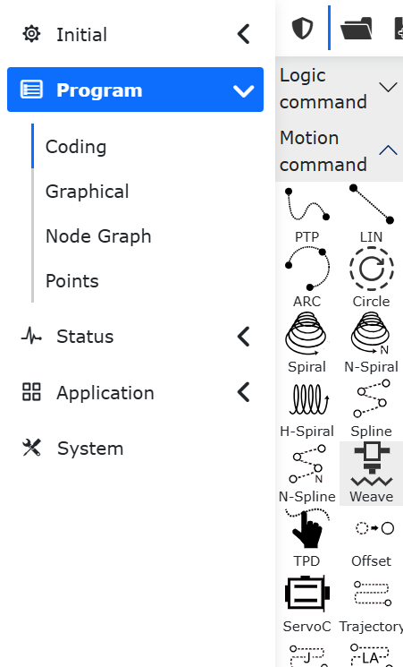

.. centered:: Schemat 9.24-1 Kliknięcie przycisku funkcji wahadła

**Krok 2**: W edycji instrukcji wybierz numer parametrów wahadła na początku ruchu wahadłowego, kliknij „Rozpocznij wahadło”, a następnie kliknij „Dodaj”.

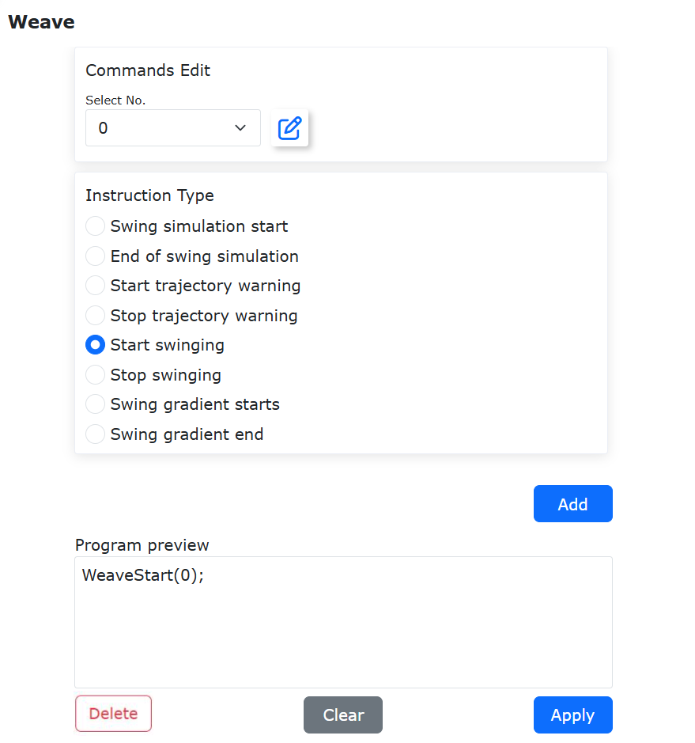

.. centered:: Schemat 9.24-2 Dodanie początkowych parametrów wahadła

**Krok 3**: Wybierz docelowy numer gradientu wahadła, zaznacz „Rozpocznij gradient wahadła”, kliknij „Dodaj”.

.. image:: coding/296.png
   :width: 6in
   :align: center

.. centered:: Schemat 9.24-3 Dodanie parametrów wahadła gradientowego

**Krok 4**: Po dodaniu odpowiedniego ruchu liniowego, zaznacz „Zakończ gradient wahadła”, kliknij „Dodaj”, następnie zaznacz „Zatrzymaj wahadło” i kliknij „Dodaj”, aby zakończyć ustawianie ruchu wahadłowego z płynną zmianą amplitudy. Kliknij „Zastosuj”, aby dodać do programu LUA.

.. image:: coding/297.png
   :width: 6in
   :align: center

.. centered:: Schemat 9.24-4 Realizacja pełnego ruchu wahadłowego z płynną zmianą amplitudy w instrukcji LUA

Funkcja śledzenia łuku spawalniczego z przesunięciem
~~~~~~~~~~~~~~~~~~~~~~~~~~~~~~~~~~~~~~~~~~~~~~~~~~~~

W procesie spawania ze śledzeniem łuku spawalniczego, robot domyślnie dostosowuje środek wahadła palnika spawalniczego na podstawie informacji o prądzie, aby był on zgodny ze środkiem rowka spawalniczego przedmiotu. Jednak niektóre wymagania procesowe oczekują, że środek wahadła palnika spawalniczego będzie nieco przesunięty względem środka rowka spawalniczego.

.. image:: coding/298.png
   :width: 3in
   :align: center

.. centered:: Schemat 9.25-1 Typowy scenariusz śledzenia łuku spawalniczego z przesunięciem

Typowy scenariusz funkcji śledzenia łuku spawalniczego z przesunięciem obejmuje: a. przedmiot spawany (spoina czołowa pod kątem prostym lub ostrym), b. palnik spawalniczy, e. linię środkową rowka spawalniczego. Funkcja śledzenia łuku spawalniczego realizuje śledzenie rowka spawalniczego w kierunkach: c. góra/dół (głębokość) i d. lewo/prawo (środek), f. odległość przesunięcia śledzenia w kierunku lewo/prawo.

Aby zrealizować śledzenie łuku spawalniczego z przesunięciem, można wybrać jeden z dwóch sposobów ustawienia wielkości przesunięcia lewo/prawo: „Próbkowanie” i „Procent”.

Śledzenie łuku spawalniczego z przesunięciem przez próbkowanie
++++++++++++++++++++++++++++++++++++++++++++++++++++++++++++++

Metoda próbkowania polega na zebraniu wartości prądu podczas wahadła w jednym cyklu po rozpoczęciu łuku spawania wahadłowego jako wartości odniesienia. W kolejnych etapach spawania prąd próbkowania jest porównywany z prądem odniesienia w celu określenia kierunku śledzenia.

Metoda próbkowania wymaga, aby początkowa pozycja spawania wahadłowego była nauczona z wymaganą wielkością przesunięcia. Wielkość przesunięcia nie może być większa niż amplituda wahadła. Spoina musi pokrywać łączone ukosy.

Procedura ustawiania instrukcji przesunięcia przez próbkowanie jest następująca:

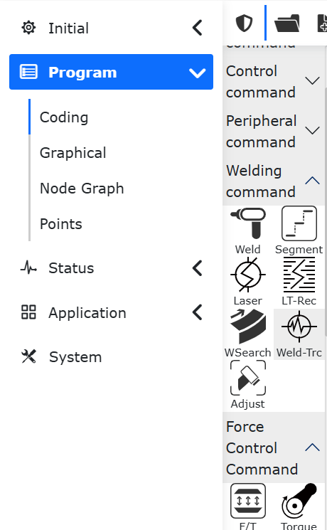

.. centered:: Schemat 9.25-2 Kliknięcie przycisku instrukcji śledzenia łuku spawalniczego

**Krok 1**: Kliknij „Program nauczania”, „Programowanie”, wybierz i kliknij przycisk „Śledzenie łuku spawalniczego” w kategorii „Instrukcje spawania”, aby przejść do strony konfiguracji instrukcji śledzenia łuku spawalniczego.

.. image:: coding/300.png
   :width: 6in
   :align: center

.. centered:: Schemat 9.25-3 Strona konfiguracji śledzenia łuku spawalniczego z przesunięciem przez próbkowanie

**Krok 2**: Śledzenie łuku spawalniczego z przesunięciem działa na kompensacji lewo/prawo. Kliknij podstronę „Kompensacja lewo/prawo”, w polu „Sposób przesunięcia” wybierz z listy rozwijanej „Próbkowanie”. Ustaw okres rozpoczęcia próbkowania (okres rozpoczęcia próbkowania musi być mniejszy niż czas rozpoczęcia kompensacji lewo/prawo), wybierz typ instrukcji jako „Rozpocznij”, kliknij przycisk dodawania, aby wygenerować instrukcję LUA.

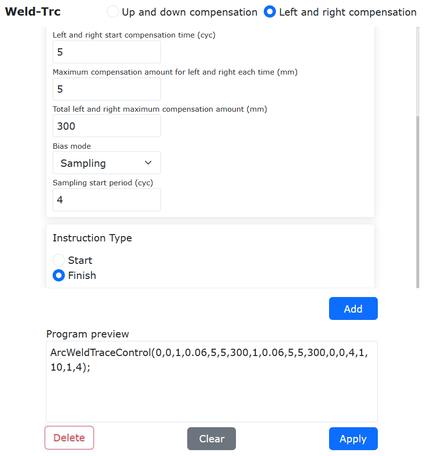

.. centered:: Schemat 9.25-4 Dodanie instrukcji zakończenia śledzenia łuku spawalniczego z przesunięciem przez próbkowanie

**Krok 3**: Po dodaniu instrukcji ruchu wahadłowego kliknij i wybierz typ instrukcji śledzenia łuku spawalniczego jako „Zakończ”, kliknij dodawanie, aby wygenerować odpowiednią instrukcję LUA.

Śledzenie łuku spawalniczego z przesunięciem procentowym
++++++++++++++++++++++++++++++++++++++++++++++++++++++++

Przesunięcie procentowe polega na zastosowaniu procentowego wzmocnienia do próbkowanego prądu podczas procesu śledzenia łuku spawalniczego, co powoduje odchylenie prądu w lewym i prawym cyklu wahadła. Robot automatycznie kompensuje sygnał po odchyleniu.

.. note:: Należy pamiętać, że im mniejsza amplituda wahadła i im większy kąt ukosu, tym mniejsze odchylenie prądu lewo/prawo, a zatem mniejszy procent regulacji. Zaleca się dostrajanie przyrostem co 1%.

Procedura ustawiania instrukcji przesunięcia procentowego jest następująca:

.. centered:: Schemat 9.25-5 Kliknięcie przycisku instrukcji śledzenia łuku spawalniczego

**Krok 1**: Kliknij „Program nauczania”, „Programowanie”, wybierz i kliknij przycisk „Śledzenie łuku spawalniczego” w kategorii „Instrukcje spawania”, aby przejść do strony konfiguracji instrukcji śledzenia łuku spawalniczego.

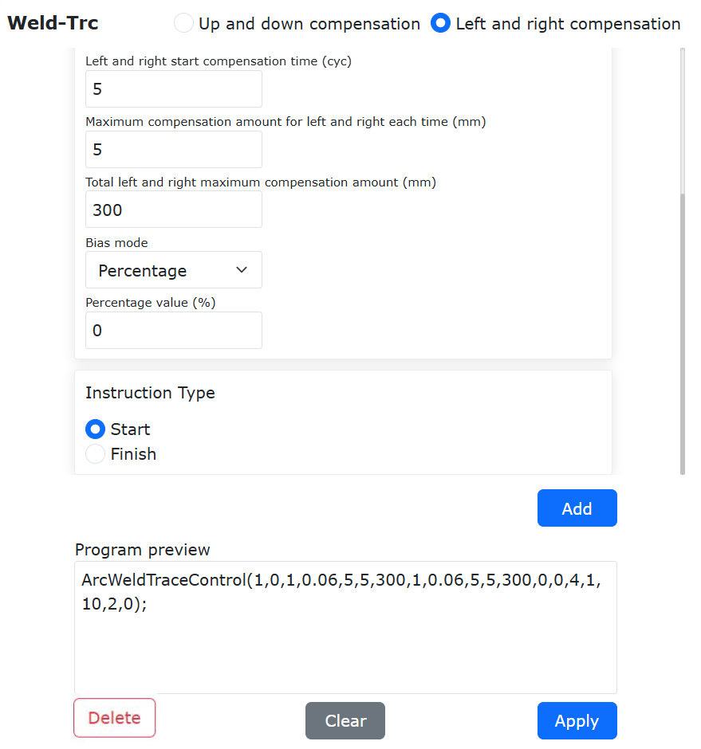

.. centered:: Schemat 9.25-6 Strona konfiguracji śledzenia łuku spawalniczego z przesunięciem przez próbkowanie

**Krok 2**: Śledzenie łuku spawalniczego z przesunięciem działa na kompensacji lewo/prawo. Kliknij podstronę „Kompensacja lewo/prawo”, w polu „Sposób przesunięcia” wybierz z listy rozwijanej „Procent”. Ustaw wartość procentową (wartość dodatnia wzmacnia prąd w pierwszej połowie cyklu i kompensuje w kierunku drugiej połowy cyklu, wartość ujemna działa odwrotnie). Wybierz typ instrukcji jako „Rozpocznij”, kliknij przycisk dodawania, aby wygenerować instrukcję LUA.

.. image:: coding/303.png
   :width: 6in
   :align: center

.. centered:: Schemat 9.25-7 Dodanie instrukcji zakończenia śledzenia łuku spawalniczego z przesunięciem procentowym

**Krok 3**: Po dodaniu instrukcji ruchu wahadłowego kliknij i wybierz typ instrukcji śledzenia łuku spawalniczego jako „Zakończ”, kliknij dodawanie, aby wygenerować odpowiednią instrukcję LUA.

Typowa struktura programu LUA dla śledzenia z przesunięciem jest następująca:

.. image:: coding/304.png
   :width: 6in
   :align: center

.. centered:: Schemat 9.25-8 Typowy program LUA śledzenia łuku spawalniczego z przesunięciem

Funkcja niestandardowego progu wykrywania kolizji
~~~~~~~~~~~~~~~~~~~~~~~~~~~~~~~~~~~~~~~~~~~~~~~~~

Przegląd
++++++++

Funkcja niestandardowego progu wykrywania kolizji jest uzupełnieniem obecnej funkcji ręcznego ustawiania poziomu kolizji. Jeśli obecne ustawienie poziomu kolizji nie spełnia wymagań scenariusza użycia, użytkownik może ustawić niestandardowy próg wykrywania kolizji zgodnie z rzeczywistą sytuacją. Próg wykrywania kolizji dzieli się na próg wykrywania dla stawów i próg wykrywania dla TCP.

Opis ustawiania funkcji
+++++++++++++++++++++++

**Krok 1**: Kliknij „Program nauczania”, wybierz „Programowanie”, aby otworzyć odpowiedni interfejs.

**Krok 2**: Kliknij przycisk „Nowy” u góry, wprowadź „example”, wybierz „empty.lua”, aby utworzyć nowy skrypt lua, jak pokazano na rysunku.

.. image:: coding/305.png
   :width: 3in
   :align: center

.. centered:: Schemat 9.26-1 Nowy skrypt lua

Opis ustawiania funkcji progu wykrywania dla stawów
***************************************************

Opis ustawiania parametrów
""""""""""""""""""""""""""

**Krok 1**: W interfejsie instrukcji sterowania wybierz funkcję „Wykrywanie kolizji”, jak pokazano na rysunku 2. Kliknij „Włącz wykrywanie kolizji”. W polu stanu wykrywania wybierz „Tylko stawy”. Zgodnie z rzeczywistymi potrzebami zmodyfikuj wartości wejściowe dla J1-J6. Zakres wartości to, jednostka Nm. W tym trybie modyfikacja progów TCP w kierunkach X-RZ nie ma wpływu. Zgodnie z potrzebami wybierz „Nie blokuj” lub „Blokuj” dla opcji blokowania. Kliknij przycisk dodawania, dodawanie instrukcji włączającej zostało zakończone.

**Krok 2**: Kliknij „Wyłącz wykrywanie kolizji”, kliknij przycisk dodawania, dodawanie instrukcji wyłączającej zostało zakończone. Interfejs podglądu programu pokazano na rysunku 3. Kliknij przycisk „Zastosuj”, aby zakończyć dodawanie funkcji.

.. note:: Funkcja niestandardowego progu wykrywania kolizji to zestaw instrukcji. Po włączeniu należy ją niezwłocznie wyłączyć.

**Krok 3**: W funkcji wykrywania kolizji dodaj odpowiednie instrukcje ruchu, jak pokazano na rysunku 4.

.. image:: coding/306.png
   :width: 6in
   :align: center

.. centered:: Schemat 9.26-2 Interfejs ustawiania progu wykrywania dla stawów

.. image:: coding/307.png
   :width: 6in
   :align: center

.. centered:: Schemat 9.26-3 Interfejs podglądu programu

.. image:: coding/308.png
   :width: 6in
   :align: center

.. centered:: Schemat 9.26-4 Przykład interfejsu programu skryptu lua

Opis ustawiania funkcji progu wykrywania dla TCP
************************************************

Opis ustawiania parametrów
""""""""""""""""""""""""""

**Krok 1**: W interfejsie instrukcji sterowania wybierz funkcję „Wykrywanie kolizji”, jak pokazano na rysunku 5. Kliknij „Włącz wykrywanie kolizji”. W polu stanu wykrywania wybierz „Tylko TCP”. Zgodnie z rzeczywistymi potrzebami zmodyfikuj wartości wejściowe dla kierunków X-RZ. Zakres wartości to, jednostka N. W tym trybie modyfikacja progów stawów J1-J6 nie ma wpływu. Zgodnie z potrzebami wybierz „Nie blokuj” lub „Blokuj” dla opcji blokowania. Kliknij przycisk dodawania, dodawanie instrukcji włączającej zostało zakończone.

**Krok 2**: Kliknij „Wyłącz wykrywanie kolizji”, kliknij przycisk dodawania, dodawanie instrukcji wyłączającej zostało zakończone. Interfejs podglądu programu pokazano na rysunku 6. Kliknij przycisk „Zastosuj”, aby zakończyć dodawanie funkcji.

.. note:: Funkcja niestandardowego progu wykrywania kolizji to zestaw instrukcji. Po włączeniu należy ją niezwłocznie wyłączyć.

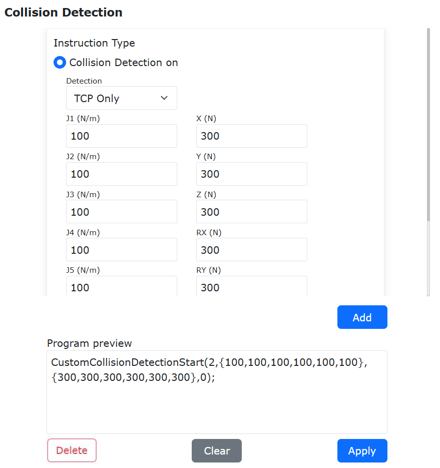

.. centered:: Schemat 9.26-5 Interfejs ustawiania progu wykrywania dla TCP

.. image:: coding/310.png
   :width: 6in
   :align: center

.. centered:: Schemat 9.26-6 Interfejs podglądu programu

**Krok 3**: W funkcji wykrywania kolizji dodaj odpowiednie instrukcje ruchu, jak pokazano na rysunku 7.

.. image:: coding/311.png
   :width: 6in
   :align: center

.. centered:: Schemat 9.26-7 Przykład interfejsu programu skryptu lua

Opis ustawiania funkcji łączonych progów dla stawów i TCP
*********************************************************

Opis ustawiania parametrów
""""""""""""""""""""""""""

**Krok 1**: W interfejsie instrukcji sterowania wybierz funkcję „Wykrywanie kolizji”, jak pokazano na rysunku 8. Kliknij „Włącz wykrywanie kolizji”. W polu stanu wykrywania wybierz „Stawy i TCP”. Zgodnie z rzeczywistymi potrzebami zmodyfikuj wartości wejściowe dla J1-J6 i kierunków X-RZ. Zakres wartości dla J1-J6 to, jednostka Nm; wartości wejściowe dla kierunków X-RZ to, jednostka N. Zgodnie z potrzebami wybierz „Nie blokuj” lub „Blokuj” dla opcji blokowania. Kliknij przycisk dodawania, dodawanie instrukcji włączającej zostało zakończone.

.. image:: coding/312.png
   :width: 6in
   :align: center

.. centered:: Schemat 9.26-8 Interfejs ustawiania progu wykrywania dla stawów i TCP

**Krok 2**: Kliknij „Wyłącz wykrywanie kolizji”, kliknij przycisk dodawania, dodawanie instrukcji wyłączającej zostało zakończone. Interfejs podglądu programu pokazano na rysunku 9. Kliknij przycisk „Zastosuj”, aby zakończyć dodawanie funkcji.

.. note:: Funkcja niestandardowego progu wykrywania kolizji to zestaw instrukcji. Po włączeniu należy ją niezwłocznie wyłączyć.

.. image:: coding/313.png
   :width: 6in
   :align: center

.. centered:: Schemat 9.26-9 Interfejs podglądu programu

**Krok 3**: W funkcji wykrywania kolizji dodaj odpowiednie instrukcje ruchu, jak pokazano na rysunku 10.

.. image:: coding/314.png
   :width: 4in
   :align: center

.. centered:: Schemat 9.26-10 Przykład interfejsu programu skryptu lua

Zalecane ustawienia progów wykrywania
**************************************

Próg wykrywania dla stawów
""""""""""""""""""""""""""

Zalecany próg wykrywania dla stawów odpowiada ustawieniu poziomu kolizji na 10. Im większa wartość, tym mniej czułe wykrywanie kolizji. Zakres wartości to, jednostka Nm. Dane w tabeli są tylko przykładowe. Rzeczywiste wartości należy dostosować do prędkości robota i obciążenia.

.. centered:: Tabela 9.26-1 Zalecany próg dla stawów

.. list-table::
   :widths: 30 20 20 20 20 20 20
   :header-rows: 0
   :class: sheet-center
   :align: center

   * - **Typ robota**
     - **J1**
     - **J2**
     - **J3**
     - **J4**
     - **J5**
     - **J6**

   * - **FR3**
     - 0,4					
     - 0,7
     - 0,6 
     - 0,3 
     - 0,3 
     - 0,3 

   * - **FR3-WMS**
     - 0,4					
     - 0,7
     - 0,6 
     - 0,3 
     - 0,3 
     - 0,3 

   * - **FR3-WML**
     - 0,4					
     - 0,7
     - 0,6 
     - 0,3 
     - 0,3 
     - 0,3 

   * - **FR3-C**
     - 0,4					
     - 0,7
     - 0,6 
     - 0,3 
     - 0,3 
     - 0,3 

   * - **FR5**
     - 0,6					
     - 1
     - 0,8 
     - 0,3 
     - 0,3 
     - 0,3 

   * - **FR10**
     - 2,5					
     - 3,6
     - 0,8 
     - 0,6 
     - 0,6 
     - 0,6  

   * - **FR16**
     - 2,5					
     - 3,6
     - 0,8 
     - 0,6 
     - 0,6 
     - 0,6 

   * - **FR20**
     - 5					
     - 8
     - 4,5
     - 0,9 
     - 0,9
     - 0,9 

   * - **FR30**
     - 5					
     - 8
     - 4,5
     - 0,9 
     - 0,9
     - 0,9 

Próg wykrywania dla TCP
"""""""""""""""""""""""

Im większa wartość progu wykrywania dla TCP, tym mniej czułe wykrywanie kolizji. Zakres wartości to, jednostka N. Dane w tabeli są tylko przykładowe. Rzeczywiste wartości należy dostosować do prędkości robota i obciążenia.

.. centered:: Tabela 9.26-2 Próg wykrywania dla TCP

.. list-table::
   :widths: 30 20 20 20 20 20 20
   :header-rows: 0
   :class: sheet-center
   :align: center

   * - **Typ robota**
     - **X**
     - **Y**
     - **Z**
     - **RX**
     - **RY**
     - **RZ**

   * - **FR3**
     - 300					
     - 300
     - 300
     - 20 
     - 20
     - 20

   * - **FR3-WMS**
     - 300					
     - 300
     - 300
     - 20 
     - 20
     - 20

   * - **FR3-WML**
     - 300					
     - 300
     - 300
     - 20 
     - 20
     - 20

   * - **FR3-C**
     - 300					
     - 300
     - 300
     - 20 
     - 20
     - 20

   * - **FR5**
     - 300					
     - 300
     - 300
     - 20 
     - 20
     - 20

   * - **FR10**
     - 500					
     - 500
     - 500
     - 35 
     - 35
     - 35 

   * - **FR16**
     - 500					
     - 500
     - 500
     - 35 
     - 35
     - 35 

   * - **FR20**
     - 800					
     - 800
     - 800
     - 60 
     - 60
     - 60 

   * - **FR30**
     - 800					
     - 800
     - 800
     - 60 
     - 60
     - 60 

Optymalizacja charakterystyki prędkości w kształcie litery T + funkcja wygładzania blending
~~~~~~~~~~~~~~~~~~~~~~~~~~~~~~~~~~~~~~~~~~~~~~~~~~~~~~~~~~~~~~~~~~~~~~~~~~~~~~~~~~~~~~~~~~~~~

Przegląd
++++++++

Wygładzanie blending między dwoma segmentami trajektorii pozwala uniknąć częstego zatrzymywania i uruchamiania związanego z całkowitym zatrzymaniem, zwiększając tym samym wydajność ruchu robota. Funkcja ta jest przeznaczona głównie do wygładzania blending między instrukcjami PTP, LIN, ARC i CIRCLE. Można to osiągnąć na dwa sposoby: za pomocą instrukcji Lua lub za pomocą przełącznika konfiguracji ruchu.

Procedura operacyjna
++++++++++++++++++++

Wygładzanie blending PTP-PTP
****************************

Użycie instrukcji Lua
"""""""""""""""""""""

**Krok 1**: Wybierz punkty nauczania do wykonania funkcji PTP-PTP. W podręczniku jako nazwy punktów nauczania użyto „A0” do „A5”.

**Krok 2**: Kliknij przyciski „Program nauczania” -> „Programowanie”, wybierz instrukcję „Punkt-punkt” z „Instrukcji ruchu”. W „Edycji instrukcji” wybierz punkt nauczania i ustaw prędkość testową. W ochronie ruchu wybierz „Tryb wygładzania przyspieszenia”. Dla punktów wymagających wygładzenia ustaw parametr „Płynne przejście”.

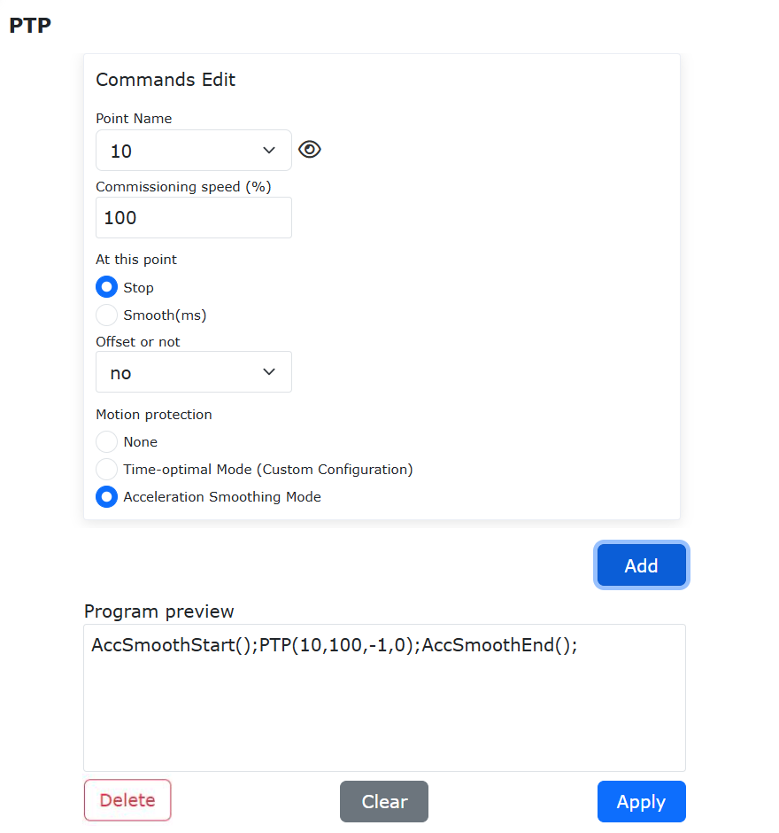

.. centered:: Schemat 9.27-1 Ustawienie instrukcji wygładzania blending dla instrukcji PTP z wygładzaniem przyspieszenia

**Krok 3**: Dodaj wiele instrukcji PTP, wygeneruj program Lua i uruchom go, aby zrealizować funkcję wygładzania blending PTP-PTP. Ten sposób używa zoptymalizowanego ruchu prędkości w kształcie litery T tylko dla instrukcji między AccSmoothStart() i AccSmoothEnd(), a dla pozostałych instrukcji używa oryginalnego ruchu prędkości w kształcie litery T.

.. image:: coding/316.png
   :width: 4in
   :align: center

.. centered:: Schemat 9.27-2 Typowy program wygładzania blending PTP-PTP za pomocą instrukcji Lua

Użycie przełącznika konfiguracji ruchu
""""""""""""""""""""""""""""""""""""""

**Krok 1**: Kliknij „Ustawienia początkowe” -> „Bezpieczeństwo” -> przycisk „Konfiguracja ruchu”, aby włączyć przełącznik „Tryb wygładzania przyspieszenia”.

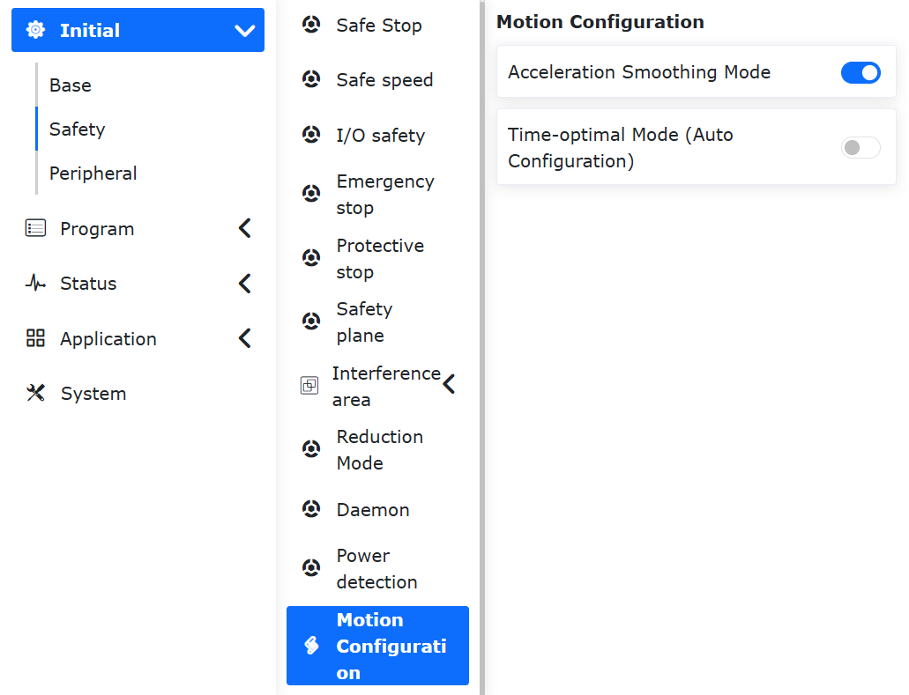

.. centered:: Schemat 9.27-3 Ustawienie przełącznika konfiguracji trybu wygładzania przyspieszenia

**Krok 2**: Wybierz punkty nauczania do wykonania funkcji PTP-PTP. W podręczniku jako nazwy punktów nauczania użyto „A0” do „A5”.

**Krok 3**: Kliknij przyciski „Program nauczania” -> „Programowanie”, wybierz instrukcję „Punkt-punkt” z „Instrukcji ruchu”. W „Edycji instrukcji” wybierz punkt nauczania i ustaw prędkość testową. W ochronie ruchu wybierz „Brak”. Dla punktów wymagających wygładzenia ustaw parametr „Płynne przejście”.

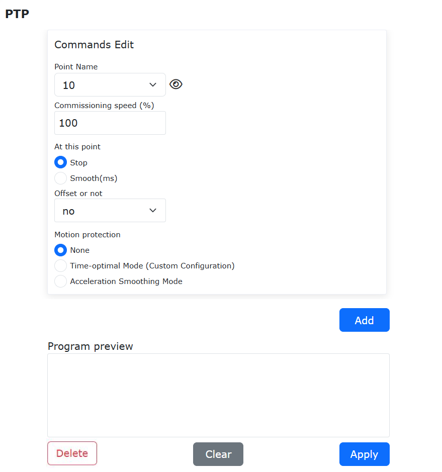

.. centered:: Schemat 9.27-4 Ustawienie instrukcji wygładzania blending dla zwykłej instrukcji PTP

**Krok 4**: Dodaj wiele instrukcji PTP, wygeneruj program Lua i uruchom go, aby zrealizować funkcję wygładzania blending PTP-PTP. Typowy program jest taki sam jak dla zwykłego programu PTP-PTP. Ten sposób używa zoptymalizowanego ruchu prędkości w kształcie litery T dla wszystkich instrukcji.

.. image:: coding/319.png
   :width: 4in
   :align: center

.. centered:: Schemat 9.27-5 Typowy program wygładzania blending PTP-PTP za pomocą przełącznika konfiguracji

Wygładzanie blending PTP-LIN
****************************

Użycie instrukcji Lua
"""""""""""""""""""""

**Krok 1**: Wybierz punkty nauczania do wykonania funkcji PTP-LIN. W podręczniku jako nazwy punktów nauczania użyto „A0” do „A5”.

**Krok 2**: Kliknij przyciski „Program nauczania” -> „Programowanie”, wybierz instrukcję „Punkt-punkt” z „Instrukcji ruchu”. W „Edycji instrukcji” wybierz punkt nauczania i ustaw prędkość testową. W ochronie ruchu wybierz „Tryb wygładzania przyspieszenia”. Dla punktów wymagających wygładzenia ustaw parametr „Płynne przejście”.

.. centered:: Schemat 9.27-6 Ustawienie instrukcji wygładzania blending dla instrukcji PTP z wygładzaniem przyspieszenia

**Krok 3**: Dodaj wiele instrukcji PTP i LIN, wygeneruj program Lua i uruchom go, aby zrealizować funkcję wygładzania blending PTP-LIN. Ten sposób używa zoptymalizowanego ruchu prędkości w kształcie litery T tylko dla instrukcji między AccSmoothStart() i AccSmoothEnd(), a dla pozostałych instrukcji używa oryginalnego ruchu prędkości w kształcie litery T.

.. image:: coding/415.png
   :width: 4in
   :align: center

.. centered:: Schemat 9.27-7 Typowy program wygładzania blending PTP-LIN za pomocą instrukcji Lua

Użycie przełącznika konfiguracji ruchu
""""""""""""""""""""""""""""""""""""""

**Krok 1**: Kliknij „Ustawienia początkowe” -> „Bezpieczeństwo” -> przycisk „Konfiguracja ruchu”, aby włączyć przełącznik „Tryb wygładzania przyspieszenia”.

.. centered:: Schemat 9.27-8 Ustawienie przełącznika konfiguracji trybu wygładzania przyspieszenia

**Krok 2**: Wybierz punkty nauczania do wykonania funkcji PTP-LIN. W podręczniku jako nazwy punktów nauczania użyto „A0” do „A5”.

**Krok 3**: Kliknij przyciski „Program nauczania” -> „Programowanie”, wybierz instrukcję „Punkt-punkt” z „Instrukcji ruchu”. W „Edycji instrukcji” wybierz punkt nauczania i ustaw prędkość testową. W ochronie ruchu wybierz „Brak”. Dla punktów wymagających wygładzenia ustaw parametr „Płynne przejście”.

.. centered:: Schemat 9.27-9 Ustawienie instrukcji wygładzania blending dla zwykłej instrukcji PTP

**Krok 4**: Dodaj wiele instrukcji PTP i LIN, wygeneruj program Lua i uruchom go, aby zrealizować funkcję wygładzania blending PTP-LIN. Typowy program jest taki sam jak dla zwykłego programu PTP-LIN. Ten sposób używa zoptymalizowanego ruchu prędkości w kształcie litery T dla wszystkich instrukcji.

.. image:: coding/397.png
   :width: 4in
   :align: center

.. centered:: Schemat 9.27-10 Typowy program wygładzania blending PTP-LIN za pomocą przełącznika konfiguracji

Wygładzanie blending PTP-ARC
****************************

Użycie instrukcji Lua
"""""""""""""""""""""

**Krok 1**: Wybierz punkty nauczania do wykonania funkcji PTP-ARC. W podręczniku jako nazwy punktów nauczania użyto „A0” do „A8”.

**Krok 2**: Kliknij przyciski „Program nauczania” -> „Programowanie”, wybierz instrukcję „Punkt-punkt” z „Instrukcji ruchu”. W „Edycji instrukcji” wybierz punkt nauczania i ustaw prędkość testową. W ochronie ruchu wybierz „Tryb wygładzania przyspieszenia”. Dla punktów wymagających wygładzenia ustaw parametr „Płynne przejście”.

.. centered:: Schemat 9.27-11 Ustawienie instrukcji wygładzania blending dla instrukcji PTP z wygładzaniem przyspieszenia

**Krok 3**: Dodaj wiele instrukcji PTP i ARC, wygeneruj program Lua i uruchom go, aby zrealizować funkcję wygładzania blending PTP-ARC. Ten sposób używa zoptymalizowanego ruchu prędkości w kształcie litery T tylko dla instrukcji między AccSmoothStart() i AccSmoothEnd(), a dla pozostałych instrukcji używa oryginalnego ruchu prędkości w kształcie litery T.

.. image:: coding/398.png
   :width: 4in
   :align: center

.. centered:: Schemat 9.27-12 Typowy program wygładzania blending PTP-ARC za pomocą instrukcji Lua

Użycie przełącznika konfiguracji ruchu
""""""""""""""""""""""""""""""""""""""

**Krok 1**: Kliknij „Ustawienia początkowe” -> „Bezpieczeństwo” -> przycisk „Konfiguracja ruchu”, aby włączyć przełącznik „Tryb wygładzania przyspieszenia”.

.. centered:: Schemat 9.27-13 Ustawienie przełącznika konfiguracji trybu wygładzania przyspieszenia

**Krok 2**: Wybierz punkty nauczania do wykonania funkcji PTP-ARC. W podręczniku jako nazwy punktów nauczania użyto „A0” do „A8”.

**Krok 3**: Kliknij przyciski „Program nauczania” -> „Programowanie”, wybierz instrukcję „Punkt-punkt” z „Instrukcji ruchu”. W „Edycji instrukcji” wybierz punkt nauczania i ustaw prędkość testową. W ochronie ruchu wybierz „Brak”. Dla punktów wymagających wygładzenia ustaw parametr „Płynne przejście”.

.. centered:: Schemat 9.27-14 Ustawienie instrukcji wygładzania blending dla zwykłej instrukcji PTP

**Krok 4**: Dodaj wiele instrukcji PTP i ARC, wygeneruj program Lua i uruchom go, aby zrealizować funkcję wygładzania blending PTP-ARC. Typowy program jest taki sam jak dla zwykłego programu PTP-ARC. Ten sposób używa zoptymalizowanego ruchu prędkości w kształcie litery T dla wszystkich instrukcji.

.. image:: coding/399.png
   :width: 4in
   :align: center

.. centered:: Schemat 9.27-15 Typowy program wygładzania blending PTP-ARC za pomocą przełącznika konfiguracji

Wygładzanie blending PTP-CIRCLE
*******************************

Użycie instrukcji Lua
"""""""""""""""""""""

**Krok 1**: Wybierz punkty nauczania do wykonania funkcji PTP-CIRCLE. W podręczniku jako nazwy punktów nauczania użyto „A0” do „A8”.

**Krok 2**: Kliknij przyciski „Program nauczania” -> „Programowanie”, wybierz instrukcję „Punkt-punkt” z „Instrukcji ruchu”. W „Edycji instrukcji” wybierz punkt nauczania i ustaw prędkość testową. W ochronie ruchu wybierz „Tryb wygładzania przyspieszenia”. Dla punktów wymagających wygładzenia ustaw parametr „Płynne przejście”.

.. centered:: Schemat 9.27-16 Ustawienie instrukcji wygładzania blending dla instrukcji PTP z wygładzaniem przyspieszenia

**Krok 3**: Dodaj wiele instrukcji PTP i CIRCLE, wygeneruj program Lua i uruchom go, aby zrealizować funkcję wygładzania blending PTP-CIRCLE. Ten sposób używa zoptymalizowanego ruchu prędkości w kształcie litery T tylko dla instrukcji między AccSmoothStart() i AccSmoothEnd(), a dla pozostałych instrukcji używa oryginalnego ruchu prędkości w kształcie litery T.

.. image:: coding/400.png
   :width: 4in
   :align: center

.. centered:: Schemat 9.27-17 Typowy program wygładzania blending PTP-CIRCLE za pomocą instrukcji Lua

Użycie przełącznika konfiguracji ruchu
""""""""""""""""""""""""""""""""""""""

**Krok 1**: Kliknij „Ustawienia początkowe” -> „Bezpieczeństwo” -> przycisk „Konfiguracja ruchu”, aby włączyć przełącznik „Tryb wygładzania przyspieszenia”.

.. centered:: Schemat 9.27-18 Ustawienie przełącznika konfiguracji trybu wygładzania przyspieszenia

**Krok 2**: Wybierz punkty nauczania do wykonania funkcji PTP-CIRCLE. W podręczniku jako nazwy punktów nauczania użyto „A0” do „A8”.

**Krok 3**: Kliknij przyciski „Program nauczania” -> „Programowanie”, wybierz instrukcję „Punkt-punkt” z „Instrukcji ruchu”. W „Edycji instrukcji” wybierz punkt nauczania i ustaw prędkość testową. W ochronie ruchu wybierz „Brak”. Dla punktów wymagających wygładzenia ustaw parametr „Płynne przejście”.

.. centered:: Schemat 9.27-19 Ustawienie instrukcji wygładzania blending dla zwykłej instrukcji PTP

**Krok 4**: Dodaj wiele instrukcji PTP i CIRCLE, wygeneruj program Lua i uruchom go, aby zrealizować funkcję wygładzania blending PTP-CIRCLE. Typowy program jest taki sam jak dla zwykłego programu PTP-CIRCLE. Ten sposób używa zoptymalizowanego ruchu prędkości w kształcie litery T dla wszystkich instrukcji.

.. image:: coding/401.png
   :width: 4in
   :align: center

.. centered:: Schemat 9.27-20 Typowy program wygładzania blending PTP-CIRCLE za pomocą przełącznika konfiguracji

Wygładzanie blending LIN-PTP
****************************

Użycie instrukcji Lua
"""""""""""""""""""""

**Krok 1**: Wybierz punkty nauczania do wykonania funkcji LIN-PTP. W podręczniku jako nazwy punktów nauczania użyto „A0” do „A5”.

**Krok 2**: Kliknij przyciski „Program nauczania” -> „Programowanie”, wybierz instrukcję „Linia” z „Instrukcji ruchu”. W „Edycji instrukcji” wybierz punkt nauczania i ustaw prędkość testową. W ochronie ruchu wybierz „Tryb wygładzania przyspieszenia”. Dla punktów wymagających wygładzenia ustaw parametry „Promień przejścia” i „Sposób przejścia”. Sposób przejścia może być „Przejście narożne” lub „Przejście styczne wewnętrznie”.

.. image:: coding/402.png
   :width: 6in
   :align: center

.. centered:: Schemat 9.27-21 Ustawienie instrukcji wygładzania blending dla instrukcji PTP z wygładzaniem przyspieszenia

**Krok 3**: Dodaj wiele instrukcji LIN i PTP, wygeneruj program Lua i uruchom go, aby zrealizować funkcję wygładzania blending LIN-PTP. Ten sposób używa zoptymalizowanego ruchu prędkości w kształcie litery T tylko dla instrukcji między AccSmoothStart() i AccSmoothEnd(), a dla pozostałych instrukcji używa oryginalnego ruchu prędkości w kształcie litery T.

.. image:: coding/403.png
   :width: 4in
   :align: center

.. centered:: Schemat 9.27-22 Typowy program wygładzania blending LIN-PTP za pomocą instrukcji Lua

Użycie przełącznika konfiguracji ruchu
""""""""""""""""""""""""""""""""""""""

**Krok 1**: Kliknij „Ustawienia początkowe” -> „Bezpieczeństwo” -> przycisk „Konfiguracja ruchu”, aby włączyć przełącznik „Tryb wygładzania przyspieszenia”.

.. centered:: Schemat 9.27-23 Ustawienie przełącznika konfiguracji trybu wygładzania przyspieszenia

**Krok 2**: Wybierz punkty nauczania do wykonania funkcji LIN-PTP. W podręczniku jako nazwy punktów nauczania użyto „A0” do „A5”.

**Krok 3**: Kliknij przyciski „Program nauczania” -> „Programowanie”, wybierz instrukcję „Linia” z „Instrukcji ruchu”. W „Edycji instrukcji” wybierz punkt nauczania i ustaw prędkość testową. W ochronie ruchu wybierz „Brak”. Dla punktów wymagających wygładzenia ustaw parametry „Promień przejścia” i „Sposób przejścia”. Sposób przejścia może być „Przejście narożne” lub „Przejście styczne wewnętrznie”.

.. image:: coding/404.png
   :width: 6in
   :align: center

.. centered:: Schemat 9.27-24 Ustawienie instrukcji wygładzania blending dla zwykłej instrukcji LIN

**Krok 4**: Wygeneruj program Lua i uruchom go, aby zrealizować funkcję wygładzania blending LIN-PTP. Typowy program jest taki sam jak dla zwykłego programu LIN-PTP. Ten sposób używa zoptymalizowanego ruchu prędkości w kształcie litery T dla wszystkich instrukcji.

.. image:: coding/405.png
   :width: 4in
   :align: center

.. centered:: Schemat 9.27-25 Typowy program wygładzania blending LIN-PTP za pomocą przełącznika konfiguracji

Wygładzanie blending LIN-LIN
****************************

Użycie instrukcji Lua
"""""""""""""""""""""

**Krok 1**: Wybierz punkty nauczania do wykonania funkcji LIN-LIN. W podręczniku jako nazwy punktów nauczania użyto „A0” do „A5”.

**Krok 2**: Kliknij przyciski „Program nauczania” -> „Programowanie”, wybierz instrukcję „Linia” z „Instrukcji ruchu”. W „Edycji instrukcji” wybierz punkt nauczania i ustaw prędkość testową. W ochronie ruchu wybierz „Tryb wygładzania przyspieszenia”. Dla punktów wymagających wygładzenia ustaw parametry „Promień przejścia” i „Sposób przejścia”. Sposób przejścia może być „Przejście narożne” lub „Przejście styczne wewnętrznie”.

.. image:: coding/402.png
   :width: 6in
   :align: center

.. centered:: Schemat 9.27-26 Ustawienie instrukcji wygładzania blending dla instrukcji LIN z wygładzaniem przyspieszenia

**Krok 3**: Dodaj wiele instrukcji LIN i LIN, wygeneruj program Lua i uruchom go, aby zrealizować funkcję wygładzania blending LIN-LIN. Ten sposób używa zoptymalizowanego ruchu prędkości w kształcie litery T tylko dla instrukcji między AccSmoothStart() i AccSmoothEnd(), a dla pozostałych instrukcji używa oryginalnego ruchu prędkości w kształcie litery T.

.. image:: coding/416.png
   :width: 4in
   :align: center

.. centered:: Schemat 9.27-27 Typowy program wygładzania blending LIN-LIN za pomocą instrukcji Lua

Użycie przełącznika konfiguracji ruchu
""""""""""""""""""""""""""""""""""""""

**Krok 1**: Kliknij „Ustawienia początkowe” -> „Bezpieczeństwo” -> przycisk „Konfiguracja ruchu”, aby włączyć przełącznik „Tryb wygładzania przyspieszenia”.

.. centered:: Schemat 9.27-28 Ustawienie przełącznika konfiguracji trybu wygładzania przyspieszenia

**Krok 2**: Wybierz punkty nauczania do wykonania funkcji LIN-LIN. W podręczniku jako nazwy punktów nauczania użyto „A0” do „A5”.

**Krok 3**: Kliknij przyciski „Program nauczania” -> „Programowanie”, wybierz instrukcję „Linia” z „Instrukcji ruchu”. W „Edycji instrukcji” wybierz punkt nauczania i ustaw prędkość testową. W ochronie ruchu wybierz „Brak”. Dla punktów wymagających wygładzenia ustaw parametry „Promień przejścia” i „Sposób przejścia”. Sposób przejścia może być „Przejście narożne” lub „Przejście styczne wewnętrznie”.

.. image:: coding/404.png
   :width: 6in
   :align: center

.. centered:: Schemat 9.27-29 Ustawienie instrukcji wygładzania blending dla zwykłej instrukcji LIN

**Krok 4**: Wygeneruj program Lua i uruchom go, aby zrealizować funkcję wygładzania blending LIN-LIN. Typowy program jest taki sam jak dla zwykłego programu LIN-LIN. Ten sposób używa zoptymalizowanego ruchu prędkości w kształcie litery T dla wszystkich instrukcji.

.. image:: coding/417.png
   :width: 4in
   :align: center

.. centered:: Schemat 9.27-30 Typowy program wygładzania blending LIN-LIN za pomocą przełącznika konfiguracji

Wygładzanie blending LIN-ARC
****************************

Użycie instrukcji Lua
"""""""""""""""""""""

**Krok 1**: Wybierz punkty nauczania do wykonania funkcji LIN-ARC. W podręczniku jako nazwy punktów nauczania użyto „A0” do „A8”.

**Krok 2**: Kliknij przyciski „Program nauczania” -> „Programowanie”, wybierz instrukcję „Linia” z „Instrukcji ruchu”. W „Edycji instrukcji” wybierz punkt nauczania i ustaw prędkość testową. W ochronie ruchu wybierz „Tryb wygładzania przyspieszenia”. Dla punktów wymagających wygładzenia ustaw parametry „Promień przejścia” i „Sposób przejścia”. Sposób przejścia może być „Przejście narożne” lub „Przejście styczne wewnętrznie”.

.. image:: coding/402.png
   :width: 6in
   :align: center

.. centered:: Schemat 9.27-31 Ustawienie instrukcji wygładzania blending dla instrukcji LIN z wygładzaniem przyspieszenia

**Krok 3**: Dodaj wiele instrukcji LIN i ARC, wygeneruj program Lua i uruchom go, aby zrealizować funkcję wygładzania blending LIN-ARC. Ten sposób używa zoptymalizowanego ruchu prędkości w kształcie litery T tylko dla instrukcji między AccSmoothStart() i AccSmoothEnd(), a dla pozostałych instrukcji używa oryginalnego ruchu prędkości w kształcie litery T.

.. image:: coding/406.png
   :width: 4in
   :align: center

.. centered:: Schemat 9.27-32 Typowy program wygładzania blending LIN-ARC za pomocą instrukcji Lua

Użycie przełącznika konfiguracji ruchu
""""""""""""""""""""""""""""""""""""""

**Krok 1**: Kliknij „Ustawienia początkowe” -> „Bezpieczeństwo” -> przycisk „Konfiguracja ruchu”, aby włączyć przełącznik „Tryb wygładzania przyspieszenia”.

.. centered:: Schemat 9.27-33 Ustawienie przełącznika konfiguracji trybu wygładzania przyspieszenia

**Krok 2**: Wybierz punkty nauczania do wykonania funkcji LIN-ARC. W podręczniku jako nazwy punktów nauczania użyto „A0” do „A8”.

**Krok 3**: Kliknij przyciski „Program nauczania” -> „Programowanie”, wybierz instrukcję „Linia” z „Instrukcji ruchu”. W „Edycji instrukcji” wybierz punkt nauczania i ustaw prędkość testową. W ochronie ruchu wybierz „Brak”. Dla punktów wymagających wygładzenia ustaw parametry „Promień przejścia” i „Sposób przejścia”. Sposób przejścia może być „Przejście narożne” lub „Przejście styczne wewnętrznie”.

.. image:: coding/404.png
   :width: 6in
   :align: center

.. centered:: Schemat 9.27-34 Ustawienie instrukcji wygładzania blending dla zwykłej instrukcji LIN

**Krok 4**: Wygeneruj program Lua i uruchom go, aby zrealizować funkcję wygładzania blending LIN-LIN. Typowy program jest taki sam jak dla zwykłego programu LIN-LIN. Ten sposób używa zoptymalizowanego ruchu prędkości w kształcie litery T dla wszystkich instrukcji.

.. image:: coding/407.png
   :width: 4in
   :align: center

.. centered:: Schemat 9.27-35 Typowy program wygładzania blending LIN-ARC za pomocą przełącznika konfiguracji

Wygładzanie blending LIN-CIRCLE
*******************************

Użycie instrukcji Lua
"""""""""""""""""""""

**Krok 1**: Wybierz punkty nauczania do wykonania funkcji LIN-CIRCLE. W podręczniku jako nazwy punktów nauczania użyto „A0” do „A8”.

**Krok 2**: Kliknij przyciski „Program nauczania” -> „Programowanie”, wybierz instrukcję „Linia” z „Instrukcji ruchu”. W „Edycji instrukcji” wybierz punkt nauczania i ustaw prędkość testową. W ochronie ruchu wybierz „Tryb wygładzania przyspieszenia”. Dla punktów wymagających wygładzenia ustaw parametry „Promień przejścia” i „Sposób przejścia”. Sposób przejścia może być „Przejście narożne” lub „Przejście styczne wewnętrznie”.

.. image:: coding/402.png
   :width: 6in
   :align: center

.. centered:: Schemat 9.27-36 Ustawienie instrukcji wygładzania blending dla instrukcji LIN z wygładzaniem przyspieszenia

**Krok 3**: Dodaj wiele instrukcji LIN i CIRCLE, wygeneruj program Lua i uruchom go, aby zrealizować funkcję wygładzania blending LIN-CIRCLE. Ten sposób używa zoptymalizowanego ruchu prędkości w kształcie litery T tylko dla instrukcji między AccSmoothStart() i AccSmoothEnd(), a dla pozostałych instrukcji używa oryginalnego ruchu prędkości w kształcie litery T.

.. image:: coding/408.png
   :width: 4in
   :align: center

.. centered:: Schemat 9.27-37 Typowy program wygładzania blending LIN-CIRCLE za pomocą instrukcji Lua

Użycie przełącznika konfiguracji ruchu
""""""""""""""""""""""""""""""""""""""

**Krok 1**: Kliknij „Ustawienia początkowe” -> „Bezpieczeństwo” -> przycisk „Konfiguracja ruchu”, aby włączyć przełącznik „Tryb wygładzania przyspieszenia”.

.. centered:: Schemat 9.27-38 Ustawienie przełącznika konfiguracji trybu wygładzania przyspieszenia

**Krok 2**: Wybierz punkty nauczania do wykonania funkcji LIN-CIRCLE. W podręczniku jako nazwy punktów nauczania użyto „A0” do „A8”.

**Krok 3**: Kliknij przyciski „Program nauczania” -> „Programowanie”, wybierz instrukcję „Linia” z „Instrukcji ruchu”. W „Edycji instrukcji” wybierz punkt nauczania i ustaw prędkość testową. W ochronie ruchu wybierz „Brak”. Dla punktów wymagających wygładzenia ustaw parametry „Promień przejścia” i „Sposób przejścia”. Sposób przejścia może być „Przejście narożne” lub „Przejście styczne wewnętrznie”.

.. image:: coding/404.png
   :width: 6in
   :align: center

.. centered:: Schemat 9.27-39 Ustawienie instrukcji wygładzania blending dla zwykłej instrukcji LIN

**Krok 4**: Dodaj wiele instrukcji LIN i CIRCLE, wygeneruj program Lua i uruchom go, aby zrealizować funkcję wygładzania blending LIN-CIRCLE. Typowy program jest taki sam jak dla zwykłego programu LIN-ARC. Ten sposób używa zoptymalizowanego ruchu prędkości w kształcie litery T dla wszystkich instrukcji.

.. image:: coding/409.png
   :width: 4in
   :align: center

.. centered:: Schemat 9.27-40 Typowy program wygładzania blending LIN-CIRCLE za pomocą przełącznika konfiguracji

Wygładzanie blending ARC-PTP
****************************

Użycie instrukcji Lua
"""""""""""""""""""""

**Krok 1**: Wybierz punkty nauczania do wykonania funkcji ARC-PTP. W podręczniku jako nazwy punktów nauczania użyto „A0” do „A9”.

**Krok 2**: Kliknij przyciski „Program nauczania” -> „Programowanie”, wybierz instrukcję „Łuk” z „Instrukcji ruchu”. W „Edycji instrukcji” wybierz punkt nauczania i ustaw prędkość testową. W ochronie ruchu wybierz „Tryb wygładzania przyspieszenia”. Dla punktów wymagających wygładzenia ustaw parametr „Płynne przejście”.

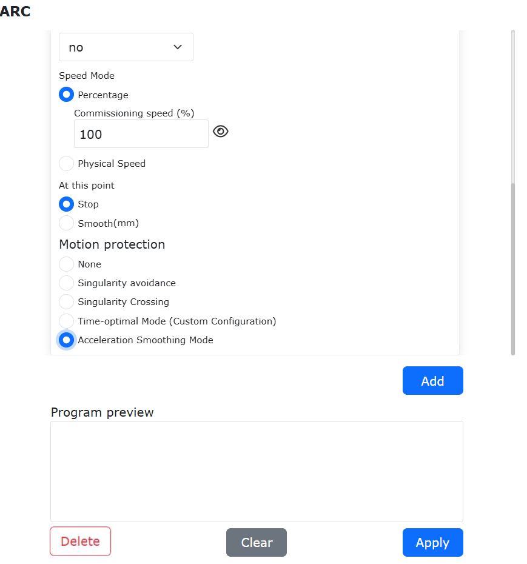

.. centered:: Schemat 9.27-41 Ustawienie instrukcji wygładzania blending dla instrukcji ARC z wygładzaniem przyspieszenia

**Krok 3**: Dodaj wiele instrukcji ARC i PTP, wygeneruj program Lua i uruchom go, aby zrealizować funkcję wygładzania blending ARC-PTP. Ten sposób używa zoptymalizowanego ruchu prędkości w kształcie litery T tylko dla instrukcji między AccSmoothStart() i AccSmoothEnd(), a dla pozostałych instrukcji używa oryginalnego ruchu prędkości w kształcie litery T.

.. image:: coding/411.png
   :width: 4in
   :align: center

.. centered:: Schemat 9.27-42 Typowy program wygładzania blending ARC-PTP za pomocą instrukcji Lua

Użycie przełącznika konfiguracji ruchu
""""""""""""""""""""""""""""""""""""""

**Krok 1**: Kliknij „Ustawienia początkowe” -> „Bezpieczeństwo” -> przycisk „Konfiguracja ruchu”, aby włączyć przełącznik „Tryb wygładzania przyspieszenia”.

.. centered:: Schemat 9.27-43 Ustawienie przełącznika konfiguracji trybu wygładzania przyspieszenia

**Krok 2**: Wybierz punkty nauczania do wykonania funkcji ARC-PTP. W podręczniku jako nazwy punktów nauczania użyto „A0” do „A9”.

**Krok 3**: Kliknij przyciski „Program nauczania” -> „Programowanie”, wybierz instrukcję „Łuk” z „Instrukcji ruchu”. W „Edycji instrukcji” wybierz punkt nauczania i ustaw prędkość testową. W ochronie ruchu wybierz „Brak”. Dla punktów wymagających wygładzenia ustaw parametr „Płynne przejście”.

.. image:: coding/418.png
   :width: 6in
   :align: center

.. centered:: Schemat 9.27-44 Ustawienie instrukcji wygładzania blending dla zwykłej instrukcji ARC

**Krok 4**: Dodaj wiele instrukcji ARC i PTP, wygeneruj program Lua i uruchom go, aby zrealizować funkcję wygładzania blending ARC-PTP. Typowy program jest taki sam jak dla zwykłego programu ARC-PTP. Ten sposób używa zoptymalizowanego ruchu prędkości w kształcie litery T dla wszystkich instrukcji.

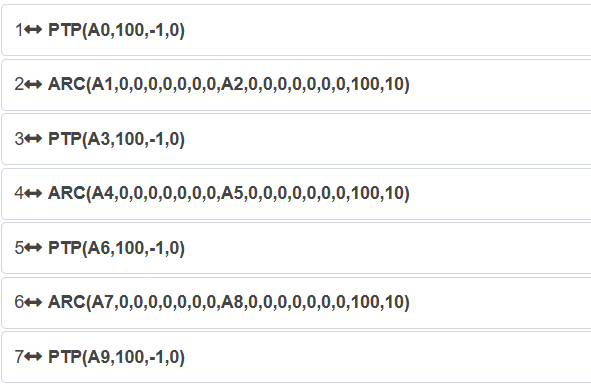

.. centered:: Schemat 9.27-45 Typowy program wygładzania blending ARC-PTP za pomocą przełącznika konfiguracji

Wygładzanie blending ARC-LIN
****************************

Użycie instrukcji Lua
"""""""""""""""""""""

**Krok 1**: Wybierz punkty nauczania do wykonania funkcji ARC-LIN. W podręczniku jako nazwy punktów nauczania użyto „A0” do „A9”.

**Krok 2**: Kliknij przyciski „Program nauczania” -> „Programowanie”, wybierz instrukcję „Łuk” z „Instrukcji ruchu”. W „Edycji instrukcji” wybierz punkt nauczania i ustaw prędkość testową. W ochronie ruchu wybierz „Tryb wygładzania przyspieszenia”. Dla punktów wymagających wygładzenia ustaw parametr „Płynne przejście”.

.. centered:: Schemat 9.27-46 Ustawienie instrukcji wygładzania blending dla instrukcji ARC z wygładzaniem przyspieszenia

**Krok 3**: Dodaj wiele instrukcji ARC i LIN, wygeneruj program Lua i uruchom go, aby zrealizować funkcję wygładzania blending ARC-LIN. Ten sposób używa zoptymalizowanego ruchu prędkości w kształcie litery T tylko dla instrukcji między AccSmoothStart() i AccSmoothEnd(), a dla pozostałych instrukcji używa oryginalnego ruchu prędkości w kształcie litery T.

.. image:: coding/413.png
   :width: 4in
   :align: center

.. centered:: Schemat 9.27-47 Typowy program wygładzania blending ARC-LIN za pomocą instrukcji Lua

Użycie przełącznika konfiguracji ruchu
""""""""""""""""""""""""""""""""""""""

**Krok 1**: Kliknij „Ustawienia początkowe” -> „Bezpieczeństwo” -> przycisk „Konfiguracja ruchu”, aby włączyć przełącznik „Tryb wygładzania przyspieszenia”.

.. centered:: Schemat 9.27-48 Ustawienie przełącznika konfiguracji trybu wygładzania przyspieszenia

**Krok 2**: Wybierz punkty nauczania do wykonania funkcji ARC-LIN. W podręczniku jako nazwy punktów nauczania użyto „A0” do „A9”.

**Krok 3**: Kliknij przyciski „Program nauczania” -> „Programowanie”, wybierz instrukcję „Łuk” z „Instrukcji ruchu”. W „Edycji instrukcji” wybierz punkt nauczania i ustaw prędkość testową. W ochronie ruchu wybierz „Brak”. Dla punktów wymagających wygładzenia ustaw parametr „Płynne przejście”.

.. image:: coding/419.png
   :width: 6in
   :align: center

.. centered:: Schemat 9.27-49 Ustawienie instrukcji wygładzania blending dla zwykłej instrukcji ARC

**Krok 4**: Dodaj wiele instrukcji ARC i LIN, wygeneruj program Lua i uruchom go, aby zrealizować funkcję wygładzania blending ARC-LIN. Typowy program jest taki sam jak dla zwykłego programu ARC-LIN. Ten sposób używa zoptymalizowanego ruchu prędkości w kształcie litery T dla wszystkich instrukcji.

.. image:: coding/414.png
   :width: 4in
   :align: center

.. centered:: Schemat 9.27-50 Typowy program wygładzania blending ARC-LIN za pomocą przełącznika konfiguracji

Wygładzanie blending ARC-ARC
****************************

Użycie instrukcji Lua
"""""""""""""""""""""

**Krok 1**: Wybierz punkty nauczania do wykonania funkcji ARC-ARC. W podręczniku jako nazwy punktów nauczania użyto „A0” do „A12”.

**Krok 2**: Kliknij przyciski „Program nauczania” -> „Programowanie”, wybierz instrukcję „Łuk” z „Instrukcji ruchu”. W „Edycji instrukcji” wybierz punkt nauczania i ustaw prędkość testową. W ochronie ruchu wybierz „Tryb wygładzania przyspieszenia”. Dla punktów wymagających wygładzenia ustaw parametr „Płynne przejście”.

.. centered:: Schemat 9.27-51 Ustawienie instrukcji wygładzania blending dla instrukcji ARC z wygładzaniem przyspieszenia

**Krok 3**: Dodaj wiele instrukcji ARC, wygeneruj program Lua i uruchom go, aby zrealizować funkcję wygładzania blending ARC-ARC. Ten sposób używa zoptymalizowanego ruchu prędkości w kształcie litery T tylko dla instrukcji między AccSmoothStart() i AccSmoothEnd(), a dla pozostałych instrukcji używa oryginalnego ruchu prędkości w kształcie litery T.

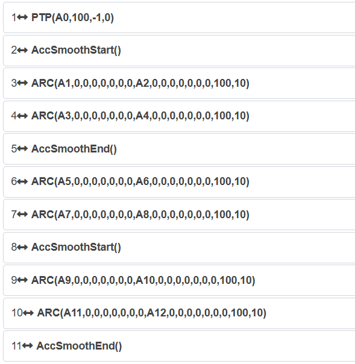

.. centered:: Schemat 9.27-52 Typowy program wygładzania blending ARC-ARC za pomocą instrukcji Lua

Użycie przełącznika konfiguracji ruchu
""""""""""""""""""""""""""""""""""""""

**Krok 1**: Kliknij „Ustawienia początkowe” -> „Bezpieczeństwo” -> przycisk „Konfiguracja ruchu”, aby włączyć przełącznik „Tryb wygładzania przyspieszenia”.

.. centered:: Schemat 9.27-53 Ustawienie przełącznika konfiguracji trybu wygładzania przyspieszenia

**Krok 2**: Wybierz punkty nauczania do wykonania funkcji ARC-ARC. W podręczniku jako nazwy punktów nauczania użyto „A0” do „A12”.

**Krok 3**: Kliknij przyciski „Program nauczania” -> „Programowanie”, wybierz instrukcję „Łuk” z „Instrukcji ruchu”. W „Edycji instrukcji” wybierz punkt nauczania i ustaw prędkość testową. W ochronie ruchu wybierz „Brak”. Dla punktów wymagających wygładzenia ustaw parametr „Płynne przejście”.

.. image:: coding/419.png
   :width: 6in
   :align: center

.. centered:: Schemat 9.27-54 Ustawienie instrukcji wygładzania blending dla zwykłej instrukcji ARC

**Krok 4**: Dodaj wiele instrukcji ARC, wygeneruj program Lua i uruchom go, aby zrealizować funkcję wygładzania blending ARC-ARC. Typowy program jest taki sam jak dla zwykłego programu ARC-ARC. Ten sposób używa zoptymalizowanego ruchu prędkości w kształcie litery T dla wszystkich instrukcji.

.. image:: coding/421.png
   :width: 4in
   :align: center

.. centered:: Schemat 9.27-55 Typowy program wygładzania blending ARC-ARC za pomocą przełącznika konfiguracji

Wygładzanie blending ARC-CIRCLE
*******************************

Użycie instrukcji Lua
"""""""""""""""""""""

**Krok 1**: Wybierz punkty nauczania do wykonania funkcji ARC-CIRCLE. W podręczniku jako nazwy punktów nauczania użyto „A0” do „A12”.

**Krok 2**: Kliknij przyciski „Program nauczania” -> „Programowanie”, wybierz instrukcję „Łuk” z „Instrukcji ruchu”. W „Edycji instrukcji” wybierz punkt nauczania i ustaw prędkość testową. W ochronie ruchu wybierz „Tryb wygładzania przyspieszenia”. Dla punktów wymagających wygładzenia ustaw parametr „Płynne przejście”.

.. centered:: Schemat 9.27-56 Ustawienie instrukcji wygładzania blending dla instrukcji ARC z wygładzaniem przyspieszenia

**Krok 3**: Dodaj wiele instrukcji ARC i CIRCLE, wygeneruj program Lua i uruchom go, aby zrealizować funkcję wygładzania blending ARC-CIRCLE. Ten sposób używa zoptymalizowanego ruchu prędkości w kształcie litery T tylko dla instrukcji między AccSmoothStart() i AccSmoothEnd(), a dla pozostałych instrukcji używa oryginalnego ruchu prędkości w kształcie litery T.

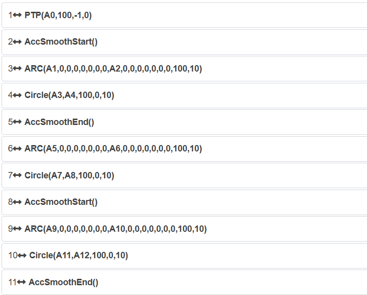

.. centered:: Schemat 9.27-57 Typowy program wygładzania blending ARC-CIRCLE za pomocą instrukcji Lua

Użycie przełącznika konfiguracji ruchu
""""""""""""""""""""""""""""""""""""""

**Krok 1**: Kliknij „Ustawienia początkowe” -> „Bezpieczeństwo” -> przycisk „Konfiguracja ruchu”, aby włączyć przełącznik „Tryb wygładzania przyspieszenia”.

.. centered:: Schemat 9.27-58 Ustawienie przełącznika konfiguracji trybu wygładzania przyspieszenia

**Krok 2**: Wybierz punkty nauczania do wykonania funkcji ARC-CIRCLE. W podręczniku jako nazwy punktów nauczania użyto „A0” do „A12”.

**Krok 3**: Kliknij przyciski „Program nauczania” -> „Programowanie”, wybierz instrukcję „Łuk” z „Instrukcji ruchu”. W „Edycji instrukcji” wybierz punkt nauczania i ustaw prędkość testową. W ochronie ruchu wybierz „Brak”. Dla punktów wymagających wygładzenia ustaw parametr „Płynne przejście”.

.. image:: coding/419.png
   :width: 6in
   :align: center

.. centered:: Schemat 9.27-59 Ustawienie instrukcji wygładzania blending dla zwykłej instrukcji ARC

**Krok 4**: Dodaj wiele instrukcji ARC i CIRCLE, wygeneruj program Lua i uruchom go, aby zrealizować funkcję wygładzania blending ARC-CIRCLE. Typowy program jest taki sam jak dla zwykłego programu ARC-CIRCLE. Ten sposób używa zoptymalizowanego ruchu prędkości w kształcie litery T dla wszystkich instrukcji.

.. image:: coding/423.png
   :width: 4in
   :align: center

.. centered:: Schemat 9.27-60 Typowy program wygładzania blending ARC-CIRCLE za pomocą przełącznika konfiguracji

Wygładzanie blending CIRCLE-PTP
*******************************

Użycie instrukcji Lua
"""""""""""""""""""""

**Krok 1**: Wybierz punkty nauczania do wykonania funkcji CIRCLE-PTP. W podręczniku jako nazwy punktów nauczania użyto „A0” do „A9”.

**Krok 2**: Kliknij przyciski „Program nauczania” -> „Programowanie”, wybierz instrukcję „Pełny okrąg” z „Instrukcji ruchu”. W „Edycji instrukcji” wybierz punkt nauczania i ustaw prędkość testową. W ochronie ruchu wybierz „Tryb wygładzania przyspieszenia”. Dla punktów wymagających wygładzenia ustaw parametr „Płynne przejście”.

.. image:: coding/424.png
   :width: 6in
   :align: center

.. centered:: Schemat 9.27-61 Ustawienie instrukcji wygładzania blending dla instrukcji CIRCLE z wygładzaniem przyspieszenia

**Krok 3**: Dodaj wiele instrukcji CIRCLE i PTP, wygeneruj program Lua i uruchom go, aby zrealizować funkcję wygładzania blending CIRCLE-PTP. Ten sposób używa zoptymalizowanego ruchu prędkości w kształcie litery T tylko dla instrukcji między AccSmoothStart() i AccSmoothEnd(), a dla pozostałych instrukcji używa oryginalnego ruchu prędkości w kształcie litery T.

.. image:: coding/425.png
   :width: 4in
   :align: center

.. centered:: Schemat 9.27-62 Typowy program wygładzania blending CIRCLE-PTP za pomocą instrukcji Lua

Użycie przełącznika konfiguracji ruchu
""""""""""""""""""""""""""""""""""""""

**Krok 1**: Kliknij „Ustawienia początkowe” -> „Bezpieczeństwo” -> przycisk „Konfiguracja ruchu”, aby włączyć przełącznik „Tryb wygładzania przyspieszenia”.

.. centered:: Schemat 9.27-63 Ustawienie przełącznika konfiguracji trybu wygładzania przyspieszenia

**Krok 2**: Wybierz punkty nauczania do wykonania funkcji CIRCLE-PTP. W podręczniku jako nazwy punktów nauczania użyto „A0” do „A9”.

**Krok 3**: Kliknij przyciski „Program nauczania” -> „Programowanie”, wybierz instrukcję „Pełny okrąg” z „Instrukcji ruchu”. W „Edycji instrukcji” wybierz punkt nauczania i ustaw prędkość testową. W ochronie ruchu wybierz „Brak”. Dla punktów wymagających wygładzenia ustaw parametr „Płynne przejście”.

.. image:: coding/426.png
   :width: 6in
   :align: center

.. centered:: Schemat 9.27-64 Ustawienie instrukcji wygładzania blending dla zwykłej instrukcji CIRCLE

**Krok 4**: Dodaj wiele instrukcji CIRCLE i PTP, wygeneruj program Lua i uruchom go, aby zrealizować funkcję wygładzania blending CIRCLE-PTP. Typowy program jest taki sam jak dla zwykłego programu CIRCLE-PTP. Ten sposób używa zoptymalizowanego ruchu prędkości w kształcie litery T dla wszystkich instrukcji.

.. image:: coding/427.png
   :width: 4in
   :align: center

.. centered:: Schemat 9.27-65 Typowy program wygładzania blending CIRCLE-PTP za pomocą przełącznika konfiguracji

Wygładzanie blending CIRCLE-LIN
*******************************

Użycie instrukcji Lua
"""""""""""""""""""""

**Krok 1**: Wybierz punkty nauczania do wykonania funkcji CIRCLE-LIN. W podręczniku jako nazwy punktów nauczania użyto „A0” do „A12”.

**Krok 2**: Kliknij przyciski „Program nauczania” -> „Programowanie”, wybierz instrukcję „Pełny okrąg” z „Instrukcji ruchu”. W „Edycji instrukcji” wybierz punkt nauczania i ustaw prędkość testową. W ochronie ruchu wybierz „Tryb wygładzania przyspieszenia”. Dla punktów wymagających wygładzenia ustaw parametr „Płynne przejście”.

.. image:: coding/424.png
   :width: 6in
   :align: center

.. centered:: Schemat 9.27-66 Ustawienie instrukcji wygładzania blending dla instrukcji CIRCLE z wygładzaniem przyspieszenia

**Krok 3**: Dodaj wiele instrukcji CIRCLE i LIN, wygeneruj program Lua i uruchom go, aby zrealizować funkcję wygładzania blending CIRCLE-LIN. Ten sposób używa zoptymalizowanego ruchu prędkości w kształcie litery T tylko dla instrukcji między AccSmoothStart() i AccSmoothEnd(), a dla pozostałych instrukcji używa oryginalnego ruchu prędkości w kształcie litery T.

.. image:: coding/428.png
   :width: 4in
   :align: center

.. centered:: Schemat 9.27-67 Typowy program wygładzania blending CIRCLE-LIN za pomocą instrukcji Lua

Użycie przełącznika konfiguracji ruchu
""""""""""""""""""""""""""""""""""""""

**Krok 1**: Kliknij „Ustawienia początkowe” -> „Bezpieczeństwo” -> przycisk „Konfiguracja ruchu”, aby włączyć przełącznik „Tryb wygładzania przyspieszenia”.

.. centered:: Schemat 9.27-68 Ustawienie przełącznika konfiguracji trybu wygładzania przyspieszenia

**Krok 2**: Wybierz punkty nauczania do wykonania funkcji CIRCLE-LIN. W podręczniku jako nazwy punktów nauczania użyto „A0” do „A12”.

**Krok 3**: Kliknij przyciski „Program nauczania” -> „Programowanie”, wybierz instrukcję „Pełny okrąg” z „Instrukcji ruchu”. W „Edycji instrukcji” wybierz punkt nauczania i ustaw prędkość testową. W ochronie ruchu wybierz „Brak”. Dla punktów wymagających wygładzenia ustaw parametr „Płynne przejście”.

.. image:: coding/426.png
   :width: 6in
   :align: center

.. centered:: Schemat 9.27-69 Ustawienie instrukcji wygładzania blending dla zwykłej instrukcji CIRCLE

**Krok 4**: Dodaj wiele instrukcji CIRCLE i LIN, wygeneruj program Lua i uruchom go, aby zrealizować funkcję wygładzania blending CIRCLE-LIN. Typowy program jest taki sam jak dla zwykłego programu CIRCLE-LIN. Ten sposób używa zoptymalizowanego ruchu prędkości w kształcie litery T dla wszystkich instrukcji.

.. image:: coding/429.png
   :width: 4in
   :align: center

.. centered:: Schemat 9.27-70 Typowy program wygładzania blending CIRCLE-LIN za pomocą przełącznika konfiguracji

Wygładzanie blending CIRCLE-ARC
*******************************

Użycie instrukcji Lua
"""""""""""""""""""""

**Krok 1**: Wybierz punkty nauczania do wykonania funkcji CIRCLE-ARC. W podręczniku jako nazwy punktów nauczania użyto „A0” do „A12”.

**Krok 2**: Kliknij przyciski „Program nauczania” -> „Programowanie”, wybierz instrukcję „Pełny okrąg” z „Instrukcji ruchu”. W „Edycji instrukcji” wybierz punkt nauczania i ustaw prędkość testową. W ochronie ruchu wybierz „Tryb wygładzania przyspieszenia”. Dla punktów wymagających wygładzenia ustaw parametr „Płynne przejście”.

.. image:: coding/424.png
   :width: 6in
   :align: center

.. centered:: Schemat 9.27-71 Ustawienie instrukcji wygładzania blending dla instrukcji CIRCLE z wygładzaniem przyspieszenia

**Krok 3**: Dodaj wiele instrukcji CIRCLE i ARC, wygeneruj program Lua i uruchom go, aby zrealizować funkcję wygładzania blending CIRCLE-ARC. Ten sposób używa zoptymalizowanego ruchu prędkości w kształcie litery T tylko dla instrukcji między AccSmoothStart() i AccSmoothEnd(), a dla pozostałych instrukcji używa oryginalnego ruchu prędkości w kształcie litery T.

.. image:: coding/430.png
   :width: 4in
   :align: center

.. centered:: Schemat 9.27-72 Typowy program wygładzania blending CIRCLE-ARC za pomocą instrukcji Lua

Użycie przełącznika konfiguracji ruchu
""""""""""""""""""""""""""""""""""""""

**Krok 1**: Kliknij „Ustawienia początkowe” -> „Bezpieczeństwo” -> przycisk „Konfiguracja ruchu”, aby włączyć przełącznik „Tryb wygładzania przyspieszenia”.

.. centered:: Schemat 9.27-73 Ustawienie przełącznika konfiguracji trybu wygładzania przyspieszenia

**Krok 2**: Wybierz punkty nauczania do wykonania funkcji CIRCLE-ARC. W podręczniku jako nazwy punktów nauczania użyto „A0” do „A12”.

**Krok 3**: Kliknij przyciski „Program nauczania” -> „Programowanie”, wybierz instrukcję „Pełny okrąg” z „Instrukcji ruchu”. W „Edycji instrukcji” wybierz punkt nauczania i ustaw prędkość testową. W ochronie ruchu wybierz „Brak”. Dla punktów wymagających wygładzenia ustaw parametr „Płynne przejście”.

.. image:: coding/426.png
   :width: 6in
   :align: center

.. centered:: Schemat 9.27-74 Ustawienie instrukcji wygładzania blending dla zwykłej instrukcji CIRCLE

**Krok 4**: Dodaj wiele instrukcji CIRCLE i ARC, wygeneruj program Lua i uruchom go, aby zrealizować funkcję wygładzania blending CIRCLE-ARC. Typowy program jest taki sam jak dla zwykłego programu CIRCLE-ARC. Ten sposób używa zoptymalizowanego ruchu prędkości w kształcie litery T dla wszystkich instrukcji.

.. image:: coding/431.png
   :width: 4in
   :align: center

.. centered:: Schemat 9.27-75 Typowy program wygładzania blending CIRCLE-ARC za pomocą przełącznika konfiguracji

Wygładzanie blending CIRCLE-CIRCLE
**********************************

Użycie instrukcji Lua
"""""""""""""""""""""

**Krok 1**: Wybierz punkty nauczania do wykonania funkcji CIRCLE-CIRCLE. W podręczniku jako nazwy punktów nauczania użyto „A0” do „A12”.

**Krok 2**: Kliknij przyciski „Program nauczania” -> „Programowanie”, wybierz instrukcję „Pełny okrąg” z „Instrukcji ruchu”. W „Edycji instrukcji” wybierz punkt nauczania i ustaw prędkość testową. W ochronie ruchu wybierz „Tryb wygładzania przyspieszenia”. Dla punktów wymagających wygładzenia ustaw parametr „Płynne przejście”.

.. image:: coding/424.png
   :width: 6in
   :align: center

.. centered:: Schemat 9.27-76 Ustawienie instrukcji wygładzania blending dla instrukcji CIRCLE z wygładzaniem przyspieszenia

**Krok 3**: Dodaj wiele instrukcji CIRCLE, wygeneruj program Lua i uruchom go, aby zrealizować funkcję wygładzania blending CIRCLE-CIRCLE. Ten sposób używa zoptymalizowanego ruchu prędkości w kształcie litery T tylko dla instrukcji między AccSmoothStart() i AccSmoothEnd(), a dla pozostałych instrukcji używa oryginalnego ruchu prędkości w kształcie litery T.

.. image:: coding/432.png
   :width: 4in
   :align: center

.. centered:: Schemat 9.27-77 Typowy program wygładzania blending CIRCLE-CIRCLE za pomocą instrukcji Lua

Użycie przełącznika konfiguracji ruchu
""""""""""""""""""""""""""""""""""""""

**Krok 1**: Kliknij „Ustawienia początkowe” -> „Bezpieczeństwo” -> przycisk „Konfiguracja ruchu”, aby włączyć przełącznik „Tryb wygładzania przyspieszenia”.

.. centered:: Schemat 9.27-78 Ustawienie przełącznika konfiguracji trybu wygładzania przyspieszenia

**Krok 2**: Wybierz punkty nauczania do wykonania funkcji CIRCLE-CIRCLE. W podręczniku jako nazwy punktów nauczania użyto „A0” do „A12”.

**Krok 3**: Kliknij przyciski „Program nauczania” -> „Programowanie”, wybierz instrukcję „Pełny okrąg” z „Instrukcji ruchu”. W „Edycji instrukcji” wybierz punkt nauczania i ustaw prędkość testową. W ochronie ruchu wybierz „Brak”. Dla punktów wymagających wygładzenia ustaw parametr „Płynne przejście”.

.. image:: coding/426.png
   :width: 6in
   :align: center

.. centered:: Schemat 9.27-79 Ustawienie instrukcji wygładzania blending dla zwykłej instrukcji CIRCLE

**Krok 4**: Dodaj wiele instrukcji CIRCLE, wygeneruj program Lua i uruchom go, aby zrealizować funkcję wygładzania blending CIRCLE-CIRCLE. Typowy program jest taki sam jak dla zwykłego programu CIRCLE-CIRCLE. Ten sposób używa zoptymalizowanego ruchu prędkości w kształcie litery T dla wszystkich instrukcji.

.. image:: coding/433.png
   :width: 4in
   :align: center

.. centered:: Schemat 9.27-80 Typowy program wygładzania blending CIRCLE-CIRCLE za pomocą przełącznika konfiguracji

Wygładzanie blending dla asynchronicznego ruchu osi rozszerzonej
****************************************************************

Użycie instrukcji Lua
"""""""""""""""""""""

**Krok 1**: Wybierz punkty nauczania do wykonania funkcji wygładzania blending dla asynchronicznego ruchu osi rozszerzonej. W podręczniku jako nazwy punktów nauczania użyto „A0” do „A5”.

**Krok 2**: Kliknij przyciski „Program nauczania” -> „Programowanie”, wybierz instrukcję „Oś rozszerzona” z „Instrukcji urządzeń peryferyjnych”, wybierz „Sposób ruchu” jako „Asynchroniczny”. Wybierz punkt nauczania i ustaw prędkość testową. W ochronie ruchu wybierz „Tryb wygładzania przyspieszenia”. Dla punktów wymagających wygładzenia ustaw parametr „Płynne przejście”.

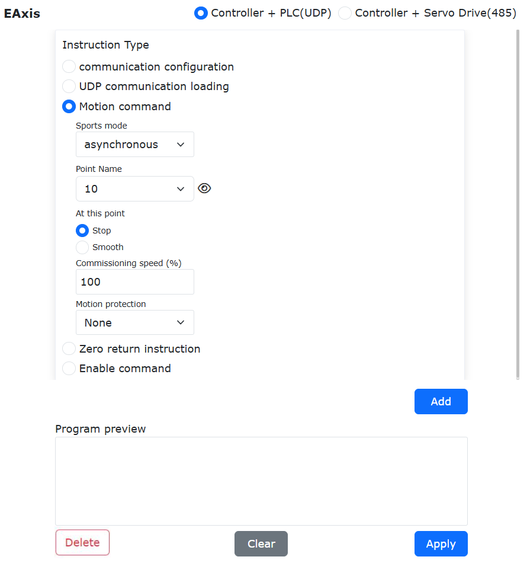

.. centered:: Schemat 9.27-81 Ustawienie instrukcji wygładzania blending dla asynchronicznego ruchu osi rozszerzonej

**Krok 3**: Dodaj instrukcje ruchu, wygeneruj program Lua i uruchom go, aby zrealizować funkcję wygładzania blending dla asynchronicznego ruchu osi rozszerzonej. Ten sposób używa planowania prędkości w kształcie litery S i wygładzania blending tylko dla instrukcji między AccSmoothStart() i AccSmoothEnd(), a dla pozostałych instrukcji używa planowania prędkości w kształcie litery T.

.. image:: coding/436.png
   :width: 4in
   :align: center

.. centered:: Schemat 9.27-82 Typowy program wygładzania blending dla asynchronicznego ruchu osi rozszerzonej za pomocą instrukcji Lua

Użycie przełącznika konfiguracji ruchu
""""""""""""""""""""""""""""""""""""""

**Krok 1**: Kliknij „Ustawienia początkowe” -> „Bezpieczeństwo” -> przycisk „Konfiguracja ruchu”, aby włączyć przełącznik „Tryb wygładzania przyspieszenia”.

.. centered:: Schemat 9.27-83 Ustawienie przełącznika konfiguracji trybu wygładzania przyspieszenia

**Krok 2**: Wybierz punkty nauczania do wykonania funkcji wygładzania blending dla asynchronicznego ruchu osi rozszerzonej. W podręczniku jako nazwy punktów nauczania użyto „A0” do „A5”.

**Krok 3**: Kliknij przyciski „Program nauczania” -> „Programowanie”, wybierz instrukcję „Oś rozszerzona” z „Instrukcji urządzeń peryferyjnych”, wybierz „Sposób ruchu” jako „Asynchroniczny”. Wybierz punkt nauczania i ustaw prędkość testową. W ochronie ruchu wybierz „Brak”. Dla punktów wymagających wygładzenia ustaw parametr „Płynne przejście”.

.. image:: coding/437.png
   :width: 6in
   :align: center

.. centered:: Schemat 9.27-84 Ustawienie instrukcji wygładzania blending dla zwykłego asynchronicznego ruchu osi rozszerzonej

**Krok 4**: Dodaj wiele instrukcji ruchu, wygeneruj program Lua i uruchom go, aby zrealizować funkcję wygładzania blending dla asynchronicznego ruchu osi rozszerzonej. Typowy program jest taki sam jak dla zwykłego programu ruchu osi rozszerzonej. Ten sposób używa planowania prędkości w kształcie litery S i wygładzania blending dla wszystkich instrukcji.

.. image:: coding/438.png
   :width: 4in
   :align: center

.. centered:: Schemat 9.27-85 Typowy program wygładzania blending dla asynchronicznego ruchu osi rozszerzonej za pomocą przełącznika konfiguracji

Wygładzanie blending dla synchronicznego ruchu osi rozszerzonej
***************************************************************

Użycie instrukcji Lua
"""""""""""""""""""""

**Krok 1**: Wybierz punkty nauczania do wykonania funkcji wygładzania blending dla synchronicznego ruchu osi rozszerzonej. W podręczniku jako nazwy punktów nauczania użyto „A0” do „A5”.

**Krok 2**: Kliknij przyciski „Program nauczania” -> „Programowanie”, wybierz instrukcję „Oś rozszerzona” z „Instrukcji urządzeń peryferyjnych”, wybierz „Sposób ruchu” jako „Synchroniczny”. Wybierz punkt nauczania i ustaw prędkość testową. W ochronie ruchu wybierz „Tryb wygładzania przyspieszenia”. Dla punktów wymagających wygładzenia ustaw parametr „Płynne przejście”.

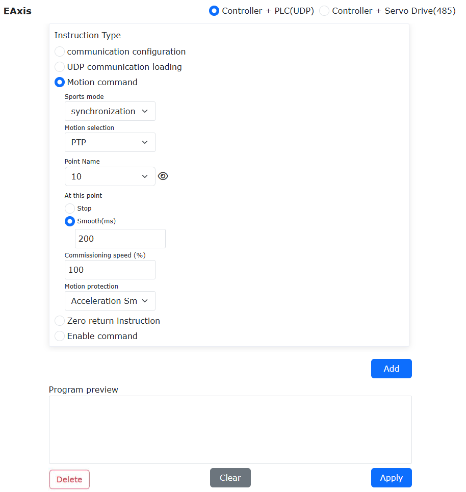

.. centered:: Schemat 9.27-86 Ustawienie instrukcji wygładzania blending dla synchronicznego ruchu osi rozszerzonej

**Krok 3**: Dodaj instrukcje ruchu, wygeneruj program Lua i uruchom go, aby zrealizować funkcję wygładzania blending dla synchronicznego ruchu osi rozszerzonej. Ten sposób używa planowania prędkości w kształcie litery S i wygładzania blending tylko dla instrukcji między AccSmoothStart() i AccSmoothEnd(), a dla pozostałych instrukcji używa planowania prędkości w kształcie litery T.

.. image:: coding/440.png
   :width: 4in
   :align: center

.. centered:: Schemat 9.27-87 Typowy program wygładzania blending dla synchronicznego ruchu osi rozszerzonej za pomocą instrukcji Lua

Użycie przełącznika konfiguracji ruchu
""""""""""""""""""""""""""""""""""""""

**Krok 1**: Kliknij „Ustawienia początkowe” -> „Bezpieczeństwo” -> przycisk „Konfiguracja ruchu”, aby włączyć przełącznik „Tryb wygładzania przyspieszenia”.

.. centered:: Schemat 9.27-88 Ustawienie przełącznika konfiguracji trybu wygładzania przyspieszenia

**Krok 2**: Wybierz punkty nauczania do wykonania funkcji wygładzania blending dla synchronicznego ruchu osi rozszerzonej. W podręczniku jako nazwy punktów nauczania użyto „A0” do „A5”.

**Krok 3**: Kliknij przyciski „Program nauczania” -> „Programowanie”, wybierz instrukcję „Oś rozszerzona” z „Instrukcji urządzeń peryferyjnych”, wybierz „Sposób ruchu” jako „Synchroniczny”. Wybierz punkt nauczania i ustaw prędkość testową. W ochronie ruchu wybierz „Brak”. Dla punktów wymagających wygładzenia ustaw parametr „Płynne przejście”.

.. image:: coding/441.png
   :width: 6in
   :align: center

.. centered:: Schemat 9.27-89 Ustawienie instrukcji wygładzania blending dla zwykłego synchronicznego ruchu osi rozszerzonej

**Krok 4**: Dodaj wiele instrukcji ruchu, wygeneruj program Lua i uruchom go, aby zrealizować funkcję wygładzania blending dla synchronicznego ruchu osi rozszerzonej. Typowy program jest taki sam jak dla zwykłego programu ruchu osi rozszerzonej. Ten sposób używa planowania prędkości w kształcie litery S i wygładzania blending dla wszystkich instrukcji.

.. image:: coding/442.png
   :width: 4in
   :align: center

.. centered:: Schemat 9.27-90 Typowy program wygładzania blending dla synchronicznego ruchu osi rozszerzonej za pomocą przełącznika konfiguracji

Funkcja kąta przechyłu bocznego wahadła
~~~~~~~~~~~~~~~~~~~~~~~~~~~~~~~~~~~~~~~

Przegląd
++++++++

Funkcja kąta przechyłu bocznego wahadła robota umożliwia narzędziu końcowemu robota podczas ruchu wahadłowego obracanie się o niestandardowy kąt wokół kierunku Rx układu współrzędnych wahadła, co pozwala zmniejszyć różnicę w długości kontaktu między spoiną pachwinową a łączonymi materiałami podczas procesów takich jak spawanie zakładkowe.

Procedura operacyjna
++++++++++++++++++++

W interfejsie sterowania webowego robota kolejno kliknij „Program nauczania” -> „Edycja programu”, aby przejść do interfejsu „Instrukcje ruchu”, jak poniżej.

.. image:: coding/320.png
   :width: 4in
   :align: center

.. centered:: Schemat 9.28-1 Interfejs instrukcji ruchu

W interfejsie „Instrukcje ruchu” kliknij „Wahadło”, aby przejść do interfejsu edycji instrukcji „Weave”.

.. image:: coding/321.png
   :width: 6in
   :align: center

.. centered:: Schemat 9.28-2 Interfejs edycji instrukcji Weave

W interfejsie edycji instrukcji „Weave” kliknij listę rozwijaną „Wybierz numer”, aby wybrać konfigurację parametrów wahadła o różnym numerze. Kliknij przycisk po prawej stronie listy rozwijanej „Wybierz numer”, aby zmodyfikować konfigurację parametrów wahadła dla tego numeru.

.. image:: coding/322.png
   :width: 6in
   :align: center

.. centered:: Schemat 9.28-3 Konfiguracja parametrów wahadła

W polu „Kąt przechyłu bocznego kierunku wahadła” w konfiguracji parametrów wahadła można wprowadzić niestandardowy kąt obrotu wokół kierunku Rx układu współrzędnych wahadła. Kliknij „Konfiguruj”, aby zakończyć konfigurację parametrów wahadła.

.. note:: Uwaga: Parametr „Kąt przechyłu bocznego kierunku wahadła” jest dostosowany do typów wahadła „Wahadło trójkątne”, „Wahadło sinusoidalne”, „Wahadło okrągłe - zgodnie z ruchem wskazówek zegara” i „Wahadło okrągłe - przeciwnie do ruchu wskazówek zegara” w parametrze „Typ wahadła”.

Poniżej na przykładzie ruchu Lin zrealizowano funkcję kąta przechyłu bocznego wahadła:

**Krok 1**: W interfejsie edycji instrukcji „Weave”, na liście rozwijanej „Wybierz numer” w interfejsie „Edycja instrukcji” wybierz numer konfiguracji z już skonfigurowanym parametrem kąta przechyłu bocznego wahadła. W polu „Typ instrukcji” kliknij „Rozpocznij wahadło”, a następnie kliknij „Dodaj”, aby włączyć funkcję wahadła.

.. image:: coding/323.png
   :width: 6in
   :align: center

.. centered:: Schemat 9.28-4 Dodanie rozpoczęcia wahadła

**Krok 2**: W interfejsie „Instrukcje ruchu” kliknij „Linia”, aby utworzyć ruch liniowy Lin. Ten krok to podstawowa instrukcja ruchu, nie będzie tu powtarzany.

**Krok 3**: W interfejsie edycji instrukcji „Weave”, w polu „Typ instrukcji” kliknij „Zakończ wahadło”, a następnie kliknij „Dodaj”, aby wyłączyć funkcję wahadła.

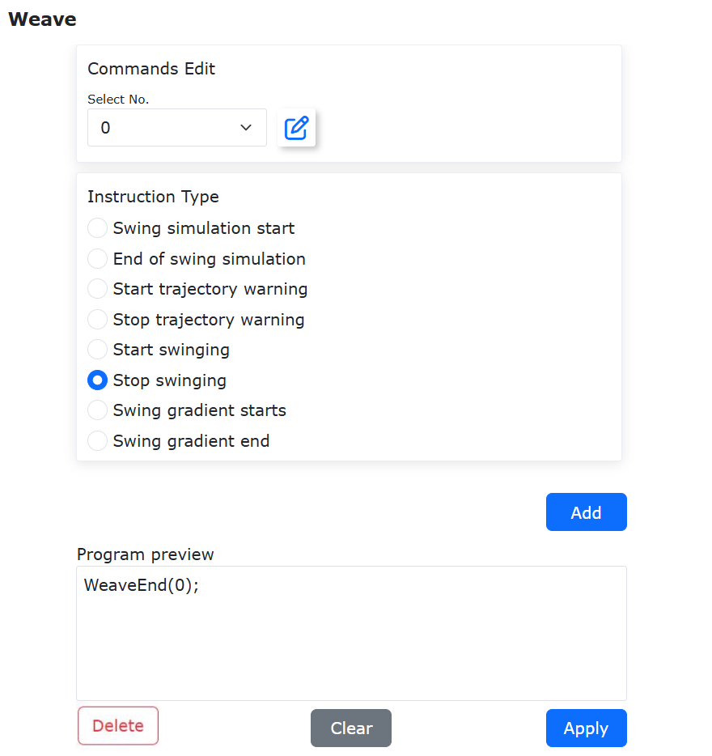

.. centered:: Schemat 9.28-5 Dodanie zatrzymania wahadła

**Krok 4**: Po wykonaniu kroków 1~3, w polu „Podgląd programu” w interfejsie edycji instrukcji „Weave” można sprawdzić, czy ustawienia w krokach 1~3 są prawidłowe.

.. image:: coding/325.png
   :width: 6in
   :align: center

.. centered:: Schemat 9.28-6 Podgląd programu wahadła

**Krok 5**: Po sprawdzeniu ustawień programu w polu „Podgląd programu” kliknij „Zastosuj”, aby automatycznie wygenerować wykonywalny program LUA.

.. image:: coding/326.png
   :width: 4in
   :align: center

.. centered:: Schemat 9.28-7 Typowy program LUA ruchu wahadłowego

Funkcja stopniowej zmiany parametrów procesu spawania (prąd, napięcie, prędkość posuwu wzdłuż spoiny)
~~~~~~~~~~~~~~~~~~~~~~~~~~~~~~~~~~~~~~~~~~~~~~~~~~~~~~~~~~~~~~~~~~~~~~~~~~~~~~~~~~~~~~~~~~~~~~~~~~~~~~~~

Przegląd
++++++++

Funkcja stopniowej zmiany parametrów procesu spawania (prądu, napięcia i prędkości posuwu wzdłuż spoiny) umożliwia niestandardowy zakres zmian parametrów procesu podczas spawania.

Procedura stopniowej zmiany parametrów prądu i napięcia
++++++++++++++++++++++++++++++++++++++++++++++++++++++++

Stopniowa zmiana parametru prądu
********************************

W interfejsie sterowania webowego robota kolejno kliknij „Program nauczania” -> „Programowanie”, aby przejść do interfejsu „Instrukcje spawania”, jak poniżej.

.. image:: coding/327.png
   :width: 4in
   :align: center

.. centered:: Schemat 9.29-1 Interfejs instrukcji spawania

W interfejsie „Instrukcje spawania” kliknij „Spawanie”, aby przejść do interfejsu konfiguracji instrukcji „Weld”.

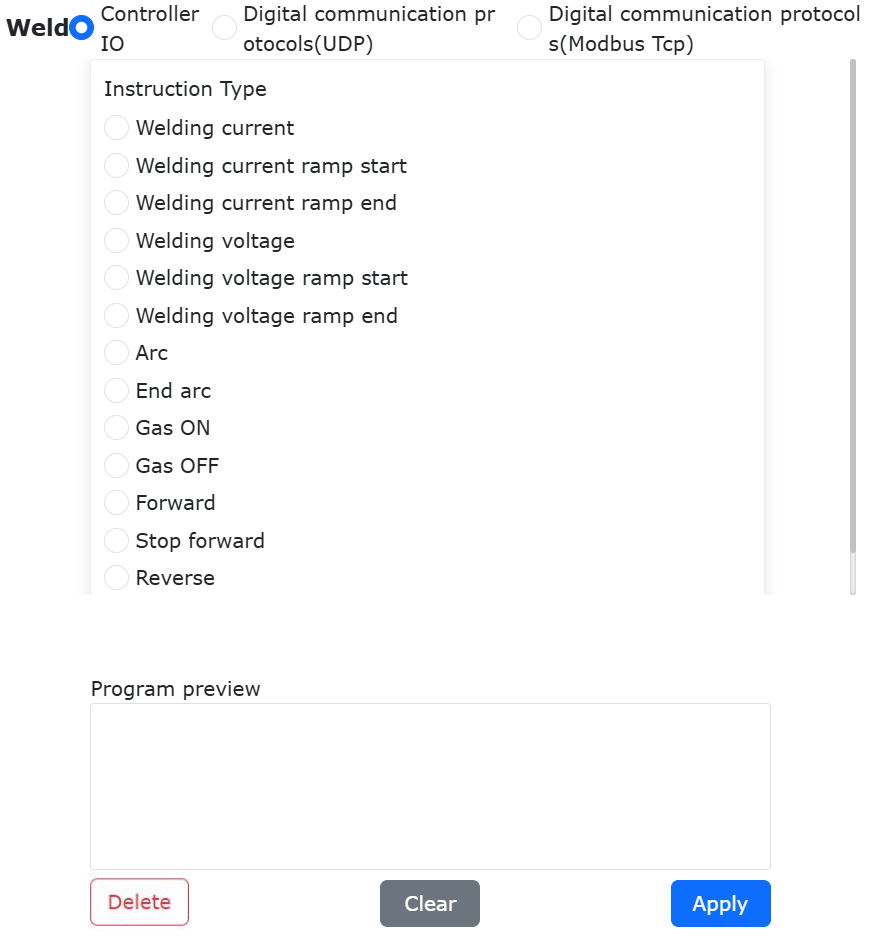

.. centered:: Schemat 9.29-2 Interfejs konfiguracji instrukcji Weld

W polu „Typ instrukcji” interfejsu konfiguracji instrukcji „Weld” kliknij „Rozpocznij stopniową zmianę prądu spawania”. Skonfiguruj parametry „Prąd początkowy”, „Prąd końcowy”, „AO sterowania prądem spawania” oraz „Wybór wygładzania”.

Na przykład, skonfiguruj „Prąd początkowy” jako 260 A, „Prąd końcowy” jako 220 A, „AO sterowania prądem spawania” jako „Ctrl-AO0” (kanał analogowy szafy sterowniczej) oraz „Wybór wygładzania” jako „Break”. Kliknij „Dodaj”, konfiguracja została zakończona. W polu „Podgląd programu” sprawdź, czy parametry instrukcji nie zawierają błędnych konfiguracji.

.. image:: coding/329.png
   :width: 4in
   :align: center

.. centered:: Schemat 9.29-3 Parametry instrukcji rozpoczęcia stopniowej zmiany prądu spawania

W polu „Typ instrukcji” interfejsu konfiguracji instrukcji „Weld” kliknij „Zakończ stopniową zmianę prądu spawania”. Konfiguracja parametrów nie jest wymagana. Kliknij „Dodaj”, konfiguracja została zakończona. W polu „Podgląd programu” sprawdź, czy parametry instrukcji nie zawierają błędnych konfiguracji.

.. image:: coding/330.png
   :width: 4in
   :align: center

.. centered:: Schemat 9.29-4 Parametry instrukcji zakończenia stopniowej zmiany prądu spawania

Po skonfigurowaniu parametrów instrukcji „Rozpocznij stopniową zmianę prądu spawania” i „Zakończ stopniową zmianę prądu spawania” kliknij „Zastosuj”, aby automatycznie wygenerować wykonywalny program LUA.

.. note:: Podczas konfiguracji parametrów instrukcji „Rozpocznij stopniową zmianę prądu spawania” i „Zakończ stopniową zmianę prądu spawania” należy skonfigurować instrukcje ruchu. Jako przykład podano typowy program LUA dla ruchu śledzenia łuku spawalniczego z stopniową zmianą parametru prądu.

.. image:: coding/331.png
   :width: 4in
   :align: center

.. centered:: Schemat 9.29-5 Typowy program LUA śledzenia łuku spawalniczego z stopniową zmianą parametru prądu

Stopniowa zmiana parametru napięcia
***********************************

W polu „Typ instrukcji” interfejsu konfiguracji instrukcji „Weld” kliknij „Rozpocznij stopniową zmianę napięcia spawania”. Skonfiguruj parametry „Napięcie początkowe”, „Napięcie końcowe”, „AO sterowania napięciem spawania” oraz „Wybór wygładzania”.

Na przykład, skonfiguruj „Napięcie początkowe” jako 25 V, „Napięcie końcowe” jako 22 V, „AO sterowania napięciem spawania” jako „Ctrl-AO1” (kanał analogowy szafy sterowniczej) oraz „Wybór wygładzania” jako „Break”. Kliknij „Dodaj”, konfiguracja została zakończona. W polu „Podgląd programu” sprawdź, czy instrukcja nie zawiera błędnych konfiguracji, jak poniżej.

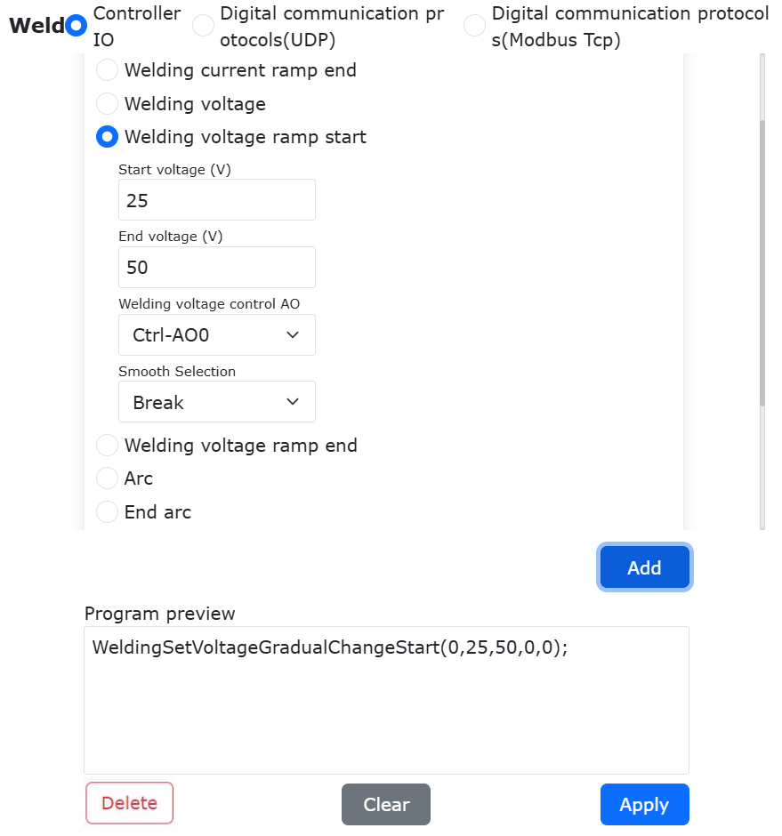

.. centered:: Schemat 9.29-6 Parametry instrukcji rozpoczęcia stopniowej zmiany napięcia spawania

W polu „Typ instrukcji” interfejsu konfiguracji instrukcji „Weld” kliknij „Zakończ stopniową zmianę napięcia spawania”. Konfiguracja parametrów nie jest wymagana. Kliknij „Dodaj”, konfiguracja została zakończona. W polu „Podgląd programu” sprawdź, czy instrukcja nie zawiera błędnych konfiguracji.

.. image:: coding/333.png
   :width: 4in
   :align: center

.. centered:: Schemat 9.29-7 Parametry instrukcji zakończenia stopniowej zmiany napięcia spawania

Po skonfigurowaniu parametrów instrukcji „Rozpocznij stopniową zmianę napięcia spawania” i „Zakończ stopniową zmianę napięcia spawania” kliknij „Zastosuj”, aby automatycznie wygenerować wykonywalny program LUA.

.. image:: coding/334.png
   :width: 4in
   :align: center

.. centered:: Schemat 9.29-8 Typowy program LUA śledzenia łuku spawalniczego z stopniową zmianą parametru napięcia

Procedura stopniowej zmiany parametru prędkości posuwu
+++++++++++++++++++++++++++++++++++++++++++++++++++++++

W interfejsie sterowania webowego robota kolejno kliknij „Program nauczania” -> „Programowanie”, aby przejść do interfejsu „Instrukcje ruchu”.

.. image:: coding/335.png
   :width: 3in
   :align: center

.. centered:: Schemat 9.29-9 Interfejs instrukcji ruchu

W interfejsie „Instrukcje ruchu” kliknij „Wahadło”, aby przejść do interfejsu konfiguracji instrukcji „Weave”.

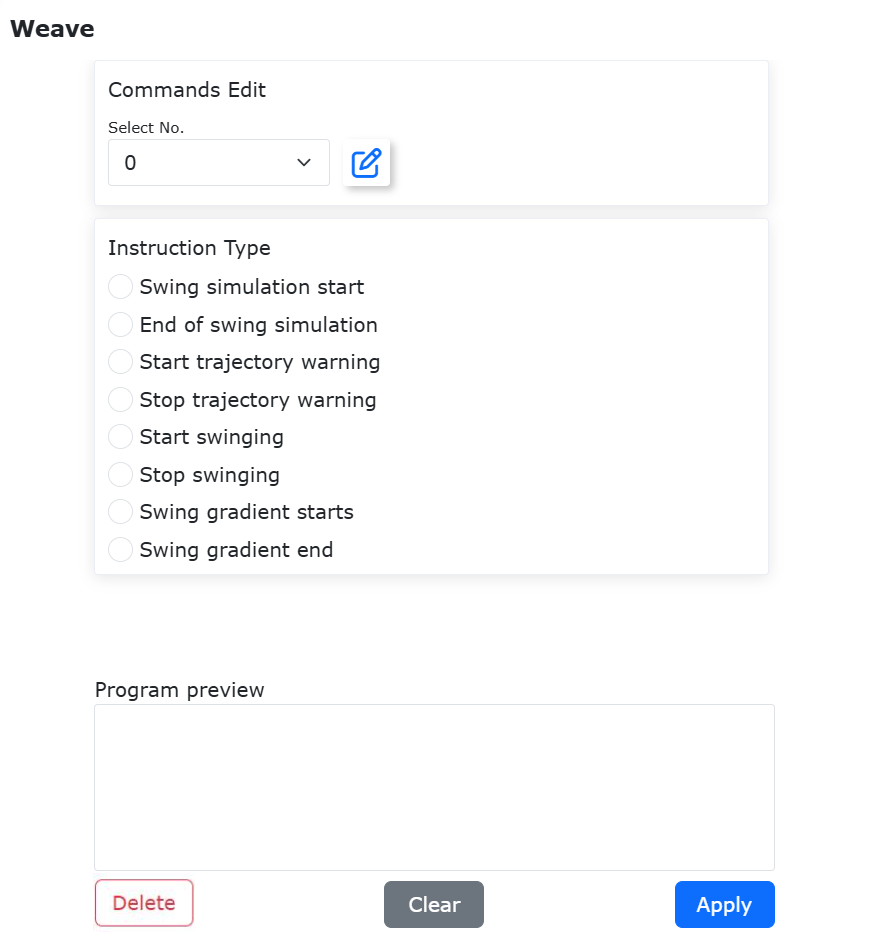

.. centered:: Schemat 9.29-10 Interfejs konfiguracji instrukcji Weave

W polu „Typ instrukcji” interfejsu konfiguracji instrukcji „Weave” kliknij „Rozpocznij stopniową zmianę wahadła”. Skonfiguruj parametry „Prędkość początkowa”, „Prędkość końcowa” oraz „Tryb stopniowej zmiany”.

Na przykład, skonfiguruj „Tryb stopniowej zmiany” jako „Wahadło + prędkość posuwu”, „Prędkość początkowa” jako 24 cm/min oraz „Prędkość końcowa” jako 30 cm/min. Kliknij „Dodaj”, konfiguracja została zakończona. W polu „Podgląd programu” sprawdź, czy instrukcja nie zawiera błędnych konfiguracji.

.. image:: coding/337.png
   :width: 4in
   :align: center

.. centered:: Schemat 9.29-11 Parametry instrukcji rozpoczęcia stopniowej zmiany wahadła + prędkości posuwu

W polu „Typ instrukcji” interfejsu konfiguracji instrukcji „Weave” kliknij „Zakończ stopniową zmianę wahadła”. Konfiguracja parametrów nie jest wymagana. Kliknij „Dodaj”, konfiguracja została zakończona. W polu „Podgląd programu” sprawdź, czy instrukcja nie zawiera błędnych konfiguracji.

.. image:: coding/338.png
   :width: 4in
   :align: center

.. centered:: Schemat 9.29-12 Parametry instrukcji zakończenia stopniowej zmiany wahadła + prędkości posuwu

Po skonfigurowaniu parametrów instrukcji „Rozpocznij stopniową zmianę wahadła” i „Zakończ stopniową zmianę wahadła” kliknij „Zastosuj”, aby automatycznie wygenerować wykonywalny program LUA.

.. note:: Podczas konfiguracji parametrów instrukcji „Rozpocznij stopniową zmianę wahadła” i „Zakończ stopniową zmianę wahadła” należy skonfigurować instrukcje ruchu. Jako przykład podano typowy program LUA dla ruchu śledzenia łuku spawalniczego z stopniową zmianą parametru prędkości posuwu.

.. image:: coding/339.png
   :width: 4in
   :align: center

.. centered:: Schemat 9.29-13 Typowy program LUA śledzenia łuku spawalniczego z stopniową zmianą parametru prędkości posuwu

.. note:: Podczas konfiguracji parametrów instrukcji stopniowej zmiany parametrów procesu spawania w interfejsie konfiguracji instrukcji „Weld” i interfejsie konfiguracji instrukcji „Weave” należy najpierw określić sposób komunikacji między szafą sterowniczą a spawarką. W przypadku komunikacji analogowej i cyfrowej należy kliknąć odpowiednio „I/O sterownika” lub „Protokół komunikacji cyfrowej”.

Funkcja stopniowej zmiany czasu postoju wahadła
++++++++++++++++++++++++++++++++++++++++++++++++

Przegląd
***********************************

Dla typów wahadła trójkątnego, wahadła trójkątnego w kształcie litery L, wahadła sinusoidalnego i wahadła sinusoidalnego w kształcie litery L, w sytuacjach, gdy amplituda i czas postoju na początku i na końcu wahadła są różne, funkcja ta stopniowo zmienia amplitudę i czas postoju od wartości początkowej do końcowej.

Dla typów wahadła trójkątnego i wahadła sinusoidalnego, w sytuacjach, gdy amplituda, czas postoju i prędkość posuwu na początku i na końcu wahadła są różne, funkcja ta stopniowo zmienia amplitudę, czas postoju i prędkość posuwu od wartości początkowej do końcowej.

Procedura operacyjna
***********************************

**Krok 1**: Ustawienie parametrów wahadła. Kliknij przyciski „Program nauczania” - „Programowanie” - „Wahadło”, wybierz początkowy numer wahadła i ustaw parametry wahadła, następnie wybierz końcowy numer wahadła i ustaw parametry wahadła. Należy pamiętać: tylko amplituda wahadła, lewy czas postoju wahadła i prawy czas postoju wahadła mogą być różne między początkowymi a końcowymi parametrami wahadła. Pozostałe parametry muszą być identyczne.

.. image:: coding/545.png
   :width: 4in
   :align: center

.. centered:: Schemat 9.29-14 Ustawienie parametrów wahadła

**Krok 2**: Ustawienie trybu stopniowej zmiany. Kliknij „Rozpocznij stopniową zmianę wahadła”, aby ustawić odpowiedni tryb stopniowej zmiany: tryb stopniowej zmiany dla wahadła trójkątnego, wahadła trójkątnego w kształcie litery L, wahadła sinusoidalnego i wahadła sinusoidalnego w kształcie litery L może być ustawiony na „Wahadło”. Tryb stopniowej zmiany dla wahadła trójkątnego i wahadła sinusoidalnego może być również ustawiony na „Wahadło + prędkość posuwu”, przy czym należy dodatkowo ustawić prędkość początkową i końcową podczas wahadła.

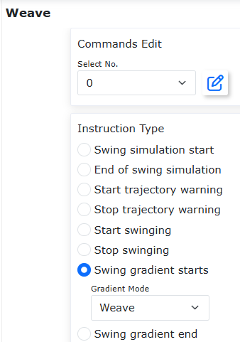

.. centered:: Schemat 9.29-15 Ustawienie trybu stopniowej zmiany „Wahadło”

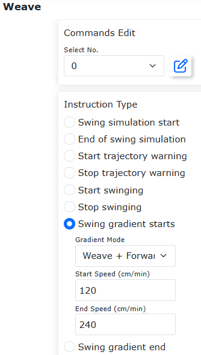

.. centered:: Schemat 9.29-16 Ustawienie trybu stopniowej zmiany „Wahadło + prędkość posuwu”

**Krok 3**: Napisanie programu stopniowej zmiany wahadła. Kliknij „Rozpocznij wahadło”, wybierz początkowy numer wahadła i dodaj. Następnie kliknij „Rozpocznij stopniową zmianę wahadła”, ustaw końcowy numer wahadła i tryb stopniowej zmiany, a następnie dodaj. Kolejno kliknij „Zakończ stopniową zmianę wahadła” i „Zatrzymaj wahadło” i dodaj. Na koniec ręcznie dodaj do programu lua pozycję punktu początkowego i końcowego wahadła, aby wygenerować typowy program lua.

.. image:: coding/548.png
   :width: 4in
   :align: center

.. centered:: Schemat 9.29-17 Typowy program stopniowej zmiany czasu postoju wahadła

Funkcja wahadła punktowego
++++++++++++++++++++++++++

Przegląd
**************

Dla typów wahadła trójkątnego, wahadła trójkątnego w kształcie litery L, wahadła okrągłego - zgodnie z ruchem wskazówek zegara, wahadła okrągłego - przeciwnie do ruchu wskazówek zegara, wahadła sinusoidalnego, wahadła sinusoidalnego w kształcie litery L i wahadła trójkątnego do spawania pionowego, dodano funkcję wahadła punktowego: końcówka robota wykonuje tylko ruch wahadłowy bez ruchu do przodu. Należy pamiętać, że funkcja ta wymaga wcześniejszego skalibrowania współrzędnych punktu środka narzędzia (TCP).

Procedura operacyjna
***********************************

**Krok 1**: Ustawienie parametrów wahadła. Kliknij przyciski „Program nauczania” - „Programowanie” - „Wahadło”, edytuj numer wahadła, aby ustawić parametry wahadła. Należy pamiętać: jeśli rzeczywisty czas wahadła punktowego ma być zgodny z ustawionym czasem, nie można ustawić czasu postoju.

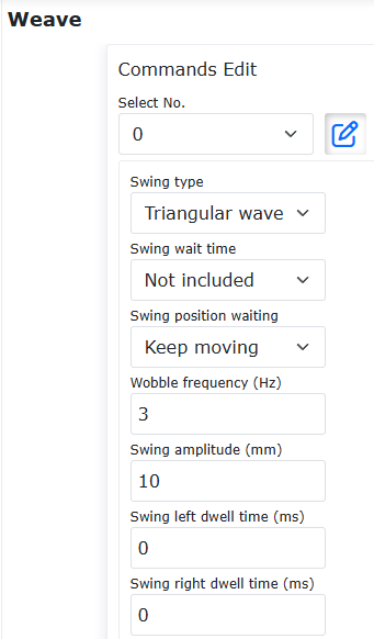

.. centered:: Schemat 9.29-18 Ustawienie parametrów wahadła

**Krok 2**: Ustawienie parametrów wahadła punktowego. Kliknij przyciski „Program nauczania” - „Programowanie” - „Wahadło” - „Rozpocznij wahadło punktowe”, ustaw parametry odniesienia wahadła i czasu wahadła, kliknij „Dodaj”, następnie kliknij przycisk „Zakończ wahadło punktowe” i kliknij „Dodaj”. Odniesienie wahadła może być wybrane jako „Układ współrzędnych narzędzia” lub „Punkt odniesienia”. Gdy wybrano „Układ współrzędnych narzędzia” jako odniesienie wahadła, kierunek X bieżącego układu współrzędnych narzędzia będzie kierunkiem ruchu do przodu, a kierunek Y bieżącego układu współrzędnych narzędzia będzie kierunkiem wahadła. Gdy wybrano „Punkt odniesienia” jako odniesienie wahadła, linia łącząca bieżący punkt z punktem odniesienia będzie kierunkiem ruchu do przodu, a kierunek wahadła zostanie określony przez algorytm wahadła. Należy pamiętać, że punkt odniesienia i bieżąca pozycja muszą mieć ten sam układ współrzędnych narzędzia i układ współrzędnych obiektu. Oba typy odniesienia wahadła pokazano odpowiednio na rysunkach.

.. image:: coding/559.png
   :width: 2in
   :align: center

.. centered:: Schemat 9.29-19 Odniesienie wahadła jako „Układ współrzędnych narzędzia”

.. image:: coding/560.png
   :width: 2in
   :align: center

.. centered:: Schemat 9.29-20 Odniesienie wahadła jako „Punkt odniesienia”

**Krok 3**: Napisanie programu wahadła punktowego. Programy lua wygenerowane dla obu typów odniesienia wahadła pokazano odpowiednio na rysunkach. Uruchom program lua, aby zrealizować funkcję wahadła punktowego.

.. image:: coding/561.png
   :width: 4in
   :align: center

.. centered:: Schemat 9.29-21 Program wahadła punktowego z odniesieniem „Układ współrzędnych narzędzia”

.. image:: coding/562.png
   :width: 4in
   :align: center

.. centered:: Schemat 9.29-22 Program wahadła punktowego z odniesieniem „Punkt odniesienia”

Funkcja wahadła punktowego z laserem
++++++++++++++++++++++++++++++++++++

Przegląd
***********************************

Funkcja wahadła punktowego z laserem jest połączeniem funkcji wahadła punktowego robota i funkcji śledzenia laserowego: na podstawie oryginalnego wahadła punktowego robota, pozycja wahadła może być korygowana przez funkcję śledzenia laserowego i może być dostosowana do ruchu osi rozszerzonej. Funkcja ta działa tylko dla typów wahadła „Wahadło trójkątne” i „Wahadło sinusoidalne”.

Procedura operacyjna wahadła punktowego z laserem
*************************************************

**Krok 1**: Konfiguracja komunikacji laserowej. Szczegółowe kroki operacyjne znajdują się w odpowiedniej części instrukcji użytkownika. W przypadku zastosowań wymagających rzeczywistego spawania należy pamiętać:

   - (1) Czujnik lasera liniowego musi być wyposażony w osłonę ochronną, aby uniknąć wpływu silnego światła i odprysków spawalniczych.
   - (2) Punkt identyfikacji zbierania danych lasera liniowego powinien znajdować się w pewnej odległości od punktu spawania, aby zmniejszyć wpływ silnego światła spawania na jakość zbierania danych laserowych.

**Krok 2**: Kalibracja układu współrzędnych narzędzia robota i układu współrzędnych lasera. Szczegółowe kroki operacyjne znajdują się w odpowiedniej części instrukcji użytkownika.

**Krok 3**: Dostosowanie pozycji przedmiotu obrabianego i wiązki lasera. Schemat pokazano poniżej, gdzie czarny prostokąt to przedmiot obrabiany, a czerwony odcinek to wiązka lasera. Aby uzyskać lepszy efekt śledzenia, wiązka lasera powinna być prostopadła do śledzonej krawędzi przedmiotu obrabianego.

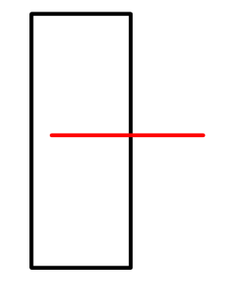

.. centered:: Schemat 9.29-23 Schemat przedmiotu obrabianego i wiązki lasera

**Krok 4**: Ustawienie parametrów wahadła. Kliknij przyciski „Program nauczania” - „Programowanie” - „Wahadło”, edytuj numer wahadła, aby ustawić parametry wahadła. Należy pamiętać: (1) Funkcja wahadła punktowego z laserem działa tylko dla typów wahadła „Wahadło trójkątne” i „Wahadło sinusoidalne”. (2) Jeśli rzeczywisty czas wahadła punktowego ma być zgodny z ustawionym czasem, nie można ustawić lewego i prawego czasu postoju. (3) Aby zapewnić efekt śledzenia laserowego, lewy i prawy czas postoju muszą być takie same.

.. image:: coding/564.png
   :width: 3in
   :align: center

.. centered:: Schemat 9.29-24 Ustawienie parametrów wahadła

**Krok 5**: Ustawienie parametrów wahadła punktowego. Kliknij przyciski „Program nauczania” - „Programowanie” - „Wahadło” - „Rozpocznij wahadło punktowe”, ustaw parametry odniesienia wahadła i czasu wahadła, kliknij „Dodaj”, następnie kliknij przycisk „Zakończ wahadło punktowe” i kliknij „Dodaj”. Odniesienie wahadła może być wybrane jako „Układ współrzędnych narzędzia” lub „Punkt odniesienia”. Gdy wybrano „Układ współrzędnych narzędzia” jako odniesienie wahadła, kierunek X bieżącego układu współrzędnych narzędzia będzie kierunkiem ruchu do przodu, a kierunek Y bieżącego układu współrzędnych narzędzia będzie kierunkiem wahadła. Gdy wybrano „Punkt odniesienia” jako odniesienie wahadła, linia łącząca bieżący punkt z punktem odniesienia będzie kierunkiem ruchu do przodu, a kierunek wahadła zostanie określony przez algorytm wahadła. Należy pamiętać, że punkt odniesienia i bieżąca pozycja muszą mieć ten sam układ współrzędnych narzędzia i układ współrzędnych obiektu.

.. image:: coding/559.png
   :width: 2in
   :align: center

.. centered:: Schemat 9.29-25 Odniesienie wahadła jako „Układ współrzędnych narzędzia”

.. image:: coding/560.png
   :width: 2in
   :align: center

.. centered:: Schemat 9.29-26 Odniesienie wahadła jako „Punkt odniesienia”

**Krok 6**: Dodanie instrukcji śledzenia laserowego. Kolejno kliknij przyciski „Program nauczania” - „Programowanie” - „Śledzenie laserowe”, następnie kliknij „Rozpocznij śledzenie” i wybierz układ współrzędnych lasera skalibrowany w kroku 2 (w podręczniku jako przykład użyto toolcoord5), a na koniec kliknij „Zatrzymaj śledzenie”.

.. image:: coding/565.png
   :width: 3in
   :align: center

.. centered:: Schemat 9.29-27 Ustawienie śledzenia laserowego

**Krok 7**: Napisanie programu lua dla wahadła punktowego z laserem. Dostosuj kolejność instrukcji wygenerowanych w krokach 5 i 6. Programy lua wygenerowane dla obu typów odniesienia wahadła punktowego pokazano odpowiednio na poniższych rysunkach. Czas działania programu zależy tylko od ustawionego czasu wahadła punktowego, a nie od prędkości interfejsu. Uruchom program lua, aby zrealizować funkcję wahadła punktowego z laserem.

.. image:: coding/566.png
   :width: 4in
   :align: center

.. centered:: Schemat 9.29-28 Program wahadła punktowego z laserem 1

.. image:: coding/567.png
   :width: 4in
   :align: center

.. centered:: Schemat 9.29-29 Program wahadła punktowego z laserem 2

Procedura operacyjna wahadła punktowego z laserem i osią rozszerzoną
********************************************************************

**Krok 1**: Konfiguracja komunikacji laserowej. Szczegółowe kroki operacyjne znajdują się w odpowiedniej części instrukcji użytkownika. W przypadku zastosowań wymagających rzeczywistego spawania należy pamiętać:

   - (1) Czujnik lasera liniowego musi być wyposażony w osłonę ochronną, aby uniknąć wpływu silnego światła i odprysków spawalniczych.
   - (2) Punkt identyfikacji zbierania danych lasera liniowego powinien znajdować się w pewnej odległości od punktu spawania, aby zmniejszyć wpływ silnego światła spawania na jakość zbierania danych laserowych.

**Krok 2**: Konfiguracja komunikacji osi rozszerzonej. Szczegółowe kroki operacyjne znajdują się w odpowiedniej części instrukcji użytkownika.

**Krok 3**: Kalibracja układu współrzędnych narzędzia robota i układu współrzędnych lasera. Szczegółowe kroki operacyjne znajdują się w odpowiedniej części instrukcji użytkownika.

**Krok 4**: Dostosowanie pozycji przedmiotu obrabianego i wiązki lasera. Schemat pokazano poniżej, gdzie czarny prostokąt to przedmiot obrabiany, a czerwony odcinek to wiązka lasera. Aby uzyskać lepszy efekt śledzenia, wiązka lasera powinna być prostopadła do śledzonej krawędzi przedmiotu obrabianego.

.. centered:: Schemat 9.29-30 Schemat względnej pozycji przedmiotu obrabianego i wiązki lasera

**Krok 5**: Ustawienie parametrów wahadła. Kliknij przyciski „Program nauczania” - „Programowanie” - „Wahadło”, edytuj numer wahadła, aby ustawić parametry wahadła. Należy pamiętać: (1) Funkcja wahadła punktowego z laserem i osią rozszerzoną działa tylko dla typów wahadła „Wahadło trójkątne” i „Wahadło sinusoidalne”. (2) Jeśli rzeczywisty czas wahadła punktowego ma być zgodny z ustawionym czasem, nie można ustawić lewego i prawego czasu postoju. (3) Aby zapewnić efekt śledzenia laserowego, lewy i prawy czas postoju muszą być takie same.

.. image:: coding/564.png
   :width: 3in
   :align: center

.. centered:: Schemat 9.29-31 Ustawienie parametrów wahadła

**Krok 6**: Ustawienie parametrów wahadła punktowego. Kliknij przyciski „Program nauczania” - „Programowanie” - „Wahadło” - „Rozpocznij wahadło punktowe”, ustaw parametry odniesienia wahadła i czasu wahadła, kliknij „Dodaj”, następnie kliknij przycisk „Zakończ wahadło punktowe” i kliknij „Dodaj”. Odniesienie wahadła może być wybrane jako „Układ współrzędnych narzędzia” lub „Punkt odniesienia”. Gdy wybrano „Układ współrzędnych narzędzia” jako odniesienie wahadła, kierunek X bieżącego układu współrzędnych narzędzia będzie kierunkiem ruchu do przodu, a kierunek Y bieżącego układu współrzędnych narzędzia będzie kierunkiem wahadła. Gdy wybrano „Punkt odniesienia” jako odniesienie wahadła, linia łącząca bieżący punkt z punktem odniesienia będzie kierunkiem ruchu do przodu, a kierunek wahadła zostanie określony przez algorytm wahadła. Należy pamiętać, że punkt odniesienia i bieżąca pozycja muszą mieć ten sam układ współrzędnych narzędzia i układ współrzędnych obiektu.

.. image:: coding/559.png
   :width: 2in
   :align: center

.. centered:: Schemat 9.29-32 Odniesienie wahadła jako „Układ współrzędnych narzędzia”

.. image:: coding/560.png
   :width: 2in
   :align: center

.. centered:: Schemat 9.29-33 Odniesienie wahadła jako „Punkt odniesienia”

**Krok 7**: Dodanie instrukcji ruchu osi rozszerzonej. Kolejno kliknij przyciski „Program nauczania” - „Programowanie” - „Oś rozszerzona”, następnie kliknij „Instrukcja ruchu”, wybierz „Sposób ruchu” jako „Asynchroniczny”, wybierz punkt początkowy i końcowy ruchu, kliknij przycisk „Dodaj”.

.. image:: coding/568.png
   :width: 4in
   :align: center

.. centered:: Schemat 9.29-34 Dodanie ruchu osi rozszerzonej

**Krok 8**: Dodanie instrukcji śledzenia laserowego. Kolejno kliknij przyciski „Program nauczania” - „Programowanie” - „Śledzenie laserowe”, następnie kliknij „Rozpocznij śledzenie” i wybierz układ współrzędnych lasera skalibrowany w kroku 3 (w podręczniku jako przykład użyto toolcoord5), a na koniec kliknij „Zatrzymaj śledzenie”.

.. image:: coding/565.png
   :width: 3in
   :align: center

.. centered:: Schemat 9.29-35 Ustawienie śledzenia laserowego

**Krok 9**: Napisanie programu lua dla wahadła punktowego z laserem i osią rozszerzoną. Dostosuj kolejność instrukcji wygenerowanych w krokach 5, 6 i 7. Programy lua wygenerowane dla obu typów odniesienia wahadła punktowego pokazano odpowiednio na rysunkach 3-7 i 3-8. Czas działania programu zależy tylko od ustawionego czasu wahadła punktowego, a nie od prędkości interfejsu. Uruchom program lua, aby zrealizować funkcję wahadła punktowego z laserem i osią rozszerzoną.

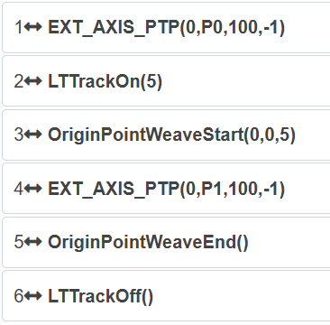

.. centered:: Schemat 9.29-36 Program wahadła punktowego z laserem i osią rozszerzoną 1

.. image:: coding/570.png
   :width: 4in
   :align: center

.. centered:: Schemat 9.29-37 Program wahadła punktowego z laserem i osią rozszerzoną 2

Komunikacja Modbus RTU robota
~~~~~~~~~~~~~~~~~~~~~~~~~~~~~

Przegląd
++++++++

Modbus RTU to powszechnie używany protokół komunikacyjny w produkcji przemysłowej. Roboty współpracujące FANUC oferują dwa sposoby komunikacji z urządzeniami: jako master Modbus RTU i jako slave Modbus RTU. Robot współpracujący może obsługiwać jednocześnie do 8 masterów Modbus RTU do komunikacji z urządzeniami zewnętrznymi, każdy master obsługuje do 128 rejestrów. Slave Modbus RTU robota współpracującego ma 64 cewki, 64 dyskretne wejścia, 32 rejestry holdingowe i 32 rejestry wejściowe (typy danych rejestrów holdingowych i wejściowych obejmują dwa typy: ze znakiem i zmiennoprzecinkowy).

Jednocześnie część adresów rejestrów wejściowych slave'a Modbus RTU robota współpracującego jest przeznaczona do zwracania informacji o bieżącej pozycji stawów robota, prędkości ruchu itp., a część adresów rejestrów cewek jest przeznaczona do sterowania robotem, takimi jak uruchamianie programu, zatrzymywanie programu, ustawianie DO szafy sterowniczej itp. Slave Modbus RTU robota obsługuje połączenie tylko z jednym masterem. Poniżej znajdują się szczegółowe instrukcje użycia.

Instrukcje obsługi mastera Modbus RTU robota
++++++++++++++++++++++++++++++++++++++++++++

Przed użyciem robota współpracującego jako mastera Modbus RTU do komunikacji z urządzeniami, najpierw sprawdź fizyczne połączenie 485 między urządzeniami a robotem. Korzystanie z mastera Modbus RTU robota obejmuje następujące kroki: ① Dodanie mastera; ② Dodanie rejestrów; ③ Testowanie komunikacji; ④ Napisanie programu użytkownika; ⑤ Wykonanie programu użytkownika;

Dodanie mastera Modbus RTU
**************************

Otwórz WebApp, kolejno kliknij „Symulacja nauczania”, „Programowanie nauczania”, utwórz nowy program użytkownika „testModbusRTUMaster.lua”.

.. image:: coding/340.png
   :width: 6in
   :align: center

.. centered:: Schemat 9.30-1 Tworzenie programu użytkownika mastera Modbus RTU

Kliknij przycisk „Ustawienia Modbus RTU”, aby otworzyć stronę konfiguracji funkcji Modbus RTU.

.. image:: coding/341.png
   :width: 4in
   :align: center

.. centered:: Schemat 9.30-2 Otwarcie ustawień Modbus RTU

Kolejno kliknij „Ustawienia mastera”, „Dodaj mastera Modbus”, aby dodać mastera Modbus RTU.

.. image:: coding/342.png
   :width: 4in
   :align: center

.. centered:: Schemat 9.30-3 Dodanie „mastera Modbus RTU”

Zgodnie z sytuacją urządzenia slave kolejno wybierz „Prędkość transmisji”, „Bity danych”, „Parzystość” i „Bity stopu”. Znaczenie powyższych parametrów jest następujące:

**Prędkość transmisji**: Prędkość transmisji używana do komunikacji Modbus RTU, obsługiwane wartości: 9600, 14400, 19200, 38400, 56000, 67600, 115200, 128000, domyślnie 115200. Ustaw zgodnie z ustawieniami slave'a.

**Bity danych**: Obecnie obsługiwane jest tylko ustawienie na 8 bitów. Ustaw zgodnie z ustawieniami slave'a.

**Parzystość**: Sposób parzystości, obsługiwane wartości: None, Odd, Even, domyślnie None. Ustaw zgodnie z ustawieniami slave'a.

**Bity stopu**: Obsługiwane wartości: 0,5, 1, 1,5, 2, domyślnie 1. Ustaw zgodnie z ustawieniami slave'a.

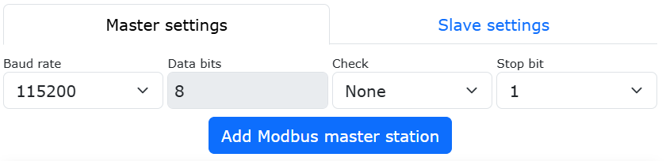

.. centered:: Schemat 9.30-4 Ustawienie parametrów mastera Modbus RTU

Po prawidłowym wprowadzeniu powyższych parametrów master Modbus RTU robota może przystąpić do komunikacji z slave'em. (Jeśli potwierdziłeś, że parametry mastera Modbus RTU zostały poprawnie skonfigurowane, ale robot komunikuje się pomyślnie z urządzeniem, sprawdź następujące konfiguracje:

① Fizyczne połączenie 485 między robotem a urządzeniem slave; ② Sprawdź konfigurację komunikacji urządzenia slave i zaleca się najpierw przetestowanie poprawności łącza komunikacyjnego za pomocą asystenta portu szeregowego. Na przykład, skonfiguruj parametry Modbus RTU zgodne z robotem na komputerze PC, utwórz nowy rejestr na interfejsie web robota i wykonaj operację odczytu rejestru holdingowego 0x03, aby sprawdzić, czy asystent portu szeregowego może odebrać dane. Jak pokazano na poniższym rysunku, odczytując rejestr pod adresem 0x1000 za pomocą instrukcji 0x03, komputer PC może normalnie odebrać dane, co oznacza, że konfiguracja komunikacji jest prawidłowa.

.. image:: coding/344.png
   :width: 4in
   :align: center

.. centered:: Schemat 9.30-5 Weryfikacja stanu połączenia Modbus

W ten sposób zakończyliśmy tworzenie mastera Modbus RTU robota. Jeśli ponownie klikniesz „Dodaj mastera Modbus”, możesz utworzyć kolejnego nowego mastera Modbus RTU (rysunek 2-6). Robot obsługuje jednoczesną komunikację maksymalnie 8 masterów z urządzeniami zewnętrznymi. Kliknij dwukrotnie przycisk „Usuń” w prawym górnym rogu mastera Modbus, aby go usunąć.

.. image:: coding/345.png
   :width: 4in
   :align: center

.. centered:: Schemat 9.30-6 Ponowne dodanie mastera Modbus RTU

Dodawanie rejestrów mastera Modbus RTU
**************************************

Kliknij przycisk „Dodaj rejestr mastera”, aby dodać rejestr dla tego mastera.

.. image:: coding/346.png
   :width: 4in
   :align: center

.. centered:: Schemat 9.30-7 Dodawanie rejestru mastera Modbus RTU

Kolejno wybierz typ rejestru mastera, wprowadź numer adresu i nazwę. Znaczenie poszczególnych parametrów jest następujące:

**Typ**: Kod funkcji Modbus, 0x01 - odczyt cewek; 0x02 - odczyt dyskretnych wejść; 0x03 - odczyt rejestrów holdingowych (typ ze znakiem -32768-32767); 0x03 - odczyt rejestrów holdingowych (typ zmiennoprzecinkowy, długość danych 32 bity, zajmuje dwa rejestry, 4 bajty); 0x04 - odczyt rejestrów wejściowych (typ ze znakiem -32768-32767); 0x04 - odczyt rejestrów wejściowych (typ zmiennoprzecinkowy, długość danych 32 bity, zajmuje dwa rejestry, 4 bajty); 0x05 - zapis pojedynczej cewki; 0x06 - zapis pojedynczego rejestru holdingowego; 0x0F - zapis wielu cewek; 0x03 - odczyt rejestrów holdingowych (typ ze znakiem -32768-32767); 0x03 - odczyt rejestrów holdingowych (typ zmiennoprzecinkowy, długość danych 32 bity, zajmuje dwa rejestry, 4 bajty). Rejestry zmiennoprzecinkowe do odczytu i zapisu są wyświetlane w formacie big-endian.

**Adres rejestru**: Adres rejestru slave'a Modbus RTU do odczytu lub zapisu;

**Liczba rejestrów**: Liczba rejestrów do odczytu lub zapisu podczas odczytu lub zapisu wielu rejestrów (dla 0x05, 0x06 liczba może być tylko 1), maksymalnie 12 rejestrów.

**Wartość adresu**: Wartość wyświetlana przy odczycie lub wartość do zapisu (podczas zapisu wielu wartości oddziel je przecinkami w języku angielskim „,”)

.. image:: coding/347.png
   :width: 4in
   :align: center

.. centered:: Schemat 9.30-8 Ustawienie parametrów rejestru mastera Modbus RTU

Ponownie kliknij przycisk „Dodaj rejestr mastera”, aby dodać kolejny rejestr mastera. Kliknij dwukrotnie przycisk „Usuń” po prawej stronie rejestru, aby go usunąć. Poniższy rysunek przedstawia rejestry obsługiwanych kodów funkcji.

.. image:: coding/348.png
   :width: 4in
   :align: center

.. centered:: Schemat 9.30-9 Dodawanie wielu rejestrów mastera

Testowanie komunikacji mastera Modbus RTU
*****************************************

Rejestry mastera Modbus robota mają pole wartości „Wartość adresu” do wyświetlania bieżącej wartości rejestru. Rejestry typów 0x01, 0x02, 0x03, 0x04 są typu tylko do odczytu, a odpowiadające im pola wartości adresu są szare i nieedytowalne. Gdy wartość odpowiedniego adresu slave'a się zmieni, kliknij przycisk odczytu na masterze, aby odczytać wartość adresu odpowiedniego rejestru i wyświetlić bieżącą wartość. Kody funkcji 0x05, 0x06, 0x0F, 0x10 to operacje zapisu, ich adresy są białymi, edytowalnymi polami. Wartość rejestru można zmodyfikować na stronie ustawień mastera Modbus robota.

.. image:: coding/349.png
   :width: 4in
   :align: center

.. centered:: Schemat 9.30-10 Wartości adresów mastera Modbus

Test odczytu rejestru mastera
"""""""""""""""""""""""""""""

Na zewnętrznym urządzeniu slave Modbus RTU odczytaj kolejno 10 cewek pod adresem 0x4000, 12 dyskretnych wejść pod adresem 0x3000, 2 rejestry holdingowe pod adresem 0x2010 w formacie int16, oraz 1 liczbę zmiennoprzecinkową z rejestru wejściowego pod adresem 0x1029. W tym momencie wartości adresów odpowiednich rejestrów na stronie ustawień mastera Modbus robota wyświetlą się odpowiednio. Wysłane ramki danych pokazano na rysunku (ponieważ ustawiono odczyt rejestru pod adresem 0x1029 jako typ zmiennoprzecinkowy, faktycznie odczytuje on dwa 16-bitowe rejestry 0x1029 i 0x102A do przechowania jednej liczby zmiennoprzecinkowej, ale liczbę odczytów należy ustawić na 1).

.. image:: coding/350.png
   :width: 4in
   :align: center

.. centered:: Schemat 9.30-11 Wyświetlanie wartości odczytanych rejestrów przez mastera Modbus (zrzut ramki instrukcji)

Test zapisu rejestru mastera
""""""""""""""""""""""""""""

Na stronie ustawień mastera Modbus RTU robota, dla adresu 0x1000 zapisz pojedynczą cewkę z wartością 1; dla adresu 0x1001 zapisz pojedynczy rejestr z wartością 2001; dla adresu 0x2000 zapisz 5 cewek z wartościami 1,1,0,1,1; dla adresu 0x2010 zapisz 2 rejestry holdingowe, typ danych int16, z wartościami 3001, 3002; dla adresu 0x1029 zapisz jeden rejestr holdingowy typu zmiennoprzecinkowego (w rzeczywistości dwa 16-bitowe rejestry) z wartością 21,55. Odpowiednie adresy rejestrów slave'a Modbus zostały zapisane z odpowiednimi wartościami.

.. image:: coding/351.png
   :width: 4in
   :align: center

.. centered:: Schemat 9.30-12 Operacja zapisu mastera Modbus RTU (zrzut ramki instrukcji)

Pisanie programu mastera Modbus RTU
***********************************

Otwórz stronę dodawania instrukcji komunikacyjnych.

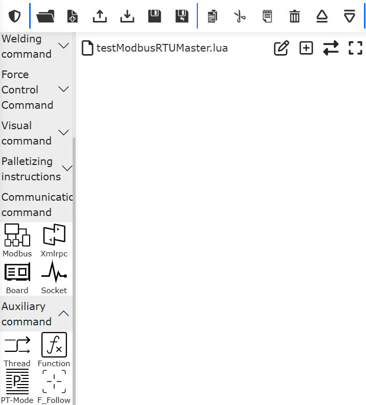

.. centered:: Schemat 9.30-13 Otwarcie strony dodawania instrukcji komunikacyjnych

Kliknij „Modbus”.

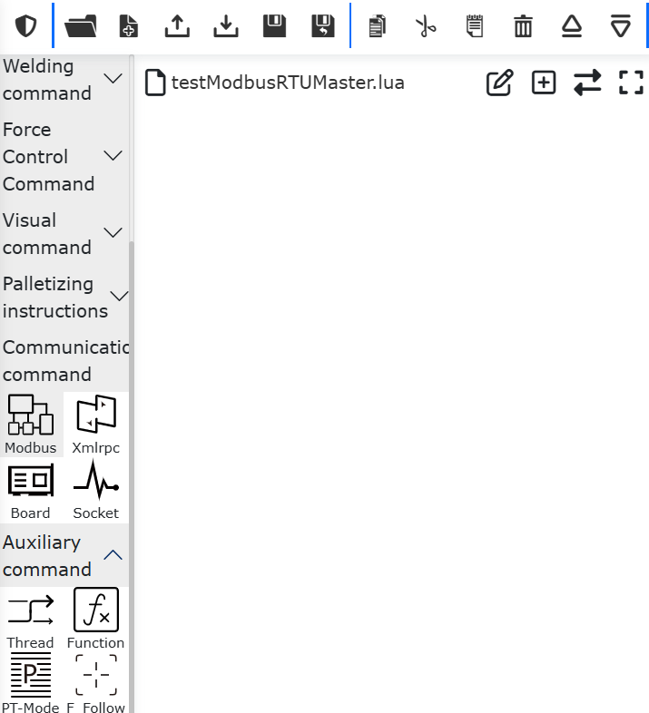

.. centered:: Schemat 9.30-14 Wybór Modbus

Kliknij „Modbus_RTU”, wybierz „Master (klient)”, aby otworzyć stronę dodawania instrukcji mastera Modbus RTU.

.. image:: coding/354.png
   :width: 4in
   :align: center

.. centered:: Schemat 9.30-15 Wybór Modbus_RTU

Zapis pojedynczej cewki
"""""""""""""""""""""""

Wybierz „Zapis rejestru”, kod funkcji 0x05 - pojedyncza cewka, adres rejestru/cewki 0x1000, wartość rejestru/liczba cewek 1, tablica bajtów {1}. Kliknij przycisk „Dodaj”. Na koniec przewiń na sam dół strony i kliknij przycisk „Zastosuj” (rysunek 2-16).

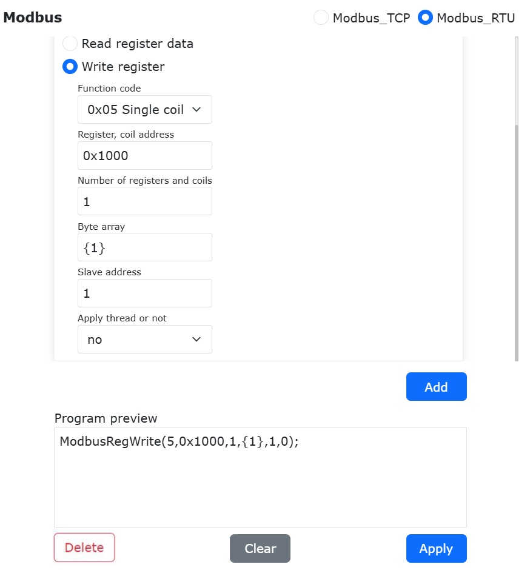

.. centered:: Schemat 9.30-16 Zapis pojedynczej cewki

W tym momencie do programu „testModbusRTUSlave.lua” robota została dodana instrukcja zapisu pojedynczego wyjścia cyfrowego mastera Modbus robota. Przełącz robota w tryb automatyczny, kliknij przycisk startu. Master robota ustawi wartość adresu rejestru cewki 0x1000 na 1.

.. centered:: Schemat 9.30-17 Program LUA zapisu pojedynczej cewki

Zapis wielu cewek
"""""""""""""""""

Wybierz „Zapis rejestru”, kod funkcji 0x0F - wiele cewek, adres rejestru/cewki 0x1010, wartość rejestru/liczba cewek 3, tablica bajtów {1,0,1}. Kliknij przycisk „Dodaj”. Na koniec przewiń na sam dół strony i kliknij przycisk „Zastosuj” (rysunek 2-18).

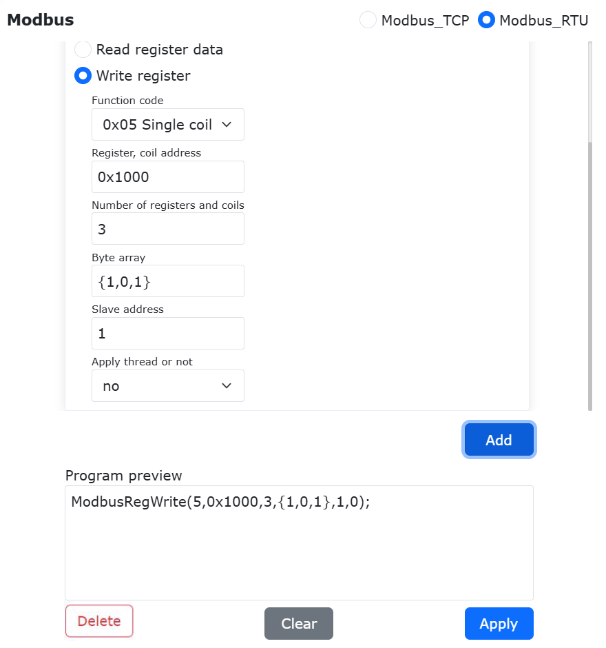

.. centered:: Schemat 9.30-18 Zapis wielu cewek

W tym momencie do programu „testModbusRTUSlave.lua” robota została dodana instrukcja zapisu pojedynczego wyjścia cyfrowego mastera Modbus robota. Przełącz robota w tryb automatyczny, kliknij przycisk startu. Master robota ustawi wartość adresu rejestru cewki 0x1000 na 1.

.. image:: coding/358.png
   :width: 4in
   :align: center

.. centered:: Schemat 9.30-19 Program LUA zapisu wielu cewek

Odczyt cewek i dyskretnych wejść
""""""""""""""""""""""""""""""""

Wybierz „Instrukcja odczytu rejestru”, kod funkcji 0x01 - cewki (jeśli potrzebujesz odczytać dyskretne wejścia, wybierz 0x02 - dyskretne wejścia), adres rejestru/cewki 0x2000, liczba rejestrów/cewek 3. Kliknij przycisk „Dodaj”. Jednocześnie wybierz „Odczyt danych rejestru”, liczba rejestrów/cewek/dyskretnych wejść 3. Kliknij przycisk „Dodaj”. Na koniec przewiń na sam dół strony i kliknij „Zastosuj” (rysunek 2-20).

.. image:: coding/359.png
   :width: 4in
   :align: center

.. image:: coding/394.png
   :width: 4in
   :align: center

.. centered:: Schemat 9.30-20 Odczyt cewek

W tym momencie do programu „testModbusRTUSlave.lua” robota zostały dodane dwie instrukcje odczytu cewek mastera Modbus robota.

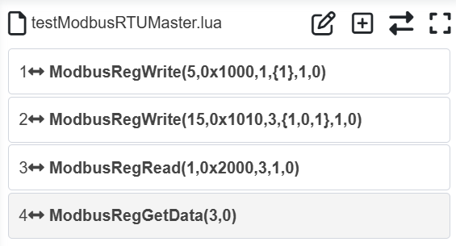

.. centered:: Schemat 9.30-21 Program odczytu pojedynczej cewki

Zazwyczaj po odczytaniu rejestru Modbus odczytaną wartość przechowuje się w zmiennej. Dlatego należy zdefiniować zmienną do przechowywania odczytanej wartości. Kliknij przycisk „Przełącz tryb”, aby przełączyć program lua robota w stan edytowalny. Przed instrukcją „ModbusRegRead” dodaj zmienne zwracane „value1”, „value2”, „value3”. Po wykonaniu programu odczytane wartości będą przechowywane w zmiennych „value1”, „value2”, „value3”.

.. image:: coding/361.png
   :width: 6in
   :align: center

.. centered:: Schemat 9.30-22 Odczyt wielu wartości cewek do zmiennych

Wartości rejestrów typu cewka i dyskretne wejścia to tylko 0 i 1. W programie robota można wykonywać różne operacje w zależności od odczytanej wartości rejestru.

Odczyt rejestrów holdingowych i wejściowych
"""""""""""""""""""""""""""""""""""""""""""

Wybierz „Instrukcja odczytu rejestru”, kod funkcji 0x03 - cewki (jeśli potrzebujesz odczytać rejestry wejściowe, wybierz 0x04 - rejestry wejściowe), adres rejestru/cewki 0x4000, liczba rejestrów/cewek 5. Kliknij przycisk „Dodaj”. Jednocześnie wybierz „Odczyt danych rejestru”, liczba rejestrów/cewek/dyskretnych wejść 5. Kliknij przycisk „Dodaj”. Na koniec przewiń na sam dół strony i kliknij „Zastosuj” (rysunek 2-23).

.. image:: coding/362.png
   :width: 4in
   :align: center

.. image:: coding/395.png
   :width: 4in
   :align: center

.. centered:: Schemat 9.30-23 Odczyt rejestrów holdingowych

W tym momencie do programu „testModbusRTUSlave.lua” robota zostały dodane dwie instrukcje odczytu cewek mastera Modbus robota.

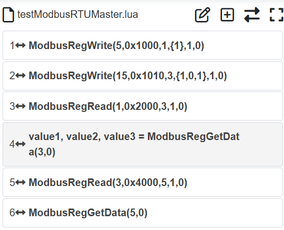

.. centered:: Schemat 9.30-24 Program odczytu pojedynczej cewki

Zazwyczaj po odczytaniu rejestru Modbus odczytaną wartość przechowuje się w zmiennej. Dlatego należy zdefiniować zmienne do przechowywania odczytanych wartości. Kliknij przycisk „Przełącz tryb”, aby przełączyć program lua robota w stan edytowalny. Przed instrukcją „ModbusRegRead” dodaj zmienne zwracane „value1”, „value2”, „value3”, „value4”, „value5”. Po wykonaniu programu odczytane wartości będą przechowywane w zmiennych „value1”, „value2”, „value3”, „value4”, „value5”.

.. image:: coding/364.png
   :width: 6in
   :align: center

.. centered:: Schemat 9.30-25 Odczyt wielu wartości rejestrów holdingowych do zmiennych

Instrukcje obsługi slave'a Modbus RTU robota
++++++++++++++++++++++++++++++++++++++++++++

Slave Modbus RTU robota oferuje cztery typy rejestrów: ogólne wejście cyfrowe (cewki), ogólne wyjście cyfrowe (wejścia dyskretne), ogólne wejście analogowe (rejestry holdingowe) i ogólne wyjście analogowe (rejestry wejściowe). Ogólne wejście cyfrowe i analogowe są używane głównie przez robota do odczytywania danych z zewnętrznego mastera Modbus RTU w celu sterowania robotem, podczas gdy ogólne wyjście cyfrowe i analogowe są używane głównie przez robota do wysyłania sygnałów danych do zewnętrznego urządzenia mastera Modbus RTU, które odczytuje wartości odpowiednich rejestrów, aby sterować swoim działaniem.

Oprócz powyższych ogólnych wejść/wyjść, robot udostępnia również niektóre „funkcyjne wejścia cyfrowe (cewki)” dla zewnętrznego urządzenia mastera do sterowania robotem, takimi jak uruchamianie programu, zatrzymywanie programu itp., oraz niektóre rejestry wejściowe do wyświetlania bieżących informacji o stanie robota, w tym bieżącej pozycji kartezjańskiej robota, bieżącego stanu pracy robota itp. (szczegółowa definicja znajduje się w Załączniku 1: Mapa adresów slave'a Modbus RTU). Proces używania slave'a Modbus RTU robota obejmuje głównie: ① konfigurację parametrów; ② testowanie komunikacji; ③ pisanie programu.

Konfiguracja parametrów komunikacji slave'a Modbus RTU
*******************************************************

Otwórz WebApp, kolejno kliknij „Symulacja nauczania”, „Programowanie nauczania”, utwórz nowy program użytkownika „testModbusRTUSlave.lua”.

.. image:: coding/365.png
   :width: 6in
   :align: center

.. centered:: Schemat 9.30-26 Tworzenie programu użytkownika slave'a Modbus RTU

Kliknij przycisk „Ustawienia Modbus RTU”, aby otworzyć stronę konfiguracji funkcji Modbus RTU.

.. image:: coding/366.png
   :width: 6in
   :align: center

.. centered:: Schemat 9.30-27 Otwarcie ustawień Modbus RTU

Kolejno kliknij „Ustawienia slave'a”, wprowadź prędkość transmisji, bity danych, parzystość, bity stopu i numer slave'a robota. „Prędkość transmisji”, „Bity danych”, „Parzystość”, „Bity stopu” to konfiguracja parametrów robota jako slave'a Modbus RTU. „Numer slave'a” to numer urządzenia slave, do którego master wysyła instrukcje.

.. image:: coding/367.png
   :width: 4in
   :align: center

.. centered:: Schemat 9.30-28 Ustawienia slave'a Modbus RTU

Testowanie komunikacji slave'a Modbus RTU
*****************************************

Ogólne wejście cyfrowe (cewki)
""""""""""""""""""""""""""""""

Slave Modbus RTU robota udostępnia 64 rejestry cewek o adresach 0x4000~0x403F (szczegółowa definicja znajduje się w Załączniku 1: Mapa adresów slave'a Modbus RTU). Ogólne rejestry slave'a Modbus RTU robota mogą mieć aliasy. Zmień nazwę rejestru cewki DI0 slave'a robota na „A gotowe”, a DI1 na „B gotowe”. Zgodnie z mapą adresów, adresy Modbus cewek dla „A gotowe” i „B gotowe” to odpowiednio 0x4000 i 0x4001. Na zewnętrznym urządzeniu master Modbus RTU ustaw wartości adresów cewek slave'a robota 0x4000 i 0x4001 na 1. W tym momencie wskaźniki tych dwóch rejestrów na stronie monitorowania slave'a Modbus RTU robota zaświecą się.

.. image:: coding/368.png
   :width: 4in
   :align: center

.. centered:: Schemat 9.30-29 Monitorowanie stanu cewek slave'a Modbus RTU (zrzut ramki instrukcji)

Ogólne wyjście cyfrowe (wejścia dyskretne)
""""""""""""""""""""""""""""""""""""""""""

Slave Modbus RTU robota udostępnia 64 rejestry wejść dyskretnych o adresach 0x3000-0x303F (szczegółowa definicja znajduje się w Załączniku 1: Mapa adresów slave'a Modbus RTU). Rejestry wejść dyskretnych slave'a Modbus RTU robota również mogą mieć aliasy. Kliknij „Ogólne wyjście cyfrowe (wejście dyskretne)”, aby zmienić nazwę rejestru wejścia dyskretnego DO0 slave'a robota na „A start”, a DO1 na „B start”. Zgodnie z mapą adresów, adresy Modbus wejść dyskretnych dla „A start” i „B start” to odpowiednio 0x3000 i 0x3001. Kliknij wskaźnik wejścia dyskretnego odpowiadający „A start”. Wskaźnik zaświeci się, a wartość odpowiedniego adresu rejestru 0x3000 zmieni się na 1. Na zewnętrznym urządzeniu master Modbus RTU można odczytać wartość tego rejestru.

.. image:: coding/369.png
   :width: 4in
   :align: center

.. centered:: Schemat 9.30-30 Sterowanie wejściem dyskretnym slave'a Modbus RTU

Wejście analogowe (rejestry holdingowe)
"""""""""""""""""""""""""""""""""""""""

Robot udostępnia łącznie 32 rejestry holdingowe trzech typów: bez znaku, ze znakiem i zmiennoprzecinkowy, AI0~AI32 o adresach 0x2000-0x202F (szczegółowa definicja znajduje się w Załączniku 1: Mapa adresów slave'a Modbus RTU). Zakres danych rejestru ze znakiem to -32768~32767, rejestr zmiennoprzecinkowy jest wyświetlany w formacie big-endian. Zmień nazwy AI0 i AI1 odpowiednio na „Napięcie” i „Prąd”. Z mapy adresów slave'a Modbus RTU wynika, że adresy tych dwóch rejestrów to odpowiednio 0x2000 i 0x2001. Gdy podłączone urządzenie master zmodyfikuje wartości adresów rejestrów holdingowych 0x2000 i 0x2001, wartości adresów rejestrów „Napięcie” i „Prąd” na stronie monitorowania slave'a Modbus RTU robota odpowiednio się zaktualizują. Wejście analogowe robota jest używane głównie do uzyskiwania wartości sygnałów z zewnętrznego urządzenia master.

.. image:: coding/370.png
   :width: 4in
   :align: center

.. centered:: Schemat 9.30-31 Monitorowanie wejścia analogowego slave'a Modbus RTU (zrzut ramki instrukcji)

Wyjście analogowe (rejestry wejściowe)
""""""""""""""""""""""""""""""""""""""

Robot udostępnia łącznie 64 rejestry wejściowe trzech typów: bez znaku, ze znakiem i zmiennoprzecinkowy, AO0~AO63 o adresach 0x1000-0x100F, 0x104D-0x106C (szczegółowa definicja znajduje się w Załączniku 1: Mapa adresów slave'a Modbus RTU). Zakres danych rejestru ze znakiem to -32768~32767, rejestr zmiennoprzecinkowy jest wyświetlany w formacie big-endian. Zmień nazwy AO0 i AO1 odpowiednio na „Pozycja docelowa A” i „Pozycja docelowa B”. Wprowadź wartości rejestru wejściowego odpowiednio jako 2000 i 1500. Z mapy adresów slave'a Modbus RTU wynika, że adresy tych dwóch rejestrów to odpowiednio 0x1000 i 0x1001. Gdy podłączone urządzenie master odczyta wartości adresów rejestrów wejściowych 0x1000 i 0x1001, otrzyma ustawione wartości. Wyjście analogowe slave'a robota jest używane głównie do przekazywania wartości sygnałów do zewnętrznego urządzenia master.

.. image:: coding/371.png
   :width: 4in
   :align: center

.. centered:: Schemat 9.30-32 Modyfikacja wejścia analogowego slave'a Modbus

Pisanie programu slave'a Modbus RTU
***********************************

Otwórz stronę dodawania instrukcji komunikacyjnych.

.. centered:: Schemat 9.30-33 Otwarcie strony dodawania instrukcji komunikacyjnych

Kliknij „Modbus”.

.. image:: coding/373.png
   :width: 6in
   :align: center

.. centered:: Schemat 9.30-34 Wybór Modbus

Kliknij „Modbus_RTU”, wybierz „Slave”, aby otworzyć stronę dodawania instrukcji slave'a Modbus RTU.

.. image:: coding/374.png
   :width: 4in
   :align: center

.. centered:: Schemat 9.30-35 Wybór Modbus_RTU, slave

Zapis pojedynczego wyjścia cyfrowego DO (wejście dyskretne)
"""""""""""""""""""""""""""""""""""""""""""""""""""""""""""

Wybierz nazwę DO jako „A start”, liczbę rejestrów jako 1, wartość rejestru jako 0. Kliknij „Zapis pojedynczego wyjścia cyfrowego”. Na koniec przewiń na sam dół strony i kliknij „Zastosuj”.

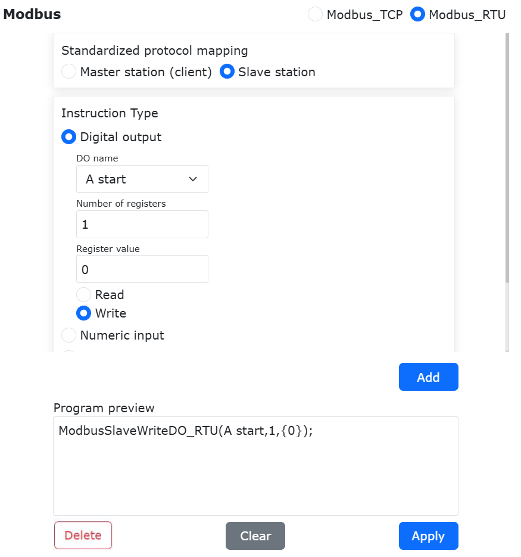

.. centered:: Schemat 9.30-36 Dodanie instrukcji zapisu pojedynczego wyjścia cyfrowego, zastosowanie instrukcji zapisu pojedynczego wyjścia cyfrowego

W tym momencie do programu „testModbusRTUSlave.lua” robota została dodana instrukcja zapisu pojedynczego wyjścia cyfrowego slave'a Modbus robota. Przełącz robota w tryb automatyczny, kliknij przycisk startu. Robot ustawi wartość adresu wyjścia cyfrowego o nazwie „A start” na 0.

.. image:: coding/376.png
   :width: 6in
   :align: center

.. centered:: Schemat 9.30-37 Program LUA zapisu pojedynczego wyjścia cyfrowego

Zapis wielu wyjść cyfrowych DO (wejścia dyskretne)
""""""""""""""""""""""""""""""""""""""""""""""""""

Otwórz stronę dodawania instrukcji slave'a Modbus RTU, znajdź „Ustawienia wyjścia cyfrowego”. Wybierz nazwę DO jako „A start”, liczbę rejestrów jako 5, wartość rejestru jako 1,0,1,0,1 (liczba wartości rejestru musi odpowiadać ustawionej liczbie rejestrów, a wiele wartości rejestru oddzielamy przecinkami w języku angielskim). Kliknij „Zapis wyjścia cyfrowego”. Na koniec przewiń na sam dół strony i kliknij „Zastosuj”.

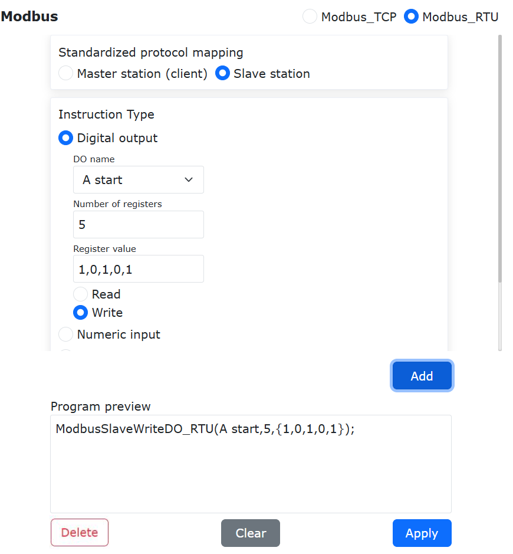

.. centered:: Schemat 9.30-38 Konfiguracja zapisu wielu wyjść cyfrowych, zastosowanie zapisu wielu wyjść cyfrowych

W tym momencie do programu „testModbusRTUSlave.lua” robota została dodana instrukcja zapisu wielu wyjść cyfrowych slave'a Modbus robota. Przełącz robota w tryb automatyczny, kliknij przycisk startu. Robot ustawi wartości rejestrów wejść dyskretnych slave'a, począwszy od „A start” i kolejnych 4, odpowiednio na 1, 0, 1, 0, 1.

.. image:: coding/378.png
   :width: 6in
   :align: center

.. centered:: Schemat 9.30-39 Program LUA zapisu wielu wyjść cyfrowych

Odczyt pojedynczego wyjścia cyfrowego DO (wejście dyskretne)
""""""""""""""""""""""""""""""""""""""""""""""""""""""""""""

Otwórz stronę dodawania instrukcji mastera Modbus RTU, znajdź „Ustawienia wyjścia cyfrowego”. Nazwę DO jako „A start”, liczbę rejestrów jako 1 (wartość rejestru nie jest wymagana). Kliknij „Odczyt wyjścia cyfrowego”. Na koniec przewiń na sam dół strony i kliknij „Zastosuj”.

.. centered:: Schemat 9.30-40 Konfiguracja odczytu pojedynczego wyjścia cyfrowego, zastosowanie odczytu pojedynczego wyjścia cyfrowego

W tym momencie do programu „testModbusRTUSlave.lua” robota została dodana instrukcja odczytu pojedynczego wyjścia cyfrowego slave'a Modbus robota.

.. image:: coding/380.png
   :width: 4in
   :align: center

.. centered:: Schemat 9.30-41 Program odczytu pojedynczego wyjścia cyfrowego

Zazwyczaj po odczytaniu rejestru Modbus odczytaną wartość przechowuje się w zmiennej. Dlatego należy zdefiniować zmienną do przechowywania odczytanej wartości. Kliknij przycisk „Przełącz tryb”, aby przełączyć program lua robota w stan edytowalny. Przed instrukcją „ModbusSlaveReadDO_RTU” dodaj zmienną zwracaną „AStartValue”. Po wykonaniu programu odczytana wartość będzie przechowywana w zmiennej „AStartValue”.

.. image:: coding/381.png
   :width: 4in
   :align: center

.. centered:: Schemat 9.30-42 Odczyt pojedynczego wyjścia cyfrowego do zmiennej

Wartości rejestrów typu cewka to tylko 0 i 1. W programie robota można wykonywać różne operacje w zależności od odczytanej wartości rejestru.

Odczyt wielu wyjść cyfrowych DO (wejścia dyskretne)
"""""""""""""""""""""""""""""""""""""""""""""""""""""""

Otwórz stronę dodawania instrukcji mastera Modbus RTU, znajdź „Ustawienia wyjścia cyfrowego”. Wybierz nazwę DO jako „A start”, liczbę rejestrów jako 2 (wartość rejestru nie jest wymagana). Kliknij „Odczyt wyjścia cyfrowego”. Na koniec przewiń na sam dół strony i kliknij „Zastosuj”.

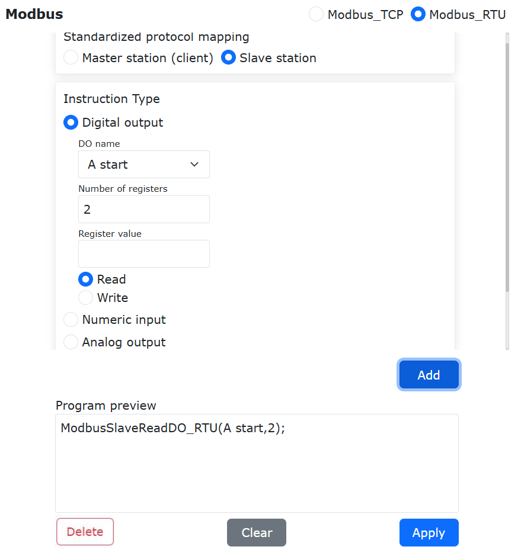

.. centered:: Schemat 9.30-43 Konfiguracja odczytu wielu wyjść cyfrowych, zastosowanie odczytu wielu wyjść cyfrowych

W tym momencie do programu „testModbusRTUSlave.lua” robota została dodana instrukcja odczytu wielu wyjść cyfrowych slave'a Modbus robota.

.. image:: coding/383.png
   :width: 4in
   :align: center

.. centered:: Schemat 9.30-44 Program odczytu wielu wyjść cyfrowych

Kliknij przycisk „Przełącz tryb”, aby przełączyć program lua robota w stan edytowalny. Ponieważ odczytywane są 2 rejestry, przed instrukcją „ModbusSlaveReadDO_RTU” dodaj 2 zmienne zwracane „value1, value2”. Po wykonaniu programu odczytane wartości 2 rejestrów wyjścia cyfrowego będą przechowywane odpowiednio w tych 2 zmiennych. Podobnie możesz sprawdzać wartości „value1”, „value2”, aby robot wykonywał różne czynności.

.. image:: coding/384.png
   :width: 4in
   :align: center

.. centered:: Schemat 9.30-45 Odczyt wielu wyjść cyfrowych do zmiennych

Odczyt wejścia cyfrowego DI (cewki)
"""""""""""""""""""""""""""""""""""

Otwórz stronę dodawania instrukcji slave'a Modbus RTU, znajdź „Ustawienia wejścia cyfrowego”. Wybierz nazwę DI jako „A gotowe”, liczbę rejestrów jako 2. Kliknij „Odczyt wejścia cyfrowego”. Na koniec przewiń na sam dół strony i kliknij „Zastosuj”.

.. image:: coding/385.png
   :width: 4in
   :align: center

.. centered:: Schemat 9.30-46 Konfiguracja odczytu wejścia cyfrowego, zastosowanie odczytu wejścia cyfrowego

W tym momencie do programu „testModbusRTUSlave.lua” robota została dodana instrukcja odczytu wejścia cyfrowego slave'a Modbus robota.

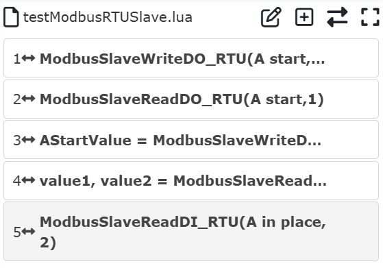

.. centered:: Schemat 9.30-47 Instrukcja programu odczytu wejścia cyfrowego

Kliknij przycisk „Przełącz tryb”, aby przełączyć program lua robota w stan edytowalny. Przed instrukcją „ModbusSlaveReadDI_RTU” dodaj zmienne zwracane „AState, BState”. Po wykonaniu programu odczytane wartości dwóch wejść cyfrowych będą przechowywane odpowiednio w zmiennych „AState” i „BState”. Możesz sterować robotem, sprawdzając wartości tych zmiennych.

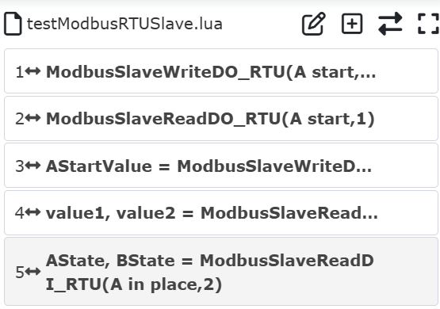

.. centered:: Schemat 9.30-48 Program odczytu wejścia cyfrowego

Operacje odczytu i zapisu na wyjściu analogowym AO (rejestr wejściowy) i wejściu analogowym AI (rejestr holdingowy)
""""""""""""""""""""""""""""""""""""""""""""""""""""""""""""""""""""""""""""""""""""""""""""""""""""""""""""""""""""

Operacje odczytu i zapisu na wyjściu analogowym (rejestr wejściowy) i wejściu analogowym (rejestr holdingowy) są w zasadzie takie same jak na wyjściu cyfrowym (wejście dyskretne) i wejściu cyfrowym (cewka), z tą różnicą, że zakres danych tego ostatniego ogranicza się do 0 lub 1, podczas gdy zakres danych tego pierwszego jest szerszy. Dlatego szczegółowe operacje można znaleźć w opisie pisania programów dla wyjścia cyfrowego i wejścia cyfrowego. Tutaj przedstawiono tylko przykłady programu dla operacji odczytu na AI i operacji odczytu/zapisu na AO.

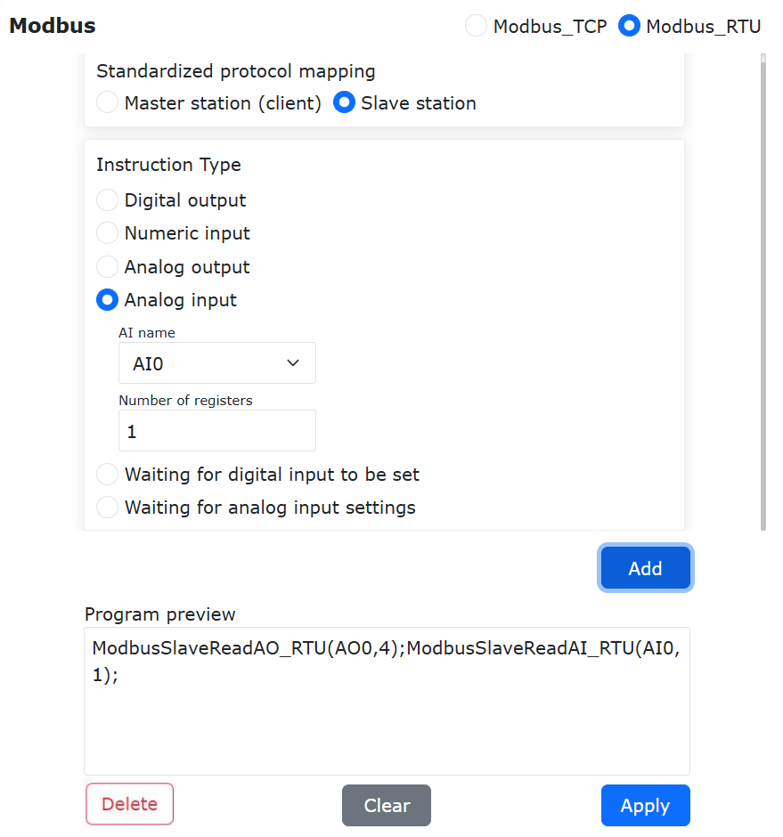

.. centered:: Schemat 9.30-49 Odczyt wejścia analogowego

.. image:: coding/389.png
   :width: 6in
   :align: center

.. centered:: Schemat 9.30-50 Odczyt i zapis wyjścia analogowego

Oczekiwanie na wejście cyfrowe
""""""""""""""""""""""""""""""

Otwórz stronę dodawania instrukcji slave'a Modbus RTU, znajdź „Ustawienia oczekiwania na wejście cyfrowe”. Wybierz nazwę DI jako skonfigurowany rejestr „A gotowe”, stan oczekiwania jako „True”, czas timeoutu jako 5000 ms. Kliknij przycisk „Dodaj”, a na koniec kliknij „Zastosuj”.

.. image:: coding/390.png
   :width: 4in
   :align: center

.. centered:: Schemat 9.30-51 Dodanie instrukcji oczekiwania na wejście cyfrowe

W tym momencie do programu „testModbusRTUSlave.lua” robota została dodana instrukcja oczekiwania na wejście cyfrowe slave'a Modbus robota. Po uruchomieniu programu robot będzie czekał, aż wartość rejestru cewki „A gotowe” slave'a stanie się true, czyli wartością 1. Ponieważ ustawiony czas timeoutu wynosi 5 s, jeśli po 5 s oczekiwania sygnał „A gotowe” nadal wynosi 0, program robota zgłosi błąd timeoutu i automatycznie zatrzyma działanie.

.. image:: coding/391.png
   :width: 4in
   :align: center

.. centered:: Schemat 9.30-52 Program oczekiwania na wejście cyfrowe

Oczekiwanie na wejście analogowe
""""""""""""""""""""""""""""""""

Otwórz stronę dodawania instrukcji slave'a Modbus RTU, znajdź „Ustawienia oczekiwania na wejście analogowe”. Wybierz nazwę AI jako skonfigurowany rejestr „Prąd”, stan oczekiwania jako „>”, wartość rejestru jako 255, czas timeoutu jako 5000 ms. Kliknij przycisk „Dodaj”, a na koniec kliknij „Zastosuj”.

.. image:: coding/392.png
   :width: 4in
   :align: center

.. centered:: Schemat 9.30-53 Dodanie instrukcji oczekiwania na wejście analogowe

W tym momencie do programu „testModbusRTUSlave.lua” robota została dodana instrukcja oczekiwania na wartość wejścia analogowego slave'a Modbus robota. Po uruchomieniu programu robot będzie czekał, aż wartość rejestru „Prąd” slave'a stanie się większa niż 255. Ponieważ ustawiony czas timeoutu wynosi 5 s, jeśli po 5 s oczekiwania sygnał „Prąd” nadal nie jest większy niż 255, program robota zgłosi błąd timeoutu i automatycznie zatrzyma działanie.

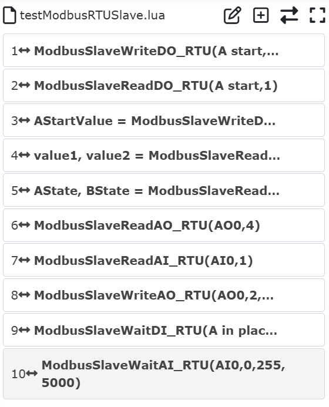

.. centered:: Schemat 9.30-54 Program oczekiwania na rejestr wejścia analogowego

Otwórz stronę dodawania instrukcji slave'a Modbus RTU, znajdź „Ustawienia oczekiwania na wejście analogowe” (czyli ustawienia oczekiwania na AI - rejestr wejściowy). Wybierz nazwę AI jako skonfigurowany rejestr „Poziom cieczy”, stan oczekiwania jako „=”, wartość rejestru jako 255, czas timeoutu jako 5000 ms. Kliknij przycisk „Dodaj”, a na koniec kliknij „Zastosuj”.

.. image:: coding/496.png
   :width: 6in
   :align: center

.. centered:: Schemat 9.30-54-2 Dodanie instrukcji oczekiwania na wejście analogowe

W tym momencie do programu „test.lua” robota została dodana instrukcja oczekiwania na wartość rejestru wejściowego AI slave'a Modbus Rtu. Po uruchomieniu programu robot będzie czekał, aż wartość rejestru „Poziom cieczy” stanie się równa 255. Ponieważ ustawiony czas timeoutu wynosi 5 s, jeśli po 5 s oczekiwania sygnał „Poziom cieczy” nadal nie jest równy 255, program robota zgłosi błąd timeoutu i automatycznie zatrzyma działanie.

Sprzężenie zwrotne stanu robota i sterowanie slave'em Modbus RTU
****************************************************************

Adresy rejestrów wejściowych slave'a Modbus RTU robota współpracującego 0x1010-0x104C służą do zwracania informacji o stanie robota w czasie rzeczywistym (szczegółowa definicja adresów znajduje się w Załączniku 1: Mapa adresów slave'a Modbus RTU). Wystarczy odczytać wartości odpowiednich rejestrów za pomocą urządzenia master, aby uzyskać odpowiadające im dane o stanie robota w czasie rzeczywistym.

Adresy rejestrów cewek slave'a Modbus RTU robota współpracującego 0x4040-0x405C służą urządzeniu master do sterowania robotem (szczegółowa definicja adresów znajduje się w Załączniku 1: Mapa adresów slave'a Modbus RTU). Na przykład adres cewki 0x4054 oznacza funkcję „Uruchom program”. Gdy robot jest w trybie automatycznym, a urządzenie master ustawi wartość adresu 0x4054 z 0 na 1, robot automatycznie rozpocznie działanie aktualnie skonfigurowanego programu. Inny przykład: adres cewki 0x4040 służy do sterowania wyjściem DO0 szafy sterowniczej robota. Gdy zewnętrzny master ustawi adres cewki 0x4040 z 0 na 1, wyjście DO0 szafy sterowniczej zostanie automatycznie aktywowane. Podobnie, gdy zewnętrzny master ustawi adres cewki 0x4040 z 1 na 0, wyjście DO0 szafy sterowniczej zostanie dezaktywowane. Kliknij „Funkcyjne wejście cyfrowe (cewki)” na stronie ustawień slave'a Modbus RTU, aby monitorować wszystkie bieżące funkcjonalne wejścia cyfrowe.

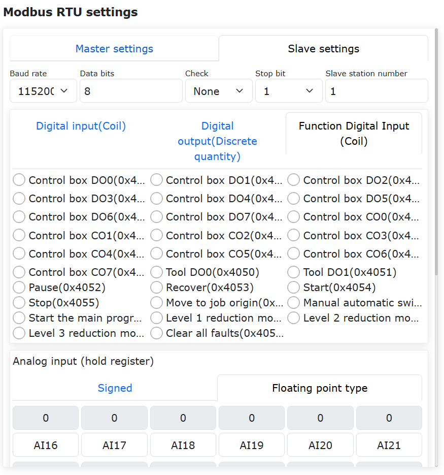

.. centered:: Schemat 9.30-55 Funkcyjne wejścia cyfrowe slave'a robota

Załącznik 1: Mapa adresów slave'a Modbus Rtu

.. list-table::
   :widths: 15 20 25 15 20 10
   :header-rows: 0
   :align: center

   * - **Adres wysyłany przez sterownik zewnętrzny**
     - **Typ**
     - **Nazwa**
     - **Typ danych**
     - **Kod funkcji**
     - **Odczyt/Zapis**

   * - 0x3000
     - Ogólne wyjście cyfrowe (dyskretne)
     - DO0
     - BOOL 
     - 0x02 
     - Tylko odczyt  

   * - 0x3001
     - Ogólne wyjście cyfrowe (dyskretne)
     - DO1
     - BOOL 
     - 0x02 
     - Tylko odczyt  

   * - 0x3002
     - Ogólne wyjście cyfrowe (dyskretne)
     - DO2
     - BOOL 
     - 0x02 
     - Tylko odczyt  

   * - 0x3003
     - Ogólne wyjście cyfrowe (dyskretne)
     - DO3
     - BOOL 
     - 0x02 
     - Tylko odczyt  

   * - ...
     - Ogólne wyjście cyfrowe (dyskretne)
     - ...
     - BOOL 
     - 0x02 
     - Tylko odczyt  

   * - 0x303F
     - Ogólne wyjście cyfrowe (dyskretne)
     - DO127
     - BOOL 
     - 0x02 
     - Tylko odczyt  

   * - 0x4000
     - Ogólne wejście cyfrowe (cewki)
     - DI0
     - BOOL 
     - 0x01, 0x05, 0x0F 
     - Odczyt/Zapis  

   * - 0x4001
     - Ogólne wejście cyfrowe (cewki)
     - DI1
     - BOOL 
     - 0x01, 0x05, 0x0F 
     - Odczyt/Zapis  

   * - 0x4002
     - Ogólne wejście cyfrowe (cewki)
     - DI2
     - BOOL 
     - 0x01, 0x05, 0x0F 
     - Odczyt/Zapis  

   * - 0x4003
     - Ogólne wejście cyfrowe (cewki)
     - DI3
     - BOOL 
     - 0x01, 0x05, 0x0F 
     - Odczyt/Zapis  

   * - ...
     - Ogólne wejście cyfrowe (cewki)
     - ...
     - BOOL 
     - 0x01, 0x05, 0x0F 
     - Odczyt/Zapis  

   * - 0x403F
     - Ogólne wejście cyfrowe (cewki)
     - DI64
     - BOOL 
     - 0x01, 0x05, 0x0F 
     - Odczyt/Zapis  

   * - 0x4040
     - Sterowanie robotem
     - DO0 szafy sterowniczej
     - BOOL 
     - 0x01, 0x05, 0x0F 
     - Odczyt/Zapis  

   * - 0x4041
     - Sterowanie robotem
     - DO1 szafy sterowniczej
     - BOOL 
     - 0x01, 0x05, 0x0F 
     - Odczyt/Zapis  

   * - 0x4042
     - Sterowanie robotem
     - DO2 szafy sterowniczej
     - BOOL 
     - 0x01, 0x05, 0x0F 
     - Odczyt/Zapis  

   * - 0x4043
     - Sterowanie robotem
     - DO3 szafy sterowniczej
     - BOOL 
     - 0x01, 0x05, 0x0F 
     - Odczyt/Zapis  

   * - 0x4044
     - Sterowanie robotem
     - DO4 szafy sterowniczej
     - BOOL 
     - 0x01, 0x05, 0x0F 
     - Odczyt/Zapis  

   * - 0x4045
     - Sterowanie robotem
     - DO5 szafy sterowniczej
     - BOOL 
     - 0x01, 0x05, 0x0F 
     - Odczyt/Zapis  

   * - 0x4046
     - Sterowanie robotem
     - DO6 szafy sterowniczej
     - BOOL 
     - 0x01, 0x05, 0x0F 
     - Odczyt/Zapis  

   * - 0x4047
     - Sterowanie robotem
     - DO7 szafy sterowniczej
     - BOOL 
     - 0x01, 0x05, 0x0F 
     - Odczyt/Zapis  

   * - 0x4048
     - Sterowanie robotem
     - CO0 szafy sterowniczej
     - BOOL 
     - 0x01, 0x05, 0x0F 
     - Odczyt/Zapis  

   * - 0x4049
     - Sterowanie robotem
     - CO1 szafy sterowniczej
     - BOOL 
     - 0x01, 0x05, 0x0F 
     - Odczyt/Zapis  

   * - 0x404A
     - Sterowanie robotem
     - CO2 szafy sterowniczej
     - BOOL 
     - 0x01, 0x05, 0x0F 
     - Odczyt/Zapis  

   * - 0x404B
     - Sterowanie robotem
     - CO3 szafy sterowniczej
     - BOOL 
     - 0x01, 0x05, 0x0F 
     - Odczyt/Zapis  

   * - 0x404C
     - Sterowanie robotem
     - CO4 szafy sterowniczej
     - BOOL 
     - 0x01, 0x05, 0x0F 
     - Odczyt/Zapis  

   * - 0x404D
     - Sterowanie robotem
     - CO5 szafy sterowniczej
     - BOOL 
     - 0x01, 0x05, 0x0F 
     - Odczyt/Zapis  

   * - 0x404E
     - Sterowanie robotem
     - CO6 szafy sterowniczej
     - BOOL 
     - 0x01, 0x05, 0x0F 
     - Odczyt/Zapis  

   * - 0x404F
     - Sterowanie robotem
     - CO7 szafy sterowniczej
     - BOOL 
     - 0x01, 0x05, 0x0F 
     - Odczyt/Zapis  

   * - 0x4050
     - Sterowanie robotem
     - DO0 narzędzia
     - BOOL 
     - 0x01, 0x05, 0x0F 
     - Odczyt/Zapis  

   * - 0x4051
     - Sterowanie robotem
     - DO1 narzędzia
     - BOOL 
     - 0x01, 0x05, 0x0F 
     - Odczyt/Zapis  

   * - 0x4052
     - Sterowanie robotem
     - Pauza
     - BOOL 
     - 0x01, 0x05, 0x0F 
     - Odczyt/Zapis  

   * - 0x4053
     - Sterowanie robotem
     - Wznów
     - BOOL 
     - 0x01, 0x05, 0x0F 
     - Odczyt/Zapis  

   * - 0x4054
     - Sterowanie robotem
     - Start
     - BOOL 
     - 0x01, 0x05, 0x0F 
     - Odczyt/Zapis  

   * - 0x4055
     - Sterowanie robotem
     - Stop
     - BOOL 
     - 0x01, 0x05, 0x0F 
     - Odczyt/Zapis  

   * - 0x4056
     - Sterowanie robotem
     - Przejdź do punktu początkowego zadania
     - BOOL 
     - 0x01, 0x05, 0x0F 
     - Odczyt/Zapis  

   * - 0x4057
     - Sterowanie robotem
     - Przełącz ręczny/automatyczny
     - BOOL 
     - 0x01, 0x05, 0x0F 
     - Odczyt/Zapis  

   * - 0x4058
     - Sterowanie robotem
     - Uruchom program główny
     - BOOL 
     - 0x01, 0x05, 0x0F 
     - Odczyt/Zapis  

   * - 0x4059
     - Sterowanie robotem
     - Tryb redukcji poziomu 1
     - BOOL 
     - 0x01, 0x05, 0x0F 
     - Odczyt/Zapis  

   * - 0x405A
     - Sterowanie robotem
     - Tryb redukcji poziomu 2
     - BOOL 
     - 0x01, 0x05, 0x0F 
     - Odczyt/Zapis  

   * - 0x405B
     - Sterowanie robotem
     - Tryb redukcji poziomu 3 (stop)
     - BOOL 
     - 0x01, 0x05, 0x0F 
     - Odczyt/Zapis  

   * - 0x405C
     - Sterowanie robotem
     - Wyczyść wszystkie usterki
     - BOOL 
     - 0x01, 0x05, 0x0F 
     - Odczyt/Zapis  

   * - 0x405D
     - Sterowanie robotem
     - Zarezerwowane
     - BOOL 
     - 0x01, 0x05, 0x0F 
     - Odczyt/Zapis  

   * - 0x405E
     - Sterowanie robotem
     - Zarezerwowane
     - BOOL 
     - 0x01, 0x05, 0x0F 
     - Odczyt/Zapis  

   * - 0x1000
     - Wejście analogowe
     - AO0
     - INT16 
     - 0x04
     - Tylko odczyt  

   * - 0x1001
     - Wejście analogowe
     - AO1
     - INT16 
     - 0x04
     - Tylko odczyt  

   * - 0x1002
     - Wejście analogowe
     - AO2
     - INT16 
     - 0x04
     - Tylko odczyt  

   * - ...
     - Wejście analogowe
     - ...
     - INT16 
     - 0x04
     - Tylko odczyt  

   * - 0x100F
     - Wejście analogowe
     - AO15
     - INT16 
     - 0x04
     - Tylko odczyt  

   * - 0x1010
     - Stan robota
     - Stan zasilania 0 - niezasilony, 1 - zasilony
     - UINT16 
     - 0x04
     - Tylko odczyt  

   * - 0x1011
     - Stan robota
     - Tryb robota, 1 - tryb ręczny, 0 - tryb automatyczny
     - UINT16 
     - 0x04
     - Tylko odczyt  

   * - 0x1012
     - Stan robota
     - Stan działania robota 1 - zatrzymany, 2 - działa, 3 - wstrzymany, 4 - przeciąganie
     - UINT16 
     - 0x04
     - Tylko odczyt  

   * - 0x1013
     - Stan robota
     - Numer narzędzia
     - UINT16 
     - 0x04
     - Tylko odczyt  

   * - 0x1014
     - Stan robota
     - Numer obiektu
     - UINT16 
     - 0x04
     - Tylko odczyt  

   * - 0x1015
     - Stan robota
     - Stan awaryjnego zatrzymania 0 - brak, 1 - awaryjne zatrzymanie
     - UINT16 
     - 0x04
     - Tylko odczyt  

   * - 0x1016
     - Stan robota
     - Usterka przekroczenia miękkiego ograniczenia
     - UINT16 
     - 0x04
     - Tylko odczyt  

   * - 0x1017
     - Stan robota
     - Główny kod usterki
     - UINT16 
     - 0x04
     - Tylko odczyt  

   * - 0x1018
     - Stan robota
     - Podrzędny kod usterki
     - UINT16 
     - 0x04
     - Tylko odczyt  

   * - 0x1019
     - Stan robota
     - Wykrywanie kolizji, 1 - kolizja, 0 - brak kolizji
     - UINT16 
     - 0x04
     - Tylko odczyt  

   * - 0x101A
     - Stan robota
     - Sygnał osiągnięcia pozycji
     - UINT16 
     - 0x04
     - Tylko odczyt  

   * - 0x101B
     - Stan robota
     - Sygnał bezpiecznego zatrzymania SI0
     - UINT16 
     - 0x04
     - Tylko odczyt  

   * - 0x101C
     - Stan robota
     - Sygnał bezpiecznego zatrzymania SI1
     - UINT16 
     - 0x04
     - Tylko odczyt  

   * - 0x101D
     - Stan robota
     - Wejście analogowe AI0 szafy sterowniczej
     - UINT16 
     - 0x04
     - Tylko odczyt  

   * - 0x101E
     - Stan robota
     - Wejście analogowe AI1 szafy sterowniczej
     - UINT16 
     - 0x04
     - Tylko odczyt  

   * - 0x101F
     - Stan robota
     - Wejście analogowe AI0 narzędzia
     - UINT16 
     - 0x04
     - Tylko odczyt  

   * - 0x1020
     - Stan robota
     - Wyjście analogowe AO0 szafy sterowniczej
     - UINT16 
     - 0x04
     - Tylko odczyt  

   * - 0x1021
     - Stan robota
     - Wyjście analogowe AO1 szafy sterowniczej
     - UINT16 
     - 0x04
     - Tylko odczyt  

   * - 0x1022
     - Stan robota
     - Wyjście analogowe AO0 narzędzia
     - UINT16 
     - 0x04
     - Tylko odczyt  

   * - 0x1023
     - Stan robota
     - Wejście cyfrowe szafy sterowniczej Bity 0-7 odpowiadają DI0-DI7, Bity 8-15 odpowiadają CI0-CI7
     - UINT16 
     - 0x04
     - Tylko odczyt  

   * - 0x1024
     - Stan robota
     - Wejście cyfrowe na końcówce Bity 0-15 odpowiadają DI0-DI15
     - UINT16 
     - 0x04
     - Tylko odczyt  

   * - 0x1025
     - Stan robota
     - Wyjście cyfrowe szafy sterowniczej Bity 0-7 odpowiadają DO0-DO7, Bity 8-15 odpowiadają CO0-CO7
     - UINT16 
     - 0x04
     - Tylko odczyt  

   * - 0x1026
     - Stan robota
     - Wyjście cyfrowe na końcówce Bity 0-15 odpowiadają DO0-DO15
     - UINT16 
     - 0x04
     - Tylko odczyt  

   * - 0x1027
     - Stan robota
     - Prędkość TCP
     - FLOAT32 (big-endian) 
     - 0x04
     - Tylko odczyt  

   * - 0x1028
     - Stan robota
     - Prędkość TCP
     - FLOAT32 (big-endian) 
     - 0x04
     - Tylko odczyt  

   * - 0x1029
     - Stan robota
     - Pozycja stawu 1
     - FLOAT32 (big-endian) 
     - 0x04
     - Tylko odczyt  

   * - 0x102A
     - Stan robota
     - Pozycja stawu 1
     - FLOAT32 (big-endian) 
     - 0x04
     - Tylko odczyt  

   * - 0x102B
     - Stan robota
     - Pozycja stawu 2
     - FLOAT32 (big-endian) 
     - 0x04
     - Tylko odczyt  

   * - 0x102C
     - Stan robota
     - Pozycja stawu 2
     - FLOAT32 (big-endian) 
     - 0x04
     - Tylko odczyt  

   * - 0x102D
     - Stan robota
     - Pozycja stawu 3
     - FLOAT32 (big-endian) 
     - 0x04
     - Tylko odczyt  

   * - 0x102E
     - Stan robota
     - Pozycja stawu 3
     - FLOAT32 (big-endian) 
     - 0x04
     - Tylko odczyt  

   * - 0x102F
     - Stan robota
     - Pozycja stawu 4
     - FLOAT32 (big-endian) 
     - 0x04
     - Tylko odczyt  

   * - 0x1030
     - Stan robota
     - Pozycja stawu 4
     - FLOAT32 (big-endian) 
     - 0x04
     - Tylko odczyt  

   * - 0x1031
     - Stan robota
     - Pozycja stawu 5
     - FLOAT32 (big-endian) 
     - 0x04
     - Tylko odczyt  

   * - 0x1032
     - Stan robota
     - Pozycja stawu 5
     - FLOAT32 (big-endian) 
     - 0x04
     - Tylko odczyt  

   * - 0x1033
     - Stan robota
     - Pozycja stawu 6
     - FLOAT32 (big-endian) 
     - 0x04
     - Tylko odczyt  

   * - 0x1034
     - Stan robota
     - Pozycja stawu 6
     - FLOAT32 (big-endian) 
     - 0x04
     - Tylko odczyt  

   * - 0x1035
     - Stan robota
     - Prędkość stawu 1
     - FLOAT32 (big-endian) 
     - 0x04
     - Tylko odczyt  

   * - 0x1036
     - Stan robota
     - Prędkość stawu 1
     - FLOAT32 (big-endian) 
     - 0x04
     - Tylko odczyt  

   * - 0x1037
     - Stan robota
     - Prędkość stawu 2
     - FLOAT32 (big-endian) 
     - 0x04
     - Tylko odczyt  

   * - 0x1038
     - Stan robota
     - Prędkość stawu 2
     - FLOAT32 (big-endian) 
     - 0x04
     - Tylko odczyt  

   * - 0x1039
     - Stan robota
     - Prędkość stawu 3
     - FLOAT32 (big-endian) 
     - 0x04
     - Tylko odczyt  

   * - 0x103A
     - Stan robota
     - Prędkość stawu 3
     - FLOAT32 (big-endian) 
     - 0x04
     - Tylko odczyt  

   * - 0x103B
     - Stan robota
     - Prędkość stawu 4
     - FLOAT32 (big-endian) 
     - 0x04
     - Tylko odczyt  

   * - 0x103C
     - Stan robota
     - Prędkość stawu 4
     - FLOAT32 (big-endian) 
     - 0x04
     - Tylko odczyt  

   * - 0x103D
     - Stan robota
     - Prędkość stawu 5
     - FLOAT32 (big-endian) 
     - 0x04
     - Tylko odczyt  

   * - 0x103E
     - Stan robota
     - Prędkość stawu 5
     - FLOAT32 (big-endian) 
     - 0x04
     - Tylko odczyt  

   * - 0x103F
     - Stan robota
     - Prędkość stawu 6
     - FLOAT32 (big-endian) 
     - 0x04
     - Tylko odczyt  

   * - 0x1040
     - Stan robota
     - Prędkość stawu 6
     - FLOAT32 (big-endian) 
     - 0x04
     - Tylko odczyt  

   * - 0x1041
     - Stan robota
     - Pozycja X TCP
     - FLOAT32 (big-endian) 
     - 0x04
     - Tylko odczyt  

   * - 0x1042
     - Stan robota
     - Pozycja X TCP
     - FLOAT32 (big-endian) 
     - 0x04
     - Tylko odczyt  

   * - 0x1043
     - Stan robota
     - Pozycja Y TCP
     - FLOAT32 (big-endian) 
     - 0x04
     - Tylko odczyt  

   * - 0x1044
     - Stan robota
     - Pozycja Y TCP
     - FLOAT32 (big-endian) 
     - 0x04
     - Tylko odczyt  

   * - 0x1045
     - Stan robota
     - Pozycja Z TCP
     - FLOAT32 (big-endian) 
     - 0x04
     - Tylko odczyt  

   * - 0x1046
     - Stan robota
     - Pozycja Z TCP
     - FLOAT32 (big-endian) 
     - 0x04
     - Tylko odczyt  

   * - 0x1047
     - Stan robota
     - Pozycja RX TCP
     - FLOAT32 (big-endian) 
     - 0x04
     - Tylko odczyt  

   * - 0x1048
     - Stan robota
     - Pozycja RX TCP
     - FLOAT32 (big-endian) 
     - 0x04
     - Tylko odczyt  

   * - 0x1049
     - Stan robota
     - Pozycja RY TCP
     - FLOAT32 (big-endian) 
     - 0x04
     - Tylko odczyt  

   * - 0x104A
     - Stan robota
     - Pozycja RY TCP
     - FLOAT32 (big-endian) 
     - 0x04
     - Tylko odczyt  

   * - 0x104B
     - Stan robota
     - Pozycja RZ TCP
     - FLOAT32 (big-endian) 
     - 0x04
     - Tylko odczyt  

   * - 0x104C
     - Stan robota
     - Pozycja RZ TCP
     - FLOAT32 (big-endian) 
     - 0x04
     - Tylko odczyt  

   * - 0x104D
     - Wejście analogowe
     - AO16
     - FLOAT32 (big-endian) 
     - 0x04
     - Tylko odczyt  

   * - 0x104E
     - Wejście analogowe
     - AO16
     - FLOAT32 (big-endian) 
     - 0x04
     - Tylko odczyt  

   * - 0x104F
     - Wejście analogowe
     - AO17
     - FLOAT32 (big-endian) 
     - 0x04
     - Tylko odczyt  

   * - 0x1050
     - Wejście analogowe
     - AO17
     - FLOAT32 (big-endian) 
     - 0x04
     - Tylko odczyt  

   * - ...
     - Wejście analogowe
     - ...
     - FLOAT32 (big-endian) 
     - 0x04
     - Tylko odczyt  

   * - 0x106B
     - Wejście analogowe
     - AO31
     - FLOAT32 (big-endian) 
     - 0x04
     - Tylko odczyt  

   * - 0x106C
     - Wejście analogowe
     - AO31
     - FLOAT32 (big-endian) 
     - 0x04
     - Tylko odczyt  

   * - 0x2000
     - Wyjście analogowe
     - AI0
     - INT16 
     - 0x03, 0x06, 0x10
     - Odczyt/Zapis  

   * - 0x2001
     - Wyjście analogowe
     - AI1
     - INT16 
     - 0x03, 0x06, 0x10
     - Odczyt/Zapis  

   * - 0x2002
     - Wyjście analogowe
     - AI2
     - INT16 
     - 0x03, 0x06, 0x10
     - Odczyt/Zapis  

   * - ...
     - Wyjście analogowe
     - ...
     - INT16 
     - 0x03, 0x06, 0x10
     - Odczyt/Zapis  

   * - 0x200F
     - Wyjście analogowe
     - AI15
     - INT16 
     - 0x03, 0x06, 0x10
     - Odczyt/Zapis  

   * - 0x2010
     - Wyjście analogowe
     - AI16
     - FLOAT32 (big-endian) 
     - 0x03, 0x06, 0x10
     - Odczyt/Zapis  

   * - 0x2011
     - Wyjście analogowe
     - AI16
     - FLOAT32 (big-endian) 
     - 0x03, 0x06, 0x10
     - Odczyt/Zapis  

   * - 0x2012
     - Wyjście analogowe
     - AI17
     - FLOAT32 (big-endian) 
     - 0x03, 0x06, 0x10
     - Odczyt/Zapis  

   * - 0x2013
     - Wyjście analogowe
     - AI17
     - FLOAT32 (big-endian) 
     - 0x03, 0x06, 0x10
     - Odczyt/Zapis  

   * - ...
     - Wyjście analogowe
     - ...
     - FLOAT32 (big-endian) 
     - 0x03, 0x06, 0x10
     - Odczyt/Zapis  

   * - 0x202E
     - Wyjście analogowe
     - AI31
     - FLOAT32 (big-endian) 
     - 0x03, 0x06, 0x10
     - Odczyt/Zapis  

   * - 0x202F
     - Wyjście analogowe
     - AI31
     - FLOAT32 (big-endian) 
     - 0x03, 0x06, 0x10
     - Odczyt/Zapis  

Ochrona funkcji dostosowania postawy w oparciu o sześcioosiowy czujnik siły
~~~~~~~~~~~~~~~~~~~~~~~~~~~~~~~~~~~~~~~~~~~~~~~~~~~~~~~~~~~~~~~~~~~~~~~~~~~~

Przegląd
++++++++

Obecna funkcja dostosowania postawy pod stałą siłą FT_Control w robotach FR nie ma ograniczenia maksymalnego kąta regulacji. Gdy na sześcioosiowy czujnik siły działa zewnętrzny moment siły, końcówka robota będzie się stale przemieszczać, co w tej sytuacji może być niebezpieczne.

W oparciu o funkcję dostosowania postawy FT_Control dodano ograniczenie maksymalnego kąta regulacji, umożliwiając ustawienie niestandardowego progu, aby funkcja dostosowania postawy była płynniejsza.

Procedura operacyjna
++++++++++++++++++++

**Krok 1**: Kliknij „Ustawienia początkowe” -> „Podstawowe” -> „Współrzędne narzędzia”, aby przejść do interfejsu ustawień układu współrzędnych narzędzia. Wybierz „Nazwę układu współrzędnych” i ustaw parametry układu współrzędnych odpowiadające narzędziu końcowemu.

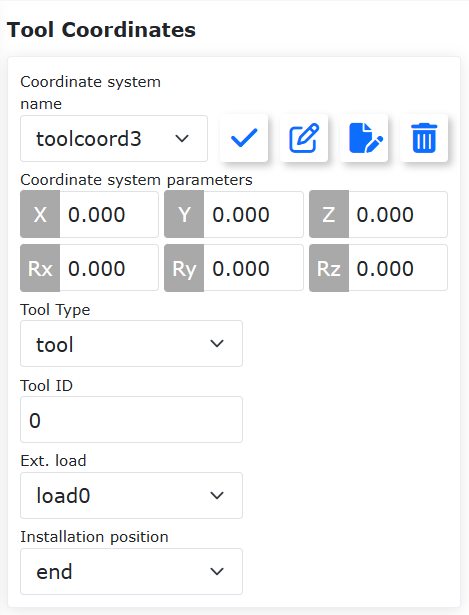

.. centered:: Schemat 9.31-1 Ustawienie układu współrzędnych narzędzia

**Krok 2**: Kliknij „Program nauczania” -> „Programowanie”, napisz skrypt lua do sterowania stałą siłą. Wybierz „Zestaw sterowania siłą” -> „Control”, aby dodać instrukcję ruchu ze sterowaniem siłą. Ustaw dostosowanie postawy na „Włączone”, a maksymalny kąt regulacji ustaw jako próg kąta dostosowania postawy.

.. image:: coding/444.png
   :width: 6in
   :align: center

.. centered:: Schemat 9.31-2 Instrukcja ruchu ze sterowaniem siłą

**Krok 3**: W interfejsie webowym kliknij „FT”, aby ustawić układ odniesienia sześcioosiowego czujnika siły. Wybierz układ odniesienia jako „Niestandardowy układ współrzędnych” i ustaw odpowiednie parametry układu współrzędnych.
Aby dostosowanie kąta postawy odbywało się względem układu współrzędnych narzędzia, ustaw parametry układu odniesienia na „0”. Aby dostosowanie kąta postawy odbywało się względem układu współrzędnych kołnierza końcowego, ustaw parametry układu odniesienia na parametry układu współrzędnych odpowiadające narzędziu końcowemu.

.. image:: coding/445.png
   :width: 4in
   :align: center

.. centered:: Schemat 9.31-3 Ustawienie układu odniesienia sześcioosiowego czujnika siły

**Krok 4**: Uruchom skrypt, aby sprawdzić efekt dostosowania postawy. Kąt dostosowania postawy pod stałą siłą będzie ograniczony do zakresu niestandardowego maksymalnego kąta regulacji.

Funkcja interfejsu komunikacji Socket
~~~~~~~~~~~~~~~~~~~~~~~~~~~~~~~~~~~~~

Konfiguracja Socket
+++++++++++++++++++

Podczas korzystania z funkcji interfejsu komunikacji Socket, po włączeniu zasilania robota należy najpierw wejść na stronę webową w celu skonfigurowania protokołu Socket. Konfiguracja jest zapisywana po odcięciu zasilania.

Kliknij „Program nauczania” - „Programowanie”, a następnie kliknij „Debugowanie sieciowe Socket” w prawym górnym menu, aby przejść do interfejsu konfiguracji Socket. Kliknij „Dodaj Socket”, aby skonfigurować parametry Socket. Można dodać maksymalnie cztery Socket.

.. image:: coding/446.png
   :width: 6in
   :align: center

.. centered:: Schemat 9.32-1 Interfejs debugowania sieciowego Socket

.. image:: coding/447.png
   :width: 6in
   :align: center

.. centered:: Schemat 9.32-2 Interfejs parametrów konfiguracji Socket

Ustawienia parametrów komunikacji
*********************************

Protokół komunikacji obsługuje UDP, serwer TCP i klient TCP.

Typ danych obsługuje ASCII i HEX. Po skonfigurowaniu typu danych wszystkie dane wysyłane i odbierane przez to połączenie Socket są przetwarzane zgodnie z skonfigurowanym typem.

Mechanizm wykrywania keepalive
********************************

Mechanizm wykrywania keepalive działa tylko dla serwera TCP i klienta TCP.

Mechanizm wykrywania keepalive wykorzystuje mechanizm Keepalive do wykrywania i utrzymywania aktywnego stanu połączenia, zapobiegając nieoczekiwanemu przerwaniu długotrwałych, bezczynnych połączeń. Zawiera głównie następujące parametry:

- Odstęp sondowania: Jak długo po bezczynności rozpocząć wysyłanie pakietów sondowania keepalive, jednostka sekundy;
- Czas sondowania: Odstęp czasu między wysyłaniem pakietów sondowania, jednostka sekundy;
- Liczba sondowań: Maksymalna liczba wysłanych pakietów sondowania.

Mechanizm ponownego łączenia po przerwaniu połączenia
******************************************************

Mechanizm ponownego łączenia po przerwaniu połączenia działa tylko dla klienta TCP.

Gdy mechanizm ponownego łączenia po przerwaniu połączenia jest włączony, po wykryciu przerwania połączenia z serwerem podczas uruchamiania klienta TCP, klient aktywnie rozpocznie proces ponownego łączenia. Jeśli po osiągnięciu maksymalnej liczby prób ponownego łączenia połączenie nadal nie zostanie nawiązane, połączenie zostanie zamknięte. Zawiera głównie następujące parametry:

- Odstęp ponownego łączenia: Odstęp czasu między próbami ponownego łączenia, jednostka ms, zalecany czas w sekundach;
- Maksymalna liczba prób ponownego łączenia: Maksymalna liczba prób ponownego łączenia.

Niestandardowa analiza protokołu
********************************

Po włączeniu niestandardowej analizy protokołu, dane wysyłane i odbierane są odpowiednio hermetyzowane lub analizowane zgodnie z treścią konfiguracji protokołu.

Niestandardowy protokół może być automatycznie generowany na podstawie skonfigurowanych parametrów. W trybie ASCII obsługuje kombinacje znacznika początku ramki, licznika ramki, długości danych i znacznika końca ramki. Do podziału danych można używać separatorów. W trybie HEX obsługuje kombinacje znacznika początku ramki, licznika ramki, długości danych, metody sumy kontrolnej i znacznika końca ramki.

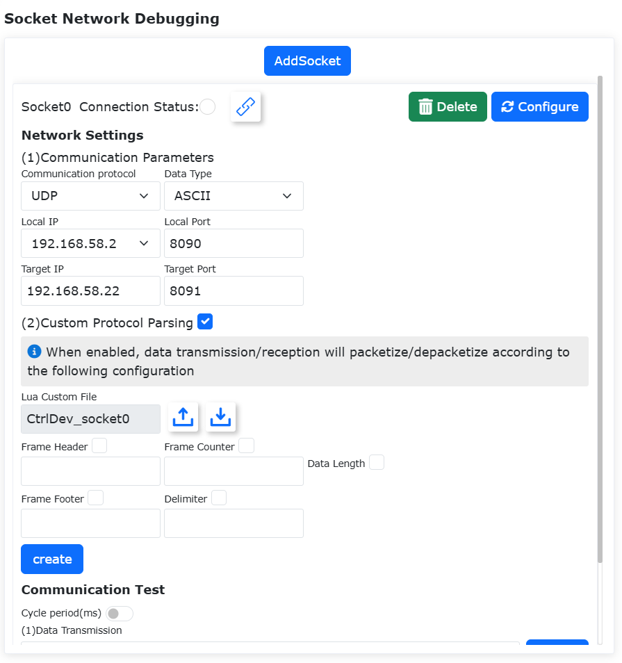

.. centered:: Schemat 9.32-3 Konfiguracja niestandardowego protokołu w trybie ASCII

.. image:: coding/449.png
   :width: 6in
   :align: center

.. centered:: Schemat 9.32-4 Konfiguracja niestandardowego protokołu w trybie HEX

Po skonfigurowaniu niestandardowego protokołu kliknij przycisk „Generuj”, aby automatycznie wygenerować odpowiadający mu plik lua. Plik lua obsługuje funkcje importu i eksportu. Na podstawie kodu pliku można niestandardowo zmodyfikować typ protokołu, aby uzyskać elastyczną konfigurację.

Połączenie Socket
+++++++++++++++++

Wyświetlanie połączenia w interfejsie
*************************************

Po skonfigurowaniu informacji o Socket można nawiązać to połączenie Socket. Stan połączenia obejmuje następujące trzy stany:

- Biały: Połączenie nie zostało nawiązane.

.. image:: coding/450.png
   :width: 6in
   :align: center

.. centered:: Schemat 9.32-5 Stan niepołączony

- Żółty: Serwer TCP oczekuje na połączenie lub klient TCP żąda połączenia.

.. image:: coding/451.png
   :width: 6in
   :align: center

.. centered:: Schemat 9.32-6 Stan oczekiwania na połączenie

- Zielony: Połączenie nawiązane pomyślnie.

.. image:: coding/452.png
   :width: 6in
   :align: center

.. centered:: Schemat 9.32-7 Stan połączenia nawiązanego pomyślnie

Moduł instrukcji połączenia
***************************

Kliknij „Program nauczania” - „Programowanie” - „Instrukcje komunikacyjne”, wybierz instrukcję „Socket”, aby wygenerować instrukcje otwierania i zamykania połączenia Socket do programowania w lua. SocketID może wybrać tylko skonfigurowane połączenie Socket.

.. image:: coding/453.png
   :width: 6in
   :align: center

.. centered:: Schemat 9.32-8 Moduł instrukcji połączenia Socket

Szczegóły instrukcji:

- Instrukcja otwarcia połączenia: OpenSocketConnect(id);
- Parametr id: skonfigurowane ID gniazda, wartość zwracana 0 oznacza sukces.
- Instrukcja zamknięcia połączenia: CloseSocketConnect(id);
- Parametr id: skonfigurowane ID gniazda, wartość zwracana 0 oznacza sukces.

Komunikacja Socket
++++++++++++++++++

Testowanie komunikacji
**********************

Interfejs udostępnia testowanie komunikacji, umożliwiając testowanie wysyłania i odbierania danych, jak poniżej.

.. image:: coding/454.png
   :width: 6in
   :align: center

.. centered:: Schemat 9.32-9 Testowanie komunikacji

Wysyłanie danych z interfejsu domyślnie korzysta z trybu blokującego, oczekując na zakończenie ruchu przed wysłaniem danych. Domyślny timeout odbioru danych wynosi 5 sekund; po przekroczeniu czasu zgłaszany jest błąd i zatrzymywane jest działanie. Powyższe parametry można dostosować podczas wysyłania instrukcji w module instrukcji.

Moduł instrukcji komunikacyjnych
********************************

Kliknij „Program nauczania” - „Programowanie” - „Instrukcje komunikacyjne”, wybierz instrukcję „Socket”, aby wygenerować instrukcje komunikacji Socket do wysyłania i odbierania danych do programowania w lua. SocketID może wybrać tylko skonfigurowane połączenie Socket, aby wysyłać dane.

.. image:: coding/455.png
   :width: 6in
   :align: center

.. centered:: Schemat 9.32-10 Wysyłanie danych przez Socket

Parametry instrukcji to odpowiednio ID Socket, dane do wysłania oraz czy oczekiwać na zakończenie ruchu.

Szczegóły instrukcji:

- Instrukcja wysyłania: SocketSend(id, data, block);
- Parametry: id, ID podłączonego gniazda; data: dane do wysłania, w formie ciągu znaków, treść danych musi być zgodna z skonfigurowanym typem danych, np. „hello” lub „FA54DE”; block: czy blokować ruch, 0: czekaj na zakończenie ruchu przed wysłaniem, 1: wyślij natychmiast. Wartość zwracana 0 oznacza sukces.

Odbieranie danych pokazano na poniższym rysunku.

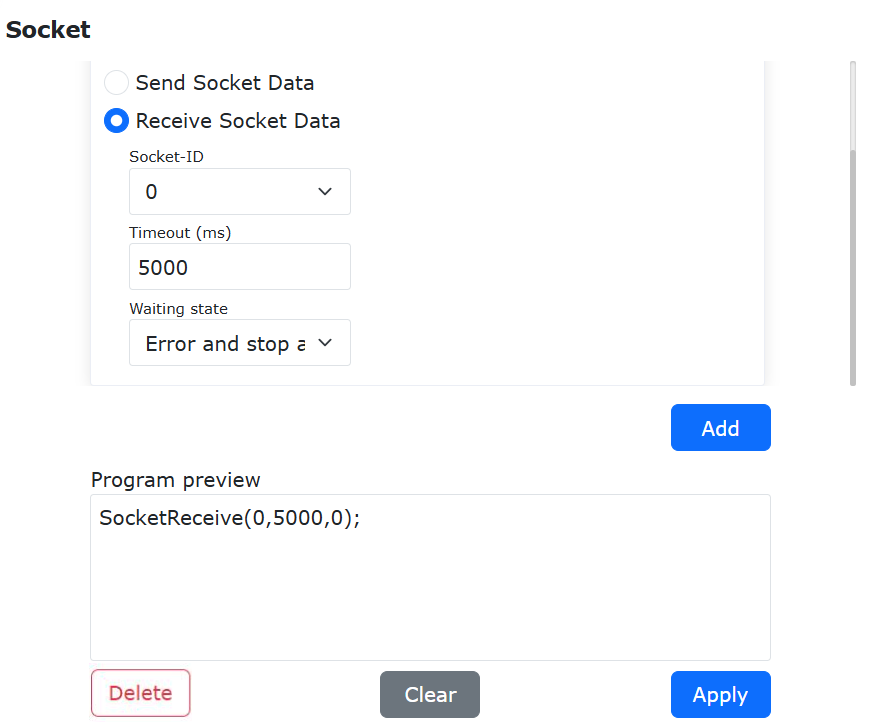

.. centered:: Schemat 9.32-11 Odbieranie danych przez Socket

Parametry instrukcji to odpowiednio ID Socket, timeout odbioru (w milisekundach) oraz strategia po przekroczeniu timeoutu.

Szczegóły instrukcji:

- Instrukcja odbioru: SocketReceive(id, timeout, stopStrategy);
- Parametry: id, ID podłączonego gniazda; timeout: czas oczekiwania na odbiór; stopStrategy: strategia po przekroczeniu timeoutu, 0: zgłoś błąd i zatrzymaj, 1: kontynuuj działanie;
- Wartość zwracana: time: czas odbioru, data: odebrane dane.

Funkcja sterowania impedancją podczas ruchu robota
~~~~~~~~~~~~~~~~~~~~~~~~~~~~~~~~~~~~~~~~~~~~~~~~~~

Przegląd
++++++++

Funkcja sterowania impedancją poprzez wykrywanie siły zewnętrznej w czasie rzeczywistym, po osiągnięciu ustawionego progu, aktywnie dostosowuje się do siły zewnętrznej, odchylając się od trajektorii ruchu, a gdy siła spadnie poniżej progu, wraca na trajektorię ruchu, co poprawia interakcję człowiek-robot. Funkcja ta, po wykryciu siły zewnętrznej przekraczającej ustawiony próg siły, powoduje przesunięcie ramienia robota w kierunku działania siły, osiągając efekt aktywnego omijania. Po ustąpieniu siły zewnętrznej ramię robota powraca w pobliże pierwotnej trajektorii ruchu, zwiększając tym samym bezpieczeństwo podczas współpracy człowiek-robot.

Funkcja sterowania impedancją
+++++++++++++++++++++++++++++

Ustawienia sterowania impedancją w przestrzeni kartezjańskiej oraz uruchamianie/zatrzymywanie funkcji
*****************************************************************************************************

**Krok 1**: Zaloguj się do interfejsu webowego, kolejno kliknij „Ustawienia początkowe” → „Podstawowe” → „Stawy” → „Poziom kolizji”, aby przejść do modułu ustawiania poziomu kolizji robota i ustawić odpowiedni współczynnik kolizji.

.. image:: coding/473.png
   :width: 6in
   :align: center

.. centered:: Schemat 9.34-1 Moduł ustawiania współczynnika kolizji robota

**Krok 2**: Aby użyć czujnika siły do realizacji funkcji sterowania impedancją, należy skonfigurować czujnik siły w „Urządzenia peryferyjne” → „Narzędzie końcowe” w konfiguracji urządzeń peryferyjnych końcówki. Aby zrealizować funkcję sterowania impedancją bez użycia czujnika siły, ten krok nie jest wymagany.

**Krok 3**: Kolejno kliknij „Program nauczania” → „Programowanie” → „Zestaw sterowania siłą”, aby dodać instrukcję „Impedance”. Instrukcja „Impedance” umożliwia robotowi realizację sterowania impedancją na trajektorii ruchu.

.. image:: coding/474.png
   :width: 6in
   :align: center

.. centered:: Schemat 9.34-2 Dodanie instrukcji sterowania siłą

**Krok 4**: W module instrukcji sterowania siłą, w polu wyboru przestrzeni wybierz „Przestrzeń kartezjańska”. W polach tekstowych ustaw odpowiednie próg siły, współczynnik masy, współczynnik tłumienia, współczynnik sztywności, maksymalną prędkość liniową, maksymalne przyspieszenie liniowe, maksymalną prędkość kątową i maksymalne przyspieszenie kątowe. W typie instrukcji kliknij „Włącz”, kliknij „Dodaj”, aby dodać instrukcję włączenia sterowania impedancją. W typie instrukcji kliknij „Wyłącz”, kliknij „Dodaj”, aby dodać instrukcję wyłączenia sterowania impedancją.

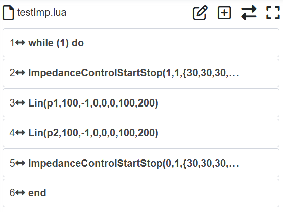

.. centered:: Schemat 9.34-3 Przykład instrukcji sterowania impedancją

**Krok 5**: Jeśli podczas działania ramię robota zatrzyma się, a w lewym dolnym rogu interfejsu webowego pojawi się komunikat „500 błąd: bieżący poziom kolizji jest zbyt niski”, oznacza to, że ustawiony próg siły jest większy niż próg wyzwolenia poziomu kolizji. W takim przypadku podniesienie poziomu kolizji lub obniżenie progu siły usunie ten błąd.

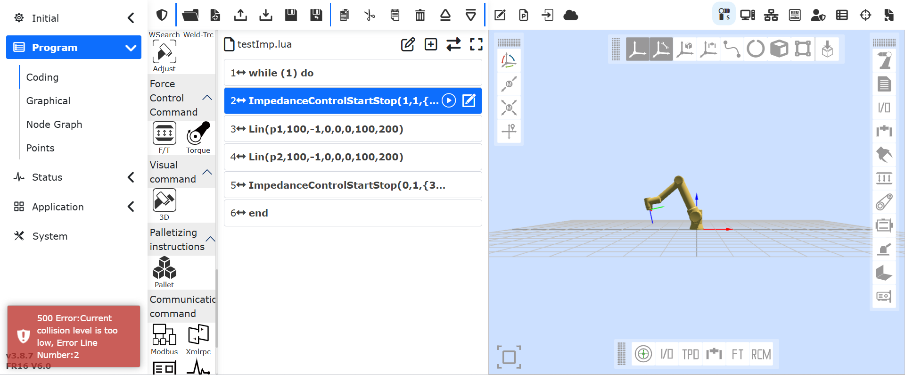

.. centered:: Schemat 9.34-4 Ostrzeżenie o zbyt niskim poziomie kolizji

**Krok 6**: Jeśli podczas działania ramię robota zatrzyma się, a w prawym dolnym rogu interfejsu webowego pojawi się komunikat „Usterka kolizji”, oznacza to, że siła zewnętrzna działająca na ramię robota przekroczyła próg wyzwolenia poziomu kolizji, co spowodowało usterkę kolizji.

.. image:: coding/477.png
   :width: 4in
   :align: center

.. centered:: Schemat 9.34-5 Ostrzeżenie o usterce kolizji

Szczegółowe działanie parametrów i zalecane wartości:

- Wybór przestrzeni: Ustawienie przestrzeni roboczej dla sterowania impedancją. Obecnie udostępniono tylko sterowanie impedancją w przestrzeni kartezjańskiej.
- Próg siły: Minimalna siła wyzwalająca sterowanie impedancją. Zakres progu siły dla kierunków translacji wynosi 30–150 N, dla kierunków rotacji 7–30 Nm.
- Współczynnik masy: Zwiększenie współczynnika masy powoduje powolne przesunięcie, zmniejszenie powoduje zbyt szybkie przesunięcie robota. Zakres dla kierunków translacji [0,01-1], zalecany 0,04; zakres dla kierunków rotacji [0,001-1], zalecany 0,01.
- Współczynnik tłumienia: Zwiększenie współczynnika tłumienia powoduje powolne przesunięcie, zmniejszenie powoduje zbyt szybkie przesunięcie robota i oscylacje. Zakres dla kierunków translacji [0,1-2], zalecany 0,1; zakres dla kierunków rotacji [0,008-1,5], zalecany 0,08.
- Współczynnik sztywności: Zwiększenie współczynnika sztywności powoduje powolne przesunięcie, zalecany 0.
- Maksymalna prędkość liniowa: Ograniczenie prędkości w kierunkach translacji wywołanej siłą zewnętrzną, zalecana 250 mm/s.
- Maksymalne przyspieszenie liniowe: Ograniczenie przyspieszenia w kierunkach translacji wywołanego siłą zewnętrzną, zalecane 500 mm/s².
- Maksymalna prędkość kątowa: Ograniczenie prędkości kątowej w kierunkach rotacji wywołanej siłą zewnętrzną, zalecana 90°/s.
- Maksymalne przyspieszenie kątowe: Ograniczenie przyspieszenia kątowego w kierunkach rotacji wywołanego siłą zewnętrzną, zalecane 180°/s².

Ustawienia sterowania impedancją w przestrzeni stawów oraz uruchamianie/zatrzymywanie funkcji
**********************************************************************************************

**Krok 1**: Zaloguj się do interfejsu webowego, kolejno kliknij „Ustawienia początkowe” → „Podstawowe” → „Stawy” → „Poziom kolizji”, aby przejść do modułu ustawiania poziomu kolizji robota i ustawić odpowiedni współczynnik kolizji.

.. image:: coding/555.png
   :width: 6in
   :align: center

.. centered:: Schemat 9.34-6 Moduł ustawiania współczynnika kolizji robota

**Krok 2**: Kolejno kliknij „Program nauczania” → „Programowanie” → „Zestaw sterowania siłą”, aby dodać instrukcję „Impedance”. Instrukcja „Impedance” umożliwia robotowi realizację sterowania impedancją na trajektorii ruchu.

.. image:: coding/556.png
   :width: 6in
   :align: center

.. centered:: Schemat 9.34-7 Dodanie instrukcji sterowania siłą

**Krok 3**: W module instrukcji sterowania siłą, w polu wyboru przestrzeni wybierz „Przestrzeń stawów”. W polach tekstowych ustaw odpowiednie próg siły, współczynnik masy, współczynnik tłumienia, współczynnik sztywności, maksymalną prędkość i maksymalne przyspieszenie. W typie instrukcji kliknij „Włącz”, kliknij „Dodaj”, aby dodać instrukcję włączenia sterowania impedancją. W typie instrukcji kliknij „Wyłącz”, kliknij „Dodaj”, aby dodać instrukcję wyłączenia sterowania impedancją.

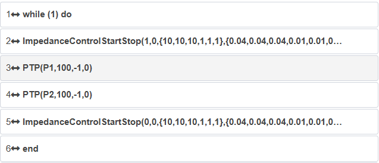

.. centered:: Schemat 9.34-8 Instrukcja sterowania impedancją

Szczegółowe działanie parametrów i zalecane wartości:

- Wybór przestrzeni: Ustawienie przestrzeni roboczej dla sterowania impedancją na przestrzeń stawów.
- Próg siły: Minimalna siła wyzwalająca sterowanie impedancją. Zakres progu siły dla J1-J3 wynosi 10–50 Nm, dla kierunków rotacji 1–10 Nm.
- Współczynnik masy: Zwiększenie współczynnika masy powoduje powolne przesunięcie, zmniejszenie powoduje zbyt szybkie przesunięcie robota. Zakres dla J1-J3 [0,01-1], zalecany 0,04; zakres dla J4-J6 [0,001-1], zalecany 0,01.
- Współczynnik tłumienia: Zwiększenie współczynnika tłumienia powoduje powolne przesunięcie, zmniejszenie powoduje zbyt szybkie przesunięcie robota i oscylacje. Zakres dla J1-J3 [0,1-2], zalecany 0,1; zakres dla J4-J6 [0,008-1,5], zalecany 0,08.
- Współczynnik sztywności: Zwiększenie współczynnika sztywności powoduje powolne przesunięcie, zalecany 0.
- Maksymalna prędkość: Ograniczenie prędkości obrotowej stawów wywołanej siłą zewnętrzną, zalecana 50°/s.
- Maksymalne przyspieszenie: Ograniczenie przyspieszenia obrotowego stawów wywołanego siłą zewnętrzną, zalecane 50°/s².

Funkcja niestandardowego spawania wahadłowego
~~~~~~~~~~~~~~~~~~~~~~~~~~~~~~~~~~~~~~~~~~~~~

Przegląd
++++++++

Funkcja niestandardowego spawania wahadłowego to funkcja, która umożliwia wykonywanie spawania wahadłowego przy użyciu własnego, zaprojektowanego przez użytkownika wzorca wahadła.

Opis funkcji niestandardowego spawania wahadłowego:

- (1) W interfejsie parametrów wahadła, w polu „Typ wahadła” wybierz dowolny z „Niestandardowe wahadło 0”, „Niestandardowe wahadło 1”, „Niestandardowe wahadło 2”. Maksymalnie można ustawić 3 niestandardowe tryby spawania wahadłowego.
- (2) Maksymalna liczba punktów końcowych niestandardowego wahadła to 10, minimalna to 2. Dane X, Y, Z ostatniego punktu końcowego muszą wynosić 0 i nie mogą być modyfikowane. Dla każdego punktu można ustawić czas postoju.
- (3) Wartości X, Y, Z punktów końcowych niestandardowego wahadła powinny mieścić się w zakresie -10 mm ~ 10 mm, częstotliwość wahadła nie może przekraczać 10.
- (4) Obecnie niestandardowe spawanie wahadłowe jest obsługiwane dla trajektorii linii prostej, łuku i pełnego okręgu, ale funkcja stopniowej zmiany wahadła nie jest jeszcze obsługiwana.
- (5) Należy pamiętać, że gdy czas oczekiwania wahadła jest ustawiony na „Uwzględnij”, całkowity czas postoju wahadła nie może przekraczać połowy okresu wahadła.

Procedura operacyjna funkcji niestandardowego spawania wahadłowego
++++++++++++++++++++++++++++++++++++++++++++++++++++++++++++++++++

Procedura operacyjna funkcji niestandardowego spawania wahadłowego jest następująca:

**Krok 1**: Najpierw zapisz punkty nauczania początku i końca trajektorii prostej. Następnie kliknij „Program nauczania”, „Programowanie”, wybierz „Punkt-punkt”, aby przemieścić koniec robota do punktu początkowego prostej „custWeaveP1”. Na koniec wybierz „Linia”, aby przemieścić robota do punktu końcowego prostej „custWeaveP2”.

**Krok 2**: Wybierz przycisk „Wahadło”, kliknij przycisk edycji procesu wahadła, aby przejść do interfejsu ustawień parametrów wahadła. W „Typie wahadła” wybierz „Niestandardowe wahadło N” (N = 0, 1, 2).

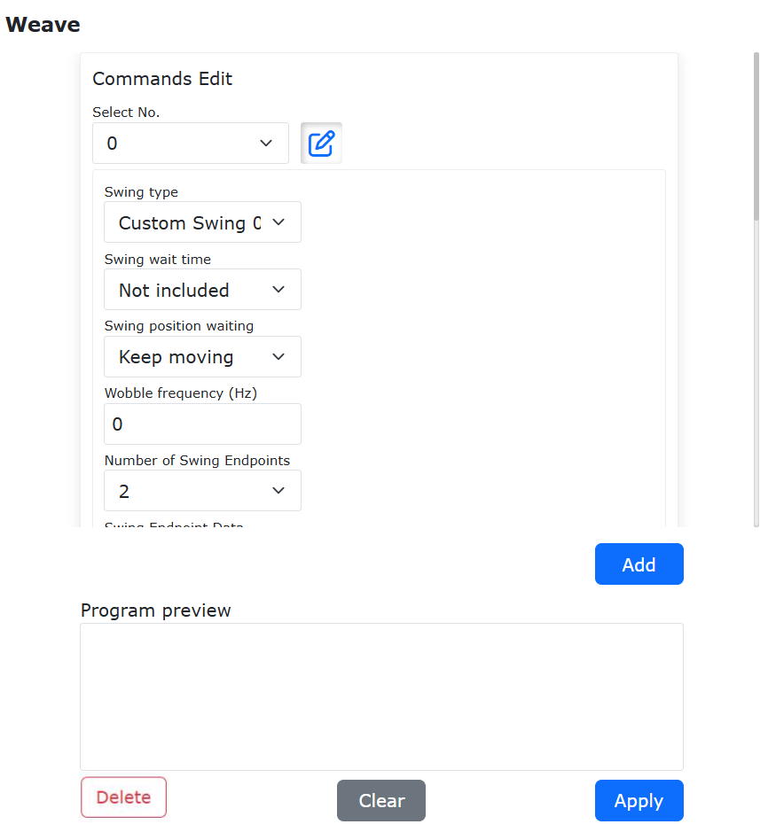

.. centered:: Schemat 9.35-1 Interfejs ustawień parametrów wahadła

**Krok 3**: Po wybraniu „Typu wahadła” przewiń interfejs ustawień parametrów wahadła w dół. W interfejsie wybierz liczbę niestandardowych punktów końcowych wahadła, ustaw pozycję każdego punktu w układzie współrzędnych wahadła i czas postoju, a na koniec kliknij przycisk „Konfiguruj”.

.. image:: coding/479.png
   :width: 6in
   :align: center

.. centered:: Schemat 9.35-2 Interfejs ustawień niestandardowego wahadła

**Krok 4**: W interfejsie wahadła, w polu „Typ instrukcji” kolejno wybierz „Rozpocznij wahadło”, „Zakończ wahadło” i kliknij przycisk „Dodaj”. Na koniec kliknij przycisk „Zastosuj”.

.. image:: coding/480.png
   :width: 6in
   :align: center

.. centered:: Schemat 9.35-3 Interfejs ustawień instrukcji wahadła

**Krok 5**: W interfejsie edycji programu wybierz instrukcję rozpoczęcia wahadła, kliknij przycisk „Przesuń w górę” u góry interfejsu, a następnie zapisz program. Przełącz robota w tryb automatyczny, kliknij przycisk „Start”, a robot rozpocznie niestandardowe wahadło na trajektorii prostej.

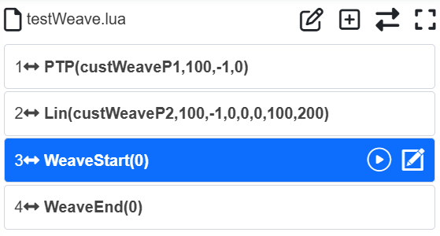

.. centered:: Schemat 9.35-4 Oryginalny interfejs instrukcji LUA

.. image:: coding/482.png
   :width: 6in
   :align: center

.. centered:: Schemat 9.35-5 Zmodyfikowany interfejs instrukcji LUA

**Krok 6**: Ustawienia niestandardowego wahadła dla trajektorii łuku i pełnego okręgu są takie same jak w krokach 1-5 powyżej.

Konfiguracja punktów nauczania
~~~~~~~~~~~~~~~~~~~~~~~~~~~~~~~

Kliknij „Konfiguracja punktów nauczania”, aby przejść do interfejsu funkcji konfiguracji punktów nauczania.

Zanim użytkownik użyje przycisku na panelu lub innych sygnałów IO do rejestrowania punktów nauczania, musi najpierw skonfigurować prefiks nazwy punktu nauczania, górny limit numeru i metodę nauczania. Prefiks nazwy obsługuje dwa tryby: niestandardowy prefiks i używanie bieżącej nazwy programu jako prefiksu. Na przykład, niestandardowy prefiks nazwy „P”, górny limit numeru „3”, metoda nauczania „Nauczanie robotem”. Rejestrowane kolejne punkty końcowe (narzędzia) robota to: P1, P2, P3. Ponowna rejestracja spowoduje nadpisanie poprzednio zarejestrowanych punktów.

.. image:: coding/483.png
   :width: 4in
   :align: center

.. centered:: Schemat 9.36-1 Konfiguracja punktów nauczania

Automatyczne nadpisywanie i aktualizacja programu lua podczas rejestrowania punktów końcowych
+++++++++++++++++++++++++++++++++++++++++++++++++++++++++++++++++++++++++++++++++++++++++++++

Konfiguracja funkcji rejestrowania punktów końcowych
****************************************************

1. Włącz funkcję rejestrowania punktów końcowych, kliknij Ustaw. Za pomocą przełącznika możesz wybrać program lua, który ma zostać zaktualizowany o nowe punkty.

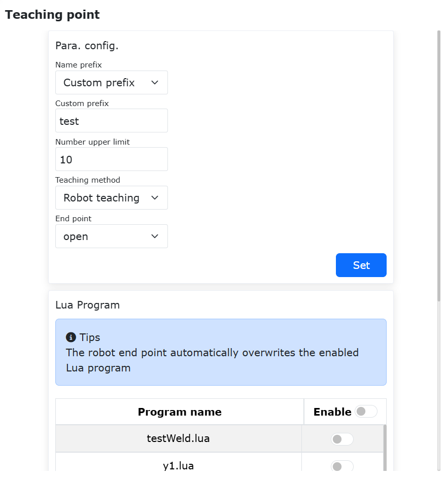

.. centered:: Schemat 9.36-2 Włączenie funkcji rejestrowania punktów końcowych

2. Po zakończeniu konfiguracji nazwa rejestrowanego punktu końcowego ma prefiks test, górny limit numeru to 10, a wszystkie programy Lua są włączone do aktualizacji. Funkcja pozostaje aktywna po zamknięciu aplikacji webowej.

Automatyczna aktualizacja programu Lua po naciśnięciu przycisku rejestrowania punktu końcowego
***********************************************************************************************

1. Kliknij przycisk rejestrowania punktu końcowego na końcówce robota.

.. image:: coding/485.png
   :width: 4in
   :align: center

.. centered:: Schemat 9.36-3 Przycisk rejestrowania punktu końcowego

2. W tym momencie dioda LED na końcówce miga następująco: Miganie fioletowe (rozpoczęcie) -> Świecenie niebieskie (rejestrowanie punktu i aktualizacja Lua) -> Świecenie zielone (zakończenie rejestracji). Informacje o punktach o odpowiedniej nazwie w wybranym programie Lua są synchronizowane.

.. image:: coding/486.png
   :width: 4in
   :align: center

.. centered:: Schemat 9.36-3 Zmiany diody LED podczas rejestrowania punktu końcowego i aktualizacji programu Lua

3. W przypadku niepowodzenia rejestracji punktu dioda LED na końcówce miga następująco: Miganie fioletowe (rozpoczęcie) -> Miganie czerwone (niepowodzenie rejestracji) -> Świecenie zielone (powrót do normy).

.. image:: coding/487.png
   :width: 4in
   :align: center

.. centered:: Schemat 9.36-4 Zmiany diody LED podczas niepowodzenia rejestracji punktu końcowego

Przykład użycia funkcji
***********************

1. Niestandardowy prefiks: test, górny limit numeru 5, metoda nauczania wybrana jako nauczanie robotem, funkcja rejestrowania punktów końcowych włączona, kliknij Ustaw.

2. Włącz program program1, który ma zostać zaktualizowany o nowe punkty.

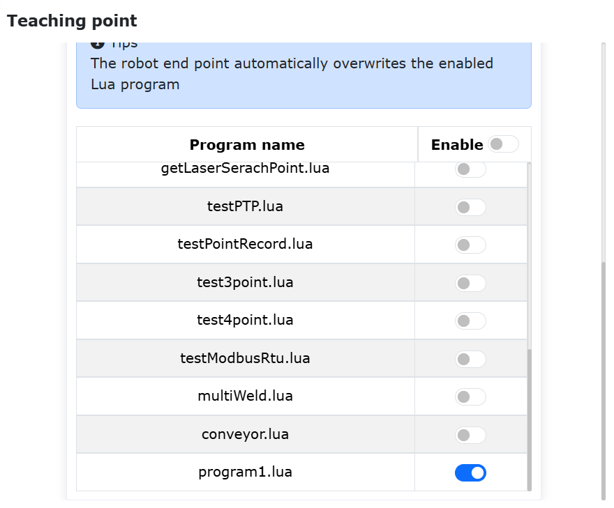

.. centered:: Schemat 9.36-5 Konfiguracja punktów nauczania

3. Poniższy rysunek przedstawia program program1 i jego bieżącą trajektorię ruchu.

.. image:: coding/489.png
   :width: 6in
   :align: center

.. centered:: Schemat 9.36-6 Program program1 i jego bieżąca trajektoria ruchu

4. Przełącz stronę w tryb ręczny, przeciągnij robota w nowe miejsce, kliknij przycisk rejestrowania punktu końcowego, poczekaj na zakończenie migania diody LED na końcówce: Miganie fioletowe (rozpoczęcie) -> Świecenie niebieskie (rejestrowanie punktu i aktualizacja Lua) -> Świecenie zielone (zakończenie rejestracji). Zarejestrowany punkt to test1.
5. Powtórz krok 4, aby kolejno zarejestrować test2, test3, test4, test5, kończąc rejestrację 5 punktów. W tym momencie punkty w programie program1 zostały zaktualizowane.
6. Uruchom ponownie program program1. Zaktualizowana trajektoria ruchu jest pokazana na poniższym rysunku.

.. image:: coding/490.png
   :width: 4in
   :align: center

.. centered:: Schemat 9.36-7 Zaktualizowana trajektoria ruchu

Konfiguracja programu głównego
~~~~~~~~~~~~~~~~~~~~~~~~~~~~~~

Kliknij „Konfiguracja programu głównego”, aby przejść do interfejsu funkcji konfiguracji programu głównego.

Konfiguracja programu głównego może być używana w połączeniu z konfiguracją DI do uruchamiania programu głównego. Skonfigurowany program główny musi zostać najpierw przetestowany, aby zapewnić bezpieczeństwo. Po skonfigurowaniu odpowiedniego DI jako sygnału uruchamiania programu głównego w ustawieniach robota, użytkownik może sterować tym sygnałem DI, aby uruchomić program główny.

.. image:: coding/491.png
   :width: 4in
   :align: center

.. centered:: Schemat 9.37-1 Konfiguracja programu głównego

Spawanie linii przecięcia rur z osią rozszerzoną robota
~~~~~~~~~~~~~~~~~~~~~~~~~~~~~~~~~~~~~~~~~~~~~~~~~~~~~~~

Struktura systemu
+++++++++++++++++

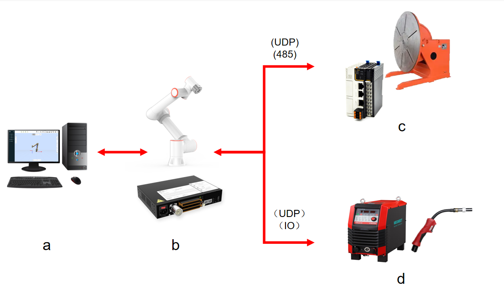

.. centered:: Schemat 9.38-1 Struktura systemu spawania linii przecięcia rur z osią rozszerzoną robota

W systemie (a) to komputer, (b) to robot i jego szafa sterownicza, (c) to pozycjoner i urządzenie napędowe, (d) to spawarka i urządzenia towarzyszące.

Konfiguracja komunikacji osi rozszerzonej
++++++++++++++++++++++++++++++++++++++++++

Sposoby komunikacji robota z osią rozszerzoną obejmują UDP lub RS485.

.. image:: coding/498.png
   :width: 6in
   :align: center

.. centered:: Schemat 9.38-2 Strona konfiguracji osi rozszerzonej

W interfejsie operacyjnym robota kliknij przyciski „Ustawienia początkowe”, „Urządzenia peryferyjne”, „Oś rozszerzona”, aby przejść do strony konfiguracji osi rozszerzonej. Na przykładzie użycia PLC połączonego z robotem przez komunikację UDP, kliknij ikonę „Komunikacja UDP”, aby przejść do strony konfiguracji osi rozszerzonej dla komunikacji UDP.

.. image:: coding/499.png
   :width: 6in
   :align: center

.. centered:: Schemat 9.38-3 Interfejs konfiguracji komunikacji UDP

Na stronie konfiguracji komunikacji UDP dla osi rozszerzonej można wybrać odpowiedni numer osi rozszerzonej, skonfigurować parametry komunikacji UDP (adres, port, okres, wykrywanie utraty pakietów itp.) oraz ustawić czas zakończenia pozycjonowania osi rozszerzonej.

Treść konfiguracji osi rozszerzonej nie jest głównym punktem opisu tej funkcji. Szczegółowa konfiguracja znajduje się w odpowiedniej części instrukcji użytkownika.

Konfiguracja połączenia spawarki
++++++++++++++++++++++++++++++++

Skonfiguruj spawarkę za pomocą poniższej strony konfiguracji:

.. image:: coding/500.png
   :width: 6in
   :align: center

.. centered:: Schemat 9.38-4 Strona konfiguracji spawarki

Komunikacja ze spawarką może wykorzystywać komunikację IO lub RS485. Kliknij „Ustawienia początkowe”, „Urządzenia peryferyjne”, „Spawarka”, aby przejść do interfejsu konfiguracji i połączenia, gdzie można skonfigurować moduły takie jak „Typ sterowania”, „Konfiguracja I/O”, „Parametry procesu spawania”, „Debugowanie spawarki”.

Treść konfiguracji spawarki nie jest głównym punktem opisu tej funkcji. Szczegółowa konfiguracja znajduje się w odpowiedniej części instrukcji użytkownika.

Kalibracja układu współrzędnych narzędzia
+++++++++++++++++++++++++++++++++++++++++

Po zamontowaniu palnika spawalniczego na końcówce robota, skalibruj palnik:

.. image:: coding/501.png
   :width: 6in
   :align: center

.. centered:: Schemat 9.38-5 Strona konfiguracji układu współrzędnych narzędzia

Kliknij „Ustawienia początkowe”, „Podstawowe”, „Współrzędne narzędzia”, aby przejść do strony ustawień układu współrzędnych narzędzia.

.. image:: coding/502.png
   :width: 6in
   :align: center

.. centered:: Schemat 9.38-6 Wybór metody 6 punktów do kalibracji palnika

Wybierz pusty układ współrzędnych, wybierz typ narzędzia jako „Narzędzie”, wybierz metodę 6 punktów do kalibracji narzędzia palnika. Zaleca się, aby orientacja układu współrzędnych narzędzia była zgodna z rysunkiem 4-3 podczas kalibracji.

.. image:: coding/503.png
   :width: 4in
   :align: center

.. centered:: Schemat 9.38-7 Schemat orientacji układu współrzędnych palnika

Treść kalibracji układu współrzędnych narzędzia nie jest głównym punktem opisu tej funkcji. Szczegółowa metoda kalibracji znajduje się w odpowiedniej części instrukcji użytkownika.

Funkcja spawania linii przecięcia rur
+++++++++++++++++++++++++++++++++++++

Ruch trajektorii spawania linii przecięcia rur ma dwie formy: po pierwsze, ruch linii przecięcia przy użyciu dwustopniowego pozycjonera typu L; po drugie, ruch linii przecięcia bez użycia pozycjonera, bezpośrednio.

Kalibracja układu współrzędnych osi rozszerzonej
*************************************************

Aby uzyskać synchronizację ruchu pozycjonera z robotem za pomocą układu współrzędnych osi rozszerzonej, należy skalibrować układ współrzędnych osi rozszerzonej.

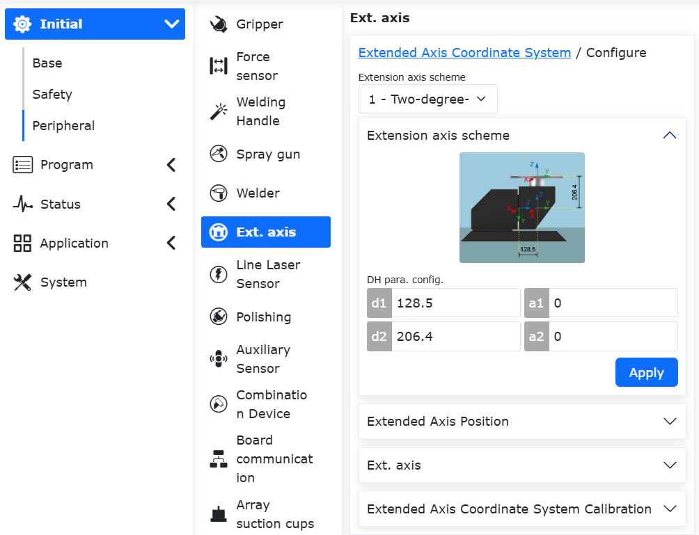

.. centered:: Schemat 9.38-8 Strona ustawień układu współrzędnych osi rozszerzonej

Kliknij „Ustawienia początkowe”, „Urządzenia peryferyjne”, „Oś rozszerzona”, aby przejść do interfejsu ustawień układu współrzędnych osi rozszerzonej. Wybierz numer osi rozszerzonej do ustawienia, kliknij przycisk edycji, wybierz „1 - Dwustopniowy pozycjoner typu L” i zapisz.

.. image:: coding/505.png
   :width: 6in
   :align: center

.. centered:: Schemat 9.38-9 Strona kalibracji osi rozszerzonej

Podczas kalibracji osi rozszerzonej należy zwrócić uwagę na wybór „Pozycja robota względem osi rozszerzonej” jako „Poza osią rozszerzoną”. W przypadku pozycjonera wybierz metodę 4 punktów do kalibracji.

Treść kalibracji osi rozszerzonej nie jest głównym punktem opisu tej funkcji. Szczegółowa metoda kalibracji znajduje się w odpowiedniej części instrukcji użytkownika.

Spawanie trajektorii linii przecięcia rur
*****************************************

Na podstawie zapisanych punktów nauczania na przekrojach rury głównej i łączonej można utworzyć układ współrzędnych obiektu, jak pokazano poniżej, gdzie początek układu współrzędnych znajduje się na przecięciu osi rury głównej i łączonej, oś X jest równoległa do osi rury głównej i skierowana do przekroju rejestrującego punkty nauczania, oś Z jest równoległa do osi rury łączonej i skierowana do płaszczyzny rejestrującej punkty nauczania.

.. image:: coding/506.png
   :width: 4in
   :align: center

.. centered:: Schemat 9.38-10 Układ współrzędnych obiektu trajektorii linii przecięcia rur

Sposób bez użycia pozycjonera
"""""""""""""""""""""""""""""

**Krok 1**: Zapisz 6 punktów nauczania odpowiednio na przekrojach rury głównej i łączonej.

**Krok 2**: Kliknij „Program nauczania”, „Programowanie”, w „Instrukcjach ruchu” znajdź „Linia przecięcia rur”, aby przejść do strony ustawień trajektorii linii przecięcia rur.

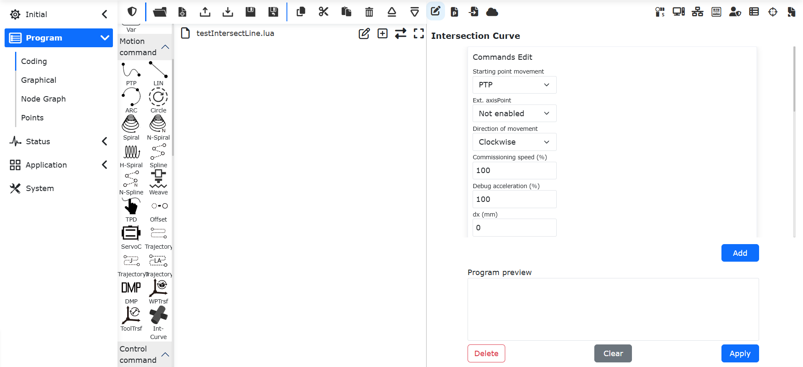

.. centered:: Schemat 9.38-11 Strona ustawień trajektorii linii przecięcia rur

**Krok 3**: Na stronie ustawień trajektorii linii przecięcia rur wybierz „Punkty osi rozszerzonej” jako „Nieaktywne”. Ukończ ustawienia ruchu punktu początkowego, kierunku ruchu, prędkości, przyspieszenia i wartości przesunięcia. Kierunek ruchu przeciwny do ruchu wskazówek zegara to kierunek czterech palców prawej dłoni trzymającej oś Z układu współrzędnych obiektu.

**Krok 4**: W sekcji „Dane punktów linii przecięcia rur” na stronie ustawień trajektorii linii przecięcia rur wybierz zapisane punkty nauczania. Po zakończeniu ustawień kliknij przyciski „Dodaj”, „Zastosuj”.

.. image:: coding/508.png
   :width: 6in
   :align: center

.. centered:: Schemat 9.38-12 Ustawienia instrukcji trajektorii linii przecięcia rur

**Krok 5**: Kliknij przycisk „Spawanie” w kategorii „Instrukcje spawania”, aby przejść do strony ustawień spawania. Wybierz instrukcje „Rozpoczęcie łuku” i „Zakończenie łuku”, kliknij przyciski „Dodaj”, „Zastosuj”. Po pomyślnym dodaniu przesuń instrukcję LUA rozpoczęcia łuku o jeden wiersz w górę.

.. image:: coding/509.png
   :width: 6in
   :align: center

.. centered:: Schemat 9.38-13 Ustawienia instrukcji spawania

Poniżej przedstawiono przykładowy program LUA dla spawania linii przecięcia rur bez pozycjonera:

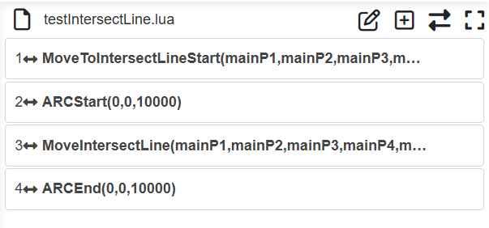

.. centered:: Schemat 9.38-14 Przykładowy program spawania linii przecięcia rur bez pozycjonera

Sposób z użyciem dwustopniowego pozycjonera typu L
""""""""""""""""""""""""""""""""""""""""""""""""""

**Krok 1**: Zapisz 6 punktów nauczania odpowiednio na przekrojach rury głównej i łączonej. Obróć osie 1 i 2 pozycjonera, aby zapisać 4 punkty nauczania pozycjonera.

**Krok 2**: Kliknij „Program nauczania”, „Programowanie”, w „Instrukcjach ruchu” znajdź „Linia przecięcia rur”, aby przejść do strony ustawień trajektorii linii przecięcia rur.

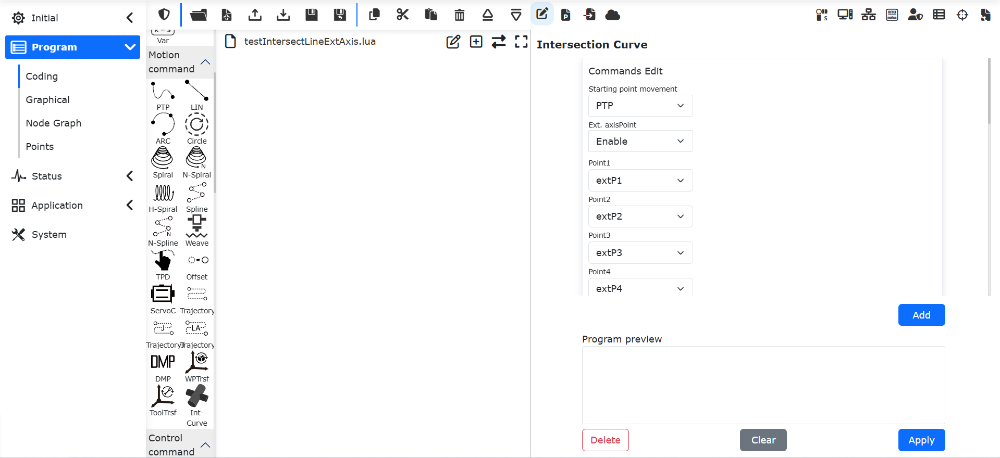

.. centered:: Schemat 9.38-15 Strona ustawień trajektorii linii przecięcia rur

**Krok 3**: Na stronie ustawień trajektorii linii przecięcia rur wybierz „Punkty osi rozszerzonej” jako „Aktywne”. Wybierz zapisane punkty nauczania pozycjonera. Ukończ ustawienia ruchu punktu początkowego, kierunku ruchu, prędkości, przyspieszenia i wartości przesunięcia.

**Krok 4**: W sekcji „Dane punktów linii przecięcia rur” na stronie ustawień trajektorii linii przecięcia rur wybierz zapisane punkty nauczania. Po zakończeniu ustawień kliknij przyciski „Dodaj”, „Zastosuj”.

.. image:: coding/512.png
   :width: 6in
   :align: center

.. centered:: Schemat 9.38-16 Ustawienia instrukcji trajektorii linii przecięcia rur

**Krok 5**: Kliknij przycisk „Spawanie” w kategorii „Instrukcje spawania”, aby przejść do strony ustawień spawania. Wybierz instrukcje „Rozpoczęcie łuku” i „Zakończenie łuku”, kliknij przyciski „Dodaj”, „Zastosuj”. Po pomyślnym dodaniu przesuń instrukcję LUA rozpoczęcia łuku o jeden wiersz w górę.

.. image:: coding/513.png
   :width: 6in
   :align: center

.. centered:: Schemat 9.38-17 Ustawienia instrukcji spawania

Poniżej przedstawiono przykładowy program LUA dla spawania linii przecięcia rur z pozycjonerem:

.. image:: coding/514.png
   :width: 6in
   :align: center

.. centered:: Schemat 9.38-18 Przykładowy program spawania linii przecięcia rur z pozycjonerem