Tryb węzła podrzędnego robota
===============================================================

.. toctree:: 
   :maxdepth: 6

Przegląd
-------------------

W celu ułatwienia sterowania ruchem robota przez PLC za pomocą różnych protokołów magistrali przemysłowych (CC-Link, Profinet, Ethernet/IP, EtherCAT), w zintegrowanej mini skrzynce kontrolnej dodano karty FRJ-PCIeN-EIP/CC/PN-RJ-V10 oraz FRJ-PCIeN-EC/PN/EIP/CC-RJ-V20, opracowując tryb węzła podrzędnego robota, realizujący następujące funkcje:

- 1. Urządzenie master wysyła sygnały wejściowe do węzła podrzędnego robota, co pozwala sterować robotem w celu wykonania odpowiednich działań, np.: sterowanie wyjściem DO skrzynki kontrolnej robota, sterowanie ruchem robota itp.;

- 2. Urządzenie master odczytuje wartości pod odpowiednimi adresami, aby uzyskać odpowiednie dane stanu robota w czasie rzeczywistym, np.: dane przegubów robota, pozycję TCP, informację, czy robot zakończył ruch itp.

Konfiguracja środowiska
--------------------------

Opis modeli kart i wersji oprogramowania:

.. list-table:: 
   :widths: 20 50 30
   :header-rows: 1
   :align: center

   * - **Typ protokołu**
     - **Model karty**
     - **Wersja oprogramowania robota**

   * - CC-Link IEF Basic
     - Karta FRJ-PCIeN-EIP/CC/PN-RJ-V10
     - V3.8.4 i nowsze

   * - CC-Link IEF Basic
     - Karta FRJ-PCIeN-EC/PN/EIP/CC-RJ-V20
     - V3.9.6 i nowsze

   * - Profinet
     - Karta FRJ-PCIeN-EIP/CC/PN-RJ-V10
     - V3.8.4 i nowsze

   * - Profinet
     - Karta FRJ-PCIeN-EC/PN/EIP/CC-RJ-V20
     - V3.9.6 i nowsze

   * - Ethernet/IP
     - Karta FRJ-PCIeN-EIP/CC/PN-RJ-V10
     - V3.8.4 i nowsze

   * - Ethernet/IP
     - Karta FRJ-PCIeN-EC/PN/EIP/CC-RJ-V20
     - V3.9.6 i nowsze

   * - EtherCAT
     - Karta FRJ-PCIeN-EC/PN/EIP/CC-RJ-V20
     - V3.9.6 i nowsze

Instalacja karty
~~~~~~~~~~~~~~~~~~~~~~~~~~~~~~~~~~~~~~~~~~~~~~~~~~~~~~

(1) Sprawdzenie materiałów: Karta FRJ-PCIeN oraz towarzyszące elementy blacharskie wyglądają następująco.

.. image:: remote_mode/001.png
   :width: 4in
   :align: center

.. centered:: Schemat 19.2-1 Blacha montażowa (przód)

.. image:: remote_mode/002.png
   :width: 4in
   :align: center

.. centered:: Schemat 19.2-2 Blacha montażowa (tył)

.. image:: remote_mode/003.png
   :width: 4in
   :align: center

.. centered:: Schemat 19.2-3 Karta FRH-PCIeN-EC/EIP/CC/PN-RJ-V10

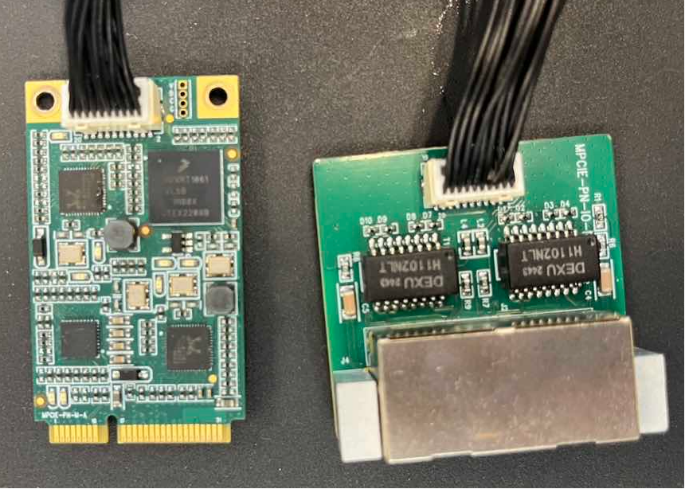

.. centered:: Schemat 19.2-4 Karta FRJ-PCIeN-EIP/CC/PN-RJ-V10

(2) Montaż karty w zintegrowanej mini skrzynce kontrolnej, jak pokazano na rysunku.

.. image:: remote_mode/005.png
   :width: 4in
   :align: center

.. centered:: Schemat 19.2-5 Schemat montażu blachy

.. image:: remote_mode/008.png
   :width: 4in
   :align: center

.. centered:: Schemat 19.2-6 Schemat montażu płyty głównej

.. image:: remote_mode/009.png
   :width: 4in
   :align: center

.. centered:: Schemat 19.2-7 Schemat montażu karty rozszerzenia portu sieciowego RJ45

.. note:: Uwaga: Wszystkie śruby należy dokręcić.

(3) Podłączenie skrzynki kontrolnej robota i PLC pokazano na poniższym rysunku.

.. image:: remote_mode/010.png
   :width: 4in
   :align: center

.. centered:: Schemat 19.2-8 Schemat podłączenia skrzynki kontrolnej i PLC Mitsubishi

.. image:: remote_mode/011.png
   :width: 4in
   :align: center

.. centered:: Schemat 19.2-9 Schemat podłączenia skrzynki kontrolnej i PLC Siemens

.. image:: remote_mode/012.png
   :width: 4in
   :align: center

.. centered:: Schemat 19.2-10 Schemat podłączenia skrzynki kontrolnej i PLC Inovance

.. image:: remote_mode/013.png
   :width: 4in
   :align: center

.. centered:: Schemat 19.2-11 Schemat podłączenia skrzynki kontrolnej i PLC Inovance

.. note:: 
    1: Skrzynka kontrolna robota (port sieciowy karty);
    2: Przełącznik;
    3: Laptop PC;
    4: PLC Mitsubishi (port sieciowy CC-Link IEF Basic);
    5: PLC Siemens (port sieciowy Profinet);
    6: PLC Inovance (Ethernet/IP);
    7: PLC Inovance (port sieciowy EtherCAT);
        
Konfiguracja środowiska PLC
~~~~~~~~~~~~~~~~~~~~~~~~~~~~~~~~~~~~~~~~~~~~~~~~~~~~~~~~

Środowisko testowe zbudowane do realizacji instrukcji węzła podrzędnego dla poszczególnych protokołów przedstawiono w poniższej tabeli, w tym modele PLC używane w poszczególnych protokołach, wersje firmware i oprogramowanie testowe.

.. centered:: Tabela 2-1 Środowisko testowe

.. list-table:: 
   :widths: 20 40 40
   :header-rows: 1
   :align: center

   * - Protokół
     - Profinet
     - CC-link

   * - Marka
     - Siemens
     - Mitsubishi

   * - Model
     - CPU 1515-2 PN
     - FX5S-30TR/DS

   * - Firmware
     - 6ES75152AM020AB0
     - 30MR/ES V1.3

   * - Oprogramowanie
     - TIA Portal V17
     - GXWorks3V1.097B

   * - Adres IP karty
     - IP konfigurowalny
     - IP konfigurowalny

   * - Adres IP PLC
     - IP nie musi być w tej samej podsieci
     - IP w tej samej podsieci
		
.. list-table:: 
   :widths: 20 40 40
   :header-rows: 1
   :align: center

   * - Protokół
     - Ethernet/IP
     - EtherCAT

   * - Marka
     - Inovance
     - Inovance

   * - Model
     - Easy521-0808TN
     - Easy521-0808TN

   * - Firmware
     - /
     - /

   * - Oprogramowanie
     - AutoShop 4.11.0.1
     - AutoShop 4.11.0.1

   * - Adres IP karty
     - IP konfigurowalny
     - IP konfigurowalny

   * - Adres IP PLC
     - IP w tej samej podsieci
     - IP w tej samej podsieci
		
Ethernet/IP Inovance
+++++++++++++++++++++++++++++++++++++++++++++++++++++

(1) Import pliku EDS

Otwórz oprogramowanie programistyczne Inovance AutoShop, utwórz nowy projekt PLC, w panelu narzędzi po prawej stronie wybierz „EtherNet/IP Devices”.

Kliknij lewym przyciskiem myszy na „EtherNet/IP”, następnie kliknij prawym przyciskiem, aby wywołać okno dialogowe „Importuj EDS”, potwierdź lewym przyciskiem i znajdź folder z plikiem EDS karty. Po pomyślnym imporcie nazwa karty pojawi się w katalogu „EtherNet/IP Devices”. Zamknij projekt i otwórz go ponownie, proces importu pliku EDS został zakończony.

.. image:: custom_protocol_slave/001.png
   :width: 6in
   :align: center

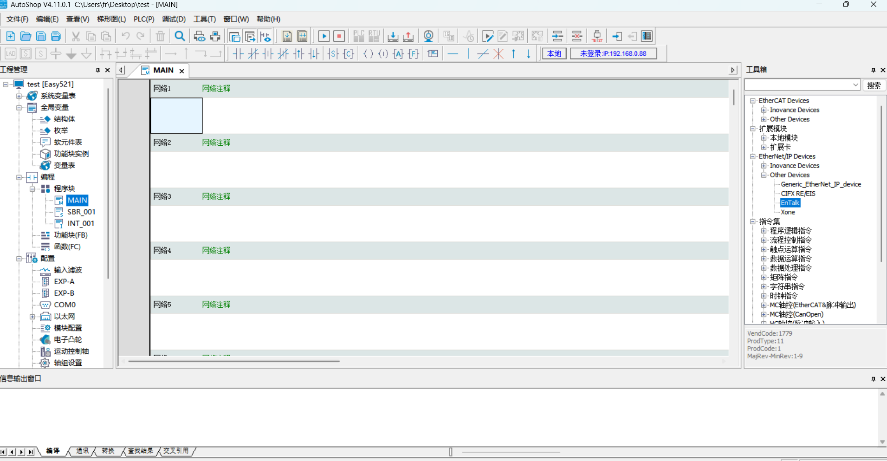

(2) Ustawienia parametrów EtherNet/IP

Kliknij dwukrotnie węzeł podrzędny w sekcji „EtherNet/IP” na lewym pasku narzędzi, pojawi się okno ustawień parametrów:

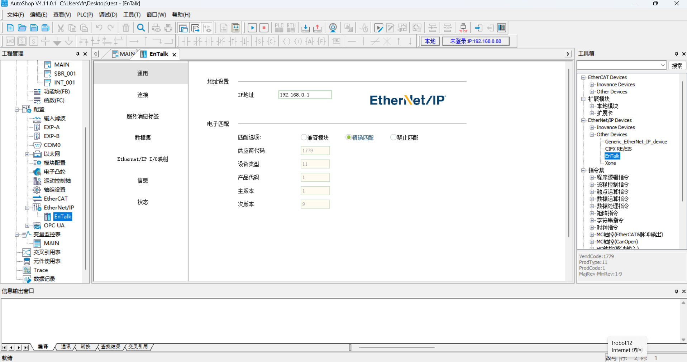

Wprowadź adres IP karty:

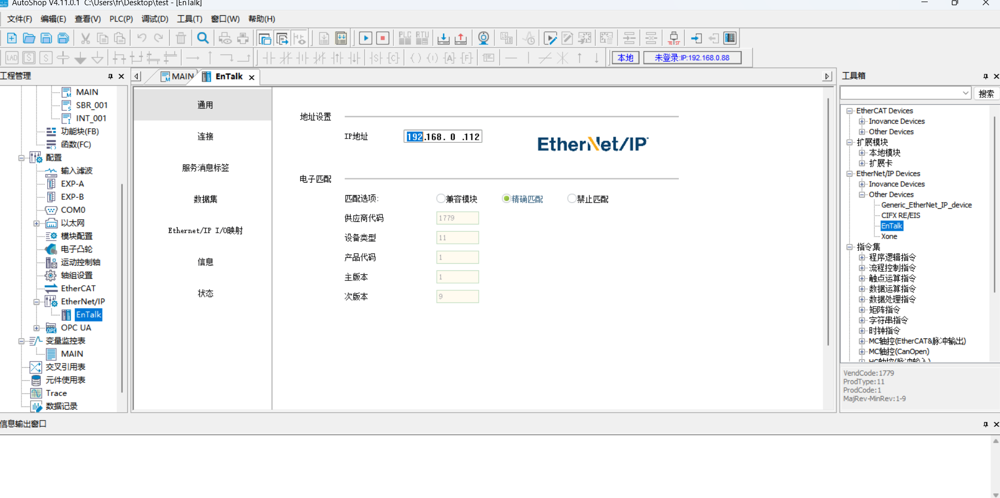

Kliknij i wybierz „Połączenie”, aby ustawić rozmiar bajtów wejścia/wyjścia danych:

.. image:: custom_protocol_slave/005.png
   :width: 6in
   :align: center

Kliknij „Edytuj połączenie”, w oknie dialogowym zmień liczbę bajtów wejścia i wyjścia na 256:

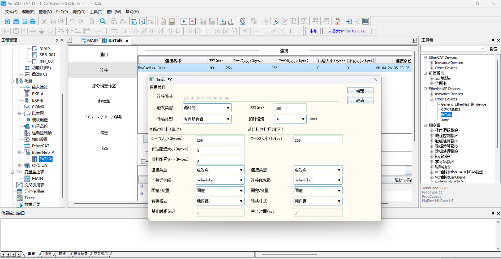

Kliknij i wybierz „Zbiór danych”, ustaw typ danych wejścia/wyjścia na „INT”, a długość bitu na „2048”:

.. image:: custom_protocol_slave/007.png
   :width: 6in
   :align: center

.. image:: custom_protocol_slave/008.png
   :width: 6in
   :align: center

.. image:: custom_protocol_slave/009.png
   :width: 6in
   :align: center

Po pomyślnym ustawieniu parametrów „Zbioru danych”, kliknij i wybierz „Mapowanie I/O EtherNet/IP”, a następnie wprowadź odpowiednio D0 i D200, które odpowiadają adresom początkowym tablicy odbiorczej i nadawczej po stronie PLC.

.. image:: custom_protocol_slave/010.png
   :width: 6in
   :align: center

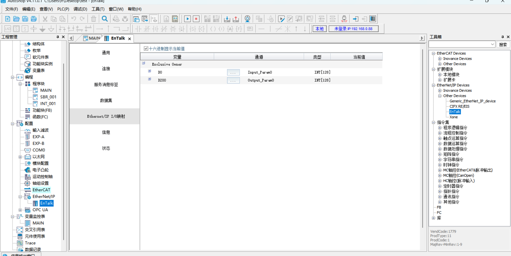

(3) Pobranie programu

Otwórz program testowy, zmień adres IP PLC na znajdujący się w tej samej podsieci co karta, uruchom program po pobraniu.

Profinet Siemens
++++++++++++++++++++++++++++++++++++++++++++++++++++++++

(1) Import pliku GSD (pliku XML)

Otwórz oprogramowanie programistyczne Siemens TIA Portal V17, utwórz nowy projekt PLC, wybierz „Urządzenia i sieci”, w „Katalogu sprzętu” po prawej stronie wybierz i kliknij dwukrotnie 6ES7 515-2AM02-0AB0, aby dodać moduł PLC.

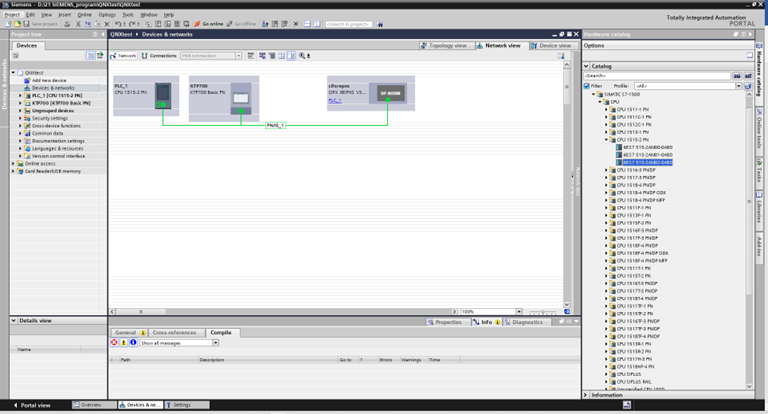

W oprogramowaniu TIA PORTAL, na pasku menu wybierz „Opcje” -> „Zarządzaj ogólnymi plikami opisu urządzenia (GSD)”, aby zainstalować lub usunąć już zainstalowane pliki GSD.

.. image:: custom_protocol_slave/013.png
   :width: 6in
   :align: center

Aby zainstalować plik GSD, wybierz powyższe „Zarządzaj ogólnymi plikami opisu urządzenia (GSD)”, pojawi się okno „Zarządzanie ogólnymi plikami opisu urządzenia”.

Wybierz folder z plikami GSD do instalacji ze „Ścieżki źródłowej”, wybierz jeden lub więcej plików do instalacji z wyświetlonej listy plików GSD, a następnie kliknij przycisk „Instaluj”. Jak pokazano na rysunku.

.. image:: custom_protocol_slave/014.png
   :width: 6in
   :align: center

Po pomyślnej instalacji, w katalogu sprzętu, w innych urządzeniach terenowych, można znaleźć urządzenia z zainstalowanym plikiem GSD, jak pokazano na rysunku.

.. image:: custom_protocol_slave/015.png
   :width: 6in
   :align: center

Przydział IO: W katalogu znajdź moduł i przeciągnij Input oraz Output.

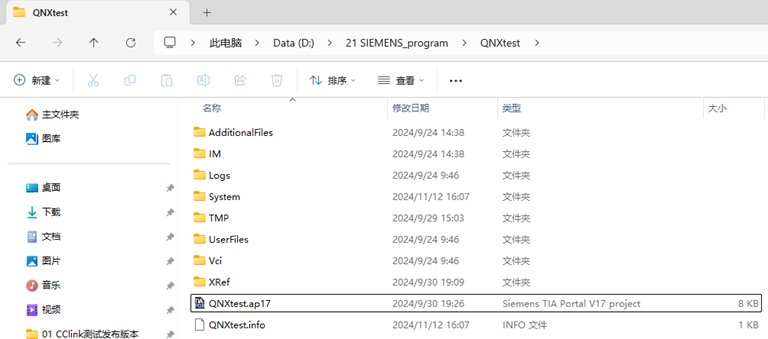

Kompilacja programu: W drzewie projektu po lewej stronie kliknij dwukrotnie, aby wejść w „Urządzenia i sieci”, kliknij prawym przyciskiem myszy moduł „PLC_1”, z menu rozwijanego wybierz kompilację, następnie wybierz „Sprzęt i oprogramowanie (tylko zmiany)”. Po zakończeniu kompilacji na dole widoku oprogramowania pojawi się komunikat „Kompilacja zakończona”:

.. image:: custom_protocol_slave/017.png
   :width: 6in
   :align: center

.. image:: custom_protocol_slave/018.png
   :width: 6in
   :align: center

Pobranie programu do urządzenia: W drzewie projektu po lewej stronie kliknij dwukrotnie, aby wejść w „Urządzenia i sieci”, kliknij prawym przyciskiem myszy moduł „PLC_1”, z menu rozwijanego wybierz „Pobierz do urządzenia”, następnie wybierz „Sprzęt i oprogramowanie (tylko zmiany)”:

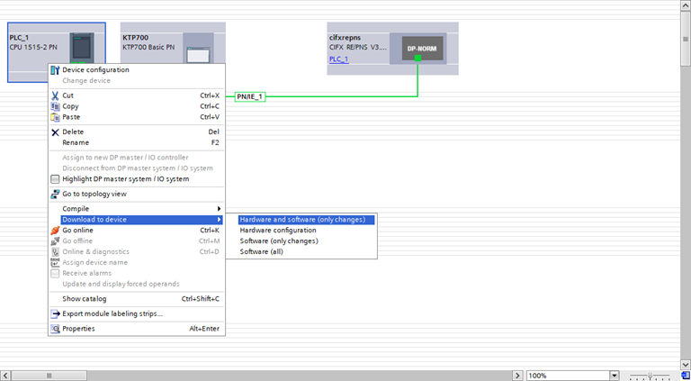

Wyszukaj i pobierz urządzenie: Po pojawieniu się okna dialogowego, skonfiguruj typ interfejsu PG/PC jak na rysunku, kliknij „Rozpocznij wyszukiwanie”, wybierz urządzenie, do którego ma zostać pobrany program, i kliknij „Pobierz”:

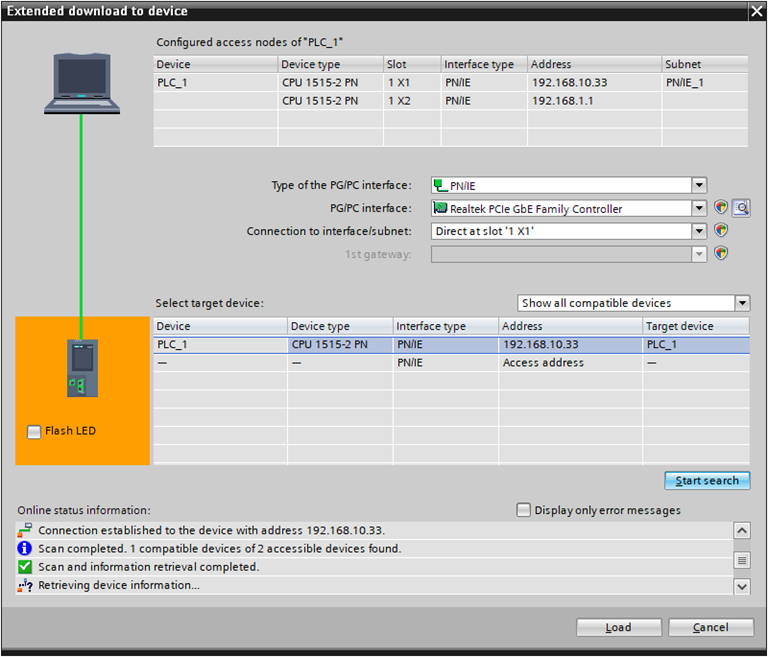

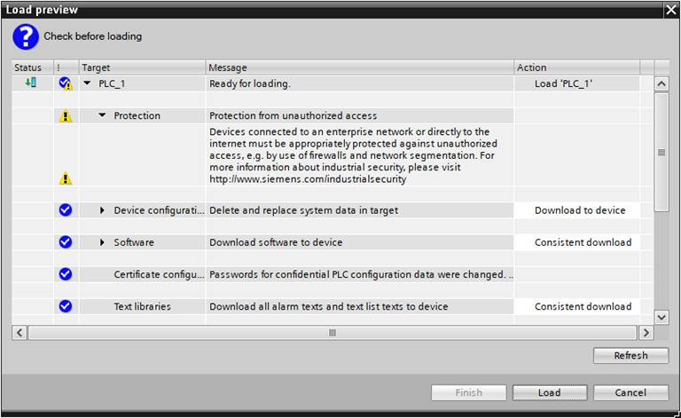

CC-link Mitsubishi
+++++++++++++++++++++++++++++++++++++++++++++++++

(1) Ustawienia CC-Link IEF Basic

Włącz użycie CC-link: Na lewym pasku menu nawigacji wybierz „Port Ethernet”, ustaw adres IP PLC, aby znajdował się w tej samej podsieci co adres karty Jiyuan. Kliknij „Użycie CC-link IEF Basic”, wybierz „Użyj”:

.. image:: custom_protocol_slave/022.png
   :width: 6in
   :align: center

Ustawienia konfiguracji sieci CC-Link: Również w ustawieniach CC-Link IEF Basic, wybierz „Ustawienia konfiguracji sieci”, jako moduł wybierz moduł ogólny CC-Link IEF Basic. Przeciągnij go do lewego dolnego rogu widoku, aby zakończyć konfigurację sprzętu:

.. image:: custom_protocol_slave/023.png
   :width: 6in
   :align: center
   
.. image:: custom_protocol_slave/024.png
   :width: 6in
   :align: center

Ustaw liczbę punktów i adres IP węzła podrzędnego:

.. image:: custom_protocol_slave/025.png
   :width: 6in
   :align: center
   
.. image:: custom_protocol_slave/026.png
   :width: 6in
   :align: center

Ustawienia odświeżania CC-Link: Również w ustawieniach CC-Link IEF Basic, kliknij „Ustawienia odświeżania”, dostosuj ustawienia transmisji: 256 bajtów odbioru, 256 bajtów wysyłania.
   
.. image:: custom_protocol_slave/027.png
   :width: 6in
   :align: center

(2) Pobranie programu

Po otwarciu programu testowego kliknij „Online” → „Zapisz do programowalnego sterownika”, aby przejść do interfejsu pobierania.
   
.. image:: custom_protocol_slave/028.png
   :width: 6in
   :align: center

Po otwarciu interfejsu pobierania kliknij „Parametry + program” w lewym górnym rogu, a następnie kliknij „Wykonaj” w prawym dolnym rogu, aby rozpocząć pobieranie. Poczekaj na zakończenie pobierania.
   
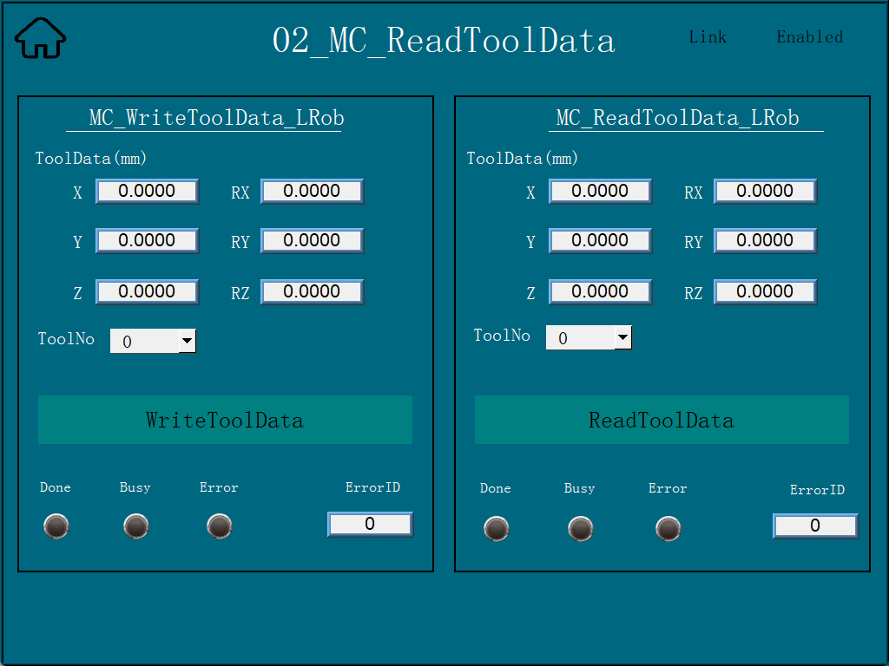

EtherCAT Inovance
++++++++++++++++++++++++++++++++++++++++++++++

(1) Import pliku XML

Otwórz oprogramowanie programistyczne Inovance AutoShop, utwórz nowy projekt PLC, w panelu narzędzi po prawej stronie wybierz „EtheCATDevices”:
   
.. image:: custom_protocol_slave/030.png
   :width: 6in
   :align: center

Kliknij lewym przyciskiem myszy na „EtheCATDevices”, następnie kliknij prawym przyciskiem, aby wywołać okno dialogowe „Importuj urządzenie XML”, potwierdź lewym przyciskiem i znajdź folder z plikiem XML karty.

Po pomyślnym imporcie nazwa karty pojawi się w katalogu „EtherCAT Devices”. Zamknij projekt i otwórz go ponownie, proces importu pliku XML został zakończony.
   
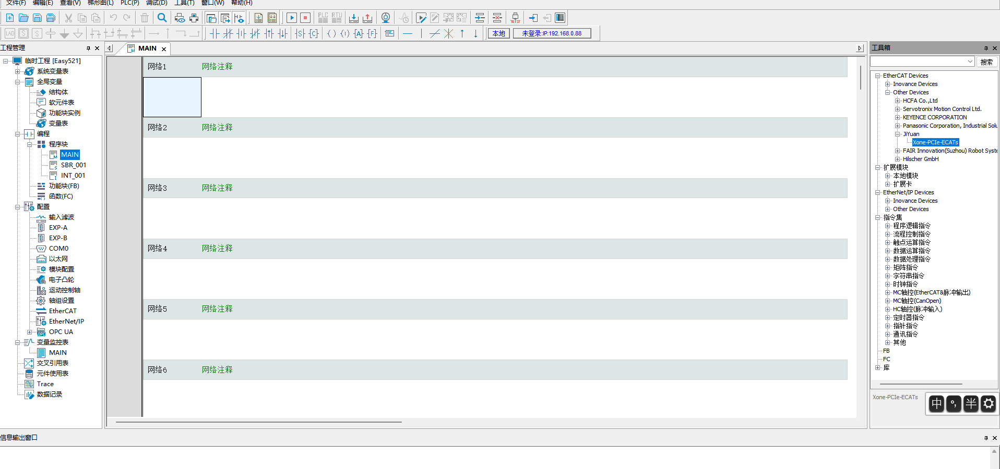

(2) Dodanie węzła podrzędnego EtherCAT

Panel narzędzi po prawej stronie → „EtehrCAT Devices” → „Other Devices” → „JIYuan” → „Xone-PCIe-ECATs”, kliknij dwukrotnie myszą na „Xone-PCIe-ECATs”, aby dodać węzeł podrzędny EtherCAT. Po dodaniu, po lewej stronie w projekcie, w sekcji mastera EtherCAT, węzeł podrzędny został dodany pomyślnie.
   
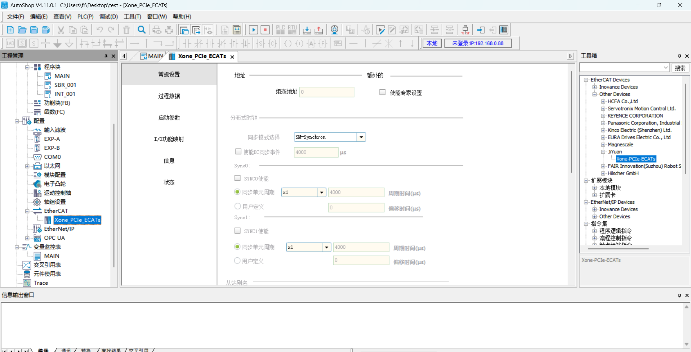
   
.. image:: custom_protocol_slave/033.png
   :width: 6in
   :align: center

(3) Dodanie PDO
   
.. image:: custom_protocol_slave/034.png
   :width: 6in
   :align: center
   
.. image:: custom_protocol_slave/035.png
   :width: 6in
   :align: center

(4) Mapowanie adresów EtherCAT

Kliknij dwukrotnie tabelę zmiennych na lewym pasku narzędzi, utwórz nową tablicę wejściową o rozmiarze 256 bajtów, z adresem elementu miękkiego D0. Utwórz nową tablicę wyjściową o rozmiarze 256 bajtów, z adresem elementu miękkiego D200.
   
.. image:: custom_protocol_slave/036.png
   :width: 6in
   :align: center

W sekcji „EtherCAT” na lewym pasku narzędzi, kliknij dwukrotnie „Xone-PCIe-ECATs”, w oknie dialogowym kliknij „Mapowanie funkcji I/O”, kliknij pole, aby powiązać adres zmiennej. W oknie dialogowym kliknij „Tabela zmiennych”, wybierz odpowiednie wejście/wyjście, kliknij OK. Pozostałe adresy wiąż w podobny sposób, w kolejności.
   
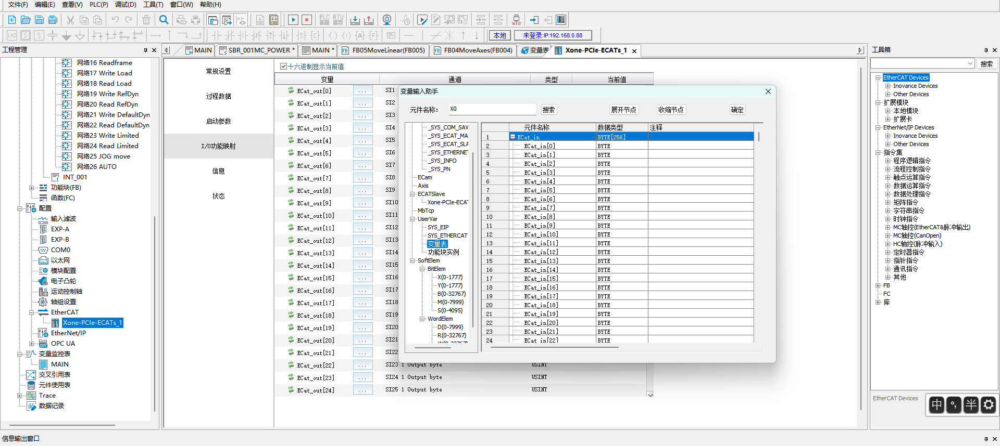

(5) Pobranie programu

Otwórz program testowy, zmień adres IP PLC na znajdujący się w tej samej podsieci co karta, uruchom program po pobraniu.

Opis operacji związanych z trybem węzła podrzędnego robota
--------------------------------------------------------------------------------------

Ładowanie trybu węzła podrzędnego
~~~~~~~~~~~~~~~~~~~~~~~~~~~~~~~~~~~~~~~~~~

(1) Otwórz WebApp, przejdź do Ustawienia początkowe -> Urządzenia peryferyjne -> Komunikacja z kartą -> Konfiguracja ręczna.
   
.. image:: custom_protocol_slave/038.png
   :width: 6in
   :align: center

Najpierw skonfiguruj adres IP karty. Jeśli nie zostanie wypełniony, karta uruchomi się z domyślnym adresem IP: 192.168.0.100. Obecnie konfiguracja IP dotyczy tylko protokołów EIP i CC-link. W przypadku protokołu PN, adres IP jest przydzielany przez mastera PLC podczas skanowania urządzenia podrzędnego.

.. note:: Po zmianie adresu IP na stronie, konieczne jest załadowanie trybu węzła podrzędnego, aby zmiana została zastosowana.
   
Następnie wybierz kolejno funkcje mapowania dla DI, DO, AO (patrz Dodatek). Znaczenie poszczególnych parametrów jest następujące:

- DI do sterowania robotem: Węzeł podrzędny robota odbiera sygnały wejściowe z zewnątrz i wykonuje mapowaną funkcję;
- DO do wyjścia stanu robota: Węzeł podrzędny robota wysyła sygnały zwrotne stanu do mastera;
- AO do sprzężenia zwrotnego stanu robota: Węzeł podrzędny robota wysyła dane zwrotne stanu do mastera, AO0~AO15 to liczby całkowite ze znakiem (int16), AO16~AO31 to liczby zmiennoprzecinkowe pojedynczej precyzji (float).

(2) Kliknij przycisk „Konfiguruj”, aby wygenerować plik lua protokołu otwartego.
   
.. image:: custom_protocol_slave/039.png
   :width: 6in
   :align: center

.. note:: Plik lua protokołu otwartego obsługuje pobieranie. Można go zaimportować na interfejsie automatycznej konfiguracji.

Przykład wygenerowanego programu:

.. code-block:: console
   :linenos:

   local id = 3 
   local ctrlDI = {0, 0, 0, 0, 0, 0}
   local funcDI = {0, 0, 0, 0, 0, 0, 0, 0, 0, 0, 0, 0, 0, 0, 0, 0}
   local DOState = {0, 0, 0, 0, 0, 0, 0, 0}
   local AOState = {0, 0, 0, 0, 0, 0, 0, 0, 0, 0, 0, 0, 0, 0, 0, 0, 0, 0, 0, 0, 0, 0, 0, 0, 0, 0, 0, 0, 0, 0, 0, 0}
   -- Launch the board communication process
   SetFieldBusIP("192.168.0.99")
   LoadFieldBusSlave()
   sleep_ms(8000)
   while(1) do
      -- Set the DO status
      CtrlBoxDO, CtrlBoxCO, CtrlBoxDI, CtrlBoxCI, errState, motionState, moveToOriginState, robotStartDoneState, modeChangeState, programStartStopState, emergencyState, reduceState, collision, enablestate, safetyStop0, safetyStop1, pauseState, interfereState = GetRobotFuncDOState()
      DOState[1] = CtrlBoxDO
      DOState[2] = CtrlBoxCO
      DOState[3] = CtrlBoxDI
      DOState[4] = CtrlBoxCI
      local ctrlWord0 = 0
      ctrlWord0 = SetBitWithIndex(ctrlWord0, 0, errState)
      ctrlWord0 = SetBitWithIndex(ctrlWord0, 1, motionState)
      ctrlWord0 = SetBitWithIndex(ctrlWord0, 2, moveToOriginState)
      ctrlWord0 = SetBitWithIndex(ctrlWord0, 3, robotStartDoneState)
      ctrlWord0 = SetBitWithIndex(ctrlWord0, 4, modeChangeState)
      ctrlWord0 = SetBitWithIndex(ctrlWord0, 5, programStartStopState)
      ctrlWord0 = SetBitWithIndex(ctrlWord0, 6, emergencyState)
      ctrlWord0 = SetBitWithIndex(ctrlWord0, 7, reduceState)
      DOState[5] = ctrlWord0
      local ctrlWord1 = 0
      ctrlWord1 = SetBitWithIndex(ctrlWord1, 0, collision)
      ctrlWord1 = SetBitWithIndex(ctrlWord1, 1, enablestate)
      ctrlWord1 = SetBitWithIndex(ctrlWord1, 2, safetyStop0)
      ctrlWord1 = SetBitWithIndex(ctrlWord1, 3, safetyStop1)
      ctrlWord1 = SetBitWithIndex(ctrlWord1, 4, pauseState)
      ctrlWord1 = SetBitWithIndex(ctrlWord1, 5, interfereState)
      DOState[6] = ctrlWord1
      SetFieldBusDOState(DOState)

      -- Set the AO status
      mainErrCode, subErrCode, TCPSpeed, axisPos1, axisPos2, axisPos3, axisPos4, axisPos5, axisPos6, jointVelFeedback1, jointVelFeedback2, jointVelFeedback3, jointVelFeedback4, jointVelFeedback5, jointVelFeedback6, jointCurFeedback1, jointCurFeedback2, jointCurFeedback3,jointCurFeedback4,jointCurFeedback5,jointCurFeedback6, jointTorqueFeedback1, jointTorqueFeedback2,jointTorqueFeedback3,jointTorqueFeedback4, jointTorqueFeedback5, jointTorqueFeedback6, cartPosx, cartPosy, cartPosz, cartPosrx, cartPosry, cartPosrz = GetRobotFuncAOState()
      AOState[1] = mainErrCode
      AOState[2] = subErrCode
      AOState[17] = axisPos1
      AOState[18] = axisPos2
      AOState[19] = axisPos3
      AOState[20] = axisPos4
      AOState[21] = axisPos5
      AOState[22] = axisPos6
      AOState[23] = cartPosx
      AOState[24] = cartPosy
      AOState[25] = cartPosz
      AOState[26] = cartPosrx
      AOState[27] = cartPosry
      AOState[28] = cartPosrz
      SetFieldBusAOState(AOState)
      sleep_ms(10) 

      -- Set the DI status
      -- Configue the DI function and update it in real-time
      ctrlDI[1],ctrlDI[2],ctrlDI[3],ctrlDI[4],ctrlDI[5],ctrlDI[6] = GetFieldBusDIState()
      funcDI[1] = ctrlDI[1] 
      funcDI[2] = ctrlDI[2] 
      funcDI[3] = GetBitWithIndex(ctrlDI[3], 0)
      funcDI[4] = GetBitWithIndex(ctrlDI[3], 1)
      funcDI[5] = GetBitWithIndex(ctrlDI[3], 2)
      funcDI[6] = GetBitWithIndex(ctrlDI[3], 3)
      funcDI[7] = GetBitWithIndex(ctrlDI[3], 4)
      funcDI[8] = GetBitWithIndex(ctrlDI[3], 5)
      funcDI[9] = GetBitWithIndex(ctrlDI[3], 6)
      funcDI[10] = GetBitWithIndex(ctrlDI[3], 7)
      funcDI[11] = GetBitWithIndex(ctrlDI[4], 0)
      funcDI[12] = GetBitWithIndex(ctrlDI[4], 1)
      funcDI[13] = GetBitWithIndex(ctrlDI[4], 2)
      funcDI[14] = GetBitWithIndex(ctrlDI[4], 3)
      funcDI[15] = GetBitWithIndex(ctrlDI[4], 4)
      funcDI[16] = GetBitWithIndex(ctrlDI[4], 5)
      SetRobotFuncDIState(funcDI)
      local stopFlag = GetOpenLUAStopFlag(id)
      if(stopFlag ~= 0) then 
         UnloadFieldBusSlave()
         break
      end
      sleep_ms(10)
   end

(3) Kliknij przycisk „Załaduj”, aby załadować tryb węzła podrzędnego robota.
   
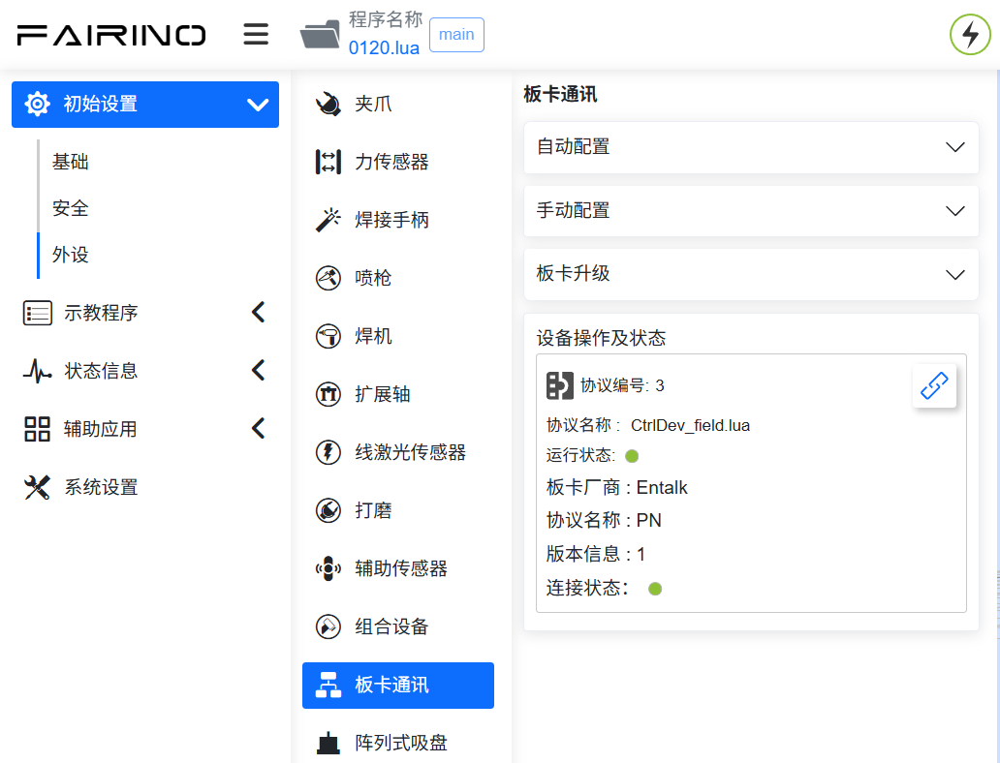

.. note:: Po pomyślnym załadowaniu trybu węzła podrzędnego robota, obsługiwana jest funkcja automatycznego uruchamiania przy starcie. Aby użyć trybu zdalnego, należy najpierw odinstalować tryb węzła podrzędnego.

(4) Kliknij przycisk paska stanu karty po prawej stronie, aby monitorować informacje o wymianie danych DI, DO, AI, AO. Opisy parametrów są następujące:

- CtrlDO: Wartość wejściowa sygnału DO/CO skrzynki kontrolnej wysłana przez zewnętrznego mastera;
- DI: Wartość wejściowa sygnału sterującego z zewnętrznego mastera;
- Aux_DI: Rozszerzone DI karty komunikacyjnej;
- DO: Wartość wyjściowa sygnału zwrotnego z węzła podrzędnego robota;
- Aux_DO: Rozszerzone DO karty komunikacyjnej;
- AI: Wartość wejściowa z zewnętrznego mastera;
- AI0~AI15: typ int16;
- AI16~AI31: typ float;
- AO: Wartość wyjściowa z węzła podrzędnego robota;
- AO0~AO15: typ int16;
- AO16~AO31: typ float.

.. note:: Szczegółowe informacje o parametrach DI, DO, AI, AO można znaleźć w dokumencie „RD36-Tabela adresów trybu węzła podrzędnego robota-V1.0-20260605”.
   
.. image:: custom_protocol_slave/041.png
   :width: 4in
   :align: center

(5) Po zakończeniu ładowania, poprzez program nauczania -> Instrukcje komunikacyjne -> Karta, można wygenerować instrukcje lua karty, umożliwiające ustawienie DO, AO węzła podrzędnego, pobranie DI, AI węzła podrzędnego oraz oczekiwanie na DI, AI węzła podrzędnego.
   
.. image:: custom_protocol_slave/042.png
   :width: 6in
   :align: center

Aktualizacja firmware karty i konfiguracja cyklu komunikacyjnego
--------------------------------------------------------------------------

Karta FRJ-PCIeN-EIP/CC/PN-RJ-V10
~~~~~~~~~~~~~~~~~~~~~~~~~~~~~~~~~~~~~~~~~~~~~~~~~~~~~~~~~~~~~~~~~~~~~~~~~~~~~~~~~~

Przy przełączaniu protokołu karty konieczna jest aktualizacja firmware. Aby zaktualizować firmware karty FRJ-PCIeN-EIP/CC/PN-RJ-V10 za pomocą komputera PC, wykonaj następujące kroki:

(1) Otwórz WinPcap_4_1_3.exe, zainstaluj pakiet sterownika karty sieciowej.

(2) Podłącz port sieciowy komputera PC (system Win11) bezpośrednio do portu sieciowego karty. Otwórz Device Assistant v1.1.0.exe, kliknij dwukrotnie „Ethernet”, kliknij przycisk „Odśwież” w lewym górnym rogu, aby zeskanować aktualnie podłączone urządzenie karty.
   
.. image:: custom_protocol_slave/043.png
   :width: 6in
   :align: center
      
.. image:: custom_protocol_slave/044.png
   :width: 6in
   :align: center

(3) Kliknij dwukrotnie zeskanowane urządzenie karty, aby przejść do interfejsu aktualizacji firmware. Skonfiguruj adresy IP komputera PC i pobranej karty w tej samej podsieci. Kliknij przycisk „…” po prawej stronie menu „Aktualizacja firmware”, prześlij firmware do aktualizacji, kliknij przycisk „Aktualizuj”. Po pomyślnej aktualizacji, w polu tekstowym w lewym dolnym rogu pojawi się komunikat „Aktualizacja zakończona sukcesem”.
      
.. image:: custom_protocol_slave/045.png
   :width: 6in
   :align: center

(4) Po pomyślnej aktualizacji karta zostanie zresetowana. Poczekaj na zakończenie resetowania karty (5 s). Wprowadź żądany cykl komunikacyjny (obsługiwany 1~100 ms), kliknij przycisk „Ustaw”. Po wyświetleniu komunikatu „Ustawienie cyklu zakończone sukcesem” w lewym dolnym rogu, uruchom ponownie skrzynkę kontrolną.
      
.. image:: custom_protocol_slave/046.png
   :width: 6in
   :align: center

Karta FRJ-PCIeN-EC/PN/EIP/CC-RJ-V20
~~~~~~~~~~~~~~~~~~~~~~~~~~~~~~~~~~~~~~~~~~~~~~~~~~~~~~~~~~~~~~~~~~~~~~~~~~~~~~~~~~

Przy przełączaniu protokołu karty konieczna jest aktualizacja firmware. Zaloguj się do interfejsu robota, aby zaktualizować firmware karty FRJ-PCIeN-EC/PN/EIP/CC-RJ-V20, wykonując następujące kroki:

(1) Wprowadź adres URL 192.168.58.2, aby przejść do interfejsu robota. Kliknij „Ustawienia początkowe” -> „Urządzenia peryferyjne” -> „Komunikacja z kartą”, aby uzyskać numer wersji firmware karty FRJ-PCIeN-EC/PN/EIP/CC-RJ-V20. Wybierz plik bin do aktualizacji, kliknij „Prześlij”. Po pomyślnej aktualizacji firmware uruchom ponownie skrzynkę kontrolną.
      
.. image:: custom_protocol_slave/047.png
   :width: 6in
   :align: center

.. note:: Aby zaktualizować firmware karty FRJ-PCIeN-EC/PN/EIP/CC-RJ-V20, należy odinstalować działający protokół otwarty.

(2) Wprowadź adres URL 192.168.58.2, aby przejść do interfejsu robota. Kliknij „Ustawienia początkowe” -> „Urządzenia peryferyjne” -> „Komunikacja z kartą”, aby uzyskać cykl komunikacyjny karty. Wprowadź żądany cykl komunikacyjny (1~100 ms), kliknij przycisk „Konfiguruj”. Po pomyślnej konfiguracji uruchom ponownie skrzynkę kontrolną.
      
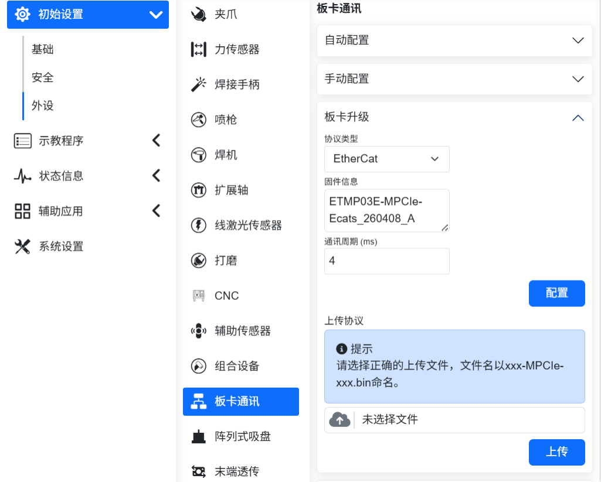

.. note:: Aby skonfigurować cykl komunikacyjny karty FRJ-PCIeN-EC/PN/EIP/CC-RJ-V20, należy odinstalować działający protokół otwarty.

:download:`Firmware i pliki konfiguracyjne komunikacji karty <../_static/_doc/Board communication firmware and configuration files.zip>`

:download:`Zbiór programów testowych PLC dla poszczególnych protokołów <../_static/_doc/Summary of PLC Test Programs for Each Protocol.zip>`