Programowanie graficzne
=======================

.. toctree:: 
   :maxdepth: 6

Wprowadzenie
------------

Ponieważ panel operatorski zazwyczaj nie jest wyposażony w zewnętrzne urządzenia peryferyjne, takie jak klawiatura czy mysz, podczas uzyskiwania dostępu do WebAPP robota za pośrednictwem panelu operatorskiego użytkownik może edytować programy nauczania robota za pomocą funkcji programowania graficznego. Funkcja ta wykorzystuje bibliotekę Blockly do standaryzowanej implementacji funkcji, która może być zintegrowana z systemem WebAPP. W razie potrzeby można zaimplementować niestandardowe bloki kodu, a po zakończeniu programowania metodą przeciągania i upuszczania, kod jest konwertowany na program LUA i wysyłany do wykonania za pomocą istniejących instrukcji protokołu.

Dzięki zastosowaniu programowania graficznego możliwe jest osiągnięcie prostoty zrozumienia, łatwości obsługi oraz lokalizacji języka chińskiego.

Strona jest podzielona na trzy obszary: „Pasek operacji”, „Pasek narzędzi” i „Obszar edycji kodu”. Ogólny układ projektu przedstawiono na rysunku:

.. image:: graphical/001.png
   :width: 6in
   :align: center

.. centered:: Wykres 10.1‑1 Interfejs programowania graficznego

**Pasek operacji**

1) **Załaduj**: Odpowiada za ponowne załadowanie obszaru roboczego.
2) **Importuj**: Odpowiada za import odpowiednich programów programowania graficznego.
3) **Eksportuj**: Odpowiada za eksport zapisanych programów programowania graficznego z obszaru roboczego. Funkcja przycisku „Zapisz” polega na zapisaniu po edycji bloków kodu jako odpowiedniego programu nauczania.
4) **Zapisz**: Odpowiada za zapisanie edytowanych graficznych bloków kodu.
5) **Wyczyść**: Odpowiada za szybkie wyczyszczenie obszaru edycji kodu.
6) **Kod**: Odpowiada za translację bloków kodu na kod LUA.

**Pasek narzędzi**

1) Zawiera bloki kodu wszystkich instrukcji i logiki, które można przeciągnąć do obszaru roboczego w celu utworzenia bloków kodu i edycji.
2) Część paska narzędzi jest dalej klasyfikowana według typów instrukcji.
3) Instrukcje logiczne: if-else, while itp.
4) Podstawowe instrukcje ruchu: PTP, LIN, ARC itp. Klasyfikacja według scenariuszy aplikacji: klejenie, spawanie, taśmociąg itp. Podczas użytkowania można łatwo znaleźć potrzebne bloki kodu.

**Obszar roboczy**: W obszarze edycji kodu można edytować i wyświetlać graficzne bloki kodu.

Logiczne polecenia programowania graficznego
--------------------------------------------
Logiczne polecenia programowania graficznego obejmują polecenia logiczne, takie jak pętle, liczby itp.

.. image:: graphical/003.png
   :width: 6in
   :align: center

.. centered:: Wykres 10.2 Logiczne programowanie graficzne

Instrukcja warunkowa If/Else
~~~~~~~~~~~~~~~~~~~~~~~~~~~~
Przeciągnij blok kodu „Instrukcja warunkowa If/Else” do obszaru roboczego interfejsu edycji graficznej. (Instrukcja ta wymaga podstawowej znajomości programowania. W razie potrzeby skontaktuj się z nami.)

.. image:: graphical/021.png
   :width: 6in
   :align: center

.. centered:: Wykres 10.2-1 Blok kodu instrukcji warunkowej If/Else

Instrukcja While
~~~~~~~~~~~~~~~~
Przeciągnij blok kodu „Instrukcja While” do obszaru roboczego interfejsu edycji graficznej. (Instrukcja ta wymaga podstawowej znajomości programowania. W razie potrzeby skontaktuj się z nami.)

Dodaj warunek oczekiwania za While, a wewnątrz while dodaj bloki kodu instrukcji ruchu, a następnie kliknij Zapisz. (Dla wygody można wprowadzić dowolną treść do, a następnie edytować i zastąpić innymi instrukcjami w programie.)

.. image:: graphical/022.png
   :width: 6in
   :align: center

.. centered:: Wykres 10.2-2 Blok kodu instrukcji While

Instrukcja skoku
~~~~~~~~~~~~~~~~
Przeciągnij blok kodu „Instrukcja skoku” do obszaru roboczego interfejsu edycji graficznej. (Instrukcja ta wymaga podstawowej znajomości programowania. W razie potrzeby skontaktuj się z nami.)

- Nazwa skoku: Wprowadź nazwę skoku, aby określić miejsce docelowe skoku.

.. image:: graphical/023.png
   :width: 6in
   :align: center

.. centered:: Wykres 10.2-3 Blok kodu instrukcji skoku

.. important:: Nazwa skoku nie może zaczynać się od cyfry.

Polecenia programowania graficznego dotyczące zmiennych
-------------------------------------------------------
Polecenia programowania graficznego dotyczące zmiennych obejmują polecenie tworzenia zmiennych.

.. image:: graphical/004.png
   :width: 6in
   :align: center

.. centered:: Wykres 10.3 Programowanie graficzne dotyczące zmiennych

Instrukcja zmiennej
~~~~~~~~~~~~~~~~~~~
Kliknij przycisk „Utwórz”, aby wprowadzić nazwę zmiennej do zdefiniowania.

Przeciągnij blok kodu „Instrukcja zmiennej” do obszaru roboczego interfejsu edycji graficznej.

Węzeł instrukcji „Zmienna”, parametry:

.. image:: graphical/024.png
   :width: 6in
   :align: center

.. centered:: Wykres 10.3-1 Blok kodu instrukcji zmiennej

Polecenia programowania graficznego dotyczące funkcji
-----------------------------------------------------
Polecenia programowania graficznego dotyczące funkcji obejmują polecenie tworzenia funkcji.

.. image:: graphical/005.png
   :width: 6in
   :align: center

.. centered:: Wykres 10.4 Programowanie graficzne dotyczące funkcji

Instrukcja metody funkcji
~~~~~~~~~~~~~~~~~~~~~~~~~
Przeciągnij blok kodu „Instrukcja metody funkcji” do obszaru roboczego interfejsu edycji graficznej.

Węzeł instrukcji „Metoda funkcji”, parametry:

- Nazwa funkcji: Nazwa uruchamianej funkcji.

.. image:: graphical/025.png
   :width: 6in
   :align: center

.. centered:: Wykres 10.4-1 Blok kodu instrukcji metody funkcji

Polecenia programowania graficznego dotyczące ruchu
---------------------------------------------------
Polecenia programowania graficznego dotyczące ruchu obejmują polecenia ruchu, takie jak PTP, Lin, ARC itp.

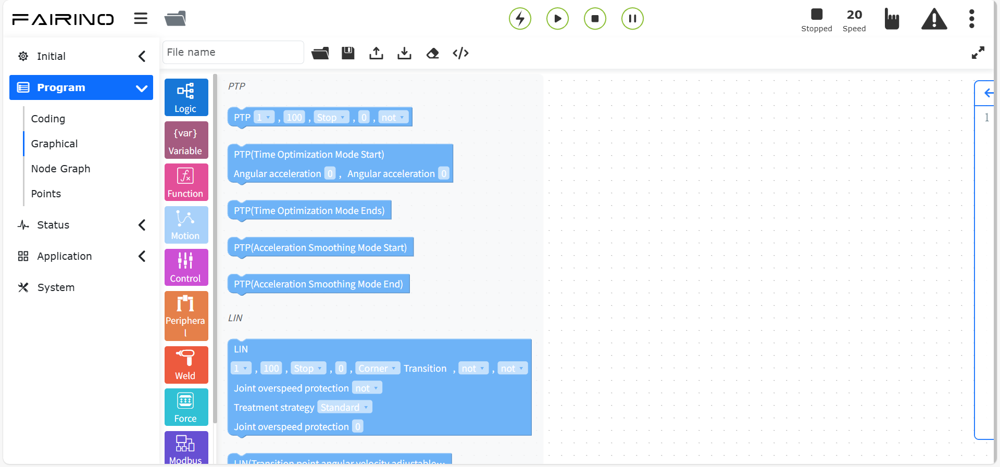

.. centered:: Wykres 10.5 Programowanie graficzne dotyczące ruchu

Instrukcja punkt-punkt
~~~~~~~~~~~~~~~~~~~~~~
Przeciągnij blok kodu „Instrukcja punkt-punkt” do obszaru roboczego interfejsu edycji graficznej.

Można wybrać punkt docelowy. Ustawienie czasu wygładzenia przejścia umożliwia ciągły ruch od tego punktu do następnego. Ustawienie przesunięcia umożliwia wybór przesunięcia względem podstawowego układu współrzędnych lub względem układu współrzędnych narzędzia, a następnie pojawia się okno ustawień wartości przesunięcia x, y, z, rx, ry, rz. Konkretna ścieżka PTP jest optymalną ścieżką automatycznie planowaną przez kontroler ruchu.

Węzeł instrukcji „Punkt-punkt”, parametry:

- Nazwa punktu: Punkt nauczania.

- Prędkość调试 (%): 0 ~ 100

- Zatrzymaj: false/true

- Płynne przejście (ms): Czas wygładzenia przejścia 0 ~ 500

- Czy przesunięcie: Nie / przesunięcie względem podstawy / przesunięcie względem narzędzia. Gdy wybrano Nie, parametry dx~drz nie są aktywne.

- dx~drz: Wartości przesunięcia.

.. image:: graphical/026.png
   :width: 6in
   :align: center

.. centered:: Wykres 10.5-1 Blok kodu instrukcji punkt-punkt

Instrukcja linii prostej
~~~~~~~~~~~~~~~~~~~~~~~~
Przeciągnij blok kodu „Instrukcja linii prostej” do obszaru roboczego interfejsu edycji graficznej.

Funkcja tej instrukcji jest podobna do instrukcji „Punkt-punkt”, ale ścieżka do punktu docelowego w tej instrukcji jest linią prostą.

Węzeł instrukcji „Linia prosta”, parametry:

- Nazwa punktu: Punkt nauczania.

- Prędkość调试 (%): 0 ~ 100

- Zatrzymaj: false/true. Gdy wybrano true, parametr wartości płynnego przejścia nie jest aktywny.

- Płynne przejście (mm): Promień wygładzenia przejścia 0 ~ 1000

- Czy pozycjonować: false/true

- Zmienna punktu pozycjonowania: REF0~99/RES0~99. Gdy wybrano false w opcji Czy pozycjonować, parametr nie jest aktywny.

- Czy przesunięcie: Nie

- Ochrona przed przekroczeniem prędkości stawu: Nie / Tak

- Strategia postępowania: Standardowa / Zatrzymaj z błędem po przekroczeniu prędkości / Adaptacyjne zmniejszenie prędkości

- Dopuszczalny próg zmniejszenia prędkości: 0~100

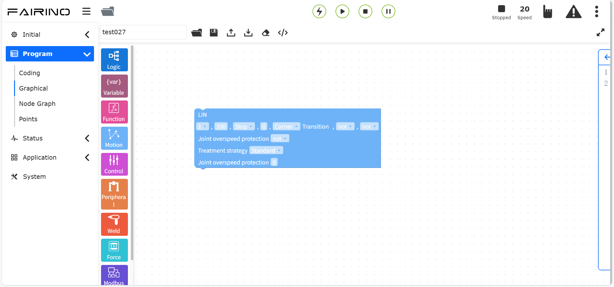

.. centered:: Wykres 10.5-2 Blok kodu instrukcji linii prostej

Instrukcja linii prostej (z regulowaną prędkością kątową punktu przejściowego)
~~~~~~~~~~~~~~~~~~~~~~~~~~~~~~~~~~~~~~~~~~~~~~~~~~~~~~~~~~~~~~~~~~~~~~~~~~~~~~~
Przeciągnij blok kodu „Instrukcja linii prostej (z regulowaną prędkością kątową punktu przejściowego)” do obszaru roboczego interfejsu edycji graficznej.

Funkcja tej instrukcji jest podobna do instrukcji „Punkt-punkt”, ale zawiera regulowaną prędkość kątową punktu przejściowego.

Węzeł instrukcji „Linia prosta (z regulowaną prędkością kątową punktu przejściowego)”, parametry:

- Maksymalna prędkość kątowa: 0~300

.. image:: graphical/028.png
   :width: 6in
   :align: center

.. centered:: Wykres 10.5-3 Blok kodu instrukcji linii prostej (z regulowaną prędkością kątową punktu przejściowego)

Instrukcja linii prostej (seamPos)
~~~~~~~~~~~~~~~~~~~~~~~~~~~~~~~~~~
Przeciągnij blok kodu „Instrukcja linii prostej (seamPos)” do obszaru roboczego interfejsu edycji graficznej.

Ta instrukcja jest używana w scenariuszach spawania z czujnikiem laserowym.

Węzeł instrukcji „Linia prosta (seamPos)”, parametry:

- Nazwa punktu: Punkt nauczania.

- Prędkość调试 (%): 0 ~ 100

- Zatrzymaj: false/true. Gdy wybrano true, parametr wartości płynnego przejścia nie jest aktywny.

- Płynne przejście (mm): Promień wygładzenia przejścia 0 ~ 1000

- Wybór danych bufora spoiny: Wykonaj dane planowania / Wykonaj dane rejestracji

- Typ materiału: Blacha falista / Blacha trapezowa / Blacha ogrodzeniowa / Beczka / Stal pancerna falista

- Czy przesunięcie: Nie / przesunięcie względem podstawy / przesunięcie względem narzędzia / przesunięcie względem surowych danych lasera. Gdy wybrano Nie, parametry dx~drz nie są aktywne.

- dx~drz: Wartości przesunięcia.

.. image:: graphical/029.png
   :width: 6in
   :align: center

.. centered:: Wykres 10.5-4 Blok kodu instrukcji linii prostej (seamPos)

Instrukcja łuku
~~~~~~~~~~~~~~~
Przeciągnij blok kodu „Instrukcja łuku” do obszaru roboczego interfejsu edycji graficznej.

Ruch łukowy obejmuje dwa punkty: pierwszy punkt to pośredni punkt przejściowy łuku, drugi to punkt końcowy. Dla punktu przejściowego i punktu końcowego można ustawić, czy mają być przesunięte. Można wybrać przesunięcie względem podstawowego układu współrzędnych lub względem układu współrzędnych narzędzia, ustawiając wartości przesunięcia x, y, z, rx, ry, rz. Dla punktu końcowego można ustawić promień wygładzenia przejścia, aby uzyskać efekt ciągłości ruchu.

Węzeł instrukcji „Łuk”, parametry:

- Pośredni punkt łuku: Punkt nauczania.

- Czy przesunięcie: Nie / przesunięcie względem podstawy / przesunięcie względem narzędzia. Gdy wybrano Nie, parametry dx~drz nie są aktywne.

- dx~drz: Wartości przesunięcia.

- Punkt końcowy łuku: Punkt nauczania.

- Czy przesunięcie: Nie / przesunięcie względem podstawy / przesunięcie względem narzędzia. Gdy wybrano Nie, parametry dx~drz nie są aktywne.

- dx~drz: Wartości przesunięcia.

- Prędkość调试 (%): 0 ~ 100

- Zatrzymaj: false/true. Gdy wybrano true, parametr wartości płynnego przejścia nie jest aktywny.

- Płynne przejście (mm): Promień wygładzenia przejścia 0 ~ 1000

.. image:: graphical/030.png
   :width: 6in
   :align: center

.. centered:: Wykres 10.5-5 Blok kodu instrukcji łuku

Instrukcja pełnego okręgu
~~~~~~~~~~~~~~~~~~~~~~~~~
Przeciągnij blok kodu „Instrukcja pełnego okręgu” do obszaru roboczego interfejsu edycji graficznej.

Kliknij węzeł instrukcji „Pełny okrąg”, aby przejść do interfejsu edycji grafu węzłów.

Ruch pełnego okręgu obejmuje dwa punkty: pierwszy punkt to pośredni punkt 1 pełnego okręgu, drugi punkt to pośredni punkt 2 pełnego okręgu. Dla punktu pośredniego 2 można ustawić, czy ma być przesunięty. To przesunięcie obowiązuje jednocześnie dla punktu pośredniego 1 i punktu pośredniego 2.

Węzeł instrukcji „Pełny okrąg”, parametry:

- Pośredni punkt 1 pełnego okręgu: Punkt nauczania.

- Pośredni punkt 2 pełnego okręgu: Punkt nauczania.

- Prędkość调试 (%): 0 ~ 100

- Czy przesunięcie: Nie / przesunięcie względem podstawy / przesunięcie względem narzędzia. Gdy wybrano Nie, parametry dx~drz nie są aktywne.

- dx~drz: Wartości przesunięcia.

.. image:: graphical/031.png
   :width: 6in
   :align: center

.. centered:: Wykres 10.5-6 Blok kodu instrukcji pełnego okręgu

Instrukcja spirali
~~~~~~~~~~~~~~~~~~
Przeciągnij blok kodu „Instrukcja spirali” do obszaru roboczego interfejsu edycji graficznej.

Ruch spiralny obejmuje trzy punkty, które tworzą okrąg. Na stronie trzeciego punktu znajdują się parametry: liczba zwojów spirali, kąt korekty orientacji, przyrost promienia i przyrost kierunku osi obrotu. Liczba zwojów spirali to liczba zwojów ruchu spirali. Kąt korekty orientacji koryguje orientację na końcu spirali względem orientacji pierwszego punktu spirali. Przyrost promienia to przyrost promienia każdego zwoju. Przyrost kierunku osi obrotu to przyrost w kierunku osi spirali. Ustaw „Czy przesunięcie”, a to przesunięcie obowiązuje dla całej trajektorii spirali.

Węzeł instrukcji „Spirala”, parametry:

- Pośredni punkt 1 spirali: Punkt nauczania.

- Pośredni punkt 2 spirali: Punkt nauczania.

- Pośredni punkt 3 spirali: Punkt nauczania.

- Prędkość调试 (%): 0 ~ 100

- Czy przesunięcie: Nie / przesunięcie względem podstawy / przesunięcie względem narzędzia. Gdy wybrano Nie, parametry dx~drz nie są aktywne.

- dx~drz: Wartości przesunięcia.

- Liczba zwojów spirali: 0 ~ 100

- Korekta kąta orientacji rx (°): -1000 ~ 1000

- Korekta kąta orientacji ry (°): -1000 ~ 1000

- Korekta kąta orientacji rz (°): -1000 ~ 1000

- Przyrost promienia (mm): -100 ~ 100

- Przyrost kierunku osi obrotu (mm): -100 ~ 100

.. image:: graphical/032.png
   :width: 6in
   :align: center

.. centered:: Wykres 10.5-7 Blok kodu instrukcji spirali

Nowa instrukcja spirali
~~~~~~~~~~~~~~~~~~~~~~~
Przeciągnij blok kodu „Nowa instrukcja spirali” do obszaru roboczego interfejsu edycji graficznej.

Kliknij węzeł instrukcji „Nowa spirala”, aby przejść do interfejsu edycji grafu węzłów.

Nowy ruch spiralny to zoptymalizowana wersja ruchu spiralnego. Ta instrukcja wymaga tylko jednego punktu i konfiguracji parametrów, aby zrealizować ruch spiralny. Robot używa bieżącej pozycji jako punktu początkowego. Użytkownik ustawia prędkość调试, czy przesunięcie, liczbę zwojów spirali, kąt nachylenia spirali, promień początkowy, przyrost promienia, przyrost kierunku osi obrotu i kierunek obrotu. Liczba zwojów spirali to liczba zwojów ruchu spirali. Kąt nachylenia spirali to kąt między osią Z narzędzia a kierunkiem poziomym. Kąt korekty orientacji koryguje orientację na końcu spirali względem orientacji pierwszego punktu spirali. Promień początkowy to promień pierwszego zwoju. Przyrost promienia to przyrost promienia każdego zwoju. Przyrost kierunku osi obrotu to przyrost w kierunku osi spirali. Kierunek obrotu to zgodnie z ruchem wskazówek zegara lub przeciwnie do ruchu wskazówek zegara.

Węzeł instrukcji „Nowa spirala”, parametry:

- Punkt początkowy spirali: Punkt nauczania.

- Prędkość调试 (%): 0 ~ 100

- Czy przesunięcie: Nie / przesunięcie względem podstawy / przesunięcie względem narzędzia. Gdy wybrano Nie, parametry dx~drz nie są aktywne.

- dx~drz: Wartości przesunięcia.

- Liczba zwojów spirali: 0 ~ 100

- Kąt nachylenia spirali (°): -100 ~ 100

- Promień początkowy: 0 ~ 100

- Przyrost promienia (mm): -100 ~ 100

- Przyrost kierunku osi obrotu (mm): -100 ~ 100

- Kierunek obrotu: Zgodnie z ruchem wskazówek zegara / Przeciwnie do ruchu wskazówek zegara

.. image:: graphical/033.png
   :width: 6in
   :align: center

.. centered:: Wykres 10.5-8 Blok kodu nowej instrukcji spirali

Instrukcja spirali poziomej
~~~~~~~~~~~~~~~~~~~~~~~~~~~
Przeciągnij blok kodu „Instrukcja spirali poziomej” do obszaru roboczego interfejsu edycji graficznej.

Instrukcja „H-Spiral” to ruch spiralny w przestrzeni poziomej. Instrukcja ta jest umieszczana po instrukcji ruchu pojedynczego odcinka (linii prostej).

Węzeł instrukcji „Spirala pozioma”, parametry:

- Promień spirali: 0~100 mm

- Prędkość kątowa spirali: 0~2 obr/s

- Kierunek obrotu: Spirala zgodnie / przeciwnie do ruchu wskazówek zegara

- Kąt nachylenia spirali: 0~40°

.. image:: graphical/034.png
   :width: 6in
   :align: center

.. centered:: Wykres 10.5-9 Blok kodu instrukcji spirali poziomej

Instrukcja krzywej średniej
~~~~~~~~~~~~~~~~~~~~~~~~~~~
Przeciągnij blok kodu „Instrukcja krzywej średniej” do obszaru roboczego interfejsu edycji graficznej.

Instrukcja ta składa się z trzech części: początek grupy krzywej średniej, odcinek krzywej średniej i koniec grupy krzywej średniej. Początek grupy krzywej średniej jest znacznikiem początku ruchu krzywej średniej. Odcinek krzywej średniej obecnie w grafie węzłów zawiera tylko odcinek SPL. Koniec grupy krzywej średniej jest znacznikiem końca ruchu krzywej średniej.

Węzeł instrukcji „Krzywa średnia - SPTP”, parametry:

- Nazwa punktu: Punkt nauczania.

- Prędkość调试 (%): 0 ~ 100

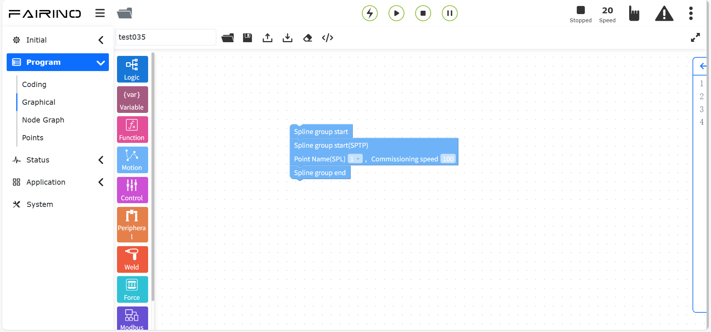

.. centered:: Wykres 10.5-10 Blok kodu instrukcji krzywej średniej

Nowa instrukcja krzywej średniej
~~~~~~~~~~~~~~~~~~~~~~~~~~~~~~~~
Przeciągnij blok kodu „Nowa instrukcja krzywej średniej” do obszaru roboczego interfejsu edycji graficznej.

Ta instrukcja jest zoptymalizowaną instrukcją algorytmu krzywej średniej, która w przyszłości zastąpi istniejącą instrukcję krzywej średniej. Instrukcja ta składa się z trzech części: początek trajektorii wielopunktowej, odcinek trajektorii wielopunktowej i koniec trajektorii wielopunktowej. Początek trajektorii wielopunktowej jest znacznikiem początku ruchu trajektorii wielopunktowej. Odcinek trajektorii wielopunktowej polega na ustawianiu poszczególnych punktów trajektorii. Kliknij ikonę, aby przejść do interfejsu dodawania punktów. Koniec trajektorii wielopunktowej jest znacznikiem końca ruchu trajektorii wielopunktowej. W tym miejscu można ustawić tryb sterowania i prędkość调试. Tryb sterowania dzieli się na podawanie punktów sterujących i podawanie punktów ścieżki.

Węzeł instrukcji „Nowa krzywa średnia”, parametry:

- Tryb sterowania: Punkt nauczania.

- Globalny średni czas połączenia: Liczba całkowita, większa niż 10, wartość domyślna to 2000 ms.

Węzeł instrukcji „Nowa krzywa średnia - SPL”, parametry:

- Nazwa punktu: Punkt nauczania.

- Prędkość调试 (%): 0 ~ 100

- Promień wygładzenia przejścia: 0 ~ 1000

- Czy ostatni punkt: Nie / Tak

.. image:: graphical/036.png
   :width: 6in
   :align: center

.. centered:: Wykres 10.5-11 Blok kodu nowej instrukcji krzywej średniej

Instrukcja oscylacji
~~~~~~~~~~~~~~~~~~~~
Przeciągnij blok kodu „Instrukcja oscylacji” do obszaru roboczego interfejsu edycji graficznej.

Węzeł instrukcji „Oscylacja”, parametry:

- Numer: 0~7

.. image:: graphical/037.png
   :width: 6in
   :align: center

.. centered:: Wykres 10.5-12 Blok kodu instrukcji oscylacji

Instrukcja przesunięcia punktu
~~~~~~~~~~~~~~~~~~~~~~~~~~~~~~
Przeciągnij blok kodu „Instrukcja przesunięcia punktu” do obszaru roboczego interfejsu edycji graficznej.

Ta instrukcja jest instrukcją przesunięcia globalnego. Po wprowadzeniu poszczególnych wartości przesunięcia, instrukcje ruchu będą przesunięte względem podstawy (lub współrzędnych przedmiotu).

Węzeł instrukcji „Przesunięcie punktu”, parametry:

- ∆x: Wartość przesunięcia, -300~300

- ∆y: Wartość przesunięcia, -300~300

- ∆z: Wartość przesunięcia, -300~300

- ∆rx: Wartość przesunięcia, -300~300

- ∆ry: Wartość przesunięcia, -300~300

- ∆rz: Wartość przesunięcia, -300~300

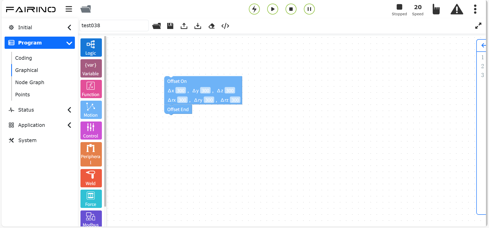

.. centered:: Wykres 10.5-13 Blok kodu instrukcji przesunięcia punktu

Instrukcja serwo
~~~~~~~~~~~~~~~~
Przeciągnij blok kodu „Instrukcja serwo” do obszaru roboczego interfejsu edycji graficznej.

Instrukcja sterowania serwo (ruch w przestrzeni kartezjańskiej). Instrukcja ta może sterować ruchem robota za pomocą sterowania bezwzględną pozycją i orientacją lub przesunięcia względem bieżącej pozycji i orientacji.

Węzeł instrukcji „Serwo”, parametry:

- Sposób ruchu: Pozycja bezwzględna / przesunięcie względem podstawy / przesunięcie względem narzędzia

- x: Wartość przesunięcia, -300~300

- y: Wartość przesunięcia, -300~300

- z: Wartość przesunięcia, -300~300

- rx: Wartość przesunięcia, -300~300

- ry: Wartość przesunięcia, -300~300

- rz: Wartość przesunięcia, -300~300

- Współczynnik proporcjonalności x: 0~1

- Współczynnik proporcjonalności y: 0~1

- Współczynnik proporcjonalności z: 0~1

- Współczynnik proporcjonalności rx: 0~1

- Współczynnik proporcjonalności ry: 0~1

- Współczynnik proporcjonalności rz: 0~1

- Przyspieszenie (%): 0~100

- Prędkość (%): 0~100

- Cykl instrukcji (s): 0,001~0,016

- Czas filtrowania (s): 0~1

- Wzmocnienie proporcjonalne: 0~100

.. image:: graphical/039.png
   :width: 6in
   :align: center

.. centered:: Wykres 10.5-14 Blok kodu instrukcji serwo

Instrukcja trajektorii
~~~~~~~~~~~~~~~~~~~~~~
Przeciągnij blok kodu „Instrukcja trajektorii” do obszaru roboczego interfejsu edycji graficznej.

W tej instrukcji użytkownik musi najpierw mieć zarejestrowaną trajektorię.

Węzeł instrukcji „Trajektoria”, parametry:

- Wybierz plik trajektorii: Zarejestrowana trajektoria.

- Prędkość调试 (%): 0 ~ 100, wartość domyślna to 25.

.. image:: graphical/040.png
   :width: 6in
   :align: center

.. centered:: Wykres 10.5-15 Blok kodu instrukcji trajektorii

Instrukcja trajektorii J
~~~~~~~~~~~~~~~~~~~~~~~~
Przeciągnij blok kodu „Instrukcja trajektorii J” do obszaru roboczego interfejsu edycji graficznej.

W tej instrukcji użytkownik musi najpierw mieć zarejestrowaną trajektorię. Plik trajektorii można wcześniej zaimportować w interfejsie programu nauczania. Instrukcje trajektorii i trajektorii J są przeznaczone do ogólnego interfejsu, w którym kamera bezpośrednio podaje trajektorię. Gdy istnieje plik dyskretnych punktów trajektorii w ustalonym formacie, można go zaimportować do systemu, aby robot poruszał się zgodnie z trajektorią z zaimportowanego pliku.

Węzeł instrukcji „Trajektoria J”, parametry:

- Wybierz plik trajektorii: Zarejestrowana trajektoria.

- Prędkość调试 (%): 0 ~ 100, wartość domyślna to 25.

- Tryb trajektorii: Punkt ścieżki / Punkt sterujący

.. image:: graphical/041.png
   :width: 6in
   :align: center

.. centered:: Wykres 10.5-16 Blok kodu instrukcji trajektorii J

Instrukcja odtwarzania trajektorii
~~~~~~~~~~~~~~~~~~~~~~~~~~~~~~~~~~
Przeciągnij blok kodu „Instrukcja odtwarzania trajektorii” do obszaru roboczego interfejsu edycji graficznej.

W tej instrukcji użytkownik musi najpierw mieć zarejestrowaną trajektorię.

Podczas programowania należy najpierw użyć instrukcji punkt-punkt, aby dotrzeć do odpowiedniego punktu początkowego trajektorii, a następnie w instrukcji odtwarzania trajektorii wybrać trajektorię, wybrać wygładzoną trajektorię i ustawić prędkość调试. Instrukcja ładowania trajektorii służy głównie do wcześniejszego odczytania pliku trajektorii i wyodrębnienia go jako instrukcji trajektorii, co lepiej sprawdza się w scenariuszach śledzenia taśmociągu.

Węzeł instrukcji „Odtwarzanie trajektorii”, parametry:

- Nazwa trajektorii: Zarejestrowana trajektoria.

- Wygładzona trajektoria: Nie / Tak

- Prędkość调试 (%): 0 ~ 100, wartość domyślna to 25.

.. image:: graphical/042.png
   :width: 6in
   :align: center

.. centered:: Wykres 10.5-17 Blok kodu instrukcji odtwarzania trajektorii

Instrukcja DMP
~~~~~~~~~~~~~~
Przeciągnij blok kodu „Instrukcja DMP” do obszaru roboczego interfejsu edycji graficznej.

DMP to metoda uczenia się przez imitację trajektorii, która wymaga wcześniejszego zaplanowania trajektorii odniesienia. W interfejsie edycji poleceń wybierz punkt nauczania jako nowy punkt początkowy. Po kliknięciu „Dodaj”, „Zastosuj” instrukcja może zostać zapisana. Konkretna ścieżka DMP to nowa trajektoria naśladująca trajektorię odniesienia, zaczynająca się od nowego punktu początkowego.

Węzeł instrukcji „DMP”, parametry:

- Nazwa punktu: Punkt nauczania.

- Prędkość调试 (%): 0 ~ 100, wartość domyślna to 100.

.. image:: graphical/043.png
   :width: 6in
   :align: center

.. centered:: Wykres 10.5-18 Blok kodu instrukcji DMP

Instrukcja konwersji narzędzia
~~~~~~~~~~~~~~~~~~~~~~~~~~~~~~
Przeciągnij blok kodu „Instrukcja konwersji narzędzia” do obszaru roboczego interfejsu edycji graficznej.

Wybierz układ współrzędnych narzędzia, który ma zostać automatycznie przekonwertowany. Po kliknięciu „Dodaj”, „Zastosuj” instrukcja może zostać zapisana, a punkty w układzie współrzędnych narzędzia są automatycznie konwertowane.

Węzeł instrukcji „Konwersja narzędzia”, parametry:

- Układ współrzędnych narzędzia: Lista układów współrzędnych narzędzia.

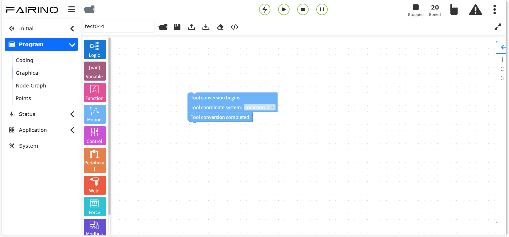

.. centered:: Wykres 10.5-19 Blok kodu instrukcji konwersji narzędzia

Instrukcja konwersji przedmiotu
~~~~~~~~~~~~~~~~~~~~~~~~~~~~~~~
Przeciągnij blok kodu „Instrukcja konwersji przedmiotu” do obszaru roboczego interfejsu edycji graficznej.

Wybierz układ współrzędnych przedmiotu, który ma zostać automatycznie przekonwertowany. Po kliknięciu „Dodaj”, „Zastosuj” instrukcja może zostać zapisana, a punkty w układzie współrzędnych przedmiotu są automatycznie konwertowane.

Węzeł instrukcji „Konwersja przedmiotu”, parametry:

- Układ współrzędnych przedmiotu: Lista układów współrzędnych przedmiotu.

.. image:: graphical/045.png
   :width: 6in
   :align: center

.. centered:: Wykres 10.5-20 Blok kodu instrukcji konwersji przedmiotu

Polecenia programowania graficznego dotyczące sterowania
--------------------------------------------------------
Polecenia programowania graficznego dotyczące sterowania obejmują polecenia sterowania, takie jak Wait, IO itp.

.. image:: graphical/007.png
   :width: 6in
   :align: center

.. centered:: Wykres 10.6 Polecenia programowania graficznego dotyczące sterowania

Instrukcja oczekiwania
~~~~~~~~~~~~~~~~~~~~~~
Przeciągnij blok kodu „Instrukcja oczekiwania” do obszaru roboczego interfejsu edycji graficznej.

Ta instrukcja jest instrukcją opóźnienia i dzieli się na cztery części: „WaitMs”, „WaitDI”, „WaitMultiDI” i „WaitAI”.

1. Węzeł instrukcji „Oczekiwanie”, parametry:

- Czas oczekiwania (ms): Opóźnienie w milisekundach, wprowadź liczbę milisekund oczekiwania.

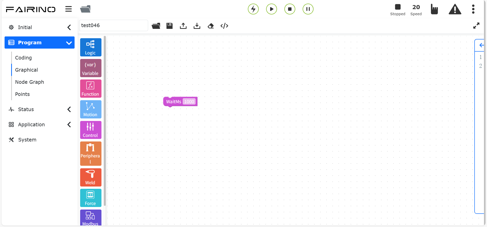

.. centered:: Wykres 10.6-1 Blok kodu instrukcji oczekiwania

2. Węzeł instrukcji „Oczekiwanie na DI”, parametry:

- Numer portu DI: Ctrl-DI0 ~ Ctrl-CI7 (WaitDI, [0~15]), End-DI0 ~ End-DI1 (WaitToolDI, [0~1])

- Stan: false/true

- Maksymalny czas (ms): 0 ~ 10000

- Obsługa przekroczenia limitu czasu oczekiwania: Zatrzymaj z błędem / Kontynuuj wykonanie / Oczekuj w nieskończoność

.. image:: graphical/047.png
   :width: 6in
   :align: center

.. centered:: Wykres 10.6-2 Blok kodu instrukcji oczekiwania na DI

3. Węzeł instrukcji „Oczekiwanie na wiele DI”, parametry:

- Warunek: I / LUB

- Wybór warunku: Numery portów, dla których stan bitów jest włączony, oddzielone przecinkami, np. DI0, DI1

- Porty odpowiadające wartościom prawdziwym: Numery portów dla wartości prawdziwych, oddzielone przecinkami, np. DI0, DI1

- Maksymalny czas (ms): 0 ~ 10000, maksymalny czas oczekiwania

- Obsługa przekroczenia limitu czasu oczekiwania: Zatrzymaj z błędem / Kontynuuj wykonanie / Oczekuj w nieskończoność

.. image:: graphical/048.png
   :width: 6in
   :align: center

.. centered:: Wykres 10.6-3 Blok kodu instrukcji oczekiwania na wiele DI

4. Węzeł instrukcji „Oczekiwanie na AI”, parametry:

- Warunek: I / LUB

- Numer portu AI: Ctrl-AI0 ~ Ctrl-AI1 (WaitAI, [0~1]), End-AI0 (WaitToolAI, [0])

- Warunek: Większy niż / Mniejszy niż

- Wartość (%): 1 ~ 100

- Maksymalny czas (ms): 0 ~ 10000

- Obsługa przekroczenia limitu czasu oczekiwania: Zatrzymaj z błędem / Kontynuuj wykonanie / Oczekuj w nieskończoność. Gdy obsługa przekroczenia limitu czasu oczekiwania jest ustawiona na oczekiwanie w nieskończoność, maksymalny czas domyślnie wynosi 0.

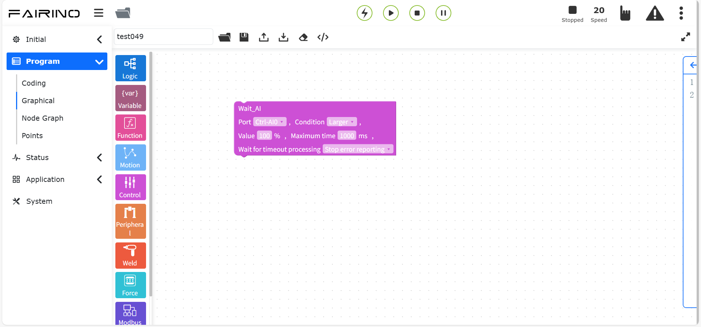

.. centered:: Wykres 10.6-4 Blok kodu instrukcji oczekiwania na AI

Instrukcja przełączania trybu
~~~~~~~~~~~~~~~~~~~~~~~~~~~~~
Przeciągnij blok kodu „Instrukcja przełączania trybu” do obszaru roboczego interfejsu edycji graficznej.

Ta instrukcja może przełączyć robota w tryb ręczny. Zwykle dodaje się ją na końcu programu, aby po zakończeniu programu robot automatycznie przełączył się w tryb ręczny, umożliwiając przeciąganie robota.

Węzeł instrukcji „Przełączanie trybu”, parametry:

- Przełączanie trybu: Tryb ręczny

.. image:: graphical/050.png
   :width: 6in
   :align: center

.. centered:: Wykres 10.6-5 Blok kodu instrukcji przełączania trybu

Instrukcja wstrzymania
~~~~~~~~~~~~~~~~~~~~~~
Przeciągnij blok kodu „Instrukcja wstrzymania” do obszaru roboczego interfejsu edycji graficznej.

Ta instrukcja jest instrukcją wstrzymania. Po wstawieniu tej instrukcji do programu, gdy program osiągnie ten punkt, robot przejdzie w stan wstrzymania. Aby kontynuować, kliknij przycisk „Wstrzymaj/Wznów” w obszarze sterowania.

Węzeł instrukcji „Wstrzymanie”, parametry:

- Typ wstrzymania: Brak funkcji, Cylinder nie osiągnął pozycji itp.

.. image:: graphical/051.png
   :width: 6in
   :align: center

.. centered:: Wykres 10.6-6 Blok kodu instrukcji wstrzymania

Instrukcje układów współrzędnych
~~~~~~~~~~~~~~~~~~~~~~~~~~~~~~~~
Przeciągnij bloki kodu „Ustaw układ współrzędnych narzędzia” / „Ustaw układ współrzędnych przedmiotu” do obszaru roboczego interfejsu edycji graficznej.

1. Węzeł instrukcji „Ustaw układ współrzędnych narzędzia”, parametry:

- Nazwa układu współrzędnych narzędzia: toolcoord1 ~ toolcoord19 (SetToolList, [0~19]), etoolcoord0 ~ etoolcoord14 (SetExToolList, [0~14])

.. image:: graphical/052.png
   :width: 6in
   :align: center

.. centered:: Wykres 10.6-7 Blok kodu instrukcji ustawiania układu współrzędnych narzędzia

2. Węzeł instrukcji „Ustaw układ współrzędnych przedmiotu”, parametry:

- Nazwa układu współrzędnych przedmiotu: wobjcoord1 ~ wobjcoord14

.. image:: graphical/053.png
   :width: 6in
   :align: center

.. centered:: Wykres 10.6-8 Blok kodu instrukcji ustawiania układu współrzędnych przedmiotu

Instrukcje analogowych wejść/wyjść
~~~~~~~~~~~~~~~~~~~~~~~~~~~~~~~~~~
Przeciągnij bloki kodu „Ustaw AO” / „Pobierz AI” do obszaru roboczego interfejsu edycji graficznej.

W instrukcji tej znajdują się dwie części funkcji: ustawianie wyjścia analogowego (SetAO/SPLCSetAO) i pobieranie wejścia analogowego (GetAI/SPLCGetAI).

1. Węzeł instrukcji „Ustaw AO”, parametry:

- Port: Ctrl-AO0 ~ Ctrl-AO1 (blokujące: SetAO, nieblokujące: SPLCSetAO, [0~1]), End-AO0 (blokujące: SetToolAO, nieblokujące: SPLCSetToolAO, [0])

- Wartość (%): 0 ~ 100

- Czy blokujące: Blokujące / Nieblokujące

- Czy stosować wątek: Nie / Tak

.. image:: graphical/054.png
   :width: 6in
   :align: center

.. centered:: Wykres 10.6-9 Blok kodu instrukcji ustawiania AO

2. Węzeł instrukcji „Pobierz AI”, parametry:

- Port: Ctrl-AI0 ~ Ctrl-DI1 (blokujące: GetAI, nieblokujące: SPLCGetAI, [0~1]), End-AI0 (blokujące: GetToolAI, nieblokujące: SPLCGetToolAI, [0])

- Warunek: Większy niż / Mniejszy niż

- Wartość (%): 0 ~ 100

- Maksymalny czas (ms): 0 ~ 10000

- Czy blokujące: Blokujące / Nieblokujące

- Czy stosować wątek: Nie / Tak

.. image:: graphical/055.png
   :width: 6in
   :align: center

.. centered:: Wykres 10.6-10 Blok kodu instrukcji pobierania AI

Instrukcje cyfrowych wejść/wyjść
~~~~~~~~~~~~~~~~~~~~~~~~~~~~~~~~
Przeciągnij bloki kodu „Ustaw DO” / „Pobierz DI” do obszaru roboczego interfejsu edycji graficznej.

Instrukcja jest instrukcją Wejść/Wyjść i dzieli się na dwie części: ustawianie wyjścia (SetDO/SPLCSetDO) i pobieranie wejścia (GetDI/SPLCGetDI).

1. Węzeł instrukcji „Ustaw DO”, parametry:

- Port: Ctrl-DO0 ~ Ctrl-CO7 (blokujące: SetDO, nieblokujące: SPLCSetDO, [0~15]), End-DO0 ~ End-DO1 (blokujące: SetToolDO, nieblokujące: SPLCSetToolDO, [0~1])

- Stan: false/true

- Czy blokujące: Blokujące / Nieblokujące

- Wygładzona trajektoria: Break / Serious

- Czy stosować wątek: Nie / Tak

.. image:: graphical/056.png
   :width: 6in
   :align: center

.. centered:: Wykres 10.6-11 Blok kodu instrukcji ustawiania DO

2. Węzeł instrukcji „Pobierz DI”, parametry:

- Port: Ctrl-DI0 ~ Ctrl-CI7 (blokujące: GetDI, nieblokujące: SPLCGetDI, [0~15]), End-DI0 ~ End-DI1 (blokujące: GetToolDI, nieblokujące: SPLCGetToolDI, [0~1])

- Czy blokujące: Blokujące / Nieblokujące

- Stan: false/true

- Maksymalny czas oczekiwania (ms): 0 ~ 10000

- Czy stosować wątek: Nie / Tak

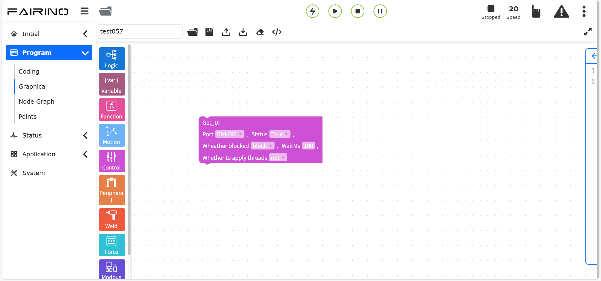

.. centered:: Wykres 10.6-12 Blok kodu instrukcji pobierania DI

Instrukcja ruchomego wyjścia DO
~~~~~~~~~~~~~~~~~~~~~~~~~~~~~~~
Przeciągnij blok kodu „Instrukcja ruchomego wyjścia DO” do obszaru roboczego interfejsu edycji graficznej.

Ta instrukcja umożliwia ciągłe wyjście sygnału DO podczas ruchu po linii prostej, w oparciu o ustawiony odstęp.

1. Węzeł instrukcji „Ciągłe wyjście ruchomego DO”, parametry:

- Port: Ctrl-DO0 ~ Ctrl-DO0 (MoveDOStart, [0~15]), End-DO1 (MoveDOStart, [0~1])

- Ustawiony odstęp (mm): 0 ~ 500

- Współczynnik wypełnienia impulsu wyjściowego (%): 0 ~ 99

2. Węzeł instrukcji „Pojedyncze wyjście ruchomego DO”, parametry:

- Port: Ctrl-DO0 ~ Ctrl-DO0 (MoveDOOnceStart, [0~15]), End-DO1 (MoveDOOnceStart, [0~1])

- Tryb wyjścia: Wyjście w odcinku jednostajnym / Dowolna konfiguracja

- Czas ustawienia (ms): 0 ~ 1000 (w trybie wyjścia w odcinku jednostajnym domyślnie -1)

- Czas resetowania (ms): 0 ~ 1000 (w trybie wyjścia w odcinku jednostajnym domyślnie -1)

.. image:: graphical/058.png
   :width: 6in
   :align: center

.. centered:: Wykres 10.6-13 Blok kodu instrukcji „Pojedyncze/ciągłe wyjście ruchomego DO”

Instrukcja ruchomego wyjścia AO
~~~~~~~~~~~~~~~~~~~~~~~~~~~~~~~
Przeciągnij blok kodu „Instrukcja ruchomego wyjścia AO” do obszaru roboczego interfejsu edycji graficznej.

Gdy ta instrukcja jest używana razem z instrukcjami ruchu, umożliwia proporcjonalne wyjście sygnału AO w czasie rzeczywistym podczas ruchu, w oparciu o prędkość TCP w czasie rzeczywistym.

Węzeł instrukcji „Ruchome wyjście AO”, parametry:

- Numer AO skrzynki sterowniczej: Ctrl-AO0 ~ Ctrl-AO1 (MoveAOStart, [0~1]), End-AO0 (MoveToolAOStart, 0)

- Maksymalna prędkość TCP: 0 ~ 100

- Procent AO przy maksymalnej prędkości TCP: 0 ~ 100

- Procent AO kompensacji martwego pola: 0 ~ 100

.. image:: graphical/059.png
   :width: 6in
   :align: center

.. centered:: Wykres 10.6-14 Blok kodu instrukcji „Ruchome wyjście AO”

Instrukcja poziomu kolizji
~~~~~~~~~~~~~~~~~~~~~~~~~~
Przeciągnij blok kodu „Instrukcja poziomu kolizji” do obszaru roboczego interfejsu edycji graficznej.

Ustawienie poziomu kolizji w tej instrukcji umożliwia regulację poziomu kolizji dla każdej osi w czasie rzeczywistym podczas działania programu, zapewniając bardziej elastyczne wdrażanie w różnych scenariuszach aplikacji.

Węzeł instrukcji „Poziom kolizji”, parametry:

- Poziom standardowy: Poziom standardowy / Niestandardowy procent

- joint1-joint6 (N): 0 ~ 100, próg kolizji, typ tablicowy.

.. image:: graphical/060.png
   :width: 6in
   :align: center

.. centered:: Wykres 10.6-15 Blok kodu instrukcji poziomu kolizji

Instrukcja przyspieszenia
~~~~~~~~~~~~~~~~~~~~~~~~~
Przeciągnij blok kodu „Instrukcja przyspieszenia” do obszaru roboczego interfejsu edycji graficznej.

Polecenie „Przyspieszenie” umożliwia niezależne ustawienie przyspieszenia robota. Regulując współczynnik skalowania przyspieszenia instrukcji ruchu, można zwiększyć lub zmniejszyć czas przyspieszania i zwalniania, co pozwala na regulację czasu cyklu ruchu robota.

Węzeł instrukcji „Przyspieszenie”, parametry:

- Procent przyspieszenia (%): 0 ~ 100

.. image:: graphical/061.png
   :width: 6in
   :align: center

.. centered:: Wykres 10.6-16 Blok kodu instrukcji przyspieszenia

Polecenia programowania graficznego dotyczące urządzeń peryferyjnych
--------------------------------------------------------------------
Polecenia programowania graficznego dotyczące urządzeń peryferyjnych obejmują polecenia dotyczące chwytaka, pistoletu natryskowego, osi rozszerzonej itp.

.. image:: graphical/008.png
   :width: 6in
   :align: center

.. centered:: Wykres 10.7 Polecenia programowania graficznego dotyczące urządzeń peryferyjnych

Instrukcje chwytaka
~~~~~~~~~~~~~~~~~~~
Przeciągnij bloki kodu „Ruch chwytaka”, „Aktywacja chwytaka” i „Reset chwytaka” do obszaru roboczego interfejsu edycji graficznej.

W instrukcji wyświetlane są numery chwytaków, które zostały skonfigurowane i aktywowane. Ustawienia otwierania/zamykania chwytaka, prędkości otwierania/zamykania i momentu otwierania/zamykania są podawane w procentach. Opcja funkcji blokującej: wybór blokowania oznacza, że ruch chwytaka musi czekać na wykonanie poprzedniej instrukcji ruchu; wybór nieblokowania oznacza, że ruch chwytaka odbywa się równolegle z poprzednią instrukcją ruchu.

1. Węzeł „Ruch chwytaka”, parametry:

- Numer chwytaka: Numer aktywowanego chwytaka.

- Pozycja chwytaka: 0~100

- Prędkość otwierania/zamykania: 0~100

- Moment otwierania/zamykania: 0~100

- Maksymalny czas (ms): 0~30000

- Czy blokujące: false/true

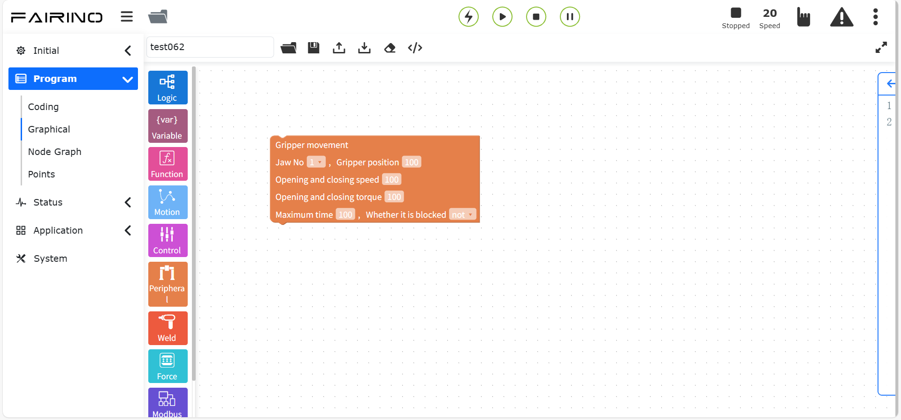

.. centered:: Wykres 10.7-1 Blok kodu instrukcji ruchu chwytaka

Instrukcja resetowania chwytaka wyświetla numery skonfigurowanych chwytaków. Można dodać instrukcję resetowania chwytaka do programu.

2. Węzeł „Reset chwytaka”, parametry:

- Numer chwytaka: Numer aktywowanego chwytaka.

.. image:: graphical/063.png
   :width: 6in
   :align: center

.. centered:: Wykres 10.7-2 Blok kodu instrukcji resetowania chwytaka

Instrukcja aktywacji chwytaka wyświetla numery skonfigurowanych chwytaków. Można dodać instrukcję aktywacji chwytaka do programu.

3. Węzeł „Aktywacja chwytaka”, parametry:

- Numer chwytaka: Numer aktywowanego chwytaka.

.. image:: graphical/064.png
   :width: 6in
   :align: center

.. centered:: Wykres 10.7-3 Blok kodu instrukcji aktywacji chwytaka

Instrukcje pistoletu natryskowego
~~~~~~~~~~~~~~~~~~~~~~~~~~~~~~~~~
Przeciągnij blok kodu „Instrukcja pistoletu natryskowego” do obszaru roboczego interfejsu edycji graficznej.

Ta instrukcja jest związana z natryskiwaniem. Steruje pistoletem natryskowym: „Rozpocznij natryskiwanie”, „Zatrzymaj natryskiwanie”, „Rozpocznij czyszczenie pistoletu” i „Zatrzymaj czyszczenie pistoletu”. Podczas edycji odpowiednich węzłów tego programu należy upewnić się, że urządzenie peryferyjne pistoletu natryskowego zostało skonfigurowane, w przeciwnym razie nie będzie można go zapisać. Szczegółowe informacje można znaleźć w rozdziale dotyczącym urządzeń peryferyjnych robota.

.. image:: graphical/065.png
   :width: 6in
   :align: center

.. centered:: Wykres 10.7-4 Blok kodu instrukcji rozpoczęcia natryskiwania

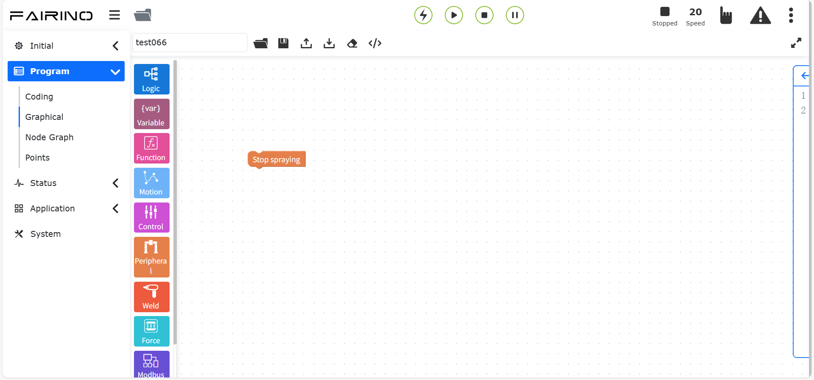

.. centered:: Wykres 10.7-5 Blok kodu instrukcji zatrzymania natryskiwania

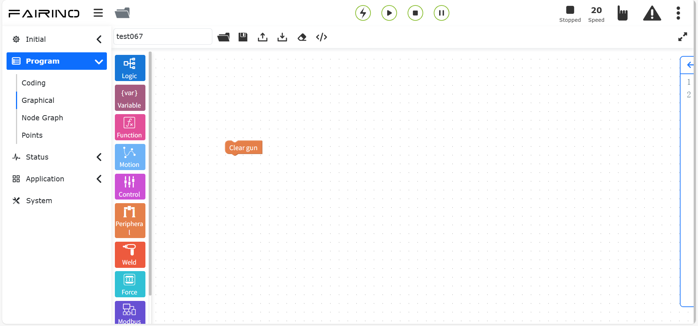

.. centered:: Wykres 10.7-6 Blok kodu instrukcji rozpoczęcia czyszczenia pistoletu

.. image:: graphical/068.png
   :width: 6in
   :align: center

.. centered:: Wykres 10.7-7 Blok kodu instrukcji zatrzymania czyszczenia pistoletu

Instrukcje osi rozszerzonej (kontroler + PLC)
~~~~~~~~~~~~~~~~~~~~~~~~~~~~~~~~~~~~~~~~~~~~~
Przeciągnij blok kodu „Instrukcja osi rozszerzonej” do obszaru roboczego interfejsu edycji graficznej.

Ta instrukcja jest przeznaczona do scenariuszy wykorzystania zewnętrznych osi. Używana w połączeniu z instrukcjami PTP, może rozłożyć ruch w kierunku X punktu w przestrzeni na ruch zewnętrznej osi. Wybierz numer zewnętrznej osi, wybierz synchroniczny sposób ruchu, a następnie wybierz punkt docelowy.

Obejmuje ładowanie/konfigurację komunikacji UDP, ruch asynchroniczny, synchroniczny ruch PTP/LIN, synchroniczny ruch ARC, instrukcję powrotu do zera i instrukcję załączania.

Węzeł instrukcji „Konfiguracja komunikacji UDP”, wprowadź adres IP, numer portu i okres komunikacji.

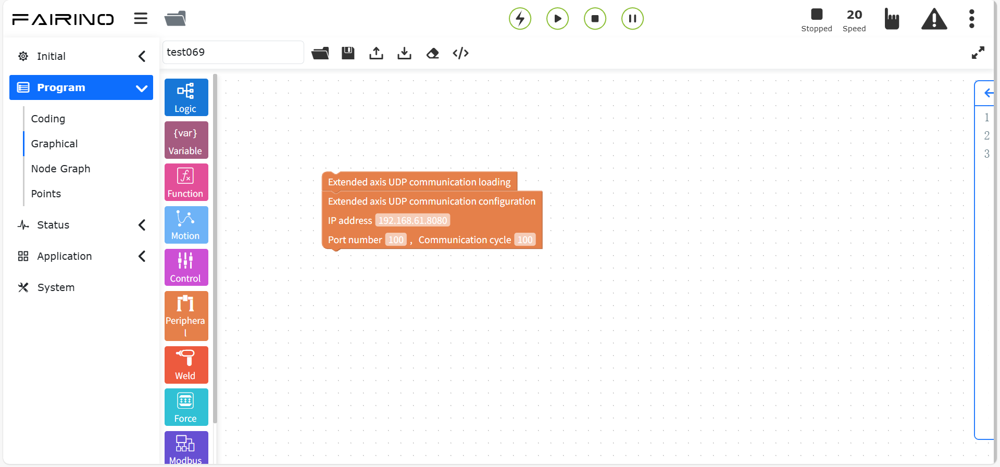

.. centered:: Wykres 10.7-8 Blok kodu instrukcji konfiguracji komunikacji UDP

Węzeł instrukcji „Ruch asynchroniczny”, parametry:

- Nazwa punktu: Punkt nauczania.

- Prędkość调试 (%): 0~100

.. image:: graphical/070.png
   :width: 6in
   :align: center

.. centered:: Wykres 10.7-9 Blok kodu instrukcji ruchu asynchronicznego

Węzeł instrukcji „Synchroniczny ruch PTP/LIN”, parametry:

- Wybór ruchu: PTP/LIN

- Nazwa punktu: Punkt nauczania.

- Prędkość调试 (%): 0~100

.. image:: graphical/071.png
   :width: 6in
   :align: center

.. centered:: Wykres 10.7-10 Blok kodu instrukcji „Synchronicznego ruchu PTP/LIN”

Węzeł instrukcji „Synchroniczny ruch ARC”, domyślny sposób ruchu to ARC, parametry:

- Nazwa punktu: Punkt nauczania.

- Prędkość调试 (%): 0~100

.. image:: graphical/072.png
   :width: 6in
   :align: center

.. centered:: Wykres 10.7-11 Blok kodu instrukcji „Synchronicznego ruchu ARC”

Węzeł instrukcji „Powrót do zera osi rozszerzonej”, parametry:

- Numer osi rozszerzonej: 1~4

- Sposób powrotu do zera: Powrót do zera z bieżącej pozycji / Powrót do zera z ogranicznikiem ujemnym / Powrót do zera z ogranicznikiem dodatnim

- Prędkość poszukiwania zera: 0~2000, wartość domyślna 5

- Prędkość pozycjonowania w zerze: 0~2000, wartość domyślna 1

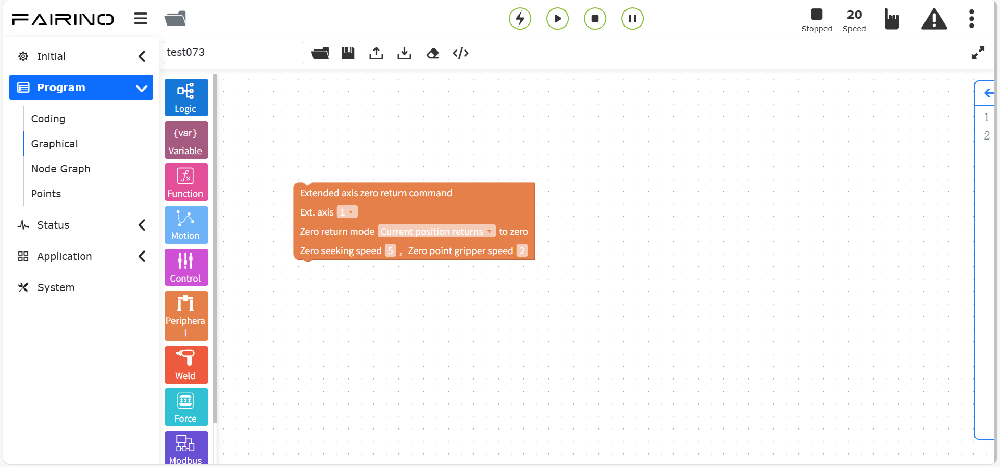

.. centered:: Wykres 10.7-12 Blok kodu instrukcji powrotu do zera osi rozszerzonej

Węzeł instrukcji „Załączenie osi rozszerzonej”, parametry:

- Numer osi rozszerzonej: 1~4

.. image:: graphical/074.png
   :width: 6in
   :align: center

.. centered:: Wykres 10.7-13 Blok kodu instrukcji załączenia osi rozszerzonej

Instrukcje osi rozszerzonej (kontroler + serwonapęd)
~~~~~~~~~~~~~~~~~~~~~~~~~~~~~~~~~~~~~~~~~~~~~~~~~~~~~
Przeciągnij blok kodu „Instrukcja osi rozszerzonej” do obszaru roboczego interfejsu edycji graficznej.

Ta instrukcja umożliwia konfigurację parametrów osi rozszerzonej. W zależności od wybranego trybu sterowania ustawiane są różne parametry. Dla prawidłowo skonfigurowanej osi rozszerzonej można ustawić jej punkt zerowy.

Obejmuje ID serwonapędu, tryb sterowania, załączanie serwa i powrót do zera serwa. Tryb sterowania dzieli się na tryb pozycyjny i tryb prędkości. Te dwa węzły muszą być używane razem z trybem sterowania, w przeciwnym razie dodanie ich osobno nie będzie skuteczne.

Węzeł instrukcji „ID serwonapędu”, parametry:

- ID serwonapędu: 1~15

.. image:: graphical/075.png
   :width: 6in
   :align: center

.. centered:: Wykres 10.7-14 Blok kodu instrukcji ID serwonapędu

Węzeł instrukcji „Tryb sterowania”, parametry:

- ID serwonapędu: 1~15

- Tryb sterowania: Tryb pozycyjny / Tryb prędkości

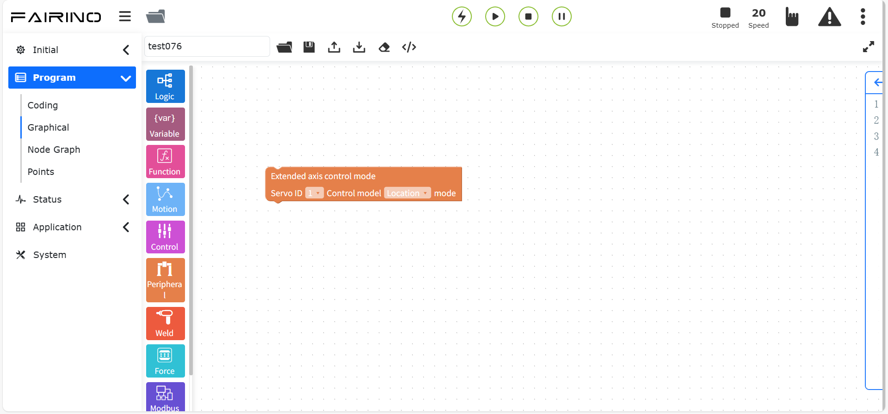

.. centered:: Wykres 10.7-15 Blok kodu instrukcji trybu sterowania

Węzeł instrukcji „Załączenie serwonapędu”, parametry:

- ID serwonapędu: 1~15

- Załączenie serwonapędu: Załącz serwonapęd / Odłącz serwonapęd

.. image:: graphical/077.png
   :width: 6in
   :align: center

.. centered:: Wykres 10.7-16 Blok kodu instrukcji załączenia serwonapędu

Węzeł instrukcji „Powrót do zera serwonapędu”, parametry:

- ID serwonapędu: 1~15

- Sposób powrotu do zera: Powrót do zera z bieżącej pozycji / Powrót do zera z ogranicznikiem ujemnym / Powrót do zera z ogranicznikiem dodatnim

- Prędkość poszukiwania zera: 0~2000, wartość domyślna 5

- Prędkość pozycjonowania w zerze: 0~2000, wartość domyślna 1

- Procent przyspieszenia: 1~100, wartość domyślna 100

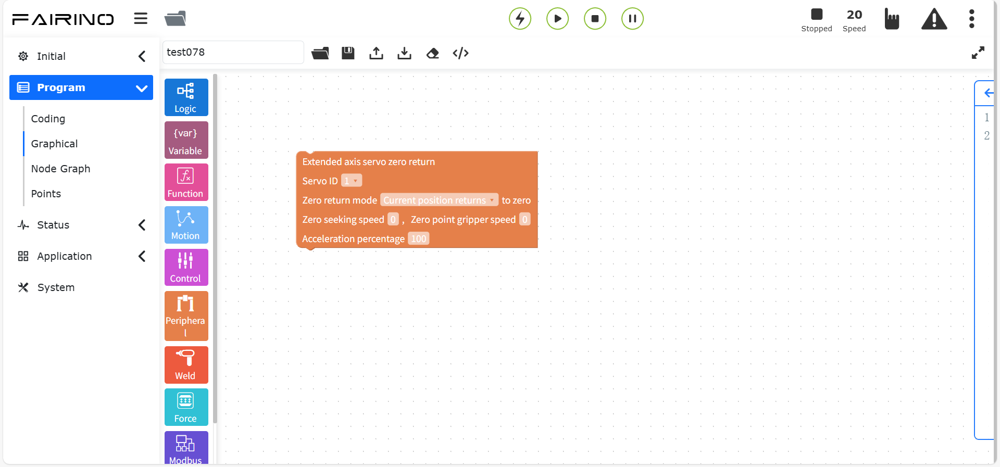

.. centered:: Wykres 10.7-17 Blok kodu instrukcji powrotu do zera serwonapędu

Węzeł instrukcji „Tryb pozycyjny”, parametry:

- ID serwonapędu: 1~15

- Pozycja docelowa: Bez ograniczeń

- Prędkość poszukiwania zera: Bez ograniczeń

- Procent przyspieszenia: 1~100, wartość domyślna 100

.. image:: graphical/079.png
   :width: 6in
   :align: center

.. centered:: Wykres 10.7-18 Blok kodu instrukcji trybu pozycyjnego

Węzeł instrukcji „Tryb prędkości”, parametry:

- ID serwonapędu: 1~15

- Prędkość docelowa: Bez ograniczeń

- Procent przyspieszenia: 1~100, wartość domyślna 100

.. image:: graphical/080.png
   :width: 6in
   :align: center

.. centered:: Wykres 10.7-19 Blok kodu instrukcji trybu prędkości

Instrukcje taśmociągu
~~~~~~~~~~~~~~~~~~~~~
Ta instrukcja zawiera cztery polecenia: wykrywanie I/O w czasie rzeczywistym, wykrywanie pozycji w czasie rzeczywistym, włączenie śledzenia i wyłączenie śledzenia. Szczegółowe informacje można znaleźć w rozdziale dotyczącym urządzeń peryferyjnych robota.

Węzeł instrukcji „Wykrywanie I/O w czasie rzeczywistym”, parametry:

- Maksymalny czas oczekiwania: 0~10000

.. image:: graphical/081.png
   :width: 6in
   :align: center

.. centered:: Wykres 10.7-20 Blok kodu instrukcji wykrywania I/O w czasie rzeczywistym

Węzeł instrukcji „Wykrywanie pozycji w czasie rzeczywistym”, parametry:

- Tryb pracy: Śledzenie chwytania / Śledzenie ruchu / Śledzenie TPD

.. image:: graphical/082.png
   :width: 6in
   :align: center

.. centered:: Wykres 10.7-21 Blok kodu instrukcji wykrywania pozycji w czasie rzeczywistym

Węzły instrukcji „Włączenie śledzenia”, „Wyłączenie śledzenia”, parametry:

- Tryb pracy: Śledzenie chwytania / Śledzenie ruchu / Śledzenie TPD

.. image:: graphical/083.png
   :width: 6in
   :align: center

.. centered:: Wykres 10.7-22 Blok kodu instrukcji włączenia/wyłączenia śledzenia

Instrukcje szlifowania
~~~~~~~~~~~~~~~~~~~~~~
Przeciągnij blok kodu „Instrukcja szlifowania” do obszaru roboczego interfejsu edycji graficznej.

Ta instrukcja jest używana w scenariuszach szlifowania. Przed użyciem należy najpierw wyładować sterownik, a następnie go załadować, a następnie ustawić załączenie urządzenia szlifującego.

Następnie ustaw prędkość obrotową urządzenia szlifującego, siłę kontaktu, odległość wysunięcia i tryb sterowania. Można również wyczyścić błędy urządzenia i wyzerować czujnik siły urządzenia.

.. image:: graphical/084.png
   :width: 6in
   :align: center

.. centered:: Wykres 10.7-23 Blok kodu instrukcji ładowania/rozładowywania sterownika komunikacji

Węzeł instrukcji „Załączenie urządzenia”, parametry:

- Załączenie urządzenia: Załącz / Odłącz

.. image:: graphical/085.png
   :width: 6in
   :align: center

.. centered:: Wykres 10.7-24 Blok kodu instrukcji załączenia urządzenia

.. image:: graphical/086.png
   :width: 6in
   :align: center

.. centered:: Wykres 10.7-25 Blok kodu instrukcji czyszczenia błędów urządzenia

.. image:: graphical/087.png
   :width: 6in
   :align: center

.. centered:: Wykres 10.7-26 Blok kodu instrukcji zerowania czujnika siły urządzenia

Węzeł instrukcji „Prędkość obrotowa”, parametry:

- Prędkość obrotowa: 0~5500

.. image:: graphical/088.png
   :width: 6in
   :align: center

.. centered:: Wykres 10.7-27 Blok kodu instrukcji prędkości obrotowej urządzenia

Węzeł instrukcji „Ustawiona siła”, parametry:

- Ustawiona siła: 0~200

.. image:: graphical/089.png
   :width: 6in
   :align: center

.. centered:: Wykres 10.7-28 Blok kodu instrukcji ustawionej siły

Węzeł instrukcji „Odległość wysunięcia”, parametry:

- Odległość wysunięcia: 0~12

.. image:: graphical/090.png
   :width: 6in
   :align: center

.. centered:: Wykres 10.7-29 Blok kodu instrukcji odległości wysunięcia

Węzeł instrukcji „Siła kontaktu szlifowania”, parametry:

- Siła kontaktu: 0~10000

.. image:: graphical/091.png
   :width: 6in
   :align: center

.. centered:: Wykres 10.7-30 Blok kodu instrukcji siły kontaktu szlifowania

Węzeł instrukcji „Czas przejścia ustawionej siły”, parametry:

- Czas przejścia ustawionej siły: 0~10000

.. image:: graphical/092.png
   :width: 6in
   :align: center

.. centered:: Wykres 10.7-31 Blok kodu instrukcji czasu przejścia ustawionej siły

Węzeł instrukcji „Masa przedmiotu”, parametry:

- Masa przedmiotu: 0~10000

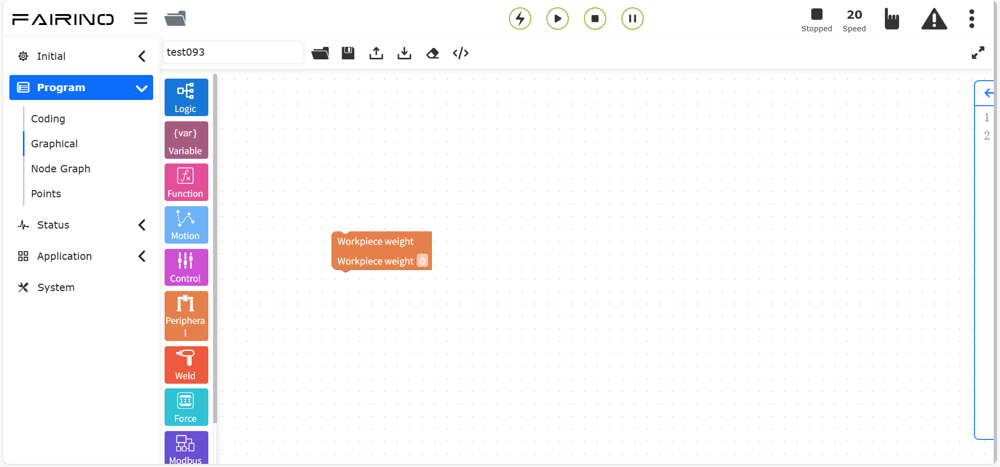

.. centered:: Wykres 10.7-32 Blok kodu instrukcji masy przedmiotu

Węzeł instrukcji „Tryb sterowania”, parametry:

- Tryb sterowania: Tryb powrotu do zera / Tryb pozycyjny / Tryb momentowy

.. image:: graphical/094.png
   :width: 6in
   :align: center

.. centered:: Wykres 10.7-33 Blok kodu instrukcji trybu sterowania

Polecenia programowania graficznego dotyczące spawania
------------------------------------------------------
Polecenia programowania graficznego dotyczące spawania obejmują polecenia spawania, takie jak pozycjonowanie, spawanie odcinkowe, spawanie, śledzenie laserowe itp.

.. image:: graphical/009.png
   :width: 6in
   :align: center

.. centered:: Wykres 10.8 Polecenia programowania graficznego dotyczące spawania

Instrukcja spawania odcinkowego
~~~~~~~~~~~~~~~~~~~~~~~~~~~~~~~
Przeciągnij blok kodu „Instrukcja spawania odcinkowego” do obszaru roboczego interfejsu edycji graficznej.

Ta instrukcja jest dedykowaną instrukcją spawania, przeznaczoną głównie do scenariuszy przerywanego spawania, w których jeden odcinek jest spawany, a kolejny nie. Między punktem początkowym a końcowym, używając tej instrukcji, wybierz tryb spawania odcinkowego, wybierz punkt początkowy i końcowy, ustaw prędkość调试, ustaw port DO zajarzenia łuku, długość wykonania, długość niewykonania, ustaw tryb funkcji zgodnie z rzeczywistym scenariuszem aplikacji, wybierz oscylację i zasadę zaokrąglania, aby zrealizować funkcję spawania odcinkowego. Szczegółowa obsługa znajduje się na stronie programowania nauczania w instrukcji spawania odcinkowego.

1. Węzeł instrukcji „Wygaśnięcie łuku / Zajarzenie łuku”, parametry:

- Typ I/O: I/O kontrolera / Rozszerzone I/O

- Numer procesu spawania: 0 ~ 7

- Maksymalny czas oczekiwania (ms): 0 ~ 10000

.. image:: graphical/095.png
   :width: 6in
   :align: center

.. centered:: Wykres 10.8-1 Blok kodu instrukcji „Wygaśnięcie łuku / Zajarzenie łuku”

2. Węzeł instrukcji „Spawanie odcinkowe”, parametry:

- Tryb spawania odcinkowego: Nie zmieniaj orientacji / Zmieniaj orientację

- Punkt początkowy: Punkt nauczania.

- Punkt końcowy: Punkt nauczania.

- Prędkość调试 (%): 0~100, wartość domyślna 100

- Długość wykonania: 0~1000

- Długość niewykonania: 0~1000

- Tryb funkcji: 0~100, wartość domyślna 100

- Wybór oscylacji: Odcinek wykonawczy bez oscylacji / Odcinek wykonawczy z oscylacją

- Zasada zaokrąglania: Bez zaokrąglania / Zaokrąglanie cykliczne / Zaokrąglanie pojedynczego odcinka

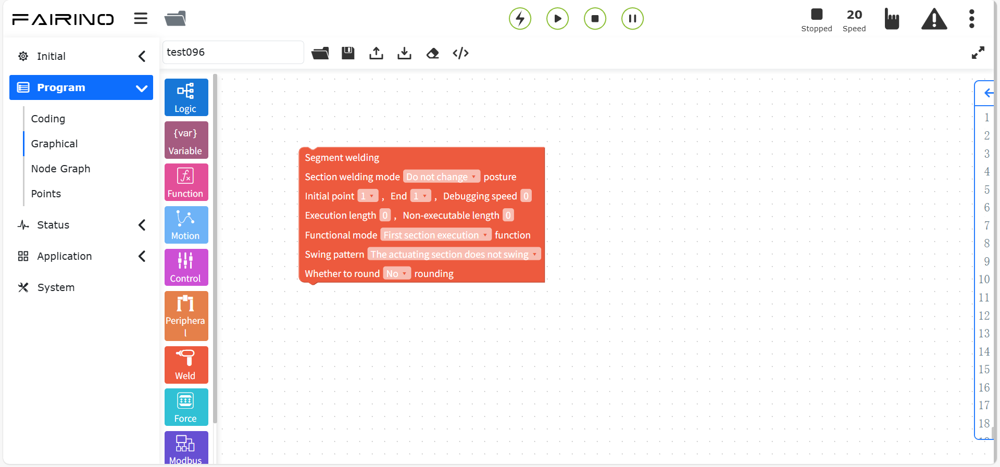

.. centered:: Wykres 10.8-2 Blok kodu instrukcji spawania odcinkowego

Instrukcje spawania
~~~~~~~~~~~~~~~~~~~
Przeciągnij blok kodu „Instrukcja spawania” do obszaru roboczego interfejsu edycji graficznej.

Ta instrukcja jest przeznaczona głównie do urządzeń peryferyjnych spawarki. Przed dodaniem tej instrukcji upewnij się, że konfiguracja spawarki w urządzeniach peryferyjnych użytkownika została zakończona. Szczegółowe informacje można znaleźć w rozdziale dotyczącym urządzeń peryferyjnych robota.

1. Węzeł instrukcji „Napięcie spawania”, parametry:

- Typ I/O: I/O kontrolera / Rozszerzone I/O

- Napięcie spawarki: Minimalna wartość 0

- AO sterowania prądem spawania: Ctrl-AO0/Ctrl-AO1

- Wybór wygładzenia: Break / Serious

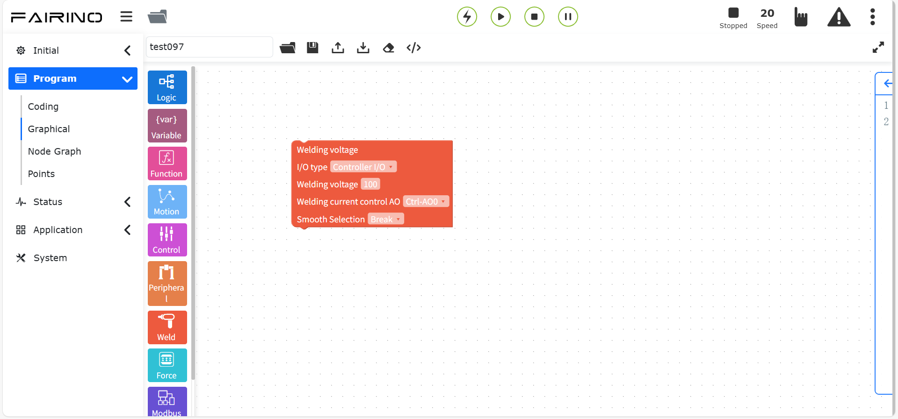

.. centered:: Wykres 10.8-3 Blok kodu instrukcji napięcia spawarki

2. Węzeł instrukcji „Prąd spawarki”, parametry:

- Typ I/O: I/O kontrolera / Rozszerzone I/O

- Prąd spawarki: Minimalna wartość 0

- AO sterowania prądem spawania: Ctrl-AO0/Ctrl-AO1

- Wybór wygładzenia: Break / Serious

.. image:: graphical/098.png
   :width: 6in
   :align: center

.. centered:: Wykres 10.8-4 Blok kodu instrukcji prądu spawarki

3. Węzeł instrukcji „Podawanie gazu / Zamknięcie gazu”, parametry:

- Typ I/O: I/O kontrolera / Rozszerzone I/O

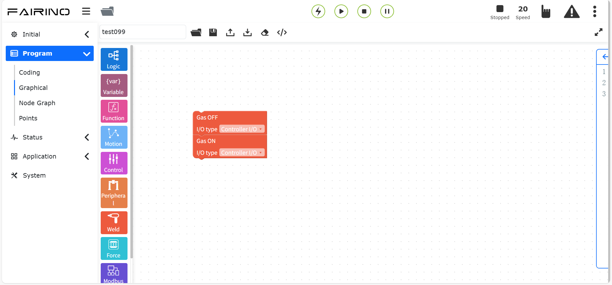

.. centered:: Wykres 10.8-5 Blok kodu instrukcji „Podawanie gazu / Zamknięcie gazu”

4. Węzeł instrukcji „Podawanie drutu do przodu / Zatrzymanie podawania drutu do przodu”, parametry:

- Typ I/O: I/O kontrolera / Rozszerzone I/O

.. image:: graphical/100.png
   :width: 6in
   :align: center

.. centered:: Wykres 10.8-6 Blok kodu instrukcji „Podawanie drutu do przodu / Zatrzymanie podawania drutu do przodu”

5. Węzeł instrukcji „Podawanie drutu do tyłu / Zatrzymanie podawania drutu do tyłu”, parametry:

- Typ I/O: I/O kontrolera / Rozszerzone I/O

.. image:: graphical/101.png
   :width: 6in
   :align: center

.. centered:: Wykres 10.8-7 Blok kodu instrukcji „Podawanie drutu do tyłu / Zatrzymanie podawania drutu do tyłu”

Instrukcje śledzenia laserowego
~~~~~~~~~~~~~~~~~~~~~~~~~~~~~~~
Przeciągnij blok kodu „Instrukcja śledzenia laserowego” do obszaru roboczego interfejsu edycji graficznej.

Ta instrukcja zawiera trzy części: polecenia laserowe, polecenia śledzenia i polecenia pozycjonowania. Przed dodaniem tej instrukcji upewnij się, że czujnik śledzenia laserowego w urządzeniach peryferyjnych użytkownika został pomyślnie skonfigurowany. Szczegółowe informacje można znaleźć w rozdziale dotyczącym urządzeń peryferyjnych robota.

1. Węzeł instrukcji „Włącz / Wyłącz czujnik”, parametry:

- Wybór typu spoiny: 0 ~ 49

.. image:: graphical/102.png
   :width: 6in
   :align: center

.. centered:: Wykres 10.8-8 Blok kodu instrukcji „Włącz / Wyłącz czujnik — Typ spoiny”

- Wybór numeru zadania: 0 ~ 255

.. image:: graphical/103.png
   :width: 6in
   :align: center

.. centered:: Wykres 10.8-9 Blok kodu instrukcji „Włącz / Wyłącz czujnik — Numer zadania”

- Rozwiązanie: 0 ~ 5

.. image:: graphical/104.png
   :width: 6in
   :align: center

.. centered:: Wykres 10.8-10 Blok kodu instrukcji „Włącz / Wyłącz czujnik — Rozwiązanie”

2. Węzeł instrukcji „Załaduj / Rozładuj czujnik”, parametry:

- Wybór funkcji: Ruiniu RRT-SV2-BP / Chuangxiang CXZK-RBTA4L

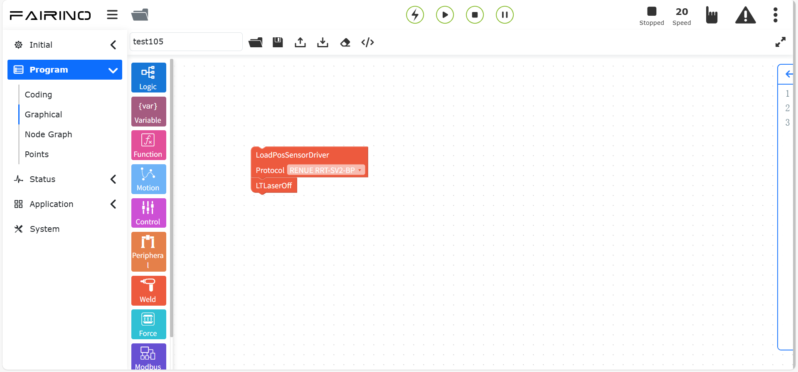

.. centered:: Wykres 10.8-11 Blok kodu instrukcji „Załaduj / Rozładuj czujnik”

3. Węzeł instrukcji „Rozpocznij / Zatrzymaj śledzenie laserowe”, parametry:

- Nazwa układu współrzędnych: Niestandardowo skonfigurowany układ współrzędnych

.. image:: graphical/106.png
   :width: 6in
   :align: center

.. centered:: Wykres 10.8-12 Blok kodu instrukcji „Rozpocznij / Zatrzymaj śledzenie laserowe”

4. Węzeł instrukcji „Rejestracja czujnika laserowego”, parametry:

- Wybór funkcji: Zatrzymaj rejestrację / Śledzenie w czasie rzeczywistym / Rozpocznij rejestrację / Odtworzenie trajektorii

- Wybór funkcji: Czas opóźnienia / Odległość opóźnienia

- Czas: 0 ~ 10000

- Numer osi rozszerzonej: 1 ~ 4

- Odległość: 0 ~ 10000

- Współczynnik czułości kompensacji: 0 ~ 1

- Prędkość: 0 ~ 100

.. image:: graphical/107.png
   :width: 6in
   :align: center

.. centered:: Wykres 10.8-13 Blok kodu instrukcji „Rejestracja czujnika laserowego”

5. Węzeł instrukcji „Ruch pobierania punktów czujnikiem”, parametry:

- Nazwa układu współrzędnych: Niestandardowo skonfigurowany układ współrzędnych

- Sposób ruchu: PTP/Lin

- Prędkość调试 (%): 0 ~ 100

- Punkt odniesienia orientacji: Punkt nauczania.

.. image:: graphical/108.png
   :width: 6in
   :align: center

.. centered:: Wykres 10.8-14 Blok kodu instrukcji „Ruch pobierania punktów czujnikiem”

6. Węzeł instrukcji „Odtworzenie śledzenia laserowego”, parametry:

.. image:: graphical/109.png
   :width: 6in
   :align: center

.. centered:: Wykres 10.8-15 Blok kodu instrukcji „Odtworzenie śledzenia laserowego”

7. Węzeł instrukcji „Rozpocznij / Zakończ pozycjonowanie”, parametry:

- Nazwa układu współrzędnych: Niestandardowo skonfigurowany układ współrzędnych

- Kierunek: -x/-x/-y/-y/-z/-z / Określony kierunek

- Punkt kierunku: Gdy nie wybrano „Określony kierunek”, parametr jest nieaktywny.

- Prędkość (%): 0 ~ 100

- Długość (mm): 0 ~ 1000

- Maksymalny czas pozycjonowania (ms): 0 ~ 10000

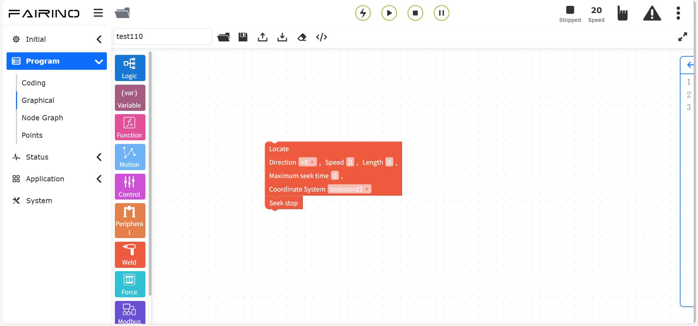

.. centered:: Wykres 10.8-16 Blok kodu instrukcji „Rozpocznij / Zakończ pozycjonowanie”

Instrukcja rejestracji laserowej
~~~~~~~~~~~~~~~~~~~~~~~~~~~~~~~~
Przeciągnij blok kodu „Instrukcja rejestracji laserowej” do obszaru roboczego interfejsu edycji graficznej.

Ta instrukcja realizuje funkcję pobierania punktu początkowego i końcowego rejestracji laserowej, umożliwiając robotowi automatyczne przesunięcie się do pozycji początkowej. Nadaje się do scenariuszy, w których ruch rozpoczyna się od zewnątrz przedmiotu i przeprowadzana jest rejestracja laserowa, a komputer nadrzędny może uzyskać informacje o punkcie początkowym i końcowym z danych rejestracji do wykorzystania w późniejszym ruchu.

Realizuje funkcję regulowanej prędkości odtwarzania śledzenia laserowego, umożliwiając robotowi szybkie rejestrowanie, a następnie odtwarzanie z normalną prędkością spawania, co może zwiększyć wydajność pracy.

1. Węzeł instrukcji „Rejestracja czujnika laserowego”, parametry:

- Wybór funkcji: Zatrzymaj rejestrację / Śledzenie w czasie rzeczywistym / Rozpocznij rejestrację / Odtworzenie trajektorii

- Wybór funkcji: Czas opóźnienia / Odległość opóźnienia

- Czas: 0 ~ 10000

- Numer osi rozszerzonej: 1 ~ 4

- Odległość: 0 ~ 10000

- Współczynnik czułości kompensacji: 0 ~ 1

- Prędkość: 0 ~ 100

.. image:: graphical/111.png
   :width: 6in
   :align: center

.. centered:: Wykres 10.8-17 Blok kodu instrukcji rejestracji danych spoiny

2. Węzeł instrukcji „Pobierz punkt początkowy/końcowy spoiny”, parametry:

- Sposób ruchu: PTP/LIN

- Prędkość (%): 0~100, wartość domyślna 30

.. image:: graphical/112.png
   :width: 6in
   :align: center

.. centered:: Wykres 10.8-18 Blok kodu instrukcji „Pobierz punkt początkowy/końcowy spoiny”

Instrukcja pozycjonowania drutem spawalniczym
~~~~~~~~~~~~~~~~~~~~~~~~~~~~~~~~~~~~~~~~~~~~~
Przeciągnij blok kodu „Instrukcja pozycjonowania drutem spawalniczym” do obszaru roboczego interfejsu edycji graficznej.

Ta instrukcja jest zwykle stosowana w scenariuszach spawania i wymaga połączenia spawarki z instrukcjami I/O i ruchu robota. Obejmuje rozpoczęcie pozycjonowania, zakończenie pozycjonowania, ustawienie punktu pozycjonowania, obliczenie przesunięcia i zapis danych punktu kontaktu.

Węzeł instrukcji „Rozpocznij / Zakończ pozycjonowanie drutem spawalniczym”, parametry:

- Pozycja odniesienia: Nie aktualizuj / Aktualizuj

- Prędkość pozycjonowania: 0~100

- Odległość pozycjonowania: 0~1000

- Flaga automatycznego powrotu: Nie wracaj automatycznie / Wracaj automatycznie

- Prędkość automatycznego powrotu: 0~100

- Odległość automatycznego powrotu: 0~1000

- Sposób pozycjonowania: Pozycjonowanie punktem nauczania / Pozycjonowanie z przesunięciem

.. image:: graphical/113.png
   :width: 6in
   :align: center

.. centered:: Wykres 10.8-19 Blok kodu instrukcji „Rozpocznij / Zakończ pozycjonowanie drutem spawalniczym”

Ustawienie punktów pozycjonowania zależy od typu spoiny i metody obliczeń.

- Gdy typ to spawanie pachwinowe, a metoda obliczeń to 1D (jeden z xyz), punkty są dodawane z punktów a, b.

- Gdy typ to spawanie pachwinowe, a metoda obliczeń to 2D (dwa z xyz), punkty są dodawane z punktów a, b, e, f.

- Gdy typ to spawanie pachwinowe, a metoda obliczeń to 3D (xyz), punkty są dodawane z punktów a, b, c, d, e, f.

- Gdy typ to spawanie pachwinowe, a metoda obliczeń to 2D- (dwa z xyz, jeden z rxryrz), punkty są dodawane z punktów a, b, c, d, e, f.

- Gdy typ to średnica wewnętrzna/zewnętrzna, a metoda obliczeń to 2D2D (dwa z xyz), punkty są dodawane z punktów a, b.

- Gdy typ to punkt, a metoda obliczeń to 3D (xyz), punkty są dodawane z punktów a, b, c, d, e, f.

- Gdy typ to kamera, a metoda obliczeń to 3D- (xyzrxryrz), punkty są dodawane z punktów a, b.

- Gdy typ to powierzchnia, a metoda obliczeń to 3D- (xyzrxryrz), punkty są dodawane z punktów a, b.

.. image:: graphical/114.png
   :width: 6in
   :align: center

.. centered:: Wykres 10.8-20 Blok kodu instrukcji „Wskazówki dotyczące ustawiania punktów pozycjonowania”

Obliczanie przesunięcia: ustaw punkty odniesienia i punkty kontaktu zgodnie z typem spoiny i metodą obliczeń.

- Gdy typ to spawanie pachwinowe, a metoda obliczeń to 1D (jeden z xyz), ustaw punkt odniesienia 1, punkt kontaktu 1.

- Gdy typ to spawanie pachwinowe, a metoda obliczeń to 2D (dwa z xyz), ustaw punkt odniesienia 1, punkt odniesienia 2, punkt kontaktu 1, punkt kontaktu 2.

- Gdy typ to spawanie pachwinowe, a metoda obliczeń to 3D (xyz), ustaw punkt odniesienia 1, punkt odniesienia 2, punkt odniesienia 3, punkt kontaktu 1, punkt kontaktu 2, punkt kontaktu 3.

- Gdy typ to spawanie pachwinowe, a metoda obliczeń to 2D- (dwa z xyz, jeden z rxryrz), ustaw punkt odniesienia 1, punkt odniesienia 2, punkt odniesienia 3, punkt kontaktu 1, punkt kontaktu 2, punkt kontaktu 3.

- Gdy typ to średnica wewnętrzna/zewnętrzna, a metoda obliczeń to 2D2D (dwa z xyz), ustaw punkt odniesienia 1, punkt odniesienia 2, punkt odniesienia 3, punkt kontaktu 1, punkt kontaktu 2, punkt kontaktu 3.

- Gdy typ to punkt, a metoda obliczeń to 3D (xyz), ustaw punkt kontaktu 1, punkt kontaktu 2.

- Gdy typ to kamera, a metoda obliczeń to 3D- (xyzrxryrz), ustaw punkt kontaktu 1, punkt kontaktu 2.

- Gdy typ to powierzchnia, a metoda obliczeń to 3D- (xyzrxryrz), ustaw punkt kontaktu 1, punkt kontaktu 2, punkt kontaktu 3, punkt kontaktu 4, punkt kontaktu 5, punkt kontaktu 6.

.. image:: graphical/115.png
   :width: 6in
   :align: center

.. centered:: Wykres 10.8-21 Blok kodu instrukcji „Obliczanie przesunięcia”

Węzeł instrukcji „Zapis danych punktu kontaktu”, parametry:

- Nazwa punktu kontaktu: RES0~99

- Nazwa punktu kontaktu: Format danych to {0,0,0,0,0,0}.

.. image:: graphical/116.png
   :width: 6in
   :align: center

.. centered:: Wykres 10.8-22 Blok kodu instrukcji „Zapis danych punktu kontaktu”

Instrukcja śledzenia łuku
~~~~~~~~~~~~~~~~~~~~~~~~~
Przeciągnij blok kodu „Instrukcja śledzenia łuku” do obszaru roboczego interfejsu edycji graficznej.

Ta instrukcja realizuje kompensację trajektorii robota poprzez wykorzystanie detekcji odchylenia spoiny w śledzeniu spoiny. Czujnik łuku może być używany do wykrywania odchylenia spoiny.

Węzeł instrukcji „Włączenie / Wyłączenie śledzenia łuku”, parametry:

- Czas opóźnienia śledzenia łuku (ms): Wartość referencyjna 50

- Kompensacja odchylenia: Wyłącz / Włącz

- Współczynnik regulacji: 0 ~ 300

- Czas kompensacji (cyc): 0 ~ 300

- Maksymalna kompensacja na raz (mm): 0 ~ 300

- Maksymalna kompensacja całkowita (mm): 0 ~ 300

- Wybór układu współrzędnych góra-dół: Oscylacja

- Sposób ustawiania prądu odniesienia góra-dół: Sprzężenie zwrotne / Stała

- Prąd odniesienia góra-dół (A): 0 ~ 300

.. image:: graphical/117.png
   :width: 6in
   :align: center

.. centered:: Wykres 10.8-23 Blok kodu instrukcji śledzenia łuku

Instrukcja regulacji orientacji
~~~~~~~~~~~~~~~~~~~~~~~~~~~~~~~
Przeciągnij blok kodu „Instrukcja regulacji orientacji” do obszaru roboczego interfejsu edycji graficznej.

Ta instrukcja jest przeznaczona do scenariuszy adaptacyjnej regulacji orientacji palnika spawalniczego podczas śledzenia spawania. Wymaga wcześniejszego nauczenia trzech punktów PosA, PosB, PosC, w przeciwnym razie nie można dodać węzła.

Po zapisaniu trzech odpowiednich punktów orientacji, zgodnie z rzeczywistym kierunkiem ruchu robota, dodaj instrukcję adaptacyjnej regulacji orientacji. Szczegółowe informacje można znaleźć w rozdziale dotyczącym urządzeń peryferyjnych robota.

Węzeł instrukcji „Włączenie regulacji orientacji”, parametry:

- Typ materiału: Blacha falista / Blacha trapezowa / Blacha ogrodzeniowa / Stal pancerna falista

- Kierunek ruchu: Od lewej do prawej / Od prawej do lewej

- Czas regulacji orientacji (ms): 0 ~ 1000

- Długość pierwszego odcinka (mm):

- Typ punktu przegięcia: Z góry na dół / Z dołu do góry

- Długość drugiego odcinka (mm):

- Długość trzeciego odcinka (mm):

- Długość czwartego odcinka (mm):

- Długość piątego odcinka (mm):

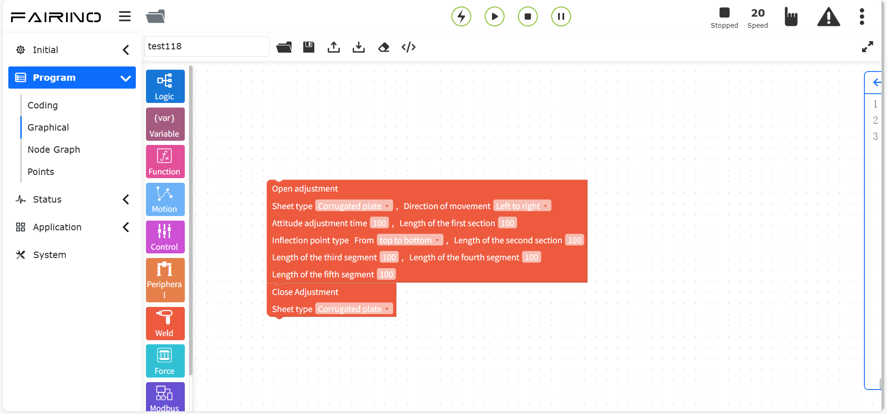

.. centered:: Wykres 10.8-24 Blok kodu instrukcji regulacji orientacji

Polecenia programowania graficznego dotyczące sterowania siłą
-------------------------------------------------------------
Polecenia programowania graficznego dotyczące sterowania siłą obejmują polecenia sterowania siłą, takie jak zestaw sterowania siłą, rejestracja momentu obrotowego itp.

.. image:: graphical/010.png
   :width: 6in
   :align: center

.. centered:: Wykres 10.9 Polecenia programowania graficznego dotyczące sterowania siłą

Instrukcje sterowania siłą
~~~~~~~~~~~~~~~~~~~~~~~~~~
Przeciągnij blok kodu „Instrukcja sterowania siłą” do obszaru roboczego interfejsu edycji graficznej.

Ta instrukcja zawiera osiem instrukcji: FT_Guard (wykrywanie kolizji), FT_Control (sterowanie stałą siłą), FT_Compliance (sterowanie podatne), FT_Spiral (wstawianie spiralne), FT_Rot (wstawianie obrotowe), FT_Lin (wstawianie liniowe), FT_FindSurface (lokalizacja powierzchni), FT_CalCenter (lokalizacja środka). Szczegółowe informacje można znaleźć w rozdziale dotyczącym urządzeń peryferyjnych robota.

1. Węzeł instrukcji „Włączenie / Wyłączenie wykrywania kolizji”, parametry:

- Nazwa układu współrzędnych: Niestandardowo skonfigurowany układ współrzędnych

- Wartość logiczna Fx-Tx: true/false

- Bieżąca wartość Fx-Tx: Wprowadzana zgodnie z rzeczywistą sytuacją

- Maksymalny próg Fx-Tx: Wprowadzany zgodnie z rzeczywistą sytuacją

- Minimalny próg Fx-Tx: Wprowadzany zgodnie z rzeczywistą sytuacją

.. image:: graphical/119.png
   :width: 6in
   :align: center

.. centered:: Wykres 10.9-1 Blok kodu instrukcji włączenia/wyłączenia wykrywania kolizji

2. Węzeł instrukcji „Włączenie / Wyłączenie sterowania”, parametry:

- Nazwa układu współrzędnych: Niestandardowo skonfigurowany układ współrzędnych

- Wartość logiczna Fx-Tx: true/false

- Bieżąca wartość Fx-Tx: Dostosowywana zgodnie z rzeczywistą sytuacją

- F_P_gain - F_D_gain: Dostosowywane zgodnie z rzeczywistą sytuacją, nie mogą wynosić 0

- Stan uruchomienia/zatrzymania adaptacyjnego: Zatrzymaj / Włącz

- Stan uruchomienia/zatrzymania sterowania ILC: Zatrzymaj / Trening / Praktyka

- Maksymalna odległość regulacji (mm): 0 ~ 1000

- Maksymalny kąt regulacji (°): 0 ~ 1000

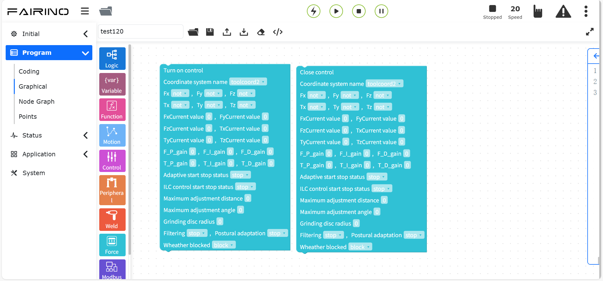

.. centered:: Wykres 10.9-2 Blok kodu instrukcji włączenia/wyłączenia sterowania

3. Węzeł instrukcji „Włączenie / Wyłączenie sterowania podatnego”, parametry:

- Współczynnik regulacji pozycji zadanej: 0 ~ 1

- Próg siły włączenia podatności (N): 0 ~ 100

.. image:: graphical/121.png
   :width: 6in
   :align: center

.. centered:: Wykres 10.9-3 Blok kodu instrukcji włączenia/wyłączenia sterowania podatnego

4. Węzeł instrukcji „Wstawianie spiralne”, parametry:

- Nazwa układu współrzędnych: Układ współrzędnych narzędzia / Współrzędne podstawowe

- Posuw promienia na okrążenie (mm): 0 ~ 100, wartość referencyjna: 0,7

- Próg siły lub momentu obrotowego (N/Nm): 0 ~ 100, wartość referencyjna: 50

- Maksymalny czas poszukiwania (ms): 0 ~ 60000, wartość referencyjna: 60000

- Maksymalna prędkość liniowa (mm/s): 0 ~ 100, wartość referencyjna: 5

.. image:: graphical/122.png
   :width: 6in
   :align: center

.. centered:: Wykres 10.9-4 Blok kodu instrukcji wstawiania spiralnego

5. Węzeł instrukcji „Wstawianie obrotowe”, parametry:

- Nazwa układu współrzędnych: Układ współrzędnych narzędzia / Współrzędne podstawowe

- Prędkość kątowa obrotu (°/s): 0 ~ 100, wartość referencyjna: 0,7

- Siła wyzwalająca lub kończący moment obrotowy (N/Nm): 0 ~ 100, wartość referencyjna: 50

- Maksymalny kąt obrotu (°): 0 ~ 100, wartość referencyjna: 5

- Kierunek siły: Kierunek z / Kierunek mz

- Maksymalne przyspieszenie kątowe obrotu (°/s²): 0 ~ 100

- Kierunek wstawiania: Dodatni / Ujemny

.. image:: graphical/123.png
   :width: 6in
   :align: center

.. centered:: Wykres 10.9-5 Blok kodu instrukcji wstawiania obrotowego

6. Węzeł instrukcji „Wstawianie liniowe”, parametry:

- Nazwa układu współrzędnych: Układ współrzędnych narzędzia / Współrzędne podstawowe

- Próg siły zakończenia ruchu (N): 0 ~ 100

- Prędkość liniowa (mm/s): 0 ~ 100, wartość referencyjna: 1

- Przyspieszenie liniowe (°/s²): 0 ~ 100

- Maksymalna odległość wstawiania (mm): 0 ~ 100

- Kierunek wstawiania: Dodatni / Ujemny

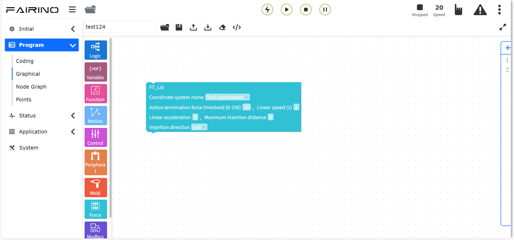

.. centered:: Wykres 10.9-6 Blok kodu instrukcji wstawiania liniowego

7. Węzeł instrukcji „Lokalizacja powierzchni”, parametry:

- Nazwa układu współrzędnych: Układ współrzędnych narzędzia / Współrzędne podstawowe

- Kierunek ruchu: Dodatni / Ujemny

- Oś ruchu: X/Y/Z

- Prędkość liniowa poszukiwania (mm/s): 0 ~ 100

- Przyspieszenie poszukiwania (mm/s²): 0 ~ 100

- Maksymalna odległość poszukiwania (mm): 0 ~ 100

- Próg siły zakończenia ruchu (N): 0 ~ 100

.. image:: graphical/125.png
   :width: 6in
   :align: center

.. centered:: Wykres 10.9-7 Blok kodu instrukcji lokalizacji powierzchni

8. Węzeł instrukcji „Rozpocznij / Zakończ obliczanie płaszczyzny pośredniej”.

.. image:: graphical/126.png
   :width: 6in
   :align: center

.. centered:: Wykres 10.9-8 Blok kodu instrukcji rozpoczęcia/zakończenia obliczania płaszczyzny pośredniej

Instrukcja rejestracji momentu obrotowego
~~~~~~~~~~~~~~~~~~~~~~~~~~~~~~~~~~~~~~~~~
Przeciągnij blok kodu „Instrukcja rejestracji momentu obrotowego” do obszaru roboczego interfejsu edycji graficznej.

Ta instrukcja jest instrukcją rejestracji momentu obrotowego i zawiera trzy instrukcje: „Rozpocznij rejestrację momentu obrotowego”, „Zatrzymaj rejestrację momentu obrotowego” i „Resetuj rejestrację momentu obrotowego”.

Realizuje funkcję wykrywania kolizji w czasie rzeczywistym na podstawie rejestracji momentu obrotowego.

Kliknij przycisk „Rozpocznij rejestrację momentu obrotowego”, aby kontynuować rejestrowanie kolizji podczas działania instrukcji ruchu. Zarejestrowany moment obrotowy w czasie rzeczywistym jest używany jako teoretyczna wartość do oceny wykrywania kolizji, aby zmniejszyć prawdopodobieństwo fałszywych alarmów.

Gdy wartość przekroczy ustawiony zakres progowy, rejestrowany jest czas trwania wykrywania kolizji.

Kliknij przycisk „Zatrzymaj rejestrację momentu obrotowego”, aby zatrzymać rejestrację. Kliknij „Resetuj rejestrację momentu obrotowego”, aby przywrócić stan domyślny.

1. Węzeł instrukcji „Rozpocznij rejestrację momentu obrotowego”, parametry:

- Wybór wygładzenia: Bez wygładzenia (dane surowe) / Wygładzone (dane po wygładzeniu)

- Próg ujemny stawu (Nm): -100 ~ 0

- Próg dodatni stawu (Nm): 0 ~ 100

- Czas ciągłego wykrywania kolizji stawu (ms): 0 ~ 1000

.. image:: graphical/128.png
   :width: 6in
   :align: center

.. centered:: Wykres 10.9-9 Blok kodu instrukcji rozpoczęcia rejestracji momentu obrotowego

2. Węzeł instrukcji „Zakończenie rejestracji momentu obrotowego”

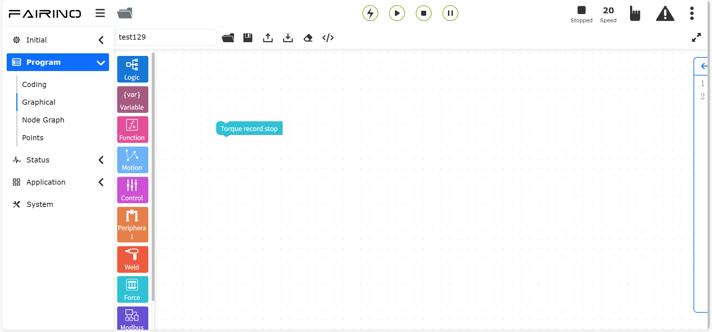

.. centered:: Wykres 10.9-10 Blok kodu instrukcji zakończenia rejestracji momentu obrotowego

3. Węzeł instrukcji „Resetowanie rejestracji momentu obrotowego”

.. image:: graphical/130.png
   :width: 6in
   :align: center

.. centered:: Wykres 10.9-11 Blok kodu instrukcji resetowania rejestracji momentu obrotowego

Polecenia programowania graficznego dotyczące komunikacji
---------------------------------------------------------
Polecenia programowania graficznego dotyczące komunikacji obejmują polecenia komunikacyjne, takie jak ustawienia mastera Modbus (klient), ustawienia slave'a Modbus, odczyt rejestrów itp.

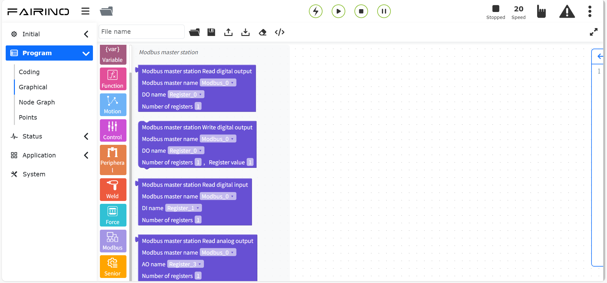

.. centered:: Wykres 10.10 Polecenia programowania graficznego dotyczące komunikacji

Instrukcje Modbus
~~~~~~~~~~~~~~~~~
Przeciągnij blok kodu „Instrukcja Modbus” do obszaru roboczego interfejsu edycji graficznej.

Funkcją tej instrukcji jest funkcja magistrali oparta na protokole Modbus TCP. Użytkownik może za pomocą powiązanych instrukcji sterować komunikacją robota z klientem lub serwerem Modbus TCP (komunikacja master-slave), wykonując operacje odczytu i zapisu na cewkach, wartościach dyskretnych i rejestrach. W przypadku większej liczby funkcji operacyjnych Modbus TCP skontaktuj się z nami.

Przed użyciem funkcji węzłów Modbus należy najpierw skonfigurować mastera, slave'a oraz nazwy DI, DO, AI, AO w konfiguracji Modbus TCP w programie nauczania.

1. Ustawienia wyjścia cyfrowego mastera, parametry:

- Nazwa mastera Modbus: Konfigurowana zgodnie z rzeczywistą sytuacją.

- Nazwa DO: Konfigurowana zgodnie z rzeczywistą sytuacją.

- Liczba rejestrów: Liczba całkowita 0 ~ 128

- Wartość rejestru: Zależna od liczby rejestrów, można wprowadzić wiele wartości. Na przykład dla liczby 3, wartości 1,0,1.

.. image:: graphical/131.png
   :width: 6in
   :align: center

.. centered:: Wykres 10.10-1 Blok kodu instrukcji mastera „Odczyt / Zapis wyjścia cyfrowego”

2. Ustawienia wejścia cyfrowego mastera, parametry:

- Nazwa mastera Modbus: Konfigurowana zgodnie z rzeczywistą sytuacją.

- Nazwa DI: Konfigurowana zgodnie z rzeczywistą sytuacją.

- Liczba rejestrów: Liczba całkowita 0 ~ 128

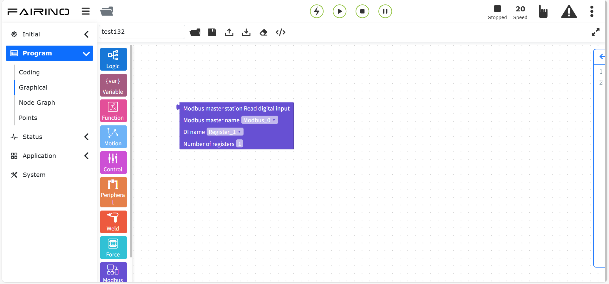

.. centered:: Wykres 10.10-2 Blok kodu instrukcji mastera „Odczyt wejścia cyfrowego”

3. Ustawienia wyjścia analogowego mastera, parametry:

- Nazwa mastera Modbus: Konfigurowana zgodnie z rzeczywistą sytuacją.

- Nazwa AO: Konfigurowana zgodnie z rzeczywistą sytuacją.

- Liczba rejestrów: Liczba całkowita 0 ~ 128

- Wartość rejestru: Zależna od liczby rejestrów, można wprowadzić wiele wartości. Na przykład dla liczby 3, wartości 1,0,1.

.. image:: graphical/133.png
   :width: 6in
   :align: center

.. centered:: Wykres 10.10-3 Blok kodu instrukcji mastera „Odczyt / Zapis wyjścia analogowego”

4. Ustawienia wejścia analogowego mastera, parametry:

- Nazwa mastera Modbus: Konfigurowana zgodnie z rzeczywistą sytuacją.

- Nazwa AI: Konfigurowana zgodnie z rzeczywistą sytuacją.

- Liczba rejestrów: Liczba całkowita 0 ~ 128

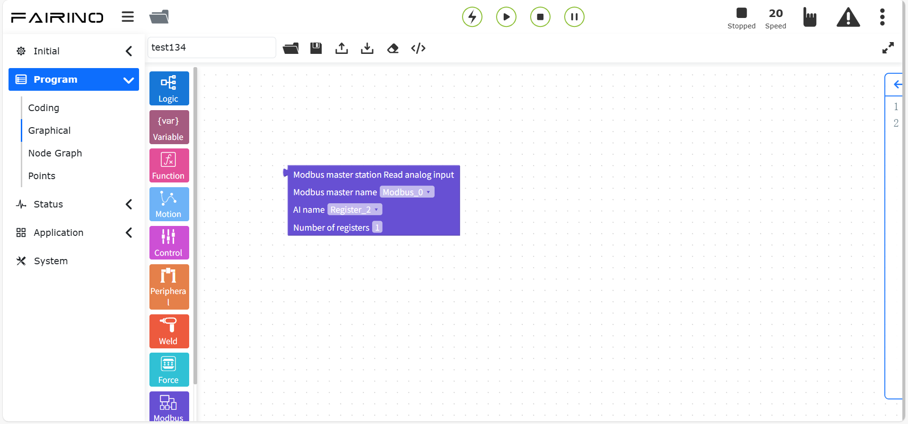

.. centered:: Wykres 10.10-4 Blok kodu instrukcji mastera „Odczyt wejścia analogowego”

5. Ustawienia oczekiwania mastera na wejście cyfrowe, parametry:

- Nazwa mastera Modbus: Konfigurowana zgodnie z rzeczywistą sytuacją.

- Nazwa DI: Konfigurowana zgodnie z rzeczywistą sytuacją.

- Stan oczekiwania: true/false

- Czas przekroczenia limitu (ms): Liczba całkowita 0 ~ 128

.. image:: graphical/135.png
   :width: 6in
   :align: center

.. centered:: Wykres 10.10-5 Blok kodu instrukcji mastera „Oczekiwanie na wejście cyfrowe”

6. Ustawienia oczekiwania mastera na wejście analogowe, parametry:

- Nazwa mastera Modbus: Konfigurowana zgodnie z rzeczywistą sytuacją.

- Nazwa AI: Konfigurowana zgodnie z rzeczywistą sytuacją.

- Stan oczekiwania: Większy niż / Mniejszy niż

- Liczba rejestrów: Liczba całkowita 0 ~ 128

- Wartość rejestru: Zależna od liczby rejestrów, można wprowadzić wiele wartości.

.. image:: graphical/136.png
   :width: 6in
   :align: center

.. centered:: Wykres 10.10-6 Blok kodu instrukcji mastera „Oczekiwanie na wejście analogowe”

7. Ustawienia wyjścia cyfrowego slave'a, parametry:

- Nazwa DO: Konfigurowana zgodnie z rzeczywistą sytuacją.

- Liczba rejestrów: Liczba całkowita 0 ~ 128

- Wartość rejestru: Zależna od liczby rejestrów, można wprowadzić wiele wartości. Na przykład dla liczby 3, wartości 1,0,1.

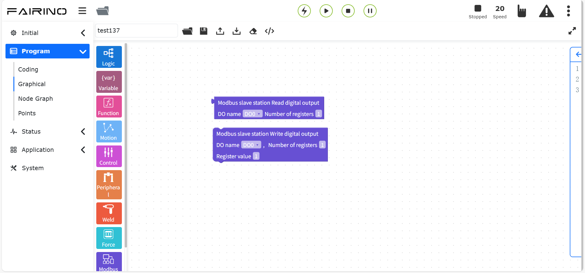

.. centered:: Wykres 10.10-7 Blok kodu instrukcji slave'a „Odczyt / Zapis wyjścia cyfrowego”

8. Ustawienia wejścia cyfrowego slave'a, parametry:

- Nazwa DI: Konfigurowana zgodnie z rzeczywistą sytuacją.

- Liczba rejestrów: Liczba całkowita 0 ~ 128

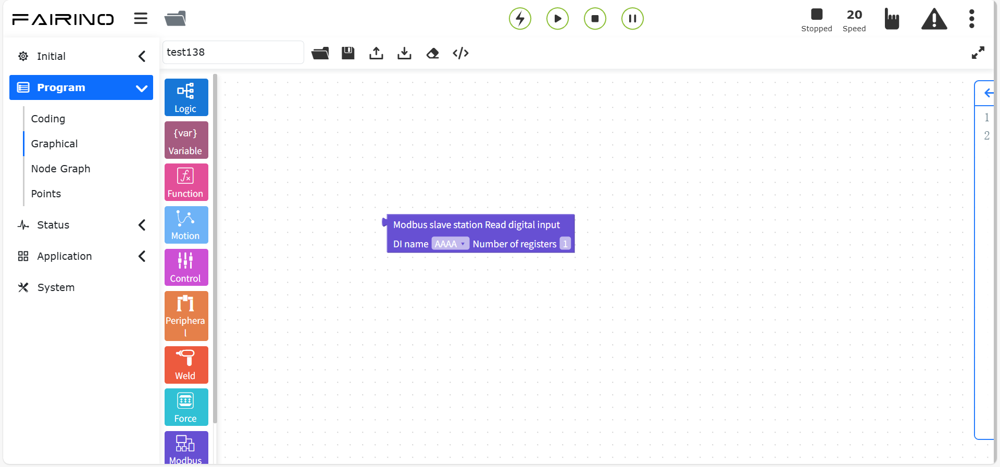

.. centered:: Wykres 10.10-8 Blok kodu instrukcji slave'a „Odczyt wejścia cyfrowego”

9. Ustawienia wyjścia analogowego slave'a, parametry:

- Nazwa AO: Konfigurowana zgodnie z rzeczywistą sytuacją.

- Liczba rejestrów: Liczba całkowita 0 ~ 128

- Wartość rejestru: Zależna od liczby rejestrów, można wprowadzić wiele wartości. Na przykład dla liczby 3, wartości 1,0,1.

.. image:: graphical/139.png
   :width: 6in
   :align: center

.. centered:: Wykres 10.10-9 Blok kodu instrukcji slave'a „Odczyt / Zapis wyjścia analogowego”

10. Ustawienia wejścia analogowego slave'a, parametry:

- Nazwa AI: Konfigurowana zgodnie z rzeczywistą sytuacją.

- Liczba rejestrów: Liczba całkowita 0 ~ 128

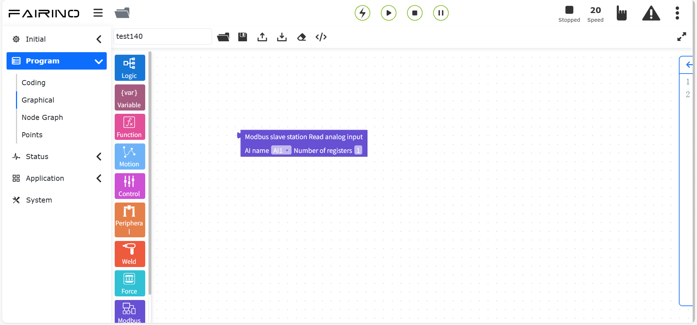

.. centered:: Wykres 10.10-10 Blok kodu instrukcji slave'a „Odczyt wejścia analogowego”

11. Ustawienia oczekiwania slave'a na wejście cyfrowe, parametry:

- Nazwa DI: Konfigurowana zgodnie z rzeczywistą sytuacją.

- Stan oczekiwania: true/false

- Czas przekroczenia limitu (ms): Liczba całkowita

.. image:: graphical/141.png
   :width: 6in
   :align: center

.. centered:: Wykres 10.10-11 Blok kodu instrukcji slave'a „Oczekiwanie na wejście cyfrowe”

12. Ustawienia oczekiwania slave'a na wejście analogowe, parametry:

- Nazwa AI: Konfigurowana zgodnie z rzeczywistą sytuacją.

- Stan oczekiwania: Większy niż / Mniejszy niż

- Liczba rejestrów: Liczba całkowita 0 ~ 128

- Wartość rejestru: Zależna od liczby rejestrów, można wprowadzić wiele wartości.

.. image:: graphical/142.png
   :width: 6in
   :align: center

.. centered:: Wykres 10.10-12 Blok kodu instrukcji slave'a „Oczekiwanie na wejście analogowe”

13. Instrukcja odczytu rejestru, parametry:

- Kod funkcji: 0x01 - cewka / 0x02 - wartość dyskretna / 0x03 - rejestr przechowujący / 0x04 - rejestr wejściowy

- Adres rejestru, cewki, wartości dyskretnej: Wprowadzany zgodnie z rzeczywistą sytuacją.

- Liczba rejestrów, cewek, wartości dyskretnych: 0 ~ 255

- Adres: Wprowadzany zgodnie z rzeczywistą sytuacją.

- Czy stosować wątek: Nie / Tak

.. image:: graphical/143.png
   :width: 6in
   :align: center

.. centered:: Wykres 10.10-13 Blok kodu instrukcji „Odczyt rejestru”

14. Instrukcja odczytu danych rejestru, parametry:

- Liczba rejestrów, cewek, wartości dyskretnych: 0 ~ 255

- Czy stosować wątek: Nie / Tak

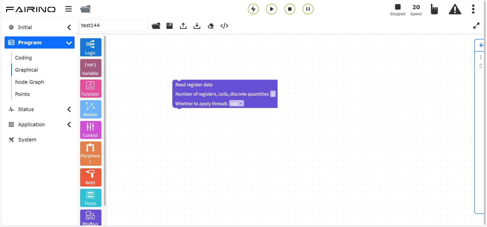

.. centered:: Wykres 10.10-14 Blok kodu instrukcji „Odczyt danych rejestru”

15. Instrukcja zapisu rejestru, parametry:

- Kod funkcji: 0x01 - cewka / 0x02 - wartość dyskretna / 0x03 - rejestr przechowujący / 0x04 - rejestr wejściowy

- Adres rejestru, cewki: Wprowadzany zgodnie z rzeczywistą sytuacją.

- Liczba rejestrów, cewek: 0 ~ 255

- Tablica bajtów: Wprowadzana zgodnie z rzeczywistą sytuacją.

- Adres: Wprowadzany zgodnie z rzeczywistą sytuacją.

- Czy stosować wątek: Nie / Tak

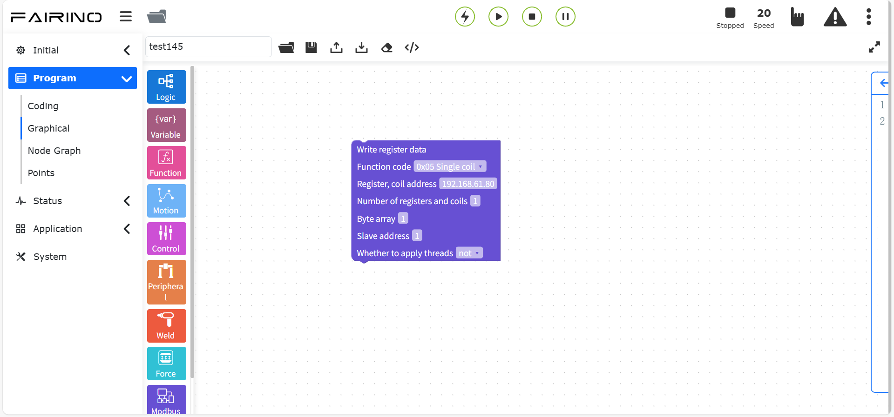

.. centered:: Wykres 10.10-15 Blok kodu instrukcji „Zapis rejestru”

Polecenia programowania graficznego dotyczące zaawansowanych funkcji
--------------------------------------------------------------------
Polecenia programowania graficznego dotyczące zaawansowanych funkcji obejmują polecenia zaawansowane, takie jak wywoływanie podprogramów przez dofile, wątki pomocnicze, instrukcje zwijania itp.

.. image:: graphical/012.png
   :width: 6in
   :align: center

.. centered:: Wykres 10.11 Polecenia programowania graficznego dotyczące zaawansowanych funkcji

Instrukcja zwijania
~~~~~~~~~~~~~~~~~~~
Przeciągnij blok kodu „Instrukcja zwijania” do obszaru roboczego interfejsu edycji graficznej.

Ta instrukcja zapewnia zwijanie wyświetlania bloków kodu wielowierszowego, ułatwiając użytkownikowi czytanie bloków kodu.

Węzeł instrukcji „Zwijanie”, parametry:

- Nazwa bloku kodu: Nazwij zwijany blok kodu.

.. centered:: Wykres 10.11-1 Blok kodu instrukcji zwijania

Instrukcja wywoływania podprogramu
~~~~~~~~~~~~~~~~~~~~~~~~~~~~~~~~~~
Przeciągnij blok kodu „Instrukcja wywoływania podprogramu” do obszaru roboczego interfejsu edycji graficznej.

Ta instrukcja jest instrukcją wywoływania podprogramu. Po wstawieniu tej instrukcji do programu, gdy program osiągnie ten punkt, robot przejdzie w stan wstrzymania. Aby kontynuować, kliknij przycisk „Wstrzymaj/Wznów” w obszarze sterowania.

Węzeł instrukcji „Wywołanie podprogramu”, parametry:

- Plik dofile: Nazwa utworzonego pliku.

- Poziom wywołania: Pierwszy poziom / Drugi poziom

- ID: Identyfikator pozycji odpowiadający poziomowi.

.. image:: graphical/147.png
   :width: 6in
   :align: center

.. centered:: Wykres 10.11-2 Blok kodu instrukcji wywoływania podprogramu

Instrukcja wątku pomocniczego
~~~~~~~~~~~~~~~~~~~~~~~~~~~~~
Przeciągnij blok kodu „Wątek pomocniczy” do obszaru roboczego interfejsu edycji graficznej.

Polecenie Thread to funkcja wątku pomocniczego. Użytkownik może zdefiniować wątek pomocniczy działający równolegle z wątkiem głównym. Wątek pomocniczy służy głównie do wymiany danych z urządzeniami zewnętrznymi, obsługuje komunikację socket, pobieranie stanu DI robota, ustawianie stanu DO robota, pobieranie informacji o stanie robota oraz wymianę danych z wątkiem głównym. Dane uzyskane przez wątek główny z wątku pomocniczego są używane do podejmowania decyzji dotyczących logiki sterowania ruchem robota.

Węzeł instrukcji „Wątek pomocniczy”, parametry:

- Nazwa metody: Nazwa wątku pomocniczego.

- Wywoływana funkcja: Wartość funkcji wywoływanej przez wątek pomocniczy.

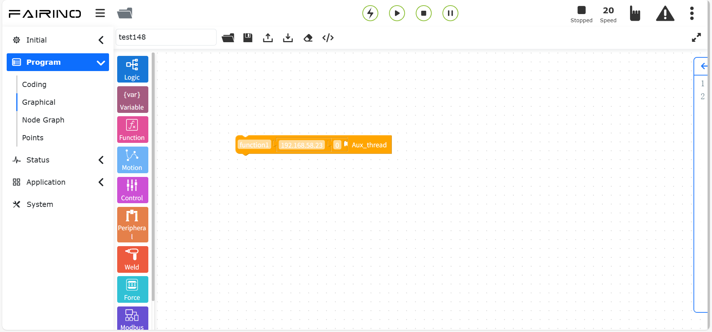

.. centered:: Wykres 10.11-3 Blok kodu wątku pomocniczego

Instrukcja tabeli punktów
~~~~~~~~~~~~~~~~~~~~~~~~~
Przeciągnij blok kodu „Tabela punktów” do obszaru roboczego interfejsu edycji graficznej.

Ta instrukcja służy głównie do przełączania między trybem systemowym a trybem tabeli punktów. Poprzez przełączanie tabel punktów stosowane są punkty nauczania z różnych tabel punktów. Szczegółowe informacje znajdują się w rozdziale 12 – Punkty nauczania.

Węzeł instrukcji „Tabela punktów”, parametry:

- Tryb tabeli punktów: Przełączanie różnych nazw tabel punktów.

.. image:: graphical/149.png
   :width: 6in
   :align: center

.. centered:: Wykres 10.11-4 Blok kodu tabeli punktów

Instrukcja śledzenia ogniska
~~~~~~~~~~~~~~~~~~~~~~~~~~~~
Przeciągnij blok kodu „Śledzenie ogniska” do obszaru roboczego interfejsu edycji graficznej.

Ta instrukcja służy głównie do utrzymywania stałego skupienia na jednym punkcie podczas ruchu robota.

Węzeł instrukcji „Śledzenie ogniska”, parametry:

- Proporcja parametru: 0~100, wartość domyślna 50.

- Parametr sprzężenia przedniego: 0~1000, wartość domyślna 19.

- Ograniczenie maksymalnego przyspieszenia kątowego: 0~10000, wartość domyślna 1440.

- Ograniczenie maksymalnej prędkości kątowej: 0~1000, wartość domyślna 180.

- Zablokuj kierunek osi X: Odniesienie do wektora wejściowego / Poziomo / Pionowo

.. image:: graphical/150.png
   :width: 6in
   :align: center

.. centered:: Wykres 10.11-5 Blok kodu śledzenia ogniska

Przykłady użycia poleceń programowania graficznego
--------------------------------------------------
Po wybraniu typu programowania graficznego kliknij potrzebny graficzny blok kodu, aby móc go przeciągnąć i połączyć w obszarze roboczym.

Na przykład wybierz instrukcje ruchu PTP i Lin oraz instrukcję sterowania Waitms do połączenia. Na zewnątrz można umieścić zaawansowaną instrukcję zwijania i wprowadzić nazwę komentarza, aby zrealizować zwijanie bloku kodu.

Po kliknięciu listy rozwijanej można wybrać typ parametru instrukcji, a w polu wejściowym można wprowadzić dane parametru instrukcji. Przykład polecenia programowania graficznego jest następujący:

.. image:: graphical/013.png
   :width: 6in
   :align: center

.. centered:: Wykres 10.12-1 Przykład polecenia programowania graficznego

Po zakończeniu łączenia instrukcji programowania graficznego i wypełniania parametrów, wypełnij nazwę obszaru roboczego i kliknij ikonę „Zapisz”, aby zapisać bieżący program. Wybierz „Obszar roboczy”, który został napisany, kliknij „Rozpocznij działanie”, aby wykonać ten fragment programu.

Modularyzacja bloków kodu programowania graficznego
~~~~~~~~~~~~~~~~~~~~~~~~~~~~~~~~~~~~~~~~~~~~~~~~~~~~
Aby poprawić czytelność kodu programowania graficznego, dodano funkcję modularyzacji bloków kodu programowania graficznego, czyli zaawansowaną instrukcję: blok kodu instrukcji zwijania.

.. image:: graphical/014.png
   :width: 6in
   :align: center

.. centered:: Wykres 10.12-2 Blok kodu instrukcji zwijania

1. Napisz fragment instrukcji bloku kodu, dodaj na zewnątrz blok kodu instrukcji zwijania i wpisz w polu wejściowym notatkę dla tego fragmentu instrukcji.

.. image:: graphical/015.png
   :width: 6in
   :align: center

.. centered:: Wykres 10.12-3 Efekt działania instrukcji zwijania

2. Kliknij prawym przyciskiem myszy na „Zwijany blok” na pasku operacji. Ten fragment instrukcji bloku kodu zostanie zwinięty, blok kodu zostanie zwinięty do jednej linii, a program pod zwinięciem może być prawidłowo wykonany.

.. image:: graphical/016.png
   :width: 6in
   :align: center

.. centered:: Wykres 10.12-4 Efekt po zwinięciu

3. Przewijanie myszką umożliwia funkcję skalowania strony. Konkretny efekt jest następujący:

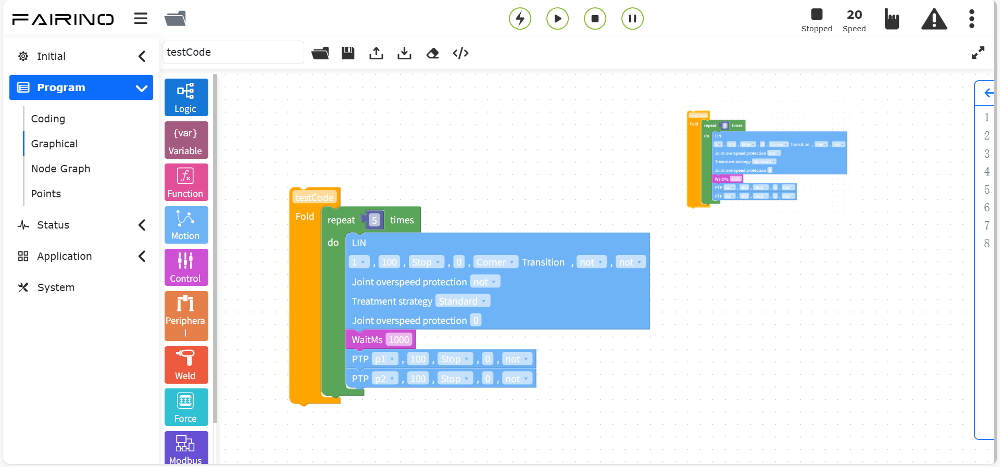

.. centered:: Wykres 10.12-5 Efekt działania funkcji skalowania strony

Nadpisywanie o tej samej nazwie w programowaniu graficznym
~~~~~~~~~~~~~~~~~~~~~~~~~~~~~~~~~~~~~~~~~~~~~~~~~~~~~~~~~~
Na stronie programowania graficznego, po utworzeniu/zaladowaniu pliku, zmień nazwę obszaru roboczego i kliknij Zapisz. Jeśli plik o zmienionej nazwie obszaru roboczego już istnieje, zostanie wyświetlone okno dialogowe „Punkt nauczania już istnieje”, jak poniżej.

.. image:: graphical/018.png
   :width: 6in
   :align: center

.. centered:: Wykres 10.12-6 Nadpisywanie programu programowania graficznego

**Krok 1**: Kliknij przycisk „Anuluj”, aby kontynuować poprzednią operację.

**Krok 2**: Zaznacz pole wyboru „Synchronizuj aktualizację programu nauczania”, a następnie kliknij przycisk „Nadpisz”. Spowoduje to, że program lua na bieżącej stronie programowania graficznego nadpisze program lua o nazwie pliku zmienionego obszaru roboczego.

Weryfikacja niezapisania programu w programowaniu graficznym
~~~~~~~~~~~~~~~~~~~~~~~~~~~~~~~~~~~~~~~~~~~~~~~~~~~~~~~~~~~~
Na stronie programowania graficznego, po otwarciu/utworzeniu programu, jeśli program programowania graficznego został zmodyfikowany i nie został zapisany.

Jeśli klikniesz operację „Otwórz” plik, zostanie wyświetlone okno dialogowe „Czy zapisać ten program” z komunikatem „Bieżący program został zmieniony. Czy zapisać zmiany w tym programie?”, jak poniżej.

.. image:: graphical/019.png
   :width: 6in
   :align: center

.. centered:: Wykres 10.12-7 Bieżąca strona programu - weryfikacja niezapisania

**Krok 1**: Kliknij przycisk „Nie zapisuj”, aby kontynuować poprzednią operację „Otwórz” plik.

**Krok 2**: Kliknij przycisk „Zapisz”, niezapisany program lua zostanie pomyślnie zapisany, a następnie kontynuuj poprzednią operację „Otwórz” plik.

Jeśli opuścisz stronę programowania graficznego i przejdziesz do innej strony, również zostanie wyświetlony komunikat „Czy zapisać ten program”, a użytkownik nadal pozostanie na bieżącej stronie programowania graficznego, jak poniżej.

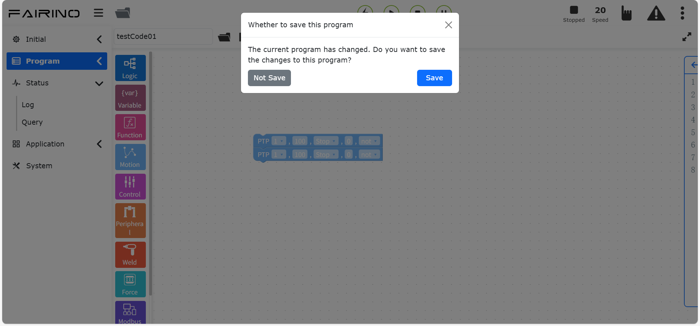

.. centered:: Wykres 10.12-8 Weryfikacja niezapisania programu przy przełączaniu strony

**Krok 1**: Kliknij przycisk „Nie zapisuj”, aby przejść do poprzednio wybranej strony.

**Krok 2**: Kliknij przycisk „Zapisz”, niezapisany program lua zostanie pomyślnie zapisany, a następnie przejdź do poprzednio wybranej strony. Jeśli nazwa zapisanego programu już istnieje, pojawi się komunikat, że punkt nauczania już istnieje i czy go nadpisać. Po wykonaniu operacji anulowania/nadpisania przejdź do poprzednio wybranej strony.