Instalacja sprzętowa
====================

.. toctree:: 
	:maxdepth: 5

Instrukcje bezpieczeństwa
-------------------------

Wprowadzenie
~~~~~~~~~~~~

W niniejszej instrukcji użyto następujących ostrzeżeń, których celem jest zapewnienie bezpieczeństwa osób i sprzętu. Podczas czytania niniejszej instrukcji niezwykle ważne jest przestrzeganie i wykonywanie wszystkich instrukcji montażu i wytycznych zawartych w innych rozdziałach tej instrukcji. Należy zwrócić szczególną uwagę na tekst związany z symbolami ostrzegawczymi.

.. important:: 
    - FAIRINO odmawia wszelkiej odpowiedzialności, jeśli robot (korpus robota, skrzynka sterownicza, panel operatorski lub panel przyciskowy) został uszkodzony, zmieniony lub zmodyfikowany z winy człowieka.
    - FAIRINO nie ponosi odpowiedzialności za jakiekolwiek uszkodzenia robota lub jakiegokolwiek innego urządzenia spowodowane błędami w programach napisanych przez klienta.

Bezpieczeństwo personelu
~~~~~~~~~~~~~~~~~~~~~~~~

Podczas obsługi systemu robotycznego należy przede wszystkim zapewnić bezpieczeństwo personelu. Poniżej wymieniono ogólne środki ostrożności. Należy podjąć odpowiednie środki w celu zapewnienia bezpieczeństwa personelu.

1. Każdy pracownik obsługujący system robotyczny powinien przejść szkolenie prowadzone przez FAIRINO (Suzhou) Robot Technology Co., Ltd. Użytkownik musi zapewnić, że posiada pełną znajomość bezpiecznych i standardowych procedur operacyjnych oraz kwalifikacje do obsługi robota. Szczegółowe informacje na temat szkolenia można uzyskać w naszej firmie pod adresem e-mail: jiling@frtech.fr.

2. Pracownicy obsługujący system robotyczny nie powinni nosić luźnej odzieży ani biżuterii. Podczas obsługi robota należy upewnić się, że długie włosy są związane z tyłu głowy.

3. Podczas pracy urządzenia, nawet jeśli robot wydaje się zatrzymany, może to być spowodowane oczekiwaniem na sygnał startu i może być w stanie gotowości do ruchu. Nawet w takim stanie robot należy traktować jako będący w ruchu.

4. Należy narysować linie na podłodze, aby wyraźnie oznaczyć zakres ruchu robota, tak aby operator znał zakres ruchu robota, w tym trzymanych narzędzi (chwytaków, narzędzi itp.).

5. Należy zapewnić środki bezpieczeństwa w pobliżu obszaru operacyjnego robota (np. barierki, liny lub ekrany ochronne), aby chronić operatora i osoby postronne. W razie potrzeby należy zastosować blokady, aby osoby inne niż operator odpowiedzialny za obsługę nie mogły uzyskać dostępu do zasilania robota.

6. Podczas korzystania z panelu operacyjnego i panelu operatorskiego, ponieważ noszenie rękawic może prowadzić do błędów operacyjnych, należy zdjąć rękawice przed przystąpieniem do pracy.

7. W sytuacjach awaryjnych i nadzwyczajnych, takich jak przyciśnięcie lub otoczenie osoby przez robota, należy wymusić ruch stawu poprzez pchanie lub ciągnięcie ramienia robota z dużą siłą (co najmniej 700 N). Ręczne przesuwanie ramienia robota bez napędu elektrycznego jest dozwolone tylko w sytuacjach awaryjnych i może spowodować uszkodzenie stawów.

Identyfikacja zagrożeń
~~~~~~~~~~~~~~~~~~~~~~

Ocena ryzyka powinna uwzględniać cały potencjalny kontakt między operatorem a robotem podczas normalnego użytkowania oraz przewidywalne nieprawidłowe działania. Szyja, twarz i głowa operatora nie powinny być narażone na kontakt. Używanie robota bez zewnętrznych urządzeń zabezpieczających wymaga najpierw przeprowadzenia oceny ryzyka w celu ustalenia, czy związane z tym zagrożenia stanowią niedopuszczalne ryzyko, na przykład:

- Używanie ostrych efektorów końcowych lub złączy narzędzi może stwarzać zagrożenie.
- Przetwarzanie substancji toksycznych lub innych szkodliwych substancji może stwarzać zagrożenie.
- Ryzyko przyciśnięcia palców operatora przez podstawę lub stawy robota.
- Ryzyko związane z kolizją z robotem.
- Ryzyko związane z niewłaściwym zamocowaniem robota lub narzędzia przymocowanego do końcówki.
- Zagrożenie spowodowane uderzeniem między ładunkiem robota a twardą powierzchnią.

Integrator musi za pomocą oceny ryzyka określić takie zagrożenia i związane z nimi poziomy ryzyka oraz określić i wdrożyć odpowiednie środki w celu zmniejszenia ryzyka do akceptowalnego poziomu. Należy pamiętać, że w przypadku konkretnego urządzenia robotycznego mogą istnieć inne istotne zagrożenia.

Łącząc nieodłączne środki bezpieczeństwa konstrukcyjne stosowane w robotach FR z normami bezpieczeństwa lub ocenami ryzyka wdrożonymi przez integratora i użytkownika końcowego, ryzyko związane z operacjami współpracy FR jest zmniejszane tak bardzo, jak to racjonalnie możliwe. Za pomocą niniejszej instrukcji wszelkie pozostałe zagrożenia istniejące przed instalacją robota są przekazywane integratorowi i użytkownikowi końcowemu. Jeśli ocena ryzyka integratora wykaże, że w konkretnym zastosowaniu istnieją zagrożenia, które mogą stanowić niedopuszczalne ryzyko dla użytkownika, integrator musi podjąć odpowiednie środki zmniejszające ryzyko w celu wyeliminowania lub zminimalizowania tych zagrożeń, aż do momentu, gdy ryzyko zostanie zmniejszone do akceptowalnego poziomu. Używanie przed podjęciem odpowiednich środków zmniejszających ryzyko (jeśli to konieczne) jest niebezpieczne.

Jeśli robot jest instalowany w sposób niekooperacyjny (np. podczas używania niebezpiecznych narzędzi), ocena ryzyka może sugerować, że integrator musi podłączyć dodatkowe urządzenia bezpieczeństwa (np. urządzenia rozruchowe bezpieczeństwa) podczas programowania, aby zapewnić bezpieczeństwo personelu i sprzętu.

Informacje na tabliczce znamionowej
~~~~~~~~~~~~~~~~~~~~~~~~~~~~~~~~~~~

.. figure:: installation/002.png
	:align: center
	:width: 6in

.. centered:: Wykres 3.1-1 Robot współpracujący FR3

.. figure:: installation/106.png
	:align: center
	:width: 6in

.. centered:: Wykres 3.1-2 Robot współpracujący FR3-WMS

.. figure:: installation/107.png
	:align: center
	:width: 6in

.. centered:: Wykres 3.1-3 Robot współpracujący FR3-WML

.. figure:: installation/108.png
	:align: center
	:width: 6in

.. centered:: Wykres 3.1-4 Robot współpracujący FR3-C

.. figure:: installation/003.png
	:align: center
	:width: 6in

.. centered:: Wykres 3.1-5 Robot współpracujący FR5

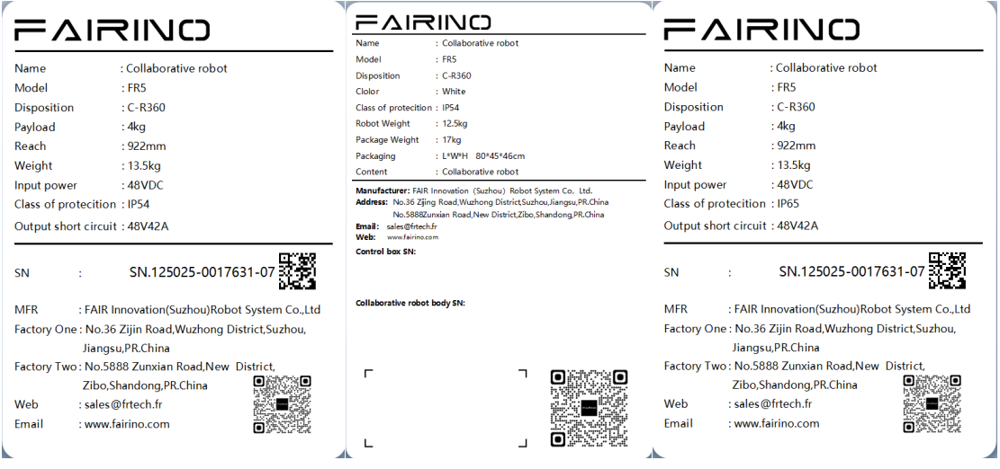

.. centered:: Wykres 3.1-6 Robot współpracujący FR5-C

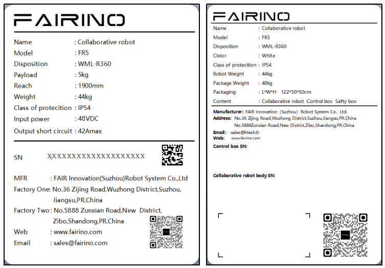

.. centered:: Wykres 3.1-7 Robot współpracujący FR5-WML

.. figure:: installation/004.png
	:align: center
	:width: 6in

.. centered:: Wykres 3.1-8 Robot współpracujący FR10

.. figure:: installation/005.png
	:align: center
	:width: 6in

.. centered:: Wykres 3.1-9 Robot współpracujący FR16

.. figure:: installation/006.png
	:align: center
	:width: 6in

.. centered:: Wykres 3.1-10 Robot współpracujący FR20

.. figure:: installation/007.png
	:align: center
	:width: 6in

.. centered:: Wykres 3.1-11 Robot współpracujący FR30

Skuteczność i odpowiedzialność
~~~~~~~~~~~~~~~~~~~~~~~~~~~~~~

Informacje zawarte w niniejszej instrukcji nie obejmują projektowania, instalacji i obsługi kompletnego zastosowania robota ani wszystkich urządzeń peryferyjnych, które mogą mieć wpływ na bezpieczeństwo tego kompletnego systemu. Projekt i instalacja tego kompletnego systemu muszą być zgodne z wymaganiami bezpieczeństwa określonymi w normach i przepisach kraju, w którym robot jest instalowany.

Integrator FAIRINO jest odpowiedzialny za zapewnienie zgodności z odpowiednimi przepisami krajowymi oraz za zapewnienie, że w kompletnym zastosowaniu robota nie występują żadne istotne zagrożenia. Obejmuje to między innymi:

- Przeprowadzenie oceny ryzyka dla kompletnego systemu robotycznego.
- Podłączenie innych maszyn i dodatkowych urządzeń bezpieczeństwa zdefiniowanych w ocenie ryzyka.
- Ustanowienie odpowiednich ustawień bezpieczeństwa w oprogramowaniu.
- Zapewnienie, że użytkownik nie będzie modyfikować żadnych środków bezpieczeństwa.
- Potwierdzenie, że projekt i instalacja całego systemu robotycznego są prawidłowe.
- Określenie instrukcji użytkowania.
- Umieszczenie na robocie odpowiednich oznaczeń i danych kontaktowych integratora.
- Zebranie całej dokumentacji z plików technicznych, w tym niniejszej instrukcji.

Ograniczona odpowiedzialność
~~~~~~~~~~~~~~~~~~~~~~~~~~~~

Żadnych informacji dotyczących bezpieczeństwa zawartych w niniejszej instrukcji nie należy uważać za ogólne gwarancje bezpieczeństwa robota. Nawet przy przestrzeganiu wszystkich instrukcji bezpieczeństwa nadal może dojść do obrażeń ciała lub uszkodzenia sprzętu.

Symbole ostrzegawcze w tej instrukcji
~~~~~~~~~~~~~~~~~~~~~~~~~~~~~~~~~~~~~

Poniższe symbole określają poziomy zagrożenia opisane w niniejszej instrukcji. Te same symbole ostrzegawcze są używane na produkcie.

.. important:: 
	.. figure:: installation/008.png
		:width: 60
		:height: 50
		:align: left

	Niebezpieczeństwo: Oznacza to zbliżającą się niebezpieczną sytuację związaną z energią elektryczną, która, jeśli nie zostanie uniknięta, może spowodować śmierć lub poważne obrażenia.

.. important:: 
	.. figure:: installation/009.png
		:width: 60
		:height: 50
		:align: left

	Ryzyko porażenia prądem: Oznacza to zbliżającą się niebezpieczną sytuację porażenia prądem, która, jeśli nie zostanie uniknięta, może spowodować śmierć lub poważne obrażenia w wyniku porażenia prądem.

.. important:: 
	.. figure:: installation/010.png
		:width: 60
		:height: 50
		:align: left

	Ryzyko oparzenia: Oznacza to gorącą powierzchnię, która może stwarzać zagrożenie. Jeśli dojdzie do kontaktu, może spowodować obrażenia ciała.

Ocena przed użyciem
~~~~~~~~~~~~~~~~~~~

Przed pierwszym użyciem robota lub po jakiejkolwiek modyfikacji, domyślna prędkość robota jest niższa niż 250 mm/s. Nie należy logować się jako administrator w celu zmiany prędkości na tryb szybki. Po tym należy przeprowadzić następujące testy. Upewnij się, że wszystkie bezpieczne wejścia i wyjścia są prawidłowe i prawidłowo podłączone. Przetestuj wszystkie podłączone bezpieczne wejścia i wyjścia (w tym urządzenia współdzielone przez wiele maszyn lub robotów) pod kątem prawidłowego działania. W tym celu należy:

- Przetestować, czy przyciski i wejścia awaryjnego zatrzymania mogą zatrzymać robota i uruchomić hamulce.

- Przetestować, czy wejścia zabezpieczające mogą zatrzymać ruch robota. Jeśli skonfigurowano resetowanie zabezpieczeń, sprawdzić, czy wymagana jest aktywacja przed wznowieniem ruchu.

- Przetestować, czy tryb pracy umożliwia przełączanie trybów pracy. Patrz ikona w prawym górnym rogu interfejsu użytkownika.

- Przetestować, czy trójpozycyjny przełącznik załączający musi być naciśnięty, aby rozpocząć ruch w trybie ręcznym, oraz czy robot jest pod kontrolą prędkości (funkcja nie jest obsługiwana przed wersją oprogramowania robota V3.0).

- Przetestować, czy wyjście awaryjnego zatrzymania systemu może doprowadzić cały system do stanu bezpiecznego.

Awaryjne zatrzymanie
~~~~~~~~~~~~~~~~~~~~

Przycisk awaryjnego zatrzymania to zatrzymanie kategorii 0. Naciśnięcie przycisku awaryjnego zatrzymania natychmiast zatrzymuje wszelki ruch robota.

Poniższa tabela przedstawia odległości i czasy zatrzymania dla zatrzymania kategorii 0. Pomiary te odpowiadają następującej konfiguracji robota:

- Wyciągnięcie: 100% (ramię robota całkowicie wyciągnięte poziomo)

- Prędkość: 100% (ogólna prędkość robota ustawiona na 100%, ruch z prędkością stawu 180°/s)

- Ładowność: Maksymalna ładowność

Joint 1, Joint 6 testują ruch poziomy robota, oś obrotu prostopadła do podłoża. Joint 2, Joint 3, Joint 4, Joint 5 testują robota poruszającego się po trajektorii pionowej, oś obrotu równoległa do podłoża, zatrzymanie podczas ruchu robota w dół.

.. centered:: Tabela 3.1-1 Odległość zatrzymania kategorii 0 (rad)
.. list-table::
   :widths: 10 15 15 15 15 15 15
   :header-rows: 0
   :class: sheet-center

   * - 
     - **Joint 1**
     - **Joint 2**
     - **Joint 3**
     - **Joint 4**
     - **Joint 5**
     - **Joint 6**

   * - **FR3**
     - 0,47
     - 0,60
     - 0,56
     - 0,29
     - 0,10
     - 0,06

   * - **FR3-WMS**
     - 0,47
     - 0,60
     - 0,56
     - 0,29
     - 0,10
     - 0,06

   * - **FR3-WML**
     - 0,51
     - 0,63
     - 0,60
     - 0,33
     - 0,16
     - 0,10

   * - **FR3-C**
     - 0,47
     - 0,60
     - 0,56
     - 0,29
     - 0,10
     - 0,06

   * - **FR5**
     - 0,51
     - 0,63
     - 0,60
     - 0,33
     - 0,16
     - 0,10

   * - **FR5-C**
     - 0,51
     - 0,63
     - 0,60
     - 0,33
     - 0,16
     - 0,10

   * - **FR10**
     - 0,64
     - 0,70
     - 0,69
     - 0,42
     - 0,25
     - 0,13

   * - **FR16**
     - 0,60
     - 0,67
     - 0,65
     - 0,39
     - 0,22
     - 0,12

   * - **FR20**
     - 0,69
     - 0,75
     - 0,80
     - 0,48
     - 0,31
     - 0,22

.. centered:: Tabela 3.1-2 Czas zatrzymania kategorii 0 (ms)
.. list-table::
   :widths: 10 15 15 15 15 15 15
   :header-rows: 0
   :class: sheet-center

   * - 
     - **Joint 1**
     - **Joint 2**
     - **Joint 3**
     - **Joint 4**
     - **Joint 5**
     - **Joint 6**

   * - **FR3**
     - 400
     - 470
     - 450
     - 280
     - 120
     - 90

   * - **FR3-WMS**
     - 400
     - 470
     - 450
     - 280
     - 120
     - 90

   * - **FR3-WML**
     - 400
     - 470
     - 450
     - 280
     - 120
     - 90

   * - **FR3-C**
     - 400
     - 470
     - 450
     - 280
     - 120
     - 90

   * - **FR5**
     - 420
     - 500
     - 480
     - 310
     - 150
     - 120

   * - **FR5-C**
     - 420
     - 500
     - 480
     - 310
     - 150
     - 120

   * - **FR10**
     - 460
     - 540
     - 510
     - 330
     - 170
     - 140

   * - **FR16**
     - 440
     - 530
     - 490
     - 320
     - 160
     - 130

   * - **FR20**
     - 540
     - 600
     - 700
     - 400
     - 260
     - 170

Po awaryjnym zatrzymaniu wyłącz zasilanie, obróć przycisk awaryjnego zatrzymania i włącz zasilanie, aby ponownie uruchomić robota.

Czasy i odległości zatrzymania dla bezpiecznego zatrzymania robota i zatrzymania miękkim limitem przedstawiono w poniższej tabeli. Pomiary te odpowiadają następującej konfiguracji robota:

- Wyciągnięcie: 100% (ramię robota całkowicie wyciągnięte poziomo)

- Prędkość: 100% (ogólna prędkość robota ustawiona na 100%, ruch z prędkością stawu 180°/s)

- Ładowność: Maksymalna ładowność

Joint 1, Joint 6 testują ruch poziomy robota, oś obrotu prostopadła do podłoża. Joint 2, Joint 3, Joint 4, Joint 5 testują robota poruszającego się po trajektorii pionowej, oś obrotu równoległa do podłoża, zatrzymanie podczas ruchu robota w dół.

.. centered:: Tabela 3.1-3 Odległość bezpiecznego zatrzymania (rad)
.. list-table::
   :widths: 10 15 15 15 15 15 15
   :header-rows: 0
   :class: sheet-center

   * - 
     - **Joint 1**
     - **Joint 2**
     - **Joint 3**
     - **Joint 4**
     - **Joint 5**
     - **Joint 6**

   * - **FR3**
     - 0,49
     - 0,63
     - 0,58
     - 0,32
     - 0,12
     - 0,09

   * - **FR3-WMS**
     - 0,49
     - 0,63
     - 0,58
     - 0,32
     - 0,12
     - 0,09

   * - **FR3-WML**
     - 0,54
     - 0,65
     - 0,63
     - 0,35
     - 0,19
     - 0,12

   * - **FR3-C**
     - 0,49
     - 0,63
     - 0,58
     - 0,32
     - 0,12
     - 0,09

   * - **FR5**
     - 0,54
     - 0,65
     - 0,63
     - 0,35
     - 0,19
     - 0,12

   * - **FR5-C**
     - 0,54
     - 0,65
     - 0,63
     - 0,35
     - 0,19
     - 0,12

   * - **FR10**
     - 0,66
     - 0,73
     - 0,71
     - 0,45
     - 0,27
     - 0,14

   * - **FR16**
     - 0,63
     - 0,69
     - 0,68
     - 0,41
     - 0,25
     - 0,14

   * - **FR20**
     - 0,71
     - 0,78
     - 0,82
     - 0,51
     - 0,33
     - 0,25

.. centered:: Tabela 3.1-4 Czas bezpiecznego zatrzymania (ms)
.. list-table::
   :widths: 10 15 15 15 15 15 15
   :header-rows: 0
   :class: sheet-center

   * - 
     - **Joint 1**
     - **Joint 2**
     - **Joint 3**
     - **Joint 4**
     - **Joint 5**
     - **Joint 6**

   * - **FR3**
     - 410
     - 490
     - 410
     - 300
     - 130
     - 110

   * - **FR3-WMS**
     - 410
     - 490
     - 410
     - 300
     - 130
     - 110

   * - **FR3-WML**
     - 410
     - 490
     - 410
     - 300
     - 130
     - 110

   * - **FR3-C**
     - 410
     - 490
     - 410
     - 300
     - 130
     - 110

   * - **FR5**
     - 450
     - 520
     - 510
     - 330
     - 180
     - 140

   * - **FR5-C**
     - 450
     - 520
     - 510
     - 330
     - 180
     - 140

   * - **FR10**
     - 480
     - 570
     - 530
     - 360
     - 190
     - 170

   * - **FR16**
     - 470
     - 550
     - 520
     - 340
     - 190
     - 150

   * - **FR20**
     - 560
     - 630
     - 720
     - 430
     - 280
     - 200

.. centered:: Tabela 3.1-5 Odległość zatrzymania miękkim limitem (rad)
.. list-table::
   :widths: 10 15 15 15 15 15 15
   :header-rows: 0
   :class: sheet-center

   * - 
     - **Joint 1**
     - **Joint 2**
     - **Joint 3**
     - **Joint 4**
     - **Joint 5**
     - **Joint 6**

   * - **FR3**
     - 0,52
     - 0,65
     - 0,61
     - 0,34
     - 0,15
     - 0,11

   * - **FR3-WMS**
     - 0,52
     - 0,65
     - 0,61
     - 0,34
     - 0,15
     - 0,11

   * - **FR3-WML**
     - 0,56
     - 0,68
     - 0,65
     - 0,38
     - 0,21
     - 0,15

   * - **FR3-C**
     - 0,52
     - 0,65
     - 0,61
     - 0,34
     - 0,15
     - 0,11

   * - **FR5**
     - 0,56
     - 0,68
     - 0,65
     - 0,38
     - 0,21
     - 0,15

   * - **FR5-C**
     - 0,56
     - 0,68
     - 0,65
     - 0,38
     - 0,21
     - 0,15

   * - **FR10**
     - 0,69
     - 0,75
     - 0,74
     - 0,47
     - 0,30
     - 0,18

   * - **FR16**
     - 0,65
     - 0,72
     - 0,70
     - 0,44
     - 0,27
     - 0,17

   * - **FR20**
     - 0,74
     - 0,80
     - 0,85
     - 0,53
     - 0,36
     - 0,27

.. centered:: Tabela 3.1-6 Czas zatrzymania miękkim limitem (ms)
.. list-table::
   :widths: 10 15 15 15 15 15 15
   :header-rows: 0
   :class: sheet-center

   * - 
     - **Joint 1**
     - **Joint 2**
     - **Joint 3**
     - **Joint 4**
     - **Joint 5**
     - **Joint 6**

   * - **FR3**
     - 430
     - 500
     - 430
     - 310
     - 150
     - 120

   * - **FR3-WMS**
     - 430
     - 500
     - 430
     - 310
     - 150
     - 120

   * - **FR3-WML**
     - 430
     - 500
     - 430
     - 310
     - 150
     - 120

   * - **FR3-C**
     - 430
     - 500
     - 430
     - 310
     - 150
     - 120

   * - **FR5**
     - 460
     - 540
     - 520
     - 350
     - 190
     - 160

   * - **FR5-C**
     - 460
     - 540
     - 520
     - 350
     - 190
     - 160

   * - **FR10**
     - 500
     - 580
     - 550
     - 370
     - 210
     - 180

   * - **FR16**
     - 480
     - 570
     - 530
     - 360
     - 200
     - 170

   * - **FR20**
     - 580
     - 640
     - 740
     - 440
     - 300
     - 210

.. important:: 
	Zgodnie z IEC 60204-1 i ISO 13850, urządzenia awaryjnego zatrzymania nie są urządzeniami zabezpieczającymi. Stanowią one dodatkowe środki ochronne i nie służą do zapobiegania obrażeniom.

Ręczne przesuwanie bez napędu elektrycznego
~~~~~~~~~~~~~~~~~~~~~~~~~~~~~~~~~~~~~~~~~~~

Jeśli konieczne jest przesunięcie stawu robota, ale nie można dostarczyć zasilania do robota lub w innych sytuacjach awaryjnych, należy skontaktować się z dystrybutorem robota. W razie potrzeby można użyć siły, aby wymusić ruch robota w celu uwolnienia uwięzionej osoby.

Transport urządzenia
--------------------

Transport
~~~~~~~~~

Robot i skrzynka sterownicza zostały skalibrowane jako kompletny zestaw. Nie należy ich rozdzielać, ponieważ wymagałoby to ponownej kalibracji.

Robot powinien być transportowany tylko w oryginalnym opakowaniu. Jeśli robot ma być przenoszony w przyszłości, należy przechowywać materiał opakowaniowy w suchym miejscu.

Podczas przenoszenia robota z opakowania do przestrzeni montażowej należy jednocześnie podtrzymywać oba ramiona robota. Podtrzymywać robota, aż wszystkie śruby montażowe podstawy robota zostaną dokręcone.

Przenoszenie
~~~~~~~~~~~~

W zależności od modelu robota współpracującego, jego całkowita masa (wraz z opakowaniem) mieści się w zakresie 15 kg - 80 kg. Podczas przenoszenia lub przemieszczania robota współpracującego siłą ludzkich mięśni, do podnoszenia potrzebna jest pomoc kilku osób. Nie zaleca się przenoszenia przez jedną osobę. Podczas transportu należy zachować ostrożność, aby uniknąć przewrócenia się lub zsunięcia urządzenia.

.. warning:: 
	- Jeśli do przenoszenia używany jest profesjonalny sprzęt, robot współpracujący musi być transportowany lub przenoszony przez wykwalifikowany personel z odpowiednimi uprawnieniami za pomocą dźwigu lub wózka widłowego. W przeciwnym razie może to spowodować obrażenia ciała lub inne wypadki.
	- W przypadku przenoszenia ręcznego należy zwrócić uwagę na bezpieczeństwo osobiste podczas transportu.
	- Robot współpracujący zawiera precyzyjne elementy. Należy unikać silnych wibracji lub wstrząsów podczas transportu lub przenoszenia, ponieważ może to obniżyć wydajność urządzenia.

Przechowywanie
~~~~~~~~~~~~~~

Robota współpracującego należy przechowywać w temperaturze od -25 do 60°C, w środowisku bez szronu.

Konserwacja, przeglądy, utylizacja
----------------------------------

Czynności konserwacyjne
~~~~~~~~~~~~~~~~~~~~~~~~

Użytkownik powinien co miesiąc testować awaryjne i ochronne zatrzymanie. Sprawdzać, czy funkcje bezpieczeństwa są skuteczne. Podłączenie awaryjnego i ochronnego zatrzymania można znaleźć w rozdziale dotyczącym podłączeń.

Instrukcja kontroli
~~~~~~~~~~~~~~~~~~~

Wprowadzenie
++++++++++++

Instrukcje bezpieczeństwa
****************************

W niniejszej instrukcji użyto następujących ostrzeżeń, których celem jest zapewnienie bezpieczeństwa osób i sprzętu. Podczas czytania niniejszej instrukcji niezwykle ważne jest przestrzeganie i wykonywanie wszystkich instrukcji montażu i wytycznych zawartych w innych rozdziałach tej instrukcji.

Należy zwrócić szczególną uwagę na tekst związany z symbolami ostrzegawczymi. Przed użyciem należy dokładnie zapoznać się z instrukcją użytkownika. Niniejsza instrukcja służy wyłącznie jako instrukcja serwisowa dla klienta. Personel konserwacyjny musi posiadać odpowiednie kwalifikacje. FAIRINO odmawia wszelkiej odpowiedzialności za operacje wykonywane przez niekwalifikowany personel.

.. note:: Jeśli robot (korpus robota, skrzynka sterownicza, panel operatorski) został uszkodzony, zmieniony lub zmodyfikowany z winy człowieka, FAIRINO odmawia wszelkiej odpowiedzialności. FAIRINO nie ponosi odpowiedzialności za jakiekolwiek uszkodzenia robota lub jakiegokolwiek innego urządzenia spowodowane błędami w programach napisanych przez klienta.

Skuteczność i odpowiedzialność
******************************

Informacje zawarte w niniejszej instrukcji nie obejmują projektowania, instalacji i obsługi kompletnego zastosowania robota ani wszystkich urządzeń peryferyjnych, które mogą mieć wpływ na bezpieczeństwo tego kompletnego systemu. Projekt i instalacja tego kompletnego systemu muszą być zgodne z wymaganiami bezpieczeństwa określonymi w normach i przepisach kraju, w którym robot jest instalowany.

Integrator FAIRINO jest odpowiedzialny za zapewnienie zgodności z odpowiednimi przepisami krajowymi oraz za zapewnienie, że w kompletnym zastosowaniu robota nie występują żadne istotne zagrożenia. Obejmuje to między innymi:

- Przeprowadzenie oceny ryzyka dla kompletnego systemu robotycznego.
- Podłączenie innych maszyn i dodatkowych urządzeń bezpieczeństwa zdefiniowanych w ocenie ryzyka.
- Ustanowienie odpowiednich ustawień bezpieczeństwa w oprogramowaniu.
- Zapewnienie, że użytkownik nie będzie modyfikować żadnych środków bezpieczeństwa.
- Potwierdzenie, że projekt i instalacja całego systemu robotycznego są prawidłowe.
- Określenie instrukcji użytkowania.
- Umieszczenie na robocie odpowiednich oznaczeń i danych kontaktowych integratora.
- Zebranie całej dokumentacji z plików technicznych, w tym niniejszej instrukcji.

Ograniczona odpowiedzialność
****************************

Żadnych informacji dotyczących bezpieczeństwa zawartych w niniejszej instrukcji nie należy uważać za ogólne gwarancje bezpieczeństwa robota. Nawet przy przestrzeganiu wszystkich instrukcji bezpieczeństwa nadal może dojść do obrażeń ciała lub uszkodzenia sprzętu.

Symbole ostrzegawcze
********************

Poniższe symbole określają poziomy zagrożenia opisane w niniejszej instrukcji. Te same symbole ostrzegawcze są używane na produkcie.

.. note:: 
   .. image:: installation/070.png
      :height: 0.75in
      :align: left

   Nazwa: **Niebezpieczeństwo**
     
   Funkcja: Oznacza to zbliżającą się niebezpieczną sytuację związaną z energią elektryczną, która, jeśli nie zostanie uniknięta, może spowodować śmierć lub poważne obrażenia.

.. note:: 
   .. image:: installation/071.png
      :height: 0.75in
      :align: left

   Nazwa: **Ryzyko porażenia prądem**
   
   Funkcja: Oznacza to zbliżającą się niebezpieczną sytuację porażenia prądem, która, jeśli nie zostanie uniknięta, może spowodować śmierć lub poważne obrażenia w wyniku porażenia prądem.

.. note:: 
   .. image:: installation/072.png
      :height: 0.75in
      :align: left

   Nazwa: **Ryzyko oparzenia**
   
   Funkcja: Oznacza to gorącą powierzchnię, która może stwarzać zagrożenie. Jeśli dojdzie do kontaktu, może spowodować obrażenia ciała.

Opis cyfrowych wejść i wyjść skrzynki sterowniczej
~~~~~~~~~~~~~~~~~~~~~~~~~~~~~~~~~~~~~~~~~~~~~~~~~~

Środki ostrożności podczas przełączania funkcji związanych z cyfrowymi wejściami/wyjściami skrzynki sterowniczej
++++++++++++++++++++++++++++++++++++++++++++++++++++++++++++++++++++++++++++++++++++++++++++++++++++++++++++++++++

.. important:: 

  (1) Podczas przełączania funkcji cyfrowych wejść/wyjść należy przestrzegać zasad bezpiecznej obsługi robota, aby zapewnić bezpieczeństwo operatora i sprzętu.
  (2) Podczas pracy robota unikaj przełączania funkcji cyfrowych wejść/wyjść, aby nie zakłócać normalnej pracy robota.
  (3) Przed przystąpieniem do przełączania funkcji cyfrowych wejść/wyjść należy koniecznie odciąć zasilanie robota, aby zapobiec porażeniu prądem i nieoczekiwanemu ruchowi robota, co mogłoby spowodować obrażenia ciała i uszkodzenie sprzętu.
  (4) Przed przełączeniem funkcji należy dokładnie określić wymagania systemu sterowania robota dotyczące cyfrowych wejść/wyjść, w tym typ sygnału, poziom napięcia, zdolność obciążeniową itp.
  (5) Upewnij się, że połączenie między portami cyfrowych wejść/wyjść a urządzeniami zewnętrznymi jest prawidłowe, w tym, czy połączenia są solidne, czy porty pasują itp.
  (6) Unikaj podwójnego przypisywania sygnałów, upewnij się, że przypisanie każdego sygnału jest unikalne.
  (7) Po zakończeniu przypisywania uruchom ponownie system sterowania robota, aby ustawienia zaczęły obowiązywać.
  (8) Po zakończeniu konfiguracji przejdź do interfejsu stanu I/O i sprawdź, czy stan sygnałów cyfrowych wejść/wyjść jest prawidłowy.
  (9) Poprzez rzeczywiste działanie lub napisanie programu testowego zweryfikuj, czy funkcja cyfrowych wejść/wyjść działa prawidłowo.
  (10) Jeśli sygnały cyfrowych wejść/wyjść są związane z logiką programu, sprawdź, czy obsługa tych sygnałów w programie jest prawidłowa.

Opis cyfrowych wejść skrzynki sterowniczej
++++++++++++++++++++++++++++++++++++++++++

Podsumowanie cyfrowych wejść skrzynki sterowniczej
**************************************************

Poniżej wymieniono typy wejść obsługiwane przez cyfrowe wejścia zintegrowanej mini skrzynki sterowniczej robota FAIRINO oraz odpowiadające im schematy połączeń i tabele konfiguracyjne.

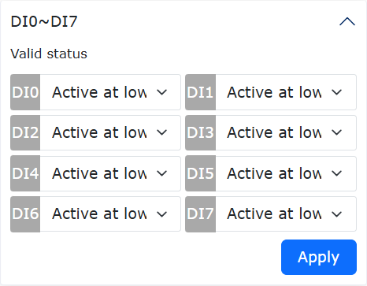

.. centered:: Wykres 3.3-1 Stan aktywny wejść DI0-DI7

.. centered:: Tabela 3.3-1 Tabela konfiguracyjna cyfrowych wejść skrzynki sterowniczej

.. list-table::
   :widths: 15 15 35 10 10 10 10 
   :header-rows: 0
   :align: center

   * - **Typ skrzynki sterowniczej**
     - **Typ wejścia**
     - **Schemat połączeń**
     - **Aktywny wysoki (styk zamknięty)** 
     - **Aktywny wysoki (styk otwarty)** 
     - **Aktywny niski (styk zamknięty)**
     - **Aktywny niski (styk otwarty)**

   * - Skrzynka sterownicza DC
     - Wyjście typu NPN
     - .. figure:: installation/081.png
          :align: center
          :width: 3in
     - Nieaktywny
     - Aktywny
     - Aktywny
     - Nieaktywny

   * - Skrzynka sterownicza AC wąskie napięcie
     - Wyjście typu NPN
     - .. figure:: installation/082.png
          :align: center
          :width: 3in
     - Nieaktywny
     - Aktywny
     - Aktywny
     - Nieaktywny

   * - Skrzynka sterownicza AC szerokie napięcie
     - Wyjście typu NPN
     - .. figure:: installation/083.png
          :align: center
          :width: 3in
     - Nieaktywny
     - Aktywny
     - Aktywny
     - Nieaktywny

   * - Skrzynka sterownicza AC szerokie napięcie
     - Wyjście typu PNP
     - .. figure:: installation/084.png
          :align: center
          :width: 3in
     - Nieaktywny
     - Aktywny
     - Aktywny
     - Nieaktywny

Typy wejść cyfrowych obsługiwane przez skrzynkę sterowniczą
***********************************************************

Cyfrowe wejścia skrzynki sterowniczej DC i skrzynki sterowniczej AC wąskie napięcie obsługują tylko wejścia typu NPN. Cyfrowe wejścia skrzynki sterowniczej AC szerokie napięcie obsługują wejścia typu NPN i PNP, domyślnym trybem fabrycznym jest typ NPN.

.. list-table::
   :widths: 50 50
   :header-rows: 0
   :align: center

   * - **Typ skrzynki sterowniczej**
     - **Typ wejścia**

   * - Skrzynka sterownicza DC
     - Wejście typu NPN

   * - Skrzynka sterownicza AC wąskie napięcie
     - Wejście typu NPN

   * - Skrzynka sterownicza AC szerokie napięcie
     - Wejście typu NPN / Wejście typu PNP

Schemat połączeń cyfrowych wejść skrzynki sterowniczej
******************************************************

Cyfrowe wejścia skrzynki sterowniczej DC i skrzynki sterowniczej AC wąskie napięcie obsługują tylko wejścia typu NPN, a ich schemat połączeń jest następujący.

	.. figure:: installation/085.png
		:align: center
		:width: 6in

	.. centered:: Wykres 3.3-2 Schemat połączeń cyfrowych wejść skrzynki sterowniczej DC i AC wąskie napięcie

Cyfrowe wejścia skrzynki sterowniczej AC szerokie napięcie obsługują wejścia typu NPN i PNP, domyślnym trybem fabrycznym jest typ NPN. Ich schemat połączeń jest następujący:

.. list-table::
   :widths: 50 50
   :header-rows: 0
   :align: center

   * - **Typ wejścia** 
     - **Schemat połączeń**

   * - Wejście typu NPN 
     - 	.. figure:: installation/086.png
          :align: center
          :width: 3in

   * - Wejście typu PNP
     - 	.. figure:: installation/087.png
          :align: center
          :width: 3in

Typ wejścia cyfrowych wejść skrzynki sterowniczej szerokiego napięcia jest określany przez wewnętrzny przełącznik DIP skrzynki sterowniczej. Jeśli użytkownik chce zmienić typ wejścia, należy przestawić przełącznik DIP w odpowiednią pozycję.

.. list-table::
   :widths: 30 30 40
   :header-rows: 0
   :align: center

   * -  
     - Pozycja przełącznika DIP
     - Pozycja fizyczna przełącznika DIP

   * - Wejście typu NPN 
     - EX-24V
     - .. figure:: installation/088.png
          :align: center
          :width: 3in

   * - Wejście typu PNP 
     - EX-0V
     - 	.. figure:: installation/089.png
          :align: center
          :width: 3in

Ustawienia oprogramowania związane z cyfrowymi wejściami skrzynki sterowniczej
******************************************************************************

Pozycją ustawień oprogramowania dotyczących cyfrowych wejść jest tylko „Stan aktywny wejść DI0-DI7”, który określa wartość napięcia poziomu cyfrowego odpowiadającą aktywnemu wykrytemu wejściu. To ustawienie umożliwia użytkownikowi bardziej elastyczne korzystanie z wejść.

	.. figure:: installation/090.png
		:align: center
		:width: 6in

  .. centered:: Wykres 3.3-3 Stan aktywny wejść DI0-DI7

Przy różnych ustawieniach „Stanu aktywnego wejść DI0-DI7” oraz gdy zewnętrzny przełącznik cyfrowego wejścia znajduje się w różnych stanach, tabela stanów aktywnych wykrywanych przez oprogramowanie przedstawia się następująco:

.. centered:: Tabela 3.3-2 Tabela stanów aktywnych

.. list-table::
   :widths: 15 15 15 15 15 15
   :header-rows: 0
   :align: center

   * - **Typ skrzynki sterowniczej** 
     - **Typ wejścia**
     - **Aktywny wysoki (styk zamknięty)**
     - **Aktywny wysoki (styk otwarty)**
     - **Aktywny niski (styk zamknięty)**
     - **Aktywny niski (styk otwarty)**

   * - Skrzynka sterownicza DC
     - Wejście typu NPN
     - Nieaktywny
     - Aktywny
     - Aktywny
     - Nieaktywny

   * - Skrzynka sterownicza AC wąskie napięcie
     - Wejście typu NPN
     - Nieaktywny
     - Aktywny
     - Aktywny
     - Nieaktywny

   * - Skrzynka sterownicza AC szerokie napięcie
     - Wejście typu NPN
     - Nieaktywny
     - Aktywny
     - Aktywny
     - Nieaktywny

   * - Skrzynka sterownicza AC szerokie napięcie
     - Wejście typu PNP
     - Nieaktywny
     - Aktywny
     - Aktywny
     - Nieaktywny

Opis cyfrowych wyjść skrzynki sterowniczej
+++++++++++++++++++++++++++++++++++++++++++

Podsumowanie cyfrowych wyjść skrzynki sterowniczej
**************************************************

Poniżej wymieniono typy wyjść obsługiwane przez cyfrowe wyjścia zintegrowanej mini skrzynki sterowniczej robota FAIRINO oraz odpowiadające im schematy połączeń i tabele konfiguracyjne.

.. figure:: installation/091.png
	:align: center
	:width: 4in

.. centered:: Wykres 3.3-4 Wyjście DO skrzynki sterowniczej podczas zasilania

.. centered:: Tabela 3.3-3 Tabela konfiguracyjna cyfrowych wyjść skrzynki sterowniczej

.. list-table::
   :widths: 10 10 30 10 10 10 10
   :header-rows: 0
   :align: center

   * - **Typ skrzynki sterowniczej**
     - **Typ wejścia**
     - **Schemat połączeń**
     - **Wysoki poziom (ustawienie włączone)** 
     - **Wysoki poziom (ustawienie wyłączone)** 
     - **Niski poziom (ustawienie włączone)**
     - **Niski poziom (ustawienie wyłączone)**

   * - Skrzynka sterownicza DC
     - Wyjście typu NPN
     - 	.. figure:: installation/093.png
          :align: center
          :width: 3in
     - Aktywny 
     - Aktywny
     - Nieaktywny
     - Nieaktywny

   * - Skrzynka sterownicza AC wąskie napięcie
     - Wyjście typu NPN
     - .. figure:: installation/094.png
          :align: center
          :width: 3in
     - Aktywny 
     - Aktywny
     - Nieaktywny
     - Nieaktywny

   * - Skrzynka sterownicza AC szerokie napięcie
     - Wyjście typu NPN
     - .. figure:: installation/095.png
          :align: center
          :width: 3in
     - Aktywny 
     - Aktywny
     - Nieaktywny
     - Nieaktywny

   * - Skrzynka sterownicza AC szerokie napięcie
     - Wyjście typu PNP
     - .. figure:: installation/096.png
          :align: center
          :width: 3in
     - Aktywny 
     - Aktywny
     - Nieaktywny
     - Nieaktywny

.. figure:: installation/092.png
  :align: center
  :width: 4in

.. centered:: Wykres 3.3-5 Stan aktywny wyjść DO0-DO7

.. centered:: Tabela 3.3-4 Tabela konfiguracyjna cyfrowych wyjść skrzynki sterowniczej

.. list-table::
   :widths: 10 10 30 10 10 10 10 
   :header-rows: 0
   :align: center

   * - **Typ skrzynki sterowniczej**
     - **Typ wejścia**
     - **Schemat połączeń**
     - **Aktywny wysoki (ustawienie włączone)**
     - **Aktywny wysoki (ustawienie wyłączone)**
     - **Aktywny niski (ustawienie włączone)**
     - **Aktywny niski (ustawienie wyłączone)**

   * - Skrzynka sterownicza DC
     - Wyjście typu NPN
     - 	.. figure:: installation/093.png
          :align: center
          :width: 3in
     - Aktywny
     - Nieaktywny
     - Nieaktywny
     - Aktywny

   * - Skrzynka sterownicza AC wąskie napięcie
     - Wyjście typu NPN
     - .. figure:: installation/094.png
          :align: center
          :width: 3in
     - Aktywny
     - Nieaktywny
     - Nieaktywny
     - Aktywny

   * - Skrzynka sterownicza AC szerokie napięcie
     - Wyjście typu NPN
     - .. figure:: installation/095.png
          :align: center
          :width: 3in
     - Aktywny
     - Nieaktywny
     - Nieaktywny
     - Aktywny

   * - Skrzynka sterownicza AC szerokie napięcie
     - Wyjście typu PNP
     - .. figure:: installation/096.png
          :align: center
          :width: 3in
     - Aktywny
     - Nieaktywny
     - Nieaktywny
     - Aktywny

Typy wyjść cyfrowych obsługiwane przez skrzynkę sterowniczą
***********************************************************

Cyfrowe wyjścia skrzynki sterowniczej DC i skrzynki sterowniczej AC wąskie napięcie obsługują tylko wyjścia typu NPN. Cyfrowe wyjścia skrzynki sterowniczej AC szerokie napięcie obsługują wyjścia typu NPN i PNP. Ich wyjście ma strukturę push-pull. Wystarczy podłączyć zgodnie z odpowiednim schematem połączeń, nie są wymagane żadne specjalne ustawienia.

.. list-table::
   :widths: 50 50
   :header-rows: 0
   :align: center

   * - **Typ skrzynki sterowniczej**
     - **Typ wejścia**

   * - Skrzynka sterownicza DC
     - Wyjście typu NPN

   * - Skrzynka sterownicza AC wąskie napięcie
     - Wyjście typu NPN

   * - Skrzynka sterownicza AC szerokie napięcie
     - Wyjście typu NPN / Wyjście typu PNP

Schemat połączeń cyfrowych wyjść skrzynki sterowniczej
******************************************************

Cyfrowe wyjścia skrzynki sterowniczej DC i skrzynki sterowniczej AC wąskie napięcie obsługują tylko wyjścia typu NPN, a ich schemat połączeń jest następujący.

	.. figure:: installation/097.png
		:align: center
		:width: 6in

	.. centered:: Wykres 3.3-6 Schemat połączeń cyfrowych wyjść skrzynki sterowniczej DC i AC wąskie napięcie

Cyfrowe wyjścia skrzynki sterowniczej AC szerokie napięcie obsługują typy NPN i PNP. Ich schemat połączeń jest następujący:

.. list-table::
   :widths: 50 50
   :header-rows: 0
   :align: center

   * - **Typ wejścia** 
     - **Schemat połączeń**

   * - Wejście typu NPN 
     - 	.. figure:: installation/098.png
          :align: center
          :width: 3in

   * - Wejście typu PNP
     - 	.. figure:: installation/099.png
          :align: center
          :width: 3in

Ustawienia oprogramowania związane z cyfrowymi wyjściami skrzynki sterowniczej
**************************************************************************************

Pozycje ustawień oprogramowania dotyczących cyfrowych wyjść to „Wyjście DO skrzynki sterowniczej podczas zasilania” oraz „Stan aktywny wyjść DO0-DO7”. „Wyjście DO skrzynki sterowniczej podczas zasilania” określa poziom wyjściowy podczas zasilania skrzynki sterowniczej, gdy system sterowania nie został jeszcze zainicjowany. Może to odpowiadać różnym aktywnym stanom wyjściowym, co pozwala elastycznie radzić sobie z sytuacjami, w których wymagany jest określony stan wyjściowy podczas zasilania. „Stan aktywny wyjść DO0-DO7” określa wartość napięcia wyjściowego, które ma być sterowane, gdy wyjście jest aktywne. To ustawienie umożliwia użytkownikowi bardziej elastyczne korzystanie z wyjść.

(1) Przy różnych ustawieniach „Wyjścia DO skrzynki sterowniczej podczas zasilania”, tabela stanów aktywnych wyjść cyfrowych przedstawia się następująco:

	.. figure:: installation/100.png
		:align: center
		:width: 6in

	.. centered:: Wykres 3.3-7 Wyjście DO skrzynki sterowniczej podczas zasilania

.. centered:: Tabela 3.3-5 Tabela stanów aktywnych

.. list-table::
   :widths: 20 15 15 15 15 15
   :header-rows: 0
   :align: center

   * - **Typ skrzynki sterowniczej** 
     - **Typ wejścia**
     - **Aktywny wysoki (ustawienie włączone)**
     - **Aktywny wysoki (ustawienie wyłączone)**
     - **Aktywny niski (ustawienie włączone)**
     - **Aktywny niski (ustawienie wyłączone)**

   * - Skrzynka sterownicza DC
     - Wyjście typu NPN
     - Aktywny
     - Aktywny
     - Nieaktywny
     - Nieaktywny

   * - Skrzynka sterownicza AC wąskie napięcie
     - Wyjście typu NPN
     - Aktywny
     - Aktywny
     - Nieaktywny
     - Nieaktywny

   * - Skrzynka sterownicza AC szerokie napięcie
     - Wyjście typu NPN
     - Aktywny
     - Aktywny
     - Nieaktywny
     - Nieaktywny

   * - Skrzynka sterownicza AC szerokie napięcie
     - Wyjście typu PNP
     - Aktywny
     - Aktywny
     - Nieaktywny
     - Nieaktywny

(2) Przy różnych ustawieniach „Stanu aktywnego wyjść DO0-DO7”, tabela stanów aktywnych wyjść cyfrowych przedstawia się następująco:

	.. figure:: installation/101.png
		:align: center
		:width: 6in

	.. centered:: Wykres 3.3-8 Stan aktywny wyjść DO0-DO7

.. centered:: Tabela 3.3-6 Tabela stanów aktywnych

.. list-table::
   :widths: 20 15 15 15 15 15
   :header-rows: 0
   :align: center

   * - **Typ skrzynki sterowniczej** 
     - **Typ wejścia**
     - **Aktywny wysoki (ustawienie włączone)**
     - **Aktywny wysoki (ustawienie wyłączone)**
     - **Aktywny niski (ustawienie włączone)**
     - **Aktywny niski (ustawienie wyłączone)**

   * - Skrzynka sterownicza DC
     - Wyjście typu NPN
     - Aktywny
     - Nieaktywny
     - Nieaktywny
     - Aktywny

   * - Skrzynka sterownicza AC wąskie napięcie
     - Wyjście typu NPN
     - Aktywny
     - Nieaktywny
     - Nieaktywny
     - Aktywny

   * - Skrzynka sterownicza AC szerokie napięcie
     - Wyjście typu NPN
     - Aktywny
     - Nieaktywny
     - Nieaktywny
     - Aktywny

   * - Skrzynka sterownicza AC szerokie napięcie
     - Wyjście typu PNP
     - Aktywny
     - Nieaktywny
     - Nieaktywny
     - Aktywny

Podręcznik Bezpieczeństwa Podłączania Zasilania Szafy Sterowniczej DC
++++++++++++++++++++++++++++++++++++++++++++++++++++++++++++++++++++++++++++++++++++++++++++++++++++++++++++++++

Definicja i Identyfikacja Zacisków
************************************************************************************
Panel przedni szafy sterowniczej DC jest wyposażony w 3-stykowe złącze wejścia zasilania, odpowiadające odpowiednio dodatniemu biegunowi zasilania (+V), ujemnemu biegunowi zasilania (-V) i uziemieniu ochronnemu (PE). Aby uniknąć uszkodzenia urządzenia z powodu błędnego podłączenia, należy ściśle przestrzegać poniższej tabeli:

.. list-table::
   :widths: 15 10 35 35
   :header-rows: 0
   :align: center

   * - **Oznaczenie Zacisku** 
     - **Standard Kolorów**
     - **Definicja Funkcji**
     - **Zabronione Operacje**

   * - 	.. figure:: installation/144.png
          :align: center
          :width: 2in
     - Czerwony
     - Wejście dodatnie zasilania DC, tylko dla kabla dodatniego 30-60VDC
     - Zwarcie z PE lub -V jest surowo zabronione

   * - 	.. figure:: installation/145.png
          :align: center
          :width: 2in
     - Czarny
     - Wejście ujemne zasilania DC, tylko dla kabla ujemnego 30-60VDC, tworzy obwód zasilania
     - Połączenie z obudową lub PE jest surowo zabronione

   * - 	.. figure:: installation/146.png
          :align: center
          :width: 2in
     - Żółty (Żółto-Zielony)
     - Zacisk uziemienia ochronnego (bezpieczna masa obudowy)
     - Użycie jako ujemnego lub dodatniego bieguna zasilania jest surowo zabronione

.. warning::
  Ostrzeżenie o Poważnym Ryzyku: To urządzenie nie posiada wbudowanych obwodów zabezpieczenia przed odwrotną polaryzacją, błędnym podłączeniem ani przepięciem. Każda z następujących nieprawidłowych operacji spowoduje natychmiastowe uszkodzenie wewnętrznej płyty głównej i elementów mocy, prowadząc do trwałego, nieodwracalnego uszkodzenia urządzenia:
  
  1. Odwrócona polaryzacja (kable +V i -V zamienione);
  2. +V lub -V błędnie podłączone do gniazda PE;
  3. Zacisk ujemny błędnie uziemiony (-V zwarte z PE);
  4. Podłączenie do prądu przemiennego (110V/220V/380V) lub napięcia stałego poza zakresem 30~60Vdc.

Przygotowania do Bezpiecznego Podłączania
*************************************************************************

Przed podłączeniem operatorzy muszą wykonać następujące przygotowania:

Potwierdzenie Odłączenia Zasilania
""""""""""""""""""""""""""""""""""""""""""""""""""""""""""""""""""""""""""""""

Całkowicie odciąć zasilanie przednie i umieścić tabliczkę ostrzegawczą o bezpieczeństwie. Za pomocą multimetru sprawdzić zaciski wejściowe zasilania, aby potwierdzić brak napięcia i ładunku resztkowego. Nigdy nie wykonywać podłączania przy włączonym zasilaniu.

Kontrola Urządzenia
""""""""""""""""""""""""""""""""""""""""""""""""""""""""""""""""""""""""""""""

Sprawdzić, czy zaciski urządzenia nie są uszkodzone, utlenione lub poluzowane, a obudowa nie jest wilgotna, zalana wodą lub uszkodzona mechanicznie, aby upewnić się, że urządzenie jest w dobrym stanie.

Potwierdzenie Zasilania
""""""""""""""""""""""""""""""""""""""""""""""""""""""""""""""""""""""""""""""

Potwierdzić, że przednie źródło zasilania to zasilacz stabilizowany DC 30-60VDC. Podłączanie do zasilania AC 110V/220V/380V, zasilania DC poniżej 30VDC lub powyżej 60VDC jest surowo zabronione.

Dobór Kabli
""""""""""""""""""""""""""""""""""""""""""""""""""""""""""""""""""""""""""""""

Zaleca się stosowanie elastycznych przewodów miedzianych o przekroju 4mm² (AWG11) lub większym. Długość pojedynczego kabla zasilającego nie powinna przekraczać 2 metrów. Nie używać kabli o zbyt małym przekroju, uszkodzonej izolacji lub zestarzałych.

Dobór Złączy Kablowych
""""""""""""""""""""""""""""""""""""""""""""""""""""""""""""""""""""""""""""""

Końce kabli muszą być zaciśnięte za pomocą izolowanych tulejek zaciskowych (zalecany model: DBV5.5-10 tulejka widełkowa). Wkładanie gołych przewodów miedzianych bezpośrednio do otworów zaciskowych jest surowo zabronione.

Kalibracja Narzędzi
""""""""""""""""""""""""""""""""""""""""""""""""""""""""""""""""""""""""""""""

Przygotować sprawdzony multimetr, izolowany śrubokręt i szczypce do zaciskania. Wcześniej skalibrować multimetr, aby upewnić się, że jego funkcja pomiaru napięcia działa prawidłowo, umożliwiając dokładny pomiar napięcia i rozróżnienie polaryzacji.

Standardowa Procedura Podłączania
************************************************************************************

Zaciskanie Złączy Kablowych
""""""""""""""""""""""""""""""""""""""""""""""""""""""""""""""""""""""""""""""

Za pomocą szczypiec do zaciskania przymocować tulejki zaciskowe (zalecane DBV5.5-10) na jednym końcu każdego z trzech kolorowych kabli: czerwonego (+V), czarnego (-V) i żółto-zielonego (PE). Upewnić się, że zacisk jest mocny, a rdzeń miedziany nie jest odsłonięty. Używanie kabli o tym samym kolorze lub o nieczytelnej identyfikacji kolorów jest surowo zabronione.

Wkładanie i Dokręcanie Wtyczki Zaciskowej
""""""""""""""""""""""""""""""""""""""""""""""""""""""""""""""""""""""""""""""

Włożyć zaciśnięte tulejki do odpowiednich otworów dołączonej wtyczki zaciskowej (zwrócić uwagę na kierunek wkładania, płaska strona tulejki skierowana w stronę styku sprężynowego):
Kabel czerwony → włożyć do otworu +V;
Kabel czarny → włożyć do otworu -V;
Kabel żółto-zielony → włożyć do otworu PE.
Za pomocą izolowanego śrubokrętu płaskiego dokręcić śrubę zaciskową nad każdym otworem w kierunku zgodnym z ruchem wskazówek zegara.

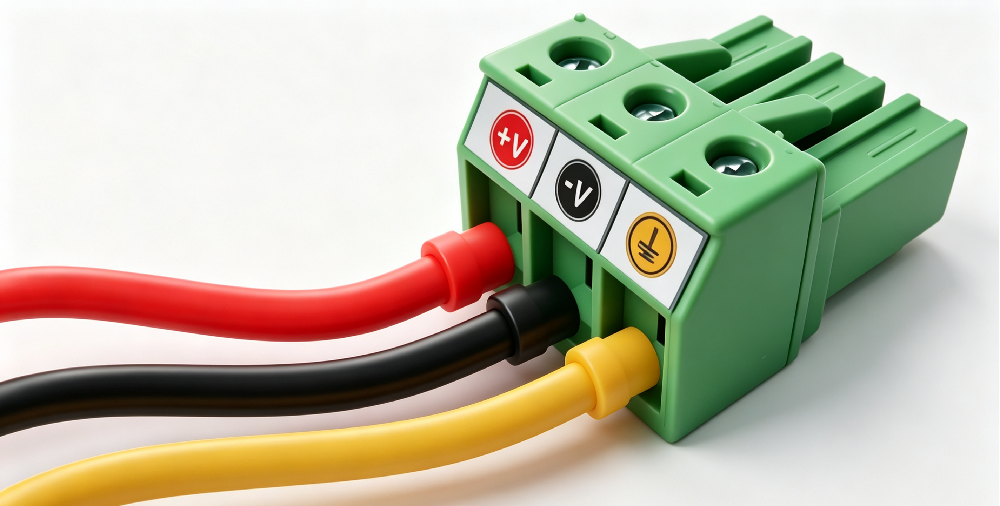

.. centered:: Wiązka kabli z tulejkami zaciskowymi włożona do zielonej wtyczki

Kontrola Siły Naciągu
""""""""""""""""""""""""""""""""""""""""""""""""""""""""""""""""""""""""""""""

Po dokręceniu każdego kabla, pociągnąć go mocno ręką, aby upewnić się, że tulejka nie jest poluzowana, a rdzeń nie wysunął się. W przypadku poluzowania, ponownie zacisnąć tulejkę i dokręcić.

Wkładanie do Szafy Sterowniczej
""""""""""""""""""""""""""""""""""""""""""""""""""""""""""""""""""""""""""""""

Włożyć podłączoną wtyczkę do wejścia zasilania szafy sterowniczej DC, zgodnie z kierunkiem prowadnicy. Upewnić się, że wtyczka jest całkowicie włożona.

.. figure:: installation/148.png
  :align: center
  :width: 3in

.. centered:: Wtyczka z wiązką kabli włożona do wejścia zasilania szafy sterowniczej DC

Końcowa Kontrola Izolacji Przed Włączeniem Zasilania
""""""""""""""""""""""""""""""""""""""""""""""""""""""""""""""""""""""""""""""

Przed podłączeniem zasilania, za pomocą multimetru zmierzyć impedancję między +V a -V na końcu wtyczki, aby potwierdzić brak zwarcia; zmierzyć impedancję między +V/-V a PE, aby potwierdzić, że są w stanie izolacji (rozwarcia).

Uruchomienie i Postępowanie w Przypadku Nieprawidłowości
************************************************************************************

- Normalne Uruchomienie: Zamknąć przedni wyłącznik zasilania i obserwować diodę kontrolną na panelu szafy sterowniczej. Prawidłowym stanem jest stałe świecenie diody, bez nietypowych dźwięków lub zapachów.
- Stan Nieprawidłowy (Natychmiast wyłączyć!): W przypadku silnego piszczenia, dymu, iskier, zapachów lub gdy amperomierz przedniego zasilania natychmiast wskaże przeciążenie, należy natychmiast odłączyć główne zasilanie i nie włączać go ponownie. Skontaktować się z pomocą techniczną po całkowitym ostygnięciu urządzenia. Nie próbować samodzielnie demontować urządzenia w celu kontroli.

.. warning:: Ostateczne Ostrzeżenie: Włączenie zasilania oznacza, że w pełni zrozumiałeś i przestrzegasz powyższych specyfikacji podłączania. W przypadku jakichkolwiek niejasnych oznaczeń, natychmiast skontaktuj się z pomocą techniczną. Nie polegaj na doświadczeniu przy podłączaniu!

Plan przeglądów konserwacyjnych
+++++++++++++++++++++++++++++++

Ramię mechaniczne
*****************

1. Plan przeglądów

Poniżej wymieniono listę kontrolną zalecaną przez FAIRINO do wykonywania w zalecanych odstępach czasu. Jeśli podczas przeglądu okaże się, że stan odpowiednich części jest nieodpowiedni, należy go natychmiast skorygować.

.. note:: F = Kontrola funkcjonalna, V = Kontrola wzrokowa, * = Należy sprawdzić po poważnej kolizji.

.. list-table::
   :widths: 10 40 20 20 20 20
   :header-rows: 0
   :align: center

   * - 
     - **Element do sprawdzenia**
     - **Wymaganie**
     - **Co miesiąc**
     - **Co pół roku**
     - **Co rok**

   * - 1
     - Sprawdź tylną pokrywę stawu*
     - V
     - 
     - ✔
     - 

   * - 2
     - Sprawdź śruby tylnej pokrywy stawu
     - F
     - 
     - ✔
     - 

   * - 3
     - Sprawdź gumowe pierścienie stawu
     - V
     - 
     - ✔
     - 

   * - 4
     - Sprawdź kable robota
     - V
     - 
     - ✔
     - 

   * - 5
     - Sprawdź połączenia kabli robota
     - V
     - 
     - ✔
     - 

   * - 6
     - Sprawdź śruby montażowe podstawy robota*
     - F
     - ✔
     - 
     - 

   * - 7
     - Sprawdź śruby montażowe narzędzia końcowego*
     - F
     - ✔
     - 
     - 

.. figure:: installation/073.png
  :align: center
  :width: 3in

2. Kontrola wzrokowa
   
.. note:: Nigdy nie używaj sprężonego powietrza do czyszczenia ramienia robota, ponieważ może to uszkodzić elementy. Nie przechowuj robota dłużej niż 6 miesięcy bez przeprowadzenia kontroli wzrokowej.

- Jeśli to możliwe, przesuń ramię robota do pozycji zerowej.
- Wyłącz i odłącz przewód zasilający skrzynki sterowniczej.
- Sprawdź kabel między skrzynką sterowniczą a ramieniem robota pod kątem uszkodzeń.
- Sprawdź, czy śruby montażowe podstawy są prawidłowo dokręcone.
- Sprawdź, czy śruby kołnierza narzędziowego są prawidłowo dokręcone.
- Sprawdź, czy pierścienie płaskie nie są zużyte lub uszkodzone.
- Sprawdź wszystkie tylne pokrywy stawów pod kątem pęknięć lub uszkodzeń.
- Sprawdź, czy śruby mocujące tylne pokrywy stawów są na miejscu i prawidłowo dokręcone.

.. note:: Jeśli robot ulegnie uszkodzeniu w okresie gwarancji, skontaktuj się z dystrybutorem, u którego robot został zakupiony.

3. Kontrola funkcjonalna

Celem kontroli funkcjonalnej jest zapewnienie, że śruby, wkręty, narzędzia i ramię mechaniczne nie są poluzowane. Śruby/wkręty wymienione w planie kontroli należy sprawdzić za pomocą klucza dynamometrycznego, a moment dokręcania powinien być zgodny ze standardowymi specyfikacjami. Specyfikacje śrub montażowych ramienia mechanicznego można znaleźć w specyfikacjach instalacji w instrukcji użytkownika.

4. Czyszczenie

Do usunięcia zaobserwowanego kurzu/brudu/oleju z ramienia robota można użyć szmatki i jednego z następujących środków czyszczących: woda, alkohol izopropylowy, 10% etanol lub 10% nafta. Jeśli robot pracuje w trudnych warunkach, takich jak płyn do cięcia, chłodziwo itp., zaleca się regularne czyszczenie lub wymianę gumowych pierścieni.

Nie używaj wybielacza. Nie używaj wybielacza w żadnym rozcieńczonym roztworze czyszczącym. W rzadkich przypadkach można zaobserwować bardzo małe ilości smaru wydobywającego się ze złączy. Nie wpływa to na funkcję, użytkowanie lub żywotność stawu.

Skrzynka sterownicza, panel operatorski, panel przyciskowy
**********************************************************

1. Plan przeglądów

Poniżej wymieniono listę kontrolną zalecaną przez FAIRINO do wykonywania w zalecanych odstępach czasu. Jeśli podczas przeglądu okaże się, że stan odpowiednich części jest nieodpowiedni, należy go natychmiast skorygować.

.. note:: F = Kontrola funkcjonalna, V = Kontrola wzrokowa.

.. list-table::
   :widths: 10 40 20 20 20 20
   :header-rows: 0
   :align: center

   * - 
     - **Element do sprawdzenia**
     - **Wymaganie**
     - **Co miesiąc**
     - **Co pół roku**
     - **Co rok**

   * - 1
     - Sprawdź przycisk awaryjnego zatrzymania na panelu przyciskowym (panel operatorski)
     - F
     - ✔
     - 
     - 

   * - 2
     - Sprawdź funkcje bezpiecznych wejść/wyjść na listwie zaciskowej
     - F
     - ✔
     - 
     - 

   * - 3
     - Sprawdź funkcje uruchamiania/zatrzymywania i przełączania trybu na panelu przyciskowym
     - F
     - ✔
     - 
     - 

   * - 4
     - Sprawdź kabel panelu przyciskowego (panelu operatorskiego)
     - V
     - 
     - ✔
     - 

   * - 5
     - Sprawdź i wyczyść filtr powietrza na skrzynce sterowniczej
     - V
     - ✔
     - 
     - 

   * - 6
     - Sprawdź, czy zaciski skrzynki sterowniczej są solidne
     - F
     - 
     - ✔
     - 

   * - 7
     - Sprawdź rezystancję uziemienia skrzynki sterowniczej ≤ 1 Ω
     - F
     - 
     - 
     - ✔

   * - 8
     - Sprawdź główne zasilanie skrzynki sterowniczej
     - F
     - 
     - 
     - ✔

.. figure:: installation/074.png
  :align: center
  :width: 3in

2. Kontrola wzrokowa

- Odłącz przewód zasilający od skrzynki sterowniczej.
- Sprawdź, czy zaciski płyty sterującej są prawidłowo włożone i czy nie ma poluzowanych przewodów.
- Sprawdź, czy wewnątrz skrzynki sterowniczej nie ma brudu/kurzu. W razie potrzeby wyczyść za pomocą odkurzacza ESD.

.. note:: Nigdy nie używaj sprężonego powietrza do czyszczenia wnętrza skrzynki sterowniczej, ponieważ może to uszkodzić elementy.

3. Kontrola funkcjonalna

.. note:: Funkcje bezpieczeństwa robota są kluczowe. Zaleca się comiesięczne testowanie w celu zapewnienia prawidłowego działania.

- Przycisk awaryjnego zatrzymania na panelu operatorskim/panelu przyciskowym:
  
  A. Naciśnij przycisk awaryjnego zatrzymania na panelu operatorskim/panelu przyciskowym.
  B. Obserwuj, czy robot zatrzymuje się i czy zasilanie stawów jest wyłączone.
  C. Włącz ponownie zasilanie robota.

	.. figure:: installation/075.png
		:align: center
		:width: 4in

	.. figure:: installation/076.png
		:align: center
		:width: 4in

- Inne bezpieczne wejścia i wyjścia nadal działają
  
  Sprawdź, które bezpieczne wejścia i wyjścia są aktywne i czy mogą być wyzwalane przez PolyScope lub urządzenia zewnętrzne.

- Data i zegar
  
  Sprawdź, czy data i zegar na karcie „Dziennik” są prawidłowe. Nieprawidłowa data i zegar wskazują na niski poziom baterii CMOS. Bateria CMOS ma żywotność do 5 lat.

- Sprawdź, czy zatrzaski listwy zaciskowej są prawidłowo zablokowane
  
  .. figure:: installation/077.png
    :align: center
    :width: 4in

4. Czyszczenie
   
- Panel operatorski
  
  Może wymagać czyszczenia ekranu panelu operatorskiego. Zaleca się używanie standardowych, łagodnych środków czyszczących przeznaczonych do użytku przemysłowego, które nie zawierają rozcieńczalników ani żadnych agresywnych dodatków. Nie używaj szorstkich materiałów do wycierania ekranu. FAIRINO nie promuje żadnych konkretnych środków czyszczących.

- Panel przyciskowy panelu operatorskiego
  
  Regularne czyszczenie nie jest wymagane w normalnych warunkach. Jeśli oznaczenia przycisków staną się nieczytelne i utrudnią identyfikację, w każdej chwili można je wyczyścić środkiem czyszczącym.

- Skrzynka sterownicza
  
  Skrzynka sterownicza zawiera dwa filtry, po jednym z każdej strony skrzynki sterowniczej.

  A. Stan filtrów można sprawdzić przez otwory wentylacyjne po lewej i prawej stronie skrzynki sterowniczej. W normalnych warunkach widoczna jest struktura plastra miodu filtra.
  B. Wyjmij filtr do czyszczenia. Użyj niskociśnieniowego powietrza do czyszczenia lub wymień filtr w razie potrzeby. Pamiętaj o wyczyszczeniu każdej strony. Jeśli filtr jest bardzo brudny lub uszkodzony, wymień go (w celu wymiany należy zdjąć górną pokrywę kontrolera i wymienić filtr od wewnątrz górnej pokrywy).
  C. Podczas pracy posłuchaj dźwięku wentylatora. Jeśli dźwięk jest nieprawidłowy, skontaktuj się z dostawcą usług lub wymień.

Karta rejestracji przeglądów
****************************

1. Ramię mechaniczne
  
.. list-table::
   :widths: 40 20 20 20 40
   :header-rows: 0
   :align: center

   * - **Element do sprawdzenia**
     - **Sprawdzono**
     - **Inspektor**
     - **Data**
     - **Uwagi**

   * - **Sprawdź tylną pokrywę stawu**
     - 
     - 
     - 
     - 

   * - **Sprawdź śruby tylnej pokrywy stawu**
     - 
     - 
     - 
     - 

   * - **Sprawdź gumowe pierścienie stawu**
     - 
     - 
     - 
     - 

   * - **Sprawdź kable robota**
     - 
     - 
     - 
     - 

   * - **Sprawdź połączenia kabli robota**
     - 
     - 
     - 
     - 

   * - **Sprawdź śruby montażowe podstawy robota**
     - 
     - 
     - 
     - 

   * - **Sprawdź śruby montażowe narzędzia robota**
     - 
     - 
     - 
     - 
  
2. Skrzynka sterownicza, panel operatorski, panel przyciskowy

.. list-table::
   :widths: 40 20 20 20 40
   :header-rows: 0
   :align: center

   * - **Element do sprawdzenia**
     - **Sprawdzono**
     - **Inspektor**
     - **Data**
     - **Uwagi**

   * - **Sprawdź przycisk awaryjnego zatrzymania na panelu przyciskowym (panel operatorski)**
     - 
     - 
     - 
     - 

   * - **Sprawdź funkcje bezpiecznych wejść/wyjść na listwie zaciskowej**
     - 
     - 
     - 
     - 

   * - **Sprawdź funkcje uruchamiania/zatrzymywania i przełączania trybu na panelu przyciskowym**
     - 
     - 
     - 
     - 

   * - **Sprawdź kabel panelu przyciskowego (panelu operatorskiego)**
     - 
     - 
     - 
     - 

   * - **Sprawdź i wyczyść filtr powietrza na skrzynce sterowniczej**
     - 
     - 
     - 
     - 

   * - **Sprawdź, czy zaciski skrzynki sterowniczej są solidne**
     - 
     - 
     - 
     - 

   * - **Sprawdź rezystancję uziemienia skrzynki sterowniczej ≤ 1 Ω**
     - 
     - 
     - 
     - 

   * - **Sprawdź główne zasilanie skrzynki sterowniczej**
     - 
     - 
     - 
     - 

Utylizacja
~~~~~~~~~~

Roboty FR należy utylizować zgodnie z obowiązującymi przepisami i normami krajowymi. Szczegółowe informacje można uzyskać u producenta.

Specyfikacje instalacji
-----------------------

Instalacja ramienia robota
~~~~~~~~~~~~~~~~~~~~~~~~~~

.. important:: 
	Zaleca się, aby podstawa montażowa robota spełniała następujące wymagania, zapewniając solidne i stabilne zamocowanie robota:
   
	(1) Podstawa montażowa robota musi być wystarczająco wytrzymała i mieć odpowiednią nośność. Powinna wytrzymać co najmniej 5-krotność ciężaru robota i co najmniej 10-krotność momentu obrotowego osi 1.

	(2) Powierzchnia podstawy montażowej robota powinna być płaska, aby zapewnić ścisły kontakt z powierzchnią robota.

	(3) Podstawa montażowa robota powinna być wystarczająco sztywna, solidnie zamocowana i nie może rezonować z robotem.

	(4) Gdy robot i inne elementy poruszają się jednocześnie, podstawa montażowa powinna być odizolowana od innych ruchomych części, nie należy ich mocować razem, aby uniknąć zakłóceń wibracyjnych podczas ruchu.

	(5) Jeśli robot jest zainstalowany na ruchomej platformie lub zewnętrznej osi, przyspieszenie ruchomej platformy lub zewnętrznej osi powinno być tak niskie, jak to możliwe.

.. warning:: 
	Należy unikać następujących sposobów instalacji:

	(I) Unikaj mocowania robota do innych ruchomych urządzeń.

	.. figure:: installation/064.png
		:align: center
		:width: 3in

	.. centered:: Wykres 3.4-1 Unikanie instalacji na innych ruchomych urządzeniach

	Upewnij się, że ramię robota jest prawidłowo i bezpiecznie zamocowane. Niestabilna instalacja może prowadzić do wypadków.

.. note:: 
	Można zakupić precyzyjną podstawę jako akcesorium. Wykresy 3.4-2, 3.4-5, 3.4-8, 3.4-11 pokazują lokalizacje otworów kołkowych i śrub montażowych.

Wymagania instalacji ramienia robota FR3/FR3-WMS/FR3-WML/FR3-C/FR5-C
+++++++++++++++++++++++++++++++++++++++++++++++++++++++++++++++++++++

Podczas montażu robota na podstawie montażowej należy użyć 4 śrub M6 o klasie wytrzymałości nie niższej niż 8.8, aby zamocować robota na podstawie montażowej. Śruby należy dokręcić momentem nie mniejszym niż 10 Nm. Zaleca się użycie dwóch otworów kołkowych o średnicy 5 mm na podstawie montażowej w połączeniu z kołkami do pozycjonowania robota, aby zwiększyć dokładność montażu robota i zapobiec przemieszczaniu się robota spowodowanemu kolizjami. Gdy robot ma wysokie wymagania co do dokładności działania, należy obowiązkowo dodać kołki do pozycjonowania robota.

.. figure:: installation/025.png
	:align: center
	:width: 6in

.. centered:: Wykres 3.4-2 Wymiary instalacji robota współpracującego FR3/FR3-WMS/FR3-WML/FR3-C/FR5-C

.. important:: 
	W zależności od scenariusza zastosowania zaleca się następujące podstawy montażowe robota:

	(I) W przypadku zastosowań, w których prędkość ruchu nie jest zbyt duża, wymagania dotyczące precyzji są średnie, a montaż do podłogi jest niewygodny, zaleca się następującą podstawę montażową robota:

	.. figure:: installation/062.png
		:align: center
		:width: 3in

	.. centered:: Wykres 3.4-3 Podstawa montażowa robota o niskich wymaganiach dla FR3/FR3-WMS/FR3-WML/FR3-C/FR5-C

	(II) W przypadku zastosowań, w których prędkość ruchu jest stosunkowo duża, a wymagania dotyczące precyzji są wysokie, zaleca się następującą podstawę montażową robota i zamocowanie robota na solidnym podłożu:

	.. figure:: installation/067.png
		:align: center
		:width: 3in

	.. centered:: Wykres 3.4-4 Podstawa montażowa robota o wysokich wymaganiach dla FR3/FR3-WMS/FR3-WML/FR3-C/FR5-C

Wymagania instalacji ramienia robota FR5
++++++++++++++++++++++++++++++++++++++++

Podczas montażu robota na podstawie montażowej należy użyć 4 śrub M8 o klasie wytrzymałości nie niższej niż 8.8, aby zamocować robota na podstawie montażowej. Śruby należy dokręcić momentem nie mniejszym niż 20 Nm. Zaleca się użycie dwóch otworów kołkowych o średnicy 8 mm na podstawie montażowej w połączeniu z kołkami do pozycjonowania robota, aby zwiększyć dokładność montażu robota i zapobiec przemieszczaniu się robota spowodowanemu kolizjami. Gdy robot ma wysokie wymagania co do dokładności działania, należy obowiązkowo dodać kołki do pozycjonowania robota.

.. figure:: installation/026.png
	:align: center
	:width: 6in

.. centered:: Wykres 3.4-5 Wymiary instalacji robota współpracującego FR5

.. important:: 
	W zależności od scenariusza zastosowania zaleca się następujące podstawy montażowe robota:

	(I) W przypadku zastosowań, w których prędkość ruchu nie jest zbyt duża, wymagania dotyczące precyzji są średnie, a montaż do podłogi jest niewygodny, zaleca się następującą podstawę montażową robota:

	.. figure:: installation/062.png
		:align: center
		:width: 3in

	.. centered:: Wykres 3.4-6 Podstawa montażowa robota o niskich wymaganiach dla FR5

	(II) W przypadku zastosowań, w których prędkość ruchu jest stosunkowo duża, a wymagania dotyczące precyzji są wysokie, zaleca się następującą podstawę montażową robota i zamocowanie robota na solidnym podłożu:

	.. figure:: installation/067.png
		:align: center
		:width: 3in

	.. centered:: Wykres 3.4-7 Podstawa montażowa robota o wysokich wymaganiach dla FR5

Wymagania instalacji ramienia robota FR10, FR16
+++++++++++++++++++++++++++++++++++++++++++++++

Podczas montażu robota na podstawie montażowej należy użyć 4 śrub M8 o klasie wytrzymałości nie niższej niż 8.8, aby zamocować robota na podstawie montażowej. Śruby należy dokręcić momentem nie mniejszym niż 25 Nm. Zaleca się użycie dwóch otworów kołkowych o średnicy 8 mm na podstawie montażowej w połączeniu z kołkami do pozycjonowania robota, aby zwiększyć dokładność montażu robota i zapobiec przemieszczaniu się robota spowodowanemu kolizjami. Gdy robot ma wysokie wymagania co do dokładności działania, należy obowiązkowo dodać kołki do pozycjonowania robota.

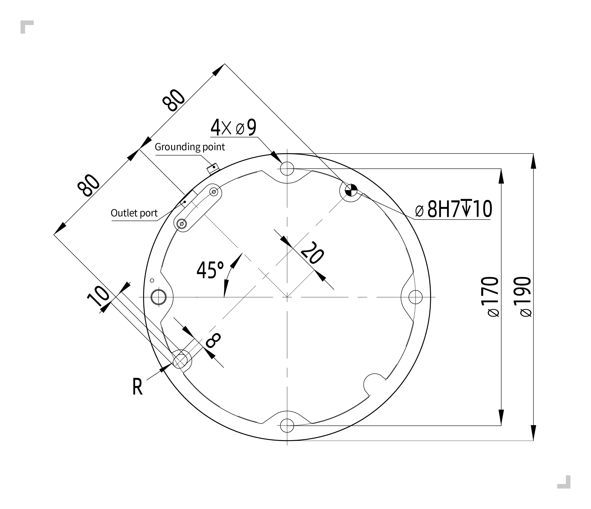

.. centered:: Wykres 3.4-8 Wymiary instalacji robota współpracującego FR10, FR16

.. important:: 
	W zależności od scenariusza zastosowania zaleca się następujące podstawy montażowe robota:

	(I) W przypadku zastosowań, w których prędkość ruchu nie jest zbyt duża, wymagania dotyczące precyzji są średnie, a montaż do podłogi jest niewygodny, zaleca się następującą podstawę montażową robota:

	.. figure:: installation/065.png
		:align: center
		:width: 3in

	.. centered:: Wykres 3.4-9 Podstawa montażowa robota o niskich wymaganiach dla FR10, FR16

	(II) W przypadku zastosowań, w których prędkość ruchu jest stosunkowo duża, a wymagania dotyczące precyzji są wysokie, zaleca się następującą podstawę montażową robota i zamocowanie robota na solidnym podłożu:

	.. figure:: installation/067.png
		:align: center
		:width: 3in

	.. centered:: Wykres 3.4-10 Podstawa montażowa robota o wysokich wymaganiach dla FR10, FR16

Wymagania instalacji ramienia robota FR20, FR30
++++++++++++++++++++++++++++++++++++++++++++++++++++++

Podczas montażu robota na podstawie montażowej należy użyć 6 śrub M10 o klasie wytrzymałości nie niższej niż 8.8, aby zamocować robota na podstawie montażowej. Śruby należy dokręcić momentem nie mniejszym niż 45 Nm. Zaleca się użycie dwóch otworów kołkowych o średnicy 8 mm na podstawie montażowej w połączeniu z kołkami do pozycjonowania robota, aby zwiększyć dokładność montażu robota i zapobiec przemieszczaniu się robota spowodowanemu kolizjami. Gdy robot ma wysokie wymagania co do dokładności działania, należy obowiązkowo dodać kołki do pozycjonowania robota.

.. figure:: installation/029.png
	:align: center
	:width: 6in

.. centered:: Wykres 3.4-11 Wymiary instalacji robota współpracującego FR20, FR30

.. important:: 

	Ze względu na dużą masę własną i duży moment bezwładności robotów FR20 i FR30, zaleca się mocowanie ich bezpośrednio do podłoża. Zalecana podstawa jest następująca:

	.. figure:: installation/066.png
		:align: center
		:width: 3in

	.. centered:: Wykres 3.4-12 Podstawa montażowa robota FR20, FR30

Instalacja narzędzia końcowego
~~~~~~~~~~~~~~~~~~~~~~~~~~~~~~

Kołnierz narzędziowy robota ma cztery gwintowane otwory M6, które służą do mocowania narzędzia do robota. Śruby M6 należy dokręcić momentem 8 Nm, a ich klasa wytrzymałości nie może być niższa niż 8.8. Aby dokładnie ponownie ustawić narzędzie, należy użyć kołków w przewidzianych otworach kołkowych o średnicy 6 mm.

.. figure:: installation/030.png
	:align: center
	:width: 6in

.. centered:: Wykres 3.4-13 Rysunek kołnierza końcowego robota FR3/FR3-WMS/FR3-WML/FR3-C/FR5/FR5-C/FR10/FR16

.. figure:: installation/031.png
	:align: center
	:width: 6in

.. centered:: Wykres 3.4-14 Rysunek kołnierza końcowego robota FR20/FR30

.. important:: 
	- Upewnij się, że narzędzie jest prawidłowo i bezpiecznie zamocowane.
	- Upewnij się, że konstrukcja narzędzia jest bezpieczna i żadne części nie mogą spaść, powodując zagrożenie.
	- Wkręcanie śrub M6 na długość większą niż 8 mm w górny kołnierz robota może spowodować uszkodzenie kołnierza narzędziowego i nieodwracalne uszkodzenia, co będzie wymagało wymiany kołnierza narzędziowego.

Środowisko instalacji
~~~~~~~~~~~~~~~~~~~~~

Podczas instalacji i użytkowania robota współpracującego należy upewnić się, że spełnione są następujące wymagania:

- Temperatura otoczenia 0-45°C

- Wilgotność 0%~90% RH (bez kondensacji)

- Brak wstrząsów mechanicznych i wibracji

- Wysokość poniżej 2000 m npm

- Brak gazów korozyjnych, cieczy, gazów wybuchowych, oleju, mgły solnej, kurzu lub pyłu metalicznego, materiałów radioaktywnych, hałasu elektromagnetycznego, łatwopalnych przedmiotów

- Unikaj pracy urządzenia w niestabilnych warunkach prądowych

- Użytkownik musi zainstalować wyłącznik nadprądowy przed zasilaczem robota i zaleca się dodanie filtra EMC.

.. note:: 
	Jeśli robot współpracujący ma być montowany na suficie lub na ścianie pionowej, skontaktuj się z nami.

Nośność podłogi
~~~~~~~~~~~~~~~

Zamontuj robota na solidnej powierzchni, która jest wystarczająco wytrzymała, aby utrzymać co najmniej 5-krotność ciężaru ramienia robota, a powierzchnia ta nie może być podatna na wibracje.

Krzywe obciążenia dla wszystkich modeli
~~~~~~~~~~~~~~~~~~~~~~~~~~~~~~~~~~~~~~~

Omówienie
+++++++++++++

Krzywe obciążenia omawiane w tej sekcji są oparte na testach przeprowadzonych na poszczególnych modelach na określonych trajektoriach. Krzywe obciążenia dla poszczególnych modeli mają część „Pełna wydajność” i „Rozszerzona zdolność obciążenia”, co następuje:

(1) Środowisko pracy dla „Pełnej wydajności” to: współczynnik kompensacji tarcia każdego stawu = 1; poziom kolizji każdego stawu = 10; ustawienie 100% prędkości roboczej i przyspieszenia 360 deg/s² w interfejsie sieciowym; dynamika 2.0. W tym środowisku część „Pełna wydajność” krzywej obciążenia jest odpowiednia dla zdecydowanej większości trajektorii.
(2) Jeśli obciążenie końcowe znajduje się w obszarze „Rozszerzonej zdolności obciążenia”, należy włączyć „Tryb optymalny czasowo” i spełnić ograniczenia przyspieszenia lub zmniejszyć zakres roboczy robota.

Objaśnienie parametrów
++++++++++++++++++++++

Znamionowa ładowność robota zależy od przesunięcia środka ciężkości ładunku. Przesunięcie środka ciężkości jest definiowane jako odległość między środkiem kołnierza końcowego a środkiem ciężkości dodatkowego ładunku.

Krzywa obciążenia robota współpracującego FR3
*********************************************

Robot współpracujący FR3 może przenosić maksymalnie 5 kg obciążenia, a jego ładowność znamionowa wynosi 3 kg. Krzywa obciążenia przedstawiono na rysunku. Szczegółowe znaczenie krzywej obciążenia jest następujące:

(1) FR3 przy pełnej wydajności może przenosić obciążenie do 3 kg włącznie, patrz „Niebieska linia obwiedni”.
(2) Gdy obciążenie wynosi od 3 kg do 5 kg, jest to rozszerzona zdolność obciążenia, patrz „Czerwona linia obwiedni”. W tym stanie robot może działać w następujących warunkach:

  ① Włącz „Tryb optymalny czasowo”, zaleca się ustawienie przyspieszenia poniżej 360 deg/s².

  ② Zmniejsz zakres roboczy robota lub zmniejsz prędkość roboczą.

.. figure:: installation/032.png
	:align: center
	:width: 5in

.. centered:: Wykres 3.4-15 Krzywa obciążenia robota współpracującego FR3

Krzywa obciążenia robota współpracującego FR3-WMS
*************************************************

Robot współpracujący FR3-WMS może przenosić maksymalnie 5 kg obciążenia, a jego ładowność znamionowa wynosi 3 kg. Krzywa obciążenia przedstawiono na rysunku. Szczegółowe znaczenie krzywej obciążenia jest następujące:

(1) FR3-WMS przy pełnej wydajności może przenosić obciążenie do 3 kg włącznie, patrz „Niebieska linia obwiedni”.
(2) Gdy obciążenie wynosi od 3 kg do 5 kg, jest to rozszerzona zdolność obciążenia, patrz „Czerwona linia obwiedni”. W tym stanie robot może działać w następujących warunkach:

  ① Włącz „Tryb optymalny czasowo”, zaleca się ustawienie przyspieszenia poniżej 360 deg/s².

  ② Zmniejsz zakres roboczy robota lub zmniejsz prędkość roboczą.

.. figure:: installation/109.png
	:align: center
	:width: 5in

.. centered:: Wykres 3.4-16 Krzywa obciążenia robota współpracującego FR3-WMS

Krzywa obciążenia robota współpracującego FR3-WML
*************************************************

Robot współpracujący FR3-WML może przenosić maksymalnie 4 kg obciążenia, a jego ładowność znamionowa wynosi 3 kg. Krzywa obciążenia przedstawiono na rysunku. Szczegółowe znaczenie krzywej obciążenia jest następujące:

(1) FR3-WMS przy pełnej wydajności może przenosić obciążenie do 3 kg włącznie, patrz „Niebieska linia obwiedni”.
(2) Gdy obciążenie wynosi od 3 kg do 4 kg, jest to rozszerzona zdolność obciążenia, patrz „Czerwona linia obwiedni”. W tym stanie robot może działać w następujących warunkach:

  ① Włącz „Tryb optymalny czasowo”, zaleca się ustawienie przyspieszenia poniżej 360 deg/s².

  ② Zmniejsz zakres roboczy robota lub zmniejsz prędkość roboczą.

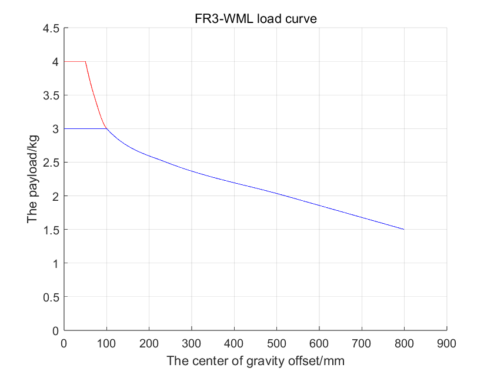

.. centered:: Wykres 3.4-17 Krzywa obciążenia robota współpracującego FR3-WML

Krzywa obciążenia robota współpracującego FR3-C
***********************************************

Robot współpracujący FR3-C może przenosić maksymalnie 5 kg obciążenia, a jego ładowność znamionowa wynosi 3 kg. Krzywa obciążenia przedstawiono na rysunku. Szczegółowe znaczenie krzywej obciążenia jest następujące:

(1) FR3-WMS przy pełnej wydajności może przenosić obciążenie do 3 kg włącznie, patrz „Niebieska linia obwiedni”.
(2) Gdy obciążenie wynosi od 3 kg do 5 kg, jest to rozszerzona zdolność obciążenia, patrz „Czerwona linia obwiedni”. W tym stanie robot może działać w następujących warunkach:

  ① Włącz „Tryb optymalny czasowo”, zaleca się ustawienie przyspieszenia poniżej 360 deg/s².

  ② Zmniejsz zakres roboczy robota lub zmniejsz prędkość roboczą.

.. figure:: installation/111.png
	:align: center
	:width: 5in

.. centered:: Wykres 3.4-18 Krzywa obciążenia robota współpracującego FR3-C

Krzywa obciążenia robota współpracującego FR5
*********************************************

Robot współpracujący FR5 może przenosić maksymalnie 7 kg obciążenia, a jego ładowność znamionowa wynosi 5 kg. Krzywa obciążenia przedstawiono na rysunku. Szczegółowe znaczenie krzywej obciążenia jest następujące:

(1) FR5 przy pełnej wydajności może przenosić obciążenie do 5 kg włącznie, patrz „Niebieska linia obwiedni”.
(2) Gdy obciążenie wynosi od 5 kg do 7 kg, jest to rozszerzona zdolność obciążenia, patrz „Czerwona linia obwiedni”. W tym stanie robot może działać w następujących warunkach:

  ① Włącz „Tryb optymalny czasowo”, zaleca się ustawienie przyspieszenia poniżej 360 deg/s².

  ② Zmniejsz zakres roboczy robota lub zmniejsz prędkość roboczą.

.. figure:: installation/033.png
	:align: center
	:width: 5in

.. centered:: Wykres 3.4-19 Krzywa obciążenia robota współpracującego FR5

Krzywa obciążenia robota współpracującego FR5-WML
*************************************************

Robot współpracujący FR5-WML może przenosić maksymalnie 7 kg obciążenia, a jego ładowność znamionowa wynosi 5 kg. Krzywa obciążenia przedstawiono na rysunku. Szczegółowe znaczenie krzywej obciążenia jest następujące:

(1) Obszar w „Niebieskiej linii obwiedni” to pełna wydajność: może działać na zdecydowanej większości trajektorii przy współczynniku kompensacji tarcia 1, dynamice 2.0, 100% prędkości, przyspieszeniu 360 deg/s² (tryb konserwacji).
(2) Obszar w „Czerwonej linii obwiedni” to rozszerzona zdolność obciążenia, może działać w następujących warunkach:

  ① Włącz „Tryb optymalny czasowo”.

  ② Zmniejsz zakres roboczy robota lub zmniejsz prędkość roboczą.

.. figure:: installation/127.png
	:align: center
	:width: 5in

.. centered:: Wykres 3.4-20 Krzywa obciążenia robota współpracującego FR5-WML

Krzywa obciążenia robota współpracującego FR5-C
***********************************************

Robot współpracujący FR5-C może przenosić maksymalnie 5 kg obciążenia, a jego ładowność znamionowa wynosi 4 kg. Krzywa obciążenia przedstawiono na rysunku jako „Pełna wydajność”.

.. figure:: installation/130.png
	:align: center
	:width: 5in

.. centered:: Wykres 3.4-21 Krzywa obciążenia robota współpracującego FR5-C

Krzywa obciążenia robota współpracującego FR10
**********************************************

Robot współpracujący FR10 może przenosić maksymalnie 14 kg obciążenia, a jego ładowność znamionowa wynosi 10 kg. Krzywa obciążenia przedstawiono na rysunku 3. Szczegółowe znaczenie krzywej obciążenia jest następujące:

(1) FR10 przy pełnej wydajności może przenosić obciążenie do 10 kg włącznie, patrz „Niebieska linia obwiedni”.
(2) Gdy obciążenie wynosi od 10 kg do 14 kg, jest to rozszerzona zdolność obciążenia, patrz „Czerwona linia obwiedni”. W tym stanie robot może działać w następujących warunkach:

  ① Włącz „Tryb optymalny czasowo”, zaleca się ustawienie przyspieszenia poniżej 180 deg/s².

  ② Zmniejsz zakres roboczy robota lub zmniejsz prędkość roboczą.

.. figure:: installation/034.png
	:align: center
	:width: 5in

.. centered:: Wykres 3.4-22 Krzywa obciążenia robota współpracującego FR10

Krzywa obciążenia robota współpracującego FR16
**********************************************

Robot współpracujący FR16 może przenosić maksymalnie 20 kg obciążenia, a jego ładowność znamionowa wynosi 16 kg. Krzywa obciążenia przedstawiono na rysunku. Szczegółowe znaczenie krzywej obciążenia jest następujące:

(1) FR16 przy pełnej wydajności może przenosić obciążenie do 16 kg włącznie, patrz „Niebieska linia obwiedni”.
(2) Gdy obciążenie wynosi od 16 kg do 20 kg, jest to rozszerzona zdolność obciążenia, patrz „Czerwona linia obwiedni”. W tym stanie robot może działać w następujących warunkach:

  ① Włącz „Tryb optymalny czasowo”, zaleca się ustawienie przyspieszenia poniżej 180 deg/s².

  ② Zmniejsz zakres roboczy robota lub zmniejsz prędkość roboczą.

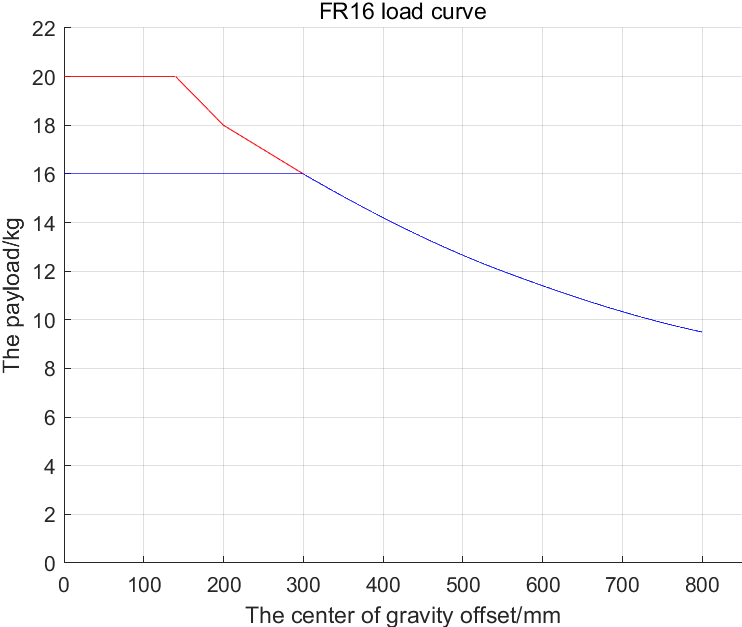

.. centered:: Wykres 3.4-23 Krzywa obciążenia robota współpracującego FR16

Krzywa obciążenia robota współpracującego FR20
**********************************************

Robot współpracujący FR20 może przenosić maksymalnie 25 kg obciążenia, a jego ładowność znamionowa wynosi 20 kg. Krzywa obciążenia przedstawiono na rysunku. Szczegółowe znaczenie krzywej obciążenia jest następujące:

(1) FR20 przy pełnej wydajności może przenosić obciążenie do 20 kg włącznie, patrz „Niebieska linia obwiedni”.
(2) Gdy obciążenie wynosi od 20 kg do 25 kg, jest to rozszerzona zdolność obciążenia, patrz „Czerwona linia obwiedni”. W tym stanie robot może działać w następujących warunkach:

  ① Włącz „Tryb optymalny czasowo”, zaleca się ustawienie przyspieszenia poniżej 150 deg/s².

  ② Zmniejsz zakres roboczy robota lub zmniejsz prędkość roboczą.

.. figure:: installation/036.png
	:align: center
	:width: 5in

.. centered:: Wykres 3.4-24 Krzywa obciążenia robota współpracującego FR20

Krzywa obciążenia robota współpracującego FR30
**********************************************

Robot współpracujący FR30 może przenosić maksymalnie 35 kg obciążenia, a jego ładowność znamionowa wynosi 30 kg. Krzywa obciążenia przedstawiono na rysunku.

(1) FR30 przy pełnej wydajności może przenosić obciążenie do 30 kg włącznie, patrz „Niebieska linia obwiedni”.
(2) Gdy obciążenie wynosi od 30 kg do 35 kg, jest to rozszerzona zdolność obciążenia, patrz „Czerwona linia obwiedni”. W tym stanie robot może działać w następujących warunkach:

  ① Włącz „Tryb optymalny czasowo”, zaleca się ustawienie przyspieszenia poniżej 150 deg/s².

  ② Zmniejsz zakres roboczy robota lub zmniejsz prędkość roboczą.

.. figure:: installation/069.png
	:align: center
	:width: 5in

.. centered:: Wykres 3.4-25 Krzywa obciążenia robota współpracującego FR30

Połączenia sterowania
---------------------

Interfejsy kontrolera
~~~~~~~~~~~~~~~~~~~~~

Roboty tej serii mogą być wyposażone w trzy różne skrzynki sterownicze z różnymi wejściami zasilania. Szczegółowe informacje na temat wejścia zasilania skrzynki sterowniczej znajdują się na tabliczce znamionowej skrzynki sterowniczej. Robot wymaga uziemienia elektrycznego.

.. list-table::
   :widths: 20 40 40
   :header-rows: 0
   :align: center

   * - 
     - **Maksymalne wejście (do konfiguracji mocy przedwzmacniacza przez klienta)**
     - **Maksymalne wyjście (maksymalna wartość szczytowa)**

   * - **DC 2 kW**
     - 30-60 V DC / 30 A
     - 2000 W / 48 V DC / 41 A

   * - **DC 5 kW**
     - 30-60 V DC / 40 A
     - 5000 W / 48 V DC / 104 A

   * - **AC wąskie napięcie 2 kW**
     - 176-264 V DC / 10 A / jednofazowe / 50 Hz
     - 2000 W / 48 V DC / 41 A

   * - **AC szerokie napięcie 2 kW**
     - 100-240 V DC / 10 A / jednofazowe / 50-60 Hz
     - 2000 W / 48 V DC / 41 A

   * - **AC szerokie napięcie 5 kW**
     - 100-240 V DC / 16 A / jednofazowe / 50-60 Hz
     - 5000 W / 48 V DC / 104 A

.. warning:: 
	Przed przystąpieniem do podłączania należy koniecznie upewnić się, że zasilanie jest wyłączone, i umieścić w pobliżu tabliczkę ostrzegawczą.

Zewnętrzne połączenia systemu sterowania ramieniem tej serii są wykonywane za pomocą wtyczek, które można podłączyć i szybko zainstalować. Panel podłączenia robota współpracującego przedstawiono na poniższym rysunku.

- Upewnij się, że przycisk zasilania skrzynki sterowniczej jest wyłączony (przycisk ustawiony na 0), a następnie podłącz przewód zasilający do gniazda zasilania.

- Podłącz kabel zasilający głównego ramienia robota do złącza zasilania głównego skrzynki sterowniczej.

- Podłącz wtyczkę lotniczą panelu przyciskowego do złącza panelu operatorskiego skrzynki sterowniczej.

- Otwory wentylacyjne po obu stronach skrzynki sterowniczej – zachowaj odległość co najmniej 15 cm.

- Przód skrzynki sterowniczej (blacha użytkownika, przycisk zasilania, wiązki główne i panelu operatorskiego) – zachowaj odległość co najmniej 25 cm.

- Skrzynkę sterowniczą umieść na wysokości 0,6-1,5 m nad podłogą.

- Użytkownik nie może samodzielnie wymieniać kabli zasilających.

.. figure:: installation/037.png
	:align: center
	:width: 6in

.. centered:: Wykres 3.5-1 Schemat podłączenia robota

Panel I/O kontrolera
~~~~~~~~~~~~~~~~~~~~

Możesz używać I/O w skrzynce sterowniczej do sterowania różnymi urządzeniami, w tym przekaźnikami pneumatycznymi, PLC i przyciskami ograniczników. Wykres 3.5-2 przedstawia grupę złączy elektrycznych skrzynki sterowniczej, a wykres 3.5-3 przedstawia grupę złączy elektrycznych zintegrowanej mini skrzynki sterowniczej (mini BOX).

.. figure:: installation/038.png
	:align: center
	:width: 6in

.. centered:: Wykres 3.5-2 Schemat złączy elektrycznych skrzynki sterowniczej

.. figure:: installation/039.png
	:align: center
	:width: 6in

.. centered:: Wykres 3.5-3 Schemat złączy elektrycznych zintegrowanej mini skrzynki sterowniczej (mini BOX)

Grupa złączy sieciowych RJ45
~~~~~~~~~~~~~~~~~~~~~~~~~~~~

Adresy grupy złączy sieciowych w skrzynce sterowniczej przedstawiono na poniższym rysunku. Należy pamiętać, że rysunek ten odpowiada kolejności adresów wewnętrznych portów sieciowych skrzynki sterowniczej. Zabrania się odłączania domyślnych portów robota. Port użytkownika może być używany do komunikacji z urządzeniami takimi jak kamery. Jego adres IP to 192.168.57.2. Złącze panelu przyciskowego jest domyślnie portem sterowania panelu operatorskiego, a jego adres IP to 192.168.58.2. Użyj kabla sieciowego, aby połączyć złącze panelu przyciskowego z komputerem. Ustaw adres IP komputera na 192.168.58.10 lub w tej samej podsieci. Otwórz przeglądarkę Google Chrome i wprowadź 192.168.58.2, aby uzyskać dostęp do strony panelu operatorskiego. W skrzynce sterowniczej Easy Manufacturing dostęp do strony panelu operatorskiego uzyskuje się przez port sieciowy podłączony do panelu przyciskowego.

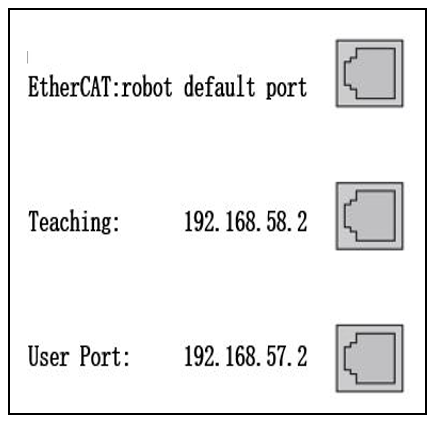

.. centered:: Wykres 3.5-4 Schemat grupy złączy sieciowych

Płyta końcowa
~~~~~~~~~~~~~

Możesz używać I/O płyty końcowej i interfejsu komunikacyjnego 485 do sterowania różnymi urządzeniami, w tym przekaźnikami pneumatycznymi, PLC i przyciskami awaryjnego zatrzymania. Rozmieszczenie pinów i ich opis przedstawiono na poniższym rysunku. Złącze I/O to złącze M12, 8-stykowe, gniazdo żeńskie.

.. note:: Zabrania się podłączania na gorąco I/O płyty końcowej i interfejsu 485.

.. figure:: installation/041.png
	:align: center
	:width: 3in

.. centered:: Wykres 3.5-5 Schemat złączy elektrycznych płyty końcowej

Opis uziemienia
~~~~~~~~~~~~~~~

1. Punkt uziemienia skrzynki sterowniczej znajduje się przy śrubie kombinowanej M4 w lewym górnym rogu przełącznika zasilania, jak pokazano na poniższym rysunku.

.. figure:: installation/042.png
	:align: center
	:width: 8in

.. centered:: Wykres 3.5-6 Schemat uziemienia skrzynki sterowniczej

1. Punkt uziemienia korpusu znajduje się po prawej stronie miejsca wyjścia kabla z podstawy, jak pokazano na poniższym rysunku.

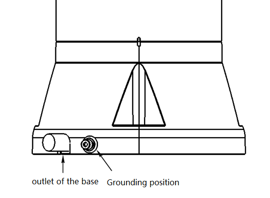

.. centered:: Wykres 3.5-7 Schemat uziemienia korpusu

Pojedynczy przewód ochronny nie powinien mieć mniejszego przekroju niż:

- 2,5 mm² miedzi lub 16 mm² aluminium, jeśli zapewniono ochronę przed uszkodzeniami mechanicznymi (kanały kablowe, rury itp.)
- 4 mm² miedzi lub 16 mm² aluminium, jeśli nie zapewniono ochrony przed uszkodzeniami mechanicznymi

Ogólne specyfikacje dla wszystkich cyfrowych wejść/wyjść
~~~~~~~~~~~~~~~~~~~~~~~~~~~~~~~~~~~~~~~~~~~~~~~~~~~~~~~~

Niniejsza sekcja określa specyfikacje elektryczne dla 24-woltowych cyfrowych wejść/wyjść następujących skrzynek sterowniczych:

- Bezpieczne wejścia/wyjścia

- Ogólne cyfrowe wejścia/wyjścia

Robot musi być instalowany zgodnie ze specyfikacjami elektrycznymi.

Konfigurując interfejs „Zasilanie i komunikacja” można użyć wewnętrznego lub zewnętrznego zasilania 24 V do zasilania cyfrowych wejść/wyjść. Dwa górne zaciski tego interfejsu (ex24V i exon) to 24 V i masa zewnętrznego zasilania, a dwa dolne zaciski (24V i GND) to 24 V i masa wewnętrznego zasilania. Domyślną konfiguracją jest użycie zasilania wewnętrznego. Skrzynkę sterowniczą i zintegrowaną mini skrzynkę sterowniczą (mini BOX) pokazano na poniższym rysunku.

.. figure:: installation/044.png
	:align: center
	:width: 3in

.. centered:: Skrzynka sterownicza

.. figure:: installation/134.png
	:align: center
	:width: 3in

.. centered:: Zintegrowana mini skrzynka sterownicza (mini BOX)
.. centered:: Wykres 3.5-8 Schemat zasilania i komunikacji 01

Jeśli moc obciążenia jest duża, można podłączyć zewnętrzne zasilanie, jak pokazano na poniższym rysunku. W zintegrowanej mini skrzynce sterowniczej (mini BOX) o szerokim zakresie napięcia AC, zewnętrzne zasilanie jest połączone z masą wewnętrznego zasilania.

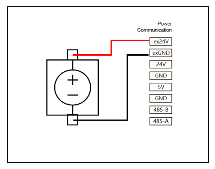

.. centered:: Skrzynka sterownicza

.. figure:: installation/135.png
	:align: center
	:width: 3in

.. centered:: Zintegrowana mini skrzynka sterownicza (mini BOX)
.. centered:: Wykres 3.5-9 Schemat zasilania i komunikacji 02

Specyfikacje elektryczne zasilania wewnętrznego i zewnętrznego przedstawiono w poniższej tabeli:

.. centered:: Tabela 3.5-1 Specyfikacje elektryczne zasilania wewnętrznego i zewnętrznego
.. list-table::
   :widths: 30 20 10 10 10 10
   :header-rows: 0
   :align: center

   * - **Zacisk**
     - **Parametr**
     - **Wartość minimalna**
     - **Wartość typowa**
     - **Wartość maksymalna**
     - **Jednostka**

   * - | Wewnętrzne zasilanie 24 V
       | [ex24V -exGND]
       | [ex24V -exGND]
     - | 
       | Napięcie
       | Prąd
     - | 
       | 23
       | 0
     - | 
       | 24
       | -
     - | 
       | 25
       | 2
     - | 
       | V
       | A

   * - | Wewnętrzne zasilanie 24 V
       | [24V- GND]
       | [24V- GND]
     - | 
       | Napięcie
       | Prąd
     - | 
       | 23
       | 0
     - | 
       | 24
       | -
     - | 
       | 25
       | 1,5
     - | 
       | V
       | A

Specyfikacje elektryczne cyfrowych wejść/wyjść przedstawiono w poniższej tabeli:

.. centered:: Tabela 3.5-2 Specyfikacje elektryczne cyfrowych wejść/wyjść
.. list-table::
   :widths: 30 20 10 10 10 10
   :header-rows: 0
   :align: center

   * - **Zacisk**
     - **Parametr**
     - **Wartość minimalna**
     - **Wartość typowa**
     - **Wartość maksymalna**
     - **Jednostka**

   * - | Wyjście cyfrowe
       | [COx/DOx]
       | [COx/DOx]
       | [COx/DOx]
     - | 
       | Prąd
       | Spadek napięcia
       | Prąd upływu
     - | 
       | 0
       | 0
       | 0
     - | 
       | -
       | -
       | -
     - | 
       | 1
       | 0,5
       | 0,1
     - | 
       | A
       | V
       | mA

   * - [COx/DOx]
     - Funkcja
     - | -
     - NPN
     - | -
     - Typ

   * - | Wejście cyfrowe
       | [EIx/SIx/CIx/DIx]
       | [EIx/SIx/CIx/DIx]
       | [EIx/SIx/CIx/DIx]
     - | 
       | OFF
       | ON
       | Prąd (11~30 A)
     - | 
       | -3
       | 11
       | 2
     - | 
       | -
       | -
       | -
     - | 
       | 5
       | 30
       | 15
     - | 
       | V
       | V
       | mA

   * - [EIx/SIx/CIx/DIx]
     - Funkcja
     - | -
     - NPN
     - | -
     - Typ

Specyfikacje elektryczne obciążenia pojedynczego wyjścia cyfrowego DO przedstawiono w poniższej tabeli:

.. centered:: Tabela 3.5-3 Specyfikacje elektryczne obciążenia pojedynczego wyjścia cyfrowego DO

.. list-table::
   :widths: 30 20 20 30
   :header-rows: 0
   :align: center

   * - **Typ skrzynki sterowniczej** 
     - **Typ wyjścia DO**
     - **Typ zasilania**
     - **Maksymalna wartość obciążenia dla pojedynczego DO**

   * - Skrzynka sterownicza DC / AC wąskie napięcie
     - Wyjście typu NPN
     - Zewnętrzne zasilanie 24 V
     - | 1-4 kanały: 400 mA
       | 5-8 kanałów: 250 mA
       | 9-16 kanałów: 125 mA

   * - Skrzynka sterownicza DC / AC wąskie napięcie
     - Wyjście typu NPN
     - Wewnętrzne zasilanie 24 V
     - | 1-4 kanały: 300 mA
       | 5-8 kanałów: 190 mA
       | 9-16 kanałów: 90 mA

   * - Skrzynka sterownicza AC szerokie napięcie
     - Wyjście typu NPN/PNP
     - Zewnętrzne zasilanie 24 V
     - | 1-2 kanały: 200 mA
       | 3-8 kanałów: 100 mA
       | 9-16 kanałów: 60 mA

   * - Skrzynka sterownicza AC szerokie napięcie
     - Wyjście typu NPN/PNP
     - Wewnętrzne zasilanie 24 V
     - | 1-2 kanały: 200 mA
       | 3-8 kanałów: 100 mA
       | 9-16 kanałów: 60 mA

Bezpieczne wejścia/wyjścia
~~~~~~~~~~~~~~~~~~~~~~~~~~

Niniejsza sekcja opisuje specyfikacje elektryczne bezpiecznych wejść/wyjść. Należy przestrzegać ogólnych specyfikacji elektrycznych z sekcji 3.5.6.

Urządzenia i sprzęt bezpieczeństwa muszą być instalowane zgodnie z instrukcjami bezpieczeństwa i oceną ryzyka, patrz rozdział 3.1. Wszystkie bezpieczne wejścia/wyjścia są sparowane (nadmiarowe) i muszą być prowadzone jako dwie niezależne gałęzie. Pojedyncza usterka nie powinna prowadzić do utraty funkcji bezpieczeństwa.

Bezpieczne wejścia/wyjścia obejmują awaryjne zatrzymanie i bezpieczne zatrzymanie. Wejścia awaryjnego zatrzymania są używane wyłącznie do urządzeń awaryjnego zatrzymania, a wejścia bezpiecznego zatrzymania są używane do różnych urządzeń ochronnych związanych z bezpieczeństwem. Różnice w funkcjach przedstawiono w poniższej tabeli:

.. centered:: Tabela 3.5-3 Różnice funkcji
.. list-table::
   :widths: 50 80 80
   :header-rows: 0
   :align: center

   * - 
     - **Awaryjne zatrzymanie**
     - **Bezpieczne zatrzymanie**

   * - **Robot zatrzymuje ruch**
     - Tak
     - Tak

   * - **Kategoria zatrzymania**
     - Kategoria 0
     - Kategoria 1

   * - **Wykonywanie programu P**
     - Zatrzymanie
     - Wstrzymanie

   * - **Zasilanie robota**
     - Wyłączone
     - Włączone

   * - **Ponowne uruchomienie**
     - Ręczne
     - Automatyczne lub ręczne

   * - **Częstotliwość użytkowania**
     - Rzadka
     - Częsta

   * - **Wymagana ponowna inicjalizacja**
     - Wymagana
     - Niewymagana

.. warning:: 
	- Nigdy nie podłączaj sygnałów bezpieczeństwa do PLC, który nie ma odpowiedniego poziomu bezpieczeństwa. Nieprzestrzeganie tego ostrzeżenia może spowodować poważne obrażenia lub śmierć, ponieważ jedna z funkcji bezpiecznego zatrzymania może zostać pominięta. Sygnały interfejsu bezpieczeństwa muszą być oddzielone od sygnałów normalnego interfejsu I/O.
	- Wszystkie bezpieczne wejścia/wyjścia są zbudowane w sposób nadmiarowy (dwa niezależne kanały). Oba kanały muszą być prowadzone oddzielnie, aby pojedyncza usterka nie spowodowała utraty funkcji bezpieczeństwa.
	- Przed uruchomieniem robota należy zweryfikować funkcję bezpieczeństwa awaryjnego zatrzymania (robot zasilony i załączony, naciśnij przycisk awaryjnego zatrzymania, robot zatrzymuje się i odłącza zasilanie, wyłącz zasilanie, obróć przycisk awaryjnego zatrzymania, włącz zasilanie, robot zostaje ponownie załączony). Funkcje bezpieczeństwa muszą być regularnie testowane.
	- Instalacja robota musi być zgodna z tymi specyfikacjami. W przeciwnym razie może dojść do poważnych obrażeń lub śmierci, ponieważ funkcja bezpiecznego zatrzymania może zostać pominięta.

W poniższych podrozdziałach podano kilka przykładów użycia bezpiecznych wejść/wyjść.

**Domyślna konfiguracja bezpieczeństwa**
Robot jest dostarczany z domyślną konfiguracją, umożliwiającą działanie bez żadnych dodatkowych urządzeń zabezpieczających. Patrz poniższy wykres:

.. figure:: installation/049.png
	:align: center
	:width: 3in

.. centered:: Skrzynka sterownicza

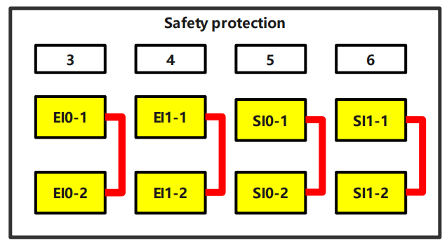

.. centered:: Zintegrowana mini skrzynka sterownicza (mini BOX)
.. centered:: Wykres 3.5-10 Schemat zabezpieczeń 01

**Podłączanie dodatkowego przycisku awaryjnego zatrzymania**
W większości zastosowań wymagany jest jeden lub więcej dodatkowych przycisków awaryjnego zatrzymania. Patrz poniższy wykres:

.. figure:: installation/050.png
	:align: center
	:width: 3in

.. centered:: Skrzynka sterownicza

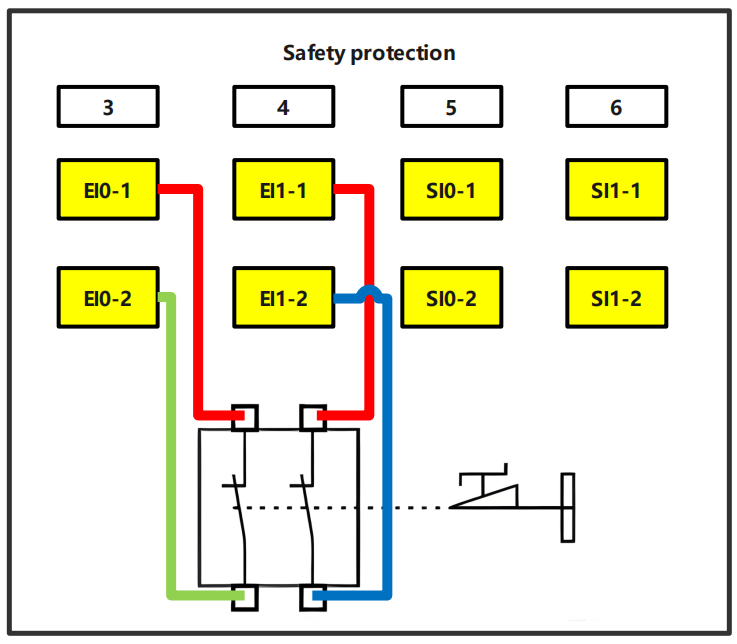

.. centered:: Zintegrowana mini skrzynka sterownicza (mini BOX)
.. centered:: Wykres 3.5-11 Schemat zabezpieczeń 02

**Podłączanie przycisku bezpiecznego zatrzymania**
Przykładem urządzenia bezpiecznego zatrzymania jest wyłącznik drzwi, który zatrzymuje robota po otwarciu drzwi. Patrz poniższy wykres:

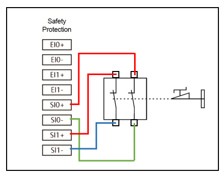

.. centered:: Skrzynka sterownicza

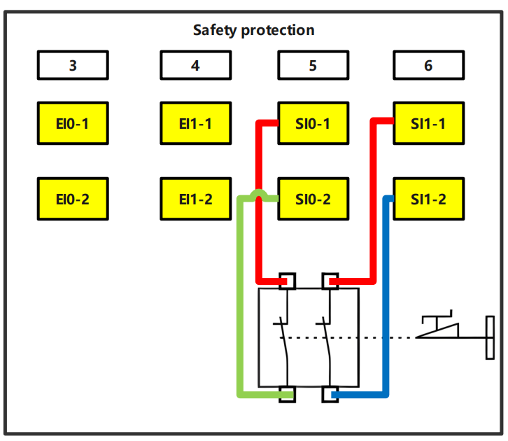

.. centered:: Zintegrowana mini skrzynka sterownicza (mini BOX)
.. centered:: Wykres 3.5-12 Schemat zabezpieczeń 03

Ogólne cyfrowe wejścia/wyjścia
~~~~~~~~~~~~~~~~~~~~~~~~~~~~~~

Niniejsza sekcja opisuje specyfikacje elektryczne ogólnych cyfrowych wejść/wyjść. Należy przestrzegać ogólnych specyfikacji elektrycznych z sekcji 3.5.6.

Ogólne cyfrowe wejścia/wyjścia mogą być używane do sterowania urządzeniami takimi jak przekaźniki, zawory elektromagnetyczne lub do interakcji z innymi PLC.

**Sterowanie obciążeniem za pomocą wyjścia cyfrowego**

Ten przykład pokazuje, jak podłączyć wyjście cyfrowe do sterowania obciążeniem. Patrz poniższy wykres:

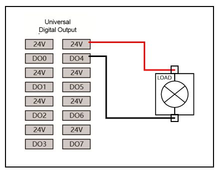

.. centered:: Skrzynka sterownicza

.. figure:: installation/139.png
	:align: center
	:width: 6in

.. centered:: Zintegrowana mini skrzynka sterownicza (mini BOX)
.. centered:: Wykres 3.5-13 Schemat ogólnego wyjścia cyfrowego 01

Wejścia cyfrowe z przycisków
~~~~~~~~~~~~~~~~~~~~~~~~~~~~

Poniższy przykład pokazuje, jak podłączyć prosty przycisk do wejścia cyfrowego.

.. figure:: installation/053.png
	:align: center
	:width: 3in

.. centered:: Skrzynka sterownicza

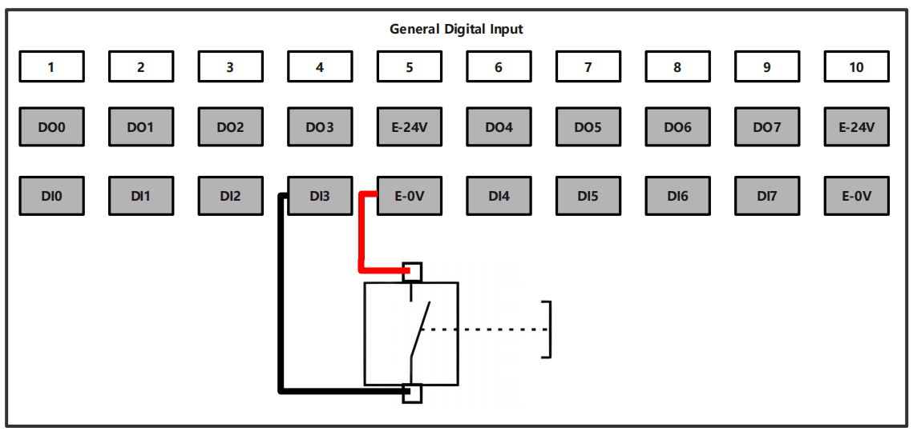

.. centered:: Zintegrowana mini skrzynka sterownicza (mini BOX)
.. centered:: Wykres 3.5-14 Schemat ogólnego wyjścia cyfrowego 02

Interakcja z innymi urządzeniami lub PLC
~~~~~~~~~~~~~~~~~~~~~~~~~~~~~~~~~~~~~~~~

Poniższy przykład pokazuje, jak przeprowadzać interakcję cyfrowych wejść/wyjść z innymi urządzeniami lub PLC.

.. figure:: installation/054.png
	:align: center
	:width: 6in

.. centered:: Skrzynka sterownicza

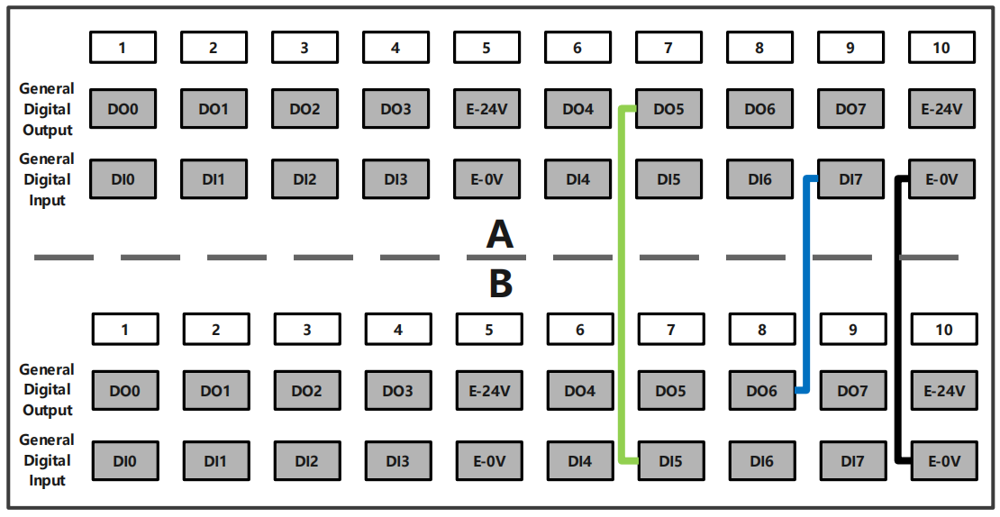

.. centered:: Zintegrowana mini skrzynka sterownicza (mini BOX)
.. centered:: Wykres 3.5-15 Schemat interakcji z innymi urządzeniami lub PLC

Analogowe wejścia/wyjścia
~~~~~~~~~~~~~~~~~~~~~~~~~

.. centered:: Tabela 3.5-4 Prąd i napięcie analogowe
.. list-table::
   :widths: 30 20 10 10 10 10
   :header-rows: 0
   :align: center

   * - **Zacisk**
     - **Parametr**
     - **Wartość minimalna**
     - **Wartość typowa**
     - **Wartość maksymalna**
     - **Jednostka**

   * - | Wejście prądu analogowego
       | [AIx-END]
       | [AIx-END]
       | [AIx-END]
     - | 
       | Prąd
       | Impedancja
       | Rozdzielczość
     - | 
       | 0
       | -
       | -
     - | 
       | -
       | 500
       | 12
     - | 
       | 20
       | -
       | -
     - | 
       | mA
       | Ω
       | bit

   * - | Wejście napięcia analogowego
       | [AIx-END]
       | [AIx-END]
       | [AIx-END]
     - | 
       | Napięcie
       | Impedancja
       | Rozdzielczość
     - | 
       | 0
       | -
       | -
     - | 
       | -
       | 510
       | 12
     - | 
       | 10
       | -
       | -
     - | 
       | V
       | kΩ
       | bit

   * - | Wyjście prądu analogowego
       | [AOx-END]
       | [AOx-END]
       | [AOx-END]
     - | 
       | Prąd
       | Napięcie
       | Rozdzielczość
     - | 
       | 0
       | 0
       | -
     - | 
       | -
       | -
       | 12
     - | 
       | 20
       | 10
       | -
     - | 
       | mA
       | V
       | bit

   * - | Wyjście napięcia analogowego
       | [AOx-END]
       | [AOx-END]
       | [AOx-END]
       | [AOx-END]
     - | 
       | Napięcie
       | Prąd
       | Impedancja
       | Rozdzielczość
     - | 
       | 0
       | 0
       | -
       | -
     - | 
       | -
       | -
       | 100
       | 12
     - | 
       | 10
       | 20
       | -
       | -
     - | 
       | V
       | mA
       | Ω
       | bit

Analogowe wejścia/wyjścia służą do ustawiania lub mierzenia napięcia (0-10 V) lub prądu (0-20 mA) innych urządzeń.

Aby osiągnąć wysoką precyzję, zaleca się stosowanie następujących metod.

- Urządzenie i skrzynka sterownicza używają tej samej masy (GND).
- Używaj kabli ekranowanych lub skrętek.

Poniższy przykład pokazuje, jak używać analogowych wejść/wyjść.

**Używanie wyjścia analogowego**

Poniższy przykład pokazuje użycie wyjścia analogowego do sterowania taśmociągiem.

.. figure:: installation/056.png
	:align: center
	:width: 3in

.. centered:: Skrzynka sterownicza

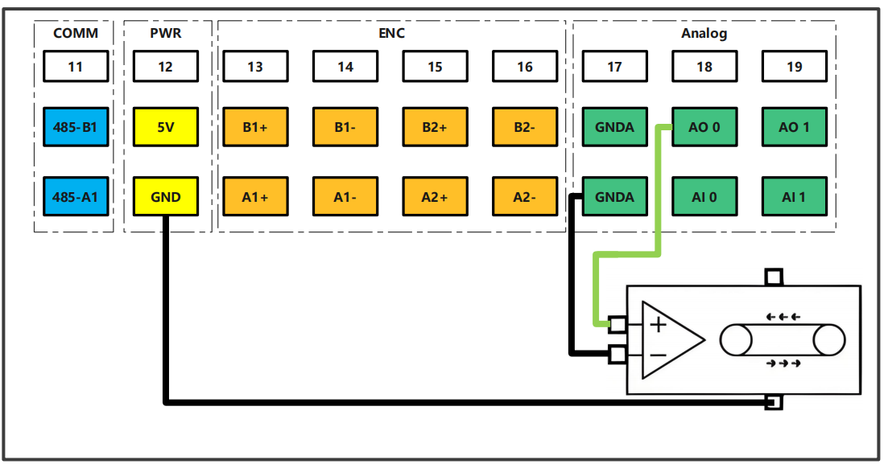

.. centered:: Zintegrowana mini skrzynka sterownicza (mini BOX)
.. centered:: Wykres 3.5-16 Schemat wyjścia analogowego

**Używanie wejścia analogowego**

Poniższy przykład pokazuje użycie wejścia analogowego do podłączenia czujnika analogowego.

.. figure:: installation/057.png
	:align: center
	:width: 3in

.. centered:: Skrzynka sterownicza

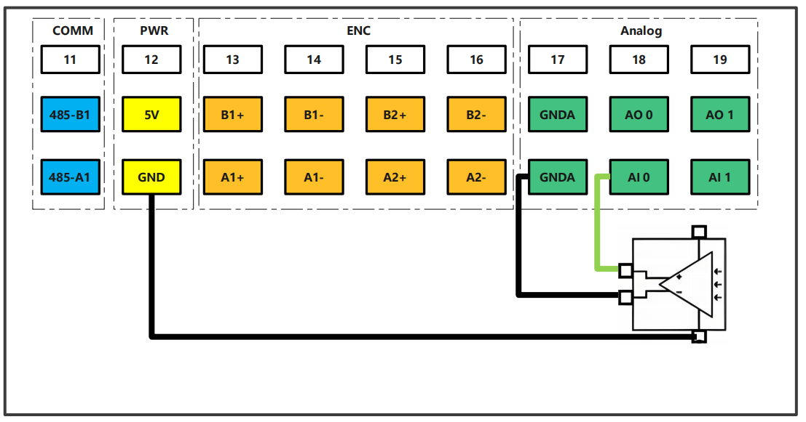

.. centered:: Zintegrowana mini skrzynka sterownicza (mini BOX)
.. centered:: Wykres 3.5-17 Schemat wejścia analogowego

Moduły opcjonalne FR3MT i 3C
~~~~~~~~~~~~~~~~~~~~~~~~~~~~

Wprowadzenie
++++++++++++

Definicja robota współpracującego jest zgodna z międzynarodowymi normami ISO i odpowiednimi przepisami krajowymi w celu ochrony bezpieczeństwa operatora. Nie zalecamy bezpośredniego stosowania korpusu robota w sytuacjach, w których przedmiotem pracy jest ciało ludzkie. Jeśli jednak użytkownik lub twórca aplikacji naprawdę potrzebuje zastosowania robota, w którym przedmiotem pracy jest ciało ludzkie, musi, po dokładnej ocenie przez użytkownika lub twórcę aplikacji i zapewnieniu bezpieczeństwa personelu, wyposażyć korpus robota w bezpieczny, niezawodny, w pełni przetestowany i certyfikowany system ochrony bezpieczeństwa, aby chronić personel.

Instrukcje bezpieczeństwa
*************************

Niniejsza instrukcja służy wyłącznie jako instrukcja certyfikacji bezpieczeństwa dla klienta. Personel konserwacyjny musi posiadać odpowiednie kwalifikacje. FAIRINO odmawia wszelkiej odpowiedzialności za operacje wykonywane przez niekwalifikowany personel.

.. important:: Jeśli robot (korpus robota, moduł zasilania, moduł rozszerzający) został uszkodzony, zmieniony lub zmodyfikowany z winy człowieka, FAIRINO odmawia wszelkiej odpowiedzialności. FAIRINO nie ponosi odpowiedzialności za jakiekolwiek uszkodzenia robota lub jakiegokolwiek innego urządzenia spowodowane błędami w programach napisanych przez klienta.

Skuteczność i odpowiedzialność
******************************

Informacje zawarte w niniejszej instrukcji nie obejmują projektowania, instalacji i obsługi kompletnego zastosowania robota ani wszystkich urządzeń peryferyjnych, które mogą mieć wpływ na bezpieczeństwo tego kompletnego systemu. Projekt i instalacja tego kompletnego systemu muszą być zgodne z wymaganiami bezpieczeństwa określonymi w normach i przepisach kraju, w którym robot jest instalowany.

Integrator FAIRINO jest odpowiedzialny za zapewnienie zgodności z odpowiednimi przepisami krajowymi oraz za zapewnienie, że w kompletnym zastosowaniu robota nie występują żadne istotne zagrożenia. Obejmuje to między innymi:

- Przeprowadzenie oceny ryzyka dla kompletnego systemu robotycznego.
- Podłączenie innych maszyn i dodatkowych urządzeń bezpieczeństwa zdefiniowanych w ocenie ryzyka.
- Ustanowienie odpowiednich ustawień bezpieczeństwa w oprogramowaniu.
- Zapewnienie, że użytkownik nie będzie modyfikować żadnych środków bezpieczeństwa.
- Potwierdzenie, że projekt i instalacja całego systemu robotycznego są prawidłowe.
- Określenie instrukcji użytkowania.
- Umieszczenie na robocie odpowiednich oznaczeń i danych kontaktowych integratora.
- Zebranie całej dokumentacji z plików technicznych, w tym niniejszej instrukcji.

Ograniczona odpowiedzialność
****************************

Żadnych informacji dotyczących bezpieczeństwa zawartych w niniejszej instrukcji nie należy uważać za ogólne gwarancje bezpieczeństwa robota. Nawet przy przestrzeganiu wszystkich instrukcji bezpieczeństwa nadal może dojść do obrażeń ciała lub uszkodzenia sprzętu.

Symbole ostrzegawcze bezpieczeństwa
***********************************

Na produkcie umieszczono następujące symbole ostrzegawcze bezpieczeństwa.

.. important:: 
	.. figure:: installation/008.png
		:width: 60
		:height: 50
		:align: left

	Nazwa: **Niebezpieczeństwo**
   
	Funkcja: Oznacza to zbliżającą się niebezpieczną sytuację związaną z energią elektryczną, która, jeśli nie zostanie uniknięta, może spowodować śmierć lub poważne obrażenia.

.. important:: 
	.. figure:: installation/009.png
		:width: 60
		:height: 50
		:align: left

	Nazwa: **Ryzyko porażenia prądem**
   
	Funkcja: Oznacza to zbliżającą się niebezpieczną sytuację porażenia prądem, która, jeśli nie zostanie uniknięta, może spowodować śmierć lub poważne obrażenia w wyniku porażenia prądem.

.. important:: 
	.. figure:: installation/010.png
		:width: 60
		:height: 50
		:align: left

	Nazwa: **Ryzyko oparzenia**
   
	Funkcja: Oznacza to gorącą powierzchnię, która może stwarzać zagrożenie. Jeśli dojdzie do kontaktu, może spowodować obrażenia ciała.

.. important:: 
	.. figure:: installation/112.png
		:width: 60
		:height: 50
		:align: left

	Nazwa: **Uziemienie**
   
	Funkcja: Oznacza to, że urządzenie wymaga niezawodnego uziemienia.

Definicja podstawy FR3MT i 3C oraz interfejsów modułów
+++++++++++++++++++++++++++++++++++++++++++++++++++++++

Definicja interfejsów podstawy
******************************

Część podstawy korpusu ma łącznie 7 przycisków i interfejsów, których definicje są następujące:

.. figure:: installation/113.png
	:align: center
	:width: 4in

.. centered:: Wykres 3.5-18 Przyciski i interfejsy części podstawy korpusu

.. note:: Widoki definicji pinów interfejsów podstawy są widokami z płaszczyzny odniesienia montażu.

**1. Przycisk włączania/wyłączania kontrolera**: Domyślnie automatyczne włączanie po podaniu zasilania.

**2. Definicja pinów gniazda żeńskiego M8-A-4P**:
Port użytkownika. Adres 192.168.57.2. Złącze: gniazdo żeńskie M8-A-4P [wtyk męski M8-A-4P do podłączenia], złącze zgodne z IEC 61076-2-101.

.. figure:: installation/114.png
	:align: center
	:width: 2in

.. list-table::
   :widths: 20 30 50
   :header-rows: 0
   :align: center

   * - **Pin**
     - **Definicja**
     - **Opis**

   * - 1
     - TX+
     - Dodatni nadawania danych

   * - 2
     - RX+
     - Dodatni odbioru danych

   * - 3
     - RX-
     - Ujemny odbioru danych

   * - 4
     - TX-
     - Ujemny nadawania danych

**3. Definicja pinów gniazda męskiego M12-L-5P**:
Złącze: gniazdo męskie M12-L-5P [gniazdo żeńskie M12-L-5P do podłączenia], złącze zgodne z IEC 61076-2-101.

.. figure:: installation/115.png
	:align: center
	:width: 2in

.. list-table::
   :widths: 10 15 15 20 40 
   :header-rows: 0
   :align: center

   * - **Pin**
     - **Kolor**
     - **Definicja**
     - **Opis**
     - **Uwagi**

   * - 1
     - Czarny 1
     - 0V
     - Masa zasilania sterowania
     - Masa zasilania sterowania robota [zapasowe zasilanie skrzynki sterowniczej, nie wymaga podłączenia]

   * - 2
     - Brązowy 2
     - 24V
     - Dodatni zasilania sterowania
     - Dodatni zasilania sterowania robota [zapasowe zasilanie skrzynki sterowniczej, nie wymaga podłączenia]

   * - 3
     - Biały 3
     - 48V
     - Dodatni zasilania napędu
     - Dodatni zasilania napędu robota

   * - 4
     - Niebieski 4
     - 0V
     - Masa zasilania napędu
     - Masa zasilania napędu robota

   * - 5
     - Szary 5
     - PE
     - Uziemienie
     - Uziemienie ochronne

.. note:: 
  ① W podstawie znajduje się zasilacz sterowania 48 V na 24 V.

  ② Zasilacz 48 V na 24 V w podstawie jest używany jako zasilanie rezerwowe dla 24 V z portu zasilania.

.. figure:: installation/116.png
	:align: center
	:width: 6in

.. centered:: Wykres 3.5-19 Schemat zasilacza 48 V na 24 V w podstawie

**4. Definicja pinów gniazda żeńskiego M12-A-12P**:
Złącze: gniazdo żeńskie M12-A-12P [wtyk męski M12-A-12P do podłączenia], złącze zgodne z IEC 61076-2-101.

.. figure:: installation/117.png
	:align: center
	:width: 2in

.. list-table::
   :widths: 10 15 20 40 
   :header-rows: 0
   :align: center

   * - **Pin**
     - **Definicja**
     - **Opis**
     - **Uwagi**

   * - 1
     - AGND
     - Masa analogowa
     - Masa odniesienia dla sygnałów analogowych

   * - 2
     - 0V
     - Masa zasilania 24 V
     - Masa zasilania sterowania

   * - 3
     - 485-A
     - Komunikacja 485 A
     - Komunikacja 485 używana do rozszerzeń (rezerwowa)

   * - 4
     - 485-B
     - Komunikacja 485 B
     - Komunikacja 485 używana do rozszerzeń (rezerwowa)

   * - 5
     - DI0/DO0
     - Wejście/wyjście cyfrowe 0
     - 5, 6, 7 to ten sam interfejs. Może być skonfigurowany jako wejście lub wyjście przez program, w danym momencie tylko jedna opcja

   * - 6
     - DI1/DO1
     - Wejście/wyjście cyfrowe 1
     - 5, 6, 7 to ten sam interfejs. Może być skonfigurowany jako wejście lub wyjście przez program, w danym momencie tylko jedna opcja

   * - 7
     - DI2/DO2
     - Wejście/wyjście cyfrowe 2
     - 5, 6, 7 to ten sam interfejs. Może być skonfigurowany jako wejście lub wyjście przez program, w danym momencie tylko jedna opcja

   * - 8
     - AI0/AO0
     - Wejście/wyjście analogowe 0
     - 8, 9 to ten sam interfejs. Może być skonfigurowany jako wejście lub wyjście przez program, w danym momencie tylko jedna opcja

   * - 9
     - AI1/AO1
     - Wejście/wyjście analogowe 1
     - 8, 9 to ten sam interfejs. Może być skonfigurowany jako wejście lub wyjście przez program, w danym momencie tylko jedna opcja

   * - 10
     - 24V
     - Dodatni zasilania 24 V
     - Dodatni zasilania sterowania

   * - 11
     - DI3/DO3
     - Wejście/wyjście cyfrowe 3
     - 11, 12 to ten sam interfejs. Może być skonfigurowany jako wejście lub wyjście przez program, w danym momencie tylko jedna opcja

   * - 12
     - DI4/DO4
     - Wejście/wyjście cyfrowe 4
     - 11, 12 to ten sam interfejs. Może być skonfigurowany jako wejście lub wyjście przez program, w danym momencie tylko jedna opcja

**5. Definicja pinów gniazda żeńskiego M8-A-4P**:
Port debugowania. Adres 192.168.58.2. Złącze: gniazdo żeńskie M8-A-4P [wtyk męski M8-A-4P do podłączenia], złącze zgodne z IEC 61076-2-101.

.. figure:: installation/114.png
	:align: center
	:width: 2in

.. list-table::
   :widths: 20 30 50
   :header-rows: 0
   :align: center

   * - **Pin**
     - **Definicja**
     - **Opis**

   * - 1
     - TX+
     - Dodatni nadawania danych

   * - 2
     - RX+
     - Dodatni odbioru danych

   * - 3
     - RX-
     - Ujemny odbioru danych

   * - 4
     - TX-
     - Ujemny nadawania danych

6. Złącze USB-A, USB2.0 – do debugowania wewnętrznego.

7. Złącze HDMI-A, wyświetlanie HDMI – do debugowania wewnętrznego.

Definicja interfejsów modułu zasilania
**************************************

Zasilacz to Mean Well NDR-480-48. Definicja interfejsów jest następująca:

.. figure:: installation/118.png
	:align: center
	:width: 3in

.. list-table::
   :widths: 20 20 20 40
   :header-rows: 0
   :align: center

   * - **Pin**
     - **Definicja**
     - **Opis**
     - **Uwagi**

   * - 1
     - L
     - Fazowy
     - Wejście 100-240 V AC

   * - 2
     - N
     - Neutralny
     - Wejście 100-240 V AC

   * - 3
     - PE
     - Uziemienie
     - Punkt uziemienia

   * - 4
     - +V
     - 48V
     - Wyjście 48 V / 10 A

   * - 5
     - +V
     - 48V
     - Wyjście 48 V / 10 A

   * - 6
     - -V
     - 0V
     - Wyjście 48 V / 10 A

   * - 7
     - -V
     - 0V
     - Wyjście 48 V / 10 A

Definicja interfejsów modułu rozszerzającego
********************************************

Moduł rozszerzający posiada funkcję awaryjnego zatrzymania i funkcję rozładowania energii. Zewnętrzne zaciski modułu rozszerzającego oraz wewnętrzny schemat topologii przedstawiono poniżej:

.. figure:: installation/119.png
	:align: center
	:width: 6in

.. list-table::
   :widths: 20 30 50
   :header-rows: 0
   :align: center

   * - **Pin**
     - **Definicja**
     - **Opis**

   * - 1
     - 48-IN
     - Dodatni wejścia 48 V

   * - 2
     - 0V
     - Masa wejścia 48 V

   * - 3
     - PE
     - Uziemienie

   * - 4
     - PE
     - Uziemienie

   * - 5
     - 24V
     - Dodatni zasilania sterowania

   * - 6
     - 0V
     - Masa zasilania sterowania

   * - 7
     - 0V
     - Masa zasilania napędu

   * - 8
     - 48-OUT
     - Dodatni zasilania napędu

   * - 9
     - ESW1
     - Dodatni przycisku awaryjnego zatrzymania 1

   * - 10
     - 0V
     - Masa przycisku awaryjnego zatrzymania 1

   * - 11
     - ESW2
     - Dodatni przycisku awaryjnego zatrzymania 2

   * - 12
     - 0V
     - Masa przycisku awaryjnego zatrzymania 2

   * - 13
     - E-O-2
     - Beznapięciowy normalnie otwarty 2

   * - 14
     - E-O-1
     - Beznapięciowy normalnie otwarty 1

   * - 15
     - E-C-2
     - Beznapięciowy normalnie zamknięty 2

   * - 16
     - E-C-1
     - Beznapięciowy normalnie zamknięty 1

Scenariusze zastosowań FR3MT i 3C
++++++++++++++++++++++++++++++++++

W większości scenariuszy zastosowań użytkownik może zaspokoić swoje potrzeby, wybierając tylko wiązkę kabli użytkownika. Konkretne scenariusze zastosowań są następujące:

.. list-table::
   :widths: 10 15 15 20 40 
   :header-rows: 0
   :align: center

   * - **Nr**
     - **Kategoria scenariusza**
     - **Warunki zasilania użytkownika**
     - **Wymagania funkcjonalne użytkownika**
     - **Zalecana konfiguracja**

   * - 1
     - Podstawowa aplikacja
     - Zasilacz DC 48 V / 10 A
     - Brak funkcji awaryjnego zatrzymania/rozładowania energii
     - Wiązka kabli użytkownika

   * - 2
     - Rozszerzona bezpieczeństwo
     - Zasilacz DC 48 V / 10 A
     - Wymagana funkcja awaryjnego zatrzymania + rozładowania energii
     - Wiązka kabli użytkownika + moduł rozszerzający

   * - 3
     - Zasilanie niezależne
     - Brak zasilacza DC 48 V / 10 A
     - Brak funkcji awaryjnego zatrzymania/rozładowania energii
     - Wiązka kabli użytkownika + moduł zasilania + przewód zasilający

   * - 4
     - W pełni zintegrowana funkcjonalność
     - Brak zasilacza DC 48 V / 10 A
     - Wymagana funkcja awaryjnego zatrzymania + rozładowania energii
     - Wiązka kabli użytkownika + moduł zasilania + przewód zasilający + moduł rozszerzający

Podstawowa aplikacja
********************

Tylko wiązka kabli użytkownika. Sposób podłączenia jest następujący:

1. Podłącz gniazdo żeńskie M12-L-5P przewodu zasilającego do podstawy. Na końcu znajduje się 5 przewodów z oznaczeniami 48V/0V/24V/0V/PE. Podłącz trzy przewody 48V/0V/PE do odpowiednich zacisków zasilania użytkownika. Przewody 24V/0V należy odizolować i pozostawić niepodłączone.

2. Podłącz wtyk męski M12-A-12P i wtyk męski M8-A-4P do odpowiednich zacisków podstawy.

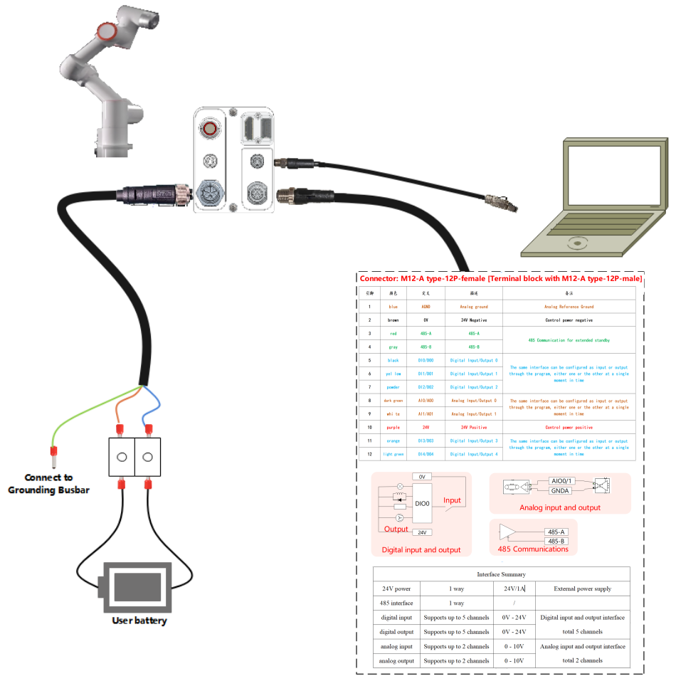

.. centered:: Wykres 3.5-20 Sposób podłączenia wiązki kabli użytkownika

Rozszerzona bezpieczeństwo
**************************

Wiązka kabli użytkownika + moduł rozszerzający. Sposób podłączenia jest następujący:

1. Kabel łączący moduł rozszerzający o długości 0,5 M ma na obu końcach 3 przewody z oznaczeniami 48V/0V/PE. Strona wejściowa kabla jest podłączona do odpowiednich zacisków zasilania użytkownika. Strona wyjściowa jest włożona w pozycje 48Vin/0V/PE modułu rozszerzającego.

2. Podłącz gniazdo żeńskie M12-L-5P przewodu zasilającego do podstawy. Na końcu znajduje się 5 przewodów z oznaczeniami 48V/0V/24V/0V/PE. Podłącz 5 przewodów do 48Vout/0V/0V/24V/PE modułu rozszerzającego.

3. Podłącz wtyk męski M12-A-12P i wtyk męski M8-A-4P do odpowiednich zacisków podstawy.

.. figure:: installation/121.png
	:align: center
	:width: 6in

.. centered:: Wykres 3.5-21 Sposób podłączenia wiązki kabli użytkownika + modułu rozszerzającego

Zasilanie niezależne
********************

Wiązka kabli użytkownika + moduł zasilania + przewód zasilający. Sposób podłączenia jest następujący:

1. Przewód zasilający o długości 1,5 M ma na końcu 3 przewody z oznaczeniami L/N/PE. Podłącz je do odpowiednich zacisków wejściowych zasilacza NDR-480-48.

2. Podłącz gniazdo żeńskie M12-L-5P przewodu zasilającego do podstawy. Na końcu znajduje się 5 przewodów z oznaczeniami 48V/0V/24V/0V/PE. Podłącz trzy przewody 48V/0V/PE do odpowiednich zacisków zasilania użytkownika. Przewody 24V/0V należy odizolować i pozostawić niepodłączone.

3. Podłącz wtyk męski M12-A-12P i wtyk męski M8-A-4P do odpowiednich zacisków podstawy.

.. figure:: installation/122.png
	:align: center
	:width: 6in

.. centered:: Wykres 3.5-22 Sposób podłączenia wiązki kabli użytkownika + modułu zasilania + przewodu zasilającego

W pełni zintegrowana funkcjonalność
*******************************************

Wiązka kabli użytkownika + moduł zasilania + przewód zasilający + moduł rozszerzający. Sposób podłączenia jest następujący:

1. Przewód zasilający o długości 1,5 M ma na końcu 3 przewody z oznaczeniami L/N/PE. Podłącz je do odpowiednich zacisków wejściowych zasilacza NDR-480-48.

2. Kabel łączący moduł rozszerzający o długości 0,5 M ma na obu końcach 3 przewody z oznaczeniami 48V/0V/PE. Strona wejściowa kabla jest podłączona do odpowiednich zacisków wyjściowych zasilacza NDR-480-48, a przewód PE jest wspólny z wejściem. Strona wyjściowa jest włożona w pozycje 48Vin/0V/PE modułu rozszerzającego.

3. Podłącz gniazdo żeńskie M12-L-5P przewodu zasilającego do podstawy. Na końcu znajduje się 5 przewodów z oznaczeniami 48V/0V/24V/0V/PE. Podłącz 5 przewodów do 48Vout/0V/0V/24V/PE modułu rozszerzającego.

4. Podłącz wtyk męski M12-A-12P i wtyk męski M8-A-4P do odpowiednich zacisków podstawy.

.. figure:: installation/123.png
	:align: center
	:width: 6in

.. centered:: Wykres 3.5-23 Sposób podłączenia wiązki kabli użytkownika + modułu zasilania + przewodu zasilającego + modułu rozszerzającego

Lista materiałów opcjonalnych
+++++++++++++++++++++++++++++

Materiały wiązki kabli użytkownika 5 M są następujące:

.. list-table::
   :widths: 20 60 20 
   :header-rows: 0
   :align: center

   * - **Nr**
     - **Nazwa**
     - **Ilość**

   * - 1
     - Kabel zasilania DC FR3MT i 3C - 5M
     - 1

   * - 2
     - Kabel sygnałowy I/O FR3MT i 3C - 5M
     - 1

   * - 3
     - Kabel Ethernet FR3MT i 3C - 5M
     - 1

   * - 4
     - Wtyk prosty kombinowany M8, M8-P4A-PLA05, 4-żyłowy
     - 1

Materiały wiązki kabli użytkownika 1 M są następujące:

.. list-table::
   :widths: 20 60 20 
   :header-rows: 0
   :align: center

   * - **Nr**
     - **Nazwa**
     - **Ilość**

   * - 1
     - Kabel zasilania DC FR3MT i 3C - 1M
     - 1

   * - 2
     - Kabel sygnałowy I/O FR3MT i 3C - 1M
     - 1

   * - 3
     - Kabel Ethernet FR3MT i 3C - 1M
     - 1

   * - 4
     - Wtyk prosty kombinowany M8, M8-P4A-PLA05, 4-żyłowy
     - 1

Materiały modułu zasilania są następujące:

.. list-table::
   :widths: 20 60 20 
   :header-rows: 0
   :align: center

   * - **Nr**
     - **Nazwa**
     - **Ilość**

   * - 1
     - Zasilacz impulsowy Mean Well, NDR-480-48
     - 1

Materiały przewodu zasilającego są następujące:

.. list-table::
   :widths: 20 60 20 
   :header-rows: 0
   :align: center

   * - **Nr**
     - **Nazwa**
     - **Ilość**

   * - 1
     - Przewód zasilający FR3MT i 3C - 1,5M
     - 1

Materiały modułu rozszerzającego są następujące:

.. list-table::
   :widths: 20 60 20 
   :header-rows: 0
   :align: center

   * - **Nr**
     - **Nazwa**
     - **Ilość**

   * - 1
     - Podstawa FR3MT i 3C - moduł rozszerzający
     - 1

   * - 2
     - Kabel łączący zasilanie i moduł rozszerzający FR3MT i 3C - 0,5M
     - 1

Panel operatorski i końcowy LED
-------------------------------

Do sterowania robotem i uzyskiwania do niego dostępu można użyć komputera lub tabletu. Sposób podłączenia opisano w sekcji 3.5.3. Ponadto użytkownik może również skorzystać z naszego panelu operatorskiego FR-HMI, który jest opcjonalnym akcesorium.

Wprowadzenie do panelu przyciskowego
~~~~~~~~~~~~~~~~~~~~~~~~~~~~~~~~~~~~

60 przyciskowy panel (POE)(BX01)
++++++++++++++++++++++++++++++++

.. figure:: installation/058.png
	:align: center
	:width: 6in

.. centered:: Wykres 3.6-1 60 przyciskowy panel (POE)(BX01)

**Przycisk awaryjnego zatrzymania:**\ Po naciśnięciu przycisku awaryjnego zatrzymania robot przechodzi w stan awaryjnego zatrzymania.

**Złącze Type-C:**\ Port do podłączenia panelu operatorskiego sieciowego.

**Przycisk 1:**\ Krótkie naciśnięcie przełącza tryb automatyczny/ręczny, długie naciśnięcie wchodzi/wychodzi z trybu przeciągania.

**Przycisk 2:**\ Krótkie naciśnięcie zapisuje punkt uczenia, długie naciśnięcie wchodzi/wychodzi ze stanu bez podłączonego panelu operatorskiego.

**Przycisk 3:**\ Krótkie naciśnięcie uruchamia/zatrzymuje działanie programu.

60 przyciskowy panel (POE)(BX02)-V1.0
+++++++++++++++++++++++++++++++++++++

.. figure:: installation/059.png
	:align: center
	:width: 6in

.. centered:: Wykres 3.6-2 60 przyciskowy panel (POE)(BX02)-V1.0

**Przycisk awaryjnego zatrzymania:**\ Po naciśnięciu przycisku awaryjnego zatrzymania robot przechodzi w stan awaryjnego zatrzymania.

**Start/Stop:**\ Uruchamianie/zatrzymywanie działania programu.

**Port sieciowy:**\ Podłączenie do panelu operatorskiego sieciowego.

**Wyłączenie:**\ Tymczasowo nieaktywne.

**Zapis punktu:**\ Zapis punktu uczenia.

**Tryb uczenia:**\ Wejście/wyjście ze stanu z podłączonym panelem operatorskim.

**Tryb pracy:**\ Przełączanie trybu automatyczny/ręczny.

**Tryb przeciągania:**\ Wejście/wyjście z trybu przeciągania.

60 przyciskowy panel (POE)(BX02)-V2.0
+++++++++++++++++++++++++++++++++++++

.. figure:: installation/079.png
   :width: 6in
   :align: center

.. centered:: Wykres 3.6-3 60 przyciskowy panel (POE)(BX02)-V2.0

**Przycisk awaryjnego zatrzymania:**\ Po naciśnięciu przycisku awaryjnego zatrzymania robot przechodzi w stan awaryjnego zatrzymania.

**Start/Stop:**\ Uruchamianie/zatrzymywanie działania programu.

**Port sieciowy:**\ Podłączenie do panelu operatorskiego sieciowego.

**Reset IP:**\ Resetowanie adresu IP portu sieciowego.

**Zapis punktu:**\ Zapis punktu uczenia.

**Jedno kliknięcie wyczyszczenia:**\ Czyszczenie wszystkich możliwych do usunięcia błędów.

**Tryb pracy:**\ Przełączanie trybu automatyczny/ręczny.

**Tryb przeciągania:**\ Wejście/wyjście z trybu przeciągania.

Wprowadzenie do panelu operatorskiego FR-HMI
~~~~~~~~~~~~~~~~~~~~~~~~~~~~~~~~~~~~~~~~~~~~

.. figure:: installation/060.png
	:align: center
	:width: 6in

.. centered:: Wykres 3.6-4 Panel operatorski FR-HMI – przód

.. figure:: installation/061.png
	:align: center
	:width: 6in

.. centered:: Wykres 3.6-5 Panel operatorski FR-HMI – tył

**Ekran dotykowy:**\ Ekran dotykowy i interfejs wyświetlacza panelu operatorskiego.

**Przycisk start:**\ Uruchamia program.

**Przycisk stop:**\ Zatrzymuje aktualnie działający program.

**Przycisk Joint:**\ Punktowanie stawów robota.

**Trójpozycyjny przełącznik załączający:**\ Załącza robota w trybie ręcznym.

**Przycisk awaryjnego zatrzymania:**\ Po naciśnięciu przycisku awaryjnego zatrzymania robot przechodzi w stan awaryjnego zatrzymania.

**Przycisk trybu:**\ Przekręcenie przycisku przełącza tryb ręczny/automatyczny.

Definicja końcowego LED
~~~~~~~~~~~~~~~~~~~~~~~

.. centered:: Tabela 3.6-1 Tabela definicji końcowego LED
.. list-table::
   :widths: 50 50
   :header-rows: 0
   :align: center

   * - **Funkcja**
     - **Kolor LED**

   * - Gdy komunikacja nie jest nawiązana
     - Naprzemiennie: "wyłączony", "czerwony", "zielony", "niebieski"

   * - Tryb automatyczny
     - Świeci na niebiesko

   * - Tryb ręczny
     - Świeci na zielono

   * - Tryb przeciągania
     - Świeci na biało-błękitnie

   * - Zapis punktu na panelu przyciskowym (tylko podczas korzystania z panelu przyciskowego)
     - Miga na fioletowo dwa razy

   * - Wejście w stan bez podłączonego panelu przyciskowego (tylko podczas korzystania z panelu przyciskowego)
     - Miga na fioletowo dwa razy

   * - Rozpoczęcie działania (tylko podczas korzystania z panelu przyciskowego)
     - Miga na błękitno dwa razy

   * - Zatrzymanie działania (tylko podczas korzystania z panelu przyciskowego)
     - Miga na czerwono dwa razy

   * - Błąd (tylko podczas korzystania z panelu przyciskowego)
     - Świeci na czerwono

   * - Zakończenie kalibracji zera
     - Miga na biało-błękitnie trzy razy

   * - Odłączenie
     - Miga na żółto dwa razy