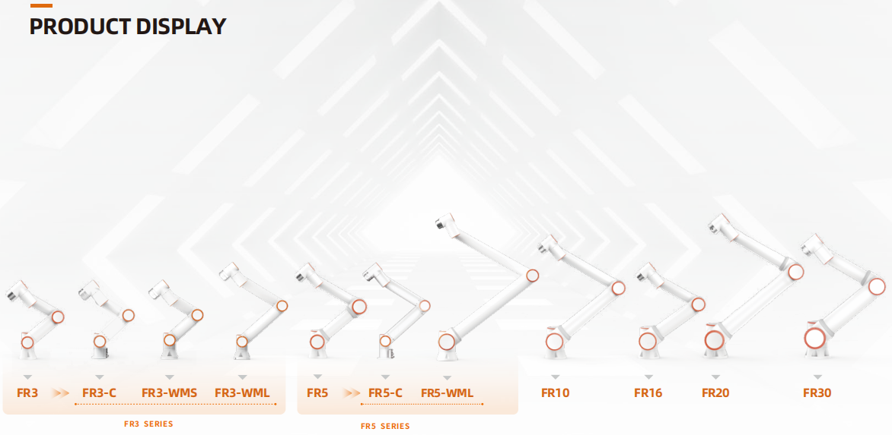

Robot współpracujący
====================

Macierz produktów
-----------------

Szybki start
------------
.. toctree:: 
    :maxdepth: 6
    :numbered: 5

    install_power_robot
    access
    parameter_setting
    manual_teaching
    quick_programming

Instrukcja użytkowania
----------------------
.. toctree:: 
    :maxdepth: 6
    :numbered: 8

    foreword
    robot_brief_introduction
    installation
    quick_start_robot
    teaching_pendant_software
    base
    safety
    robot_peripherals
    coding
    graphical
    node_editor_software
    points
    status
    application
    process
    system
    teach_pendant
    remote_mode
    custom_protocol_slave
    appendix
    term

Informacje o wersji
-------------------

.. toctree:: 
    :maxdepth: 6
    
    version_intro