Programowanie węzłów graficznych
================================

.. toctree:: 
   :maxdepth: 6

Informacje podstawowe
---------------------

Wprowadzenie do systemu
~~~~~~~~~~~~~~~~~~~~~~~

Programowanie węzłów graficznych to oprogramowanie programistyczne opracowane dla robotów. Jego główne funkcje i cechy techniczne są następujące:

-  Połączenia między węzłami dobrze oddają kontekstowe relacje logiczne programu;
-  Poprzez operacje takie jak tworzenie węzłów, łączenie węzłów i edycję parametrów węzłów, wystarczy przeciągać i wprowadzać niewielką ilość parametrów, aby ukończyć programowanie robota;
-  Pomaga lepiej wizualizować kod i szybciej pisać skrypty dla złożonych i powtarzalnych zadań;

.. image:: node_editor_software/001.png
   :width: 6in
   :align: center

.. centered:: Schemat 11.1-1 Interfejs programowania węzłów graficznych

Pasek narzędzi
~~~~~~~~~~~~~~

Użyj paska narzędzi w górnej lewej części strony programowania węzłów graficznych.

.. image:: node_editor_software/002.png
   :width: 6in
   :align: center

.. centered:: Schemat 11.1-2 Pasek narzędzi operacyjnych

.. note:: 
   .. image:: coding/006.png
      :height: 0.75in
      :align: left

   Nazwa: **Otwórz**
   
   Działanie: Otwiera plik programu użytkownika, w oknie dialogowym wybierz załadowanie lub usunięcie pliku

.. note:: 
   .. image:: coding/010.png
      :height: 0.75in
      :align: left

   Nazwa: **Zapisz**
   
   Działanie: Zapisuje edytowaną treść węzłów graficznych

.. note:: 
   .. image:: node_editor_software/131.png
      :height: 0.75in
      :align: left

   Nazwa: **Przeładuj**
   
   Działanie: Ponownie ładuje do lokalizacji treść węzłów graficznych z poprzedniej operacji

.. note:: 
   .. image:: coding/007.png
      :height: 0.75in
      :align: left

   Nazwa: **Nowy**
   
   Działanie: Tworzy nowy plik programowania węzłów graficznych

.. note:: 
   .. image:: coding/008.png
      :height: 0.75in
      :align: left

   Nazwa: **Eksportuj**
   
   Działanie: Po utworzeniu/otwarciu pliku programowania węzłów graficznych, kliknij przycisk „Eksportuj”, aby otworzyć okno dialogowe „Eksportuj programowanie węzłów graficznych”, wybierz nazwę pliku w obszarze roboczym i wyeksportuj plik (w formacie json)

.. note:: 
   .. image:: coding/009.png
      :height: 0.75in
      :align: left

   Nazwa: **Importuj**
   
   Działanie: Kliknij przycisk „Importuj”, aby otworzyć okno dialogowe importu. Wybierz plik do importu, po kliknięciu importu treść pliku zostanie wyświetlona w obszarze roboczym programowania węzłów graficznych

.. note:: 
   .. image:: node_editor_software/129.png
      :height: 0.75in
      :align: left

   Nazwa: **Kod**
   
   Działanie: Po połączeniu węzłów generuje kod Lua

Operacje na węzłach graficznych
-------------------------------

Program węzłów
~~~~~~~~~~~~~~

Aby uruchomić program węzłów, należy kliknąć prawym przyciskiem myszy w pustym miejscu, aby otworzyć panel wyboru programu węzłów. Instrukcje programu dzielą się głównie na instrukcje logiczne, instrukcje ruchu, instrukcje sterowania siłą, instrukcje sterowania, instrukcje Modbus, osie rozszerzone itp.

Pole wejściowe u góry panelu wyboru programu węzłów umożliwia wyszukiwanie rozmyte w celu szybkiego zlokalizowania potrzebnej instrukcji węzła.

Konkretna procedura operacyjna programu węzłów jest następująca:

-  Kliknij węzeł „Begin”, aby utworzyć pozycję programowania węzła początkowego;
-  Kliknij wybrany węzeł instrukcji programu, odpowiedni węzeł zostanie wyświetlony w obszarze roboczym, gdzie można wybrać z listy rozwijanej lub wprowadzić jego parametry instrukcji;
-  Funkcja strzałek po prawej stronie węzła instrukcji: 1. Ikona pojedynczej strzałki łączy z następnym węzłem; 2. Ikona wielu strzałek, pierwsza ikona strzałki „Body” łączy z węzłem treści, druga ikona „Completed” łączy z następnym węzłem;
-  Połącz węzeł początkowy „Begin” z ukończonym węzłem programu, aby zakończyć operację programowania węzła;

Instrukcja warunkowa If/Else
----------------------------

Kliknij węzeł instrukcji powiązanej z „If/Else”, aby przejść do interfejsu edycji węzłów graficznych. (Ta instrukcja wymaga pewnych podstaw programowania. W razie potrzeby skontaktuj się z nami)

Instrukcja „If/Else”:

- First: Łączy z węzłami instrukcji w warunku if
- Second: Jeśli po lewej stronie wprowadzone są tylko dwa warunki, oznacza to połączenie z węzłami instrukcji w warunku else; jeśli istnieją trzy warunki po lewej stronie, oznacza to połączenie z węzłami instrukcji w warunku elseif
- Third: Jeśli istnieją trzy warunki po lewej stronie, oznacza to połączenie z warunkiem else
- Completed: Łączy z kolejnymi węzłami instrukcji

.. image:: node_editor_software/124.png
   :width: 6in
   :align: center

.. centered:: Schemat 11.3-1 Interfejs węzła instrukcji „If/Else”

Instrukcja While
----------------

Kliknij węzeł instrukcji powiązanej z „While”, aby przejść do interfejsu edycji węzłów graficznych.

W polu wejściowym za While wprowadź warunek oczekiwania, w polu wejściowym za do wprowadź instrukcje działania podczas pętli, kliknij Zapisz. (Dla wygody możesz dowolnie wprowadzić treść do, a w programie edytować inne instrukcje, aby je wstawić i zastąpić)

Instrukcja „While”:

- Condition: warunek pętli while

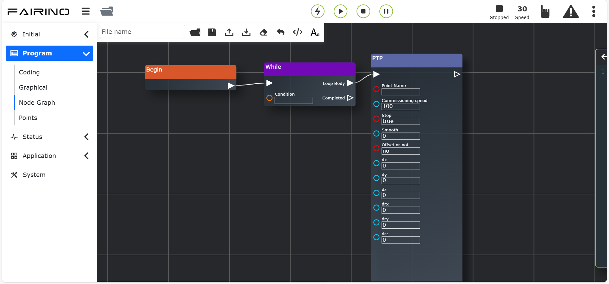

.. centered:: Schemat 11.4-1 Interfejs węzła instrukcji „While”

Instrukcja skoku
----------------

Kliknij węzeł instrukcji powiązanej z „Skok”, aby przejść do interfejsu edycji węzłów graficznych.

Instrukcja „Skok”: pierwsza ikona strzałki „Body” łączy z węzłem treści głównej, druga ikona strzałki „Completed” łączy z węzłem instrukcji goto docelowej pozycji skoku. (Ta instrukcja wymaga pewnych podstaw programowania. W razie potrzeby skontaktuj się z nami)

- Nazwa skoku: Wprowadź nazwę skoku, aby określić miejsce skoku

.. image:: node_editor_software/003.png
   :width: 6in
   :align: center

.. centered:: Schemat 11.5-1 Interfejs węzła instrukcji „Skok”

.. important:: Nazwa skoku nie może zaczynać się od cyfry.

Instrukcja oczekiwania
----------------------

Kliknij węzeł instrukcji powiązanej z „Oczekiwanie”, aby przejść do interfejsu edycji węzłów graficznych.

Ta instrukcja jest instrukcją opóźnienia i składa się z czterech części: „WaitMs”, „WaitDI”, „WaitMultiDI” i „WaitAI”.

1. Węzeł instrukcji „Oczekiwanie”, parametry:

- Czas oczekiwania (ms): Jednostką czasu oczekiwania opóźnienia jest milisekunda, wprowadź liczbę milisekund oczekiwania

.. image:: node_editor_software/004.png
   :width: 6in
   :align: center

.. centered:: Schemat 11.6-1 Interfejs węzła instrukcji „Oczekiwanie”

2. Węzeł instrukcji „Oczekiwanie na DI”, parametry:

- Numer portu DI: Ctrl-DI0 ~ Ctrl-CI7 (WaitDI, [0~15]), End-DI0 ~ End-DI1 (WaitToolDI, [0~1])
- Stan: false/true
- Maksymalny czas (ms): 0 ~ 10000
- Obsługa przekroczenia czasu oczekiwania: Zatrzymaj i zgłoś błąd / Kontynuuj wykonanie / Czekaj w nieskończoność

.. image:: node_editor_software/005.png
   :width: 6in
   :align: center

.. centered:: Schemat 11.6-2 Interfejs węzła instrukcji „Oczekiwanie na DI”

3. Węzeł instrukcji „Oczekiwanie na wiele DI”, parametry:

- Warunek: I / LUB
- Wybór warunku: Wybierz numery portów, dla których stan jest włączony, oddzielone przecinkami, np. DI0, DI1
- Porty dla wartości prawdziwej: Wybierz numery portów dla wartości prawdziwej, oddzielone przecinkami, np. DI0, DI1
- Maksymalny czas (ms): 0 ~ 10000, maksymalny czas oczekiwania
- Obsługa przekroczenia czasu oczekiwania: Zatrzymaj i zgłoś błąd / Kontynuuj wykonanie / Czekaj w nieskończoność

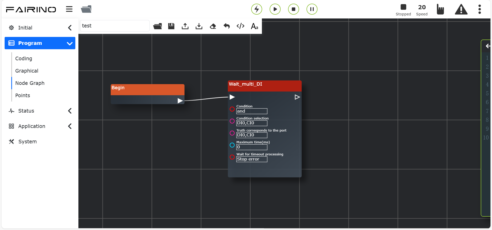

.. centered:: Schemat 11.6-3 Interfejs węzła instrukcji „Oczekiwanie na wiele DI”

4. Węzeł instrukcji „Oczekiwanie na AI”, parametry:

- Warunek: I / LUB
- Numer portu AI: Ctrl-AI0 ~ Ctrl-AI1 (WaitAI, [0~1]), End-AI0 (WaitToolAI, [0])
- Warunek: większe niż / mniejsze niż
- Wartość (%): 1 ~ 100
- Maksymalny czas (ms): 0 ~ 10000
- Obsługa przekroczenia czasu oczekiwania: Zatrzymaj i zgłoś błąd / Kontynuuj wykonanie / Czekaj w nieskończoność. Gdy wybrano czekanie w nieskończoność, maksymalny czas domyślnie wynosi 0.

.. image:: node_editor_software/007.png
   :width: 6in
   :align: center

.. centered:: Schemat 11.6-4 Interfejs węzła instrukcji „Oczekiwanie na AI”

Instrukcja pauzy
----------------

Kliknij węzeł instrukcji „Pauza”, aby przejść do interfejsu edycji węzłów graficznych.

Ta instrukcja jest instrukcją pauzy. Wstaw tę instrukcję do programu. Gdy program osiągnie tę instrukcję, robot zostanie wstrzymany. Aby kontynuować działanie, kliknij przycisk „Pauza/Wznów” w obszarze sterowania.

Węzeł instrukcji „Pauza”, parametry:

- Typ pauzy: Brak funkcji, Cylinder nie osiągnął pozycji itp.

.. image:: node_editor_software/008.png
   :width: 6in
   :align: center

.. centered:: Schemat 11.7-1 Interfejs węzła instrukcji „Pauza”

Instrukcja wywołania podprogramu
--------------------------------

Kliknij węzeł instrukcji „Wywołaj podprogram”, aby przejść do interfejsu edycji węzłów graficznych.

Ta instrukcja jest instrukcją wywołania podprogramu. Wstaw tę instrukcję do programu. Gdy program osiągnie tę instrukcję, robot zostanie wstrzymany. Aby kontynuować działanie, kliknij przycisk „Pauza/Wznów” w obszarze sterowania.

Węzeł instrukcji „Wywołaj podprogram”, parametry:

- Plik dofile: Nazwa utworzonego/ wygenerowanego pliku
- Poziom wywołania: Pierwszy poziom / Drugi poziom
- Numer id: Identyfikator pozycji odpowiadającej danemu poziomowi

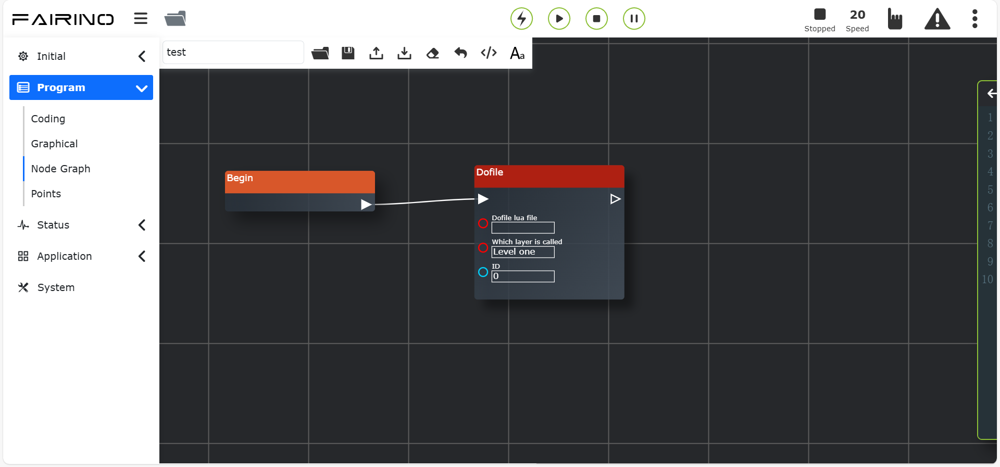

.. centered:: Schemat 11.8-1 Interfejs węzła instrukcji „Wywołaj podprogram”

Instrukcja ustawiania zmiennej systemowej
------------------------------------------

Kliknij węzeł instrukcji „Ustaw zmienną systemową”, aby przejść do interfejsu edycji węzłów graficznych.

Ta instrukcja to instrukcja ustawiania zmiennej systemowej. Dzieli się na ustawianie zmiennej systemowej i pobieranie zmiennej systemowej. Używana w połączeniu z instrukcjami while, if-else itp.

Węzeł instrukcji „Ustaw zmienną systemową”, parametry:

- Var: Niestandardowa nazwa zmiennej
- Wartość: Wprowadź zgodnie z rzeczywistą sytuacją

.. image:: node_editor_software/132.png
   :width: 6in
   :align: center

.. centered:: Schemat 11.9-1 Interfejs węzła instrukcji „Ustaw zmienną systemową”

Węzeł instrukcji „Pobierz zmienną systemową”, parametry:

- Var: Niestandardowa nazwa zmiennej

.. image:: node_editor_software/133.png
   :width: 6in
   :align: center

.. centered:: Schemat 11.9-2 Interfejs węzła instrukcji „Pobierz zmienną systemową”

.. important:: Nazwa zmiennej musi być nazwą wcześniej zdefiniowaną.

Instrukcja punkt-punkt
----------------------

Kliknij węzeł instrukcji „Punkt-punkt”, aby przejść do interfejsu edycji węzłów graficznych.

Możesz wybrać punkt docelowy. Ustawienie czasu płynnego przejścia umożliwia ciągły ruch od tego punktu do następnego. Ustawienie przesunięcia — możesz wybrać przesunięcie względem układu bazowego lub przesunięcie względem układu narzędzia, a następnie wprowadzić wartości przesunięcia x, y, z, rx, ry, rz. Konkretna ścieżka PTP to optymalna ścieżka automatycznie planowana przez sterownik ruchu.

Węzeł instrukcji „Punkt-punkt”, parametry:

- Nazwa punktu: Punkt nauczania
- Prędkość testowa (%): 0 ~ 100
- Stop: false/true
- Płynne przejście (ms): Czas płynnego przejścia 0 ~ 500
- Czy przesunięcie: Nie / Przesunięcie względem układu bazowego / Przesunięcie względem układu narzędzia. Gdy wybrano Nie, wartości parametrów dx~drz nie są aktywne.
- dx~drz: Wartość przesunięcia

.. image:: node_editor_software/010.png
   :width: 6in
   :align: center

.. centered:: Schemat 11.10-1 Interfejs węzła instrukcji „Punkt-punkt”

Instrukcja linii prostej
------------------------

Kliknij węzeł instrukcji „Linia prosta”, aby przejść do interfejsu edycji węzłów graficznych.

Funkcja tej instrukcji jest podobna do instrukcji „Punkt-punkt”, ale ścieżka do punktu docelowego w tej instrukcji jest linią prostą.

Węzeł instrukcji „Linia prosta”, parametry:

- Nazwa punktu: Punkt nauczania
- Prędkość testowa (%): 0 ~ 100
- Stop: false/true. Gdy wybrano true, parametr płynnego przejścia nie jest aktywny.
- Płynne przejście (mm): Promień płynnego przejścia 0 ~ 1000
- Czy pozycjonowanie: false/true
- Zmienna punktu pozycjonowania: REF0~99 / RES0~99. Gdy wybrano false dla pozycjonowania, parametr nie jest aktywny.
- Czy przesunięcie: Nie / Przesunięcie względem układu bazowego / Przesunięcie względem układu narzędzia. Gdy wybrano Nie, wartości parametrów dx~drz nie są aktywne.
- dx~drz: Wartość przesunięcia.

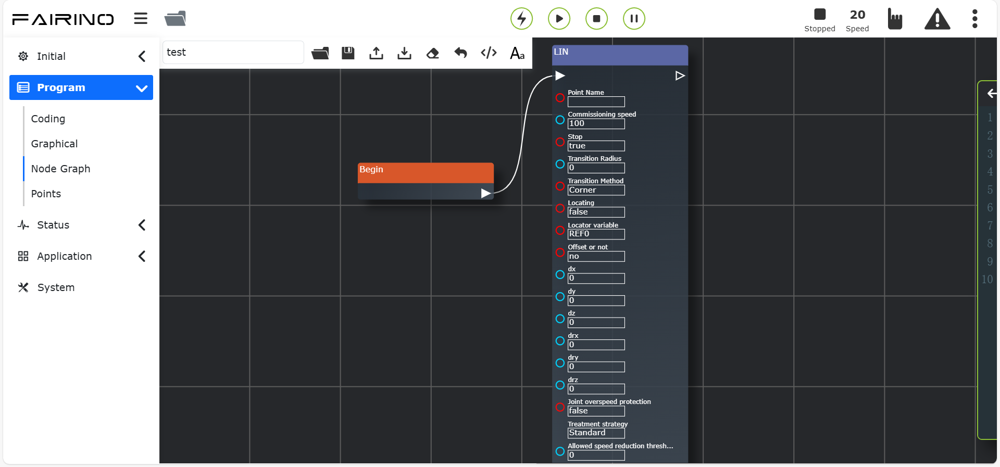

.. centered:: Schemat 11.11-1 Interfejs węzła instrukcji „Linia prosta”

Instrukcja linii prostej (seamPos)
----------------------------------

Kliknij węzeł instrukcji „Linia prosta (seamPos)”, aby przejść do interfejsu edycji węzłów graficznych.

Funkcja tej instrukcji jest stosowana w scenariuszach spawania z użyciem czujnika laserowego.

Węzeł instrukcji „Linia prosta (seamPos)”, parametry:

- Nazwa punktu: Punkt nauczania
- Prędkość testowa (%): 0 ~ 100
- Stop: false/true. Gdy wybrano true, parametr płynnego przejścia nie jest aktywny.
- Płynne przejście (mm): Promień płynnego przejścia 0 ~ 1000
- Wybór danych bufora spoiny: Wykonaj dane planowania / Wykonaj dane rejestracji
- Typ blachy: Blacha falista / Blacha trapezowa / Blacha ogrodzeniowa / Beczka po oleju / Stal pancerna falista
- Czy przesunięcie: Nie / Przesunięcie względem układu bazowego / Przesunięcie względem układu narzędzia / Przesunięcie względem surowych danych lasera. Gdy wybrano Nie, wartości parametrów dx~drz nie są aktywne.
- dx~drz: Wartość przesunięcia

.. image:: node_editor_software/134.png
   :width: 6in
   :align: center

.. centered:: Schemat 11.12-1 Interfejs węzła instrukcji „Linia prosta (seamPos)”

Instrukcja łuku
---------------

Kliknij węzeł instrukcji „Łuk”, aby przejść do interfejsu edycji węzłów graficznych.

Ruch łukowy zawiera dwa punkty: pierwszy to pośredni punkt przejściowy łuku, drugi to punkt końcowy. Zarówno dla punktu przejściowego, jak i punktu końcowego można ustawić, czy mają być przesunięte. Można wybrać przesunięcie względem układu bazowego lub przesunięcie względem układu narzędzia. Ustaw wartości przesunięcia x, y, z, rx, ry, rz. Dla punktu końcowego można ustawić promień płynnego przejścia, aby uzyskać efekt ciągłości ruchu.

Węzeł instrukcji „Łuk”, parametry:

- Pośredni punkt łuku: Punkt nauczania
- Czy przesunięcie: Nie / Przesunięcie względem układu bazowego / Przesunięcie względem układu narzędzia. Gdy wybrano Nie, wartości parametrów dx~drz nie są aktywne.
- dx~drz: Wartość przesunięcia
- Punkt końcowy łuku: Punkt nauczania
- Czy przesunięcie: Nie / Przesunięcie względem układu bazowego / Przesunięcie względem układu narzędzia. Gdy wybrano Nie, wartości parametrów dx~drz nie są aktywne.
- dx~drz: Wartość przesunięcia
- Prędkość testowa (%): 0 ~ 100
- Stop: false/true. Gdy wybrano true, parametr płynnego przejścia nie jest aktywny.
- Płynne przejście (mm): Promień płynnego przejścia 0 ~ 1000

.. image:: node_editor_software/012.png
   :width: 6in
   :align: center

.. centered:: Schemat 11.13-1 Interfejs węzła instrukcji „Łuk”

Instrukcja pełnego okręgu
-------------------------

Kliknij węzeł instrukcji „Pełny okrąg”, aby przejść do interfejsu edycji węzłów graficznych.

Ruch pełnego okręgu zawiera dwa punkty: pierwszy to pośredni punkt przejściowy 1 pełnego okręgu, drugi to pośredni punkt przejściowy 2 pełnego okręgu. Dla punktu przejściowego 2 można ustawić, czy ma być przesunięty. To przesunięcie obowiązuje jednocześnie dla punktu przejściowego 1 i punktu przejściowego 2.

Węzeł instrukcji „Pełny okrąg”, parametry:

- Pośredni punkt 1 pełnego okręgu: Punkt nauczania
- Pośredni punkt 2 pełnego okręgu: Punkt nauczania
- Prędkość testowa (%): 0 ~ 100
- Czy przesunięcie: Nie / Przesunięcie względem układu bazowego / Przesunięcie względem układu narzędzia. Gdy wybrano Nie, wartości parametrów dx~drz nie są aktywne.
- dx~drz: Wartość przesunięcia

.. image:: node_editor_software/013.png
   :width: 6in
   :align: center

.. centered:: Schemat 11.14-1 Interfejs węzła instrukcji „Pełny okrąg”

Instrukcja spirali
------------------

Kliknij węzeł instrukcji „Spirala”, aby przejść do interfejsu edycji węzłów graficznych.

Ruch spiralny zawiera trzy punkty. Te trzy punkty tworzą okrąg. Na stronie ustawień trzeciego punktu znajdują się parametry, takie jak liczba zwojów spirali, kąt korekty postawy, przyrost promienia i przyrost kierunku osi obrotu. Liczba zwojów spirali to liczba zwojów ruchu spiralnego. Kąt korekty postawy koryguje postawę na końcu spirali względem postawy pierwszego punktu spirali. Przyrost promienia to przyrost promienia każdego zwoju. Przyrost kierunku osi obrotu to przyrost w kierunku osi spirali. Ustaw, czy ma być przesunięcie. To przesunięcie obowiązuje dla całej trajektorii spirali.

Węzeł instrukcji „Spirala”, parametry:

- Pośredni punkt 1 spirali: Punkt nauczania
- Pośredni punkt 2 spirali: Punkt nauczania
- Pośredni punkt 3 spirali: Punkt nauczania
- Prędkość testowa (%): 0 ~ 100
- Czy przesunięcie: Nie / Przesunięcie względem układu bazowego / Przesunięcie względem układu narzędzia. Gdy wybrano Nie, wartości parametrów dx~drz nie są aktywne.
- dx~drz: Wartość przesunięcia
- Liczba zwojów spirali: 0 ~ 100
- Korekta kąta postawy rx (°): -1000 ~ 1000
- Korekta kąta postawy ry (°): -1000 ~ 1000
- Korekta kąta postawy rz (°): -1000 ~ 1000
- Przyrost promienia (mm): -100 ~ 100
- Przyrost kierunku osi obrotu (mm): -100 ~ 100

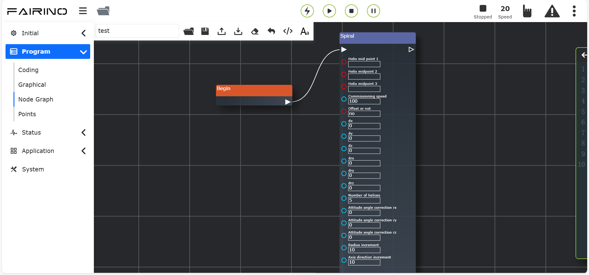

.. centered:: Schemat 11.15-1 Interfejs węzła instrukcji „Spirala”

Instrukcja nowej spirali
------------------------

Kliknij węzeł instrukcji „Nowa spirala”, aby przejść do interfejsu edycji węzłów graficznych.

Nowy ruch spiralny to zoptymalizowana wersja ruchu spiralnego. Ta instrukcja wymaga tylko jednego punktu i konfiguracji parametrów, aby zrealizować ruch spiralny. Robot używa bieżącej pozycji jako punktu początkowego. Użytkownik ustawia prędkość testową, czy przesunięcie, liczbę zwojów spirali, kąt nachylenia spirali, promień początkowy, przyrost promienia, przyrost kierunku osi obrotu i kierunek obrotu. Liczba zwojów spirali to liczba zwojów ruchu spiralnego. Kąt nachylenia spirali to kąt między osią Z narzędzia a kierunkiem poziomym. Kąt korekty postawy koryguje postawę na końcu spirali względem postawy pierwszego punktu spirali. Promień początkowy to wielkość promienia pierwszego zwoju. Przyrost promienia to przyrost promienia każdego zwoju. Przyrost kierunku osi obrotu to przyrost w kierunku osi spirali. Kierunek obrotu to zgodny z ruchem wskazówek zegara lub przeciwny.

Węzeł instrukcji „Nowa spirala”, parametry:

- Punkt początkowy spirali: Punkt nauczania
- Prędkość testowa (%): 0 ~ 100
- Czy przesunięcie: Nie / Przesunięcie względem układu bazowego / Przesunięcie względem układu narzędzia. Gdy wybrano Nie, wartości parametrów dx~drz nie są aktywne.
- dx~drz: Wartość przesunięcia
- Liczba zwojów spirali: 0 ~ 100
- Kąt nachylenia spirali (°): -100 ~ 100
- Promień początkowy: 0 ~ 100
- Przyrost promienia (mm): -100 ~ 100
- Przyrost kierunku osi obrotu (mm): -100 ~ 100
- Kierunek obrotu: Zgodnie z ruchem wskazówek zegara / Przeciwnie do ruchu wskazówek zegara

.. image:: node_editor_software/016.png
   :width: 6in
   :align: center

.. centered:: Schemat 11.16-1 Interfejs węzła instrukcji „Nowa spirala”

Instrukcja spirali poziomej
---------------------------

Kliknij węzeł instrukcji „Spirala pozioma”, aby przejść do interfejsu edycji węzłów graficznych.

Instrukcja „H-Spiral” to ruch spiralny w przestrzeni poziomej. Ta instrukcja jest umieszczana po instrukcji ruchu pojedynczego odcinka (linii prostej).

Węzeł instrukcji „Spirala pozioma”, parametry:

- Promień spirali: 0~100 mm
- Prędkość kątowa spirali: 0~2 obr/s
- Kierunek obrotu: spirala zgodnie / przeciwnie do ruchu wskazówek zegara
- Kąt nachylenia spirali: 0~40°

.. image:: node_editor_software/014.png
   :width: 6in
   :align: center

.. centered:: Schemat 11.17-1 Interfejs węzła instrukcji „Spirala pozioma”

Instrukcja funkcji sklejanej (Spline)
-------------------------------------

Kliknij węzeł instrukcji „Funkcja sklejana”, aby przejść do interfejsu edycji węzłów graficznych.

Ta instrukcja dzieli się na trzy części: początek grupy funkcji sklejanych, odcinek funkcji sklejanych i koniec grupy funkcji sklejanych. Początek grupy funkcji sklejanych jest znacznikiem początkowym ruchu funkcji sklejanych. Odcinek funkcji sklejanych w obecnym programowaniu węzłów zawiera tylko odcinek SPL. Koniec grupy funkcji sklejanych jest znacznikiem końcowym ruchu funkcji sklejanych.

Węzeł instrukcji „Funkcja sklejana - SPTP”, parametry:

- Nazwa punktu: Punkt nauczania
- Prędkość testowa (%): 0 ~ 100

.. image:: node_editor_software/017.png
   :width: 6in
   :align: center

.. centered:: Schemat 11.18-1 Interfejs węzła instrukcji „Funkcja sklejana”

Instrukcja nowej funkcji sklejanej (N-Spline)
---------------------------------------------

Kliknij węzeł instrukcji „Nowa funkcja sklejana”, aby przejść do interfejsu edycji węzłów graficznych.

Ta instrukcja jest instrukcją optymalizacji algorytmu funkcji sklejanej i w przyszłości zastąpi istniejącą instrukcję funkcji sklejanej. Instrukcja ta dzieli się na trzy części: początek trajektorii wielopunktowej, odcinek trajektorii wielopunktowej i koniec trajektorii wielopunktowej. Początek trajektorii wielopunktowej jest znacznikiem początkowym ruchu trajektorii wielopunktowej. Odcinek trajektorii wielopunktowej to ustawianie poszczególnych punktów trajektorii. Kliknij ikonę, aby przejść do interfejsu dodawania punktów. Koniec trajektorii wielopunktowej jest znacznikiem końcowym ruchu trajektorii wielopunktowej. Tutaj można ustawić tryb sterowania i prędkość testową. Tryb sterowania dzieli się na zadany punkt kontrolny i zadany punkt ścieżki.

Węzeł instrukcji „Nowa funkcja sklejana”, parametry:

- Tryb sterowania: Punkt nauczania
- Globalny średni czas połączenia: typ całkowity, większy niż 10, wartość domyślna 2000 ms

Węzeł instrukcji „Nowa funkcja sklejana - SPL”, parametry:

- Nazwa punktu: Punkt nauczania
- Prędkość testowa (%): 0 ~ 100
- Promień płynnego przejścia: 0 ~ 1000
- Czy ostatni punkt: Nie / Tak

.. image:: node_editor_software/018.png
   :width: 6in
   :align: center

.. centered:: Schemat 11.19-1 Interfejs węzła instrukcji „Nowa funkcja sklejana”

Instrukcja ruchu wahadłowego
----------------------------

Kliknij węzeł instrukcji „Ruch wahadłowy”, aby przejść do interfejsu edycji węzłów graficznych.

Ta instrukcja zawiera dwie części. Pierwsza część wybiera numer wahadła z skonfigurowanymi parametrami. Połączenie Body oznacza, że program łączący węzeł jest wykonywany między „Rozpocznij wahadło” a „Zatrzymaj wahadło”.

Węzeł instrukcji „Ruch wahadłowy”, parametry:

- Numer: 0~7

.. image:: node_editor_software/019.png
   :width: 6in
   :align: center

.. centered:: Schemat 11.20-1 Interfejs węzła instrukcji „Ruch wahadłowy”

Instrukcja odtwarzania trajektorii
----------------------------------

Kliknij węzeł instrukcji „Odtwarzanie trajektorii”, aby przejść do interfejsu edycji węzłów graficznych.

W tej instrukcji użytkownik musi najpierw mieć nagraną trajektorię.

Podczas programowania, najpierw użyj instrukcji punkt-punkt, aby dotrzeć do odpowiedniego punktu początkowego trajektorii, a następnie w instrukcji odtwarzania trajektorii wybierz trajektorię, wybierz wygładzanie trajektorii, ustaw prędkość testową. Instrukcja ładowania trajektorii jest używana głównie do wcześniejszego odczytania pliku trajektorii i wyodrębnienia go jako instrukcji trajektorii, co lepiej sprawdza się w scenariuszach śledzenia przenośnika taśmowego.

Węzeł instrukcji „Odtwarzanie trajektorii”, parametry:

- Nazwa trajektorii: Nagrana trajektoria
- Wygładzanie trajektorii: Nie / Tak
- Prędkość testowa (%): 0 ~ 100, wartość domyślna 25

.. image:: node_editor_software/020.png
   :width: 6in
   :align: center

.. centered:: Schemat 11.21-1 Interfejs węzła instrukcji „Odtwarzanie trajektorii”

Instrukcja przesunięcia punktu
------------------------------

Kliknij węzeł instrukcji „Przesunięcie punktu”, aby przejść do interfejsu edycji węzłów graficznych.

Ta instrukcja jest instrukcją ogólnego przesunięcia. Wprowadź poszczególne wartości przesunięcia. Połączenie Body oznacza, że program łączący węzeł jest wykonywany między rozpoczęciem a zakończeniem. Instrukcje ruchu w środku zostaną przesunięte względem układu bazowego (lub układu obiektu).

Węzeł instrukcji „Przesunięcie punktu”, parametry:

- ∆x: Wartość przesunięcia, -300~300
- ∆y: Wartość przesunięcia, -300~300
- ∆z: Wartość przesunięcia, -300~300
- ∆rx: Wartość przesunięcia, -300~300
- ∆ry: Wartość przesunięcia, -300~300
- ∆rz: Wartość przesunięcia, -300~300

.. image:: node_editor_software/021.png
   :width: 6in
   :align: center

.. centered:: Schemat 11.22-1 Interfejs węzła instrukcji „Przesunięcie punktu”

Instrukcja serwo
----------------

Kliknij węzeł instrukcji „Serwo”, aby przejść do interfejsu edycji węzłów graficznych.

Instrukcja sterowania serwo (ruch w przestrzeni kartezjańskiej) – ta instrukcja umożliwia sterowanie ruchem robota za pomocą sterowania absolutną pozy i orientacją lub przesunięcia względem bieżącej pozy i orientacji.

Węzeł instrukcji „Serwo”, parametry:

- Sposób ruchu: Pozycja absolutna / Przesunięcie względem układu bazowego / Przesunięcie względem układu narzędzia
- x: Wartość przesunięcia, -300~300
- y: Wartość przesunięcia, -300~300
- z: Wartość przesunięcia, -300~300
- rx: Wartość przesunięcia, -300~300
- ry: Wartość przesunięcia, -300~300
- rz: Wartość przesunięcia, -300~300
- Współczynnik proporcjonalności x: 0~1
- Współczynnik proporcjonalności y: 0~1
- Współczynnik proporcjonalności z: 0~1
- Współczynnik proporcjonalności rx: 0~1
- Współczynnik proporcjonalności ry: 0~1
- Współczynnik proporcjonalności rz: 0~1
- Przyspieszenie (%): 0~100
- Prędkość (%): 0~100
- Cykl instrukcji (s): 0.001~0.016
- Czas filtracji (s): 0~1
- Wzmocnienie proporcjonalne: 0~100

.. image:: node_editor_software/022.png
   :width: 6in
   :align: center

.. centered:: Schemat 11.23-1 Interfejs węzła instrukcji „Serwo”

Instrukcja trajektorii
----------------------

Kliknij węzeł instrukcji „Trajektoria”, aby przejść do interfejsu edycji węzłów graficznych.

W tej instrukcji użytkownik musi najpierw mieć nagraną trajektorię.

Węzeł instrukcji „Trajektoria”, parametry:

- Wybór pliku trajektorii: Nagrana trajektoria
- Prędkość testowa (%): 0 ~ 100, wartość domyślna 25

.. image:: node_editor_software/023.png
   :width: 6in
   :align: center

.. centered:: Schemat 11.24-1 Interfejs węzła instrukcji „Trajektoria”

Instrukcja trajektorii J
------------------------

Kliknij węzeł instrukcji „Trajektoria J”, aby przejść do interfejsu edycji węzłów graficznych.

W tej instrukcji użytkownik musi najpierw mieć nagraną trajektorię. Można ją wcześniej zaimportować w interfejsie programu nauczania. Instrukcje trajektorii i trajektorii J są interfejsami ogólnymi, odpowiednimi do bezpośredniego podawania trajektorii przez kamerę. Gdy dostępny jest plik dyskretnych punktów trajektorii w ustalonym formacie, można go zaimportować do systemu, aby robot poruszał się zgodnie z trajektorią z zaimportowanego pliku.

Węzeł instrukcji „Trajektoria J”, parametry:

- Wybór pliku trajektorii: Nagrana trajektoria
- Prędkość testowa (%): 0 ~ 100, wartość domyślna 25
- Tryb trajektorii: Punkt ścieżki / Punkt kontrolny

.. image:: node_editor_software/024.png
   :width: 6in
   :align: center

.. centered:: Schemat 11.25-1 Interfejs węzła instrukcji „Trajektoria J”

Instrukcja DMP
--------------

Kliknij węzeł instrukcji „DMP”, aby przejść do interfejsu edycji węzłów graficznych.

DMP to metoda uczenia się przez naśladowanie trajektorii, która wymaga wcześniejszego zaplanowania trajektorii referencyjnej. W interfejsie edycji polecenia wybierz punkt nauczania jako nowy punkt początkowy, kliknij „Dodaj”, „Zastosuj”, aby zapisać tę instrukcję. Konkretna ścieżka DMP to nowa trajektoria naśladująca trajektorię referencyjną, zaczynająca się od nowego punktu początkowego.

Węzeł instrukcji „DMP”, parametry:

- Nazwa punktu: Punkt nauczania
- Prędkość testowa (%): 0 ~ 100, wartość domyślna 100

.. image:: node_editor_software/025.png
   :width: 6in
   :align: center

.. centered:: Schemat 11.26-1 Interfejs węzła instrukcji „DMP”

Instrukcja transformacji obiektu
--------------------------------

Kliknij węzeł instrukcji „Transformacja obiektu”, aby przejść do interfejsu edycji węzłów graficznych.

Wybierz układ współrzędnych obiektu, który ma zostać automatycznie przekształcony. Kliknij „Dodaj”, „Zastosuj”, aby zapisać tę instrukcję. Po dodaniu instrukcji PTP lub LIN, połączenie z Body umożliwia wykonanie jej wewnątrz tej instrukcji, a punkty w układzie współrzędnych obiektu są automatycznie przekształcane.

Węzeł instrukcji „Transformacja obiektu”, parametry:

- Układ współrzędnych obiektu: Lista układów współrzędnych obiektu

.. image:: node_editor_software/026.png
   :width: 6in
   :align: center

.. centered:: Schemat 11.27-1 Interfejs węzła instrukcji „Transformacja obiektu”

Instrukcja transformacji narzędzia
----------------------------------

Kliknij węzeł instrukcji „Transformacja narzędzia”, aby przejść do interfejsu edycji węzłów graficznych.

Wybierz układ współrzędnych narzędzia, który ma zostać automatycznie przekształcony. Kliknij „Dodaj”, „Zastosuj”, aby zapisać tę instrukcję. Po dodaniu instrukcji PTP lub LIN, połączenie z Body umożliwia wykonanie jej wewnątrz tej instrukcji, a punkty w układzie współrzędnych narzędzia są automatycznie przekształcane.

Węzeł instrukcji „Transformacja narzędzia”, parametry:

- Układ współrzędnych narzędzia: Lista układów współrzędnych narzędzia

.. image:: node_editor_software/027.png
   :width: 6in
   :align: center

.. centered:: Schemat 11.28-1 Interfejs węzła instrukcji „Transformacja narzędzia”

Węzeł instrukcji cyfrowego wejścia/wyjścia (IO)
-----------------------------------------------

Kliknij węzeł instrukcji „Ustaw DO” / „Pobierz DI”, aby przejść do interfejsu edycji węzłów graficznych.

Ta instrukcja to instrukcja IO, dzieląca się na dwie części: ustawianie IO (SetDO/SPLCSetDO) i pobieranie IO (GetDI/SPLCGetDI).

1. Węzeł instrukcji „Ustaw DO”, parametry:

- Port: Ctrl-DO0 ~ Ctrl-CO7 (blokujący: SetDO, nieblokujący: SPLCSetDO, [0~15]), End-DO0 ~ End-DO1 (blokujący: SetToolDO, nieblokujący: SPLCSetToolDO, [0~1])
- Stan: false/true
- Czy blokować: Blokuj / Nie blokuj
- Wygładzanie trajektorii: Break / Serious
- Czy zastosować wątek: Nie / Tak

.. image:: node_editor_software/028.png
   :width: 6in
   :align: center

.. centered:: Schemat 11.29-1 Interfejs węzła instrukcji „Ustaw DO”

2. Węzeł instrukcji „Pobierz DI”, parametry:

- Port: Ctrl-DI0 ~ Ctrl-CI7 (blokujący: GetDI, nieblokujący: SPLCGetDI, [0~15]), End-DI0 ~ End-DI1 (blokujący: GetToolDI, nieblokujący: SPLCGetToolDI, [0~1])
- Czy blokować: Blokuj / Nie blokuj
- Stan: false/true
- Maksymalny czas oczekiwania (ms): 0 ~ 10000
- Czy zastosować wątek: Nie / Tak

.. image:: node_editor_software/029.png
   :width: 6in
   :align: center

.. centered:: Schemat 11.29-2 Interfejs węzła instrukcji „Pobierz DI”

Instrukcja analogowego AI
-------------------------

Kliknij węzeł instrukcji „Ustaw AO” / „Pobierz AI”, aby przejść do interfejsu edycji węzłów graficznych.

Ta instrukcja dzieli się na dwie części: ustawianie wyjścia analogowego (SetAO/SPLCSetAO) i pobieranie wejścia analogowego (GetAI/SPLCGetAI).

1. Węzeł instrukcji „Ustaw AO”, parametry:

- Port: Ctrl-AO0 ~ Ctrl-AO1 (blokujący: SetAO, nieblokujący: SPLCSetAO, [0~1]), End-AO0 (blokujący: SetToolAO, nieblokujący: SPLCSetToolAO, [0])
- Wartość (%): 0 ~ 100
- Czy blokować: Blokuj / Nie blokuj
- Czy zastosować wątek: Nie / Tak

.. image:: node_editor_software/030.png
   :width: 6in
   :align: center

.. centered:: Schemat 11.30-1 Interfejs węzła instrukcji „Ustaw AO”

2. Węzeł instrukcji „Pobierz AI”, parametry:

- Port: Ctrl-AI0 ~ Ctrl-AI1 (blokujący: GetAI, nieblokujący: SPLCGetAI, [0~1]), End-AI0 (blokujący: GetToolAI, nieblokujący: SPLCGetToolAI, [0])
- Warunek: większe niż / mniejsze niż
- Wartość (%): 0 ~ 100
- Maksymalny czas (ms): 0 ~ 10000
- Czy blokować: Blokuj / Nie blokuj
- Czy zastosować wątek: Nie / Tak

.. image:: node_editor_software/031.png
   :width: 6in
   :align: center

.. centered:: Schemat 11.30-2 Interfejs węzła instrukcji „Pobierz AI”

Węzeł instrukcji wirtualnego IO
-------------------------------

Kliknij węzeł instrukcji „Ustaw symulowane zewnętrzne DI” / „Ustaw symulowane zewnętrzne AI”, aby przejść do interfejsu edycji węzłów graficznych.

Ta instrukcja to wirtualna instrukcja sterowania IO, która umożliwia ustawianie symulowanych stanów zewnętrznych DI i AI oraz pobieranie symulowanych stanów DI i AI.

1. Węzeł instrukcji „Ustaw symulowane zewnętrzne DI”, parametry:

- Port: Vir-Ctrl-DI0 ~ Vir-Ctrl-DI15 (SetVirtualDI, [0~15]), Vir-End-DI0 ~ Vir-End-DI1 (SetVirtualToolDI, [1~2])
- Stan: false/true

.. image:: node_editor_software/032.png
   :width: 6in
   :align: center

.. centered:: Schemat 11.31-1 Interfejs węzła instrukcji „Ustaw symulowane zewnętrzne DI”

2. Węzeł instrukcji „Ustaw symulowane zewnętrzne AI”, parametry:

- Port: Vir-Ctrl-AI0 ~ Vir-Ctrl-AI0 (SetVirtualAI, [0~1]), Vir-End-AI0 (SetVirtualToolAI, [0])
- Wartość (v/ma): 0 ~ 20

.. image:: node_editor_software/033.png
   :width: 6in
   :align: center

.. centered:: Schemat 11.31-2 Interfejs węzła instrukcji „Ustaw symulowane zewnętrzne AI”

Węzeł instrukcji rozszerzonego IO
---------------------------------

Kliknij węzeł instrukcji „Pobierz symulowane zewnętrzne DI” / „Pobierz symulowane zewnętrzne AI”, aby przejść do interfejsu edycji węzłów graficznych.

Aux-IO to funkcja instrukcji do komunikacji robota z PLC w celu sterowania zewnętrznymi rozszerzonymi IO. Wymaga ustanowienia komunikacji UDP między robotem a PLC.

1. Węzeł instrukcji „Pobierz symulowane zewnętrzne DI”, parametry:

- Port: Vir-Ctrl-DI0 ~ Vir-Ctrl-DI15 (GetVirtualDI, [0~15]), Vir-End-DI0 ~ Vir-End-DI1 (GetVirtualToolDI, [1~2])

.. image:: node_editor_software/034.png
   :width: 6in
   :align: center

.. centered:: Schemat 11.32-1 Interfejs węzła instrukcji „Pobierz symulowane zewnętrzne DI”

2. Węzeł instrukcji „Ustaw symulowane zewnętrzne AI”, parametry:

- Port: Vir-Ctrl-AI0 ~ Vir-Ctrl-AI0 (GetVirtualAI, [0~1]), Vir-End-AI0 (GetVirtualToolAI, [0])

.. image:: node_editor_software/035.png
   :width: 6in
   :align: center

.. centered:: Schemat 11.32-2 Interfejs węzła instrukcji „Ustaw symulowane zewnętrzne AI”

3. Węzeł instrukcji „Konfiguruj komunikację UDP”, parametry:

- ip: Adres IP
- port: Numer portu
- Okres komunikacji (ms): 0 ~ 10000

.. image:: node_editor_software/036.png
   :width: 6in
   :align: center

.. centered:: Schemat 11.32-3 Interfejs węzła instrukcji „Konfiguruj komunikację UDP”

Instrukcja ruchomego wyjścia cyfrowego (DO)
-------------------------------------------

Kliknij węzeł instrukcji „Ruchome DO”, aby przejść do interfejsu edycji węzłów graficznych.

Ta instrukcja realizuje funkcję ciągłego wysyłania sygnału DO w zadanym odstępie podczas ruchu liniowego.

Węzeł instrukcji „Ciągłe wyjście ruchomego DO”, parametry:

- Port: Ctrl-DO0 ~ Ctrl-DO0 (MoveDOStart, [0~15]), End-DO1 (MoveDOStart, [0~1])
- Ustawiony odstęp (mm): 0 ~ 500
- Współczynnik wypełnienia impulsu wyjściowego (%): 0 ~ 99

Węzeł instrukcji „Jednorazowe wyjście ruchomego DO”, parametry:

- Port: Ctrl-DO0 ~ Ctrl-DO0 (MoveDOOnceStart, [0~15]), End-DO1 (MoveDOOnceStart, [0~1])
- Tryb wyjścia: Wyjście w odcinku jednostajnym / Swobodna konfiguracja
- Czas ustawienia (ms): 0 ~ 1000 (w trybie wyjścia w odcinku jednostajnym domyślnie -1)
- Czas resetu (ms): 0 ~ 1000 (w trybie wyjścia w odcinku jednostajnym domyślnie -1)

.. image:: node_editor_software/037.png
   :width: 6in
   :align: center

.. centered:: Schemat 11.33-1 Interfejs węzła instrukcji „Jednorazowe/ciągłe wyjście ruchomego DO”

Instrukcja układu współrzędnych
-------------------------------

Kliknij węzeł instrukcji powiązanej z „Ustaw układ współrzędnych narzędzia” / „Ustaw układ współrzędnych obiektu”, aby przejść do interfejsu edycji węzłów graficznych.

Ta instrukcja dzieli się na dwie części: „Ustaw układ współrzędnych narzędzia” i „Ustaw układ współrzędnych obiektu”.

Wybierz nazwę układu współrzędnych narzędzia, kliknij „Zastosuj”, aby dodać tę instrukcję do programu. Gdy program wykona tę instrukcję, ustawi układ współrzędnych narzędzia robota.

1. Węzeł instrukcji „Ustaw układ współrzędnych narzędzia”, parametry:

- Nazwa układu współrzędnych narzędzia: toolcoord1 ~ toolcoord19 (SetToolList, [0~19]), etoolcoord0 ~ etoolcoord14 (SetExToolList, [0~14])

.. image:: node_editor_software/038.png
   :width: 6in
   :align: center

.. centered:: Schemat 11.34-1 Interfejs węzła instrukcji „Ustaw układ współrzędnych narzędzia”

2. Węzeł instrukcji „Ustaw układ współrzędnych obiektu”, parametry:

- Nazwa układu współrzędnych obiektu: wobjcoord1 ~ wobjcoord14

.. image:: node_editor_software/039.png
   :width: 6in
   :align: center

.. centered:: Schemat 11.34-2 Interfejs węzła instrukcji „Ustaw układ współrzędnych obiektu”

Instrukcja przełączania trybu
-----------------------------

Kliknij węzeł instrukcji „Przełączanie trybu”, aby przejść do interfejsu edycji węzłów graficznych.

Ta instrukcja umożliwia przełączenie robota w tryb ręczny. Zwykle dodaje się ją na końcu programu, aby po zakończeniu działania programu robot automatycznie przełączył się w tryb ręczny, umożliwiając przeciąganie robota.

Węzeł instrukcji „Przełączanie trybu”, parametry:

- Przełączanie trybu: Tryb ręczny

.. image:: node_editor_software/040.png
   :width: 6in
   :align: center

.. centered:: Schemat 11.35-1 Interfejs węzła instrukcji „Przełączanie trybu”

Instrukcja poziomu kolizji
--------------------------

Kliknij węzeł instrukcji „Poziom kolizji”, aby przejść do interfejsu edycji węzłów graficznych.

To ustawienie poziomu kolizji. Za pomocą tej instrukcji można regulować poziomy kolizji poszczególnych osi w czasie rzeczywistym podczas działania programu, co pozwala na bardziej elastyczne wdrażanie w scenariuszach aplikacji.

Węzeł instrukcji „Poziom kolizji”, parametry:

- Poziom standardowy: Poziom standardowy / Niestandardowy procent
- joint1-joint6 (N): 0 ~ 100, próg kolizji, typ tablicowy

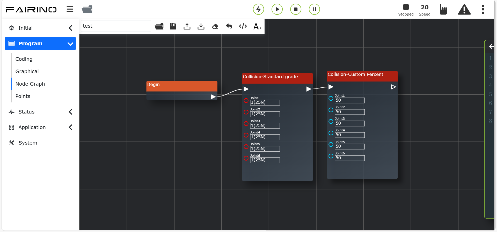

.. centered:: Schemat 11.36-1 Interfejs węzła instrukcji „Poziom kolizji”

Instrukcja przyspieszenia
-------------------------

Kliknij węzeł instrukcji „Przyspieszenie”, aby przejść do interfejsu edycji węzłów graficznych.

Instrukcja „Przyspieszenie” umożliwia oddzielne ustawienie przyspieszenia robota. Poprzez regulację współczynnika skalowania przyspieszenia instrukcji ruchu można zwiększyć lub zmniejszyć czas przyspieszania i zwalniania, umożliwiając regulację czasu cyklu ruchu robota.

Węzeł instrukcji „Przyspieszenie”, parametry:

- Procent przyspieszenia (%): 0 ~ 100

.. image:: node_editor_software/042.png
   :width: 6in
   :align: center

.. centered:: Schemat 11.37-1 Interfejs węzła instrukcji „Przyspieszenie”

Instrukcja chwytaka
-------------------

Ta instrukcja dzieli się na „Ruch chwytaka”, „Aktywacja chwytaka” i „Reset chwytaka”.

W instrukcji wyświetlany jest numer chwytaka, który został skonfigurowany i aktywowany. Ustawia się otwieranie/zamykanie chwytaka, prędkość otwierania/zamykania i moment otwierania/zamykania. Wartość jest podawana w procentach. Opcja funkcji blokowania — wybranie blokowania oznacza, że ruch chwytaka będzie czekał na zakończenie poprzedniej instrukcji ruchu, zanim zostanie wykonany; wybranie nieblokowania oznacza, że ruch chwytaka będzie przebiegał równolegle z poprzednią instrukcją ruchu.

Węzeł „Ruch chwytaka”, parametry:

- Numer chwytaka: Numer aktywowanego chwytaka
- Pozycja chwytaka: 0~100
- Prędkość otwierania/zamykania: 0~100
- Moment otwierania/zamykania: 0~100
- Maksymalny czas (ms): 0~30000
- Czy blokować: false/true

.. image:: node_editor_software/043.png
   :width: 6in
   :align: center

.. centered:: Schemat 11.38-1 Interfejs węzła „Ruch chwytaka”

Instrukcja resetu chwytaka — wyświetla skonfigurowany numer chwytaka, można dodać instrukcję resetu chwytaka do programu.

Węzeł „Reset chwytaka”, parametry:

- Numer chwytaka: Numer aktywowanego chwytaka

.. image:: node_editor_software/044.png
   :width: 6in
   :align: center

.. centered:: Schemat 11.38-2 Interfejs węzła „Reset chwytaka”

Instrukcja aktywacji chwytaka — wyświetla skonfigurowany numer chwytaka, można dodać instrukcję aktywacji chwytaka do programu.

Węzeł „Aktywacja chwytaka”, parametry:

- Numer chwytaka: Numer aktywowanego chwytaka

.. image:: node_editor_software/045.png
   :width: 6in
   :align: center

.. centered:: Schemat 11.38-3 Interfejs węzła „Aktywacja chwytaka”

Instrukcja pistoletu natryskowego
---------------------------------

Ta instrukcja jest związana z natryskiwaniem. Steruje pistoletem natryskowym: „Rozpocznij natryskiwanie”, „Zatrzymaj natryskiwanie”, „Rozpocznij czyszczenie pistoletu” i „Zatrzymaj czyszczenie pistoletu”. Podczas edycji odpowiednich węzłów tego programu należy upewnić się, że urządzenie peryferyjne pistoletu natryskowego zostało poprawnie skonfigurowane. Więcej informacji znajduje się w rozdziale dotyczącym urządzeń peryferyjnych robota.

.. image:: node_editor_software/046.png
   :width: 6in
   :align: center

.. centered:: Schemat 11.39-1 Interfejs węzła instrukcji „Rozpocznij natryskiwanie”

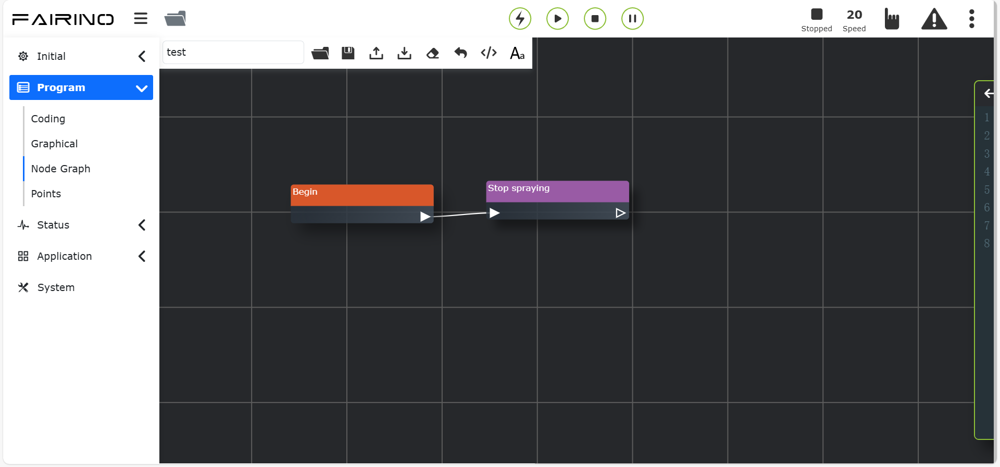

.. centered:: Schemat 11.39-2 Interfejs węzła instrukcji „Zatrzymaj natryskiwanie”

.. image:: node_editor_software/048.png
   :width: 6in
   :align: center

.. centered:: Schemat 11.39-3 Interfejs węzła instrukcji „Rozpocznij czyszczenie pistoletu”

.. image:: node_editor_software/049.png
   :width: 6in
   :align: center

.. centered:: Schemat 11.39-4 Interfejs węzła instrukcji „Zatrzymaj czyszczenie pistoletu”

Instrukcja osi rozszerzonej (sterownik + PLC)
---------------------------------------------

Ta instrukcja jest przeznaczona dla scenariuszy z użyciem osi zewnętrznej. W połączeniu z instrukcją PTP może rozłożyć ruch punktu w przestrzeni w kierunku X na ruch osi zewnętrznej. Wybierz numer osi zewnętrznej, wybierz tryb ruchu jako synchroniczny, wybierz punkt docelowy.

Dzieli się na: Ładowanie/konfiguracja komunikacji UDP, ruch asynchroniczny, synchroniczny ruch PTP/LIN, synchroniczny ruch ARC, instrukcja powrotu do zera i instrukcja włączenia zasilania.

Węzeł instrukcji „Konfiguracja komunikacji UDP”, wprowadź adres IP, numer portu i okres komunikacji.

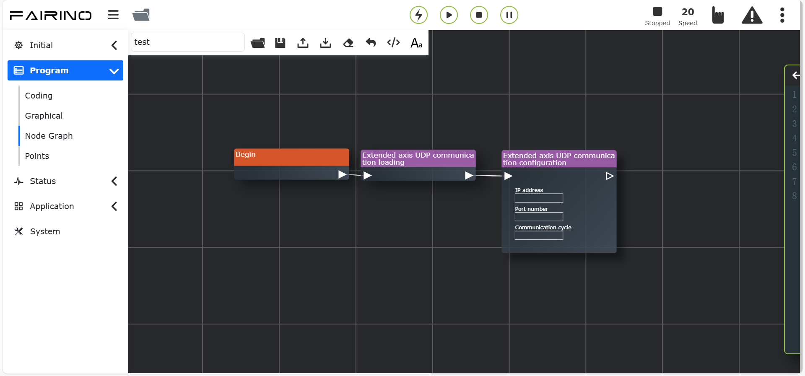

.. centered:: Schemat 11.40-1 Interfejs węzła instrukcji „Konfiguracja komunikacji UDP”

Węzeł instrukcji „Ruch asynchroniczny”, parametry:

- Nazwa punktu: Punkt nauczania
- Prędkość testowa (%): 0~100

.. image:: node_editor_software/051.png
   :width: 6in
   :align: center

.. centered:: Schemat 11.40-2 Interfejs węzła instrukcji „Ruch asynchroniczny”

Węzeł instrukcji „Synchroniczny ruch PTP/LIN”, parametry:

- Wybór ruchu: PTP / LIN
- Nazwa punktu: Punkt nauczania
- Prędkość testowa (%): 0~100

.. image:: node_editor_software/052.png
   :width: 6in
   :align: center

.. centered:: Schemat 11.40-3 Interfejs węzła instrukcji „Synchroniczny ruch PTP/LIN”

Węzeł instrukcji „Synchroniczny ruch ARC”, domyślny sposób ruchu to ARC, parametry:

- Nazwa punktu: Punkt nauczania
- Prędkość testowa (%): 0~100

.. image:: node_editor_software/053.png
   :width: 6in
   :align: center

.. centered:: Schemat 11.40-4 Interfejs węzła instrukcji „Synchroniczny ruch ARC”

Węzeł instrukcji „Powrót do zera”, parametry:

- Numer osi rozszerzonej: 1~4
- Sposób powrotu do zera: Powrót do bieżącej pozycji / Powrót do ujemnego ogranicznika / Powrót do dodatniego ogranicznika
- Prędkość poszukiwania zera: 0~2000, domyślnie 5
- Prędkość zatrzaskiwania zera: 0~2000, domyślnie 1

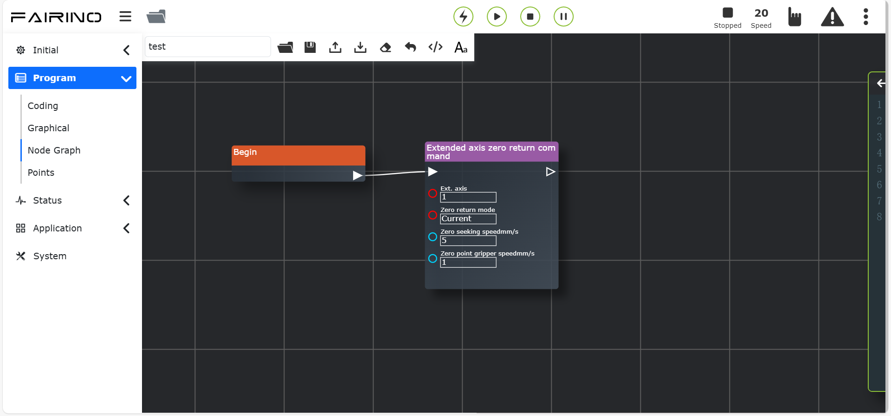

.. centered:: Schemat 11.40-5 Interfejs węzła instrukcji „Powrót do zera”

Węzeł instrukcji „Włączenie zasilania”, parametry:

- Numer osi rozszerzonej: 1~4

.. image:: node_editor_software/055.png
   :width: 6in
   :align: center

.. centered:: Schemat 11.40-6 Interfejs węzła instrukcji „Włączenie zasilania”

Instrukcja osi rozszerzonej (sterownik + serwonapęd)
----------------------------------------------------

Ta instrukcja umożliwia konfigurację parametrów osi rozszerzonej. Ustaw różne parametry w zależności od trybu sterowania. Dla już skonfigurowanej osi rozszerzonej można ustawić jej punkt zerowy.

Dzieli się na: ID serwonapędu, tryb sterowania, włączenie serwonapędu i powrót serwonapędu do zera; tryb sterowania dzieli się na tryb pozycyjny i tryb prędkościowy. Te dwa węzły należy używać w połączeniu z trybem sterowania, w przeciwnym razie dodanie ich osobno nie zadziała.

Węzeł instrukcji „ID serwonapędu”, parametry:

- ID serwonapędu: 1~15

.. image:: node_editor_software/056.png
   :width: 6in
   :align: center

.. centered:: Schemat 11.41-1 Interfejs węzła instrukcji „ID serwonapędu”

Węzeł instrukcji „Tryb sterowania”, parametry:

- ID serwonapędu: 1~15
- Tryb sterowania: Tryb pozycyjny / Tryb prędkościowy

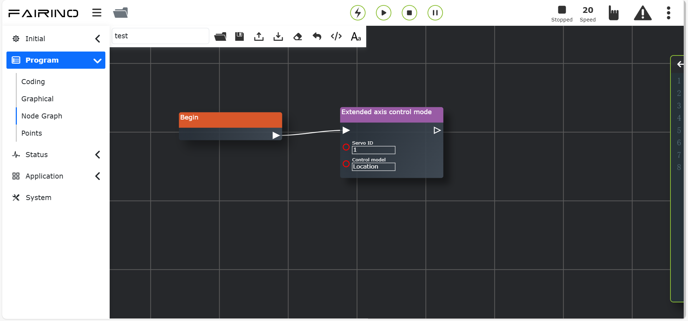

.. centered:: Schemat 11.41-2 Interfejs węzła instrukcji „Tryb sterowania”

Węzeł instrukcji „Włączenie serwonapędu”, parametry:

- ID serwonapędu: 1~15
- Włączenie serwonapędu: Włącz / Wyłącz

.. image:: node_editor_software/058.png
   :width: 6in
   :align: center

.. centered:: Schemat 11.41-3 Interfejs węzła instrukcji „Włączenie serwonapędu”

Węzeł instrukcji „Powrót serwonapędu do zera”, parametry:

- ID serwonapędu: 1~15
- Sposób powrotu do zera: Powrót do bieżącej pozycji / Powrót do ujemnego ogranicznika / Powrót do dodatniego ogranicznika
- Prędkość poszukiwania zera: 0~2000, domyślnie 5
- Prędkość zatrzaskiwania zera: 0~2000, domyślnie 1
- Procent przyspieszenia: 1~100

.. image:: node_editor_software/059.png
   :width: 6in
   :align: center

.. centered:: Schemat 11.41-4 Interfejs węzła instrukcji „Powrót serwonapędu do zera”

Węzeł instrukcji „Tryb pozycyjny”, parametry:

- ID serwonapędu: 1~15
- Pozycja docelowa: Bez ograniczeń
- Prędkość poszukiwania zera: Bez ograniczeń
- Procent przyspieszenia: 1~100

.. image:: node_editor_software/060.png
   :width: 6in
   :align: center

.. centered:: Schemat 11.41-5 Interfejs węzła instrukcji „Tryb pozycyjny”

Węzeł instrukcji „Tryb prędkościowy”, parametry:

- ID serwonapędu: 1~15
- Prędkość docelowa: Bez ograniczeń
- Procent przyspieszenia: 1~100

.. image:: node_editor_software/061.png
   :width: 6in
   :align: center

.. centered:: Schemat 11.41-6 Interfejs węzła instrukcji „Tryb prędkościowy”

Instrukcja przenośnika taśmowego
--------------------------------

Ta instrukcja zawiera cztery polecenia: wykrywanie IO w czasie rzeczywistym, wykrywanie pozycji w czasie rzeczywistym, włączenie śledzenia i wyłączenie śledzenia. Więcej informacji znajduje się w rozdziale dotyczącym urządzeń peryferyjnych robota.

Węzeł instrukcji „Wykrywanie IO w czasie rzeczywistym”, parametry:

- Maksymalny czas oczekiwania: 0~10000

.. image:: node_editor_software/062.png
   :width: 6in
   :align: center

.. centered:: Schemat 11.42-1 Interfejs węzła instrukcji „Wykrywanie IO w czasie rzeczywistym”

Węzeł instrukcji „Wykrywanie pozycji w czasie rzeczywistym”, parametry:

- Tryb pracy: Śledzenie i chwytanie / Śledzenie ruchu / Śledzenie TPD

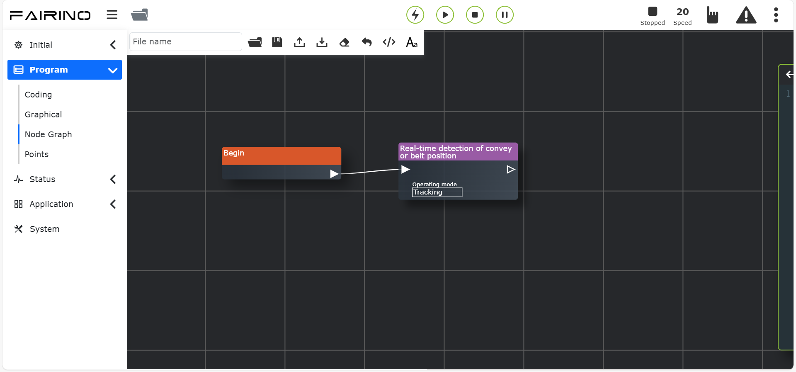

.. centered:: Schemat 11.42-2 Interfejs węzła instrukcji „Wykrywanie pozycji w czasie rzeczywistym”

Węzeł instrukcji „Włączenie śledzenia”, parametry:

- Tryb pracy: Śledzenie i chwytanie / Śledzenie ruchu / Śledzenie TPD

.. image:: node_editor_software/064.png
   :width: 6in
   :align: center

.. centered:: Schemat 11.42-3 Interfejs węzła instrukcji „Włączenie śledzenia”

.. image:: node_editor_software/065.png
   :width: 6in
   :align: center

.. centered:: Schemat 11.42-4 Interfejs węzła instrukcji „Wyłączenie śledzenia”

Instrukcja szlifowania
----------------------

Ta instrukcja jest używana w scenariuszach szlifowania. Przed użyciem należy najpierw zwolnić sterownik, a następnie załadować go, a następnie włączyć zasilanie urządzenia szlifującego. Następnie ustawić prędkość obrotową urządzenia szlifującego, siłę kontaktu, wysunięcie i tryb sterowania. Można również wyczyścić błędy urządzenia i wyzerować czujnik siły urządzenia.

.. image:: node_editor_software/066.png
   :width: 6in
   :align: center

.. centered:: Schemat 11.43-1 Interfejs węzła instrukcji „Zwolnij sterownik komunikacyjny”

.. image:: node_editor_software/067.png
   :width: 6in
   :align: center

.. centered:: Schemat 11.43-2 Interfejs węzła instrukcji „Załaduj sterownik komunikacyjny”

Węzeł instrukcji „Włączenie urządzenia”, parametry:

- Włączenie urządzenia: Włącz / Wyłącz

.. image:: node_editor_software/068.png
   :width: 6in
   :align: center

.. centered:: Schemat 11.43-3 Interfejs węzła instrukcji „Włączenie urządzenia”

.. image:: node_editor_software/069.png
   :width: 6in
   :align: center

.. centered:: Schemat 11.43-4 Interfejs węzła instrukcji „Wyczyść błędy urządzenia”

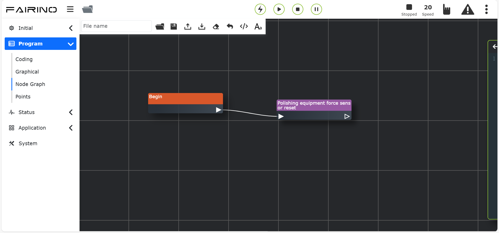

.. centered:: Schemat 11.43-5 Interfejs węzła instrukcji „Wyzeruj czujnik siły urządzenia”

Węzeł instrukcji „Prędkość obrotowa”, parametry:

- Prędkość obrotowa: 0~5500

.. image:: node_editor_software/071.png
   :width: 6in
   :align: center

.. centered:: Schemat 11.43-6 Interfejs węzła instrukcji „Prędkość obrotowa”

Węzeł instrukcji „Siła kontaktu”, parametry:

- Siła kontaktu: 0~200

.. image:: node_editor_software/072.png
   :width: 6in
   :align: center

.. centered:: Schemat 11.43-7 Interfejs węzła instrukcji „Siła kontaktu”

Węzeł instrukcji „Wysunięcie”, parametry:

- Wysunięcie: 0~12

.. image:: node_editor_software/073.png
   :width: 6in
   :align: center

.. centered:: Schemat 11.43-8 Interfejs węzła instrukcji „Wysunięcie”

Węzeł instrukcji „Tryb sterowania”, parametry:

- Tryb sterowania: Tryb powrotu do zera / Tryb pozycyjny / Tryb momentowy

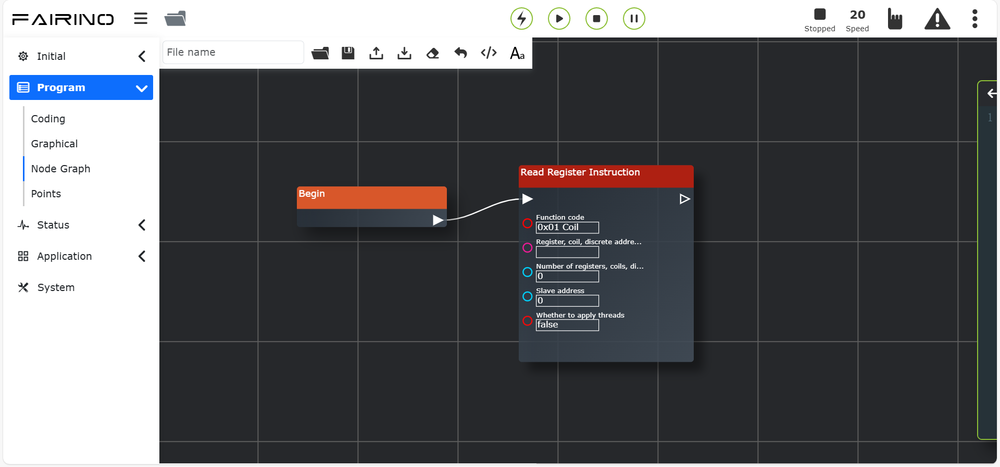

.. centered:: Schemat 11.43-9 Interfejs węzła instrukcji „Tryb sterowania”

Instrukcje spawania
-------------------

Kliknij „węzeł instrukcji powiązanej ze spawaniem”, aby przejść do interfejsu edycji węzłów graficznych.

Ta instrukcja jest przeznaczona głównie dla urządzeń peryferyjnych spawarki. Przed dodaniem tej instrukcji upewnij się, że konfiguracja spawarki w urządzeniach peryferyjnych użytkownika została zakończona. Więcej informacji znajduje się w rozdziale dotyczącym urządzeń peryferyjnych robota.

1. Węzeł instrukcji „Napięcie spawarki”, parametry:

- Napięcie spawarki: Wartość minimalna 0

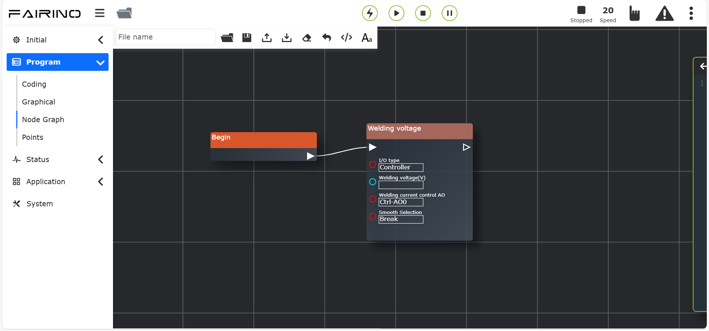

.. centered:: Schemat 11.44-1 Interfejs węzła instrukcji „Napięcie spawarki”

2. Węzeł instrukcji „Prąd spawarki”, parametry:

- Prąd spawarki: Wartość minimalna 0

.. image:: node_editor_software/076.png
   :width: 6in
   :align: center

.. centered:: Schemat 11.44-2 Interfejs węzła instrukcji „Prąd spawarki”

3. Węzeł instrukcji „Zgaśnięcie łuku / Rozpoczęcie łuku”, parametry:

- Typ I/O: I/O sterownika / I/O rozszerzone
- Numer procesu spawania: 0 ~ 7
- Maksymalny czas oczekiwania (ms): 0 ~ 10000

.. image:: node_editor_software/077.png
   :width: 6in
   :align: center

.. centered:: Schemat 11.44-3 Interfejs węzła instrukcji „Zgaśnięcie łuku / Rozpoczęcie łuku”

4. Węzeł instrukcji „Podaj gaz / Zamknij gaz”, parametry:

- Typ I/O: I/O sterownika / I/O rozszerzone

.. image:: node_editor_software/078.png
   :width: 6in
   :align: center

.. centered:: Schemat 11.44-4 Interfejs węzła instrukcji „Podaj gaz / Zamknij gaz”

5. Węzeł instrukcji „Podaj drut w przód / Zatrzymaj podawanie drutu w przód”, parametry:

- Typ I/O: I/O sterownika / I/O rozszerzone

.. image:: node_editor_software/079.png
   :width: 6in
   :align: center

.. centered:: Schemat 11.44-5 Interfejs węzła instrukcji „Podaj drut w przód / Zatrzymaj podawanie drutu w przód”

6. Węzeł instrukcji „Podaj drut w tył / Zatrzymaj podawanie drutu w tył”, parametry:

- Typ I/O: I/O sterownika / I/O rozszerzone

.. image:: node_editor_software/080.png
   :width: 6in
   :align: center

.. centered:: Schemat 11.44-6 Interfejs węzła instrukcji „Podaj drut w tył / Zatrzymaj podawanie drutu w tył”

Instrukcja spawania odcinkowego
-------------------------------

Ta instrukcja jest przeznaczona specjalnie do spawania. Służy do cyklicznego, przerywanego spawania, gdzie jeden odcinek jest spawany, a następny nie. Pomiędzy punktem początkowym a końcowym, użyj tej instrukcji, wybierz tryb spawania odcinkowego, wybierz punkt początkowy i końcowy, ustaw prędkość testową, ustaw port DO dla rozpoczęcia łuku, długość wykonania, długość niewykonania, ustaw tryb funkcji zgodnie z rzeczywistym scenariuszem aplikacji, wybierz wahadło i zasadę zaokrąglania, aby zrealizować funkcję spawania odcinkowego. Szczegółowe działanie można znaleźć w instrukcji spawania odcinkowego na stronie programowania nauczania.

Węzeł instrukcji „Spawanie odcinkowe”, parametry:

- Tryb spawania odcinkowego: Niezmienianie postawy / Zmienianie postawy
- Punkt początkowy: Punkt nauczania
- Punkt końcowy: Punkt nauczania
- Prędkość testowa (%): 0~100, domyślnie 100
- Długość wykonania: 0~1000
- Długość niewykonania: 0~1000
- Tryb funkcji: 0~100, domyślnie 100
- Wybór wahadła: Wykonaj odcinek bez wahadła / Wykonaj odcinek z wahadłem
- Zasada zaokrąglania: Bez zaokrąglania / Zaokrąglanie cyklu / Zaokrąglanie pojedynczego odcinka

.. image:: node_editor_software/081.png
   :width: 6in
   :align: center

.. centered:: Schemat 11.45-1 Interfejs węzła instrukcji „Spawanie odcinkowe”

Instrukcja śledzenia laserowego
-------------------------------

Kliknij węzeł instrukcji „Śledzenie laserowe”, aby przejść do interfejsu edycji węzłów graficznych.

Ta instrukcja zawiera trzy części: polecenie lasera, polecenie śledzenia i polecenie lokalizacji. Przed dodaniem tej instrukcji upewnij się, że czujnik śledzenia laserowego w urządzeniach peryferyjnych użytkownika został pomyślnie skonfigurowany. Więcej informacji znajduje się w rozdziale dotyczącym urządzeń peryferyjnych robota.

1. Węzeł instrukcji „Włącz / Wyłącz czujnik”, parametry:

- Wybór typu spoiny: 0 ~ 49

.. image:: node_editor_software/082.png
   :width: 6in
   :align: center

.. centered:: Schemat 11.46-1 Interfejs węzła instrukcji „Włącz / Wyłącz czujnik” — typ spoiny

- Wybór numeru zadania: 0 ~ 255

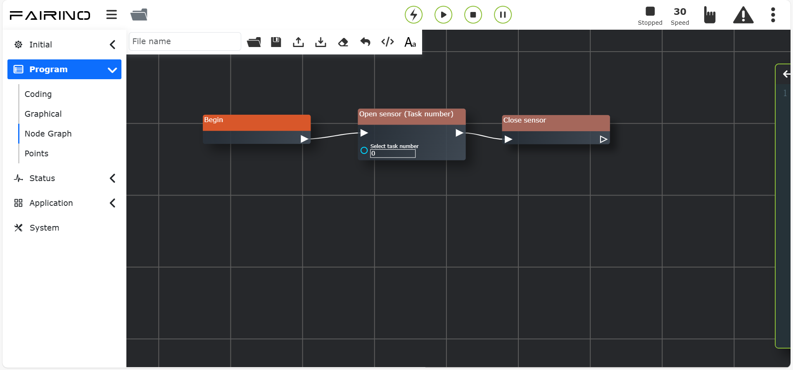

.. centered:: Schemat 11.46-2 Interfejs węzła instrukcji „Włącz / Wyłącz czujnik” — numer zadania

2. Węzeł instrukcji „Załaduj / Zwolnij czujnik”, parametry:

- Wybór funkcji: Rui niu RRT-SV2-BP / Chuang xiang CXZK-RBTA4L

.. image:: node_editor_software/083.png
   :width: 6in
   :align: center

.. centered:: Schemat 11.46-3 Interfejs węzła instrukcji „Załaduj / Zwolnij czujnik”

3. Węzeł instrukcji „Rozpocznij / Zatrzymaj śledzenie”, parametry:

- Nazwa układu współrzędnych: Niestandardowo skonfigurowany układ współrzędnych

.. image:: node_editor_software/084.png
   :width: 6in
   :align: center

.. centered:: Schemat 11.46-4 Interfejs węzła instrukcji „Rozpocznij / Zatrzymaj śledzenie”

4. Węzeł instrukcji „Rejestracja danych”, parametry:

- Wybór funkcji: Zatrzymaj rejestrację / Śledzenie w czasie rzeczywistym / Rozpocznij rejestrację / Odtwarzanie trajektorii
- Czas oczekiwania (ms): 0 ~ 10000

.. image:: node_editor_software/085.png
   :width: 6in
   :align: center

.. centered:: Schemat 11.46-5 Interfejs węzła instrukcji „Rejestracja danych”

5. Węzeł instrukcji „Odtwarzanie śledzenia laserowego”, parametry:

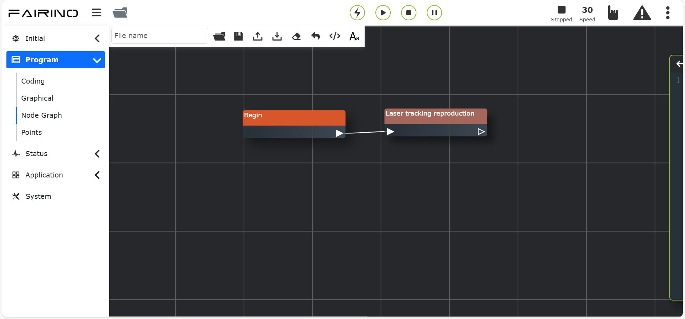

.. centered:: Schemat 11.46-6 Interfejs węzła instrukcji „Odtwarzanie śledzenia laserowego”

6. Węzeł instrukcji „Ruch do punktu pobranego przez czujnik”, parametry:

- Nazwa układu współrzędnych: Niestandardowo skonfigurowany układ współrzędnych
- Sposób ruchu: PTP / Lin
- Prędkość testowa (%): 0 ~ 100

.. image:: node_editor_software/087.png
   :width: 6in
   :align: center

.. centered:: Schemat 11.46-7 Interfejs węzła instrukcji „Ruch do punktu pobranego przez czujnik”

7. Węzeł instrukcji „Rozpocznij / Zakończ lokalizację”, parametry:

- Nazwa układu współrzędnych: Niestandardowo skonfigurowany układ współrzędnych
- Kierunek: -x / -x / -y / -y / -z / -z / Określony kierunek
- Punkt kierunkowy: Gdy nie wybrano „Określony kierunek”, parametr jest nieaktywny.
- Prędkość (%): 0 ~ 100
- Długość (mm): 0 ~ 1000
- Maksymalny czas lokalizacji (ms): 0 ~ 10000

.. image:: node_editor_software/088.png
   :width: 6in
   :align: center

.. centered:: Schemat 11.46-8 Interfejs węzła instrukcji „Rozpocznij / Zakończ lokalizację”

Instrukcja rejestracji laserowej
--------------------------------

Ta instrukcja realizuje funkcję wyodrębniania punktu początkowego i końcowego rejestracji śledzenia laserowego, umożliwiając robotowi automatyczne przejście do pozycji punktu początkowego. Nadaje się do sytuacji, gdy ruch rozpoczyna się od zewnątrz przedmiotu obrabianego i wykonywana jest rejestracja śledzenia laserowego. Jednocześnie urządzenie nadrzędne może pobrać informacje o punkcie początkowym i końcowym z danych rejestracji do późniejszego ruchu.

Realizuje funkcję regulacji prędkości odtwarzania śledzenia laserowego, umożliwiając robotowi rejestrowanie z dużą prędkością, a następnie odtwarzanie z normalną prędkością spawania, co może zwiększyć wydajność pracy.

Węzeł instrukcji „Rejestracja danych spoiny”, parametry:

- Wybór funkcji: Zatrzymaj rejestrację / Śledzenie w czasie rzeczywistym / Rozpocznij rejestrację / Odtwarzanie trajektorii
- Czas oczekiwania (ms): 0~10000, domyślnie 10
- Prędkość (%): 0~100, domyślnie 30. Parametr aktywny po wybraniu odtwarzania trajektorii.

.. image:: node_editor_software/089.png
   :width: 6in
   :align: center

.. centered:: Schemat 11.47-1 Interfejs węzła instrukcji „Rejestracja danych spoiny”

Węzeł instrukcji „Pobierz punkt początkowy/końcowy spoiny”, parametry:

- Sposób ruchu: PTP / LIN
- Prędkość (%): 0~100, domyślnie 30

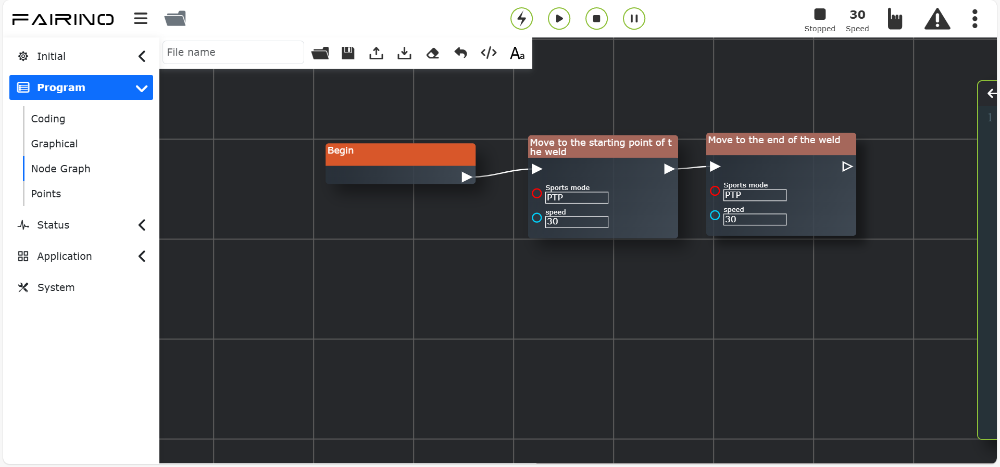

.. centered:: Schemat 11.47-2 Interfejs węzła instrukcji „Pobierz punkt początkowy/końcowy spoiny”

Instrukcja lokalizacji drutu spawalniczego
------------------------------------------

Ta instrukcja jest zwykle stosowana w scenariuszach spawania, wymagając połączenia spawarki z robotem za pomocą instrukcji IO i ruchu. Dzieli się na: rozpoczęcie lokalizacji, zakończenie lokalizacji, ustawienie punktów lokalizacji, obliczenie przesunięcia i zapis danych punktu kontaktu.

Węzeł instrukcji „Rozpocznij / Zakończ lokalizację drutu spawalniczego”, parametry:

- Pozycja odniesienia: Nie aktualizuj / Aktualizuj
- Prędkość lokalizacji: 0~100
- Odległość lokalizacji: 0~1000
- Flaga automatycznego powrotu: Nie wracaj automatycznie / Wracaj automatycznie
- Prędkość automatycznego powrotu: 0~100
- Odległość automatycznego powrotu: 0~1000
- Sposób lokalizacji: Lokalizacja punktem nauczania / Lokalizacja z przesunięciem

.. image:: node_editor_software/091.png
   :width: 6in
   :align: center

.. centered:: Schemat 11.48-1 Interfejs węzła instrukcji „Rozpocznij / Zakończ lokalizację drutu spawalniczego”

Ustawienie punktów lokalizacji w zależności od typu spoiny i metody obliczeniowej dodaje punkty.

- Gdy typ to spoina pachwinowa, a metoda obliczeniowa to 1D (jeden z xyz), punkty są dodawane z wyboru punktu a, punktu b.
- Gdy typ to spoina pachwinowa, a metoda obliczeniowa to 2D (dwa z xyz), punkty są dodawane z wyboru punktu a, punktu b, punktu e, punktu f.
- Gdy typ to spoina pachwinowa, a metoda obliczeniowa to 3D (xyz), punkty są dodawane z wyboru punktu a, punktu b, punktu c, punktu d, punktu e, punktu f.
- Gdy typ to spoina pachwinowa, a metoda obliczeniowa to 2D- (dwa z xyz, jeden z rxryrz), punkty są dodawane z wyboru punktu a, punktu b, punktu c, punktu d, punktu e, punktu f.
- Gdy typ to średnica wewnętrzna/zewnętrzna, a metoda obliczeniowa to 2D2D (dwa z xyz), punkty są dodawane z wyboru punktu a, punktu b.
- Gdy typ to punkt, a metoda obliczeniowa to 3D (xyz), punkty są dodawane z wyboru punktu a, punktu b, punktu c, punktu d, punktu e, punktu f.
- Gdy typ to kamera, a metoda obliczeniowa to 3D- (xyzrxryrz), punkty są dodawane z wyboru punktu a, punktu b.
- Gdy typ to powierzchnia, a metoda obliczeniowa to 3D- (xyzrxryrz), punkty są dodawane z wyboru punktu a, punktu b.

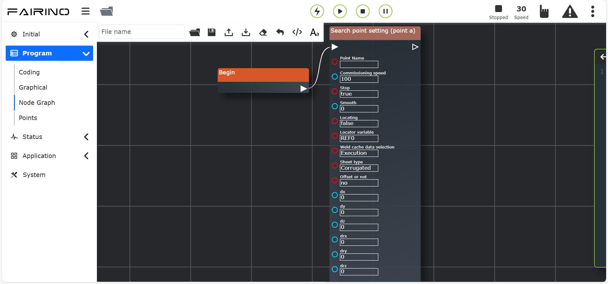

.. centered:: Schemat 11.48-2 Interfejs węzła instrukcji „Ustawienie punktów lokalizacji”

Obliczenie przesunięcia w zależności od typu spoiny i metody obliczeniowej ustawia punkty odniesienia i punkty kontaktu.

- Gdy typ to spoina pachwinowa, a metoda obliczeniowa to 1D (jeden z xyz), ustaw punkt odniesienia 1, punkt kontaktu 1.
- Gdy typ to spoina pachwinowa, a metoda obliczeniowa to 2D (dwa z xyz), ustaw punkt odniesienia 1, punkt odniesienia 2, punkt kontaktu 1, punkt kontaktu 2.
- Gdy typ to spoina pachwinowa, a metoda obliczeniowa to 3D (xyz), ustaw punkt odniesienia 1, punkt odniesienia 2, punkt odniesienia 3, punkt kontaktu 1, punkt kontaktu 2, punkt kontaktu 3.
- Gdy typ to spoina pachwinowa, a metoda obliczeniowa to 2D- (dwa z xyz, jeden z rxryrz), ustaw punkt odniesienia 1, punkt odniesienia 2, punkt odniesienia 3, punkt kontaktu 1, punkt kontaktu 2, punkt kontaktu 3.
- Gdy typ to średnica wewnętrzna/zewnętrzna, a metoda obliczeniowa to 2D2D (dwa z xyz), ustaw punkt odniesienia 1, punkt odniesienia 2, punkt odniesienia 3, punkt kontaktu 1, punkt kontaktu 2, punkt kontaktu 3.
- Gdy typ to punkt, a metoda obliczeniowa to 3D (xyz), ustaw punkt kontaktu 1, punkt kontaktu 2.
- Gdy typ to kamera, a metoda obliczeniowa to 3D- (xyzrxryrz), ustaw punkt kontaktu 1, punkt kontaktu 2.
- Gdy typ to powierzchnia, a metoda obliczeniowa to 3D- (xyzrxryrz), ustaw punkt kontaktu 1, punkt kontaktu 2, punkt kontaktu 3, punkt kontaktu 4, punkt kontaktu 5, punkt kontaktu 6.

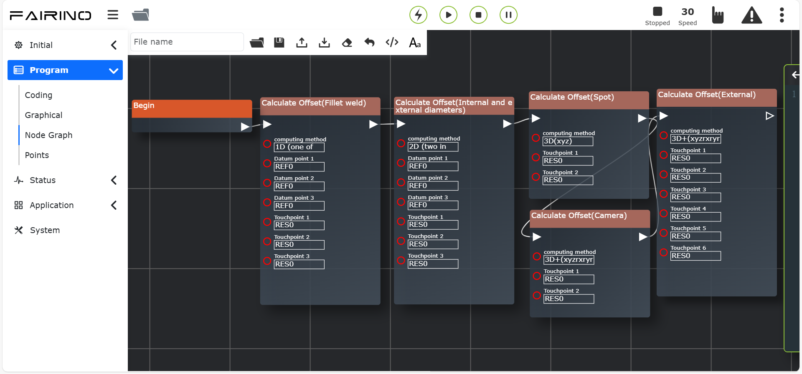

.. centered:: Schemat 11.48-3 Interfejs węzła instrukcji „Obliczenie przesunięcia”

Węzeł instrukcji „Zapis danych punktu kontaktu”, parametry:

- Nazwa punktu kontaktu: RES0~99
- Nazwa punktu kontaktu: Format danych {0,0,0,0,0,0}

.. image:: node_editor_software/094.png
   :width: 6in
   :align: center

.. centered:: Schemat 11.48-4 Interfejs węzła instrukcji „Zapis danych punktu kontaktu”

Instrukcja śledzenia łuku spawalniczego
---------------------------------------

Kliknij węzeł instrukcji „Śledzenie łuku spawalniczego”, aby przejść do interfejsu edycji węzłów graficznych.

Ta instrukcja realizuje śledzenie spawiny przez robota, wykorzystując wykrywanie odchylenia spawiny do kompensacji trajektorii. Można użyć czujnika łuku spawalniczego do wykrywania odchylenia spawiny.

Węzeł instrukcji „Włącz / Wyłącz śledzenie łuku spawalniczego”, parametry:

- Czas opóźnienia śledzenia łuku spawalniczego (ms): Wartość referencyjna 50
- Kompensacja odchylenia: Wyłącz / Włącz
- Współczynnik regulacji: 0 ~ 300
- Czas kompensacji (cykl): 0 ~ 300
- Maksymalna wielkość kompensacji na cykl (mm): 0 ~ 300
- Maksymalna całkowita wielkość kompensacji (mm): 0 ~ 300
- Wybór układu współrzędnych góra/dół: Wahadło
- Sposób ustawienia prądu odniesienia góra/dół: Sprzężenie zwrotne / Stała
- Prąd odniesienia góra/dół (A): 0 ~ 300

.. image:: node_editor_software/095.png
   :width: 6in
   :align: center

.. centered:: Schemat 11.49-1 Interfejs węzła instrukcji „Włącz / Wyłącz śledzenie łuku spawalniczego”

Instrukcja regulacji postawy
----------------------------

Kliknij węzeł instrukcji powiązanej z „Regulacja postawy”, aby przejść do interfejsu edycji węzłów graficznych.

Ta instrukcja jest przeznaczona do scenariuszy, w których śledzenie spawania samodzielnie dostosowuje postawę palnika spawalniczego. Wymaga wcześniejszego nauczenia trzech punktów PosA, PosB, PosC, w przeciwnym razie nie można dodać węzła.

Po zapisaniu trzech odpowiednich punktów postawy, w zależności od rzeczywistego kierunku ruchu robota, dodaje się instrukcję samodzielnej regulacji postawy. Więcej informacji znajduje się w rozdziale dotyczącym urządzeń peryferyjnych robota.

Węzeł instrukcji „Włącz regulację postawy”, parametry:

- Typ blachy: Blacha falista / Blacha trapezowa / Blacha ogrodzeniowa / Stal pancerna falista
- Kierunek ruchu: Od lewej do prawej / Od prawej do lewej
- Czas regulacji postawy (ms): 0 ~ 1000
- Długość pierwszego odcinka (mm):
- Typ punktu przegięcia: Z góry na dół / Z dołu do góry
- Długość drugiego odcinka (mm):
- Długość trzeciego odcinka (mm):
- Długość czwartego odcinka (mm):
- Długość piątego odcinka (mm):

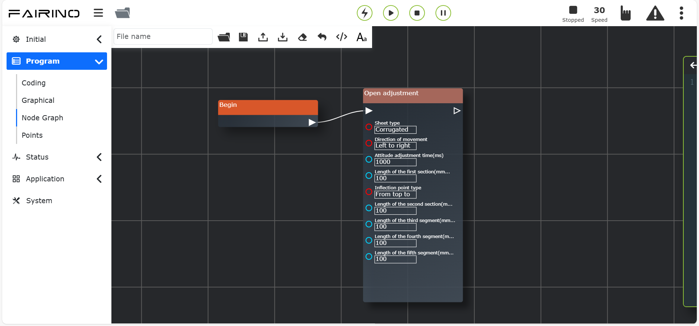

.. centered:: Schemat 11.50-1 Interfejs węzła instrukcji „Włącz regulację postawy”

Węzeł instrukcji „Wyłącz regulację postawy”, parametry:

- Typ blachy: Blacha falista / Blacha trapezowa / Blacha ogrodzeniowa / Stal pancerna falista

.. image:: node_editor_software/097.png
   :width: 6in
   :align: center

.. centered:: Schemat 11.50-2 Interfejs węzła instrukcji „Wyłącz regulację postawy”

Instrukcje sterowania siłą
--------------------------

Kliknij węzeł instrukcji powiązanej z „Sterowanie siłą”, aby przejść do interfejsu edycji węzłów graficznych.

Ta instrukcja zawiera osiem instrukcji: FT_Guard (wykrywanie kolizji), FT_Control (sterowanie stałą siłą), FT_Compliance (sterowanie podatne), FT_Spiral (wstawianie spirali), FT_Rot (wstawianie obrotu), FT_Lin (wstawianie linii), FT_FindSurface (lokalizacja powierzchni), FT_CalCenter (lokalizacja środka). Więcej informacji znajduje się w rozdziale dotyczącym urządzeń peryferyjnych robota.

1. Węzeł instrukcji „Włącz / Wyłącz wykrywanie kolizji”, parametry:

- Nazwa układu współrzędnych: Niestandardowo skonfigurowany układ współrzędnych
- Wartość logiczna Fx-Tx: true/false
- Bieżąca wartość Fx-Tx: Wprowadź zgodnie z rzeczywistą sytuacją
- Maksymalny próg Fx-Tx: Wprowadź zgodnie z rzeczywistą sytuacją
- Minimalny próg Fx-Tx: Wprowadź zgodnie z rzeczywistą sytuacją

.. image:: node_editor_software/098.png
   :width: 6in
   :align: center

.. centered:: Schemat 11.51-1 Interfejs węzła instrukcji „Włącz / Wyłącz wykrywanie kolizji”

2. Węzeł instrukcji „Włącz / Wyłącz sterowanie”, parametry:

- Nazwa układu współrzędnych: Niestandardowo skonfigurowany układ współrzędnych
- Wartość logiczna Fx-Tx: true/false
- Bieżąca wartość Fx-Tx: Dostosuj zgodnie z rzeczywistą sytuacją
- F_P_gain - F_D_gain: Dostosuj zgodnie z rzeczywistą sytuacją, nie może być 0
- Stan uruchamiania/zatrzymywania adaptacyjnego: Zatrzymaj / Włącz
- Stan uruchamiania/zatrzymywania sterowania ILC: Zatrzymaj / Trening / Praktyka
- Maksymalna odległość regulacji (mm): 0 ~ 1000
- Maksymalny kąt regulacji (°): 0 ~ 1000

.. image:: node_editor_software/099.png
   :width: 6in
   :align: center

.. centered:: Schemat 11.51-2 Interfejs węzła instrukcji „Włącz / Wyłącz sterowanie”

3. Węzeł instrukcji „Włącz / Wyłącz sterowanie podatne”, parametry:

- Współczynnik regulacji pozycji zadanej: 0 ~ 1
- Próg siły dla włączenia podatności (N): 0 ~ 100

.. image:: node_editor_software/100.png
   :width: 6in
   :align: center

.. centered:: Schemat 11.51-3 Interfejs węzła instrukcji „Włącz / Wyłącz sterowanie podatne”

4. Węzeł instrukcji „Wstawianie spirali”, parametry:

- Nazwa układu współrzędnych: Układ współrzędnych narzędzia / Układ bazowy
- Posuw promienia na obrót (mm): 0 ~ 100, wartość referencyjna: 0.7
- Próg siły lub momentu (N/Nm): 0 ~ 100, wartość referencyjna: 50
- Maksymalny czas poszukiwania (ms): 0 ~ 60000, wartość referencyjna: 60000
- Maksymalna prędkość liniowa (mm/s): 0 ~ 100, wartość referencyjna: 5

.. image:: node_editor_software/101.png
   :width: 6in
   :align: center

.. centered:: Schemat 11.51-4 Interfejs węzła instrukcji „Wstawianie spirali”

5. Węzeł instrukcji „Wstawianie obrotu”, parametry:

- Nazwa układu współrzędnych: Układ współrzędnych narzędzia / Układ bazowy
- Prędkość kątowa obrotu (°/s): 0 ~ 100, wartość referencyjna: 0.7
- Siła wyzwalająca lub moment końcowy (N/Nm): 0 ~ 100, wartość referencyjna: 50
- Maksymalny kąt obrotu (°): 0 ~ 100, wartość referencyjna: 5
- Kierunek siły: Kierunek z / Kierunek mz
- Maksymalne przyspieszenie kątowe obrotu (°/s^2): 0 ~ 100
- Kierunek wstawiania: Dodatni / Ujemny

.. image:: node_editor_software/102.png
   :width: 6in
   :align: center

.. centered:: Schemat 11.51-5 Interfejs węzła instrukcji „Wstawianie obrotu”

6. Węzeł instrukcji „Wstawianie liniowe”, parametry:

- Nazwa układu współrzędnych: Układ współrzędnych narzędzia / Układ bazowy
- Próg siły kończącej działanie (N): 0 ~ 100
- Prędkość liniowa (mm/s): 0 ~ 100, wartość referencyjna: 1
- Przyspieszenie liniowe (°/s^2): 0 ~ 100
- Maksymalna odległość wstawiania (mm): 0 ~ 100
- Kierunek wstawiania: Dodatni / Ujemny

.. image:: node_editor_software/103.png
   :width: 6in
   :align: center

.. centered:: Schemat 11.51-6 Interfejs węzła instrukcji „Wstawianie liniowe”

7. Węzeł instrukcji „Lokalizacja powierzchni”, parametry:

- Nazwa układu współrzędnych: Układ współrzędnych narzędzia / Układ bazowy
- Kierunek ruchu: Dodatni / Ujemny
- Oś ruchu: X / Y / Z
- Prędkość liniowa poszukiwania (mm/s): 0 ~ 100
- Przyspieszenie poszukiwania (mm/s^2): 0 ~ 100
- Maksymalna odległość poszukiwania (mm): 0 ~ 100
- Próg siły kończącej działanie (N): 0 ~ 100

.. image:: node_editor_software/104.png
   :width: 6in
   :align: center

.. centered:: Schemat 11.51-7 Interfejs węzła instrukcji „Lokalizacja powierzchni”

8. Węzeł instrukcji „Rozpocznij / Zakończ obliczanie płaszczyzny środkowej”

.. image:: node_editor_software/105.png
   :width: 6in
   :align: center

.. centered:: Schemat 11.51-8 Interfejs węzła instrukcji „Rozpocznij / Zakończ obliczanie płaszczyzny środkowej”

Instrukcja rejestracji momentu obrotowego
-----------------------------------------

Kliknij węzeł instrukcji powiązanej z „Rejestracja momentu obrotowego”, aby przejść do interfejsu edycji węzłów graficznych.

Ta instrukcja to instrukcja rejestracji momentu obrotowego, zawierająca trzy instrukcje: „Rozpocznij rejestrację momentu obrotowego”, „Zatrzymaj rejestrację momentu obrotowego” i „Reset rejestracji momentu obrotowego”.

Realizuje funkcję wykrywania kolizji poprzez rejestrację momentu obrotowego w czasie rzeczywistym.

Kliknij przycisk „Rozpocznij rejestrację momentu obrotowego”, aby rejestrować kolizje podczas wykonywania instrukcji ruchu. Zarejestrowany moment obrotowy w czasie rzeczywistym służy jako teoretyczna wartość do oceny wykrywania kolizji, aby zmniejszyć prawdopodobieństwo fałszywych błędów.

Gdy wartość przekroczy ustawiony zakres progowy, rejestrowany jest czas trwania wykrytej kolizji.

Kliknij przycisk „Zatrzymaj rejestrację momentu obrotowego”, aby zatrzymać rejestrację. Kliknij „Reset rejestracji momentu obrotowego”, aby przywrócić stan domyślny.

1. Węzeł instrukcji „Rozpocznij rejestrację momentu obrotowego”, parametry:

- Wybór wygładzania: Bez wygładzania (dane surowe) / Wygładzanie (dane po wygładzeniu)
- Próg ujemny stawu (Nm): -100 ~ 0
- Próg dodatni stawu (Nm): 0 ~ 100
- Czas ciągłego wykrywania kolizji stawu (ms): 0 ~ 1000

.. image:: node_editor_software/107.png
   :width: 6in
   :align: center

.. centered:: Schemat 11.52-1 Interfejs węzła instrukcji „Rozpocznij rejestrację momentu obrotowego”

2. Węzeł instrukcji „Zakończ rejestrację momentu obrotowego”

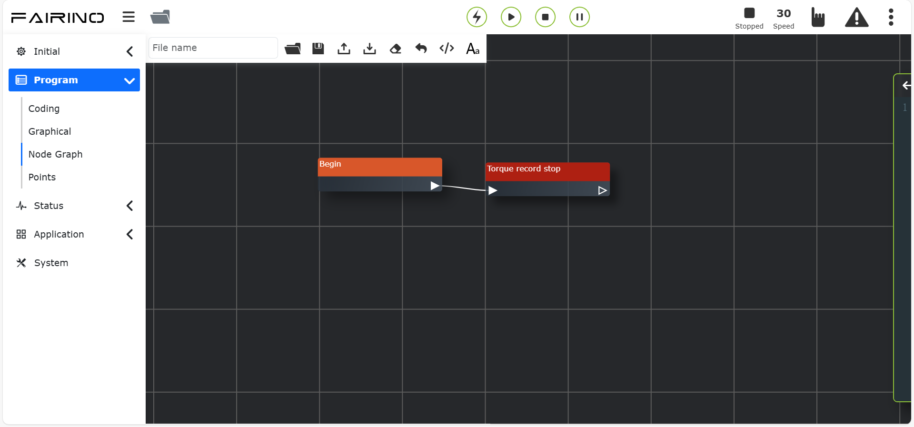

.. centered:: Schemat 11.52-2 Interfejs węzła instrukcji „Zakończ rejestrację momentu obrotowego”

3. Węzeł instrukcji „Reset rejestracji momentu obrotowego”

.. image:: node_editor_software/109.png
   :width: 6in
   :align: center

.. centered:: Schemat 11.52-3 Interfejs węzła instrukcji „Reset rejestracji momentu obrotowego”

Instrukcje Modbus
-----------------

Kliknij węzeł instrukcji powiązanej z „Modbus”, aby przejść do interfejsu edycji węzłów graficznych.

Funkcją tej instrukcji jest funkcja magistrali oparta na protokole Modbus TCP. Użytkownik może sterować komunikacją robota z klientem lub serwerem Modbus TCP (komunikacja master-slave) za pomocą odpowiednich instrukcji, wykonując operacje odczytu i zapisu na wyjściach cyfrowych, wejściach cyfrowych i rejestrach. Więcej funkcji operacyjnych Modbus TCP można uzyskać kontaktując się z nami.

Przed użyciem funkcji węzła modbus należy najpierw skonfigurować mastera, slave'a oraz nazwy DI, DO, AI, AO w konfiguracji Modbus TCP w programie nauczania.

1. Ustawienia wyjścia cyfrowego mastera, parametry:

- Nazwa mastera Modbus: Konfiguruj zgodnie z rzeczywistą sytuacją
- Nazwa DO: Konfiguruj zgodnie z rzeczywistą sytuacją
- Liczba rejestrów: typ całkowity 0 ~ 128
- Wartość rejestru: Zależna od liczby rejestrów, można wprowadzić wiele wartości. Np. liczba 3, wartości 1,0,1

.. image:: node_editor_software/110.png
   :width: 6in
   :align: center

.. centered:: Schemat 11.53-1 Interfejs węzła instrukcji „Odczyt / Zapis wyjścia cyfrowego” mastera

2. Ustawienia wejścia cyfrowego mastera, parametry:

- Nazwa mastera Modbus: Konfiguruj zgodnie z rzeczywistą sytuacją
- Nazwa DI: Konfiguruj zgodnie z rzeczywistą sytuacją
- Liczba rejestrów: typ całkowity 0 ~ 128

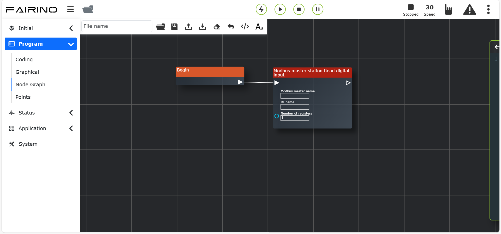

.. centered:: Schemat 11.53-2 Interfejs węzła instrukcji „Odczyt wejścia cyfrowego” mastera

3. Ustawienia wyjścia analogowego mastera, parametry:

- Nazwa mastera Modbus: Konfiguruj zgodnie z rzeczywistą sytuacją
- Nazwa AO: Konfiguruj zgodnie z rzeczywistą sytuacją
- Liczba rejestrów: typ całkowity 0 ~ 128
- Wartość rejestru: Zależna od liczby rejestrów, można wprowadzić wiele wartości. Np. liczba 3, wartości 1,0,1

.. image:: node_editor_software/112.png
   :width: 6in
   :align: center

.. centered:: Schemat 11.53-3 Interfejs węzła instrukcji „Odczyt / Zapis wyjścia analogowego” mastera

4. Ustawienia wejścia analogowego mastera, parametry:

- Nazwa mastera Modbus: Konfiguruj zgodnie z rzeczywistą sytuacją
- Nazwa AI: Konfiguruj zgodnie z rzeczywistą sytuacją
- Liczba rejestrów: typ całkowity 0 ~ 128

.. image:: node_editor_software/113.png
   :width: 6in
   :align: center

.. centered:: Schemat 11.53-4 Interfejs węzła instrukcji „Odczyt wejścia analogowego” mastera

5. Ustawienia oczekiwania na wejście cyfrowe mastera, parametry:

- Nazwa mastera Modbus: Konfiguruj zgodnie z rzeczywistą sytuacją
- Nazwa DI: Konfiguruj zgodnie z rzeczywistą sytuacją
- Stan oczekiwania: true/false
- Czas timeoutu (ms): typ całkowity 0 ~ 128

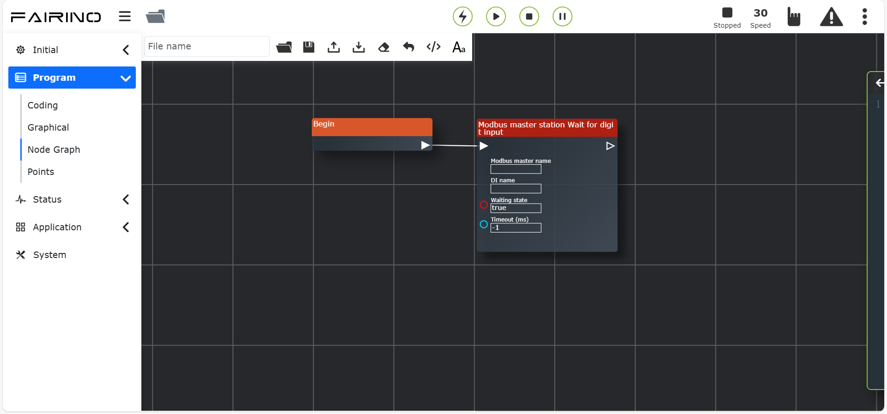

.. centered:: Schemat 11.53-5 Interfejs węzła instrukcji „Oczekiwanie na wejście cyfrowe” mastera

6. Ustawienia oczekiwania na wejście analogowe mastera, parametry:

- Nazwa mastera Modbus: Konfiguruj zgodnie z rzeczywistą sytuacją
- Nazwa AI: Konfiguruj zgodnie z rzeczywistą sytuacją
- Stan oczekiwania: większe niż / mniejsze niż
- Liczba rejestrów: typ całkowity 0 ~ 128
- Wartość rejestru: Zależna od liczby rejestrów, można wprowadzić wiele wartości.

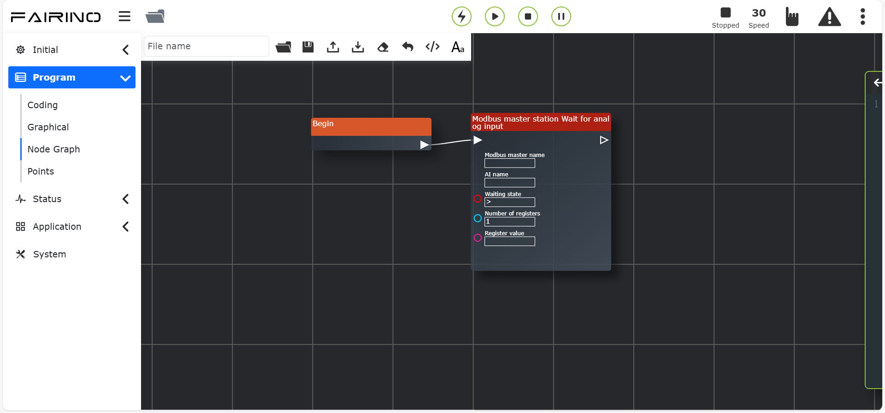

.. centered:: Schemat 11.53-6 Interfejs węzła instrukcji „Oczekiwanie na wejście analogowe” mastera

7. Ustawienia wyjścia cyfrowego slave'a, parametry:

- Nazwa DO: Konfiguruj zgodnie z rzeczywistą sytuacją
- Liczba rejestrów: typ całkowity 0 ~ 128
- Wartość rejestru: Zależna od liczby rejestrów, można wprowadzić wiele wartości. Np. liczba 3, wartości 1,0,1

.. image:: node_editor_software/116.png
   :width: 6in
   :align: center

.. centered:: Schemat 11.53-7 Interfejs węzła instrukcji „Odczyt / Zapis wyjścia cyfrowego” slave'a

8. Ustawienia wejścia cyfrowego slave'a, parametry:

- Nazwa DI: Konfiguruj zgodnie z rzeczywistą sytuacją
- Liczba rejestrów: typ całkowity 0 ~ 128

.. image:: node_editor_software/117.png
   :width: 6in
   :align: center

.. centered:: Schemat 11.53-8 Interfejs węzła instrukcji „Odczyt wejścia cyfrowego” slave'a

9. Ustawienia wyjścia analogowego slave'a, parametry:

- Nazwa AO: Konfiguruj zgodnie z rzeczywistą sytuacją
- Liczba rejestrów: typ całkowity 0 ~ 128
- Wartość rejestru: Zależna od liczby rejestrów, można wprowadzić wiele wartości. Np. liczba 3, wartości 1,0,1

.. image:: node_editor_software/118.png
   :width: 6in
   :align: center

.. centered:: Schemat 11.53-9 Interfejs węzła instrukcji „Odczyt / Zapis wyjścia analogowego” slave'a

10. Ustawienia oczekiwania na wejście cyfrowe slave'a, parametry:

- Nazwa DI: Konfiguruj zgodnie z rzeczywistą sytuacją
- Stan oczekiwania: true/false
- Czas timeoutu (ms): typ całkowity

.. image:: node_editor_software/127.png
   :width: 6in
   :align: center

.. centered:: Schemat 11.53-10 Interfejs węzła instrukcji „Oczekiwanie na wejście cyfrowe” slave'a

11. Ustawienia oczekiwania na wejście analogowe slave'a, parametry:

- Nazwa AI: Konfiguruj zgodnie z rzeczywistą sytuacją
- Stan oczekiwania: większe niż / mniejsze niż
- Liczba rejestrów: typ całkowity 0 ~ 128
- Wartość rejestru: Zależna od liczby rejestrów, można wprowadzić wiele wartości.

.. image:: node_editor_software/128.png
   :width: 6in
   :align: center

.. centered:: Schemat 11.53-11 Interfejs węzła instrukcji „Oczekiwanie na wejście analogowe” slave'a

12. Ustawienia wejścia analogowego slave'a, parametry:

- Nazwa AI: Konfiguruj zgodnie z rzeczywistą sytuacją
- Liczba rejestrów: typ całkowity 0 ~ 128

.. image:: node_editor_software/126.png
   :width: 6in
   :align: center

.. centered:: Schemat 11.53-12 Interfejs węzła instrukcji „Odczyt wejścia analogowego” slave'a

Przykład zastosowania w scenariuszu
-----------------------------------

Na przykład, załóżmy, że końcówka robota jest wyposażona w ostrze i przeciągnięta w pobliże otworu w tacy. Chcemy wykonać operacje wstawiania spiralnego, obrotowego i liniowego z użyciem czujnika siły.

- Najpierw kliknij prawym przyciskiem myszy, wybierz węzły instrukcji „Begin”, „Rozpocznij / Zakończ sterowanie”, „Wstawianie spirali”, „Wstawianie obrotu”, „Wstawianie liniowe”;
- Połącz je w następującej kolejności i skonfiguruj odpowiednie parametry.

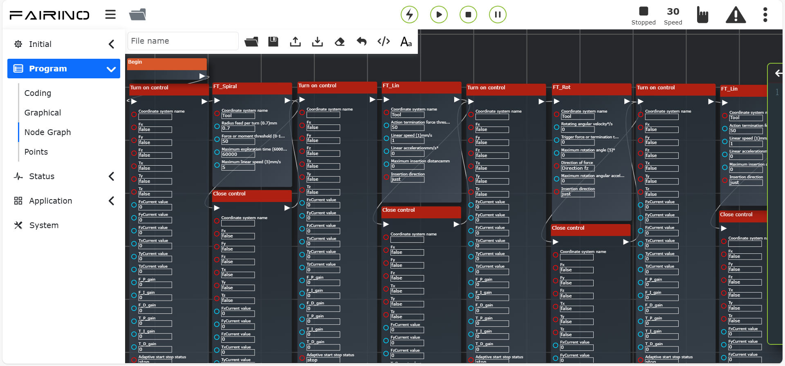

.. centered:: Schemat 11.54-1 Interfejs konfiguracji aplikacji węzła instrukcji „Sterowanie siłą”

- Wprowadź nazwę pliku. Jeśli nie wprowadzono prawidłowych parametrów, zapis nie powiedzie się i pojawi się komunikat o błędzie konfiguracji parametrów węzła instrukcji.

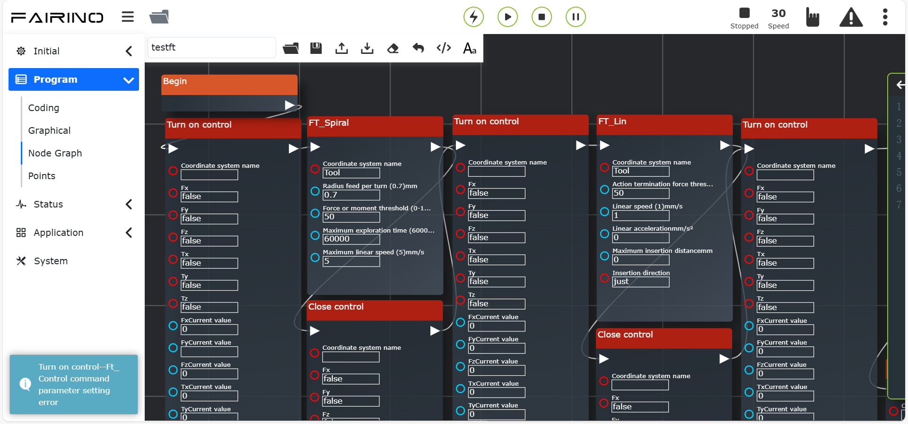

.. centered:: Schemat 11.54-2 Interfejs błędu konfiguracji parametrów węzła instrukcji

- Po kliknięciu Uruchom, robot będzie poszukiwał ruchem spiralnym i liniowym. Po znalezieniu prawidłowej pozycji otworu, wykona ruch wstawiania liniowego i obrotowego, aż do prawidłowego włożenia w otwór.