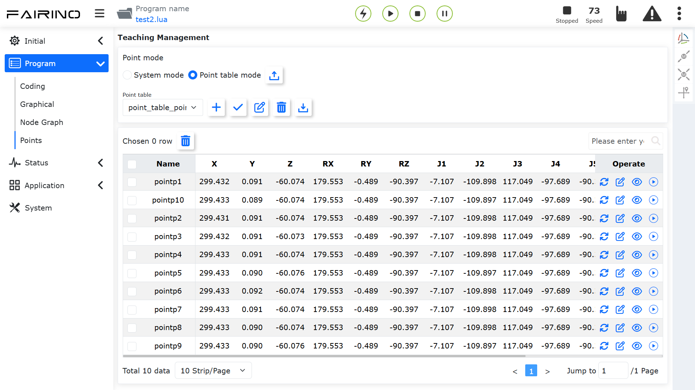
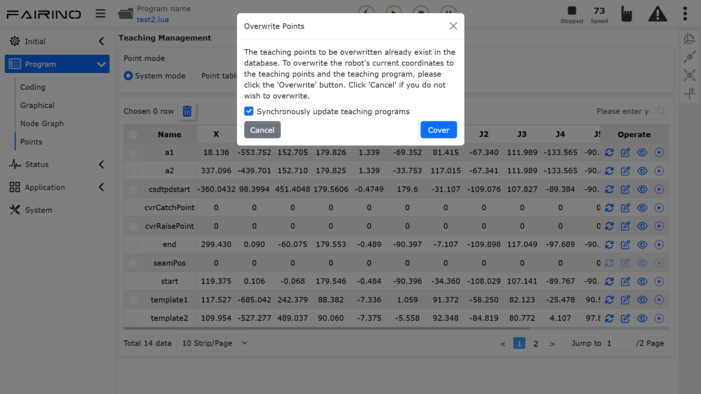

Punkty uczenia
==============

.. toctree:: 
   :maxdepth: 6

Zarządzanie punktami uczenia dzieli się na dwa tryby: "Tryb systemowy" i "Tryb tabeli punktów". Pozwalają one na realizację różnych scenariuszy detekcji poprzez wywoływanie różnych tabel punktów podczas wywoływania programu manipulatora, spełniając potrzeby receptur. W przyszłości, przy każdym dodaniu urządzenia lub produktu, pakiet danych tabeli punktów może zostać pobrany do robota za pośrednictwem komputera nadrzędnego, a nowo utworzony pakiet danych tabeli punktów robota może również zostać przesłany do komputera nadrzędnego.

**Tryb systemowy**: Obsługuje "import, eksport, usuwanie, zmianę nazwy, modyfikację, nadpisywanie, zmianę i przeglądanie" zawartości punktów uczenia oraz ruch jednotorowy do punktu uczenia.

.. image:: points/001.png
   :width: 6in
   :align: center

.. centered:: Wykres 12.1-1 Interfejs zarządzania punktami uczenia - tryb systemowy

**Tryb tabeli punktów**: Obsługuje "dodawanie, stosowanie, zmianę nazwy, usuwanie, import i eksport" tabel punktów, "usuwanie, modyfikację, przeglądanie i nadpisywanie" zawartości punktów w tabeli punktów oraz ruch jednotorowy do punktu uczenia.

.. centered:: Wykres 12.1-2 Interfejs zarządzania punktami uczenia - tryb tabeli punktów

W prawym górnym rogu interfejsu zarządzania punktami uczenia wyświetlany jest pasek operacji na samym robocie. Użytkownik może w tym interfejsie przesuwać robota, a następnie wykonać operację nadpisywania danych punktu uczenia.

.. image:: points/003.png
   :width: 6in
   :align: center

.. centered:: Wykres 12.1-3 Interfejs zarządzania punktami uczenia - pasek operacji na samym robocie

W prawym górnym rogu danych tabelarycznych punktów uczenia można wprowadzić nazwę punktu uczenia, aby go wyszukać. Po kliknięciu nazwy punktu uczenia w danych tabelarycznych punktów uczenia przechodzi się do trybu edycji, wprowadza się zmodyfikowaną nazwę, a kliknięcie w dowolne miejsce poza nazwą punktu uczenia kończy modyfikację.

.. note:: 
   .. image:: points/004.png
      :height: 0.75in
      :align: left

   Nazwa: **Przycisk importu**
   
   Funkcja: Import pliku punktów uczenia

.. note:: 
   .. image:: points/005.png
      :height: 0.75in
      :align: left

   Nazwa: **Przycisk eksportu**
   
   Funkcja: Eksport pliku punktów uczenia

.. note:: 
   .. image:: points/006.png
      :height: 0.75in
      :align: left

   Nazwa: **Przycisk usuwania**
   
   Funkcja: Po wybraniu jednego lub wielu punktów uczenia i kliknięciu przycisku "Usuń" nad tabelą pojawi się komunikat "Kliknij ponownie przycisk Usuń, aby potwierdzić usunięcie". Po ponownym kliknięciu informacje o tych punktach zostaną usunięte.

.. note:: 
   .. image:: points/007.png
      :height: 0.75in
      :align: left

   Nazwa: **Przycisk nadpisywania punktu**
   
   Funkcja: Kliknięcie powoduje nadpisanie bieżącymi danymi pozycji robota w punkcie uczenia i wyświetlenie w oknie dialogowym opcji "Czy zsynchronizować program uczenia"

.. centered:: Wykres 12.1-4 Nadpisywanie punktu uczenia

.. note:: 
   .. image:: points/009.png
      :height: 0.75in
      :align: left

   Nazwa: **Przycisk edycji**
   
   Funkcja: Kliknięcie potwierdza modyfikację wartości x, y, z, rx, ry, rz i v punktu uczenia

.. important:: 
   Zmodyfikowane wartości x, y, z, rx, ry, rz punktu uczenia nie mogą przekraczać zakresu roboczego robota.

.. note:: 
   .. image:: points/010.png
      :height: 0.75in
      :align: left

   Nazwa: **Przycisk szczegółów**
   
   Funkcja: Kliknięcie powoduje wyświetlenie szczegółów punktu uczenia

.. image:: points/011.png
   :width: 6in
   :align: center

.. centered:: Wykres 12.1-5 Szczegóły punktu uczenia

.. note:: 
   .. image:: points/012.png
      :height: 0.75in
      :align: left

   Nazwa: **Przycisk rozpoczęcia działania**
   
   Funkcja: Kliknięcie umożliwia wybór sposobu ruchu pojedynczego punktu i przesunięcie robota do pozycji tego punktu. Wybór PTP oznacza ruch punkt-punkt, wybór Lin oznacza ruch liniowy.

.. image:: points/013.png
   :width: 6in
   :align: center

.. centered:: Wykres 12.1-6 Uruchamianie punktu uczenia