Pakiety procesowe
=================

.. toctree:: 
  :maxdepth: 5

Baza wiedzy spawalniczej
-------------------------

Kliknij "Aplikacje pomocnicze" -> "Pakiety procesowe" w menu "Baza wiedzy spawalniczej", aby przejść do interfejsu funkcji bazy wiedzy spawalniczej, który obejmuje spawanie proste, spawanie łukowe, spawanie wielowarstwowe i wielościeżkowe oraz regulację orientacji.

.. image:: process/001.png
   :width: 4in
   :align: center

.. centered:: Wykres 15.1‑1 Konfiguracja osi rozszerzonej

Spawanie proste
~~~~~~~~~~~~~~~

Kliknij "Spawanie proste", aby przejść do interfejsu prowadzenia spawania prostego. Po zakończeniu konfiguracji podstawowych ustawień robota, możemy szybko wygenerować program nauczania spawania za pomocą kilku prostych kroków. Obejmuje to głównie następujących pięć kroków. Ponieważ funkcje wzajemnie się wykluczają, rzeczywista liczba kroków do wygenerowania programu nauczania spawania jest mniejsza niż pięć.

Krok pierwszy, czy używać osi rozszerzonej. Jeśli tak, należy skonfigurować odpowiednie układy współrzędnych osi rozszerzonej i włączyć oś rozszerzoną. Podczas używania osi rozszerzonej nie można używać funkcji spawania z oscylacją.

.. image:: process/002.png
   :width: 4in
   :align: center

.. centered:: Wykres 15.1‑2 Konfiguracja osi rozszerzonej

Krok drugi, wybór, czy potrzebne jest śledzenie czujnikiem. Jeśli tak, należy edytować parametry instrukcji pozycjonowania laserowego. Podczas używania śledzenia czujnikiem nie można używać funkcji spawania z oscylacją.

.. image:: process/003.png
   :width: 4in
   :align: center

.. centered:: Wykres 15.1‑3 Konfiguracja pozycjonowania laserowego

Krok trzeci, wybór, czy potrzebne jest spawanie z oscylacją. Jeśli tak, należy edytować odpowiednie parametry spawania z oscylacją.

.. image:: process/004.png
   :width: 4in
   :align: center

.. centered:: Wykres 15.1‑4 Konfiguracja spawania z oscylacją

Krok czwarty, kalibracja punktu początkowego, bezpiecznego punktu początkowego, punktu końcowego i bezpiecznego punktu końcowego. Jeśli w pierwszym kroku wybrano oś rozszerzoną, zostanie załadowana funkcja ruchu osi rozszerzonej w celu kalibracji odpowiednich punktów.

.. image:: process/005.png
   :width: 4in
   :align: center

.. centered:: Wykres 15.1‑5 Kalibracja odpowiednich punktów

Krok piąty, nadanie nazwy programowi i automatyczne otwarcie go w interfejsie nauczania programowania.

.. image:: process/006.png
   :width: 4in
   :align: center

.. centered:: Wykres 15.1‑6 Zapisywanie programu

Po pomyślnym zapisaniu programu można zmodyfikować prędkość spawania w parametrach procesu.

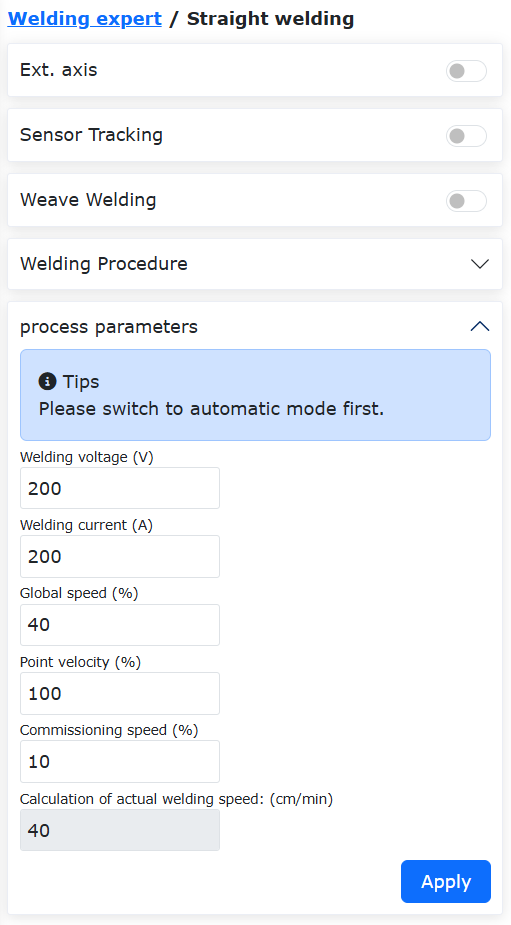

.. centered:: Wykres 15.1‑7 Parametry procesu

Spawanie łukowe
~~~~~~~~~~~~~~~

Kliknij "Spawanie łukowe" w sekcji "Kształt spawanego elementu", aby przejść do interfejsu prowadzenia spawania łukowego. Po zakończeniu konfiguracji podstawowych ustawień robota możemy szybko wygenerować program nauczania spawania za pomocą dwóch prostych kroków. Obejmuje to głównie następujące dwa kroki.

Krok pierwszy, kalibracja punktu początkowego, bezpiecznego punktu początkowego, punktu przejściowego łuku, punktu końcowego i bezpiecznego punktu końcowego.

.. image:: process/008.png
   :width: 4in
   :align: center

.. centered:: Wykres 15.1‑8 Punkty kalibracji

Krok drugi, nadanie nazwy programowi i automatyczne otwarcie go w interfejsie nauczania programowania.

.. image:: process/009.png
   :width: 4in
   :align: center

.. centered:: Wykres 15.1‑9 Zapisywanie programu

Po pomyślnym zapisaniu programu można zmodyfikować prędkość spawania w parametrach procesu.

.. image:: process/010.png
   :width: 4in
   :align: center

.. centered:: Wykres 15.1‑10 Parametry procesu

Spawanie wielowarstwowe i wielościeżkowe
~~~~~~~~~~~~~~~~~~~~~~~~~~~~~~~~~~~~~~~~~

Gdy rozmiar spoiny pachwinowej jest większy niż 10 mm, zwykle stosuje się funkcję spawania wielowarstwowego i wielościeżkowego. Funkcja ta umożliwia szablonową konfigurację programów spawania, dodanie funkcji śledzenia łuku w pierwszym przejściu spawania wielowarstwowego i wielościeżkowego oraz korektę odchylenia spoiny w kolejnych prostych przejściach spawania, poprawiając w ten sposób jakość spoiny.

Procedura operacyjna funkcji spawania wielowarstwowego i wielościeżkowego ze śledzeniem łuku jest następująca:

1) Ustaw układ współrzędnych narzędzia, wprowadź wymiary i orientację palnika spawalniczego.

.. note::
   Wartości na interfejsie są tylko przykładowe. Należy je dostosować do rzeczywistego stanu narzędzia.

.. image:: process/011.png
   :width: 4in
   :align: center

.. centered:: Wykres 15.1-11 Ustawianie układu współrzędnych narzędzia

2) Kliknij "Spawanie wielowarstwowe i wielościeżkowe", aby przejść do interfejsu.

.. image:: process/012.png
   :width: 4in
   :align: center

.. centered:: Wykres 15.1-12 Otwieranie interfejsu spawania wielowarstwowego i wielościeżkowego

3) Aby użyć funkcji śledzenia łuku, należy włączyć przełącznik "Funkcja oscylacji w pierwszej warstwie" i skonfigurować odpowiednie parametry oscylacji.

.. image:: process/013.png
   :width: 4in
   :align: center

.. centered:: Wykres 15.1-13 Włączanie funkcji oscylacji w pierwszej warstwie

4) Kliknij przycisk "Konfiguruj", edytuj parametry oscylacji, a następnie kliknij "Konfiguruj".

.. note::
   Jeśli wymagana jest kompensacja lewo-prawo podczas śledzenia łuku, można wybrać tylko typy "Oscylacja trójkątna" i "Oscylacja sinusoidalna". Częstotliwość oscylacji nie może być niższa niż 0,5 Hz, amplituda oscylacji nie może być mniejsza niż 3 mm, czasy oczekiwania w lewo i prawo muszą być takie same, a azymut oscylacji musi wynosić 0.

.. image:: process/014.png
   :width: 4in
   :align: center

.. centered:: Wykres 15.1-14 Konfiguracja parametrów oscylacji

5) Włącz przełącznik "Funkcja śledzenia łuku" i edytuj odpowiednie parametry kompensacji góra-dół i lewo-prawo.

.. note::
   Parametry śledzenia łuku należy konfigurować zgodnie z rzeczywistymi warunkami spawania, odnosząc się do "Instrukcji obsługi funkcji śledzenia łuku" lub kontaktując się z odpowiednim personelem technicznym.

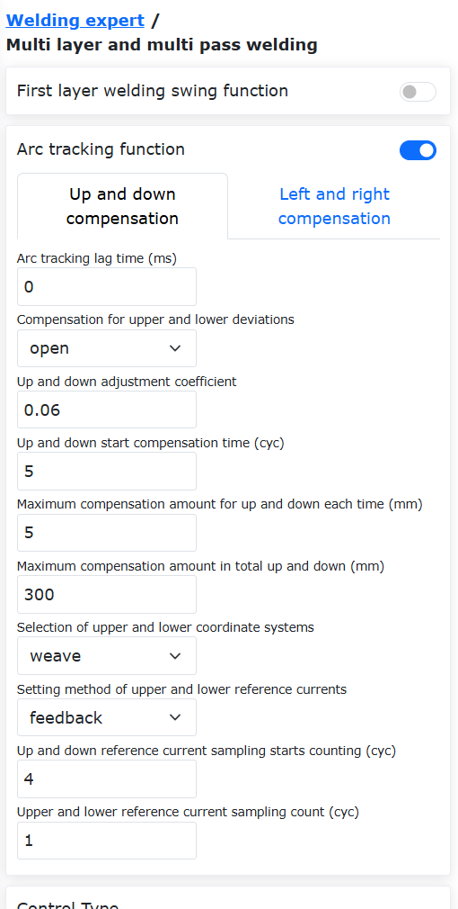

.. centered:: Wykres 15.1-15 Konfiguracja parametrów śledzenia łuku

6) W zależności od typu sterowania kliknij odpowiedni typ, aby przejść do interfejsu. Najpierw w pierwszej grupie punktów ustaw "Punkt spawania" jako pozycję początkową spawania; "Punkt X+" jako punkt w kierunku X+ względem punktu spawania w niestandardowym układzie współrzędnych przesunięcia; "Punkt Z+" jako punkt w kierunku Z+ względem punktu spawania w niestandardowym układzie współrzędnych przesunięcia; "Punkt bezpieczny" jako pozycję przejściową od poprzedniego zakończenia spawania do następnego rozpoczęcia spawania. Po wyuczeniu i ustawieniu, automatycznie przejdź do ustawiania drugiej grupy punktów.

.. image:: process/016.png
   :width: 4in
   :align: center

.. centered:: Wykres 15.1-16 Ustawianie pozycji punktu początkowego linii prostej dla spawania wielowarstwowego i wielościeżkowego

7) Wybierz "Punkt linii prostej". Tutaj "Punkt spawania" jest pozycją końcową spawania; "Punkt X+" jest punktem w kierunku X+ względem "punktu spawania" w niestandardowym układzie współrzędnych przesunięcia; "Punkt Z+" jest punktem w kierunku Z+ względem "punktu spawania" w niestandardowym układzie współrzędnych przesunięcia. Po wyuczeniu i ustawieniu kliknij przycisk "Zakończ", aby ustawić parametry spawania wielowarstwowego i wielościeżkowego.

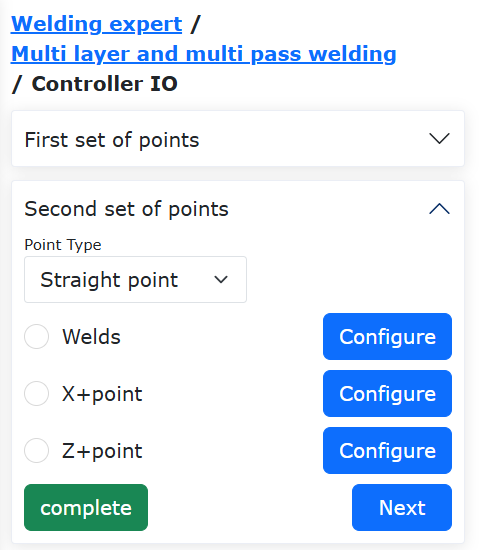

.. centered:: Wykres 15.1-17 Ustawianie pozycji punktu końcowego linii prostej dla spawania wielowarstwowego i wielościeżkowego

8) Na tej stronie można ustawić liczbę warstw i ścieżek spawania wielowarstwowego i wielościeżkowego oraz ich rozmieszczenie. Kliknij pole "On/Off" w tabeli parametrów, aby wybrać odpowiednią wartość dla aktywowanej pozycji spawania wielowarstwowego i wielościeżkowego. W kolumnach "X", "Z", "B" wprowadź oczekiwane odpowiednie wartości przesunięcia i kąta w niestandardowym układzie współrzędnych.

.. image:: process/018.png
   :width: 4in
   :align: center

.. centered:: Wykres 15.1-18 Ustawianie parametrów spawania wielowarstwowego i wielościeżkowego

9) W tym momencie wszystkie parametry zostały skonfigurowane. Wprowadź żądaną nazwę programu do zapisania i kliknij przycisk "Zapisz", aby automatycznie wygenerować odpowiedni program spawania wielowarstwowego i wielościeżkowego.

.. image:: process/019.png
   :width: 6in
   :align: center

.. centered:: Wykres 15.1-19 Generowanie programu spawania wielowarstwowego i wielościeżkowego

10) Kliknij przycisk "Otwórz program", aby odczytać program lua zapisany w poprzednim kroku. Zawartość programu jest pokazana na poniższym rysunku.

.. image:: process/020.png
   :width: 4in
   :align: center

.. centered:: Wykres 15.1-20 Przykład programu spawania wielowarstwowego i wielościeżkowego ze śledzeniem łuku

Regulacja orientacji
~~~~~~~~~~~~~~~~~~~~

Kroki konfiguracji adaptacji orientacji
++++++++++++++++++++++++++++++++++++++++

**Krok 1**: Przejdź do interfejsu konfiguracji regulacji orientacji, wybierz typ materiału i rzeczywisty kierunek ruchu robota, dostosuj orientację robota, ustaw odpowiednio punkt orientacji A, punkt orientacji B i punkt orientacji C. Zazwyczaj A jest punktem orientacji płaskiej, B jest punktem orientacji krawędzi narastającej, a C jest punktem orientacji krawędzi opadającej.

.. figure:: process/021.png
   :align: center
   :width: 4in

.. centered:: Wykres 15.1‑21 Konfiguracja regulacji orientacji

.. important:: 
	Zmiana orientacji między orientacją A i B oraz między orientacją A i C powinna być jak najmniejsza, pod warunkiem spełnienia wymagań aplikacji. Funkcja adaptacji orientacji jest funkcją pomocniczą i jest zwykle używana w połączeniu ze śledzeniem spoiny.

**Krok 2**: Wybierz polecenie "Adjust" w interfejsie poleceń programowania nauczania. Dodaj instrukcje w odpowiednich miejscach zgodnie z konkretnymi wymaganiami programowania nauczania.

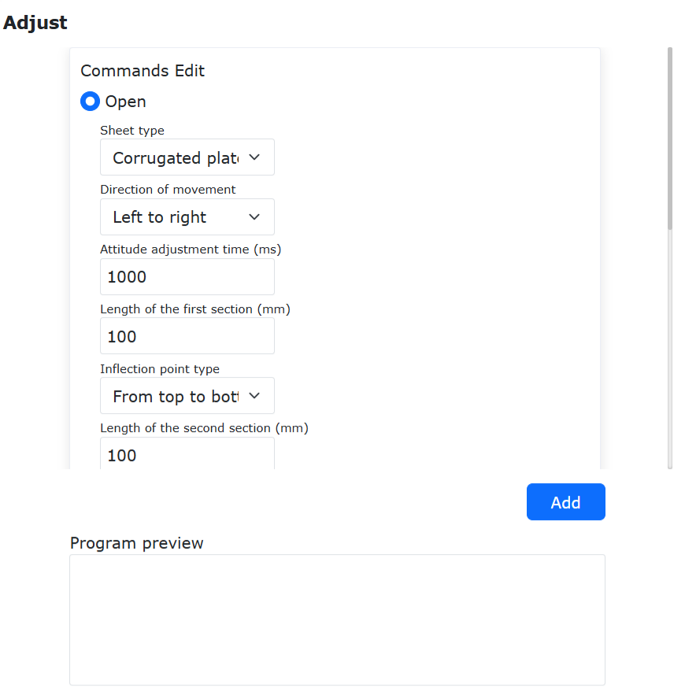

.. centered:: Wykres 15.1‑22 Edycja instrukcji regulacji orientacji

Program nauczania spawania z adaptacją orientacji w połączeniu z osią rozszerzoną i śledzeniem laserowym
++++++++++++++++++++++++++++++++++++++++++++++++++++++++++++++++++++++++++++++++++++++++++++++++++++++++++

.. list-table::
   :widths: 50 80 80
   :header-rows: 0
   :align: center

   * - **Nr**
     - **Format instrukcji**
     - **Komentarz**

   * - 1
     - EXT_AXIS_PTP(1,1laserstart)
     - #Ruch osi rozszerzonej do punktu początkowego czujnika laserowego

   * - 2
     - PTP(laserstart,10,-1,0)
     - #Ruch robota do punktu początkowego czujnika laserowego

   * - 3
     - LTSearchStart(3,20,10,10000)
     - #Rozpoczęcie pozycjonowania

   * - 4
     - LTSearchStop()
     - #Zatrzymanie pozycjonowania

   * - 5
     - EXT_AXIS_PTP(1,1,seamPos)
     - #Ruch osi rozszerzonej do punktu początkowego spoiny

   * - 6
     - Lin(seamPos,20,-1,00,0)
     - #Ruch robota do punktu początkowego spoiny

   * - 7
     - LTTrackOn()
     - #Śledzenie laserowe

   * - 8
     - ARCStart(0,10000)
     - #Zajarzenie łuku spawarki

   * - 9
     - PostureAdjustOn(0,PosA,PosC,PosB,1000)
     - #Włączenie adaptacji orientacji

   * - 10
     - EXT_AXIS_PTP(1,1,laserend)
     - #Ruch osi rozszerzonej do punktu końcowego spoiny

   * - 11
     - Lin( laserend,10,-1,0,0)
     - #Ruch robota do punktu końcowego spoiny

   * - 12
     - ARCEnd(0,10000)
     - #Wygaśnięcie łuku spawarki

   * - 13
     - PostureAdjustOff(0)
     - #Wyłączenie adaptacji orientacji

   * - 14
     - LTTrackOff
     - #Wyłączenie śledzenia laserowego

Konfiguracja systemu paletyzacji
--------------------------------

Kroki konfiguracji systemu paletyzacji
~~~~~~~~~~~~~~~~~~~~~~~~~~~~~~~~~~~~~~

**Krok 1**: W "Aplikacje pomocnicze" -> "Pakiety procesowe" kliknij element menu "Paletyzacja", aby przejść do interfejsu konfiguracji systemu paletyzacji.

Przy pierwszym użyciu należy najpierw utworzyć recepturę. Kliknij "Utwórz recepturę", wprowadź nazwę receptury, kliknij "Utwórz". Po pomyślnym utworzeniu kliknij "Rozpocznij konfigurację", aby przejść do strony konfiguracji paletyzacji.

.. figure:: process/023.png
   :align: center
   :width: 4in

.. centered:: Wykres 15.2‑1 Konfiguracja receptury paletyzacji

**Krok 2**: W sekcji konfiguracji przedmiotu kliknij "Konfiguruj", aby otworzyć okno konfiguracji przedmiotu. Ustaw "Długość", "Szerokość", "Wysokość" przedmiotu oraz punkt chwytania przedmiotu. Kliknij "Potwierdź konfigurację", aby zakończyć ustawianie informacji o przedmiocie.

.. figure:: process/024.png
   :align: center
   :width: 4in

.. centered:: Wykres 15.2‑2 Konfiguracja przedmiotu paletyzacji

**Krok 3**: W sekcji konfiguracji palety kliknij "Konfiguruj", aby otworzyć okno konfiguracji palety. Ustaw "Przednią krawędź", "Boczną krawędź" i "Wysokość" palety. Następnie ustaw stanowisko i punkt przejściowy stanowiska. Kliknij "Potwierdź konfigurację", aby zakończyć ustawianie informacji o palecie.

.. figure:: process/025.png
   :align: center
   :width: 4in

.. centered:: Wykres 15.2‑3 Konfiguracja palety paletyzacji

**Krok 4**: W sekcji konfiguracji wymiarów urządzenia paletyzacyjnego kliknij "Konfiguruj", aby otworzyć okno konfiguracji wymiarów urządzenia paletyzacyjnego. Ustaw "X", "Y", "Z" i "Angle" urządzenia. Kliknij "Potwierdź konfigurację", aby zakończyć ustawianie informacji o konfiguracji wymiarów urządzenia paletyzacyjnego.

.. important:: 
   X, Y, Z to wartości bezwzględne współrzędnych punktu w prawym górnym rogu lewej palety lub w lewym górnym rogu prawej palety względem podstawowego układu współrzędnych robota. Angle to kąt obrotu robota podczas instalacji. Zaleca się, aby wynosił 0.

.. figure:: process/026.png
   :align: center
   :width: 4in

.. centered:: Wykres 15.2‑4 Konfiguracja wymiarów urządzenia paletyzacyjnego

**Krok 5**: W sekcji konfiguracji trybu kliknij "Konfiguruj", aby otworzyć okno konfiguracji trybu.

   **Włącz/Wyłącz tryb B**: Włączony: umożliwia przełączanie między trybem A/B i konfigurację trybu B dla każdej warstwy paletyzacji. Wyłączony: uniemożliwia przełączanie na tryb B i konfigurację trybu B dla każdej warstwy paletyzacji.

   **Przełączanie tryb A/B**: Wybór trybu A: dodaje przedmioty jako tryb A, numery przedmiotów to A1, A2... Nie można regulować przezroczystości przedmiotów. Wybór trybu B: dodaje przedmioty jako tryb B, numery przedmiotów to B1, B2... W tym trybie można włączyć/wyłączyć "Pokaż konfigurację trybu A", aby wyświetlić przedmioty trybu A.

   **Włącz/Wyłącz pokaż tryb A**: Włączony: reguluje przezroczystość przedmiotów w trybie B, aby sprawdzić, czy konfiguracja trybu A/B jest rozsądna. W tym trybie można tylko wybierać, dodawać, dodawać wsadowo, usuwać i usuwać wszystkie przedmioty w trybie B. Wyłączony: nie można ustawić przezroczystości przedmiotów w trybie B.

.. important:: 
   Podczas konfigurowania przedmiotów, jeśli między przedmiotami dojdzie do kolizji, kolor tła przedmiotu zmieni się na czerwony. W takim przypadku powyższe operacje nie są możliwe. Aby przeprowadzić operację, skonfiguruj przedmioty tak, aby nie kolidowały ze sobą.

Podczas konfigurowania przedmiotów najpierw ustaw odstępy między przedmiotami. Pole po prawej stronie symuluje sposób umieszczania przedmiotów na prawej palecie. Można dodawać pojedynczo lub wsadowo. Następnie ustaw liczbę warstw paletyzacji i tryb dla każdej warstwy. Kliknij "Potwierdź konfigurację", aby zakończyć ustawianie informacji o trybie.

.. important:: 
   Kierunek paletyzacji: na przykładzie prawej palety, prawy dolny róg jest najdalszym punktem. Układa się jeden rząd przedmiotów pionowo lub poziomo od prawego dolnego rogu, następnie kolejny rząd poziomo lub pionowo powyżej, i tak dalej (kierunek paletyzacji jest oznaczony na stronie internetowej, należy go sprawdzić).
   
   Lewa paleta odzwierciedla umieszczanie przedmiotów zgodnie z trybem prawej palety.

.. figure:: process/027.png
   :align: center
   :width: 4in

.. centered:: Wykres 15.2‑5 Konfiguracja trybu A paletyzacji

.. figure:: process/028.png
   :align: center
   :width: 4in

.. centered:: Wykres 15.2‑6 Konfiguracja trybu B paletyzacji

**Krok 6**: W sekcji generowania programu nauczania kliknij "Konfiguracja zaawansowana", aby otworzyć okno konfiguracji zaawansowanej. W tym miejscu skonfiguruj "Wysokość podnoszenia pobranego materiału", "Pierwszą odległość przesunięcia", "Drugą odległość przesunięcia" i "Czas oczekiwania na przyssanie".

   **Wysokość podnoszenia pobranego materiału**: Wysokość, na jaką robot podnosi się po pomyślnym pobraniu materiału z punktu chwytania, zdefiniowana przez użytkownika.

   **Pierwsza/druga odległość przesunięcia**: Odległość przesunięcia zdefiniowana przez użytkownika dla pochylonego układania robota do punktu docelowego.
   
   **Czas oczekiwania na przyssanie**: Czas oczekiwania na przyssanie zdefiniowany przez użytkownika. Monitoruje sygnał obecności podciśnienia po przyssaniu. Jeśli sygnał nie zostanie odebrany, czynność przyssania jest powtarzana.

   **Płynne przejście**: Włączenie przycisku płynnego przejścia umożliwia konfigurację odpowiednich parametrów, takich jak czas wygładzania PTP i promień wygładzania LIN dla paletyzacji/rozpaletyzacji.
   
   - Czas wygładzania PTP: Brak czasu wygładzania / poziom 1 (200 ms) / poziom 2 (400 ms) / poziom 3 (600 ms) / poziom 4 (800 ms) / poziom 5 (1000 ms)
   - Promień wygładzania LIN: Brak promienia wygładzania / poziom 1 (200 mm) / poziom 2 (400 mm) / poziom 3 (600 mm) / poziom 4 (800 mm) / poziom 5 (1000 mm)

.. figure:: process/029.png
   :align: center
   :width: 4in

.. centered:: Wykres 15.2‑7 Konfiguracja zaawansowana paletyzacji

**Krok 7**: W sekcji generowania programu nauczania wybierz "Wybór metody", kliknij "Generuj program", otwórz "Stronę monitorowania paletyzacji". Na tej stronie można wyświetlać i przeglądać "Informacje o generowaniu", "Informacje o alarmach" i "Program paletyzacji".

.. figure:: process/030.png
   :align: center
   :width: 6in

.. centered:: Wykres 15.2‑8 Monitoring systemu paletyzacji

**Krok 8**: Jeśli program paletyzacji zgłosi błąd w trakcie działania, program zostanie zatrzymany. Użytkownik najpierw czyści błąd, a następnie ponownie wybiera program paletyzacji do uruchomienia. W tym momencie pojawi się okno dialogowe "Poprzedni program przerwany". Kliknij przycisk "Kontynuuj", aby kontynuować działanie, lub kliknij przycisk "Rozpocznij od nowa", aby uruchomić program od początku.

.. centered:: Wykres 15.2‑9 Kontynuacja programu paletyzacji

Śledzenie taśmociągu
--------------------

Kroki konfiguracji śledzenia taśmociągu
~~~~~~~~~~~~~~~~~~~~~~~~~~~~~~~~~~~~~~~

**Krok 1**: W "Aplikacje pomocnicze" -> "Pakiety procesowe" wybierz element menu "Taśmociąg", aby przejść do interfejsu konfiguracji śledzenia taśmociągu. Kliknij przycisk "Konfiguruj I/O taśmociągu", aby szybko skonfigurować I/O wymagane do funkcji taśmociągu. Następnie skonfiguruj odpowiednie parametry w zależności od rzeczywistej używanej funkcji. Na przykładzie funkcji chwytania bez śledzenia wizyjnego, należy skonfigurować kanał enkodera taśmociągu, rozdzielczość, skok, wybrać "Nie" dla współpracy z wizją i kliknąć "Konfiguruj".

.. figure:: process/032.png
   :align: center
   :width: 4in

.. figure:: process/033.png
   :align: center
   :width: 4in

.. centered:: Wykres 15.3‑1 Konfiguracja taśmociągu

**Krok 2**: Następnie ustaw wartości kompensacji punktu chwytania w trzech kierunkach X, Y, Z. Można je ustawić w trakcie debugowania w zależności od rzeczywistej sytuacji.

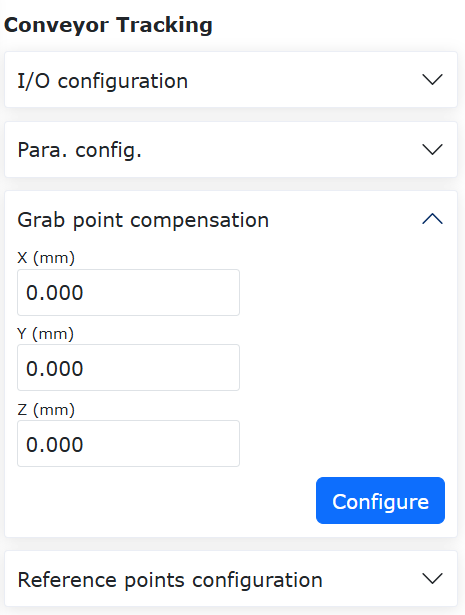

.. centered:: Wykres 15.3‑2 Konfiguracja kompensacji punktu chwytania taśmociągu

**Krok 3**: Uruchom taśmociąg, przesuń kalibrowany obiekt do zdefiniowanej pozycji punktu A i zatrzymaj taśmociąg. Przesuń robota, wyrównaj czubek pręta kalibracyjnego na końcówce robota z czubkiem kalibrowanego obiektu. Kliknij przycisk punktu początkowego A, pojawi się okno dialogowe wyświetlające bieżącą wartość enkodera i pozycję robota. Kliknij "Kalibruj", aby zakończyć kalibrację punktu początkowego A.

.. figure:: process/035.png
   :align: center
   :width: 4in

.. centered:: Wykres 15.3‑3 Konfiguracja punktu początkowego A

**Krok 4**: Kliknij przycisk punktu odniesienia, aby przejść do kalibracji punktu odniesienia. Podczas zapisywania punktu odniesienia zapisz wysokość i orientację robota podczas chwytania. Podczas każdego śledzenia śledzenie i chwytanie będą odbywać się z wysokością i orientacją zapisanego punktu odniesienia. Może to być inna wysokość niż punkty A i B. Kliknij "Kalibruj", aby zakończyć kalibrację punktu odniesienia.

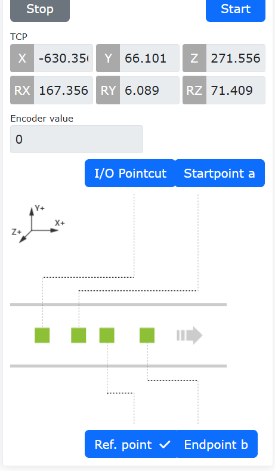

.. centered:: Wykres 15.3‑4 Konfiguracja punktu odniesienia

**Krok 5**: Uruchom taśmociąg, przesuń kalibrowany obiekt do zdefiniowanej pozycji punktu B i zatrzymaj taśmociąg. Przesuń robota, wyrównaj czubek pręta kalibracyjnego na końcówce robota z czubkiem kalibrowanego obiektu. Kliknij przycisk punktu końcowego B, pojawi się okno dialogowe wyświetlające bieżącą wartość enkodera i pozycję robota. Kliknij "Kalibruj", aby zakończyć kalibrację punktu końcowego B.

.. figure:: process/037.png
   :align: center
   :width: 4in

.. centered:: Wykres 15.3‑5 Konfiguracja punktu końcowego B

Program nauczania śledzenia taśmociągu
~~~~~~~~~~~~~~~~~~~~~~~~~~~~~~~~~~~~~~

.. list-table::
   :widths: 50 80 80
   :header-rows: 0
   :align: center

   * - **Nr**
     - **Format instrukcji**
     - **Komentarz**

   * - 1
     - PTP(conveyorstart,30,-1,0)
     - #Punkt początkowy chwytania robota

   * - 2
     - While(1) do
     - #Pętla chwytania

   * - 3
     - ConveyorlODetect(10000)
     - #Wykrywanie obiektu w czasie rzeczywistym przez I/O

   * - 4
     - ConveyorGetTrackData(1)
     - #Pobranie pozycji obiektu

   * - 5
     - ConveyorTrackStart(1)
     - #Rozpoczęcie śledzenia taśmociągu

   * - 6
     - Lin(cvrCatchPoint,10,-1,0,0)
     - #Robot dociera do punktu chwytania

   * - 7
     - MoveGripper(1,255,255,0,10000)
     - #Chwytak chwyta obiekt

   * - 8
     - Lin(cvrRaisePoint,10,-1,0,0)
     - #Robot podnosi

   * - 9
     - ConveyorTrackEnd()
     - #Zakończenie śledzenia taśmociągu

   * - 10
     - PTP(conveyorraise,30,-1,0)
     - #Robot dociera do punktu oczekiwania

   * - 11
     - PTP(conveyorend,30,-1,0)
     - #Robot dociera do punktu umieszczenia

   * - 12
     - MoveGripper(1,0,255,0,10000)
     - #Chwytak zwalnia

   * - 13
     - PTP(conveyorstart,50,-1,0)
     - #Robot wraca do punktu początkowego chwytania, oczekując na następne chwytanie

   * - 14
     - end
     - #Koniec

Struktura systemu śledzenia taśmociągu robota
~~~~~~~~~~~~~~~~~~~~~~~~~~~~~~~~~~~~~~~~~~~~~

Sposób podłączenia komunikacji danych enkodera taśmociągu
+++++++++++++++++++++++++++++++++++++++++++++++++++++++++++

Aby zrealizować zautomatyzowany proces załadunku i rozładunku w obróbce skrawaniem, opracowano pakiet CNC oparty na komunikacji FOCAS, który umożliwia wymianę komunikacyjną i ruch współpracujący między robotem współpracującym a obrabiarką CNC.

Jak pokazano na rysunku, komunikacja FOCAS opiera się na Ethernet. Podłączając kabel sieciowy do portu sieciowego skrzynki sterowniczej robota i wbudowanego portu sieciowego obrabiarki, można ustanowić komunikację FOCAS między robotem a obrabiarką, umożliwiając sterowanie CNC i monitorowanie stanu obrabiarki po stronie robota.

.. figure:: process/038.png
   :align: center
   :width: 6in

.. centered:: Wykres 15.3‑6 Schemat topologii systemu śledzenia taśmociągu robota

W systemie (a) to komputer, (b) to robot i jego skrzynka sterownicza, (c) to system taśmociągu składający się z taśmociągu, czujnika fotoelektrycznego i enkodera. Skrzynka sterownicza robota jest połączona z czujnikiem fotoelektrycznym i taśmociągiem za pomocą komunikacji cyfrowej I/O, a z enkoderem taśmociągu za pomocą RS485.

Konfiguracja taśmociągu
+++++++++++++++++++++++++++++++++++

Przejdź do interfejsu konfiguracji funkcji śledzenia taśmociągu w roboczej stronie internetowej, w sekcji "Ustawienia podstawowe", "Urządzenia peryferyjne", "Śledzenie" w podmenu "Taśmociąg".

.. figure:: process/039.png
   :align: center
   :width: 4in

.. centered:: Wykres 15.3‑7 Strona konfiguracji śledzenia taśmociągu

Na stronie konfiguracji śledzenia taśmociągu kliknij przycisk "Jednokliknięciowa konfiguracja I/O taśmociągu", aby skonfigurować fizyczne połączenie taśmociągu.
Następnie w polu "Wybór funkcji" w sekcji "Konfiguracja parametrów" wybierz z listy rozwijanej "Ruch śledzenia". Następnie skonfiguruj właściwości enkodera, oś przedmiotu w śledzonym układzie współrzędnych przedmiotu, współpracę z wizją, a w polu "Typ śledzenia" wybierz z listy rozwijanej "Ruch doganiający". W tym miejscu można wprowadzić odległość początkową śledzenia i odległość końcową śledzenia.
Odległość początkowa śledzenia: po wyzwoleniu sygnału śledzenia, taśmociąg uruchamia się, a robot zaczyna działać po przebyciu ustawionej odległości. Gdy ustawiona jest na -1, jest wyzwalana automatycznie.
Odległość końcowa śledzenia: maksymalna odległość, na której robot podąża synchronicznie z ruchem taśmociągu po rozpoczęciu działania.

Konfiguracja układu współrzędnych śledzenia
+++++++++++++++++++++++++++++++++++++++++++

Ruch śledzenia wykorzystuje układ współrzędnych przedmiotu jako układ współrzędnych taśmociągu, dlatego konieczne jest ustawienie układu współrzędnych przedmiotu.

Kliknij "Ustawienia początkowe", "Podstawowe", w sekcji "Układy współrzędnych" wybierz "Układ współrzędnych przedmiotu". Kliknij, aby wybrać układ współrzędnych przedmiotu inny niż "wobjcoord0" do kalibracji. Sposób kalibracji nie zostanie tutaj szczegółowo opisany.

.. figure:: process/040.png
   :align: center
   :width: 4in

.. centered:: Wykres 15.3‑8 Ustawianie układu współrzędnych śledzenia

Funkcja ruchu doganiającego śledzenia taśmociągu
++++++++++++++++++++++++++++++++++++++++++++++++

Ruch doganiający jest rodzajem ruchu śledzenia taśmociągu. W porównaniu z ruchem śledzenia, punkty ruchu w ruchu doganiającym nie wymagają uczenia ruchu nad układem współrzędnych przedmiotu. Można je uczyć w dowolnym miejscu układu współrzędnych przedmiotu, a następnie synchronizować ruch końcówki z taśmociągiem za pomocą parametru "Odległość początkowa śledzenia". Jest to bardziej elastyczny sposób śledzenia.

Wprowadzenie do funkcji ruchu doganiającego śledzenia taśmociągu
+++++++++++++++++++++++++++++++++++++++++++++++++++++++++++++++++

Poniżej podano przykład ruchu doganiającego w celu zilustrowania charakterystyki ruchu.

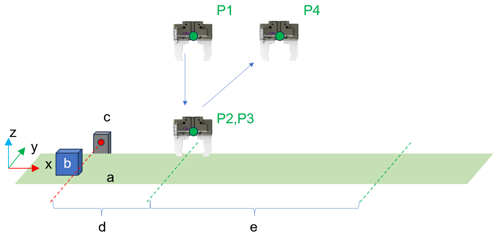

.. centered:: Wykres 15.3‑9 Przykład uczenia ruchu doganiającego śledzenia taśmociągu

Gdzie x to kierunek ruchu taśmociągu w układzie współrzędnych przedmiotu, a to płaszczyzna taśmociągu, b to docelowy przedmiot do chwytania, c to czujnik fotoelektryczny, d to odległość początkowa śledzenia, e to odległość końcowa śledzenia. P1 do P4 to punkty pośrednie uczenia i ich kolejność, P2 do P3 to te same punkty pośrednie, zawierające ruch chwytaka.

.. figure:: process/042.png
   :align: center
   :width: 6in

.. centered:: Wykres 15.3‑10 Przykład wykonania po uczeniu ruchu doganiającego śledzenia taśmociągu

Gdy powyższy program nauczania rozpocznie działanie, a przedmiot wyzwoli sygnał przełącznika fotoelektrycznego, robot będzie czekał, aż cel przemieści się pod P1, a następnie rozpocznie ruch śledzenia. Ruch chwytaka robota będzie odbywał się po trajektorii pokazanej na powyższym rysunku.

Nauczanie programu ruchu doganiającego
+++++++++++++++++++++++++++++++++++++++

Logika programu ruchu doganiającego jest zasadniczo taka sama jak logika ruchu śledzenia i obejmuje pozyskiwanie sygnału wyzwalającego, pobieranie danych taśmociągu oraz rozpoczęcie części ruchu śledzenia.

**Krok 1**: Kliknij "Program nauczania", "Programowanie", wybierz i kliknij przycisk "Taśmociąg" w sekcji "Instrukcje urządzeń peryferyjnych", aby przejść do strony konfiguracji instrukcji taśmociągu.

.. figure:: process/043.png
   :align: center
   :width: 6in

.. centered:: Wykres 15.3‑11 Instrukcja monitorowania I/O w czasie rzeczywistym

**Krok 2**: Kliknij "Monitorowanie I/O w czasie rzeczywistym" i ustaw "Maksymalny czas oczekiwania na nauczanie (ms)", aby wykrywać sygnał wyzwalający śledzenie w czasie rzeczywistym. Kliknij przyciski "Dodaj" i "Zastosuj", aby dodać instrukcję do programu.

.. figure:: process/044.png
   :align: center
   :width: 6in

.. centered:: Wykres 15.3‑12 Instrukcja wykrywania pozycji w czasie rzeczywistym

**Krok 3**: Kliknij "Wykrywanie pozycji w czasie rzeczywistym" i wybierz "Ruch śledzenia" jako tryb pracy. Kliknij przyciski "Dodaj" i "Zastosuj", aby dodać instrukcję do programu.

.. figure:: process/045.png
   :align: center
   :width: 6in

.. centered:: Wykres 15.3‑13 Instrukcja włączenia śledzenia

**Krok 4**: Kliknij "Włączenie śledzenia" i wybierz "Ruch śledzenia" jako tryb pracy. Kliknij przyciski "Dodaj" i "Zastosuj", aby dodać instrukcję do programu.

**Krok 5**: Nauczanie ruchu w przestrzeni kartezjańskiej po włączeniu śledzenia oraz ruchu urządzeń peryferyjnych chwytaka. Podczas ruchu zachowana będzie synchronizacja z ruchem śledzącym taśmociągu.

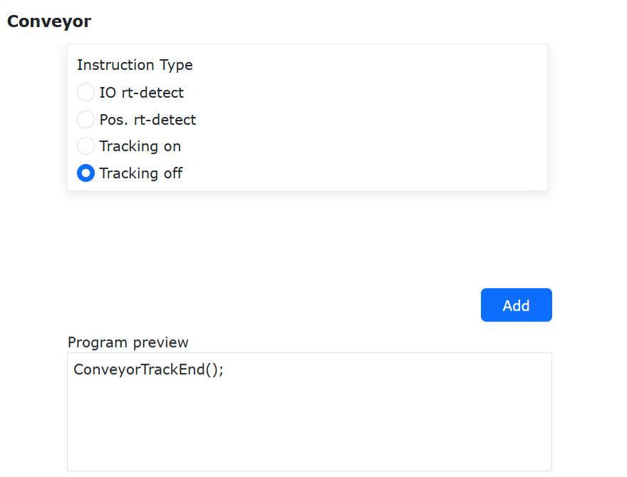

.. centered:: Wykres 15.3‑14 Instrukcja wyłączenia śledzenia

**Krok 6**: Kliknij "Wyłączenie śledzenia", a następnie kliknij przyciski "Dodaj" i "Zastosuj", aby dodać instrukcję do programu.

.. figure:: process/047.png
   :align: center
   :width: 6in

.. centered:: Wykres 15.3‑15 Typowy program śledzenia ruchu taśmociągu

Gdy dwa identyczne cele ruchu śledzenia (mogą zawierać odległość przesunięcia) są nauczane kolejno, ruch robota zostanie zablokowany w tej pozycji docelowej, realizując ciągłe synchroniczne śledzenie, aż odległość śledzenia osiągnie odległość końcową śledzenia.

.. figure:: process/048.png
   :align: center
   :width: 6in

.. centered:: Wykres 15.3‑16 Typowy program blokującego ruchu chwytania śledzenia taśmociągu

Gdy dwa identyczne cele ruchu śledzenia (mogą zawierać odległość przesunięcia) są nauczane kolejno, a pomiędzy nimi wstawiony jest ruch chwytaka, robot będzie kontynuował śledzenie taśmociągu w tej pozycji docelowej aż do zakończenia ruchu chwytaka, realizując blokujące chwytanie śledzące.

Funkcja optymalizacji instrukcji ruchu matrycowego
------------------------------------------------------------------

Omówienie
~~~~~~~~~~~~~~~~~~~~~~~~~~~~~~~~~~~~~~~~~~~~~~

W procesie zautomatyzowanej obróbki urządzeń CNC oraz operacji paletyzacji, instrukcje ruchu matrycowego są szeroko stosowane w wielu kluczowych etapach procesu, w tym w załadunku półfabrykatów, rozładunku gotowych produktów, obracaniu przedmiotów i ponownym mocowaniu. Po wyznaczeniu pozycji matrycy poprzez nauczanie trzech punktów matrycy w recepturze ruchu matrycowego i skonfigurowaniu liczby wierszy, kolumn, warstw i ścieżki ruchu matrycy, można szybko przełączać receptury matrycy w interfejsie instrukcji w celu wdrożenia i uruchomienia.

Konfiguracja receptury ruchu matrycowego
~~~~~~~~~~~~~~~~~~~~~~~~~~~~~~~~~~~~~~~~~~~~~~

**Krok 1**: Przejdź do interfejsu "Aplikacje pomocnicze —> Pakiety procesowe —> Ruch matrycowy", aby dodawać, edytować, zmieniać nazwy i usuwać receptury.

.. figure:: process/049.png
   :align: center
   :width: 6in

.. centered:: Wykres 15.4‑1 Interfejs receptury matrycy

.. note:: 
   .. image:: process/050.png
      :height: 0.75in
      :align: left

   Nazwa: **Przycisk Dodaj**
   
   Funkcja: Dodaje nową recepturę matrycy

.. note:: 
   .. image:: process/051.png
      :height: 0.75in
      :align: left

   Nazwa: **Przycisk Edytuj**
   
   Funkcja: Edytuje parametry receptury matrycy

.. note:: 
   .. image:: process/052.png
      :height: 0.75in
      :align: left

   Nazwa: **Przycisk Zmień nazwę**
   
   Funkcja: Zmienia nazwę receptury matrycy

.. note:: 
   .. image:: process/053.png
      :height: 0.75in
      :align: left

   Nazwa: **Przycisk Usuń**
   
   Funkcja: Usuwa recepturę matrycy

**Krok 2**: Dodaj nową recepturę matrycy. Kliknij przycisk "Dodaj", pojawi się okno modalne "Dodaj matrycę". Wprowadź nazwę matrycy (zabronione jest wprowadzanie znaków specjalnych, dozwolone są tylko cyfry, popularne chińskie znaki i podkreślenie "_"), a następnie przejdź do strony szczegółów receptury, aby wprowadzić liczbę wierszy, warstw, kolumn, wysokość warstwy, konfigurację ruchu oraz przesunięcia punktu przejściowego X, Y, Z. Naucz trzy punkty ścieżki matrycy. Kliknij przycisk "Konfiguruj", aby potwierdzić konfigurację.

.. figure:: process/054.png
   :align: center
   :width: 6in

.. centered:: Wykres 15.4‑2 Okno modalne dodawania matrycy

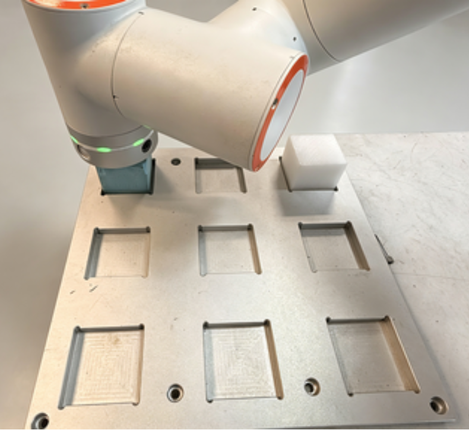

.. figure:: process/056.png
   :align: center
   :width: 6in

.. centered:: Wykres 15.4‑3 Nauczanie pierwszego punktu ścieżki

.. figure:: process/057.png
   :align: center
   :width: 4in

.. figure:: process/058.png
   :align: center
   :width: 6in

.. centered:: Wykres 15.4‑4 Nauczanie drugiego punktu ścieżki

.. figure:: process/059.png
   :align: center
   :width: 4in

.. figure:: process/060.png
   :align: center
   :width: 6in

.. centered:: Wykres 15.4‑5 Nauczanie trzeciego punktu ścieżki

Ścieżki ruchu dzielą się na metodę od początku do końca i metodę w kształcie łuku. Opis poniżej:

**Metoda od początku do końca**: Przejście pierwszego rzędu od lewej do prawej, powrót do lewego punktu początkowego, następnie przejście drugiego rzędu od lewej do prawej, powrót do lewego punktu początkowego, przejście trzeciego rzędu od lewej do prawej, aż do pokrycia całego obszaru.

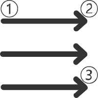

.. centered:: Wykres 15.4‑6 Metoda od początku do końca

**Metoda w kształcie łuku**: Przejście pierwszego rzędu od lewej do prawej, ruch pionowo w dół, następnie przejście drugiego rzędu od prawej do lewej. Następnie ruch pionowo w dół, a następnie przejście trzeciego rzędu od lewej do prawej, aż do pokrycia całego obszaru.

.. figure:: process/062.png
   :align: center
   :width: 1in

.. centered:: Wykres 15.4‑7 Metoda w kształcie łuku

**Krok 3**: Edycja, zmiana nazwy i usuwanie receptury. Kliknij przycisk "Edytuj", aby pobrać dane aktualnie wybranej receptury matrycy. Modyfikuj parametry lub naucz ponownie punkty ścieżki zgodnie z potrzebami. Gdy potrzebna jest zmiana nazwy, kliknij przycisk "Zmień nazwę", wprowadź nazwę i kliknij ponownie przycisk "Zmień nazwę", aby zakończyć zmianę nazwy. Kliknij przycisk "Usuń", pojawi się prośba o potwierdzenie usunięcia receptury matrycy. Kliknij ponownie przycisk "Usuń", aby potwierdzić usunięcie. Jak poniżej:

.. figure:: process/063.png
   :align: center
   :width: 6in

.. centered:: Wykres 15.4‑8 Zmiana nazwy receptury matrycy

.. figure:: process/064.png
   :align: center
   :width: 6in

.. centered:: Wykres 15.4‑9 Monit o usunięcie receptury matrycy

Dodawanie instrukcji ruchu matrycowego
~~~~~~~~~~~~~~~~~~~~~~~~~~~~~~~~~~~~~~

**Krok 1**: Po przejściu do interfejsu "Program nauczania -> Programowanie -> Instrukcje paletyzacji -> Ruch matrycowy" sprawdź, czy na interfejsie istnieją receptury. Gdy nie utworzono receptury, wyświetlona zostanie treść podpowiedzi. Pod tekstem podpowiedzi można kliknąć przycisk "Konfiguruj", aby szybko przejść do interfejsu "Aplikacje pomocnicze -> Pakiety procesowe -> Ruch matrycowy". Jak pokazano na poniższym rysunku:

.. figure:: process/065.png
   :align: center
   :width: 6in

.. centered:: Wykres 15.4‑10 Interfejs instrukcji ruchu matrycowego bez receptury

Gdy receptury istnieją, wyświetlony zostanie interfejs instrukcji ruchu matrycowego. Bieżące typy instrukcji to:

- **Ruch matrycowy**: Ustawia przejście robota do punktu przejściowego dla operacji załadunku i rozładunku;
- **Licznik działania matrycy**: Liczy, który wiersz, kolumnę i warstwę robot wykonał po zakończeniu załadunku i rozładunku;
- **Konfiguracja początku liczenia**: Ustawia, od którego wiersza, kolumny i warstwy robot ma rozpocząć załadunek i rozładunek;
- **Pobierz licznik matrycy**: Pobiera informację, do którego wiersza, kolumny i warstwy robot zakończył załadunek i rozładunek.

.. figure:: process/066.png
   :align: center
   :width: 6in

.. centered:: Wykres 15.4‑11 Interfejs instrukcji ruchu matrycowego z istniejącą recepturą

**Krok 2**: Dodaj instrukcję "Ruch matrycowy". Utwórz nowy program o nazwie "matrix", wybierz recepturę "matrix1", kierunek ruchu "w dół", wprowadź prędkość 100. Robot przemieszcza się z punktu bezpiecznego do punktu przejściowego, a następnie do punktu chwytania. Kliknij przycisk "Dodaj", aby zastosować w programie. Jak pokazano na poniższym rysunku:

.. figure:: process/067.png
   :align: center
   :width: 6in

.. centered:: Wykres 15.4‑12 Instrukcja ruchu matrycowego w dół

**Krok 3**: Dodaj instrukcję "Licznik działania matrycy". Wybierz recepturę "matrix1", kliknij przycisk "Dodaj", aby zastosować w programie. Jak pokazano na poniższym rysunku:

.. figure:: process/068.png
   :align: center
   :width: 6in

.. centered:: Wykres 15.4‑13 Instrukcja licznika działania matrycy

**Krok 4**: Dodaj instrukcję "Ruch matrycowy". Wybierz recepturę "matrix1", kierunek ruchu "w górę", wprowadź prędkość 100. Robot przemieszcza się z punktu chwytania do punktu przejściowego, a następnie wraca do punktu bezpiecznego. Kliknij przycisk "Dodaj", aby zastosować w programie. Jak pokazano na poniższym rysunku:

.. figure:: process/069.png
   :align: center
   :width: 6in

.. centered:: Wykres 15.4‑14 Instrukcja ruchu matrycowego w górę

**Krok 5**: Dodaj instrukcję while, aby zapętlić działanie. Kliknij przycisk "Zapisz", aby zapisać program, przełącz w tryb automatyczny i uruchom program. Robot będzie kontynuował operację załadunku i rozładunku w ruchu matrycowym. Jak pokazano na poniższym rysunku:

.. figure:: process/070.png
   :align: center
   :width: 6in

.. centered:: Wykres 15.4‑15 Działanie instrukcji ruchu matrycowego

**Krok 6**: Dodaj instrukcję "Konfiguracja początku liczenia". Wybierz recepturę "matrix1", wprowadź liczbę wierszy 1, kolumn 1, warstw 1. Kliknij przycisk "Dodaj", aby zastosować w programie. Jak pokazano na poniższym rysunku:

.. note:: Wprowadzona liczba wierszy, kolumn i warstw oznacza, że rzeczywista liczba wierszy, kolumn i warstw jest o 1 większa. Oznacza to, że przy wprowadzeniu wierszy 1, kolumn 1, warstw 1, robot faktycznie rozpocznie działanie od 2 wiersza, 2 kolumny, 2 warstwy.

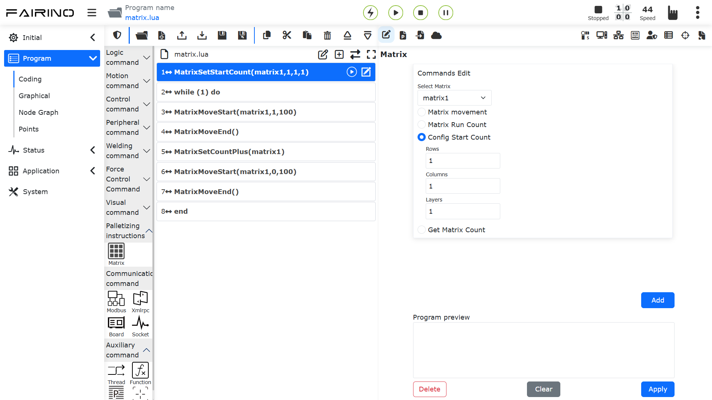

.. centered:: Wykres 15.4‑16 Instrukcja konfiguracji początku liczenia

**Krok 7**: Gdy matryca ulegnie zmianie, przejdź do interfejsu "Aplikacje pomocnicze -> Pakiety procesowe -> Ruch matrycowy", wybierz recepturę matrycy "matrix1", kliknij przycisk edycji, zmodyfikuj parametry, a następnie kliknij przycisk "Konfiguruj", aby zakończyć modyfikację matrycy. Wróć do interfejsu programowania, otwórz program "matrix" i uruchom go, aby przeprowadzić nowy scenariusz pracy z matrycą.

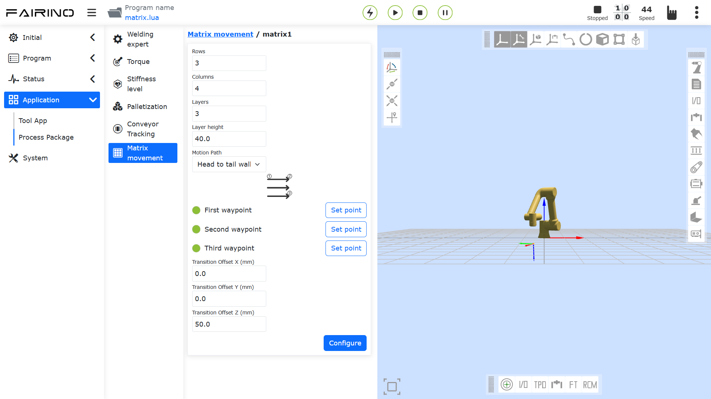

.. centered:: Wykres 15.4‑17 Modyfikacja receptury matrycy