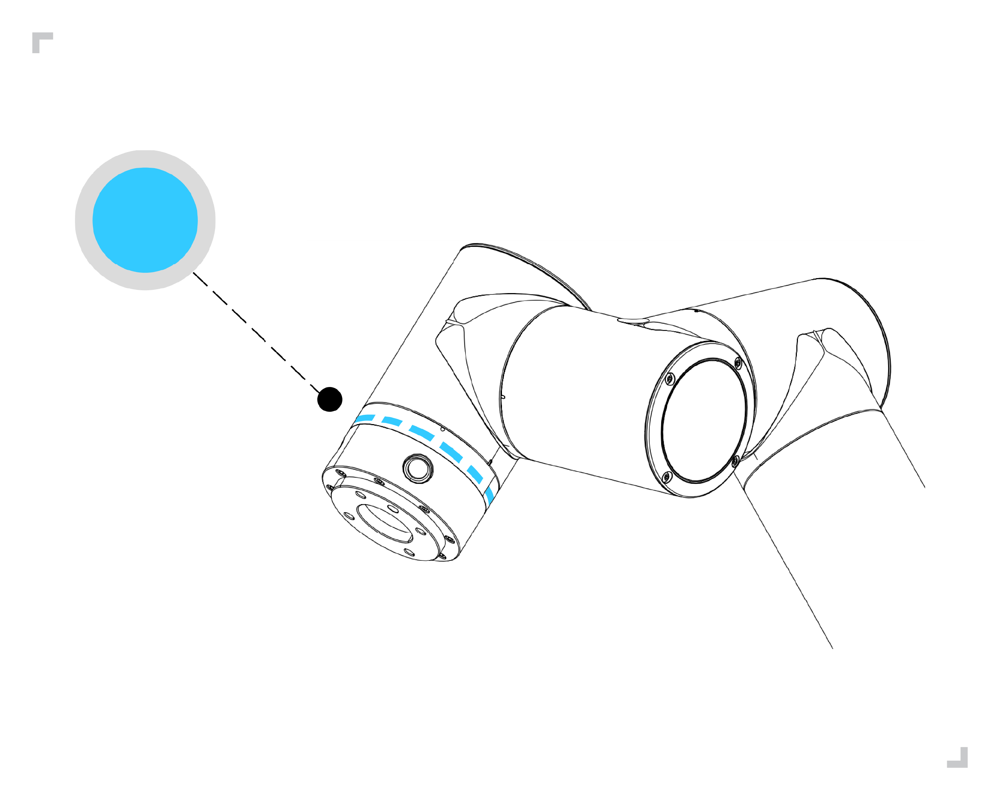
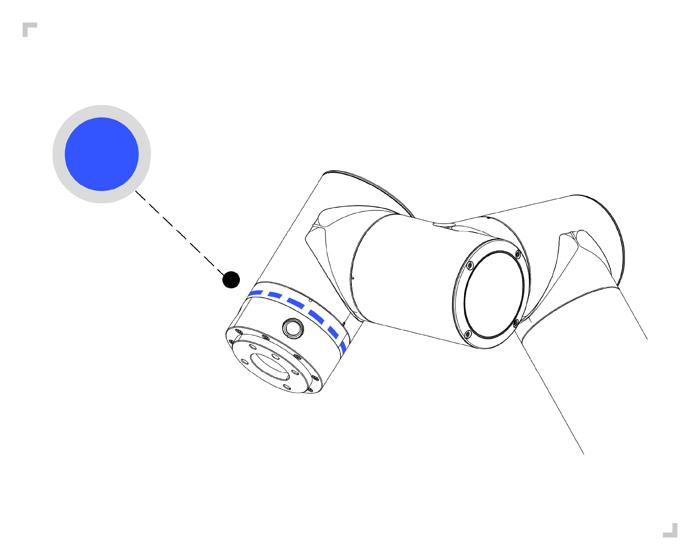

Szybkie uruchamianie robota
============================

.. toctree:: 
   :maxdepth: 5

Instalacja ramienia robota i skrzynki sterowniczej
---------------------------------------------------

Zgodnie z rozdziałem 3.5 i 3.6 w 3. Instalacja sprzętowa, zainstaluj i podłącz ramię robota oraz skrzynkę sterowniczą.

-   Wyjmij ramię robota z opakowania, zamontuj ramię robota za pomocą 4 śrub M8 o klasie wytrzymałości nie niższej niż 8.8. Zamontuj ramię robota na solidnej i odpornej na wibracje powierzchni. Jeśli mocujesz do płyty aluminiowej, jej grubość nie może być mniejsza niż 16 mm; jeśli do płyty stalowej, jej grubość nie może być mniejsza niż 8 mm.

-   Umieść skrzynkę sterowniczą na jej stopkach.

-   Podłącz kabel zasilający głównego ramienia robota do złącza zasilania głównego skrzynki sterowniczej.

-   Podłącz wtyczkę lotniczą panelu przyciskowego do złącza panelu operatorskiego skrzynki sterowniczej.

-   Upewnij się, że przycisk zasilania skrzynki sterowniczej jest wyłączony (przycisk ustawiony na 0), a następnie podłącz przewód zasilający do gniazda zasilania.

-   Włóż wtyczkę zasilania do skrzynki sterowniczej.

.. warning:: 
   (1) Jeśli robot nie jest bezpiecznie umieszczony na solidnej powierzchni, może się przewrócić i spowodować obrażenia.
   
   (2) Nie włączaj i nie wyłączaj szybko zasilania skrzynki sterowniczej. Zaleca się, aby czas między wyłączeniem (OFF) a ponownym włączeniem (ON) zasilania skrzynki sterowniczej był dłuższy niż 1 minutę.

Uruchamianie robota za pomocą panelu operatorskiego
----------------------------------------------------

Skrzynka sterownicza łączy ramię robota, panel operatorski oraz fizyczne elektryczne wejścia/wyjścia wszelkich urządzeń peryferyjnych. Skrzynka sterownicza musi być włączona, aby zasilić ramię robota.

-   Naciśnij przycisk zasilania na skrzynce sterowniczej, aby ją włączyć.

-   Po uruchomieniu robota jest on w trybie ręcznym i nie jest załączony. Aby obsługiwać robota w trybie ręcznym, należy nacisnąć trójpozycyjny przełącznik załączający na panelu operatorskim w sekwencji OFF (zwolnienie) ⇒ ON (naciśnięcie) ⇒ OFF (zwolnienie). Gdy przełącznik jest w stanie ON, można przeciągać lub sterować ruchem robota.

-   Jeśli nie ma potrzeby obsługi robota w trybie ręcznym, można użyć przełącznika kluczykowego na panelu operatorskim, aby przełączyć tryb pracy robota: automatyczny, ręczny, niestandardowy.

-   Podczas przełączania robota w tryb ręczny należy sprawdzić, czy w przestrzeni bezpieczeństwa i poza nią nie ma nieprawidłowości, i ostrożnie obsługiwać ruch robota.

-   Podczas przełączania robota w tryb automatyczny należy sprawdzić środki bezpieczeństwa, przywrócić je do stanu normalnego i ostrożnie obsługiwać ruch robota.

-   Jeśli nie można normalnie otworzyć panelu operatorskiego, sprawdź, czy połączenia urządzenia są prawidłowe.

Sterowanie ruchem robota za pomocą panelu przyciskowego
--------------------------------------------------------

Zgodnie z rozdziałem 3.6.3. Definicja końcowego LED w 3. Instalacja sprzętowa, steruj robotem. Istniejące panele przyciskowe dzielą się na 60 przyciskowy panel (POE)(BX01), 60 przyciskowy panel (POE)(BX02)-V1.0, 60 przyciskowy panel (POE)(BX02)-V2.0. Na przykładzie 60 przyciskowego panelu (POE)(BX01), kroki operacyjne są następujące.

Bez podłączonego panelu operatorskiego
~~~~~~~~~~~~~~~~~~~~~~~~~~~~~~~~~~~~~~~

-  **Krok 1**: Włącz przełącznik zasilania skrzynki sterowniczej robota, uruchom robota. Poczekaj, aż końcowa dioda LED będzie świecić na zielono, zanim zaczniesz obsługiwać robota, jak na rysunku:

.. figure:: quick_start_robot/001.png
   :align: center
   :width: 4in

.. centered:: Wykres 4.3-1 Schemat zielonej końcowej diody LED

-  **Krok 2**: Naciśnij i przytrzymaj „Przycisk 2” na panelu przyciskowym, aby przejść do trybu bez podłączonego panelu operatorskiego. Końcowa dioda LED mignie trzy razy na błękitno, jak na rysunku:

.. centered:: Wykres 4.3-2 Schemat błękitnej końcowej diody LED

-  **Krok 3**: Naciśnij i przytrzymaj „Przycisk 1” na panelu przyciskowym, aby przełączyć robota w tryb przeciągania. W tym momencie końcowa dioda LED świeci na biało-błękitnie, jak na Wykresie 4.3-3. Przesuń robota w dowolne miejsce, naciśnij i przytrzymaj „Przycisk 1”, aby wyjść z trybu przeciągania. Krótko naciśnij „Przycisk 2” na panelu przyciskowym, aby zapisać punkt P1. Końcowa dioda LED mignie trzy razy na fioletowo, jak na Wykresie 4.3-4.

-  **Krok 4**: Przesuń robota, krótko naciśnij „Przycisk 2” na panelu przyciskowym, aby zapisać punkt P2. Końcowa dioda LED mignie trzy razy na fioletowo, jak na Wykresie 4.3-4.

.. figure:: quick_start_robot/003.png
   :align: center
   :width: 4in

.. centered:: Wykres 4.3-3 Schemat biało-błękitnej końcowej diody LED

.. figure:: quick_start_robot/004.png
   :align: center
   :width: 4in

.. centered:: Wykres 4.3-4 Schemat fioletowej końcowej diody LED

-  **Krok 5**: Naciśnij i przytrzymaj „Przycisk 1” na panelu przyciskowym, aby wyjść z trybu przeciągania. Robot jest teraz w trybie ręcznym, a końcowa dioda LED świeci na zielono, jak na Wykresie 4.3-5. Krótko naciśnij „Przycisk 1”, aby przełączyć robota w tryb automatyczny. W tym momencie końcowa dioda LED świeci na niebiesko, jak na Wykresie 4.3-6.

-  **Krok 6**: Krótko naciśnij „Przycisk 3” na panelu przyciskowym, aby uruchomić program. Końcowa dioda LED mignie dwa razy na niebiesko, jak na Wykresie 4.3-6.

.. figure:: quick_start_robot/005.png
   :align: center
   :width: 4in

.. centered:: Wykres 4.3-5 Schemat zielonej końcowej diody LED

.. centered:: Wykres 4.3-6 Schemat niebieskiej końcowej diody LED

-  **Krok 7**: Krótko naciśnij „Przycisk 3” na panelu przyciskowym, aby zatrzymać działanie programu. Końcowa dioda LED mignie trzy razy na czerwono, jak na rysunku:

.. figure:: quick_start_robot/007.png
   :align: center
   :width: 4in

.. centered:: Wykres 4.3-7 Schemat czerwonej końcowej diody LED

Z podłączonym panelem operatorskim
~~~~~~~~~~~~~~~~~~~~~~~~~~~~~~~~~~

-  **Krok 1**: Uruchom robota. Poczekaj, aż zielona końcowa dioda LED przestanie migać, zanim zaczniesz obsługiwać robota.

-  **Krok 2**: Otwórz panel operatorski i przejdź do interfejsu edycji programu.

-  **Krok 3**: Wybierz pusty szablon, aby utworzyć nowy plik programu.

-  **Krok 4**: Krótko naciśnij przycisk 1 na panelu przyciskowym, aby przełączyć robota w tryb ręczny. W tym momencie końcowa dioda LED świeci na zielono.

-  **Krok 5**: Naciśnij i przytrzymaj przycisk 1 na panelu przyciskowym, aby przełączyć robota w tryb przeciągania. W tym momencie końcowa dioda LED świeci na biało-błękitnie. Przesuń robota w dowolne miejsce, krótko naciśnij przycisk 2 na panelu przyciskowym, aby zapisać punkt P1. Końcowa dioda LED mignie trzy razy na fioletowo. Ręcznie dodaj instrukcję „PTP(p1,100,-1,0)” do pliku programu.

.. figure:: quick_start_robot/008.png
   :align: center
   :width: 4in

.. centered:: Wykres 4.3-8 Zapisywanie i dodawanie punktu P1

-  **Krok 6**: Przesuń robota, krótko naciśnij przycisk 2 na panelu przyciskowym, aby zapisać punkt P2. Końcowa dioda LED mignie trzy razy na fioletowo. Ręcznie dodaj instrukcję „PTP(p2,100,-1,0)” do programu.

.. figure:: quick_start_robot/009.png
   :align: center
   :width: 4in

.. centered:: Wykres 4.3-9 Zapisywanie i dodawanie punktu P2  

-  **Krok 7**: Zapisz zawartość pliku programu.

-  **Krok 8**: Naciśnij i przytrzymaj przycisk 1 na panelu przyciskowym, aby wyjść z trybu przeciągania. Robot jest teraz w trybie ręcznym, a końcowa dioda LED świeci na zielono. Krótko naciśnij przycisk 1 na panelu przyciskowym, aby przełączyć robota w tryb automatyczny. W tym momencie końcowa dioda LED świeci na niebiesko.

-  **Krok 9**: Krótko naciśnij przycisk 3 na panelu przyciskowym, aby uruchomić program. Końcowa dioda LED mignie dwa razy na niebiesko.

Sterowanie ruchem robota za pomocą panelu operatorskiego
---------------------------------------------------------

Kliknij przycisk „Program nauczania” w lewym menu głównym panelu operatorskiego, a następnie kliknij jego podmenu „Programowanie”, aby przejść do interfejsu nauczania programu. W tym interfejsie realizowane jest głównie pisanie i modyfikowanie programów nauczania robota.

Po kliknięciu ikony przycisku „Nowy” użytkownik nadaje nazwę plikowi i wybiera szablon jako zawartość nowego pliku. Kliknięcie „Nowy” spowoduje utworzenie pliku i otwarcie go.

.. figure:: quick_start_robot/010.png
   :align: center
   :width: 6in
   
.. centered:: Wykres 4.4-1 Schemat działania programu nauczania

.. warning:: 
   Głowa i tułów nie mogą znajdować się w zasięgu robota (strefie roboczej). Nie wkładaj palców w miejsca, które robot może chwycić.

.. important:: 
   - Nie dopuść, aby robot uderzył w siebie lub inne obiekty, ponieważ może to spowodować uszkodzenie robota.
   - Jest to tylko przewodnik szybkiego startu, który pokazuje, jak łatwo używać robota współpracującego FR. Przewodnik ten zakłada, że środowisko jest bezpieczne i niegroźne, a użytkownik działa ostrożnie. Nie zwiększaj prędkości ani przyspieszenia powyżej wartości domyślnych. Zawsze przeprowadzaj ocenę ryzyka przed uruchomieniem robota.