Tryb zdalny robota
=============================================================

.. toctree:: 
   :maxdepth: 6
   
Przegląd
-------------------------

W celu ułatwienia sterowania ruchem robota przez PLC za pomocą różnych protokołów magistrali przemysłowych (CC-Link, Profinet, Ethernet/IP i EtherCAT), w zintegrowanej mini skrzynce kontrolnej dodano karty FRH-PCIeN-EC/EIP/CC/PN-RJ-V10 oraz FRJ-PCIeN-EIP/CC/PN-RJ-V10, realizujące następujące funkcje:

1) Obsługa protokołu CC-Link slave;
2) Obsługa protokołu Profinet slave;
3) Obsługa protokołu Ethernet/IP slave;
4) Obsługa protokołu EtherCAT slave (karta FRJ-PCIeN-EIP/CC/PN-RJ-V10 nie obsługuje).

Konfiguracja środowiska
--------------------------------------------

Instalacja karty
~~~~~~~~~~~~~~~~~~~~~~~~~~~~~~~~~~~~~~~~~~~~~

(1) Sprawdzenie materiałów: Karty FRH-PCIeN, FRJ-PCIeN oraz towarzyszące elementy blacharskie wyglądają następująco.

.. image:: remote_mode/001.png
   :width: 4in
   :align: center

.. centered:: Schemat 18.2-1 Blacha montażowa (przód)

.. image:: remote_mode/002.png
   :width: 4in
   :align: center

.. centered:: Schemat 18.2-2 Blacha montażowa (tył)

.. image:: remote_mode/003.png
   :width: 4in
   :align: center

.. centered:: Schemat 18.2-3 Karta FRH-PCIeN-EC/EIP/CC/PN-RJ-V10

.. image:: remote_mode/004.png
   :width: 4in
   :align: center

.. centered:: Schemat 18.2-4 Karta FRJ-PCIeN-EIP/CC/PN-RJ-V10

(2) Montaż karty w zintegrowanej mini skrzynce kontrolnej, jak pokazano na rysunku.

.. image:: remote_mode/005.png
   :width: 4in
   :align: center

.. centered:: Schemat 18.2-5 Schemat montażu blachy

.. image:: remote_mode/006.png
   :width: 4in
   :align: center

.. centered:: Schemat 18.2-6 Schemat montażu płyty głównej FRH-PCIeN

.. image:: remote_mode/007.png
   :width: 4in
   :align: center

.. centered:: Schemat 18.2-7 Schemat montażu karty rozszerzenia portu sieciowego (RJ45) FRH-PCIeN

.. image:: remote_mode/008.png
   :width: 4in
   :align: center

.. centered:: Schemat 18.2-8 Schemat montażu płyty głównej FRJ-PCIeN

.. image:: remote_mode/009.png
   :width: 4in
   :align: center

.. centered:: Schemat 18.2-9 Schemat montażu karty rozszerzenia portu sieciowego (RJ45) FRJ-PCIeN

.. note:: Uwaga: Wszystkie śruby należy dokręcić.

(3) Podłączenie skrzynki kontrolnej robota i PLC pokazano na poniższym rysunku.

.. image:: remote_mode/010.png
   :width: 4in
   :align: center

.. centered:: Schemat 18.2-10 Schemat podłączenia skrzynki kontrolnej i PLC Mitsubishi

.. image:: remote_mode/011.png
   :width: 4in
   :align: center

.. centered:: Schemat 18.2-11 Schemat podłączenia skrzynki kontrolnej i PLC Siemens

.. image:: remote_mode/012.png
   :width: 4in
   :align: center

.. centered:: Schemat 18.2-12 Schemat podłączenia skrzynki kontrolnej i PLC Omron

.. image:: remote_mode/013.png
   :width: 4in
   :align: center

.. centered:: Schemat 18.2-13 Schemat podłączenia skrzynki kontrolnej i PLC Omron

.. note:: 
    1: Skrzynka kontrolna robota (port sieciowy karty);
    2: Przełącznik;
    3: Laptop PC;
    4: PLC Mitsubishi (port sieciowy CC-Link IEF Basic);
    5: PLC Siemens (port sieciowy Profinet);
    6: PLC Omron (port sieciowy Ethernet/IP);
    7: PLC Omron (port sieciowy EtherCAT);

Gdy protokół zostanie przełączony na magistralę EtherCAT, porty sieciowe karty muszą być rozróżnione na EtherCAT_IN i EtherCAT_OUT. W takim przypadku port sieciowy EtherCAT PLC Omron należy połączyć bezpośrednio z portem EtherCAT_IN karty za pomocą jednego kabla sieciowego.

Konfiguracja środowiska PLC
~~~~~~~~~~~~~~~~~~~~~~~~~~~~~~~~~~~~~~~~~~~~~~~~~~

Środowisko testowe zbudowane do realizacji instrukcji węzła podrzędnego dla poszczególnych protokołów przedstawiono w poniższej tabeli, w tym modele PLC używane w poszczególnych protokołach, wersje firmware i oprogramowanie testowe.

.. centered:: Tabela 2-1 Środowisko testowe

.. list-table:: 
   :widths: 20 40 40
   :header-rows: 1
   :align: center

   * - Protokół
     - Profinet
     - CC-link
  
   * - Marka
     - Siemens
     - Mitsubishi
  
   * - Model
     - CPU 1515-2 PN
     - FX5S-30TR/DS
  
   * - Firmware
     - 6ES75152AM020AB0
     - 30MR/ES V1.3
  
   * - Oprogramowanie
     - TIA Portal V17
     - GXWorks3V1.097B
  
   * - Adres IP karty
     - „192.168.0.2”
     - „192.168.0.113”
  
   * - Adres IP PLC
     - IP nie musi być w tej samej podsieci
     - „192.168.0.15” (IP w tej samej podsieci)
		
.. list-table:: 
   :widths: 20 40 40
   :header-rows: 1
   :align: center

   * - Protokół
     - Ethernet/IP
     - EtherCAT

   * - Marka
     - Omron
     - Omron

   * - Model
     - NX102-1100
     - NX102-1100

   * - Firmware
     - V1.3
     - V1.3

   * - Oprogramowanie
     - SysmacStudioV1.50
     - SysmacStudioV1.50

   * - Adres IP karty
     - „192.168.0.112”
     - „192.168.0.2”

   * - Adres IP PLC
     - „192.168.0.88” (IP w tej samej podsieci)
     - „192.168.0.88” (IP w tej samej podsieci)
		
Profinet Siemens
+++++++++++++++++++++++++++++++++++++++++++++++++++++++++++++

(1) Import pliku GSD (pliku XML)

Otwórz oprogramowanie programistyczne Siemens TIA Portal V17, utwórz nowy projekt PLC, wybierz „Urządzenia i sieci”, w „Katalogu sprzętu” po prawej stronie wybierz i kliknij dwukrotnie 6ES7 515-2AM02-0AB0, aby dodać moduł PLC.

.. image:: remote_mode/014.png
   :width: 6in
   :align: center

W oprogramowaniu TIA PORTAL, na pasku menu wybierz „Opcje” -> „Zarządzaj ogólnymi plikami opisu urządzenia (GSD)”, aby zainstalować lub usunąć już zainstalowane pliki GSD.

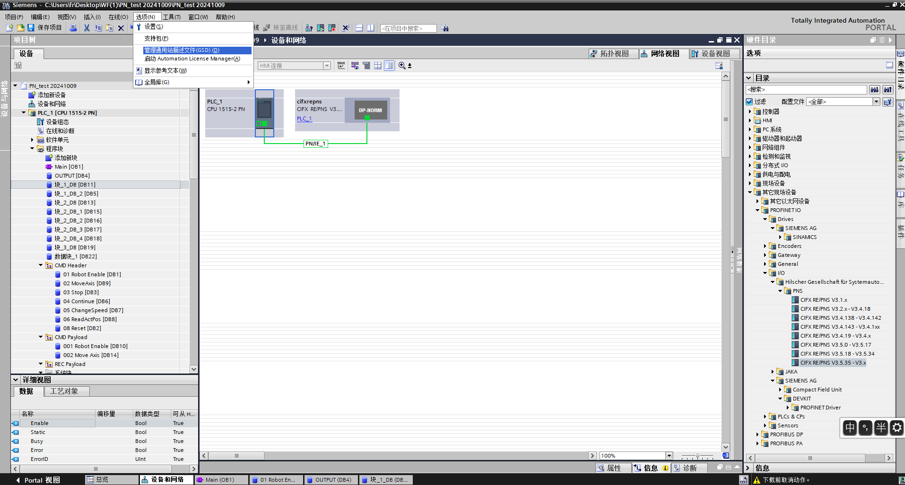

Aby zainstalować plik GSD, wybierz powyższe „Zarządzaj ogólnymi plikami opisu urządzenia (GSD)”, pojawi się okno „Zarządzanie ogólnymi plikami opisu urządzenia”.

Wybierz folder z plikami GSD do instalacji ze „Ścieżki źródłowej”, wybierz jeden lub więcej plików do instalacji z wyświetlonej listy plików GSD, a następnie kliknij przycisk „Instaluj”. Jak pokazano na rysunku.

.. image:: remote_mode/016.png
   :width: 6in
   :align: center

Po pomyślnej instalacji, w katalogu sprzętu, w innych urządzeniach terenowych, można znaleźć urządzenia z zainstalowanym plikiem GSD, jak pokazano na rysunku.

.. image:: remote_mode/017.png
   :width: 6in
   :align: center

Przydział IO: W katalogu znajdź moduł i przeciągnij Input oraz Output.

.. image:: remote_mode/018.png
   :width: 6in
   :align: center

Pobranie programu do urządzenia: W drzewie projektu po lewej stronie kliknij dwukrotnie, aby wejść w „Urządzenia i sieci”, kliknij prawym przyciskiem myszy moduł „PLC_1”, z menu rozwijanego wybierz „Pobierz do urządzenia”, następnie wybierz „Sprzęt i oprogramowanie (tylko zmiany)”:

.. image:: remote_mode/019.png
   :width: 6in
   :align: center

Wyszukaj i pobierz urządzenie: Po pojawieniu się okna dialogowego, skonfiguruj typ interfejsu PG/PC jak na rysunku, kliknij „Rozpocznij wyszukiwanie”, wybierz urządzenie, do którego ma zostać pobrany program, i kliknij „Pobierz”:

.. image:: remote_mode/020.png
   :width: 6in
   :align: center

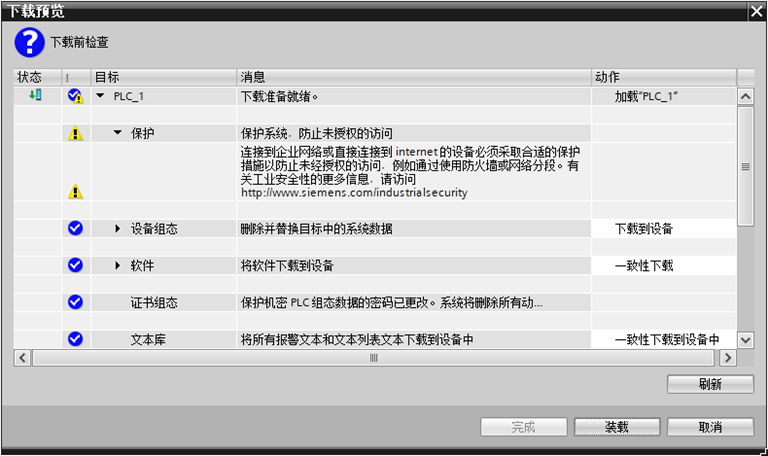

CC-link Mitsubishi
++++++++++++++++++++++++++++++++++++++++++++++++++++

(1) Import pliku konfiguracyjnego

Otwórz GxWorks3, wybierz „Narzędzia” → „Zarządzanie plikami konfiguracyjnymi” → „Zaloguj”, po pojawieniu się okna dialogowego wybierz odpowiedni plik komunikacyjny, kliknij „Zaloguj”, aby zakończyć import pliku konfiguracyjnego.

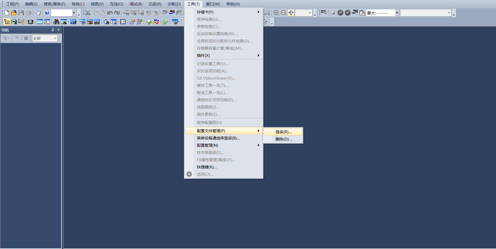

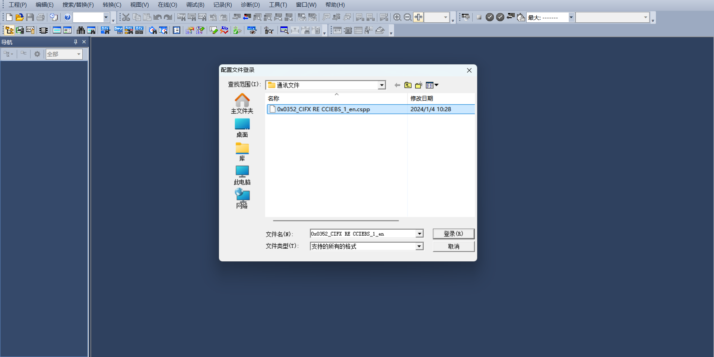

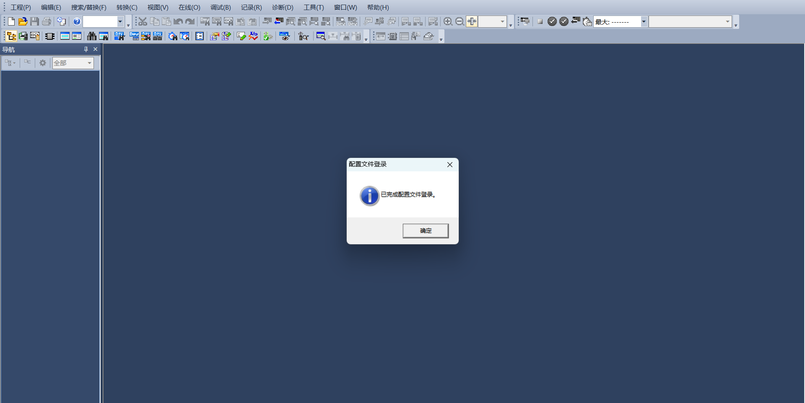

(2) Ustawienia CC-Link IEF Basic

Utwórz projekt PLC, włącz użycie CC-link: Na lewym pasku menu nawigacji wybierz „Port Ethernet”, ustaw adres IP PLC, aby znajdował się w tej samej podsieci co adres karty Hilscher. Kliknij „Użycie CC-link IEF Basic”, wybierz „Użyj”.

.. image:: remote_mode/025.png
   :width: 6in
   :align: center

Ustawienia konfiguracji sieci CC-Link: Również w ustawieniach CC-Link IEF Basic, wybierz „Ustawienia konfiguracji sieci”, jako moduł wybierz moduł CIFX Digital I/O firmy Hilscher. Przeciągnij go do lewego dolnego rogu widoku, aby zakończyć konfigurację sprzętu.

.. image:: remote_mode/026.png
   :width: 6in
   :align: center

Ustawienia odświeżania CC-Link: Również w ustawieniach CC-Link IEF Basic, kliknij „Ustawienia odświeżania”, dostosuj ustawienia transmisji: 256 bajtów odbioru, 256 bajtów wysyłania.

.. image:: remote_mode/027.png
   :width: 6in
   :align: center

(3) Pobranie programu

Po otwarciu programu testowego kliknij „Online” → „Zapisz do programowalnego sterownika”, aby przejść do interfejsu pobierania.

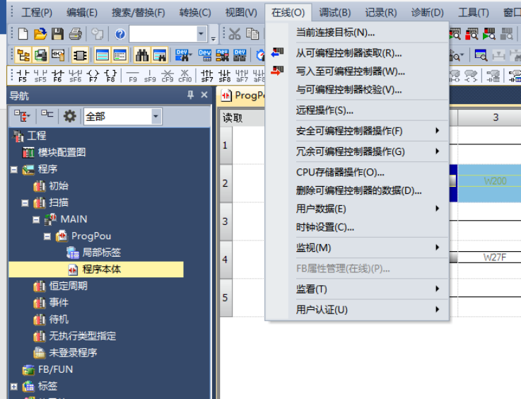

Po otwarciu interfejsu pobierania kliknij „Parametry + program” w lewym górnym rogu, a następnie kliknij „Wykonaj” w prawym dolnym rogu, aby rozpocząć pobieranie. Poczekaj na zakończenie pobierania.

.. image:: remote_mode/029.png
   :width: 6in
   :align: center

Ethernet/IP Omron
++++++++++++++++++++++++++++++++++++++++++++++++++++++++

(1) Utworzenie nowego projektu PLC (przypadek ten dotyczy modelu: NX102-1100, PLC Omron 1.47 jako przykład):

.. image:: remote_mode/030.png
   :width: 6in
   :align: center

Utworzenie zmiennych globalnych:

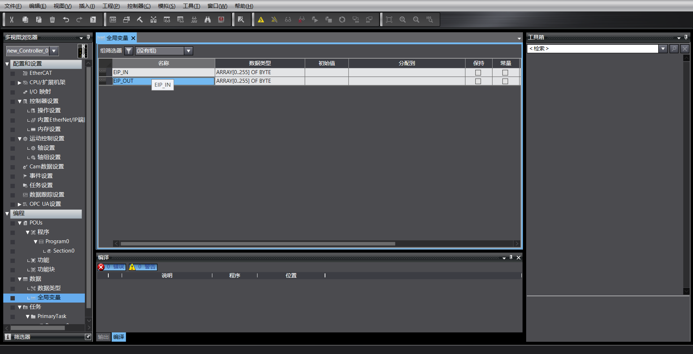

(2) Import pliku EDS

Kliknij „Narzędzia” → „Ustawienia połączenia EtherNet/IP”:

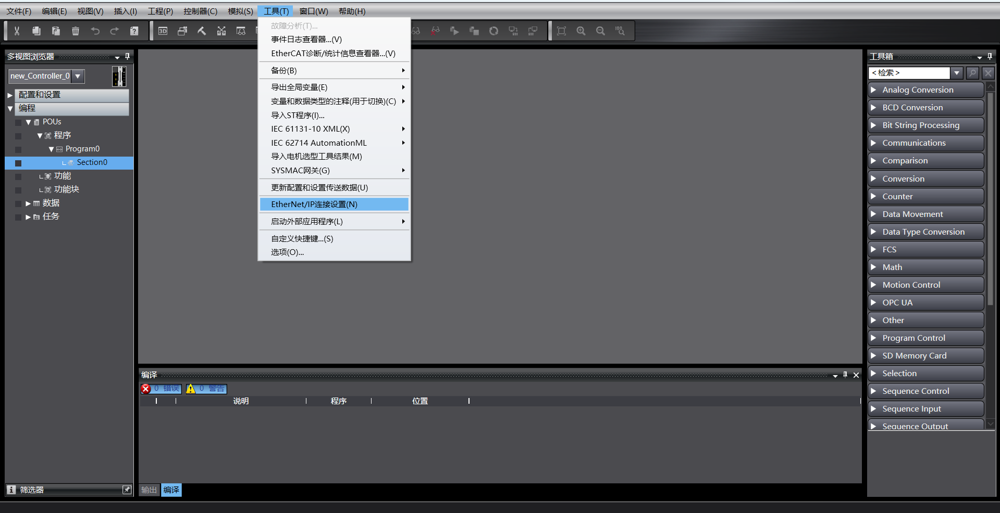

Wejdź w ustawienia PLC, z którym chcesz się połączyć:

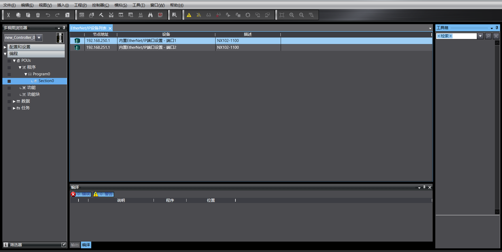

Kliknij prawym przyciskiem myszy w pustym miejscu grupy znaczników, aby utworzyć nową grupę znaczników:

.. image:: remote_mode/034.png
   :width: 6in
   :align: center

Kliknij prawym przyciskiem myszy nowo utworzoną grupę znaczników, utwórz znacznik, wprowadź 256 bajtów wyjścia i 256 bajtów wejścia:

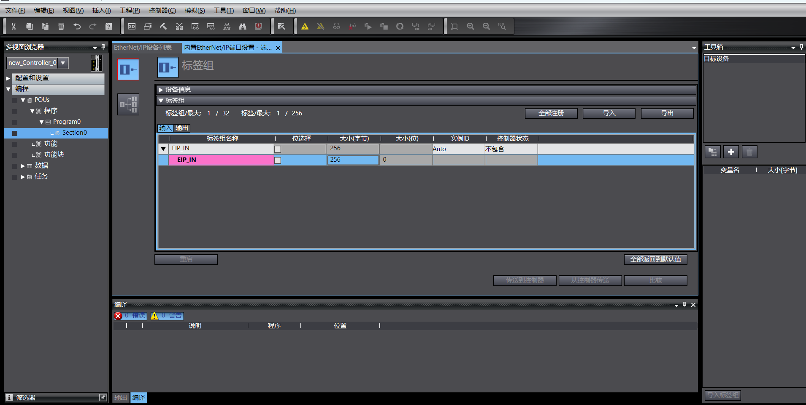

.. image:: remote_mode/036.png
   :width: 6in
   :align: center

Wejdź w ustawienia połączenia, kliknij prawym przyciskiem myszy w pustym miejscu przybornika, kliknij prawym przyciskiem myszy i wybierz „Pokaż bibliotekę EDS”:

.. image:: remote_mode/037.png
   :width: 6in
   :align: center

Zainstaluj plik EDS:

.. image:: remote_mode/038.png
   :width: 6in
   :align: center

Kliknij „Przybornik” → „+”, dodaj urządzenie docelowe, wpisz adres IP urządzenia docelowego:

.. image:: remote_mode/039.png
   :width: 6in
   :align: center

Kliknij „Dodaj” w prawym dolnym rogu, po pomyślnym dodaniu urządzenie docelowe zostanie wyświetlone:

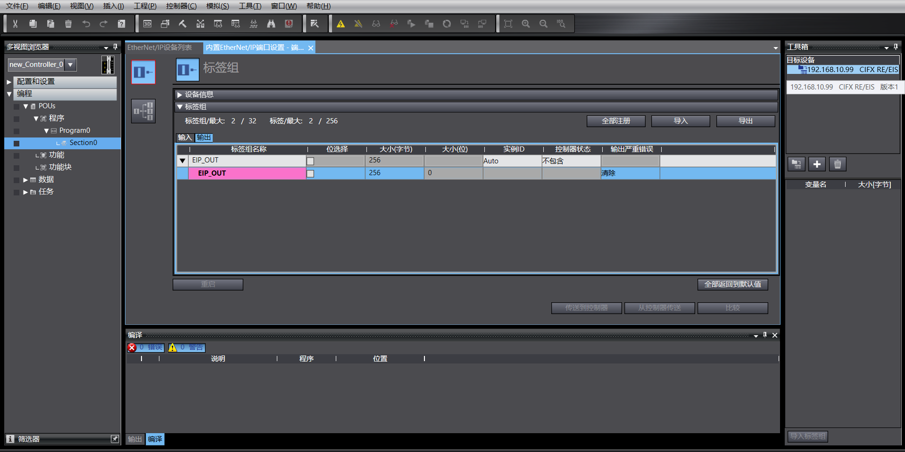

(3) Ustawienia parametrów EtherNet/IP

Kliknij prawym przyciskiem myszy dodane urządzenie docelowe, a następnie kliknij „Edytuj”:

.. image:: remote_mode/041.png
   :width: 6in
   :align: center

Długość mapowania danych bieżącego urządzenia wynosi 256 bajtów, zmień 0001 i 0002 na 256, potwierdź:

.. image:: remote_mode/042.png
   :width: 6in
   :align: center

Kliknij dwukrotnie urządzenie docelowe, wypełnij wejście i wyjście, wybierz zmienne początkowe:

.. image:: remote_mode/043.png
   :width: 6in
   :align: center

(4) Pobranie programu

Otwórz program testowy, zmień adres IP PLC na znajdujący się w tej samej podsieci co karta, uruchom program po pobraniu.

EtherCAT Omron
+++++++++++++++++++++++++++++++++++++++++++++++++

(1) Utworzenie nowego projektu PLC (przypadek ten dotyczy modelu: NX102-1100, PLC Omron 1.47 jako przykład):

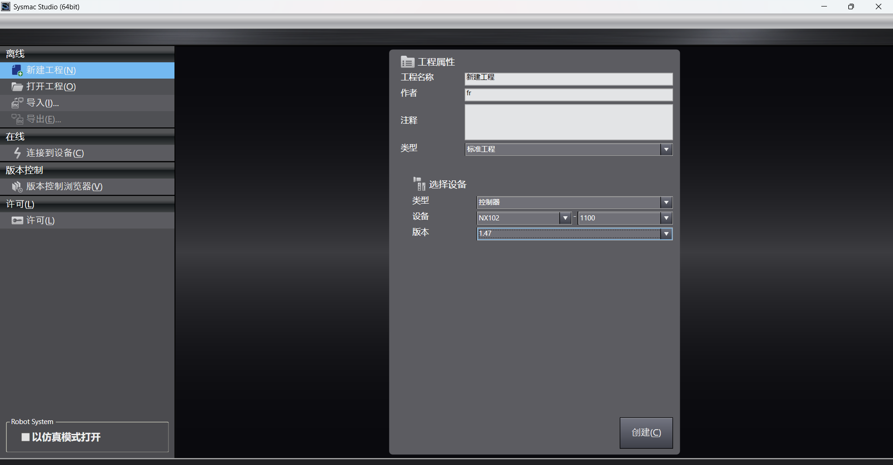

Utworzenie zmiennych globalnych:

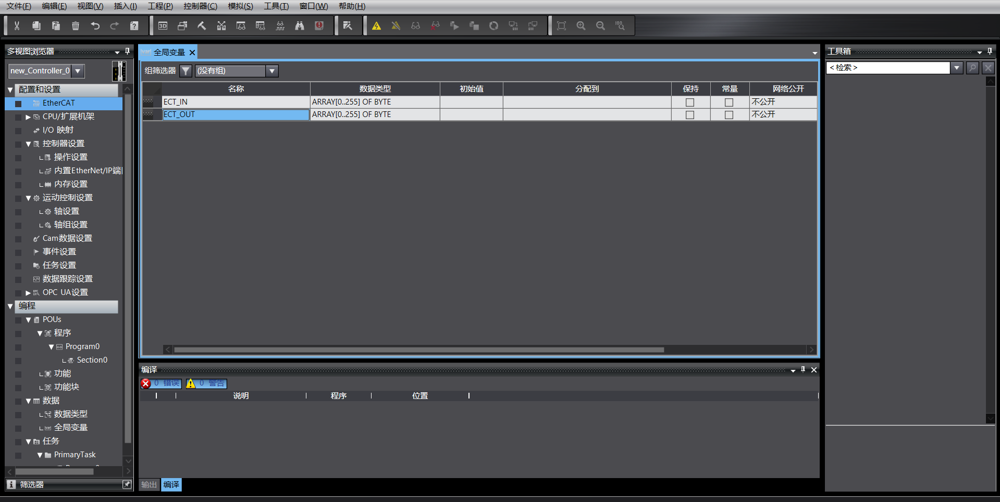

(2) Import pliku XML

Kliknij dwukrotnie „EtherCAT”, aby wejść w interfejs ustawień mastera, kliknij prawym przyciskiem myszy i wybierz „Pokaż bibliotekę ESI”

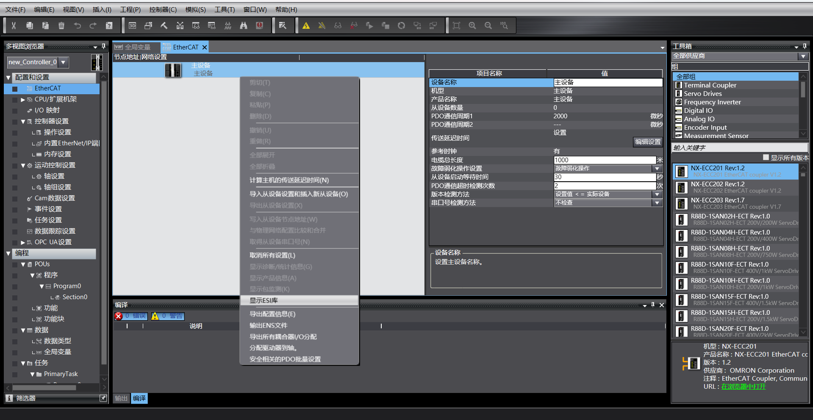

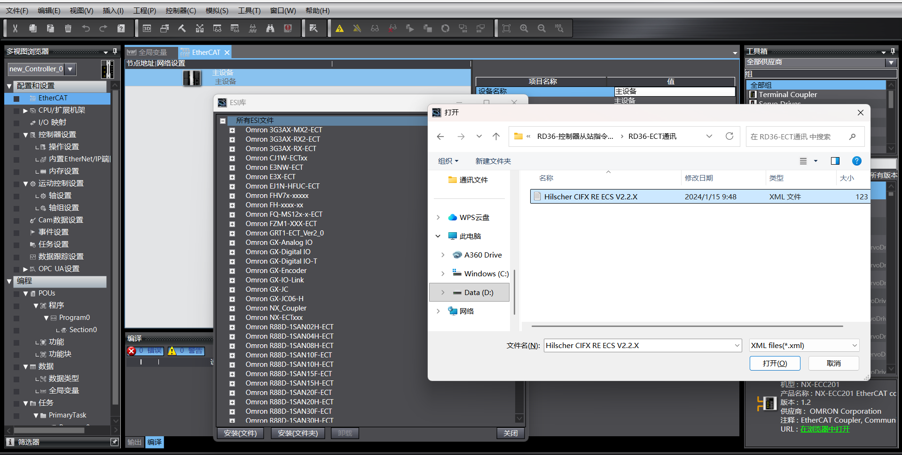

W przyborniku po prawej stronie wybierz docelowe urządzenie do dodania, kliknij dwukrotnie, aby dodać węzeł podrzędny:

.. image:: remote_mode/048.png
   :width: 6in
   :align: center

(3) Ustawienia węzła podrzędnego EtherCAT

Ustaw „Ważność zegara rozproszonego” węzła podrzędnego na „Uruchom DC”:

.. image:: remote_mode/049.png
   :width: 6in
   :align: center

(4) Mapowanie I/O

Kliknij dwukrotnie „Mapowanie I/O”, aby powiązać zmienne z adresami:

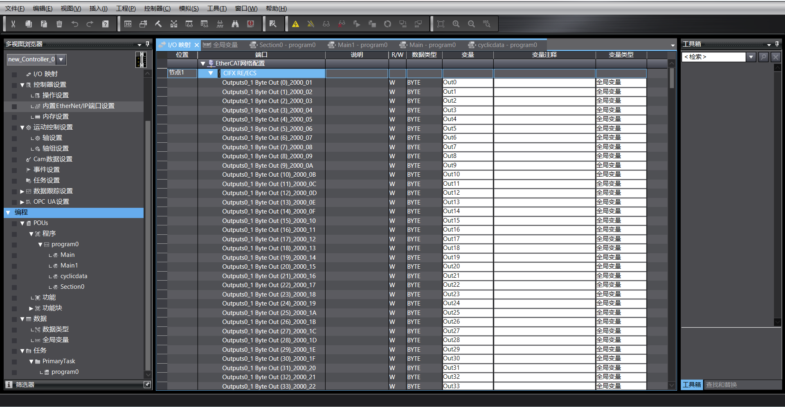

(5) Pobranie programu

Otwórz program testowy, zmień adres IP PLC na znajdujący się w tej samej podsieci co karta, uruchom program po pobraniu.

Opis operacji związanych z trybem zdalnym robota
----------------------------------------------------------------------------

(1) Wprowadź adres IP 192.168.58.2 w przeglądarce, nazwa użytkownika to admin, hasło to 123, kliknij „Zaloguj”, aby przejść do interfejsu Web skrzynki kontrolnej robota.

.. image:: remote_mode/051.png
   :width: 6in
   :align: center

.. centered:: Schemat 18.2-14 Interfejs Web skrzynki kontrolnej

(2) Kliknij „Ustawienia systemowe” -> „Informacje” -> interfejs aktualizacji oprogramowania, kliknij przycisk „Aktualizuj”, prześlij pakiet oprogramowania do aktualizacji, kliknij „Aktualizuj”, aby rozpocząć aktualizację. Po zakończeniu aktualizacji uruchom ponownie skrzynkę kontrolną.

.. image:: remote_mode/052.png
   :width: 6in
   :align: center

.. centered:: Schemat 18.2-15 Aktualizacja oprogramowania

(3) Kliknij przycisk rozszerzenia w prawym górnym rogu, otwórz pasek menu, kliknij tryb lokalny, aby przełączyć się na tryb zdalny.

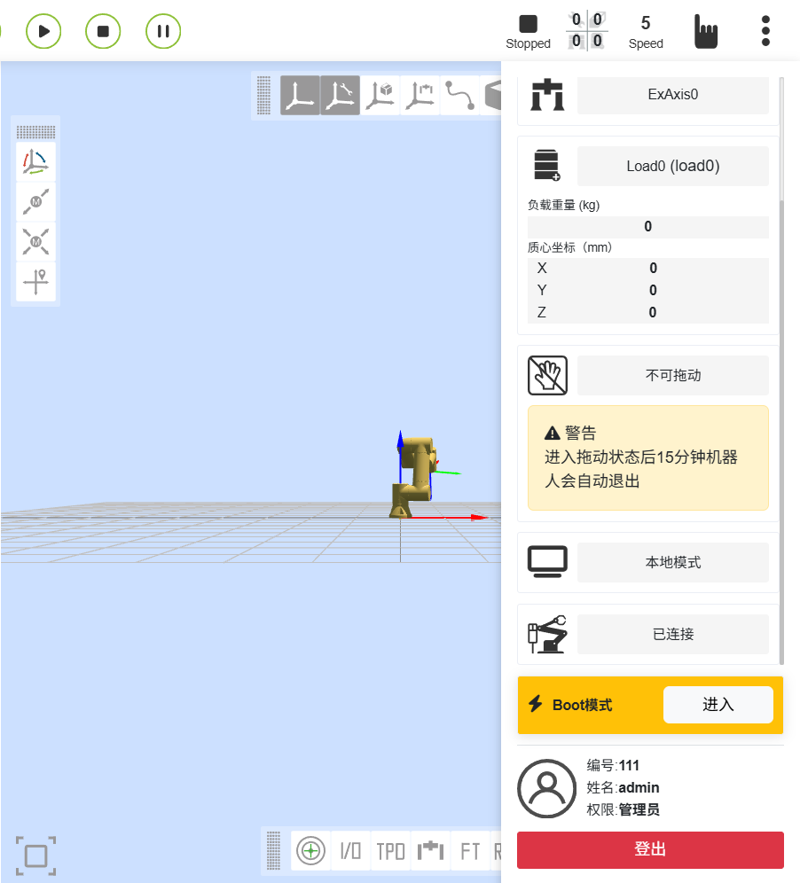

.. centered:: Schemat 18.2-16 Przełączenie na tryb zdalny

(4) Wybierz protokół węzła podrzędnego kontrolera oraz funkcję automatycznego uruchamiania, jeśli potrzebna, a następnie kliknij przycisk „Ustaw”.

.. image:: remote_mode/054.png
   :width: 6in
   :align: center

.. centered:: Schemat 18.2-17 Konfiguracja protokołu komunikacyjnego

.. note:: Aby przełączyć się na inny protokół, należy najpierw kliknąć przycisk „Odinstaluj”, a następnie przystąpić do konfiguracji innego protokołu.

Dodatek
-------------------

Lista instrukcji
~~~~~~~~~~~~~~~~~~~~~~~~~~~

.. list-table:: 
   :widths: 20 80
   :header-rows: 1
   :align: center

   * - Kod polecenia
     - Opis instrukcji

   * - 0x1000
     - Włączenie robota

   * - 0x1001
     - Resetowanie wszystkich błędów

   * - 0x1002
     - Zatrzymanie ruchu robota

   * - 0x1003
     - Odczyt rzeczywistej pozycji

   * - 0x1004
     - Ustawienie prędkości robota

   * - 0x1005
     - Kontynuacja ruchu robota

   * - 0x1006
     - Wstrzymanie ruchu robota

   * - 0x1007
     - Obliczenie pozycji kartezjańskiej na podstawie pozycji przegubów (joint)

   * - 0x1008
     - Obliczenie pozycji przegubów (joint) na podstawie pozycji kartezjańskiej

   * - 0x2000
     - Zapis informacji o narzędziu

   * - 0x2001
     - Odczyt informacji o narzędziu

   * - 0x2002
     - Zapis informacji o przedmiocie

   * - 0x2003
     - Odczyt informacji o przedmiocie

   * - 0x2004
     - Zapis informacji o obciążeniu

   * - 0x2005
     - Odczyt informacji o obciążeniu

   * - 0x2006
     - Zapis informacji o dynamice referencyjnej

   * - 0x2007
     - Odczyt informacji o dynamice referencyjnej

   * - 0x2008
     - Zapis informacji o dynamice domyślnej

   * - 0x2009
     - Odczyt informacji o dynamice domyślnej

   * - 0x2010
     - Zapis informacji o miękkim ograniczeniu

   * - 0x2011
     - Odczyt informacji o miękkim ograniczeniu

   * - 0x3000
     - MoveAxes (na podstawie kąta przegubów)

   * - 0x3001
     - MoveLinear

   * - 0x3002
     - MoveDirect (na podstawie układu współrzędnych kartezjańskich)

   * - 0x3003
     - Ruch jog

   * - 0x3004
     - Zatrzymanie jog