Urządzenia peryferyjne
======================

.. toctree:: 
  :maxdepth: 5

Niestandardowy otwarty protokół Lua na końcówce
------------------------------------------------

Przegląd
~~~~~~~~

Na końcówce robota znajduje się interfejs sprzętowy do podłączania urządzeń peryferyjnych komunikujących się przez 485. Obecnie obsługiwane urządzenia peryferyjne obejmują chwytaki, obrotowe chwytaki, czujniki siły, uchwyty spawalnicze itp. Wszystkie powyższe urządzenia końcowe można dostosować, pisząc otwarty protokół Lua, aby zaimplementować sterowanie urządzeniami peryferyjnymi i uzyskiwanie ich stanu. W przypadku uchwytu spawalniczego SmartTool użytkownik może również skonfigurować funkcje przycisków przez stronę internetową, aby automatycznie wygenerować plik otwartego protokołu. Wygenerowany protokół zostanie automatycznie zastosowany na końcówce.

Procedura operacyjna
~~~~~~~~~~~~~~~~~~~~

**Krok 1**: Przejdź do interfejsu Ustawienia systemowe -> Informacje -> Aktualizacja oprogramowania sprzętowego, wybierz plik .bin oprogramowania sprzętowego końcówki i zaktualizuj oprogramowanie sprzętowe końcówki.

.. important:: 
   Należy najpierw potwierdzić, czy wersja oprogramowania sprzętowego końcówki FV2.010.06 i nowsze są zgodne. Jeśli wersja jest niezgodna, zaktualizuj odpowiednie oprogramowanie sprzętowe. W przeciwnym razie aktualizacja oprogramowania sprzętowego nie jest wymagana.

   Przed przesłaniem pakietu aktualizacyjnego oprogramowania sprzętowego końcówki należy najpierw wyłączyć zasilanie robota, a następnie wejść w tryb boot.

.. figure:: robot_peripherals/001.png
   :align: center
   :width: 6in

.. centered:: Schemat 8.1‑1 Aktualizacja oprogramowania sprzętowego końcówki

**Krok 2**: Otwórz WebApp, kolejno kliknij „Ustawienia początkowe”, „Urządzenia peryferyjne”, wybierz urządzenie peryferyjne końcówki do skonfigurowania (np. chwytak). Typy sterowania urządzeniami peryferyjnymi to dwa: „Urządzenia dostosowane” i „Otwarty protokół urządzeń peryferyjnych”:

- **Urządzenia dostosowane**: Używa sterownika robota do komunikacji, nie wymaga przesyłania i stosowania.
- **Otwarty protokół urządzeń peryferyjnych**: Użytkownik pisze w Lua otwarty protokół końcówki, który ma być dostosowany, aby zaimplementować komunikację i sterowanie. Protokoły końcówek dzielą się na dwa typy: jeden to protokoły przesyłane samodzielnie przez użytkownika, drugi to protokoły wbudowane domyślnie w robocie. Od wersji 3.9.2 użytkownik nie musi dodatkowo weryfikować i szyfrować protokołu Lua przesyłanego na końcówkę za pomocą dodatkowego oprogramowania. Może go po prostu przesłać. Wcześniej zweryfikowane i zaszyfrowane protokoły nadal mogą być normalnie przesyłane i używane. Robot aktywnie rozróżnia, czy plik został zweryfikowany i zaszyfrowany. Jeśli nie został zweryfikowany, zostanie zweryfikowany i zaszyfrowany przed przesłaniem i zastosowaniem na końcówce. Jeśli jest już zaszyfrowany, zostanie bezpośrednio przesłany i zastosowany na końcówce.

.. figure:: robot_peripherals/002.png
   :align: center
   :width: 6in

.. centered:: Schemat 8.1‑2 Typ sterowania chwytakiem

**Krok 3**: Przejdź do interfejsu treści Urządzenia peryferyjne -> Chwytak / Czujnik siły / Uchwyt spawalniczy, kliknij kartę „Niestandardowy protokół”, aby przejść do interfejsu. Prześlij otwarty protokół Lua końcówki, wybierz otwarty protokół Lua końcówki do przesłania i wykonaj operację przesyłania.

.. important:: 
  Nazwa przesyłanego pliku musi zaczynać się od `AXLE_LUA_`.

**Krok 4**: Skonfiguruj parametry komunikacji końcówki. Parametry komunikacji obejmują prędkość transmisji, bity danych, bity stopu itp. Po zakończeniu konfiguracji kliknij przycisk „Konfiguruj”.

.. figure:: robot_peripherals/003.png
   :align: center
   :width: 4in

.. centered:: Schemat 8.1‑3 Konfiguracja parametrów komunikacji końcówki

Szczegółowe parametry komunikacji końcówki są następujące:

- **Prędkość transmisji**: Obsługiwane wartości: 1-9600, 2-14400, 3-19200, 4-38400, 5-56000, 6-67600, 7-115200, 8-128000; Układ scalony sterownika Rs485 na końcówce to niskoprędkościowy 485, prędkość transmisji nie może być > 200k;
- **Bity danych**: Obsługiwane bity danych (8,9), obecnie często używane jest 8;
- **Bity stopu**: 1-1, 2-0.5, 3-2, 4-1.5, obecnie często używane jest 1;
- **Bit parzystości**: 0-None, 1-Odd, 2-Even, obecnie często używane jest 0;
- **Czas timeoutu**: 1~1000 ms, tę wartość należy ustawić rozsądnie w połączeniu z urządzeniem peryferyjnym;
- **Liczba timeoutów**: 1~10, służy głównie do ponownego wysyłania po przekroczeniu timeoutu, aby zmniejszyć sporadyczne błędy i poprawić komfort użytkowania;
- **Odstęp czasu między instrukcjami okresowymi**: 1~1000 ms, służy głównie do ustawienia odstępu czasu między każdym wysłaniem instrukcji okresowych;

**Krok 5**: Włącz Lua na końcówce, kliknij przycisk „Włącz”.

.. figure:: robot_peripherals/004.png
   :align: center
   :width: 4in

.. centered:: Schemat 8.1‑4 Włączanie Lua na końcówce

Gdy plik Lua jest nieprawidłowy, pojawi się ostrzeżenie „Nieprawidłowy plik Lua na końcówce”. Można wybrać opcję „Nie przywracaj / Przywróć”. Zamknij przycisk włączania Lua, aby zamknąć ostrzeżenie.

.. figure:: robot_peripherals/005.png
   :align: center
   :width: 4in

.. centered:: Schemat 8.1‑5 Nieprawidłowy plik Lua

Gdy typ urządzenia to chwytak, można monitorować jego stan.

**Włącz „Monitorowanie stanu”**: Pasek stanu chwytaka po prawej stronie wyświetla w czasie rzeczywistym informacje o stanie, takie jak prędkość robocza chwytaka, moment obrotowy, pozycja itp.

**Wyłącz „Monitorowanie stanu”**: Pasek danych stanu chwytaka po prawej stronie zostanie zamknięty.

.. figure:: robot_peripherals/006.png
   :align: center
   :width: 6in

.. centered:: Schemat 8.1‑6 Monitorowanie stanu

Chwytak
-------------------

W interfejsie „Ustawienia początkowe” -> „Urządzenia peryferyjne” -> „Chwytak” można obecnie używać chwytaka za pomocą „Urządzeń dostosowanych” i „Niestandardowego otwartego protokołu Lua na końcówce”.

Urządzenia dostosowane
~~~~~~~~~~~~~~~~~~~~~~

**Krok 1**: Kliknij „Urządzenia dostosowane”, aby przejść do interfejsu konfiguracji urządzeń peryferyjnych końcówki. Informacje konfiguracyjne chwytaka dzielą się na producenta chwytaka, typ chwytaka, wersję oprogramowania i lokalizację montażu. Użytkownik może skonfigurować odpowiednie informacje o chwytaku zgodnie z konkretnymi potrzebami produkcyjnymi. Jeśli użytkownik chce zmienić konfigurację, może najpierw wybrać odpowiedni numer chwytaka, kliknąć przycisk „Wyczyść”, aby wyczyścić odpowiedni przycisk, a następnie ponownie skonfigurować zgodnie z potrzebami;

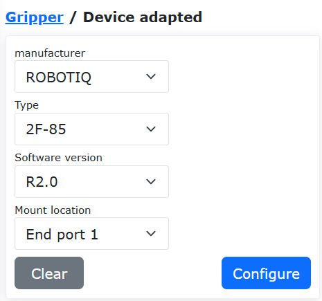

.. centered:: Schemat 8.2‑1 Konfiguracja chwytaka

.. important:: 
    Przed kliknięciem „Wyczyść konfigurację” odpowiedni chwytak powinien być w stanie nieaktywnym.

**Krok 2**: Po zakończeniu konfiguracji chwytaka użytkownik może wyświetlić odpowiednie informacje o chwytaku w tabeli informacji o chwytaku na dole strony. Jeśli zostanie znaleziony błąd konfiguracji, może kliknąć przycisk „Wyczyść”, aby ponownie skonfigurować chwytak;

.. figure:: robot_peripherals/008.png
   :align: center
   :width: 4in

.. centered:: Schemat 8.2‑2 Informacje konfiguracyjne chwytaka

**Krok 3**: Wybierz w pełni skonfigurowany chwytak, kliknij przycisk „Resetuj”. Po wyświetleniu na stronie komunikatu o pomyślnym wysłaniu polecenia, kliknij przycisk „Aktywuj”. Sprawdź stan aktywacji w tabeli informacji o chwytaku, aby określić, czy aktywacja się powiodła;

.. important::
    Podczas aktywacji chwytaka chwytak nie może trzymać żadnego przedmiotu.

**Krok 4**: W interfejsie poleceń programowania nauczania wybierz polecenie „Gripper”. W interfejsie poleceń chwytaka użytkownik może wybrać numer chwytaka, który chce kontrolować (chwytak, który został już skonfigurowany i aktywowany), ustawić odpowiedni stan otwarcia/zamknięcia, prędkość otwierania/zamykania, moment otwierania/zamykania oraz maksymalny czas oczekiwania na ruch chwytaka. Po zakończeniu ustawień kliknij Dodaj i Zastosuj. Ponadto można dodać instrukcje aktywacji i resetu chwytaka, aby aktywować/resetować chwytak podczas uruchamiania programu.

.. figure:: robot_peripherals/009.png
   :align: center
   :width: 6in

.. centered:: Schemat 8.2‑3 Edycja instrukcji chwytaka

Nauczanie programu chwytaka
+++++++++++++++++++++++++++

.. list-table:: 
   :widths: 15 40 100
   :header-rows: 1

   * - Nr
     - Format instrukcji
     - Komentarz
   * - 1
     - PTP(template2,100,-1,0)
     - # Oczekiwanie na punkt chwytania
   * - 2
     - PTP(template1,100,-1,0)
     - # Punkt chwytania
   * - 3
     - MoveGripper(1,255,255,0,1000,0)
     - # Zamknięcie chwytaka
   * - 4
     - PTP(template2,100,-1,0)
     - /
   * - 5
     - PTP(template3,100,-1,0)
     - # Oczekiwanie na punkt zwolnienia
   * - 6
     - PTP(template3,100,-1,0)
     - # Punkt zwolnienia
   * - 7
     - MoveGripper(1,0,255,0,1000,0)
     - # Otwarcie chwytaka

Konfiguracja protokołu Lua końcówki dla chwytaka
~~~~~~~~~~~~~~~~~~~~~~~~~~~~~~~~~~~~~~~~~~~~~~~~

Otwórz WebApp, kolejno kliknij „Ustawienia początkowe”, „Urządzenia peryferyjne”, „Chwytak”, „Niestandardowy protokół”. Kliknij „Zarządzanie protokołami”, aby przejść do konfiguracji protokołu końcówki.

Nazwa pliku przesyłanego przez użytkownika musi zaczynać się od „AXLE_LUA_End”. Po przesłaniu nazwa protokołu na liście zmieni się na zaczynającą się od „Custom_End”. Protokoły tego typu można pobierać i usuwać. Przesłany przez użytkownika plik o tej samej nazwie zostanie automatycznie zastąpiony najnowszym Lua.

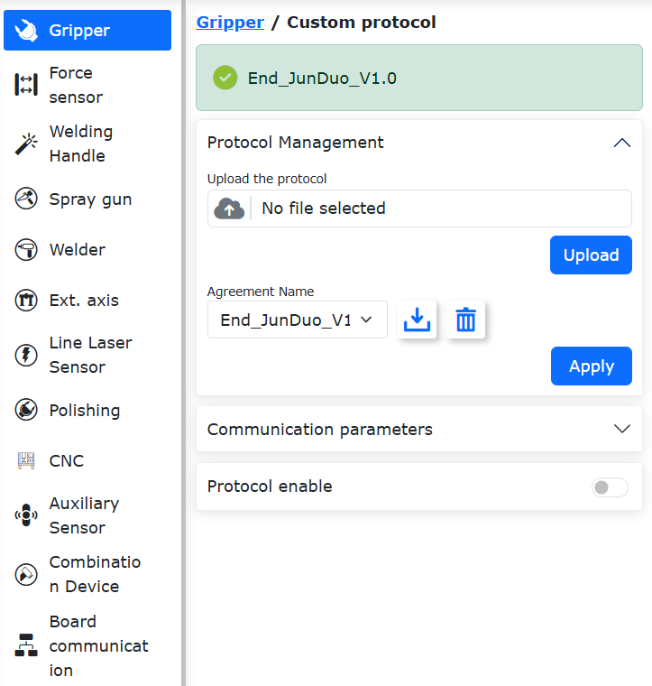

.. centered:: Schemat 8.2‑4-1 Przesyłanie niestandardowego protokołu chwytaka

Wbudowane domyślnie protokoły robota mają prefiks `End_` i można je tylko pobrać, nie można ich usunąć. Wbudowane protokoły dla urządzeń peryferyjnych chwytaka (chwytak obrotowy, przyssawka) pokazano na poniższym rysunku.

.. figure:: robot_peripherals/278.png
   :align: center
   :width: 4in

.. centered:: Schemat 8.2‑4-2 Wbudowane domyślnie protokoły dla chwytaka (chwytaka obrotowego, przyssawki)

Po upewnieniu się, że wybrany protokół jest prawidłowy, można wyłączyć zasilanie robota i zastosować otwarty protokół. Po zastosowaniu robot automatycznie przejdzie w tryb boot i zastosuje wybrany protokół na końcówce. Gdy strona wyświetli komunikat „Aktualizacja powiodła się, proszę ponownie uruchomić szafę sterowniczą”, można ponownie włączyć zasilanie szafy sterowniczej.

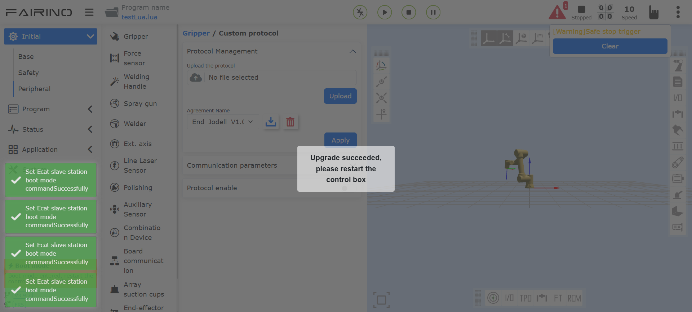

.. centered:: Schemat 8.2‑4-3 Zastosowanie otwartego protokołu końcówki na płycie końcowej

Po ponownym uruchomieniu i wejściu na stronę WebApp, strona wyświetli nazwę aktualnie zastosowanego protokołu. Po kliknięciu włączenia protokołu końcówki i włączeniu urządzenia, protokół końcówki zacznie działać. ID urządzenia to adres slave Modbus urządzenia peryferyjnego końcówki i musi być używany zgodnie z treścią protokołu.

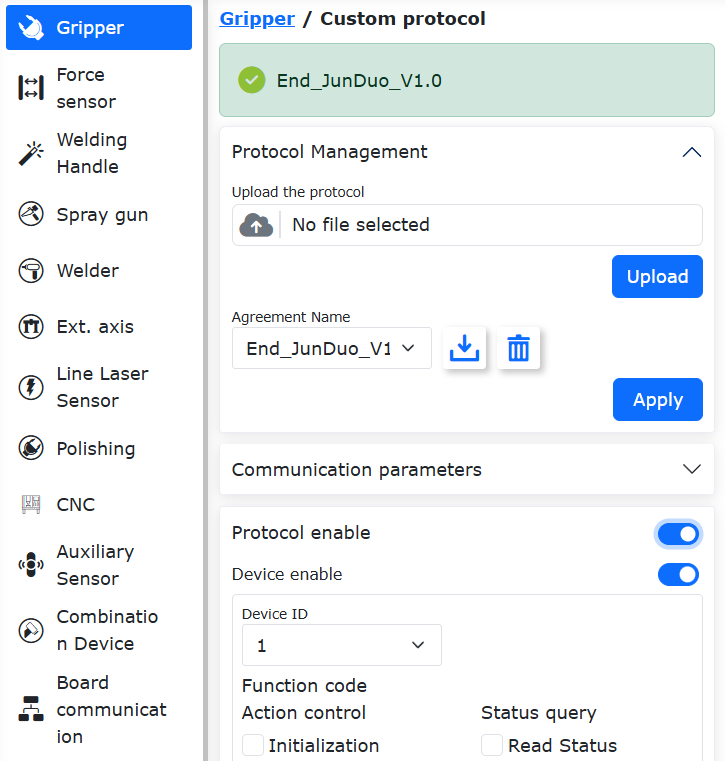

.. centered:: Schemat 8.2‑4-4 Wyświetlanie konfiguracji protokołu końcówki chwytaka i jego włączanie

Płyta końcowa sprawdzi przesłany protokół Lua. Gdy plik Lua jest nieprawidłowy, pojawi się ostrzeżenie „Nieprawidłowy plik Lua na końcówce”. Można wybrać opcję „Nie przywracaj / Przywróć”. Zamknij przycisk włączania Lua, aby zamknąć ostrzeżenie.

.. figure:: robot_peripherals/005.png
   :align: center
   :width: 4in

.. centered:: Schemat 8.2‑4-5 Wyświetlanie konfiguracji protokołu końcówki chwytaka i jego włączanie

Przykład protokołu Lua urządzenia peryferyjnego końcówki dla chwytaka
+++++++++++++++++++++++++++++++++++++++++++++++++++++++++++++++++++++

.. code-block:: console
  
  function Getbit(X,Bit)--Getbit(), funkcja do wyodrębnienia bitu z bajtu, parametry: X: bajt, z którego wyodrębniany jest bit; Bit: który bit wyodrębnić, zakres 0-7
  return ((X&(1<<Bit))>>Bit)
  end

  function GetOneByte(U32)--GetOneByte(), wyodrębnia dane 0x1234, pobiera niski bajt, zwraca 0x34
  return ((U32>>0)&0xFF)
  end

  function GetTwoByte(U32)--GetTwoByte(), wyodrębnia dane 0x1234, pobiera wysoki bajt, zwraca 0x12
  return ((U32>>8)&0xFF)
  end
  function GetThreeByte(U32)--GetThreeByte(), wyodrębnia dane 0x56781234, zwraca 0x78
  return ((U32>>16)&0xFF)
  end
  function GetFourByte(U32)--GetFourByte(), wyodrębnia dane 0x56781234, zwraca 0x56
  return ((U32>>24)&0xFF)
  end
  X,Speed,Torque=0,0,0
  while(1)
  do
  IwdgTaskHandle()
  MainLoop()
  UpDownLoadHandle()
  SdoRwPara()
  EndErrClear()
  local BFlag=LuaBreak()
  if(BFlag==1)then
  break
  end--tutaj do końca pliku LuaGc(), end to stałe użycie

  T1={0x01,0x06,0x03,0xE8,0x00,0x09,0xC9,0xBC}--Wypełnij instrukcję chwytaka (instrukcja Modbus RTU), T1-T5 to kolejno instrukcja wykonania ruchu chwytaka, instrukcja inicjalizacji chwytaka, instrukcja ustawienia pozycji chwytaka, instrukcja ustawienia prędkości chwytaka, instrukcja ustawienia momentu chwytaka
  --/Analiza instrukcji: T1[1]=0X01, adres chwytaka; T1[2]=0x06, kod funkcji zapisu pojedynczego rejestru holdingowego; T1[3], T1[4]: 0x03,0xE8, adres rejestru, na którym ma działać instrukcja wykonania ruchu; T1[5], T1[6]: 0x00,0x09, dane do zapisu w rejestrze; T1[7], T1[8]: 0xC9,0xBC, kod CRC, należy zmodyfikować zgodnie z instrukcją użytkownika chwytaka
  T2={}
  T3={}
  T4={}
  T5={}

  T7={0x01,0x03,0x07,0xD0,0x00,0x01,0x84,0x87}--T7-T12, instrukcje odczytu stanu chwytaka, kolejno instrukcja odczytu stanu chwytaka, instrukcja odczytu inicjalizacji chwytaka, instrukcja odczytu kodu błędu chwytaka, instrukcja odczytu pozycji chwytaka, instrukcja odczytu prędkości chwytaka, instrukcja odczytu momentu chwytaka
  T8={}
  T9={}
  T10={}
  T11={}
  T12={}
  Rcmd1,Rcmd2,Rcmd3,Rcmd4=GetGripCmd()--stałe użycie, nie wymaga modyfikacji, Rcm2 to adres chwytaka wysyłany przez sterownik, Rcmd4 to dane wysyłane przez sterownik
  if(Rcmd1==1) then
  T1[1]=Rcmd2                   
  T2[1]=Rcmd2
  T3[1]=Rcmd2
  T4[1]=Rcmd2
  T5[1]=Rcmd2

  T7[1]=Rcmd2
  T8[1]=Rcmd2
  T9[1]=Rcmd2
  T10[1]=Rcmd2
  T11[1]=Rcmd2
  T12[1]=Rcmd2                    --** Aktualizacja adresu chwytaka
  if (Rcmd3==1) then              -- Instrukcja wykonania ruchu chwytaka
  T1[7],T1[8]=CrcValue(T1[1],T1[2],T1[3],T1[4],T1[5],T1[6])--Oblicz wartość CRC instrukcji Modbus RTU, dwa bajty
  EndTxGripData(T1[1],T1[2],T1[3],T1[4],T1[5],T1[6],T1[7],T1[8])--Końcówka wysyła instrukcję do chwytaka
  DelayMs(10)                                                   --Opóźnienie 10 ms
  A,Rxd1,Rxd2,Rxd3,Rxd4,Rxd5,Rxd6,Rxd7=EndRxGripData()--Końcówka zwraca dane zwrotne odebrane z chwytaka do Lua, szczegółowa treść zwrotna wymaga zapoznania się z instrukcją użytkownika chwytaka
  GripStateBack(Rxd3)
  end
  if (Rcmd3==2) then
  T2[7],T2[8]=CrcValue(T2[1],T2[2],T2[3],T2[4],T2[5],T2[6])
  EndTxGripData(T2[1],T2[2],T2[3],T2[4],T2[5],T2[6],T2[7],T2[8])
  DelayMs(10)
  A,Rxd1,Rxd2,Rxd3,Rxd4,Rxd5,Rxd6,Rxd7=EndRxGripData()
  GripStateBack(Rxd3)
  end
  if(Rcmd3==3) then
  X=Rcmd4
  T3[5]=0x00
  T3[6]=X
  T3[7],T3[8]=CrcValue(T3[1],T3[2],T3[3],T3[4],T3[5],T3[6])
  EndTxGripData(T3[1],T3[2],T3[3],T3[4],T3[5],T3[6],T3[7],T3[8])
  DelayMs(10)
  A,Rxd1,Rxd2,Rxd3,Rxd4,Rxd5,Rxd6,Rxd7=EndRxGripData()
  GripStateBack(Rxd3)
  end
  if (Rcmd3==4) then
  Speed=Rcmd4
  T4[5]=Torque
  T4[6]=Speed
  T4[7],T4[8]=CrcValue(T4[1],T4[2],T4[3],T4[4],T4[5],T4[6])
  EndTxGripData(T4[1],T4[2],T4[3],T4[4],T4[5],T4[6],T4[7],T4[8])
  DelayMs(10)
  A,Rxd1,Rxd2,Rxd3,Rxd4,Rxd5,Rxd6,Rxd7=EndRxGripData()
  GripStateBack(Rxd3)
  end
  if(Rcmd3==5) then
  Torque=Rcmd4
  T5[5]=Torque
  T5[6]=Speed
  T5[7],T5[8]=CrcValue(T5[1],T5[2],T5[3],T5[4],T5[5],T5[6])
  EndTxGripData(T5[1],T5[2],T5[3],T5[4],T5[5],T5[6],T5[7],T5[8])
  DelayMs(10)
  A,Rxd1,Rxd2,Rxd3,Rxd4,Rxd5,Rxd6,Rxd7=EndRxGripData()
  GripStateBack(Rxd3)
  end
  if(Rcmd3 == 7) then
  T7[7],T7[8]=CrcValue(T7[1],T7[2],T7[3],T7[4],T7[5],T7[6])
  EndTxGripData(T7[1],T7[2],T7[3],T7[4],T7[5],T7[6],T7[7],T7[8])
  DelayMs(10)
  A,Rxd1,Rxd2,Rxd3,Rxd4,Rxd5,Rxd6,Rxd7=EndRxGripData()
  RxdCrcH,RxdCrcL = CrcValue(Rxd1,Rxd2,Rxd3,Rxd4,Rxd5)
  if((A==8)and(Rxd1==Rcmd2)and(Rxd2==0x03)and(Rxd3==0x02)and(Rxd6==RxdCrcH)and(Rxd7==RxdCrcL))then
  GripStateBack(Rxd4)
  end
  end
  if(Rcmd3==8) then
  T8[7],T8[8]=CrcValue(T8[1],T8[2],T8[3],T8[4],T8[5],T8[6])
  EndTxGripData(T8[1],T8[2],T8[3],T8[4],T8[5],T8[6],T8[7],T8[8])
  DelayMs(10)
  A,Rxd1,Rxd2,Rxd3,Rxd4,Rxd5,Rxd6,Rxd7=EndRxGripData()
  RxdCrcH,RxdCrcL = CrcValue(Rxd1,Rxd2,Rxd3,Rxd4,Rxd5)
  if((A==8)and(Rxd1==Rcmd2)and(Rxd2==0x03)and(Rxd3==0x02)and(Rxd6==RxdCrcH)and(Rxd7 ==RxdCrcL)) then
  GripStateBack(Rxd5)
  end
  end
  if(Rcmd3 == 9) then
  T9[7],T9[8]=CrcValue(T9[1],T9[2],T9[3],T9[4],T9[5],T9[6])
  EndTxGripData(T9[1],T9[2],T9[3],T9[4],T9[5],T9[6],T9[7],T9[8])
  DelayMs(10)
  A,Rxd1,Rxd2,Rxd3,Rxd4,Rxd5,Rxd6,Rxd7=EndRxGripData()
  RxdCrcH,RxdCrcL = CrcValue(Rxd1,Rxd2,Rxd3,Rxd4,Rxd5)
  if((A==8)and(Rxd1==Rcmd2)and(Rxd2==0x03)and(Rxd3==0x02)and(Rxd6==RxdCrcH)and(Rxd7==RxdCrcL)) then
  GripStateBack(Rxd5)
  end
  end
  if(Rcmd3 == 10) then
  T10[7],T10[8]=CrcValue(T10[1],T10[2],T10[3],T10[4],T10[5],T10[6])
  EndTxGripData(T10[1],T10[2],T10[3],T10[4],T10[5],T10[6],T10[7],T10[8])
  DelayMs(10)
  A,Rxd1,Rxd2,Rxd3,Rxd4,Rxd5,Rxd6,Rxd7=EndRxGripData()
  RxdCrcH,RxdCrcL = CrcValue(Rxd1,Rxd2,Rxd3,Rxd4,Rxd5)
  if((A==8)and(Rxd1==Rcmd2)and(Rxd2==0x03)and(Rxd3==0x02)and(Rxd6==RxdCrcH)and(Rxd7==RxdCrcL)) then
  GripStateBack(Rxd4)
  end
  end
  if(Rcmd3 == 11) then
  T11[7],T11[8]=CrcValue(T11[1],T11[2],T11[3],T11[4],T11[5],T11[6])
  EndTxGripData(T11[1],T11[2],T11[3],T11[4],T11[5],T11[6],T11[7],T11[8])
  DelayMs(10)
  A,Rxd1,Rxd2,Rxd3,Rxd4,Rxd5,Rxd6,Rxd7=EndRxGripData()
  RxdCrcH,RxdCrcL = CrcValue(Rxd1,Rxd2,Rxd3,Rxd4,Rxd5)
  if((A==8)and(Rxd1==Rcmd2)and(Rxd2==0x03)and(Rxd3==0x02)and(Rxd6==RxdCrcH)and(Rxd7==RxdCrcL)) then
  GripStateBack(Rxd5)
  end
  end
  if(Rcmd3 == 12) then
  T12[7],T12[8]=CrcValue(T12[1],T12[2],T12[3],T12[4],T12[5],T12[6])
  EndTxGripData(T12[1],T12[2],T12[3],T12[4],T12[5],T12[6],T12[7],T12[8])
  DelayMs(10)
  A,Rxd1,Rxd2,Rxd3,Rxd4,Rxd5,Rxd6,Rxd7=EndRxGripData()
  RxdCrcH,RxdCrcL = CrcValue(Rxd1,Rxd2,Rxd3,Rxd4,Rxd5)
  if((A==8)and(Rxd1==Rcmd2)and(Rxd2==0x03)and(Rxd3==0x02)and(Rxd6==RxdCrcH)and(Rxd7==RxdCrcL)) then
  GripStateBack(Rxd4)
  end
  end
  end
  LuaGc()
  end

Włączanie urządzenia
++++++++++++++++++++

**Krok 1**: Włącz chwytak -> wybierz ID chwytaka -> zaznacz kody funkcji dostosowane do chwytaka -> kliknij Konfiguruj. W skonfigurowanych urządzeniach wyświetlane są ID chwytaka i kody funkcji.

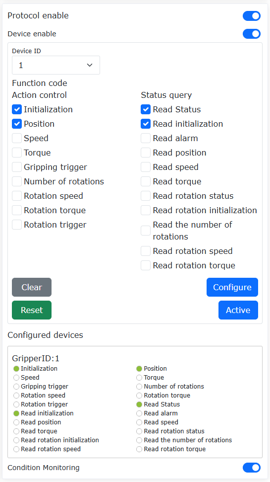

.. centered:: Schemat 8.2‑4 Konfiguracja chwytaka

.. note:: 
  Ponieważ obecna funkcja otwartej końcówki obsługuje zakres adresów urządzeń chwytaka od 1 do 8, przed użyciem należy dostosować adres urządzenia chwytaka za pomocą oprogramowania nadrzędnego producenta chwytaka.

  Zaznaczenie kodów funkcji powinno odbywać się na podstawie instrukcji produktu dostarczonej przez producenta chwytaka, aby sprawdzić funkcje dostosowane do chwytaka i powinny one odpowiadać kodom funkcji Lua końcówki. Szczegóły można znaleźć w „Podręczniku dostosowywania chwytaka do Lua końcówki”.

**Krok 2**: Wybierz ID chwytaka -> Resetuj -> Aktywuj. Chwytak wykonuje inicjalizację. Szczegóły inicjalizacji można znaleźć w instrukcji produktu dostarczonej przez producenta chwytaka.

.. figure:: robot_peripherals/011.png
   :align: center
   :width: 4in

.. centered:: Schemat 8.2‑5 Aktywacja chwytaka

**Krok 3**: Przejdź do Program nauczania -> Programowanie -> dodaj instrukcję ruchu chwytaka.

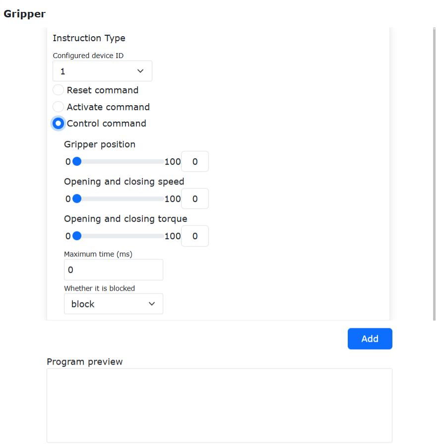

.. centered:: Schemat 8.2‑6 Dodawanie instrukcji ruchu chwytaka

.. figure:: robot_peripherals/013.png
   :align: center
   :width: 6in

.. centered:: Schemat 8.2‑7 Przykład instrukcji ruchu chwytaka

Wiele chwytaków
+++++++++++++++

Aktywacja i sterowanie ruchem — patrz kroki dla chwytaka.

.. figure:: robot_peripherals/014.png
   :align: center
   :width: 4in

.. centered:: Schemat 8.2‑8 Konfiguracja wielu chwytaków

.. note:: Ponieważ obecna funkcja otwartej końcówki obsługuje zakres adresów urządzeń chwytaka od 1 do 8, przed użyciem należy dostosować adres urządzenia chwytaka za pomocą oprogramowania nadrzędnego producenta chwytaka.

Chwytak obrotowy
++++++++++++++++

**Krok 1**: Włącz chwytak -> wybierz ID chwytaka -> zaznacz kody funkcji dostosowane do chwytaka -> kliknij Konfiguruj. W skonfigurowanych urządzeniach wyświetlane są ID chwytaka i kody funkcji.

.. centered:: Schemat 8.2‑9 Konfiguracja chwytaka i kodów funkcji

.. note:: Zaznaczenie kodów funkcji powinno odbywać się na podstawie instrukcji produktu dostarczonej przez producenta chwytaka, aby sprawdzić funkcje dostosowane do chwytaka i powinny one odpowiadać kodom funkcji Lua końcówki. Szczegóły można znaleźć w „FR05-Protokół wszystkich urządzeń peryferyjnych końcówki-V2.5-20241101.xlsx”.

**Krok 2**: Wybierz ID chwytaka -> Resetuj -> Aktywuj. Chwytak wykonuje inicjalizację. Szczegóły inicjalizacji można znaleźć w instrukcji produktu dostarczonej przez producenta chwytaka.

.. figure:: robot_peripherals/011.png
   :align: center
   :width: 4in

.. centered:: Schemat 8.2‑10 Aktywacja chwytaka

**Krok 3**: Przejdź do Program nauczania -> Programowanie -> dodaj instrukcję ruchu chwytaka.

.. centered:: Schemat 8.2‑11 Dodawanie instrukcji ruchu chwytaka obrotowego

.. figure:: robot_peripherals/015.png
   :align: center
   :width: 6in

.. centered:: Schemat 8.2‑12 Przykład instrukcji ruchu chwytaka obrotowego

.. note:: Liczba obrotów to absolutna liczba obrotów. Maksymalna liczba obrotów w przód to 90, maksymalna liczba obrotów w tył to 90. Po wykonaniu obrotu należy wykonać reset.

Funkcja Wykrywania Upadku Przedmiotu Chwytaka
~~~~~~~~~~~~~~~~~~~~~~~~~~~~~~~~~~~~~~~~~~~~~~~~~~~~~~~~~~~~~~~~~~~~~~~~~~~~~~~~~~~~~~

Instrukcje Konfiguracji
++++++++++++++++++++++++++++++++++++++++++++++++++

Użytkownicy mogą modyfikować otwarty protokół końcówki, aby odczytać wartość rejestru alarmu upadku chwytaka i przesłać ją z powrotem do robota. Gdy chwytak ustawi ten błąd, robot jednocześnie uruchomi błąd "Alarm Upadku Przedmiotu Chwytaka".

Na przykładzie chwytaka Junduo, poniżej przedstawiono przykład dodania wykrywania upadku chwytaka do otwartego protokołu końcówki. Ten kod odczytuje bit 1 rejestru 0x07D0 chwytaka. Gdy ten bit jest ustawiony na 1, flaga upadku przedmiotu jest wyzwalana, a GripState otrzymuje wartość 3 i jest przekazywana do robota, uruchamiając błąd "Alarm Upadku Przedmiotu Chwytaka".

W przypadku problemów podczas tworzenia, prosimy o kontakt z naszą firmą w celu uzyskania wsparcia technicznego.

.. centered:: Przykład Dodania Logiki Wykrywania Upadku Chwytaka Junduo do Otwartego Protokołu Końcówki

.. code-block:: console
    :linenos:  

    ……
    local T5 = {0x01,0x03,0x07,0xD0,0x00,0x01,0x84,0x87}
    ……
    if (Rcmd3 == 7) then
    T5[7], T5[8] = CrcValue(T5[1], T5[2], T5[3], T5[4], T5[5], T5[6])
    EndTxGripData(T5[1], T5[2], T5[3], T5[4], T5[5], T5[6], T5[7], T5[8])
    DelayMs(10)
    a, Rxd1, Rxd2, Rxd3, Rxd4, Rxd5, Rxd6, Rxd7 = EndRxGripData()
    RxdCrcH, RxdCrcL = CrcValue(Rxd1, Rxd2, Rxd3, Rxd4, Rxd5)
    if ((a == 8) and (Rxd1 == Rcmd2) and (Rxd2 == 0x03) and (Rxd3 == 0x02) and (Rxd6 == RxdCrcH) and (Rxd7 == RxdCrcL)) then
    local Fall = ((Rxd5 & 0x02) >> 1)
    Rxd5 = ((Rxd5 & 0xC0) >> 6)
    if(Fall == 0)then
    if (Rxd5 == 0x00) then
    GripState = 0x00
    elseif (Rxd5 == 0x03) then
    GripState = 0x01
    elseif ((Rxd5 == 0x01) or (Rxd5 == 0x02)) then
    GripState = 0x02
    end
    else
    GripState = 0x03
    end
    GripStateBack(GripState)
    end
    end

Na podstawie protokołu końcówki z dodaną logiką wykrywania upadku, przejdź do "Ustawienia Początkowe" -> "Urządzenia Perferyjne" -> "Chwytak", aby przesłać, zaktualizować i zastosować otwarty protokół LUA końcówki.

.. figure:: robot_peripherals/316.png
   :align: center
   :width: 6in

.. centered:: Rysunek 8.2‑13 Przesyłanie Protokołu Końcówki Chwytaka

Po ponownym uruchomieniu robota chwytak może być używany normalnie. Jeśli podczas używania chwytaka nastąpi upadek przedmiotu, robot zgłosi "Przedmiot chwytaka upadł, proszę zresetować i ponownie aktywować chwytak", a robot jednocześnie zatrzyma bieżący ruch i bieżący program LUA.

Kody błędów głównych i podrzędnych portów 8083 i 20004 zmienią się na 8-3, a odpowiadający im kod błędu chwytaka wynosi 3. Dla innych kodów błędów przesyłanych przez sam chwytak, kontroler doda 3 do oryginalnego kodu błędu.

.. figure:: robot_peripherals/317.png
   :align: center
   :width: 3in

.. centered:: Rysunek 8.2‑14 Błąd "Przedmiot Chwytaka Upadł"
 
Należy pamiętać, że po wyczyszczeniu tego błędu użytkownik musi ręcznie wysłać polecenia "Reset Chwytaka" i "Aktywuj Chwytak", aby wyczyścić flagę upadku w rejestrze chwytaka. Można to zrobić za pomocą przycisków na stronie lub poleceń LUA; w przeciwnym razie błąd nadal będzie zgłaszany przy następnym uruchomieniu.

.. figure:: robot_peripherals/318.png
   :align: center
   :width: 6in

.. centered:: Rysunek 8.2‑15 Resetowanie i Aktywowanie Chwytaka przez Stronę

.. figure:: robot_peripherals/319.png
   :align: center
   :width: 6in

.. centered:: Rysunek 8.2‑16 Resetowanie i Aktywowanie Chwytaka za pomocą Poleceń LUA

Ponadto chwytak Junduo udostępnia rejestr progu wykrywania upadku pod adresem 0x1399, który należy modyfikować za pomocą polecenia 0x10. Zakres modyfikacji wynosi 0~1000. Protokół końcówki dostarczony w tym dokumencie może zmienić wartość tego rejestru. Pierwszy zapis po każdym uruchomieniu protokołu zapisuje tę wartość (0x14, można modyfikować w zależności od potrzeb). Przykład pokazano poniżej w 2-2. W celu uzyskania szczegółowych informacji o użyciu, skontaktuj się z producentem chwytaka Junduo.

.. centered:: Przykład Dodania Modyfikacji Progu Upadku Chwytaka Junduo do Otwartego Protokołu Końcówki

.. code-block:: console
    :linenos:  

    ……
    local T10 = {0x01,0x10,0x13,0x99,0x00,0x01,0x02,0x00,0x14,0x00,0x00}
    ……
    if Set == 0 then
    T10[10],T10[11]= CrcValue(T10[1],T10[2],T10[3],T10[4],T10[5],T10[6],T10[7],T10[8],T10[9])
    EndTxGripData(T10[1],T10[2],T10[3],T10[4],T10[5],T10[6],T10[7],T10[8],T10[9],T10[10],T10[11])
    DelayMs(35)
    a,Rxd1, Rxd2, Rxd3, Rxd4, Rxd5,Rxd6,Rxd7,Rxd8 = EndRxGripData()
    Set=1
    end

Załącznik 1: Błędy Kontrolera Ruchu i Metody Postępowania
++++++++++++++++++++++++++++++++++++++++++++++++++++++++++++++++++++++++++++++++++++++++++++++++++++

.. centered:: Tabela Kodów Błędów Kontrolera Ruchu

.. list-table:: 
   :widths: 15 40 100
   :header-rows: 1

   * - Główny Kod Błędu
     - Podrzędny Kod Błędu
     - Opis
   * - 8-Błąd Urządzenia Końcówki
     - 1
     - Błąd timeoutu ruchu chwytaka, możliwy do zresetowania
   * - 8-Błąd Urządzenia Końcówki
     - 2
     - Timeout komunikacji 485 końcówki, możliwy do zresetowania
   * - 8-Błąd Urządzenia Końcówki
     - 3
     - Alarm upadku przedmiotu chwytaka, możliwy do zresetowania. Po wyczyszczeniu błędu, proszę zresetować i ponownie aktywować chwytak

Czujnik siły
------------

W interfejsie „Ustawienia początkowe” -> „Urządzenia peryferyjne” -> „Czujnik siły” można obecnie używać czujnika siły za pomocą „Urządzeń dostosowanych” i „Niestandardowego otwartego protokołu Lua na końcówce”.

Urządzenia dostosowane
~~~~~~~~~~~~~~~~~~~~~~

**Krok 1**: Kliknij „Urządzenia dostosowane”, aby przejść do interfejsu konfiguracji urządzeń peryferyjnych końcówki.

Informacje konfiguracyjne czujnika siły dzielą się na producenta, typ, wersję oprogramowania i lokalizację montażu. Użytkownik może skonfigurować odpowiednie informacje o czujniku siły zgodnie z konkretnymi potrzebami produkcyjnymi. Jeśli użytkownik chce zmienić konfigurację, może najpierw wybrać odpowiedni numer, kliknąć przycisk „Wyczyść”, aby wyczyścić odpowiednie informacje, a następnie ponownie skonfigurować zgodnie z potrzebami;

.. figure:: robot_peripherals/016.png
   :align: center
   :width: 4in

.. centered:: Schemat 8.3‑1 Konfiguracja czujnika siły

.. important:: 
    Przed kliknięciem „Wyczyść konfigurację” odpowiedni czujnik powinien być w stanie nieaktywnym.

**Krok 2**: Po zakończeniu konfiguracji czujnika siły użytkownik może wyświetlić odpowiednie informacje o czujniku siły w tabeli informacji na dole strony. Jeśli zostanie znaleziony błąd konfiguracji, może kliknąć przycisk „Wyczyść”, aby ponownie skonfigurować.

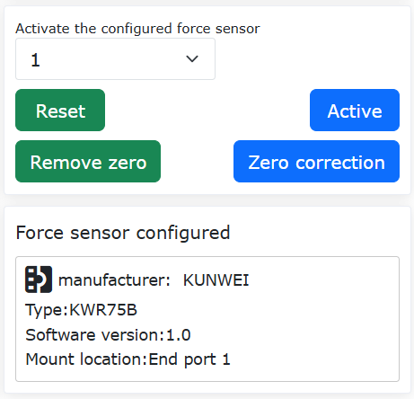

.. centered:: Schemat 8.3‑2 Informacje konfiguracyjne czujnika siły

**Krok 3**: Wybierz w pełni skonfigurowany numer czujnika siły, kliknij przycisk „Resetuj”. Po wyświetleniu na stronie komunikatu o pomyślnym wysłaniu polecenia, kliknij przycisk „Aktywuj”. Sprawdź stan aktywacji w tabeli informacji o czujniku siły, aby określić, czy aktywacja się powiodła. Ponadto czujnik siły ma wartość początkową. Użytkownik może w razie potrzeby wybrać „Korekcja zera” i „Usuń punkt zerowy”. Korekcja zera czujnika siły wymaga upewnienia się, że czujnik siły jest skierowany poziomo i pionowo w dół, a robot nie ma skonfigurowanego obciążenia.

**Krok 4**: Po zakończeniu konfiguracji czujnika siły należy skonfigurować układ współrzędnych narzędzia typu czujnik. Można bezpośrednio wprowadzić wartości układu współrzędnych narzędzia czujnika na podstawie odległości między czujnikiem a środkiem narzędzia końcówki i zastosować je.

Protokół Lua końcówki dla czujnika siły
~~~~~~~~~~~~~~~~~~~~~~~~~~~~~~~~~~~~~~~

Otwórz WebApp, kolejno kliknij „Ustawienia początkowe”, „Urządzenia peryferyjne”, „Czujnik siły”, „Niestandardowy protokół”. Kliknij „Zarządzanie protokołami”, aby przejść do konfiguracji protokołu końcówki. Obecnie wbudowane domyślnie protokoły dla czujnika siły pokazano na poniższym rysunku. Wersja 3.9.2 dodaje dwa wbudowane protokoły kombinowane dla chwytaka + czujnika siły: End_JD_XJC_V1.0.lua, End_JD_GZCX_V1.0.lua.

.. figure:: robot_peripherals/281.png
   :align: center
   :width: 6in

.. centered:: Schemat 8.3‑2-2 Wbudowane domyślnie protokoły dla czujnika siły

Protokół Lua końcówki dla uchwytu spawalniczego
~~~~~~~~~~~~~~~~~~~~~~~~~~~~~~~~~~~~~~~~~~~~~~~

Otwórz WebApp, kolejno kliknij „Ustawienia początkowe”, „Urządzenia peryferyjne”, „Uchwyt spawalniczy”, „Niestandardowy protokół”. Kliknij „Zarządzanie protokołami”, aby przejść do konfiguracji protokołu końcówki. Obecnie wbudowane domyślnie protokoły dla uchwytu spawalniczego pokazano na poniższym rysunku. Wersja 3.9.2 dodaje trzy wbudowane protokoły kombinowane dla SmartTool + chwytaka lub czujnika siły: End_SM_JD_V1.3.lua, End_SM_GZCX_V1.3.lua, End_SM_XJC_V1.3.lua.

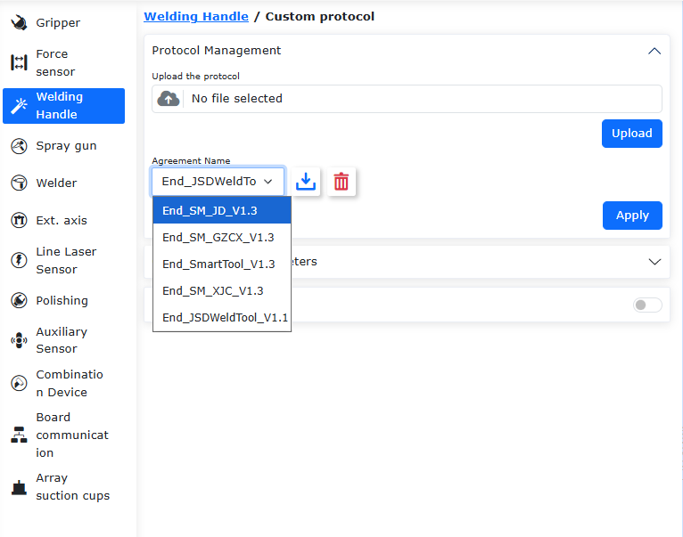

.. centered:: Schemat 8.3‑2-3 Wbudowane domyślnie protokoły dla uchwytu spawalniczego

Automatyczne generowanie protokołu Lua końcówki
+++++++++++++++++++++++++++++++++++++++++++++++

Ta nowa funkcja umożliwia automatyczne wygenerowanie protokołu Lua końcówki dla wbudowanych protokołów związanych z urządzeniem peryferyjnym SmartTool (obecnie obsługiwane są tylko cztery protokoły: End_SmartTool_V1.3.lua, End_SM_JD_V1.3.lua, End_SM_GZCX_V1.3.lua, End_SM_XJC_V1.3.lua). Po skonfigurowaniu na stronie internetowej, protokół Lua końcówki jest automatycznie generowany, przesyłany i stosowany na końcówce, bez konieczności pisania przez użytkownika. Użytkownik konfiguruje przyciski A, B, C, D, E, IO uchwytu spawalniczego SmartTool zgodnie z potrzebami. Po zakończeniu konfiguracji należy wyłączyć zasilanie robota i kliknąć „Zastosuj”. Wtedy strona wyświetli pytanie „Czy wejść w tryb boot i zastosować otwarty protokół?”. Po potwierdzeniu robot przechodzi w stan boot i automatycznie przesyła automatycznie wygenerowany protokół Lua końcówki. Po ponownym uruchomieniu robota można używać SmartTool zgodnie ze skonfigurowanymi przyciskami.

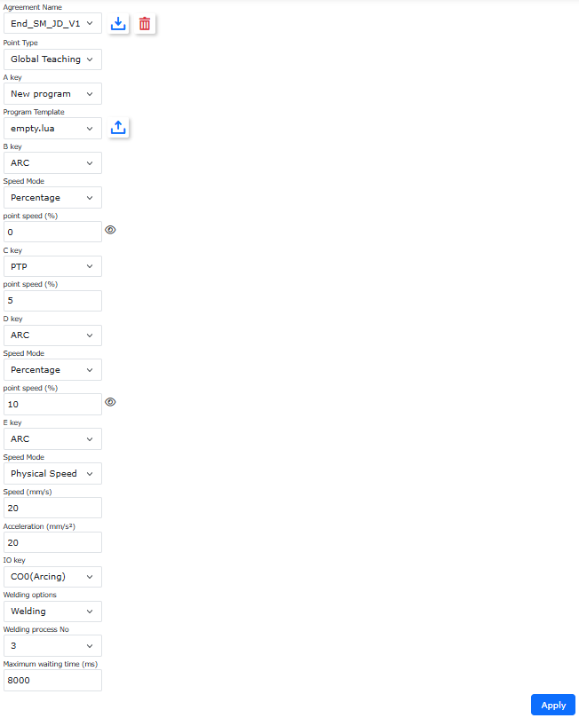

.. centered:: Schemat 8.3‑2-4 Automatyczne generowanie protokołu konfiguracji uchwytu spawalniczego SmartTool

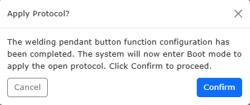

.. centered:: Schemat 8.3‑2-5 Komunikat strony „Czy wejść w tryb boot i zastosować otwarty protokół?”

Import szablonu programu generowanego przez SmartTool
++++++++++++++++++++++++++++++++++++++++++++++++++++++

Jeśli przycisk SmartTool został skonfigurowany z funkcją generowania programu, to na podstawie otwartego protokołu można dostarczyć dwa rodzaje generowanych programów. Domyślnie generowany jest pusty program lua, albo użytkownik może przesłać szablon zaczynający się od `template_` jako szablon dla nowego programu. Gdy podczas tworzenia nowego programu zostanie wybrany program szablonowy, wygenerowany plik lua przez wyzwolenie „Nowy program” na SmartTool będzie zawierał treść przesłanego pliku szablonu, a późniejsze dodane instrukcje będą dodawane po treści szablonu.

.. figure:: robot_peripherals/286.png
   :align: center
   :width: 4in

.. centered:: Schemat 8.3‑2-6 Import szablonu programu generowanego przez SmartTool

Konfiguracja punktów instrukcji ruchu SmartTool
++++++++++++++++++++++++++++++++++++++++++++++++

Podczas konfigurowania trzech instrukcji „PTP”, „LIN”, „ARC” w SmartTool, można wybrać, czy baza danych przechowująca generowane punkty instrukcji to „Globalne punkty nauczania” czy „Lokalne punkty nauczania”. Gdy wybrano „Globalne punkty nauczania”, wygenerowane punkty instrukcji można wyświetlić przez „Program nauczania”, „Punkty nauczania”. Gdy wybrano „Lokalne punkty nauczania”, wygenerowane punkty instrukcji można wyświetlić przez „Program nauczania”, „Programowanie”, „Lokalne punkty nauczania”.

.. figure:: robot_peripherals/287.png
   :align: center
   :width: 4in

.. centered:: Schemat 8.3‑2-7 Konfiguracja „Globalnych punktów nauczania” i „Lokalnych punktów nauczania” dla punktów instrukcji ruchu SmartTool

Tryb zapobiegania przypadkowemu dotknięciu SmartTool
+++++++++++++++++++++++++++++++++++++++++++++++++++++

SmartTool oparty na otwartym protokole zyskał nowy tryb zapobiegania przypadkowemu dotknięciu. Kolejno kliknij „Ustawienia początkowe”, „Urządzenia peryferyjne”, „Uchwyt spawalniczy”, „Niestandardowy protokół”. Po włączeniu protokołu końcówki widać przełącznik „Tryb zapobiegania przypadkowemu dotknięciu”. Gdy ta funkcja jest włączona, funkcje przycisków SmartTool „Cofnij program” i „Wyczyść program” wymagają dwukrotnego naciśnięcia, aby zadziałać.

.. figure:: robot_peripherals/288.png
   :align: center
   :width: 6in

.. centered:: Schemat 8.3‑2-8 Funkcja „Tryb zapobiegania przypadkowemu dotknięciu” w SmartTool

Przykład protokołu Lua urządzenia peryferyjnego końcówki dla uchwytu spawalniczego
++++++++++++++++++++++++++++++++++++++++++++++++++++++++++++++++++++++++++++++++++

Funkcje sześciu przycisków A, B, C, D, E, IO można modyfikować i definiować za pomocą wartości key w linii 31 kodu, gdzie K38=Getbit(R[7],1), K0=Getbit(R[7],2) to „Wyczyść program” i „Cofnij przycisk” i nie można ich modyfikować. Kolejne 5 wartości K można modyfikować zgodnie z definicjami w dokumencie „Protokół wszystkich urządzeń peryferyjnych końcówki”. W tym przykładzie (wbudowany protokół SmartTool) odpowiadające funkcje przycisków to: A: LIN, B: PTP, C: Utwórz program, D: Wznów po przerwaniu spawania, E: Wyjdź po przerwaniu spawania, IO: LIN + spawanie + wahadło.

.. centered:: Przykład protokołu Lua urządzenia peryferyjnego końcówki dla uchwytu spawalniczego (SmartTool)
  
.. code-block:: 
   :linenos:

   function Getbit(X,Bit)
   return ((X&(1<<Bit))>>Bit)
   end

   if(Getbit(GetRobotState(),0)==1)then
   local SetParams={B6=3}-- B6- obsługiwany numer portu DO to DO3
   SetWeldParams(SetParams)
   while(1)
   do
   IwdgTaskHandle()
   MainLoop()
   UpDownLoadHandle()
   SdoRwPara()
   EndErrClear()
   local BFlag=LuaBreak()
   if(BFlag==1)then
   break
   end
   local R={0}
   local T={0x7D,0x01,0x30,0xC0,0x00,0x04,0x00,0x00,0x00,0x00}
   DelayMs(100)
   T[7],T[8],T[9],T[10]=GetIoCmd()
   Dword=GetRobotState()
   T[7]=Getbit(Dword,4)
   T[12],T[11]=WeldToolCrcValue(T)
   T[13]=0x0E
   WeldToolSlaveSetCmd(T)
   DelayMs(3)
   Len=EndRxWeldData(R)
   if((Len==13)and(R[1]==0x7D)and(R[2]==0x01)and(R[3]==0x30))then
   local key={K38=Getbit(R[7],1),K0=Getbit(R[7],2),K3=Getbit(R[7],3),K25=Getbit(R[7],4),K39=Getbit(R[7],5),K27=Getbit(R[7],6),K28=Getbit(R[7],7), K44=Getbit(R[8],0),
   K6=Getbit(R[8],1),K7=Getbit(R[8],2)}--Ustawienia przycisków uchwytu spawalniczego smarttool, przycisk cofania-K38 cofnij program; przycisk czyszczenia-K0 wyczyść program; przycisk A-K3 LIN; przycisk B-K25 PTP; przycisk C-K39 utwórz program; przycisk D-K27 wznowienie po przerwaniu spawania; przycisk E-K28 wyjście po przerwaniu spawania; przycisk IO-K44 LIN+spawanie+wahadło; przycisk ręczny/automatyczny-K6 ręczny/automatyczny; przycisk uruchom/zatrzymaj-K7 uruchom/zatrzymaj
   SetWeldToolKeys(key)
   end
   LuaGc()
   end
   end

Identyfikacja obciążenia czujnika
~~~~~~~~~~~~~~~~~~~~~~~~~~~~~~~~~

W menu „Ustawienia początkowe” -> „Podstawowe” -> „Obciążenie” kliknij „Identyfikacja czujnika”, aby przejść do interfejsu identyfikacji obciążenia czujnika.

Identyfikacja w określonej pozie: Wyczyść dane obciążenia końcówki. Po skonfigurowaniu czujnika siły utwórz układ współrzędnych czujnika. Ustaw pozę końcówki robota na pionową w dół, wykonaj „Korekcję zera”, a następnie zamontuj obciążenie końcowe. Najpierw wybierz odpowiedni układ współrzędnych narzędzia czujnika, dostosuj robota tak, aby czujnik i narzędzie były skierowane pionowo w dół, zapisz dane, oblicz masę. Następnie dostosuj robota do 3 różnych poz, zapisz trzy zestawy danych, oblicz środek ciężkości, a po potwierdzeniu, że jest prawidłowy, kliknij Zastosuj.

**Identyfikacja dynamiczna**: Wyczyść dane obciążenia końcówki. Po skonfigurowaniu czujnika siły utwórz układ współrzędnych czujnika. Ustaw pozę końcówki robota na pionową w dół, wykonaj „Korekcję zera”, a następnie zamontuj obciążenie końcowe. Kliknij „Włącz identyfikację”, przeciągnij robota, aby się poruszał, a następnie kliknij „Wyłącz identyfikację”. Wynik obciążenia zostanie automatycznie zastosowany w robocie.

**Automatyczna kalibracja zera**: Po zapisaniu pozycji początkowej przez czujnik, można automatycznie wyzerować.

.. figure:: robot_peripherals/018.png
   :align: center
   :width: 4in

.. centered:: Schemat 8.3‑3 Identyfikacja obciążenia czujnika

Wspomaganie przeciągania przez czujnik siły
~~~~~~~~~~~~~~~~~~~~~~~~~~~~~~~~~~~~~~~~~~~~

Po skonfigurowaniu czujnika można go użyć do lepszego wspomagania przeciągania robota. Przy pierwszym użyciu można skonfigurować dane zgodnie z obrazkiem po prawej stronie. Po zakończeniu stosowania, bez wchodzenia w tryb przeciągania, wystarczy bezpośrednio przeciągnąć czujnik siły na końcówce, aby kontrolować ruch robota w ustalonej pozie. (Dane na poniższym rysunku są przykładowymi wartościami odniesienia)

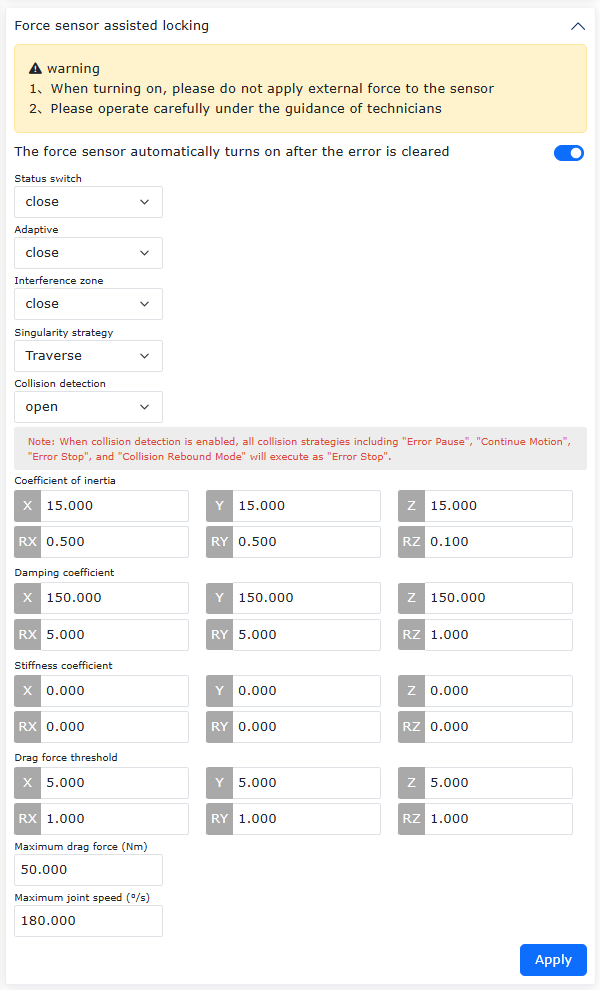

.. centered:: Schemat 8.3‑4 Blokowanie przeciągania za pomocą czujnika siły/momentu

.. note:: 
   Strategia punktów osobliwych to funkcja przechodzenia i omijania punktów osobliwych opracowana dla wspomagania blokowania przez czujnik siły.

   Strategia omijania punktów osobliwych to domyślna opcja funkcji. Po włączeniu wspomagania przeciągania domyślnie włączana jest funkcja omijania. Omijanie punktów osobliwych polega na przykładaniu wirtualnej siły, gdy robot znajduje się w konfiguracji osobliwej, aby oddalić go od tej konfiguracji.

   Konfiguracje osobliwe:

   **Osobliwość łokcia**: Osie obrotu 2, 3, 4 znajdują się w tej samej płaszczyźnie. Wtedy staw łokciowy jest całkowicie wyprostowany lub całkowicie zgięty. Z powodu ograniczeń mechanicznych robota FR, całkowicie zgięta konfiguracja jest nieosiągalna dla robota.

   **Osobliwość nadgarstka**: Osie obrotu 4 i 6 są równoległe. Z powodu ograniczeń mechanicznych robota FR, ta konfiguracja jest nieosiągalna dla robota.

   **Osobliwość ramienia**: Środek nadgarstka znajduje się na płaszczyźnie utworzonej przez osie obrotu 1 i 2.

   Funkcja przechodzenia przez punkt osobliwy: Wybierz „Strategia punktów osobliwych” jako „Przejście” i zastosuj. Gdy robot wykryje, że bieżąca poza i orientacja znajdują się w konfiguracji osobliwej, automatycznie przełączy się w tryb przeciągania z pętlą prądową. Gdy wykryje wyjście z konfiguracji osobliwej, tryb przeciągania przełączy się z powrotem na wspomaganie przez czujnik siły, aby kontynuować ruch.

**Wybór adaptacyjny**: Włącz podczas potrzeb montażu. Po włączeniu przeciąganie staje się cięższe.

**Parametry bezwładności**: Regulują odczucia podczas przeciągania. Należy ostrożnie operować pod kierunkiem technika.

**Parametry tłumienia**:

-  Kierunki translacji: Zalecane ustawienie parametrów w zakresie [100-200];
-  Kierunki rotacji: Zalecane ustawienie parametrów w zakresie [3-10], dla kierunku RZ zakres [0.1-5];
-  Efekt: Podczas przeciągania z użyciem czujnika, zwiększenie tłumienia utrudnia przeciąganie, zmniejszenie tłumienia sprawia, że przeciąganie robota jest zbyt lekkie (zaleca się, aby nie było zbyt małe);
-  Ogólny zakres parametrów tłumienia: Translacja XYZ: [100-1000]; Rotacja RX, RY: [3-50], RZ: [2-10];
-  Maksymalna siła przeciągania wynosi 50, maksymalna prędkość przeciągania wynosi 180.

**Parametry sztywności**: Ustaw wszystkie na 0;

**Próg siły przeciągania**: Translacja XYZ: [5-10]; Rotacja RX, RY, RZ: [0.5-5];

.. important:: 
   Blokowanie osiąga się poprzez zwiększenie progu siły dla kierunków translacji XYZ lub rotacji RX, RY, RZ.

Wykrywanie kolizji za pomocą czujnika siły/momentu
~~~~~~~~~~~~~~~~~~~~~~~~~~~~~~~~~~~~~~~~~~~~~~~~~~~

Opis instrukcji: Instrukcja „FT_Guard” to instrukcja wykrywania kolizji. Wybierz odpowiedni układ współrzędnych czujnika, zaznacz aktywne kierunki wykrywania momentu, ustaw bieżącą wartość, maksymalny próg kolizji i minimalny próg kolizji. Normalny zakres warunku wykrywania kolizji to (wartość bieżąca - próg minimalny, wartość bieżąca + próg maksymalny). Dodaj instrukcje „Włącz” i „Wyłącz” do programu.

.. figure:: robot_peripherals/020.png
   :align: center
   :width: 6in

.. centered:: Schemat 8.3‑5 Edycja instrukcji FT_Guard

Przykład programu:

.. list-table::
   :widths: 50 80 80
   :header-rows: 0
   :align: center

   * - **Nr**
     - **Format instrukcji**
     - **Komentarz**

   * - 1
     - FT_Guard(1,1,1,1,1,0,0,0,5,0,0,0,0,0,10,0,0,0,0,0,5,0,0,0,0,0)
     - # Włączenie wykrywania kolizji siły/momentu

   * - 2
     - PTP(template1,100,-1,0)
     - # Instrukcja ruchu

   * - 3
     - FT_Guard(0,1,1,1,1,0,0,0,5,0,0,0,0,0,10,0,0,0,0,0,5,0,0,0,0,0)
     - # Wyłączenie wykrywania kolizji siły/momentu

Sterowanie ruchem ze stałą siłą za pomocą czujnika siły/momentu
~~~~~~~~~~~~~~~~~~~~~~~~~~~~~~~~~~~~~~~~~~~~~~~~~~~~~~~~~~~~~~~~

Opis instrukcji: Instrukcja „FT_Control” to instrukcja ruchu ze sterowaniem siłą, umożliwiająca robotowi poruszanie się w pobliżu zadanej siły, często używana w scenariuszach szlifowania. Wybierz odpowiedni układ współrzędnych czujnika, zaznacz aktywne kierunki wykrywania momentu, ustaw próg wykrywania oraz współczynniki proporcjonalności PID dla każdego kierunku (zazwyczaj ustawia się p na 0.001). Ustaw maksymalną odległość regulacji (dla X, Y, Z) i maksymalny kąt regulacji (dla RX, RY, RZ). Dodaj instrukcje „Włącz” i „Wyłącz” do programu.

.. figure:: robot_peripherals/021.png
   :align: center
   :width: 6in
  
.. figure:: robot_peripherals/022.png
   :align: center
   :width: 6in

.. centered:: Schemat 8.3‑6 Edycja instrukcji FT_Control

Przykład programu:

.. list-table::
   :widths: 50 80 80
   :header-rows: 0
   :align: center

   * - **Nr**
     - **Format instrukcji**
     - **Komentarz**

   * - 1
     - FT_Control(1,11,1,0,1,0,0,0,10,0,5,0,0,0,0.001,0,0,0,0,0,0,0,0,10,5)
     - # Włączenie sterowania ruchem siły/momentu

   * - 2
     - Lin(template3,100,-1,0,0)
     - # Instrukcja ruchu

   * - 3
     - FT_Control(0,11,1,0,1,0,0,0,10,0,5,0,0,0,0.001,0,0,0,0,0,0,0,10,5)
     - # Wyłączenie sterowania ruchem siły/momentu

Wstawianie spiralne za pomocą czujnika siły/momentu
~~~~~~~~~~~~~~~~~~~~~~~~~~~~~~~~~~~~~~~~~~~~~~~~~~~~

Opis instrukcji: Instrukcja „FT_Spiral” to wstawianie przez eksplorację po spirali, zwykle używane do montażu wałów w otworach. Przed wykonaniem czynności należy przeciągnąć końcówkę robota w przybliżoną pozycję otworu. Ustaw parametry instrukcji zgodnie z bieżącym scenariuszem, dodaj do programu i uruchom. Robot będzie eksplorować ruchem spiralnym.

.. figure:: robot_peripherals/023.png
   :align: center
   :width: 6in

.. centered:: Schemat 8.3‑7 Edycja instrukcji FT_Spiral

Przykład programu:

.. list-table::
   :widths: 50 80 80
   :header-rows: 0
   :align: center

   * - **Nr**
     - **Format instrukcji**
     - **Komentarz**

   * - 1
     - FT_Control(1,10,0,0,1,0,0,0,0,0,5,0,0,0,0.0005,0,0,0,0,0,0,10,0)
     - # Włączenie sterowania ruchem siły/momentu

   * - 2
     - FT_SpiralSearch(0,0.7,0,60000,5)
     - # Wstawianie spiralne

   * - 3
     - FT_Control(0,10,0,0,1,0,0,0,0,0,5,0,0,0,0.0005,0,0,0,0,0,0,10,0)
     - # Wyłączenie sterowania ruchem siły/momentu

Wstawianie obrotowe za pomocą czujnika siły/momentu
~~~~~~~~~~~~~~~~~~~~~~~~~~~~~~~~~~~~~~~~~~~~~~~~~~~~

Opis instrukcji: Instrukcja „FT_Rot” to wstawianie przez eksplorację obrotową, zwykle używane jako kontynuacja wstawiania spiralnego, do montażu wałów z wpustami w otworach. Przed wykonaniem czynności należy przesunąć końcówkę robota do otworu znalezionego przez eksplorację spiralną lub do całkowicie wyrównanego, nauczonego otworu. Ustaw parametry instrukcji zgodnie z bieżącym scenariuszem, dodaj do programu i uruchom. Robot będzie eksplorować powolnym obrotem.

.. figure:: robot_peripherals/024.png
   :align: center
   :width: 6in

.. centered:: Schemat 8.3‑8 Edycja instrukcji FT_Rot

Przykład programu:

.. list-table::
   :widths: 50 80 80
   :header-rows: 0
   :align: center

   * - **Nr**
     - **Format instrukcji**
     - **Komentarz**

   * - 1
     - FT_Control(1,10,0,0,1,0,0,0,0,0,5,0,0,0,0.0005,0,0,0,0,0,0,10,0)
     - # Włączenie sterowania ruchem siły/momentu

   * - 2
     - FT_RotInsertion(0,3,0,5,1,0,1)
     - # Wstawianie obrotowe

   * - 3
     - FT_Control(0,10,0,0,1,0,0,0,0,0,5,0,0,0,0.0005,0,0,0,0,0,0,10,0)
     - # Wyłączenie sterowania ruchem siły/momentu

Wstawianie liniowe za pomocą czujnika siły/momentu
~~~~~~~~~~~~~~~~~~~~~~~~~~~~~~~~~~~~~~~~~~~~~~~~~~~

Opis instrukcji: Instrukcja „FT_Lin” to wstawianie przez eksplorację obrotową, zwykle używane jako kontynuacja wstawiania spiralnego lub obrotowego, do montażu wałów z wpustami w otworach. Przed wykonaniem czynności należy przesunąć końcówkę robota do otworu znalezionego przez eksplorację spiralną, pozycji po zakończeniu wstawiania obrotowego lub do całkowicie wyrównanego, nauczonego otworu. Ustaw parametry instrukcji zgodnie z bieżącym scenariuszem, dodaj do programu i uruchom. Robot będzie poruszać się ruchem liniowym w ustawionym kierunku.

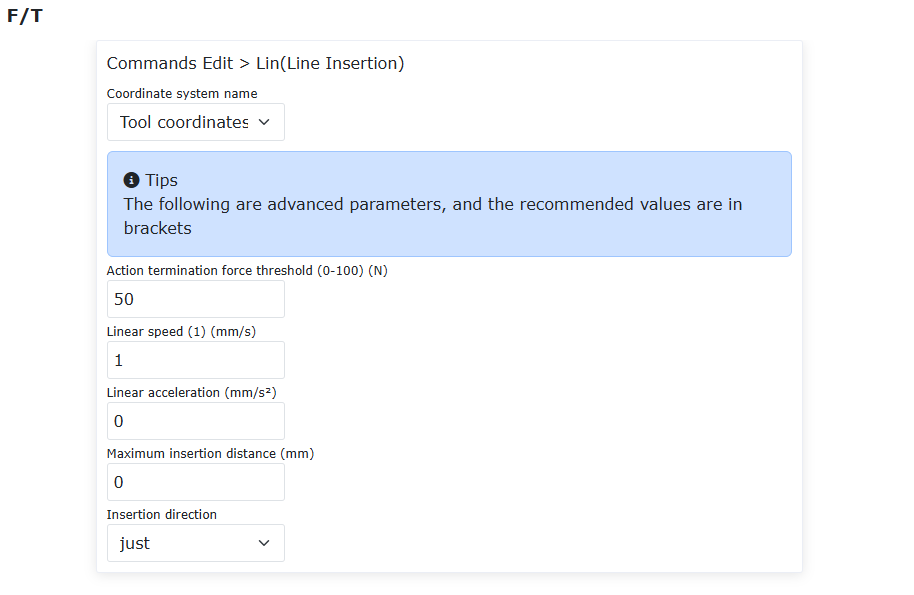

.. centered:: Schemat 8.3‑9 Edycja instrukcji FT_Lin

Przykład programu:

.. list-table::
   :widths: 50 80 80
   :header-rows: 0
   :align: center

   * - **Nr**
     - **Format instrukcji**
     - **Komentarz**

   * - 1
     - FT_Control(1,10,0,0,1,0,0,0,0,0,5,0,0,0,0.0005,0,0,0,0,0,0,10,0)
     - # Włączenie sterowania ruchem siły/momentu

   * - 2
     - FT LinInsertion(0,50,1,0,100,1)
     - # Wstawianie liniowe

   * - 3
     - FT_Control(0,10,0,0,1,0,0,0,0,0,5,0,0,0,0.0005,0,0,0,0,0,0,10,0)
     - # Wyłączenie sterowania ruchem siły/momentu

Lokalizacja powierzchni za pomocą czujnika siły/momentu
~~~~~~~~~~~~~~~~~~~~~~~~~~~~~~~~~~~~~~~~~~~~~~~~~~~~~~~~

Opis instrukcji: Instrukcja „FT_FindSurface” to lokalizacja powierzchni, zwykle używana do znajdowania powierzchni przedmiotów. Zgodnie z bieżącym scenariuszem ustaw odpowiedni układ współrzędnych, kierunek ruchu, oś ruchu, prędkość liniową eksploracji, przyspieszenie liniowe eksploracji, maksymalną odległość eksploracji, próg siły kończącej działanie itp. Dodaj do programu i uruchom. Czynność rozpocznie się, a końcówka robota zacznie powoli przesuwać się w kierunku powierzchni.

.. figure:: robot_peripherals/026.png
   :align: center
   :width: 6in

.. centered:: Schemat 8.3‑10 Edycja instrukcji FT_FindSurface

Przykład programu:

.. list-table::
   :widths: 50 80 80
   :header-rows: 0
   :align: center

   * - **Nr**
     - **Format instrukcji**
     - **Komentarz**

   * - 1
     - PTP(1,30,-1,0)
     - # Pozycja początkowa

   * - 2
     - FT FindSurface(0,1,3,1,0,100,5)
     - # Lokalizacja płaszczyzny

Lokalizacja środka za pomocą czujnika siły/momentu
~~~~~~~~~~~~~~~~~~~~~~~~~~~~~~~~~~~~~~~~~~~~~~~~~~~

Opis instrukcji: Instrukcja „FT_CalCenter” to lokalizacja środka, zwykle używana do znajdowania środkowej płaszczyzny między dwiema powierzchniami. Zgodnie z bieżącym scenariuszem ustaw odpowiedni układ współrzędnych, kierunek ruchu, oś ruchu, prędkość liniową eksploracji, przyspieszenie liniowe eksploracji, maksymalną odległość eksploracji, próg siły kończącej działanie itp. Znajdź odpowiednio powierzchnię A i powierzchnię B, dodaj do programu i uruchom. Czynność rozpocznie się, robot powoli przesunie się w kierunku powierzchni A, po zlokalizowaniu powierzchni A, robot powoli przesunie się w kierunku powierzchni B, a po zlokalizowaniu powierzchni B, pozycja środkowej płaszczyzny zostanie obliczona.

.. figure:: robot_peripherals/027.png
   :align: center
   :width: 6in

.. centered:: Schemat 8.3‑11 Edycja instrukcji FT_CalCenter

Przykład programu:

.. list-table::
   :widths: 20 40 50
   :header-rows: 0
   :align: center

   * - **Nr**
     - **Format instrukcji**
     - **Komentarz**

   * - 1
     - PTP(1,30,-1,0)
     - # Pozycja początkowa

   * - 2
     - FT_CalCenterStart()
     - # Rozpoczęcie lokalizacji powierzchni

   * - 3
     - FT_Control(1,10,0,0,1,0,0,0,0,0,-10,0,0,0,0.00001,0,0,0,0,0,0,100,0)
     - # Włączenie sterowania ruchem siły/momentu

   * - 4
     - FT_FindSurface(1,2,2,10,0,200,5)
     - # Lokalizacja powierzchni A

   * - 5
     - FT_Control(0,10,0,0,1,0,0,0,0,0,-10,0,0,0,0.00001,0,0,0,0,0,0,100,0)
     - # Wyłączenie sterowania ruchem siły/momentu

   * - 6
     - PTP(1,30,-1,0)
     - # Pozycja początkowa

   * - 7
     - FT_Control(1,10,0,0,1,0,0,0,0,0,-10,0,0,0,0.00001,0,0,0,0,0,0,100,0)
     - # Włączenie sterowania ruchem siły/momentu
     
   * - 8
     - FT FindSurface(1,1,2,20,0,200,5)
     - # Lokalizacja powierzchni B

   * - 9
     - FT_Control(0,10,0,0,1,0,0,0,0,0,10,0,0,0,0.00001,0,0,0,0,0,0,100,0)
     - # Wyłączenie sterowania ruchem siły/momentu

   * - 10
     - pos={}
     - # Definicja tablicy pos

   * - 11
     - pos = FT_CalCenterEnd()
     - # Pobranie pozy i orientacji środka lokalizacji w kartezjańskim układzie współrzędnych

   * - 12
     - MoveCart(pos,GetActualTCPNum(),GetActualWObjNum(),30,10,100,-1,0)
     - # Ruch do środkowej pozycji lokalizacji

Niestandardowy otwarty protokół
~~~~~~~~~~~~~~~~~~~~~~~~~~~~~~~

Kliknij kartę „Niestandardowy protokół”, aby przejść do interfejsu. Włącz czujnik siły. W skonfigurowanych urządzeniach wyświetlany jest czujnik siły. Kliknij, aby przejść do interfejsu FT i wyświetlić dane czujnika siły.

.. figure:: robot_peripherals/028.png
   :align: center
   :width: 6in

.. centered:: Schemat 8.3‑12 Włączanie czujnika siły

Uchwyt spawalniczy
---------------------------------------------------

W interfejsie „Ustawienia początkowe” -> „Urządzenia peryferyjne” -> „Uchwyt spawalniczy” można obecnie używać uchwytu spawalniczego za pomocą „Urządzeń dostosowanych” i „Niestandardowego otwartego protokołu Lua na końcówce”.

Urządzenia dostosowane
~~~~~~~~~~~~~~~~~~~~~~

Kroki konfiguracji
++++++++++++++++++

**Krok 1**: Kliknij kartę „Urządzenia dostosowane”, aby przejść do interfejsu urządzeń dostosowanych. Informacje konfiguracyjne dzielą się na producenta, typ, wersję oprogramowania i lokalizację montażu. Użytkownik może skonfigurować odpowiednie informacje zgodnie z konkretnymi potrzebami produkcyjnymi. Jeśli użytkownik chce zmienić konfigurację, może najpierw wybrać odpowiedniego producenta, kliknąć przycisk „Wyczyść”, aby wyczyścić odpowiednie informacje, a następnie ponownie skonfigurować zgodnie z potrzebami;

.. figure:: robot_peripherals/029.png
   :align: center
   :width: 3in

.. centered:: Schemat 8.4‑1 Konfiguracja urządzeń dostosowanych dla uchwytu spawalniczego

.. important:: 
    Przed kliknięciem „Wyczyść konfigurację” odpowiednie urządzenie powinno być w stanie nieaktywnym.

**Krok 2**: Kolejno skonfiguruj przyciski A-E i przycisk IO. Po zakończeniu konfiguracji SmartTool menedżer zadań wewnętrznie utrzymuje funkcję odpowiadającą każdemu przyciskowi. Po wykryciu naciśnięcia przycisku, automatycznie wykonywana jest funkcja odpowiadająca temu przyciskowi.

Funkcje przycisków A-E:

- Instrukcje ruchu: Wybierając instrukcje ruchu PTP, LIN, ARC, należy wprowadzić odpowiednią prędkość punktową. Instrukcje LIN, ARC mogą wybierać między „Procent” a „Prędkość fizyczna”:
- Procent: Wprowadź procent prędkości testowej. Robot porusza się z procentem maksymalnej prędkości. Rzeczywista prędkość ruchu robota jest przeliczana jako: V = maksymalna prędkość robota × globalny procent prędkości × procent prędkości punktowej. Najedź myszą na małe oko po prawej stronie pola wejściowego „Prędkość punktowa”, aby wyświetlić rzeczywistą prędkość fizyczną (jednostka: mm/s) robota w trybie ręcznym i automatycznym przy aktualnie ustawionej prędkości.

.. image:: coding/469.png
   :width: 6in
   :align: center

.. centered:: Schemat 8.4‑2-1 Wprowadzenie procentu wyświetla rzeczywistą wartość prędkości fizycznej
 
- Prędkość fizyczna: Wprowadzona prędkość to rzeczywista prędkość robota, jednostka mm/s; wprowadzone przyspieszenie jest zwykle ustawiane jako 2-krotność prędkości. (Maksymalna prędkość fizyczna instrukcji LIN jest ograniczona przez globalny procent prędkości. Jeśli maksymalna prędkość robota wynosi 1000 mm/s, a prędkość globalna 50%, to maksymalna prędkość fizyczna instrukcji LIN wynosi 1000 × 50% = 500 mm/s).

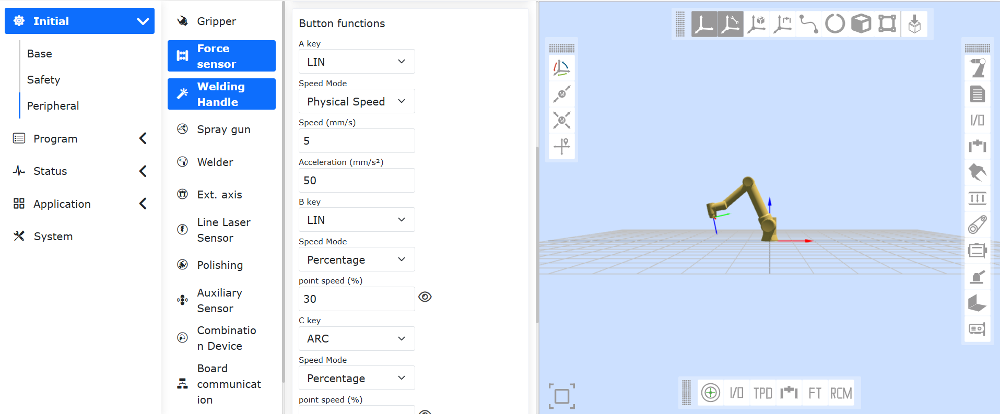

.. centered:: Schemat 8.4‑2-2 Wprowadzenie rzeczywistej prędkości fizycznej

Po pomyślnej konfiguracji, program nauczania otrzymuje nową powiązaną instrukcję ruchu. Podczas konfigurowania instrukcji ruchu ARC, należy najpierw skonfigurować instrukcję PTP/LIN.

- Wyjście DO: Po wybraniu „Wyjście DO” pojawi się lista rozwijana umożliwiająca wybór opcji wyjścia DO0⁓DO7.

.. image:: coding/471.png
   :width: 6in
   :align: center

.. centered:: Schemat 8.4‑2-3 Konfiguracja Smart Tool (przyciski A-E)

Funkcje przycisków IO:

-  **Konfiguracja sygnału IO**: Z listy rozwijanej można wybrać opcje DO0⁓DO7, CO0⁓CO7, End-DO0, End-DO1 i rozszerzone IO (Aux-DO0⁓Aux-DO127);

-  **Instrukcje kombinowane**: Po wybraniu „Sygnał IO”, w określonych warunkach wyświetlane są opcje konfiguracji „Wybór spawarki” i „Prędkość punktowa”, generując różne instrukcje programu.

.. important::
   -  Gdy sygnał IO jest skonfigurowany jako DO0~DO7 lub CO0~CO7 (bez konfiguracji „Rozpoczęcie łuku”), program dodaje SetDO; w tym przypadku ukrywane są „Wybór spawarki” i „Prędkość punktowa”.
   -  Gdy sygnał IO jest skonfigurowany jako End-DO0, End-DO1, program dodaje SetToolDO; w tym przypadku ukrywane są „Wybór spawarki” i „Prędkość punktowa”.
   -  Gdy sygnał IO jest skonfigurowany jako rozszerzone IO (bez konfiguracji „Rozpoczęcie łuku spawarki”), program dodaje SetAuxDO; w tym przypadku ukrywane są „Wybór spawarki” i „Prędkość punktowa”.
   -  Gdy sygnał IO jest skonfigurowany jako CO0~CO7 (z konfiguracją „Rozpoczęcie łuku”), a „Wybór spawarki” to „Brak”, program dodaje SetDO; w tym przypadku ukrywane są „Wybór spawarki” i „Prędkość punktowa”.
   -  Gdy sygnał IO jest skonfigurowany jako rozszerzone IO (z konfiguracją „Rozpoczęcie łuku spawarki”), a „Wybór spawarki” to „Brak”, program dodaje SetAuxDO; w tym przypadku ukrywane są „Wybór spawarki” i „Prędkość punktowa”.
   -  Gdy sygnał IO jest skonfigurowany jako CO0~CO7 (z konfiguracją „Rozpoczęcie łuku”) lub rozszerzone IO (z konfiguracją „Rozpoczęcie łuku spawarki”), a „Wybór spawarki” to „Spawanie”, to po pierwszym naciśnięciu program dodaje ARCStart, po drugim ARCEnd, po trzecim ArcStart, po czwartym ARCStart, naprzemiennie; w tym przypadku ukrywane są „Wybór spawarki” i „Prędkość punktowa”.
   -  Gdy sygnał IO jest skonfigurowany jako CO0~CO7 (z konfiguracją „Rozpoczęcie łuku”) lub rozszerzone IO (z konfiguracją „Rozpoczęcie łuku spawarki”), a „Wybór spawarki” to „LIN+spawanie”, to po pierwszym naciśnięciu program dodaje LIN i ARCStart, po drugim LIN i ARCEnd, po trzecim LIN i ARCStart, po czwartym LIN i ARCEnd, naprzemiennie; w tym przypadku wyświetlane są „Wybór spawarki” i „Prędkość punktowa”.
   -  Gdy sygnał IO jest skonfigurowany jako CO0~CO7 (z konfiguracją „Rozpoczęcie łuku”) lub rozszerzone IO (z konfiguracją „Rozpoczęcie łuku spawarki”), a „Wybór spawarki” to „LIN+spawanie+wahadło”, to po pierwszym naciśnięciu program dodaje LIN, ARCStart i WeaveStart, po drugim LIN, ARCEnd i WeaveEnd, po trzecim LIN, ARCStart i WeaveStart, po czwartym LIN, ARCEnd i WeaveEnd, naprzemiennie; w tym przypadku ukrywane są „Wybór spawarki” i „Prędkość punktowa”.
  
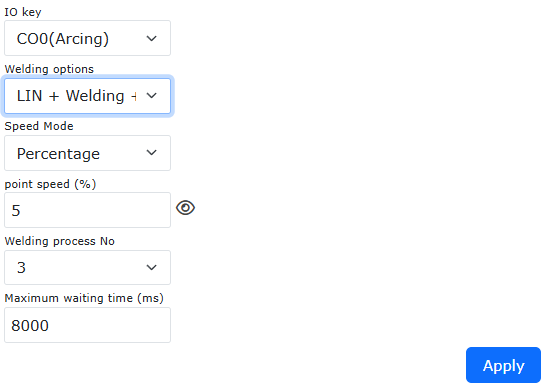

.. centered:: Schemat 8.4‑3 Przyciski IO

Protokół Lua końcówki dla uchwytu spawalniczego
~~~~~~~~~~~~~~~~~~~~~~~~~~~~~~~~~~~~~~~~~~~~~~~

Kliknij „Niestandardowy protokół”, aby przejść do interfejsu funkcji dostosowywania uchwytu spawalniczego do otwartego protokołu Lua końcówki.

Zarządzanie protokołami
+++++++++++++++++++++++

Otwórz WebApp, kolejno kliknij „Ustawienia początkowe”, „Urządzenia peryferyjne”, „Uchwyt spawalniczy”, „Niestandardowy protokół”. Kliknij „Zarządzanie protokołami”, aby przejść do konfiguracji protokołu końcówki. Obecnie wbudowane domyślnie protokoły dla uchwytu spawalniczego pokazano na poniższym rysunku.

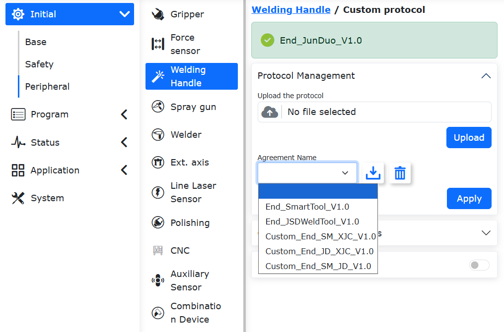

.. centered:: Schemat 8.4‑4 Wbudowane domyślnie protokoły dla uchwytu spawalniczego

Otwórz suwak „Włącz protokół końcówki”, aby dostosować uchwyt spawalniczy. Po włączeniu parametry zostaną zachowane po odcięciu zasilania i ponownym uruchomieniu.

.. figure:: robot_peripherals/033.png
   :align: center
   :width: 4in

.. centered:: Schemat 8.4‑5 Włączanie otwartego protokołu końcówki

Przykład protokołu Lua urządzenia peryferyjnego końcówki dla urządzenia kombinowanego
++++++++++++++++++++++++++++++++++++++++++++++++++++++++++++++++++++++++++++++++++++++

Funkcje pięciu przycisków A, B, C, D, E można modyfikować i definiować za pomocą wartości key w linii 30 kodu, gdzie K38=Getbit(R[7],1), K0=Getbit(R[7],2) to „Wyczyść program” i „Cofnij przycisk” i nie można ich modyfikować. Kolejne 5 wartości K można modyfikować zgodnie z definicjami w dokumencie „Protokół wszystkich urządzeń peryferyjnych końcówki”.

W tym przykładzie (wbudowany protokół SmartTool) odpowiadające funkcje przycisków to: A: MoveL, B: ArcStart, C: ArcEnd, D: rewelding start, E: rewelding quit.

.. code-block:: console

  function Getbit(X,Bit)
  return ((X&(1<<Bit))>>Bit)
  end

  if(Getbit(GetRobotState(),0)==1)then
  local SetParams={A3=2000,B6=3}--Ustawienie parametrów spawania, A3- czas timeoutu rozpoczęcia/zakończenia łuku 2000ms, B6- obsługiwany numer portu DO to 3. Aby skonfigurować parametry spawania, zapoznaj się z „RD36-Niestandardowa tabela parametrów uchwytu spawalniczego-V0.2-20250903”
  SetWeldParams(SetParams)
  while(1)
  do
  IwdgTaskHandle()
  MainLoop()
  UpDownLoadHandle()
  SdoRwPara()
  EndErrClear()
  local BFlag=LuaBreak()
  if(BFlag==1)then
  break
  end
  local R={0}
  local T={0x7D,0x01,0x30,0xC0,0x00,0x04,0x00,0x00,0x00,0x00}
  DelayMs(100)
  T[7],T[8],T[9],T[10]=GetIoCmd()
  T[7]=Getbit(T[7],3)
  T[12],T[11]=WeldToolCrcValue(T)
  T[13]=0x0E
  WeldToolSlaveSetCmd(T)
  DelayMs(3)
  Len=EndRxWeldData(R)
  if((Len==13)and(R[1]==0x7D)and(R[2]==0x01)and(R[3]==0x30))then
  local key={K38=Getbit(R[7],1),K0=Getbit(R[7],2),K3=Getbit(R[7],3),K32=Getbit(R[7],4),K33=Getbit(R[7],5),K27=Getbit(R[7],6),K28=Getbit(R[7],7),
  K6=Getbit(R[8],1),K7=Getbit(R[8],2)}--Ustawienia przycisków uchwytu spawalniczego smarttool, przycisk cofania-K38 cofnij program; przycisk czyszczenia-K0 wyczyść program; przycisk A-K3 linia prosta; przycisk B-K32 rozpoczęcie łuku ArcStart; przycisk C-K33 zakończenie łuku ArcEnd; przycisk D-K27 wznowienie po przerwaniu spawania; przycisk E-K28 wyjście po przerwaniu spawania; przycisk ręczny/automatyczny-K6 ręczny/automatyczny; przycisk uruchom/zatrzymaj-K7 uruchom/zatrzymaj
  SetWeldToolKeys(key)
  end
  LuaGc()
  end
  end

Szablon otwartego protokołu
+++++++++++++++++++++++++++

Na przykładzie dostosowania do spawarki Jiasida:

.. code-block:: console

   function Getbit(X,Bit)                   -- Wyodrębnij odpowiedni bit X
   return ((X&(1<<Bit))>>Bit)
   end
   while(1)
   do
   IwdgTaskHandle()
   MainLoop()
   UpDownLoadHandle()
   SdoRwPara()
   EndErrClear()
   local BFlag=LuaBreak()
   if(BFlag==1)then
   break
   end
   RxData={}
   T0={0x7D,0x08,0x22,0xB3,0x01,0x00}
   T1={0x7D,0x08,0x22,0xB4,0x03,0x00}
   T2={0x7D,0X08,0X22,0XB5,0x1E,0x00}
   DelayMs(5)
   RxLen=WeldToolMasterGetCmd(RxData)                                    --Funkcja WeldToolMasterGetCmd() służy do pobierania instrukcji wysłanych przez uchwyt spawalniczy (gdy uchwyt spawalniczy działa jako master). Podczas używania należy przekazać pustą tabelę (X={})
   if (RxData[1]==0x7D)and(RxData[2]==0x08)and(RxData[3]==0x22) then
   if(RxData[4] == 0xB3)then                                              
      --Na przykładzie kodu funkcji spawarki Jiasida, tutaj 0xB3 (ustawienie parametrów spawania).
   local SetParams={A2=RxData[7],A1=RxData[8],A6=(ByteToDwFloat(RxData[9],RxData[10],RxData[11],RxData[12]))*1000,
   A8=(ByteToDwFloat(RxData[13],RxData[14],RxData[15],RxData[16])),A7=(ByteToDwFloat(RxData[17],RxData[18],RxData[19],RxData[20])),
   A4=(ByteToDwFloat(RxData[21],RxData[22],RxData[23],RxData[24]))*1000,A5=(ByteToDwFloat(RxData[25],RxData[26],RxData[27],RxData[28]))*1000}
   SetWeldParams(SetParams)                                                --Funkcja SetWeldParams() służy do ustawiania parametrów spawania sterownika. Należy odnieść się do niestandardowej tabeli parametrów uchwytu spawalniczego, aby określić, które parametry spawania należy zmodyfikować (podzielone na 3 obszary A, B, C)
   Dword=GetRobotState()                                                   --Funkcja GetRobotState() służy do uzyskiwania powiązanych stanów robota. Obecnie bit0 to stan włączenia robota, bit1 to stan usterki robota, bit2 to stan ruchu robota, bit3 to sygnał instrukcji rozpoczęcia/zakończenia łuku. Można odnieść się do protokołu wszystkich urządzeń peryferyjnych końcówki V2.7
   T0[7]=((Dword)&(1<<1))
   T0[8],T0[9]=WeldToolCrcValue(T0)                                        --WeldToolCrcValue() niestandardowa suma kontrolna CRC protokołu FANUC
   T0[10]=0x0E
   EndTxWeldData(T0)                                                       --Funkcja EndTxWeldData() służy do wysyłania danych pakietowych (tutaj odpowiedź na instrukcję ustawienia parametrów spawania uchwytu spawalniczego)
   DelayMs(5)
   end
   if(RxData[4] == 0xB4)then                                               --0xB4 instrukcja sterowania w czasie rzeczywistym
   local key={K0=Getbit(RxData[7],0),K1=Getbit(RxData[7],1),K2=Getbit(RxData[7],2),K3=Getbit(RxData[7],3),
   K4=Getbit(RxData[7],4),K5=Getbit(RxData[7],5),K6=Getbit(RxData[7],6),K7=Getbit(RxData[7],7),
   K8=Getbit(RxData[8],0),K9=Getbit(RxData[8],1),K10=Getbit(RxData[8],2),K11=Getbit(RxData[8],3),
   K12=Getbit(RxData[8],4),K13=Getbit(RxData[8],5),K14=Getbit(RxData[8],6),K15=Getbit(RxData[9],0),
   K16=Getbit(RxData[9],1),K17=Getbit(RxData[9],2),K18=Getbit(RxData[9],3),K19=Getbit(RxData[9],4),
   K20=Getbit(RxData[9],5),K21=Getbit(RxData[9],6),K22=Getbit(RxData[9],7),K23=Getbit(RxData[10],0),
   K24=Getbit(RxData[10],1)}                                               --Wartości przycisków należy odnieść do Tabeli 26 protokołu wszystkich urządzeń peryferyjnych końcówki V2.7, K0-K31 odpowiadają bitom 0-31 DWordInput10, K32-K63 odpowiadają bitom 0-31 DWordInput9
   SetWeldToolKeys(key)                                                    --Funkcja SetWeldToolKeys() służy do przesyłania stanu przycisków uchwytu spawalniczego. Wartości przycisków w tabeli można dostosować w zależności od rzeczywistej sytuacji uchwytu spawalniczego
   Dword=GetRobotState()
   T1[7]=(Dword)&(0x1)
   T1[8]=(Dword>>1)&(0x1)
   T1[9]=(Dword>>2)&(0x1)
   T1[10],T1[11]=WeldToolCrcValue(T1)
   T1[12]=0X0E
   EndTxWeldData(T1)
   DelayMs(5)
   end
   if(RxData[4] == 0xB5)then                                               
   --Odczyt parametrów spawania (pobranie ze sterownika, wysłanie do uchwytu spawalniczego)
   local wldpams={"A2","A1","A6","A8","A7","A4","A5"}                      
   --Wypełnij zgodnie z rzeczywistymi parametrami spawania wymaganymi przez uchwyt spawalniczy. Tutaj Jiasida potrzebuje tych. Można odnieść się do Tabeli 26 protokołu wszystkich urządzeń peryferyjnych końcówki V2.7
   GetWeldParams(wldpams)                                                  --GetWeldParams() pobiera odpowiednie parametry spawania i zastępuje nimi wartości w tabeli (zakładając, że A2=100, to po wywołaniu funkcji wldpams[1]=100)
   T2[7]=wldpams[1]
   T2[8]=wldpams[2]
   wldpams[3]=wldpams[3]/1000
   wldpams[6]=wldpams[6]/1000
   wldpams[7]=wldpams[7]/1000
   for i=0,4 do
   T2[9+(i*4)+3],T2[9+(i*4)+2],T2[9+(i*4)+1],T2[9+(i*4)+0]=DwFloatToByte(wldpams[3+i])
   end
   for i=0,7 do
   T2[29+i]=0
   end
   T2[37],T2[38]=WeldToolCrcValue(T2)
   T2[39]=0x0E
   EndTxWeldData(T2)
   DelayMs(5)
   end
   end
   LuaGc()
   end

Instrukcje obsługiwane przez otwarty protokół
++++++++++++++++++++++++++++++++++++++++++++++

W otwartym protokole można skonfigurować następujące instrukcje. Jednocześnie 39-63 są zarezerwowane, z możliwością rozszerzenia w przyszłości.

.. centered:: Tabela 8.4-1 Instrukcje obsługiwane przez otwarty protokół

.. list-table:: 
   :widths: 20 80
   :header-rows: 0
   :align: center
   :class: sheet-center

   * - **Bit**
     - **Opis**
   * - 0
     - Wyczyść program
   * - 1
     - Zapisz program
   * - 2
     - Wygeneruj punkt bezpieczny (instrukcja LIN)
   * - 3
     - Wygeneruj punkt ruchu liniowego (instrukcja LIN)
   * - 4
     - Dodaj punkt przejściowy łuku
   * - 5
     - Dodaj punkt końcowy łuku i wygeneruj instrukcję ARC
   * - 6
     - Przełącz tryb, domyślnie tryb ręczny
   * - 7
     - Przełącz stan pracy robota
   * - 8
     - Przełącz stan przeciągania robota
   * - 9
     - Rozpocznij spawanie punktowe
   * - 10
     - Dodaj instrukcję rozpoczęcia wahadła łuku
   * - 11
     - Dodaj instrukcję zakończenia wahadła łuku
   * - 12
     - Ruch jałowy w kierunku +X
   * - 13
     - Ruch jałowy w kierunku -X
   * - 14
     - Ruch jałowy w kierunku +Y
   * - 15
     - Ruch jałowy w kierunku -Y
   * - 16
     - Ruch jałowy w kierunku +Z
   * - 17
     - Ruch jałowy w kierunku -Z
   * - 18
     - Ruch jałowy w kierunku +RX
   * - 19
     - Ruch jałowy w kierunku -RX
   * - 20
     - Ruch jałowy w kierunku +RY
   * - 21
     - Ruch jałowy w kierunku -RY
   * - 22
     - Ruch jałowy w kierunku +RZ
   * - 23
     - Ruch jałowy w kierunku -RZ
   * - 24
     - Wygeneruj punkt początkowy
   * - 25
     - PTP
   * - 26
     - Przeciąganie w ustalonej pozie
   * - 27
     - Wznów po przerwaniu spawania
   * - 28
     - Wyjdź po przerwaniu spawania
   * - 29
     - SetDO
   * - 30
     - offline
   * - 31
     - Aktualizacja parametrów konfiguracji
   * - 32
     - Rozpoczęcie łuku ArcStart
   * - 33
     - Zakończenie łuku ArcEnd
   * - 34
     - Lin+ArcStart+weaveStart
   * - 35
     - Lin+ArcEnd+weaveEnd
   * - 36
     - Lin+ArcStart
   * - 37
     - Lin+ArcEnd
   * - 38
     - Cofnij program
   * - 39
     - Zarezerwowane
   * - ...
     - Zarezerwowane
   * - 63
     - Zarezerwowane

Parametry konfigurowalne otwartego protokołu
+++++++++++++++++++++++++++++++++++++++++++++

W otwartym protokole można skonfigurować następujące parametry.

.. centered:: Tabela 8.4-2 Parametry konfigurowalne otwartego protokołu

.. list-table:: 
   :widths: 10 40 20 30
   :header-rows: 0
   :align: center
   :class: sheet-center

   * - **Indeks**
     - **Zawartość danych**
     - **Typ danych**
     - **Zakres**

   * - 0
     - Prędkość spawania
     - float
     - 0-100%

   * - 1
     - Prędkość jałowa
     - float
     - 0-100%

   * - 2
     - Czas timeoutu rozpoczęcia/zakończenia łuku
     - float
     - 0-65535(ms)

   * - 3
     - Lewy czas postoju wahadła
     - float
     - 0-99999 (ms)

   * - 4
     - Prawy czas postoju wahadła
     - float
     - 0-99999 (ms)

   * - 5
     - Czas spawania punktowego
     - float
     - 0-99999 (ms)

   * - 6
     - Szerokość wahadła
     - float
     - 0-1000 (0.1mm)

   * - 7
     - Częstotliwość wahadła
     - float
     - 0-100(0.1Hz)

   * - 8
     - Typ sterowania spawarką; 0- I/O szafy sterowniczej; 1- Protokół komunikacji cyfrowej (UDP)
     - float
     - 0-255

   * - 9
     - Numer procesu spawania (0-99)
     - float
     - 0-99

   * - 10
     - Typ wahadła
     - float
     - 0-255

   * - 11
     - Port wyjścia analogowego dla sterowania prądem
     - float
     - 0-1

   * - 12
     - Port wyjścia analogowego dla sterowania napięciem
     - float
     - 0-1

   * - 13
     - Numer portu DO do operacji
     - float
     - 0-15

   * - 14
     - Numer parametrów wahadła
     - float
     - 0-255

   * - 15
     - Globalna prędkość w trybie ręcznym
     - float
     - 0-100%

   * - 16
     - Globalna prędkość w trybie automatycznym
     - float
     - 0-100%

   * - 17
     - Prąd spawania
     - float
     - 0-999990 (0.1A)

   * - 18
     - Napięcie spawania
     - float
     - 0-999990 (0.1V)

   * - 19
     - Maksymalna odległość pojedynczego ruchu jałowego
     - float
     - 0-1000 (0.1mm)

   * - 20
     - Rozszerzony port DI gotowości spawarki
     - float
     - 0-127

   * - 21
     - Rozszerzony port DI sukcesu rozpoczęcia łuku
     - float
     - 0-127

   * - 22
     - Rozszerzony port DI wznowienia po przerwaniu spawania
     - float
     - 0-127

   * - 23
     - Rozszerzony port DI wyjścia po przerwaniu spawania
     - float
     - 0-127

   * - 24
     - Rozszerzony port DO rozpoczęcia łuku spawarki
     - float
     - 0-127

   * - 25
     - Rozszerzony port D0 detekcji gazu
     - float
     - 0-127

   * - 26
     - Rozszerzony port D0 podawania drutu w przód
     - float
     - 0-127

   * - 27
     - Rozszerzony port D0 podawania drutu w tył
     - float
     - 0-127

   * - 28
     - Włączenie wznowienia po przerwaniu spawania
     - float
     - 0-1

   * - 29
     - Prędkość do punktu ponownego rozpoczęcia
     - float
     - 0-100%

   * - 30
     - Sposób ruchu
     - float
     - 0-1

   * - 31
     - Włączenie detekcji przerwania łuku spawania
     - float
     - 0-1

   * - 32
     - Czy uwzględniać czas oczekiwania (ms)
     - float
     - 0-1

   * - 33
     - Współczynnik powrotu wahadła
     - float
     - 0-100%

   * - 34
     - Typ oczekiwania na pozycję wahadła
     - float
     - 0-255

   * - 35
     - Czas rozpoczęcia łuku
     - float
     - 0-65535 (ms)

   * - 36
     - Czas zakończenia łuku
     - float
     - 0-65535 (ms)

   * - 37
     - Czas potwierdzenia przerwania łuku spawania
     - float
     - 0-65535 (ms)

   * - 38
     - Odległość nakładania
     - float
     - 0-1000(0.1mm)

   * - 39
     - Prąd rozpoczęcia łuku
     - float
     - 0-999990(0.1A)

   * - 40
     - Napięcie rozpoczęcia łuku
     - float
     - 0-999990(0.1V)

   * - 41
     - Prąd zakończenia łuku
     - float
     - 0-999990(0.1A)

   * - 42
     - Napięcie zakończenia łuku
     - float
     - 0-999990(0.1V)

   * - 43
     - Minimalny prąd spawania
     - float
     - 0-999990(0.1A)

   * - 44
     - Maksymalny prąd spawania
     - float
     - 0-999990(0.1A)

   * - 45
     - Wartość analogowa wyjściowa odpowiadająca minimalnemu prądowi spawania
     - float
     - 0-100(0.1A)

   * - 46
     - Wartość analogowa wyjściowa odpowiadająca maksymalnemu prądowi spawania
     - float
     - 0-100(0.1A)

   * - 47
     - Minimalne napięcie spawania
     - float
     - 0-2000(0.1V)

   * - 48
     - Maksymalne napięcie spawania
     - float
     - 0-2000(0.1V)

   * - 49
     - Wartość analogowa wyjściowa odpowiadająca minimalnemu napięciu spawania
     - float
     - 0-100(0.1V)

   * - 50
     - Wartość analogowa wyjściowa odpowiadająca maksymalnemu napięciu spawania
     - float
     - 0-100(0.1V)

   * - 51
     - Długość lewej cięciwy wahadła trójkątnego pionowego
     - float
     - 0-1000(0.1mm)

   * - 52
     - Długość prawej cięciwy wahadła trójkątnego pionowego
     - float
     - 0-1000(0.1mm)

   * - 53
     - Azymut kierunku wahadła
     - float
     - -1800-1800(0.1°)

   * - 54
     - Kąt przechyłu bocznego kierunku wahadła
     - float
     - -1800-1800(0.1°)

   * - 55
     - Czas oczekiwania w wierzchołku trójkąta wahadła trójkątnego pionowego
     - float
     - 0-99999(ms)

Pistolet natryskowy
-------------------

Kroki konfiguracji urządzenia peryferyjnego pistoletu natryskowego
~~~~~~~~~~~~~~~~~~~~~~~~~~~~~~~~~~~~~~~~~~~~~~~~~~~~~~~~~~~~~~~~~~

**Krok 1**: W menu „Ustawienia początkowe” -> „Urządzenia peryferyjne” kliknij „Pistolet natryskowy”, aby przejść do interfejsu konfiguracji pistoletu natryskowego.

Użytkownik może użyć funkcji jednego przycisku do szybkiej konfiguracji DO wymaganych do natryskiwania (domyślnie DO10 to uruchamianie/zatrzymywanie natryskiwania, DO11 to czyszczenie pistoletu).

Użytkownik może również dostosować konfigurację DO w „Ustawienia początkowe” -> „Podstawowe” -> „Ustawienia I/O” według własnych potrzeb.

.. important:: 
    Przed użyciem funkcji natryskiwania należy najpierw utworzyć odpowiedni układ współrzędnych narzędzia i zastosować go podczas programowania nauczania.

**Krok 2**: Po zakończeniu konfiguracji kliknij cztery przyciski „Rozpocznij natryskiwanie”, „Zatrzymaj natryskiwanie”, „Rozpocznij czyszczenie pistoletu” i „Zatrzymaj czyszczenie pistoletu”, aby przetestować pistolet natryskowy.

.. figure:: robot_peripherals/034.png
   :align: center
   :width: 4in

.. centered:: Schemat 8.5‑1 Konfiguracja pistoletu natryskowego

**Krok 3**: W interfejsie poleceń programowania nauczania wybierz polecenie „Pistolet natryskowy”. Zgodnie z konkretnymi potrzebami programowania nauczania, dodaj i zastosuj cztery instrukcje „Rozpocznij natryskiwanie”, „Zatrzymaj natryskiwanie”, „Rozpocznij czyszczenie pistoletu” i „Zatrzymaj czyszczenie pistoletu” w odpowiednich miejscach.

.. figure:: robot_peripherals/035.png
   :align: center
   :width: 6in

.. centered:: Schemat 8.5‑2 Instrukcje pistoletu natryskowego

Nauczanie programu natryskiwania
~~~~~~~~~~~~~~~~~~~~~~~~~~~~~~~~

.. list-table:: 
   :widths: 15 40 100
   :header-rows: 1

   * - Nr
     - Format instrukcji
     - Komentarz
   * - 1
     - Lin(template1,100,-1,0,0)
     - # Punkt rozpoczęcia natryskiwania
   * - 2
     - SprayStart()
     - # Rozpocznij natryskiwanie
   * - 3
     - Lin(template2,100,-1,0,0)
     - # Ścieżka natryskiwania
   * - 4
     - Lin(template3,100,-1,0,0)
     - # Punkt zatrzymania natryskiwania
   * - 5
     - SprayStop()
     - # Zatrzymaj natryskiwanie
   * - 6
     - Lin(template4,100,-1,0,0)
     - # Punkt czyszczenia pistoletu
   * - 7
     - PowerCleanStart()
     - # Rozpocznij czyszczenie pistoletu
   * - 8
     - WaitTime(5000)
     - # Czas czyszczenia pistoletu ms
   * - 9
     - PowerCleanStop()
     - # Zatrzymaj czyszczenie pistoletu

Spawarka
---------

Robot współpracujący wyposażony w palnik spawalniczy do wykonywania operacji spawania może znacznie zwiększyć wydajność i jakość spawania. Roboty współpracujące FANUC mogą sterować spawaniem na trzy sposoby: „I/O sterownika”, „Protokół komunikacji cyfrowej (UDP)” lub „Protokół komunikacji cyfrowej (Modbus TCP)”:

**I/O sterownika**: Robot steruje wielkością prądu i napięcia spawania poprzez ustawienie wyjścia analogowego szafy sterowniczej (0-10V), steruje rozpoczęciem łuku, podawaniem drutu, podawaniem gazu poprzez wyjścia cyfrowe szafy sterowniczej, a poprzez wejścia cyfrowe szafy sterowniczej odbiera sygnały takie jak gotowość spawarki, sukces rozpoczęcia łuku itp.

**Protokół komunikacji cyfrowej (UDP)**: Robot komunikuje się z PLC przez UDP, a PLC komunikuje się ze spawarką przez magistralę CANOpen lub inny protokół, sterując w ten sposób napięciem spawania, prądem oraz operacjami takimi jak rozpoczęcie łuku, podawanie drutu, podawanie gazu (treść protokołu komunikacji UDP robota znajduje się w Załączniku 1).

**Protokół komunikacji cyfrowej (Modbus TCP)**: Jest to otwarty protokół urządzeń peryferyjnych sterownika. Zazwyczaj jest to wykonywalny program LUA zawierający instrukcje tworzenia komunikacji, cyklicznego zapisywania danych sterujących do urządzenia slave i odczytywania danych stanu w czasie rzeczywistym. Podczas wykonywania tego programu LUA, robot nawiązuje komunikację z urządzeniem i wymienia dane. W programie LUA otwartego protokołu urządzeń peryferyjnych sterownika można dostosować parametry komunikacji, takie jak adres IP, numer portu, okres itp. Użytkownik musi zmodyfikować treść tego protokołu zgodnie z rzeczywistym stanem urządzenia podczas użytkowania. Urządzenia obsługiwane przez otwarty protokół urządzeń peryferyjnych sterownika obejmują głowice szlifierskie, czujniki laserowe, CNC, spawarki itp. Nazwa pliku otwartego protokołu urządzeń peryferyjnych sterownika musi zaczynać się od `CtrlDev_`, np. „CtrlDev_Welding.lua”. Maksymalnie 4 otwarte protokoły mogą działać jednocześnie.

.. figure:: robot_peripherals/036.png
   :align: center
   :width: 4in

.. centered:: Schemat 8.6‑1 Spawarka

Sterowanie spawaniem za pomocą „I/O sterownika” lub „Protokołu komunikacji cyfrowej (UDP)” obejmuje głównie następujące kroki: ① Instalacja palnika spawalniczego i podłączenie sygnałów; ② Konfiguracja parametrów spawarki; ③ Napisanie programu sterowania spawaniem.

Instalacja palnika spawalniczego
~~~~~~~~~~~~~~~~~~~~~~~~~~~~~~~~

Palnik spawalniczy jest montowany na końcówce robota za pomocą płyty przejściowej. Kabel palnika spawalniczego musi być zamocowany na ramieniu robota.

.. figure:: robot_peripherals/037.png
   :align: center
   :width: 3in

.. centered:: Schemat 8.6‑2 Instalacja palnika spawalniczego na końcówce robota

Po zamocowaniu palnika spawalniczego, skalibruj układ współrzędnych narzędzia palnika za pomocą metody 6 punktów i zastosuj go jako bieżący układ współrzędnych narzędzia. Dokładność kalibracji układu współrzędnych narzędzia palnika wpływa na rzeczywistą dokładność spawania.

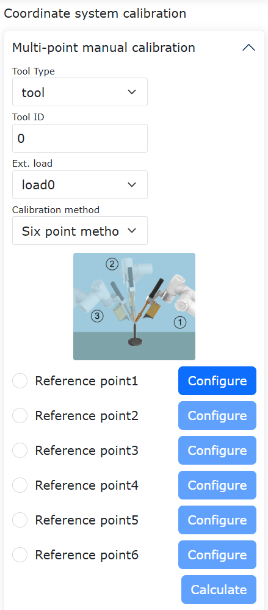

.. centered:: Schemat 8.6-3 Kalibracja i zastosowanie układu współrzędnych narzędzia robota

Konfiguracja parametrów spawarki
~~~~~~~~~~~~~~~~~~~~~~~~~~~~~~~~

Robot współpracujący może sterować procesem spawania za pomocą sygnałów „I/O sterownika” lub „Protokołu komunikacji cyfrowej”. Główne różnice w operacjach konfiguracyjnych między tymi dwoma sposobami to:

① Podczas korzystania z „I/O sterownika” należy ustawić zależność między rzeczywistym sterowaniem prądem i napięciem spawania a wartością wyjściową analogową szafy sterowniczej;

② Podczas korzystania z „Protokołu komunikacji cyfrowej” należy skonfigurować parametry komunikacji.

Konfiguracja sterowania spawaniem „I/O sterownika”
++++++++++++++++++++++++++++++++++++++++++++++++++

W menu „Ustawienia początkowe” -> „Urządzenia peryferyjne” -> „Spawarka” kliknij kartę „I/O sterownika”, aby przejść do interfejsu.

.. figure:: robot_peripherals/039.png
   :align: center
   :width: 4in

.. centered:: Schemat 8.6-4 I/O sterownika

Konfiguracja sygnałów IO spawarki
*********************************

Jak pokazano na poniższym rysunku, wybierz port wejścia DI dla sygnału stanu spawarki i port wyjścia DO dla sygnału sterującego spawarką. Kliknij przycisk „Konfiguruj”. Znaczenie poszczególnych sygnałów jest następujące:

.. figure:: robot_peripherals/040.png
   :align: center
   :width: 4in

.. centered:: Schemat 8.6-5 Ustawianie portów sygnałów spawarki

**Gotowość spawarki**: Gdy spawarka jest gotowa do wykonania operacji spawania, wysyła ten sygnał do robota.

Gdy spawarka nie jest gotowa z powodu usterki lub innych przyczyn, nie wysyła tego sygnału do robota. Wtedy w prawym górnym rogu WebApp pojawi się komunikat „Spawarka niegotowa”. Jeśli Twoja spawarka nie ma sygnału gotowości spawarki, możesz ustawić ten port na „Brak”.

.. centered:: Schemat 8.6-6 Błąd niegotowej spawarki

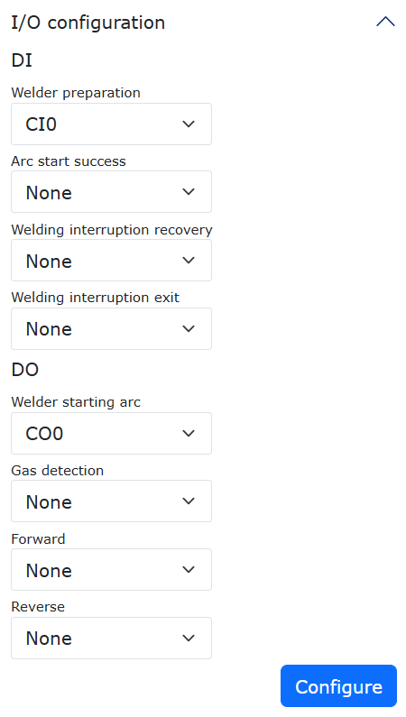

.. centered:: Schemat 8.6-7 Ustawienie gotowości spawarki na „Brak”

**Sukces rozpoczęcia łuku**: Spawarka pomyślnie rozpoczęła łuk. Po wysłaniu przez robota sygnału rozpoczęcia łuku do spawarki, robot oczekuje na sygnał zwrotny sukcesu rozpoczęcia łuku. Jeśli robot nie wykryje sygnału sukcesu rozpoczęcia łuku w ustawionym czasie timeoutu, zgłasza błąd „Przekroczenie czasu rozpoczęcia łuku”.

Podczas korzystania z funkcji spawania robota, jeśli sygnał sukcesu rozpoczęcia łuku nie jest skonfigurowany, spawanie nadal może być wykonywane, ale robot wyświetli ostrzeżenie „DI sukcesu rozpoczęcia łuku nieskonfigurowane”. Jeśli Twoja spawarka ma wyjście sygnału sukcesu rozpoczęcia łuku, zalecamy skonfigurowanie tego sygnału w celu bezpieczniejszego spawania.

.. figure:: robot_peripherals/043.png
   :align: center
   :width: 3in

.. centered:: Schemat 8.6-8 Błąd przekroczenia czasu rozpoczęcia łuku
   
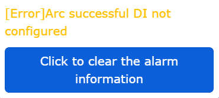

.. centered:: Schemat 8.6-9 Ostrzeżenie o nieskonfigurowanym DI sukcesu rozpoczęcia łuku

**Wznowienie po przerwaniu spawania**: Podczas spawania robotem, w przypadku nieoczekiwanego przerwania łuku lub aktywnego wstrzymania spawania przez operatora, następuje przerwanie spawania. Gdy po przerwaniu spawania sygnał wejściowy z zewnątrz do robota zmieni się z nieaktywnego na aktywny, robot automatycznie wznowi spawanie od miejsca, w którym zostało przerwane.

**Wyjście po przerwaniu spawania**: Podczas spawania robotem, w przypadku nieoczekiwanego przerwania łuku lub aktywnego wstrzymania spawania przez operatora, następuje przerwanie spawania. Gdy po przerwaniu spawania sygnał wejściowy z zewnątrz do robota zmieni się z nieaktywnego na aktywny, robot zakończy spawanie. Po zakończeniu spawania nie można go już wznowić.

**Rozpoczęcie łuku spawarki**: Port wyjścia DO, za pomocą którego robot steruje rozpoczęciem łuku spawarki. Gdy program robota wykonuje instrukcję rozpoczęcia łuku, odpowiedni port wyjścia DO dla rozpoczęcia łuku spawarki automatycznie staje się aktywny.

**Detekcja gazu**: Port wyjścia DO, za pomocą którego robot steruje podawaniem gazu spawarki. Gdy robot wykonuje instrukcję podawania gazu spawania, odpowiedni port wyjścia DO dla podawania gazu automatycznie staje się aktywny.

**Podawanie drutu w przód**: Port wyjścia DO, za pomocą którego robot steruje podawaniem drutu w przód spawarki. Gdy robot wykonuje instrukcję podawania drutu w przód, odpowiedni port wyjścia DO dla podawania drutu w przód automatycznie staje się aktywny.

**Podawanie drutu w tył**: Port wyjścia DO, za pomocą którego robot steruje podawaniem drutu w tył spawarki. Gdy robot wykonuje instrukcję podawania drutu w tył, odpowiedni port wyjścia DO dla podawania drutu w tył automatycznie staje się aktywny.

Konfiguracja parametrów procesu spawania
****************************************

Jak pokazano na poniższym rysunku, znajdź sekcję „Parametry procesu spawania” na stronie konfiguracji spawarki. Robot współpracujący udostępnia 100 zestawów parametrów procesu spawania od 0 do 99. Numer procesu 0 oznacza brak użycia krzywej procesu spawania, a numery 1-99 używają krzywej procesu spawania.
   
.. figure:: robot_peripherals/045.png
   :align: center
   :width: 4in

.. centered:: Schemat 8.6-10 Konfiguracja parametrów procesu spawania 

Podczas korzystania z krzywej procesu spawania, na przykładzie wybrania numeru procesu spawania 1, kolejno wprowadź parametry od prądu rozpoczęcia łuku do czasu zakończenia łuku, jak pokazano na rysunku 8. Kliknij przycisk „Konfiguruj”. Rzeczywisty proces spawania reprezentowany przez te parametry jest następujący:

① Ustaw prąd spawania na 200 A, napięcie na 23 V;

② Wykonaj rozpoczęcie łuku, oczekuj na sukces rozpoczęcia łuku;

③ Po pomyślnym rozpoczęciu łuku, łuk utrzymuje się przez 500 ms (czas rozpoczęcia łuku, robot się nie porusza);

④ Ustaw prąd spawania na 150 A, napięcie spawania na 21 V, a następnie robot zaczyna się poruszać i spawać;

⑤ Po dojechaniu do końca, ustaw prąd spawania na 100 A, napięcie spawania na 19 V (prąd i napięcie zakończenia łuku);

⑥ Po ustawieniu prądu i napięcia zakończenia łuku, łuk pali się przez 500 ms (robot się nie porusza), a następnie gaśnie.

Gdy nie używasz krzywej procesu spawania, czyli wybierasz numer parametrów procesu spawania 0, proces spawania jest następujący:

① Ustaw prąd i napięcie spawania;

② Robot steruje spawarką, aby rozpocząć łuk i czeka na sukces rozpoczęcia łuku;

③ Po pomyślnym rozpoczęciu łuku, robot zaczyna się poruszać i spawać;

④ Robot natychmiast gasi łuk po dojechaniu do końca spawania.
   
.. figure:: robot_peripherals/046.png
   :align: center
   :width: 4in

.. centered:: Schemat 8.6-11 Nieużywanie krzywej procesu spawania 

Ustawienie zależności między prądem/napięciem spawania a wyjściem analogowym
*****************************************************************************

Gdy typ sterowania spawaniem robota współpracującego jest wybrany jako „I/O sterownika”, wartości prądu i napięcia spawania są sterowane przez wielkość wyjścia analogowego szafy sterowniczej (zakres napięcia wyjścia analogowego szafy sterowniczej wynosi 0 ~ 10 V). W tym przypadku należy skonfigurować liniową zależność między wartością wyjścia analogowego szafy sterowniczej a rzeczywistymi wartościami prądu i napięcia spawania.

Jak pokazano na rysunku 12, znajdź „Wykres zależności prądu i napięcia analogowego” na stronie konfiguracji spawarki. „A-V” oznacza zależność między prądem spawania a napięciem wyjściowym analogowym szafy sterowniczej, a „V-V” oznacza zależność między napięciem spawania a napięciem wyjściowym analogowym szafy sterowniczej.

Wybierz „A-V”, wprowadź zakres prądu spawania 0-1000 A, napięcie wyjściowe analogowe 0-10 V, wyjście AO jako „Ctrl-AO0” (port wyjścia analogowego dla sterowania prądem spawania to AO0), kliknij przycisk „Konfiguruj”. Przy tych parametrach, gdy napięcie wyjściowe analogowe szafy sterowniczej wynosi 1,5 V, odpowiada to prądowi spawania 150 A.
   
.. figure:: robot_peripherals/047.png
   :align: center
   :width: 4in

.. centered:: Schemat 8.6-12 Konfiguracja zależności między prądem spawania a wyjściem analogowym

Jak pokazano na rysunku 13, kliknij „V-V”, aby ustawić zależność między napięciem spawania a napięciem wyjściowym analogowym szafy sterowniczej. Wprowadź zakres napięcia spawania 0-60 V, wartość napięcia wyjściowego analogowego 0-10 V, wyjście AO jako „Ctrl-AO1” (port wyjścia analogowego dla sterowania prądem spawania to AO0), kliknij przycisk „Konfiguruj”. W tym przypadku, jeśli wyjście analogowe AO1 szafy sterowniczej wynosi 3,5 V, rzeczywiste sterowane napięcie spawania wynosi 21 V.
   
.. figure:: robot_peripherals/048.png
   :align: center
   :width: 4in

.. centered:: Schemat 8.6-13 Konfiguracja zależności między napięciem spawania a wyjściem analogowym

Debugowanie spawarki
********************

Jak pokazano na rysunku 14, znajdź „Debugowanie spawarki” na stronie konfiguracji spawarki. Wybierz proces numer 1, wprowadź czas timeoutu 1000 ms, kliknij „Podaj gaz”. Robot steruje spawarką, aby rozpocząć podawanie gazu ochronnego. Kliknij przycisk „Zatrzymaj gaz”. Robot steruje spawarką, aby zatrzymać podawanie gazu ochronnego. Sposób obsługi innych przycisków, takich jak „Rozpoczęcie łuku”, „Podawanie drutu w przód”, „Podawanie drutu w tył”, jest taki sam i nie będzie powtarzany.
   
.. figure:: robot_peripherals/049.png
   :align: center
   :width: 4in

.. centered:: Schemat 8.6-14 Debugowanie spawarki

Konfiguracja sterowania spawaniem „Protokół komunikacji cyfrowej (UDP)”
++++++++++++++++++++++++++++++++++++++++++++++++++++++++++++++++++++++++

Sterowanie spawaniem przez robot za pomocą „Protokołu komunikacji cyfrowej” polega w istocie na komunikacji UDP między robotem a PLC. Robot przesyła dane sterujące, takie jak rozpoczęcie łuku, podawanie drutu, podawanie gazu, prąd, napięcie itp., do PLC przez komunikację UDP. PLC z kolei dalej steruje spawarką przez magistralę CANOpen (lub w inny sposób), jednocześnie zbierając rzeczywiste wartości prądu i napięcia spawania oraz sygnał sukcesu rozpoczęcia łuku i przesyłając je z powrotem do robota (treść protokołu komunikacji UDP robota znajduje się w Załączniku 1).

W menu „Ustawienia początkowe” -> „Urządzenia peryferyjne” kliknij „Spawarka”, aby przejść do interfejsu konfiguracji spawarki. Jak pokazano poniżej:
   
.. figure:: robot_peripherals/050.png
   :align: center
   :width: 4in

.. centered:: Schemat 8.6-15 Protokół komunikacji cyfrowej (UDP)

Ponieważ robot komunikuje się z PLC przez UDP, należy skonfigurować parametry komunikacji UDP. Znaczenie poszczególnych parametrów jest następujące:

**Adres IP**: Adres IP strony PLC komunikacji UDP;

**Numer portu**: Numer portu komunikacji UDP strony PLC;

**Okres komunikacji**: Okres komunikacji UDP między robotem a PLC, domyślnie 2 ms;

**Okres wykrywania utraty pakietów, liczba utraconych pakietów**: Gdy liczba utraconych pakietów w okresie wykrywania utraty pakietów przekroczy ustawioną wartość, robot zgłasza błąd „Utrata pakietów komunikacji UDP”, a komunikacja jest automatycznie przerywana.

**Czas potwierdzenia przerwania komunikacji**: Jeśli robot nie otrzyma pełnego pakietu danych zwrotnych PLC w tym czasie, zgłasza błąd „Przerwanie komunikacji UDP” i przerywa komunikację UDP.

**Automatyczne ponowne łączenie po ponownym uruchomieniu z odcięciem zasilania**: Czy robot ma automatycznie ponownie łączyć się po wykryciu ponownego uruchomienia z odcięciem zasilania;

**Automatyczne ponowne łączenie po przerwaniu komunikacji**: Czy robot ma automatycznie ponownie łączyć się po wykryciu przerwania komunikacji UDP;

**Okres ponownego łączenia, liczba ponownych łączeń**: Po włączeniu automatycznego ponownego łączenia po przerwaniu komunikacji UDP i wykryciu przerwania, robot próbuje ponownie połączyć się w ustawionych odstępach czasu. Gdy liczba prób ponownego łączenia osiągnie maksymalną ustawioną wartość, a połączenie nadal nie zostanie nawiązane, robot zgłasza błąd „Przerwanie komunikacji UDP” i przerywa komunikację UDP.

Po skonfigurowaniu powyższych parametrów kliknij przycisk „Konfiguruj”. Po pomyślnej konfiguracji kliknij przycisk „Załaduj”.
   
.. figure:: robot_peripherals/051.png
   :align: center
   :width: 4in

.. centered:: Schemat 8.6-16 Konfiguracja komunikacji UDP

.. note:: 
   .. image:: robot_peripherals/052.png
      :height: 0.75in
      :align: left

   Nazwa: **Przycisk edycji**
   
   Działanie: Otwiera/zamyka konfigurację parametrów komunikacji UDP

.. note:: 
   .. image:: robot_peripherals/053.png
      :height: 0.75in
      :align: left

   Nazwa: **Przycisk ładowania**
   
   Działanie: Ładowanie komunikacji UDP

Konfiguracja sygnałów IO spawarki
*********************************

Wybierz port wejścia DI dla sygnału stanu spawarki i port wyjścia DO dla sygnału sterującego spawarką. Kliknij przycisk „Konfiguruj”. Znaczenie poszczególnych sygnałów jest następujące:
   
.. figure:: robot_peripherals/054.png
   :align: center
   :width: 4in

.. centered:: Schemat 8.6-17 Ustawianie portów sygnałów spawarki

**Gotowość spawarki**: Gdy spawarka jest gotowa do wykonania operacji spawania, wysyła ten sygnał do robota;

Gdy spawarka nie jest gotowa z powodu usterki lub innych przyczyn, nie wysyła tego sygnału do robota. Wtedy w prawym górnym rogu WebApp pojawi się komunikat „Spawarka niegotowa”. Jeśli Twoja spawarka nie ma sygnału gotowości spawarki, możesz ustawić ten port na „-1”.
   

.. centered:: Schemat 8.6-18 Błąd niegotowej spawarki
   
.. figure:: robot_peripherals/055.png
   :align: center
   :width: 4in

.. centered:: Schemat 8.6-19 Ustawienie gotowości spawarki na „-1”

**Sukces rozpoczęcia łuku**: Spawarka pomyślnie rozpoczęła łuk. Po wysłaniu przez robota sygnału rozpoczęcia łuku do spawarki, robot oczekuje na sygnał zwrotny sukcesu rozpoczęcia łuku. Jeśli robot nie wykryje sygnału sukcesu rozpoczęcia łuku w ustawionym czasie timeoutu, zgłasza błąd „Przekroczenie czasu rozpoczęcia łuku”;

Podczas korzystania z funkcji spawania robota, jeśli sygnał sukcesu rozpoczęcia łuku nie jest skonfigurowany, spawanie nadal może być wykonywane, ale robot wyświetli ostrzeżenie „DI sukcesu rozpoczęcia łuku nieskonfigurowane”. Jeśli Twoja spawarka ma wyjście sygnału sukcesu rozpoczęcia łuku, zalecamy skonfigurowanie tego sygnału w celu bezpieczniejszego spawania.
   
.. figure:: robot_peripherals/043.png
   :align: center
   :width: 3in

.. centered:: Schemat 8.6-20 Błąd przekroczenia czasu rozpoczęcia łuku	
      

.. centered:: Schemat 8.6-21 Błąd nieskonfigurowanego DI sukcesu rozpoczęcia łuku

**Wznowienie po przerwaniu spawania**: Podczas spawania robotem, w przypadku nieoczekiwanego przerwania łuku lub aktywnego wstrzymania spawania przez operatora, następuje przerwanie spawania. Gdy po przerwaniu spawania sygnał wejściowy z zewnątrz do robota zmieni się z nieaktywnego na aktywny, robot automatycznie wznowi spawanie od miejsca, w którym zostało przerwane.

**Wyjście po przerwaniu spawania**: Podczas spawania robotem, w przypadku nieoczekiwanego przerwania łuku lub aktywnego wstrzymania spawania przez operatora, następuje przerwanie spawania. Gdy po przerwaniu spawania sygnał wejściowy z zewnątrz do robota zmieni się z nieaktywnego na aktywny, robot zakończy spawanie. Po zakończeniu spawania nie można go już wznowić.

**Rozpoczęcie łuku spawarki**: Port wyjścia DO, za pomocą którego robot steruje rozpoczęciem łuku spawarki. Gdy program robota wykonuje instrukcję rozpoczęcia łuku, odpowiedni port wyjścia DO dla rozpoczęcia łuku spawarki automatycznie staje się aktywny.

**Detekcja gazu**: Port wyjścia DO, za pomocą którego robot steruje podawaniem gazu spawarki. Gdy robot wykonuje instrukcję podawania gazu spawania, odpowiedni port wyjścia DO dla podawania gazu automatycznie staje się aktywny.

**Podawanie drutu w przód**: Port wyjścia DO, za pomocą którego robot steruje podawaniem drutu w przód spawarki. Gdy robot wykonuje instrukcję podawania drutu w przód, odpowiedni port wyjścia DO dla podawania drutu w przód automatycznie staje się aktywny.

**Podawanie drutu w tył**: Port wyjścia DO, za pomocą którego robot steruje podawaniem drutu w tył spawarki. Gdy robot wykonuje instrukcję podawania drutu w tył, odpowiedni port wyjścia DO dla podawania drutu w tył automatycznie staje się aktywny.

Konfiguracja parametrów procesu spawania
****************************************

Jak pokazano na rysunku 22, znajdź sekcję „Parametry procesu spawania” na stronie konfiguracji spawarki. Robot współpracujący udostępnia 100 zestawów parametrów procesu spawania od 0 do 99. Numer procesu 0 oznacza brak użycia krzywej procesu spawania, a numery 1-99 używają krzywej procesu spawania.
      
.. figure:: robot_peripherals/045.png
   :align: center
   :width: 4in

.. centered:: Schemat 8.6-22 Konfiguracja parametrów procesu spawania

Podczas korzystania z krzywej procesu spawania, na przykładzie wybrania numeru procesu spawania 1, kolejno wprowadź parametry od prądu rozpoczęcia łuku do czasu zakończenia łuku, jak pokazano na rysunku 8. Kliknij przycisk „Konfiguruj”. Rzeczywisty proces spawania reprezentowany przez te parametry jest następujący:

① Ustaw prąd spawania na 200 A, napięcie na 23 V;

② Wykonaj rozpoczęcie łuku, oczekuj na sukces rozpoczęcia łuku;

③ Po pomyślnym rozpoczęciu łuku, łuk utrzymuje się przez 500 ms (czas rozpoczęcia łuku, robot się nie porusza);

④ Ustaw prąd spawania na 150 A, napięcie spawania na 21 V, a następnie robot zaczyna się poruszać i spawać;

⑤ Po dojechaniu do końca, ustaw prąd spawania na 100 A, napięcie spawania na 19 V (prąd i napięcie zakończenia łuku);

⑥ Po ustawieniu prądu i napięcia zakończenia łuku, łuk pali się przez 500 ms (robot się nie porusza), a następnie gaśnie.

Gdy nie używasz krzywej procesu spawania, czyli wybierasz numer parametrów procesu spawania 0, proces spawania jest następujący:

① Ustaw prąd i napięcie spawania za pomocą interfejsu ustawiania prądu i napięcia;

② Robot steruje spawarką, aby rozpocząć łuk i czeka na sukces rozpoczęcia łuku;

③ Po pomyślnym rozpoczęciu łuku, robot zaczyna się poruszać i spawać;

④ Robot natychmiast gasi łuk po dojechaniu do końca spawania.
      
.. figure:: robot_peripherals/046.png
   :align: center
   :width: 4in

.. centered:: Schemat 8.6-23 Nieużywanie krzywej procesu spawania

Debugowanie spawarki
********************

Znajdź „Debugowanie spawarki” na stronie konfiguracji spawarki. Wybierz proces numer 1, wprowadź czas timeoutu 1000 ms, kliknij „Podaj gaz”. Robot steruje spawarką, aby rozpocząć podawanie gazu ochronnego. Kliknij przycisk „Zatrzymaj gaz”. Robot steruje spawarką, aby zatrzymać podawanie gazu ochronnego. Sposób obsługi innych przycisków, takich jak „Rozpoczęcie łuku”, „Podawanie drutu w przód”, „Podawanie drutu w tył”, jest taki sam i nie będzie powtarzany.

.. figure:: robot_peripherals/049.png
   :align: center
   :width: 4in

.. centered:: Schemat 8.5-24 Debugowanie spawarki

Pisanie programu spawania
~~~~~~~~~~~~~~~~~~~~~~~~~

Pisanie programu z użyciem krzywej procesu spawania
++++++++++++++++++++++++++++++++++++++++++++++++++++

Gdy zdecydujesz się użyć krzywej procesu spawania (czyli wybierzesz numer parametrów procesu spawania 1 ~ 99), sterowanie napięciem i prądem podczas spawania podlega parametrom krzywej ustawionym dla danego numeru procesu. Nie ma potrzeby dodawania oddzielnych instrukcji ustawiania napięcia i prądu spawania. Jak pokazano na rysunku 25, kliknij „Program nauczania” -> „Programowanie”, utwórz nowy program użytkownika „testWeld.lua”.

.. figure:: robot_peripherals/056.png
   :align: center
   :width: 6in

.. centered:: Schemat 8.6-25 Tworzenie programu „testWeld.lua”

Na otwartej stronie dodawania instrukcji spawania wybierz typ sterowania jako „I/O sterownika” (zgodnie z faktycznie skonfigurowanym sposobem sterowania spawaniem), wybierz numer procesu spawania jako 1 (numer procesu 0 nie używa krzywej procesu spawania, numery 1-99 używają krzywej procesu spawania), ustaw maksymalny czas oczekiwania na 10000 ms, kolejno kliknij przycisk „Rozpoczęcie łuku” i „Zakończenie łuku”, a na koniec kliknij „Zastosuj”.

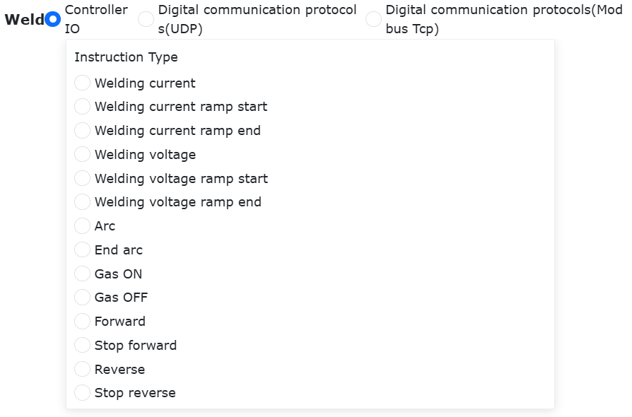

.. centered:: Schemat 8.6-26 Dodawanie instrukcji spawania

W tym momencie do programu „testWeld.lua” zostały dodane instrukcje rozpoczęcia i zakończenia łuku spawania. Ponieważ wybrano użycie krzywej procesu spawania numer 1 dla rozpoczęcia i zakończenia łuku, sterowanie napięciem i prądem podczas spawania podlega parametrom krzywej ustawionym dla numeru procesu 1. Nie ma potrzeby dodawania oddzielnych instrukcji ustawiania napięcia i prądu spawania.

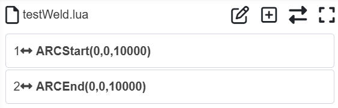

.. centered:: Schemat 8.6-27 Program rozpoczęcia i zakończenia łuku

Dodaj dwie instrukcje ruchu liniowego i dostosuj kolejność instrukcji, tak aby robot najpierw przemieścił się do punktu „P1”, wykonał rozpoczęcie łuku, a następnie przemieścił się do punktu „P2” i wykonał zakończenie łuku, realizując spawanie robota od punktu „P1” do punktu „P2”.

.. figure:: robot_peripherals/059.png
   :align: center
   :width: 6in

.. centered:: Schemat 8.6-28 Spawanie robota od punktu P1 do punktu P2

Pisanie programu bez użycia krzywej procesu spawania
+++++++++++++++++++++++++++++++++++++++++++++++++++++

Gdy zdecydujesz się nie używać krzywej procesu spawania (czyli wybierzesz numer parametrów procesu spawania 0), program spawania musi zawierać instrukcje ustawiania napięcia i prądu spawania, aby kontrolować rzeczywiste parametry spawania. Kliknij „Symulacja nauczania”, „Program nauczania”, utwórz nowy program użytkownika „testWeld.lua”.

.. figure:: robot_peripherals/056.png
   :align: center
   :width: 6in

.. centered:: Schemat 8.6-29 Tworzenie programu „testWeld.lua”

Na otwartej stronie dodawania instrukcji spawania wybierz typ sterowania jako „I/O sterownika” (zgodnie z faktycznie skonfigurowanym sposobem sterowania spawaniem), wybierz numer procesu spawania jako 0 (numer procesu 0 nie używa krzywej procesu spawania, numery 1-99 używają krzywej procesu spawania), ustaw AO sterowania prądem spawania jako „Ctrl-AO0”, prąd spawania na 150 A, kliknij przycisk „Dodaj”; ustaw AO sterowania napięciem spawania jako „Ctrl-AO1”, napięcie spawania na 21 V, kliknij przycisk „Dodaj”; ustaw maksymalny czas oczekiwania na 10000 ms, kolejno kliknij przycisk „Rozpoczęcie łuku” i „Zakończenie łuku”, a na koniec kliknij „Zastosuj”.

.. centered:: Schemat 8.6-30 Dodawanie instrukcji spawania

W tym momencie do programu „testWeld.lua” zostały dodane instrukcje rozpoczęcia i zakończenia łuku spawania. Ponieważ instrukcje rozpoczęcia i zakończenia łuku wybierają numer procesu spawania 0, podczas wykonywania instrukcji ustawiania napięcia i prądu spawania robot automatycznie wyprowadzi odpowiednie wartości analogowe szafy sterowniczej zgodnie z ustawionymi wartościami napięcia i prądu spawania oraz zależnością „napięcie/prąd spawania a wyjście analogowe” ustawioną na stronie konfiguracji spawarki.

.. figure:: robot_peripherals/060.png
   :align: center
   :width: 6in

.. centered:: Schemat 8.6-31 Program ustawiania napięcia spawania, prądu spawania, rozpoczęcia i zakończenia łuku

Dodaj dwie instrukcje ruchu liniowego i dostosuj kolejność instrukcji, tak aby robot najpierw przemieścił się do punktu „P1”, wykonał rozpoczęcie łuku, a następnie przemieścił się do punktu „P2” i wykonał zakończenie łuku, realizując spawanie robota od punktu „P1” do punktu „P2”.

.. figure:: robot_peripherals/061.png
   :align: center
   :width: 6in 

.. centered:: Schemat 8.6-32 Spawanie robota od punktu P1 do punktu P2

Uruchom powyższy program, aby zrealizować spawanie po linii prostej od P1 do P2. Przed uruchomieniem programu sprawdź, czy:

① Palnik spawalniczy jest prawidłowo zamontowany, czy układ współrzędnych narzędzia palnika został skalibrowany i zastosowany jako bieżący układ współrzędnych narzędzia;

② Zasilanie spawarki, obwód gazu, obwód drutu działają prawidłowo;

③ Połączenia przewodów sygnałowych między robotem a spawarką są prawidłowe.

Przerwanie i wznowienie spawania
~~~~~~~~~~~~~~~~~~~~~~~~~~~~~~~~

Spawanie robotem może zostać przerwane w następujących sytuacjach:

① Operator aktywnie wstrzymuje spawanie, aby obserwować rzeczywisty przebieg spawania lub wyczyścić dyszę itp.;

② Nieoczekiwane przerwanie łuku spawania;

③ Kolizja robota powodująca zatrzymanie spawania;

Po przerwaniu spawania podczas pracy robota, operator może przełączyć robota w tryb ręczny, przeciągnąć robota w bezpieczne miejsce i usunąć przyczynę przerwania.

Po rozwiązaniu problemu, robot współpracujący może automatycznie przemieścić się z bieżącej pozycji do miejsca, w którym nastąpiło przerwanie spawania, ponownie rozpocząć łuk i wznowić spawanie. Konkretny proces operacyjny jest następujący:

① Konfiguracja parametrów wznowienia po przerwaniu spawania;

② Wykonanie programu spawania, wstrzymanie spawania podczas procesu, aby spowodować przerwanie spawania;

③ Przełączenie robota w tryb ręczny, rozwiązanie powiązanych problemów, a następnie przełączenie robota z powrotem w tryb automatyczny;

④ Kliknięcie przycisku „Wznów spawanie”, robot automatycznie wznawia spawanie.

Konfiguracja parametrów wznowienia po przerwaniu spawania
+++++++++++++++++++++++++++++++++++++++++++++++++++++++++

W menu „Ustawienia początkowe” -> „Urządzenia peryferyjne” kliknij „Spawarka”, aby przejść do interfejsu konfiguracji spawarki. Znajdź sekcję „Konfiguracja parametrów wykrywania przerwania łuku”, włącz „Aktywacja funkcji”, wprowadź „Czas potwierdzenia” 20 ms, kliknij przycisk „Konfiguruj”. Oznacza to, że gdy czas nieaktywności sygnału sukcesu rozpoczęcia łuku podczas spawania przekroczy 20 ms, robot zgłosi błąd „Przerwanie łuku spawania”.

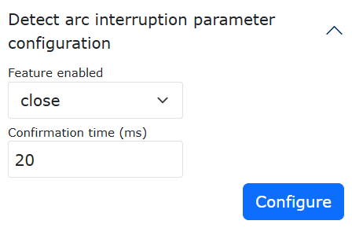

.. centered:: Schemat 8.6-33 Konfiguracja parametrów wykrywania przerwania łuku

Znajdź sekcję „Konfiguracja parametrów wznowienia po przerwaniu spawania”, włącz „Aktywacja funkcji”, wprowadź „Odległość nakładania” 5 mm, „Prędkość” 10%, „Sposób ruchu” jako „PTP”, kliknij przycisk „Konfiguruj”. Wyjaśnienie powyższych trzech parametrów jest następujące:

**Odległość nakładania**: Aby zapewnić ciągłość spoiny po wznowieniu względem spoiny przed przerwaniem, punkt rozpoczęcia łuku po wznowieniu musi mieć pewną odległość nakładania z oryginalną spoiną.

**Prędkość**: Po przerwaniu spawania często konieczne jest przeniesienie robota w bezpieczne miejsce i oczyszczenie spoiny. Po zakończeniu oczyszczania, podczas wykonywania wznowienia spawania, robot przemieści się z bieżącej pozycji do punktu ponownego rozpoczęcia łuku. Ta „prędkość” oznacza prędkość robota podczas przemieszczania się do punktu ponownego rozpoczęcia łuku.

**Sposób ruchu**: Po przerwaniu spawania często konieczne jest przeniesienie robota w bezpieczne miejsce i oczyszczenie spoiny. Po zakończeniu oczyszczania, podczas wykonywania wznowienia spawania, robot przemieści się z bieżącej pozycji do punktu ponownego rozpoczęcia łuku. Ten „sposób ruchu” oznacza sposób ruchu robota podczas przemieszczania się do punktu ponownego rozpoczęcia łuku. Do wyboru są dwa sposoby: „LIN” i „PTP”.

.. figure:: robot_peripherals/063.png
   :align: center
   :width: 4in 

.. centered:: Schemat 8.6-34 Konfiguracja parametrów wznowienia po przerwaniu spawania

Zastosowanie wznowienia po przerwaniu spawania
++++++++++++++++++++++++++++++++++++++++++++++

Na przykładzie programu „testWeld”, przełącz robota w tryb automatyczny, kliknij przycisk startu. Robot rozpoczyna operację spawania. Kliknij przycisk pauzy podczas spawania. Spawanie zostaje przerwane. W prawym górnym rogu WebApp pojawi się okno dialogowe wznowienia po przerwaniu spawania. Kliknij przycisk „Wznów spawanie”. Robot automatycznie przemieści się do punktu ponownego rozpoczęcia łuku i wykona dalszą operację spawania.

.. figure:: robot_peripherals/064.png
   :align: center
   :width: 6in 

.. centered:: Schemat 8.6-35 Wykonanie programu spawania

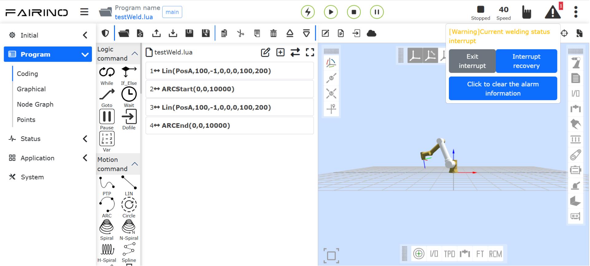

.. centered:: Schemat 8.6-36 Wznawianie spawania

.. warning:: 
   Funkcja wznowienia po przerwaniu spawania robota współpracującego może być używana tylko dla spoin prostych lub łukowych. Podczas korzystania z pętli while(1) do spawania, zagnieżdżanie wielu pętli while nie jest obsługiwane. Nie może zawierać instrukcji warunkowych ze zmiennymi lokalnymi. Jeśli używasz funkcji spawania odcinkowego, pamiętaj o dodaniu interfejsu informacji zwrotnej o spawaniu odcinkowym.

Dostosowanie komunikacji robota z laserową spawarką
~~~~~~~~~~~~~~~~~~~~~~~~~~~~~~~~~~~~~~~~~~~~~~~~~~~

Kontekst
++++++++

Niniejsza instrukcja użytkownika wyjaśnia tylko na przykładzie aktualnie dostosowanej laserowej spawarki REDSABERE 1500. Sterowanie spawaniem przez robota za pomocą „Protokołu komunikacji cyfrowej” polega w istocie na komunikacji UDP między robotem a PLC. Robot przesyła dane sterujące do PLC przez komunikację UDP, a PLC z kolei dalej steruje laserową spawarką przez Modbus RTU, jednocześnie zbierając rzeczywiste parametry procesu spawania laserowego i sygnały sterujące i przesyłając je z powrotem do robota. Treść protokołu komunikacji UDP robota znajduje się w Załączniku 1.

Konfiguracja PLC
++++++++++++++++

.. list-table:: 
   :widths: 25 25 25 25
   :header-rows: 1

   * - Marka
     - Model
     - Oprogramowanie
     - Adres IP
   * - Huichuan
     - EASY521-0808TN
     - AutoShopV4.11.0.1
     - 192.168.58.88
			
Pobranie programu: Otwórz program testowy. Domyślny adres IP PLC to „192.168.1.88”. Zmień adres IP PLC na „192.168.58.88”;

Kliknij przycisk testu test, aby przeprowadzić bieżące połączenie komunikacyjne PLC, jak poniżej;

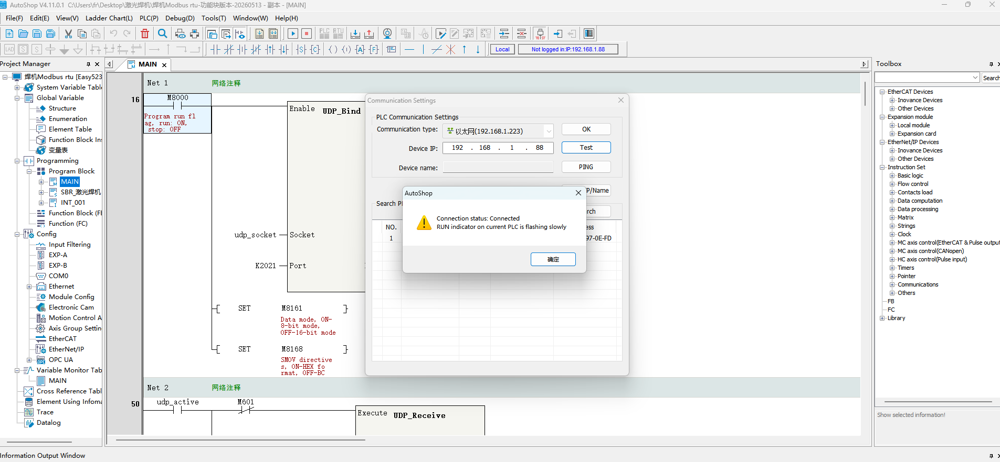

.. centered:: Schemat 8.6-37 Połączenie komunikacyjne PLC

Po pomyślnym połączeniu z bieżącym PLC, zmodyfikuj adres IP, jak poniżej;

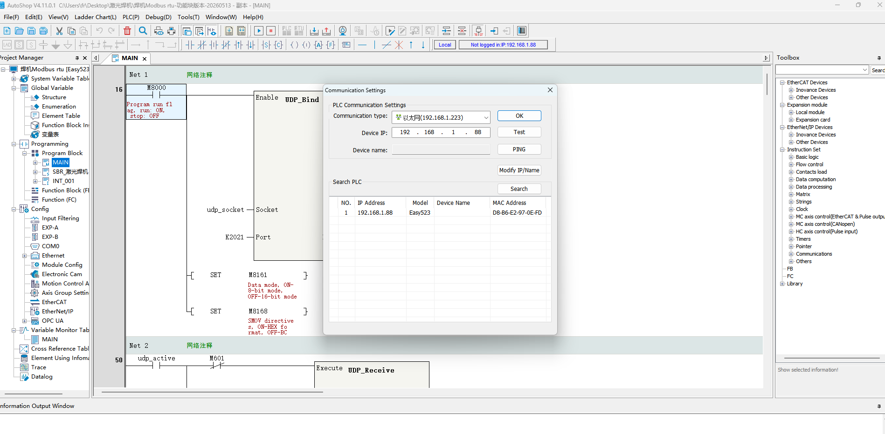

.. centered:: Schemat 8.6-38 Modyfikacja adresu IP PLC

Zmień na 192.168.58.88, zmień domyślną bramę na 192.168.58.1, jak poniżej;

.. figure:: robot_peripherals/295.png
   :align: center
   :width: 6in 

.. centered:: Schemat 8.6-39 Modyfikacja adresu bramy PLC

Zmień lokalny adres IP komputera na podsieć 58, ponownie kliknij przycisk testu test, aby sprawdzić, czy komunikacja jest pomyślna, jak poniżej;

.. figure:: robot_peripherals/296.png
   :align: center
   :width: 6in 

.. centered:: Schemat 8.6-40 Test połączenia PLC

Kliknij przycisk pobierania, aby pobrać program, jak poniżej.

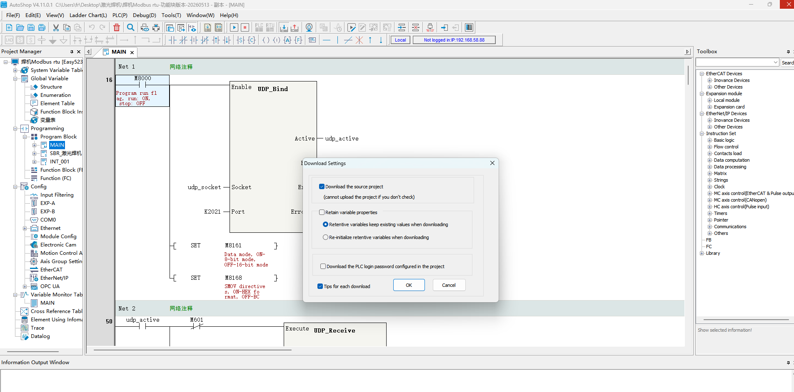

.. centered:: Schemat 8.6-41 Pobieranie programu PLC

Konfiguracja parametrów laserowej spawarki
+++++++++++++++++++++++++++++++++++++++++++

Robot współpracujący steruje procesem spawania za pomocą „Protokołu komunikacji cyfrowej”. Podczas korzystania z „Protokołu komunikacji cyfrowej” należy najpierw skonfigurować parametry komunikacji.

Konfiguracja „Protokołu komunikacji cyfrowej”
*********************************************

Jak pokazano poniżej, otwórz WebApp, kolejno kliknij „Ustawienia początkowe”, „Urządzenia peryferyjne”, „Spawarka”, „Spawarka laserowa”, „Protokół komunikacji cyfrowej (UDP)”, „Konfiguracja komunikacji UDP”.

.. figure:: robot_peripherals/298.png
   :align: center
   :width: 6in 

.. centered:: Schemat 8.6-42 Konfiguracja protokołu komunikacji

Znaczenie poszczególnych parametrów jest następujące:

- **Adres IP**: Adres IP strony PLC komunikacji UDP;
- **Numer portu**: Numer portu komunikacji UDP strony PLC;
- **Okres komunikacji**: Okres komunikacji UDP między robotem a PLC, domyślnie 2 ms;
- **Okres wykrywania utraty pakietów, liczba utraconych pakietów**: Gdy liczba utraconych pakietów w okresie wykrywania utraty pakietów przekroczy ustawioną wartość, robot zgłasza błąd „Utrata pakietów komunikacji UDP”, a komunikacja jest automatycznie przerywana;
- **Czas potwierdzenia przerwania komunikacji**: Jeśli robot nie otrzyma pełnego pakietu danych zwrotnych PLC w tym czasie, zgłasza błąd „Przerwanie komunikacji UDP” i przerywa komunikację UDP;
- **Automatyczne ponowne łączenie po przerwaniu komunikacji**: Czy robot ma automatycznie ponownie łączyć się po wykryciu przerwania komunikacji UDP;
- **Okres ponownego łączenia, liczba ponownych łączeń**: Po włączeniu automatycznego ponownego łączenia po przerwaniu komunikacji UDP i wykryciu przerwania, robot próbuje ponownie połączyć się w ustawionych odstępach czasu. Gdy liczba prób ponownego łączenia osiągnie maksymalną ustawioną wartość, a połączenie nadal nie zostanie nawiązane, robot zgłasza błąd „Przerwanie komunikacji UDP” i przerywa komunikację UDP.

Po skonfigurowaniu powyższych parametrów kolejno kliknij przyciski „Konfiguruj” i „Załaduj”.

Konfiguracja IO funkcji spawania
********************************

Jak poniżej, wybierz port wejścia DI dla sygnału stanu spawarki i port wyjścia DO dla sygnału sterującego spawarką. Obecna laserowa spawarka REDSABERE 1500 obsługuje tylko sygnał startu spawarki (emisja światła). Pozostałe sygnały nie są jeszcze dostosowane. Po wybraniu portu kliknij przycisk „Konfiguruj”, aby go skonfigurować.

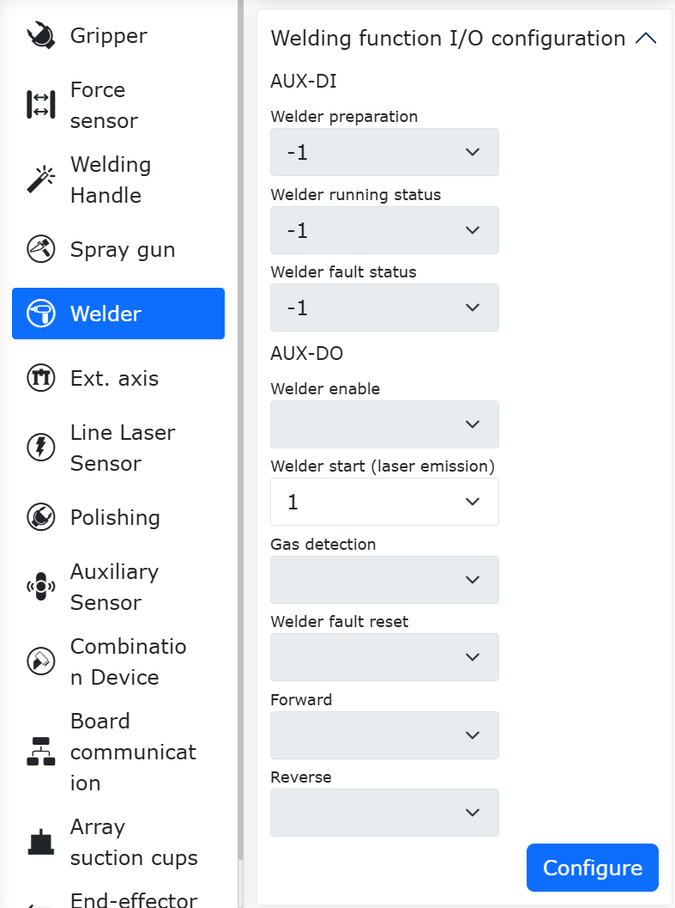

.. centered:: Schemat 8.6-43 Konfiguracja IO funkcji spawarki

Znaczenie sygnałów AUX-DI jest następujące:

- **Gotowość spawarki**: Gdy spawarka jest gotowa do wykonania operacji spawania, wysyła ten sygnał do robota; gdy spawarka nie jest gotowa z powodu usterki lub innych przyczyn, nie wysyła tego sygnału do robota. Wtedy w prawym górnym rogu WebApp pojawi się komunikat „Spawarka niegotowa”. Laserowa spawarka REDSABERE 1500 nie obsługuje tego sygnału, nie jest jeszcze dostosowana.
- **Stan pracy spawarki**: Gdy spawarka przechodzi w stan pracy, wysyła ten sygnał do robota. Laserowa spawarka REDSABERE 1500 nie obsługuje tego sygnału, nie jest jeszcze dostosowana.
- **Stan usterki spawarki**: Gdy spawarka ulegnie awarii, wysyła ten sygnał do robota. Laserowa spawarka REDSABERE 1500 nie obsługuje tego sygnału, nie jest jeszcze dostosowana.

Znaczenie sygnałów AUX-DO jest następujące:

- **Włączenie spawarki**: Port wyjścia DO, za pomocą którego robot steruje włączeniem spawarki. Gdy program robota wykonuje instrukcję włączenia spawarki, odpowiedni port wyjścia DO dla włączenia spawarki automatycznie staje się aktywny. Laserowa spawarka REDSABERE 1500 nie obsługuje tego sygnału, nie jest jeszcze dostosowana.
- **Start spawarki (emisja światła)**: Port wyjścia DO, za pomocą którego robot steruje startem spawarki (emisją światła). Gdy program robota wykonuje instrukcję startu spawarki (emisji światła), odpowiedni port wyjścia DO dla startu spawarki (emisji światła) automatycznie staje się aktywny. Podczas modyfikacji portu wyjścia DO należy jednocześnie zmodyfikować odpowiedni port sterowania w programie PLC. Obecnie PLC domyślnie używa DO1.
- **Detekcja gazu**: Port wyjścia DO, za pomocą którego robot steruje podawaniem gazu spawarki. Gdy robot wykonuje instrukcję podawania gazu spawania, odpowiedni port wyjścia DO dla podawania gazu automatycznie staje się aktywny. Laserowa spawarka REDSABERE 1500 nie obsługuje tego sygnału, nie jest jeszcze dostosowana.
- **Reset usterki spawarki**: Port wyjścia DO, za pomocą którego robot steruje resetem usterki spawarki. Gdy program robota wykonuje instrukcję resetu usterki spawarki, odpowiedni port wyjścia DO dla resetu usterki spawarki automatycznie staje się aktywny. Laserowa spawarka REDSABERE 1500 nie obsługuje tego sygnału, nie jest jeszcze dostosowana.
- **Podawanie drutu w przód**: Port wyjścia DO, za pomocą którego robot steruje podawaniem drutu w przód spawarki. Gdy robot wykonuje instrukcję podawania drutu w przód, odpowiedni port wyjścia DO dla podawania drutu w przód automatycznie staje się aktywny. Laserowa spawarka REDSABERE 1500 nie obsługuje tego sygnału, nie jest jeszcze dostosowana.
- **Podawanie drutu w tył**: Port wyjścia DO, za pomocą którego robot steruje podawaniem drutu w tył spawarki. Gdy robot wykonuje instrukcję podawania drutu w tył, odpowiedni port wyjścia DO dla podawania drutu w tył automatycznie staje się aktywny. Laserowa spawarka REDSABERE 1500 nie obsługuje tego sygnału, nie jest jeszcze dostosowana.

Konfiguracja parametrów procesu spawania
****************************************

Jak poniżej, znajdź sekcję „Parametry procesu spawania” na stronie konfiguracji spawarki. Robot współpracujący udostępnia 10 zestawów parametrów procesu spawania od 0 do 10. Numer procesu 0 oznacza brak użycia krzywej procesu spawania, a numery 1-10 używają krzywej procesu spawania.

.. figure:: robot_peripherals/300.png
   :align: center
   :width: 4in 

.. centered:: Schemat 8.6-44 Konfiguracja parametrów procesu spawania

Podczas korzystania z krzywej procesu spawania, na przykładzie wybrania numeru procesu spawania 1, kolejno wprowadź „Prędkość skanowania (mm/s)”, „Szerokość skanowania (mm)”, „Moc szczytowa (W)”, „Współczynnik wypełnienia (%)”, „Częstotliwość (Hz)”.

Prędkość skanowania laserowej spawarki REDSABERE 1500 jest ograniczona przez szerokość skanowania. Zależność ograniczenia: 10 ≤ prędkość skanowania / (szerokość skanowania × 2) ≤ 500. Wartości poza tym zakresem są automatycznie ograniczane do wartości granicznych. Gdy szerokość skanowania jest ustawiona na 0, nie ma skanowania (tj. punktowe źródło światła). W przeciwnym razie wystąpi błąd, a na stronie internetowej wyświetli się „Nieprawidłowa komunikacja ze spawarką”. Gdy konfiguracja wróci do normy, błąd automatycznie zniknie. Jak poniżej.

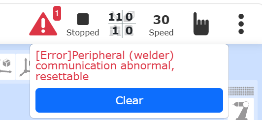

.. centered:: Schemat 8.6-45 Nieprawidłowa komunikacja ze spawarką

Debugowanie spawarki
********************

Jak poniżej, znajdź „Debugowanie spawarki” na stronie konfiguracji spawarki. Obecna laserowa spawarka REDSABERE 1500 obsługuje tylko debugowanie funkcji zatrzymania i emisji światła. Inne przyciski, takie jak „Czas timeoutu”, „Włączenie”, nie są jeszcze dostosowane.

.. figure:: robot_peripherals/302.png
   :align: center
   :width: 4in 

.. centered:: Schemat 8.6-46 Debugowanie spawarki

Pisanie programu spawania
+++++++++++++++++++++++++

Funkcje instrukcji spawania są zintegrowane w programie nauczania. Jak poniżej, kliknij „Program nauczania”, „Programowanie”, utwórz nowy program użytkownika „testWeld.lua”.

.. figure:: robot_peripherals/303.png
   :align: center
   :width: 6in 

.. centered:: Schemat 8.6-47 Tworzenie programu „testWeld.lua”

Jak poniżej, wybierz „Instrukcje spawania”, kliknij „Spawarka laserowa”.

.. figure:: robot_peripherals/304.png
   :align: center
   :width: 6in 

.. centered:: Schemat 8.6-48 Instrukcje związane ze spawarką laserową

Jak poniżej, domyślnym typem sterowania dla instrukcji spawania laserowego jest „Protokół komunikacji cyfrowej (UDP)”. Można kolejno dodawać program lua do ustawiania parametrów procesu spawania, program lua do pobierania parametrów procesu spawania, instrukcje emisji i zatrzymania światła. Po dodaniu instrukcji lua kliknij przycisk „Zastosuj”, aby wygenerować program lua spawania laserowego. Kliknij przycisk „Zapisz”, przełącz w tryb automatyczny i uruchom.

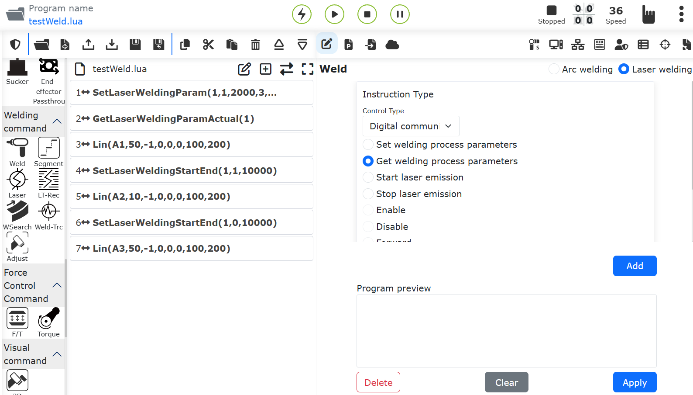

.. centered:: Schemat 8.6-49 Generowanie programu spawania

Załącznik 1: Protokół komunikacji UDP robota
~~~~~~~~~~~~~~~~~~~~~~~~~~~~~~~~~~~~~~~~~~~~

.. warning:: 
  1) Sposób sumy kontrolnej CRC: Używana jest suma kontrolna Modbus 16, ale brany jest tylko niższy bajt do weryfikacji. Obszar danych weryfikacji to D100-D176, D200-D273.

  2) Śledzenie łuku spawalniczego: Rzeczywiste sprzężenie zwrotne prądu polega na przeliczeniu rzeczywistego prądu uzyskanego przez PLC ze spawarki na wartość analogową 0-4095 i przesłaniu jej do kanału analogowego 0 protokołu danych UDP, czyli D168.

  3) Logika przeliczania prędkości: Prędkość wysyłana przez robota (jednostka mm/s) V ÷ skok × 60 = V';

    PLC przelicza prędkość wysłaną przez robota: V' × rozdzielczość enkodera ÷ 60 = V" (jednostka impuls/s).

Sterownik robota -> PLC
+++++++++++++++++++++++

.. list-table:: 
   :widths: 10 10 10 10 20
   :header-rows: 1
   :align: center

   * - Nr
     - Adres rejestru
     - Typ danych
     - Wartość danych
     - Nazwa zmiennej

   * - 1
     - D199
     - INT
     - 0x5A5A
     - Nagłówek ramki

   * - 2
     - D200
     - INT
     - 
     - Słowo sterujące silnika 1#

   * - 3
     - D201
     - DINT
     - 
     - Wejście pozycji docelowej 1#

   * - 4
     - D202
     - DINT
     - 
     - Wejście pozycji docelowej 1#

   * - 5
     - D203
     - INT
     - 
     - Słowo sterujące powrotem do zera 1#

   * - 6
     - D204
     - DINT
     - 
     - Wejście wysokiej prędkości powrotu do zera 1#

   * - 7
     - D205
     - DINT
     - 
     - Wejście wysokiej prędkości powrotu do zera 1#

   * - 8
     - D206
     - DINT
     - 
     - Wejście niskiej prędkości powrotu do zera 1#

   * - 9
     - D207
     - DINT
     - 
     - Wejście niskiej prędkości powrotu do zera 1#

   * - 10
     - D208
     - DINT
     - 
     - Przesunięcie pozycji 1# (zarezerwowane)

   * - 11
     - D209
     - DINT
     - 
     - Przesunięcie pozycji 1# (zarezerwowane)

   * - 12
     - D210
     - DINT
     - 
     - Przesunięcie prędkości 1# (zarezerwowane)

   * - 13
     - D211
     - DINT
     - 
     - Przesunięcie prędkości 1# (zarezerwowane)

   * - 14
     - D212
     - DINT
     - 
     - Przesunięcie momentu 1# (zarezerwowane)

   * - 15
     - D213
     - DINT
     - 
     - Przesunięcie momentu 1# (zarezerwowane)

   * - 16
     - D214
     - INT
     - 
     - Słowo sterujące silnika 2#

   * - 17
     - D215
     - DINT
     - 
     - Wejście pozycji docelowej 2#

   * - 18
     - D216
     - DINT
     - 
     - Wejście pozycji docelowej 2#

   * - 19
     - D217
     - INT
     - 
     - Słowo sterujące powrotem do zera 2#

   * - 20
     - D218
     - DINT
     - 
     - Wejście wysokiej prędkości powrotu do zera 2#

   * - 21
     - D219
     - DINT
     - 
     - Wejście wysokiej prędkości powrotu do zera 2#

   * - 22
     - D220
     - DINT
     - 
     - Wejście niskiej prędkości powrotu do zera 2#

   * - 23
     - D221
     - DINT
     - 
     - Wejście niskiej prędkości powrotu do zera 2#

   * - 24
     - D222
     - DINT
     - 
     - Przesunięcie pozycji 2# (zarezerwowane)

   * - 25
     - D223
     - DINT
     - 
     - Przesunięcie pozycji 2# (zarezerwowane)

   * - 26
     - D224
     - DINT
     - 
     - Przesunięcie prędkości 2# (zarezerwowane)

   * - 27
     - D225
     - DINT
     - 
     - Przesunięcie prędkości 2# (zarezerwowane)

   * - 28
     - D226
     - DINT
     - 
     - Przesunięcie momentu 2# (zarezerwowane)

   * - 29
     - D227
     - DINT
     - 
     - Przesunięcie momentu 2# (zarezerwowane)

   * - 30
     - D228
     - INT
     - 
     - Słowo sterujące silnika 3#
  
   * - 31
     - D229
     - DINT
     - 
     - Wejście pozycji docelowej 3#

   * - 32
     - D230
     - DINT
     - 
     - Wejście pozycji docelowej 3#

   * - 33
     - D231
     - INT
     - 
     - Słowo sterujące powrotem do zera 3#

   * - 34
     - D232
     - DINT
     - 
     - Wejście wysokiej prędkości powrotu do zera 3#

   * - 35
     - D233
     - DINT
     - 
     - Wejście wysokiej prędkości powrotu do zera 3#

   * - 36
     - D234
     - DINT
     - 
     - Wejście niskiej prędkości powrotu do zera 3#

   * - 37
     - D235
     - DINT
     - 
     - Wejście niskiej prędkości powrotu do zera 3#

   * - 38
     - D236
     - DINT
     - 
     - Przesunięcie pozycji 3# (zarezerwowane)

   * - 39
     - D237
     - DINT
     - 
     - Przesunięcie pozycji 3# (zarezerwowane)

   * - 40
     - D238
     - DINT
     - 
     - Przesunięcie prędkości 3# (zarezerwowane)

   * - 41
     - D239
     - DINT
     - 
     - Przesunięcie prędkości 3# (zarezerwowane)

   * - 42
     - D240
     - DINT
     - 
     - Przesunięcie momentu 3# (zarezerwowane)

   * - 43
     - D241
     - DINT
     - 
     - Przesunięcie momentu 3# (zarezerwowane)

   * - 44
     - D242
     - INT
     - 
     - Prędkość skanowania (spawarka laserowa)
  
   * - 45
     - D243
     - DINT
     - 
     - Szerokość skanowania (spawarka laserowa)

   * - 46
     - D244
     - DINT
     - 
     - Moc szczytowa (spawarka laserowa)

   * - 47
     - D245
     - INT
     - 
     - Współczynnik wypełnienia (spawarka laserowa)

   * - 48
     - D246
     - DINT
     - 
     - Częstotliwość skanowania (spawarka laserowa)

   * - 49
     - D247
     - DINT
     - 
     - Częstotliwość skanowania (spawarka laserowa)

   * - 50
     - D248
     - DINT
     - 
     - Zarezerwowane dla spawarki laserowej

   * - 51
     - D249
     - DINT
     - 
     - Zarezerwowane dla spawarki laserowej

   * - 52
     - D250
     - DINT
     - 
     - Zarezerwowane dla spawarki laserowej

   * - 53
     - D251
     - DINT
     - 
     - Zarezerwowane dla spawarki laserowej

   * - 54
     - D252
     - DINT
     - 
     - Zarezerwowane dla spawarki laserowej

   * - 55
     - D253
     - DINT
     - 
     - Zarezerwowane dla spawarki laserowej

   * - 56
     - D254
     - INT
     - 
     - Zarezerwowane dla spawarki laserowej

   * - 57
     - D255
     - INT
     - 
     - Ustawienie trybu spawania (0- stały prąd/napięcie, 1- impulsowy, 2- tryb JOB, 3- tryb zdalnego sterowania, 4- tryb oddzielny, 5- CC/CV, 6- TIG, 7- tryb CMT)

   * - 58
     - D256
     - INT
     - 
     - Zwykłe wyjście DO (0-15)

   * - 59
     - D257
     - INT
     - 
     - Zwykłe wyjście DO (16-31)

   * - 60
     - D258
     - INT
     - 
     - Zwykłe wyjście DO (32-47)

   * - 61
     - D259
     - INT
     - 
     - Zwykłe wyjście DO (48-63)

   * - 62
     - D260
     - INT
     - 
     - Zwykłe wyjście DO (64-79)

   * - 63
     - D261
     - INT
     - 
     - Zwykłe wyjście DO (80-95)

   * - 64
     - D262
     - INT
     - 
     - Szybkie wyjście DO (96-111)

   * - 65
     - D263
     - INT
     - 
     - Szybkie wyjście DO (112-127)

   * - 66
     - D264
     - INT
     - 
     - Wyjście analogowe AO0

   * - 67
     - D265
     - INT
     - 
     - Wyjście analogowe AO1

   * - 68
     - D266
     - INT
     - 
     - Wyjście analogowe AO2

   * - 69
     - D267
     - INT
     - 
     - Wyjście analogowe AO3

   * - 70
     - D268
     - REAL
     - 
     - Wysyłane napięcie spawania

   * - 71
     - D269
     - REAL
     - 
     - Wysyłane napięcie spawania

   * - 72
     - D270
     - REAL
     - 
     - Wysyłany prąd spawania

   * - 73
     - D271
     - REAL
     - 
     - Wysyłany prąd spawania

   * - 74
     - D272
     - REAL
     - 
     - Okres wykrywania utraty pakietów

   * - 75
     - D273
     - INT
     - 
     - Liczba utraconych pakietów

   * - 76
     - D274
     - INT
     - 
     - Licznik ramek (0-255)

   * - 77
     - D275
     - INT
     - 
     - Kod sumy kontrolnej CRC

PLC -> Sterownik robota
+++++++++++++++++++++++

.. list-table:: 
   :widths: 10 10 10 10 20
   :header-rows: 1
   :align: center

   * - Nr
     - Adres rejestru
     - Typ danych
     - Wartość danych
     - Nazwa zmiennej

   * - 1
     - D99
     - INT
     - 0x5A5A
     - Nagłówek ramki

   * - 2
     - D100
     - INT
     - 
     - Słowo stanu silnika 1#

   * - 3
     - D101
     - DINT
     - 
     - Bieżąca pozycja 1#

   * - 4
     - D102
     - DINT
     - 
     - Bieżąca pozycja 1#

   * - 5
     - D103
     - INT
     - 
     - Słowo stanu powrotu do zera 1#

   * - 6
     - D104
     - DINT
     - 
     - Sprzężenie zwrotne wysokiej prędkości powrotu do zera 1#

   * - 7
     - D105
     - DINT
     - 
     - Sprzężenie zwrotne wysokiej prędkości powrotu do zera 1#

   * - 8
     - D106
     - DINT
     - 
     - Sprzężenie zwrotne niskiej prędkości powrotu do zera 1#

   * - 9
     - D107
     - DINT
     - 
     - Sprzężenie zwrotne niskiej prędkości powrotu do zera 1#

   * - 10
     - D108
     - INT
     - 
     - Kod błędu 1#

   * - 11
     - D109
     - DINT
     - 
     - Odchylenie śledzenia 1# (zarezerwowane)

   * - 12
     - D110
     - DINT
     - 
     - Odchylenie śledzenia 1# (zarezerwowane)

   * - 13
     - D111
     - DINT
     - 
     - Sprzężenie zwrotne prędkości 1# (zarezerwowane)

   * - 14
     - D112
     - DINT
     - 
     - Sprzężenie zwrotne prędkości 1# (zarezerwowane)

   * - 15
     - D113
     - DINT
     - 
     - Rzeczywisty moment obrotowy 1# (zarezerwowany) Moment silnika, po uwzględnieniu przełożenia, jest mnożony przez 100 i przekazywany do urządzenia nadrzędnego

   * - 16
     - D114
     - DINT
     - 
     - Rzeczywisty moment obrotowy 1# (zarezerwowany) Moment silnika, po uwzględnieniu przełożenia, jest mnożony przez 100 i przekazywany do urządzenia nadrzędnego

   * - 17
     - D115
     - INT
     - 
     - Słowo stanu silnika 2#

   * - 18
     - D116
     - DINT
     - 
     - Bieżąca pozycja 2#

   * - 19
     - D117
     - DINT
     - 
     - Bieżąca pozycja 2#

   * - 20
     - D118
     - INT
     - 
     - Słowo stanu powrotu do zera 2#

   * - 21
     - D119
     - DINT
     - 
     - Sprzężenie zwrotne wysokiej prędkości powrotu do zera 2#

   * - 22
     - D120
     - DINT
     - 
     - Sprzężenie zwrotne wysokiej prędkości powrotu do zera 2#

   * - 23
     - D121
     - DINT
     - 
     - Sprzężenie zwrotne niskiej prędkości powrotu do zera 2#

   * - 24
     - D122
     - DINT
     - 
     - Sprzężenie zwrotne niskiej prędkości powrotu do zera 2#

   * - 25
     - D123
     - INT
     - 
     - Kod błędu 2#

   * - 26
     - D124
     - DINT
     - 
     - Odchylenie śledzenia 2# (zarezerwowane)

   * - 27
     - D125
     - DINT
     - 
     - Odchylenie śledzenia 2# (zarezerwowane)

   * - 28
     - D126
     - DINT
     - 
     - Sprzężenie zwrotne prędkości 2# (zarezerwowane)

   * - 29
     - D127
     - DINT
     - 
     - Sprzężenie zwrotne prędkości 2# (zarezerwowane)

   * - 30
     - D128
     - DINT
     - 
     - Rzeczywisty moment obrotowy 2# (zarezerwowany)
  
   * - 31
     - D129
     - DINT
     - 
     - Rzeczywisty moment obrotowy 2# (zarezerwowany)

   * - 32
     - D130
     - INT
     - 
     - Słowo stanu silnika 3#

   * - 33
     - D131
     - DINT
     - 
     - Bieżąca pozycja 3#

   * - 34
     - D132
     - DINT
     - 
     - Bieżąca pozycja 3#

   * - 35
     - D133
     - INT
     - 
     - Słowo stanu powrotu do zera 3#

   * - 36
     - D134
     - DINT
     - 
     - Sprzężenie zwrotne wysokiej prędkości powrotu do zera 3#

   * - 37
     - D135
     - DINT
     - 
     - Sprzężenie zwrotne wysokiej prędkości powrotu do zera 3#

   * - 38
     - D136
     - DINT
     - 
     - Sprzężenie zwrotne niskiej prędkości powrotu do zera 3#

   * - 39
     - D137
     - DINT
     - 
     - Sprzężenie zwrotne niskiej prędkości powrotu do zera 3#

   * - 40
     - D138
     - DINT
     - 
     - Kod błędu 3#

   * - 41
     - D139
     - DINT
     - 
     - Odchylenie śledzenia 3# (zarezerwowane)

   * - 42
     - D140
     - DINT
     - 
     - Odchylenie śledzenia 3# (zarezerwowane)

   * - 43
     - D141
     - DINT
     - 
     - Sprzężenie zwrotne prędkości 3# (zarezerwowane)

   * - 44
     - D142
     - DINT
     - 
     - Sprzężenie zwrotne prędkości 3# (zarezerwowane)
  
   * - 45
     - D143
     - DINT
     - 
     - Rzeczywisty moment obrotowy 3# (zarezerwowany)

   * - 46
     - D144
     - DINT
     - 
     - Rzeczywisty moment obrotowy 3# (zarezerwowany)

   * - 47
     - D145
     - INT
     - 
     - Prędkość skanowania (spawarka laserowa)

   * - 48
     - D146
     - DINT
     - 
     - Szerokość skanowania (spawarka laserowa)

   * - 49
     - D147
     - DINT
     - 
     - Moc szczytowa (spawarka laserowa)

   * - 50
     - D148
     - INT
     - 
     - Współczynnik wypełnienia (spawarka laserowa)

   * - 51
     - D149
     - DINT
     - 
     - Częstotliwość skanowania (spawarka laserowa)

   * - 52
     - D150
     - DINT
     - 
     - Częstotliwość skanowania (spawarka laserowa)

   * - 53
     - D151
     - DINT
     - 
     - Zarezerwowane dla spawarki laserowej

   * - 54
     - D152
     - DINT
     - 
     - Zarezerwowane dla spawarki laserowej

   * - 55
     - D153
     - DINT
     - 
     - Zarezerwowane dla spawarki laserowej

   * - 56
     - D154
     - DINT
     - 
     - Zarezerwowane dla spawarki laserowej

   * - 57
     - D155
     - DINT
     - 
     - Zarezerwowane dla spawarki laserowej

   * - 58
     - D156
     - DINT
     - 
     - Zarezerwowane dla spawarki laserowej

   * - 59
     - D157
     - DINT
     - 
     - Zarezerwowane dla spawarki laserowej

   * - 60
     - D158
     - DINT
     - 
     - Zarezerwowane dla spawarki laserowej

   * - 61
     - D159
     - DINT
     - 
     - Zarezerwowane dla spawarki laserowej

   * - 62
     - D160
     - INT
     - 
     - Zwykłe wejście DI (0-15)

   * - 63
     - D161
     - INT
     - 
     - Zwykłe wejście DI (16-31)

   * - 64
     - D162
     - INT
     - 
     - Zwykłe wejście DI (32-47)

   * - 65
     - D163
     - INT
     - 
     - Zwykłe wejście DI (48-63)

   * - 66
     - D164
     - INT
     - 
     - Zwykłe wejście DI (64-79)

   * - 67
     - D165
     - INT
     - 
     - Zwykłe wejście DI (80-95)

   * - 68
     - D166
     - INT
     - 
     - Szybkie wejście DI (96-111)

   * - 69
     - D167
     - INT
     - 
     - Szybkie wejście DI (112-127)

   * - 70
     - D168
     - INT
     - 
     - Wejście analogowe AI0

   * - 71
     - D169
     - INT
     - 
     - Wejście analogowe AI1

   * - 72
     - D170
     - INT
     - 
     - Wejście analogowe AI2

   * - 73
     - D171
     - INT
     - 
     - Wejście analogowe AI3

   * - 74
     - D172
     - REAL
     - 
     - Rzeczywiste sprzężenie zwrotne prądu

   * - 75
     - D173
     - REAL
     - 
     - Rzeczywiste sprzężenie zwrotne prądu

   * - 76
     - D174
     - REAL
     - 
     - Rzeczywiste sprzężenie zwrotne napięcia

   * - 77
     - D175
     - REAL
     - 
     - Rzeczywiste sprzężenie zwrotne napięcia

   * - 78
     - D176
     - INT
     - 
     - Kod błędu 0-brak błędu, 1-utrata pakietów UDP, 2-usterka komunikacji ze spawarką, 3-usterka komunikacji z osią rozszerzoną

   * - 79
     - D177
     - INT
     - 
     - Licznik ramek

   * - 80
     - D178
     - INT
     - 
     - Kod sumy kontrolnej CRC

Protokół komunikacji cyfrowej (Modbus TCP)
~~~~~~~~~~~~~~~~~~~~~~~~~~~~~~~~~~~~~~~~~~~

Kliknij „Ustawienia początkowe” -> „Urządzenia peryferyjne” -> „Spawarka”, aby przejść do interfejsu spawarki. Kliknij kartę „Protokół komunikacji cyfrowej (Modbus TCP)”, aby przejść do interfejsu otwartego protokołu spawarki.

Konfiguracja protokołu
++++++++++++++++++++++

W konfiguracji otwartego protokołu kliknij przycisk „Prześlij”, aby przesłać napisany plik programu LUA otwartego protokołu do sterownika. Wybierz ID otwartego protokołu i nazwę otwartego protokołu, kliknij przycisk „Konfiguruj” (wybrany ID protokołu musi być zgodny z ID napisanym w pliku otwartego protokołu). Przypisz ID do każdego otwartego protokołu.

.. figure:: robot_peripherals/066.png
   :align: center
   :width: 4in

.. centered:: Schemat 8.6-50 Przesyłanie i konfiguracja otwartego protokołu urządzeń peryferyjnych sterownika

W skonfigurowanym protokole kliknij przycisk „Załaduj”. Wskaźnik stanu działania zaświeci się, co oznacza, że otwarty protokół został poprawnie załadowany.

.. figure:: robot_peripherals/067.png
   :align: center
   :width: 4in

.. centered:: Schemat 8.6-51 Ładowanie i wskaźnik działania otwartego protokołu urządzeń peryferyjnych sterownika

Otwarty protokół spawarki
+++++++++++++++++++++++++

Robot komunikuje się ze spawarką przez Modbus TCP za pomocą otwartego protokołu urządzeń peryferyjnych sterownika. Na podstawie definicji rejestrów slave spawarki, napisz odpowiedni plik LUA protokołu komunikacji. W tym pliku skonfiguruj parametry komunikacji, takie jak adres IP spawarki, numer portu, oraz adresy rejestrów dla sterowania rozpoczęciem łuku, podawaniem drutu itp. Prześlij ten protokół do sterownika robota i załaduj go, aby umożliwić komunikację między robotem a spawarką.

Przykład otwartego protokołu spawarki
*************************************

.. code-block:: console
   :linenos:

   local id = 1 --Numer protokołu, musi być zgodny z numerem protokołu skonfigurowanym w WebApp
   local ctrlValues = {0, 0, 0, 0, 0, 0}
   local realTimeState = {0, 0, 0, 0, 0, 0, 0, 0, 0, 0, 0, 0, 0, 0, 0, 0, 0, 0, 0, 0}
   ModbusTCPMasterClose(id)
   ModbusTCPMasterCreate('192.168.58.45', 502, 1, id)
   while(1) do
   setArcStart, setWireForward, setWireReverse, setShieldingGas, setTouchEnable, setRobotError,setRobotEnableState,default1,default2, default3, default4, setCurrent, setVoltage, SetMode = WeldingGetCtrlState()
   local ctrlWord = 0  
   ctrlWord = SetBitWithIndex(ctrlWord, 0, setArcStart)
   ctrlWord = SetBitWithIndex(ctrlWord, 1, setWireForward)
   ctrlWord = SetBitWithIndex(ctrlWord, 2, setWireReverse)
   ctrlWord = SetBitWithIndex(ctrlWord, 3, setShieldingGas)
   ctrlWord = SetBitWithIndex(ctrlWord, 4, setTouchEnable)
   ctrlWord = SetBitWithIndex(ctrlWord, 7, setRobotError)
   ctrlValues[1] = setRobotEnableState
   ctrlValues[2] = ctrlWord
   ctrlValues[3] = 0
   ctrlValues[4] = setCurrent
   ctrlValues[5] = setVoltage
   ctrlValues[6] = 0
   ModbusTCPMasterSetHoldRegs(id, 201, 6, ctrlValues, "U16")
   localtmpCtrlMode={0,0,0,0}
   tmpCtrlMode[1]=SetMode
   ModbusTCPMasterSetHoldRegs(id,0x1000,1,tmpCtrlMode,"U16")
   sleep_ms(10)

   getWeldState, getCurrent, getVoltage,default1, default2, getWelderErrorCode = ModbusTCPMasterGetHoldRegs(id, 211, 6, "U16")
   realTimeState[1] = GetBitWithIndex(getWeldState, 0) + GetBitWithIndex(getWeldState, 1) * 2  --welderType
   realTimeState[2] = GetBitWithIndex(getWeldState, 5) --arc state(WCR)
   realTimeState[3] = GetBitWithIndex(getWeldState, 4) --touch state
   realTimeState[4] = GetBitWithIndex(getWeldState, 7) --welder error state
   realTimeState[12] = getCurrent                      --current
   realTimeState[13] = getVoltage                      --voltage
   realTimeState[14] = getWelderErrorCode              --welder error code
   realTimeState[15] = getWeldState / 255             --heart jump
   WeldingSetRealtimeState(realTimeState)

   local stopFlag = GetOpenLUAStopFlag(id)
   if(stopFlag ~= 0) then 
   ModbusTCPMasterClose(id)
   break
   end

   sleep_ms(10)
   end

Analiza otwartego protokołu spawarki
************************************

Otwarty protokół spawarki składa się głównie z trzech części:

**① Nawiązanie połączenia komunikacyjnego**: Określ numer protokołu id (numer protokołu ustawiony podczas ładowania otwartego protokołu musi być zgodny z numerem w pliku protokołu), adres IP spawarki, numer portu i inne parametry. Za pomocą instrukcji „ModbusTCPMasterCreate()” robot nawiązuje połączenie Modbus TCP ze spawarką.

**② Cykliczny zapis danych sterujących do spawarki**: Podczas wykonywania otwartego protokołu spawarki, najpierw odczytywane są bieżące dane sterujące spawarką z wewnętrznego sterownika robota, a następnie dane są zapisywane do spawarki w celu sterowania jej działaniem. Definicje wartości zwracanych przez instrukcję odczytu danych sterujących spawaniem robota „WeldingGetCtrlState()” w protokole są podane w Tabeli 2-1. Na podstawie definicji rejestrów sterowania rzeczywistej spawarki, dane sterujące mogą zostać rozbite, a następnie zapisane do spawarki przez Modbus TCP.

.. centered:: Tabela 8.19-1 Wartości zwracane przez WeldingGetCtrlState()

.. list-table:: 
   :widths: 10 20 30 40
   :align: center
   :class: sheet-center
   
   * - **Nr**
     - **Typ**
     - **Nazwa**
     - **Opis**

   * - 1
     - uint16_t
     - setArcStart
     - Sygnał rozpoczęcia łuku; 0-zgaś łuk; 1-rozpocznij łuk

   * - 2
     - uint16_t
     - setWireForward
     - Podawanie drutu w przód: 0-zatrzymaj podawanie drutu; 1-podawaj drut w przód

   * - 3
     - uint16_t
     - setWireReverse
     - Podawanie drutu w tył: 0-zatrzymaj podawanie drutu; 1-podawaj drut w tył

   * - 4
     - uint16_t
     - setShieldingGas
     - Sterowanie gazem ochronnym: 0-zatrzymaj gaz; 1-podaj gaz

   * - 5
     - uint16_t
     - setTouchEnable
     - Włączenie lokalizacji drutu spawalniczego: 0-wyłącz; 1-włącz

   * - 6
     - uint16_t
     - setRobotError
     - Usterka robota: 0-brak usterki; 1-usterka

   * - 7
     - uint16_t
     - setRobotEnableState
     - Stan włączenia robota: 0-niewłączony; 1-włączony

   * - 8
     - uint16_t
     - default1
     - Zarezerwowane

   * - 9
     - uint16_t
     - default2
     - Zarezerwowane

   * - 10
     - uint16_t
     - default3
     - Zarezerwowane

   * - 11
     - uint16_t
     - default4
     - Zarezerwowane

   * - 12
     - uint16_t
     - setCurrent
     - Ustawienie prądu spawania (0.1 A)

   * - 13
     - uint16_t
     - setVoltage
     - Ustawienie napięcia spawania (0.01 V)

   * - 14
     - uint16_t
     - SetMode
     - Ustawienie trybu spawania: 0-stały prąd/napięcie, 1-impulsowy, 2-tryb JOB, 3-tryb zdalnego sterowania, 4-tryb oddzielny, 5-CC/CV, 6-TIG, 7-tryb CMT

   * - 15
     - uint16_t
     - default6
     - Zarezerwowane

   * - 16
     - uint16_t
     - default7
     - Zarezerwowane

   * - 17
     - uint16_t
     - default8
     - Zarezerwowane

   * - 18
     - uint16_t
     - default9
     - Zarezerwowane

   * - 19
     - uint16_t
     - default10
     - Zarezerwowane

   * - 20
     - uint16_t
     - default11
     - Zarezerwowane

**③ Cykliczny odczyt danych stanu ze spawarki**: Otwarty protokół spawarki najpierw odczytuje dane stanu w czasie rzeczywistym ze spawarki przez Modbus TCP, a następnie zapisuje odpowiednie dane do sterownika robota, umożliwiając robotowi monitorowanie rzeczywistego stanu działania spawarki. Parametrem interfejsu ustawiania stanu spawarki w robocie „WeldingSetRealtimeState()” w protokole jest tablica zawierająca wszystkie stany spawarki (uwaga: w otwartym protokole LUA, indeksowanie tablicy zaczyna się od 1), jak w Tabeli 2-2. Na podstawie definicji rejestrów stanu rzeczywistej spawarki, dane stanu spawarki są odczytywane przez Modbus TCP, a następnie łączone w tablicę stanu spawarki i zapisywane do sterownika robota.

.. centered:: Tabela 8.19-2 Szczegółowe parametry WeldingSetRealtimeState()

.. list-table:: 
   :widths: 10 20 30 40
   :align: center
   :class: sheet-center
   
   * - **Typ**
     - **Nazwa**
     - **Indeks tablicy**
     - **Opis**

   * - uint16_t[20]
     - realTimeState
     - 1
     - Model spawarki

   * - uint16_t[20]
     - realTimeState
     - 2
     - Stan łuku: 0-nie rozpoczęto łuku; 1-rozpoczęto łuk

   * - uint16_t[20]
     - realTimeState
     - 3
     - Stan kontaktu drutu spawalniczego: 0-brak kontaktu; 1-jest kontakt

   * - uint16_t[20]
     - realTimeState
     - 4
     - Stan usterki spawarki: 0-brak usterki; 1-usterka spawarki

   * - uint16_t[20]
     - realTimeState
     - 5
     - Zarezerwowane

   * - uint16_t[20]
     - realTimeState
     - 6
     - Zarezerwowane

   * - uint16_t[20]
     - realTimeState
     - 7
     - Zarezerwowane

   * - uint16_t[20]
     - realTimeState
     - 8
     - Zarezerwowane

   * - uint16_t[20]
     - realTimeState
     - 9
     - Zarezerwowane

   * - uint16_t[20]
     - realTimeState
     - 10
     - Zarezerwowane

   * - uint16_t[20]
     - realTimeState
     - 11
     - Zarezerwowane

   * - uint16_t[20]
     - realTimeState
     - 12
     - Rzeczywisty prąd spawania (0.1 A)

   * - uint16_t[20]
     - realTimeState
     - 13
     - Rzeczywiste napięcie spawania (0.01 V)

   * - uint16_t[20]
     - realTimeState
     - 14
     - Kod błędu spawarki

   * - uint16_t[20]
     - realTimeState
     - 15
     - Dane heartbeat komunikacji ze spawarką

   * - uint16_t[20]
     - realTimeState
     - 16
     - Zarezerwowane

   * - uint16_t[20]
     - realTimeState
     - 17
     - Zarezerwowane

   * - uint16_t[20]
     - realTimeState
     - 18
     - Zarezerwowane

   * - uint16_t[20]
     - realTimeState
     - 19
     - Zarezerwowane

   * - uint16_t[20]
     - realTimeState
     - 20
     - Zarezerwowane

Przesyłanie i ładowanie otwartego protokołu spawarki
*****************************************************

Kolejno kliknij „Ustawienia początkowe”, „Urządzenia peryferyjne”, „Szafa sterownicza”, „Otwarty protokół urządzeń peryferyjnych”. Kliknij przycisk „Prześlij”, aby przesłać otwarty protokół spawarki „CtrlDev_WELDING.lua” (nazwa pliku protokołu musi zaczynać się od `CtrlDev_` i mieć rozszerzenie „.lua”).

.. figure:: robot_peripherals/068.png
   :align: center
   :width: 4in

.. centered:: Schemat 8.6‑39 Przesyłanie otwartego protokołu spawarki

W „Konfiguracji protokołu” wybierz „Numer protokołu” (musi być zgodny z numerem protokołu w pliku otwartego protokołu). Tutaj jako przykład użyto numeru 1. Wybierz „Nazwę protokołu” jako otwarty protokół spawarki „CtrlDev_WELDING.lua” i kliknij przycisk „Konfiguruj”. Wtedy w sekcji „Operacje i stan urządzenia” wyświetli się skonfigurowany otwarty protokół spawarki.

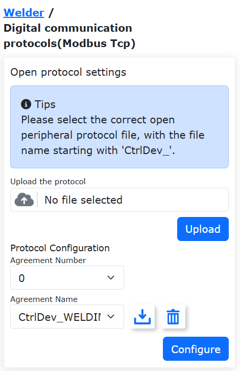

.. centered:: Schemat 8.6‑40 Konfiguracja otwartego protokołu spawarki

Kliknij przycisk „Połącz”, aby załadować otwarty protokół spawarki. Wskaźnik stanu działania zaświeci się, co oznacza, że robot i spawarka komunikują się.

.. figure:: robot_peripherals/070.png
   :align: center
   :width: 4in

.. centered:: Schemat 8.6‑41 Ładowanie otwartego protokołu spawarki

Debugowanie spawarki
********************

Przed debugowaniem spawarki upewnij się, że otwarty protokół spawarki został poprawnie załadowany, a odpowiednie adresy rejestrów są prawidłowo skonfigurowane.

Kolejno kliknij „Ustawienia początkowe”, „Urządzenia peryferyjne”, „Spawarka”. Wybierz „Protokół komunikacji cyfrowej (Modbus TCP)”.

.. figure:: robot_peripherals/036.png
   :align: center
   :width: 4in

.. centered:: Schemat 8.6‑42 Wybór „Protokołu komunikacji cyfrowej (Modbus TCP)”

Kliknij przyciski „Rozpoczęcie łuku”, „Zakończenie łuku”, „Podaj gaz”, „Zamknij gaz” itp. i obserwuj, czy rzeczywiste działanie spawarki jest zgodne z ustawieniami. Jeśli spawarka nie wykonuje ustawionych czynności, sprawdź, czy konfiguracja rejestrów w otwartym protokole spawarki jest prawidłowa i przeprowadź dalsze debugowanie.

.. figure:: robot_peripherals/049.png
   :align: center
   :width: 4in

.. centered:: Schemat 8.6‑43 Debugowanie spawarki

Pisanie programu spawania
*************************

Kliknij „Ustawienia początkowe”, „Program nauczania”, „Programowanie”, utwórz nowy program „testWeld.lua”.

.. figure:: robot_peripherals/056.png
   :align: center
   :width: 6in

.. centered:: Schemat 8.6‑44 Tworzenie programu LUA spawania

Kliknij przycisk „Spawanie”. Na wyskakującej stronie dodawania instrukcji spawania wybierz „Protokół komunikacji cyfrowej (Modbus TCP)”. Kolejno wybierz „Rozpoczęcie łuku”, kliknij „Dodaj”, wybierz „Zakończenie łuku”, kliknij „Dodaj”, a na koniec kliknij „Zastosuj”.

.. figure:: robot_peripherals/071.png
   :align: center
   :width: 6in

.. centered:: Schemat 8.6‑45 Dodawanie instrukcji rozpoczęcia i zakończenia łuku

W tym momencie do „testWeld.lua” zostały dodane instrukcje rozpoczęcia i zakończenia łuku.

.. centered:: Schemat 8.6‑46 Dodawanie instrukcji rozpoczęcia i zakończenia łuku

Kolejno dodaj punkt początkowy i końcowy spawania. Przełącz robota w tryb automatyczny i uruchom program, upewniając się, że jest bezpieczny. Robot steruje spawarką, aby wykonać operację spawania jednej spoiny.

.. figure:: robot_peripherals/059.png
   :align: center
   :width: 4in

.. centered:: Schemat 8.6‑47 Program spawania

Zwolnienie otwartego protokołu spawarki
***************************************

Kolejno kliknij „Ustawienia początkowe”, „Urządzenia peryferyjne”, „Szafa sterownicza”, „Otwarty protokół urządzeń peryferyjnych”. W sekcji „Operacje i stan urządzenia” kliknij przycisk „Zwolnij”.

.. figure:: robot_peripherals/067.png
   :align: center
   :width: 4in

.. centered:: Schemat 8.6‑48 Zwolnienie otwartego protokołu

W tym momencie wskaźnik stanu działania protokołu zgaśnie.

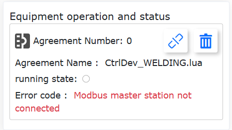

.. centered:: Schemat 8.6‑49 Zwolnienie otwartego protokołu

W tym momencie, podczas debugowania spawania lub wykonywania programu spawania, robot zgłosi błąd „Protokół niezaładowany” w lewym dolnym rogu WebApp.

.. figure:: robot_peripherals/073.png
   :align: center
   :width: 3in

.. centered:: Schemat 8.6‑50 Błąd niezaładowanego protokołu

Konfiguracja osi rozszerzonej
-----------------------------

W „Ustawienia początkowe” -> „Urządzenia peryferyjne” kliknij „Oś rozszerzona”, aby przejść do interfejsu konfiguracji osi rozszerzonej. Zawiera on konfigurację układu współrzędnych osi rozszerzonej i konfigurację urządzeń peryferyjnych osi rozszerzonej. Interfejs przy pierwszym wejściu do konfiguracji osi rozszerzonej wygląda następująco:

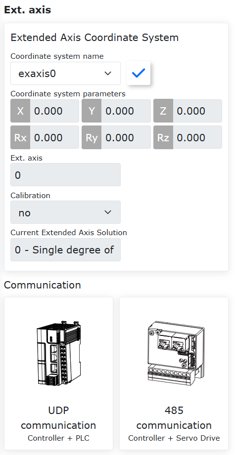

.. centered:: Schemat 8.7‑1 Interfejs przy pierwszym wejściu do konfiguracji osi rozszerzonej

Obecnie konfiguracja urządzeń peryferyjnych osi rozszerzonej dzieli się na dwa typy w zależności od sposobu komunikacji:

- Sterownik + PLC (komunikacja UDP).
- Sterownik + serwonapęd (komunikacja 485).

Układ współrzędnych osi rozszerzonej
~~~~~~~~~~~~~~~~~~~~~~~~~~~~~~~~~~~~

W interfejsie ustawień układu współrzędnych osi rozszerzonej można zastosować, wyczyścić i skonfigurować układ współrzędnych osi rozszerzonej.

.. note:: 
   .. image:: robot_peripherals/075.png
      :height: 0.75in
      :align: left

   Nazwa: **Zastosuj**
   
   Działanie: Zastosowuje układ współrzędnych osi rozszerzonej
  
.. note:: 
   .. image:: robot_peripherals/076.png
      :height: 0.75in
      :align: left

   Nazwa: **Wyczyść**
   
   Działanie: Czyści dane układu współrzędnych osi rozszerzonej

Na liście rozwijanej układów współrzędnych osi rozszerzonej znajduje się 5 numerów, od exaxis0 do exaxis4. Po wybraniu odpowiedniego układu współrzędnych, odpowiadające mu wartości współrzędnych zostaną wyświetlone poniżej. Po wybraniu układu współrzędnych i kliknięciu przycisku „Zastosuj”, bieżący używany układ współrzędnych osi rozszerzonej zmieni się na wybrany, jak pokazano na poniższym rysunku.

.. image:: robot_peripherals/077.png
   :width: 4in
   :align: center

.. centered:: Schemat 8.7‑2 Układ współrzędnych osi rozszerzonej

Wybierz układ współrzędnych osi rozszerzonej inny niż „exaxis0” i kliknij „Konfiguruj”, aby przejść do interfejsu konfiguracji układu współrzędnych osi rozszerzonej i ponownie ustawić układ współrzędnych osi rozszerzonej dla tego numeru. Jak pokazano poniżej:

.. important::
  - Przed kalibracją najpierw wyczyść układ współrzędnych osi rozszerzonej, który ma być kalibrowany, i zastosuj ten układ współrzędnych osi rozszerzonej.

  - Wybierz numer osi rozszerzonej. „Pobierz informacje” może pobrać informacje o sterowniku odpowiedniej osi rozszerzonej. Na podstawie tych informacji możemy skonfigurować parametry.

.. image:: robot_peripherals/078.png
   :width: 4in
   :align: center

.. centered:: Schemat 8.7‑3 Kalibracja układu współrzędnych osi rozszerzonej

Obecne schematy osi rozszerzonych są następujące:

- 0 - Prosta szyna szynowa z jednym stopniem swobody
- 1 - Pozycjoner typu L z dwoma stopniami swobody
- 2 - Trzy stopnie swobody (tymczasowo niedostępne)
- 3 - Cztery stopnie swobody (tymczasowo niedostępne)
- 4 - Pozycjoner z jednym stopniem swobody
- 5 - Wózek z dwoma stopniami swobody

**Prosta szyna szynowa z jednym stopniem swobody**: Najpierw ustaw parametry DH, a następnie ustaw pozycję robota względem osi rozszerzonej. Dla szyny prostej jest to na osi rozszerzonej. Bez kalibracji wystarczy kliknąć Zapisz. Wtedy oś rozszerzona może poruszać się tylko asynchronicznie.

.. image:: robot_peripherals/079.png
   :width: 4in
   :align: center

.. centered:: Schemat 8.7-4 Konfiguracja parametrów DH dla szyny prostej

.. image:: robot_peripherals/080.png
   :width: 4in
   :align: center

.. centered:: Schemat 8.7-5 Szyna prosta -- konfiguracja pozycji robota względem osi rozszerzonej

Jeśli potrzebny jest ruch synchroniczny z robotem, w punkcie zerowym osi rozszerzonej kliknij Eaxis w obszarze operacji, aby włączyć oś rozszerzoną. Skieruj środek końcówki robota (używając punktu końcowego narzędzia w zastosowanym układzie współrzędnych narzędzia) na stały punkt na osi rozszerzonej w dwóch różnych pozach i ustaw odpowiednio punkt 1 i punkt 2.

.. image:: robot_peripherals/081.png
   :width: 3in
   :align: center

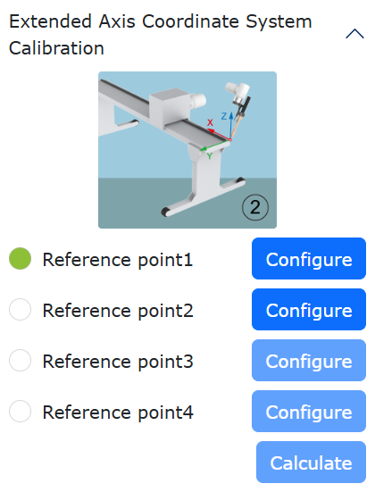

.. centered:: Schemat 8.7‑6 Punkty kalibracyjne 1 i 2 dla szyny prostej

Wyłącz zasilanie, przesuń oś rozszerzoną o pewną odległość. Włącz zasilanie. Ponownie skieruj środek końcówki robota na poprzedni stały punkt i ustaw punkt 3. Wyłącz zasilanie, przesuń oś rozszerzoną do zera. Włącz zasilanie osi rozszerzonej. Przesuń środek końcówki robota do punktu w przestrzeni pionowo nad stałym punktem i ustaw punkt 4. Oblicz układ współrzędnych i zapisz.

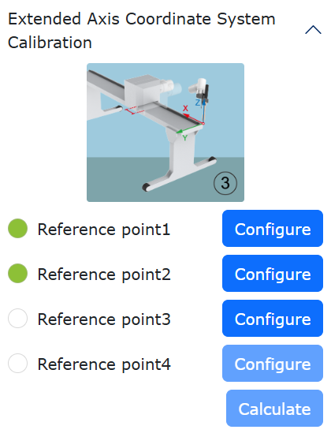

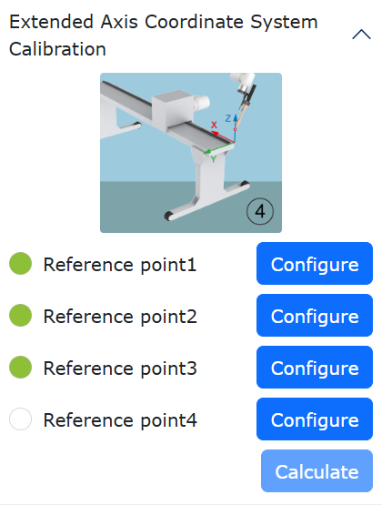

.. centered:: Schemat 8.7‑7 Punkty kalibracyjne 3 i 4 dla szyny prostej

**Pozycjoner typu L z dwoma stopniami swobody**: Pozycjoner składa się z dwóch osi rozszerzonych. Najpierw ustaw parametry DH. Zmierz parametry DH pozycjonera zgodnie z rysunkiem i wprowadź je w pola wejściowe. Ustaw pozycję robota względem osi rozszerzonej. Dla pozycjonera jest to poza osią rozszerzoną. Bez kalibracji wystarczy kliknąć Zapisz. Wtedy oś rozszerzona może poruszać się tylko asynchronicznie.

.. image:: robot_peripherals/085.png
   :width: 4in
   :align: center

.. centered:: Schemat 8.7‑8 Konfiguracja parametrów DH dla pozycjonera typu L z dwoma stopniami swobody

.. image:: robot_peripherals/086.png
   :width: 4in
   :align: center

.. centered:: Schemat 8.7‑9 Pozycjoner typu L z dwoma stopniami swobody -- pozycja robota względem osi rozszerzonej

Jeśli potrzebny jest ruch synchroniczny z robotem, w punkcie zerowym osi rozszerzonej kliknij Eaxis w obszarze operacji, aby włączyć oś rozszerzoną. Utwórz układ współrzędnych na pozycjonerze. Wybierz punkt i wprowadź jego pozycję i orientację w kartezjańskim układzie współrzędnych w tym układzie. Na przykład wybierz punkt w kierunku +Y, zmierz Y = 100 mm, wprowadź wartości jak na rysunku. Kliknij „Punkt odniesienia”, aby ustawić punkt odniesienia. W przypadku kolejnych czterech punktów kalibracyjnych należy skierować środek końcówki robota (używając punktu końcowego narzędzia w zastosowanym układzie współrzędnych narzędzia) na ten punkt odniesienia.

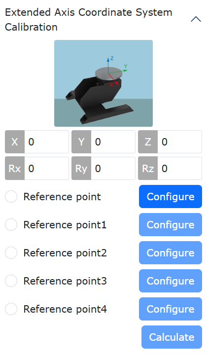

.. centered:: Schemat 8.7‑10 Pozycjoner typu L z dwoma stopniami swobody -- konfiguracja punktu odniesienia

Skieruj środek końcówki robota (używając punktu końcowego narzędzia w zastosowanym układzie współrzędnych narzędzia) na punkt odniesienia, ustaw punkt 1. Kliknij Eaxis w obszarze operacji, aby wykonać ruch jałowy o niewielką odległość na obu osiach. Skieruj środek końcówki robota na punkt odniesienia, ustaw punkt 2. Kontynuuj ruch jałowy na obu osiach. Skieruj środek końcówki robota na punkt odniesienia, ustaw punkt 3. Na koniec ponownie wykonaj ruch jałowy na obu osiach. Skieruj środek końcówki robota na punkt odniesienia, ustaw punkt 4. Kliknij Oblicz, aby otrzymać wynik układu współrzędnych. Kliknij Zapisz, a następnie Zastosuj.

.. image:: robot_peripherals/088.png
   :width: 3in
   :align: center

.. image:: robot_peripherals/089.png
   :width: 3in
   :align: center

.. image:: robot_peripherals/090.png
   :width: 3in
   :align: center

.. image:: robot_peripherals/091.png
   :width: 3in
   :align: center

.. centered:: Schemat 8.7‑11 Kalibracja pozycjonera typu L z dwoma stopniami swobody

**Pozycjoner z jednym stopniem swobody**: Składa się z jednej obrotowej osi rozszerzonej. Parametry DH ustaw na 0. Ustaw pozycję robota względem osi rozszerzonej jako poza osią rozszerzoną. Bez kalibracji wystarczy kliknąć Zapisz. Wtedy oś rozszerzona może poruszać się tylko asynchronicznie.

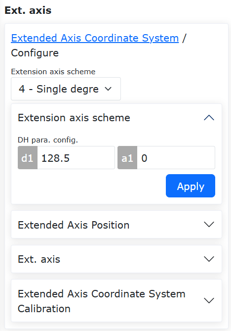

.. centered:: Schemat 8.7‑12 Konfiguracja parametrów DH dla pozycjonera z jednym stopniem swobody

.. image:: robot_peripherals/093.png
   :width: 4in
   :align: center

.. centered:: Schemat 8.7‑13 Pozycjoner z jednym stopniem swobody -- pozycja robota względem osi rozszerzonej

Jeśli potrzebny jest ruch synchroniczny z robotem, w punkcie zerowym osi rozszerzonej kliknij Eaxis w obszarze operacji, aby włączyć oś rozszerzoną. Utwórz układ współrzędnych na pozycjonerze. Wybierz punkt i wprowadź jego pozycję i orientację w kartezjańskim układzie współrzędnych w tym układzie. Kliknij „Punkt odniesienia”, aby ustawić punkt odniesienia.

.. image:: robot_peripherals/094.png
   :width: 4in
   :align: center

.. centered:: Schemat 8.7‑14 Konfiguracja punktu odniesienia dla pozycjonera z jednym stopniem swobody

W przypadku kolejnych czterech punktów kalibracyjnych należy skierować środek końcówki robota (używając punktu końcowego narzędzia w zastosowanym układzie współrzędnych narzędzia) na ten punkt odniesienia. Skieruj środek końcówki robota (używając punktu końcowego narzędzia w zastosowanym układzie współrzędnych narzędzia) na punkt odniesienia, ustaw punkt 1. Kliknij Eaxis w obszarze operacji, aby wykonać ruch jałowy osi obrotu o niewielką odległość. Skieruj środek końcówki robota na punkt odniesienia, ustaw punkt 2. Kontynuuj ruch jałowy osi obrotu. Skieruj środek końcówki robota na punkt odniesienia, ustaw punkt 3. Na koniec ponownie wykonaj ruch jałowy osi obrotu. Skieruj środek końcówki robota na punkt odniesienia, ustaw punkt 4. Kliknij Oblicz, aby otrzymać wynik układu współrzędnych. Kliknij Zapisz, a następnie Zastosuj.

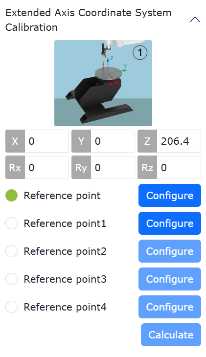

.. image:: robot_peripherals/096.png
   :width: 3in
   :align: center

.. image:: robot_peripherals/097.png
   :width: 3in
   :align: center

.. image:: robot_peripherals/098.png
   :width: 3in
   :align: center

.. centered:: Schemat 8.7‑15 Kalibracja pozycjonera z jednym stopniem swobody

.. important:: 
   1. Układ współrzędnych osi rozszerzonej jest kalibrowany w oparciu o narzędzie. Należy go utworzyć na podstawie już utworzonego układu współrzędnych narzędzia.
   2. Zazwyczaj używa się układów współrzędnych osi rozszerzonej exaxis1 ~ exaxis4. Zastosowanie exaxis0 oznacza brak układu współrzędnych osi rozszerzonej. Podczas kalibracji układu współrzędnych osi rozszerzonej należy najpierw zastosować układ współrzędnych osi rozszerzonej do exaxis0, a następnie wybrać inny układ współrzędnych osi rozszerzonej do kalibracji i zastosowania.

Sterownik + PLC (komunikacja UDP)
~~~~~~~~~~~~~~~~~~~~~~~~~~~~~~~~~

Przed użyciem komunikacji UDP osi rozszerzonej należy najpierw utworzyć odpowiedni układ współrzędnych osi rozszerzonej, skonfigurować odpowiedni schemat osi rozszerzonej w odpowiednim układzie współrzędnych osi rozszerzonej i zastosować utworzony układ współrzędnych narzędzia podczas programowania nauczania. Funkcja osi rozszerzonej jest używana głównie w połączeniu z funkcją spawarki i funkcją czujnika śledzenia laserowego.

.. figure:: robot_peripherals/099.png
   :align: center
   :width: 4in

.. centered:: Schemat 8.7‑16 Zastosowanie układu współrzędnych osi rozszerzonej i wyświetlanie bieżącego schematu osi rozszerzonej

Gdy potrzebna jest tylko modyfikacja bieżącego układu współrzędnych osi rozszerzonej, wybierz układ współrzędnych w interfejsie konfiguracji urządzeń peryferyjnych osi rozszerzonej, aby go zastosować. Gdy trzeba zmienić schemat osi rozszerzonej, należy przejść do interfejsu konfiguracji układu współrzędnych osi rozszerzonej w celu modyfikacji.

Gdy schemat osi rozszerzonej to „0 - Prosta szyna szynowa z jednym stopniem swobody”, „1 - Pozycjoner typu L z dwoma stopniami swobody”, „2 - Trzy stopnie swobody”, „3 - Cztery stopnie swobody” i „4 - Pozycjoner z jednym stopniem swobody”, po pomyślnej konfiguracji komunikacji UDP wyświetlane są treści „UDP rozszerzonej osi” i „Ustawienie czasu zakończenia pozycjonowania”. Gdy schemat osi rozszerzonej to „5 - Wózek z dwoma stopniami swobody”, interfejs wyświetla treść „Test wózka z dwoma stopniami swobody”.

Konfiguracja komunikacji UDP
++++++++++++++++++++++++++++

.. note:: 
   .. image:: robot_peripherals/100.png
      :height: 0.75in
      :align: left

   Nazwa: **Przycisk edycji**
   
   Działanie: Konfiguracja parametrów komunikacji UDP

.. note:: 
   .. image:: robot_peripherals/101.png
      :height: 0.75in
      :align: left

   Nazwa: **Przycisk ładowania**
   
   Działanie: Ładowanie komunikacji UDP

**Krok 1**: Skonfiguruj parametry komunikacji UDP osi rozszerzonej: ustaw adres IP, numer portu, okres komunikacji, okres wykrywania utraty pakietów, liczbę utraconych pakietów itp. Parametry okresu ponownego łączenia i liczby ponownych łączeń można skonfigurować dopiero po włączeniu przełącznika automatycznego ponownego łączenia po przerwaniu komunikacji.

- Adres IP: niestandardowy adres IP;
- Numer portu: zdefiniuj zgodnie z rzeczywistą sytuacją;
- Okres komunikacji: zdefiniuj zgodnie z rzeczywistą sytuacją, jednostka ms;
- Okres komunikacji wykrywania utraty pakietów: 10 ~ 1000 ms;
- Liczba utraconych pakietów: 1 ~ 100;
- Czas potwierdzenia przerwania komunikacji: 0 ~ 500 ms;
- Automatyczne ponowne łączenie po ponownym uruchomieniu z odcięciem zasilania: Wł. / Wył.;
- Automatyczne ponowne łączenie po przerwaniu komunikacji: Wł. / Wył.;
- Okres ponownego łączenia: 1 ~ 1000 ms;
- Liczba ponownych łączeń: 1 ~ 100;

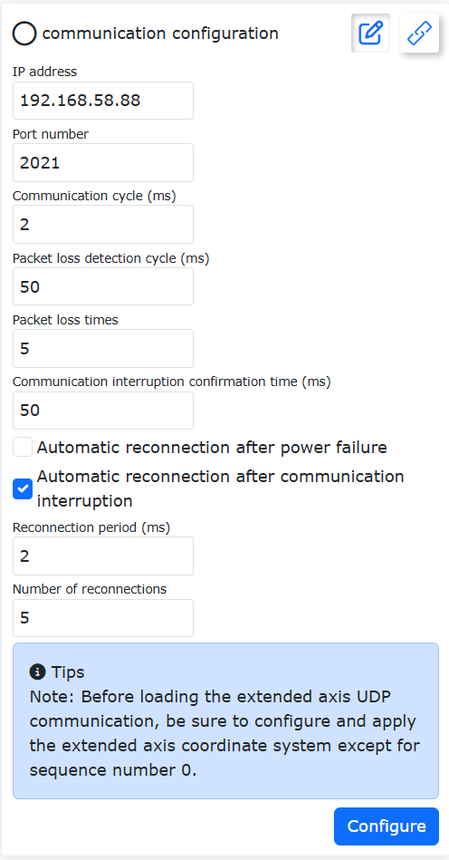

.. centered:: Schemat 8.7‑17 Konfiguracja parametrów komunikacji UDP osi rozszerzonej

.. important:: 
  1. Po ustawieniu czasu potwierdzenia przerwania komunikacji, dopiero gdy nieprawidłowość komunikacji przekroczy ten czas, komunikacja zostanie uznana za przerwaną i zgłoszony zostanie błąd;
  2. Po przerwaniu komunikacji UDP, wyzwalany jest błąd przerwania UDP (możliwy do zresetowania). Można kliknąć przycisk wyczyszczenia ostrzeżenia, a komunikacja UDP zostanie ponownie nawiązana.

**Krok 2**: Po pomyślnej konfiguracji parametrów komunikacji kliknij przycisk „Załaduj”, aby nawiązać komunikację UDP. Po pomyślnej komunikacji przycisk przed „Konfiguracją komunikacji UDP” zmieni kolor na zielony. W różnych stanach robota, w stanie osi rozszerzonej, widać, że oś rozszerzona jest już serwo gotowa.

.. figure:: robot_peripherals/103.png
   :align: center
   :width: 4in

.. centered:: Schemat 8.7‑18 Nawiązywanie komunikacji UDP osi rozszerzonej

.. figure:: robot_peripherals/104.png
   :align: center
   :width: 4in

.. centered:: Schemat 8.7‑19 Serwo gotowe osi rozszerzonej

.. important:: 
  1. Gdy komunikacja UDP nie jest nawiązana, nie można skonfigurować ani wyświetlić informacji o numerze osi rozszerzonej UDP;
  2. Przed załadowaniem komunikacji UDP osi rozszerzonej należy najpierw skonfigurować i zastosować układ współrzędnych osi rozszerzonej inny niż numer 0.

UDP rozszerzonej osi
++++++++++++++++++++

.. note:: 
   .. image:: robot_peripherals/100.png
      :height: 0.75in
      :align: left

   Nazwa: **Przycisk edycji**
   
   Działanie: Konfiguracja parametrów osi rozszerzonej

.. note:: 
   .. image:: robot_peripherals/105.png
      :height: 0.75in
      :align: left

   Nazwa: **Przycisk włączenia**
   
   Działanie: Stan włączenia osi rozszerzonej. Kliknięcie przycisku powoduje wyłączenie osi rozszerzonej.

.. note:: 
   .. image:: robot_peripherals/106.png
      :height: 0.75in
      :align: left

   Nazwa: **Przycisk wyłączenia**
   
   Działanie: Stan wyłączenia osi rozszerzonej. Kliknięcie przycisku powoduje włączenie osi rozszerzonej.

.. note:: 
   .. image:: robot_peripherals/107.png
      :height: 0.75in
      :align: left

   Nazwa: **Przycisk powrotu do zera**
   
   Działanie: Ustawienie sposobu powrotu do zera osi rozszerzonej

.. note:: 
   .. image:: robot_peripherals/108.png
      :height: 0.75in
      :align: left

   Nazwa: **Przycisk testu**
   
   Działanie: Test funkcji osi rozszerzonej

**Krok 1**: Wybierz dowolny numer osi rozszerzonej (obecnie tylko numery 1, 2, 3, 4). Kliknij przycisk „Edycja” za numerem osi rozszerzonej, aby przejść do szczegółowego interfejsu konfiguracji. Ustaw typ osi, kierunek osi, prędkość roboczą, przyspieszenie, ograniczenie kierunku dodatniego, ograniczenie kierunku ujemnego, skok, rozdzielczość enkodera, przesunięcie punktu początkowego, producenta, model i tryb. Kliknij Konfiguruj, aby zakończyć konfigurację.

- Typ osi: Szyna liniowa, oś obrotowa i oś obrotu nieograniczonego;
- Kierunek osi: Dodatni / Ujemny;
- Prędkość robocza: 0~2000 mm/s;
- Przyspieszenie: 0 ~ 2000 mm/s²;
- Ograniczenie kierunku dodatniego: 0 ~ 50000;
- Ograniczenie kierunku ujemnego: -50000 ~ 0;
- Skok: 0~1000;
- Rozdzielczość enkodera: 0 ~ 10000000;
- Przesunięcie punktu początkowego: 0 ~ 10000 mm;
- Producent: Hechuan, Huichuan i Panasonic;
- Model: Lista modeli automatycznie dopasowywana w zależności od producenta;
- Tryb: System inkrementalny i system pozycji absolutnej;

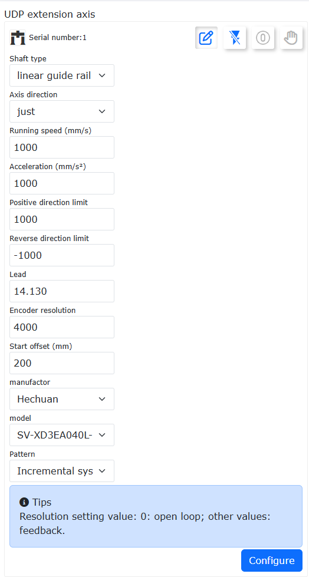

.. centered:: Schemat 8.7‑20 Konfiguracja parametrów osi rozszerzonej

**Krok 2**: Po zakończeniu konfiguracji parametrów osi rozszerzonej kliknij przycisk „Wyłącz”, aby włączyć odpowiedni numer osi rozszerzonej. Po pomyślnym włączeniu można ustawić sposób powrotu do zera i test osi rozszerzonej. Gdy oś rozszerzona nie jest włączona, nie można ustawić sposobu powrotu do zera ani przeprowadzić testu osi rozszerzonej.

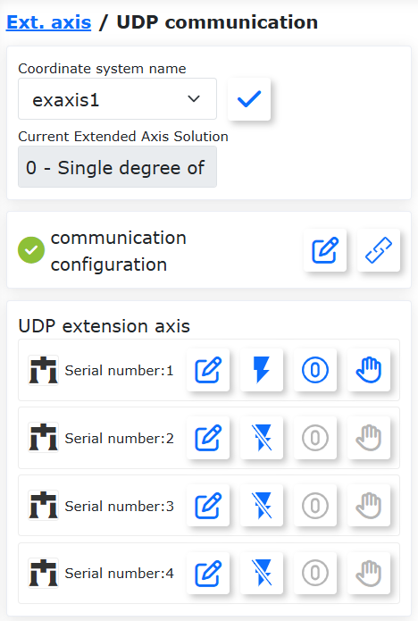

.. centered:: Schemat 8.7‑21 Włączanie/wyłączanie osi rozszerzonej

**Krok 3**: Jeśli oś rozszerzona nie została pomyślnie włączona, nie można wejść do interfejsu ustawień, a przycisk jest nieaktywny. Po pomyślnym włączeniu osi rozszerzonej kliknij przycisk „Powrót do zera”, aby przejść do interfejsu ustawień sposobu powrotu do zera. Ustaw sposób powrotu do zera, prędkość poszukiwania zera i prędkość zatrzaskiwania zera. Kliknij przycisk „Ustaw”. Oś rozszerzona rozpoczyna powrót do zera. Stan powrotu do zera zostanie wyświetlony w pustym miejscu poniżej kierunku osi. Gdy pojawi się komunikat „Powrót do zera zakończony”, oznacza to, że punkt zerowy osi rozszerzonej został pomyślnie ustawiony.

- Sposób powrotu do zera: Powrót do bieżącej pozycji, powrót do ujemnego ogranicznika i powrót do dodatniego ogranicznika;
- Prędkość poszukiwania zera: 0~2000 mm/s;
- Prędkość zatrzaskiwania zera: 0~2000 mm/s;

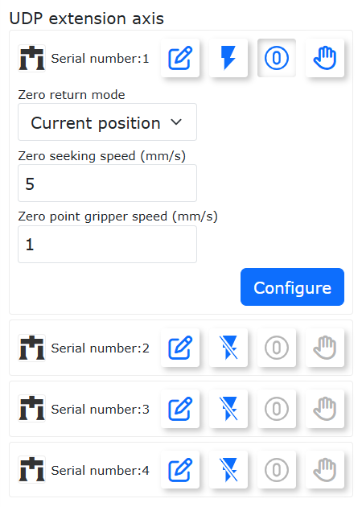

.. centered:: Schemat 8.7‑22 Ustawienie sposobu powrotu do zera

**Krok 4**: Jeśli oś rozszerzona nie została pomyślnie włączona, nie można wejść do interfejsu ustawień, a przycisk jest nieaktywny. Po pomyślnym włączeniu osi rozszerzonej i ustawieniu sposobu powrotu do zera kliknij przycisk „Test”, aby przejść do interfejsu testu osi rozszerzonej. Ustaw prędkość roboczą, przyspieszenie i maksymalną odległość. Wykonaj test osi rozszerzonej, obracając w kierunku dodatnim i ujemnym. Podczas obracania można kliknąć przycisk „Stop”, aby przetestować, czy oś rozszerzona może normalnie się zatrzymać.

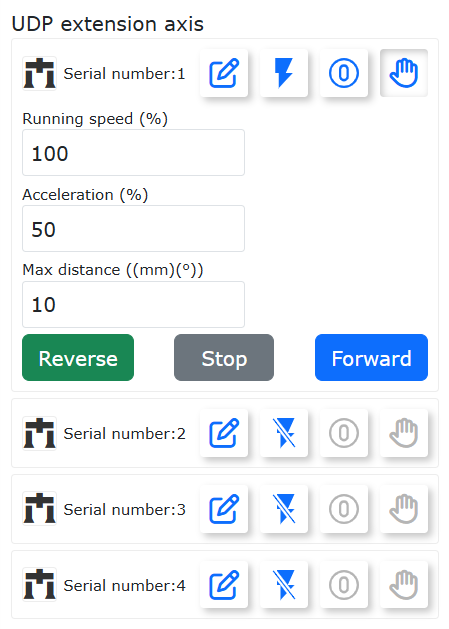

.. centered:: Schemat 8.7‑23 Test osi rozszerzonej

**Krok 5**: Oś rozszerzona jest zwykle używana razem z czujnikiem laserowym. W tym przypadku czujnik laserowy jest zwykle montowany zewnętrznie. Konfiguracja punktu odniesienia czujnika wymaga kalibracji metodą trzech punktów, a nie wcześniej używaną metodą sześciu punktów. Skieruj środek narzędzia na środkowy punkt na dole prawego przekroju poprzecznego (po stronie bliższej kamery) i ustaw punkt 1. Skieruj środek narzędzia na środkowy punkt na dole lewego przekroju poprzecznego i ustaw punkt 2. Przesuń środek narzędzia do środkowego punktu na górnej krawędzi prawego przekroju poprzecznego czujnika i ustaw punkt 3. Oblicz i zapisz. Kliknij Zastosuj, aby zakończyć kalibrację metodą trzech punktów.

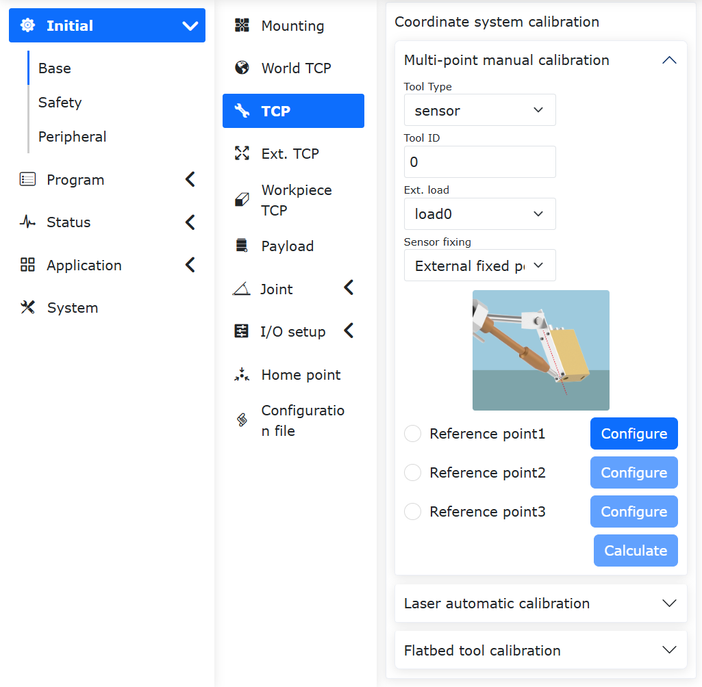

.. centered:: Schemat 8.7‑24 Kalibracja czujnika metodą trzech punktów

**Krok 6**: W interfejsie „Program nauczania” -> „Programowanie” wybierz polecenie „Oś rozszerzona” w instrukcjach urządzeń peryferyjnych. Zgodnie z konkretnymi potrzebami programowania nauczania dodaj instrukcje w odpowiednich miejscach.

.. figure:: robot_peripherals/114.png
   :align: center
   :width: 6in

.. centered:: Schemat 8.7‑25 Edycja instrukcji osi rozszerzonej

Program nauczania spawania z osią rozszerzoną i śledzeniem laserowym
++++++++++++++++++++++++++++++++++++++++++++++++++++++++++++++++++++

.. list-table::
   :widths: 50 80 80
   :header-rows: 0
   :align: center

   * - **Nr**
     - **Format instrukcji**
     - **Komentarz**

   * - 1
     - EXT_AXIS_PTP(1,1laserstart)
     - # Ruch osi zewnętrznej do punktu początkowego czujnika laserowego

   * - 2
     - PTP(laserstart,10,-1,0)
     - # Ruch robota do punktu początkowego czujnika laserowego

   * - 3
     - LTSearchStart(3,20,10,10000)
     - # Rozpoczęcie lokalizacji

   * - 4
     - LTSearchStop()
     - # Zatrzymanie lokalizacji

   * - 5
     - EXT_AXIS_PTP(1,1,seamPos)
     - # Ruch osi zewnętrznej do punktu początkowego spoiny

   * - 6
     - Lin(seamPos,20,-1,00,0)
     - # Ruch robota do punktu początkowego spoiny

   * - 7
     - LTTrackOn()
     - # Śledzenie laserowe

   * - 8
     - ARCStart(0,10000)
     - # Rozpoczęcie łuku spawarki

   * - 9
     - EXT_AXIS_PTP(1,1,laserend)
     - # Ruch osi zewnętrznej do punktu końcowego spoiny

   * - 10
     - Lin( laserend,10,-1,0,0)
     - # Ruch robota do punktu końcowego spoiny

   * - 11
     - ARCEnd(0,10000)
     - # Zakończenie łuku spawarki

   * - 12
     - LTTrackOff
     - # Wyłączenie śledzenia laserowego

Czas zakończenia pozycjonowania
+++++++++++++++++++++++++++++++

Po nawiązaniu komunikacji UDP przez oś rozszerzoną, wprowadź czas i kliknij przycisk „Konfiguruj”, aby zakończyć ustawienie. Ta pozycja konfiguracyjna służy do monitorowania czasu zatrzymania ruchu osi rozszerzonej.

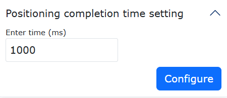

.. centered:: Schemat 8.7‑26 Konfiguracja czasu zakończenia pozycjonowania

Test wózka z dwoma stopniami swobody
~~~~~~~~~~~~~~~~~~~~~~~~~~~~~~~~~~~~

Gdy schemat osi rozszerzonej w konfiguracji układu współrzędnych osi rozszerzonej to „5 - Wózek z dwoma stopniami swobody”, po wejściu do interfejsu komunikacji UDP wyświetlana jest ta treść. W przeciwnym razie nie można jej wyświetlić.

.. figure:: robot_peripherals/116.png
   :align: center
   :width: 4in

.. centered:: Schemat 8.7‑27 Interfejs dla schematu osi rozszerzonej „5 - Wózek z dwoma stopniami swobody”

.. important:: Wózek z dwoma stopniami swobody domyślnie używa numerów osi rozszerzonych 1 i 2. Po pomyślnej komunikacji UDP, w różnych stanach robota, w stanie osi rozszerzonej, widać, że osie rozszerzone 1 i 2 są serwo gotowe.

.. figure:: robot_peripherals/117.png
   :align: center
   :width: 6in

.. centered:: Schemat 8.7‑28 Serwo gotowe osi rozszerzonych wózka z dwoma stopniami swobody

.. note:: 
   .. image:: robot_peripherals/105.png
      :height: 0.75in
      :align: left

   Nazwa: **Przycisk włączenia**
   
   Działanie: Stan włączenia osi rozszerzonej. Kliknięcie przycisku powoduje wyłączenie osi rozszerzonej.

.. note:: 
   .. image:: robot_peripherals/106.png
      :height: 0.75in
      :align: left

   Nazwa: **Przycisk wyłączenia**
   
   Działanie: Stan wyłączenia osi rozszerzonej. Kliknięcie przycisku powoduje włączenie osi rozszerzonej.

.. note:: 
   .. image:: robot_peripherals/107.png
      :height: 0.75in
      :align: left

   Nazwa: **Przycisk powrotu do zera**
   
   Działanie: Powrót osi rozszerzonej do bieżącej pozycji

.. note:: 
   .. image:: robot_peripherals/108.png
      :height: 0.75in
      :align: left

   Nazwa: **Przycisk testu**
   
   Działanie: Test funkcji wózka z dwoma stopniami swobody

**Krok 1**: Po pomyślnej komunikacji UDP kliknij przycisk „Wyłącz”, aby włączyć odpowiednią oś rozszerzoną wózka z dwoma stopniami swobody. Sprawdź stan serwo włączenia osi rozszerzonych 1 i 2 w różnych stanach robota, w stanie osi rozszerzonej.

.. figure:: robot_peripherals/118.png
   :align: center
   :width: 6in

.. centered:: Schemat 8.7‑29 Włączenie osi rozszerzonych wózka z dwoma stopniami swobody

**Krok 2**: Po pomyślnym włączeniu osi rozszerzonej kliknij przycisk „Powrót do zera”, aby ustawić powrót osi rozszerzonej do bieżącej pozycji. Po pomyślnym powrocie do zera przycisk testu stanie się aktywny. W przeciwnym razie będzie nieaktywny.

.. figure:: robot_peripherals/119.png
   :align: center
   :width: 6in

.. centered:: Schemat 8.7‑30 Pomyślny powrót do bieżącej pozycji wózka z dwoma stopniami swobody

**Krok 3**: Po pomyślnym powrocie wózka z dwoma stopniami swobody do bieżącej pozycji kliknij przycisk „Test”, aby przejść do interfejsu. Wybierz sposób ruchu, wprowadź parametry, aby przeprowadzić test ruchu. Podczas ruchu kliknij przycisk „Stop”, aby przetestować funkcję zatrzymania.

- Sposób ruchu: Linia prosta / Łuk;
- Odległość: -5000~5000 mm (dla ruchu liniowego);
- Promień: 1~5000 mm (dla ruchu liniowego);
- Kąt: -360~360° (dla ruchu łukowego);
- Prędkość: 1~100%

.. figure:: robot_peripherals/120.png
   :align: center
   :width: 4in

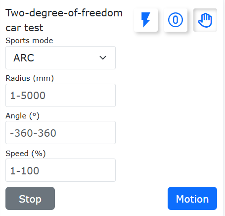

.. centered:: Schemat 8.7‑31 Test wózka z dwoma stopniami swobody

Sterownik + serwonapęd (komunikacja 485)
~~~~~~~~~~~~~~~~~~~~~~~~~~~~~~~~~~~~~~~~

Podłączenie sprzętu
+++++++++++++++++++

Przed użyciem komunikacji RS485 do sterowania serwo osią rozszerzoną, należy najpierw podłączyć interfejs komunikacji RS485 serwonapędu do interfejsu komunikacji RS485 na szafie sterowniczej robota. Schemat interfejsów elektrycznych szafy sterowniczej robota współpracującego FANUC Yizhizao jest następujący:

.. figure:: robot_peripherals/122.png
   :align: center
   :width: 6in

.. centered:: Schemat 8.7‑32 Schemat interfejsów elektrycznych mini szafy sterowniczej robota FANUC

Na przykładzie serwonapędu Dynatect FD100-750C, odnosząc się do schematu zacisków panelu tego napędu i definicji zacisków X3A-IN w FD100-750C, podczas konfigurowania komunikacji robota z serwo osią rozszerzoną FD100-750C, należy podłączyć zacisk 485-A0 i zacisk 485-B0 na szafie sterowniczej odpowiednio do pinów 4 i 5 zacisku X3A-IN napędu. (Uwaga: Na panelu serwonapędu widać zacisk do podłączenia oznaczony „485”. Ten zacisk nie jest jeszcze udostępniony użytkownikowi. Nie podłączaj do niego kabla komunikacyjnego RS485). Ponadto, jeśli podłączasz wiele serwonapędów, a ten napęd jest ostatnim w łańcuchu, należy włączyć przełącznik DIP rezystora terminującego komunikację RS485 na panelu (przełącznik DIP nr 2).

.. figure:: robot_peripherals/123.png
   :align: center
   :width: 6in

.. centered:: Schemat 8.7‑33 Panel napędu FD100-750C

.. figure:: robot_peripherals/124.png
   :align: center
   :width: 6in

.. centered:: Schemat 8.7‑34 Definicja zacisków X3A-IN w FD100-750C

Konfiguracja komunikacji
++++++++++++++++++++++++

Upewnij się, że kabel komunikacyjny RS485 jest prawidłowo podłączony, a zarówno robot, jak i serwo oś rozszerzona są normalnie zasilane. Następnie otwórz WebApp robota.

Kliknij obrazek dla kombinacji „Sterownik + serwonapęd”, aby przejść do szczegółowego interfejsu konfiguracji. W konfiguracji serwonapędu wybierz numer „1” (Uwaga: Gdy podłączonych jest wiele serwonapędów, ten numer służy do odróżniania poszczególnych serwonapędów. Będziemy go często używać później). Wybierz producenta „Dynatect”, wybierz odpowiedni model serwonapędu. Tutaj model to „FD00-750C”. Wersja oprogramowania to V1.0. Wprowadź odpowiednią rozdzielczość serwonapędu, tutaj 131072. Wprowadź mechaniczne przełożenie transmisyjne zgodnie z modelem swojej maszyny, tutaj 15.45. Kliknij przycisk „Konfiguruj”.

.. figure:: robot_peripherals/125.png
   :align: center
   :width: 4in

.. centered:: Schemat 8.7‑35 Konfiguracja serwonapędu

W tym momencie zakończyliśmy konfigurację komunikacji 485 między robotem a serwonapędem. Możesz wyświetlić informacje o stanie serwonapędu w czasie rzeczywistym w „Pasku stanu serwonapędu” po prawej stronie w WebApp. Jak pokazano poniżej:

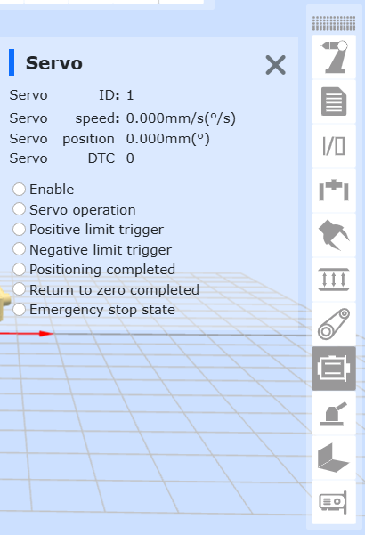

.. centered:: Schemat 8.7‑36 Pasek stanu serwonapędu

Teraz musisz po kolei włączyć zasilanie urządzenia osi rozszerzonej i ustawić sposób powrotu do zera. Następnie możesz przeprowadzić pewne testy ruchu. Wykonaj poniższe testy, upewniając się, że jest bezpieczne, zgodnie z niniejszą instrukcją.

Skonfigurowany serwonapęd
+++++++++++++++++++++++++

.. note:: 
   .. image:: robot_peripherals/127.png
      :height: 0.75in
      :align: left

   Nazwa: **Przycisk podglądu**
   
   Działanie: Kliknij, aby wyświetlić informacje konfiguracyjne serwonapędu

.. note:: 
   .. image:: robot_peripherals/105.png
      :height: 0.75in
      :align: left

   Nazwa: **Przycisk włączenia**
   
   Działanie: Stan włączenia serwonapędu. Kliknięcie przycisku powoduje wyłączenie serwonapędu.

.. note:: 
   .. image:: robot_peripherals/106.png
      :height: 0.75in
      :align: left

   Nazwa: **Przycisk wyłączenia**
   
   Działanie: Stan wyłączenia serwonapędu. Kliknięcie przycisku powoduje włączenie serwonapędu.

.. note:: 
   .. image:: robot_peripherals/107.png
      :height: 0.75in
      :align: left

   Nazwa: **Przycisk powrotu do zera**
   
   Działanie: Ustawienie sposobu powrotu do zera serwonapędu

.. note:: 
   .. image:: robot_peripherals/108.png
      :height: 0.75in
      :align: left

   Nazwa: **Przycisk testu**
   
   Działanie: Test serwonapędu

.. note:: 
   .. image:: robot_peripherals/128.png
      :height: 0.75in
      :align: left

   Nazwa: **Przycisk czyszczenia błędu serwonapędu**
   
   Działanie: Gdy serwonapęd zgłasza błąd, kliknij, aby go wyczyścić

Tryb sterowania serwonapędem i włączenie
****************************************

W „Skonfigurowanym serwonapędzie” wybierz tryb sterowania jako „Tryb pozycyjny”. Wybierz odpowiedni numer serwonapędu. Kliknij przycisk „Wyłącz”. W tym momencie najpierw zostanie ustawiony numer serwonapędu. Po pomyślnym ustawieniu, ustawiany jest tryb sterowania. Po pomyślnym ustawieniu trybu sterowania, serwonapęd jest włączany (Uwaga: Po przełączeniu trybu sterowania należy najpierw wyłączyć serwonapęd, a następnie włączyć go ponownie, aby przełączenie trybu sterowania serwonapędu zostało zastosowane. Po pomyślnym włączeniu serwonapędu przełączenie trybu sterowania zostanie wyłączone).

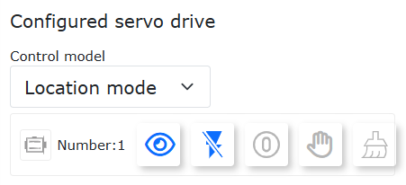

.. centered:: Schemat 8.7‑37 Tryb sterowania serwonapędem i włączenie

Po pomyślnym włączeniu serwonapędu, w pasku stanu „Serwo” w różnych stanach robota, można zaobserwować, że lampka stanu „Serwo włączone” świeci się, co oznacza, że serwonapęd jest włączony. Kliknij przycisk stanu „Włącz”, aby wyłączyć serwonapęd. Lampka stanu „Serwo włączone” zgaśnie.

.. figure:: robot_peripherals/130.png
   :align: center
   :width: 6in

.. centered:: Schemat 8.7‑38 Pasek stanu serwonapędu

Powrót serwonapędu do zera
**************************

Po pomyślnym włączeniu serwonapędu przycisk „Powrót do zera” stanie się aktywny. Kliknij przycisk, aby przejść do interfejsu ustawień. Wybierz tryb powrotu do zera jako „Powrót do bieżącej pozycji”. Ustaw prędkość powrotu do zera na 5 mm/s, a prędkość zatrzaskiwania zera na 1 mm/s. Kliknij przycisk „Ustaw”. To kończy operację powrotu serwonapędu do bieżącej pozycji. W pasku stanu „Serwo” w różnych stanach robota można zaobserwować, że bieżąca „Pozycja serwa” wynosi 0. (Po dokładnym przeczytaniu niniejszej instrukcji, wybierz tryb powrotu do zera jako „Powrót do ujemnego ogranicznika” lub „Powrót do dodatniego ogranicznika”, aby przeprowadzić test powrotu do zera).

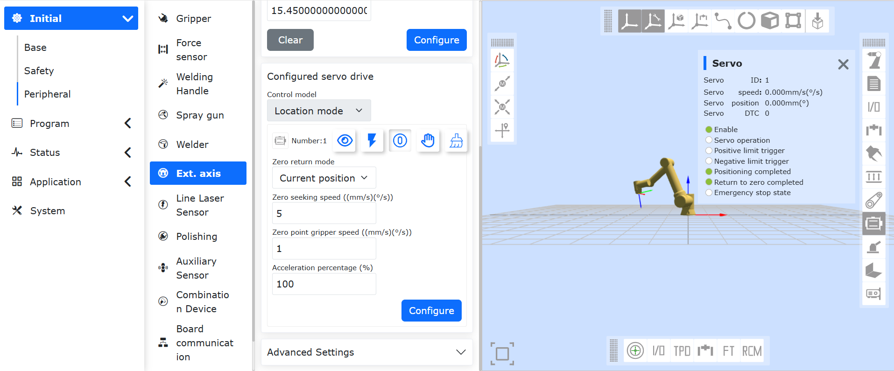

.. centered:: Schemat 8.7‑39 Powrót serwonapędu do zera

Ruch serwonapędu
****************

Zanim rzeczywiście zaczniesz sterować ruchem serwosilnika, najpierw poznaj „tryb pozycyjny” i „tryb prędkościowy” serwosilnika. Jeszcze raz przypominamy:

**Tryb pozycyjny**: Możesz wprowadzić pewną prędkość ruchu i parametry pozycji docelowej. Serwo będzie poruszać się z ustawioną prędkością do pozycji docelowej. Po osiągnięciu pozycji docelowej serwo zatrzyma się.

**Tryb prędkościowy**: Możesz wprowadzić pewną prędkość docelową. Serwo będzie poruszać się stale z ustawioną prędkością docelową, dopóki nie ustawisz prędkości docelowej na 0 lub nie wyłączysz serwosilnika.

Podczas przełączania trybu sterowania, wyświetlanie „Bieżącego trybu sterowania” zmieni się automatycznie (Uwaga: Po przełączeniu trybu sterowania należy najpierw wyłączyć serwonapęd, a następnie włączyć go ponownie, aby przełączenie trybu sterowania serwonapędu zostało zastosowane). Jeśli Twój serwonapęd nie jest obecnie w „trybie pozycyjnym”, przełącz go w tryb pozycyjny. Wprowadź „Pozycję docelową” 50 mm, prędkość roboczą 5 mm/s. Upewniając się, że jest bezpieczne, kliknij przycisk „Ustaw”. W tym momencie serwosilnik będzie poruszał się zgodnie z ustawionymi parametrami. Możesz obserwować w czasie rzeczywistym pozycję i prędkość serwa w pasku stanu „Serwo” w różnych stanach robota.

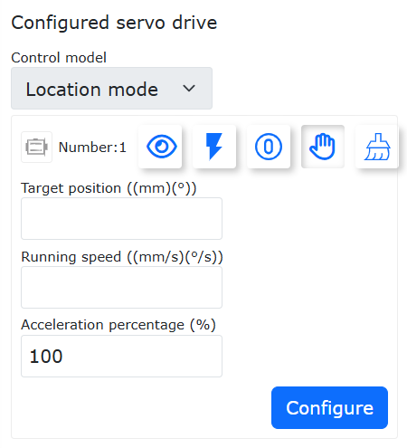

.. centered:: Schemat 8.7‑40 Debugowanie ruchu serwonapędu (tryb pozycyjny)

Zmień tryb sterowania serwonapędu na „tryb prędkościowy”. Kliknij przycisk stanu „Włącz”, aby wyłączyć serwonapęd. Następnie kliknij przycisk stanu „Wyłącz”. W tym momencie serwonapęd przełącza się w tryb prędkościowy (Uwaga: Gdy serwosilnik się porusza, można go zatrzymać tylko przez ustawienie prędkości docelowej na 0). Wprowadź prędkość docelową 5 mm/s i kliknij przycisk „Ustaw”. Serwosilnik będzie się poruszał stale z prędkością 5 mm/s. Podobnie możesz obserwować w czasie rzeczywistym pozycję i prędkość serwa w pasku stanu „Serwo” w różnych stanach robota.

.. figure:: robot_peripherals/133.png
   :align: center
   :width: 4in

.. centered:: Schemat 8.7‑41 Debugowanie ruchu serwonapędu (tryb prędkościowy)

Ustawienia zaawansowane
+++++++++++++++++++++++

W sytuacjach awaryjnych, takich jak kolizja robota lub naciśnięcie przycisku awaryjnego zatrzymania, oś rozszerzona może wyzwolić awaryjne zatrzymanie i zatrzymać się zgodnie z ustawionym opóźnieniem awaryjnego zatrzymania. Po przywróceniu alarmu kolizji, możliwe jest dalsze wysyłanie instrukcji, aby oś rozszerzona wznowiła działanie. W ustawieniach zaawansowanych należy ustawić prędkości i przyspieszenia serwa oraz awaryjne przyspieszenia i opóźnienia serwa, jak pokazano poniżej:

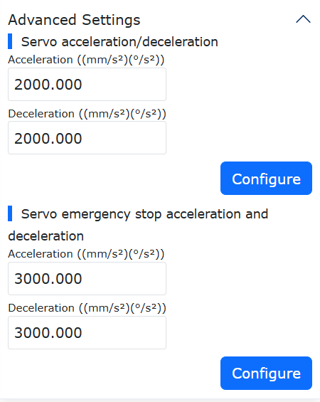

.. centered:: Schemat 8.7‑42 Ustawienia zaawansowane

Programowanie osi rozszerzonej
++++++++++++++++++++++++++++++

W „Program nauczania” -> „Programowanie” utwórz nowy program użytkownika „testServo.lua”. Wybierz „Instrukcje urządzeń peryferyjnych”.

.. figure:: robot_peripherals/135.png
   :align: center
   :width: 6in

.. centered:: Schemat 8.7‑43 Otwarcie instrukcji urządzeń peryferyjnych

Kliknij „Oś rozszerzona”, aby otworzyć interfejs dodawania instrukcji osi rozszerzonej. Wybierz typ kombinacji jako „Sterownik + serwonapęd (485)”. Ustaw tryb sterowania na „Tryb pozycyjny”. Kliknij przycisk „Dodaj” po prawej stronie. Przewiń interfejs dodawania instrukcji osi rozszerzonej na dół i kliknij przycisk „Zastosuj”.

.. figure:: robot_peripherals/136.png
   :align: center
   :width: 6in

.. centered:: Schemat 8.7‑44 Ustawianie trybu sterowania osi rozszerzonej

W tym momencie w programie „testServo.lua” pojawi się zestaw instrukcji do przełączania trybu sterowania serwonapędu. Możesz przełączyć robota w tryb automatyczny i wykonać ten program.

.. figure:: robot_peripherals/137.png
   :align: center
   :width: 6in

.. centered:: Schemat 8.7‑45 Program ustawiania trybu sterowania serwonapędu

Jak sterować ruchem serwonapędu za pomocą programu użytkownika? Ponownie otwórz interfejs dodawania instrukcji osi rozszerzonej, jak pokazano poniżej. Znajdź sekcję konfiguracji parametrów. Na przykładzie trybu pozycyjnego, wprowadź pozycję docelową i prędkość roboczą. Kliknij przycisk „Dodaj”. Przewiń interfejs dodawania instrukcji osi rozszerzonej na dół i kliknij „Zastosuj”. Zamknij interfejs dodawania instrukcji osi rozszerzonej.

.. figure:: robot_peripherals/138.png
   :align: center
   :width: 6in

.. centered:: Schemat 8.7‑46 Dodawanie instrukcji ruchu w trybie pozycyjnym

W programie „testServo.lua” dodawana jest instrukcja ruchu serwonapędu: „AuxServoSetTargetPos(1,50,5)”. Znaczenie trzech parametrów w funkcji instrukcji jest następujące:

- 1: Numer serwonapędu to 1.
- 50: Pozycja docelowa.
- 5: Prędkość docelowa.

.. figure:: robot_peripherals/139.png
   :align: center
   :width: 6in

.. centered:: Schemat 8.7‑47 Program ruchu serwonapędu w trybie pozycyjnym

Przełącz robota w tryb automatyczny i uruchom ten program. Wtedy Twój serwonapęd będzie poruszał się z prędkością 5 mm/s do pozycji 50 mm.

W ten sposób zakończyliśmy wstępną konfigurację i test sterowania serwo osią rozszerzoną przez RS485. Możesz napisać program łączący ruch robota z ruchem serwonapędu zgodnie z rzeczywistą sytuacją. Poniżej przykładowy program.

Przykład programu współpracy osi rozszerzonej z robotem
*******************************************************

.. list-table::
   :widths: 50 80 80
   :header-rows: 0
   :align: center

   * - **Nr**
     - **Format instrukcji**
     - **Komentarz**

   * - 1
     - AuxServoSetTargetPos(1,50,5)
     - # Ruch osi rozszerzonej do punktu resetu

   * - 2
     - if(GetDI(8,0) == 1) then
     - # Jeśli wejście CI0 jest aktywne

   * - 3
     - AuxServoSetTargetPos(1,50,5)
     - # Ruch osi rozszerzonej do 50 mm

   * - 4
     - PTP(testptp1,100,-1,0)
     - # Ruch robota do punktu testptp1

   * - 5
     - elseif(GetDI(9,0) == 1) then
     - # Jeśli wejście CI1 jest aktywne

   * - 6
     - AuxServoSetTargetPos(1,150,5)
     - # Ruch osi rozszerzonej do 150 mm

   * - 7
     - PTP(testptp2,100,-1,0)
     - # Ruch robota do punktu testptp2

   * - 8
     - else
     - # Jeśli zarówno CI0, jak i CI1 są nieaktywne

   * - 9
     - AuxServoSetTargetPos(1,300,5)
     - # Ruch osi rozszerzonej do 300 mm

   * - 10
     - PTP(testptp3,100,-1,0)
     - # Ruch robota do punktu testptp3

   * - 11
     - end
     - # Koniec

Podsumowanie
++++++++++++

Podsumowując, podczas konfiguracji komunikacji RS485 między robotem współpracującym a serwo osią rozszerzoną należy zwrócić uwagę na następujące punkty:

1. Prawidłowo podłącz kabel komunikacyjny RS485 między robotem współpracującym a serwonapędem;

2. Wybierz prawidłowy tryb sterowania serwo osią rozszerzoną;

3. Po przełączeniu trybu sterowania, najpierw wyłącz serwonapęd, a następnie włącz go ponownie, aby przełączenie trybu sterowania zostało zastosowane.

Czujnik lasera liniowego
------------------------

Robot współpracujący FANUC współpracuje z czujnikiem laserowym, aby identyfikować charakterystyczne pozycje, takie jak spoiny, w celu uproszczenia programowania i zwiększenia wydajności produkcji. Robot współpracujący może dostosować się do czujników laserowych trzech producentów: Rui Niu, Chuang Xiang i Quan Shi. Podczas korzystania z różnych czujników wystarczy załadować odpowiedni protokół komunikacji.

Podłączenie sprzętu
~~~~~~~~~~~~~~~~~~~

Przed użyciem czujnika laserowego należy zamontować go w odpowiednim miejscu. Podłącz kabel sieciowy czujnika laserowego bezpośrednio lub przez switch do dowolnego interfejsu RJ45 na szafie sterowniczej robota.

Konfiguracja czujnika
~~~~~~~~~~~~~~~~~~~~~

Upewnij się, że czujnik laserowy i palnik spawalniczy są zamocowane na końcówce robota. Czujnik laserowy jest podłączony kablem sieciowym do szafy sterowniczej robota. Adresy IP czujnika laserowego i szafy sterowniczej robota znajdują się w tej samej podsieci. Włącz zasilanie robota i czujnika. Poniższy rysunek przedstawia instalację czujnika laserowego Rui Niu.

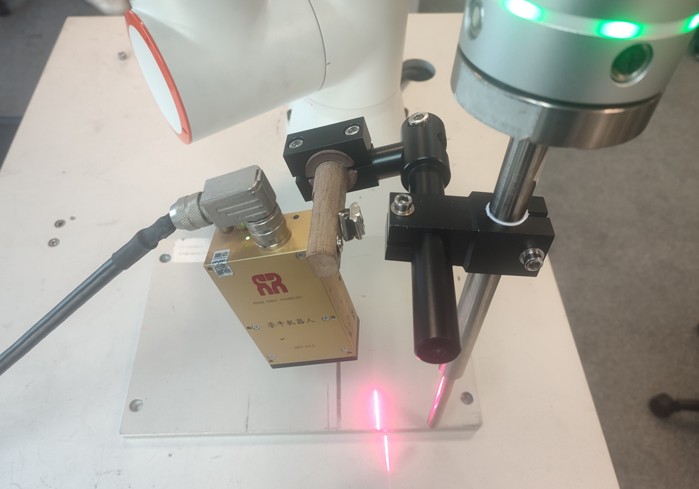

.. centered:: Schemat 8.8‑1 Instalacja czujnika laserowego

W sekcji konfiguracji komunikacji wprowadź adres IP i numer portu czujnika. Kliknij przycisk „Konfiguruj”. Domyślny okres próbkowania to 25. Wybierz układ współrzędnych jako „Układ współrzędnych płaszczyzny lasera”. Wybierz odpowiedni protokół komunikacji zgodnie z modelem czujnika. Kliknij przycisk „Załaduj”.

.. figure:: robot_peripherals/141.png
   :align: center
   :width: 4in

.. centered:: Schemat 8.8‑2 Konfiguracja czujnika laserowego

W sekcji „Test czujnika śledzącego” kolejno kliknij „Włącz” i „Wyłącz” czujnik. Obserwuj, czy laser czujnika włącza się i wyłącza. Jeśli laser włącza się i wyłącza normalnie, oznacza to, że komunikacja między robotem a czujnikiem została prawidłowo nawiązana. W przeciwnym razie sprawdź, czy parametry, takie jak adres IP i numer portu, są prawidłowe, oraz czy połączenie sieciowe między czujnikiem a robotem jest prawidłowe.

.. centered:: Schemat 8.8‑3 Test komunikacji czujnika laserowego

Kalibracja czujnika
~~~~~~~~~~~~~~~~~~~

Przed użyciem czujnika laserowego należy go skalibrować. Dokładność kalibracji bezpośrednio wpływa na dokładność śledzenia czujnika laserowego. Metody kalibracji czujnika laserowego to metoda pięciu punktów, metoda sześciu punktów i metoda ośmiu punktów. Na przykładzie najczęściej używanej w scenariuszach spawania metody pięciu punktów, jej zasada polega na najpierw skierowaniu narzędzia (palnika spawalniczego) na stały punkt kalibracyjny (jak na rysunku 4), a następnie naświetleniu i rozpoznaniu tego punktu przez czujnik laserowy z czterech różnych pozycji.

.. note::
  Ten punkt kalibracyjny musi być dokładnie rozpoznawalny przez czujnik laserowy, w przeciwnym razie kalibracja nie będzie precyzyjna.

Następnie obliczana jest pozycja i orientacja współrzędnych czujnika. Poniżej szczegółowo opisano proces kalibracji:

.. figure:: robot_peripherals/143.png
   :align: center
   :width: 4in

.. centered:: Schemat 8.8‑4 Punkt kalibracyjny czujnika laserowego

**Krok 1**: Otwórz WebApp robota, kolejno kliknij „Ustawienia początkowe” -> „Podstawowe” -> „Współrzędne narzędzia”, aby przejść do interfejsu układu współrzędnych narzędzia. Wybierz nieużywany układ współrzędnych narzędzia, kliknij, aby zmienić jego nazwę na „Palnik spawalniczy”. Ustaw typ narzędzia jako „Narzędzie”, a pozycję montażu jako „Końcówka”.

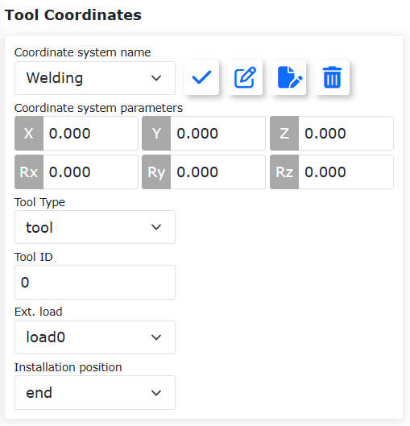

.. centered:: Schemat 8.8‑5 Ustawienie układu współrzędnych „Palnik spawalniczy”

Ponownie wybierz nieużywany układ współrzędnych, zmień jego nazwę na „Czujnik laserowy”. Wybierz typ narzędzia jako „Czujnik”, a pozycję montażu jako „Końcówka”.

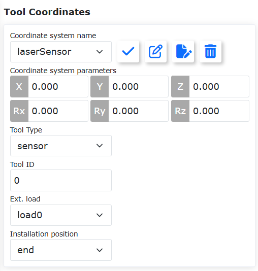

.. centered:: Schemat 8.8‑6 Ustawienie układu współrzędnych „Czujnik laserowy”

**Krok 2**: Skalibruj układ współrzędnych narzędzia palnika spawalniczego za pomocą metody sześciu punktów: Wybierz układ współrzędnych „Palnik spawalniczy”, kliknij przycisk modyfikacji i użyj metody sześciu punktów do kalibracji układu współrzędnych narzędzia palnika (szczegółowa metoda kalibracji znajduje się w dokumentacji FANUC, nie będzie tutaj powtarzana).

.. figure:: robot_peripherals/146.png
   :align: center
   :width: 4in

.. centered:: Schemat 8.8‑7 Kalibracja układu współrzędnych „Palnik spawalniczy”

**Krok 3**: W „Ustawieniach układu współrzędnych narzędzia” wybierz układ współrzędnych 0 (układ bazowy). Domyślna nazwa to „toolcoord0”. Kliknij „Zastosuj”, aby przełączyć bieżący układ współrzędnych na układ bazowy.

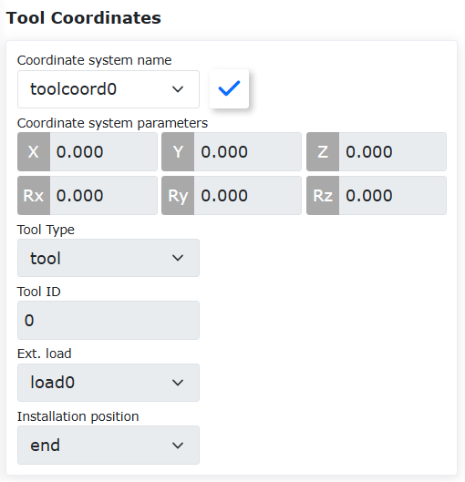

.. centered:: Schemat 8.8‑8 Kalibracja czujnika krok 1

**Krok 4**: Ponownie wybierz wcześniej ustawiony układ współrzędnych „Czujnik laserowy” (nie klikaj „Zastosuj”). Kliknij przycisk „Edytuj”. Wybierz typ narzędzia jako „Czujnik”. Czujnik jest zamocowany na „Końcówce robota”. Wybierz metodę kalibracji jako „Metoda pięciu punktów”.

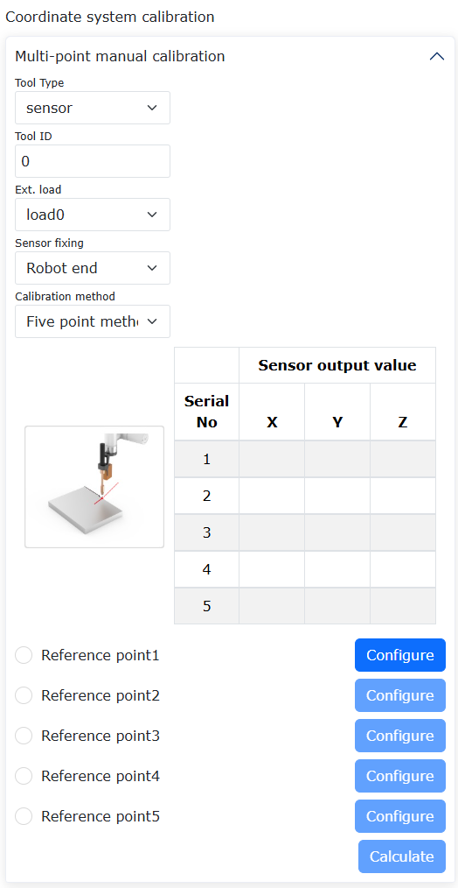

.. centered:: Schemat 8.8‑9 Kalibracja czujnika krok 2

**Krok 5**: Przeciągnij robota, aby skierować czubek palnika spawalniczego na punkt kalibracyjny. Wybierz układ współrzędnych „Palnik spawalniczy”. Kliknij „Zastosuj”. Kliknij „Ustaw punkt 1”, jak na rysunku 13.

.. figure:: robot_peripherals/149.png
   :align: center
   :width: 4in

.. centered:: Schemat 8.8‑10 Kalibracja czujnika krok 3

.. figure:: robot_peripherals/150.png
   :align: center
   :width: 4in

.. centered:: Schemat 8.8‑11 Kalibracja czujnika krok 4

**Krok 6**: Ponownie wybierz układ współrzędnych 0 („toolcoord0”). Następnie wybierz układ współrzędnych „Czujnik” (nie klikaj „Zastosuj”), aby kontynuować kalibrację.

.. centered:: Schemat 8.8‑12 Kalibracja czujnika krok 5

.. centered:: Schemat 8.8‑13 Kalibracja czujnika krok 6

**Krok 7**: Przesuń czujnik laserowy, aby laser właśnie skanował punkt kalibracyjny. Kliknij „Ustaw punkt 2”. W tym momencie wartości wyjściowe czujnika po lewej stronie, w odpowiedniej pozycji numeru sekwencji, wyświetlą bieżące dane czujnika. Jeśli dane są prawidłowe, oznacza to, że bieżący punkt kalibracyjny został pomyślnie ustawiony. W przeciwnym razie należy go ponownie skalibrować.

.. figure:: robot_peripherals/151.png
   :align: center
   :width: 4in

.. centered:: Schemat 8.8‑14 Kalibracja czujnika krok 7

.. figure:: robot_peripherals/152.png
   :align: center
   :width: 4in

.. centered:: Schemat 8.8‑15 Kalibracja czujnika krok 8

**Krok 8**: Kolejno spowoduj, aby laser naświetlił punkt kalibracyjny z trzech różnych pozycji. Kliknij odpowiednio „Ustaw punkt 3”, „Ustaw punkt 4” i „Ustaw punkt 5”. Na koniec, upewniając się, że dane dla każdego punktu są prawidłowe, kliknij przycisk „Oblicz”.

.. figure:: robot_peripherals/153.png
   :align: center
   :width: 4in

.. centered:: Schemat 8.8‑16 Kalibracja czujnika krok 9

**Krok 9**: W tym momencie WebApp wyświetla wyniki kalibracji czujnika i dokładność kalibracji. Kliknij przycisk „Zastosuj”, aby zakończyć kalibrację czujnika laserowego. Jeśli dokładność kalibracji jest zbyt niska, możesz kliknąć przycisk „Anuluj” i ponownie przeprowadzić kalibrację.

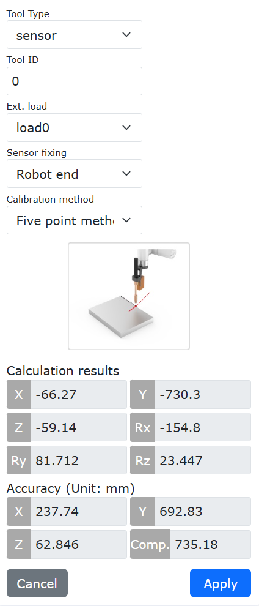

.. centered:: Schemat 8.8‑17 Dokładność kalibracji czujnika

Zastosowanie czujnika laserowego
~~~~~~~~~~~~~~~~~~~~~~~~~~~~~~~~

Przed użyciem czujnika laserowego najpierw zastosuj układ współrzędnych narzędzia „Palnik spawalniczy” jako bieżący układ współrzędnych narzędzia.

.. centered:: Schemat 8.8‑18 Zastosowanie układu współrzędnych palnika spawalniczego

Punkty nauczania czujnika laserowego
++++++++++++++++++++++++++++++++++++

Przeciągnij robota, aby wiązka lasera czujnika laserowego wskazywała pożądany punkt spoiny do nauczania. W WebApp wybierz czujnik jako „Czujnik laserowy”. Wprowadź nazwę punktu czujnika jako „laserPt”. Kliknij przycisk „Dodaj”. Utwórz nowy program użytkownika „testLaser.lua”. Utwórz instrukcję ruchu PTP, wybierz punkt docelowy jako „laserPt”. Wykonaj tę instrukcję pojedynczo. W tym momencie palnik spawalniczy przesunie się do punktu wskazywanego wcześniej przez czujnik laserowy.

.. figure:: robot_peripherals/155.png
   :align: center
   :width: 4in

.. centered:: Schemat 8.8‑19 Punkt spoiny czujnika laserowego

.. figure:: robot_peripherals/156.png
   :align: center
   :width: 6in

.. centered:: Schemat 8.8‑20 Nauczanie punktu czujnika

.. figure:: robot_peripherals/157.png
   :align: center
   :width: 4in

.. centered:: Schemat 8.8‑21 Palnik spawalniczy wskazujący punkt spoiny

Lokalizacja laserowa + śledzenie
++++++++++++++++++++++++++++++++

Wykonanie przez robota współpracującego funkcji lokalizacji laserowej + śledzenia laserowego wymaga następujących kroków:

(1) Robot przemieszcza się do pewnego punktu na zewnątrz spoiny;

(2) Rozpoczyna się lokalizacja laserowa, a robot z czujnikiem laserowym przemieszcza się w kierunku spoiny;

(3) Czujnik laserowy rozpoznaje spoinę, a robot przesuwa palnik spawalniczy do rozpoznanego punktu spoiny;

(4) Rozpoczyna się śledzenie laserowe, jednocześnie robot przemieszcza się w kierunku końca spoiny, a czujnik laserowy rejestruje pozycję w czasie rzeczywistym podczas ruchu;

(5) Palnik spawalniczy porusza się zgodnie z pozycjami zarejestrowanymi przez czujnik laserowy, realizując efekt śledzenia.

Przed debugowaniem lokalizacji i śledzenia upewnij się, że czujnik jest prawidłowo zamocowany, układ współrzędnych narzędzia „Palnik spawalniczy” został prawidłowo skalibrowany, a czujnik laserowy również został prawidłowo skalibrowany. Zakładając, że zielona linia prosta na rysunku jest spoiną do zespawania, aby robot automatycznie znalazł punkt początkowy spawania A i automatycznie zespawał do punktu B, należy napisać następujące instrukcje:

.. figure:: robot_peripherals/158.png
   :align: center
   :width: 4in

.. centered:: Schemat 8.8‑22 Instalacja czujnika

Pisanie instrukcji lokalizacji
******************************

Utwórz nowy program użytkownika „laserTrack.lua”. Wybierz „Instrukcje spawania”. Kliknij „Śledzenie laserowe”. Pojawi się strona dodawania instrukcji śledzenia laserowego.

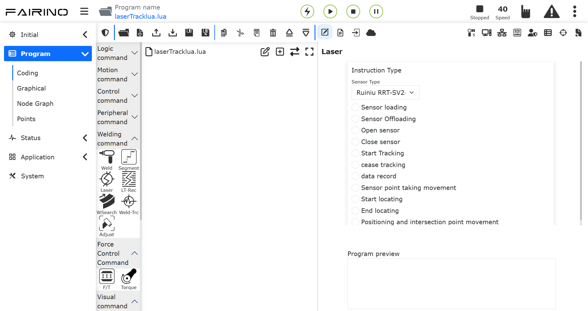

.. centered:: Schemat 8.8‑23 Instrukcja śledzenia laserowego

Znajdź „Polecenie lokalizacji”. Wybierz nazwę układu współrzędnych jako „Czujnik laserowy”. Wybór kierunku „+x” oznacza, że robot z czujnikiem laserowym będzie przemieszczał się z bieżącej pozycji w kierunku „+x” układu współrzędnych „Palnik spawalniczy”, jednocześnie szukając spoiny. „Prędkość” to prędkość ruchu czujnika laserowego podczas lokalizacji. „Długość” to maksymalna długość lokalizacji czujnika laserowego. Jeśli robot przekroczy tę długość podczas lokalizacji i nadal nie znajdzie spoiny, robot zgłosi błąd. Podobnie, „Maksymalny czas lokalizacji” – jeśli robot przekroczy ten czas i nadal nie znajdzie spoiny, zgłosi błąd. Wprowadź prawidłowo powyższe parametry zgodnie z rzeczywistym scenariuszem. Kolejno kliknij instrukcje „Rozpocznij lokalizację” i „Zakończ lokalizację”, a następnie kliknij przycisk „Zastosuj”.

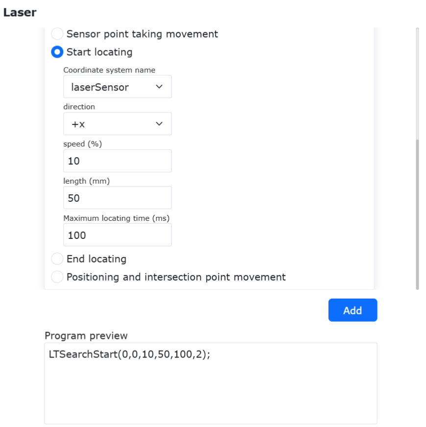

.. centered:: Schemat 8.8‑24 Dodawanie instrukcji lokalizacji

W tym momencie do „laserTrack.lua” zostaną dodane odpowiednie instrukcje rozpoczęcia i zakończenia lokalizacji laserowej.

.. figure:: robot_peripherals/161.png
   :align: center
   :width: 6in

.. centered:: Schemat 8.8‑25 Program lokalizacji

Pisanie instrukcji ruchu do punktu lokalizacji
***********************************************

Dodaj instrukcję ruchu liniowego LIN, wybierając punkt docelowy jako „seamPos”. Jest to punkt lokalizacji czujnika laserowego.

.. note:: „Punkt seamPos” to nazwa punktu w systemie robota przeznaczona specjalnie do lokalizacji czujnika laserowego. Nie wymaga nauczania tego punktu. Czujnik laserowy po lokalizacji automatycznie zapisze informacje o punkcie lokalizacji w „punkcie seamPos”.

Punkt lokalizacji może być przesunięty. Typy przesunięcia można wybrać jako „Przesunięcie względem układu bazowego”, „Przesunięcie względem układu narzędzia” i „Przesunięcie względem surowych danych lasera”.

.. figure:: robot_peripherals/162.png
   :align: center
   :width: 6in

.. centered:: Schemat 8.8‑26 Opcje przesunięcia lokalizacji

Gdy funkcja przesunięcia lokalizacji jest włączona, można ustawić parametry przesunięcia. „dx” oznacza odległość przesunięcia w kierunku x wybranego układu współrzędnych. „drx” oznacza kąt obrotu wokół osi x wybranego układu współrzędnych. Kliknij przycisk „Dodaj”, a następnie kliknij „Zastosuj”.

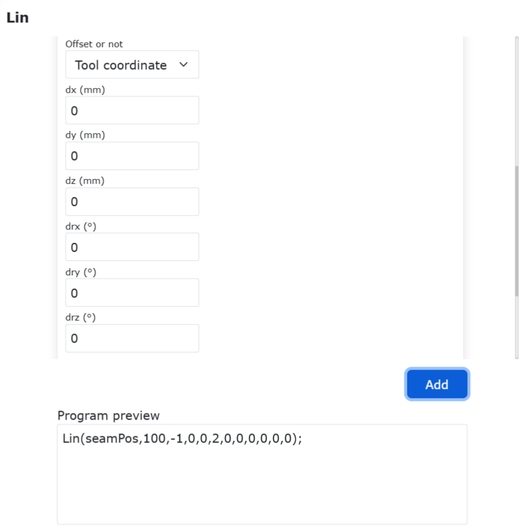

.. centered:: Schemat 8.8‑27 Ustawienia parametrów przesunięcia lokalizacji

W tym momencie do „testTrack.lua” zostanie dodana instrukcja ruchu do punktu lokalizacji, jak poniżej.

.. figure:: robot_peripherals/164.png
   :align: center
   :width: 6in

.. centered:: Schemat 8.8‑28 Program przesunięcia lokalizacji

Pisanie instrukcji śledzenia laserowego
***************************************

Ponownie otwórz stronę dodawania instrukcji „Śledzenie laserowe”. Kolejno kliknij przyciski „Rozpocznij śledzenie” i „Zatrzymaj śledzenie”. Na koniec kliknij przycisk „Zastosuj” na dole strony.

.. figure:: robot_peripherals/165.png
   :align: center
   :width: 6in

.. centered:: Schemat 8.8‑29 Rozpoczęcie i zatrzymanie śledzenia laserowego

Bieżący program użytkownika „testTrack.lua”:

.. figure:: robot_peripherals/166.png
   :align: center
   :width: 6in

.. centered:: Schemat 8.8‑30 Program śledzenia laserowego

Pisanie instrukcji punktu początkowego lokalizacji i punktu końcowego śledzenia
*******************************************************************************

Przed rozpoczęciem lokalizacji laserowej należy określić punkt początkowy lokalizacji. Robot najpierw przemieszcza się do punktu początkowego lokalizacji, a następnie szuka spoiny w określonym kierunku i z określoną prędkością. Naucz punkt początkowy lokalizacji „seamStartPt” w pobliżu punktu początkowego A spoiny, w miejscu, gdzie wiązka czujnika laserowego jest blisko. Upewnij się, że punkt początkowy lokalizacji i kierunek lokalizacji są zgodne, aby robot mógł znaleźć pozycję spoiny w ustawionej odległości i maksymalnym czasie lokalizacji.

.. figure:: robot_peripherals/167.png
   :align: center
   :width: 4in

.. centered:: Schemat 8.8‑31 Punkt początkowy lokalizacji

Naucz punkt końcowy śledzenia „trackEndPt” na końcu spoiny.

.. figure:: robot_peripherals/168.png
   :align: center
   :width: 4in

.. centered:: Schemat 8.8‑32 Punkt końcowy lokalizacji

Dodaj powyższe dwa punkty do programu użytkownika „testTrack.lua”. Ostateczny program użytkownika jest następujący:

.. figure:: robot_peripherals/169.png
   :align: center
   :width: 6in

.. centered:: Schemat 8.8‑33 Program lokalizacji i śledzenia

Pisanie instrukcji związanych ze spawaniem
******************************************

Na koniec dodaj instrukcje spawania między punktem lokalizacji spawania „seampos” a punktem „trackEndPt”. Ostateczny program jest następujący:

.. figure:: robot_peripherals/170.png
   :align: center
   :width: 6in

.. centered:: Schemat 8.8‑34 Program spawania z lokalizacją i śledzeniem

Wykonując powyższy program, robot z czujnikiem laserowym rozpocznie ruch lokalizacyjny od punktu początkowego lokalizacji. Po znalezieniu spoiny robot natychmiast przemieszcza się do punktu początkowego spoiny i wykonuje operację rozpoczęcia łuku. Po pomyślnym rozpoczęciu łuku, robot przemieszcza się w kierunku końca spoiny i śledzi trajektorię spoiny podczas ruchu. Po osiągnięciu końca spoiny robot zatrzymuje spawanie.

Rejestracja trajektorii laserowej + odtwarzanie trajektorii
+++++++++++++++++++++++++++++++++++++++++++++++++++++++++++

Przepływ pracy rejestracji trajektorii laserowej + odtwarzania trajektorii jest następujący:

(1) Robot z czujnikiem laserowym porusza się wzdłuż spoiny po określonej trajektorii. Czujnik laserowy rejestruje dane trajektorii pozycji spoiny w czasie rzeczywistym podczas ruchu;

(2) Po zakończeniu rejestracji trajektorii, robot przemieszcza się do punktu początkowego zarejestrowanej trajektorii;

(3) Robot porusza się po trajektorii zarejestrowanej przez czujnik laserowy, odtwarzając ją.

Pisanie instrukcji rejestracji trajektorii robota
*************************************************

Utwórz nowy program użytkownika „testRecord.lua”. Kliknij „Rejestracja laserowa”, aby otworzyć stronę dodawania instrukcji rejestracji laserowej. Znajdź „Rejestracja danych spoiny”. Wybierz „Rozpocznij rejestrację”, kliknij „Dodaj”. Wybierz „Zatrzymaj rejestrację”, ponownie kliknij „Dodaj”. Na koniec kliknij przycisk „Zastosuj”.

.. figure:: robot_peripherals/171.png
   :align: center
   :width: 6in

.. centered:: Schemat 8.8‑35 Rejestracja laserowa

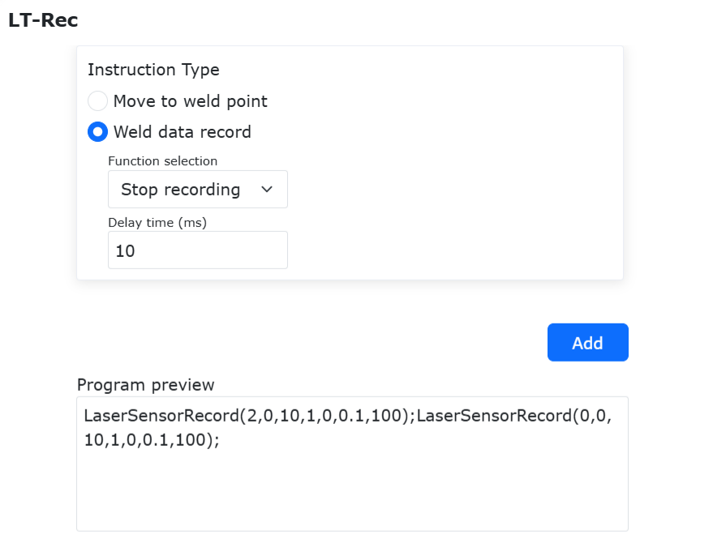

.. centered:: Schemat 8.8‑36 Rozpoczęcie i zatrzymanie rejestracji

Na stronie pojawią się instrukcje rozpoczęcia i zatrzymania rejestracji trajektorii.

.. figure:: robot_peripherals/173.png
   :align: center
   :width: 6in

.. centered:: Schemat 8.8‑37 Program rejestracji trajektorii

Zakładając, że zielony odcinek AB na rysunku jest spoiną, skieruj wiązkę lasera odpowiednio na punkt początkowy A spoiny i punkt przerwania B spoiny. Naucz punkt początkowy rejestracji trajektorii „recordStartPt” i punkt końcowy „recordEndPt”.

.. figure:: robot_peripherals/174.png
   :align: center
   :width: 4in

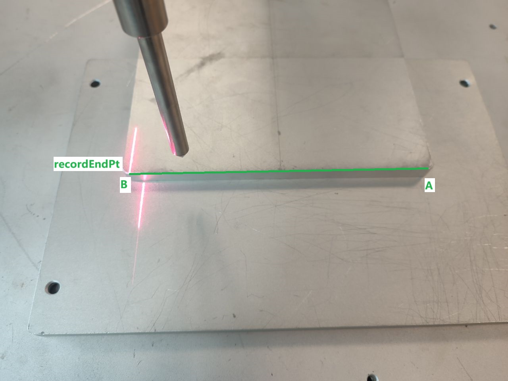

.. centered:: Schemat 8.8‑38 Punkt początkowy i końcowy rejestracji trajektorii

Dodaj dwie instrukcje ruchu liniowego (LIN) do „testRecord.lua”: odpowiednio do punktu początkowego rejestracji trajektorii „recordStartPt” i punktu końcowego „recordEndPt”. Dostosuj pozycje instrukcji, aby robot wykonał następujące operacje: najpierw przemieszcza się do punktu „recordStartPt”, rozpoczyna rejestrację trajektorii, przemieszcza się do punktu „recordEndPt”, zatrzymuje rejestrację trajektorii.

.. figure:: robot_peripherals/176.png
   :align: center
   :width: 6in

.. centered:: Schemat 8.8‑39 Program rejestracji trajektorii

Pisanie instrukcji ruchu robota do punktu początkowego rejestracji trajektorii
******************************************************************************

Kliknij „Rejestracja laserowa”, aby otworzyć stronę dodawania instrukcji rejestracji laserowej. Znajdź sekcję „Ruch do punktu spoiny”. Wybierz sposób ruchu jako PTP, wprowadź pewną prędkość ruchu. Kliknij „Ruch do punktu początkowego”, a następnie kliknij „Zastosuj”.

.. figure:: robot_peripherals/177.png
   :align: center
   :width: 6in

.. centered:: Schemat 8.8‑40 Ruch do punktu początkowego trajektorii

W tym momencie program użytkownika „testRecord.lua” jest następujący:

.. figure:: robot_peripherals/178.png
   :align: center
   :width: 6in

.. centered:: Schemat 8.8‑41 Program ruchu do punktu początkowego trajektorii

Pisanie instrukcji odtwarzania trajektorii czujnika laserowego
**************************************************************

Kliknij „Rejestracja laserowa”, aby otworzyć stronę dodawania instrukcji rejestracji laserowej. Znajdź „Rejestracja danych spoiny”. Wybierz „Odtwarzanie trajektorii”, kliknij „Dodaj”. Kliknij przycisk „Odtwarzanie śledzenia laserowego”. Na koniec kliknij „Zastosuj”.

.. figure:: robot_peripherals/179.png
   :align: center
   :width: 6in

.. centered:: Schemat 8.8‑42 Odtwarzanie trajektorii

Program po dodaniu jest następujący:

.. figure:: robot_peripherals/180.png
   :align: center
   :width: 6in

.. centered:: Schemat 8.8‑43 Program odtwarzania trajektorii

Pisanie instrukcji związanych ze spawaniem
******************************************

Na koniec dodaj instrukcje rozpoczęcia i zakończenia spawania przed rozpoczęciem i po zakończeniu odtwarzania trajektorii:

.. figure:: robot_peripherals/181.png
   :align: center
   :width: 6in

.. centered:: Schemat 8.8‑44 Program spawania z rejestracją i odtwarzaniem trajektorii

Wykonując powyższy program, robot z czujnikiem laserowym najpierw porusza się wzdłuż trajektorii spoiny, rejestrując całą trajektorię. Następnie robot przemieszcza się do punktu początkowego zarejestrowanej trajektorii. Robot rozpoczyna łuk i zaczyna spawać wzdłuż trajektorii zarejestrowanej przez czujnik laserowy. Po zakończeniu odtwarzania trajektorii, łuk spawania gaśnie, kończąc spawanie.

Dostosowanie czujnika laserowego do otwartego protokołu urządzeń peryferyjnych sterownika
~~~~~~~~~~~~~~~~~~~~~~~~~~~~~~~~~~~~~~~~~~~~~~~~~~~~~~~~~~~~~~~~~~~~~~~~~~~~~~~~~~~~~~~~~~~~~~~~

**Krok 1**: Jeśli potrzebujesz użyć „Połączenia przez otwarty protokół” i „Sterowania czujnikiem laserowym”, w konfiguracji śledzenia czujnika wybierz opcję „Typ protokołu” jako „Otwarty protokół urządzeń peryferyjnych”. Jeśli używasz oryginalnego rozwiązania, wybierz „Urządzenia dostosowane”. W interfejsie czujnika śledzącego skonfiguruj i załaduj urządzenie peryferyjne lasera.

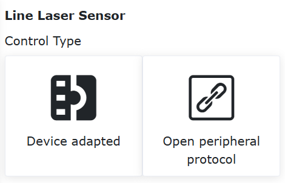

.. centered:: Schemat 8.8‑45 Interfejs konfiguracji „Połączenia przez otwarty protokół” i „Sterowania czujnikiem laserowym”

**Krok 2**: Kliknij „Otwarty protokół urządzeń peryferyjnych”, aby przejść do interfejsu. W „Ustawieniach otwartego protokołu” prześlij otwarty protokół urządzeń peryferyjnych odpowiadający czujnikowi laserowemu. Po pomyślnym przesłaniu wybierz numer protokołu i nazwę przesłanego pliku. Kliknij Konfiguruj. W sekcji „Operacje i stan urządzenia” uruchom przesłany czujnik laserowy, aby nawiązać połączenie z odpowiednim czujnikiem laserowym.

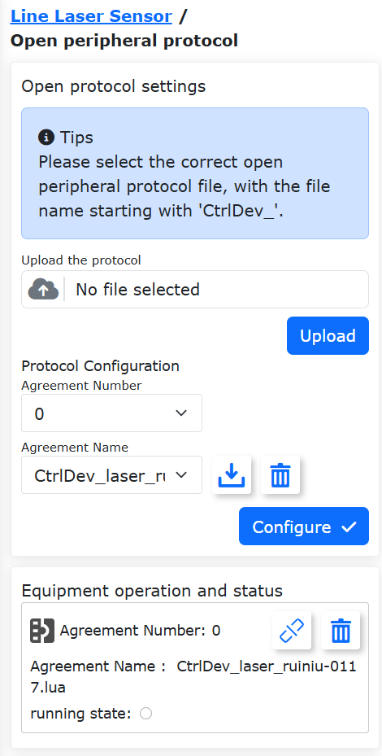

.. centered:: Schemat 8.8‑46 Nawiązywanie połączenia z czujnikiem laserowym

Szlifowanie
------------

W interfejsie „Ustawienia początkowe” -> „Urządzenia peryferyjne” -> „Szlifowanie” można obecnie używać szlifowania za pomocą „Urządzeń dostosowanych” i „Otwartego protokołu urządzeń peryferyjnych”.

.. figure:: robot_peripherals/184.png
   :align: center
   :width: 4in

.. centered:: Schemat 8.9-1 Strona konfiguracji stanu szlifowania

Urządzenia dostosowane
~~~~~~~~~~~~~~~~~~~~~~

**Konfiguracja i ładowanie komunikacji**: Skonfiguruj informacje komunikacyjne. Należy skonfigurować adres IP, port, okres próbkowania i protokół komunikacji. Za pomocą przycisków Załaduj / Zwolnij nawiąż komunikację z urządzeniem szlifującym.

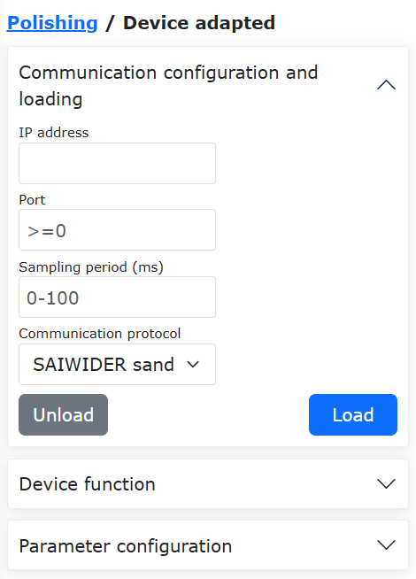

.. centered:: Schemat 8.9-2 Konfiguracja i ładowanie komunikacji

**Funkcje urządzenia**: Można wykonywać operacje takie jak włączanie urządzenia, czyszczenie błędów i zerowanie czujnika siły.

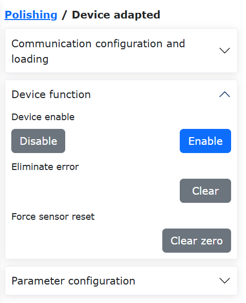

.. centered:: Schemat 8.9-3 Funkcje urządzenia

**Konfiguracja parametrów**: Można ustawić prędkość obrotową urządzenia szlifującego, siłę kontaktu, wysunięcie i tryb sterowania. Po pomyślnym ustawieniu, odpowiednie dane i stan zostaną wyświetlone w pasku zwrotnym stanu „Polish” po prawej stronie.

.. figure:: robot_peripherals/187.png
   :align: center
   :width: 4in

.. centered:: Schemat 8.9-4 Konfiguracja parametrów

.. figure:: robot_peripherals/188.png
   :align: center
   :width: 4in

.. centered:: Schemat 8.9-5 Konfiguracja parametrów

Otwarty protokół urządzeń peryferyjnych
~~~~~~~~~~~~~~~~~~~~~~~~~~~~~~~~~~~~~~~

Kliknij „Otwarty protokół urządzeń peryferyjnych”, aby przejść do interfejsu. W „Ustawieniach otwartego protokołu” prześlij otwarty protokół urządzeń peryferyjnych odpowiadający szlifowaniu. Po pomyślnym przesłaniu wybierz numer protokołu i nazwę przesłanego pliku. Kliknij Konfiguruj. W sekcji „Operacje i stan urządzenia” uruchom przesłany otwarty protokół urządzeń peryferyjnych szlifowania, aby nawiązać połączenie z odpowiednim urządzeniem szlifującym.

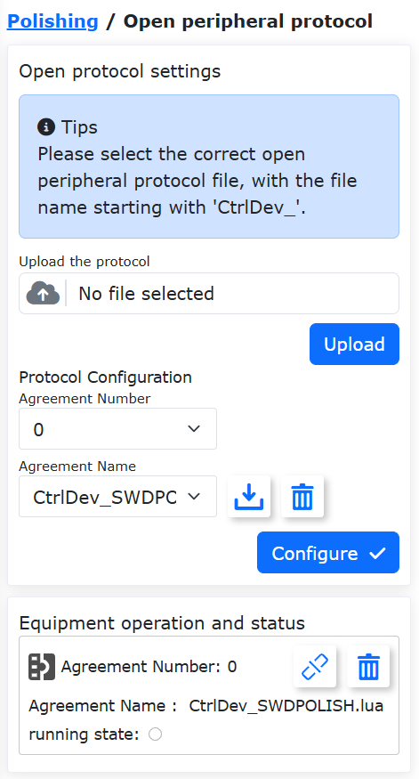

.. centered:: Schemat 8.9‑6 Nawiązywanie połączenia z czujnikiem laserowym

Czujnik pomocniczy
------------------

W interfejsie „Ustawienia początkowe” -> „Urządzenia peryferyjne” -> „Czujnik pomocniczy” można obecnie używać go za pomocą „Urządzeń dostosowanych”. Funkcja niestandardowego protokołu nie jest jeszcze dostępna.

.. figure:: robot_peripherals/190.png
   :align: center
   :width: 4in

.. centered:: Schemat 8.10‑1 Czujnik pomocniczy -- Urządzenia dostosowane

Urządzenia dostosowane
~~~~~~~~~~~~~~~~~~~~~~

Kliknij „Urządzenia dostosowane”, aby przejść do interfejsu konfiguracji czujnika pomocniczego.

Informacje konfiguracyjne czujnika pomocniczego dzielą się na producenta, typ, wersję oprogramowania i lokalizację montażu. Użytkownik może skonfigurować odpowiednie informacje o czujniku pomocniczym zgodnie z konkretnymi potrzebami produkcyjnymi.

Jeśli użytkownik chce zmienić konfigurację, może najpierw wybrać odpowiedni numer czujnika pomocniczego, kliknąć przycisk „Wyczyść”, aby wyczyścić odpowiedni przycisk, a następnie ponownie skonfigurować zgodnie z potrzebami;

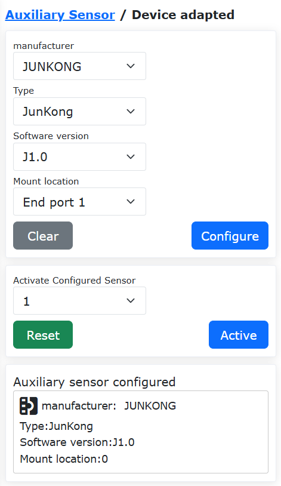

.. centered:: Schemat 8.10‑2 Czujnik pomocniczy -- Urządzenia dostosowane

Urządzenie kombinowane (SmartTool + czujnik siły)
-------------------------------------------------

W interfejsie „Ustawienia początkowe” -> „Urządzenia peryferyjne” -> „Urządzenie kombinowane” można obecnie używać go za pomocą „Urządzeń dostosowanych”. Niestandardowy protokół nie jest jeszcze dostępny.

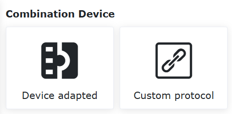

.. centered:: Schemat 8.11-1 Urządzenie kombinowane

Urządzenia dostosowane
~~~~~~~~~~~~~~~~~~~~~~

Kliknij „Urządzenia dostosowane”, aby przejść do interfejsu konfiguracji.

Informacje konfiguracyjne dzielą się na producenta, typ, wersję oprogramowania i lokalizację montażu. Różni producenci odpowiadają różnym typom. Obecnym producentem jest FR.

Użytkownik może skonfigurować odpowiednie informacje o urządzeniu zgodnie z konkretnymi potrzebami produkcyjnymi. Po pomyślnej konfiguracji wyświetlana jest tabela informacji o urządzeniu. Jeśli użytkownik chce zmienić konfigurację, może najpierw wybrać odpowiedni numer, kliknąć przycisk „Wyczyść”, aby wyczyścić odpowiednie informacje, a następnie ponownie skonfigurować informacje o urządzeniu zgodnie z potrzebami.

.. important:: 
  Przed kliknięciem „Wyczyść konfigurację” odpowiednie urządzenie powinno być w stanie nieaktywnym.

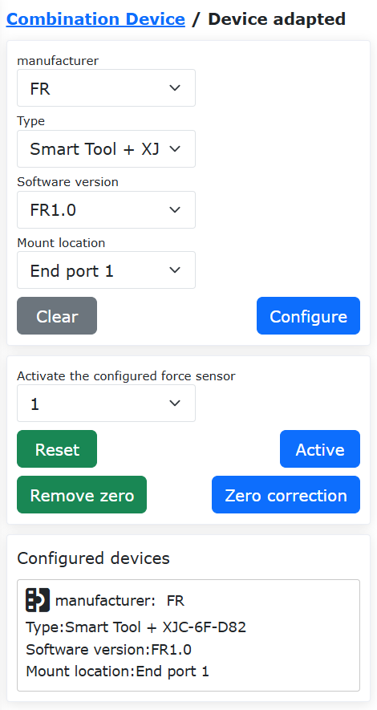

.. centered:: Schemat 8.11‑2 Urządzenia dostosowane

FR
++

Typ odpowiadający FR to „SmartTool” używany razem z czujnikiem siły. Robot współpracujący może dostosować się do trzech typów czujników siły: Xinjingcheng, NSR i Gangzhichuangxin. Podczas korzystania z różnych czujników wystarczy załadować odpowiedni protokół komunikacji, konkretnie:

- SmartTool + XJC-6F-D82 (Xinjingcheng).
- SmartTool + NSR-FT Sensor A (NSR).
- SmartTool + GZCX-6F-75A (Gangzhichuangxin).

1. Instalacja sprzętu

1) Rozłóż uchwyt SmartTool, wyjmij środkowe oprzyrządowanie i zamontuj je na końcówce robota. Po zamontowaniu oprzyrządowania złóż uchwyt SmartTool. Po pomyślnym złożeniu podłącz kabel łączący do końcówki robota.

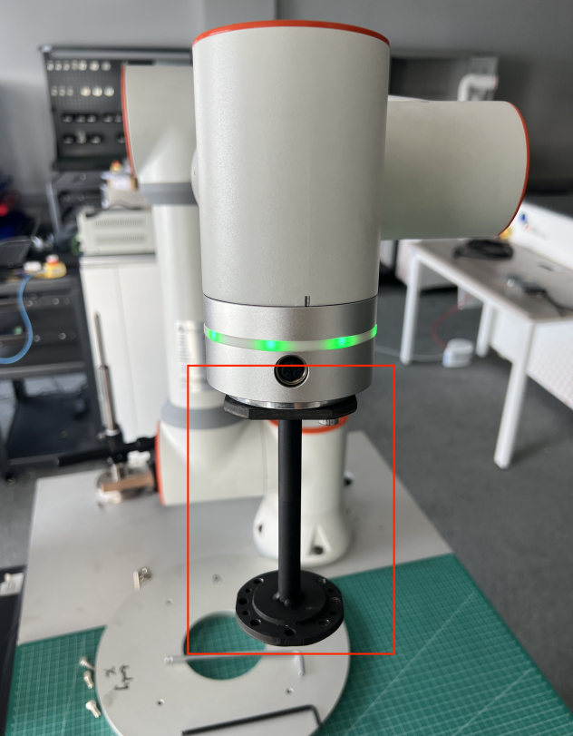

.. centered:: Schemat 8.11‑3 Instalacja środkowego oprzyrządowania uchwytu SmartTool

.. image:: robot_peripherals/195.png
   :width: 3in
   :align: center

.. centered:: Schemat 8.11‑4 Pomyślna instalacja uchwytu SmartTool

2) Po zainstalowaniu uchwytu SmartTool zamontuj czujnik siły (na przykładzie Gangzhichuangxin) na końcówce uchwytu SmartTool i podłącz kabel łączący do uchwytu SmartTool.

.. image:: robot_peripherals/196.png
   :width: 3in
   :align: center

.. centered:: Schemat 8.11‑5 Instalacja czujnika siły Gangzhichuangxin na końcówce uchwytu SmartTool

2. Konfiguracja urządzenia

.. important:: Upewnij się, że uchwyt SmartTool jest zamocowany na końcówce robota i prawidłowo podłączony do końcówki robota, a czujnik siły jest zamocowany na końcówce uchwytu SmartTool i prawidłowo podłączony do uchwytu SmartTool.

1) Skonfiguruj uchwyt SmartTool (patrz konfiguracja funkcji przycisków uchwytu spawalniczego).

2) Po zakończeniu konfiguracji funkcji przycisków uchwytu SmartTool skonfiguruj producenta jako „FR”. Wybierz „Typ”, „Wersję oprogramowania” i „Informacje o lokalizacji”. Kliknij przycisk „Konfiguruj”.

.. image:: robot_peripherals/197.png
   :width: 4in
   :align: center

.. centered:: Schemat 8.11‑6 Interfejs konfiguracji informacji o urządzeniu FR

3) Po pomyślnej konfiguracji informacji o urządzeniu wybierz skonfigurowany czujnik siły. Kliknij przycisk „Aktywuj”, aby aktywować czujnik siły. Po pomyślnej aktywacji kliknij przycisk „Korekcja zera”, aby wyzerować czujnik siły. Wyświetl dane w tabeli.

.. image:: robot_peripherals/198.png
   :width: 4in
   :align: center

.. centered:: Schemat 8.11‑7 Zerowanie czujnika siły

4) Zgodnie z obecnym montażem końcówki, skonfiguruj dane obciążenia w interfejsie „Obciążenie”. W interfejsie „Współrzędne narzędzia” skonfiguruj dane współrzędnych narzędzia, typ narzędzia i pozycję montażu.

.. image:: robot_peripherals/199.png
   :width: 4in
   :align: center

.. centered:: Schemat 8.11‑8 Konfiguracja „Obciążenia końcówki”

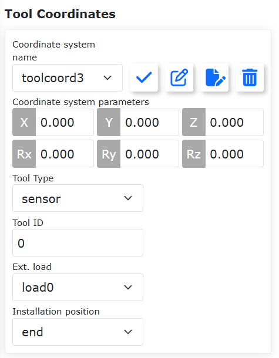

.. centered:: Schemat 8.11‑9 Konfiguracja „Współrzędnych narzędzia”

3. Zastosowanie

Po pomyślnej konfiguracji informacji o urządzeniu można niezależnie realizować funkcje przycisków SmartTool i funkcje czujnika siły, na przykład: pomiar wielkości siły i kierunku jej działania oraz blokowanie przeciągania wspomagane przez czujnik siły.

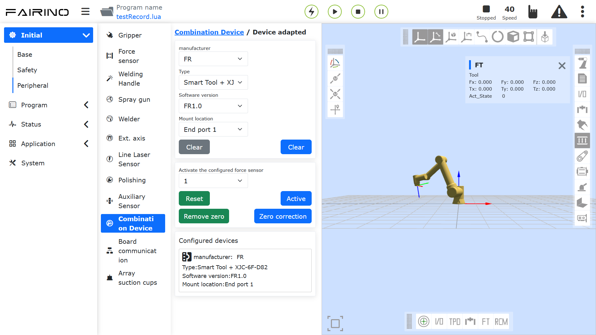

.. centered:: Schemat 8.11‑10 Pomiar wielkości siły i kierunku jej działania

Protokół Lua końcówki dla urządzenia kombinowanego
~~~~~~~~~~~~~~~~~~~~~~~~~~~~~~~~~~~~~~~~~~~~~~~~~~

Obecnie końcówka może obsługiwać zastosowanie protokołu kombinowanego dla dwóch urządzeń. Drugie urządzenie można podłączyć za pomocą rozdzielacza komunikacyjnego 1 na 2 lub poprzez interfejs SmartTool 485 firmy FANUC. Obecnie wbudowane domyślnie protokoły urządzeń kombinowanych obejmują: Junduo chwytak + Xinjingcheng czujnik siły, Junduo chwytak + Gangzhichuangxin czujnik siły, SmartTool + Junduo chwytak, SmartTool + Xinjingcheng czujnik siły, SmartTool + Gangzhichuangxin czujnik siły. Wbudowany protokół dla chwytaka + czujnika siły można wybrać w „Ustawienia początkowe”, „Urządzenia peryferyjne”, „Czujnik siły”. Wbudowany protokół dla SmartTool + chwytak lub czujnik siły można wybrać w „Ustawienia początkowe”, „Urządzenia peryferyjne”, „Uchwyt spawalniczy”.

Kroki operacyjne są następujące:

Otwórz WebApp, kolejno kliknij „Ustawienia początkowe”, „Urządzenia peryferyjne”, wybierz jeden typ urządzenia do kombinacji (np. uchwyt spawalniczy). Wybierz „Niestandardowy protokół”. Kliknij „Zarządzanie protokołami”, aby przejść do konfiguracji protokołu końcówki.

Obecnie wbudowane domyślnie protokoły urządzeń kombinowanych obejmują: Junduo chwytak + Xinjingcheng czujnik siły, SmartTool + Junduo chwytak, SmartTool + Xinjingcheng czujnik siły. Wbudowane protokoły urządzeń kombinowanych należą do niestandardowych protokołów użytkownika. Zaczynają się od „Custom_End” i można je pobierać i usuwać, jak pokazano na poniższym rysunku.

.. image:: robot_peripherals/282.png
   :width: 6in
   :align: center

.. centered:: Schemat 8.11‑11 Wbudowane domyślnie protokoły dla uchwytu spawalniczego

Przyssawka macierzowa
---------------------

Przegląd
~~~~~~~~

Zainstalowanie przyssawki macierzowej na końcówce robota może pomóc w szybkim wdrożeniu stanowisk do chwytania materiałów w różnych scenariuszach. Umożliwia dostosowanie liczby i rozmieszczenia przyssawek do różnych rozmiarów i kształtów materiałów, zwiększając wydajność i stabilność pracy.

Robot współpracujący obsługuje macierz przyssawek składającą się z maksymalnie 20 przyssawek. Można indywidualnie sterować chwytaniem i zwalnianiem każdej przyssawki, a także synchronizować działanie wszystkich przyssawek w całej podłączonej macierzy. Numer stacji podrzędnej każdej przyssawki można konfigurować w zakresie 1~20. Konfiguracja opiera się na oprogramowaniu DynamicLAB.

Opis sprzętu
++++++++++++

Robot współpracujący komunikuje się z macierzą przyssawek poprzez moduł Ethernet na 485. Na WebApp generowany jest protokół komunikacji dla macierzy przyssawek. Protokół wysyła dane sterujące przez TCP IP do modułu Ethernet na 485, który z kolei wysyła odebrane dane sterujące przez 485 do poszczególnych przyssawek, umożliwiając w ten sposób sterowanie macierzą przyssawek (powyższy format danych sterujących to format protokołu Modbus RTU).

Moduł Ethernet na 485 jest serwerem komunikacji Ethernet i masterem komunikacji 485. Każda przyssawka w macierzy jest slave'em komunikacji 485, a każda przyssawka powinna mieć skonfigurowany inny numer stacji podrzędnej.

.. figure:: robot_peripherals/202.png
   :align: center
   :width: 6in

.. centered:: Schemat 8.12-1 Zastosowanie przyssawki macierzowej robota współpracującego

Moduł Ethernet na 485 ma zwykle dwa porty TCPServer odpowiadające wielu portom slave 485. Na przykład w CH9121, port TCPServer 1 odpowiada portom slave 485 1-10, a port TCPServer 2 odpowiada portom slave 485 11-20. Robot nawiązuje dwa połączenia TCP z modułem Ethernet na 485, aby ostatecznie sterować odpowiednio 20 przyssawkami.

Powyższy moduł Ethernet na 485 wymaga następującej konfiguracji:

- ① Skonfiguruj stronę Ethernet jako TCPServer, adres IP: 192.168.58.10, numer portu dla portu 1: 50001, numer portu dla portu 2: 50002;
- ② Skonfiguruj stronę 485 z prędkością transmisji 115200, 8 bitami danych, 1 bitem stopu, bez parzystości. Moduł Ethernet na 485 jest zwykle wyposażony w oprogramowanie debugujące, w którym można przeprowadzić powyższą konfigurację. Poniższy rysunek przedstawia stronę narzędzia konfiguracyjnego dla modułu Ethernet na 485 modelu CH9121:

.. figure:: robot_peripherals/203.png
   :align: center
   :width: 6in

.. centered:: Schemat 8.12-2 Narzędzie debugowania modułu Ethernet na 485

Konfiguracja funkcji
~~~~~~~~~~~~~~~~~~~~

Otwórz WebApp, kolejno kliknij „Ustawienia początkowe” -> „Urządzenia peryferyjne” -> „Przyssawka macierzowa”. Tryby sterowania przyssawką macierzową to tryb unicast i tryb broadcast:

**Tryb unicast**: Protokół komunikacji zawiera treść komunikacji sterującej dla każdej przyssawki, umożliwiając niezależne sterowanie każdą przyssawką w macierzy.

**Tryb broadcast**: Generuje protokół komunikacji dla wszystkich przyssawek w macierzy, umożliwiając synchroniczne sterowanie chwytaniem i zwalnianiem wszystkich przyssawek w macierzy, ale nie pozwala na indywidualne sterowanie pojedynczą przyssawką.

W zależności od rzeczywistego scenariusza można skonfigurować tylko tryb unicast lub oba tryby jednocześnie (umożliwiając zarówno indywidualne sterowanie wybraną przyssawką, jak i synchroniczne sterowanie wszystkimi przyssawkami).

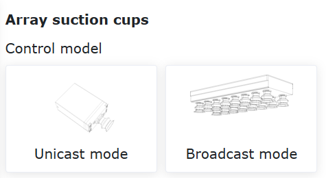

.. centered:: Schemat 8.12-3 Tryby sterowania przyssawką macierzową

Konfiguracja trybu unicast
++++++++++++++++++++++++++

Otwórz WebApp, kolejno kliknij „Ustawienia początkowe” -> „Urządzenia peryferyjne” -> „Przyssawka macierzowa” -> „Tryb unicast”. Sposoby konfiguracji protokołu w trybie unicast to „Konfiguracja automatyczna” i „Konfiguracja ręczna”:

.. figure:: robot_peripherals/205.png
   :align: center
   :width: 4in

.. centered:: Schemat 8.12-4 Tryb konfiguracji unicast

**Konfiguracja automatyczna**: Przesłanie istniejącego pliku protokołu bezpośrednio do sterownika robota. Istniejący plik protokołu może pochodzić z: ① pobrania z innego robota z już skonfigurowaną i przetestowaną przyssawką macierzową; ② napisania przez technika zgodnie z rzeczywistym scenariuszem (pisząc plik protokołu, użytkownik może uzyskać bardziej elastyczne i wydajne sterowanie przyssawką). Jeśli wiele urządzeń używa tej samej przyssawki macierzowej, przesłanie protokołu przez konfigurację automatyczną może przyspieszyć wdrożenie.

**Konfiguracja ręczna**: Konfiguracja protokołu komunikacji dla każdej przyssawki na podstawie ID stacji podrzędnej i poziomu próżni w macierzy. Kroki konfiguracji ręcznej są następujące:

Wybierz numer stacji podrzędnej 1. Wprowadź maksymalny poziom próżni, minimalny poziom próżni, czas timeoutu chwytania (czas timeoutu nie jest jeszcze dostępny). Kliknij przycisk „Konfiguruj”. W sekcji „Operacje i stan urządzenia” pojawi się protokół przyssawki o numerze protokołu 1. Jednocześnie na etykietach „Konfiguracja ręczna” i „Numer stacji podrzędnej” wyświetlą się wszystkie aktualnie skonfigurowane numery stacji podrzędnych.

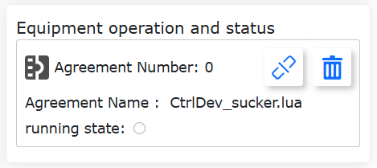

.. centered:: Schemat 8.12-5 Konfiguracja przyssawki w trybie unicast

Powtórz powyższe kroki, aby skonfigurować przyssawki z wieloma numerami stacji podrzędnych według potrzeb. Przy każdej konfiguracji przyssawki, system robota automatycznie aktualizuje treść protokołu komunikacji przyssawki odpowiadającego „Numerowi protokołu: 1”. Maksymalnie można skonfigurować 20 przyssawek. Po skonfigurowaniu wszystkich przyssawek kliknij przycisk „Połącz” w polu „Numer protokołu 1”. Komunikacja między robotem a przyssawkami rozpoczyna działanie, a wskaźnik „Stan działania” zaświeci się (uwaga: najpierw skonfiguruj wszystkie przyssawki z numerami stacji podrzędnych, a następnie kliknij przycisk „Połącz”. Po nawiązaniu komunikacji konfiguracja stacji podrzędnych przyssawek jest nieskuteczna).

Po pomyślnym nawiązaniu komunikacji między robotem a przyssawkami, w sekcji „Operacje i stan urządzenia” pojawi się lista pól operacyjnych dla wszystkich skonfigurowanych przyssawek. Na stronie pola operacyjnego dla przyssawki o każdym numerze stacji podrzędnej można przeprowadzać sterowanie przyssawką i monitorować jej stan (w tym „Stan chwytania”, „Bieżący poziom próżni”, „Ciśnienie przyssawki” itp.). Na poniższym rysunku skonfigurowane ID stacji podrzędnych przyssawek to odpowiednio 2 i 11.

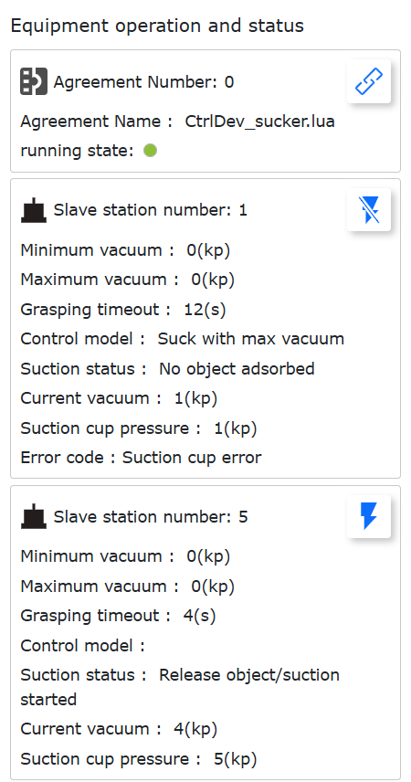

.. centered:: Schemat 8.12-6 Łączenie przyssawek w trybie unicast

W prawym górnym rogu pola sterowania przyssawką o numerze stacji podrzędnej 1 kliknij przycisk „Chwyć”. Przyssawka wykona czynność „Chwyć z ustawionym poziomem próżni”. W tym momencie przycisk „Chwyć” zmieni się na przycisk „Zwolnij”. Kliknij go ponownie, a przyssawka wykona czynność zwolnienia. Podczas wykonywania powyższych czynności przez przyssawkę, pozycje stanu, takie jak „Stan chwytania”, „Bieżący poziom próżni”, będą wyświetlać stan przyssawki w czasie rzeczywistym.

.. note:: Uwaga: Po skonfigurowaniu protokołu przyssawki i nawiązaniu połączenia, należy kliknąć przycisk „Chwyć”, aby aktywować tę przyssawkę. Jednocześnie można przetestować, czy komunikacja między robotem a przyssawką jest prawidłowa.

Jeśli połączenie między robotem a przyssawką nie powiedzie się, pole sterowania przyssawką nie zostanie wyświetlone, a wskaźnik stanu działania w „Numerze protokołu: 1” zgaśnie.

.. note:: Uwaga: Jeśli podczas użytkowania fizyczne połączenie komunikacyjne między przyssawką a modułem Ethernet na 485 zostanie rozłączone, a następnie ponownie podłączone, może się zdarzyć, że protokół nie będzie mógł nawiązać połączenia. W takim przypadku można odłączyć i ponownie podłączyć kabel sieciowy modułu Ethernet na 485, a następnie spróbować ponownie połączyć.

.. figure:: robot_peripherals/208.png
   :align: center
   :width: 4in

.. centered:: Schemat 8.12-7 Nieudane połączenie robota z przyssawką

Pobieranie protokołu w trybie unicast
+++++++++++++++++++++++++++++++++++++

Kliknij przycisk „Pobierz” w „Konfiguracji ręcznej”, aby pobrać protokół przyssawki na komputer lokalny. Protokół przyssawki to program LUA wykonywany cyklicznie. Program wykonuje następujące kroki w każdym cyklu:

- ① Odczytuje dane sterujące przyssawką z robota;
- ② Zapisuje dane sterujące do przyssawki przez socket;
- ③ Odczytuje dane stanu z przyssawki przez socket;
- ④ Przekazuje dane stanu przyssawki z powrotem do robota;

Cykliczne wykonywanie protokołu komunikacji umożliwia komunikację i sterowanie między robotem a przyssawką. W protokole komunikacji użytkownik może dostosować cykl pętli, adresy rejestrów danych sterujących i adresy rejestrów danych stanu. Może modyfikować treść tego protokołu zgodnie z rzeczywistą sytuacją. Poniżej przykładowy kod protokołu komunikacji przyssawki:

Przykładowy program protokołu przyssawki:

.. code-block:: console
    :linenos:

    local id = 1 
    local ctrlValues = {0, 0, 0, 0, 0, 0, 0, 0, 0, 0, 0, 0, 0, 0, 0, 0, 0, 0, 0, 0} 
    local realTimeState = {0, 0, 0, 0, 0, 0, 0, 0, 0, 0}
    local suckerConfig = {0, 0, 0, 0, 0, 0, 0, 0, 0, 0}
    clearSuckerState() 
    socket1 = TCPClientConnect('192.168.58.10', 50001, 500, 10, 2, 3)
    socket2 = TCPClientConnect('192.168.58.10', 50002, 500, 10, 2, 3)
    suckerConfig[1] = 30
    suckerConfig[2] = 20
    suckerConfig[3] = 100
    ModbusRTUOverTCPWriteMultiReg(socket1, 0, 0x0501, 3, suckerConfig)
    ModbusRTUOverTCPWriteMultiReg(socket2, 0, 0x0501, 3, suckerConfig)
    sleep_ms(10) 
    while(1) do
      setAllCtrl,ctrlValues[1],ctrlValues[2],ctrlValues[3],ctrlValues[4],ctrlValues[5],ctrlValues[6],ctrlValues[7],ctrlValues[8],ctrlValues[9], ctrlValues[10], ctrlValues[11], ctrlValues[12],ctrlValues[13],ctrlValues[14],ctrlValues[15],ctrlValues[16],ctrlValues[17],ctrlValues[18],ctrlValues[19], ctrlValues[20] = getSuckerCtrlState()
      if(setAllCtrl ~= 0) then 
        ModbusRTUOverTCPWriteSingleReg(socket1, 0, 0x0500, setAllCtrl) 
        ModbusRTUOverTCPWriteSingleReg(socket2, 0, 0x0500, setAllCtrl) 
        ctrlValues = {0, 0, 0, 0, 0, 0, 0, 0, 0, 0, 0, 0, 0, 0, 0, 0, 0, 0, 0, 0} 
        sleep_ms(1) 
      else 
        ModbusRTUOverTCPWriteSingleReg(socket1, 2, 0x0500, ctrlValues[2]) 
        ModbusRTUOverTCPWriteSingleReg(socket2, 11, 0x0500, ctrlValues[11])
      end 
      suckerState, pressValue, error, default1, default2 = ModbusRTUOverTCPReadReg(socket1, 2, 0x0600, 3) 
      realTimeState[1] = suckerState
      realTimeState[2] = pressValue 
      realTimeState[3] = error 
      ctrlState, maxPress, minPress, time, default2 = ModbusRTUOverTCPReadReg(socket1, 2, 0x0500, 4) 
      realTimeState[4] = ctrlState 
      realTimeState[5] = maxPress 
      realTimeState[6] = minPress 
      realTimeState[7] = time 
      setSuckerRealtimeState(2, realTimeState) 
      suckerState, pressValue, error, default1, default2 = ModbusRTUOverTCPReadReg(socket2, 11, 0x0600, 3) 
      realTimeState[1] = suckerState
      realTimeState[2] = pressValue 
      realTimeState[3] = error 
      ctrlState, maxPress, minPress, time, default2 = ModbusRTUOverTCPReadReg(socket2, 11, 0x0500, 4) 
      realTimeState[4] = ctrlState 
      realTimeState[5] = maxPress 
      realTimeState[6] = minPress 
      realTimeState[7] = time 
      setSuckerRealtimeState(11, realTimeState) 
      local stopFlag = GetOpenLUAStopFlag(id) 
      if(stopFlag ~= 0) then 
        TCPClientDisconnect(socket1) 
        TCPClientDisconnect(socket2) 
        clearSuckerState() 
        break 
      end 
      sleep_ms(100) 
    end 

Powyższy protokół pobiera dane sterujące przyssawką za pomocą instrukcji getSuckerCtrlState(), zapisuje dane sterujące do przyssawki przez komunikację za pomocą instrukcji ModbusRTUOverTCPWriteSingleReg(), odczytuje dane stanu przyssawki za pomocą instrukcji ModbusRTUOverTCPReadReg(), a następnie przekazuje dane stanu przyssawki z powrotem do robota za pomocą setSuckerRealtimeState(). Szczegółowe definicje powyższych kilku instrukcji są następujące:

.. centered:: Tabela 8.12-1 Wartości zwracane przez getSuckerCtrlState()

.. list-table:: 
   :widths: 10 10 20 40
   :header-rows: 0
   :align: center
   :class: sheet-center

   * - **Nr**
     - **Typ**
     - **Nazwa zmiennej**
     - **Opis**

   * - 1
     - int
     - setAllCtrl
     - Dane sterujące w trybie broadcast: 1 - chwyć z maksymalnym poziomem próżni; 2 - chwyć z ustawionym poziomem próżni, tj. poziom próżni przyssawki utrzymuje się między maksymalnym a minimalnym poziomem próżni; 3 - zatrzymaj chwytanie

   * - 2 ~ 21
     - int
     - ctrlValues[i]
     - Dane sterujące przyssawką odpowiadające numerom stacji podrzędnych 1 ~ 20: 1 - chwyć z maksymalnym poziomem próżni; 2 - chwyć z ustawionym poziomem próżni, tj. poziom próżni przyssawki utrzymuje się między maksymalnym a minimalnym poziomem próżni; 3 - zatrzymaj chwytanie

.. centered:: Tabela 8.12-2 Szczegółowe parametry ModbusRTUOverTCPWriteSingleReg()

.. list-table:: 
   :widths: 10 10 20 40
   :header-rows: 0
   :align: center
   :class: sheet-center

   * - **Nr**
     - **Typ**
     - **Nazwa zmiennej**
     - **Opis**

   * - 1
     - int
     - socket
     - Uchwyt gniazda

   * - 2
     - int
     - slaveID
     - Numer stacji podrzędnej 0-20; 0 - broadcast; 1~20 - numer stacji podrzędnej

   * - 3
     - uint16_t
     - regAddr
     - Adres rejestru do zapisu

   * - 4
     - uint16_t
     - data
     - Dane do zapisu

.. centered:: Tabela 8.12-3 Szczegółowe parametry ModbusRTUOverTCPWriteMultiReg()

.. list-table:: 
   :widths: 10 10 20 40
   :header-rows: 0
   :align: center
   :class: sheet-center

   * - **Nr**
     - **Typ**
     - **Nazwa zmiennej**
     - **Opis**

   * - 1
     - int
     - socket
     - Uchwyt gniazda

   * - 2
     - int
     - slaveID
     - Numer stacji podrzędnej 0-20; 0 - broadcast; 1~20 - numer stacji podrzędnej

   * - 3
     - uint16_t
     - regStartAddr
     - Początkowy adres zapisu wielu rejestrów

   * - 4
     - int
     - num
     - Liczba rejestrów do zapisu

   * - 5
     - uint16_t[]
     - data
     - Tablica danych do zapisu

.. centered:: Tabela 8.12-4 Szczegółowe parametry ModbusRTUOverTCPReadReg()

.. list-table:: 
   :widths: 10 10 20 40
   :header-rows: 0
   :align: center
   :class: sheet-center

   * - **Nr**
     - **Typ**
     - **Nazwa zmiennej**
     - **Opis**

   * - 1
     - int
     - socket
     - Uchwyt gniazda

   * - 2
     - int
     - slaveID
     - Numer stacji podrzędnej 0-20; 0 - broadcast; 1~20 - numer stacji podrzędnej

   * - 3
     - uint16_t
     - regStartAddr
     - Początkowy adres odczytu wielu rejestrów

   * - 4
     - int
     - num
     - Liczba rejestrów do odczytu

.. centered:: Tabela 8.12-5 Wartości zwracane przez ModbusRTUOverTCPReadReg()

.. list-table:: 
   :widths: 10 10 20 40
   :header-rows: 0
   :align: center
   :class: sheet-center

   * - **Nr**
     - **Typ**
     - **Nazwa zmiennej**
     - **Opis**

   * - 1
     - int
     - suckState
     - Bieżący stan przyssawki: 0 - zwolniony obiekt lub przyssawka uruchomiona pomyślnie; 1 - wykryto przedmiot, przyssawka przylega do przedmiotu; 2 - nie przylega do przedmiotu; 3 - przedmiot oderwał się

   * - 2
     - float
     - pressValue
     - Bieżący poziom próżni/ciśnienia

   * - 3
     - int
     - err
     - Kod błędu: 0 - normalny; inne - nieprawidłowy

.. centered:: Tabela 8.12-6 Szczegółowe parametry setSuckerRealtimeState()

.. list-table:: 
   :widths: 10 10 20 40
   :header-rows: 0
   :align: center
   :class: sheet-center

   * - **Nr**
     - **Typ**
     - **Nazwa zmiennej**
     - **Opis**

   * - 1
     - int
     - slaveID
     - ID stacji podrzędnej

   * - 2
     - int[]
     - states
     - states[1]: bieżący stan 0 - zwolniony obiekt lub przyssawka uruchomiona pomyślnie; 1 - wykryto przedmiot, przyssawka przylega do przedmiotu; 2 - nie przylega do przedmiotu; 3 - przedmiot oderwał się.
        states[2]: bieżący poziom próżni/ciśnienia;
        states[3]: oczekiwana wartość rejestru;
        states[4]: stan sterowania;
        states[5]: maksymalny poziom próżni;
        states[6]: minimalny poziom próżni;
        state[7]: czas timeoutu;
        states[8~10]: zarezerwowane.

Tryb broadcast
++++++++++++++

Robot współpracujący może jednocześnie sterować wszystkimi podłączonymi przyssawkami w trybie broadcast.

.. note:: Uwaga: Tryb broadcast można skonfigurować dopiero po wcześniejszym skonfigurowaniu trybu unicast.

Otwórz WebApp, kolejno kliknij „Ustawienia początkowe” -> „Urządzenia peryferyjne” -> „Przyssawka macierzowa”. Najpierw skonfiguruj wszystkie potrzebne stacje podrzędne przyssawek w trybie unicast (tylko konfiguracja, bez nawiązywania połączenia protokołu komunikacyjnego).

Kliknij „Tryb broadcast”. W „Konfiguracji parametrów” wprowadź „Maksymalny poziom próżni”, „Minimalny poziom próżni”, „Czas timeoutu chwytania” (czas timeoutu nie jest jeszcze dostępny). Kliknij przycisk „Konfiguruj”. W tym momencie w polu „Operacje i stan urządzenia” pojawi się protokół komunikacji w trybie broadcast. W trybie broadcast, ustawione parametry poziomu próżni mają zastosowanie do każdej podłączonej przyssawki.

.. figure:: robot_peripherals/209.png
   :align: center
   :width: 4in

.. centered:: Schemat 8.12-8 Konfiguracja parametrów w trybie broadcast

W polu operacyjnym „Numer protokołu 1” kliknij przycisk „Połącz”. Wskaźnik „Stan działania” zaświeci się, co oznacza, że komunikacja między robotem a macierzą przyssawek została nawiązana. Po pomyślnym połączeniu lista pól operacyjnych wszystkich podłączonych przyssawek zostanie wyświetlona w sekcji „Operacje i stan urządzenia”.

W sekcji „Konfiguracja parametrów” -> „Chwyć jednym przyciskiem” kliknij „Rozpocznij”. Każda przyssawka w macierzy przyssawek wykona czynność „Chwyć z ustawionym poziomem próżni”. Kliknij „Zatrzymaj”, a każda przyssawka w macierzy przyssawek zatrzyma czynność chwytania.

.. figure:: robot_peripherals/210.png
   :align: center
   :width: 4in

.. centered:: Schemat 8.12-9 Nawiązanie komunikacji w trybie broadcast

Pobieranie pliku protokołu w trybie broadcast jest takie samo jak w trybie unicast. Pliki protokołu pobrane w obu miejscach można przesłać do robota przez sekcję „Konfiguracja automatyczna” na stronie trybu unicast.

Zastosowanie programu LUA dla przyssawki macierzowej
~~~~~~~~~~~~~~~~~~~~~~~~~~~~~~~~~~~~~~~~~~~~~~~~~~~~

Dodając do programu LUA robota instrukcje sterowania macierzą przyssawek, pobierania stanu itp., w połączeniu z instrukcjami ruchu robota, można elastycznie i wygodnie zrealizować zastosowania chwytania i przenoszenia materiałów.

Otwórz WebApp, kolejno kliknij „Program nauczania” -> „Programowanie”, utwórz nowy program LUA „testSucker.lua”.

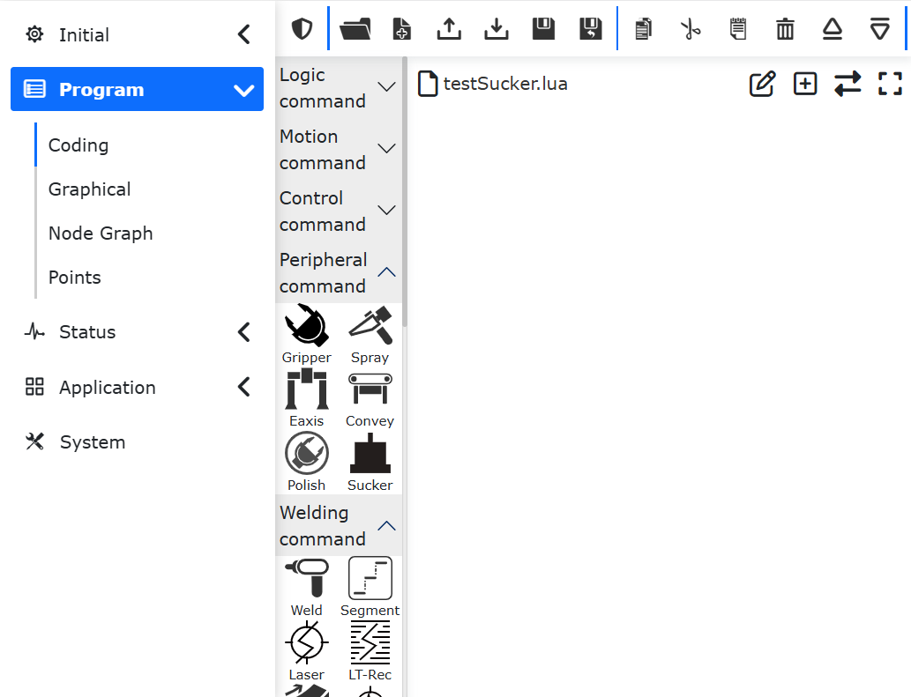

.. centered:: Schemat 8.12-10 Tworzenie nowego programu „testSucker.lua”

Wybierz typ instrukcji jako „Instrukcje urządzeń peryferyjnych”. W instrukcjach urządzeń peryferyjnych kliknij przycisk „Przyssawka”. W tym momencie po prawej stronie WebApp pojawi się strona dodawania instrukcji dla macierzy przyssawek „Sucker”.

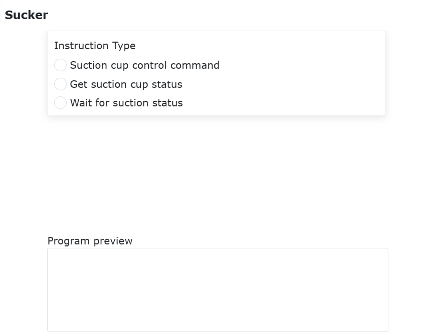

.. centered:: Schemat 8.12-11 Dodawanie instrukcji dla macierzy przyssawek

Dodawanie instrukcji sterowania przyssawką
++++++++++++++++++++++++++++++++++++++++++

Pisząc instrukcje sterowania przyssawką w programie LUA, można kontrolować chwytanie i zwalnianie przyssawki. Sterowanie w trybie unicast i trybie broadcast ma różne efekty logiczne.

Dodawanie instrukcji sterowania w trybie unicast
************************************************

Sterowanie w trybie unicast umożliwia sterowanie pojedynczą lub wieloma przyssawkami na podstawie początkowego numeru stacji podrzędnej i ich liczby. Każdej przyssawce można ustawić inny stan sterowania.

Na stronie dodawania instrukcji przyssawki kliknij „Instrukcja sterowania przyssawką”. Wybierz tryb sterowania jako „Tryb unicast”. Wprowadź numer stacji podrzędnej 1, liczbę do zapisu 2, stan chwytania „1,2”. Kliknij przycisk „Dodaj”. W „Podglądzie programu” zostanie dodana instrukcja sterowania przyssawką w trybie unicast.

.. figure:: robot_peripherals/213.png
   :align: center
   :width: 4in

.. centered:: Schemat 8.12-12 Dodawanie instrukcji sterowania przyssawką

Znaczenie poszczególnych parametrów w instrukcji sterowania przyssawką jest następujące:

- **Numer stacji podrzędnej**: Początkowy numer stacji podrzędnej dla sterowania w trybie unicast.
- **Liczba do zapisu**: Liczba przyssawek do sterowania od początkowego numeru stacji podrzędnej w trybie unicast.
- **Stan chwytania**: Począwszy od początkowego numeru stacji podrzędnej w trybie unicast, flagi stanu sterowania dla każdej przyssawki (1 - chwyć z maksymalnym poziomem próżni; 2 - chwyć z ustawionym poziomem próżni, tj. poziom próżni przyssawki utrzymuje się między maksymalnym a minimalnym poziomem próżni; 3 - zatrzymaj chwytanie). Flagi stanu sterowania dla każdej przyssawki są oddzielone przecinkiem „,”, a liczba flag sterowania musi być zgodna z liczbą przyssawek do sterowania. Jeśli chcesz sterować dwiema przyssawkami, a ich operacje sterowania to odpowiednio „chwyć z maksymalnym poziomem próżni” i „chwyć z ustawionym poziomem próżni”, to w tej pozycji należy wprowadzić „1,2”.

Kliknij przycisk „Zastosuj”. W tym momencie do programu „testSucker.lua” zostanie dodana instrukcja sterowania przyssawką. Przełącz robota w tryb automatyczny i wykonaj program LUA. Robot będzie sterować dwiema przyssawkami o numerach stacji podrzędnych odpowiednio 1 i 2, aby chwytały odpowiednio z maksymalnym poziomem próżni i ustawionym poziomem próżni.

.. figure:: robot_peripherals/214.png
   :align: center
   :width: 4in

.. centered:: Schemat 8.12-13 Dodawanie instrukcji przyssawki w programie LUA

Dodawanie instrukcji sterowania w trybie broadcast
**************************************************

Stan chwytania ustawiony w instrukcji sterowania w trybie broadcast ma zastosowanie do wszystkich aktualnie podłączonych przyssawek.

Kliknij „Instrukcja sterowania przyssawką”. Wybierz tryb sterowania jako „Tryb broadcast”. Wprowadź stan chwytania 1 (chwyć z maksymalnym poziomem próżni). Kliknij przycisk „Dodaj”.

.. figure:: robot_peripherals/215.png
   :align: center
   :width: 4in

.. centered:: Schemat 8.12-14 Dodawanie instrukcji sterowania w trybie broadcast

Kliknij przycisk „Zastosuj”. W tym momencie do „testSucker.lua” zostanie dodana instrukcja sterowania przyssawką w trybie broadcast. Przełącz robota w tryb automatyczny i wykonaj ten program. Wszystkie podłączone przyssawki rozpoczną chwytanie z maksymalnym poziomem próżni.

.. figure:: robot_peripherals/216.png
   :align: center
   :width: 4in

.. centered:: Schemat 8.12-15 Dodawanie instrukcji sterowania w trybie broadcast w programie LUA

Dodawanie instrukcji pobierania stanu przyssawki
++++++++++++++++++++++++++++++++++++++++++++++++

Kliknij „Pobierz stan przyssawki”. Wybierz numer stacji podrzędnej przyssawki, z której chcesz pobrać stan. Kolejno kliknij „Dodaj”, „Zastosuj”. W „testSucker.lua” zostanie dodana instrukcja pobierania stanu przyssawki „GetSuckerState(1)”.

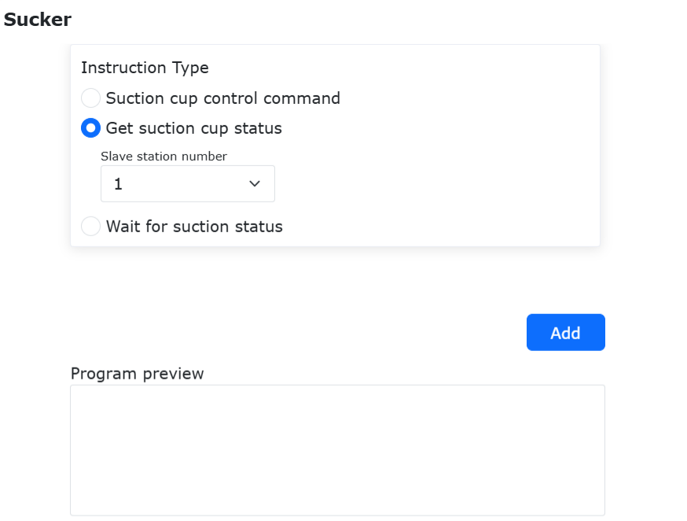

.. centered:: Schemat 8.12-16 Dodawanie instrukcji pobierania stanu przyssawki

Instrukcja GetSuckerState() zwraca 3 wartości, odpowiednio:

- **state**: Bieżący stan przyssawki: 0 - zwolniony obiekt lub przyssawka uruchomiona pomyślnie; 1 - wykryto przedmiot, przyssawka przylega do przedmiotu; 2 - nie przylega do przedmiotu; 3 - przedmiot oderwał się.
- **pressValue**: Bieżący poziom próżni/ciśnienia;
- **err**: Kod błędu: 0 - normalny; inne - nieprawidłowy.

W „testSucker.lua” użyj trzech zmiennych do odbioru wartości zwracanych przez funkcję GetSuckerState(). Poprzez zapytanie o zmienną Lua wyświetl powyższe informacje w obszarze wyświetlania zapytań o zmienne w WebApp.

.. figure:: robot_peripherals/218.png
   :align: center
   :width: 4in

.. centered:: Schemat 8.12-17 Program pobierania stanu przyssawki

Dodawanie instrukcji oczekiwania na stan chwytania przyssawki
+++++++++++++++++++++++++++++++++++++++++++++++++++++++++++++

W praktycznych zastosowaniach macierzy przyssawek często konieczne jest oczekiwanie na zakończenie chwytania (zwalniania) przez przyssawkę przed wykonaniem następnej czynności. Robot współpracujący udostępnia instrukcję oczekiwania na zakończenie działania przyssawki. Gdy przyssawka osiągnie ustawiony stan, instrukcja kończy się. W przeciwnym razie blokuje i czeka na zakończenie działania przyssawki przez ustawiony czas timeoutu.

Na stronie dodawania instrukcji macierzy przyssawek kliknij „Oczekiwanie na stan chwytania przyssawki”. Wybierz numer stacji podrzędnej przyssawki 1. Wybierz tryb sterowania jako „Wykryto przedmiot, przyssawka przylega do przedmiotu”. Wprowadź czas timeoutu 10000 ms. Kliknij przycisk „Dodaj”.

.. figure:: robot_peripherals/219.png
   :align: center
   :width: 4in

.. centered:: Schemat 8.12-18 Dodawanie instrukcji oczekiwania na stan przyssawki

Kliknij przycisk „Zastosuj”. Do „testSucker.lua” zostanie dodana instrukcja oczekiwania na przyssanie się przyssawki do przedmiotu.

.. figure:: robot_peripherals/220.png
   :align: center
   :width: 4in

.. centered:: Schemat 8.12-19 Dodawanie instrukcji oczekiwania na przyssanie się przyssawki do przedmiotu w programie LUA

Przykład zastosowania
+++++++++++++++++++++

Przykład programu LUA do sterowania przenoszeniem za pomocą przyssawki:

.. code-block:: console
  :linenos:

  while (1) do 
  ::satety_suck::
  PTP(sucker_safey,100,-1,0)
  PTP(sucker_suck,100,-1,0)
  SetSuckerCtrl(2, 1, {2})
  SetSuckerCtrl(11, 1, {2})
  loop1 = 0 
  while (loop1 < 10) do 
      state, press, errorcode = GetSuckerState(2)
      RegisterVar("number","state")
      RegisterVar("number","press")
      RegisterVar("number","errorcode")
      state11, press11, errorcode11 = GetSuckerState(11)
      RegisterVar("number","state11")
      RegisterVar("number","press11")
      RegisterVar("number","errorcode11")
      loop1 = loop1 + 1
      WaitMs(50)
  end
  
  if(state11 == 1) then
      PTP(sucker_safey,100,-1,0)
      PTP(sucker_release,100,-1,0)
      WaitMs(1000)
      SetSuckerCtrl(2, 1, {3})
      SetSuckerCtrl(11, 1, {3})
      WaitMs(500)
  else
      PTP(sucker_safey,100,-1,0)
      SetSuckerCtrl(2, 1, {3})
      SetSuckerCtrl(11, 1, {3})
      WaitMs(2000)
      goto satety_suck
  end
  ::satety_release::
  PTP(sucker_safey,100,-1,0)
  PTP(sucker_release,100,-1,0)
  SetSuckerCtrl(2, 1, {2})
  SetSuckerCtrl(11, 1, {2})
  loop1 = 0 
  while (loop1 < 10) do 
      state, press, errorcode = GetSuckerState(2)
      RegisterVar("number","state")
      RegisterVar("number","press")
      RegisterVar("number","errorcode")
      state11, press11, errorcode11 = GetSuckerState(11)
      RegisterVar("number","state11")
      RegisterVar("number","press11")
      RegisterVar("number","errorcode11")
      loop1 = loop1 + 1
      WaitMs(50)
  end
  
  if(state11 == 1) then
      PTP(sucker_safey,100,-1,0)
      PTP(sucker_suck,100,-1,0)
      WaitMs(1000)
      SetSuckerCtrl(2, 1, {3})
      SetSuckerCtrl(11, 1, {3})
      WaitMs(500)
  else
      PTP(sucker_safey,100,-1,0)
      SetSuckerCtrl(2, 1, {3})
      SetSuckerCtrl(11, 1, {3})
      WaitMs(2000)
      goto satety_release
  end
  end 

Pakiet funkcji CNC oparty na FOCAS (tylko do użytku w systemie Linux)
---------------------------------------------------------------------

Przegląd
~~~~~~~~

Aby zautomatyzować proces załadunku i rozładunku w obróbce skrawaniem, opracowano pakiet funkcji CNC oparty na komunikacji FOCAS, który umożliwia komunikację i współpracę robota współpracującego z obrabiarką CNC.

Jak pokazano na rysunku, komunikacja FOCAS opiera się na Ethernet. Podłączając kabel sieciowy do portu sieciowego szafy sterowniczej robota i wbudowanego portu sieciowego obrabiarki, można nawiązać komunikację FOCAS między robotem a obrabiarką, umożliwiając sterowanie CNC i monitorowanie stanu obrabiarki z poziomu robota.

.. figure:: robot_peripherals/221.png
   :align: center
   :width: 6in

.. centered:: Schemat 8.13‑1 Topologia komunikacji FOCAS między robotem a CNC

Obecnie pakiet funkcji CNC oparty na komunikacji FOCAS w szafie sterowniczej obsługuje funkcje sterowania obrabiarką i sprzężenia zwrotnego stanu, jak pokazano w tabeli.

.. centered:: Tabela 8.13-1 Tabela funkcji obsługiwanych przez pakiet funkcji CNC oparty na komunikacji FOCAS

.. list-table:: 
   :widths: 15 40 100
   :header-rows: 0
   :align: center
   :class: sheet-center

   * - **Nr**
     - **Nazwa funkcji**
     - **Opis**
   * - 1
     - Typ obrabiarki
     - Sprzężenie zwrotne stanu
   * - 2
     - Stan komunikacji FOCAS
     - Sprzężenie zwrotne stanu
   * - 3
     - Działanie w trybie automatycznym
     - Sterowanie, sprzężenie zwrotne stanu
   * - 4
     - Stan alarmu
     - Sprzężenie zwrotne stanu
   * - 5
     - Drzwi bezpieczeństwa
     - Sprzężenie zwrotne stanu
   * - 6
     - Uchwyt
     - Sterowanie, sprzężenie zwrotne stanu
   * - 7
     - Awaryjne zatrzymanie
     - Sterowanie, sprzężenie zwrotne stanu

Powiązane instrukcje obsługi
~~~~~~~~~~~~~~~~~~~~~~~~~~~~

Nawiązanie komunikacji FOCAS
++++++++++++++++++++++++++++

Komunikacja FOCAS opiera się na Ethernet. Należy połączyć robota, obrabiarkę CNC i komputer PC w sieć LAN, aby zrealizować fizyczne połączenie, a następnie za pomocą otwartego protokołu robota ostatecznie nawiązać komunikację FOCAS.

Konfiguracja sieci
******************

**Krok 1**: Najpierw zmień adres IP komputera PC na tę samą podsieć, co szafa sterownicza robota. Adres IP szafy sterowniczej robota to „192.168.58.2”.

Jeśli nie ma sieci z przełącznikiem, możesz użyć dwóch wbudowanych portów sieciowych na szafie sterowniczej robota do zbudowania sieci. Operacja jest następująca: Zaloguj się do WebAPP robota. W Ustawienia systemowe -> Ustawienia ogólne -> Ustawienia sieciowe, ustaw IP dla portu 0 na: 192.168.58.2; IP dla portu 1 na 192.168.57.2. Jednocześnie ustaw WebAPP na port 0, a WebRecovery na port 1, jak pokazano na rysunku. Po zakończeniu wszystkich ustawień kliknij Ustaw sieć.

.. figure:: robot_peripherals/222.png
   :align: center
   :width: 6in

.. centered:: Schemat 8.13‑2 Rysunek konfiguracji sieci robota

**Krok 2**: Następnie zrestartuj szafę sterowniczą. Połącz się z komputerem PC przez port sieciowy 0 i zaloguj się do WebApp robota. Jednocześnie skonfiguruj adres IP obrabiarki CNC, z którą ma być prowadzona komunikacja, oraz komputera PC i szafy sterowniczej robota, aby znajdowały się w tej samej podsieci, czyli 192.168.58.xx. Zmień także port obrabiarki na 8193. To kończy całą konfigurację sieci.

Konfiguracja pliku otwartego protokołu
**************************************

**Krok 1**: Następnie przystąp do konfiguracji otwartego protokołu urządzeń peryferyjnych. Najpierw utwórz nowy plik lua o nazwie zaczynającej się od CtrlDev_CNC, który będzie służyć jako plik otwartego protokołu do nawiązania komunikacji FOCAS, np. CtrlDev_CNC_demo.lua.

W tym pliku należy ustawić ID otwartego protokołu i użyć funkcji CNCComSet do nawiązania lub zerwania połączenia z CNC. Opis parametrów funkcji CNCComSet znajduje się w poniższej tabeli. Przykładowy kod znajduje się poniżej.

.. centered:: Tabela 8.13-2 Tabela opisu parametrów funkcji CNCComSet

.. list-table:: 
   :widths: 15 40 100
   :header-rows: 0
   :align: center
   :class: sheet-center

   * - **Nr**
     - **Nazwa funkcji**
     - **Opis**
   * - 1
     - Producent obrabiarki
     - 0-nieważne 1-obrabiarka (FOCAS)
   * - 2
     - Instrukcja komunikacji
     - 1-nawiąż połączenie 1001-zerwij połączenie
   * - 3
     - Adres IP obrabiarki
     - --
   * - 4
     - Numer portu obrabiarki
     - --

Przykładowy kod otwartego protokołu do nawiązywania komunikacji FOCAS:

.. code-block:: console
    :linenos:

    local id = 1      --ID otwartego protokołu LUA
    --Zerwanie połączenia FOCAS
    CNCComSet(1, 1001, '192.168.57.100', 8193)
    sleep_ms(1000)
    --Nawiązanie połączenia FOCAS
    CNCComSet(1, 1, '192.168.57.100', 8193)
    sleep_ms(1000)
    while(1) do
    sleep_ms(5000)
    end

**Krok 2**: Po zakończeniu pisania pliku lua otwartego protokołu wybierz właśnie przesłany plik CtrlDev_CNC_fanuc.lua i prześlij go. Wybierz ID ustawione w pliku, wybierz z listy rozwijanej przesłany plik otwartego protokołu i kliknij Konfiguruj.

.. figure:: robot_peripherals/223.png
   :align: center
   :width: 4in

.. centered:: Schemat 8.13‑3 Przesyłanie i konfiguracja pliku otwartego protokołu

**Krok 3**: Następnie sprawdź, czy wszystkie łącza komunikacyjne są prawidłowe i upewnij się, że obrabiarka CNC jest włączona. Kliknij przycisk połączenia w otwartym protokole. Poprzez stan komunikacji FOCAS w sekcji sprzężenia zwrotnego stanu po prawej stronie możesz potwierdzić, czy połączenie z obrabiarką zostało nawiązane (czerwone światło: połączenie nawiązane; szare: połączenie zerwane), jak pokazano na rysunku.

.. figure:: robot_peripherals/224.png
   :align: center
   :width: 4in

.. centered:: Schemat 8.13‑4 Nawiązanie połączenia komunikacji FOCAS

Opis sprzężenia zwrotnego stanu CNC
+++++++++++++++++++++++++++++++++++

Stan obrabiarki CNC jest wyświetlany w ikonie CNC w sekcji sprzężenia zwrotnego stanu urządzeń peryferyjnych po prawej stronie WebApp, jak pokazano na rysunku. Kliknięcie jej spowoduje wyświetlenie wszystkich bieżących stanów obrabiarki, w tym producenta urządzenia, typu obrabiarki, stanu komunikacji FOCAS, flagi alarmu, stanu obróbki obrabiarki, stanu otwarcia drzwi obrabiarki, stanu uchwytu obrabiarki i stanu awaryjnego zatrzymania obrabiarki.

.. figure:: robot_peripherals/225.png
   :align: center
   :width: 4in

.. centered:: Schemat 8.13‑5 Pasek sprzężenia zwrotnego stanu CNC

Znaczenie lampek wskaźników stanu CNC jest następujące.

.. centered:: Tabela 8.13-3 Tabela znaczenia lampek wskaźników stanu CNC

.. list-table:: 
   :widths: 15 40 100
   :header-rows: 0
   :align: center
   :class: sheet-center

   * - **Nr**
     - **Nazwa funkcji**
     - **Opis**
   * - 1
     - Stan komunikacji FOCAS
     - Szary - komunikacja zerwana Czerwony - komunikacja prawidłowa
   * - 2
     - Flaga alarmu
     - Szary - brak ostrzeżenia Czerwony - istnieje ostrzeżenie
   * - 3
     - Stan obróbki obrabiarki
     - Szary - zatrzymana Zielony - w trakcie pracy
   * - 4
     - Stan otwarcia drzwi obrabiarki
     - Szary - drzwi zamknięte Zielony - drzwi otwarte
   * - 5
     - Stan uchwytu obrabiarki
     - Szary - zwolniony Zielony - zaciśnięty
   * - 6
     - Stan awaryjnego zatrzymania obrabiarki
     - Szary - awaryjne zatrzymanie nieaktywne Zielony - awaryjne zatrzymanie aktywne

Opis sprzężenia zwrotnego stanu CNC
+++++++++++++++++++++++++++++++++++

Sterowanie obrabiarką CNC znajduje się w otwartym protokole urządzeń peryferyjnych. Po zakończeniu nawiązywania komunikacji FOCAS, kliknięcie w prawym górnym rogu skonfigurowanego otwartego protokołu urządzeń peryferyjnych spowoduje otwarcie strony sterowania CNC, jak pokazano na rysunku.

.. note:: Przyciski sterowania obejmują sterowanie drzwiami (otwieranie, zamykanie), sterowanie uchwytem (zaciskanie, zwalnianie), sterowanie uruchamianiem/zatrzymywaniem (działanie, zatrzymanie) oraz sterowanie awaryjnym zatrzymaniem (awaryjne zatrzymanie, dezaktywacja). Wszystkie sygnały sterujące są wyzwalane zboczem.

.. figure:: robot_peripherals/226.png
   :align: center
   :width: 4in

.. centered:: Schemat 8.13‑6 Strona sterowania CNC

Opis programu nauczania CNC
+++++++++++++++++++++++++++

Pakiet funkcji CNC obsługuje wywoływanie instrukcji sterujących w programie nauczania i pobieranie stanu obrabiarki w czasie rzeczywistym. Kolejno otwierając „Program nauczania” -> „Programowanie” -> „Instrukcje urządzeń peryferyjnych” -> „CNC”, można zobaczyć wszystkie obsługiwane instrukcje nauczania CNC, jak pokazano na rysunku.

.. figure:: robot_peripherals/227.png
   :align: center
   :width: 4in

.. centered:: Schemat 8.13‑7 Instrukcje nauczania CNC

.. note:: Instrukcje sterujące odpowiadają jeden do jednego sterowaniu CNC i wszystkie są wyzwalane zboczem, co oznacza, że po wykonaniu polecenia uruchomienia, przed wykonaniem następnego polecenia uruchomienia należy wykonać zatrzymanie.

„Pobierz bieżący stan obrabiarki” to funkcja lua. Funkcja ta zwraca 9 parametrów, których znaczenie opisano w poniższej tabeli.

.. centered:: Tabela 8.13-4 Tabela opisu wartości zwracanych przez „Pobierz bieżący stan obrabiarki”

.. list-table:: 
   :widths: 15 40 100
   :header-rows: 0
   :align: center
   :class: sheet-center

   * - **Nr**
     - **Nazwa**
     - **Znaczenie**
   * - 1
     - Producent urządzenia
     - 0-nieważne 1-inne-zarezerwowane
   * - 2
     - Stan komunikacji FOCAS
     - 0-komunikacja prawidłowa inne-komunikacja zerwana
   * - 3
     - Model obrabiarki (string)
     - '15' : Series 150/150i '16' : Series 160/160i '18' : Series 180/180i '21' : Series 210/210i '30' : Series 300i '31' : Series 310i '32' : Series 320i '0' : Series 0i 
   * - 4
     - Model obrabiarki (string)
     - '15' : Series 150/150i '16' : Series 160/160i '18' : Series 180/180i '21' : Series 210/210i '30' : Series 300i '31' : Series 310i '32' : Series 320i '0' : Series 0i 
   * - 5
     - Stan pracy obrabiarki
     - 0-zatrzymana 1-pracuje
   * - 6
     - Stan awaryjnego zatrzymania obrabiarki
     - 0-awaryjne zatrzymanie aktywne inne-awaryjne zatrzymanie nieaktywne
   * - 7
     - Stan alarmu obrabiarki
     - 0-brak ostrzeżenia inne-istnieje ostrzeżenie
   * - 8
     - Stan drzwi obrabiarki
     - 0-drzwi otwarte 1-drzwi zamknięte
   * - 9
     - Stan uchwytu obrabiarki
     - 0-zwolniony 1-zaciśnięty

Na przykładzie procesu załadunku i rozładunku robota napisano przykładowy program nauczania lua. Ten przykładowy program obejmuje sterowanie CNC zamykaniem/otwieraniem drzwi, uruchamianiem/zatrzymywaniem pracy, zwalnianiem/zaciskaniem uchwytu oraz pobieranie bieżącego stanu CNC jako warunku decyzyjnego, ustawiając ruch robota między trzema punktami: bezpiecznym, pobrania i zwolnienia, jak pokazano w kodzie.

Przykład programu nauczania lua współpracy robota z CNC:

.. code-block:: console
    :linenos:

     while (1) do 
        CNCDoorClose()
        CNCWorkStart()
        WaitMs(1000)
        t1,t2,t3,t4,t5,t6,t7,t8,t9=CNCGetStatus()
        if t5 == 1 then
            PTP(CNCsafe,100,-1,0)
        else
            CNCWorkStop()
            CNCDoorOpen()
            WaitMs(1000)
            PTP(CNCg1,100,-1,0)
            WaitMs(1000)
            CNCChuckOpen()
            PTP(CNCg2,100,-1,0)
            PTP(CNCsafe,100,-1,0)
        end
        t1,t2,t3,t4,t5,t6,t7,t8,t9=CNCGetStatus()
        if t8 == 0 then
            if t5 == 0 then
                PTP(CNCg2,100,-1,0)
                 PTP(CNCg1,100,-1,0)
                 CNCChuckFastening()
                 WaitMs(1000)
                 PTP(CNCsafe,100,-1,0)
             end   
         end
    end

Konfiguracja wirtualnej ściany oparta na czujniku siły
-------------------------------------------------------

Funkcja wirtualnej ściany oparta na czujniku siły umożliwia ręczne ustawienie wirtualnej ściany w celu ograniczenia przestrzeni roboczej robota, zapobiegając bezpośrednim kolizjom.

Instalacja i konfiguracja czujnika siły
~~~~~~~~~~~~~~~~~~~~~~~~~~~~~~~~~~~~~~~

**Krok 1**: Na przykładzie czujnika „Kunwei”. Podczas instalacji należy upewnić się, że kierunek układu współrzędnych czujnika siły jest zgodny z kierunkiem układu współrzędnych kołnierza końcowego, jak pokazano na rysunku 1 (na rysunku 1: czerwony to kierunek X+ układu współrzędnych kołnierza końcowego, zielony to kierunek Y+, niebieski to kierunek Z+).

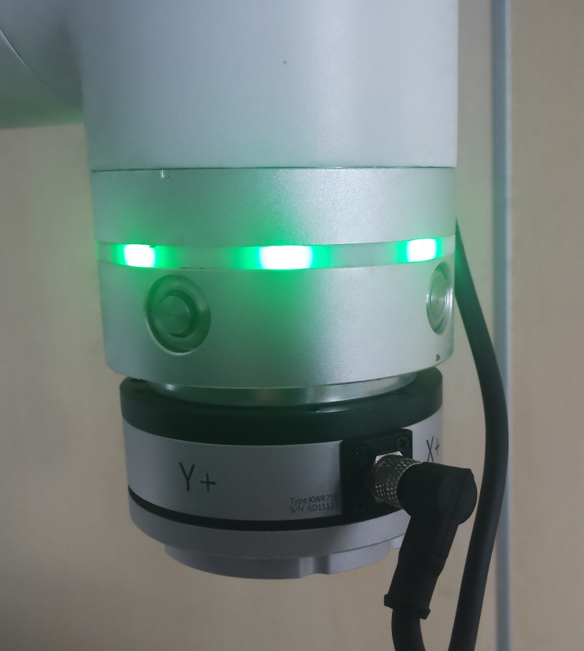

.. figure:: robot_peripherals/229.png
   :align: center
   :width: 4in

.. centered:: Schemat 8.14‑1 Instalacja czujnika siły

**Krok 2**: W menu „Ustawienia początkowe” -> „Urządzenia peryferyjne” -> „Czujnik siły” kliknij „Urządzenia dostosowane”, aby przejść do interfejsu konfiguracji urządzenia czujnika siły.

Informacje konfiguracyjne czujnika siły dzielą się na producenta, typ, wersję oprogramowania i lokalizację montażu. Użytkownik może skonfigurować odpowiednie informacje o czujniku siły zgodnie z konkretnymi potrzebami produkcyjnymi. Jeśli użytkownik chce zmienić konfigurację, może najpierw wybrać odpowiedni numer, kliknąć przycisk „Wyczyść”, aby wyczyścić odpowiednie informacje, a następnie ponownie skonfigurować zgodnie z potrzebami. Konkretna operacja jest pokazana na rysunku.

**Krok 3**: Wybierz w pełni skonfigurowany numer czujnika siły, kliknij przycisk „Resetuj”. Po wyświetleniu na stronie komunikatu o pomyślnym wysłaniu polecenia, kliknij przycisk „Aktywuj”. Sprawdź stan aktywacji w tabeli informacji o czujniku siły, aby określić, czy aktywacja się powiodła. Ponadto czujnik siły ma wartość początkową. Użytkownik może w razie potrzeby wybrać „Korekcja zera” i „Usuń punkt zerowy”. Korekcja zera czujnika siły wymaga upewnienia się, że czujnik siły jest skierowany poziomo i pionowo w dół, a robot nie ma skonfigurowanego obciążenia.

.. figure:: robot_peripherals/016.png
   :align: center
   :width: 4in

.. centered:: Schemat 8.14‑2 Konfiguracja i aktywacja czujnika siły

.. centered:: Schemat 8.14‑3 Aktywacja czujnika siły

Konfiguracja wirtualnej ściany
~~~~~~~~~~~~~~~~~~~~~~~~~~~~~~

Aby użyć czujnika siły do wspomagania przeciągania, należy zamontować uchwyt przeciągania pod czujnikiem siły i skonfigurować układ współrzędnych narzędzia. Konkretna operacja jest pokazana na rysunku 4. W tym momencie sposób wykrywania obszaru interferencji jest określany na podstawie pozycji ustawionego układu współrzędnych narzędzia. Jeśli nie jest ustawiony, podstawą jest kołnierz końcowy.

**Krok 1**: W menu „Ustawienia początkowe” -> „Bezpieczeństwo” -> „Obszar interferencji” kliknij „Pojedynczy”, aby przejść do interfejsu funkcji konfiguracji obszaru interferencji.

**Krok 2**: Należy skonfigurować sposób interferencji i operację wejścia w obszar interferencji. Kliknij „Interferencja prostopadłościenna”, aby przejść do interfejsu konfiguracji. Skonfiguruj przeciąganie w obszarze interferencji jako „Nie ograniczaj przeciągania”. Konfiguracja ruchu w obszarze interferencji może być dowolna.

**Krok 3**: Zgodnie z potrzebami można modyfikować parametry konfiguracji. Metoda wykrywania dzieli się na „Pozycję instrukcji” i „Pozycję sprzężenia zwrotnego”. Tryb obszaru interferencji dzieli się na „Interferencja wewnątrz zakresu” i „Interferencja na zewnątrz zakresu”. Wybierz układ odniesienia jako „Układ bazowy”. Wybierz zgodnie z rzeczywistym użyciem. Szczegółowa operacja jest pokazana na rysunku.

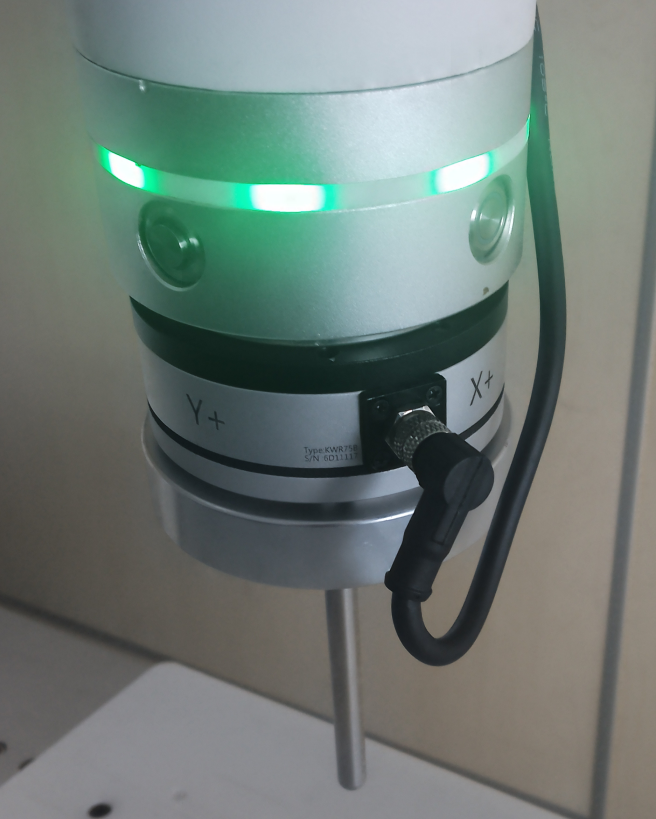

.. figure:: robot_peripherals/231.png
   :align: center
   :width: 4in

.. centered:: Schemat 8.14‑4 Instalacja uchwytu przeciągania i ustawienie układu współrzędnych narzędzia

.. figure:: robot_peripherals/232.png
   :align: center
   :width: 4in

.. centered:: Schemat 8.14‑5 Konfiguracja parametrów wirtualnej ściany

**Krok 4**: Tryb obszaru interferencji w konfiguracji parametrów dzieli się na „Interferencja wewnątrz zakresu” i „Interferencja na zewnątrz zakresu”.

.. figure:: robot_peripherals/233.png
   :align: center
   :width: 4in

.. centered:: Schemat 8.14‑6 Interferencja wewnątrz zakresu

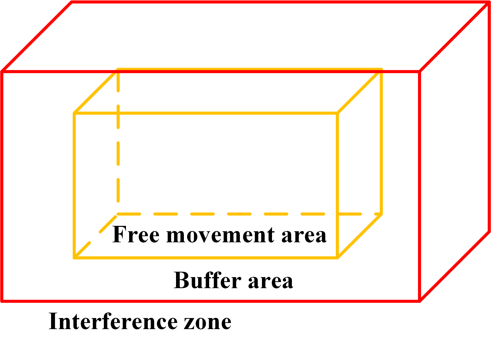

.. centered:: Schemat 8.14‑7 Interferencja na zewnątrz zakresu

**Krok 5**: Utwórz obszar interferencji. Konkretna operacja jest pokazana na rysunkach 7 i 8. Zaleca się, aby przy wyborze „Interferencji na zewnątrz zakresu” ustawić obszar interferencji tak duży, jak to możliwe.

.. figure:: robot_peripherals/235.png
   :align: center
   :width: 4in

.. centered:: Schemat 8.14‑8 Tworzenie obszaru interferencji metodą dwóch punktów

.. figure:: robot_peripherals/236.png
   :align: center
   :width: 4in

.. centered:: Schemat 8.14‑9 Tworzenie obszaru interferencji metodą punktu środkowego + długości boku

Wspomaganie przeciągania przez czujnik siły
~~~~~~~~~~~~~~~~~~~~~~~~~~~~~~~~~~~~~~~~~~~

**Krok 1**: W menu „Aplikacje pomocnicze” -> „Aplikacje narzędziowe” kliknij „Blokowanie przeciągania”, aby przejść do interfejsu funkcji wspomagania blokowania przez czujnik siły.

**Krok 2**: Ustaw parametry zgodnie z rysunkiem, aby zrealizować funkcję wirtualnej ściany opartą na czujniku siły. Konkretny efekt: w pobliżu wirtualnej ściany opór wzrasta; z dala od wirtualnej ściany funkcja wspomagania przeciągania przez czujnik siły działa normalnie.

.. figure:: robot_peripherals/237.png
   :align: center
   :width: 4in
  
.. figure:: robot_peripherals/238.png
   :align: center
   :width: 4in

.. centered:: Schemat 8.14‑10 Ustawianie parametrów wspomagania przeciągania przez czujnik siły

Szczegółowe działanie parametrów:

**Wybór adaptacyjny**: Włącz podczas potrzeb montażu. Po włączeniu przeciąganie staje się cięższe.

**Parametry bezwładności**: Regulują odczucia podczas przeciągania. Należy ostrożnie operować pod kierunkiem technika.

**Parametry tłumienia**:

-  Kierunki translacji: Zalecane ustawienie parametrów w zakresie [100-200];
-  Kierunki rotacji: Zalecane ustawienie parametrów w zakresie [3-10], dla kierunku RZ zakres [0.1-5];
-  Efekt: Podczas przeciągania z użyciem czujnika, zwiększenie tłumienia utrudnia przeciąganie, zmniejszenie tłumienia sprawia, że przeciąganie robota jest zbyt lekkie (zaleca się, aby nie było zbyt małe);
-  Ogólny zakres parametrów tłumienia: Translacja XYZ: [100-1000]; Rotacja RX, RY: [3-50], RZ: [2-10];
-  Maksymalna siła przeciągania wynosi 50, maksymalna prędkość przeciągania wynosi 180.

**Parametry sztywności**: Ustaw wszystkie na 0;

**Próg siły przeciągania**: Translacja XYZ: [5-10]; Rotacja RX, RY, RZ: [0.5-5];

**Maksymalna siła przeciągania**: 50;

**Maksymalna prędkość przeciągania**: 180;

Funkcja mieszanego przeciągania z wykorzystaniem siły sześcioosiowej i impedancji stawów
~~~~~~~~~~~~~~~~~~~~~~~~~~~~~~~~~~~~~~~~~~~~~~~~~~~~~~~~~~~~~~~~~~~~~~~~~~~~~~~~~~~~~~~~

Przegląd
++++++++

Funkcja mieszanego przeciągania z wykorzystaniem siły sześcioosiowej i impedancji stawów polega na użyciu czujnika siły do wyczuwania siły zewnętrznej. W trybie przeciągania robot jest wspomagany podczas przeciągania. Poprzez regulację współczynnika wzmocnienia można uzyskać różne odczucia podczas przeciągania. Impedancja stawów ogranicza siłę przeciągania za pomocą sterowania impedancją.

Instalacja i konfiguracja czujnika siły oraz zerowanie
++++++++++++++++++++++++++++++++++++++++++++++++++++++

1. Instalacja i konfiguracja czujnika siły

Szczegółowy opis instalacji i konfiguracji czujnika siły znajduje się powyżej: Konfiguracja wirtualnej ściany oparta na czujniku siły.

2. Zerowanie czujnika siły

Aby ułatwić przeciąganie robota, należy zamontować uchwyt przeciągania pod czujnikiem, jak pokazano na rysunku 1.

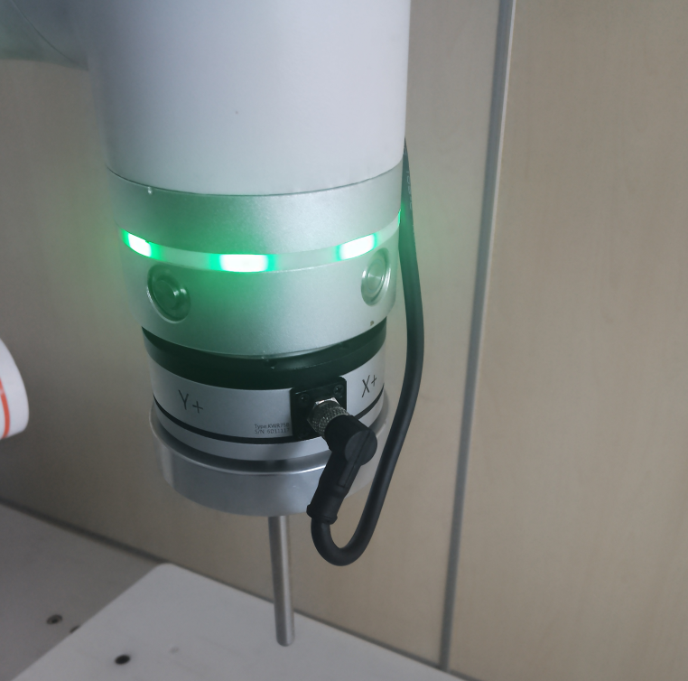

.. centered:: Schemat 8.14‑11 Uchwyt przeciągania

**Krok 1**: Zgodnie z rzeczywistą długością uchwytu ustaw układ współrzędnych narzędzia, jak pokazano na rysunku 2.

**Krok 2**: W menu „Ustawienia początkowe” -> „Podstawowe” -> „Obciążenie” kliknij „Czujnik”, aby przejść do interfejsu obciążenia czujnika siły/momentu.

Za pomocą przycisku przeciągania dostosuj końcówkę robota tak, aby była skierowana poziomo w dół. Kolejno kliknij „Obciążenie” -> „Identyfikacja czujnika”, aby przejść do interfejsu. Znajdź przycisk „Zapisz pozycję początkową” w sekcji „Automatyczne zerowanie czujnika”. Następnie przełącz tryb robota na automatyczny i kliknij przycisk „Automatyczne zerowanie”. Po zakończeniu działania programu zerowanie czujnika jest zakończone. Szczegółowa operacja jest pokazana na rysunku.

.. figure:: robot_peripherals/231.png
   :align: center
   :width: 4in

.. centered:: Schemat 8.14‑12 Ustawienie układu współrzędnych narzędzia

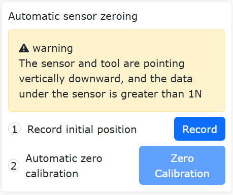

.. centered:: Schemat 8.14‑13 Automatyczne zerowanie czujnika siły/momentu

Mieszane przeciąganie z wykorzystaniem siły sześcioosiowej i impedancji stawów
++++++++++++++++++++++++++++++++++++++++++++++++++++++++++++++++++++++++++++++

1. Wspomaganie przeciągania

**Krok 1**: W menu „Aplikacje pomocnicze” -> „Aplikacje narzędziowe” kliknij „Blokowanie przeciągania”, aby przejść do interfejsu funkcji blokowania przeciągania.

**Krok 2**: W sekcji „Mieszane przeciąganie z wykorzystaniem siły sześcioosiowej i impedancji stawów” ustaw stan sterowania na „Włączony”. Stan włączenia impedancji ustaw na „Wyłączony”. Ustaw wzmocnienie przeciągania, prędkość liniową końcówki na 1000 mm/s, ograniczenie prędkości kątowej na 100°/s, a następnie kliknij przycisk „Zastosuj”. Funkcja zostanie włączona. Konkretna konfiguracja jest pokazana na rysunku 4.

**Krok 3**: Przełącz tryb robota na tryb przeciągania i przeciągnij robota. Konkretny efekt: Przeciąganie końcówki robota jest lekkie, z dobrym odczuciem. Przeciąganie stawów robota jest ciężkie.

.. figure:: robot_peripherals/241.png
   :align: center
   :width: 4in

.. centered:: Schemat 8.14‑14 Parametry konfiguracji wspomagania przeciągania siłą sześcioosiową

2. Sterowanie impedancją stawów

Rolą sterowania impedancją jest ograniczenie siły przeciągania i pozycji przeciągania. Jego domyślny stan to „Wyłączony”.

Konkretna operacja jest pokazana na rysunku 5. Ustaw stan włączenia impedancji na „Włączony”, a następnie ustaw współczynniki tłumienia i sztywności zgodnie z rysunkiem 5. Funkcja współczynnika sztywności nie jest jeszcze dostępna.

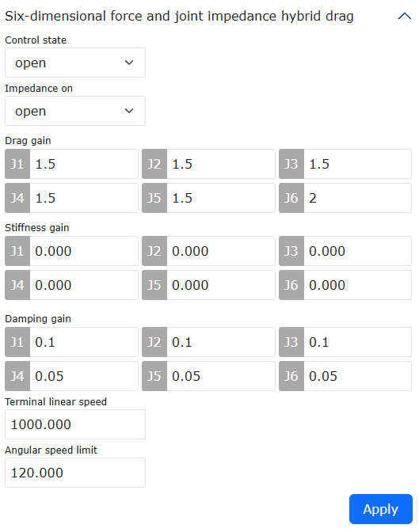

.. centered:: Schemat 8.14‑15 Parametry konfiguracji impedancji stawów

Szczegółowe działanie parametrów:

- **Stan sterowania**: Po włączeniu, funkcja ta może być używana w trybie przeciągania.
  
- **Włączenie impedancji**: Po włączeniu, należy skonfigurować parametry sztywności i tłumienia. Ich rolą jest ograniczenie siły przeciągania i pozycji przeciągania.
  
- **Wzmocnienie przeciągania**: Zalecane ustawienie parametrów w zakresie [0-5]. Gdy parametr jest ustawiony na 0, robot nie może być przeciągany. Gdy parametr jest ustawiony na 1, efekt przeciągania nie ulega poprawie. Gdy parametr jest większy niż 1, przeciąganie jest lekkie, a odczucia są dobre. Im większy parametr, tym lżejsze przeciąganie.
  
- **Wzmocnienie sztywności**: Ustawione na 0. Jego rolą jest powrót do pozycji początkowej sprzed przeciągnięcia po przeciągnięciu.
  
- **Wzmocnienie tłumienia**: Jego rolą jest ograniczenie siły przeciągania. Zakres parametrów dla osi 1-3: [0-0.5], dla osi 4-5: [0-0.1]; dla osi 6: [0-0.05].
  
- **Prędkość liniowa końcówki**: 1000 mm/s. Gdy ograniczenie prędkości liniowej końcówki zostanie przekroczone, robot przełączy się w tryb ręczny i wyświetli ostrzeżenie o przekroczeniu prędkości TCP.
  
- **Ograniczenie prędkości kątowej**: 100°/s. Gdy ograniczenie prędkości kątowej zostanie przekroczone, robot przełączy się w tryb ręczny i wyświetli ostrzeżenie o przekroczeniu prędkości TCP.

Funkcja śledzenia punktowego laserem z osią rozszerzoną
-------------------------------------------------------

Struktura systemu śledzenia punktowego laserem z osią rozszerzoną robota
~~~~~~~~~~~~~~~~~~~~~~~~~~~~~~~~~~~~~~~~~~~~~~~~~~~~~~~~~~~~~~~~~~~~~~~~

.. figure:: robot_peripherals/243.png
   :align: center
   :width: 4in

.. centered:: Schemat 8.15‑1 Struktura systemu śledzenia punktowego laserem z osią rozszerzoną robota

W systemie (a) to komputer, (b) to robot i jego szafa sterownicza, (c) to pozycjoner i urządzenie napędowe, (d) to czujnik laserowy do śledzenia spoiny, (e) to spawarka i urządzenia towarzyszące.

.. figure:: robot_peripherals/244.png
   :align: center
   :width: 3in

.. centered:: Schemat 8.15‑2 Schemat instalacji urządzeń peryferyjnych

Czujnik laserowy do śledzenia spoiny (b) i palnik spawalniczy są zamontowane na końcowym kołnierzu robota (a). Pozycjoner (c) jest zamocowany na zewnątrz robota.

Konfiguracja komunikacji osi rozszerzonej
~~~~~~~~~~~~~~~~~~~~~~~~~~~~~~~~~~~~~~~~~

Sposoby komunikacji robota z osią rozszerzoną obejmują UDP lub RS485.

.. centered:: Schemat 8.15‑3 Strona konfiguracji osi rozszerzonej

W interfejsie operacyjnym robota kliknij przyciski „Ustawienia początkowe” -> „Urządzenia peryferyjne” -> „Oś rozszerzona”, aby przejść do strony konfiguracji osi rozszerzonej. Na przykładzie użycia PLC połączonego z robotem przez komunikację UDP, kliknij ikonę „Komunikacja UDP”, aby przejść do strony konfiguracji osi rozszerzonej dla komunikacji UDP.

.. centered:: Schemat 8.15‑4 Interfejs konfiguracji komunikacji UDP

Na stronie konfiguracji komunikacji UDP dla osi rozszerzonej można wybrać odpowiedni numer osi rozszerzonej, skonfigurować parametry komunikacji UDP (adres, port, okres, wykrywanie utraty pakietów itp.) oraz ustawić czas zakończenia pozycjonowania osi rozszerzonej.

Treść konfiguracji osi rozszerzonej nie jest głównym punktem opisu tej funkcji. Szczegółowa konfiguracja znajduje się w odpowiedniej części instrukcji użytkownika.

Konfiguracja połączenia czujnika laserowego do śledzenia spoiny
~~~~~~~~~~~~~~~~~~~~~~~~~~~~~~~~~~~~~~~~~~~~~~~~~~~~~~~~~~~~~~~

Podłącz czujnik laserowy do śledzenia spoiny za pomocą poniższej strony konfiguracji:

.. figure:: robot_peripherals/245.png
   :align: center
   :width: 4in

.. centered:: Schemat 8.15‑5 Strona łączenia i konfiguracji czujnika laserowego

Kliknij „Ustawienia początkowe” -> „Urządzenia peryferyjne” -> „Czujnik lasera liniowego” w „Urządzenia dostosowane”, aby przejść do strony konfiguracji. Strona konfiguracji zawiera „Konfigurację czujnika”, „Konfigurację i ładowanie komunikacji”, „Obliczanie odniesienia”. Kliknij „Konfiguracja czujnika”, aby ustawić parametry filtracji wejściowej czujnika. Kliknij „Konfiguracja i ładowanie komunikacji”, aby wprowadzić odpowiednie parametry komunikacji i połączyć się z czujnikiem laserowym.

Treść konfiguracji czujnika laserowego nie jest głównym punktem opisu tej funkcji. Szczegółowa konfiguracja znajduje się w odpowiedniej części instrukcji użytkownika.

Konfiguracja połączenia spawarki
~~~~~~~~~~~~~~~~~~~~~~~~~~~~~~~~

Skonfiguruj spawarkę za pomocą poniższej strony konfiguracji:

.. figure:: robot_peripherals/246.png
   :align: center
   :width: 4in

.. centered:: Schemat 8.15‑6 Strona konfiguracji spawarki

Komunikacja ze spawarką może wykorzystywać komunikację IO lub RS485. Kliknij „Ustawienia początkowe”, „Urządzenia peryferyjne”, „Spawarka”, aby przejść do interfejsu konfiguracji i połączenia, gdzie można skonfigurować moduły takie jak „Typ sterowania”, „IO odpowiadające sygnałom”, „Parametry procesu spawania”, „Debugowanie spawarki”.

Treść konfiguracji spawarki nie jest głównym punktem opisu tej funkcji. Szczegółowa konfiguracja znajduje się w odpowiedniej części instrukcji użytkownika.

Kalibracja układu współrzędnych narzędzia i układu współrzędnych czujnika laserowego
~~~~~~~~~~~~~~~~~~~~~~~~~~~~~~~~~~~~~~~~~~~~~~~~~~~~~~~~~~~~~~~~~~~~~~~~~~~~~~~~~~~~

Po zamontowaniu palnika spawalniczego na końcówce robota, skalibruj parametry zewnętrzne palnika spawalniczego i czujnika laserowego:

.. figure:: robot_peripherals/247.png
   :align: center
   :width: 4in

.. centered:: Schemat 8.15‑7 Strona konfiguracji układu współrzędnych narzędzia

Kliknij „Ustawienia początkowe”, „Podstawowe”, „Układy współrzędnych”, „Narzędzie”, aby przejść do strony ustawień układu współrzędnych obiektu.

.. figure:: robot_peripherals/248.png
   :align: center
   :width: 4in

.. centered:: Schemat 8.15‑8 Wybór metody 6 punktów do kalibracji palnika

Wybierz pusty układ współrzędnych, wybierz typ narzędzia jako „Narzędzie”, wybierz metodę 6 punktów do kalibracji narzędzia palnika.

.. centered:: Schemat 8.15‑9 Wybór metody 5 punktów do kalibracji czujnika laserowego

Wybierz pusty układ współrzędnych, wybierz typ narzędzia jako „Czujnik”, wybierz metodę 5 punktów do kalibracji czujnika laserowego.

Treść kalibracji układu współrzędnych narzędzia i układu współrzędnych czujnika laserowego nie jest głównym punktem opisu tej funkcji. Szczegółowa metoda kalibracji znajduje się w odpowiedniej części instrukcji użytkownika.

Funkcja śledzenia punktowego laserem z osią rozszerzoną
~~~~~~~~~~~~~~~~~~~~~~~~~~~~~~~~~~~~~~~~~~~~~~~~~~~~~~~

Śledzenie punktowe laserem z osią rozszerzoną dzieli się na dwie metody. Metoda z transformacją danych laserowych realizuje strategię śledzenia „najpierw rejestruj, potem odtwarzaj”. Metoda bez transformacji danych laserowych realizuje strategię śledzenia „rejestruj i odtwarzaj jednocześnie”.

Kalibracja układu współrzędnych osi rozszerzonej
++++++++++++++++++++++++++++++++++++++++++++++++

Aby zrealizować synchronizację śledzenia laserowego między osią rozszerzoną a robotem, należy skalibrować układ współrzędnych osi rozszerzonej.

.. figure:: robot_peripherals/077.png
   :align: center
   :width: 4in

.. centered:: Schemat 8.15‑10 Strona ustawień układu współrzędnych osi rozszerzonej

Kliknij „Ustawienia początkowe” -> Urządzenia peryferyjne -> „Oś rozszerzona”, aby przejść do interfejsu ustawień układu współrzędnych osi rozszerzonej. Wybierz numer osi rozszerzonej do ustawienia, kliknij przycisk edycji, wybierz „4 - Pozycjoner z jednym stopniem swobody” i zapisz.

.. figure:: robot_peripherals/249.png
   :align: center
   :width: 4in

.. centered:: Schemat 8.15‑11 Strona kalibracji osi rozszerzonej

Podczas kalibracji osi rozszerzonej należy zwrócić uwagę na wybór „Pozycja robota względem osi rozszerzonej” jako „Poza osią rozszerzoną”. W przypadku pozycjonera wybierz metodę 4 punktów do kalibracji.

Treść kalibracji osi rozszerzonej nie jest głównym punktem opisu tej funkcji. Szczegółowa metoda kalibracji znajduje się w odpowiedniej części instrukcji użytkownika.

Synchroniczne śledzenie laserowe osi rozszerzonej z robotem
+++++++++++++++++++++++++++++++++++++++++++++++++++++++++++

Metoda z transformacją danych laserowych
****************************************

Synchroniczne śledzenie laserowe osi rozszerzonej z robotem w układzie bazowym nie wymaga kalibracji osi zewnętrznej. Pozostałe ustawienia funkcji i składniki są takie same jak w przypadku śledzenia synchronicznego w układzie współrzędnych osi rozszerzonej.

Najpierw skonfiguruj dane śledzenia laserowego, ustawiając dane czujnika śledzenia laserowego jako typ z transformacją.

.. figure:: robot_peripherals/250.png
   :align: center
   :width: 4in

.. centered:: Schemat 8.15‑12 Ustawienie danych laserowych z transformacją

Kliknij „Ustawienia początkowe”, „Urządzenia peryferyjne”, „Śledzenie”, „Czujnik”. W rozwijanej liście strony kliknij „Konfiguracja czujnika”. Dostosuj „Przetwarzanie danych” do danych z transformacją.

.. figure:: robot_peripherals/251.png
   :align: center
   :width: 6in
 
.. centered:: Schemat 8.15‑13 Strona funkcji śledzenia laserowego

Ta funkcja jest realizowana poprzez kombinację modułów wielofunkcyjnych. Główne moduły funkcji znajdują się w funkcji „Śledzenie laserowe”. Kliknij „Program nauczania” -> „Programowanie” -> „Śledzenie laserowe”, aby przejść do strony śledzenia laserowego. Możesz też kliknąć „Rejestracja laserowa”, aby bezpośrednio przejść do strony rejestracji.

.. figure:: robot_peripherals/252.png
   :align: center
   :width: 6in

.. centered:: Schemat 8.15‑14 Dodanie instrukcji rozpoczęcia rejestracji danych laserowych

Po wykonaniu ruchu osi rozszerzonej do punktu początkowego spawania dodaj instrukcję rozpoczęcia rejestracji danych laserowych.

.. figure:: robot_peripherals/253.png
   :align: center
   :width: 6in

.. centered:: Schemat 8.15‑15 Dodanie instrukcji zakończenia rejestracji danych laserowych

Po wykonaniu ruchu osi rozszerzonej do punktu końcowego spawania dodaj instrukcję zatrzymania rejestracji danych laserowych.

Po zarejestrowaniu trajektorii ruchu spoiny podczas ruchu osi rozszerzonej, możesz przywrócić oś rozszerzoną do punktu początkowego spawania, aby przygotować się do rozpoczęcia synchronicznego śledzenia i spawania.

Podczas rozpoczęcia spawania należy przesunąć palnik spawalniczy do punktu początkowego trajektorii zarejestrowanej przez czujnik laserowy. Należy dodać instrukcję ruchu do punktu spawania:

.. figure:: robot_peripherals/254.png
   :align: center
   :width: 6in

.. centered:: Schemat 8.15‑16 Dodanie instrukcji ruchu do punktu spawania

Kliknij przycisk „Program nauczania -> „Programowanie” -> „Rejestracja laserowa”. Wybierz „Ruch do punktu spawania”. Ustaw sposób ruchu i prędkość ruchu. Kliknij przycisk „Punkt początkowy” i zastosuj.

.. figure:: robot_peripherals/255.png
   :align: center
   :width: 6in

.. centered:: Schemat 8.15‑17 Dodanie instrukcji odtwarzania trajektorii zarejestrowanych danych laserowych

Na stronie „Śledzenie laserowe” wybierz „Rejestracja danych” -> „Odtwarzanie trajektorii”. Kliknij „Dodaj” i zastosuj. W instrukcji domyślny czas oczekiwania to 0 ms. Prędkość to stosunek prędkości odtwarzania do prędkości rejestracji. Zaleca się wartość powyżej 50%.

Po instrukcji „Odtwarzanie trajektorii” dodaj instrukcję ruchu osi rozszerzonej, aby zrealizować synchroniczny ruch osi rozszerzonej z robotem i śledzeniem laserowym.

Poniżej przedstawiono typowy program LUA dla śledzenia punktowego laserem z osią rozszerzoną:

.. figure:: robot_peripherals/256.png
   :align: center
   :width: 4in

.. centered:: Schemat 8.15‑18 Przykładowy program śledzenia punktowego z transformacją danych laserowych i osią rozszerzoną

Robot wykonuje proces „najpierw rejestruj, potem odtwarzaj”. Najpierw rejestruje trajektorię zmiany spoiny podczas ruchu osi rozszerzonej, a następnie podczas spawania oś rozszerzona i odtwarzanie trajektorii są wykonywane synchronicznie.

Metoda bez transformacji danych laserowych
******************************************

Użycie metody bez transformacji danych laserowych do śledzenia punktowego nie wymaga kalibracji układu współrzędnych osi rozszerzonej.

Ustaw dane czujnika śledzenia laserowego jako typ bez transformacji.

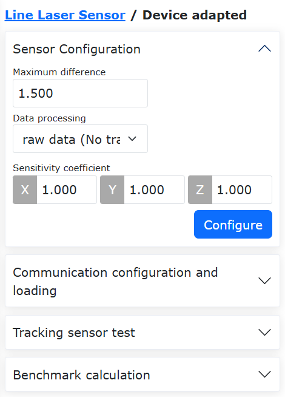

.. centered:: Schemat 8.15‑19 Ustawienie danych laserowych bez transformacji

Kliknij „Ustawienia początkowe” -> „Urządzenia peryferyjne” -> „Czujnik lasera liniowego”. W rozwijanej liście strony kliknij „Konfiguracja czujnika”. Dostosuj „Przetwarzanie danych” do danych bez transformacji.

.. figure:: robot_peripherals/251.png
   :align: center
   :width: 6in

.. centered:: Schemat 8.15‑20 Strona funkcji śledzenia laserowego

Kliknij „Program nauczania” -> „Programowanie” -> „Śledzenie laserowe”, aby przejść do strony śledzenia laserowego. Możesz też kliknąć „Rejestracja laserowa”, aby bezpośrednio przejść do strony rejestracji.

.. figure:: robot_peripherals/258.png
   :align: center
   :width: 6in

.. centered:: Schemat 8.15‑21 Dodanie instrukcji rejestracji i odtwarzania jednoczesnego

Na stronie „Rejestracja laserowa” wybierz instrukcję „Rejestruj i odtwarzaj jednocześnie”. Kliknij „Dodaj” i zastosuj. W instrukcji możesz wybrać „Czas opóźnienia” lub „Odległość opóźnienia” (zaleca się odległość). Współczynnik czułości kompensacji dostosuj do rzeczywistych danych laserowych czujnika. Im niższa wartość, tym niższa czułość regulacji i lepsza odporność na zakłócenia. Domyślna prędkość odtwarzania to 100%.

Po instrukcji „Rejestruj i odtwarzaj jednocześnie” dodaj instrukcję ruchu osi rozszerzonej, aby zrealizować synchroniczny ruch osi rozszerzonej z robotem i śledzeniem laserowym.

Poniżej przedstawiono typowy program LUA dla śledzenia punktowego laserem z osią rozszerzoną bez transformacji danych laserowych:

.. figure:: robot_peripherals/259.png
   :align: center
   :width: 5in

.. centered:: Schemat 8.15‑22 Przykładowy program śledzenia punktowego bez transformacji danych laserowych z osią rozszerzoną

Po dostosowaniu przesunięcia palnika spawalniczego względem przedniego lasera, oś rozszerzona robota porusza się i wykonuje proces „rejestracji i odtwarzania jednoczesnego”. Przedni czujnik śledzenia laserowego najpierw rejestruje trajektorię zmiany spoiny podczas ruchu osi rozszerzonej, a po ustawionej odległości lub czasie opóźnienia dokonuje korekty przy palniku spawalniczym.

Funkcja pobierania pozycji punktu lokalizacji laserowej
-------------------------------------------------------

Struktura systemu pobierania pozycji punktu lokalizacji laserowej robota
~~~~~~~~~~~~~~~~~~~~~~~~~~~~~~~~~~~~~~~~~~~~~~~~~~~~~~~~~~~~~~~~~~~~~~~~~

.. figure:: robot_peripherals/260.png
   :align: center
   :width: 6in

.. centered:: Schemat 8.16‑1 Topologia struktury systemu pobierania pozycji punktu lokalizacji laserowej robota
.. centered:: W systemie (a) to komputer, (b) to robot i jego szafa sterownicza, (c) to czujnik laserowy.

Konfiguracja komunikacji czujnika laserowego
~~~~~~~~~~~~~~~~~~~~~~~~~~~~~~~~~~~~~~~~~~~~

Otwórz WebApp, kolejno kliknij „Ustawienia początkowe” -> „Urządzenia peryferyjne” -> „Czujnik lasera liniowego”, aby skonfigurować komunikację czujnika.

.. figure:: robot_peripherals/245.png
   :align: center
   :width: 4in

.. centered:: Schemat 8.16‑2 Konfiguracja komunikacji czujnika

Funkcja pobierania pozycji punktu lokalizacji laserowej
~~~~~~~~~~~~~~~~~~~~~~~~~~~~~~~~~~~~~~~~~~~~~~~~~~~~~~~

Procedura operacyjna pobierania pozycji punktu lokalizacji laserowej jest następująca:

**Krok 1**: Przed lokalizacją laserową najpierw określ punkty początkowe lokalizacji „seamStartPt1”, „seamStartPt2”. Następnie kliknij „Program nauczania”, „Programowanie”, wybierz „Punkt-punkt”, aby skierować wiązkę lasera czujnika laserowego w pobliże punktu początkowego lokalizacji 1 „seamStartPt1” w pobliżu punktu początkowego spoiny 1.

.. figure:: robot_peripherals/261.png
   :align: center
   :width: 6in

.. centered:: Schemat 8.16‑3 Dodanie instrukcji ruchu do punktu początkowego lokalizacji 1

**Krok 2**: W typie instrukcji kliknij „Rozpocznij lokalizację”. Następnie wybierz skalibrowany układ współrzędnych czujnika. Ustaw kierunek lokalizacji, prędkość, długość i maksymalny czas lokalizacji. Kliknij przycisk „Dodaj”. Następnie kliknij „Zakończ lokalizację” i kliknij „Dodaj”.

.. figure:: robot_peripherals/262.png
   :align: center
   :width: 6in

.. centered:: Schemat 8.16‑4 Dodanie instrukcji rozpoczęcia lokalizacji

**Krok 3**: Wybierz „Ruch do punktu pobranego przez czujnik”. Wybierz nazwę układu współrzędnych jako skalibrowany „Czujnik laserowy”. Wybierz sposób ruchu jako „PTP” lub „LIN”. Ustaw prędkość testową i wybierz „Czy konfigurować pozy i orientację”. Kliknij „Dodaj”, a następnie kliknij „Zastosuj”, aby dodać do programu LUA.

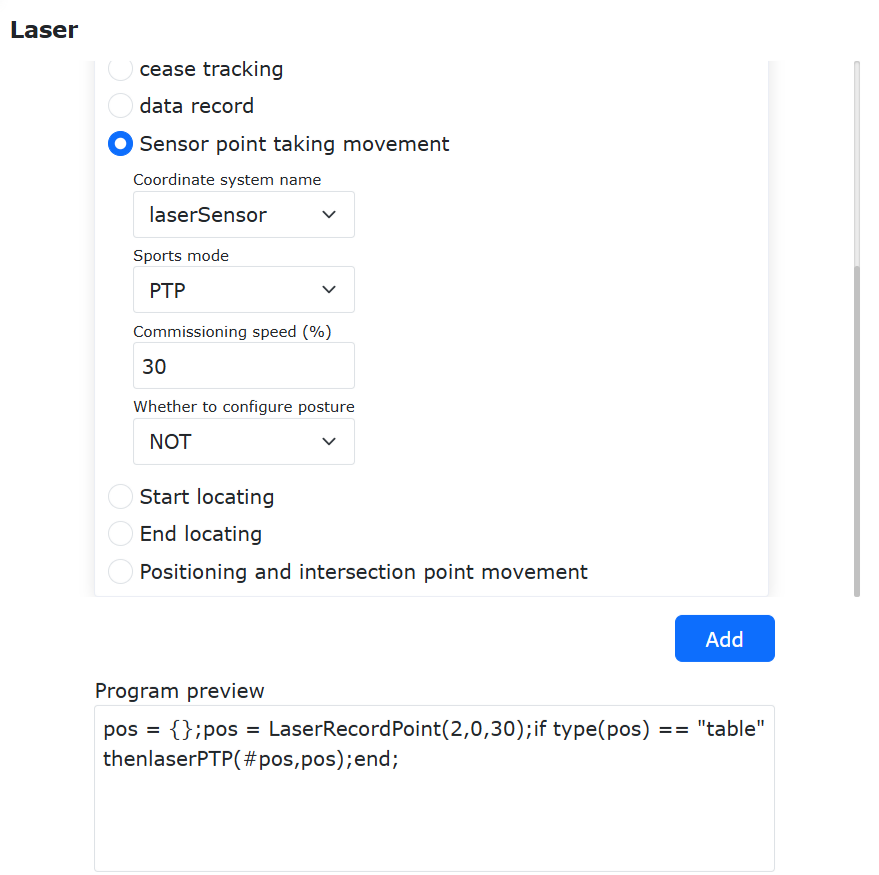

.. centered:: Schemat 8.16‑5 Dodanie instrukcji ruchu do punktu pobranego przez czujnik

**Krok 4**: W interfejsie „Programowanie” kliknij przycisk „Przełącz tryb”, aby przełączyć w tryb edycji. Zmień zmienną „pos” na „pos1” i usuń instrukcję ruchu do punktu lokalizacji.

.. figure:: robot_peripherals/264.png
   :align: center
   :width: 4in

.. centered:: Schemat 8.16‑6 Przełączanie trybu programowania

.. figure:: robot_peripherals/265.png
   :align: center
   :width: 4in

.. centered:: Schemat 8.16‑7 Modyfikacja programu pobierania punktu lokalizacji laserowej

**Krok 5**: Zgodnie z krokami Krok 1-Krok 4, przeprowadź lokalizację drugiej spoiny, aby pobrać pozycję punktu lokalizacji laserowej.

.. figure:: robot_peripherals/266.png
   :align: center
   :width: 4in

.. centered:: Schemat 8.16‑8 Pobieranie punktu lokalizacji drugiej spoiny

Zastosowanie głowicy szlifierskiej DARU DFC ze sterowaniem siłą
---------------------------------------------------------------

Przegląd
~~~~~~~~

Zainstalowanie głowicy szlifierskiej DFC na końcówce robota może pomóc w szybkim wdrożeniu stacji roboczych do szlifowania, polerowania, usuwania zadziorów itp. w różnych scenariuszach. Umożliwia dostosowanie wielkości sterowania siłą szlifowania do przedmiotów o różnych rozmiarach i kształtach, zwiększając dokładność i efekt pracy szlifierskiej.

Opis sprzętu
++++++++++++

Robot współpracujący komunikuje się i steruje głowicą szlifierską DARU DFC przez Ethernet. Na WebApp generowany jest protokół komunikacji dla głowicy szlifierskiej DARU DFC. Protokół wysyła dane sterujące przez TCP IP do modułu sterownika DARU ze sterowaniem siłą, który z kolei wysyła odebrane dane sterujące do aktuatora DFC ze sterowaniem siłą, umożliwiając w ten sposób sterowanie głowicą szlifierską. Moduł sterownika ze sterowaniem siłą jest serwerem komunikacji Ethernet i może podłączyć dwa kanały aktuatorów głowicy szlifierskiej.

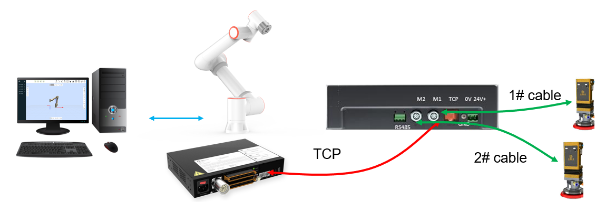

.. centered:: Schemat 8.17‑1 Zastosowanie głowicy szlifierskiej DARU DFC robota współpracującego

Moduł sterownika ze sterowaniem siłą wymaga następującej konfiguracji: Skonfiguruj stronę Ethernet z adresem IP: 192.168.58.88, numerem portu: 2000.

Konfiguracja funkcji
~~~~~~~~~~~~~~~~~~~~

Otwórz WebApp, kolejno kliknij „Ustawienia początkowe”, „Urządzenia peryferyjne”, „Szlifowanie”. Typy sterowania głowicą szlifierską to dwa: „Urządzenia dostosowane” i „Otwarty protokół urządzeń peryferyjnych”:
Urządzenia dostosowane: Dla dostosowanych typów urządzeń głowicy szlifierskiej, otwarty protokół jest automatycznie generowany i ładowany, nie wymaga pisania przez użytkownika.
Otwarty protokół urządzeń peryferyjnych: Użytkownik pisze w Lua otwarty protokół głowicy szlifierskiej, który ma być dostosowany, aby zaimplementować komunikację i sterowanie.

.. figure:: robot_peripherals/268.png
   :align: center
   :width: 6in

.. centered:: Schemat 8.17‑2 Typ sterowania szlifowaniem

Konfiguracja urządzeń dostosowanych
+++++++++++++++++++++++++++++++++++

Otwórz WebApp, kolejno kliknij „Ustawienia początkowe”, „Urządzenia peryferyjne”, „Głowica szlifierska”, „Urządzenia dostosowane”. Wybierz typ w stanie urządzenia jako „Głowica szlifierska DARU DFC”. Kliknij „Konfiguruj”. Spowoduje to automatyczne załadowanie wbudowanego otwartego protokołu urządzeń peryferyjnych „CtrlDev_DARUDFCPOLISH.lua”.

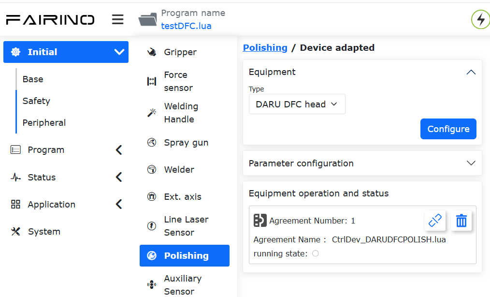

.. centered:: Schemat 8.17‑3 Automatyczne ładowanie otwartego protokołu urządzeń peryferyjnych dla urządzenia DARU DFC

Po upewnieniu się, że połączenie sprzętowe jest prawidłowe, możesz uruchomić otwarty protokół. Gdy stan działania jest zielony, a stan komunikacji w pasku sprzężenia zwrotnego stanu Polish po prawej stronie wskazuje nawiązanie połączenia, oznacza to, że robot pomyślnie nawiązał komunikację ze sterownikiem głowicy szlifierskiej. W tym momencie, poprzez konfigurację parametrów, można skonfigurować kanał głowicy szlifierskiej ze sterowaniem siłą, który ma być ustawiony, oraz wielkość siły. Otwarty protokół będzie cyklicznie wysyłał ustawione wartości, kanał, bieżące rx, ry, rz robota do głowicy szlifierskiej, jak pokazano na rysunku 2-3. Ponadto pasek sprzężenia zwrotnego stanu Polish będzie również wyświetlał w czasie rzeczywistym bieżącą wartość siły zwrotnej z głowicy szlifierskiej i ostrzeżenia o przekroczeniu zakresu siły. Gdy pojawi się ostrzeżenie, w prawym górnym rogu strony pojawi się również alarm, jak pokazano na rysunku 2-4.

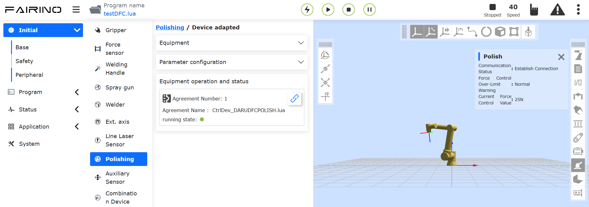

.. centered:: Schemat 8.17‑4 Ustawienia strony głowicy szlifierskiej DFC i sprzężenie zwrotne stanu

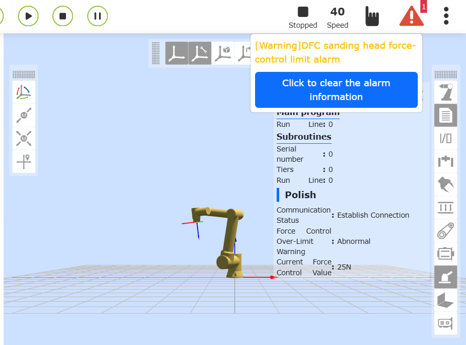

.. centered:: Schemat 8.17‑5 Alarm przekroczenia zakresu siły głowicy szlifierskiej DFC

Pobieranie otwartego protokołu urządzeń peryferyjnych
+++++++++++++++++++++++++++++++++++++++++++++++++++++

Kliknij przycisk „Pobierz” w „Otwartym protokole urządzeń peryferyjnych”, aby pobrać protokół na komputer lokalny. Otwarty protokół urządzeń peryferyjnych to program LUA wykonywany cyklicznie. Program wykonuje następujące kroki w każdym cyklu:

① Odczytuje dane sterujące głowicą szlifierską DFC z robota;

② Zapisuje dane sterujące do głowicy szlifierskiej DFC przez socket;

③ Odczytuje dane stanu z głowicy szlifierskiej DFC przez socket;

④ Przekazuje dane stanu głowicy szlifierskiej DFC z powrotem do robota;

Cykliczne wykonywanie protokołu komunikacji umożliwia komunikację i sterowanie między robotem a głowicą szlifierską. W protokole komunikacji użytkownik może dostosować cykl pętli, port serwera i IP, z którymi ma się połączyć.

Poniżej przykładowy kod protokołu komunikacji dla głowicy szlifierskiej DARU DFC:

.. code-block:: 
    :linenos:

    local id = 1 
    local ctrlValues = {0,0, 0,0, 0,0, 0,0}
    local realTimeState = {0,0, 0,0, 0,0, 0,0}
    socket1 = TCPClientConnect('192.168.58.88', 2000, 500, 10, 2, 3)
    sleepCnt = 100
    while(sleepCnt > 0) do
        local stopFlag = GetOpenLUAStopFlag(id)
        if(stopFlag ~= 0) then 
          TCPClientDisconnect(socket1)
          setDFCPolishRealtimeState(0, 0, 0)
          break
        end 
      sleepCnt = sleepCnt -1
      sleep_ms(50)
    end
    local cnt = 5
    while(1) do
        channel, force = getDFCPolishSet()
        comState, sendBuff = DFCPolishInput(socket1, channel, force)
        sleep_ms(50)

        byte, error, forceFeedback = DFCPolishOutput(socket1)
        setDFCPolishRealtimeState(comState, error, forceFeedback)
        sleep_ms(50)

      if(comState == 0) then
          TCPClientDisconnect(socket1)
          while(cnt > 0) do
            socket1 = TCPClientConnect('192.168.58.88', 2000, 500, 10, 2, 3)
            cnt = cnt - 1
            if(socket1 > 0)then
              break
            end
          end
      end

        local stopFlag = GetOpenLUAStopFlag(id)
        if(stopFlag ~= 0 or cnt == 0) then 
          TCPClientDisconnect(socket1)
          setDFCPolishRealtimeState(0, 0, 0)
          break
        end    
    end

Zastosowanie programu LUA dla głowicy szlifierskiej DFC
~~~~~~~~~~~~~~~~~~~~~~~~~~~~~~~~~~~~~~~~~~~~~~~~~~~~~~~

Dodając do programu LUA robota instrukcje konfiguracji sterowania siłą DFC, przełączania kanałów, pobierania stanu itp., w połączeniu z instrukcjami ruchu robota, można elastycznie i wygodnie zrealizować zastosowania szlifowania.
Otwórz WebApp, kolejno kliknij „Program nauczania”, „Programowanie”, utwórz nowy program LUA „testDFC.lua”.

.. figure:: robot_peripherals/272.png
   :align: center
   :width: 6in

.. centered:: Schemat 8.17‑6 Tworzenie nowego programu „testDFC.lua”

Wybierz typ instrukcji jako „Instrukcje urządzeń peryferyjnych”. W instrukcjach urządzeń peryferyjnych kliknij przycisk „Urządzenie szlifujące”. W tym momencie po prawej stronie WebApp pojawi się strona dodawania instrukcji szlifowania „Polish”. Wybierz typ urządzenia jako „Głowica szlifierska DARU DFC”.

.. figure:: robot_peripherals/273.png
   :align: center
   :width: 6in

.. centered:: Schemat 8.17‑7 Dodawanie instrukcji głowicy szlifierskiej

Dodawanie instrukcji sterowania głowicą szlifierską
+++++++++++++++++++++++++++++++++++++++++++++++++++

W programie LUA napisz instrukcje sterowania głowicą szlifierską, aby móc ustawić sterowanie siłą DFC i wybrać kanał.

Na stronie dodawania instrukcji urządzenia szlifującego kliknij „Ustaw DFC”. Wybierz tryb kanału głowicy szlifierskiej jako „2”. Ustaw siłę na „10”. Kliknij przycisk „Dodaj”. W „Podglądzie programu” zostanie dodana instrukcja ustawiania głowicy szlifierskiej.

.. figure:: robot_peripherals/274.png
   :align: center
   :width: 6in

.. centered:: Schemat 8.17‑8 Dodawanie instrukcji sterowania głowicą szlifierską

Dodawanie instrukcji pobierania stanu głowicy szlifierskiej
+++++++++++++++++++++++++++++++++++++++++++++++++++++++++++

Kliknij „Pobierz dane DFC”. Kolejno kliknij „Dodaj”, „Zastosuj”. W „testDFC.lua” zostanie dodana instrukcja pobierania danych głowicy szlifierskiej „GetDFCState()”.

.. figure:: robot_peripherals/275.png
   :align: center
   :width: 6in

.. centered:: Schemat 8.17‑9 Dodawanie instrukcji pobierania stanu głowicy szlifierskiej

Instrukcja GetDFCState() zwraca 2 wartości, odpowiednio:

**DFCwarn**: Ostrzeżenie o przekroczeniu zakresu sterowania siłą 0-normalny 1-alarm;

**force**: Wartość zwrotna siły.

W „testDFC.lua” użyj trzech zmiennych do odbioru wartości zwracanych przez funkcję GetDFCState(). Poprzez zapytanie o zmienną Lua wyświetl powyższe informacje w obszarze wyświetlania zapytań o zmienne w WebApp.

.. figure:: robot_peripherals/276.png
   :align: center
   :width: 6in

.. centered:: Schemat 8.17‑10 Program pobierania stanu głowicy szlifierskiej

Przykład zastosowania
+++++++++++++++++++++

Poniżej przykład programu LUA do sterowania i monitorowania głowicy szlifierskiej DFC:

.. code-block:: 
    :linenos:

    SetDFCForce(0,25)
    while (1) do 
        PTP(c1,100,-1,0)
        SetDO(0,1,0,0)
        ARC(c2,0,0,0,0,0,0,0,c3,0,0,0,0,0,0,0,100,-1,0,100,200)
        DFCwarn,force = GetDFCState()
        RegisterVar("number","DFCwarn")
        RegisterVar("number","force")
        if(DFCwarn == 1) then
            PTP(safe,100,-1,0)
            break
        else
            PTP(p6,100,-1,0)
        end
        SetDO(0,0,0,0)
    end

Funkcja transmisji danych przez końcówkę
----------------------------------------

Przegląd
~~~~~~~~

Użytkownik może skonfigurować funkcję transmisji danych przez końcówkę, aby zrealizować funkcję wysyłania i odbierania danych nieokresowych oraz pozyskiwania danych okresowych dla dowolnych urządzeń peryferyjnych końcówki, w oparciu o otwarty protokół urządzeń peryferyjnych końcówki + CNDE + interfejs SDK. Dane okresowe wymagają napisania otwartego protokołu Lua końcówki i przesłania go do zastosowania na końcówce, aby zrealizować cykliczną interakcję z urządzeniami peryferyjnymi i odczyt danych. Przez konfigurację CNDE można uzyskać dane okresowe sprzężenia zwrotnego z urządzeń peryferyjnych. Dane nieokresowe są wysyłane i odbierane przez interfejs SDK.

Instrukcja użycia
~~~~~~~~~~~~~~~~~~~

**Krok 1**: Otwórz stronę robota, wybierz „Ustawienia początkowe” -> „Urządzenia peryferyjne” -> „Transmisja danych przez końcówkę”. Prześlij i zastosuj otwarty protokół Lua końcówki dla urządzeń peryferyjnych, które mają być dostosowane.

.. figure:: robot_peripherals/289.png
   :align: center
   :width: 6in

.. centered:: Schemat 8.18‑1 Przesyłanie protokołu transmisji danych przez końcówkę

**Krok 2**: Po ponownym uruchomieniu robota otwórz przycisk „Włącz protokół końcówki”, aby włączyć tę funkcję. Należy pamiętać, że po włączeniu tej funkcji inne już dostosowane urządzenia końcowe nie będą mogły być używane jednocześnie.

.. figure:: robot_peripherals/290.png
   :align: center
   :width: 4in

.. centered:: Schemat 8.18‑2 Włączanie protokołu transmisji danych przez końcówkę

**Krok 3**: Otwórz stronę robota, wybierz „Program nauczania” -> „Instrukcje urządzeń peryferyjnych” -> „Transmisja danych przez końcówkę”. Po włączeniu transmisji danych przez końcówkę, można za pomocą interfejsu lua przeprowadzić testowanie wysyłania i odbierania danych nieokresowych oraz pozyskiwania danych okresowych na końcówce. Rzeczywiste użycie wymaga współpracy z funkcją CNDE robota i SDK. Długość wysyłanych i odbieranych danych nieokresowych wynosi maksymalnie 16 bajtów, a dane okresowe maksymalnie 128 bajtów.

.. figure:: robot_peripherals/291.png
   :align: center
   :width: 6in

.. centered:: Schemat 8.18‑3 Interfejs lua dla danych nieokresowych transmisji danych przez końcówkę

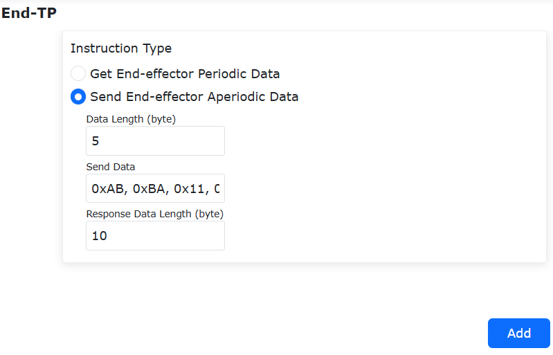

.. centered:: Schemat 8.18‑4 Interfejs lua dla danych okresowych transmisji danych przez końcówkę

Skrypt Lua funkcji transmisji danych przez końcówkę
~~~~~~~~~~~~~~~~~~~~~~~~~~~~~~~~~~~~~~~~~~~~~~~~~~~

Przegląd
++++++++

Funkcja otwartego protokołu Lua zyskała nowy interfejs ogólnej transmisji danych. Zgodnie z ustalonym interfejsem C Lua, napisz skrypt Lua, który we współpracy z CNDE umożliwi wysyłanie i odbieranie danych do i z urządzeń zamontowanych na końcówce.

Opis pisania skryptu Lua końcówki
+++++++++++++++++++++++++++++++++

Funkcje zarejestrowane w C Lua dla wysyłania i odbierania przez Rs485
***************************************************************************
（1）Funkcja zarejestrowana w C Lua dla wysyłania przez Rs485: EndTxCustomData(). Ta funkcja wysyła instrukcje przez Rs485 do zamontowanego urządzenia.

.. code-block:: 
    :linenos:

    Tcmd={0}
    EndTxCustomData(Tcmd)

.. centered:: Kod 8.18-1 Opis skryptu Lua

（2）Funkcja zarejestrowana w C Lua dla odbierania przez Rs485: EndRxCustomData(). Ta funkcja odbiera instrukcje odpowiedzi od zamontowanego urządzenia przesłane przez Rs485.

.. code-block:: 
    :linenos:

    Rcmd={0}
    EndRxCustomData(Rcmd)

.. centered:: Kod 8.18-2 Opis skryptu Lua

Funkcje zarejestrowane w C Lua dla wysyłania i odbierania danych nieokresowych
************************************************************************************

（1）Funkcja zarejestrowana w C Lua dla wysyłania danych nieokresowych: GetHostTransparentCmd(). Ta funkcja sprawdza, czy sterownik wysłał instrukcję danych nieokresowych. Jeśli tak, pobiera instrukcję danych nieokresowych. Maksymalna długość wysyłanej instrukcji danych nieokresowych wynosi 16 bajtów.

.. code-block:: 
    :linenos:

    Tcmd={0}
    RxFlag=0
    RxFlag = GetHostTransparentCmd(Tcmd)
    if(RxFlag == 1)then
    EndTxCustomData(Tcmd)

.. centered:: Kod 8.18-3 Opis skryptu Lua

（2）Funkcja zarejestrowana w C Lua dla zwracania instrukcji danych nieokresowych: BackHostTransparentCmd(). Ta funkcja przekazuje instrukcję danych nieokresowych odpowiedzi od zamontowanego urządzenia z powrotem do sterownika. Maksymalna długość odbieranej instrukcji danych nieokresowych wynosi 16 bajtów.

.. code-block:: 
    :linenos:

    Rcmd={0}
    EndRxCustomData(Rcmd)
    BackHostTransparentCmd(Rcmd)

.. centered:: Kod 8.18-4 Opis skryptu Lua

Funkcje zarejestrowane w C Lua dla zwracania danych okresowych
*******************************************************************

（1）Funkcja zarejestrowana w C Lua dla zwracania danych okresowych: SetDWrodInputBack(). Ta funkcja przekazuje odczytane dane okresowe z zamontowanego urządzenia z powrotem do sterownika. Maksymalna ilość zwracanych danych okresowych to 128 bajtów.

.. code-block:: 
    :linenos:

    R = {0}
    TotalNum =0
    PacketNum=0
    TotalNum,PacketNum=SetDWrodInputBack(R)

.. centered:: Kod 8.18-5 Opis skryptu Lua

Przykład skryptu Lua napisanego dla głowicy terapeutycznej Beiyikang
*********************************************************************

.. code-block:: 
    :linenos:

    --***
    --Utrzymanie normalnego działania innych funkcji końcówki
    while(1)
    do
    IwdgTaskHandle()
    MainLoop()
    UpDownLoadHandle()
    SdoRwPara()
    EndErrClear()
    local BFlag=LuaBreak()
    if(BFlag==1)then
    break
    end
    --***
    --***
    --Przykład wysyłania danych nieokresowych
    Rcmd = {0}       --Przechowuje dane nieokresowe odpowiedzi od zamontowanego urządzenia
    Tcmd = {0}       --Przechowuje dane nieokresowe wysłane przez sterownik
    RxFlag=0         --Flaga, czy sterownik wysłał instrukcję
    RxFlag = GetHostTransparentCmd(Tcmd)
    if(RxFlag == 1)then
    EndTxCustomData(Tcmd)
    DelayMs(35)
    EndRxCustomData(Rcmd)
    if((#Rcmd) > 1))and(R[1]==0xAB)and(R[2]==0xBA)) then
    BackHostTransparentCmd(Rcmd)
    end
    end
    --***
    --***
    --Przykład wysyłania danych okresowych
    R = {0}          --Przechowuje dane okresowe odpowiedzi od zamontowanego urządzenia
    T = {0xAB,0xBA,0x14,0x01,0xAA,0x24}     --Instrukcja zapytania o dane okresowe od zamontowanego urządzenia
    if TotalNum==0 then
    EndTxCustomData(T)
    DelayMs(35)
    EndRxCustomData(R)
    end
    TotalNum =0      --Jeśli dane okresowe wymagają podziału na pakiety, całkowita liczba pakietów
    PacketNum=0     --Numer bieżącego pakietu
    if((#R==19)and(R[1]==0xAB)and(R[2]==0xBA)and(R[3]==0x14)and(R[4]==0x0E))then
    TotalNum,PacketNum=SetDWrodInputBack(R)
    if PacketNum>TotalNum then
    PacketNum=0
    TotalNum=0
    end
    end
    --***
    LuaGc()
    end

Funkcja Zręcznej Dłoni
---------------------------------------------------------------------

Przegląd
~~~~~~~~~~~~~~~~~~~~~~~~~~~~~~

Otwarty protokół LUA końcówki dodaje następujące funkcje:

1. Otwarty protokół LUA końcówki dostosowuje się do zręcznej dłoni, aby umożliwić synchroniczny ruch stawów zręcznej dłoni.
2. Dodano funkcję wysyłania synchronicznych poleceń do wielu urządzeń podrzędnych w celu jednoczesnej reakcji wielu silników podrzędnych.

Konfiguracja Środowiska
~~~~~~~~~~~~~~~~~~~~~~~~~~~~~~~~~~~~~~~~~~~~~~~~~~~~~~~~~~~~

Wersja Firmware Końcówki: FR_END_FV201013_MAIN_U1_T01_20260407

Wersja Oprogramowania Robota: V3.9.7 i nowsze

Instrukcje Operacyjne Dotyczące Zręcznej Dłoni
~~~~~~~~~~~~~~~~~~~~~~~~~~~~~~~~~~~~~~~~~~~~~~~~~~~~~~~~~~~~~~~~~~~~~~

Konfiguracja Zręcznej Dłoni
+++++++++++++++++++++++++++++++++++++++++++++++++++++++++++++++++++

1. Otwórz WebApp, przejdź do Ustawienia Początkowe -> Urządzenia Perferyjne -> Zręczna Dłoń -> Zarządzanie Protokołami, prześlij plik Lua zręcznej dłoni, wybierz przesłany plik i kliknij przycisk "Zastosuj". Po komunikacie o pomyślnej aktualizacji uruchom ponownie szafę sterowniczą.

.. figure:: robot_peripherals/306.png
   :align: center
   :width: 6in

.. centered:: Rysunek 8.19‑1 Zarządzanie Protokołami

2. Otwórz WebApp, przejdź do Ustawienia Początkowe -> Urządzenia Perferyjne -> Zręczna Dłoń -> Parametry Komunikacji, skonfiguruj parametry komunikacji, w tym prędkość transmisji, bity danych, bity stopu itp., a po zakończeniu kliknij przycisk "Konfiguruj".

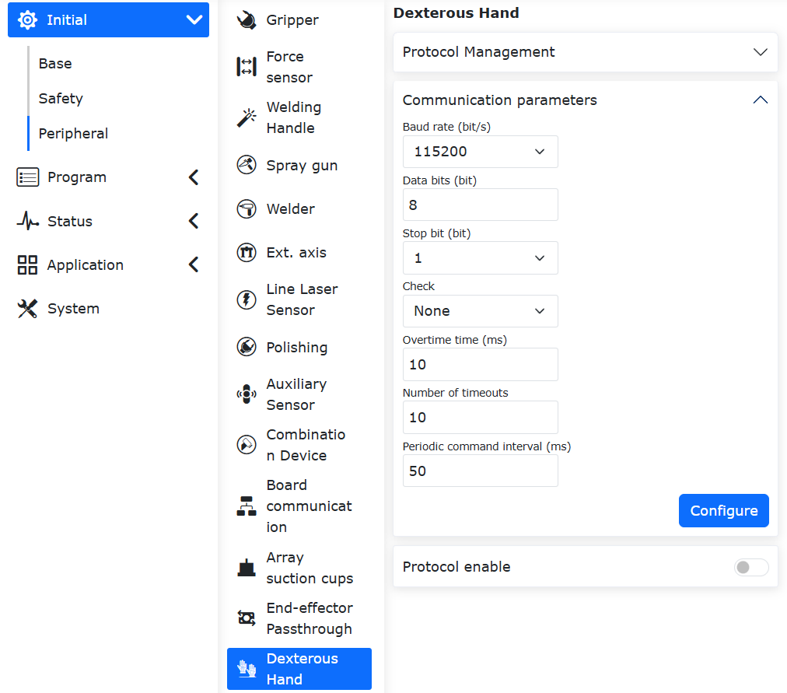

.. centered:: Rysunek 8.19‑2 Konfiguracja Parametrów Komunikacji

Szczegółowe parametry komunikacji końcówki są następujące:

- **Prędkość Transmisji**: Obsługuje 1-9600, 2-14400, 3-19200, 4-38400, 5-56000, 6-67600, 7-115200, 8-128000; układ drivera Rs485 końcówki to wolny 485, prędkość transmisji nie może przekraczać 200k;
- **Bity Danych**: Obsługuje (8, 9), obecnie najczęściej używane jest 8;
- **Bity Stopu**: 1-1, 2-0.5, 3-2, 4-1.5, obecnie najczęściej używane jest 1;
- **Parzystość**: 0-Brak, 1-Nieparzysta, 2-Parzysta, obecnie najczęściej używane jest 0;
- **Czas Timeout**: 1~1000ms, wartość ta musi być rozsądnie ustawiona w połączeniu z urządzeniami peryferyjnymi;
- **Liczba Prób Timeout**: 1~10, głównie do ponownego wysyłania w przypadku timeoutu, aby zmniejszyć sporadyczne anomalie i poprawić doświadczenie użytkownika;
- **Interwał Poleceń Okresowych**: 1~1000ms, głównie dla odstępu czasu między każdym wysłaniem polecenia okresowego;

3. Otwórz WebApp, przejdź do Ustawienia Początkowe -> Urządzenia Perferyjne -> Zręczna Dłoń -> Aktywacja Protokołu Końcówki, aktywuj protokół końcówki, uruchom urządzenie zręcznej dłoni i skonfiguruj odpowiednie kody funkcyjne dla zręcznej dłoni.

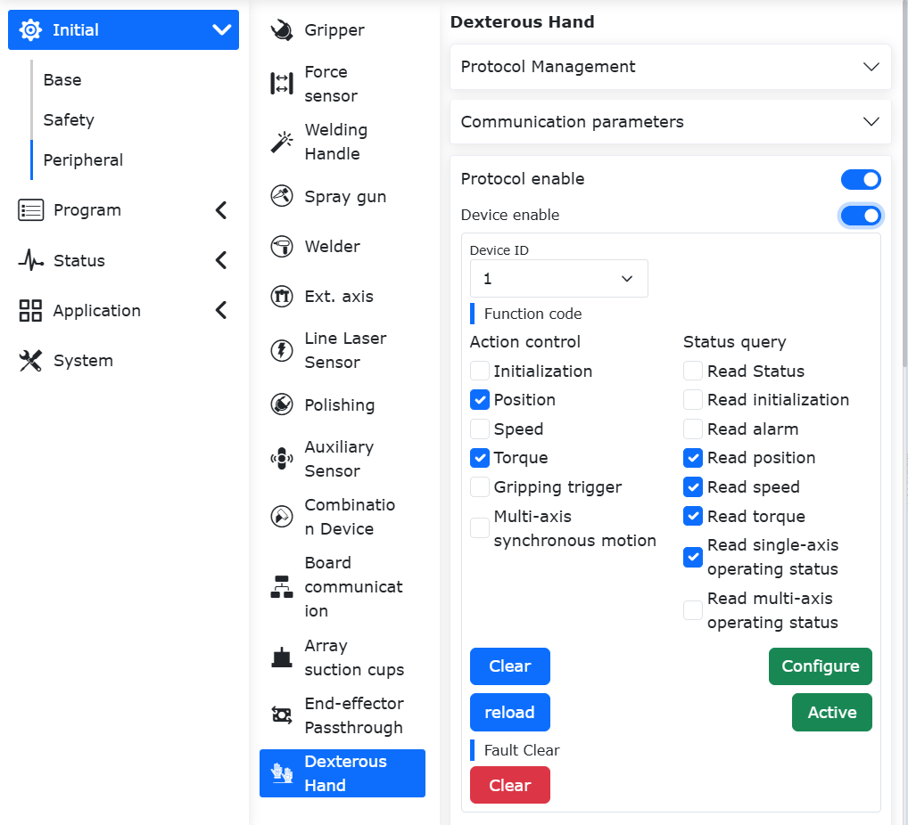

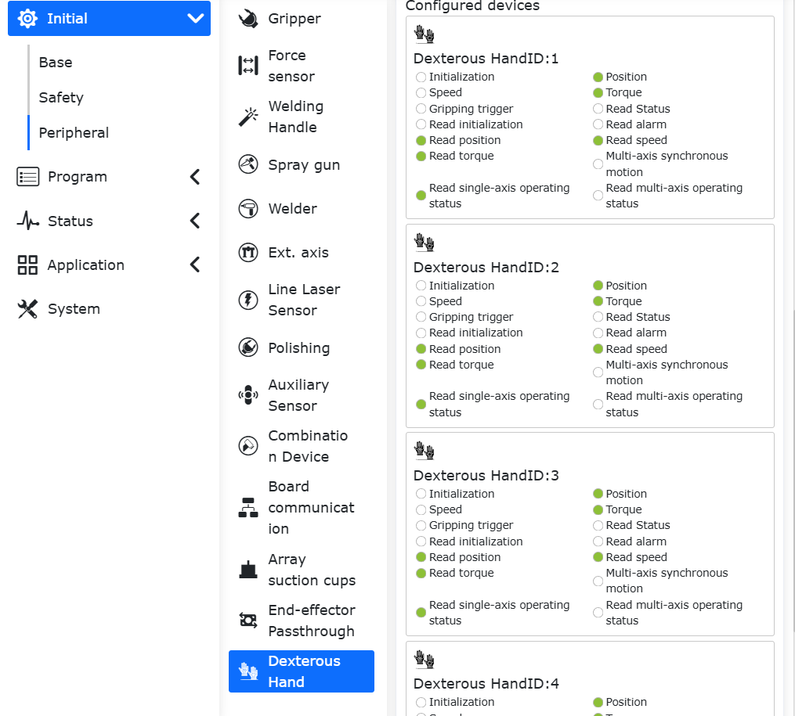

.. centered:: Rysunek 8.19‑3 Odpowiednie Kody Funkcyjne Zręcznej Dłoni

4. Obecnie zdefiniowane kody funkcyjne otwartego protokołu LUA końcówki są pokazane na poniższych rysunkach.

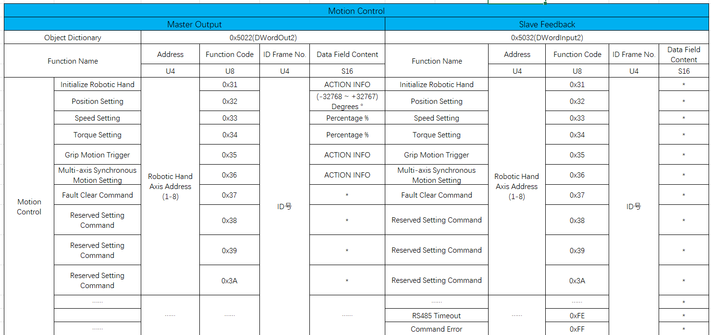

.. figure:: robot_peripherals/311.png
   :align: center
   :width: 6in

.. centered:: Rysunek 8.19‑4 Kody Funkcyjne Otwartego Protokołu

.. note:: Zręczna dłoń musi obsługiwać odczyt kodów funkcyjnych związanych ze stanem pracy, aby umożliwić zapytanie o stan ruchu.
  
Sterowanie Ruchem Zręcznej Dłoni
+++++++++++++++++++++++++++++++++++++++++++++++++++++++++++++++++++++++++++++++++

1. Otwórz WebApp, przejdź do Program Nauczania -> Interfejs Programowania i otwórz polecenia peryferyjne zręcznej dłoni.

.. figure:: robot_peripherals/312.png
   :align: center
   :width: 4in

.. centered:: Rysunek 8.19‑5 Polecenia Peryferyjne Zręcznej Dłoni
   
2. Kliknij Aktywuj, wybierz odpowiedni adres początkowy zręcznej dłoni i dodaj odpowiednie polecenie aktywacji.

.. figure:: robot_peripherals/313.png
   :align: center
   :width: 6in

.. centered:: Rysunek 8.19‑6 Polecenie Aktywacji Zręcznej Dłoni

3. Kliknij Sterowanie, wypełnij dane pozycji, prędkości i momentu obrotowego wymagane dla ruchu pojedynczego urządzenia podrzędnego zręcznej dłoni, wypełnij maksymalny czas timeoutu i dodaj odpowiednie polecenie sterowania.

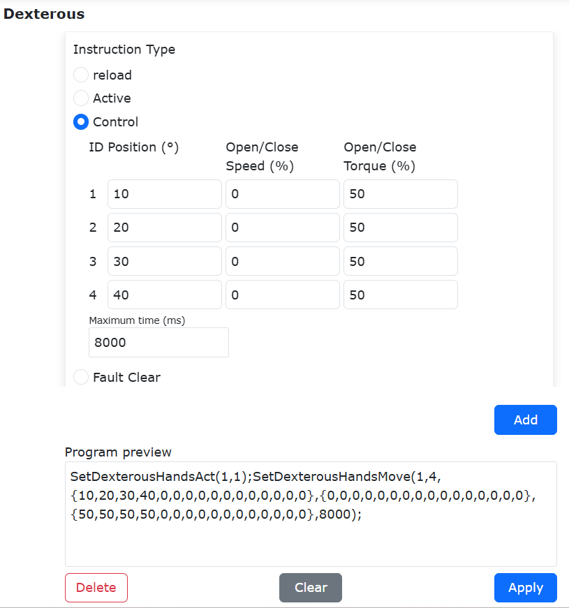

.. centered:: Rysunek 8.19‑7 Polecenie Sterowania Zręcznej Dłoni

Monitorowanie Danych Zręcznej Dłoni
+++++++++++++++++++++++++++++++++++++++++++++++++++++++++++++++++++++++++++++++++

Otwórz WebApp, przejdź do Ustawienia Początkowe -> Urządzenia Perferyjne -> Zręczna Dłoń -> Aktywacja Protokołu Końcówki i włącz monitorowanie stanu. Po wysłaniu poleceń sterowania, w interfejsie Dexterous po prawej stronie można uzyskać dane zwrotne w czasie rzeczywistym dotyczące pozycji, prędkości i momentu obrotowego pojedynczego urządzenia podrzędnego zręcznej dłoni.

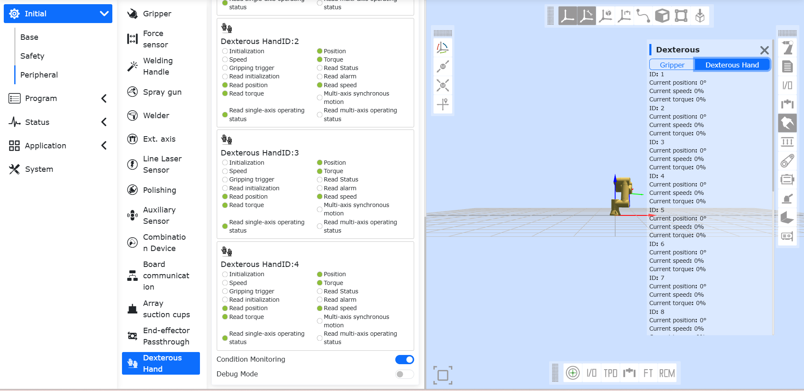

.. centered:: Rysunek 8.19‑8 Dane Zwrotne w Czasie Rzeczywistym Zręcznej Dłoni    