Bezpieczeństwo
===============

.. toctree:: 
   :maxdepth: 6

Bezpieczne zatrzymanie
----------------------

Kliknij menu "Ustawienia początkowe" -> "Bezpieczeństwo", kliknij podmenu "Bezpieczne zatrzymanie", aby przejść do interfejsu konfiguracji. Ustaw funkcje parametrów trybu bezpiecznego zatrzymania i strategii bezpiecznego zatrzymania.

.. image:: safety/001.png
   :width: 4in
   :align: center

.. centered:: Wykres 7.1-1 Konfiguracja bezpiecznego zatrzymania

Konfigurowalne bezpieczne zatrzymanie dwukanałowe + tryb redukcji
~~~~~~~~~~~~~~~~~~~~~~~~~~~~~~~~~~~~~~~~~~~~~~~~~~~~~~~~~~~~~~~~~

Omówienie
++++++++++++++++++++++++++++++++++++

Gdy sposób wyzwalania bezpiecznego zatrzymania jest ustawiony na "dwukanałowy", konieczne jest zapewnienie stanu wyczyszczenia obu kanałów i ręczne wyczyszczenie ostrzeżenia na interfejsie operacyjnym, aby robot mógł zostać zresetowany. Ponadto do strategii dodano opcję trybu redukcji. Gdy użytkownik wybierze tę strategię, robot przejdzie do ruchu w trybie redukcji.

Procedura operacyjna
++++++++++++++++++++++++++++++++++++

**Krok 1**: Kliknij "Ustawienia początkowe" -> "Bezpieczeństwo" -> przycisk "Bezpieczne zatrzymanie". Sposób wyzwalania można wybrać między dwoma trybami: "Domyślny" i "Dwukanałowy". Różnica między nimi polega na tym, że w trybie "Domyślny" po wyzwoleniu i przywróceniu błąd interfejsu jest automatycznie czyszczony, podczas gdy w trybie "Dwukanałowy" po wyzwoleniu i przywróceniu konieczne jest ręczne wyczyszczenie błędu interfejsu. "Strategia bezpiecznego zatrzymania" może wybrać typy takie jak "Zatrzymaj", "Wstrzymaj", "Tryb redukcji pierwszego poziomu" i "Tryb redukcji drugiego poziomu". Szczegółowy opis: po wybraniu "Zatrzymaj" robot zatrzyma bieżący ruch; po wybraniu "Wstrzymaj" robot wstrzyma bieżący ruch, a po przywróceniu i wyczyszczeniu błędu wznowi działanie; po wybraniu "Tryb redukcji pierwszego poziomu" robot przejdzie do ruchu w trybie redukcji pierwszego poziomu; po wybraniu "Tryb redukcji drugiego poziomu" robot przejdzie do ruchu w trybie redukcji drugiego poziomu.

.. image:: safety/048.png
   :width: 4in
   :align: center

.. centered:: Wykres 7.1-2 Ustawienia strategii bezpiecznego zatrzymania

**Krok 2**: Ponieważ gdy sposób wyzwalania jest ustawiony na "Domyślny", po przywróceniu wyzwolenia błąd interfejsu jest automatycznie czyszczony, nie ma potrzeby szczegółowego opisywania. Dlatego głównie opisujemy działanie, gdy sposób wyzwalania jest ustawiony na "Dwukanałowy": po przywróceniu wyzwolenia należy ręcznie kliknąć operację "Wyczyść" w prawym górnym rogu, aby robot mógł zostać zresetowany.

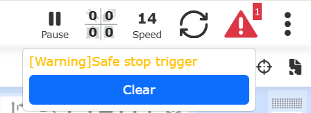

.. centered:: Wykres 7.1-3 Ręczne czyszczenie operacji wyzwolenia bezpiecznego zatrzymania

Bezpieczny ruch z ograniczoną prędkością
~~~~~~~~~~~~~~~~~~~~~~~~~~~~~~~~~~~~~~~~

Po wyzwoleniu bezpiecznego zatrzymania robota, użytkownik może kliknąć przycisk w aplikacji webowej, skonfigurować wejście CI skrzynki sterowniczej lub skonfigurować wejście End DI narzędzia końcowego, aby sterować robotem w celu przejścia w stan bezpiecznego ruchu z ograniczoną prędkością. W stanie bezpiecznego ruchu z ograniczoną prędkością można punktowo poruszać robotem z bezpieczną prędkością lub przejść w tryb przeciągania, aby przeciągnąć robota, co pomaga użytkownikowi w usunięciu usterki.

W aplikacji webowej robota kolejno kliknij "Ustawienia początkowe", "Bezpieczeństwo", "Bezpieczne zatrzymanie", znajdź na tej stronie "Bezpieczny ruch z ograniczoną prędkością" i ustaw go na włączony.

.. image:: safety/057.png
   :width: 4in
   :align: center

.. centered:: Wykres 7.1-4 Włączanie bezpiecznego ruchu z ograniczoną prędkością

W tym momencie, gdy bezpieczne zatrzymanie zostanie wyzwolone, w prawym górnym rogu aplikacji webowej robota pojawi się ostrzeżenie "Wyzwolono bezpieczne zatrzymanie" oraz przycisk "Przejdź do bezpiecznego ruchu z ograniczoną prędkością".

.. image:: safety/058.png
   :width: 4in
   :align: center

.. centered:: Wykres 7.1-5 Okno dialogowe przejścia do bezpiecznego ruchu z ograniczoną prędkością

Kliknij przycisk "Przejdź", a robot automatycznie zatrzyma program LUA i przełączy się w tryb ręczny. Jednocześnie przycisk "Przejdź do bezpiecznego ruchu z ograniczoną prędkością" zmieni się na "Włączono". W tym momencie, za pomocą przycisku końcowego, panelu przyciskowego, aplikacji webowej itp., można sterować robotem, aby przejść w tryb przeciągania i przeciągnąć robota, lub punktowo poruszać robotem za pomocą aplikacji webowej lub panelu operatorskiego.

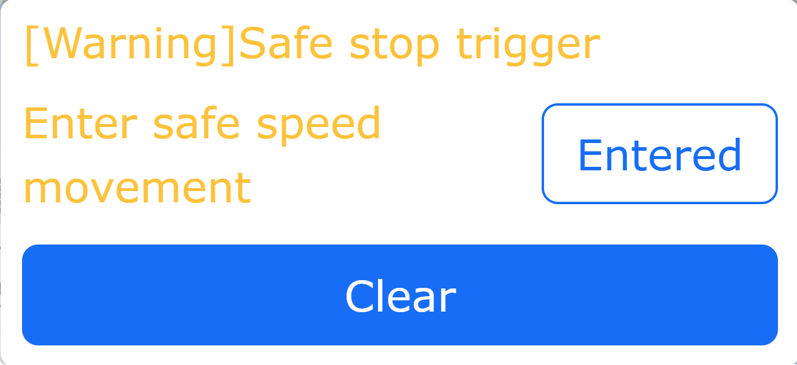

.. centered:: Wykres 7.1-6 Przejście do bezpiecznego ruchu z ograniczoną prędkością

Podczas bezpiecznego ruchu robota z ograniczoną prędkością i punktowego poruszania robotem w przestrzeni kartezjańskiej, maksymalna prędkość ruchu robota jest ustawioną bezpieczną prędkością. Jeśli bieżące ustawienie prędkości globalnej robota jest większe niż bezpieczna prędkość, punktowy ruch robota zostanie automatycznie zmniejszony do bezpiecznej prędkości. Ustawienie bezpiecznej prędkości znajduje się w "Ustawienia początkowe", "Bezpieczeństwo", "Bezpieczna prędkość".

Po bezpiecznym zatrzymaniu robota, oprócz możliwości sterowania robotem w celu przejścia do bezpiecznej prędkości z prawego górnego rogu aplikacji webowej, można to również zrobić poprzez wejście CI skrzynki sterowniczej i wejście CI końcówki. W aplikacji webowej kolejno kliknij "Ustawienia początkowe", "Podstawowe", "Ustawienia I/O", "DI". Skonfiguruj port CI skrzynki sterowniczej lub End DI narzędzia końcowego jako "Przejdź do bezpiecznego ruchu z ograniczoną prędkością". Po wyzwoleniu bezpiecznego zatrzymania wystarczy wyzwolić sygnał wejściowy skonfigurowanego portu, aby przejść do bezpiecznego ruchu z ograniczoną prędkością.

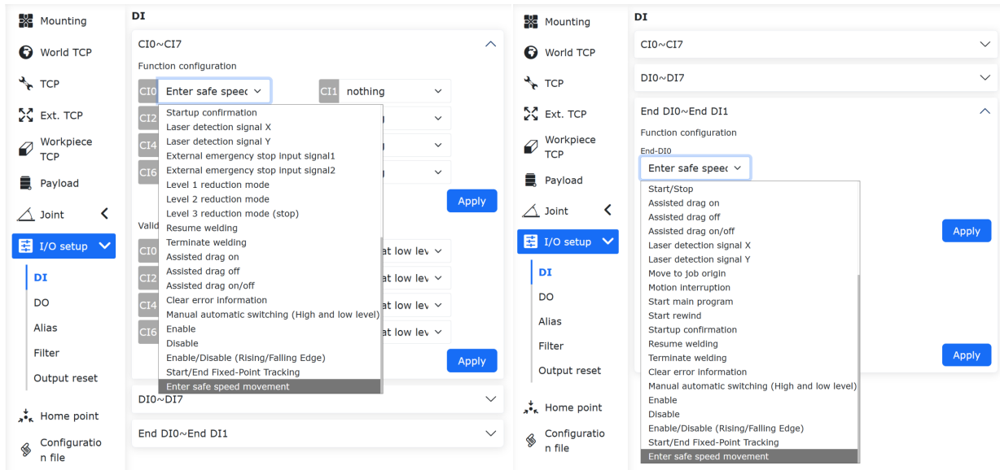

.. centered:: Wykres 7.1-7 Przejście do bezpiecznego ruchu z ograniczoną prędkością za pomocą przycisku

Bezpieczne zatrzymanie tylko w trybie automatycznym
~~~~~~~~~~~~~~~~~~~~~~~~~~~~~~~~~~~~~~~~~~~~~~~~~~~

Gdy robot włączy tryb bezpiecznego zatrzymania (certyfikacja CR, bezpieczeństwo funkcjonalne) i jest używany z trójpozycyjnym przełącznikiem załączającym panelu operatorskiego, można włączyć "Bezpieczne zatrzymanie tylko w trybie automatycznym". Gdy sygnał bezpiecznego zatrzymania robota zostanie wyzwolony, można przełączyć robota w tryb ręczny na panelu operatorskim i w trybie ręcznym punktowo poruszać robotem lub przejść w tryb przeciągania, aby przeciągnąć robota, co pomaga użytkownikowi w usunięciu usterki.

W aplikacji webowej robota kolejno kliknij "Ustawienia początkowe", "Bezpieczeństwo", "Bezpieczne zatrzymanie", znajdź na tej stronie "Bezpieczne zatrzymanie tylko w trybie automatycznym" i ustaw je na włączone.

.. image:: safety/061.png
   :width: 4in
   :align: center

.. centered:: Wykres 7.1-8 Włączenie bezpiecznego zatrzymania tylko w trybie automatycznym

Gdy robot nie włączy trybu bezpiecznego zatrzymania (certyfikacja CR, bezpieczeństwo funkcjonalne) lub gdy nie używa się panelu operatorskiego, nie można włączyć funkcji "Bezpieczne zatrzymanie tylko w trybie automatycznym". W takim przypadku aplikacja webowa wyświetli komunikat o błędzie "Bezpieczne zatrzymanie tylko w trybie automatycznym wymaga włączenia trójpozycyjnego przełącznika załączającego na panelu operatorskim". Jednocześnie, gdy tryb bezpiecznego zatrzymania zostanie wyłączony lub panel operatorski zostanie wyłączony, funkcja "Bezpieczne zatrzymanie tylko w trybie automatycznym" również zostanie automatycznie wyłączona.

.. image:: safety/062.png
   :width: 3in
   :align: center

.. centered:: Wykres 7.1-9 Komunikat błędu przy włączaniu bezpiecznego zatrzymania tylko w trybie automatycznym

Bezpieczna prędkość
-------------------

Kliknij menu "Ustawienia początkowe" -> "Bezpieczeństwo", kliknij podmenu "Bezpieczna prędkość", aby przejść do interfejsu konfiguracji. Ustaw bezpieczną prędkość.

.. note:: Ręczna prędkość TCP jest mniejsza niż 250 mm/s.

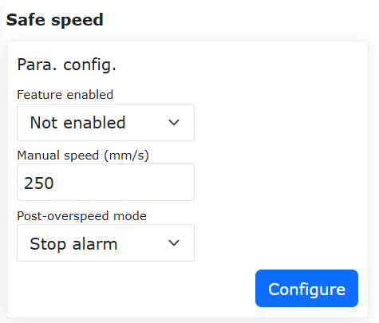

.. centered:: Wykres 7.2-1 Konfiguracja bezpiecznej prędkości ręcznej

Funkcja bezpiecznej prędkości
~~~~~~~~~~~~~~~~~~~~~~~~~~~~~

Omówienie
+++++++++++++++++++++++++++++

Funkcja bezpiecznej prędkości robota polega na aktywnym ograniczaniu prędkości robota w środowiskach współpracy człowiek-robot lub dynamicznych, utrzymując energię kinetyczną i siłę uderzenia w bezpiecznych progach, aby zapobiec obrażeniom personelu w przypadku przypadkowego kontaktu oraz skutecznie chronić urządzenia i przedmioty przed uszkodzeniami spowodowanymi kolizjami.

Procedura operacyjna
+++++++++++++++++++++++++++++

**Krok 1**: Kliknij przycisk "Ustawienia początkowe" - "Bezpieczeństwo" - "Bezpieczna prędkość", aby ustawić parametry bezpiecznej prędkości. Obejmuje to głównie trzy części: "Włączenie funkcji", "Ograniczenie prędkości" i "Tryb po przekroczeniu prędkości".

W sekcji włączenia funkcji można wybrać trzy typy: "Nie włączaj", "Włącz w trybie ręcznym" i "Włącz we wszystkich trybach".

W sekcji ograniczenia prędkości ustaw ograniczenie prędkości. Gdy prędkość liniowa robota osiągnie to ograniczenie prędkości, zostanie podjęte działanie zgodnie z ustawionymi parametrami w sekcji "Tryb po przekroczeniu prędkości". "Tryb po przekroczeniu prędkości" można wybrać spośród trzech trybów: "Zatrzymaj z alarmem", "Automatyczne ograniczenie prędkości" i "Odłącz po zatrzymaniu z alarmem". Automatyczne ograniczenie prędkości może być używane tylko w "Włącz w trybie ręcznym".

Po zakończeniu ustawiania wymaganych parametrów nie są potrzebne żadne dodatkowe operacje. Robot będzie przetwarzany zgodnie z ustawionymi parametrami. Ustawienia parametrów pokazano na rysunku.

.. image:: safety/056.png
   :width: 4in
   :align: center

.. centered:: Wykres 7.2-2 Ustawienia parametrów bezpiecznej prędkości

Bezpieczeństwo I/O
------------------

Kliknij menu "Ustawienia początkowe" -> "Bezpieczeństwo", kliknij podmenu "Bezpieczeństwo I/O", aby przejść do interfejsu konfiguracji.

HMI umożliwia ustawienie stanu bezpieczeństwa dla 16 wejść cyfrowych i 16 wyjść cyfrowych. Można je ustawić jako aktywne lub nieaktywne. Gdy kontroler stwierdzi, że znajduje się w stanie bezpieczeństwa, 16 wejść cyfrowych i 16 wyjść cyfrowych zostaje ustawionych w stan bezpieczeństwa.

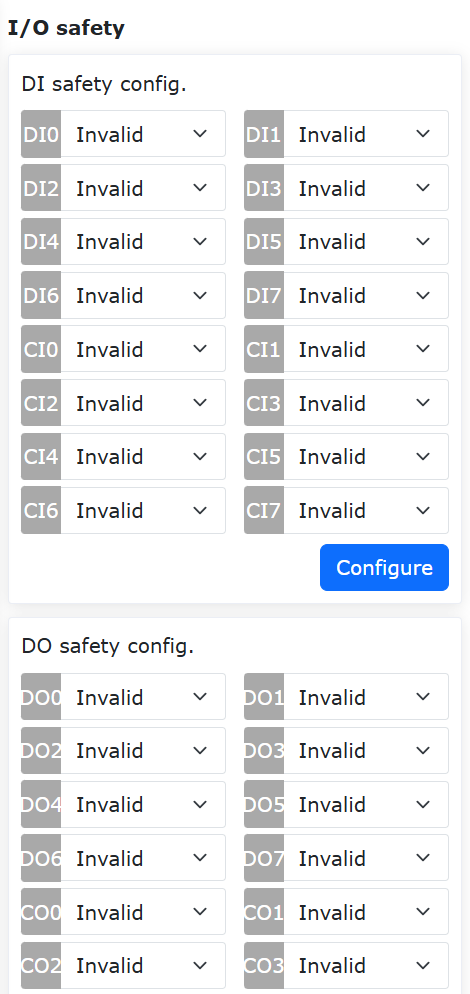

.. centered:: Wykres 7.3-1 Konfiguracja stanu bezpieczeństwa I/O

W systemie LA:
    "Bezpieczeństwo I/O" zapewnia funkcję bezpieczeństwa DIO. Funkcja bezpieczeństwa to dwukanałowe DI lub DO. Gdy wykryty zostanie sygnał bezpieczeństwa DI lub wyzwolony zostanie znacznik stanu bezpieczeństwa, DO jest wyjściem.

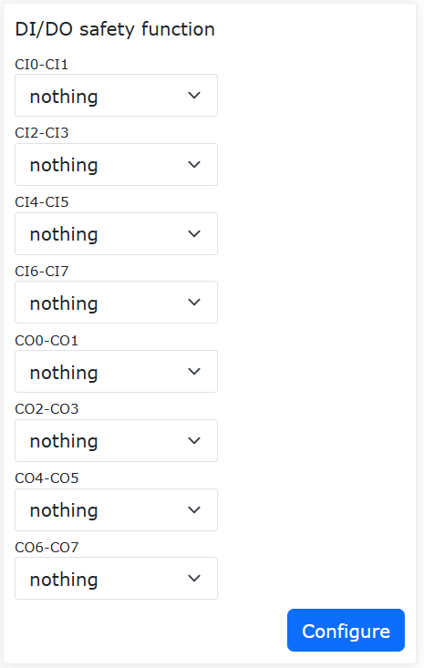

.. centered:: Wykres 7.3-2 Konfiguracja funkcji bezpieczeństwa I/O

Awaryjne zatrzymanie
--------------------

Kliknij menu "Ustawienia początkowe" -> "Bezpieczeństwo", kliknij podmenu "Awaryjne zatrzymanie", aby przejść do interfejsu konfiguracji.

Typy awaryjnego zatrzymania 0, 1a, 1b, 2 są konfigurowalne. Limit czasu zatrzymania jest konfigurowalny. Limit odległości zatrzymania jest konfigurowalny.

- Za pośrednictwem kontrolera wysyłanego do płyty skrzynki sterowniczej, typ awaryjnego zatrzymania 0 powoduje bezpośrednie odcięcie zasilania płyty skrzynki sterowniczej.
  
- Typ awaryjnego zatrzymania 1a oznacza, że po zwolnieniu zatrzymania zasilanie korpusu jest odcinane.

- Typ awaryjnego zatrzymania 1b oznacza, że po zwolnieniu zatrzymania zasilanie korpusu nie jest odcinane, a korpus jest odłączany.

- Typ awaryjnego zatrzymania 2 oznacza naciśnięcie awaryjnego zatrzymania, robot zwalnia i zatrzymuje się, pozostając załączonym. Po zwolnieniu awaryjnego zatrzymania robot powinien działać normalnie.

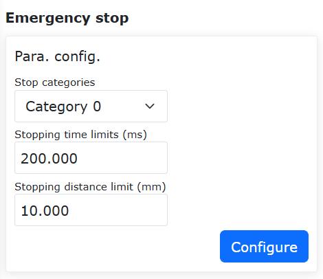

.. centered:: Wykres 7.4-1 Konfiguracja awaryjnego zatrzymania

Funkcja automatycznego załączania po przywróceniu bezpiecznego zatrzymania
~~~~~~~~~~~~~~~~~~~~~~~~~~~~~~~~~~~~~~~~~~~~~~~~~~~~~~~~~~~~~~~~~~~~~~~~~~

Omówienie
+++++++++++++++++++++

Po doświadczeniu awaryjnego zatrzymania typu 1b, robot oferuje dwa tryby: ręczne załączanie i automatyczne załączanie, do wyboru przez użytkownika. Gdy wybrano ręczne załączanie, użytkownik musi po zwolnieniu przycisku awaryjnego zatrzymania zmienić tryb pracy robota na automatyczny i ręcznie kliknąć przycisk załączania, aby załączyć robota. Gdy wybrano automatyczne załączanie, po zwolnieniu przycisku awaryjnego zatrzymania robot automatycznie się załącza.

Procedura operacyjna
+++++++++++++++++++++++++++

**Krok 1**: Kliknij "Ustawienia początkowe" -> "Bezpieczeństwo" -> przycisk "Awaryjne zatrzymanie". Wybierz "Typ 1b" w sekcji "Typ zatrzymania" i ustaw parametry "Limit czasu zatrzymania" i "Limit odległości zatrzymania" zgodnie z rzeczywistymi potrzebami. "Strategia załączania po resecie awaryjnego zatrzymania" może być wybrana jako "Ręczne załączanie" lub "Automatyczne załączanie".

.. image:: safety/046.png
   :width: 4in
   :align: center

.. centered:: Wykres 7.4-2 Ustawienia strategii załączania

**Krok 2**: Gdy wybrano "Automatyczne załączanie", po zwolnieniu przycisku awaryjnego zatrzymania robot automatycznie się załącza. Gdy wybrano "Ręczne załączanie", użytkownik musi po zwolnieniu przycisku awaryjnego zatrzymania, w trybie automatycznym, ręcznie kliknąć przycisk załączania, aby załączyć robota.

.. image:: safety/047.png
   :width: 6in
   :align: center

.. centered:: Wykres 7.4-3 Operacja ręcznego załączania

Zatrzymanie ochronne
--------------------

Kliknij menu "Ustawienia początkowe" -> "Bezpieczeństwo", kliknij podmenu "Zatrzymanie ochronne", aby przejść do interfejsu konfiguracji.

Typy zatrzymania ochronnego 0, 1, 2. Typ zatrzymania ochronnego 0 powoduje bezpośrednie odcięcie zasilania płyty skrzynki sterowniczej. Typ zatrzymania ochronnego 1 powoduje, że płyta skrzynki sterowniczej najpierw informuje kontroler, aby zatrzymał robota, a następnie kontroler informuje płytę skrzynki sterowniczej o odcięciu zasilania. Typ zatrzymania ochronnego 2 powoduje, że płyta skrzynki sterowniczej informuje kontroler, aby zatrzymał robota.

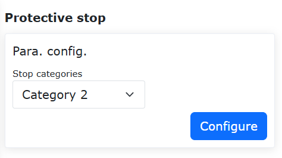

.. centered:: Wykres 7.5-1 Konfiguracja zatrzymania ochronnego

.. important::
    Znaczniki stanu danych bezpieczeństwa i informacje o usterce płyty nośnej skrzynki sterowniczej są uzyskiwane za pośrednictwem interfejsu internetowego i informacji zwrotnej o stanie kontrolera. Gdy znacznik ma wartość 1, w stanie alarmu WebAPP pojawia się informacja o nieprawidłowości stanu danych bezpieczeństwa. Po uzyskaniu usterki płyty nośnej skrzynki sterowniczej, konkretna informacja o usterce jest wyświetlana w stanie alarmu WebAPP na podstawie kodu błędu.

.. image:: safety/007.png
   :width: 4in
   :align: center

.. centered:: Wykres 7.5-2 Stan alarmu WebAPP

Konfiguracja strefy interferencji
---------------------------------

W menu "Ustawienia początkowe" -> "Bezpieczeństwo" -> "Strefa interferencji" kliknij podmenu "Pojedynczy", aby przejść do interfejsu konfiguracji funkcji strefy interferencji.

Najpierw musimy skonfigurować sposób interferencji i operację wejścia do strefy interferencji. Sposoby interferencji dzielą się na "interferencję osi" i "interferencję sześcianu".

.. image:: safety/025.png
   :width: 3in
   :align: center

.. centered:: Wykres 7.6-1 Sposoby strefy interferencji

Kontroluj za pomocą suwaka, czy funkcja jest włączona. Najpierw skonfiguruj "Kontynuuj ruch" lub "Zatrzymaj" dla ruchu w strefie interferencji. Następnie ustaw konfigurację przeciągania po wejściu do strefy interferencji. Użytkownik może ustawić strategię po wejściu do strefy interferencji w trybie przeciągania: brak ograniczenia przeciągania, sprzężenie zwrotne impedancji i przełączenie z powrotem na tryb ręczny.

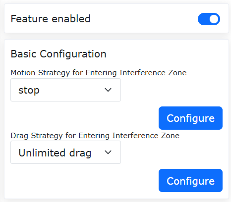

.. centered:: Wykres 7.6-2 Konfiguracja strefy interferencji

Wybierz interferencję osi. Należy skonfigurować parametry interferencji osi. Metody wykrywania dzielą się na "pozycję instrukcji" i "pozycję sprzężenia zwrotnego". Tryby strefy interferencji dzielą się na "interferencja w zakresie" i "interferencja poza zakresem". Następnie ustaw zakres każdego stawu oraz czy zakres każdego stawu jest włączony. Można wprowadzić wartości lub użyć "ikony odświeżania" po "Wartość minimalna" i "Wartość maksymalna", aby zapisać bieżącą pozycję robota. Na koniec kliknij "Konfiguruj".

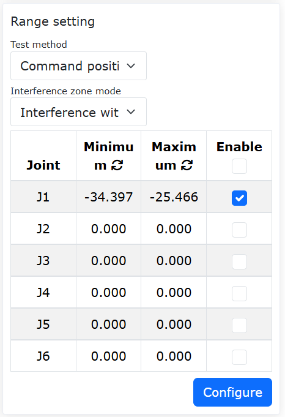

.. centered:: Wykres 7.6-3 Konfiguracja interferencji osi

Wybierz interferencję sześcianu. Należy skonfigurować parametry interferencji sześcianu. Metody wykrywania dzielą się na "pozycję instrukcji" i "pozycję sprzężenia zwrotnego". Tryby strefy interferencji dzielą się na "interferencja w zakresie" i "interferencja poza zakresem". Układ odniesienia dzieli się na "współrzędne podstawowe" i "współrzędne przedmiotu". Wybierz zgodnie z rzeczywistym użyciem. Następnie ustaw zakres. Zakres można ustawić na dwa sposoby. Najpierw spójrz na pierwszą metodę "metoda dwóch punktów", która polega na dwóch przeciwległych wierzchołkach sześcianu. Możemy wprowadzić lub zarejestrować pozycję za pomocą nauczania robota. Na koniec kliknij "Zastosuj".

.. image:: safety/028.png
   :width: 3in
   :align: center

.. centered:: Wykres 7.6-4 Konfiguracja interferencji sześcianu

Następnie spójrz na drugą metodę "punkt środkowy + długość boku", która polega na punkcie środkowym sześcianu i długości boku sześcianu tworzących strefę interferencji. Możemy wprowadzić lub zarejestrować pozycję za pomocą nauczania robota. Na koniec kliknij "Zastosuj".

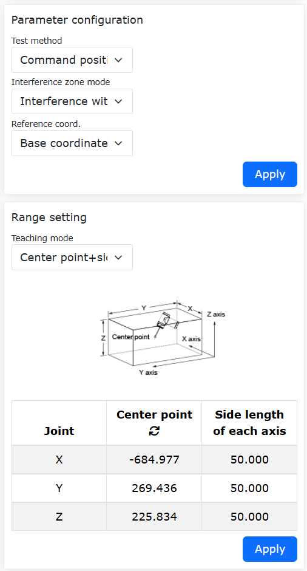

.. centered:: Wykres 7.6-5 Konfiguracja interferencji sześcianu

Funkcja bezpiecznego sprzężenia zwrotnego wejścia do interferencji osi podczas przeciągania wspomaganego czujnikiem siły
~~~~~~~~~~~~~~~~~~~~~~~~~~~~~~~~~~~~~~~~~~~~~~~~~~~~~~~~~~~~~~~~~~~~~~~~~~~~~~~~~~~~~~~~~~~~~~~~~~~~~~~~~~~~~~~~~~~~~~~~~

Omówienie
+++++++++++++++++++++++++

Funkcja bezpiecznego sprzężenia zwrotnego wejścia do interferencji osi podczas przeciągania wspomaganego czujnikiem siły polega na tym, że gdy przeciąganie wspomagane czujnikiem siły i strefa interferencji współistnieją, a robot wchodzi do strefy interferencji, robot automatycznie przełącza się w tryb przeciągania, uzyskując efekt sprzężenia zwrotnego impedancji. Gdy robot opuści strefę interferencji, automatycznie przełącza się z powrotem na przeciąganie wspomagane czujnikiem siły. Może to spełnić różne scenariusze użytkowania przeciągania wspomaganego czujnikiem siły.

Procedura operacyjna
++++++++++++++++++++

Pierścień ograniczenia stawu
****************************
**Krok 1**: Zaloguj się do interfejsu internetowego, kliknij przełącznik "Pierścień ograniczenia stawu". Pierścień ograniczenia stawu pojawi się w stawie robota, jak pokazano na poniższym rysunku.

.. image:: safety/030.png
   :width: 4in
   :align: center

.. centered:: Wykres 7.6-6 Pierścień ograniczenia stawu w interfejsie internetowym

**Krok 2**: Biały znacznik na pierścieniu ograniczenia stawu reprezentuje rzeczywisty kąt stawu. Wycięcie reprezentuje pozycję miękkiego limitu odpowiedniego stawu. Rozmiar wycięcia pierścienia ograniczenia stawu zmienia się wraz z rozmiarem miękkiego limitu. Podczas ruchu stawu, pierścień ograniczenia stawu pozostaje nieruchomy względem stawu.

Konfiguracja interferencji osi
******************************
**Krok 1**: Skonfiguruj i aktywuj interferencję osi. Kolejno kliknij "Ustawienia początkowe" -> "Bezpieczeństwo" -> "Strefa interferencji" -> "Pojedynczy", aby przejść do strony konfiguracji strefy interferencji. Kliknij kartę "Interferencja osi", aby przejść do interfejsu, i włącz suwak "Włącz funkcję".

**Krok 2**: Można ustawić "Strategię ruchu" na "Kontynuuj ruch", wybrać "Strategię przeciągania" jako "Sprzężenie zwrotne impedancji" i ustawić parametry sprzężenia zwrotnego impedancji, jak pokazano na poniższym rysunku. Parametry sprzężenia zwrotnego impedancji reprezentują siłę odbicia podczas sprzężenia zwrotnego impedancji. Im większa wartość, tym większa siła odbicia. Zalecana konfiguracja parametru to "5".

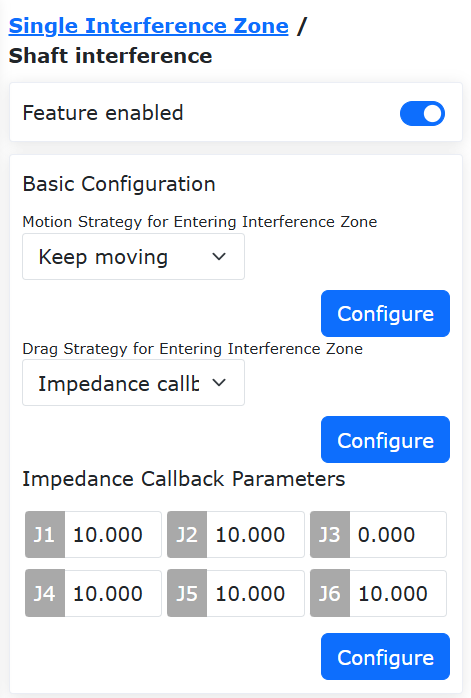

.. centered:: Wykres 7.6-7 Interfejs konfiguracji interferencji osi

**Krok 3**: Ustaw zakres strefy interferencji osi. Można ustawić "Tryb wykrywania" na "Pozycja sprzężenia zwrotnego". "Tryb strefy interferencji" można wybrać między dwoma trybami: "interferencja w zakresie" i "interferencja poza zakresem". Ustaw zakres strefy interferencji dla każdego stawu i wybierz "Włącz", aby aktywować zakres interferencji odpowiedniej osi, jak pokazano na poniższym rysunku.

.. image:: safety/032.png
   :width: 4in
   :align: center

.. centered:: Wykres 7.6-8 Interfejs konfiguracji zakresu strefy interferencji

**Krok 4**: Ustaw "Tryb strefy interferencji" na "interferencja w zakresie". Na pierścieniu ograniczenia stawu w interfejsie internetowym kolor zielony oznacza obszar swobodnego ruchu, a żółty obszar interferencji. Obszar, w którym znajduje się biały znacznik, jest podświetlony, jak pokazano na poniższym rysunku.

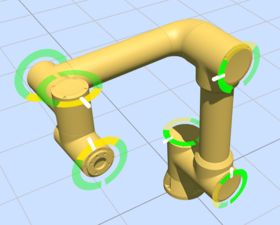

.. centered:: Wykres 7.6-9 Wyświetlanie pierścienia ograniczenia stawu przy "interferencji w zakresie"

**Krok 5**: Ustaw "Tryb strefy interferencji" na "interferencja poza zakresem". Na pierścieniu ograniczenia stawu w interfejsie internetowym kolor zielony oznacza obszar swobodnego ruchu, a żółty obszar interferencji. Obszar, w którym znajduje się biały znacznik, jest podświetlony, jak pokazano na poniższym rysunku.

.. image:: safety/034.png
   :width: 4in
   :align: center

.. centered:: Wykres 7.6-10 Wyświetlanie pierścienia ograniczenia stawu przy "interferencji poza zakresem"

Wejście do strefy interferencji osi podczas przeciągania wspomaganego czujnikiem siły
++++++++++++++++++++++++++++++++++++++++++++++++++++++++++++++++++++++++++++++++++++++

**Krok 1**: Kolejno kliknij "Aplikacje pomocnicze" -> "Narzędzia aplikacyjne" -> "Blokada przeciągania", aby przełączyć "Przełącznik stanu" funkcji blokady wspomaganej czujnikiem siły na "Włączony", wybrać opcję "Włączony" dla strefy interferencji, ustaw odpowiednie współczynniki i zastosuj, jak pokazano na poniższym rysunku.

.. image:: safety/035.png
   :width: 4in
   :align: center

.. centered:: Wykres 7.6-11 Interfejs konfiguracji przeciągania wspomaganego czujnikiem siły

**Krok 2**: Przeciągnij robota w trybie przeciągania wspomaganego czujnikiem siły. Gdy kąt stawu robota osiągnie zakres strefy interferencji, robot przełączy się w tryb przeciągania w pętli prądowej, uzyskując efekt sprzężenia zwrotnego impedancji, umożliwiając oddalenie się od strefy interferencji osi. Po opuszczeniu zakresu strefy interferencji osi robot przełączy się z powrotem na przeciąganie wspomagane czujnikiem siły.

Konfiguracja interferencji sześcianu
+++++++++++++++++++++++++++++++++++++++

**Krok 1**: Ustaw strefę interferencji sześcianu. Kolejno kliknij "Ustawienia początkowe" -> "Bezpieczeństwo" -> "Strefa interferencji" -> "Pojedynczy", aby przejść do strony konfiguracji strefy interferencji. Kliknij kartę "Interferencja sześcianu", aby przejść do interfejsu, i włącz suwak "Włącz funkcję".

**Krok 2**: Można ustawić "Strategię ruchu" na "Kontynuuj ruch", wybrać "Strategię przeciągania" jako "Brak ograniczenia przeciągania", jak pokazano na poniższym rysunku.

.. image:: safety/036.png
   :width: 4in
   :align: center

.. centered:: Wykres 7.6-12 Konfiguracja strefy interferencji sześcianu

**Krok 3**: Ustaw konfigurację parametrów strefy interferencji sześcianu. Można ustawić "Tryb wykrywania" na "Pozycja sprzężenia zwrotnego". "Tryb strefy interferencji" można wybrać między dwoma trybami: "interferencja w zakresie" i "interferencja poza zakresem". "Współrzędne odniesienia" ustaw na "Współrzędne podstawowe".

**Krok 4**: Wybierz metodę nauczania zakresu strefy interferencji sześcianu jako "metoda dwóch punktów". Naucz robota wyboru dwóch punktów, odpowiednio minimalnego i maksymalnego punktu w przestrzeni kartezjańskiej. Kliknij "Zastosuj", a w interfejsie internetowym pojawi się wirtualny sześcian, jak pokazano na poniższym rysunku.

.. image:: safety/037.png
   :width: 4in
   :align: center

.. centered:: Wykres 7.6-13 Ustawianie strefy interferencji sześcianu metodą "dwóch punktów"

.. image:: safety/038.png
   :width: 4in
   :align: center

.. centered:: Wykres 7.6-14 Wyświetlanie wirtualnego sześcianu w interfejsie internetowym

**Krok 5**: Wybierz metodę nauczania zakresu strefy interferencji sześcianu jako "punkt środkowy + długość boku". Naucz robota jednego punktu, ustaw długości boków osi X, Y, Z z punktem nauczania jako środkiem, jak pokazano na poniższym rysunku. Kliknij "Zastosuj", a w interfejsie internetowym pojawi się wirtualny sześcian.

.. image:: safety/039.png
   :width: 4in
   :align: center

.. centered:: Wykres 7.6-15 Ustawianie strefy interferencji sześcianu metodą "punkt środkowy + długość boku"

**Krok 6**: Ustaw "Tryb strefy interferencji" na "interferencja w zakresie". Gdy końcówka robota znajduje się poza zakresem sześcianu, wirtualny sześcian w interfejsie internetowym jest wyświetlany w kolorze żółtym z przezroczystością 40%. Gdy końcówka robota znajduje się w zakresie sześcianu, sześcian jest żółty z przezroczystością 90% i pojawia się ostrzeżenie "Wejście w strefę interferencji", jak pokazano na poniższym rysunku.

.. image:: safety/040.png
   :width: 4in
   :align: center

.. centered:: Wykres 7.6-16 Wejście do strefy interferencji sześcianu w trybie "interferencja w zakresie"

**Krok 7**: Ustaw "Tryb strefy interferencji" na "interferencja poza zakresem". Gdy końcówka robota znajduje się w zakresie sześcianu, wirtualny sześcian w interfejsie internetowym jest wyświetlany w kolorze zielonym z przezroczystością 40%. Gdy końcówka robota znajduje się poza zakresem sześcianu, sześcian jest zielony z przezroczystością 90% i pojawia się ostrzeżenie "Wejście w strefę interferencji", jak pokazano na poniższym rysunku.

.. image:: safety/041.png
   :width: 4in
   :align: center

.. centered:: Wykres 7.6-17 Wyświetlanie strefy interferencji sześcianu w trybie "interferencja poza zakresem"

Konfiguracja ściany bezpieczeństwa
++++++++++++++++++++++++++++++++++
**Krok 1**: Ustaw ścianę bezpieczeństwa. Kolejno kliknij "Ustawienia początkowe" -> "Bezpieczeństwo" -> "Ściana bezpieczeństwa", aby przejść do interfejsu konfiguracji ściany bezpieczeństwa. Interfejs internetowy obsługuje jednoczesne ustawienie maksymalnie 8 ścian bezpieczeństwa. Wybierz ścianę bezpieczeństwa i skonfiguruj ją. Po zakończeniu konfiguracji włącz odpowiednią ścianę bezpieczeństwa. W interfejsie internetowym pojawi się wirtualna ściana w kolorze pomarańczowym z przezroczystością 40%, jak pokazano na poniższym rysunku.

.. image:: safety/042.png
   :width: 4in
   :align: center

.. centered:: Wykres 7.6-18 Konfiguracja ściany bezpieczeństwa

.. image:: safety/043.png
   :width: 4in
   :align: center

.. centered:: Wykres 7.6-19 Wyświetlanie wirtualnej ściany w interfejsie internetowym

**Krok 2**: Gdy końcówka robota wejdzie w ścianę bezpieczeństwa, wirtualna ściana staje się pomarańczowa z przezroczystością 90% i pojawia się ostrzeżenie "Wejście w ścianę bezpieczeństwa", jak pokazano na poniższym rysunku.

.. image:: safety/044.png
   :width: 4in
   :align: center

.. centered:: Wykres 7.6-20 Wyświetlanie wirtualnej ściany w interfejsie internetowym po wejściu końcówki robota w ścianę bezpieczeństwa

Funkcja interferencji sześcianu
~~~~~~~~~~~~~~~~~~~~~~~~~~~~~~~

Omówienie
+++++++++++++++++++++++++++++++

Funkcja interferencji sześcianu obsługuje jednoczesne definiowanie i aktywowanie wielu niezależnych stref interferencji sześcianu. Pozycja i rozmiar każdej strefy interferencji w przestrzeni trójwymiarowej mogą być ustawiane niezależnie. Ponadto każda strefa interferencji jest wyposażona w oddzielne wyjście sygnału CO, które może generować odpowiedni sygnał wyjściowy w oparciu o rzeczywistą pozycję robota.

Procedura operacyjna
+++++++++++++++++++++++++++++++++++++++++++++++++++++++++++++++++++

**Krok 1**: Włącz i wykonaj podstawową konfigurację funkcji interferencji sześcianu. Kolejno kliknij "Ustawienia początkowe" -> "Bezpieczeństwo" -> "Strefa interferencji" -> instrukcja "Interferencja sześcianu". Użyj suwaka, aby kontrolować, czy każda strefa interferencji sześcianu jest włączona, i wykonaj podstawową konfigurację.

Strategię ruchu po wejściu do strefy interferencji można wybrać jako "Kontynuuj ruch" lub "Zatrzymaj". Gdy wybrano "Kontynuuj ruch", robot po wejściu do strefy interferencji wyświetli ostrzeżenie, ale będzie kontynuował ruch. Gdy wybrano "Zatrzymaj", robot po wejściu do strefy interferencji wyświetli ostrzeżenie i zatrzyma ruch. Strategię przeciągania po wejściu do strefy interferencji można wybrać jako "Brak ograniczenia przeciągania", "Sprzężenie zwrotne impedancji" i "Przełączenie z powrotem na tryb ręczny".

.. image:: safety/050.png
   :width: 4in
   :align: center

.. centered:: Wykres 7.6-21 Włączanie sterowania i podstawowa konfiguracja sześcianu

**Krok 2**: Wykonaj konfigurację strefy interferencji sześcianu. Dla każdego ID strefy interferencji można ustawić różne parametry konfiguracyjne. Należy pamiętać, że:

(1) Metoda wykrywania musi być wybrana jako "Pozycja instrukcji" lub "Pozycja sprzężenia zwrotnego" zgodnie z rzeczywistymi wymaganiami funkcjonalnymi.

(2) Gdy tryb strefy interferencji jest wybrany jako "interferencja poza zakresem", ma to zastosowanie tylko do pojedynczej strefy interferencji.

.. image:: safety/051.png
   :width: 4in
   :align: center

.. centered:: Wykres 7.6-22 Konfiguracja strefy interferencji sześcianu

**Krok 3**: Wykonaj ustawienie zakresu strefy interferencji. Ustawienie zakresu można wybrać metodę "dwóch punktów" lub "punkt środkowy + długość boku" do wygenerowania strefy interferencji sześcianu. Metoda "dwóch punktów" generuje strefę poprzez określenie dwóch przeciwległych wierzchołków sześcianu. Metoda "punkt środkowy + długość boku" generuje strefę poprzez określenie punktu środkowego sześcianu i trzech długości boków.

.. image:: safety/052.png
   :width: 4in
   :align: center

.. centered:: Wykres 7.6-23 Generowanie strefy interferencji metodą "dwóch punktów"

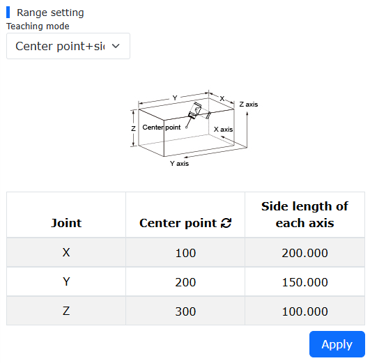

.. centered:: Wykres 7.6-24 Generowanie strefy interferencji metodą "punkt środkowy + długość boku"

**Krok 4**: Wykonaj ustawienie sygnału CO. Kolejno kliknij "Ustawienia początkowe" -> "Podstawowe" -> "Ustawienia I/O" - instrukcja "DO", aby skonfigurować odpowiednie wyjście CO dla każdego sześcianu.

.. image:: safety/054.png
   :width: 4in
   :align: center

.. centered:: Wykres 7.6-25 Konfiguracja wyjścia CO

**Krok 5**: Każda strefa interferencji sześcianu będzie wyświetlana w interfejsie robota zgodnie z ustawionym numerem ID. Gdy punkt środkowy końcówki robota wejdzie do strefy interferencji, interfejs wyświetli ostrzeżenie "Wejście w strefę interferencji", a odpowiedni interfejs CO wygeneruje sygnał wyjściowy.

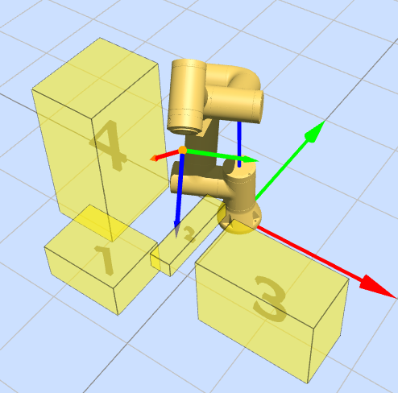

.. centered:: Wykres 7.6-26 Wyświetlanie interfejsu dla wielu stref interferencji sześcianu

Tryb redukcji
-------------

Kliknij menu "Ustawienia początkowe" -> "Bezpieczeństwo", kliknij podmenu "Tryb redukcji", aby przejść do interfejsu konfiguracji. Wybierz "Tryb pierwszego/drugiego poziomu", aby skonfigurować prędkość stawów i prędkość TCP końcówki.

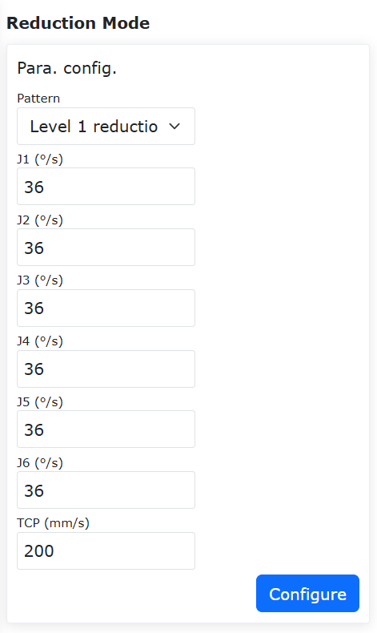

.. centered:: Wykres 7.7-1 Tryb redukcji

Ściana bezpieczeństwa
---------------------

Kliknij menu "Ustawienia początkowe" -> "Bezpieczeństwo", kliknij podmenu "Konfiguracja ściany bezpieczeństwa", aby przejść do interfejsu konfiguracji.

- **Konfiguracja ściany bezpieczeństwa**: Kliknij przycisk włączania, aby włączyć odpowiednią ścianę bezpieczeństwa. Gdy ściana bezpieczeństwa nie ma skonfigurowanego zakresu bezpieczeństwa, pojawi się komunikat o błędzie. Kliknij listę rozwijaną, wybierz ścianę bezpieczeństwa, którą chcesz ustawić. Automatycznie wyświetli się odległość bezpieczeństwa (można nie ustawiać, domyślnie 0). Następnie kliknij przycisk "Ustaw", aby zakończyć ustawianie.
  
.. image:: safety/008.png
   :width: 4in
   :align: center

.. centered:: Wykres 7.8-1 Konfiguracja ściany bezpieczeństwa

- **Konfiguracja punktów odniesienia ściany bezpieczeństwa**: Po wybraniu ściany bezpieczeństwa można ustawić cztery punkty odniesienia. Pierwsze trzy punkty to punkty odniesienia płaszczyzny, służące do potwierdzenia płaszczyzny ustawionej ściany bezpieczeństwa. Czwarty punkt to punkt odniesienia zakresu bezpieczeństwa, służący do potwierdzenia zakresu bezpieczeństwa ustawionej ściany bezpieczeństwa.

.. important::
   Jeśli ustawienie punktów odniesienia powiedzie się, zaświeci się zielone światło. W przeciwnym razie zaświeci się żółte światło. Zmieni się na zielone dopiero po pomyślnym ustawieniu punktów odniesienia. Gdy wszystkie cztery punkty odniesienia zostaną pomyślnie ustawione, można obliczyć ich zakres bezpieczeństwa. Po pomyślnym obliczeniu stan punktów parametrów zakresu bezpieczeństwa powróci do domyślnego.

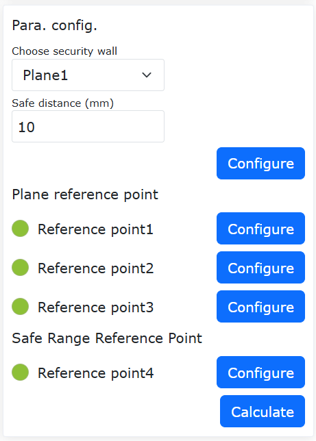

.. centered:: Wykres 7.8-2 Ustawianie punktów odniesienia zakresu bezpieczeństwa

- Efekt zastosowania: Włącz pomyślnie skonfigurowaną ścianę bezpieczeństwa. Przeciągnij robota. Jeśli końcowe TCP robota znajduje się w ustawionym zakresie bezpieczeństwa, system działa normalnie. Jeśli znajduje się poza ustawionym zakresem bezpieczeństwa, pojawi się komunikat o błędzie.

.. image:: safety/010.png
   :width: 6in
   :align: center

.. centered:: Wykres 7.8-3 Efekt po pomyślnym ustawieniu zakresu bezpieczeństwa

Program bezpieczeństwa działający w tle
---------------------------------------

Kliknij menu "Ustawienia początkowe" -> "Bezpieczeństwo", kliknij podmenu "Program bezpieczeństwa działający w tle", aby przejść do interfejsu konfiguracji.

Użytkownik klika przycisk "Włącz funkcję", aby włączyć lub wyłączyć ustawienia programu bezpieczeństwa działającego w tle. Wybierz "Sytuacje awaryjne" i "Programy działające w tle", a następnie kliknij przycisk "Ustaw", aby skonfigurować parametry logiki przetwarzania sytuacji awaryjnych.

Włącz program bezpieczeństwa działający w tle i ustaw scenariusze sytuacji awaryjnych oraz programy działające w tle. Gdy użytkownik uruchomi program, a wystąpiąca sytuacja awaryjna będzie zgodna z ustawionym scenariuszem sytuacji awaryjnej, robot wykona odpowiedni program działający w tle, pełniąc funkcję ochrony bezpieczeństwa.

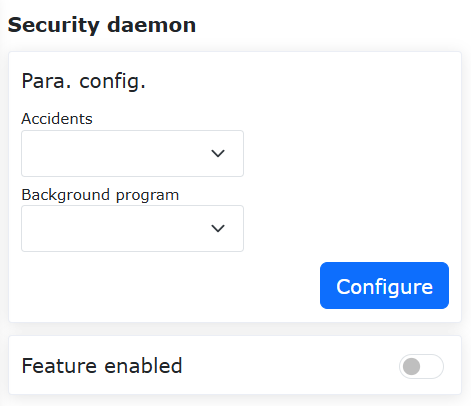

.. centered:: Wykres 7.9-1 Program bezpieczeństwa działający w tle

Ograniczenie kierunku narzędzia (tylko w systemie LA)
-----------------------------------------------------

Kliknij menu "Ustawienia początkowe" -> "Bezpieczeństwo", kliknij podmenu "Ograniczenie kierunku narzędzia", aby przejść do interfejsu konfiguracji.

Ograniczenie kierunku narzędzia to funkcja ochronna działająca w przestrzeni kartezjańskiej końcówki narzędzia robota, służąca do ograniczania zakresu ruchu orientacji końcówki robota. Obejmuje ona ustawienie włączenia funkcji, ustawienie podstawowego kierunku narzędzia i ustawienie maksymalnego kąta odchylenia. Maksymalny kąt odchylenia określa maksymalną granicę kąta między osią Z kartezjańskiego układu współrzędnych końcówki narzędzia a podstawowym kierunkiem narzędzia, co zwykle można rozumieć jako przestrzeń stożkową.

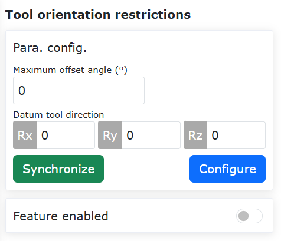

.. centered:: Wykres 7.10-1 Ograniczenie kierunku narzędzia

Wartości graniczne robota (tylko w systemie LA)
-----------------------------------------------

Kliknij menu "Ustawienia początkowe" -> "Bezpieczeństwo", kliknij podmenu "Wartości graniczne robota", aby przejść do interfejsu konfiguracji.

Wartości graniczne robota obejmują pęd i moc. Wartość graniczna pędu służy do ograniczenia maksymalnego pędu robota, a wartość graniczna mocy służy do ograniczenia pracy mechanicznej wykonywanej przez robota.

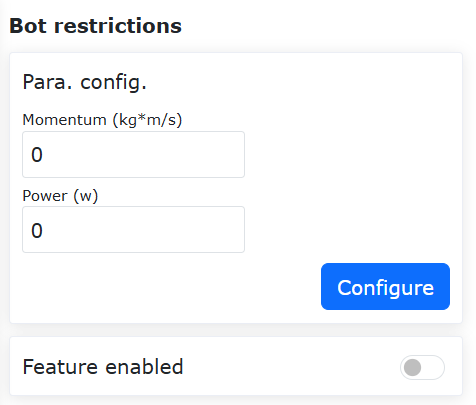

.. centered:: Wykres 7.11-1 Wartości graniczne robota

Wykrywanie mocy (tylko w systemie QX)
-------------------------------------

Kliknij menu "Ustawienia początkowe" -> "Bezpieczeństwo", kliknij podmenu "Wykrywanie mocy", aby przejść do interfejsu konfiguracji.

Gdy pętla prądowa działa bezpośrednio na robocie (tylko instrukcja servoJT), służy do ograniczania pracy wykonywanej przez robota. Jeśli całka prędkości i momentu obrotowego robota przekroczy wartość graniczną, następuje ochrona mocy.

.. image:: safety/014.png
   :width: 4in
   :align: center

.. centered:: Wykres 7.12-1 Wykrywanie mocy

Konfiguracja ruchu
------------------

Optymalizacja charakterystyki prędkości w kształcie litery T + funkcja wygładzania blending
~~~~~~~~~~~~~~~~~~~~~~~~~~~~~~~~~~~~~~~~~~~~~~~~~~~~~~~~~~~~~~~~~~~~~~~~~~~~~~~~~~~~~~~~~~~~

Omówienie
++++++++++++++++++++++

Wygładzanie blending między dwoma segmentami trajektorii może uniknąć częstego uruchamiania i zatrzymywania spowodowanego całkowitym zatrzymaniem, zwiększając tym samym wydajność ruchu robota.

Funkcja ta działa głównie dla blending między instrukcjami PTP-PTP, LIN-LIN, ARC-ARC, LIN-ARC, ARC-LIN. Blending między innymi instrukcjami nie jest aktywny.

Procedura operacyjna
++++++++++++++++++++++

Ponieważ sposoby operacji dla poszczególnych instrukcji są podobne, niniejsza instrukcja opisuje metodę działania funkcji na przykładzie blending między PTP-PTP. Funkcję tę można zaimplementować na dwa sposoby: za pomocą instrukcji Lua lub za pomocą przełącznika konfiguracji ruchu.

Sposób użycia instrukcji Lua
*****************************

**Krok 1**: Wybierz punkty nauczania, dla których ma być wykonana funkcja PTP. W niniejszej instrukcji jako nazwy punktów nauczania użyto "A0" do "A5".

**Krok 2**: Kliknij "Program nauczania" -> przycisk "Programowanie". Wybierz instrukcję "Punkt-punkt" z "Instrukcji ruchu". W "Edycji instrukcji" wybierz punkt nauczania i ustaw prędkość调试. Wybierz "Tryb wygładzania przyspieszenia" dla ochrony ruchu. Ustaw parametr "Płynne przejście" w punktach wymagających wygładzania.

.. image:: safety/020.png
   :width: 6in
   :align: center

.. centered:: Wykres 7.13-1 Ustawienia instrukcji blending PTP z wygładzaniem przyspieszenia

**Krok 3**: Wygeneruj program Lua i uruchom go. Funkcja blending PTP-PTP zostanie zaimplementowana. W ten sposób tylko instrukcje pomiędzy AccSmoothStart() i AccSmoothEnd() będą używać zoptymalizowanej prędkości w kształcie litery T do ruchu, a dla pozostałych instrukcji używana będzie oryginalna prędkość w kształcie litery T.

.. image:: safety/021.png
   :width: 4in
   :align: center

.. centered:: Wykres 7.13-2 Typowy program blending PTP-PTP przy użyciu instrukcji Lua

Sposób użycia przełącznika konfiguracji ruchu
*********************************************

**Krok 1**: Kliknij "Ustawienia początkowe" -> "Bezpieczeństwo" -> przycisk "Konfiguracja ruchu". Włącz przełącznik "Tryb wygładzania przyspieszenia".

.. image:: safety/022.png
   :width: 6in
   :align: center

.. centered:: Wykres 7.13-3 Ustawienie przełącznika konfiguracji trybu wygładzania przyspieszenia

**Krok 2**: Wybierz punkty nauczania, dla których ma być wykonana funkcja PTP-PTP. W niniejszej instrukcji jako nazwy punktów nauczania użyto "A0" do "A5".

**Krok 3**: Kliknij "Program nauczania" -> przycisk "Programowanie". Wybierz instrukcję "Punkt-punkt" z "Instrukcji ruchu". W "Edycji instrukcji" wybierz punkt nauczania i ustaw prędkość调试. Wybierz "Brak" dla ochrony ruchu. Ustaw parametr "Płynne przejście" w punktach wymagających wygładzania.

.. image:: safety/023.png
   :width: 6in
   :align: center

.. centered:: Wykres 7.13-4 Ustawienia instrukcji blending dla standardowego PTP

**Krok 4**: Wygeneruj program Lua i uruchom go. Funkcja blending PTP-PTP zostanie zaimplementowana. Typowy program jest taki sam jak standardowy program PTP. W ten sposób wszystkie instrukcje będą używać zoptymalizowanej prędkości w kształcie litery T do ruchu.

.. image:: safety/024.png
   :width: 4in
   :align: center

.. centered:: Wykres 7.13-5 Typowy program blending PTP-PTP przy użyciu przełącznika konfiguracji

Funkcja adaptacyjnych parametrów FIR + funkcja wstrzymywania i wznawiania FIR
~~~~~~~~~~~~~~~~~~~~~~~~~~~~~~~~~~~~~~~~~~~~~~~~~~~~~~~~~~~~~~~~~~~~~~~~~~~~~

Omówienie
++++++++++++++++++++++

Funkcja adaptacyjnej konfiguracji parametrów trybu optymalnego czasowo robota umożliwia konfigurację jej parametrów bez konieczności debugowania. Funkcja ta automatycznie dostosowuje konfigurację parametrów trybu optymalnego czasowo w oparciu o aktualny stan pracy robota, zwiększając wydajność debugowania.

Procedura operacyjna
++++++++++++++++++++++

Podstawowe instrukcje ruchu robota PTP, LIN i ARC są używane w podobny sposób. W tym przykładzie jako główny przykład użyto instrukcji ruchu PTP w trybie optymalnym czasowo.

**Krok 1**: W interfejsie sterowania sieciowego robota kolejno kliknij "Ustawienia początkowe" -> "Bezpieczeństwo" -> "Konfiguracja ruchu", aby przejść do interfejsu "Konfiguracja ruchu".

.. image:: safety/015.png
   :width: 6in
   :align: center

.. centered:: Wykres 7.13-6 Interfejs konfiguracji ruchu

**Krok 2**: W interfejsie "Konfiguracja ruchu" kliknij przełącznik "Tryb optymalny czasowo", aby przejść do interfejsu "Tryb optymalny czasowo".

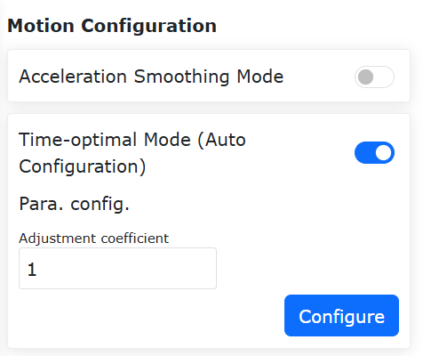

.. centered:: Wykres 7.13-7 Interfejs trybu optymalnego czasowo

.. note:: W sekcji "Konfiguracja parametrów" interfejsu "Tryb optymalny czasowo", w sekcji "Współczynnik regulacji" można ustawić wartość od -100 do 100, co oznacza współczynnik skalowania służący do kontrolowania stopnia optymalizacji czasowej instrukcji ruchu. Wartość domyślna to 1.

**Krok 3**: Określ punkty nauczania, dla których ma być wykonany ruch PTP. W tym przykładzie jako nazwy punktów nauczania użyto "A0" do "A5".

**Krok 4**: W interfejsie sterowania sieciowego robota kolejno kliknij "Program nauczania" -> "Programowanie", aby przejść do interfejsu "Instrukcje ruchu".

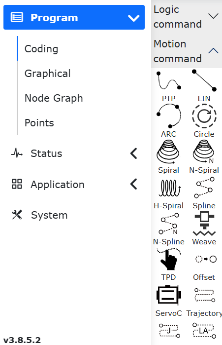

.. centered:: Wykres 7.13-8 Interfejs instrukcji ruchu

**Krok 5**: W interfejsie "Instrukcje ruchu" kliknij "Punkt-punkt", aby przejść do interfejsu edycji instrukcji "PTP". W polu "Nazwa punktu" wybierz punkt nauczania, w polu "Prędkość调试" ustaw żądany współczynnik prędkości, w polu "W tym punkcie" wybierz "Zatrzymaj", w polu "Czy przesunięcie" wybierz "Nie", a w polu "Ochrona ruchu" wybierz "Brak". Następnie kliknij "Dodaj".

.. image:: safety/018.png
   :width: 6in
   :align: center

.. centered:: Wykres 7.13-9 Interfejs edycji instrukcji ruchu PTP

**Krok 6**: W interfejsie edycji instrukcji ruchu "PTP" kliknij "Zastosuj", a odpowiedni program LUA zostanie automatycznie wygenerowany.

.. image:: safety/019.png
   :width: 4in
   :align: center

.. centered:: Wykres 7.13-10 Typowy program LUA ruchu PTP w trybie optymalnym czasowo

.. note:: 
   Typowy program LUA ruchu PTP w trybie optymalnym czasowo nie różni się od standardowego programu LUA ruchu PTP. Różnica polega na tym, że w Kroku 2 włączono funkcję "Tryb optymalny czasowo".

   Gdy przełącznik funkcji "Tryb optymalny czasowo" jest włączony, podstawowe instrukcje ruchu robota PTP, LIN i ARC działają w trybie optymalnym czasowo. Wyłączenie przełącznika funkcji "Tryb optymalny czasowo" w tym interfejsie przywraca podstawowe instrukcje ruchu PTP, LIN i ARC do ich standardowego stanu.
   W tym interfejsie nie można jednocześnie włączyć przełącznika funkcji "Tryb wygładzania przyspieszenia".