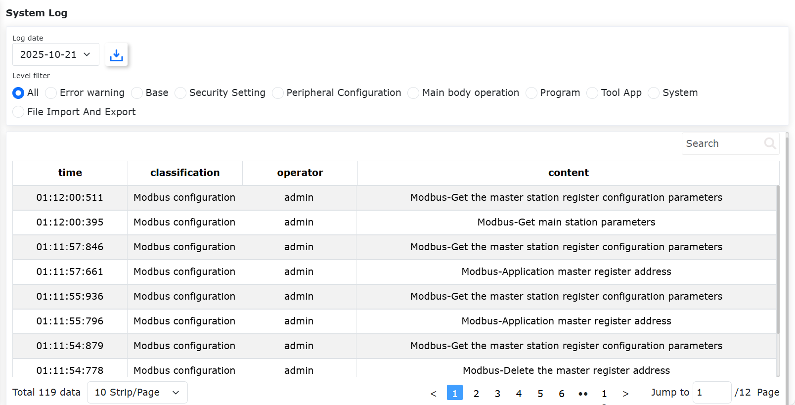
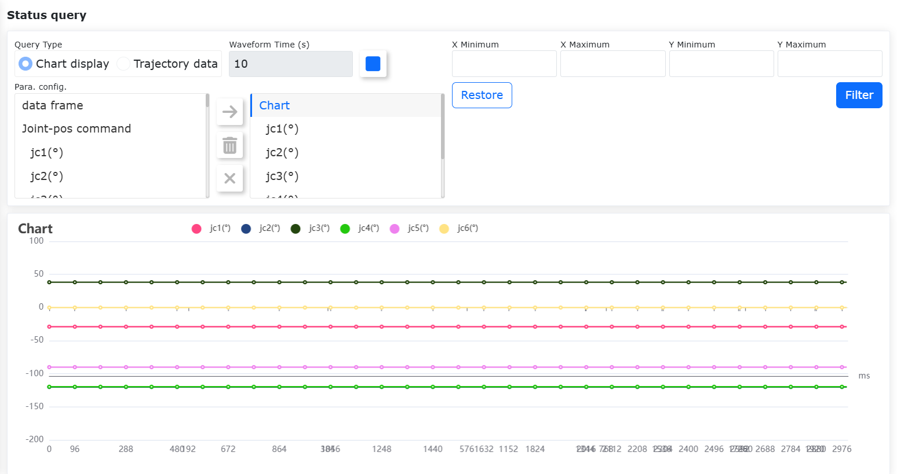
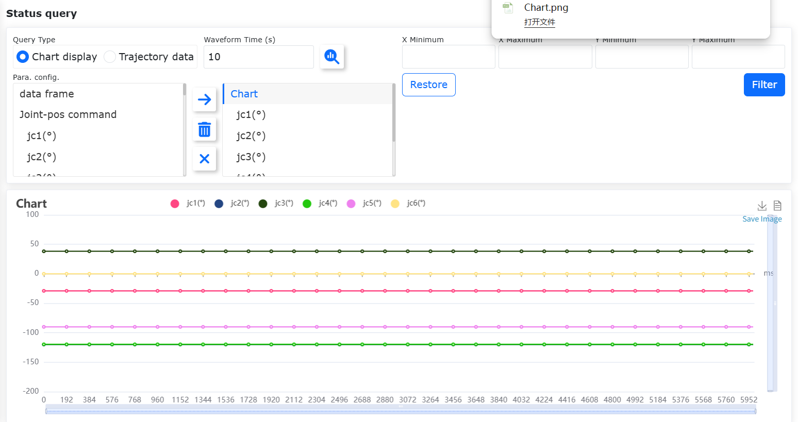
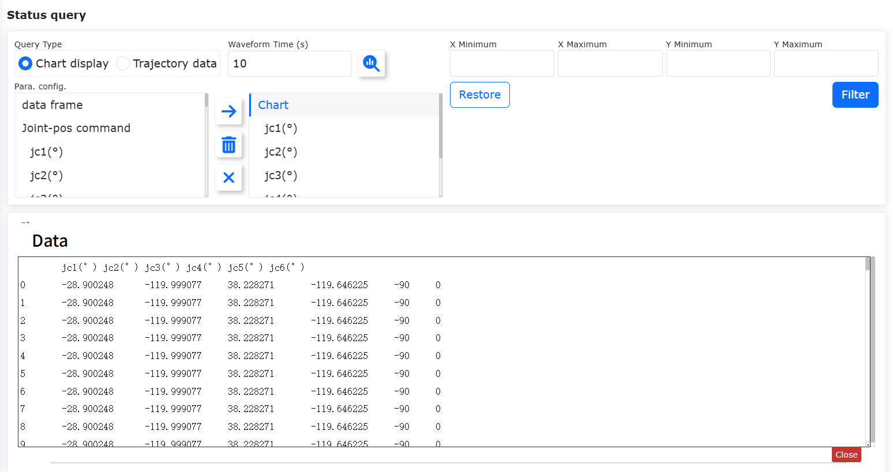
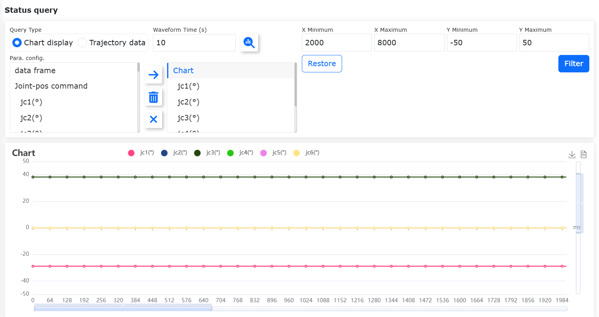

Informacje o stanie
===================

.. toctree:: 
   :maxdepth: 6

Dziennik systemowy
------------------

Przy pierwszym wejściu do interfejsu "Informacje o stanie - Dziennik systemowy" domyślnie wyświetlane są wszystkie dane dziennika z bieżącego dnia.

Dane dziennika są rozróżniane według poziomów, obecnie podzielonych na: Wszystkie, Błędy i ostrzeżenia, Ustawienia podstawowe, Ustawienia bezpieczeństwa, Ustawienia urządzeń peryferyjnych, Operacje na korpusie, Programy nauczania, Narzędzia aplikacyjne, Ustawienia systemowe oraz Import/eksport plików.

W prawym górnym rogu tabeli danych znajduje się pole wyszukiwania. Użytkownik może wprowadzić treść filtra, aby przeprowadzić filtrowanie zgodnie z potrzebami wyszukiwania. Interfejs wygląda następująco:

.. centered:: Wykres 13.1‑1 Interfejs dziennika systemowego

Zapytanie o stan
----------------

Użycie funkcji
~~~~~~~~~~~~~~~~~~~~~~~~~~~~

1. Włącz skrzynkę sterowniczą i podłącz kabel sieciowy do komputera PC.
2. Na komputerze PC otwórz przeglądarkę i przejdź do docelowego adresu URL 192.168.58.2. Zaloguj się przy użyciu nazwy użytkownika admin i hasła 123, aby przejść do strony.
3. Kliknij menu "Informacje o stanie" - "Zapytanie o stan" na lewym pasku menu, aby przejść do interfejsu zapytania o stan, jak poniżej:

.. image:: status/002.png
   :width: 6in
   :align: center

.. centered:: Wykres 13.2‑1 Zapytanie o stan

.. note:: 
   .. image:: status/006.png
      :width: 0.75in
      :height: 0.75in
      :align: left

   Nazwa: **Przycisk Zapytaj**
   
   Funkcja: Kliknięcie wysyła instrukcję zapytania o dane wykresu/trajektorii, reprezentuje stan braku zapytania

.. note:: 
   .. image:: status/007.png
      :width: 0.75in
      :height: 0.75in
      :align: left

   Nazwa: **Przycisk Przesuń w prawo**
   
   Funkcja: Kliknięcie dodaje wybrany element z lewej strony do podrzędnych elementów po prawej stronie

.. note:: 
   .. image:: status/008.png
      :width: 0.75in
      :height: 0.75in
      :align: left

   Nazwa: **Przycisk Usuń**
   
   Funkcja: Kliknięcie usuwa wybrany podrzędny element po prawej stronie

.. note:: 
   .. image:: status/009.png
      :width: 0.75in
      :height: 0.75in
      :align: left

   Nazwa: **Przycisk Wyczyść**
   
   Funkcja: Kliknięcie czyści wszystkie podrzędne elementy po prawej stronie

4. Wybierz wyświetlanie wykresu, wypełnij czas przebiegu. W konfiguracji parametrów wybierz parametry do zapytania po lewej stronie i kliknij przycisk "Przesuń w prawo", aby dodać parametry do listy po prawej stronie.

.. note:: Zakres czasu przebiegu można dostosować (10-30 s). Maksymalnie można wybrać 6 parametrów w konfiguracji parametrów.

5. Kliknij przycisk "Zapytaj", aby rozpocząć zapytanie. Zgodnie z konfiguracją parametrów, w czasie rzeczywistym wyświetlany jest wykres liniowy danych, jak poniżej:

.. centered:: Wykres 13.2‑2 Wyświetlanie wykresu

Eksport wykresu
~~~~~~~~~~~~~~~~~~~~~~~~

1. Kliknij tytuł wykresu, aby wyświetlić okno dialogowe, w którym można bezpośrednio zmodyfikować tytuł wykresu, jak poniżej:

.. image:: status/004.png
   :width: 6in
   :align: center

.. centered:: Wykres 13.2‑3 Zmiana nazwy tytułu wykresu

2. Po pomyślnym zatrzymaniu zapytania za pomocą przycisku zatrzymania zapytania wyświetli się przycisk pobierania. Kliknij pobierz, a przeglądarka pobierze plik wykresu o nazwie zgodnej z tytułem wykresu. Jak pokazano poniżej:

.. centered:: Wykres 13.2‑4 Eksport wykresu

Wyświetlanie widoku danych
~~~~~~~~~~~~~~~~~~~~~~~~~~~~~

1. Po zatrzymaniu zapytania kliknij przycisk wyświetlania widoku danych w prawym górnym rogu wykresu, jak poniżej:

.. image:: status/010.png
   :width: 6in
   :align: center

.. centered:: Wykres 13.2‑5 Przycisk widoku danych

2. Dane w widoku są pokazane, a ich zawartość może być kopiowana.

.. centered:: Wykres 13.2‑6 Wyświetlanie widoku danych

Filtrowanie danych
~~~~~~~~~~~~~~~~~~~~~~~~~~~~~

1. Po zatrzymaniu zapytania wprowadź wartości minimalne/maksymalne dla x/y, a zakres danych na wykresie odpowiednio się zmieni, jak poniżej:

.. centered:: Wykres 13.2‑7 Interfejs filtrowania danych

2. Kliknij przycisk przywracania, a zakres danych na wykresie powróci do domyślnego, jak poniżej:

.. image:: status/013.png
   :width: 6in
   :align: center

.. centered:: Wykres 13.2‑8 Przywracanie danych