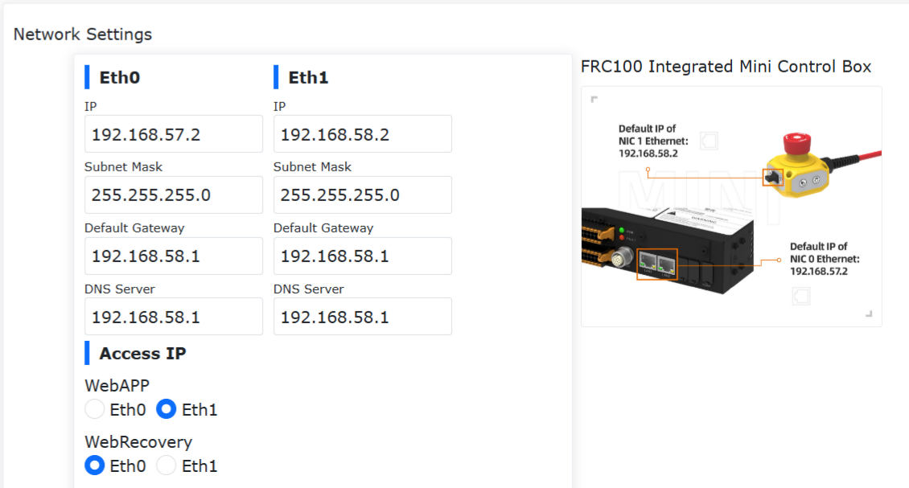
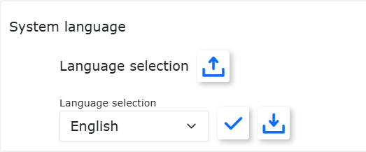
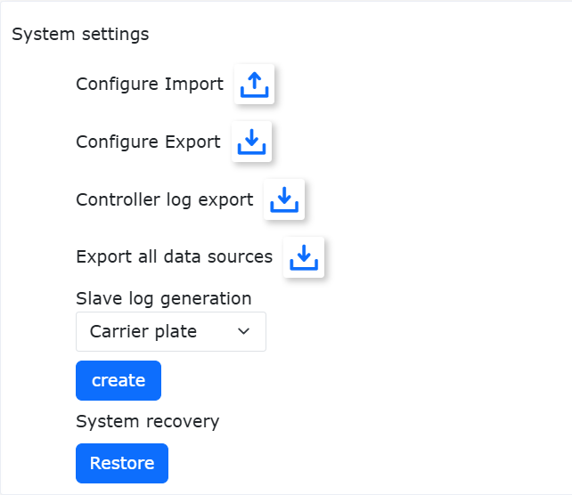
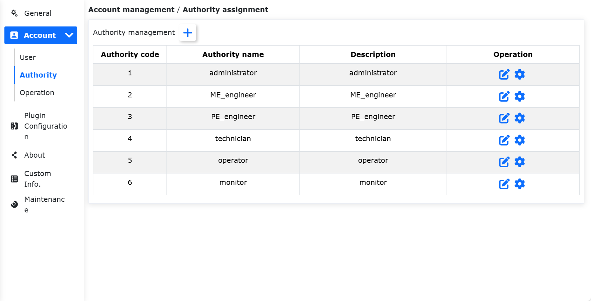
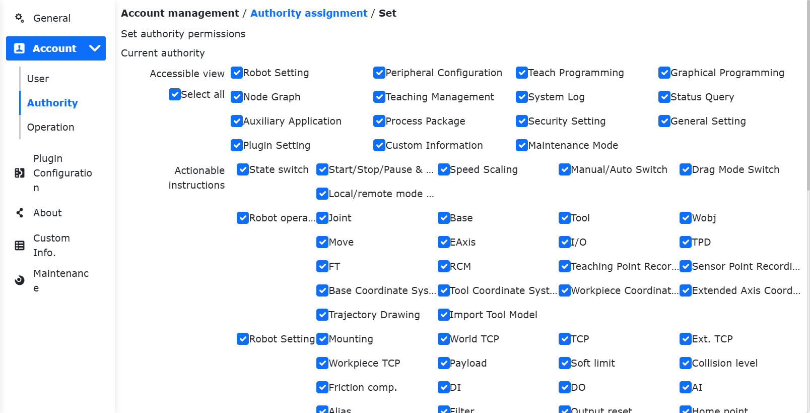
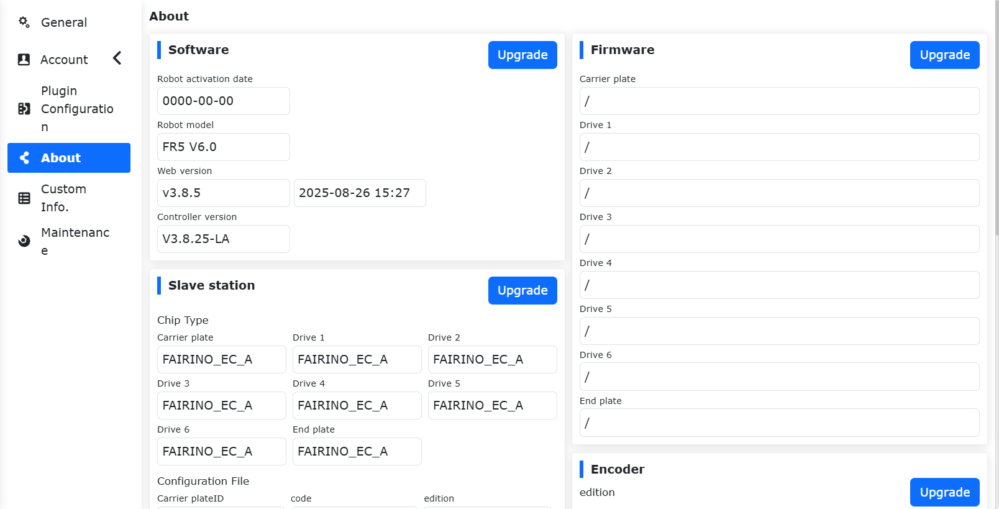
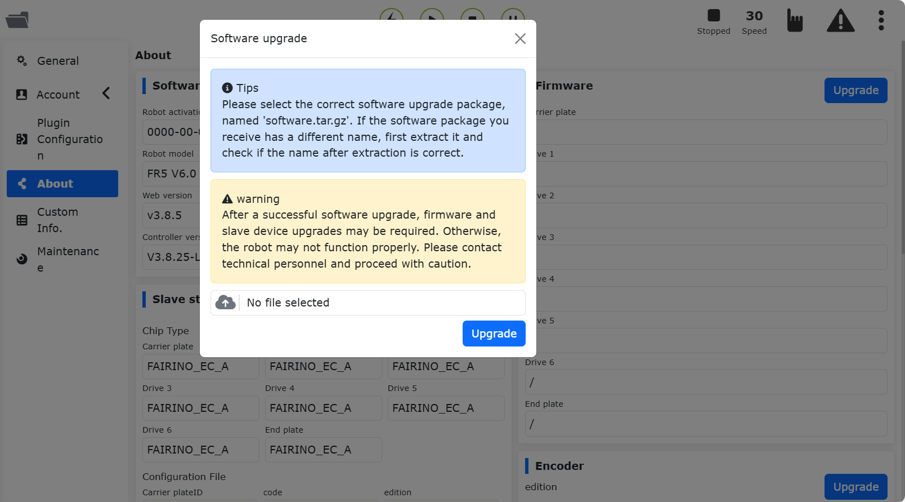
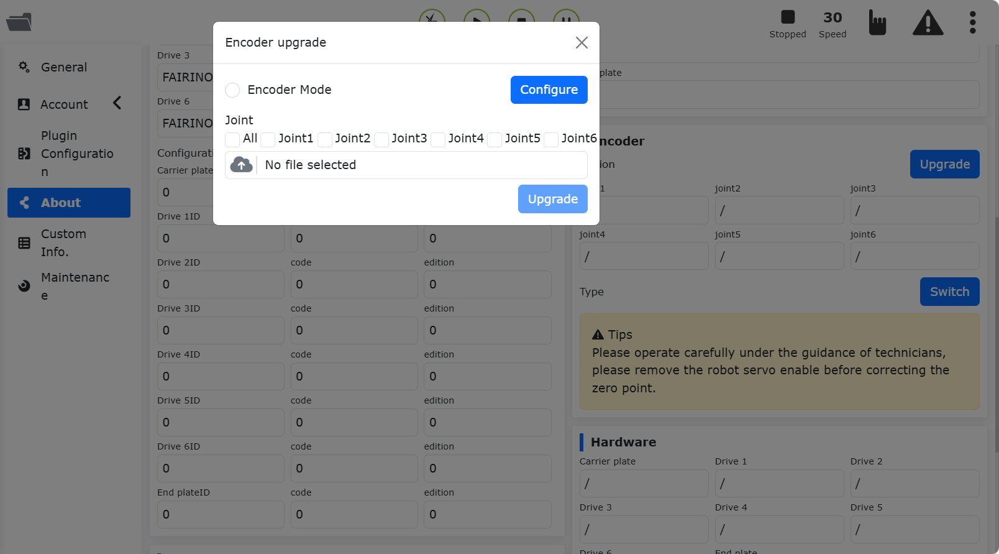
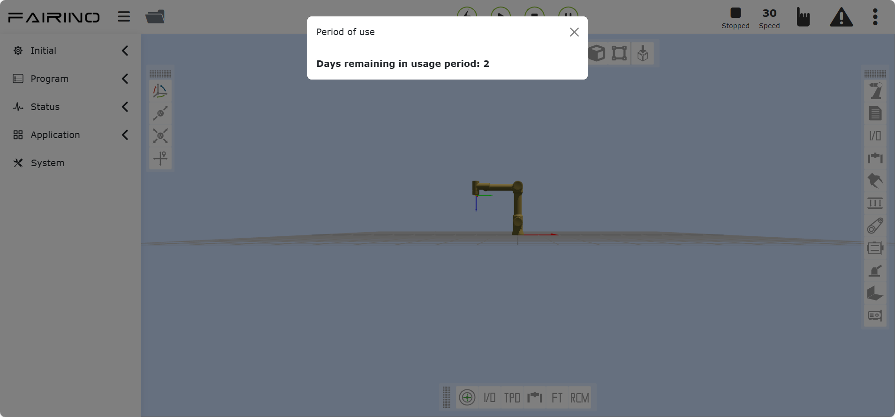

Ustawienia systemowe
====================

.. toctree:: 
   :maxdepth: 6

Ustawienia ogólne
-----------------

Kliknij menu „Ustawienia systemowe” na lewym pasku menu, a następnie kliknij podmenu „Ustawienia ogólne”, aby przejść do interfejsu ustawień ogólnych. Ustawienia ogólne umożliwiają aktualizację czasu systemowego robota zgodnie z bieżącym czasem komputera, aby zapewnić dokładność czasu zapisywanych treści dziennika.

.. image:: system/028.png
   :width: 4in
   :align: center

.. centered:: Wykres 15.1‑1 Ustawienia czasu

Ustawienia sieci umożliwiają konfigurację adresu IP kontrolera, maski podsieci, bramy domyślnej, serwera DNS i adresu IP panelu operatorskiego (adres ten jest ważny w przypadku korzystania z naszego panelu operatorskiego FR-HMI; podczas korzystania z panelu operatorskiego FR-HMI należy ustawić stan włączenia panelu operatorskiego na włączony), co jest wygodne dla scenariuszy użytkowania klienta.

Ustawienia sieci
~~~~~~~~~~~~~~~~

.. centered:: Wykres 15.1‑2 Schemat ustawień sieci

- **Ustaw kartę sieciową**: Wprowadź adres IP karty sieciowej, z którą chcesz się komunikować, maskę podsieci (powiązaną z adresem IP, wypełnianą automatycznie), bramę domyślną i serwer DNS. Domyślny adres IP portu sieciowego karty 0 to 192.168.57.2, a domyślny adres IP portu sieciowego karty 1 to 192.168.58.2.

- **Włączenie panelu operatorskiego**: Kontroluje, czy panel operatorski jest włączony. Domyślnie panel operatorski jest wyłączony i nie można używać panelu operatorskiego do obsługi urządzenia. Kliknij przycisk suwaka, aby włączyć obsługę urządzenia za pomocą panelu operatorskiego.

- **Adres IP dostępu**: Wybiera kartę sieciową powiązaną z WebAPP i WebRecovery. Gdy panel operatorski jest włączony, WebAPP domyślnie wybiera kartę 1, karta 0 nie jest dostępna.

- **Ustaw sieć**: Kliknij przycisk „Ustaw sieć”. Pojawi się komunikat o trwającej konfiguracji. Po zakończeniu konfiguracji należy ponownie uruchomić urządzenie.

Operacja bez logowania
++++++++++++++++++++++++++++++++++++++++++++++

Omówienie funkcji
***************************

Po włączeniu funkcji obsługi bez logowania na fizycznym panelu operatorskim można zrealizować następujące funkcje:

- Gdy użytkownik nie jest zalogowany do interfejsu nauczania, obracając fizycznym przełącznikiem kluczykowym, robot może przełączać tryb ręczny/automatyczny, a kolor lampki końcowej zmienia się odpowiednio.
- Gdy użytkownik nie jest zalogowany do interfejsu nauczania, w trybie automatycznym po naciśnięciu fizycznego przełącznika start robot może rozpocząć działanie aktualnie załadowanego programu.
- Gdy użytkownik nie jest zalogowany do interfejsu nauczania, w trybie automatycznym po naciśnięciu fizycznego przełącznika stop robot może zatrzymać działanie.

Instrukcja użytkowania
***************************
Zaloguj się do strony webapp, kliknij „Ustawienia systemowe”, kliknij „Ustawienia ogólne”. W sekcji sieć - panel operatorski włącz przełącznik „Włączenie panelu operatorskiego”, a następnie włącz przełącznik „Operacja bez logowania”. Po włączeniu funkcji można obsługiwać fizyczne przyciski w celu przełączania robota między trybem ręcznym/automatycznym oraz sterowania uruchamianiem/zatrzymywaniem programu bez logowania do strony panelu operatorskiego. Ta konfiguracja jest zachowywana po ponownym uruchomieniu z wyłączeniem zasilania.

.. image:: system/045.png
   :width: 6in
   :align: center

.. centered:: Wykres 15.1‑2-1 Włączanie funkcji operacji bez logowania

Kalibracja ekranu dotykowego panelu operatorskiego
~~~~~~~~~~~~~~~~~~~~~~~~~~~~~~~~~~~~~~~~~~~~~~~~~~

Po włączeniu panelu operatorskiego można przeprowadzić kalibrację panelu operatorskiego.

.. image:: system/029.png
   :width: 4in
   :align: center

.. centered:: Wykres 15.1‑3 Kalibracja ekranu dotykowego panelu operatorskiego

Konfiguracja zewnętrznego komputera przemysłowego
~~~~~~~~~~~~~~~~~~~~~~~~~~~~~~~~~~~~~~~~~~~~~~~~~

Aby włączyć zewnętrzny komputer przemysłowy, należy wprowadzić adres IP. Po pomyślnej konfiguracji należy ponownie uruchomić skrzynkę sterowniczą i komputer przemysłowy.

.. image:: system/030.png
   :width: 4in
   :align: center

.. centered:: Wykres 15.1‑4 Konfiguracja zewnętrznego komputera przemysłowego

Język systemu
~~~~~~~~~~~~~~~~~

Import języka
++++++++++++++++

Wybierz pakiet językowy, aby go zaimportować (uwaga: format importowanego pliku to [kod języka].json). Jeśli import się powiedzie, a pakiet językowy nie jest już dostępny w systemie, do języków systemowych zostanie dodany nowy pakiet danych językowych.

.. centered:: Wykres 15.1‑5 Interfejs języka systemowego

Eksport języka
+++++++++++++++++
Wybierz język systemowy, na przykład angielski, i kliknij przycisk „Eksportuj”. Strona wyświetli plik do pobrania.

.. image:: system/035.png
   :width: 6in
   :align: center

.. centered:: Wykres 15.1‑6 Eksport języka systemowego

Zastosowanie języka
++++++++++++++++++++

Wybierz język systemowy i kliknij przycisk „Zastosuj”, aby przełączyć język systemowy. Po pomyślnym zastosowaniu języka system automatycznie wyloguje się do strony logowania, a język systemowy zostanie jednocześnie przełączony na bieżący język. Na przykładzie angielskiego:

.. image:: system/036.png
   :width: 6in
   :align: center

.. centered:: Wykres 15.1‑7 Interfejs po pomyślnym zastosowaniu języka systemowego

Przywracanie trybu bezpieczeństwa systemu
+++++++++++++++++++++++++++++++++++++++++

Gdy system wymaga operacji podwyższania lub obniżania wersji, lub gdy system nie może normalnie uruchomić się z powodu nieprawidłowego importu pakietu językowego, należy przejść do interfejsu „Przywracanie trybu bezpieczeństwa systemu”. Procedura jest następująca:
1. Przejdź do Ustawienia systemowe -> Ustawienia ogólne -> interfejs Ustawienia sieci. Zmień adres IP dostępu WebRecovery na pozycję karty 0 i kliknij „Ustaw sieć”.

.. image:: system/037.png
   :width: 6in
   :align: center

.. centered:: Wykres 15.1‑8 Interfejs ustawiania karty sieciowej WebRecovery

2. Po pomyślnym ustawieniu sieci uruchom ponownie skrzynkę sterowniczą, przełącz adres IP na 192.168.57.xxx i podłącz kabel sieciowy do karty 0 skrzynki sterowniczej.
3. Zaloguj się pod adresem URL „192.168.57.2:8050”, aby przejść do interfejsu „Przywracanie trybu bezpieczeństwa systemu”.

.. image:: system/038.png
   :width: 3in
   :align: center

.. centered:: Wykres 15.1‑9 Interfejs przywracania trybu bezpieczeństwa systemu

- Import pakietu aktualizacyjnego oprogramowania: podwyższanie/obniżanie wersji pakietu systemowego.
- Przywróć domyślny język: usuwa dane importowanego zastosowanego pakietu językowego, przywraca dane domyślnego pakietu językowego. Domyślny język jest ustawiony na angielski.

Dane awaryjne
~~~~~~~~~~~~~

Kliknij przycisk włączający „Włącz zapisywanie danych awaryjnych”. Gdy kontroler ulegnie awarii, zostanie wygenerowany plik danych awaryjnych, który zapisze dane z 15 sekund przed i po momencie awarii.

Po zakończeniu zapisywania można w ustawieniach systemowych wybrać eksport wszystkich źródeł danych. Rozpakuj plik error_data.tar.gz, aby wyświetlić plik danych awaryjnych.

.. image:: system/039.png
   :width: 3in
   :align: center

.. centered:: Wykres 15.1‑10 Dane awaryjne

Ustawienie czasu automatycznego wylogowania
~~~~~~~~~~~~~~~~~~~~~~~~~~~~~~~~~~~~~~~~~~~~~

Użytkownik może ustawić czas automatycznego wylogowania. Jeśli czas zostanie przekroczony, nastąpi automatyczne wylogowanie. Jednostką jest minuta.

.. image:: system/033.png
   :width: 4in
   :align: center

.. centered:: Wykres 15.1‑11 Ustawienie czasu automatycznego wylogowania

Ustawienia systemowe
~~~~~~~~~~~~~~~~~~~~

Przywracanie ustawień fabrycznych w przywracaniu systemu może wyczyścić dane użytkownika i przywrócić robota do konfiguracji fabrycznej.

Funkcje generowania dziennika stacji podrzędnej i eksportu dziennika kontrolera służą do pobierania plików rejestrujących ważne stany lub błędy kontrolera, ułatwiając diagnozowanie problemów robota.

.. centered:: Wykres 15.1‑12 Ustawienia systemowe

Ustawienia konta
----------------

Kliknij podmenu Ustawienia konta, aby przejść do interfejsu ustawień konta. Funkcja zarządzania kontami jest dostępna tylko dla administratora. Funkcje są podzielone na następujące trzy moduły:

Zarządzanie użytkownikami
~~~~~~~~~~~~~~~~~~~~~~~~~

Strona zarządzania użytkownikami służy do przechowywania informacji o użytkownikach. Można dodawać numery pracownicze użytkowników, funkcje itp. Użytkownicy mogą logować się, wprowadzając istniejącą w liście użytkowników nazwę użytkownika i hasło.

.. image:: system/002.png
   :width: 6in
   :align: center

.. centered:: Wykres 15.2‑1 Zarządzanie użytkownikami

- **Dodaj użytkownika**: Kliknij przycisk „Dodaj”, wprowadź numer pracowniczy, imię i nazwisko, hasło i wybierz funkcję.

.. important::
   Numer pracowniczy może być maksymalnie 10-cyfrową liczbą całkowitą. Zarówno numer pracowniczy, jak i hasło podlegają kontroli unikalności, a hasło jest wyświetlane w alfabecie Braille'a. Po pomyślnym dodaniu użytkownika można wprowadzić imię i nazwisko oraz hasło, aby zalogować się ponownie.

.. image:: system/003.png
   :width: 6in
   :align: center

.. centered:: Wykres 15.2‑2 Dodawanie użytkownika

- **Edytuj użytkownika**: Gdy lista użytkowników istnieje, kliknij przycisk „Edytuj” po prawej stronie. Numeru pracowniczego i imienia i nazwiska nie można zmienić. Można zmienić hasło i funkcję. Hasło również podlega kontroli unikalności.

.. image:: system/004.png
   :width: 6in
   :align: center

.. centered:: Wykres 15.2‑3 Edycja użytkownika

- **Usuń użytkownika**: Metody usuwania dzielą się na usuwanie pojedyncze i usuwanie zbiorcze.

  1. Kliknij przycisk „Usuń” pojedynczego wiersza po prawej stronie listy. Pojawi się komunikat „Kliknij ponownie przycisk Usuń, aby potwierdzić usunięcie”. Po ponownym kliknięciu wiersz zostanie pomyślnie usunięty z listy.

  2. Zaznacz pola wyboru po lewej stronie, wybierz użytkowników do usunięcia, a następnie kliknij dwukrotnie przycisk zbiorczego „Usuń” u góry listy.

.. important::
   Nie można usunąć początkowego użytkownika 111 ani aktualnie zalogowanego użytkownika.

.. image:: system/002.png
   :width: 6in
   :align: center

.. centered:: Wykres 15.2‑4 Usuwanie użytkownika

Zarządzanie uprawnieniami
~~~~~~~~~~~~~~~~~~~~~~~~~

.. important:: 
   Domyślnych danych funkcji (kody funkcji 1-6) nie można usuwać, nie można zmieniać kodów funkcji, można zmieniać nazwy funkcji i opisy funkcji oraz ustawiać uprawnienia funkcji.

.. centered:: Wykres 15.2‑5 Zarządzanie uprawnieniami

Domyślnie istnieje sześć funkcji. Administrator nie ma ograniczeń funkcjonalnych. Operator i obserwator mają dostęp do niewielkiej części funkcji. Inżynier ME, inżynier PE&PQE oraz technik i lider grupy mają częściowe ograniczenia funkcjonalne. Administrator nie ma ograniczeń funkcjonalnych. Szczegółowe uprawnienia domyślne przedstawiono w poniższej tabeli:

.. important:: 
   Uprawnienia domyślne można modyfikować.

.. centered:: Tabela 15.2‑1 Szczegóły uprawnień

.. image:: system/007.png
   :width: 6in
   :align: center

- **Dodaj funkcję**: Kliknij przycisk „Dodaj”, wprowadź kod funkcji, nazwę funkcji i opis funkcji, a następnie kliknij przycisk „Zapisz”. Po pomyślnym zapisaniu wróć do strony listy. Kod funkcji musi być liczbą całkowitą większą od 0 i nie może być taki sam jak istniejący kod funkcji. Wszystkie pola są obowiązkowe.

.. image:: system/008.png
   :width: 6in
   :align: center

.. centered:: Wykres 15.2‑6 Dodawanie funkcji

- **Edytuj nazwę i opis funkcji**: Kliknij ikonę „Edytuj” w kolumnie operacji tabeli. Można zmienić nazwę funkcji i opis funkcji bieżącej funkcji. Po zakończeniu modyfikacji kliknij przycisk „Zapisz” u dołu, aby potwierdzić modyfikację.

.. image:: system/009.png
   :width: 6in
   :align: center

.. centered:: Wykres 15.2‑7 Edycja funkcji

- **Ustaw uprawnienia funkcji**: Kliknij ikonę „Ustaw” w kolumnie operacji tabeli. Można ustawić uprawnienia bieżącej funkcji. Po zakończeniu ustawiania kliknij przycisk „Zapisz” u dołu, aby potwierdzić ustawienia.

.. image:: system/011.png
   :width: 6in
   :align: center

.. centered:: Wykres 15.2‑8 Ustawianie uprawnień funkcji

- **Usuń funkcję**: Kliknij ikonę „Usuń” w kolumnie operacji tabeli. Najpierw zostanie sprawdzone, czy bieżąca funkcja jest używana przez jakiegoś użytkownika. Jeśli nie jest używana, można usunąć bieżącą funkcję. W przeciwnym razie nie można jej usunąć.

.. image:: system/012.png
   :width: 6in
   :align: center

.. centered:: Wykres 15.2‑9 Usuwanie funkcji

Import/Eksport
~~~~~~~~~~~~~~

.. image:: system/013.png
   :width: 6in
   :align: center

.. centered:: Wykres 15.2‑10 Import/Eksport ustawień konta

- **Import**: Kliknij przycisk „Import”, aby zbiorczo zaimportować dane zarządzania użytkownikami i zarządzania uprawnieniami.

- **Eksport**: Kliknij przycisk „Eksport”, aby zbiorczo wyeksportować dane zarządzania użytkownikami i zarządzania uprawnieniami.

Informacje
----------

Kliknij podmenu Informacje, aby przejść do interfejsu informacji. Ta strona wyświetla model i numer seryjny robota, wersję Web i wersję skrzynki sterowniczej używane przez robota do działania, a także wersję sprzętu i wersję oprogramowania sprzętowego.

.. centered:: Wykres 15.3‑1 Schemat informacji

Aktualizacja oprogramowania
~~~~~~~~~~~~~~~~~~~~~~~~~~~

Przygotowanie do operacji
++++++++++++++++++++++++++++++++

1. Przed aktualizacją sprawdź i potwierdź bieżącą wersję oprogramowania w „Ustawienia systemowe - Informacje”.
2. Pakiet aktualizacyjny oprogramowania. Adres pobierania można znaleźć w odpowiedniej dokumentacji FAIRINO „Pobieranie materiałów - Pobieranie oprogramowania robota”. Po rozpakowaniu zawartość obejmuje pakiet aktualizacyjny oprogramowania software.tar.gz odpowiedniej wersji.

Środki ostrożności
++++++++++++++++++++++++++++++++

1. Kopia zapasowa danych: Zaleca się wykonanie kopii zapasowej przed aktualizacją. Metodę opisano w sekcji 3.2.1, aby uniknąć utraty danych spowodowanej nieprawidłową aktualizacją.
2. Ograniczenia wersji:

.. centered:: Wykres 15.3‑1 Ograniczenia aktualizacji wersji

.. list-table::
   :widths: 50 50
   :header-rows: 0
   :align: center

   * - **Bieżąca wersja**
     - **Maksymalna możliwa wersja do aktualizacji**

   * - <v3.6.1
     - v3.6.1

   * - v3.6.1-v3.6.4
     - v3.6.5

   * - v3.6.5-v3.6.8
     - v3.6.9

   * - v3.6.9 - v3.7.4
     - v3.7.5

   * - v3.7.5
     - v3.7.6

   * - ≥ v3.7.6
     - Bez ograniczeń

3. Czyszczenie pamięci podręcznej: Po każdej aktualizacji (szczególnie przy aktualizacji między wersjami) zaleca się wyczyszczenie pamięci podręcznej przeglądarki, aby zapewnić normalne działanie systemu.

Kroki operacyjne
*****************************

**Aktualizacja oprogramowania**:

1. W menu „Ustawienia systemowe” -> „Informacje” kliknij przycisk „Aktualizuj”, aby przejść do aktualizacji oprogramowania.

.. centered:: Wykres 15.3‑2 Interfejs aktualizacji systemu

2. Kliknij „Wybierz plik” i wybierz pakiet oprogramowania software.tar.gz pobrany z oficjalnej strony internetowej.

.. important:: 
   Nazwa pakietu aktualizacyjnego oprogramowania to określona nazwa software.tar.gz. Jeśli nazwa pakietu aktualizacyjnego jest inna, aktualizacja zakończy się niepowodzeniem. Wystarczy zmienić nazwę na określoną nazwę pakietu aktualizacyjnego.

3. Kliknij „Prześlij pakiet aktualizacyjny”, aby rozpocząć aktualizację. Podczas aktualizacji wyświetlany jest pasek postępu.

4. Gdy pasek postępu aktualizacji osiągnie 100%, interfejs wyświetli komunikat „Aktualizacja zakończona sukcesem. Uruchom ponownie skrzynkę sterowniczą”.

.. image:: system/041.png
   :width: 4in
   :align: center

.. centered:: Wykres 15.3‑3 Aktualizacja oprogramowania zakończona sukcesem

5. Po ponownym uruchomieniu skrzynki sterowniczej aktualizacja jest zakończona. Potwierdź informacje o wersji w sekcji Informacje.

**Aktualizacja oprogramowania sprzętowego**: Po wejściu robota w tryb BOOT prześlij spakowany plik aktualizacyjny. Wybierz stację podrzędną do aktualizacji (stacja podrzędna skrzynki sterowniczej, stacje podrzędne napędów korpusu 1~6, stacja podrzędna końcówki), przeprowadź operację aktualizacji i wyświetl stan aktualizacji.

.. image:: system/042.png
   :width: 6in
   :align: center

.. centered:: Wykres 15.3‑4 Aktualizacja oprogramowania sprzętowego

**Aktualizacja pliku konfiguracyjnego stacji podrzędnej**: Po odłączeniu robota prześlij plik aktualizacyjny. Wybierz stację podrzędną do aktualizacji (stacja podrzędna skrzynki sterowniczej, stacje podrzędne napędów korpusu 1~6, stacja podrzędna końcówki), przeprowadź operację aktualizacji i wyświetl stan aktualizacji.

.. image:: system/043.png
   :width: 6in
   :align: center

.. centered:: Wykres 15.3‑5 Aktualizacja pliku konfiguracyjnego stacji podrzędnej

**Aktualizacja enkodera**: Po odłączeniu robota prześlij plik aktualizacyjny. Wybierz stawy Joint1~Joint6 do aktualizacji i skonfiguruj tryb enkodera.

.. centered:: Wykres 15.3‑6 Aktualizacja enkodera

Informacje niestandardowe
-------------------------

Kliknij podmenu Informacje niestandardowe, aby przejść do interfejsu informacji niestandardowych. Funkcja informacji niestandardowych jest dostępna tylko dla administratora. Na tej stronie można przesyłać pakiety informacji użytkownika, modele robotów i ustawiać stan szyfrowania programów nauczania.

.. image:: system/015.png
   :width: 6in
   :align: center

.. centered:: Wykres 15.4‑1 Schemat informacji niestandardowych

Model robota
~~~~~~~~~~~~

.. important::
   1. Konfiguracja modelu robota w tym miejscu jest niestandardową nazwą modelu robota i różni się od funkcji modelu robota skonfigurowanej w „Ustawienia systemowe” -> „Tryb konserwacji” -> „Zgodność kontrolera”.
   2. Nie zaleca się używania nazw zaczynających się od „FR” i „ART”. Jeśli wprowadzona niestandardowa nazwa modelu robota zaczyna się od „FR” lub „ART”, wprowadzona nazwa modelu musi być zgodna z „nazwą skróconą modelu” w katalogu modeli robotów (katalog modeli robotów jest szczegółowo opisany w rozdziale „Konfiguracja modelu robota”).

Konfiguracja zakresu parametrów
~~~~~~~~~~~~~~~~~~~~~~~~~~~~~~~

Konfiguracja zakresu parametrów. Tylko administrator może regulować zakres parametrów. Parametry innych członków z uprawnieniami mogą być ustawiane tylko w zakresie parametrów ustawionym przez administratora.

Sposoby ustawiania parametrów są dwojakie: przeciąganie suwakiem i ręczne wprowadzanie.

.. important::
   Maksymalna wartość zakresu parametrów musi być większa od minimalnej wartości. 3 sekundy po pomyślnej konfiguracji zakresu parametrów nastąpi automatyczne przejście do strony logowania, konieczne będzie ponowne zalogowanie.

.. image:: system/016.png
   :width: 6in
   :align: center

.. image:: system/022.png
   :width: 6in
   :align: center

.. centered:: Wykres 15.4‑2 Schemat konfiguracji zakresu parametrów

Dozwolony czas użytkowania robota
~~~~~~~~~~~~~~~~~~~~~~~~~~~~~~~~~

1. Ustawienia blokady ekranu

W „Informacjach niestandardowych” sprawdź dozwolony czas użytkowania robota i ustaw, czy funkcja ta jest włączona. Wybierając włączenie funkcji, wybierz okres ważności. Jeśli nie zostanie wybrany, pojawi się komunikat „Okres ważności nie może być pusty”.

.. note:: Jeśli funkcja blokady ekranu została już włączona, nie można dokonać ponownej konfiguracji ani zaktualizować czasu systemowego.

Po wybraniu okresu ważności kliknij przycisk „Konfiguruj”.

.. image:: system/023.png
   :width: 6in
   :align: center

.. centered:: Wykres 15.4‑3 Ustawienie wyłączenia dozwolonego czasu użytkowania robota

.. image:: system/024.png
   :width: 6in
   :align: center

.. centered:: Wykres 15.4‑4 Ustawienie włączenia dozwolonego czasu użytkowania robota

2. Komunikat o wygaśnięciu

Gdy funkcja dozwolonego czasu użytkowania robota jest włączona, po ekranie logowania pojawi się następujący komunikat:

1) 5 dni przed wygaśnięciem ważności urządzenia, po pomyślnym uruchomieniu i zalogowaniu, pojawi się okno dialogowe informujące o liczbie dni pozostałych do końca okresu ważności. Resetowanie może usunąć komunikat.

.. image:: system/025.png
   :width: 6in
   :align: center

.. centered:: Wykres 15.4‑5 Komunikat przy uruchomieniu

2) Jeśli urządzenie pracuje w sposób ciągły, 5 dni przed wygaśnięciem ważności, o północy automatycznie pojawi się okno dialogowe informujące o liczbie dni pozostałych do końca okresu ważności. Resetowanie może usunąć komunikat.

.. centered:: Wykres 15.4‑6 Komunikat podczas ciągłej pracy

3. Odblokowanie logowania

Gdy funkcja dozwolonego czasu użytkowania robota jest włączona, po wygaśnięciu ważności urządzenia, przy pierwszym logowaniu do webApp przejdziesz bezpośrednio do interfejsu blokady ekranu. Gdy urządzenie pracuje w sposób ciągły, o północy po pobraniu danych blokady ekranu nastąpi automatyczne wylogowanie i przejście do interfejsu blokady ekranu. W tym momencie wprowadź kod odblokowujący, aby odblokować i przejść do interfejsu logowania, a następnie wprowadź dane logowania, aby się zalogować.

.. note:: Integrator wykonuje operację wygenerowania zaszyfrowanego kodu odblokowującego.

.. image:: system/027.png
   :width: 6in
   :align: center

.. centered:: Wykres 15.4‑7 Interfejs blokady ekranu

Konfiguracja modelu robota
--------------------------

.. important:: Jeśli potrzebujesz zmienić model robota, skontaktuj się z naszym inżynierem technicznym i postępuj zgodnie z jego wskazówkami.

Po zalogowaniu do konsoli internetowej robota współpracującego, w pozycji konfiguracyjnej „Ustawienia systemowe” -> „Tryb konserwacji” -> „Zgodność kontrolera” wybierz odpowiedni model do modyfikacji. Modele robotów znajdują się w poniższej tabeli.

Tabela modeli robotów:

.. list-table::
   :widths: 10 58 32
   :header-rows: 0
   :align: center

   * - **Wartość**
     - **Model (model główny - numer wersji głównej - numer wersji pomocniczej)**
     - **Nazwa skrócona modelu**

   * - 0
     - Nie skonfigurowano
     - /

   * - 1
     - FR3-V1-000(V5.0)
     - FR3 V5.0

   * - 2
     - FR3-V1-001(V6.0)
     - FR3 V6.0

   * - 3
     - FR3-V1-002(V6.0 Mirror)
     - FR3 V6.0(Mirror)

   * - ...
     - Zarezerwowane
     - /

   * - 101
     - FR5-V1-000
     - FR5 V4.0

   * - 102
     - FR5-V1-001(V5.0)
     - FR5 V5.0

   * - 103
     - FR5-V1-002(V6.0)
     - FR5 V6.0

   * - ...
     - Zarezerwowane
     - /

   * - 201
     - FR10-V1-000(V5.0)
     - FR10 V5.0

   * - 202
     - FR10-V1-001(V6.0)
     - FR10 V6.0

   * - ...
     - Zarezerwowane
     - /

   * - 301
     - FR16-V1-000(V5.0)
     - FR16 V5.0

   * - 302
     - FR16-V1-001(V6.0)
     - FR16 V6.0

   * - ...
     - Zarezerwowane
     - /

   * - 401
     - FR20-V1-000(V5.0)
     - FR20 V5.0

   * - 402
     - FR20-V1-001(V6.0)
     - FR20 V6.0

   * - ...
     - Zarezerwowane
     - /

   * - 501
     - ART3-V1-000
     - ART3

   * - ...
     - Zarezerwowane
     - /

   * - 601
     - ART5-V1-000
     - ART5

   * - ...
     - Zarezerwowane
     - /

   * - 702
     - FRCustom(7)-V1-001(FR3-WML)
     - FR3-WML

   * - 703
     - FRCustom(7)-V1-001(FR3-WMS)
     - FR3-WMS

   * - ...
     - Zarezerwowane
     - /

   * - 802
     - FRCustom(8)-V1-001(FR5WM)
     - FR5WM

   * - 803
     - FRCustom(8)-V1-002(FR5-WML)
     - FR5-WML

   * - 804
     - FRCustom(8)-V1-003(FR5-C)
     - FR5-C

   * - ...
     - Zarezerwowane
     - /

   * - 901
     - FRCustom(9)-V1-001(FR3MT)
     - FR3MT

   * - 902
     - FRCustom(9)-V1-001(FR10YD)
     - FR10YD

   * - 904
     - FRCustom(9)-V1-001(FR3-C)
     - FR3-C

   * - 905
     - FRCustom(9)-V01-001(FR30L)
     - FR30L

   * - 906
     - FRCustom(9)-V01-001(FR3(C))
     - FR3(C)

   * - 907
     - FRCustom(9)-V01-001(ART3-R6-XM)
     - ART3-R6-XM

   * - 908
     - FRCustom(9)-V01-001(FC3-R6-B)
     - FC3-R6-B

   * - ...
     - Zarezerwowane
     - /

   * - 1001
     - FR30-V1-001(V6.0)
     - FR30 V6.0

   * - ...
     - Zarezerwowane
     - /

.. note:: Zarezerwowano 10 numerów wersji głównej (1-10) i 10 numerów wersji pomocniczej (1-10).