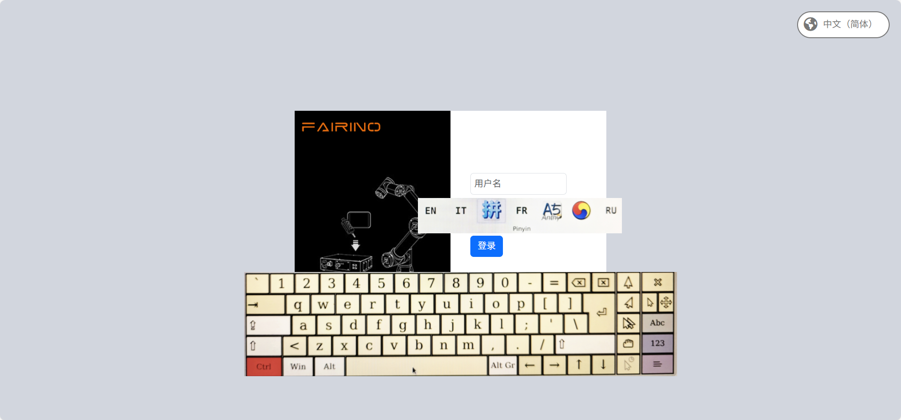
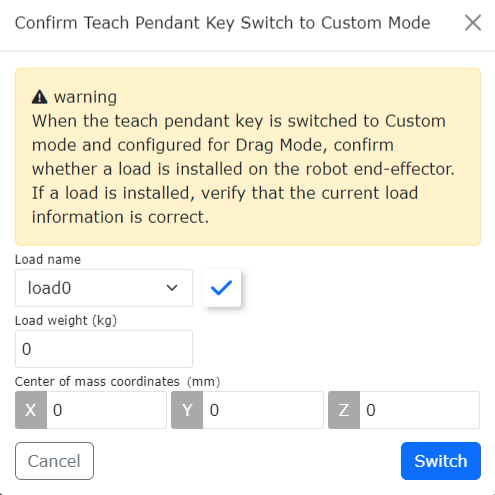

Panel operatorski
=================

.. toctree:: 
   :maxdepth: 6

Włączanie panelu operatorskiego
-------------------------------

1. Podłącz panel operatorski do skrzynki sterowniczej i uruchom.

2. Zaloguj się przy użyciu nazwy użytkownika admin i hasła 123. Po wejściu na stronę kliknij Ustawienia systemowe - Ustawienia ogólne i upewnij się, że panel operatorski jest włączony.

.. image:: teach_pendant/001.png
   :width: 6in
   :align: center

.. centered:: Wykres 16.1‑1 Stan włączenia panelu operatorskiego

Ustawienia wielojęzyczne panelu operatorskiego
----------------------------------------------

1. Na ekranie logowania (lub na ekranie pierwszej aktywacji) wybierz język w prawym górnym rogu.

.. image:: teaching_pendant_software/062.png
   :width: 6in
   :align: center

.. centered:: Wykres 16.2‑1 Ustawianie języka na ekranie aktywacji

.. image:: teaching_pendant_software/063.png
   :width: 6in
   :align: center

.. centered:: Wykres 16.2‑2 Ustawianie języka na ekranie logowania

2. Na przykładzie ustawiania języka na ekranie logowania, wybierz język. Pojawienie się następującego komunikatu (w odpowiednim języku) oznacza pomyślne ustawienie. Uruchom ponownie skrzynkę sterowniczą, aby zakończyć ustawianie języka.

.. centered:: Wykres 16.2‑3 Ustawianie języka chińskiego

.. image:: teach_pendant/005.png
   :width: 6in
   :align: center

.. centered:: Wykres 16.2‑4 Ustawianie języka angielskiego

Przełączanie metody wprowadzania
~~~~~~~~~~~~~~~~~~~~~~~~~~~~~~~~

Domyślną metodą wprowadzania jest angielska metoda wprowadzania.

1. Otwórz klawiaturę ekranową w prawym dolnym rogu i kliknij pole wprowadzania, na przykład kliknij pole wprowadzania nazwy użytkownika.

2. Przełącz na chińską metodę wprowadzania pinyin.

Kliknij dwukrotnie klawisz CTRL. Kolor klawisza zmieni się na czerwony. Kliknij spację, aby wybrać metodę wprowadzania. Poniżej przedstawiono chińską metodę wprowadzania.

.. centered:: Wykres 16.2‑5 Chińska metoda wprowadzania pinyin

3. Przełącz na angielską metodę wprowadzania.

Kliknij dwukrotnie klawisz CTRL. Kolor klawisza zmieni się na czerwony. Kliknij spację, aby wybrać metodę wprowadzania. Poniżej przedstawiono angielską metodę wprowadzania.

.. image:: teach_pendant/007.png
   :width: 6in
   :align: center

.. centered:: Wykres 16.2‑6 Angielska metoda wprowadzania

Po pomyślnym zalogowaniu system załaduje model i inne dane. Po zakończeniu ładowania przejdzie do strony początkowej.

Niezgodność języka między panelem operatorskim a aplikacją webową
~~~~~~~~~~~~~~~~~~~~~~~~~~~~~~~~~~~~~~~~~~~~~~~~~~~~~~~~~~~~~~~~~

Po włączeniu panelu operatorskiego na ekranie logowania zostanie wyzwolona weryfikacja języka między panelem operatorskim a aplikacją webową. Gdy język panelu operatorskiego jest niezgodny z językiem aplikacji webowej, pojawi się następujący komunikat.

.. image:: teach_pendant/008.png
   :width: 6in
   :align: center

.. centered:: Wykres 16.2‑7 Komunikat o niezgodności języka między panelem operatorskim a aplikacją webową

Funkcja resetowania adresu IP kontrolera i fizycznego panelu operatorskiego
----------------------------------------------------------------------------

Omówienie funkcji
~~~~~~~~~~~~~~~~~~~~~~~~~~~~~~~~~~~~~~~~~~~~

Ta optymalizacja dodaje funkcje operacji resetowania adresu IP kontrolera i fizycznego panelu operatorskiego za pomocą różnych metod. Głównie poprzez następujące operacje można zrealizować następujące funkcje:

- 1. Za pomocą interfejsu webrecovery można zresetować adres IP karty sieciowej 0 i karty sieciowej 1 skrzynki sterowniczej.
- 2. Za pomocą funkcji konfigurowalnego przycisku F1 na fizycznym panelu operatorskim (przytrzymanie przez 10 sekund) można zresetować adres IP karty sieciowej 0, karty sieciowej 1 skrzynki sterowniczej oraz fizycznego panelu operatorskiego.
- 3. Używając kombinacji przycisków F2 i F4 na fizycznym panelu operatorskim, przytrzymując je jednocześnie przez 10 sekund, można zresetować adres IP urządzenia fizycznego panelu operatorskiego, gdy nie jest on zalogowany.

.. image:: teach_pendant/010.png
   :width: 5in
   :align: center

.. centered:: Wykres 16.3‑1 Schemat portów sieciowych mini skrzynki sterowniczej

Resetowanie adresu IP za pomocą interfejsu Webrecovery
~~~~~~~~~~~~~~~~~~~~~~~~~~~~~~~~~~~~~~~~~~~~~~~~~~~~~~~

Zaloguj się do interfejsu webrecovery przy użyciu portu 8050, na przykład pod domyślnym adresem IP: 192.168.57.2:8050. Kliknij przycisk „Resetuj” przy „Resetowaniu IP kontrolera”. Strona wyświetli okno dialogowe z prośbą o ponowne potwierdzenie. Po kliknięciu „OK” kliknij ponownie przycisk resetowania IP kontrolera, aby potwierdzić reset.

.. image:: teach_pendant/011.png
   :width: 5in
   :align: center

.. centered:: Wykres 16.3‑2 Funkcja resetowania IP w interfejsie Webrecovery

Po ponownym potwierdzeniu pojawi się komunikat o konieczności ponownego uruchomienia, aby zmiany zaczęły obowiązywać. Po ponownym uruchomieniu IP karty sieciowej 0 kontrolera powróci do domyślnego 192.168.57.2, a IP karty sieciowej 1 powróci do domyślnego 192.168.58.2.

Niestandardowe resetowanie IP za pomocą przycisku F1 na fizycznym panelu operatorskim
~~~~~~~~~~~~~~~~~~~~~~~~~~~~~~~~~~~~~~~~~~~~~~~~~~~~~~~~~~~~~~~~~~~~~~~~~~~~~~~~~~~~~

Aby użyć funkcji niestandardowej przycisku F1 na fizycznym panelu operatorskim, należy najpierw zalogować się do interfejsu panelu operatorskiego i skonfigurować niestandardową funkcję przycisków F. Kliknij „Ustawienia systemowe”, kliknij „Ustawienia ogólne”, wybierz moduł panelu operatorskiego, włącz przełącznik włączania panelu operatorskiego, skonfiguruj przycisk F1 jako resetowanie IP (przytrzymanie przez 10 sekund), a następnie kliknij „Konfiguruj”.

.. image:: teach_pendant/013.png
   :width: 6in
   :align: center

.. centered:: Wykres 16.3‑3 Niestandardowe resetowanie IP za pomocą przycisku F1 na fizycznym panelu operatorskim

Ta funkcja działa tylko wtedy, gdy fizyczny panel operatorski jest zalogowany do aplikacji webowej. Po przytrzymaniu przycisku F1 przez 10 sekund pojawi się komunikat o konieczności ponownego uruchomienia, aby zmiany zaczęły obowiązywać. Po ponownym uruchomieniu IP karty sieciowej 0 kontrolera powróci do domyślnego 192.168.57.2, IP karty sieciowej 1 powróci do domyślnego 192.168.58.2, a IP fizycznego panelu operatorskiego powróci do domyślnego 192.168.58.77.

Resetowanie adresu IP za pomocą kombinacji przycisków F2 i F4 na fizycznym panelu operatorskim
~~~~~~~~~~~~~~~~~~~~~~~~~~~~~~~~~~~~~~~~~~~~~~~~~~~~~~~~~~~~~~~~~~~~~~~~~~~~~~~~~~~~~~~~~~~~~~~

Urządzenie fizycznego panelu operatorskiego zapewnia funkcję resetowania adresu IP. Resetowanie IP fizycznego panelu operatorskiego można przeprowadzić nawet bez połączenia z aplikacją webową. Jednoczesne przytrzymanie kombinacji przycisków F2 i F4 przez 10 sekund resetuje adres IP fizycznego panelu operatorskiego do domyślnego 192.168.58.77. Po przywróceniu należy ponownie zalogować się do aplikacji webowej, w Ustawienia systemowe - Ustawienia ogólne, ustawić adres IP fizycznego panelu operatorskiego na 192.168.58.77, a po ponownym uruchomieniu ponownie nawiązać połączenie z panelem operatorskim.

.. image:: installation/060.png
   :width: 6in
   :align: center

.. centered:: Wykres 16.3‑4 Resetowanie adresu IP za pomocą kombinacji przycisków F2 i F4 na fizycznym panelu operatorskim

Funkcja niestandardowych przycisków panelu operatorskiego
----------------------------------------------------------

Omówienie funkcji
~~~~~~~~~~~~~~~~~~~~~~~~~~~~~~~~~~~~~~~~~~~~

Niniejszy dokument ma na celu opisanie sposobu korzystania z funkcji niestandardowych przycisków panelu operatorskiego.

Instrukcje użytkowania
~~~~~~~~~~~~~~~~~~~~~~~~~~~~~~~~~~~~~~~~~~~~

Konfiguracja funkcji
++++++++++++++++++++++++++++++++++++++

1. Otwórz przeglądarkę, uzyskaj dostęp i zaloguj się do aplikacji webowej.

2. Kliknij menu „Ustawienia systemowe” - „Ustawienia ogólne” na lewym pasku menu, aby przejść do interfejsu modułu konfiguracji panelu operatorskiego.

.. image:: teach_pendant/013.png
   :width: 6in
   :align: center

.. centered:: Wykres 16.4‑1 Interfejs konfiguracji funkcji przycisków panelu operatorskiego

3. Po włączeniu panelu operatorskiego dostępna jest funkcja niestandardowa przełącznika kluczykowego oraz konfiguracja funkcji przycisków F1-F4. Funkcja niestandardowa przełącznika kluczykowego może być ustawiona jako tryb przeciągania. Przyciski F1-F4 można skonfigurować do resetowania IP (przytrzymanie przez 10 sekund), jednym kliknięciem usuwania błędów, wyjścia DO, przełączania załączania oraz uruchamiania określonego programu Lua.

Ustawienie niestandardowe przełącznika kluczykowego jako przeciąganie
+++++++++++++++++++++++++++++++++++++++++++++++++++++++++++++++++++++

1. Gdy funkcja niestandardowa przełącznika kluczykowego jest ustawiona na tryb przeciągania, a użytkownik jest zalogowany do aplikacji webowej, gdy przełącznik kluczykowy panelu operatorskiego zostanie przekręcony do pozycji niestandardowej, pojawi się okno dialogowe z prośbą o potwierdzenie bieżącego obciążenia, aby zapobiec opadnięciu spowodowanemu błędem obciążenia.

.. image:: installation/061.png
   :width: 6in
   :align: center

.. centered:: Wykres 16.4‑2 Przykład trybu panelu operatorskiego

2. Po potwierdzeniu, że ustawienie obciążenia jest prawidłowe, kliknij „Potwierdź”, a robot przejdzie w tryb przeciągania.

.. centered:: Wykres 16.4‑3 Potwierdzenie obciążenia przed przejściem do trybu przeciągania

Niestandardowa funkcja przycisków F1-F4
++++++++++++++++++++++++++++++++++++++++++++++++++++++++++++++++

.. image:: installation/060.png
   :width: 6in
   :align: center
   
.. centered:: Wykres 16.4‑4 Przykład przycisków panelu operatorskiego

1. **Funkcja resetowania IP (przytrzymanie przez 10 sekund)**: Po skonfigurowaniu, przytrzymanie przez 10 sekund spowoduje wyświetlenie komunikatu o konieczności ponownego uruchomienia, aby zmiany zaczęły obowiązywać. Po ponownym uruchomieniu IP karty sieciowej 0 kontrolera powróci do domyślnego 192.168.57.2, IP karty sieciowej 1 powróci do domyślnego 192.168.58.2, a IP fizycznego panelu operatorskiego powróci do domyślnego 192.168.58.77.

2. **Funkcja jednym kliknięciem usuwania błędów**: Gdy na ekranie pojawi się komunikat o błędzie, naciśnij odpowiedni przycisk F, aby usunąć błąd.

3. **Funkcja wyjścia DO**: Po skonfigurowaniu tej funkcji i ustawieniu numeru DO, naciśnięcie odpowiedniego przycisku F spowoduje przełączenie stanu odpowiadającego numeru DO.

4. **Funkcja przełączania załączania**: Po skonfigurowaniu tej funkcji naciśnięcie odpowiedniego przycisku F spowoduje przełączenie bieżącego stanu załączania.

5. **Uruchomienie programu Lua**: Po skonfigurowaniu tej funkcji i ustawieniu programu Lua, naciśnięcie odpowiedniego przycisku F spowoduje, że robot w trybie automatycznym automatycznie uruchomi ustawiony program Lua.