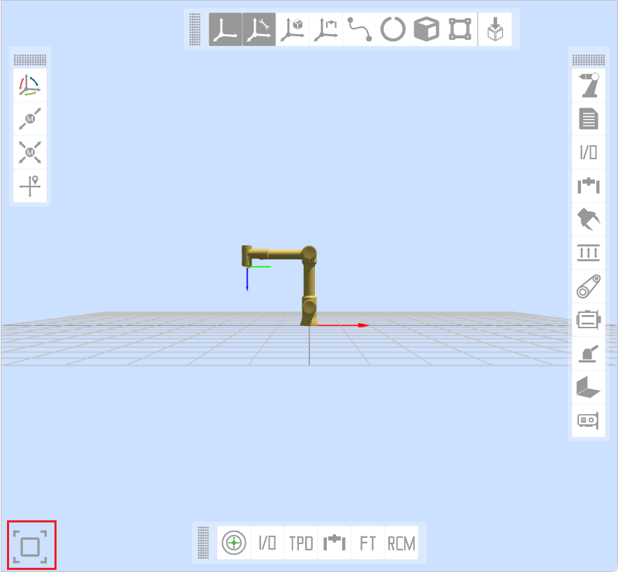
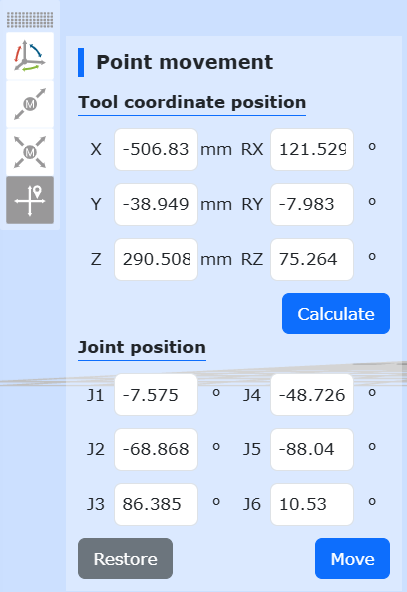
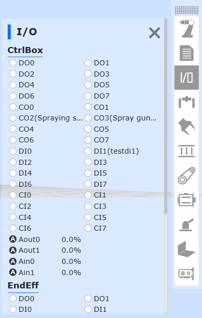
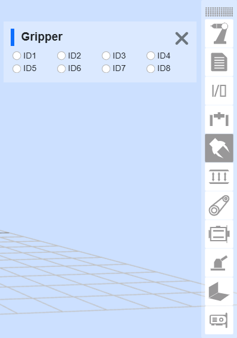
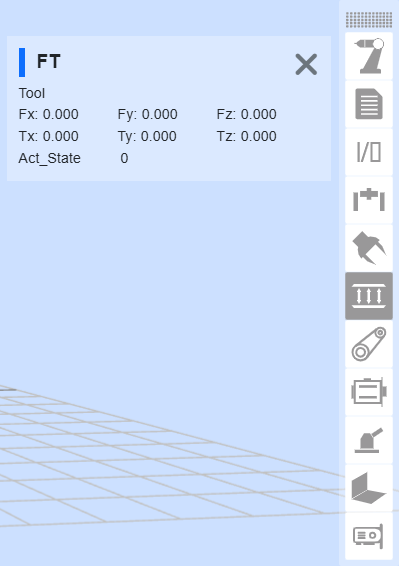
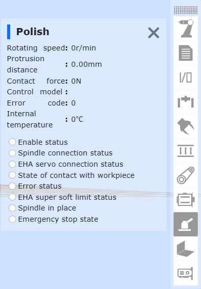
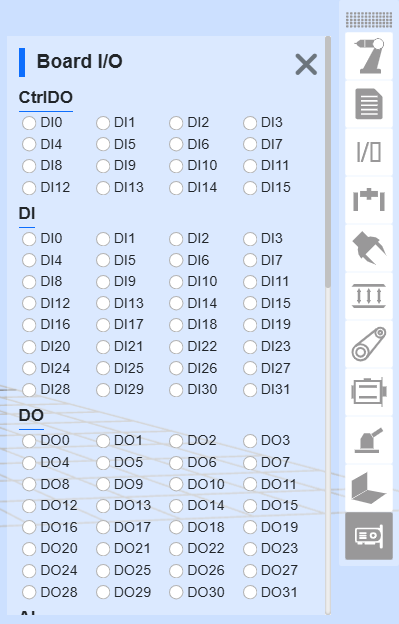

Podstawowe funkcje oprogramowania panelu operatorskiego
=======================================================

.. toctree:: 
   :maxdepth: 6

Informacje podstawowe
---------------------

Wprowadzenie do systemu
~~~~~~~~~~~~~~~~~~~~~~~~~

Oprogramowanie panelu operatorskiego jest oprogramowaniem towarzyszącym opracowanym dla robota, działającym w systemie operacyjnym panelu operatorskiego. Jego główne funkcje i cechy techniczne są następujące:

-  Umożliwia tworzenie programów nauczania dla robota.
-  Umożliwia wyświetlanie w czasie rzeczywistym współrzędnych pozycji robota, trójwymiarową symulację fizycznego robota oraz sterowanie ruchem robota.
-  Umożliwia jednoosiowe punktowanie robota oraz operacje współpracy wielu osi.
-  Umożliwia przeglądanie stanu wejść/wyjść sterowania.
-  Użytkownik może zmienić hasło, wyświetlić informacje o systemie itp.

Pierwsza aktywacja robota
~~~~~~~~~~~~~~~~~~~~~~~~~

1. Włącz skrzynkę sterowniczą i podłącz kabel sieciowy do komputera PC.

2. Na komputerze PC otwórz przeglądarkę i przejdź do docelowego adresu URL 192.168.58.2. Przy pierwszym uruchomieniu robota pojawi się strona aktywacji.

.. figure:: teaching_pendant_software/058.png
   :width: 4in
   :align: center

.. centered:: Wykres 5.1‑1 Interfejs aktywacji

3. Wprowadź poprawny kod SN skrzynki urządzenia, a po jego wprowadzeniu kliknij przycisk „Aktywuj”.

4. System zweryfikuje kod SN. Jeśli wprowadzony kod jest prawidłowy, proces aktywacji zostanie automatycznie zakończony.

.. figure:: teaching_pendant_software/059.png
   :width: 4in
   :align: center

.. centered:: Wykres 5.1‑2 Interfejs pomyślnej aktywacji

5. Aktywacja zakończona sukcesem. Uruchom ponownie skrzynkę sterowniczą ręcznie.

6. Po ponownym uruchomieniu i przejściu do docelowego adresu URL 192.168.58.2 pojawi się strona logowania.

Uruchomienie oprogramowania
~~~~~~~~~~~~~~~~~~~~~~~~~~~

1. Włącz zasilanie skrzynki sterowniczej.
2. Na panelu operatorskim otwórz przeglądarkę i przejdź do docelowego adresu URL 192.168.58.2.
3. Wprowadź nazwę użytkownika i hasło, a następnie kliknij „Zaloguj”, aby uzyskać dostęp do systemu.

Logowanie użytkownika i aktualizacja uprawnień
~~~~~~~~~~~~~~~~~~~~~~~~~~~~~~~~~~~~~~~~~~~~~~~

.. centered:: Tabela 5.1-1 Użytkownicy początkowa

.. list-table::
   :widths: 70 70 70 70
   :header-rows: 0
   :align: center

   * - **Numer pracowniczy**
     - **Początkowa nazwa użytkownika**
     - **Hasło**
     - **Kod funkcji**

   * - 111
     - admin
     - 123
     - 1

   * - 222
     - MEenginer
     - 222
     - 2

   * - 333
     - PEenginer
     - 333
     - 3

   * - 444
     - programmer
     - 444
     - 4

   * - 555
     - operator
     - 555
     - 5

   * - 666
     - monitor
     - 666
     - 6

Użytkownicy (zarządzanie użytkownikami, patrz 15.2.1 Zarządzanie użytkownikami) są domyślnie podzieleni na sześć poziomów. Administrator nie ma ograniczeń funkcjonalnych. Operator i obserwator mają dostęp do niewielkiej części funkcji. Inżynier ME, inżynier PE&PQE oraz technik i lider grupy mają częściowe ograniczenia funkcjonalne. Administrator nie ma ograniczeń funkcjonalnych. Szczegółowe uprawnienia domyślnych kodów funkcji znajdują się w 15.2.2 Zarządzanie uprawnieniami.

Ekran logowania wygląda następująco:

.. figure:: teaching_pendant_software/001.png
   :width: 4in
   :align: center

.. centered:: Wykres 5.1‑3 Interfejs logowania

Ustawienia wielojęzyczne
~~~~~~~~~~~~~~~~~~~~~~~~

- System aktualnie zawiera osiem języków: chiński uproszczony, chiński tradycyjny, angielski, francuski, koreański, japoński, rosyjski i włoski.

- Nazwa pakietu językowego musi mieć format: [kod języka].json, na przykład: es.json, gdzie kod języka jest zgodny z normą ISO 639-1.

- Poniżej znajduje się tabela porównawcza języków.

.. list-table::
   :widths: 70 70 70 70
   :header-rows: 0
   :align: center

   * - **Język**
     - **Nazwa w języku lokalnym**
     - **Kod języka (ISO 639-1)**
     - **Czy wbudowany w system**

   * - chiński
     - 中文（汉语）
     - zh
     - Tak

   * - chiński
     - 中文（繁體）
     - tc
     - Tak

   * - angielski
     - English
     - en
     - Tak

   * - francuski
     - français
     - fr
     - Tak

   * - japoński
     - 日本語
     - ja
     - Tak

   * - koreański
     - 한국어
     - ko
     - Tak

   * - rosyjski
     - Русский
     - ru
     - Tak

   * - włoski
     - italiano
     - it
     - Tak

   * - niemiecki
     - Deutsch
     - de
     - Tak

1. Na ekranie logowania (lub na ekranie pierwszej aktywacji) wybierz język w prawym górnym rogu.

.. image:: teaching_pendant_software/062.png
   :width: 6in
   :align: center

.. centered:: Wykres 5.1‑5 Ustawianie języka na ekranie aktywacji

.. image:: teaching_pendant_software/063.png
   :width: 6in
   :align: center

.. centered:: Wykres 5.1‑6 Ustawianie języka na ekranie logowania

2. Na przykładzie ustawiania języka na ekranie logowania, jeśli wybierzesz język, treść bieżącej strony zostanie przełączona na wybrany język, na przykład:

.. image:: teaching_pendant_software/001.png
   :width: 4in
   :align: center

.. centered:: Wykres 5.1‑7 Strona logowania w języku chińskim

.. image:: teaching_pendant_software/061.png
   :width: 4in
   :align: center

.. centered:: Wykres 5.1‑8 Strona logowania w języku angielskim

Po pomyślnym zalogowaniu system załaduje model i inne dane. Po zakończeniu ładowania przejdzie do strony początkowej.

Początkowy interfejs systemu
----------------------------

Po pomyślnym zalogowaniu system przechodzi do „Interfejsu początkowego”, który zawiera głównie:

1. Logo FAIRINO.
2. Przycisk zwijania paska menu.
3. Pasek menu.
4. Obszar sterowania robotem.
5. Obszar stanu robota.
6. Symulacja 3D robota – operacje w scenie 3D.
7. Symulacja 3D robota – operacje na samym robocie.
8. Funkcje dodatkowe robota.
9. Stan robota i funkcji dodatkowych.

Poniżej znajduje się schemat początkowego interfejsu systemu:

.. image:: teaching_pendant_software/002.png
   :align: center
   :width: 6in

.. centered:: Wykres 5.2‑1 Schemat początkowego interfejsu systemu

Po wejściu do „Ustawień początkowych”, „Program nauczania” -> „Programowanie”, „Program nauczania” -> „Programowanie graficzne” oraz aplikacji pomocniczych WebApp, strona modelu trójwymiarowej symulacji robota jest półrozwinięta. Kliknięcie ikony rozwinięcia umożliwia ponowne wejście do początkowego interfejsu systemu.

.. centered:: Wykres 5.2‑2 Ikona umożliwiająca rozwinięcie strony modelu trójwymiarowej symulacji robota

Obszar sterowania
~~~~~~~~~~~~~~~~~

.. note:: 
   .. image:: teaching_pendant_software/003.png
      :width: 0.75in
      :height: 0.75in
      :align: left

   Nazwa: **Przycisk załączania**
   
   Funkcja: Załącza robota.

.. note:: 
   .. image:: teaching_pendant_software/004.png
      :width: 0.75in
      :height: 0.75in
      :align: left

   Nazwa: **Przycisk Start**
   
   Funkcja: Przesyła i uruchamia program nauczania.

.. note:: 
   .. image:: teaching_pendant_software/005.png
      :width: 0.75in
      :height: 0.75in
      :align: left

   Nazwa: **Przycisk Stop**
   
   Funkcja: Zatrzymuje aktualnie działający program nauczania.

.. note:: 
   .. image:: teaching_pendant_software/006.png
      :width: 0.75in
      :height: 0.75in
      :align: left

   Nazwa: **Przycisk Wstrzymaj/Wznów**
   
   Funkcja: Wstrzymuje i wznawia aktualny program nauczania.

.. important::
   Instrukcja wstrzymania na końcu programu nie może być oceniona.

Pasek stanu
~~~~~~~~~~~

.. note:: 
   .. image:: teaching_pendant_software/011.png
      :width: 0.75in
      :height: 0.75in
      :align: left

   Nazwa: **Stan błędu działania robota**
   
   Funkcja: Robot działa z błędem; gdy nie ma błędu, jest ukryty.

.. note:: 
   .. image:: teaching_pendant_software/007.png
      :width: 0.75in
      :height: 0.75in
      :align: left

   Nazwa: **Stan robota**
   
   Funkcja: Stopped - zatrzymany, Running - działa, Pause - wstrzymany, Drag - przeciąganie.

.. note:: 
   .. image:: teaching_pendant_software/010.png
      :width: 0.75in
      :height: 0.75in
      :align: left

   Nazwa: **Układ narzędzia robota, układ przedmiotu, układ dodatkowej osi i numer obciążenia**
   
   Funkcja: Lewy górny – bieżący numer układu narzędzia, prawy górny – bieżący numer układu przedmiotu, lewy dolny – bieżący numer układu dodatkowej osi, prawy dolny – bieżący numer obciążenia.

.. note:: 
   .. image:: teaching_pendant_software/009.png
      :width: 0.75in
      :height: 0.75in
      :align: left

   Nazwa: **Procent prędkości roboczej**
   
   Funkcja: Prędkość robota podczas pracy w bieżącym trybie.

.. note:: 
   .. image:: teaching_pendant_software/012.png
      :width: 0.75in
      :height: 0.75in
      :align: left

   Nazwa: **Tryb automatyczny**
   
   Funkcja: Automatyczny tryb pracy robota. Po przełączeniu z ręcznego na automatyczny i ustawieniu prędkości globalnej, prędkość globalna zostanie automatycznie dostosowana do ustawionej prędkości.

.. note:: 
   .. image:: teaching_pendant_software/013.png
      :width: 0.75in
      :height: 0.75in
      :align: left

   Nazwa: **Tryb ręczny**
   
   Funkcja: Ręczny tryb robota, umożliwiający operacje nauczania robota.

.. note:: 
   .. image:: teaching_pendant_software/065.png
      :width: 0.75in
      :height: 0.75in
      :align: left

   Nazwa: **Przycisk zwijania/rozwijania stanu robota**
   
   Funkcja: Zwijanie/rozwijanie informacji o: układzie narzędzia, układzie przedmiotu, układzie dodatkowej osi, obciążeniu, stanie przeciągania robota, trybie lokalnym/zdalnym, stanie połączenia robota, trybie BOOT i informacji o koncie.

Po kliknięciu przycisku zwijania można wyświetlić następujące informacje o stanie.

.. note:: 
   .. image:: teaching_pendant_software/008.png
      :width: 0.75in
      :height: 0.75in
      :align: left

   Nazwa: **Numer układu narzędzia**
   
   Funkcja: Wyświetla bieżący numer używanego układu narzędzia.

.. note:: 
   .. image:: teaching_pendant_software/027.png
      :width: 0.75in
      :height: 0.75in
      :align: left

   Nazwa: **Numer układu przedmiotu**
   
   Funkcja: Wyświetla bieżący numer używanego układu przedmiotu.

.. note:: 
   .. image:: teaching_pendant_software/028.png
      :width: 0.75in
      :height: 0.75in
      :align: left

   Nazwa: **Numer układu dodatkowej osi**
   
   Funkcja: Wyświetla bieżący numer używanego układu dodatkowej osi.

.. note:: 
   .. image:: teaching_pendant_software/066.png
      :width: 0.75in
      :height: 0.75in
      :align: left

   Nazwa: **Obciążenie**
   
   Funkcja: Wyświetla aktualną masę obciążenia oraz współrzędne środka ciężkości X, Y, Z.

.. note:: 
   .. image:: teaching_pendant_software/014.png
      :width: 0.75in
      :height: 0.75in
      :align: left

   Nazwa: **Stan przeciągania robota**
   
   Funkcja: Robot może być obecnie przeciągany.

.. note:: 
   .. image:: teaching_pendant_software/015.png
      :width: 0.75in
      :height: 0.75in
      :align: left

   Nazwa: **Stan przeciągania robota**
   
   Funkcja: Robot nie może być obecnie przeciągany.

.. note:: 
   .. image:: teaching_pendant_software/068.png
      :width: 0.75in
      :height: 0.75in
      :align: left

   Nazwa: **Tryb lokalny robota**
   
   Funkcja: Robot jest aktualnie sterowany przez skrzynkę sterowniczą.

.. note:: 
   .. image:: teaching_pendant_software/067.png
      :width: 0.75in
      :height: 0.75in
      :align: left

   Nazwa: **Tryb zdalny robota**
   
   Funkcja: Robot może być obecnie sterowany tylko przez PLC.

.. note:: 
   .. image:: teaching_pendant_software/017.png
      :width: 0.75in
      :height: 0.75in
      :align: left

   Nazwa: **Stan połączenia**
   
   Funkcja: Robot jest podłączony.

.. note:: 
   .. image:: teaching_pendant_software/016.png
      :width: 0.75in
      :height: 0.75in
      :align: left

   Nazwa: **Stan rozłączenia**
   
   Funkcja: Robot nie jest podłączony.

.. note:: 
   .. image:: teaching_pendant_software/018.png
      :width: 0.75in
      :height: 0.75in
      :align: left

   Nazwa: **Informacje o koncie**
   
   Funkcja: Wyświetla nazwę użytkownika, uprawnienia oraz opcję wylogowania.

Pasek menu
~~~~~~~~~~

Pasek menu przedstawiono w poniższej tabeli:

.. centered:: Tabela 5.2‑1 Podział menu panelu operatorskiego

+-----------------------+-----------------------------+
| Poziom pierwszy       | Poziom drugi                |
+=======================+=============================+
| Ustawienia początkowe | Podstawowe                  |
+                       +-----------------------------+
|                       | Bezpieczeństwo              |
+                       +-----------------------------+
|                       | Urządzenia peryferyjne      |
+-----------------------+-----------------------------+
| Program nauczania     | Programowanie               |
+                       +-----------------------------+
|                       | Programowanie graficzne     |
+                       +-----------------------------+
|                       | Programowanie grafem węzłów |
+                       +-----------------------------+
|                       | Punkty nauczania            |
+-----------------------+-----------------------------+
| Informacje o stanie   | Dziennik systemowy          |
+                       +-----------------------------+
|                       | Zapytanie o stan            |
+-----------------------+-----------------------------+
| Aplikacje pomocnicze  | Narzędzia aplikacyjne       |
+                       +-----------------------------+
|                       | Pakiety procesowe           |
+-----------------------+-----------------------------+
| Ustawienia systemowe  | /                           |
+-----------------------+-----------------------------+

Trójwymiarowa symulacja robota
------------------------------

Pasek operacji sceny 3D
~~~~~~~~~~~~~~~~~~~~~~~~

Trójwymiarowa wizualizacja układu współrzędnych robota
++++++++++++++++++++++++++++++++++++++++++++++++++++++++

W trójwymiarowym wirtualnym obszarze robota WebAPP tworzone są różne rodzaje trójwymiarowych wirtualnych układów współrzędnych. Na przykładzie wyświetlania podstawowego układu współrzędnych, jak pokazano na poniższym rysunku. Oś X jest czerwona, oś Y zielona, oś Z niebieska.

.. note:: 
   .. image:: teaching_pendant_software/021.png
      :width: 0.75in
      :height: 0.75in
      :align: left

   Nazwa: **Podstawowy układ współrzędnych**
   
   Opis: Podstawowy układ współrzędnych jest domyślnie włączony i wyświetlany w trójwymiarowym wirtualnym obszarze robota w WebAPP, trwale oznaczony w środku dolnej części podstawy robota. Trójwymiarowy wirtualny podstawowy układ współrzędnych można ręcznie wyłączyć.

.. note:: 
   .. image:: teaching_pendant_software/022.png
      :width: 0.75in
      :height: 0.75in
      :align: left

   Nazwa: **Układ współrzędnych narzędzia**
   
   Opis: Układ współrzędnych narzędzia jest domyślnie włączony i wyświetlany. Można go ręcznie wyłączyć. Po uruchomieniu WebAPP i pomyślnym zalogowaniu się użytkownika, pobierana jest nazwa bieżącego stosowanego układu współrzędnych narzędzia i odpowiadające mu dane parametrów, a bieżący układ współrzędnych narzędzia jest inicjalizowany.

.. important::
   Podczas stosowania innych układów współrzędnych narzędzia, po pomyślnym wykonaniu instrukcji zastosowania układu współrzędnych narzędzia, istniejący układ współrzędnych narzędzia w trójwymiarowym wirtualnym obszarze robota jest najpierw usuwany, a następnie dane parametrów nowo zastosowanego układu współrzędnych narzędzia są przekazywane do API generowania trójwymiarowego układu współrzędnych w celu wygenerowania układu współrzędnych narzędzia. Po wygenerowaniu jest on odpowiednio wyświetlany w trójwymiarowym wirtualnym obszarze robota.

.. note:: 
   .. image:: teaching_pendant_software/023.png
      :width: 0.75in
      :height: 0.75in
      :align: left

   Nazwa: **Układ współrzędnych przedmiotu**
   
   Opis: Układ współrzędnych przedmiotu jest domyślnie wyłączony. Można go ręcznie włączyć. Procedura jest taka sama jak w przypadku układu współrzędnych narzędzia.

.. note:: 
   .. image:: teaching_pendant_software/024.png
      :width: 0.75in
      :height: 0.75in
      :align: left

   Nazwa: **Układ współrzędnych zewnętrznej osi**
   
   Opis: Układ współrzędnych zewnętrznej osi jest domyślnie wyłączony. Można go ręcznie włączyć. Procedura jest taka sama jak w przypadku układu współrzędnych narzędzia.

Trójwymiarowa wirtualna trajektoria i importowanie modelu narzędzia
++++++++++++++++++++++++++++++++++++++++++++++++++++++++++++++++++++

.. note:: 
   .. image:: teaching_pendant_software/020.png
      :width: 0.75in
      :height: 0.75in
      :align: left

   Nazwa: **Rysowanie trajektorii**
   
   Opis: Kliknij przycisk, aby włączyć funkcję rysowania trajektorii. Podczas działania programu nauczania trójwymiarowy model robota będzie rysował ścieżkę trajektorii ruchu robota.

.. note:: 
   .. image:: teaching_pendant_software/029.png
      :width: 0.75in
      :height: 0.75in
      :align: left

   Nazwa: **Importuj model narzędzia**
   
   Opis: Kliknij przycisk, aby wyświetlić okno modalne importowania modelu narzędzia. Po pomyślnym przesłaniu i zaimportowaniu pliku model narzędzia zostanie wyświetlony na końcówce robota. Obecnie obsługiwane formaty plików modeli narzędzi to STL i DAE.

Pasek operacji na samym robocie
~~~~~~~~~~~~~~~~~~~~~~~~~~~~~~~

TCP
++++

**Punktowanie w bazie**: W podstawowym układzie współrzędnych można sterować robotem, przytrzymując odpowiednie przyciski układu współrzędnych, aby poruszać się liniowo wzdłuż osi X, Y, Z lub obracać się wokół RX, RY, RZ. Funkcja punktowania w bazie jest podobna do funkcji jednoosiowego punktowania w ruchu Joint. Interfejs pokazano poniżej:

.. image:: teaching_pendant_software/030.png
   :width: 3in
   :align: center

.. centered:: Wykres 5.3-1 Schemat punktowania w bazie

.. important:: 
   Można zwolnić przycisk w dowolnym momencie, aby zatrzymać ruch robota. W razie konieczności naciśnij przycisk awaryjnego zatrzymania, aby zatrzymać robota.

**Punktowanie w narzędziu**: Wybierz układ współrzędnych narzędzia. Można sterować robotem, przytrzymując odpowiednie przyciski układu współrzędnych, aby poruszać się liniowo wzdłuż osi X, Y, Z lub obracać się wokół RX, RY, RZ. Funkcja punktowania w narzędziu jest podobna do funkcji jednoosiowego punktowania w ruchu Joint. Interfejs pokazano poniżej:

.. image:: teaching_pendant_software/031.png
   :width: 3in
   :align: center

.. centered:: Wykres 5.3-2 Schemat punktowania w narzędziu

**Punktowanie w obiekcie**: Wybierz punktowanie w przedmiocie. Można sterować robotem, przytrzymując odpowiednie przyciski układu współrzędnych. W układzie współrzędnych przedmiotu poruszaj się liniowo wzdłuż osi X, Y, Z lub obracaj się wokół RX, RY, RZ. Funkcja punktowania w obiekcie jest podobna do funkcji jednoosiowego punktowania w ruchu Joint. Interfejs pokazano poniżej:

.. image:: teaching_pendant_software/032.png
   :width: 3in
   :align: center

.. centered:: Wykres 5.3-3 Schemat punktowania w obiekcie

Ruch Joint
++++++++++

W ruchu Joint, sześć pasków suwaków na środku reprezentuje odpowiednio kąty odpowiadających im osi. Ruch Joint dzieli się na punktowanie jednoosiowe i współpracę wieloosiową.

**Punktowanie jednoosiowe**: Użytkownik może sterować ruchem robota za pomocą okrągłych przycisków po lewej i prawej stronie, jak pokazano poniżej. W trybie ręcznym i w stawowym układzie współrzędnych, wykonuje się operację obracania wybranego stawu robota. Gdy robot zatrzymuje się z powodu przekroczenia zakresu ruchu (miękkiego limitu), można użyć punktowania jednoosiowego do ręcznej operacji, aby wyprowadzić robota z pozycji przekroczenia limitu. Punktowanie jednoosiowe jest szybsze i wygodniejsze niż inne tryby operacji przy zgrubnym pozycjonowaniu i większych przemieszczeniach.

.. image:: teaching_pendant_software/033.png
   :width: 3in
   :align: center

.. centered:: Wykres 5.3-4 Schemat punktowania jednoosiowego

.. important::
   Ustaw parametr „Próg długiego naciśnięcia ruchu” (maksymalna odległość, jaką robot przebędzie przy długim naciśnięciu przycisku, zakres wartości 0~300). Długie naciśnięcie okrągłego przycisku steruje ruchem robota. Jeśli przycisk zostanie zwolniony podczas ruchu robota, robot natychmiast zatrzyma ruch. Jeśli przycisk będzie przytrzymywany bez zwalniania, robot zatrzyma się po przebyciu odległości ustawionej w progu długiego naciśnięcia ruchu.

**Współpraca wieloosiowa**: Użytkownik może obsługiwać sześć środkowych suwaków, aby dostosować odpowiednią pozycję docelową robota, jak pokazano poniżej. Można obserwować trójwymiarowego wirtualnego robota, aby określić pozycję docelową. Jeśli dostosowana pozycja nie spełnia oczekiwań, kliknij przycisk „Przywróć”, aby wirtualny robot trójwymiarowy powrócił do pozycji początkowej. Gdy użytkownik określi pozycję docelową, może kliknąć przycisk „Zastosuj”, a fizyczny robot wykona odpowiedni ruch.

.. image:: teaching_pendant_software/034.png
   :width: 3in
   :align: center

.. centered:: Wykres 5.3-5 Schemat współpracy wieloosiowej

.. important:: 
   W przypadku współpracy wieloosiowej, ustawiona wartość piątego stawu j5 nie może być mniejsza niż 0,01 stopnia. Jeśli oczekiwana wartość jest mniejsza niż 0,01 stopnia, można ją najpierw ustawić na 0,011 stopnia, a następnie użyć punktowania jednoosiowego do precyzyjnej regulacji piątego stawu j5.

Ruch Move
+++++++++

Wybierz ruch Move. Można bezpośrednio wprowadzić wartości współrzędnych kartezjańskich, kliknąć „Oblicz pozycję stawów”. Pozycja stawów zostanie wyświetlona jako obliczony wynik. Po potwierdzeniu, że nie ma zagrożenia, można kliknąć „Przejdź do tego punktu”, aby sterować ruchem robota do wprowadzonej pozycji i orientacji kartezjańskiej.

.. centered:: Wykres 5.3‑6 Schemat ruchu Move

.. important:: 
   Gdy podana pozycja i orientacja jest nieosiągalna, należy najpierw sprawdzić, czy pozycja i orientacja w przestrzeni kartezjańskiej przekracza zakres roboczy robota, a następnie sprawdzić, czy podczas przejścia z bieżącej pozycji i orientacji do pozycji docelowej występuje pozycja osobliwa. Jeśli istnieje pozycja osobliwa, należy dostosować bieżącą orientację lub wstawić nową pozycję pośrednią, aby uniknąć pozycji osobliwej.

Pasek funkcji dodatkowych robota
~~~~~~~~~~~~~~~~~~~~~~~~~~~~~~~~

Zapis punktu nauczania
++++++++++++++++++++++

Główny obszar sterowania nauczaniem ręcznym służy do ustawiania układu współrzędnych odniesienia w trybie nauczania, wyświetlania w czasie rzeczywistym kątów i wartości współrzędnych każdej osi robota oraz umożliwia nazwanie i zapisanie punktu nauczania.

Podczas zapisywania punktu nauczania, układ współrzędnych tego punktu nauczania jest układem współrzędnych aktualnie stosowanym przez robota.

Zapis punktu nauczania dzieli się na dwa tryby: „Szybki zapis punktu” i „Nazwany zapis punktu”.

- Szybki zapis punktu: Punkt nauczania jest rejestrowany automatycznie, nazwa jest generowana automatycznie.
- Nazwany zapis punktu: Nazwa punktu nauczania jest definiowana przez użytkownika i składa się z prefiksu punktu nauczania + nazwy punktu nauczania.

W przypadku punktu nauczania czujnika, wybierz narzędzie typu czujnik, które zostało już skalibrowane, wprowadź nazwę punktu i kliknij „Dodaj”. Pozycja zapisanego punktu to pozycja rozpoznana przez czujnik.

.. image:: teaching_pendant_software/036.png
   :width: 5in
   :align: center

.. image:: teaching_pendant_software/060.png
   :width: 5in
   :align: center

.. centered:: Wykres 5.3‑7 Schemat ręcznego obszaru operacji

.. important:: 
   Podczas pierwszego użycia ustaw małą wartość prędkości, np. 30, aby zapoznać się z ruchem robota i uniknąć nieoczekiwanych sytuacji.

Wejścia/Wyjścia
+++++++++++++++

W tym interfejsie można ręcznie sterować wyjściami cyfrowymi, wyjściami analogowymi (0-10 V) skrzynki sterowniczej robota oraz wyjściami cyfrowymi i analogowymi (0-10 V) narzędzia końcowego. Jak pokazano na poniższym rysunku:

.. image:: teaching_pendant_software/037.png
   :width: 5in
   :align: center

.. centered:: Wykres 5.3‑8 Schemat ustawień Wejść/Wyjść

TPD (Programowanie nauczania)
+++++++++++++++++++++++++++++

Kroki operacyjne funkcji programowania nauczania (TPD) są następujące:

- **Krok 1 Zapis pozycji początkowej**: Wejdź do lewego obszaru operacji modelu trójwymiarowego i zapisz bieżącą pozycję robota. Ustaw nazwę punktu w polu edycji i kliknij przycisk „Zapisz”. Jeśli zapis się powiedzie, pojawi się komunikat „Zapis punktu zakończony sukcesem”.

- **Krok 2 Konfiguracja parametrów rejestracji trajektorii**: Kliknij TPD, aby przejść do elementu funkcji „TPD” i skonfigurować parametry rejestracji trajektorii. Ustaw nazwę pliku trajektorii, typ pozycji i orientacji oraz okres próbkowania. Skonfiguruj DI i DO. Podczas rejestracji trajektorii TPD można za pomocą wyzwolenia DI zarejestrować odpowiadające wyjścia DO, które mają być wyprowadzone.

.. image:: teaching_pendant_software/038.png
   :width: 5in
   :align: center

.. centered:: Wykres 5.3‑9 Rejestracja trajektorii TPD

- **Krok 3 Sprawdzenie trybu robota**: Sprawdź, czy robot jest w trybie ręcznym. Jeśli nie, przełącz go w tryb ręczny. W trybie ręcznym można przejść do trybu nauczania przeciągania na dwa sposoby: jeden to długie naciśnięcie przycisku końcowego, drugi to przycisk przełączania trybu przeciągania w interfejsie. Podczas rejestracji TPD zaleca się przełączanie robota do trybu nauczania przeciągania z poziomu interfejsu.

.. image:: teaching_pendant_software/039.png
   :width: 3in
   :align: center

.. centered:: Wykres 5.3‑10 Tryb robota

.. important:: 
   Przełączając się do trybu przeciągania z poziomu interfejsu, najpierw upewnij się, czy obciążenie i środek ciężkości narzędzia końcowego są ustawione prawidłowo, a współczynnik kompensacji tarcia jest ustawiony rozsądnie. Następnie poprzez długie naciśnięcie przycisku końcowego sprawdź, czy przeciąganie działa prawidłowo. Po potwierdzeniu, że wszystko jest w porządku, przełącz się do trybu przeciągania z poziomu interfejsu.

- **Krok 4 Rozpoczęcie rejestracji**: Kliknij przycisk „Rozpocznij rejestrację”, aby rozpocząć rejestrację trajektorii. Przeciągnij robota, aby przeprowadzić nauczanie ruchu. Ponadto w konfiguracji końcowego DI znajduje się element konfiguracyjny „Uruchom/zatrzymaj rejestrację TPD”. Po skonfigurowaniu tej funkcji użytkownik może za pomocą zewnętrznego sygnału wyzwolić funkcję „Rozpocznij rejestrację” trajektorii. Należy pamiętać, że aby rozpocząć rejestrację trajektorii za pomocą sygnału zewnętrznego, najpierw należy na stronie skonfigurować informacje o trajektorii TPD.

- **Krok 5 Zatrzymanie rejestracji**: Po zakończeniu nauczania ruchu kliknij przycisk „Zatrzymaj rejestrację”, aby zatrzymać rejestrację trajektorii. Następnie za pomocą przycisku przełączania nauczania przeciągania spraw, aby robot wyszedł z trybu nauczania przeciągania. Otrzymanie przez panel operatorski komunikatu „Zatrzymanie rejestracji trajektorii zakończone sukcesem” oznacza, że rejestracja trajektorii się powiodła. Podobnie jak w kroku 4, po skonfigurowaniu funkcji „Uruchom/zatrzymaj rejestrację TPD” można za pomocą sygnału zewnętrznego wyzwolić zatrzymanie rejestracji.

- **Krok 6 Programowanie nauczania**: Kliknij „Nowy”, wybierz pusty szablon, kliknij, aby przejść do elementu programowania funkcji PTP, wybierz właśnie zapisaną pozycję początkową, kliknij przycisk „Dodaj”. Po zastosowaniu w pliku programu pojawi się jedna instrukcja PTP. Następnie kliknij, aby przejść do elementu programowania funkcji TPD, wybierz właśnie zarejestrowaną trajektorię, ustaw wygładzanie i współczynnik skali prędkości, kliknij przycisk „Dodaj”. Po zastosowaniu w pliku programu pojawi się jedna instrukcja MoveTPD, jak pokazano na poniższym rysunku.

.. image:: teaching_pendant_software/040.png
   :width: 5in
   :align: center

.. centered:: Wykres 5.3‑11 Programowanie TPD

- **Krok 7 Odtworzenie trajektorii**: Po zakończeniu edycji programu nauczania przełącz się w tryb automatyczny, kliknij ikonę „Rozpocznij działanie” u góry interfejsu, aby uruchomić program. Robot rozpocznie odtwarzanie nauczanych ruchów.

- **Krok 8 Edycja trajektorii**: W obszarze edycji trajektorii TPD można wizualizować i edytować/kadrować trajektorię w celu wstępnej analizy i uproszczenia trajektorii TPD. Wybierz odpowiedni punkt trajektorii, a punkty trajektorii zarejestrowane przez użytkownika zostaną wyświetlone w trójwymiarowej przestrzeni robota. Następnie użytkownik może przeciągnąć paski przewijania „Start” i „Koniec”, aby symulować odtwarzanie i przycinać początek i koniec trajektorii.

Usuwanie pliku TPD i obsługa wyjątków:

- **Usuwanie pliku trajektorii**: Kliknij, aby przejść do elementu funkcji TPD, wybierz plik trajektorii do usunięcia i kliknij przycisk „Usuń trajektorię”. Jeśli usunięcie się powiedzie, pojawi się komunikat o pomyślnym usunięciu.

- **Obsługa wyjątków:**

  + **Przekroczenie limitu liczby punktów instrukcji**: Jedna trajektoria może zarejestrować maksymalnie 20 000 punktów. Po przekroczeniu 20 000 punktów kontroler nie rejestruje już kolejnych punktów i wysyła do panelu operatorskiego ostrzeżenie „Przekroczenie limitu liczby punktów instrukcji”. W takim przypadku należy kliknąć „Zatrzymaj rejestrację”.

  + **Zbyt duży odstęp instrukcji TPD**: Jeśli panel operatorski zgłosi błąd zbyt dużego odstępu instrukcji TPD, należy sprawdzić, czy robot powrócił do pozycji początkowej sprzed rejestracji. Jeśli robot powrócił do pozycji początkowej, a błąd zbyt dużego odstępu instrukcji TPD nadal występuje, usuń bieżącą trajektorię i zarejestruj nową.

  + Jeśli podczas operacji TPD wystąpią inne nieprawidłowe sytuacje, należy natychmiast zatrzymać działanie robota za pomocą panelu operatorskiego lub przycisku awaryjnego zatrzymania i sprawdzić przyczynę.

.. important:: 
   Podczas operacji TPD należy ściśle przestrzegać odpowiednich wskazówek na panelu operatorskim.

Ruch Eaxis
++++++++++

Wybierz ruch Eaxis. Ta funkcja jest funkcją punktowania osi rozszerzonej. Przy założeniu prawidłowej konfiguracji osi rozszerzonej, użyj tej funkcji do sterowania osią rozszerzoną. Szczegółowe informacje znajdują się w „Rozdziale 4 – Urządzenia peryferyjne robota – Konfiguracja urządzeń peryferyjnych osi rozszerzonej”.

.. image:: teaching_pendant_software/041.png
   :width: 5in
   :align: center

.. centered:: Wykres 5.3‑12 Schemat ruchu Eaxis

FT
++

Wybierz współrzędne odniesienia jako odniesienie podczas przeciągania z czujnikiem siły.

.. image:: teaching_pendant_software/042.png
   :width: 5in
   :align: center

.. centered:: Wykres 5.3‑12 Schemat FT

Stały punkt dalekocentryczny
++++++++++++++++++++++++++++

Ta funkcja jest stosowana głównie w procedurach medycznych typu penetracja. Po ustawieniu stałego punktu dalekocentrycznego, końcówka robota zawsze porusza się wokół tego punktu.

.. image:: teaching_pendant_software/043.png
   :width: 5in
   :align: center

.. centered:: Wykres 5.3‑13 Schemat stałego punktu dalekocentrycznego

Pasek stanu robota i funkcji dodatkowych
~~~~~~~~~~~~~~~~~~~~~~~~~~~~~~~~~~~~~~~~

Robot
+++++

Wyświetla bieżący model robota, sztywność, stawy i dane współrzędnych.

.. image:: teaching_pendant_software/044.png
   :width: 3in
   :align: center

.. centered:: Wykres 5.3‑14 Stan robota

Program
+++++++

Wyświetla informacje o aktualnie działającym programie i podprogramach.

.. image:: teaching_pendant_software/045.png
   :width: 3in
   :align: center

.. centered:: Wykres 5.3‑15 Stan programu

Wejścia/Wyjścia
+++++++++++++++

Wyświetla bieżący stan Wejść/Wyjść. W przypadku wejść cyfrowych i wyjść cyfrowych, jeśli poziom portu jest wysoki, punkt jest wyświetlany na zielono; jeśli niski, na biało. Wartości wyświetlane dla wejść analogowych i wyjść analogowych wynoszą 0-100, gdzie 100 oznacza 10 V.

.. centered:: Wykres 5.3‑16 Stan Wejść/Wyjść

Oś rozszerzona
++++++++++++++

Wyświetla bieżące informacje o stanie serwonapędów osi rozszerzonej (kontroler + PLC).

.. image:: teaching_pendant_software/047.png
   :width: 3in
   :align: center

.. centered:: Wykres 5.3‑17 Stan osi rozszerzonej (kontroler + PLC)

Chwytak
+++++++

Wyświetla bieżące informacje o stanie chwytaka.

.. centered:: Wykres 5.3‑18 Stan chwytaka

FT
++

Wyświetla bieżące informacje o stanie sterowania siłą.

.. centered:: Wykres 5.3‑19 Stan sterowania siłą

Taśmociąg
+++++++++

Wyświetla bieżące informacje o stanie taśmociągu.

.. image:: teaching_pendant_software/050.png
   :width: 3in
   :align: center

.. centered:: Wykres 5.3‑20 Stan taśmociągu

Serwonapęd
++++++++++

Wyświetla bieżące informacje o stanie osi rozszerzonej (kontroler + sterownik serwonapędu).

.. image:: teaching_pendant_software/051.png
   :width: 3in
   :align: center

.. centered:: Wykres 5.3‑21 Stan osi rozszerzonej (kontroler + sterownik serwonapędu)

Szlifowanie
+++++++++++

Wyświetla bieżące informacje o stanie szlifowania.

.. centered:: Wykres 5.3‑22 Stan szlifowania

Spawanie
++++++++

Wyświetla bieżące informacje o stanie spawania.

.. image:: teaching_pendant_software/053.png
   :width: 3in
   :align: center

.. centered:: Wykres 5.3‑23 Stan spawania

Wejścia/Wyjścia karty
+++++++++++++++++++++

Wyświetla bieżące informacje o stanie karty.

.. centered:: Wykres 5.3‑24 Stan karty