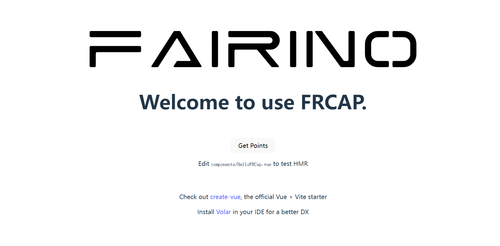

Wprowadzenie
============

FRCap to wtyczka oparta na sieci Web, która może być zintegrowana z WebApp robota współpracującego. FRCap wykorzystuje moduły takie jak Element plus, frcap-ui i frcap-api, zbudowane na Node.js i Vue3, do tworzenia strony konfiguracyjnej lub aplikacji WebApp robota współpracującego w celu rozszerzenia funkcji robota i scenariuszy zastosowań.

Zasadniczo FRCap jest aplikacją internetową działającą w środowisku Node.js, niezależną od WebApp. WebApp zapewnia usługi zarządzania i dostępu. FRCap może współpracować z kontrolerem robota za pośrednictwem dostarczonych oficjalnych interfejsów, lub klient może pisać niestandardowe instrukcje interfejsu i logikę przetwarzania zgodnie z rzeczywistymi potrzebami w celu indywidualnego rozwoju.

.. centered:: Wykres 1.1 Widok WebApp + FRCap