Paletyzator FRCap
=================

Zarządzanie pakietami wtyczek
-----------------------------

Na stronie „Ustawienia systemowe” -> „Konfiguracja wtyczek” w WebApp robota współpracującego kliknij przycisk „Importuj”, wybierz pakiet wtyczki FRCap paletyzatora (format nazwy: nazwa pakietu wtyczki + numer wersji .plugin, przykład: Paletyzator Palletizer-v0.0.0.plugin) i prześlij go. Po pomyślnym przesłaniu lista wyświetli pomyślnie zaimportowane pakiety wtyczek FRCap paletyzatora, w tym stan uruchomienia/wyłączenia wtyczki, nazwę, numer wersji, opis i autora. W kolumnie operacji można „Wyłączyć”, „Włączyć” i „Usunąć” pakiet wtyczki FRCap paletyzatora.

.. image:: frcap_pictures/013.png
   :width: 6in
   :align: center

.. centered:: Wykres 10-1-1 Interfejs konfiguracji wtyczek WebApp

Po pierwszym pomyślnym zaimportowaniu pakietu wtyczki FRCap paletyzatora, stan wtyczki to „Wyłączona”. Kliknij przycisk „Włącz”. Po pomyślnym włączeniu, moduł „Aplikacje pomocnicze” WebApp robota współpracującego zostanie rozszerzony o stronę początkową pakietu wtyczki FRCap paletyzatora (np. nazwa modułu strony odpowiadająca Paletyzator Palletizer-v0.0.0.plugin to „Paletyzator Palletizer”). Kliknij przycisk „Rozpocznij”, aby przejść do strony głównej, wyświetlić aktualnie skonfigurowane receptury paletyzacji i używać ich zgodnie z potrzebami.

.. note:: 
   Jeśli lista receptur jest pusta, należy najpierw dodać/zaimportować recepturę.

.. image:: frcap_pictures/014.png
   :width: 6in
   :align: center

.. centered:: Wykres 10-1-2 Widok WebApp + FRCap paletyzatora

.. image:: frcap_pictures/015.png
   :width: 6in
   :align: center

.. centered:: Wykres 10-1-3 Strona główna FRCap paletyzatora

Zarządzanie recepturami
-----------------------
Każda receptura jest podzielona na trzy główne obszary: nazwa receptury, operacje na recepturze i edycja receptury. Przyciski w obszarze operacji to kolejno: zmień nazwę, eksportuj, kopiuj i usuń.

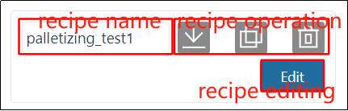

.. centered:: Wykres 10-2-1 Podział obszaru receptury

.. note:: 
   .. image:: frcap_pictures/045.png
      :width: 0.5in
      :height: 0.5in
      :align: left

   | Nazwa: **Eksportuj recepturę**
   | Funkcja: Eksportuje dane bieżącej receptury

.. note:: 
   .. image:: frcap_pictures/046.png
      :width: 0.5in
      :height: 0.5in
      :align: left

   | Nazwa: **Kopiuj recepturę**
   | Funkcja: Kopiuje dane bieżącej receptury

.. note:: 
   .. image:: frcap_pictures/047.png
      :width: 0.5in
      :height: 0.5in
      :align: left

   | Nazwa: **Usuń recepturę**
   | Funkcja: Usuwa bieżącą recepturę

Pobieranie
~~~~~~~~~~
Po wejściu na stronę główną pakietu wtyczki paletyzatora, pobierane są wszystkie bieżące receptury. Gdy liczba receptur jest większa niż cztery, w obszarze wyświetlania receptur pojawia się pasek przewijania, umożliwiający użytkownikowi przewijanie w górę i w dół w celu przeglądania receptur.

.. note:: 
   Wszystkie nazwy receptur zaczynają się od „palletizing”, np. „palletizing_test1”.

.. image:: frcap_pictures/017.png
   :width: 3in
   :align: center

.. centered:: Wykres 10-2-2 Pobieranie receptury

Dodawanie
~~~~~~~~~
W obszarze operacji dowolnej receptury kliknij przycisk „Dodaj”, aby przejść do okna „Dodaj recepturę”. Wprowadź nazwę receptury paletyzacji i kliknij przycisk „Potwierdź”. Po pomyślnym dodaniu, nowa receptura paletyzacji pojawi się w obszarze wyświetlania receptur.

.. note:: 
   Wszystkie nazwy receptur zaczynają się od „palletizing”. Nie trzeba wpisywać „palletizing”, wystarczy wpisać nazwę po znaku „_”. Na przykład dla „palletizing_add” wystarczy wpisać „add”.

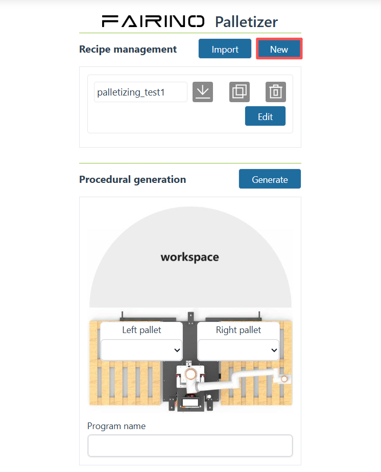

.. image:: frcap_pictures/019.png
   :width: 6in
   :align: center

.. centered:: Wykres 10-2-3 Dodawanie receptury

Zmiana nazwy
~~~~~~~~~~~~
W obszarze operacji dowolnej receptury kliknij pole wyświetlania nazwy receptury, aby przejść do okna „Zmień nazwę receptury paletyzacji”. Wprowadź nową nazwę receptury paletyzacji i kliknij przycisk „Potwierdź”. Po pomyślnej zmianie nazwy, stara nazwa receptury w obszarze wyświetlania zostanie zastąpiona nową.

.. note::
   Wszystkie nazwy receptur zaczynają się od „palletizing”. Nie trzeba wpisywać „palletizing”, okno modalne automatycznie wyświetli nazwę po znaku „_”. Na przykład dla „palletizing_rename” automatycznie wyświetli „rename”.

.. image:: frcap_pictures/020.png
   :width: 6in
   :align: center

.. centered:: Wykres 10-2-4 Zmiana nazwy receptury

Eksport
~~~~~~~
W obszarze operacji dowolnej receptury kliknij ikonę „Eksportuj”, aby pobrać wszystkie dane bieżącej receptury.

.. image:: frcap_pictures/021.png
   :width: 6in
   :align: center

.. centered:: Wykres 10-2-5 Eksport receptury

Kopiowanie
~~~~~~~~~~
W obszarze operacji dowolnej receptury kliknij ikonę „Kopiuj”, aby przejść do okna „Kopiuj recepturę paletyzacji”. Wprowadź nazwę receptury paletyzacji i kliknij przycisk „Potwierdź”. Po pomyślnym skopiowaniu, skopiowana receptura pojawi się w obszarze wyświetlania receptur.

.. note:: 
   Wszystkie nazwy receptur zaczynają się od „palletizing”. Nie trzeba wpisywać „palletizing”, okno modalne automatycznie wyświetli nazwę po znaku „_”. Na przykład dla „palletizing_copy” automatycznie wyświetli „copy”.

.. image:: frcap_pictures/022.png
   :width: 6in
   :align: center

.. centered:: Wykres 10-2-6 Kopiowanie receptury

Usuwanie
~~~~~~~~
W obszarze operacji dowolnej receptury kliknij ikonę „Usuń”, aby usunąć bieżącą recepturę.

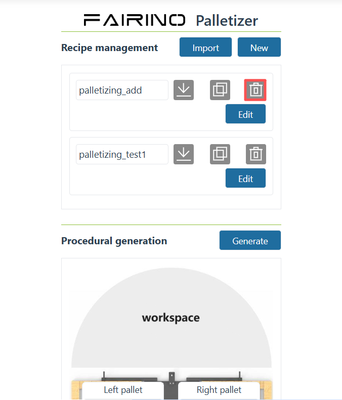

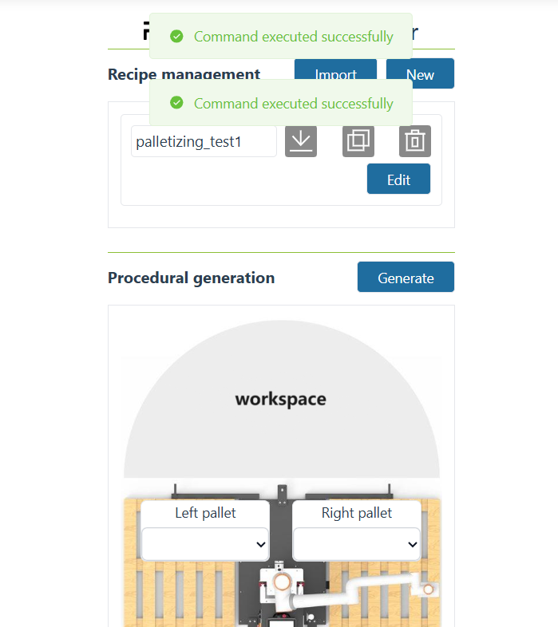

.. centered:: Wykres 10-2-7 Usuwanie receptury

Edycja
~~~~~~
Dla dowolnej receptury kliknij przycisk „Edytuj”, aby przejść do interfejsu konfiguracji bieżącej receptury.

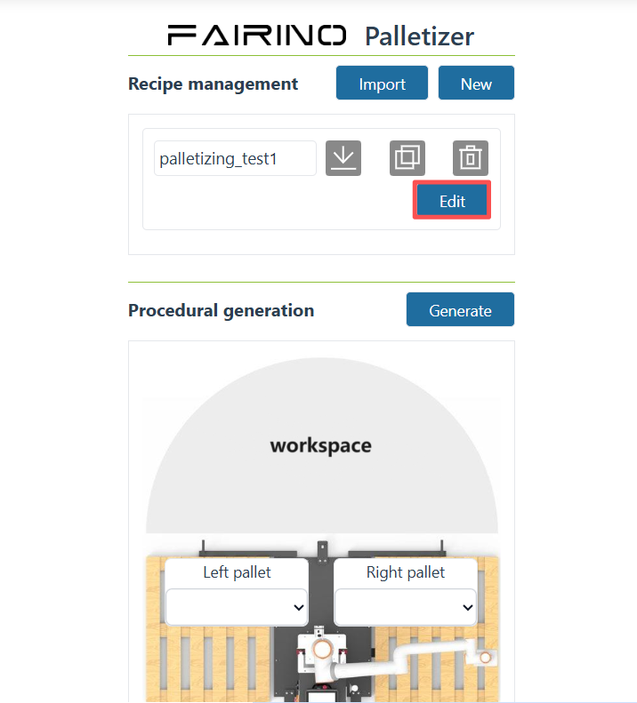

.. centered:: Wykres 10-2-8 Edycja receptury paletyzacji

Import
~~~~~~
Kliknij przycisk „Importuj”, wybierz spakowany plik receptury paletyzacji i prześlij go. Po pomyślnym zaimportowaniu, zaimportowana receptura pojawi się na liście receptur paletyzacji.

.. note:: 
   Wszystkie nazwy spakowanych plików receptur zaczynają się od „palletizing” i kończą na „.tar.gz”, np. „palletizing_import.tar.gz”.

.. image:: frcap_pictures/026.png
   :width: 6in
   :align: center

.. centered:: Wykres 10-2-9 Import receptury

.. important:: 
   Podczas operacji „Dodawania”, „Zmiany nazwy” i „Kopiowania” receptury paletyzacji, jeśli wprowadzona nazwa już istnieje, pojawi się komunikat „Receptura o tej nazwie już istnieje”.

.. image:: frcap_pictures/027.png
   :width: 6in
   :align: center

.. centered:: Wykres 10-2-10 Komunikat o istniejącej recepturze

Konfiguracja receptury
----------------------
Interfejs konfiguracji dowolnej receptury wyświetla podstawowe informacje o skrzynkach, paletach, trybach i konfiguracji zaawansowanej. Szczegółowa konfiguracja parametrów odbywa się w odpowiednich sekcjach konfiguracyjnych.

.. image:: frcap_pictures/028.png
   :width: 6in
   :align: center

.. centered:: Wykres 10-3-1 Interfejs edycji receptury paletyzacji

Ustawienia stanowiska
~~~~~~~~~~~~~~~~~~~~~

Podczas edycji receptury można wybrać, czy używać stanowiska paletyzacyjnego. Użycie stanowiska paletyzacyjnego oznacza, że odpowiednia funkcja paletyzacji będzie korzystać z sygnałów I/O w PLC stanowiska. Jeśli wybrano „Brak stanowiska paletyzacyjnego”, domyślnie funkcja paletyzacji będzie korzystać z sygnałów I/O na skrzynce sterowniczej.

.. image:: frcap_pictures/076.png
   :width: 4in
   :align: center

.. centered:: Wykres 10-3-1-1 Strona edycji receptury

Konfiguracja podłączeń I/O funkcji paletyzacji
~~~~~~~~~~~~~~~~~~~~~~~~~~~~~~~~~~~~~~~~~~~~~~

(1) Po wybraniu użycia stanowiska paletyzacyjnego, kliknij „Konfiguracja rozszerzonych I/O”. W zależności od odpowiednich funkcji i rzeczywistego podłączenia do interfejsów I/O PLC, można niestandardowo wybrać konfigurację sygnałów I/O dla funkcji paletyzacji. Poniższy rysunek przedstawia domyślną konfigurację podłączeń dla stanowiska paletyzacyjnego.

.. image:: frcap_pictures/077.png
   :width: 4in
   :align: center

.. centered:: Wykres 10-3-1-2 Domyślna konfiguracja podłączeń dla stanowiska paletyzacyjnego

(2) Jeśli wybrano „Brak stanowiska paletyzacyjnego”, domyślnie używane są sygnały I/O skrzynki sterowniczej. W zależności od odpowiednich funkcji i rzeczywistego podłączenia do interfejsów I/O skrzynki sterowniczej, można niestandardowo wybrać konfigurację sygnałów I/O dla funkcji paletyzacji. Poniższy rysunek przedstawia domyślną konfigurację podłączeń dla braku stanowiska paletyzacyjnego (użycie I/O skrzynki sterowniczej).

.. image:: frcap_pictures/078.png
   :width: 4in
   :align: center

.. centered:: Wykres 10-3-1-3 Domyślna konfiguracja podłączeń dla braku stanowiska paletyzacyjnego (I/O skrzynki sterowniczej)

Test komunikacji I/O funkcji paletyzacji
~~~~~~~~~~~~~~~~~~~~~~~~~~~~~~~~~~~~~~~~

(1) Po wybraniu użycia stanowiska paletyzacyjnego i skonfigurowaniu rozszerzonych sygnałów I/O stanowiska paletyzacyjnego, można kliknąć „Test”, aby przetestować i zweryfikować podłączone funkcje I/O.

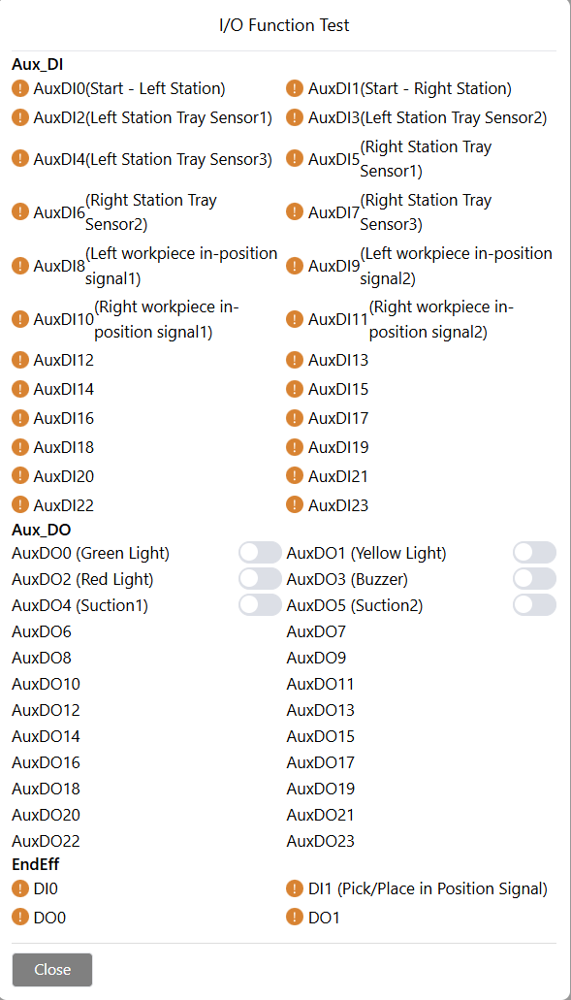

.. centered:: Wykres 10-3-1-4 Test podłączeń I/O stanowiska paletyzacyjnego

(2) Po wybraniu braku stanowiska paletyzacyjnego i skonfigurowaniu sygnałów I/O skrzynki sterowniczej odpowiadających funkcji paletyzacji, można kliknąć „Test”, aby przetestować i zweryfikować podłączone funkcje I/O.

.. image:: frcap_pictures/080.png
   :width: 4in
   :align: center

.. centered:: Wykres 10-3-1-5 Test podłączeń I/O dla braku stanowiska paletyzacyjnego (I/O skrzynki sterowniczej)

Konfiguracja skrzynek
~~~~~~~~~~~~~~~~~~~~~

Operacje na skrzynkach
++++++++++++++++++++++

Można skonfigurować wiele skrzynek różnych typów.

Kliknij przycisk „Dodaj”. Po pomyślnym dodaniu, nowa skrzynka zostanie dodana w bieżącej kolejności.

.. image:: frcap_pictures/048.png
   :width: 6in
   :align: center

.. image:: frcap_pictures/049.png
   :width: 6in
   :align: center

.. centered:: Wykres 10-3-2 Dodawanie skrzynki

Kliknij w pole wyświetlania nazwy skrzynki, aby przejść do okna „Zmień nazwę skrzynki”. Wprowadź nazwę i kliknij przycisk „Potwierdź”, aby potwierdzić zmianę nazwy.

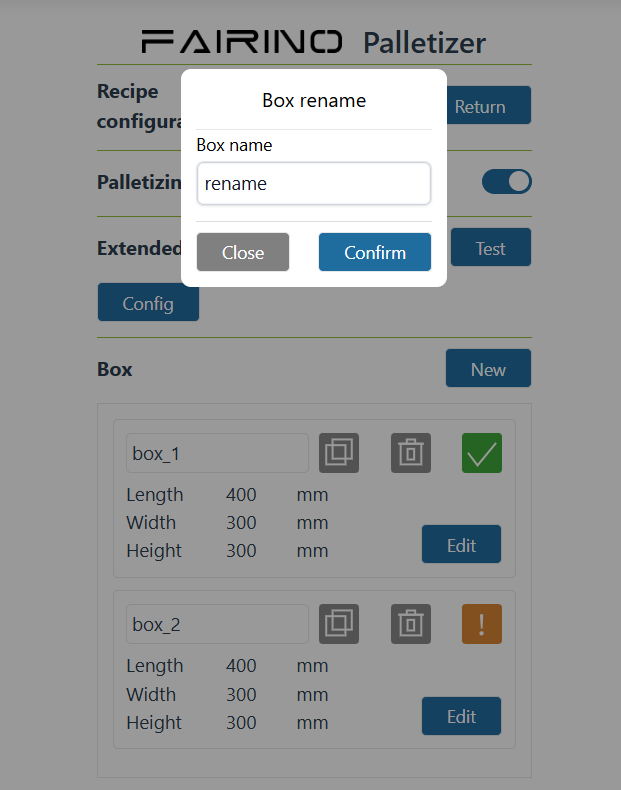

.. centered:: Wykres 10-3-3 Zmiana nazwy skrzynki

Kliknij ikonę „Kopiuj”. Po pomyślnym skopiowaniu, nowa skrzynka zostanie utworzona na podstawie nazwy bieżącej skrzynki.

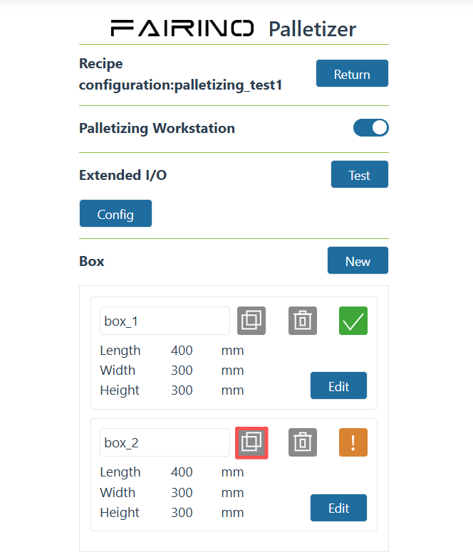

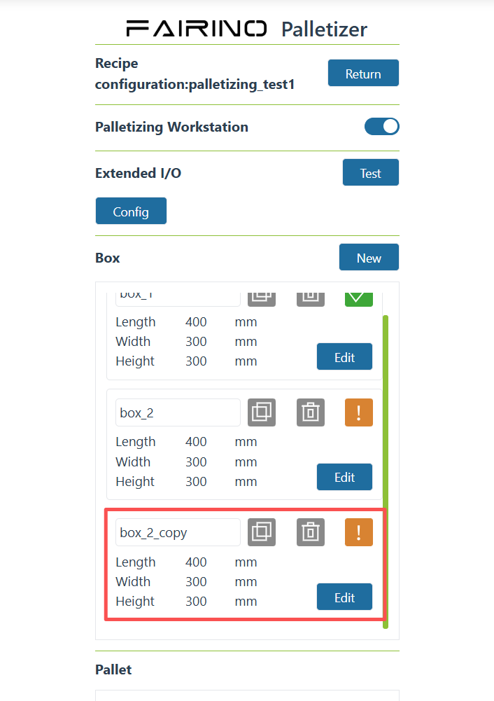

.. centered:: Wykres 10-3-4 Kopiowanie skrzynki

Kliknij ikonę „Usuń”, aby usunąć dane skrzynki.

.. note:: 
   Nie należy usuwać skrzynki, która została już skonfigurowana w konfiguracji trybu.

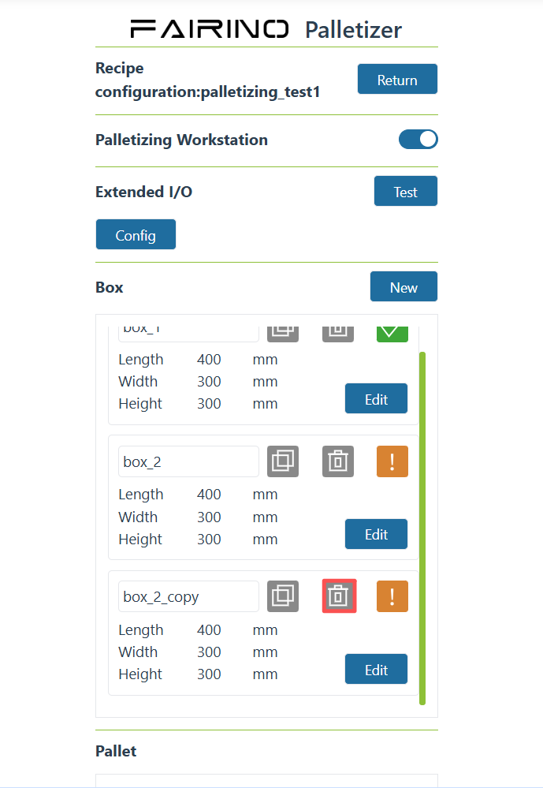

.. image:: frcap_pictures/054.png
   :width: 6in
   :align: center

.. centered:: Wykres 10-3-5 Usuwanie skrzynki

Dla dowolnej skrzynki kliknij przycisk „Edytuj”, aby przejść do interfejsu konfiguracji parametrów skrzynki. Po pomyślnej konfiguracji, ikona stanu konfiguracji skrzynki zmieni kolor na zielony. Gdy konfiguracja nie jest ukończona, ikona stanu konfiguracji skrzynki jest żółta.

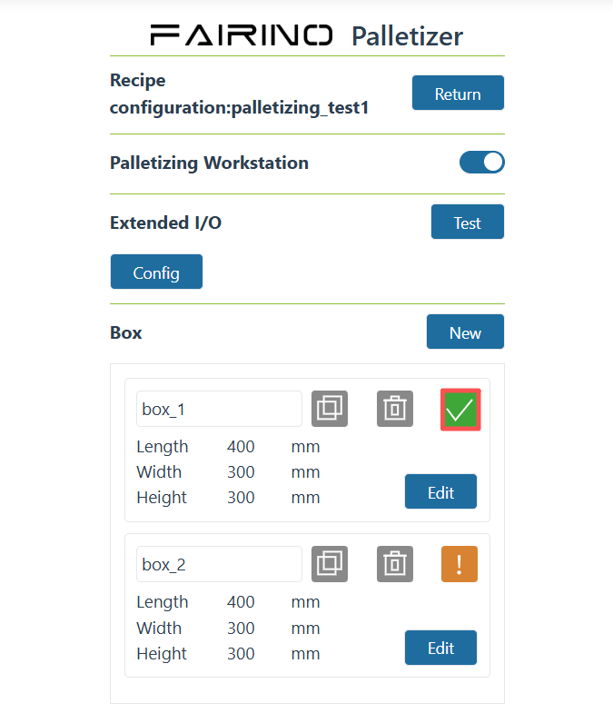

.. centered:: Wykres 10-3-6 Zakończenie konfiguracji parametrów skrzynki

.. image:: frcap_pictures/056.png
   :width: 6in
   :align: center

.. centered:: Wykres 10-3-7 Nieukończona konfiguracja parametrów skrzynki

Parametry skrzynki
++++++++++++++++++

.. note:: 
   .. image:: frcap_pictures/057.png
      :width: 0.5in
      :height: 0.5in
      :align: left

   | Nazwa: **Poprzednia skrzynka**
   | Funkcja: Przełącza na poprzednią skrzynkę. Gdy wybrana jest pierwsza skrzynka, ponowne przełączenie wybierze ostatnią skrzynkę.

.. note:: 
   .. image:: frcap_pictures/058.png
      :width: 0.5in
      :height: 0.5in
      :align: left

   | Nazwa: **Następna skrzynka**
   | Funkcja: Przełącza na następną skrzynkę. Gdy wybrana jest ostatnia skrzynka, ponowne przełączenie wybierze pierwszą skrzynkę.

W sekcji konfiguracji skrzynek kliknij „Edytuj”, aby przejść do okna „Konfiguracja skrzynki”. Ustaw „Długość”, „Szerokość”, „Wysokość”, „Ładowność” i „Orientację etykiety przedmiotu” dla skrzynki, a następnie kliknij przycisk „Potwierdź”, aby zakończyć konfigurację informacji o skrzynce. Ustaw punkt chwytania skrzynki (utrzymuj punkt chwytania w środku skrzynki, z tym że spód przyssawki jest ściśnięty podczas kontaktu ze skrzynką) i kliknij przycisk „Zapisz”, aby zakończyć ustawianie.

.. image:: frcap_pictures/029.png
   :width: 6in
   :align: center

.. centered:: Wykres 10-3-8 Konfiguracja skrzynki

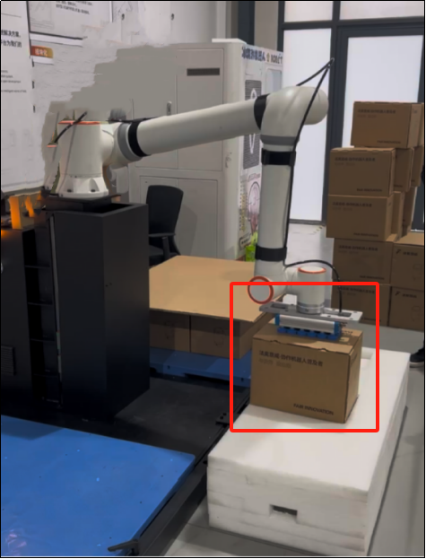

.. centered:: Wykres 10-3-9 Punkt chwytania skrzynki

.. important:: Konieczne jest zapisanie punktu chwytania skrzynki, w przeciwnym razie nie będzie można skonfigurować długości, szerokości i wysokości skrzynki.

Konfiguracja palety
+++++++++++++++++++
W sekcji konfiguracji palety kliknij „Konfiguruj”, aby przejść do okna „Konfiguracja palety”. Ustaw „Przód”, „Bok” i „Wysokość” palety, a następnie ustaw punkty przejściowe stanowisk. Kliknij „Potwierdź konfigurację”, aby zakończyć ustawianie informacji o palecie.

.. image:: frcap_pictures/031.png
   :width: 6in
   :align: center

.. centered:: Wykres 10-3-10 Konfiguracja palety

.. image:: frcap_pictures/032.png
   :width: 3in
   :align: center

.. centered:: Wykres 10-3-11 Punkt przejściowy lewego stanowiska

.. image:: frcap_pictures/033.png
   :width: 3in
   :align: center

.. centered:: Wykres 10-3-12 Punkt przejściowy prawego stanowiska

.. important:: Konieczne jest zapisanie punktów przejściowych stanowisk, w przeciwnym razie wygenerowany program nie będzie mógł zostać zapisany.

Konfiguracja trybu
~~~~~~~~~~~~~~~~~~

Operacje na trybie
++++++++++++++++++

Podczas wybierania skrzynki w konfiguracji trybu można wybierać skrzynki o tej samej wysokości, ale różnych długościach i szerokościach. Obszar wyświetlania trybu jest podzielony na: dodawanie trybu (konfiguracja wzoru układania) i konfiguracja liczby warstw paletyzacji.

.. image:: frcap_pictures/059.png
   :width: 3in
   :align: center

.. centered:: Wykres 10-3-13 Obszar wyświetlania trybu

Kliknij przycisk „Dodaj”. Po pomyślnym dodaniu, nowy tryb zostanie dodany w bieżącej kolejności.

.. image:: frcap_pictures/060.png
   :width: 6in
   :align: center

.. image:: frcap_pictures/061.png
   :width: 6in
   :align: center

.. centered:: Wykres 10-3-14 Dodawanie trybu

Dla dowolnego trybu w obszarze dodawania trybu, kliknij w pole wyświetlania nazwy trybu, aby przejść do okna „Zmień nazwę trybu”. Wprowadź nową nazwę i kliknij przycisk „Potwierdź”, aby potwierdzić zmianę nazwy.

.. image:: frcap_pictures/062.png
   :width: 6in
   :align: center

.. centered:: Wykres 10-3-15 Zmiana nazwy trybu

Dla dowolnego trybu w obszarze dodawania trybu, kliknij ikonę „Kopiuj”. Po pomyślnym skopiowaniu, nowy tryb zostanie utworzony na podstawie nazwy bieżącego trybu.

.. image:: frcap_pictures/063.png
   :width: 6in
   :align: center

.. image:: frcap_pictures/064.png
   :width: 6in
   :align: center

.. centered:: Wykres 10-3-16 Kopiowanie trybu

Dla dowolnego trybu w obszarze dodawania trybu, kliknij ikonę „Usuń”, aby usunąć dane bieżącego trybu.

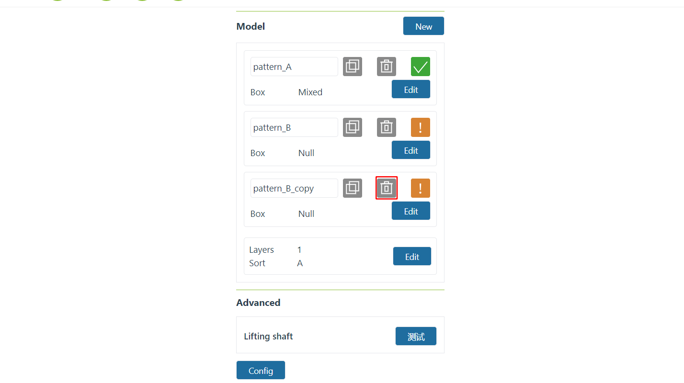

.. image:: frcap_pictures/066.png
   :width: 6in
   :align: center

.. centered:: Wykres 10-3-17 Usuwanie trybu

Dla dowolnego trybu w obszarze dodawania trybu, kliknij przycisk „Edytuj”, aby przejść do okna „Konfiguracja trybu” i skonfigurować wzór układania dla bieżącego trybu. Po pomyślnej konfiguracji, ikona stanu konfiguracji skrzynki zmieni kolor na zielony. Gdy konfiguracja nie jest ukończona, ikona stanu konfiguracji skrzynki jest żółta.

.. image:: frcap_pictures/067.png
   :width: 6in
   :align: center

.. centered:: Wykres 10-3-18 Zakończenie konfiguracji parametrów trybu

.. image:: frcap_pictures/068.png
   :width: 6in
   :align: center

.. centered:: Wykres 10-3-19 Nieukończona konfiguracja parametrów trybu

W obszarze konfiguracji liczby warstw paletyzacji wyświetlana jest liczba warstw i ich kolejność. Kliknij przycisk „Edytuj”, aby przejść do okna „Konfiguracja sekwencji wzorów układania”. Wprowadź „Liczbę warstw paletyzacji”, wybierz tryb dla każdej warstwy i kliknij przycisk „Potwierdź”, aby zakończyć konfigurację.

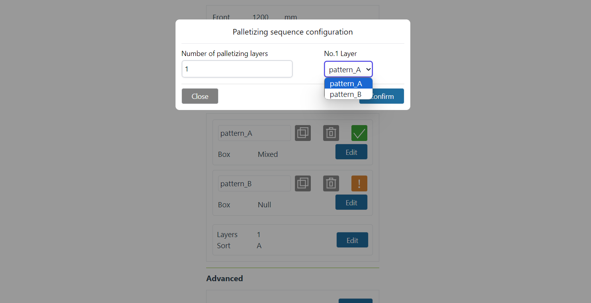

.. centered:: Wykres 10-3-20 Konfiguracja liczby warstw paletyzacji

Parametry trybu
+++++++++++++++

.. note:: 
   .. image:: frcap_pictures/057.png
      :width: 0.5in
      :height: 0.5in
      :align: left

   | Nazwa: **Poprzedni tryb**
   | Funkcja: Przełącza na poprzedni tryb. Gdy wybrany jest pierwszy tryb, ponowne przełączenie wybierze ostatni tryb.

.. note:: 
   .. image:: frcap_pictures/058.png
      :width: 0.5in
      :height: 0.5in
      :align: left

   | Nazwa: **Następny tryb**
   | Funkcja: Przełącza na następny tryb. Gdy wybrany jest ostatni tryb, ponowne przełączenie wybierze pierwszy tryb.

W sekcji konfiguracji trybu kliknij „Konfiguruj”, aby przejść do okna „Konfiguracja trybu”. Jest ono podzielone głównie na cztery obszary: wybór trybu, operacje na skrzynkach i symulacja wzoru układania.

.. image:: frcap_pictures/040.png
   :width: 6in
   :align: center

.. centered:: Wykres 10-3-21 Konfiguracja trybu

.. important:: 
   Podczas dodawania skrzynek, jeśli dojdzie do kolizji między skrzynkami, kolor tła przedmiotu zmieni się na czerwony. W takim przypadku powyższe operacje nie są możliwe. Aby przeprowadzić operację, należy dostosować skrzynki tak, aby nie kolidowały.

W nagłówku okna wybierz tryb. W obszarze operacji na skrzynkach wybierz skrzynkę do dodania w tym trybie. Można dodać wszystkie za jednym razem – domyślnie skrzynki są rozmieszczane bez odstępów, wyśrodkowane na palecie. Niestandardowo ustaw odstępy między skrzynkami. Można dodawać pojedynczo lub wsadowo. Kliknij „Potwierdź”, aby zakończyć ustawianie informacji o trybie. Gdy wybrane skrzynki mają różne wysokości, konfiguracja nie może zostać ukończona i pojawi się komunikat „Wysokość wybranych typów skrzynek jest niezgodna, nie można ich dodać w tym samym trybie”.

.. image:: frcap_pictures/070.png
   :width: 6in
   :align: center

.. centered:: Wykres 10-3-22 Komunikat o niezgodności wysokości wybranych skrzynek

Wybierz tryb odniesienia (nie można wybrać już wybranego trybu), aby porównać i sprawdzić, czy konfiguracja bieżącego trybu umożliwia układanie na podstawie tego trybu odniesienia, ułatwiając klientowi wizualną ocenę wzorów układania skrzynek w różnych trybach.

.. important:: 
   Kierunek paletyzacji: na przykładzie prawej palety, prawy dolny róg jest najdalszym punktem. Układa się jeden rząd przedmiotów pionowo lub poziomo od prawego dolnego rogu, następnie kolejny rząd poziomo lub pionowo powyżej, i tak dalej (kierunek paletyzacji jest oznaczony na stronie internetowej, należy go sprawdzić). Lewa paleta odzwierciedla umieszczanie przedmiotów zgodnie z trybem prawej palety.

Konfiguracja zaawansowana
~~~~~~~~~~~~~~~~~~~~~~~~~
W sekcji konfiguracji zaawansowanej kliknij „Konfiguruj”, aby przejść do okna „Konfiguracja zaawansowana”. Elementy konfiguracji są następujące:

.. image:: frcap_pictures/041.png
   :width: 6in
   :align: center

.. centered:: Wykres 10-3-23 Konfiguracja zaawansowana

1) Wymiary urządzenia paletyzacyjnego: Wymiary stołu paletyzacyjnego.

.. image:: frcap_pictures/074.png
   :width: 6in
   :align: center

.. image:: frcap_pictures/075.png
   :width: 6in
   :align: center

.. centered:: Wykres 10-3-24 Stół paletyzacyjny

.. important::
   X, Y, Z to wartości bezwzględne współrzędnych punktu w prawym górnym rogu lewej palety lub w lewym górnym rogu prawej palety względem podstawowego układu współrzędnych robota. Angle to kąt obrotu robota podczas instalacji. Zaleca się, aby wynosił 0.

2) Wysokość podnoszenia pobranego materiału: Wysokość, na jaką robot podnosi się po pomyślnym pobraniu materiału z punktu chwytania, zdefiniowana przez użytkownika.

3) Czas oczekiwania na pobranie materiału: Czas oczekiwania zdefiniowany przez użytkownika na monitorowanie sygnału obecności podciśnienia po przyssaniu. Jeśli sygnał nie zostanie odebrany, czynność przyssania jest powtarzana.

4) Pierwsza/druga odległość przesunięcia: Odległość przesunięcia zdefiniowana przez użytkownika dla pochylonego układania robota do punktu docelowego.

.. note::
   Parametr Z pierwszego przesunięcia musi być większy niż wysokość skrzynki, w przeciwnym razie podczas układania dojdzie do kolizji z już ustawionymi skrzynkami.

5) Konfiguracja przekładek: Ustaw wymiary przekładki: „Długość”, „Szerokość” i „Wysokość” oraz wybierz uruchomienie/zatrzymanie przekładek.

.. note::
   Po włączeniu funkcji przekładek, zarządzanie recepturami wyświetli podstawowe parametry przekładek w treści konfiguracji zaawansowanej.

.. image:: frcap_pictures/034.png
   :width: 6in
   :align: center

.. centered:: Wykres 10-3-25 Konfiguracja przekładek

.. image:: frcap_pictures/071.png
   :width: 6in
   :align: center

.. centered:: Wykres 10-3-26 Zarządzanie recepturami – wyświetlanie konfiguracji przekładek w konfiguracji zaawansowanej

Następnie ustaw punkty przejściowe dla przekładki. Istnieją trzy punkty przejściowe dla przekładki. Ich ustawienie ma na celu zgrubne zaplanowanie ścieżki ruchu po chwyceniu przekładki, aby uniknąć kolizji i umożliwić wykonanie czynności umieszczenia przekładki.

.. note:: Punkt przejściowy 1 jest nauczany po przebyciu pewnej odległości od punktu chwytania skrzynki. Punkt przejściowy 2 jest nauczany po przebyciu pewnej odległości od punktu przejściowego 1; może być również punktem pośrednim przejścia. Punkt przejściowy 3 jest nauczany po przebyciu pewnej odległości od punktu przejściowego 2 i jest ostatnim punktem przed umieszczeniem przekładki.

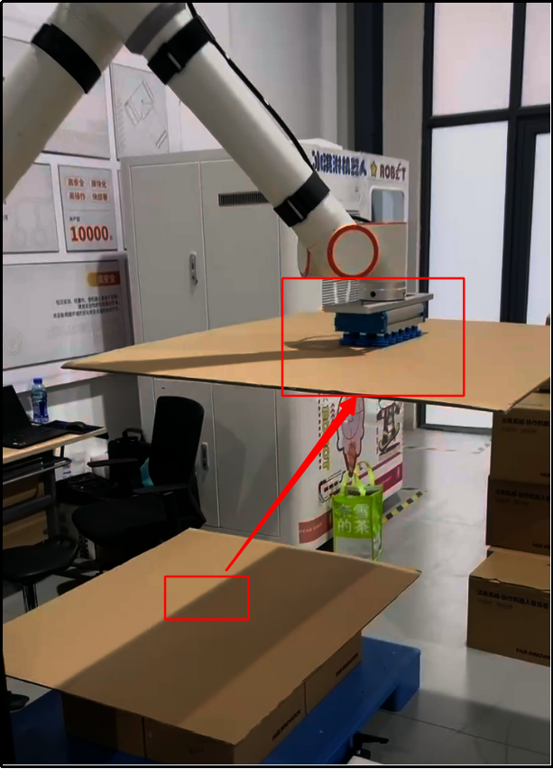

.. centered:: Wykres 10-3-27 Punkt przejściowy 1 przekładki (na przykładzie prawego stanowiska)

.. image:: frcap_pictures/036.png
   :width: 3in
   :align: center

.. centered:: Wykres 10-3-28 Punkt przejściowy 2 przekładki (na przykładzie prawego stanowiska)

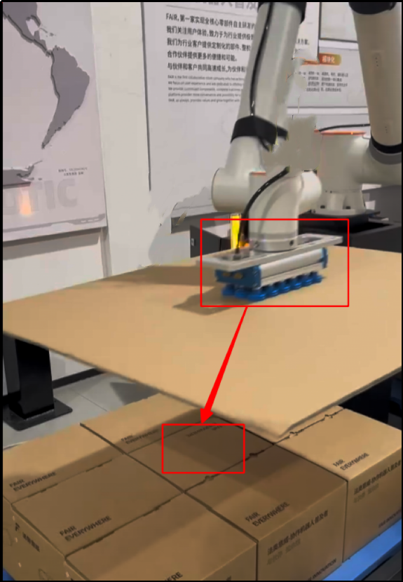

.. centered:: Wykres 10-3-29 Punkt przejściowy 3 przekładki (na przykładzie prawego stanowiska)

Następnie ustaw punkt chwytania (utrzymuj punkt chwytania w środku przekładki, z tym że spód przyssawki jest ściśnięty podczas kontaktu z przekładką) i punkt umieszczenia. Kliknij „Potwierdź”, aby zakończyć ustawianie informacji o przekładce.

.. image:: frcap_pictures/038.png
   :width: 3in
   :align: center

.. centered:: Wykres 10-3-30 Punkt chwytania przekładki (na przykładzie prawego stanowiska)

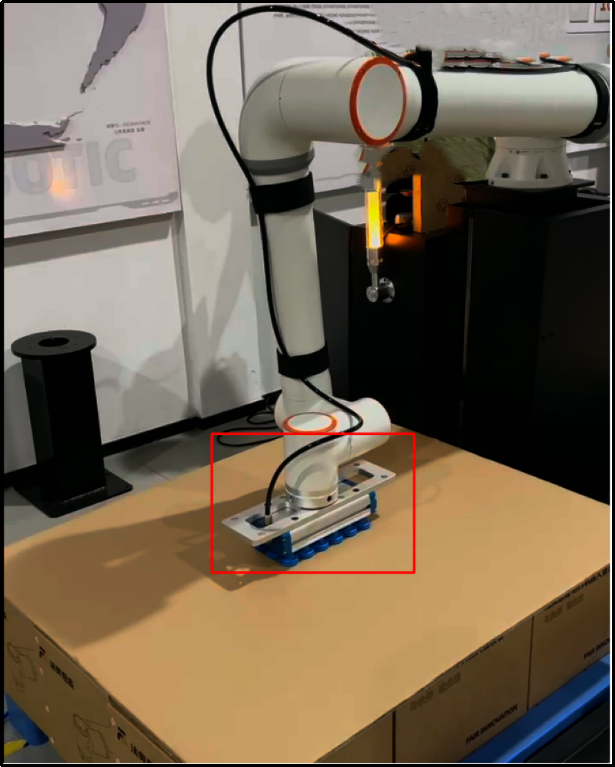

.. centered:: Wykres 10-3-31 Punkt umieszczenia przekładki (na przykładzie prawego stanowiska)

6) Oś podnoszenia: Użytkownik definiuje niestandardowo uruchomienie/zatrzymanie osi podnoszenia, parametry komunikacji (adres IP, numer portu i cykl komunikacyjny), numer warstwy, od której rozpoczyna się podnoszenie, oraz wybiera uruchomienie/zatrzymanie osi podnoszenia.

.. note::
   - Wysokość podnoszenia podczas pracy osi podnoszenia to wysokość skrzynki.
   - Po włączeniu funkcji osi podnoszenia, strona główna wyświetli przycisk testu osi podnoszenia w treści konfiguracji zaawansowanej. Kliknięcie przycisku „Test” powoduje przejście do okna „Test osi podnoszenia”, umożliwiając testowanie dokładności ładowania komunikacji, podnoszenia i opuszczania osi podnoszenia, aby uniknąć problemów z brakiem działania lub dużymi błędami podczas bezpośredniego użytkowania.

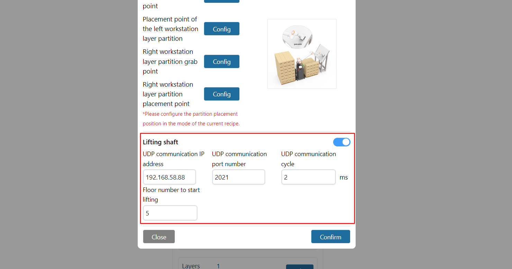

.. centered:: Wykres 10-3-32 Konfiguracja osi podnoszenia

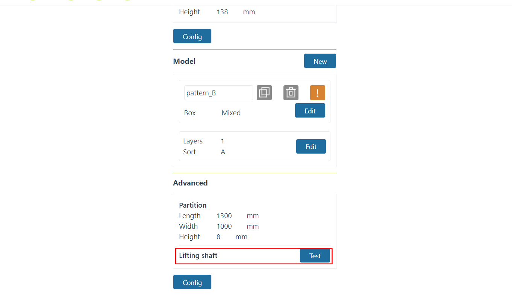

.. centered:: Wykres 10-3-33 Zarządzanie recepturami – wyświetlanie konfiguracji osi podnoszenia w konfiguracji zaawansowanej

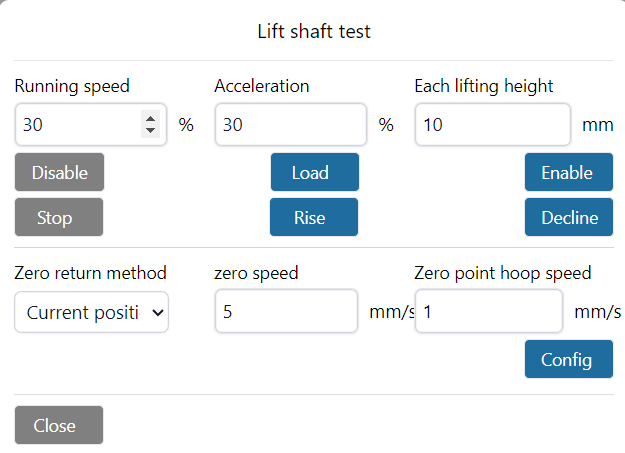

.. centered:: Wykres 10-3-34 Test osi podnoszenia

Generowanie programu
--------------------
Poniżej wyświetlania receptur znajduje się sekcja „Generowanie programu”. Wybierz recepturę zgodnie z recepturą i potrzebami. Gdy receptury zostaną wybrane zarówno dla lewego, jak i prawego stanowiska, należy wybrać priorytet uruchomienia. Gdy receptura zostanie wybrana tylko dla lewego lub tylko dla prawego stanowiska, nie ma potrzeby wybierania priorytetu uruchomienia. Po wprowadzeniu nazwy programu kliknij przycisk „Generuj”.

.. note:: Wszystkie nazwy programów zaczynają się od „palletizing”. Nie trzeba wpisywać „palletizing”, wystarczy wpisać nazwę po znaku „_”. Na przykład dla „palletizing_program” wystarczy wpisać „program”.

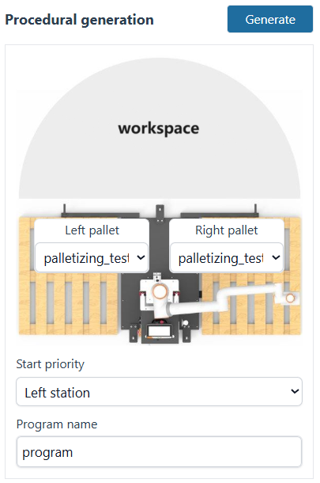

.. centered:: Wykres 10-4-1 Generowanie programu – wybór receptur dla obu stanowisk jednocześnie

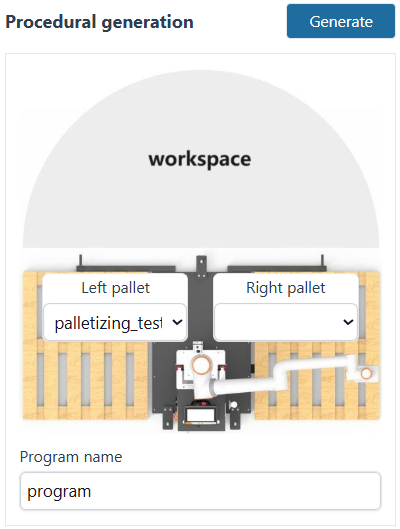

.. centered:: Wykres 10-4-2 Generowanie programu – wybór receptury dla lewego stanowiska, brak wyboru dla prawego

.. important:: 
    1. Jeśli receptura paletyzacji nie została wybrana dla lewego lub prawego stanowiska, oznacza to, że dane stanowisko nie jest aktywowane.
    2. Po pomyślnym wygenerowaniu programu, należy ręcznie zapisać wszystkie podprogramy i program główny w programie nauczania.
    3. Program rozpaletyzowania zaczyna się od „de”. Na przykład, jeśli program paletyzacji to „palletizing_program”, program rozpaletyzowania to „depalletizing_program”.
    4. Podczas uruchamiania programu, w którym receptury są skonfigurowane dla obu stanowisk, po jednoczesnym odebraniu sygnałów gotowości przedmiotu z lewego i prawego stanowiska, praca odbywa się zgodnie z ustawionym priorytetem.

Program z jednym punktem pobierania
~~~~~~~~~~~~~~~~~~~~~~~~~~~~~~~~~~~

Program z jednym punktem pobierania występuje w dwóch następujących sytuacjach:

(1) Lewe i prawe stanowisko wybierają tę samą recepturę.
(2) Lewe i prawe stanowisko wybierają różne receptury, ale pozycja i orientacja punktu chwytania skrzynki skonfigurowana w recepturach jest taka sama.

.. image:: frcap_pictures/082.png
   :width: 4in
   :align: center

.. centered:: Wykres 10-4-3 Punkt chwytania skrzynki dla jednego punktu pobierania

Program z dwoma punktami pobierania
~~~~~~~~~~~~~~~~~~~~~~~~~~~~~~~~~~~
Konfiguracja programu z dwoma punktami pobierania wymaga, aby lewe i prawe stanowisko wybrały różne receptury, a pozycja i orientacja punktu chwytania skrzynki skonfigurowana w tych recepturach była różna.

.. image:: frcap_pictures/083.png
   :width: 4in
   :align: center

.. centered:: Wykres 10-4-4 Punkt chwytania skrzynki dla dwóch punktów pobierania