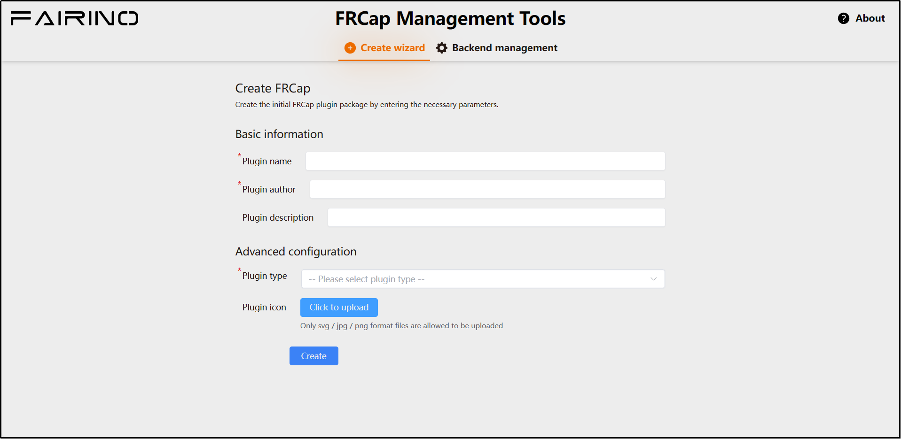
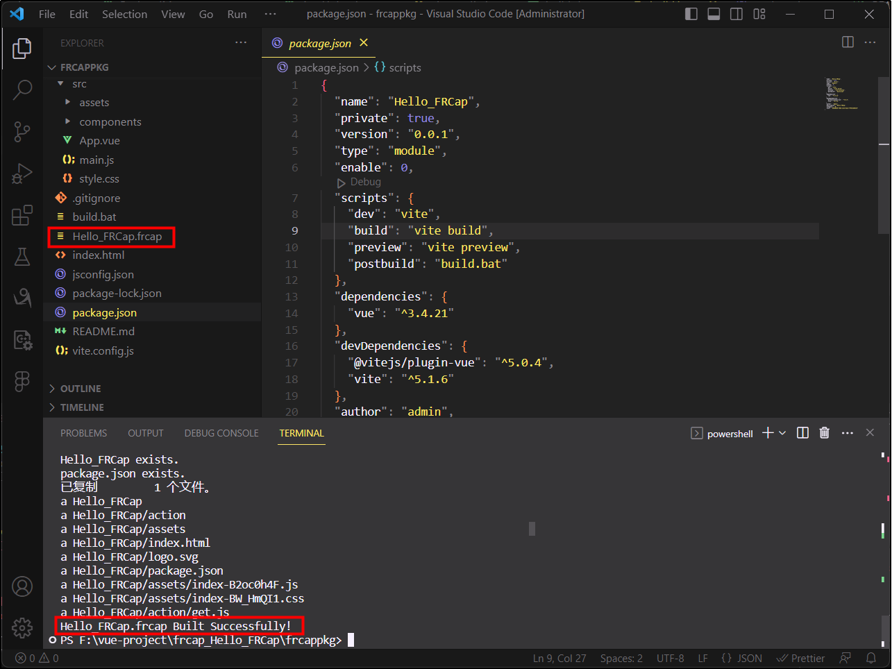
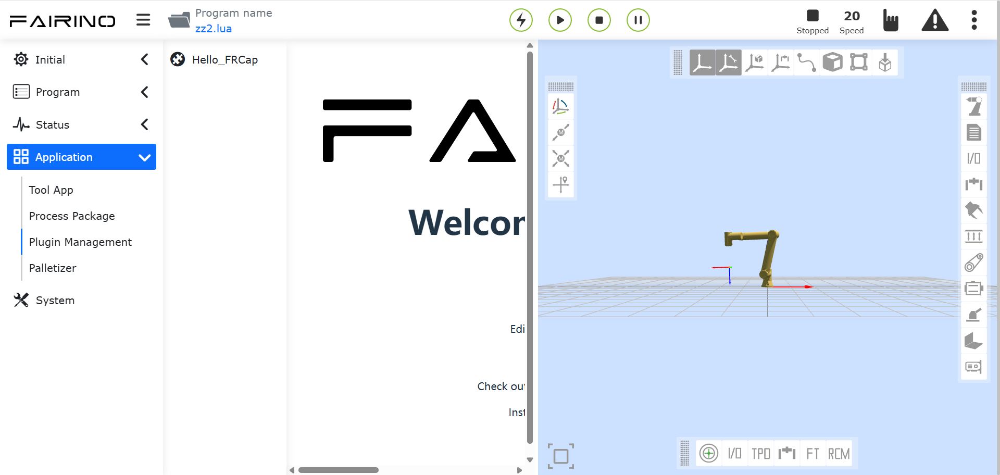

Szybki start
============

.. toctree:: 
   :maxdepth: 6

Nie mam FRCap
-------------

Jeśli obecnie nie posiadasz FRCap, możesz szybko utworzyć FRCap w tej sekcji.

Najpierw musimy połączyć się z robotem i uzyskać dostęp do WebApp. Otwórz przeglądarkę na komputerze lokalnym, wprowadź domyślny adres IP robota (http://192.168.58.2) i zaloguj się do WebApp.

.. image:: frcap_pictures/002.png
   :width: 6in
   :align: center

.. centered:: Wykres 2-1 Strona „Zarządzanie FRCap” w WebApp

W WebApp kolejno kliknij „Ustawienia systemowe” -> „Zarządzanie FRCap” -> „Narzędzia zarządzania”. W przeglądarce otworzy się nowa karta i zostanie wyświetlone „Narzędzie zarządzania FRCap”.

.. centered:: Wykres 2-2 Narzędzie zarządzania FRCap

W narzędziu zarządzania FRCap wybierz „Kreator tworzenia”, a następnie kolejno wprowadź lub wybierz następujące treści wtyczki:

- Nazwa wtyczki: Hello_FRCap.
- Autor wtyczki: admin.
- Opis wtyczki: Hello FRCap.
- Typ wtyczki: Konfiguracja.

Ikona wtyczki nie wymaga przesyłania. Po wprowadzeniu lub wybraniu parametrów kliknij „Utwórz”, aby zakończyć tworzenie FRCap.

.. image:: frcap_pictures/004.png
   :width: 6in
   :align: center

.. centered:: Wykres 2-3 Kreator tworzenia FRCap

Po pomyślnym utworzeniu, nastąpi przekierowanie do strony sukcesu z wyświetleniem nazwy pomyślnie utworzonego FRCap. Kliknij „Pobierz”, aby pobrać utworzony FRCap na komputer lokalny.

.. image:: frcap_pictures/005.png
   :width: 6in
   :align: center

.. centered:: Wykres 2-4 Pobieranie pakietu wtyczki Hello FRCap

Mam już FRCap
-------------
Jeśli posiadasz już folder projektu FRCap, który spełnia strukturę projektu FRCap, przejdź bezpośrednio do sekcji \ `Budowanie FRCap <frcap_quick_start.html#budowanie-frcap>`__.

Jeśli posiadasz już kompletny pakiet wtyczki z rozszerzeniem pliku „.plugin”, przejdź bezpośrednio do sekcji \ `Hello FRCap <frcap_quick_start.html#hello-frcap>`__.

Budowanie FRCap
---------------
Otwórz projekt FRCap pobrany w rozdziale 2.1 lub istniejący projekt FRCap.

W zależności od używanego systemu, najpierw otwórz skrypt budowania, zmodyfikuj parametr `buildName` na żądaną nazwę, następnie zapisz i zamknij. W terminalu wykonaj odpowiedni skrypt.

- W systemie Windows otwórz terminal i uruchom następujące polecenie:

.. code-block:: c++
   :linenos:

   ./build.bat

- W systemie Linux otwórz terminal i uruchom następujące polecenie:
  
.. code-block:: c++
   :linenos:

   ./build.sh

Po zakończeniu budowania, w katalogu projektu FRCap zostanie wygenerowany plik pakietu o nazwie zgodnej z nazwą FRCap i rozszerzeniu pliku „.plugin”.

.. centered:: Wykres 2-5 Zbudowany plik pakietu FRCap

Hello FRCap
-----------
Po zakończeniu budowania projektu FRCap, otwórz przeglądarkę na komputerze lokalnym, wprowadź domyślny adres IP robota (http://192.168.58.2) i zaloguj się do WebApp. Kolejno kliknij „Ustawienia systemowe” -> „Zarządzanie FRCap” -> „Importuj”. Wybierz zbudowany plik pakietu FRCap z rozszerzeniem „.plugin” i otwórz go, aby przesłać. Po pomyślnym przesłaniu, zaimportowane informacje o FRCap zostaną wyświetlone na liście informacji o wtyczkach poniżej.

Za pomocą kolumny operacji na liście można włączać, wyłączać i usuwać FRCap. W kolumnie stanu uruchomienia/wyłączenia można sprawdzić stan włączenia FRCap.

Po włączeniu Hello FRCap można go używać w „Aplikacje pomocnicze” -> „FRCap” -> „Hello FRCap”. Strona ta obsługuje FRCap typu konfiguracyjnego i może być wyświetlana w pełnym lub połowie rozmiaru, domyślnie w połowie.

W tym momencie ukończyłeś cały proces szybkiego tworzenia i używania wtyczki.

.. centered:: Wykres 2-6 Treść Hello FRCap

Aby poznać szczegółowe wskazówki dotyczące kreatora tworzenia, możesz przejść do \ `Kreator tworzenia <frcap_create.html#id1>`__.

Aby poznać narzędzia i wskazówki dotyczące środowiska wymaganego do tworzenia FRCap, przejdź do \ `Przewodnik programisty <frcap_development_guidance.html#id1>`__.

Aby poznać szczegółowe wskazówki dotyczące używania FRCap w WebApp, przejdź do \ `Używanie FRCap w WebApp <frcap_use.html#webappfrcap>`__.