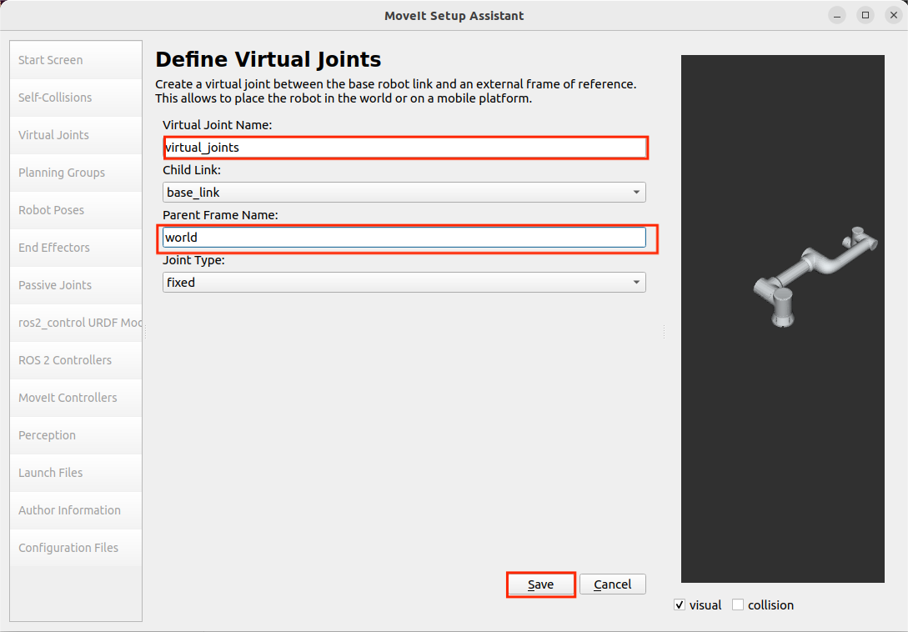
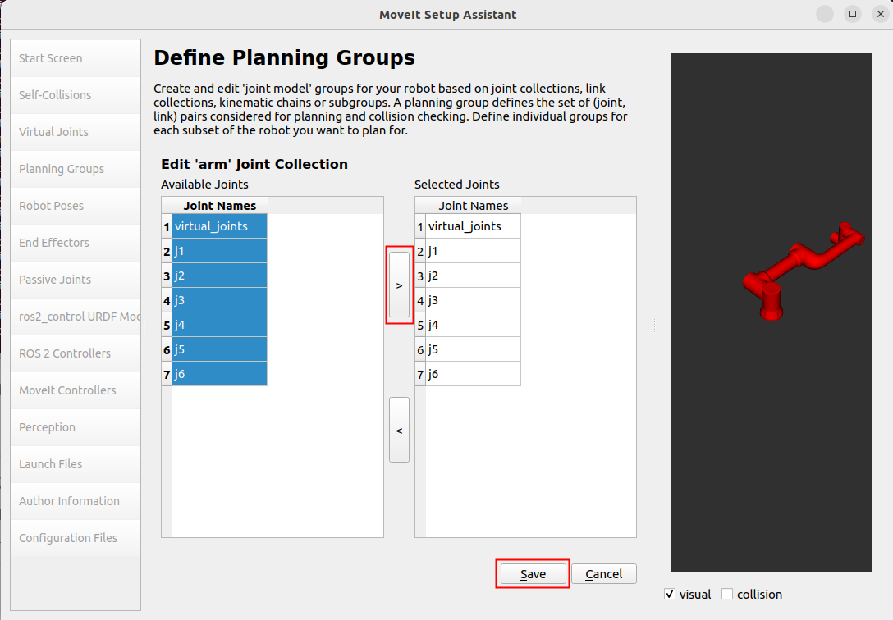
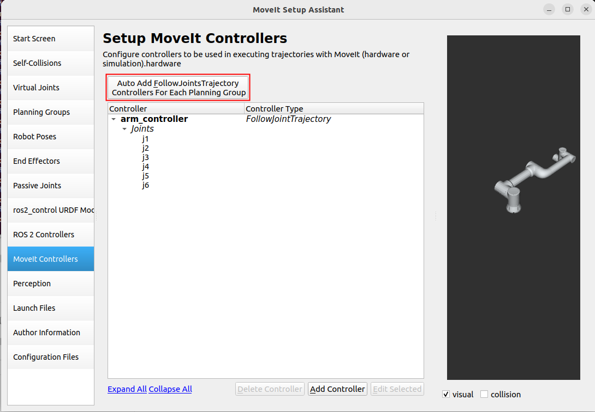
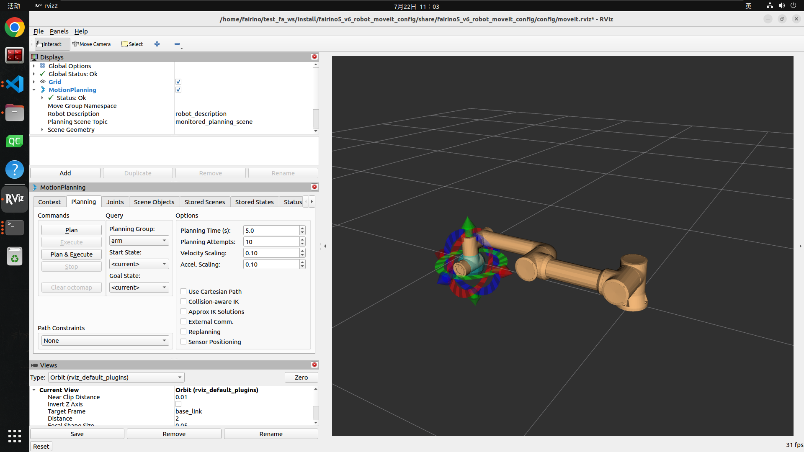
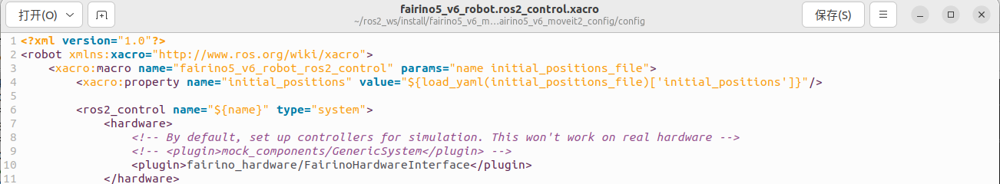

Wprowadzenie do wtyczki
+++++++++++++++++++++++
Wtyczka FAIRINO MoveIt2 to wtyczka zapewniająca wsparcie dla sterowania ruchem i planowania trajektorii robotów FAIRINO. Dzięki wtyczce FAIRINO MoveIt2 można realizować złożone funkcje, takie jak sterowanie ruchem robota, planowanie trajektorii, rozwiązywanie odwrotnej kinematyki i wykrywanie kolizji w czasie rzeczywistym. Nadaje się ona do różnych scenariuszy zastosowań ramion mechanicznych, takich jak przemysł, spawanie, produkcja, automatyczny załadunek i rozładunek, paletyzacja, medycyna itp.

Szybki start
++++++++++++
W tym rozdziale opisano, jak skonfigurować środowisko uruchomieniowe aplikacji.

Zaleca się używanie systemu Ubuntu 22.04 LTS (Jammy). Po zakończeniu instalacji systemu można zainstalować ROS2. Zalecana wersja to ros2-humble. Instrukcję instalacji ROS2 można znaleźć pod adresem: https://docs.ros.org/en/humble/index.html.

Instalacja i konfiguracja pakietu wtyczki FAIRINO MoveIt2
---------------------------------------------------------

Klonowanie wtyczki FAIRINO MoveIt2
""""""""""""""""""""""""""""""""""
Sklonuj wtyczkę FAIRINO MoveIt2 do katalogu lokalnego, a następnie przejdź do katalogu docelowego `cd`. Główne pliki obejmują `fairino_msgs` – pakiet typów danych do transmisji danych robota FAIRINO; `fairino_hardware` – pakiet wtyczki `fairino_hardware` robota FAIRINO;

`fairino_robot/fairino_description` – pakiet wyglądu i plików urdf robota FAIRINO;

`fairino_robot/fairino3mt_v6_moveit2_config`, `fairino_robot/fairino3_v6_moveit2_config`, `fairino_robot/fairino5_v6_moveit2_config`, `fairino_robot/fairino10_v6_moveit2_config`, `fairino_robot/fairino16_v6_moveit2_config`, `fairino_robot/fairino20_v6_moveit2_config`, `fairino_robot/fairino30_v6_moveit2_config` – pakiety konfiguracyjne moveit2 robotów FAIRINO, `fairino_robot/fairino_mtc_demo` – przykładowy pakiet kodu mtc robota FAIRINO.

.. image:: img/fairino_harware_001.png
    :width: 6in
    :align: center
.. image:: img/fairino_harware_002.png
    :width: 6in
    :align: center

Kompilacja pakietów funkcjonalnych
""""""""""""""""""""""""""""""""""

Kompilacja pakietu funkcjonalnego `fairino_msgs`

.. code-block:: shell
    :linenos:

    cd ros2_ws
    colcon build --packages-select fairino_msgs
    source install/setup.bash

Kompilacja pakietu funkcjonalnego `fairino_hardware`

.. code-block:: shell
    :linenos:

    cd ros2_ws
    colcon build --packages-select fairino_hardware
    source install/setup.bash

Kompilacja pakietu funkcjonalnego `fairino_description`

.. code-block:: shell
    :linenos:

    cd ros2_ws
    colcon build --packages-select fairino_description
    source install/setup.bash

Kompilacja pakietu konfiguracyjnego moveit2 robota FAIRINO, na przykładzie `fairino5_v6_moveit2_config`

.. code-block:: shell
    :linenos:

    cd ros2_ws
    colcon build --packages-select fairino5_v6_moveit2_config
    source install/setup.bash

Kompilacja przykładowego pakietu kodu `fairino_mtc_demo` robota FAIRINO. Jeśli ten przykładowy pakiet kodu nie znajduje się w oficjalnym obszarze roboczym `ros2_ws`, skontaktuj się z działem obsługi posprzedażowej w celu jego uzyskania.

.. code-block:: shell
    :linenos:

    cd ros2_ws
    colcon build --packages-select fairino_mtc_demo
    source install/setup.bash

Konfiguracja modelu Moveit2 ramienia mechanicznego FAIRINO
----------------------------------------------------------

Jeśli nie chcesz używać oficjalnie dostarczonego pakietu konfiguracyjnego `moveit2_config` robota, możesz skonfigurować niestandardowy pakiet konfiguracyjny `moveit2_config` robota za pomocą `moveit_setup_assistant`.

Tworzenie obszaru roboczego
""""""""""""""""""""""""""""""""""
Utwórz obszar roboczy i pakiet funkcjonalny

.. code-block:: shell
    :linenos:

    mkdir -p test_fa_ws/src
    cd test_fa_ws/src
    mkdir fairino5_v6_robot_moveit_config
    cd ..
    cd ..

Kompilacja pakietu funkcjonalnego i wykonanie `source`

.. code-block:: shell
    :linenos:

    colcon build
    source install/setup.bash

Uruchomienie `moveit_setup_assistant` w celu konfiguracji robota

.. code-block:: shell
    :linenos:

    ros2 launch moveit_setup_assistant setup_assistant.launch.py

Konfiguracja robota
""""""""""""""""""""""""""""""""""

Uruchomienie interfejsu konfiguracji
^^^^^^^^^^^^^^^^^^^^^^^^^^^^^^^^^^^^
W katalogu `test_fa_ws` otwórz terminal. W interfejsie konfiguracji wybierz „Create New Moveit Configuration Package”, aby utworzyć nowy pakiet konfiguracyjny moveit.

.. image:: img/fairino_harware_003.png
    :width: 6in
    :align: center

Następnie wybierz plik opisu robota, czyli plik `.urdf`, a następnie wybierz „Load Files”, aby załadować model robota. Po prawej stronie wyświetli się załadowany model robota.

.. image:: img/fairino_harware_004.png
    :width: 6in
    :align: center

Konfiguracja Self-Collisions
^^^^^^^^^^^^^^^^^^^^^^^^^^^^
Self-Collisions to ustawienia kolizji robota. Kliknij „Generate Collision Matrix”, aby automatycznie wygenerować macierz kolizji stawów. Spowoduje to usunięcie kolizji między parami stykających się łączników oraz między łącznikami, które nigdy się nie stykają, konfigurując w ten sposób macierz kolizji stawów robota, aby uniknąć obliczania kolizji na powierzchniach styku. Kliknij „Generate Collision Matrix”, aby automatycznie wygenerować.

.. image:: img/fairino_harware_005.png
    :width: 6in
    :align: center

Konfiguracja Virtual Joints
^^^^^^^^^^^^^^^^^^^^^^^^^^^
Virtual Joints to wirtualne osie robota. Gdy robot jest zamontowany na ruchomej platformie, należy ustawić dla niego wirtualne osie. Ustaw nazwę wirtualnej osi, łącznik podrzędny, typ stawu itp. Gdy ruchoma platforma się porusza, wirtualna oś porusza się synchronicznie, wprawiając w ruch robota, umożliwiając mu poruszanie się wraz z ruchomą platformą. W tym przypadku robot zostanie umieszczony bezpośrednio w układzie współrzędnych świata i nazwany `virtual_joints`.

Konfiguracja Planning Groups
^^^^^^^^^^^^^^^^^^^^^^^^^^^^
Planning Groups to grupy planowania robota. Łączą one stawy, które muszą być brane pod uwagę podczas obliczeń kinematycznych, w ramach tej samej grupy planowania w celu przeprowadzenia ujednoliconych obliczeń kinematyki prostej i odwrotnej. Na przykład, umieszczając robota na wózku AGV, a następnie instalując uchwyt na końcówce robota, można przypisać cztery stawy wózka AGV do jednej grupy planowania, sześć stawów robota do jednej grupy planowania, a jeden staw uchwytu do jednej grupy planowania do obliczeń kinematycznych.

Ponieważ w tym przypadku nie ma uchwytu, dodana zostanie tylko grupa stawów robota, czyli grupa `arm`. Najpierw dodaj grupę `arm`. W sekcji Kinematic Solver wybierz `kdl_kinematics_plugin/KDLKinematicsPlugin`. Następnie dla Group Default Planner wybierz `TRRT`. Następnie kliknij „Add Joints”, aby dodać stawy do tej grupy planowania.

.. image:: img/fairino_harware_007.png
    :width: 6in
    :align: center

Stawy `arm` można zaznaczyć wiele, przytrzymując klawisz Shift, kliknąć '>', aby dodać, a następnie kliknąć „Save”, aby zapisać.

Zdefiniowana grupa planowania wygląda następująco:

.. image:: img/fairino_harware_009.png
    :width: 6in
    :align: center

Konfiguracja Robot Poses
^^^^^^^^^^^^^^^^^^^^^^^^
Robot Poses to wstępnie ustawione pozy robota. Definiują one pewne wstępnie ustawione pozy dla każdej grupy planowania. Dla grupy `arm` zdefiniuj pozycję `home`. Tę pozycję można wybrać dowolnie.

.. image:: img/fairino_harware_010.png
    :width: 6in
    :align: center

Robot Poses umożliwia zdefiniowanie wstępnie ustawionych pozycji dla każdej grupy planowania. Jeśli robot posiada uchwyt, można dodać grupę planowania uchwytu w sekcji Planning Groups, a następnie podczas ustawiania pozycji w Robot Poses można ustawić wstępnie ustawione pozycje dla uchwytu.

Konfiguracja End Effectors
^^^^^^^^^^^^^^^^^^^^^^^^^^
End Effectors to mechanizmy końcowe robota. Grupa planowania mechanizmu końcowego to `hand`. Domyślnie łącznikiem nadrzędnym jest `panda_link8`. Ponieważ w tym przypadku nie ma mechanizmu końcowego, ten krok można pominąć.

ros2_control URDF Modifications
^^^^^^^^^^^^^^^^^^^^^^^^^^^^^^^
ros2_control URDF Modifications służy głównie do ustawiania typów danych stawów wysyłanych i odbieranych w sprzężeniu zwrotnym. Można wybrać jeden z trzech typów: pozycja, prędkość, moment obrotowy. W tym przypadku zarówno wysyłane, jak i odbierane dane stawów są ustawione na sterowanie pozycją. Następnie kliknij „Add interfaces”.

.. image:: img/fairino_harware_011.png
    :width: 6in
    :align: center

.. important:: 

   - Uwaga:

    Wybór typu danych stawów musi być zgodny z późniejszą wtyczką `fairino_hardware`. Zgodnie z danymi przesyłanymi przez wtyczkę `fairino_hardware` wybierz typ danych stawów do wysłania i sprzężenia zwrotnego. Ponieważ wtyczka `fairino_hardware` sterująca rzeczywistym ruchem robota używa typu danych `position`, w tym przypadku zarówno wysyłane, jak i odbierane dane stawów są ustawione na sterowanie pozycją.

ROS 2 Controllers
^^^^^^^^^^^^^^^^^
ROS 2 Controllers służy głównie do wygenerowania pliku `ros2_controllers.yaml`. Plik ten ustawia częstotliwość publikacji, nazwy stawów, nazwy kontrolerów, typy kontrolerów itp. Skonfiguruj ROS 2 Controllers, aby skonfigurować kontroler dla każdej grupy planowania. Kliknij „Auto Add JointTrajectoryController Controllers For Each Planning Group”.

.. image:: img/fairino_harware_012.png
    :width: 6in
    :align: center

Moveit Controllers
^^^^^^^^^^^^^^^^^^
Moveit Controllers służy głównie do wygenerowania pliku `moveit_controllers`. Plik ten ustawia nazwy kontrolerów, typy kontrolerów itp. Należy pamiętać, że nazwy kontrolerów w `moveit_controllers` muszą być takie same jak nazwy kontrolerów w `ros2_controllers`, w przeciwnym razie nie będą działać poprawnie.

Ponadto, gdy nazwy kontrolerów w `moveit_controllers` są takie same jak nazwy kontrolerów w `ros2_controllers`, typy kontrolerów w `moveit_controllers` zostaną automatycznie odwzorowane na typy kontrolerów w `ros2_controllers`. Pozwala to na przesyłanie danych sterujących przez `moveit_controllers` do `ros2_controllers`, a następnie przez wtyczki w `ros2_controllers` do napędzania rzeczywistego ruchu robota.

Launch Files
^^^^^^^^^^^^
Skonfiguruj Launch Files. Można użyć domyślnej konfiguracji.

.. image:: img/fairino_harware_014.png
    :width: 6in
    :align: center

Informacje o autorze
^^^^^^^^^^^^^^^^^^^^
.. image:: img/fairino_harware_015.png
    :width: 6in
    :align: center

Generowanie plików Launch
^^^^^^^^^^^^^^^^^^^^^^^^^
Wygeneruj pliki Launch. Wybierz lokalizację generowania. W tym przypadku w ścieżce pliku `test_fa_ws/src` utwórz folder `fairino5_v6_robot_moveit_config` do przechowywania plików konfiguracyjnych, a następnie wybierz „Generate”.

.. image:: img/fairino_harware_016.png
    :width: 6in
    :align: center

Ponieważ w tym przypadku konfiguracja była już przeprowadzona wcześniej, jeśli jest to konfiguracja początkowa, część „Check files you want to be generated” będzie wyświetlona w kolorze czarnym, co oznacza, że można wygenerować pliki Launch.

Uruchomienie Launch
"""""""""""""""""""
Po zakończeniu konfiguracji można przystąpić do kompilacji pakietu funkcjonalnego. Niestandardowy pakiet konfiguracyjny moveit2 robota może zastąpić oficjalny pakiet konfiguracyjny moveit2 robota FAIRINO, umożliwiając kompatybilność wtyczek z niestandardowymi robotami użytkownika.

.. code-block:: shell
    :linenos:

    colcon build --packages-select fairino5_v6_robot_moveit_config
    source install/setup.bash

Następnie uruchom właśnie skonfigurowany plik Launch

.. code-block:: shell
    :linenos:

    ros2 launch fairino5_v6_robot_moveit_config demo.launch.py

Wyświetli się interfejs `rviz2` po zakończeniu konfiguracji.

Użycie Moveit2
""""""""""""""
Po otwarciu skonfigurowanego pakietu można ustawić docelową pozycję robota, przeciągając niebieską kulę na końcówce robota w prawym oknie 3D. Następnie można zmienić orientację końcówki robota za pomocą trzech kółek: czerwonego, zielonego i niebieskiego.

.. image:: img/fairino_harware_018.png
    :width: 6in
    :align: center

Kliknij przycisk „Plan” po lewej stronie, aby zaplanować trajektorię ruchu robota.

.. image:: img/fairino_harware_019.png
    :width: 6in
    :align: center

Kliknij przycisk „Execute” po lewej stronie, aby wprawić robota w ruch zgodnie z zaplanowaną trajektorią do docelowej pozycji i orientacji.

.. image:: img/fairino_harware_020.png
    :width: 6in
    :align: center

Przycisk „Plan&Execute” po zaplanowaniu trajektorii automatycznie steruje ruchem robota.

Następnie kliknij zakładkę „Joints”. Można zmienić docelową pozycję robota, zmieniając kąty poszczególnych stawów, a następnie za pomocą przycisków „Plan”, „Execute”, „Plan&Execute” wprawić robota w ruch.

.. image:: img/fairino_harware_021.png
    :width: 6in
    :align: center

Wtyczka `fairino_hardware` (niestandardowy pakiet konfiguracyjny moveit robota)
----------------------------------------------------------------------------------------

Wtyczka `fairino_hardware` jest warstwą pośredniczącą łączącą moveit z robotem. Za pośrednictwem wtyczki `fairino_hardware` `move_group` wysyła plan ruchu do `moveit_control`, który następnie przekazuje go do `ros2_control`. `ros2_control` z kolei za pośrednictwem wtyczki `fairino_hardware` wprawia w ruch rzeczywistego robota. Ponadto wtyczka `fairino_hardware` odbiera również dane zwrotne z rzeczywistego robota, umożliwiając synchronizację modelu robota w interfejsie symulacji `rviz2` z rzeczywistym robotem. Dzięki temu użytkownik może za pośrednictwem interfejsu `rviz2` wprawiać w ruch rzeczywistego robota.

Ponadto dzięki implementacji wtyczki `fairino_hardware` roboty FAIRINO mogą zostać włączone do struktury sterowania `ros2_control`, co umożliwia ich zgodność z pakietami firm trzecich opartymi na `ros2_control`.

W wtyczce `fairino_hardware` dostosowanej do wersji oprogramowania ramienia mechanicznego V3.8.3 dodano tryb momentu obrotowego oraz interfejs momentu obrotowego instrukcji, umożliwiając ramieniu mechanicznemu przejście w tryb momentu i odbieranie instrukcji momentu obrotowego.

Kompilacja wtyczki `fairino_hardware`
"""""""""""""""""""""""""""""""""""""

Skompiluj pakiet funkcjonalny wtyczki `fairino_hardware` w oficjalnie dostarczonym pakiecie funkcjonalnym `ros2_ws`. Po kompilacji, zgodnie z poprzednią sekcją dotyczącą kompilacji pakietu funkcjonalnego wtyczki `fairino_hardware`, w ścieżce

.. code-block:: shell
    :linenos:

    ros2_ws/install/fairino_hardware/lib/fairino_hardware

powinien znajdować się wygenerowany plik `.so` wtyczki `libfairino_hardware.so`, co oznacza pomyślną kompilację wtyczki.

Należy pamiętać, że nazwy stawów robota w wtyczce `fairino_hardware` muszą być takie same jak nazwy stawów robota skonfigurowane w `moveit2`. W niniejszej wtyczce `fairino_hardware` nazwy sześciu stawów robota, od pozycji podstawy do końcówki, to odpowiednio `j1`, `j2`, `j3`, `j4`, `j5`, `j6`. Dlatego podczas konfiguracji robota w `moveit2` należy nazwać stawy robota jako `j1`, `j2`, `j3`, `j4`, `j5`, `j6`.

Użycie wtyczki `fairino_hardware`
"""""""""""""""""""""""""""""""""

Jeśli używany jest niestandardowy pakiet konfiguracyjny moveit robota, przejdź do katalogu

.. code-block:: shell
    :linenos:

    /home/fairino/test_fa_ws/install/fairino5_v6_robot_moveit_config/share/fairino5_v6_robot_moveit_config/config

i znajdź plik `fairino5_v6_robot.ros2_control.xacro`. W trzeciej linii tego pliku zmień parametr

.. code-block:: shell
    :linenos:

    use_fake_hardware:=false

na

.. code-block:: shell
    :linenos:

    use_fake_hardware:=true

Zgodnie z późniejszą instrukcją warunkową `if`, ustawienie `use_fake_hardware` na `true` oznacza włączenie wtyczki `fairino_hardware/FairinoHardwareInterface`. Zapisz plik i wyjdź.

.. image:: img/fairino_harware_022.png
    :width: 6in
    :align: center

Nazwa wtyczki „fairino_hardware/FairinoHardwareInterface” to nazwa ustawiona dla wtyczki hardware. Można ją sprawdzić w pliku `fairino_hardware.xml` w katalogu `/home/fairino/ros2_ws/src/fairino_hardware`.

.. image:: img/fairino_harware_023.png
    :width: 6in
    :align: center

Należy pamiętać, że parametr `robot_control_mode` w trzeciej linii pliku określa, jakie interfejsy instrukcji zostaną udostępnione podczas ładowania wtyczki. Parametr ten reprezentuje tryb sterowania: 0 to tryb sterowania pozycją, wtyczka udostępni interfejs `position`; 1 to tryb sterowania momentem, wtyczka udostępni interfejs `effort`. Wersja demonstracyjna dla interfejsu sterowania momentem zostanie prawdopodobnie wydana w pakiecie funkcjonalnym `fairino_hardware` dostosowanym do wersji oprogramowania ramienia mechanicznego V3.8.5.

Obecny kontroler Moveit2 obsługuje tylko tryb sterowania pozycją. Nie należy ustawiać `robot_control_mode` na 1.

Uruchomienie wtyczki
""""""""""""""""""""
Otwórz terminal, przejdź do obszaru roboczego `ros2_ws` i wykonaj `source`, aby dodać wtyczkę `fairino_hardware`. Można również dodać tę ścieżkę do pliku „~/.bashrc”, ale nie jest to zalecane.

.. code-block:: shell
    :linenos:

    cd ros2_ws
    source install/setup.bash

Następnie wróć do katalogu głównego, przejdź do obszaru roboczego `test_fa_ws` i wykonaj `source`, a następnie uruchom plik `demo.launch.py`.

.. code-block:: shell
    :linenos:

    cd ..
    cd test_fa_ws
    source install/setup.bash
    ros2 launch fairino5_v6_robot_moveit_config demo.launch.py

Wynik działania
"""""""""""""""
Po uruchomieniu pliku `demo.launch.py` interfejs `rviz2` będzie wyglądał następująco:

.. image:: img/fairino_harware_024.png
    :width: 6in
    :align: center

Główna różnica w porównaniu z interfejsem uruchomieniowym w sekcji 3.3.1 polega na początkowej pozycji robota. W tym przypadku, dzięki dodaniu wtyczki `fairino_hardware`, która odbiera w czasie rzeczywistym stany stawów rzeczywistego robota i przekazuje je przez `ros2_control` do `move_group`, steruje ona pozycją robota symulowanego w interfejsie `rviz2`, osiągając synchronizację między rzeczywistym robotem a robotem symulowanym w `rviz2`.

W tym momencie rzeczywista pozycja robota wygląda następująco:

.. image:: img/fairino_harware_025.png
    :width: 3in
    :align: center

Teraz można wprawić w ruch rzeczywistego robota za pośrednictwem interfejsu `rviz2`. Przeciągnij niebieską kulę na końcówce robota w interfejsie `rviz2`, aby przesunąć końcówkę robota do pozycji docelowej. Następnie przeciągnij kółka w kolorze czerwonym, zielonym i niebieskim na końcówce robota, aby zmienić jej orientację. Następnie kliknij przycisk „Planning&Execute” po lewej stronie, aby zaplanować trajektorię ruchu i wprawić robota w ruch. Zauważysz, że rzeczywisty robot i symulowany robot w interfejsie `rviz2` poruszają się synchronicznie, zatrzymując się w docelowej pozycji i orientacji.

Poniższy rysunek przedstawia sterowanie za pomocą interfejsu `rviz2` zarówno rzeczywistym robotem, jak i symulowanym robotem w interfejsie `rviz2`, aby dotarły do docelowej pozycji i orientacji:

.. image:: img/fairino_harware_026.png
    :width: 6in
    :align: center

.. image:: img/fairino_harware_027.png
    :width: 3in
    :align: center

W ten sposób można za pomocą `moveit2` sterować synchronicznym ruchem rzeczywistego robota i symulowanego robota w interfejsie `rviz2`.

Przykładowy pakiet kodu mtc
+++++++++++++++++++++++++++

Wprowadzenie do przykładowego pakietu kodu mtc
---------------------------------------------------
Przykładowy pakiet kodu mtc dostarcza przebudowany interfejs `rviz2` wykorzystujący `moveit2` i wtyczkę `fairino_hardware`. Zastępuje on oryginalną zakładkę MotionPlanning zakładką Motion Planning Tasks, służącą do wyświetlania poszczególnych etapów ruchu robota. Interfejs `rviz2` można edytować za pomocą pliku „mtc.rviz” znajdującego się w ścieżce

.. code-block:: shell
    :linenos:

    ros2_ws/install/fairino_mtc_demo/share/fairino_mtc_demo/launch

Użytkownik może edytować plik „mtc.rviz”, aby dostosować interfejs `rviz2` do swoich potrzeb funkcjonalnych.

Ponadto przykładowy pakiet kodu mtc dostarcza przykładu, w którym robot za pomocą `moveit2` i wtyczki `fairino_hardware` cyklicznie chwyta cel. Na podstawie tego przykładu użytkownik może dowiedzieć się, jak lepiej wykorzystywać `moveit2` i wtyczkę `fairino_hardware` do interakcji z rzeczywistym robotem za pomocą kodu. Na tej podstawie użytkownik może przeprowadzić indywidualne dostosowania zgodne z własnymi potrzebami.

Kompilacja przykładowego pakietu kodu mtc
---------------------------------------------------

Klonowanie przykładowego pakietu kodu mtc
"""""""""""""""""""""""""""""""""""""""""
Sklonuj oficjalnie dostarczony przykładowy pakiet kodu mtc „fairino_robot” do katalogu `src` w obszarze roboczym `ros2_ws`.

Wybór modelu robota
"""""""""""""""""""
W oficjalnie dostarczonym przykładowym pakiecie kodu mtc, w pliku `mtc_demo_env.launch.py` w katalogu

.. code-block:: shell
    :linenos:

    ros2_ws/src/fairino_robot/fairino_mtc_demo/launch

wybierz model robota. Zmodyfikuj linie 9, 10 i 11 tego pliku, aby dopasować je do modelu robota, który ma zostać ustawiony.

.. image:: img/fairino_harware_030.png
    :width: 6in
    :align: center

Szczegółowe nazewnictwo modeli robotów można znaleźć w katalogu

.. code-block:: shell
    :linenos:

    ros2_ws/src/fairino_robot/

w pakietach funkcjonalnych poszczególnych modeli robotów.

.. image:: img/fairino_harware_031.png
    :width: 3in
    :align: center

Kompilacja przykładowego pakietu kodu mtc
"""""""""""""""""""""""""""""""""""""""""

Kompilacja pakietu funkcjonalnego `fairino_description`
^^^^^^^^^^^^^^^^^^^^^^^^^^^^^^^^^^^^^^^^^^^^^^^^^^^^^^^
Otwórz terminal, przejdź do katalogu `ros2_ws` i skompiluj pakiet funkcjonalny `fairino_description`, a następnie wykonaj `source`.

.. code-block:: shell
    :linenos:

    cd ros2_ws
    colcon build --packages-select fairino_description
    source install/setup.bash

Kompilacja pakietu funkcjonalnego robota
^^^^^^^^^^^^^^^^^^^^^^^^^^^^^^^^^^^^^^^^
W katalogu `ros2_ws` skompiluj pakiet funkcjonalny odpowiadający modelowi robota. Na przykładzie robota FAIRINO5

.. code-block:: shell
    :linenos:

    colcon build --packages-select fairino5_v6_moveit2_config
    source install/setup.bash

Następnie należy dodać wtyczkę `fairino_hardware` do synchronizacji z rzeczywistym robotem. Przejdź do katalogu

.. code-block:: shell
    :linenos:

    ros2_ws/install/fairino5_v6_moveit2_config/share/fairino5_v6_moveit2_config/config

i znajdź plik `fairino5_v6_robot.ros2_control.xacro`. W 9. linii tego pliku zastąp

.. code-block:: shell
    :linenos:

    <plugin>mock_components/GenericSystem</plugin>

przez

.. code-block:: shell
    :linenos:

    <plugin>fairino_hardware/FairinoHardwareInterface</plugin>

Zapisz i wyjdź.

Kompilacja pakietu funkcjonalnego `fairino_mtc_demo`
^^^^^^^^^^^^^^^^^^^^^^^^^^^^^^^^^^^^^^^^^^^^^^^^^^^^^^^
Skompiluj pakiet funkcjonalny `fairino_mtc_demo` i wykonaj `source`.

.. code-block:: shell
    :linenos:

    colcon build --packages-select fairino_mtc_demo
    source install/setup.bash

Uruchomienie przykładowego pakietu kodu mtc
---------------------------------------------------

Interfejs `rviz2`
"""""""""""""""""
Uruchom plik `mtc_demo_env.launch.py`, aby otworzyć dostosowany interfejs `rviz2`. Zakładka Motion Planning Tasks służy do wyświetlania niestandardowych etapów ruchu robota.

.. code-block:: shell
    :linenos:

    cd ros2_ws
    source install/setup.bash
    ros2 launch fairino_mtc_demo mtc_demo_env.launch.py

.. image:: img/fairino_harware_033.png
    :width: 6in
    :align: center

.. image:: img/fairino_harware_034.png
    :width: 3in
    :align: center

Ruch robota
"""""""""""
Otwórz nowy terminal, przejdź do katalogu `ros2_ws` i wykonaj `source`, a następnie uruchom plik `mtc_demo_app.launch.py`, aby wykonać ruch robota.

.. code-block:: shell
    :linenos:

    cd ros2_ws
    source install/setup.bash
    ros2 launch fairino_mtc_demo mtc_demo_app.launch.py

W zakładce Motion Planning Tasks w interfejsie `rviz2` zostaną wyświetlone poszczególne etapy ruchu robota, a rzeczywisty robot i symulowany robot w interfejsie `rviz2` będą poruszać się synchronicznie.

.. image:: img/fairino_harware_035.png
    :width: 6in
    :align: center

.. image:: img/fairino_harware_036.png
    :width: 3in
    :align: center

Uwagi
++++++++++++++++++++++++++++++

Synchronizacja wersji wtyczki `fairino_hardware`
---------------------------------------------------

Użycie wtyczki `fairino_hardware` wymaga, aby jej wersja była zgodna z wersją robota FAIRINO.

Wtyczka `fairino_hardware` odbiera dane zwrotne z robota FAIRINO i konwertuje je na typ danych instrukcji określony przez `ros2_control`, a następnie konwertuje dane ruchu robota wysyłane przez `ros2_control` na ramki danych specyficzne dla robota FAIRINO.

Z tego powodu zgodność typu danych wtyczki `fairino_hardware` z typem danych robota FAIRINO jest kluczowa. Różne wersje wtyczki i robota mogą prowadzić do różnych typów danych. Dlatego przed właściwym debugowaniem wtyczki `fairino_hardware` należy upewnić się, że wersja robota FAIRINO jest zgodna z wersją wtyczki `fairino_hardware`. W przeciwnym razie robot FAIRINO musi zostać zaktualizowany.

- Najpierw można sprawdzić bieżące wersje robota w interfejsie „WebAPP -> Ustawienia systemowe -> Informacje” robota FAIRINO.

.. image:: img/fairino_harware_037.png
    :width: 6in
    :align: center

- Następnie przygotuj oficjalnie dostarczony pakiet oprogramowania robota. Wejdź do interfejsu „WebAPP -> Aplikacje pomocnicze -> Robot -> Aktualizacja systemu” robota FAIRINO, kliknij przycisk „Wybierz plik”, wybierz przygotowany pakiet aktualizacyjny oprogramowania robota odpowiadający wersji wtyczki `fairino_hardware`, wybierz „Prześlij pakiet aktualizacyjny” i poczekaj na zakończenie aktualizacji oprogramowania.

- Po zakończeniu aktualizacji system poprosi o ponowne uruchomienie robota. Przełącz przełącznik na skrzynce sterowniczej robota do pozycji wyłączenia, odczekaj około 25 sekund, a następnie włącz robota. W ten sposób aktualizacja wersji oprogramowania robota zostanie zakończona, umożliwiając kompilację i użycie wtyczki `fairino_hardware`.

.. image:: img/fairino_harware_038.png
    :width: 6in
    :align: center

Potencjalne problemy
---------------------------------------------------
Problem z ładowaniem modelu robota po prawej stronie podczas konfiguracji pakietu robota.
""""""""""""""""""""""""""""""""""""""""""""""""""""""""""""""""""""""""""""""""""""""""""""""""
Rozwiązanie: Ten błąd może wynikać z nieprawidłowej ścieżki w pliku .urdf. Można go rozwiązać, modyfikując ścieżkę w pliku .urdf i kopiując folder `meshes` do katalogu `install/test_moveit/share/test_moveit` w obszarze roboczym.

Błąd po wygenerowaniu pakietu podczas uruchamiania.
""""""""""""""""""""""""""""""""""""""""""""""""""""""""""""""
Rozwiązanie: Usuń „[”capabilities”]” z 203 linii w pliku `launches.py`: `default_value=moveit_config.moveit_capabilities["capabilities"]`.

Podsumowanie
++++++++++++++++++++++++++++++
Niniejsza instrukcja opisuje instalację, konfigurację i używanie wtyczki MoveIt2; instalację i używanie wtyczki `fairino_hardware` w celu synchronizacji ruchu symulowanego robota `rviz2` z rzeczywistym robotem; oraz kompilację i uruchomienie przykładowego pakietu kodu mtc, umożliwiającego realizację niestandardowych funkcji za pomocą `moveit2` i wtyczki `fairino_hardware`.

Mamy nadzieję, że dzięki temu podręcznikowi użytkownicy zyskają pełniejsze zrozumienie wtyczek MoveIt2 i `fairino_hardware` i będą mogli lepiej dostosowywać funkcje robota FAIRINO do swoich indywidualnych potrzeb.