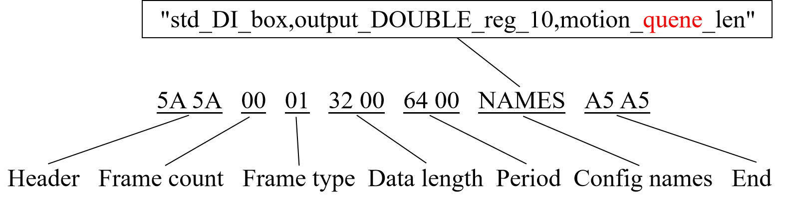

Obsługa funkcji CNDE
====================

Konfiguracja wejść i dane wejściowe
~~~~~~~~~~~~~~~~~~~~~~~~~~~~~~~~~~~

Klient wysyła ramki danych do robota za pośrednictwem CNDE w celu sterowania wyjściami DO, AO robota, rejestrami wejściowymi itp. Przed wysłaniem danych wejściowych należy najpierw skonfigurować treść funkcji, które mają być sterowane. Tabela 2-1 przedstawia format treści konfiguracji wejść CNDE, zawierający numer receptury i serię nazw funkcji konfiguracji wejść (Tabela 1-2). Odpowiadająca jej Tabela 3-2 przedstawia format treści danych wejściowych, zawierający numer receptury i grupę bajtów danych wejściowych.

CNDE obsługuje maksymalnie 8 receptur danych wejściowych. Podczas wysyłania danych wejściowych robot dopasuje numer receptury w odebranych danych do odpowiedniej grupy nazw funkcji konfiguracji receptury, przeanalizuje dane w celu uzyskania wartości danych wejściowych dla każdej nazwy funkcji, a następnie wykona operacje sterowania robotem zgodnie z wprowadzonymi danymi.

.. centered:: Tabela 3-1 Format treści konfiguracji wejść

.. list-table::
   :widths: 40 20 40
   :header-rows: 0
   :align: center
   :class: sheet-center

   * - **Nazwa**
     - **Numer receptury**
     - **Ciąg znaków nazwy funkcji**

   * - Długość (bajt)
     - 1
     - --

   * - Treść
     - 0 ~ 7
     - Seria nazw funkcji danych wejściowych

.. centered:: Tabela 3-2 Format treści danych wejściowych

.. list-table::
   :widths: 40 20 40
   :header-rows: 0
   :align: center
   :class: sheet-center

   * - **Nazwa**
     - **Numer receptury**
     - **Grupa bajtów danych**

   * - Długość (bajt)
     - 1
     - --

   * - Treść
     - 0 ~ 7
     - Treść danych wejściowych

Podczas konfiguracji wejść, kontroler robota po otrzymaniu grupy nazw konfiguracji przeprowadzi weryfikację każdej nazwy. Jeśli skonfigurowane nazwy funkcji są prawidłowe, robot zwróci nazwy typów danych wszystkich skonfigurowanych funkcji oddzielone przecinkami. Jeśli skonfigurowane nazwy funkcji są nieprawidłowe, robot zwróci odpowiednią treść błędu. Przykład ramki danych konfiguracji wejść (szesnastkowo) jest następujący:

Gdzie całkowita długość grupy nazw funkcji konfiguracji wejść wynosi 54 bajty, plus 1 bajt numeru receptury wejściowej, co daje łącznie 55 bajtów. W zapisie szesnastkowym jest to 0x0037, co w trybie little-endian odpowiada długości danych w ramce danych wejściowych jako „37 00”.

W tym momencie robot zwróci ramkę danych z komunikatem typu znakowego (komunikat znakowy z sekcji 3.3.1):

.. image:: cnde/002.png
   :width: 6in
   :align: center

Typ komunikatu „00” oznacza, że jest to komunikat zwrotny o pomyślnym wykonaniu. Klient może wyodrębnić „typ konfiguracji danych wejściowych” i porównać z Tabelą 1-3, aby uzyskać długość bajtową konfiguracji wejść. W tym przykładzie całkowita długość danych wynosi 1*5 + 4*30 + 8*30 = 365 bajtów.

Jeśli nazwa konfiguracji wejścia jest nieprawidłowa:

.. image:: cnde/003.png
   :width: 6in
   :align: center

Jej odpowiadająca informacja zwrotna to:

.. image:: cnde/004.png
   :width: 6in
   :align: center

Dane wejściowe mogą być wysyłane cyklicznie z określonym okresem lub tylko w razie potrzeby. Najszybszy okres, jaki robot może przetworzyć podczas cyklicznego wysyłania, wynosi 1 ms, ale szybszy okres wejściowy wiąże się z większym obciążeniem zasobów systemowych robota. Zaleca się rozsądne ustawienie okresu danych wejściowych w zależności od rzeczywistej sytuacji.

Ponadto podczas wysyłania ramek danych do robota, robot nie będzie wysyłał informacji zwrotnej, chyba że długość lub dane wysyłanej ramki są nieprawidłowe. Przykład ramki danych wejściowych jest następujący, gdzie numer receptury danych wejściowych i długość grupy bajtów danych wejściowych powinny być zgodne z konfiguracją wejść:

.. image:: cnde/005.png
   :width: 6in
   :align: center

Konfiguracja wyjść i dane wyjściowe
~~~~~~~~~~~~~~~~~~~~~~~~~~~~~~~~~~~~

Klient może uzyskać informację zwrotną o stanie robota za pośrednictwem CNDE i może dostosować treść informacji zwrotnej o stanie oraz okres jej wysyłania zgodnie z potrzebami. Użycie funkcji informacji zwrotnej o stanie CNDE robota wymaga następujących trzech kroków: ① konfiguracja wyjść; ② uruchomienie wyjścia; ③ odbiór danych wyjściowych.

Konfiguracja wyjść
++++++++++++++++++

Treść ramki konfiguracji wyjść zawiera okres wyjścia i grupę nazw funkcji wyjścia (wszystkie konfigurowalne nazwy znajdują się w Tabeli 1-1). Konfigurowalny zakres okresu wyjścia wynosi od 1 do 200 ms. Maksymalna obsługiwana liczba bajtów danych wyjściowych to 4096 bajtów. Grupa nazw funkcji wyjścia to ciąg znaków nazw funkcji wyjścia oddzielonych przecinkami. Po wysłaniu ramki konfiguracji wyjść przez klienta, robot zweryfikuje skonfigurowane nazwy funkcji. Jeśli wszystkie skonfigurowane nazwy funkcji są obsługiwane przez bieżący CNDE robota, robot zwróci serię kombinacji typów danych oddzielonych przecinkami. W przeciwnym razie, jeśli weryfikacja nazw konfiguracji wyjścia się nie powiedzie, robot zwróci odpowiednią informację o błędzie.

.. centered:: Tabela 3-3 Treść konfiguracji wyjść

.. list-table::
   :widths: 40 20 40
   :header-rows: 0
   :align: center
   :class: sheet-center

   * - **Nazwa**
     - **Okres wyjścia (ms)**
     - **Ciąg znaków nazwy funkcji**

   * - Długość (bajt)
     - 2
     - --

   * - Treść
     - 1-200
     - Grupa nazw funkcji wyjścia

Przykładowa ramka konfiguracji wyjść jest następująca:

.. image:: cnde/006.png
   :width: 6in
   :align: center

Gdzie całkowita długość grupy nazw funkcji konfiguracji wyjść wynosi 48 bajtów, plus 2 bajty okresu wyjścia, co daje łącznie 50 bajtów. W zapisie szesnastkowym jest to 0x0032, co w trybie little-endian odpowiada długości danych w ramce danych wejściowych jako „32 00”.

W tym momencie robot zwróci ramkę danych z komunikatem typu znakowego (komunikat znakowy z sekcji 3.3.1):

Typ komunikatu „00” oznacza, że jest to komunikat zwrotny o pomyślnym wykonaniu. Klient może wyodrębnić „typ konfiguracji danych wyjściowych” i porównać z Tabelą 1-3, aby uzyskać długość bajtową konfiguracji wyjść. W tym przykładzie całkowita długość danych wynosi 1 + 8*10 + 4 = 85 bajtów.

Jeśli nazwa konfiguracji wejścia jest nieprawidłowa, np. „queue” błędnie zapisane jako „quene”:

Jej odpowiadająca informacja zwrotna to:

.. image:: cnde/009.png
   :width: 6in
   :align: center

Uruchamianie i zatrzymywanie wyjścia
++++++++++++++++++++++++++++++++++++

Po zakończeniu konfiguracji wyjść CNDE robota, wysłanie instrukcji uruchomienia wyjścia CNDE spowoduje, że robot zacznie wysyłać informacje zwrotne o stanie zgodnie ze skonfigurowanym okresem i treścią wyjścia. Podobnie wysłanie instrukcji zatrzymania wyjścia CNDE spowoduje, że robot zatrzyma wysyłanie informacji zwrotnej o stanie. Instrukcje uruchomienia i zatrzymania CNDE nie mają treści instrukcji, a odpowiadająca im długość danych wynosi 0.

.. centered:: Tabela 3-4 Treść uruchamiania i zatrzymania wyjścia CNDE

.. list-table::
   :widths: 40 40
   :header-rows: 0
   :align: center
   :class: sheet-center

   * - **Nazwa**
     - **Grupa bajtów danych**

   * - Długość (bajt)
     - 0

   * - Treść
     - Brak

Przykładowa ramka danych uruchomienia wyjścia CNDE robota jest następująca:

.. image:: cnde/010.png
   :width: 3in
   :align: center

Odbiór danych wyjściowych przez klienta
++++++++++++++++++++++++++++++++++++++++

Po uruchomieniu wyjścia danych CNDE robota, klient potrzebuje pętli do odbierania danych informacji zwrotnej od robota, a częstotliwość odbioru w pętli klienta powinna być wyższa niż skonfigurowana częstotliwość danych wyjściowych, w przeciwnym razie może dojść do utraty pakietów danych. Treść danych wyjściowych robota przedstawiono w Tabeli 3-5. Długość grupy bajtów danych wyjściowych robota jest sumą długości bajtowych wszystkich danych funkcji w konfiguracji wyjścia. Tablica bajtów jest kombinacją wszystkich danych stanu w kolejności skonfigurowanych funkcji, z wyrównaniem do 1 bajta.

.. centered:: Tabela 3-5 Treść danych wyjściowych CNDE

.. list-table::
   :widths: 40 40
   :header-rows: 0
   :align: center
   :class: sheet-center

   * - **Nazwa**
     - **Grupa bajtów danych**

   * - Długość (bajt)
     - --

   * - Treść
     - Grupa bajtów danych wyjściowych

Przykładowa ramka danych wyjściowych robota jest następująca:

.. image:: cnde/011.png
   :width: 4in
   :align: center

Funkcje pomocnicze CNDE
~~~~~~~~~~~~~~~~~~~~~~~

Komunikaty ostrzegawcze typu string
+++++++++++++++++++++++++++++++++++

Klient i robot mogą wysyłać do siebie komunikaty ostrzegawcze typu string za pośrednictwem CNDE. Treść komunikatu obejmuje typ komunikatu i ciąg znaków komunikatu (Tabela 3-6), przy czym definicja typów komunikatów znajduje się w Tabeli 3-7. Gdy klient CNDE wysyła do robota instrukcje, takie jak konfiguracja wejść, konfiguracja wyjść, uruchomienie wyjścia, zatrzymanie wyjścia itp., robot odpowiada komunikatem ostrzegawczym typu string.

Jeśli powyższe instrukcje zostaną wykonane pomyślnie, robot zwróci typ komunikatu „sukces”, któremu odpowiada kod numeryczny 0x00. W przeciwnym razie, jeśli wykonanie instrukcji się nie powiedzie, robot zwróci typ komunikatu „błąd”, któremu odpowiada kod numeryczny 0x03. Klient może na podstawie zwróconego typu komunikatu określić wynik wykonania instrukcji. Jeśli typ komunikatu to „błąd”, można wyodrębnić informację o błędzie w celu analizy przyczyny błędu.

.. centered:: Tabela 3-6 Treść komunikatu ostrzegawczego typu string

.. list-table::
   :widths: 40 20 40
   :header-rows: 0
   :align: center
   :class: sheet-center

   * - **Nazwa**
     - **Typ komunikatu**
     - **Ciąg znaków komunikatu**

   * - Długość (bajt)
     - 1
     - --

   * - Treść
     - 0 ~ 4
     - Ciąg znaków komunikatu

.. centered:: Tabela 3-7 Typy komunikatów ostrzegawczych typu string CNDE robota

.. list-table::
   :widths: 40 40
   :header-rows: 0
   :align: center
   :class: sheet-center

   * - **Typ**
     - **Wartość**

   * - Sukces
     - 0x00

   * - Informacja
     - 0x01

   * - Ostrzeżenie
     - 0x02

   * - Błąd
     - 0x03

   * - Awaria
     - 0x04

Przełączanie numeru wersji protokołu CNDE robota
++++++++++++++++++++++++++++++++++++++++++++++++

Obecnie robot CNDE ma tylko jedną wersję, której numer to „FR-CNDE-V0001”. Dlatego ta funkcja jest funkcją zastrzeżoną i nie jest jeszcze udostępniona do użytku.

Pobieranie informacji o wersji oprogramowania i oprogramowania sprzętowego robota
+++++++++++++++++++++++++++++++++++++++++++++++++++++++++++++++++++++++++++++++++

Klient wysyła do robota za pośrednictwem CNDE instrukcję pobrania informacji o wersji oprogramowania i oprogramowania sprzętowego. Treść instrukcji jest pusta. Po otrzymaniu żądania robot zwróci komunikat ostrzegawczy typu string, którego treść będzie zawierać informacje takie jak model robota, wersja oprogramowania robota, wersja oprogramowania sprzętowego robota, wersja sprzętu robota itp.

Pobieranie danych okresowych funkcji transmisji transparentnej końcowej (CNDE)
~~~~~~~~~~~~~~~~~~~~~~~~~~~~~~~~~~~~~~~~~~~~~~~~~~~~~~~~~~~~~~~~~~~~~~~~~~~~~~

Opis konfiguracji CNDE
++++++++++++++++++++++++++++++++++++++++++++++++++++++++++

Po włączeniu funkcji transmisji transparentnej końcowej, w CNDE można skonfigurować opcję „axle_gen_com_data” oraz okres, aby uzyskać okresowe dane z urządzeń peryferyjnych odczytywane przez końcówkę. Definicja zwracanej ramki danych jest następująca.

.. centered:: Tabela 3-8 Definicja protokołu CNDE zwrotnego dla danych okresowych funkcji transmisji transparentnej końcowej

.. list-table::
   :widths: 30 30 40
   :header-rows: 0
   :align: center
   :class: sheet-center

   * - **Bajt 1**
     - **Bajt 2**
     - **Bajt 3-130**

   * - ErrorCode
     - Len
     - Data

   * - 0 - Komunikacja prawidłowa
     - Długość danych okresowych
     - Bufor ramki danych

   * - 1 - Nieprawidłowa komunikacja końcówki z robotem
     - Gdy kod błędu nie jest 0, długość jest zerowana
     - Gdy kod błędu nie jest 0, bufor jest zerowany

   * - 2 - Nieprawidłowa komunikacja 485 końcówki
     - 
     - 

Na przykładzie konfiguracji danych okresowych głowicy do moksybustii Beykon. Kod pokazuje konfigurację mającą na celu uzyskanie okresowych danych transmisji transparentnej końcówki z okresem 50 ms.

Przykład kodu konfiguracji CNDE dla transmisji transparentnej końcowej:

.. code-block:: 
    :linenos:

    string outputCfg = "axle_gen_com_data";    // Pobierz okresowe dane transmisji transparentnej końcówki
    byte[] sendBuffer = new byte[] { };
    byte[] cfgBuffer = Encoding.UTF8.GetBytes(outputCfg);
    CNDEPkg pkg  = new CNDEPkg();
    pkg.type = 1;  // Konfiguracja wyjść
    pkg.len = (ushort)(2 + outputCfg.Length);
    pkg.data.Clear();
    UInt16 period = 50;   // Aktualizacja co 50 ms
    byte[] periodBt = new byte[2] {0, 0};
    Int16ToByte(period, ref periodBt);
    pkg.data.AddRange(periodBt);  // Okres komunikacji
    pkg.data.AddRange(cfgBuffer); 
    pkg.ToBytes(ref sendBuffer);

Przykład kodu rozpakowywania danych okresowych głowicy do moksybustii Beykon w oparciu o CNDE:
  
.. code-block:: 
    :linenos:

    if (pkg.type == 4)
    {
        int size = Marshal.SizeOf(putDate);
        IntPtr structPtr = Marshal.AllocHGlobal(size);
        Marshal.Copy(pkg.data.ToArray(), 0, structPtr, size);
        putDate = (OUTPKG)Marshal.PtrToStructure(structPtr, typeof(OUTPKG));

        int errorcode = putDate.axle_gen_com_data[0];
        int datalen = putDate.axle_gen_com_data[1];
        // Filtruj nieprawidłowe pakiety
        if ((errorcode != 0) || (datalen == 0) ||
        (putDate.axle_gen_com_data[2] != 0xAB) || 
        (putDate.axle_gen_com_data[3] != 0xBA))
        {
            Console.WriteLine($"rcv data is error");
            continue;
        }
        // Pakuj zgodnie z protokołem głowicy do moksybustii Beykon
        int curTem = putDate.axle_gen_com_data[6];
        int targetTem = putDate.axle_gen_com_data[7];
        int genData1 = putDate.axle_gen_com_data[8] << 8 | putDate.axle_gen_com_data[9];
        int genData2 = putDate.axle_gen_com_data[10] << 8 | putDate.axle_gen_com_data[11];
        int genData3 = putDate.axle_gen_com_data[12] << 8 | putDate.axle_gen_com_data[13];
        int genData4 = putDate.axle_gen_com_data[14] << 8 | putDate.axle_gen_com_data[15];
        int genData5 = putDate.axle_gen_com_data[16] << 8 | putDate.axle_gen_com_data[17];
        int genData6 = putDate.axle_gen_com_data[18] << 8 | putDate.axle_gen_com_data[19];

        Console.WriteLine($"the data is errorcode {errorcode};  datalen  {datalen}  curTem  {curTem}; targetTem  {targetTem}  genData1  {genData1}  genData2  {genData2}  genData3  {genData3}  genData4  {genData4}  genData5  {genData5}  genData6  {genData6}  ");
        udpClient.Client.ReceiveTimeout = 100;
        Marshal.FreeHGlobal(structPtr);
    }

Przykład kodu komunikacji danych nieokresowych głowicy do moksybustii Beykon w oparciu o funkcję transmisji transparentnej końcowej:
  
.. code-block:: 
    :linenos:

    void testAxleGenCom()
    {
        int[] led_on = new int[6] { 0xAB, 0xBA, 0x12, 0x01, 0x01, 0x79 };
        int[] led_off = new int[6] { 0xAB, 0xBA, 0x12, 0x01, 0x00, 0x78 };
        int[] version = new int[5]{ 0xAB, 0xBA, 0x11, 0x00, 0x76 };
        int[] state = new int[6] { 0xAB, 0xBA, 0x1B,0x01, 0xAA, 0x2B };
        int[] cycleState = new int[6] { 0xAB, 0xBA, 0x12, 0x01, 0x00, 0x78 };

        int[] rcvdata = new int[16];
        int ret = 0;
        int cnt = 1;

        JointPos p1Joint = new JointPos(88.708, -86.178, 140.989, -141.825, -89.162, -49.879);
        DescPose p1Desc = new DescPose(188.007, -377.850, 260.207, 178.715, 2.823, -131.466);

        JointPos p2Joint = new JointPos(112.131, -75.554, 126.989, -139.027, -88.044, -26.477);
        DescPose p2Desc = new DescPose(368.003, -377.848, 260.211, 178.715, 2.823, -131.465);

        ExaxisPos exaxisPos = new ExaxisPos(0, 0, 0, 0);
        DescPose offdese = new DescPose(0, 0, 0, 0, 0, 0);

        // Włącz funkcję transmisji transparentnej końcowej
        robot.SetAxleGenComEnable(1);
        robot.SetAxleLuaEnable(1);

        while(cnt<=10)
        { 
            // Odczytaj numer wersji
            ret = robot.SndRcvAxleGenComCmdData(5, version, 10, ref rcvdata);
            Console.WriteLine($" hard version : {rcvdata[4]},hard code:{rcvdata[5]}, soft version:{rcvdata[6]} {rcvdata[7]}, soft code:{rcvdata[8]}");
            if (ret != 0)
            {
                break;
            }
            Thread.Sleep(1000);
            // Odczytaj stan obecności głowicy do moksybustii
            ret = robot.SndRcvAxleGenComCmdData(6, state, 6, ref rcvdata);
            Console.WriteLine($" state : {rcvdata[4]}");
            Thread.Sleep(1000);
            // Włącz laser głowicy do moksybustii
            ret = robot.SndRcvAxleGenComCmdData(6, led_on, 6, ref rcvdata);
            Console.WriteLine($"led on rcv data is: {rcvdata[0]},{rcvdata[1]}, {rcvdata[2]}, {rcvdata[3]}, {rcvdata[4]}, {rcvdata[5]}");
            robot.MoveJ(p1Joint, p1Desc, 0, 0, 100, 100, 100, exaxisPos, -1, 0, offdese);
            Thread.Sleep(4000);
            // Wyłącz laser głowicy do moksybustii
            ret = robot.SndRcvAxleGenComCmdData(6, led_off, 6, ref rcvdata);
            Console.WriteLine($"led off rcv data is: {rcvdata[0]},{rcvdata[1]}, {rcvdata[2]}, {rcvdata[3]}, {rcvdata[4]}, {rcvdata[5]}");
            robot.MoveJ(p2Joint, p2Desc, 0, 0, 100, 100, 100, exaxisPos, -1, 0, offdese);
            Thread.Sleep(1000);
            Console.WriteLine($"***********************complate No. {cnt}  SDK test*****************************");
            cnt++;
        }

    }