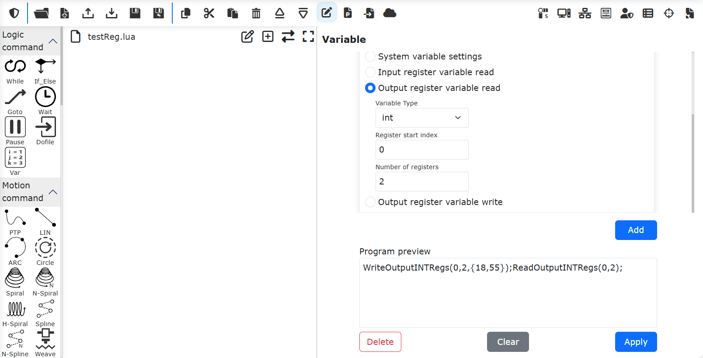
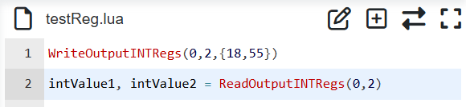

Rejestry wejściowe i wyjściowe robota
=====================================

Klient CNDE i robot mogą wymieniać dane za pośrednictwem rejestrów wejściowych i wyjściowych. Obejmuje to dwa procesy:

① Konfiguracja wejść klienta CNDE zawiera rejestry wejściowe. Podczas wprowadzania danych modyfikowane są wartości rejestrów wejściowych. W programie LUA robota dodaje się instrukcję odczytu rejestrów wejściowych. Wykonanie programu LUA pozwala odczytać wartości rejestrów wejściowych zmodyfikowane przez klienta CNDE.

② W programie LUA robota dodaje się instrukcję zapisu rejestrów wyjściowych. Wykonanie programu LUA zapisuje wartości do rejestrów wyjściowych. Konfiguracja wyjść klienta CNDE zawiera rejestry wyjściowe. Po uruchomieniu informacji zwrotnej o stanie CNDE robota, klient odbiera dane wyjściowe CNDE i może odczytać wartości rejestrów wyjściowych zapisane w programie LUA.

Odczyt rejestrów wejściowych
~~~~~~~~~~~~~~~~~~~~~~~~~~~~

Otwórz WebApp, kolejno kliknij „Program nauczania”, „Programowanie”, utwórz nowy program użytkownika „testReg.lua”.

.. image:: cnde/012.png
   :width: 6in
   :align: center

.. centered:: Wykres 4-1 Utworzenie programu „testReg.lua”

Kliknij „Zmienne”, w prawym oknie dodawania instrukcji wybierz „Odczyt zmiennej rejestru wejściowego”. Wybierz typ zmiennej jako „int”, indeks początkowy rejestru 0, liczba rejestrów 3. Kliknij przycisk „Dodaj” i „Zastosuj”.

.. image:: cnde/013.png
   :width: 6in
   :align: center

.. centered:: Wykres 4-2 Dodanie instrukcji odczytu rejestrów wejściowych

W tym momencie do programu „testReg.lua” została dodana instrukcja odczytu rejestrów wejściowych typu „int”.

.. image:: cnde/014.png
   :width: 6in
   :align: center

.. centered:: Wykres 4-3 Dodanie instrukcji odczytu rejestrów wejściowych typu „int”

Kliknij przycisk przełączania trybu, przełącz się do trybu edycji programu. Przed instrukcją odczytu rejestrów wejściowych dodaj trzy zmienne programu lua, które posłużą do odczytania trzech wartości rejestrów wejściowych.

.. image:: cnde/015.png
   :width: 6in
   :align: center

.. centered:: Wykres 4-4 Dodanie odczytu wartości rejestrów wejściowych

W ten sam sposób można dodać odczyt danych rejestrów typu „bit” i „double”.

.. image:: cnde/016.png
   :width: 6in
   :align: center

.. centered:: Wykres 4-5 Dodanie odczytu rejestrów wejściowych typu „bit” i „double”

Zapisz powyższy program i przełącz robota w tryb automatyczny. Wykonaj program. Wartości rejestrów wejściowych zostaną odczytane do zmiennych programu lua.

Zapis rejestrów wyjściowych
~~~~~~~~~~~~~~~~~~~~~~~~~~~

Otwórz WebApp, kolejno kliknij „Program nauczania”, „Programowanie”, utwórz nowy program użytkownika „testReg.lua”.

.. image:: cnde/017.png
   :width: 6in
   :align: center

.. centered:: Wykres 4-6 Utworzenie programu „testReg.lua”

Kliknij „Zmienne”, w prawym oknie dodawania instrukcji wybierz „Zapis zmiennej rejestru wyjściowego”. Wybierz typ zmiennej jako „int”, indeks początkowy rejestru 0, liczba rejestrów 2, wartość rejestru „18,55”. Kliknij przycisk „Dodaj”. Następnie ponownie wybierz „Odczyt zmiennej rejestru wyjściowego”, wybierz typ zmiennej jako „int”, indeks początkowy rejestru 0, liczba rejestrów 2. Kliknij „Dodaj” i „Zastosuj”.

.. centered:: Wykres 4-7 Dodanie instrukcji zapisu i odczytu rejestrów wyjściowych

W tym momencie do programu „testReg.lua” zostały dodane instrukcje zapisu i odczytu rejestrów wyjściowych typu „int”.

.. image:: cnde/019.png
   :width: 6in
   :align: center

.. centered:: Wykres 4-8 Dodanie instrukcji zapisu i odczytu rejestrów wyjściowych typu „int”

Kliknij przycisk przełączania trybu, przełącz się do trybu edycji programu. Przed instrukcją odczytu rejestrów wyjściowych dodaj dwie zmienne programu lua, które posłużą do odczytania dwóch wartości rejestrów wyjściowych.

.. centered:: Wykres 4-9 Dodanie odczytu wartości rejestrów wejściowych

Zapisz powyższy program i przełącz robota w tryb automatyczny. Wykonaj program. W tym momencie zmienne programu LUA „intValue1” i „intValue2” będą miały odpowiednio wartości 18 i 55. Operacje na rejestrach typu „bit” i „double” są takie same jak na rejestrach typu „int”.

Interaktywna aplikacja rejestrów wejściowych i wyjściowych CNDE
~~~~~~~~~~~~~~~~~~~~~~~~~~~~~~~~~~~~~~~~~~~~~~~~~~~~~~~~~~~~~~~~

.. image:: cnde/021.png
   :width: 4in
   :align: center

.. centered:: Wykres 4-10 Wymiana danych w rejestrach wejściowych i wyjściowych

Scenariusze wymiany danych między robotem a klientem CNDE za pośrednictwem rejestrów wejściowych i wyjściowych obejmują między innymi następujące typy:

① Sterowanie ruchem robota za pomocą rejestrów wejściowych: Klient CNDE planuje docelową pozycję robota i zapisuje ją do rejestrów wejściowych. W programie LUA robota odczytywane są wartości rejestrów wejściowych w celu uzyskania docelowej pozycji robota, a następnie za pomocą instrukcji ruchu, takich jak PTP, LIN, ServoJ, robot jest sterowany tak, aby przemiescił się do docelowej pozycji. Przykładowy program LUA jest następujący:

.. code-block:: lua
    :linenos:

    i = 0;
    oldFlag = 0
    while(1) do
        startFlag = ReadInputINTRegs(0,1)
        if(startFlag ~= oldFlag) then
        oldFlag = startFlag
        x, y, z, a, b, c = ReadInputDBLRegs(0,6)
        ServoJ({x, y, z, a, b, c}, {0, 0, 0, 0}, 10, 10, 0.008, 0, 0)
        end	
    end

② Sterowanie działaniami robota za pomocą rejestrów wejściowych: Klient CNDE zapisuje różne wartości do określonego rejestru wejściowego, aby sterować robotem w wykonywaniu różnych działań. Program LUA robota w pętli pobiera wartość odpowiedniego rejestru wejściowego i wykonuje różne działania w zależności od jego wartości. Przykładowy program jest następujący:

.. code-block:: lua
    :linenos:

    runFlag = ReadInputINTRegs(0,1)
    while(runFlag > 0) do
        motion,target = ReadInputINTRegs(1,2)
        if(motion > 0) then
            if(target == 1)then 
                Lin(a1,100,-1,0,0)
            else if(target == 2) then
                Lin(a2,100,-1,0,0)
            else
                Lin(safety,100,-1,0,0)
            end
            end
        else
            sleep_ms(100)
        end
    end

③ Podczas pracy robot zapisuje bieżący stan programu do rejestrów wyjściowych. Klient CNDE odczytuje stan rejestrów wyjściowych, aby monitorować działanie programu robota. Przykładowy program jest następujący:

.. code-block:: lua
    :linenos:

    local weldCount = 0
    runFlag = ReadInputINTRegs(0,1)
    while(runFlag > 0) do
        Lin(safety,100,-1,0,0)
        Lin(a1,100,-1,0,0)
        ARCStart(0, 0, 3000)
        Lin(a2,100,-1,0,0)
        ARCEnd(0, 0, 3000)
        runFlag = ReadInputINTRegs(0,1)
        weldCount = weldCount + 1
        WriteOutputINTRegs(0,1,{weldCount})
    end