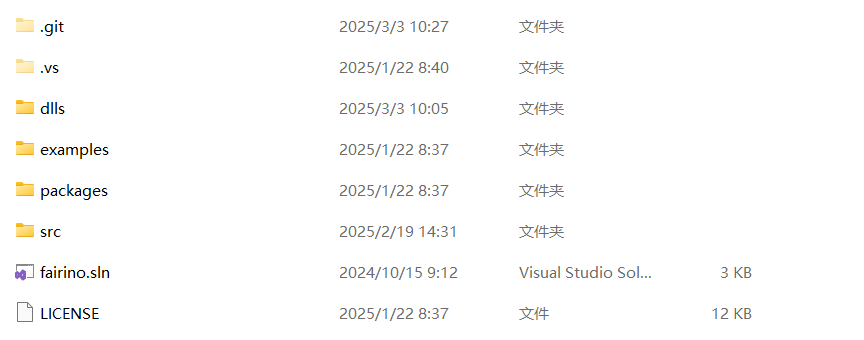

Dodatek
=======

.. toctree:: 
    :maxdepth: 5

Pobieranie kodu źródłowego
------------------------------------------------
W dokumentacji FAIRINO (https://fairino-doc-pl.readthedocs.io/latest/) znajdź moduł „Pobieranie materiałów”, kliknij przycisk „C# SDK”, a na stronie po prawej stronie kliknij „FAIRINO C# SDK” i poczekaj na zakończenie pobierania przez przeglądarkę.

.. image:: image/001.png
   :width: 6in
   :align: center

.. centered:: Wykres 15.1‑1 Pobieranie kodu źródłowego C# SDK

Pobierz i rozpakuj C# SDK. Katalog projektu pokazano na poniższym rysunku. Folder examples zawiera przykłady testowe, folder src to C# SDK, plik Fairino.sln to rozwiązanie projektu. Folder Dlls to pliki bibliotek.

.. centered:: Wykres 15.1‑2 Przykład struktury plików C# SDK

Znajdź plik rozwiązania o nazwie fairino.sln, kliknij go dwukrotnie, aby otworzyć. Struktura plików jest pokazana na poniższym rysunku.

.. image:: image/011.png
   :width: 6in
   :align: center

.. centered:: Wykres 15.1‑3 Przykład struktury plików projektu w Visual Studio 2022

Kompilacja kodu źródłowego na platformie Windows
-------------------------------------------------

Kompilacja C# SDK
~~~~~~~~~~~~~~~~~~~~~~~~~~~~~~~~~~~~~~~~~~~~
Kliknij projekt FRRobot prawym przyciskiem myszy, wybierz Właściwości, a następnie wybierz wersję frameworka .NET.

.. image:: image/012.png
   :width: 6in
   :align: center

.. centered:: Wykres 15.2‑1 Ustawianie właściwości

.. image:: image/013.png
   :width: 6in
   :align: center

.. centered:: Wykres 15.2‑2 Wybór frameworka .NET

.. image:: image/014.png
   :width: 6in
   :align: center

.. centered:: Wykres 15.2‑3 Generowanie projektu FRRobot w trybie Release

Przełącz Visual Studio 2022 w tryb Release, wygeneruj ponownie projekt FRRobot. W pliku \bin\Release zostanie wygenerowana biblioteka dołączana dynamicznie dll.

.. image:: image/015.png
   :width: 6in
   :align: center

.. centered:: Wykres 15.2‑4 Ustawianie trybu Release

.. image:: image/016.png
   :width: 6in
   :align: center

.. centered:: Wykres 15.2‑5 Ponowne generowanie projektu FRRobot w trybie Release

.. image:: image/016.png
   :width: 6in
   :align: center

.. centered:: Wykres 15.2‑6 Generowanie biblioteki dołączanej dynamicznie dll

Użycie C# SDK
~~~~~~~~~~~~~~~~~~~~~~~~~~~~~~~~~~~~~~~~~~~~~
Kliknij prawym przyciskiem myszy projekt testFrRobot i wybierz go jako projekt startowy.

.. image:: image/017.png
   :width: 6in
   :align: center

.. centered:: Wykres 15.2‑7 Ustawianie jako projektu startowego

Interfejs testowy C# SDK pokazano na poniższym rysunku.

.. image:: image/018.png
   :width: 6in
   :align: center

.. centered:: Wykres 15.2‑8 Interfejs testowy C# SDK

Uwagi
-------

Potencjalne problemy
~~~~~~~~~~~~~~~~~~~~~~~~~~~~~~~~~~~~~~~~~~~~~~~~~~

Brak efektu po aktualizacji kodu
+++++++++++++++++++++++++++++++++++++++++++++++++++++++++++
Jeśli po próbie przepisania kodu i ponownym uruchomieniu projektu okaże się, że projekt nadal wykonuje stary kod, należy rozważyć następujące kroki:

Ponowne wygenerowanie projektu: Zgodnie z instrukcjami w punkcie 3.2, wygeneruj ponownie lub zaktualizuj konfigurację projektu i pliki.

Kody błędów
+++++++++++++++++++++++++++++++++++++++++++++++++++++++++++
Gdy wartość zwracana wynosi 0, oznacza to normalne działanie. Jeśli wartość zwracana jest różna od 0, należy sprawdzić tabelę kodów błędów.