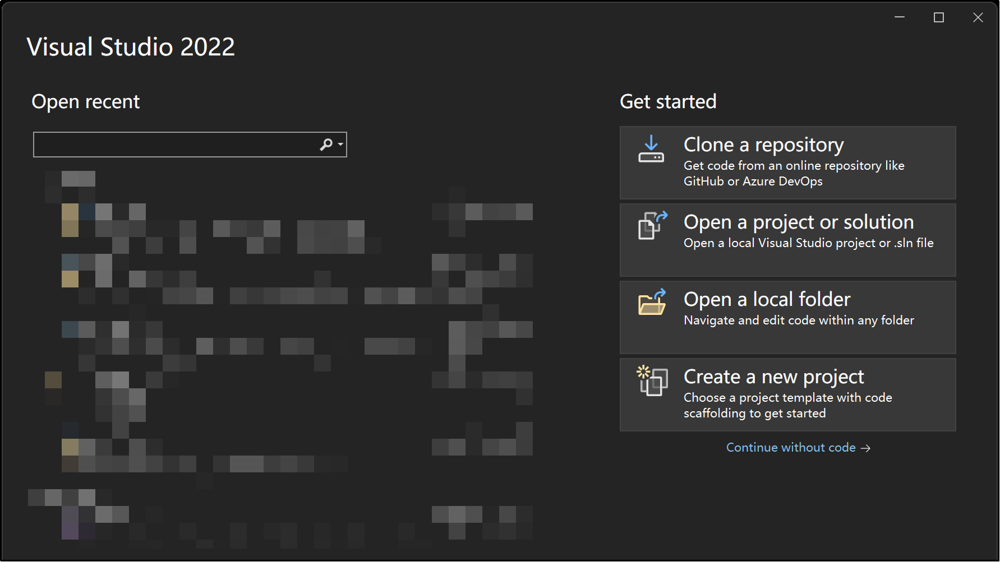
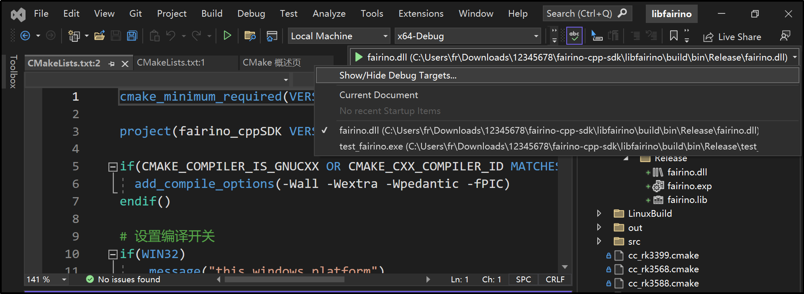

Dodatek
=======

.. toctree:: 
    :maxdepth: 5

Pobieranie kodu źródłowego
------------------------------------------------

W dokumentacji FAIRINO (https://fairino-doc-pl.readthedocs.io/latest/) znajdź moduł „Pobieranie materiałów”, kliknij przycisk „CPP SDK”, a na stronie po prawej stronie kliknij „FAIRINO CPP SDK” i poczekaj na zakończenie pobierania przez przeglądarkę.

.. image:: image/001.png
   :width: 6in
   :align: center

.. centered:: Wykres 15.1‑1 Pobieranie kodu źródłowego C++ SDK

Rozpakuj archiwum. Katalog plików punktów do pobrania jest pokazany na rysunku, gdzie:

- windows: Pliki nagłówkowe i biblioteczne (.lib i .dll) skompilowane dla popularnych środowisk, takich jak VS2015~VS2019, zawierające tryby Debug i Release.
- linux: Pliki nagłówkowe i biblioteczne (.so) dla popularnych środowisk, takich jak gcc, rk3399, rk3568.
- libfairino: Kod źródłowy C++ SDK.

.. image:: image/002.png
   :width: 4in
   :align: center

.. centered:: Wykres 15.1‑2 Katalog kodu źródłowego C++ SDK

Kompilacja kodu źródłowego na platformie Windows
------------------------------------------------
① Otwórz Visual Studio i kliknij „Kontynuuj bez kodu (W)” w prawym dolnym rogu.

.. centered:: Wykres 15.2‑1 Otwieranie Visual Studio

② Kolejno kliknij „Plik”, „Otwórz”, „CMake (M)”. Pojawi się okno wyboru pliku. Wybierz plik „\libfairino\CMakeLists.txt” w pobranym kodzie źródłowym C++ SDK. Visual Studio automatycznie załaduje projekt zgodnie z definicjami w CMakeLists.txt.

.. image:: image/004.png
   :width: 6in
   :align: center

.. centered:: Wykres 15.2‑2 Otwieranie projektu Cmake

③ W zależności od potrzeb wybierz platformę kompilacji, np. „x64-Debug” lub „x64-Release”. Wybierz element startowy jako „fairino.dll”.

.. centered:: Wykres 15.2‑3 Wybór elementu startowego

④ W pasku menu kolejno kliknij „Generuj”, „Regeneruj fairino.dll”. Kompilator automatycznie rozpocznie kompilację.

.. image:: image/006.png
   :width: 6in
   :align: center

.. centered:: Wykres 15.2‑4 Generowanie fairino.dll

⑤ W katalogu projektu po prawej stronie znajdź folder „build”, a w nim pliki fairino.dll i fairino.lib uzyskane w wyniku kompilacji.

.. image:: image/007.png
   :width: 6in
   :align: center

.. centered:: Wykres 15.2‑5 Lokalizacja plików fairino.lib i fairino.dll

⑥ Podczas korzystania z C++ SDK robota współpracującego, najpierw w katalogu projektu po prawej stronie znajdź pliki nagłówkowe skompilowanego SDK robota w folderze /libfairino/src/include/Robot-CN/. Skopiuj trzy pliki nagłówkowe „robot.h”, „robot_error.h”, „robot_type.h” z tego folderu do katalogu projektu. Dodaj fairino.lib do bibliotek linkera, a na koniec umieść fairino.dll w katalogu pliku wykonywalnego, aby móc z niego korzystać.

Kompilacja kodu źródłowego na platformie Linux
------------------------------------------------

Przed kompilacją kodu źródłowego na Linuxie upewnij się, że w systemie zainstalowane są kompilatory gcc, g++ oraz system budowania cmake (wersja 3.10 lub nowsza).

W katalogu \libfairino\linuxBuild\ w kodzie źródłowym C++ skrypt „buildGcc.sh” zawiera polecenia takie jak „cmake..”, „make” oraz kopiowanie końcowych plików nagłówkowych i bibliotecznych do folderu \linuxBuild\. Wykonanie tego skryptu kończy kompilację kodu źródłowego C++ SDK.

① Otwórz terminal, przejdź do katalogu \libfairino\linuxBuild\ i wprowadź polecenie: „sh buildGcc.sh”, a następnie naciśnij Enter. SDK rozpocznie kompilację. Poczekaj na zakończenie kompilacji.

.. image:: image/008.png
   :width: 6in
   :align: center

.. centered:: Wykres 15.3‑1 Wprowadzanie polecenia skryptu kompilacji

② Po zakończeniu kompilacji wejdź ponownie do katalogu \libfairino\linuxBuild\. Znajdź foldery \include\ i \lib\, które są odpowiednio katalogami wymaganych plików nagłówkowych i bibliotecznych.

.. image:: image/009.png
   :width: 6in
   :align: center

.. centered:: Wykres 15.3‑2 Wynik kompilacji