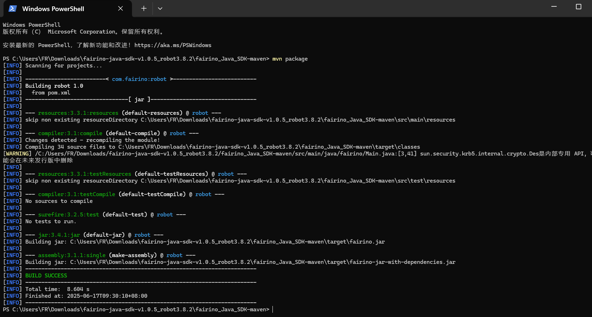

Dodatek
=================

.. toctree::
    :maxdepth: 5

Pobieranie kodu źródłowego
------------------------------------------------

W dokumentacji FANUC (https://fairino-doc-pl.readthedocs.io/latest/) znajdź moduł „Pobieranie materiałów”, kliknij przycisk „Java SDK”, a na stronie po prawej stronie kliknij „FAIRINOJavaSDK” i poczekaj, aż przeglądarka zakończy pobieranie.

.. image:: image/019.png
   :width: 6in
   :align: center

.. centered:: Schemat 16.1‑1 Pobieranie kodu źródłowego Java SDK

Rozpakuj archiwum. Katalog plików jest pokazany na rysunku, gdzie:

fairino_Java_SDK_maven: Kod źródłowy (.java) i pliki bibliotek (.jar) skompilowane dla kompilatora w środowisku Windows;

.. image:: image/020.png
   :width: 4in
   :align: center

.. centered:: Schemat 16.1‑2 Katalog plików Java SDK

Wejdź do folderu fairino_Java_SDK_maven. Zawiera on katalogi pokazane na rysunku, gdzie:

- lib: Pakiety jar zależności używane w kodzie źródłowym;
- src: Pliki kodu źródłowego Java SDK;
- target: Pliki bibliotek (.jar) wygenerowane z kodu źródłowego Java SDK;

.. image:: image/021.png
   :width: 6in
   :align: center

.. centered:: Schemat 16.1‑3 Katalogi kodu źródłowego i plików bibliotek Java SDK

Kompilacja kodu źródłowego na platformie Windows
-------------------------------------------------------------
① Instalacja i konfiguracja narzędzia do budowania — Maven

Strona pobierania i instalacji Maven: Welcome to Apache Maven – Maven

Po instalacji i konfiguracji, jak pokazano poniżej, wpisanie w terminalu mvn --version powinno wyświetlić następujące informacje

.. image:: image/022.png
   :width: 6in
   :align: center

.. centered:: Schemat 16.2‑1 Instalacja i konfiguracja Maven

② Otwórz terminal w katalogu kodu źródłowego Java SDK i wpisz mvn package, aby wygenerować pliki bibliotek (.jar),

.. centered:: Schemat 16.2‑2 Kompilacja Java SDK do pliku biblioteki

③ Znajdź folder „target” w katalogu kodu źródłowego, a w nim pliki fairino-jar-with-dependencies.jar i fairino.jar uzyskane w wyniku kompilacji, jak pokazano na rysunku

.. image:: image/024.png
   :width: 6in
   :align: center

.. centered:: Schemat 16.2‑3 Wygenerowane pliki jar

④ Podczas korzystania z Java SDK robota współpracującego, w projekcie IDEA kolejno kliknij File -> Project Structure -> Libraries, dodaj plik .jar wygenerowany w poprzednim kroku, a następnie użyj import fairino.*; w pliku, aby korzystać z wygenerowanego pliku .jar.