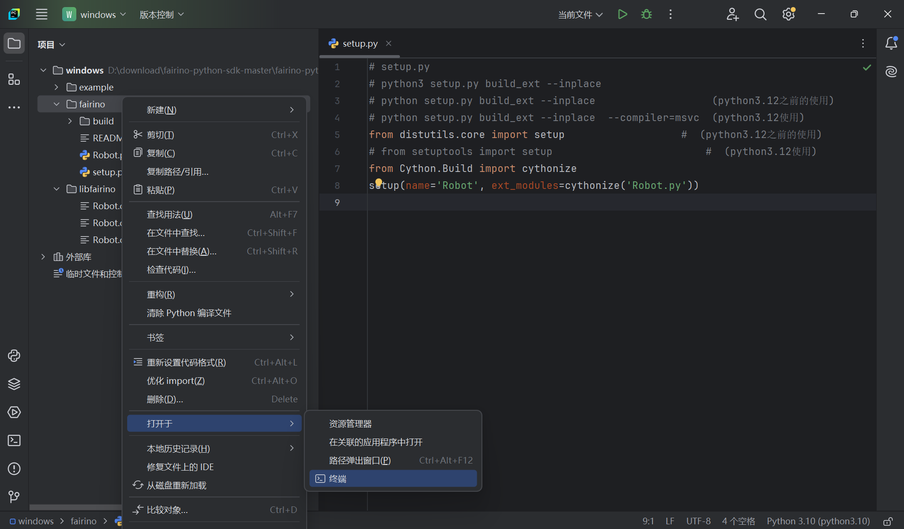
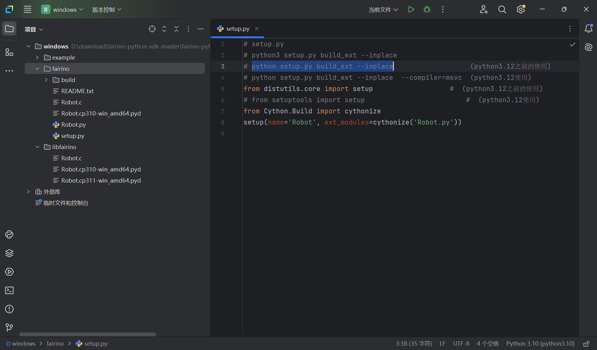
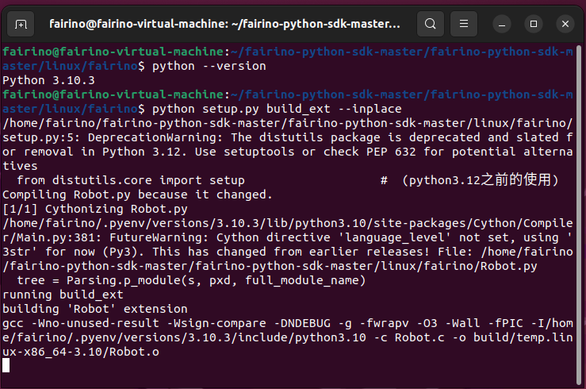

Dodatek
=================

.. toctree:: 
    :maxdepth: 5

Pobieranie kodu źródłowego
------------------------------------------------

W dokumentacji FAIRINO (https://fairino-doc-pl.readthedocs.io/latest/) znajdź moduł „Pobieranie materiałów”, kliknij przycisk „Python SDK”, a na stronie po prawej stronie kliknij „FAIRINO Python SDK” i poczekaj, aż przeglądarka zakończy pobieranie.

.. image:: image/025.png
   :width: 6in
   :align: center

.. centered:: Schemat 16.1‑1 Pobieranie kodu źródłowego Python SDK

Pobierz i rozpakuj Python SDK. Struktura katalogu projektu jest pokazana na poniższym rysunku. Folder windows zawiera Python SDK dla systemu Windows; folder linux zawiera Python SDK dla systemu Linux.

.. image:: image/026.png
   :width: 6in
   :align: center

.. centered:: Schemat 16.1‑2 Przykładowa struktura plików Python SDK

Na przykładzie systemu Windows, otwórz folder windows. Struktura katalogu jest pokazana poniżej. Katalog example zawiera przykłady testowe, katalog fairino zawiera kod źródłowy Python SDK, a libfairino to pliki biblioteczne.

.. image:: image/027.png
   :width: 6in
   :align: center

.. centered:: Schemat 16.1‑3 Przykładowa struktura plików Python SDK dla systemu Windows

Otwórz folder windows za pomocą oprogramowania Pycharm. Struktura jest pokazana poniżej.

.. image:: image/028.png
   :width: 4in
   :align: center

.. centered:: Schemat 16.1‑4 Przykładowa struktura plików projektu w Pycharm
 
Kompilacja kodu źródłowego
----------------------------------------
Generowanie biblioteki dynamicznej Python zależy od typu systemu i wersji Python. Na przykład w platformie Windows generowane pliki biblioteczne mają rozszerzenie „.pyd”, a w platformie Linux rozszerzenie „.so”. Ponadto biblioteki dynamiczne wygenerowane dla różnych wersji Pythona nie mogą być używane zamiennie. Dlatego przed wygenerowaniem biblioteki dynamicznej należy określić wersję Pythona i platformę docelową. Niniejszy podręcznik opisuje kompilację dla wersji python3.10, windows11 i ubuntu22.04.

Kompilacja Python SDK dla platformy Windows
~~~~~~~~~~~~~~~~~~~~~~~~~~~~~~~~~~~~~~~~~~~~~~~~~~~~~~~~~~~~~~~~~~~~~~~~
Najpierw otwórz pobrany plik Python SDK za pomocą Pycharm i otwórz plik setup.py;

.. image:: image/029.png
   :width: 6in
   :align: center

.. centered:: Schemat 16.2‑1 Otwieranie pliku projektu

Następnie kliknij w prawym dolnym rogu, aby wybrać interpreter Pythona. W tym przypadku używamy python3.10 jako przykładu;

.. image:: image/030.png
   :width: 6in
   :align: center

.. centered:: Schemat 16.2‑2 Wybór wersji Pythona
 
Kliknij prawym przyciskiem myszy folder fairino, kliknij „Otwórz w”, a następnie kliknij „Terminal”;

.. centered:: Schemat 16.2‑3 Otwieranie terminala

Następnie w interfejsie terminala wpisz „python setup.py build_ext --inplace” i naciśnij „Enter”, aby wygenerować bibliotekę dynamiczną Python SDK;

.. image:: image/032.png
   :width: 6in
   :align: center

.. centered:: Schemat 16.2‑4 Uruchamianie polecenia generowania biblioteki dynamicznej

Po zakończeniu generowania biblioteki dynamicznej w folderze fairino zostaną wygenerowane pliki Robot.c i Robot.cp310-win_amd64.pyd. Robot.c to plik wynikowy konwersji Robot.py na język C; Robot.cp310-win_amd64.pyd to biblioteka dynamiczna Python SDK, gdzie „cp310” oznacza przystosowanie do wersji python3.10, a „win_amd64” oznacza przystosowanie do platformy Windows.

.. centered:: Schemat 16.2‑5 Generowanie biblioteki dynamicznej .pyd
 
Kompilacja Python SDK dla platformy Linux
~~~~~~~~~~~~~~~~~~~~~~~~~~~~~~~~~~~~~~~~~~~~~~~~~~~~~~~~~~~~~~~
Najpierw sprawdź wersję Pythona. W tym podręczniku używamy narzędzia pyenv do zarządzania wersjami Pythona w systemie Linux. Uruchom polecenie „pyenv versions”, aby sprawdzić bieżącą wersję Pythona;

.. image:: image/034.png
   :width: 6in
   :align: center

.. centered:: Schemat 16.2‑6 Sprawdzanie wersji Pythona

Następnie przełącz się na docelową wersję Pythona. W przykładzie python3.10 uruchom polecenie „pyenv global 3.10.3”, aby przełączyć się na wersję python3.10;

.. image:: image/035.png
   :width: 6in
   :align: center

.. centered:: Schemat 16.2‑7 Wybór wersji Pythona

Przełącz się do katalogu na tym samym poziomie co plik Robot.py, uruchamiając polecenie „cd /home/fairino/fairino-python-sdk-master/fairino-python-sdk-master/linux/fairino”, aby przejść do katalogu Robot.py.

.. image:: image/036.png
   :width: 6in
   :align: center

.. centered:: Schemat 16.2‑8 Przełączanie do katalogu na tym samym poziomie co plik Robot.py

Potwierdź wersję Pythona, uruchamiając polecenie „python --version”, aby sprawdzić bieżącą wersję Pythona;

.. image:: image/037.png
   :width: 6in
   :align: center

.. centered:: Schemat 16.2‑9 Sprawdzanie wersji Pythona
 
W interfejsie terminala wpisz „python setup.py build_ext --inplace” i naciśnij „Enter”, aby wygenerować bibliotekę dynamiczną Python SDK;

.. centered:: Schemat 16.2‑10 Uruchamianie polecenia generowania biblioteki dynamicznej

Po zakończeniu generowania biblioteki dynamicznej w folderze fairino zostaną wygenerowane pliki Robot.c i Robot.cpython-310-x86_64-linux-gnu.so. Robot.c to plik wynikowy konwersji Robot.py na język C; „Robot.cpython-310-x86_64-linux-gnu.so” to biblioteka dynamiczna Python SDK, gdzie „python-310” oznacza przystosowanie do wersji python3.10, a „linux-gnu” oznacza przystosowanie do platformy Linux.

.. image:: image/039.png
   :width: 6in
   :align: center

.. centered:: Schemat 16.2‑11 Generowanie biblioteki dynamicznej .so

Uwagi
----------------------------------

Potencjalne problemy
~~~~~~~~~~~~~~~~~~~~~~~~~~~~~~~~~~~~~~~~

Zgodność wersji
++++++++++++++++++++++++++++++
Biblioteka dynamiczna Pythona zależy od środowiska generowania i wersji Pythona. Dlatego podczas korzystania z biblioteki dynamicznej Pythona należy sprawdzić, czy biblioteka dynamiczna jest zgodna z typem systemu i czy biblioteka dynamiczna jest zgodna z wersją Pythona.

Kody błędów
++++++++++++++++++++++++++++++
Gdy wartość zwracana wynosi 0, oznacza to, że działanie jest prawidłowe. Jeśli wartość zwracana jest różna od 0, należy sprawdzić tabelę kodów błędów.