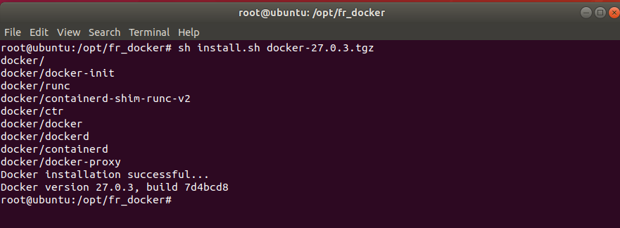
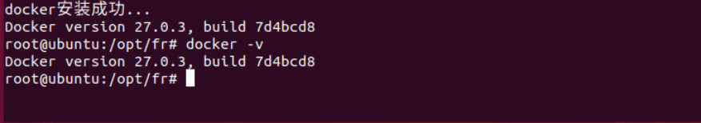
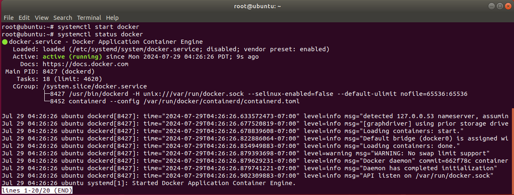
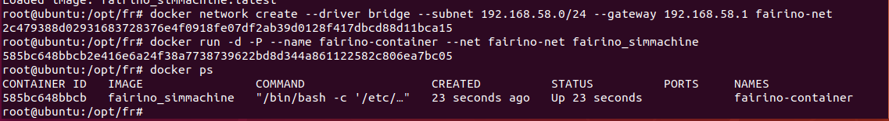

Maszyna wirtualna - Docker
===========================

Wdrażanie obrazu docker w systemie Linux
-----------------------------------------

Środowisko operacyjne
~~~~~~~~~~~~~~~~~~~~~

System środowiska uruchomieniowego maszyny wirtualnej: Ubuntu 18.04.6;

Środowisko uruchomieniowe maszyny wirtualnej: RAM 4G, ROM 50G, 6-rdzeniowy procesor;

Uprawnienia operacyjne: użycie uprawnień super administratora root, metoda ustawiania opisana w załączniku 3;

Plik instalacyjny docker: fr_docker.tar.gz;

Obraz FAIRINO SimMachine: FAIRINOSimMachine.tar;

Instalacja docker
~~~~~~~~~~~~~~~~~

Jeśli użytkownik zainstalował już docker, należy pominąć tę sekcję i przejść do punktu 1.3 Wdrażanie obrazu.

1. Pobierz plik fr_docker.tar.gz i umieść go w ścieżce pliku Ubuntu /opt/.

2. Rozpakuj plik fr_docker.tar.gz. Na przykładzie katalogu /opt/:

.. code-block:: console
   :linenos:

   cd /opt/ && tar -zxvf fr_docker.tar.gz

.. image:: controller_virtual_machine/036.png
   :width: 6in
   :align: center

3. Wykonaj skrypt instalacyjny docker:

.. code-block:: console
   :linenos:

   sh install.sh docker-27.0.3.tgz

Po wykonaniu skryptu, jeśli pojawi się numer wersji, oznacza to, że instalacja się powiodła.

Konfiguracja obrazu
~~~~~~~~~~~~~~~~~~~

Import obrazu docker
++++++++++++++++++++

1. Pobierz obraz maszyny wirtualnej FAIRINOSimMachine.tar i rozpakuj go.

2. Sprawdź wersję docker, aby potwierdzić, że jest zainstalowany.

.. code-block:: console
   :linenos:

   docker -v

3. Importuj obraz   

.. code-block:: console
   :linenos:

   docker load -i ./FAIRINOSimMachine.tar

Pojawienie się `fairno_simmachine:latest` oznacza zakończenie importu.

.. image:: controller_virtual_machine/039.png
   :width: 6in
   :align: center  

4. Wykonaj `docker images`, aby sprawdzić, czy import się powiódł.

Tworzenie niestandardowej sieci mostkowej
++++++++++++++++++++++++++++++++++++++++++

1. Wykonaj następujące polecenie, aby utworzyć sieć mostkową o nazwie `fairino-net` z podsiecią `192.168.58.0/24`.

.. code-block:: console
   :linenos:

   docker network create --driver bridge --subnet 192.168.58.0/24 --gateway 192.168.58.1 fairino-net

2. Sprawdź sieć

.. code-block:: console
   :linenos:

   docker network ls

Istnienie sieci `fairino-net` oznacza pomyślne utworzenie.

.. image:: controller_virtual_machine/040.png
   :width: 6in
   :align: center 

Pierwsze uruchomienie kontenera docker
++++++++++++++++++++++++++++++++++++++

1. Utwórz i uruchom kontener

Użyj sieci `fairino-net` i obrazu `fairino_simmachine` do uruchomienia kontenera.

.. code-block:: console
   :linenos:

   docker run -d -P --name fairino-container --privileged -u root --net fairino-net fairino_simmachine

.. image:: controller_virtual_machine/041.png
   :width: 6in
   :align: center 

.. code-block:: console
   :linenos:

   docker ps 

Sprawdź, czy kontener został pomyślnie uruchomiony. Pojawienie się `fairino-container` oznacza pomyślne uruchomienie.

.. image:: controller_virtual_machine/042.png
   :width: 6in
   :align: center 

Obsługa wirtualnego robota przez przeglądarkę internetową
---------------------------------------------------------

Normalne uruchomienie kontenera
~~~~~~~~~~~~~~~~~~~~~~~~~~~~~~~

Ta sekcja dotyczy sytuacji, gdy kontener nie jest uruchomiony w tle z powodu ponownego uruchomienia komputera lub zamknięcia docker, a nie jest to pierwsze uruchomienie kontenera.

1. Uruchom docker:

.. code-block:: console
   :linenos:

   systemctl start docker

2. Sprawdź status docker:

.. code-block:: console
   :linenos:

   systemctl status docker

Zielony `active(running)` oznacza pomyślne uruchomienie.

3. Wykonaj `docker ps -a`, aby wyświetlić ID kontenera.

.. image:: controller_virtual_machine/044.png
   :width: 6in
   :align: center 

4. Wykonaj `docker start [ID_kontenera]`.

.. image:: controller_virtual_machine/045.png
   :width: 6in
   :align: center 

5. Po pomyślnym wykonaniu, ponownie wykonaj `docker ps`, aby sprawdzić, czy kontener jest uruchomiony.

.. image:: controller_virtual_machine/046.png
   :width: 6in
   :align: center 

Obsługa wirtualnego robota
~~~~~~~~~~~~~~~~~~~~~~~~~~

1. Upewnij się, że kontener docker jest uruchomiony.

.. code-block:: console
   :linenos:

   docker ps 

Pojawienie się `fairino-container` oznacza, że kontener jest uruchomiony.

2. Otwórz przeglądarkę i wprowadź domyślny adres IP: `192.168.58.2`, aby uzyskać dostęp do interfejsu web i obsługiwać wirtualnego robota.

.. image:: controller_virtual_machine/048.png
   :width: 6in
   :align: center 

3. Zaloguj się przy użyciu konta `admin` i hasła `123`.

.. image:: controller_virtual_machine/049.png
   :width: 6in
   :align: center 

Zmiana adresu IP przez użytkownika
~~~~~~~~~~~~~~~~~~~~~~~~~~~~~~~~~~~

.. image:: controller_virtual_machine/050.png
   :width: 6in
   :align: center 

1. Otwórz przeglądarkę, wprowadź domyślny adres IP: `192.168.58.2`, aby otworzyć stronę web.
2. Zaloguj się przy użyciu konta `admin` i hasła `123`.
3. Przejdź do „Ustawienia systemowe” → „Ustawienia ogólne” → „Ustawienia sieci”. Zmień adres IP na docelowy adres IP, maskę i bramę. Kliknij „Ustaw sieć”.
4. Otwórz terminal i zatrzymaj kontener.

   Wyświetl ID kontenera:

   .. code-block:: console
      :linenos:
      
      docker ps -a

   .. image:: controller_virtual_machine/052.png
      :width: 6in
      :align: center 

   Zatrzymaj kontener:

   .. code-block:: console
      :linenos:
   
      docker stop [ID_kontenera]

   .. image:: controller_virtual_machine/053.png
      :width: 6in
      :align: center 

5. Ponownie skonfiguruj sieć kontenera.

   Usuń poprzednią sieć:

   .. code-block:: console
      :linenos:
   
      docker network rm fairino-net

   Utwórz nową sieć:

   .. code-block:: console
      :linenos:
   
      docker network create --driver bridge --subnet [docelowy_IP/maska_podsieci] --gateway [IP_bramy] fairino-net

   Na przykład dla `192.168.56.0/24`: `docker network create --driver bridge --subnet 192.168.56.0/24 --gateway 192.168.56.1 fairino-net`

   .. image:: controller_virtual_machine/054.png
      :width: 6in
      :align: center 

6. Ponownie podłącz kontener do nowo utworzonej sieci.

   .. code-block:: console
      :linenos:

      docker network connect fairino-net [ID_kontenera]

   .. image:: controller_virtual_machine/055.png
      :width: 6in
      :align: center 

7. Uruchom ponownie kontener.

   .. code-block:: console
      :linenos:
   
      docker start [ID_kontenera]

8. W tym momencie otwórz przeglądarkę i wprowadź zmodyfikowany adres IP, aby uzyskać dostęp do interfejsu web i obsługiwać wirtualnego robota.

.. image:: controller_virtual_machine/056.png
   :width: 6in
   :align: center 

Podwyższanie i obniżanie wersji maszyny wirtualnej
---------------------------------------------------

Omówienie
~~~~~~~~~~~~~~~~~~~~~~~~~

Niniejsza instrukcja szczegółowo opisuje standardową procedurę podwyższania i obniżania wersji oprogramowania podczas korzystania z maszyny wirtualnej Docker FAIRINO SimMachine oraz systematyzuje najważniejsze kwestie, na które należy zwrócić uwagę podczas zmiany wersji.

Przygotowanie i środki ostrożności podczas podwyższania/obniżania wersji
~~~~~~~~~~~~~~~~~~~~~~~~~~~~~~~~~~~~~~~~~~~~~~~~~~~~~~~~~~~~~~~~~~~~~~~~

Przygotowanie operacji
++++++++++++++++++++++

1. Prawidłowo wdrożona i działająca maszyna wirtualna Docker FAIRINO SimMachine. Instrukcja wdrożenia znajduje się w „Instrukcji użytkownika - Wdrażanie obrazu docker w systemie Linux”.
2. Pakiet aktualizacyjny oprogramowania dla wersji Docker maszyny wirtualnej. Adres pobierania znajduje się w „Pobieranie materiałów - FAIRINO SimMachine Docker”. Po rozpakowaniu zawartość obejmuje najnowszy obraz docker `FAIRINOSimMachine.tar` oraz pakiet aktualizacyjny oprogramowania `software.tar.gz`.

Środki ostrożności
++++++++++++++++++

1. Kopia zapasowa danych: Zaleca się wykonanie kopii zapasowej przed aktualizacją. Metodę opisano w rozdziale „Kopia zapasowa danych”, aby uniknąć utraty danych spowodowanej nieprawidłową aktualizacją.
2. Ograniczenia wersji:

.. centered:: Wykres 2.3-1 Ograniczenia podwyższania i obniżania wersji

.. list-table::
   :widths: 50 50 50
   :header-rows: 0
   :align: center

   * - **Typ operacji** 
     - **Warunek / Ograniczenie**
     - **Opis kroku**

   * - **Podwyższenie wersji** 
     - Bieżąca wersja >= 3.7.8
     - Możliwe bezpośrednie podwyższenie

   * - **Podwyższenie wersji** 
     - Bieżąca wersja < 3.7.8
     - Należy najpierw podwyższyć do wersji 3.7.5 lub użyć schematu zgodności

   * - **Obniżenie wersji**
     - Bieżąca i docelowa wersja >= 3.7.8
     - Możliwe bezpośrednie obniżenie

   * - **Obniżenie wersji**
     - Bieżąca lub docelowa wersja < 3.7.8
     - Użyj schematu zgodności

   * - **Schemat zgodności**
     - Dotyczy zarówno wyjątkowych sytuacji podwyższania, jak i obniżania wersji
     - Patrz szczegółowe kroki w rozdziale „Schemat zgodności”