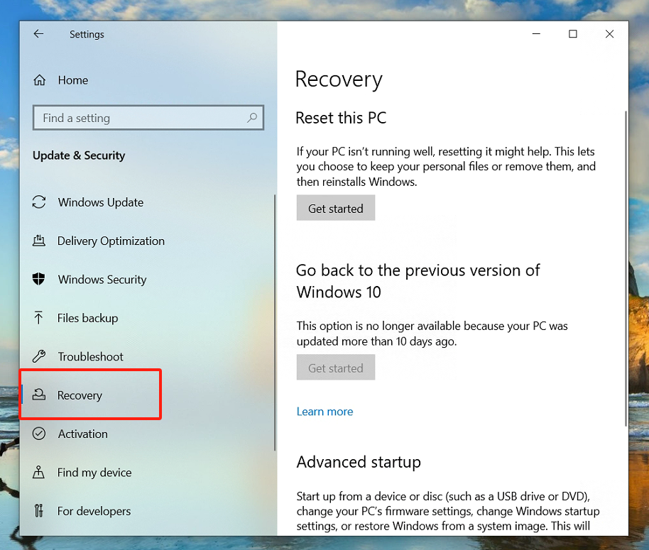
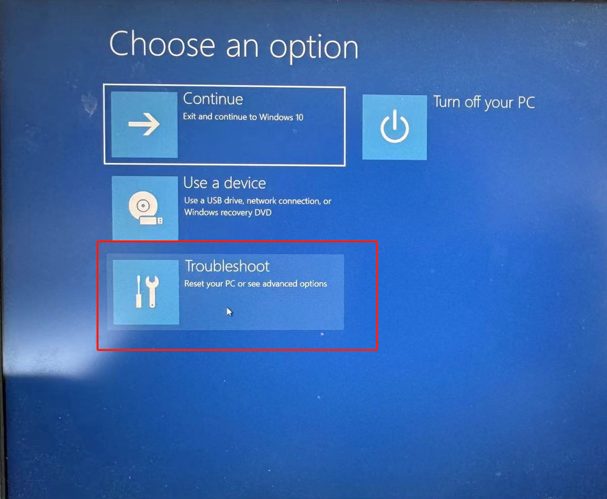
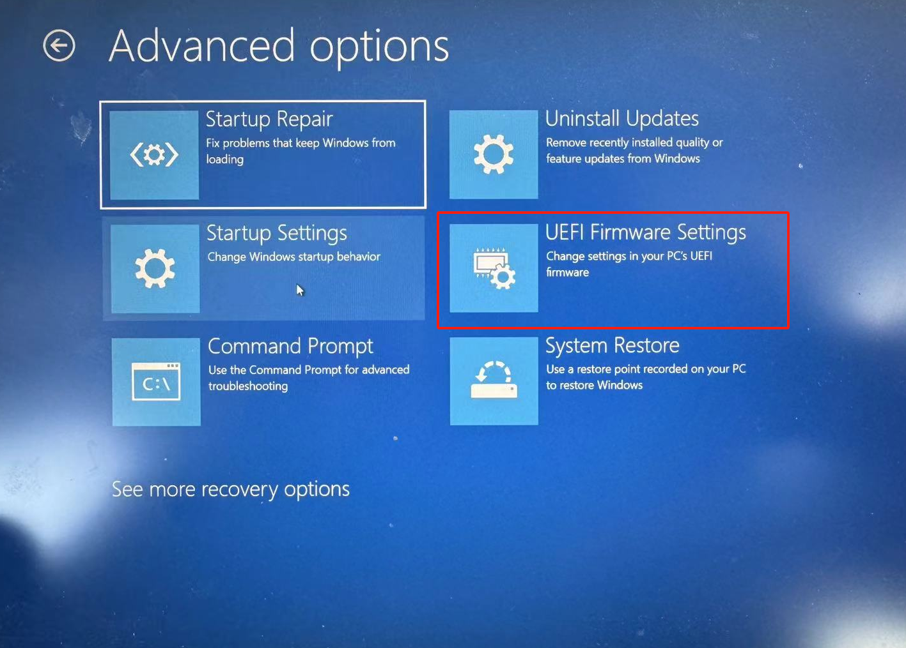
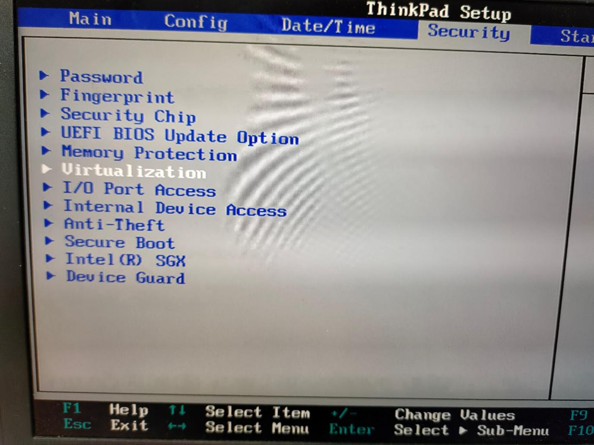
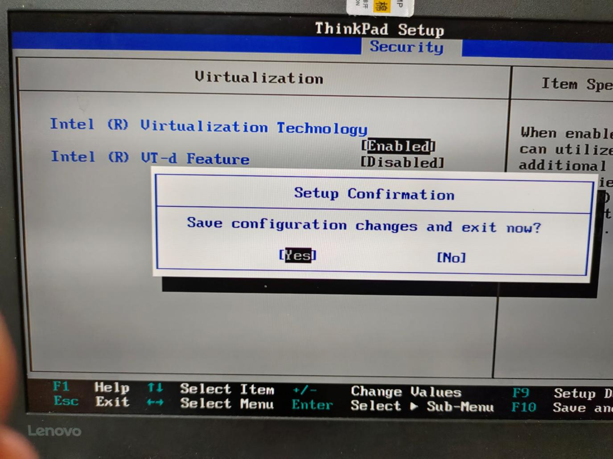
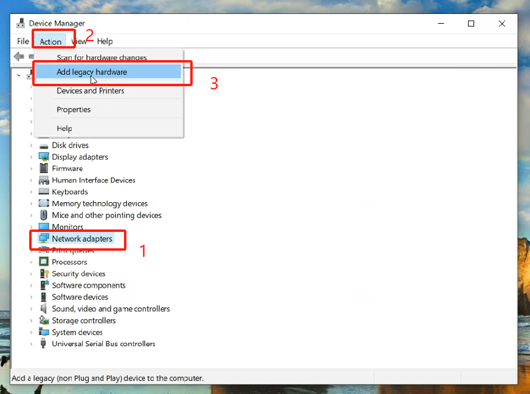
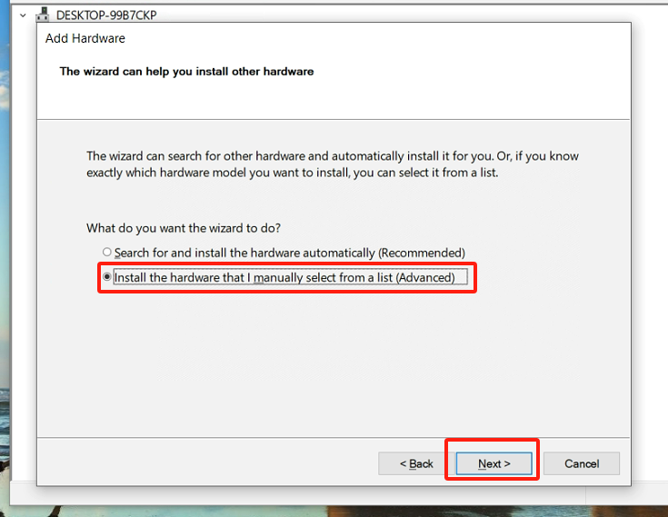
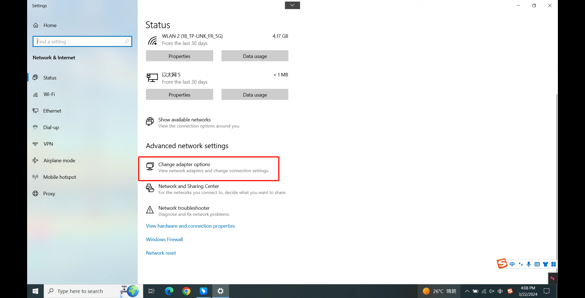
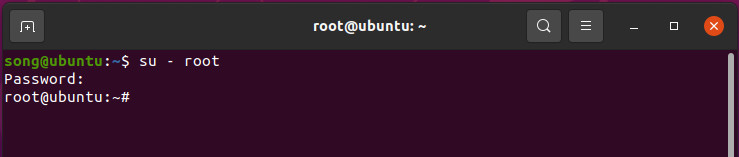

Załącznik
=========

Załącznik 1: Włączanie wirtualizacji w BIOS
-------------------------------------------

Procedura włączania wirtualizacji może się różnić w zależności od modelu komputera. Poniżej przedstawiono przykład dla serii Lenovo ThinkPad z systemem Windows 10:

- Otwórz ustawienia komputera i wybierz „Aktualizacja i zabezpieczenia”.

.. image:: controller_virtual_machine/013.png
   :width: 4in
   :align: center

.. image:: controller_virtual_machine/014.png
   :width: 4in
   :align: center

- Wybierz „Odzyskiwanie”.

- Wybierz „Uruchom ponownie teraz”.

.. image:: controller_virtual_machine/016.png
   :width: 4in
   :align: center

- Wybierz „Rozwiązywanie problemów”.

- Wybierz „Opcje zaawansowane”.

.. image:: controller_virtual_machine/018.png
   :width: 4in
   :align: center

- Wybierz „Ustawienia oprogramowania sprzętowego UEFI”.

- Wybierz „Uruchom ponownie”.

.. image:: controller_virtual_machine/020.png
   :width: 4in
   :align: center

- Wybierz „Virtualization” w sekcji „Security”.

- Wybierz „Enabled” i naciśnij „Enter”, aby potwierdzić.

.. image:: controller_virtual_machine/022.png
   :width: 4in
   :align: center

- Naciśnij „F10”, wybierz „Yes” i naciśnij „Enter”, aby zapisać zmiany.

Załącznik 2: Dodawanie wirtualnej karty sieciowej (adapter sieci pętli zwrotnej)
--------------------------------------------------------------------------------

1. Otwórz Menedżer urządzeń. Naciśnij „Windows-X” i wybierz „Menedżer urządzeń”.

.. image:: controller_virtual_machine/024.png
   :width: 4in
   :align: center

2. Dodaj adapter sieciowy.

.. image:: controller_virtual_machine/026.png
   :width: 4in
   :align: center

.. image:: controller_virtual_machine/028.png
   :width: 4in
   :align: center

.. image:: controller_virtual_machine/029.png
   :width: 4in
   :align: center

.. image:: controller_virtual_machine/030.png
   :width: 4in
   :align: center

.. image:: controller_virtual_machine/031.png
   :width: 4in
   :align: center

3. Wyświetl wirtualną kartę sieciową. Naciśnij „Windows-X” i wybierz „Połączenia sieciowe”.

.. image:: controller_virtual_machine/032.png
   :width: 4in
   :align: center

.. image:: controller_virtual_machine/034.png
   :width: 4in
   :align: center

.. image:: controller_virtual_machine/035.png
   :width: 4in
   :align: center

4. Skonfiguruj sieć adaptera pętli zwrotnej.

- Adres IP: 192.168.58.XXX (wystarczy, że znajduje się w tej samej podsieci co 192.168.58.2).
- Maska podsieci: 255.255.255.0.

.. image:: controller_virtual_machine/012.png
   :width: 6in
   :align: center

5. Otwórz konfigurację sieci Virtualbox. Wybierz nazwę karty sieciowej „Adapter sieci pętli zwrotnej” i uruchom maszynę wirtualną.

.. image:: controller_virtual_machine/013.png
   :width: 6in
   :align: center

Załącznik 3: Uprawnienia root
-----------------------------

Po zainstalowaniu Ubuntu, domyślnie użytkownik root nie może się zalogować, a hasło jest puste. Aby móc zalogować się jako użytkownik root, należy najpierw ustawić hasło dla użytkownika root.

1. Otwórz terminal, wpisz `sudo passwd root`, a następnie naciśnij Enter. Wprowadź hasło kilka razy. Wyświetli się komunikat o pomyślnym ustawieniu hasła.

.. image:: controller_virtual_machine/057.png
   :width: 6in
   :align: center

2. W terminalu kontynuuj, wpisując polecenie `su - root`, aby przełączyć użytkownika. Naciśnij Enter i wprowadź hasło.

.. warning:: Podczas wpisywania polecenia należy koniecznie wprowadzić „-”. Opcja „-” oznacza przełączenie wraz ze zmiennymi środowiskowymi. „-” jest absolutnie niezbędne.

Załącznik 4: Podstawowe polecenia docker
----------------------------------------

1. Polecenie pomocy docker:

.. code-block:: console
   :linenos:

   docker --help

2. Uruchom docker:

.. code-block:: console
   :linenos:

   systemctl start docker

3. Zatrzymaj docker:

.. code-block:: console
   :linenos:

   systemctl stop docker

4. Uruchom ponownie docker:

.. code-block:: console
   :linenos:

   systemctl restart docker

5. Ustaw docker tak, aby uruchamiał się automatycznie wraz ze startem systemu:

.. code-block:: console
   :linenos:

   systemctl enable docker

6. Sprawdź status działania docker:

.. code-block:: console
   :linenos:

   systemctl status docker
   -- Jeśli docker działa, po wpisaniu polecenia zobaczysz zielony „active”

7. Obrazy docker:

.. code-block:: console
   :linenos:

   docker images: Wyświetla listę pobranych obrazów, przegląda obrazy
   docker rmi [ID_obrazu lub nazwa]: Usuwa lokalny obraz
   docker rmi -f [ID_obrazu lub nazwa]: Wymusza usunięcie obrazu
   docker build: Buduje obraz
   docker search [ID_obrazu lub nazwa]: Wyszukuje obrazy w repozytorium Docker Hub
   docker pull [ID_obrazu lub nazwa]: Pobiera obraz z repozytorium
   docker images: Wyświetla listę pobranych obrazów, przegląda obrazy
   docker rmi [ID_obrazu lub nazwa]: Usuwa lokalny obraz
   docker rmi -f [ID_obrazu lub nazwa]: Wymusza usunięcie obrazu
   docker build: Buduje obraz

8. Kontenery docker:

.. code-block:: console
   :linenos:

   docker ps: Wyświetla listę uruchomionych kontenerów
   docker ps -a: Wyświetla wszystkie kontenery, w tym nieuruchomione
   docker stop [ID_kontenera lub nazwa]: Zatrzymuje kontener
   docker kill [ID_kontenera]: Wymusza zatrzymanie kontenera
   docker start [ID_kontenera lub nazwa]: Uruchamia zatrzymany kontener
   docker inspect [ID_kontenera]: Wyświetla wszystkie informacje o kontenerze
   docker container logs [ID_kontenera]: Wyświetla logi kontenera
   docker top [ID_kontenera]: Wyświetla procesy w kontenerze
   docker exec -it [ID_kontenera] /bin/bash: Wchodzi do kontenera
   exit: Opuszcza kontener
   docker rm [ID_kontenera lub nazwa]: Usuwa zatrzymany kontener
   docker rm -f [ID_kontenera]: Usuwa działający kontener
   docker exec -it [ID_kontenera] sh: Wchodzi do kontenera