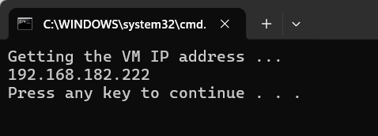

Maszyna wirtualna - VMware
===========================

Omówienie
---------
Niniejsza instrukcja ma na celu opisanie sposobu korzystania z maszyny wirtualnej FAIRINO SimMachine.

Instrukcje operacyjne
---------------------

Instalacja VMware Workstation
~~~~~~~~~~~~~~~~~~~~~~~~~~~~~

Wersja demonstracyjna VMware Workstation: 17.6.3 (pominąć ten krok, jeśli już zainstalowano).

W przeglądarce wyszukaj bezpośrednio oficjalną stronę VMware lub kliknij bezpośrednio adres URL \ `<https://www.vmware.com>`__\ . Pobierz pakiet instalacyjny i zainstaluj, wybierając domyślną ścieżkę.

.. image:: controller_virtual_machine/001.png
   :width: 6in
   :align: center

.. centered:: Wykres 6.2-1 Interfejs VMware

Otwieranie obrazu
~~~~~~~~~~~~~~~~~

1. Pobierz obraz maszyny wirtualnej FAIRINO_SimMachine.zip i rozpakuj go.

2. Otwórz VMware, kliknij File -> Open, jak pokazano na poniższym wykresie 2-2:

.. image:: controller_virtual_machine/002.png
   :width: 6in
   :align: center

.. centered:: Wykres 6.2-2 Otwieranie obrazu

3. Znajdź rozpakowany folder i wybierz plik z rozszerzeniem vmx, jak pokazano na poniższym wykresie 2-3:

.. image:: controller_virtual_machine/003.png
   :width: 6in
   :align: center

.. centered:: Wykres 6.2-3 Wybór pliku

4. Kliknij „Power on this virtual machine”, aby otworzyć maszynę wirtualną, jak pokazano na poniższym wykresie 2-4:

.. image:: controller_virtual_machine/004.png
   :width: 6in
   :align: center

.. centered:: Wykres 6.2-4 Uruchamianie maszyny wirtualnej

5. W rozpakowanym folderze znajdź plik „fr_get_vm_net” i kliknij go dwukrotnie, aby otworzyć, jak pokazano na poniższym wykresie 2-5. Wyjściowa zawartość to adres IP maszyny wirtualnej, jak pokazano na poniższym wykresie 2-6.

.. note:: W przypadku niepowodzenia pobrania, należy uzyskać adres IP w maszynie wirtualnej za pomocą polecenia „ifconfig”.
      
.. image:: controller_virtual_machine/005.png
   :width: 6in
   :align: center

.. centered:: Wykres 6.2-5 fr_get_vm_net.bat
      

.. centered:: Wykres 6.2-6 Adres IP maszyny wirtualnej

Dostęp do WebApp z systemu Windows
~~~~~~~~~~~~~~~~~~~~~~~~~~~~~~~~~~

1. Po uzyskaniu adresu IP maszyny wirtualnej, wpisz go bezpośrednio w przeglądarce systemu Windows, aby uzyskać dostęp do WebApp, na przykład: 192.168.182.222, jak pokazano na wykresie 2-7:
         
.. image:: controller_virtual_machine/007.png
   :width: 6in
   :align: center

.. centered:: Wykres 6.2-7 Dostęp do WebApp przez adres IP maszyny wirtualnej